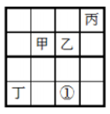
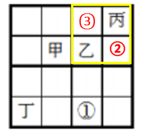
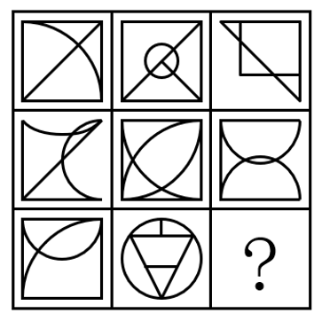
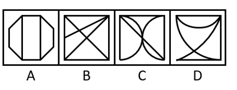
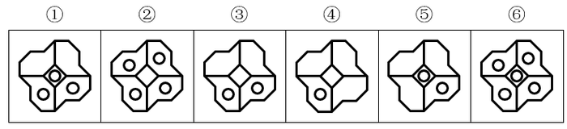

# 2016年黑龙江省公务员录用考试《行测》题（县乡卷）

> 判断推理 · 35 题 · 黑龙江 2016

## 第 1 题　qid 1796278 · 逻辑判断

近日，火星车在加勒陨坑拍摄的图像发现，火星陨坑内的远古土壤存在着类似地球土壤裂纹剖面的土壤样本，通常这样的土壤存在于南极干燥谷和智利阿塔卡马沙漠，这暗示着远古时期火星可能存在生命。
以下哪项如果为真，最能支持上述结论？

- **A**. 地球沙漠土壤中存在土块，具有多孔中空结构，硫酸盐浓度较高，这一特征在火星土壤层并不明显
- **B**. 化学物质分析显示，陨坑内土壤的化学风化过程以及粘土沉积中橄榄石矿损耗情况与地球土壤的状况较为接近
- **C**. 这些火星远古土壤样本仅表明火星早期可能曾是温暖潮湿的，那时的环境比现今更具宜居性
- **D**. 土壤裂纹剖面中的磷损耗特别引人注意，因为地球土壤也存在这种现象，这是由于微生物的活跃性所致　✅

**答案**：D

**官方解析**

第一步：找出论点和论据。
论点：远古时期火星可能存在生命。
论据：火星陨坑内的远古土壤存在着类似地球土壤裂纹剖面的土壤样本。
第二步：逐一分析选项。
A项：地球沙漠土壤与火星土壤不同，是对论据的削弱，无法加强，排除。
B项：经化学物质分析后，陨坑内土壤与地球上土壤的化学风化过程相似，与论据表意相同，是对论据的加强，保留。
C项：火星远古土壤样本情况仅表明火星早期的环境比现在宜居，但并没有明确说明当时是否存在生命，不明确选项，排除。
D项：磷在土壤裂纹剖面中有损耗，说明有微生物存在，解释了为什么看到土壤裂纹剖面就说明可能有生命，属于搭桥加强。
B、D两项都能加强，但是D项搭桥的加强力度强于重复论据的B项。
故正确答案为D。

---

## 第 2 题　qid 1796280 · 逻辑判断

酒精本身没有明显的致癌能力。但是许多流行病学调查发现，喝酒与多种癌症的发生风险正相关——也就是说，喝酒的人群中，多种癌症的发病率升高了。
以下哪项如果为真，最能支持上述发现？

- **A**. 
酒精在体内的代谢产物乙醛可以稳定地附着在DNA分子上，导致癌变或者突变
　✅
- **B**. 
东欧地区的人广泛食用甜烈性酒，该地区的食管癌发病率很高 

- **C**. 
烟草中含有多种致癌成分，其在人体内代谢物与酒精在人体内代谢物相似

- **D**. 
有科学家估计，如果美国人都戒掉烟酒，那么的消化道癌可以避免 

**答案**：A

**官方解析**

第一步：找到题干论点论据。
论点：喝酒与多种癌症发生风险正相关。
无论据。
第二步：逐一分析选项。
A选项，说明了酒精在人体内的代谢产物是可以致癌的，解释了题干中所说“酒精无致癌能力，但是饮酒的人中患癌症的几率高”，属于解释论点加强；
B选项，以东欧的人和甜烈性酒作为例子，属于举例加强，加强力度比解释论点加强要弱。并且A选项说的是酒精和人体，是普遍性的，B选项说的是东欧的人，以及甜烈性酒，都属于个例，根据整体加强力度大于局部加强力度的原则，也可排除B项；
C选项，烟草能够致癌，其在人体内代谢物与酒精的代谢物相似，属于类比加强。但是类比只是一种可能性加强，要想证明酒精的代谢物能致癌，还是要进一步分析酒精与烟草致癌机理是否一致，其实还是需要类似A项那样的解释，故不如A项明确，排除；
D选项，如果戒掉烟酒，可避免消化道癌，但不清楚到底是烟致癌还是酒致癌，还是两者在一起能致癌，所以属于不明确选项，排除。
故正确答案为A。

---

## 第 3 题　qid 1796276 · 逻辑判断

有报道称，由于人类大量排放温室气体，过去150多年中全球气温一直在持续上升。但与1970年至1998年相比，1999年至今全球表面平均气温的上升速度明显放缓，近15年来该平均气温的上升幅度不明显，因此全球变暖并不是那么严重。
如果以下各项为真，最能削弱上述论证的是？

- **A**. 海洋和气候系统的调整过程使得海洋表层热量向深海输送
- **B**. 此现象在上世纪50~70年代曾出现过，随后又开始加速变暖　✅
- **C**. 联合国气候专家指出，空气中的二氧化碳浓度处于80万年来的最高点
- **D**. 近几年发生多起因气候变暖而产生的自然灾害

**答案**：B

**官方解析**

第一步：找到论点和论据。
论点：全球变暖并不严重。
论据：与1970年至1998年相比，1999年至今全球表面平均气温的上升速度明显放缓，近15年来该平均气温的上升幅度不明显。
第二步：逐一分析选项。
A项：海洋表层热量向深海输送，解释了地球表面温度上升为什么会减缓，补充论据，为加强项，无法削弱，排除；
B项：此现象指的是全球表面平均气温上升速度放缓的现象，这个现象曾经出现过，但随后又加速变暖，即：气温上升速度的放缓并不能得出变暖不严重，有可能之后全球变暖会更加严重，可以削弱，当选；
C项：首先专家的意见不一定符合实情，其次二氧化碳和全球变暖的关系题干中也没提到，需进一步说明才能明确，为无关项，无法削弱，排除；
D项：题干主题是全球变暖这件事儿会不会变得更严重，而D项说的是气候变暖所带来的后果是什么，二者话题并不一致，为无关项，无法削弱，排除。
故正确答案为B。

---

## 第 4 题　qid 1796286 · 逻辑判断

一个没有普通话一级甲等证书的人不可能成为一个主持人，因为主持人不能发音不标准。
上述论证还需基于以下哪一前提？

- **A**. 没有一级甲等证书的人都会发音不标准　✅
- **B**. 发音不标准的主持人可能没有一级甲等证书
- **C**. 一个发音不标准的人有可能获得一级甲等证书
- **D**. 一个发音不标准的主持人不可能成为一个受人欢迎的主持人

**答案**：A

**官方解析**

第一步：找到题干论点论据。

论点：没有一级甲等证书的人不能成为主持人，即：没有一级甲等证书不是主持人（1）。

论据：主持人不能发音不标准，即：主持人发音标准（2）。

论点说的是“一级甲等证书”和“主持人”，论据说的是“主持人”和“发音”，二者话题不一致，要想加强优先考虑搭桥，且由论据搭向论点，即“发音标准有一级甲等证书”。

第二步：逐一分析选项。

A项：没有一级甲等证书发音不标准，其等价命题为：发音标准→有一级甲等证书，最强搭桥项，当选；

B项：发音不标准的可能没有证书，既是可能性的表述，同时也不符合我们需要的条件逻辑，排除；

C项：发音不标准的可能获得证书，既是可能性的表述，同时也不符合我们需要的条件逻辑，排除；

D项：说的是发音标准与受欢迎之间的关系，排除。

故正确答案为A。

---

## 第 5 题　qid 2391814 · 逻辑判断

以往人们认为核反应堆暴露在自然环境下不是一个理想的做法。但在最新的研究中科学家们设计了一种漂浮在海上的反应堆，它能够经受住海啸考验，还能够在发生自然灾害时利用周围海水保护自己。因此，研究者认为将核反应堆置于海上是合理的。
以下哪项如果为真，不能支持上述结论？

- **A**. 海上的核反应堆能利用周围的海水进行冷却，避免因海啸或地震等自然灾害使冷却装置失控而引发核事故
- **B**. 一般来说，建在海洋上的漂浮式核电站不仅成本低，而且建造难度也相对较低
- **C**. 漂浮式核电站服役期满后，可被拖到特定地点进行处理，退役难度较低
- **D**. 亚洲受到的海啸威胁较高同时用电需求不断增长，因此是漂浮式核电站的最大潜在市场　✅

**答案**：D

**官方解析**

第一步：找出论点和论据。
论点：将核反应堆置于海上是合理的。
论据：漂浮在海上的反应堆，它能够经受住海啸考验，还能够在发生自然灾害时利用周围海水保护自己。
论据说的是海上的反应堆能够经受住海啸考验和利用周围海水保护自己，论点说的是将核反应堆置于海上是合理的，话题不一致，可以搭桥，即说明海上反应堆能够经受住海啸考验或利用周围海水保护自己就是合理的，也可通过举例子或解释原因等补充论据的方式加强。
第二步：逐一分析选项。
A项：说明海上的核反应堆的优点，解释了漂浮在海上的反应堆为什么能够经受住海啸考验，能够加强，排除；
B项：“建在海洋上的漂浮式核电站不仅成本低，而且建造难度也相对较低”，说明将核反应堆置于海上是合理的，能够加强，排除；
C项：“漂浮式核电站服役期满后，可被拖到特定地点进行处理，退役难度较低”，说明海上的核反应堆的优点，能够加强，排除； 
D项：该项强调的是漂浮式核电站有潜在市场，论点说的是将核反应堆置于海上是合理的，话题不一致，无法加强，当选。
本题为选非题，故正确答案为D。

---

## 第 6 题　qid 2391815 · 类比推理

在下列的正方形矩阵中，每个小方格可填入一个汉字。要求每行每列以及粗线框成的4个小正方形中均含有甲、乙、丙、丁4个汉字。根据上述条件，方格①中应填入的汉字是：

- **A**. 甲
- **B**. 乙
- **C**. 丙　✅
- **D**. 丁

**答案**：C

**官方解析**

根据题干信息逐一分析：

①每行每列均含有甲、乙、丙、丁4个汉字；

②粗线框成的4个小正方形中均含有甲、乙、丙、丁4个汉字。

如图所示，第二行已经有甲，所以②不能是甲，黄色圈中必须有甲，所以③一定是甲；第三列已经有甲和乙，所以①不能是甲和乙；第四行已经有丁，所以①也不能是丁，那么①处只能填入丙字。

故正确答案为C。

---

## 第 7 题　qid 2391817 · 逻辑判断

欧洲临床营养学杂志的一篇研究成果：啤酒肚并非后天喝大量啤酒导致，而是遗传基因所致。
以下哪项事件可以由上述结论解释？

- **A**. 某A，男，26岁，家族肥胖，运动教练，经常饮酒，但是腹部肌肉状态良好
- **B**. 某B，男，40岁，父母较瘦弱，因肝炎戒酒，但是啤酒肚依然存在
- **C**. 某C，女，30岁，办公室工作者，长期坐姿使用电脑，腹部赘肉较多
- **D**. 某D，男，22岁，家族肥胖，其酒精过敏，体重超重，有啤酒肚　✅

**答案**：D

**官方解析**

第一步：找出论点和论据。
论点：啤酒肚并非后天喝大量啤酒导致，而是遗传基因所致。
论据：无论据。
只有论点，没有论据，可以通过举例子或解释原因等补充论据的方式加强。
第二步：逐一分析选项。
A项：“腹部肌肉状态良好”，说明没有啤酒肚，无法判定啤酒肚的原因，不能解释题干结论，排除；
B项：父母瘦弱但B仍有啤酒肚，证明基因影响不大，不能解释题干结论，排除；
C项：“腹部赘肉较多”，不确定是否为啤酒肚，而且也没有提到遗传和喝酒的影响，不能解释题干结论，排除；
D项：没有喝酒但是家族肥胖，有啤酒肚，说明是遗传的影响，可以解释题干结论，当选。
故正确答案为D。

---

## 第 8 题　qid 2391819 · 逻辑判断

研究发现，妈妈在怀孕期间经常吃什么，孩子将来就会喜欢吃什么。这是因为当胎儿在母体子宫内发育时，它会认为母体摄入的所有食物成分都是安全的，并在神经系统中记住食物的味道，作为自己今后寻找食物的依据。
以上研究中不能得出下列哪一结论？

- **A**. 如果孕妇怀孕期间营养不良，孩子出生后会挑食，不喜欢吃有营养的食物　✅
- **B**. 经常吃肉食的孕妇应注意均衡饮食，从而预防孩子出生以后过于偏爱肉食
- **C**. 孕妇需要注意尽量不饮酒，如果胎儿感受到酒精的味道，以后酗酒的可能性会增大
- **D**. 孕妇要保持健康的饮食习惯，多吃健康食物，有助于孩子今后拥有健康的饮食习惯

**答案**：A

**官方解析**

日常结论题，根据题干信息逐一分析选项。
A项：题干中指出妈妈在怀孕期间饮食对孩子饮食的影响，选项中说的是“如果孕妇怀孕期间营养不良，孩子出生后会挑食，不喜欢吃有营养的食物”，无中生有，不能得出，当选；
B项：题干中指出妈妈在怀孕期间饮食对孩子饮食的影响，可以推出“经常吃肉食的孕妇应注意均衡饮食，从而预防孩子出生以后过于偏爱肉食”，排除；
C项：题干中指出妈妈在怀孕期间饮食对孩子饮食的影响，可以推出“孕妇需要注意尽量不饮酒，如果胎儿感受到酒精的味道，以后酗酒的可能性会增大”，排除；
D项：题干中指出妈妈在怀孕期间饮食对孩子饮食的影响，可以推出“孕妇要保持健康的饮食习惯”，“有助于孩子今后拥有健康的饮食习惯”，排除。
本题为选非题，故正确答案为A。

---

## 第 9 题　qid 2391821 · 逻辑判断

博物馆是一个为社会发展提供服务的非营利教育机构，但不是所有的孩子都喜欢参观博物馆，也不是所有的孩子在参观博物馆时都喜欢听讲解，但是所有喜欢听讲解的孩子都喜欢参观博物馆。
根据以上信息，可以得出以下哪项？

- **A**. 所有喜欢参观博物馆的孩子都喜欢听讲解
- **B**. 不喜欢听讲解的孩子也不喜欢参观博物馆
- **C**. 所有的孩子都不喜欢参观博物馆
- **D**. 有的孩子在参观博物馆时不喜欢听讲解　✅

**答案**：D

**官方解析**

第一步：翻译题干。

①有的孩子喜欢参观博物馆；

②有的孩子喜欢在参观博物馆时听讲解；

③喜欢听讲解的孩子喜欢参观博物馆。

第二步：逐一分析选项。

A项：喜欢参观博物馆的孩子喜欢听讲解，对条件③进行肯后，不能得到确定性的结论，无法推出，排除；

B项：喜欢听讲解的孩子喜欢参观博物馆，对条件③进行否前，不能得到确定性的结论，无法推出，排除；

C项：所有孩子喜欢参观博物馆，题干中只能得到有的孩子不喜欢参观博物院，不能得到所有孩子都不喜欢，无法推出，排除；

D项：有的孩子参观博物馆时不喜欢听讲解，根据条件②可以得到，可以推出，当选。

故正确答案为D。

---

## 第 10 题　qid 2391822 · 图形推理

从所给的四个选项中，选择最合适的一个填入问号处，使之呈现一定的规律性。

- **A**. A
- **B**. B
- **C**. C
- **D**. D　✅

**答案**：D

**官方解析**

元素组成相同，优先考虑位置规律。观察发现，图形均由一个表盘和一长一短两根针构成，长针的位置没有变化，短针每次逆时针转，只有D项符合。

故正确答案为D。

---

## 第 11 题　qid 2391826 · 图形推理

从所给的四个选项中，选择最合适的一个填入问号处，使之呈现一定的规律性。

- **A**. A
- **B**. B
- **C**. C　✅
- **D**. D

**答案**：C

**官方解析**

元素组成不同，无明显属性规律，考虑数量规律。观察发现，图形交叉明显，考虑数交点，依次为2、3、4、5、6，那么“？”处填入的图形交点数量应该为7，只有C项符合。
故正确答案为C。

---

## 第 12 题　qid 2391830 · 图形推理

从所给的四个选项中，选择最合适的一个填入问号处，使之呈现一定的规律性。

- **A**. A
- **B**. B
- **C**. C
- **D**. D　✅

**答案**：D

**官方解析**

元素组成不同，无明显属性规律，考虑数量规律。观察发现，图形窟窿明显，考虑数面。第一行中面数量依次是4、6、4，没有规律，但第一列中面数量都是4，第二列中面数量都是6，第三列中前两个图形面的数量是4，那么“？”处填入的图形面数量应为4，只有D项符合。
故正确答案为D。

---

## 第 13 题　qid 2391834 · 图形推理

从所给的四个选项中，选择最合适的一个填入问号处，使之呈现一定的规律性。

- **A**. A
- **B**. B　✅
- **C**. C
- **D**. D

**答案**：B

**官方解析**

元素组成不同，优先考虑属性规律。题干图形均由直线和曲线组成，而A项是直线图形，排除；其次考虑数量规律，观察发现，题干每幅图内部都有相同的小元素，排除C、D，B项有相同的独立直线，当选。
故正确答案为B。

---

## 第 14 题　qid 2391839 · 图形推理

把下面的六个图形分为两类，使每一类图形都有各自的共同特征或规律，分类正确的一项是：

- **A**. ①②③，④⑤⑥
- **B**. ①③⑤，②④⑥
- **C**. ①②④，③⑤⑥
- **D**. ①⑤⑥，②③④　✅

**答案**：D

**官方解析**

元素组成不同，无明显属性和数量规律。观察发现，①⑤⑥三个图形中的小圆圈既分布在图形的中心，也分布在图形的外围区域，②③④三个图形中的小圆圈只分布在图形的外围区域，故①⑤⑥一组，②③④一组。
故正确答案为D。

---

## 第 15 题　qid 2391840 · 定义判断

操作性定义是指根据可观察、可测量、可判定的特征来界定概念含义的方法。
根据上述定义，下列不符合操作性定义的是：

- **A**. 饥饿是指一个人连续24小时以上没有进食的状态
- **B**. 一年是指地球绕太阳转一周所需的时间长度
- **C**. 煎是指把少量油加热，再把食物放进去使其熟透的烹饪方法　✅
- **D**. 旁观是指注视别人的活动达3分钟以上，自己并未参与其中

**答案**：C

**官方解析**

第一步，找出定义关键词。
“可观察、可测量、可判定的特征”、“界定概念含义”。
第二步，逐一分析选项。
A项：“连续24小时以上没有进食的状态”，符合“可观察、可测量、可判定的特征”，符合定义，排除；
B项：“地球绕太阳转一周所需的时间长度”，符合“可观察、可测量、可判定的特征”，符合定义，排除；
C项：“把少量油加热，再把食物放进去使其熟透”，其中的“加热”和“熟透”的概念没有具体的衡量方法，不符合“可观察、可测量、可判定的特征”，不符合定义，当选；
D项：“注视别人的活动达3分钟以上，自己并未参与其中”，符合“可观察、可测量、可判定的特征”，符合定义，排除。
本题为选非题，故正确答案为C。

---

## 第 16 题　qid 2391841 · 定义判断

拧巴立场是指一个人的思想认识和行为方式表现出前后相忤、不一致的情形。
根据上述定义，下列不属于拧巴立场的是：

- **A**. 王老汉一向觉得医生工作辛苦、责任大，不是一个好职业，可后来孙子填报高考志愿时，老人又斩钉截铁地说：“一定要考医学院当医生！”
- **B**. 小李一向对办事情要找关系送礼深恶痛绝，当发现自己晋升职称有困难时，他首先想到的就是想办法请朋友帮忙
- **C**. 郝老师得知学生小梅的父母都是某知名高校的美术老师，觉得小梅可能有画画的天分，但当她看到小梅交来的绘画作业时，却大跌眼镜，彻底颠覆了自己的想法　✅
- **D**. 小潘对特牌车一直愤愤不平，有一次他偶然坐在里面兜了一圈，当时就觉得无比痛快和神气，过后还不时对同事谈起那时的情景

**答案**：C

**官方解析**

第一步：找出定义关键词。
“一个人的思想认识和行为方式表现出前后相忤、不一致”。
第二步：逐一分析选项。
A项：王老汉觉得医生不是一个好职业，孙子填报高考志愿时，老人要他填报医生的志愿，符合“一个人的思想认识和行为方式表现出前后相忤、不一致”，符合定义，排除； 
B项：“小李对办事情要找关系送礼深恶痛绝，当发现自己晋升职称有困难时，他首先想到的就是想办法请朋友帮忙”，符合“一个人的思想认识和行为方式表现出前后相忤、不一致”，符合定义，排除；
C项：郝老师觉得小梅可能有画画的天分，只是预想和假设，见到小梅的绘画作业后，推翻了原先的预想，不是前后思想认识不一致，不符合“一个人的思想认识和行为方式表现出前后相忤、不一致”，不符合定义，当选；
D项：“小潘对特牌车一直愤愤不平，有一次他偶然坐在里面兜了一圈，当时就觉得无比痛快和神气”，符合“一个人的思想认识和行为方式表现出前后相忤、不一致”，符合定义，排除。
本题为选非题，故正确答案为C。

---

## 第 17 题　qid 2391842 · 定义判断

志愿服务是指不以盈利为目的，基于利他动机，自愿贡献知识、体力、技能等，促进社会和谐与进步的服务活动。
根据上述定义，下列不属于志愿服务的是：

- **A**. 张老师每年春节前都组织“献爱心送温暖”活动，为孤寡老人打扫房间，送上粮油
- **B**. 某居民小区常有穿着白大褂的人为老年人免费量血压，热情推销保健品　✅
- **C**. 某地遭强台风袭击后，不少人士自行驾车帮助运送救灾物资
- **D**. 某大学韩教授经常为所在社区居民做公益专题讲座，引导居民提高生活质量

**答案**：B

**官方解析**

第一步：找出定义关键词。
 “不以盈利为目的，基于利他动机”、“自愿贡献知识、体力、技能等，促进社会和谐与进步的服务活动”。
第二步：逐一分析选项。
A项：张老师组织“献爱心送温暖”活动，“为孤寡老人打扫房间，送上粮油”，符合“不以盈利为目的，基于利他动机”、“自愿贡献知识、体力、技能等，促进社会和谐与进步的服务活动”，符合定义，排除； 
B项：“热情推销保健品”，不符合“不以盈利为目的，基于利他动机”，不符合定义，当选；
C项：“遭强台风袭击后，不少人士自行驾车帮助运送救灾物资”，符合“不以盈利为目的，基于利他动机”、“自愿贡献知识、体力、技能等，促进社会和谐与进步的服务活动”，符合定义，排除；
D项：某大学韩教授做公益专题讲座，符合“不以盈利为目的，基于利他动机”、“自愿贡献知识、体力、技能等，促进社会和谐与进步的服务活动”，符合定义，排除。
本题为选非题，故正确答案为B。

---

## 第 18 题　qid 2391843 · 定义判断

微商买卖是一种发生在亲朋好友之间的商品交易，发生于微信朋友圈中，是熟人买卖在社交网络上的一种表现形式。这种交易因为是建立在朋友的信任之上，因此，一旦遇到微商销售假货，反而熟人会蒙受损失，微商也失去了朋友的信任。
根据上述定义，下列哪项属于微商买卖？

- **A**. 张三在市中心开了一家门店，经常通过微信做商品宣传，生意很红火
- **B**. 李四因为向朋友销售假货，被工商部门罚款一千元，现在停业整顿中
- **C**. 王五微信圈里有很多好朋友，他经常向他们介绍美容产品的打折信息
- **D**. 赵六不慎遗失手机，耽误了好几笔已经谈成的微信好友的生意，损失上千元　✅

**答案**：D

**官方解析**

第一步：找出定义关键词。
“发生在亲朋好友之间的商品交易，发生于微信朋友圈中”、“熟人买卖在社交网络上的一种表现形式”、“建立在朋友的信任之上”。
第二步：逐一分析选项。
A项：“张三在市中心开了一家门店，经常通过微信做商品宣传”，张三只是通过微信宣传商品，并没有进行买卖，不符合“发生在亲朋好友之间的商品交易，发生于微信朋友圈中”，不符合定义，排除；
B项：“李四因为向朋友销售假货”，没有体现是在微信朋友圈进行交易，不符合“发生在亲朋好友之间的商品交易，发生于微信朋友圈中”，不符合定义，排除；
C项：“王五微信圈里有很多好朋友，他经常向他们介绍美容产品的打折信息”，没有体现在微信朋友圈进行交易，不符合“发生在亲朋好友之间的商品交易，发生于微信朋友圈中”，不符合定义，排除；
D项：“赵六不慎遗失手机，耽误了好几笔已经谈成的微信好友的生意，损失上千元”，符合“发生在亲朋好友之间的商品交易，发生于微信朋友圈中”、“熟人买卖在社交网络上的一种表现形式”，符合定义，当选。
故正确答案为D。

---

## 第 19 题　qid 2391844 · 定义判断

差异化战略是指为使企业产品、服务、企业形象等与竞争对手有明显的区别，以获得竞争优势为目的而采取的战略。
根据上述定义，下列属于差异化战略的是：

- **A**. 某家电企业在国内家电业独占鳌头，为绕过贸易壁垒，进一步打开国外市场，正积极开展资本和技术输出，在海外建立制造和销售基地
- **B**. 面对日益激烈的竞争环境，某跨国企业决定剥离不盈利的个人电脑业务，主攻旗下高利润率的智能计算和服务器业务
- **C**. 随着楼市调控政策的不断出台，某房产龙头企业积极调整战略，逐步形成了对旅游、餐饮、物流等行业的多元化产业布局
- **D**. 在国内手机厂商大打价格战时，某手机品牌始终秉持“只做最好的产品”这一理念，依靠技术和产品设计的优势，坚持走高端路线　✅

**答案**：D

**官方解析**

第一步：找出定义关键词。
“使企业产品、服务、企业形象等与竞争对手有明显的区别”、“以获得竞争优势为目的”。
第二步：逐一分析选项。
A项：某家电企业在海外建立制造和销售基地，不符合“使企业产品、服务、企业形象等与竞争对手有明显的区别”，不符合定义，排除；
B项：某跨国企业决定主攻旗下高利润率的智能计算和服务器业务，不符合“使企业产品、服务、企业形象等与竞争对手有明显的区别”，不符合定义，排除；
C项：某房产龙头企业积极调整战略，逐步形成了对旅游、餐饮、物流等行业的多元化产业布局，不符合“使企业产品、服务、企业形象等与竞争对手有明显的区别”，不符合定义，排除；
D项：在国内手机厂商大打价格战时，某手机品牌坚持走高端路线，符合“使企业产品、服务、企业形象等与竞争对手有明显的区别”、“以获得竞争优势为目的”，符合定义，当选。
故正确答案为D。

---

## 第 20 题　qid 2391845 · 定义判断

职场二手压力是指职场中其他人的工作情绪影响到自身的工作态度和情绪的情况。
根据上述定义，下列属于职场二手压力的是：

- **A**. 小李经常逛网络论坛吐槽，当他发现回复的网友可能是自己的某领导时，整天都惴惴不安，提心吊胆
- **B**. 王科长的同事每天一到办公室就抱怨房价太高、开销太大，久而久之王科长也觉得生活成本太高，买房压力很大
- **C**. 新来的同事名校毕业，文采很好，单位的很多材料都交给她写，看着她每天的工作热情很高，小魏感到了无形的竞争压力，情绪低落　✅
- **D**. 因单位工作太忙，马丽忘了到学校接孩子。当丈夫责备她时，马丽愧疚不已，暗下决心要以家庭为重

**答案**：C

**官方解析**

第一步：找出定义关键词。
“指职场中其他人的工作情绪影响到自身的工作态度和情绪的情况”。
第二步：逐一分析选项。
A项：小李经常逛网络论坛吐槽，他发现回复的网友可能是自己的某领导，“网络论坛”不是“职场”，不符合“职场中其他人的工作情绪影响到自身的工作态度和情绪的情况”，不符合定义，排除； 
B项：王科长的同事每天一到办公室就抱怨房价太高、开销太大，“房价太高、开销太大”不是“职场中的工作情绪”，不符合“职场中其他人的工作情绪影响到自身的工作态度和情绪的情况”，不符合定义，排除；
C项：看着新来的同事每天的工作热情很高，小魏感到了无形的竞争压力，情绪低落，“新来的同事每天的工作热情很高”符合“职场中其他人的工作情绪”，“小魏感到了无形的竞争压力，情绪低落”符合“其他人的工作情绪影响到自身的工作态度和情绪的情况”，符合定义，当选；
D项：因单位工作太忙，马丽忘了到学校接孩子，受到丈夫责备，不是职场中发生的事情，且丈夫不是同事，不符合“职场中其他人的工作情绪影响到自身的工作态度和情绪的情况”，不符合定义，排除。
故正确答案为C。

---

## 第 21 题　qid 2391846 · 定义判断

构形歧义是指由于语句和语法结构不确定导致所反映的命题含义不确定，可以解释成不同的命题，从而形成构形歧义。
根据上述定义，下列属于构形歧义的是：

- **A**. 他看着妈妈吃饭　✅
- **B**. 1、9为奇数，所以，1+9是奇数
- **C**. 奇迹不会发生
- **D**. 强权即公理

**答案**：A

**官方解析**

第一步：找出定义关键词。
“由于语句和语法结构不确定导致所反映的命题含义不确定，可以解释成不同的命题”。
第二步：逐一分析选项。
A项：他看着妈妈吃饭，“看着”有两层意思，一可以表示望着，二可以表示看护，符合“由于语句和语法结构不确定导致所反映的命题含义不确定，可以解释成不同的命题”，符合定义，当选； 
B项：1、9为奇数，所以，1+9是奇数，语句中没有出现歧义，不符合“由于语句和语法结构不确定导致所反映的命题含义不确定，可以解释成不同的命题”，不符合定义，排除；
C项：奇迹不会发生，语句中没有出现歧义，不符合“由于语句和语法结构不确定导致所反映的命题含义不确定，可以解释成不同的命题”，不符合定义，排除；
D项：强权即公理，语句中没有出现歧义，不符合“由于语句和语法结构不确定导致所反映的命题含义不确定，可以解释成不同的命题”，不符合定义，排除。
故正确答案为A。

---

## 第 22 题　qid 2391847 · 定义判断

二次事故是指在原有的医疗事故、煤矿安全事故、交通事故等事故的基础上，由于自然不可抗力、救援方的疏忽或当事人的错误操作引起的事故。
根据上述定义，下列不属于二次事故的是：

- **A**. 李某在高速公路上与前车追尾，他匆忙下车捡拾自己小车洒落的物品，被后方驶来的汽车撞击身亡
- **B**. 刘某突发急性阑尾炎入院，医生在阑尾切除手术结束时将一块止血棉遗留在刘某腹腔内没有取出，导致刘某再次入院
- **C**. 某市连日暴雨引发的洪水及泥石流导致25人丧生，部分房屋被毁，数千人被迫离开家园　✅
- **D**. 某煤矿井下渗水，矿工私自启动水泵抽水，拉闸时产生火花，致井内瓦斯爆炸，造成4人当场死亡

**答案**：C

**官方解析**

第一步：找出定义关键词。
“在原有的医疗事故、煤矿安全事故、交通事故等事故的基础上”、“由于自然不可抗力、救援方的疏忽或当事人的错误操作引起的事故”。
第二步：逐一分析选项。
A项：李某在高速公路上与前车追尾属于“交通事故”，匆忙下车捡拾自己小车洒落的物品，被后方驶来的汽车撞击身亡，人为原因导致了二次事故，符合“当事人的错误操作引起的事故”，符合定义，排除；
B项：刘某突发急性阑尾炎入院，医生在阑尾切除手术结束时将一块止血棉遗留在刘某腹腔内没有取出，符合“救援方的疏忽引起的事故”，符合定义，排除；
C项：某市连日暴雨引发的洪水及泥石流导致25人丧生，部分房屋被毁，数千人被迫离开家园，只有泥石流一次自然灾害，没有体现二次事故，不符合“在原有的医疗事故、煤矿安全事故、交通事故等事故的基础上，由于自然不可抗力、救援方的疏忽或当事人的错误操作引起的事故”，不符合定义，当选；
D项：某煤矿井下渗水属于“煤矿安全事故”，矿工私自启动水泵抽水，拉闸时产生火花，致井内瓦斯爆炸，造成4人当场死亡，符合“由于当事人的错误操作引起的事故”，符合定义，排除。
本题为选非题，故正确答案为C。

---

## 第 23 题　qid 2391848 · 定义判断

学习迁移也称训练迁移，是一种学习对另一种学习的影响。
根据上述定义，下列不属于学习迁移的是：

- **A**. 小刘在学习英语时会自然联想到汉语拼音，发音也受其影响
- **B**. 小李的父亲是著名的歌唱家，受父亲影响，他后来也成为一名歌唱家　✅
- **C**. 会骑自行车的小王很快就学会了骑摩托车
- **D**. 小张学习了物理学的光学知识，很快就能理解有关眼的解剖知识

**答案**：B

**官方解析**

第一步：找出定义关键词。
“一种学习对另一种学习的影响”。
第二步：逐一分析选项。
A项：小刘在学习英语时会自然联想到汉语拼音，发音也受其影响，汉语拼音对学习英语产生了影响，符合“一种学习对另一种学习的影响”，符合定义，排除；
B项：小李的父亲是著名的歌唱家，受父亲影响，他后来也成为一名歌唱家，小李唱歌受到的是父亲的影响，不符合“一种学习对另一种学习的影响”，不符合定义，当选；
C项：会骑自行车的小王很快就学会了骑摩托车，自行车的学习影响了摩托车的学习，符合“一种学习对另一种学习的影响”，符合定义，排除；
D项：小张学习了物理学的光学知识，很快就能理解有关眼的解剖知识，物理学的光学知识的学习影响了眼的解剖知识的学习，符合“一种学习对另一种学习的影响”，符合定义，排除。
本题为选非题，故正确答案为B。

---

## 第 24 题　qid 2391850 · 定义判断

姻亲是指男女结婚后，配偶一方和另一方的亲属之间形成的亲属关系。 
根据上述定义，下列不属于姻亲的是：

- **A**. 张明和王梅结婚后，王梅的弟弟与张明之间
- **B**. 王峰和苏洁结婚后，王峰的弟弟与苏洁的妹妹之间　✅
- **C**. 吴凯和马月结婚后，吴凯与马月的父亲母亲之间
- **D**. 赵天和刘蕾结婚后，刘蕾的二姨与赵天之间

**答案**：B

**官方解析**

第一步：找出定义关键词。
“男女结婚后”、“配偶一方和另一方的亲属之间形成的亲属关系”。
第二步：逐一分析选项。
A项：张明是王梅的配偶，王梅的弟弟与张明之间符合“配偶一方和另一方的亲属之间形成的亲属关系”，符合定义，排除； 
B项：王峰和苏洁是配偶，王峰的弟弟与苏洁的妹妹之间不符合“配偶一方和另一方的亲属之间形成的亲属关系”，不符合定义，当选；
C项：吴凯是马月的配偶，吴凯与马月的父亲母亲之间符合“配偶一方和另一方的亲属之间形成的亲属关系”，符合定义，排除；
D项：赵天是刘蕾的配偶，刘蕾的二姨与赵天之间符合“配偶一方和另一方的亲属之间形成的亲属关系”，符合定义，排除。
本题为选非题，故正确答案为B。

---

## 第 25 题　qid 2391851 · 类比推理

（    ） 对于 东南海域 相当于 罗布泊 对于（    ）

- **A**. 浙江省  北方湖泊
- **B**. 舟山岛  西部沙漠　✅
- **C**. 宁波市  西北风带
- **D**. 大渔船  北方水系

**答案**：B

**官方解析**

逐一代入选项。
A项：浙江省位于我国东海沿线，罗布泊是位于我国新疆维吾尔自治区东南部的湖泊（现水已干涸，成为沙漠），前后逻辑关系不一致，排除；
B项：舟山岛位于我国东南海域，二者为地理位置的对应关系，罗布泊是位于我国西部的沙漠，二者为地理位置的对应关系，前后逻辑关系一致，当选；
C项：宁波市和东南海域没有必然的逻辑关系，罗布泊和西北风带也没有必然的逻辑关系，前后逻辑关系不一致，排除；
D项：大渔船可以在东南海域捕鱼，但罗布泊本身就是一个地点，前后逻辑关系不一致，排除。
故正确答案为B。

---

## 第 26 题　qid 2391852 · 类比推理

实验舱 对于 （    ） 相当于 城楼 对于 （    ）

- **A**. 资源舱  海市蜃楼
- **B**. 运载火箭  砖瓦
- **C**. 天宫一号  天安门　✅
- **D**. 发射  登高望远

**答案**：C

**官方解析**

逐一代入选项。
A项：实验舱和资源舱二者为并列关系，城楼和海市蜃楼没有必然的逻辑关系，前后逻辑关系不一致，排除；
B项：实验舱和运载火箭没有必然的逻辑关系，砖瓦是建筑城楼的原材料，二者为原材料的对应关系，前后逻辑关系不一致，排除；
C项：实验舱是天宫一号的组成部分，二者为包容关系中的组成关系，城楼是天安门的组成部分，二者为包容关系中的组成关系，前后逻辑关系一致，当选；
D项：发射和实验舱没有必然的逻辑关系，登上城楼可以登高望远，二者为对应关系，前后逻辑关系不一致，排除。
故正确答案为C。

---

## 第 27 题　qid 2391854 · 类比推理

沙子：水泥：钢筋

- **A**. 衣柜：餐桌：家具
- **B**. 电暖气：风扇：电器
- **C**. 填空：选择：问答　✅
- **D**. 蚂蚁：蜜蜂：金属

**答案**：C

**官方解析**

第一步：判断题干词语间逻辑关系。
沙子、水泥、钢筋均为建筑材料，三者为并列关系中的反对关系。
第二步：判断选项词语间逻辑关系。
A项：衣柜和餐桌均为家具的一种，与题干逻辑关系不一致，排除；
B项：电暖气和风扇均为电器的一种，与题干逻辑关系不一致，排除；
C项：填空、选择、问答三者均为题目类型，三者为并列关系中的反对关系，与题干逻辑关系一致，当选；
D项：蚂蚁、蜜蜂、金属三者之间没有必然的逻辑关系，与题干逻辑关系不一致，排除。
故正确答案为C。

---

## 第 28 题　qid 2391857 · 类比推理

冷冻：冰箱：冷藏

- **A**. 存储：电脑：上网
- **B**. 制冷：空调：制热　✅
- **C**. 电话：手机：拍照
- **D**. 照明：电灯：取暖

**答案**：B

**官方解析**

第一步：判断题干词语间逻辑关系。
冰箱有冷冻和冷藏的功能，为物品和两种功能的对应关系，且冰箱只有这两种主要功能。
第二步：判断选项词语间逻辑关系。
A项：电脑有存储和上网的功能，但电脑的主要功能还有数据通信、资源共享等，与题干逻辑关系不一致，排除；
B项：空调有制冷和制热的功能，为物品和两种功能的对应关系，且空调只有这两种主要功能，与题干逻辑关系一致，当选；
C项：电话和手机均为通讯工具，手机是一种无线电话，二者是种属关系，手机有拍照的功能，与题干逻辑关系不一致，排除；
D项：电灯的主要功能是照明，取暖不是电灯的主要功能，与题干逻辑关系不一致，排除。
故正确答案为B。

---

## 第 29 题　qid 2391859 · 类比推理

熊掌：有力

- **A**. 河马：彪悍
- **B**. 鹰眼：犀利　✅
- **C**. 驼峰：耐力
- **D**. 牛：勤劳

**答案**：B

**官方解析**

第一步：判断题干词语间逻辑关系。
熊掌是熊的一个部位，有力是熊掌的特点。
第二步：判断选项词语间逻辑关系。
A项：河马本身就是一个动物，与题干逻辑关系不一致，排除；
B项：鹰眼为鹰的一个部位，犀利是鹰眼的特点，与题干逻辑关系一致，当选；
C项：驼峰是骆驼的一部位，但耐力不是驼峰的特点，与题干逻辑关系不一致，排除；
D项：牛本身就是一个动物，与题干逻辑关系不一致，排除。
故正确答案为B。

---

## 第 30 题　qid 2391861 · 类比推理

耳朵：听歌

- **A**. 四肢：格斗
- **B**. 手：按摩　✅
- **C**. 飞机：旅行
- **D**. 纸：书写

**答案**：B

**官方解析**

第一步：判断题干词语间逻辑关系。
耳朵可以用来听歌，二者为功能的对应，且耳朵是人体的器官。
第二步：判断选项词语间逻辑关系。
A项：格斗时会用到四肢协调打击对手，但格斗不是四肢的功能，与题干逻辑关系不一致，排除；
B项：手可以用来按摩，二者为功能的对应，且手是人体的器官，与题干逻辑关系一致，当选；
C项：乘坐飞机去旅行，飞机是旅行的交通工具，与题干逻辑关系不一致，排除；
D项：纸是用来被书写的，纸不具有书写功能，与题干逻辑关系不一致，排除。
故正确答案为B。

---

## 第 31 题　qid 2391863 · 类比推理

惊涛骇浪：大海

- **A**. 风和日丽：田野
- **B**. 狼奔豕突：战役
- **C**. 山崩地裂：灾害
- **D**. 电闪雷鸣：天空　✅

**答案**：D

**官方解析**

第一步：判断题干词语间逻辑关系。
惊涛骇浪的大海，二者为偏正结构。
第二步：判断选项词语间逻辑关系。
A项：风和日丽可以形容天气，不能形容田野，与题干逻辑关系不一致，排除；
B项：狼奔豕突形容成群的坏人乱冲乱撞，到处骚扰，不能形容战役，与题干逻辑关系不一致，排除；
C项：山崩地裂可以形容灾难，和灾害搭配不当，与题干逻辑关系不一致，排除；
D项：电闪雷鸣的天空，二者为偏正结构，与题干逻辑关系一致，当选。
故正确答案为D。

---

## 第 32 题　qid 2391865 · 类比推理

曹操：魏武帝

- **A**. 成吉思汗：可汗
- **B**. 诸葛亮：丞相
- **C**. 朱元璋：明太祖　✅
- **D**. 孔子：仲尼

**答案**：C

**官方解析**

第一步：判断题干词语间逻辑关系。
魏武帝就是指曹操，二者是全同关系。
第二步：判断选项词语间逻辑关系。
A项：成吉思汗特指孛儿只斤·铁木真，是对铁木真可汗的尊称，与题干逻辑关系不一致，排除；
B项：诸葛亮的职位是丞相，与题干逻辑关系不一致，排除；
C项：明太祖就是指朱元璋，二者是全同关系，与题干逻辑关系一致，保留；
D项：仲尼就是指孔子，二者是全同关系，与题干逻辑关系一致，保留。
二级辨析：魏武帝和明太祖都是后人的尊称，而仲尼是孔子的字，排除D项，C项当选。
故正确答案为C。

---

## 第 33 题　qid 2391867 · 类比推理

太平洋：大西洋

- **A**. 印度洋：印度
- **B**. 黄海：南海　✅
- **C**. 月球：卫星
- **D**. 萤火虫：昆虫

**答案**：B

**官方解析**

第一步：判断题干词语间逻辑关系。
太平洋和大西洋均为四大洋之一，二者为并列关系中的反对关系。
第二步：判断选项词语间逻辑关系。
A项：印度洋是四大洋之一，印度是一个国家，二者不是并列关系，与题干逻辑关系不一致，排除；
B项：黄海和南海均为中国的四大海之一，二者为并列关系中的反对关系，与题干逻辑关系一致，当选；
C项：月球是地球的卫星，二者为包容关系中的种属关系，与题干逻辑关系不一致，排除；
D项：萤火虫是一种昆虫，二者为包容关系中的种属关系，与题干逻辑关系不一致，排除。
故正确答案为B。

---

## 第 34 题　qid 2391869 · 类比推理

长度：厘米

- **A**. 时间：钟表
- **B**. 毫升：体积
- **C**. 质量：千克　✅
- **D**. 速度：飞快

**答案**：C

**官方解析**

第一步：判断题干词语间逻辑关系。
厘米是计量长度的单位，二者为对应关系。
第二步：判断选项词语间逻辑关系。
A项：钟表是计算时间的工具，与题干逻辑关系不一致，排除；
B项：体积的单位是立方，毫升是计量容积的单位，与题干逻辑关系不一致，排除；
C项：千克是计量质量的单位，二者为对应关系，与题干逻辑关系一致，当选；
D项：飞快可以用来形容速度，与题干逻辑关系不一致，排除。
故正确答案为C。

---

## 第 35 题　qid 1772314 · 逻辑判断

三段论推理是演绎推理中的一种简单推理判断，它包含：一个一般性的原则（大前提），一个附属于前面大前提的特殊化陈述（小前提），以及由此引申出的特殊化陈述符合一般性原则的结论。
根据以上定义，下列推理过程正确的是：

- **A**. 骄兵必败，我们胜利，所以我们不是骄兵
- **B**. 勇者无畏，我无畏，所以我是勇者
- **C**. 英雄难过美人关，我是英雄，所以我难过美人关　✅
- **D**. 狭路相逢勇者胜，我们胜利，所以勇者胜

**答案**：C

**官方解析**

题干的逻辑关系可表示为：A→B，C是附属于A的小前提，则C→B。
各选项逻辑关系分别为：
A项：骄兵→必败，胜利与骄兵和必败都没有关系，因此就不能推出相应的结论。与题干逻辑关系不同，排除；
B项：勇者→无畏，我无畏是附属于B而不是A。与题干逻辑关系不同，排除；
C项：英雄→难过美人关，我是英雄是附属于A的一个小前提，因此可以推出B。与题干逻辑关系相同，当选；
D项：狭路相逢→勇者胜，我们胜利是附属于B而不是A。与题干逻辑关系不同，排除。
故正确答案为C。

---
