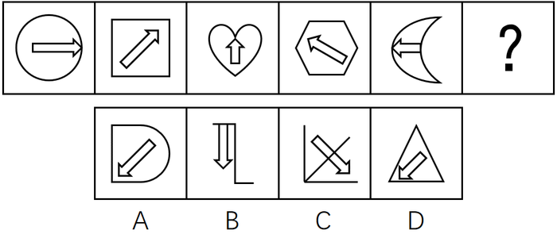
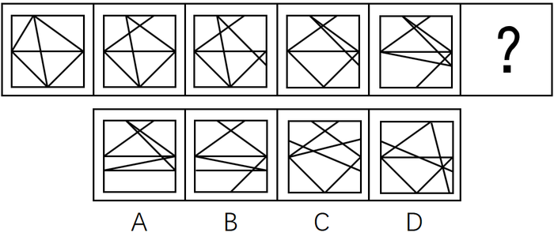
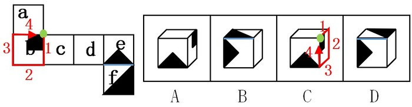

# 2017年422联考《行测》题（四川卷）

> 判断推理 · 30 题 · 四川 2017

## 第 1 题　qid 2051108 · 图形推理

从所给的四个选项中选择最合适的一个填入问号处，使之呈现一定的规律：

- **A**. A
- **B**. B
- **C**. C
- **D**. D　✅

**答案**：D

**官方解析**

元素组成基本相同，优先考虑位置规律。每幅图形中箭头的方向依次逆时针旋转，排除B、C两项；继续观察发现，题干图形的外框出现全曲线和全直线图形，考虑曲直性，题干图形外框的曲直性分别是全曲、全直、全曲、全直、全曲，故？处应该选择外框是全直线的图形，排除A项。

故正确答案为D。

---

## 第 2 题　qid 2051110 · 图形推理

从所给的四个选项中选择最合适的一个填入问号处，使之呈现一定的规律：

- **A**. A
- **B**. B
- **C**. C
- **D**. D　✅

**答案**：D

**官方解析**

元素组成不同，且无明显属性规律，优先考虑数量规律。题干每幅图形都有多个独立的小元素，数元素的个数和种类均无规律，考虑每幅图之间的元素差异，通过观察发现相邻图形间均含有一个相同的元素，因此？处也应该与前一幅图有一个相同元素，据此排除A、B、C选项。
故正确答案为D。

---

## 第 3 题　qid 2051112 · 图形推理

从所给的四个选项中选择最合适的一个填入问号处，使之呈现一定的规律：

- **A**. A
- **B**. B　✅
- **C**. C
- **D**. D

**答案**：B

**官方解析**

思路一：题干已知图形窟窿和线较多，先考虑数面，无明显规律，再考虑数线，图形均由10条直线组成，且选项也都是由10条直线组成，无法排除。无思路时，可以通过相邻比较的思维找规律，对比图1和图2，发现只有一条直线位置发生变化，图2到图3、图3到图4、图4到图5同理，也只有一条直线位置发生变化，故?处也应该与前一幅图只有一条直线位置发生变化，排除A、C、D。
故正确答案为B。
思路二：题干已知图形都有4个奇点，均为两笔画图形，选项中只有D项是两笔画。
故正确答案为D。

注：这道题不严谨，有争议，通过两笔画选到D项，这个思路没有问题，但是我们通过观察题干的出题形式以及图案排布，推测出题人可能更想考查的是相邻图形变动一条直线这个规律。
所以我们粉笔给出的倾向性答案是B项。

---

## 第 4 题　qid 2051116 · 图形推理

从所给的四个选项中选择最合适的一个填入问号处，使之呈现一定的规律：

- **A**. A
- **B**. B
- **C**. C
- **D**. D　✅

**答案**：D

**官方解析**

元素组成相似，考虑样式规律，图形间有相似的线条，优先考虑样式规律中的加减同异。九宫格优先按行看，并没有发现规律，再考虑按列看，通过观察发现，每一列图2与图3相加得到图1，故第三列图3还缺中间一条竖线和一条长横线，包括这两条线的只有D项。
故正确答案为D。

---

## 第 5 题　qid 2051170 · 图形推理

左边给定的是纸盒的外表面，下列能由它折叠而成的是：

- **A**. A　✅
- **B**. B
- **C**. C
- **D**. D

**答案**：A

**官方解析**

本题考查六面体的空间重构。

逐一分析选项。 

A项：与题干一致，当选；

B项：题干展开图中面e黑色三角形的底边挨着面f（上图题干中蓝色线条），而选项中挨着面f的边不是面e黑色三角形的底边（上图选项B中蓝色线条）排除；

C项：如上图所示，以面b黑正方形所在的点为起点开始顺时针画边，题干展开图中第四条边与面a相邻，而选项中第四条边与面e相邻，排除；

D项：题干展开图中面f在面e的下面，而选项中面f在面e的侧面，排除。

故正确答案为A。

---

## 第 6 题　qid 2051164 · 定义判断

供给侧改革就是从提高供给质量出发，用改革的办法推进结构调整，矫正要素配置扭曲，扩大有效供给，提高供给结构对需求变化的适应性和灵活性，提高全要素（劳动、土地、资本、创新）生产率，更好地满足广大人民群众的需求，促进经济社会持续健康发展。
根据上述定义，下列不符合供给侧改革要求的是：

- **A**. 减免企业税负，提高企业盈利
- **B**. 增大政府投资，建设各种基础设施　✅
- **C**. 推进产学研相结合，为企业提供技术支撑
- **D**. 改革户籍制，促进劳动力跨地区、跨部门流动

**答案**：B

**官方解析**

第一步，找出定义关键词。
“提高全要素（劳动、土地、资本、创新）生产率”。
第二步，逐一分析选项。
A项：减免企业税负，提高企业盈利体现了“资本”，符合定义，排除；
B项：增大政府投资属于投资，没有体现“劳动、土地、资本、创新”，投资是需求侧改革不是供给侧改革，不符合定义，当选；
C项：推进产学研结合体现了“创新”，符合定义，排除；
D项：改革户籍制，促进劳动力跨地区体现了“劳动”，符合定义，排除。
本题为选非题，故正确答案为B。

---

## 第 7 题　qid 2051172 · 定义判断

感情管理是指管理者通过自身的形象、行为、情感来调动职工积极性的一种管理办法。
根据以上定义，下列不属于感情管理的是：

- **A**. 车间主任从来不回避脏活累活，总是带头干
- **B**. 尽管李经理喜欢抽烟，但他从来不在员工面前抽　✅
- **C**. 每逢节假日，公司领导都会给员工发放节日慰问品
- **D**. 部门经理与员工一起聊天、吃饭，让大家畅所欲言

**答案**：B

**官方解析**

第一步，找出定义关键词。
“通过自身的形象、行为、情感”“调动职工积极性”。
第二步，逐一分析选项。
A项：“车间主任带头干”体现了通过自己的行为来调动职工的积极性，符合定义，排除；
B项：“李经理喜欢抽烟但不在员工面前抽”是他的行为，但不抽烟无法调动职工积极性，不符合定义，当选；
C项：“公司领导发放节日慰问品”是通过管理者的行为调动员工的积极性，符合定义，排除；
D项：“部门经理和员工一起聊天、吃饭”体现了通过自身的行为以及情感调动职工积极性，符合定义，排除。
本题为选非题，故正确答案为B。

---

## 第 8 题　qid 2051180 · 定义判断

正强化又称“阳性强化”，是指个体做出某种行为或反应，随后或同时得到某种奖励，从而使行为或反应强度、概率或速度增加的过程。也可以说，正强化是通过增加一个喜欢的刺激以提高事件发生的概率。
根据以上定义，下列属于正强化的是：

- **A**. 小明觉得电视上的宇航员叔叔很酷，下决心好好学习，长大了也要上太空
- **B**. 老师激励学生好好复习考试，承诺数学95分以上的同学可以不做假期作业
- **C**. 某中学规定上课玩手机的同学，手机一律没收，规定执行后，几乎没人敢玩手机了
- **D**. 父亲为了鼓励儿子努力学习，承诺儿子如果他能考进全班前三名，就带他出国旅游　✅

**答案**：D

**官方解析**

第一步，找出定义关键词。
“增加一个喜欢的刺激”、“提高事件发生的概率”。
第二步，逐一分析选项。
A项：小明觉得电视上的宇航员很酷并未体现“增加一个喜欢的刺激”，而是小明自己下决心，不符合定义，排除；
B项：老师承诺数学95分以上的同学可以不做假期作业并不是“增加一个喜欢的刺激”，而是减少一个不喜欢的事情，不符合定义，排除；
C项：上课玩手机没收手机是减少一个喜欢的事情，不符合定义，排除；
D项：父亲承诺儿子如果能考进全班前三名，就带他出国玩符合“增加一个喜欢的刺激”和目的，符合定义，当选。
故正确答案为D。

---

## 第 9 题　qid 2051182 · 定义判断

“城乡污染转移”是指在经济发展过程中，组织或个人将造成环境污染的设备、工艺、技术、产品以及其他有形或无形的污染物质，由城市转移至农村的行为，“城乡污染转移”已经成为农村环境形势日益严峻的主要原因之一。
根据以上定义，下列不属于“城乡污染转移”的是：

- **A**. 某市水泥厂每年有10万吨未经处理的工业废水流经附近乡村的河流
- **B**. 某镇的耕地接受城区搬迁过来的工厂产生的重金属残渣
- **C**. 为打造绿色文明城市形象，某市将重污染的钢铁厂迁至附近乡镇
- **D**. 某市为保证城区用水修建水库，致使下游许多村庄农田灌溉用水不足　✅

**答案**：D

**官方解析**

第一步：找到定义关键词。
“将造成环境污染的设备、工艺、技术、产品以及其他有形无形的污染物质”、“由城市转移至农村”。
第二步：逐一分析选项。
A项：工业废水属于“有形污染物质”，市水泥厂将其排放至乡村河流是“将污染物由城市转移至农村的行为”，符合定义，排除；
B项：城区的工厂产生的重金属残渣属于“有形污染物质”，将工厂由城区搬至乡镇是“将制造污染物的设备由城市转移至农村的行为”，符合定义，排除；
C项：重污染钢铁厂会产生“有形无形的污染物质”，将重污染钢铁厂迁至乡镇是“将制造污染物的设备由城市转移至农村的行为”，符合定义，排除；
D项：城区修建水库只是导致下游村庄农田灌溉用水不足，并没有产生污染环境的污染物，不符合定义，当选。
本题为选非题，故正确答案为D。

---

## 第 10 题　qid 2051188 · 定义判断

C2C是指消费者（consumer）与消费者（consumer）之间以信息网络技术为手段，以商品交换为中心的商务活动。
根据上述定义，下列活动属于C2C的是：

- **A**. 某小区推出“旧物置换”服务，业主可将家中不用的物品放到门卫室，与其他业主置换
- **B**. 大学生小李以2000元的价格在网上拍卖了自己的旧笔记本电脑，没想到买家居然是自己的同班同学小方　✅
- **C**. 每到毕业季，学校广场上的跳蚤市场都异常火爆，“甩卖”的学长学姐和“淘宝”的学弟学妹都各取所需，满载而归
- **D**. 小梅逛街时在某品牌服装专卖店相中了一款风衣，便记下了衣服吊牌上的信息，回来后从该品牌的官方网站上买了一件，省了不少钱

**答案**：B

**官方解析**

第一步：找出定义关键词。
“消费者与消费者之间”、“以信息网络技术为手段”、“以商品交换为中心”、“商务活动”。
第二步：逐一分析选项。
A项：“放到门卫室”，不符合“以信息网络技术为手段”，不符合定义，排除；
B项：小李在网上拍卖旧笔记本电脑运用了“信息网络技术手段”，是以“商品交换为中心”的商务活动，且小李和小方都是“消费者”，符合定义，当选；
C项：学校广场的“跳蚤市场”没有运用“信息网络技术手段”，不符合定义，排除；
D项：某品牌官方网站不属于“消费者”，因此不是“消费者与消费者”之间的商务活动，不符合定义，排除。
故正确答案为B。

---

## 第 11 题　qid 2049504 · 定义判断

沉默行为是指面对管理制度或生产活动等方面的隐患，为了避免人际冲突，害怕遭受打击报复或维护自身脸面等原因而有意保留自己想法的行为。
根据上述定义，下列属于沉默行为的是：

- **A**. 小王看到同事小赵的计划书有个明显的错误而没有指出来，在接下来与小赵的评比中小王的计划方案获得通过
- **B**. 老张意识到小明最近老是上班时间唱歌已经影响到了别人工作，但考虑到他是自己的徒弟，老张不但不向领导报告，还和其他抱怨的同事争辩　✅
- **C**. 尽管小马就如何提高顾客对公司服务的满意度有见解，由于前面发言的同事已经基本谈到该问题，所以小马也就没再接着说
- **D**. 小刘尽管在新产品开发报告会上有想法，但考虑到该想法尚不成熟，贸然提出可能会影响工作进度，因此在会上也就没发表意见

**答案**：B

**官方解析**

第一步，找出定义关键词。
“面对管理制度或生产活动等方面的隐患”、“为了避免人际冲突，害怕遭受打击报复或维护自身脸面”、“有意保留自己的想法的行为”。
第二步，逐一分析选项。
A项：两人参与评比属于竞争关系，并不是“为了避免人际冲突，害怕遭受打击报复或维护自身脸面”而没有指出来，而是为了自己赢，不符合定义，排除；
B项：小明上班时间唱歌已经影响到了别人工作，属于“管理制度或生产活动等方面的隐患”，老张不向领导报告的原因是小明是自己的徒弟，说明老张是为了维护自己作为师傅的脸面，属于“为了避免人际冲突，害怕遭受打击报复或维护自身脸面”，符合定义，当选；
C项：小马没有提出见解的原因是前面发言的同事已经谈到了这个问题，并不是“为了避免人际冲突，害怕遭受打击报复或维护自身脸面”，不符合定义，排除；
D项：小刘在会上没发表意见的原因是自己想法尚不成熟，并不是“为了避免人际冲突，害怕遭受打击报复或维护自身脸面”，不符合定义，排除。
故正确答案为B。

---

## 第 12 题　qid 2051192 · 定义判断

正向思维，是指大脑在处理问题时沿着习惯性、常规性的方向展开思维，并在一定范围内按照有一定顺序的、可预测的、程式化的方向进行思考。
根据上述定义，下列没有运用到正向思维的是：

- **A**. 王侯将相宁有种乎　✅
- **B**. 种瓜得瓜，种豆得豆
- **C**. 朝霞不出门，晚霞行千里
- **D**. 冬天来了，春天还会远吗

**答案**：A

**官方解析**

第一步：找出定义关键词。
“沿着习惯性、常规性的方向展开思维”、“按照有一定顺序的、可预测的、程式化的方向进行思考”。
第二步：逐一分析选项。
A项：“王侯将相宁有种乎”意思是那些称王侯拜将相的人，难道就比我们高贵吗？通过反问的语气来否认常规性观点（那些称王侯拜将相的人不一定比我们高贵），是一句非常带有反抗精神的话语，并没有按照习惯性的方向展开思维，不符合定义，当选；
B项：“种瓜得瓜，种豆得豆”是“种什么得什么”的常规性思维，是按照“可预测”的方向进行思考，符合定义，排除；
C项：“朝霞不出门，晚霞行千里”的意思是朝霞在东，表明阴雨天气在向我们进袭，所以就不应该出门。晚霞在西，表示最近几天里天气晴朗，可以出远门。这是古人根据长期的生活规律总结得来的，是按照“可预测”的方向进行思考，符合定义，排除；
D项：冬天结束了就是春天，“冬天来了，春天还会远吗”是按照“有一定顺序的方向”进行思考，符合定义，排除。
本题为选非题，故正确答案为A。

---

## 第 13 题　qid 2049506 · 定义判断

逆向激励是指政策设计初衷与实际执行效果呈现“事与愿违”的现象，逆向激励效应一旦被激发，不仅会导致现状恶化，损害政策制定者的信用，还将进一步强化相关负面后果，最终造成恶性循环。
根据上述定义，下列不属于逆向激励的是：

- **A**. 为了扭转治安问题，上世纪美国颁布了禁酒令，然而酒的销量不跌反升，而且由此又引发了新的犯罪问题
- **B**. 宋神宗为了整肃吏治、严明司法审判，下令凡是能找到错判事实的官员官升一级，结果这项举措却成了新旧官员相互攻讦的武器
- **C**. 为了更有利孩子成长而提供优裕的物质条件，然而却让其养成了好逸恶劳的恶习
- **D**. 老师在课堂上通过有意对害羞学生提问而帮助其克服容易紧张的问题　✅

**答案**：D

**官方解析**

第一步，找出定义关键词。
“政策设计初衷与实际执行效果呈现事与愿违的现象”、“导致现状恶化，强化了相关负面后果，造成恶性循环”。
第二步，逐一分析选项。
A项：为扭转治安问题颁布禁酒令，但酒的销量不降反升，符合“实际执行效果呈现事与愿违”，引发新的犯罪问题符合“现状恶化”，符合题干定义，排除；
B项：“为了整肃吏治、严明司法审判”是该项政策的设计初衷，新旧官员互相攻讦的武器符合“实际执行效果呈现事与愿违”并且“强化了相关负面后果”，符合题干定义，排除；
C项：“为了更有利于孩子成长”是设计初衷，“孩子养成了好逸恶劳的恶习”，符合“实际执行效果呈现事与愿违”并且“强化了相关负面后果”，符合题干定义，排除；
D项：“老师提问害羞的孩子帮助其克服容易紧张的问题”是设计初衷，但是没有说明实际执行效果是否出现事与愿违的现象，不符合题干定义，当选。
本题为选非题，故正确答案为D。

---

## 第 14 题　qid 2051196 · 定义判断

职业倦怠是指个体不能顺利应对工作压力时的一种极端反映，是个体在长时期压力体验下而产生的情感、态度和行为的衰竭状态。
根据以上定义，下列不属于职业倦怠的是：

- **A**. 某省队运动员小吴刻苦训练多年，但今年以来比赛都没有获奖，斗志丧失，训练时总是无精打采
- **B**. 小强大学毕业被父母安排到家族企业上班，没过几天他就心生倦意，迟到早退，找各种理由不去公司　✅
- **C**. 李老师多年带高三学生，为提高升学率殚精竭虑，临近高考经常失眠，容易头疼，对学生动不动就大加指责
- **D**. 王护士在医院工作多年，经常加班，临近年终又要应对各种考核，没有精力和同事来往，对病人也没有以前热情

**答案**：B

**官方解析**

第一步，找出定义关键词。
“个体不能顺利应对工作压力时的一种极端反映”、“是个体在长时期压力体验下而产生的情感、态度和行为的衰竭状态”。
第二步，逐一分析选项。
A项：刻苦训练多年符合“长时期压力体验”；斗志丧失，训练时无精打采符合“情感、态度衰竭状态”，符合定义，排除；
B项：小强在家族企业上班，没过几天就心生倦意，不符合“长时期压力体验下”这一关键词，不符合定义，当选；
C项：李老师多年带高三学生，为提高升学率而殚精竭虑，符合“个体在长时期压力体验”；并且失眠头疼属于行为的衰竭状态、对学生斥责符合“情感、态度的衰竭状态”，符合定义，排除；
D项：在医院工作多年，经常加班符合“长时期压力体验”；对病人没有以前热情符合“情感、态度的衰竭状态”，符合定义，排除。
本题为选非题，故正确答案为B。

---

## 第 15 题　qid 2049494 · 定义判断

拟态，是指某些生物在进化过程中具有与另一种生物或周围自然界物体的相似的形态，这种相似性很高，几乎难以分辨，可以保护某一物种或两个物种。
根据上述定义，下列选项属于拟态的是：

- **A**. 海豚、企鹅和带鱼虽然分别属于鲸类、鸟类和鱼类，但为了适应海洋生活，都进化出了流线形的身体
- **B**. 北极熊生活在白雪皑皑的北极，为了掩护自己捕食时不被猎物过早发现，皮毛逐渐变成与周围环境相似的白色
- **C**. 大鲵，俗名娃娃鱼，已在地球上生活了数亿年，其受到刺激时的叫声酷似人类婴儿哭声，让人听到不忍心伤害，对一些猎食动物也有威慑作用
- **D**. 杜鹃会将与宿主卵酷似的卵产在宿主巢内，其雏鸟在孵出后不久就会将宿主雏鸟挤出巢外，独享体型只有自己一半大小的宿主父母的喂食　✅

**答案**：D

**官方解析**

第一步，找出定义关键词。
“某些生物在进化过程中具有与另一种生物或周围自然界物体的相似的形态”、“相似性很高，几乎难以分辨”、“可以保护某一物种或两个物种”。
第二步，逐一分析选项。
A项：海豚、企鹅和带鱼这三种不同的物种都具有流线形身体这一相似性，但相似性是否很高，是否难以分辨不明确，不符合定义，排除；
B项：北极熊的皮毛逐渐变为与周围的环境相似的白色，只是颜色发生变化，但形态并没有发生改变，这是北极熊的保护色，没有体现了“某些生物在进化过程中具有与另一种生物或周围自然界物体的相似的形态”，不符合定义，排除；
C项：大鲵的叫声与婴儿相似，并不是形态的相似，不符合“某些生物在进化过程中具有与另一种生物或周围自然界物体的相似的形态”，不符合定义，排除；
D项：杜鹃产的卵与宿主卵酷似，符合“相似性很高，几乎难以分辨”，将宿主雏鸟挤出巢外符合“可以保护某一物种或两个物种”，符合定义，当选。
故正确答案为D。

---

## 第 16 题　qid 2050404 · 类比推理

猪：猪肝

- **A**. 鱼：鱼鳔　✅
- **B**. 马：马蹄
- **C**. 虫：虫草
- **D**. 虾：虾须

**答案**：A

**官方解析**

第一步：判断题干词语间逻辑关系。
猪肝是猪的内脏，二者是组成关系。
第二步：判断选项词语间逻辑关系。
A项：鱼鳔是鱼的内脏，二者是组成关系，与题干逻辑关系一致，当选；
B项：马蹄是马的组成部分，但不是马的内脏，与题干逻辑关系不一致，排除；
C项：虫草是冬虫夏草的子实体与僵虫菌核（幼虫尸体）构成的复合体，虫是虫草的原材料，与题干逻辑关系不一致，排除；
D项：虾须是虾的组成部分，但不是虾的内脏，与题干逻辑关系不一致，排除。
故正确答案为A。

---

## 第 17 题　qid 2051114 · 类比推理

词语：句子

- **A**. 概念：判断
- **B**. 定义：定理
- **C**. 书本：书籍
- **D**. 山谷：山脉　✅

**答案**：D

**官方解析**

第一步：判断题干词语间逻辑关系。
句子是由词语组成的，二者为组成关系。
第二步：判断选项词语间逻辑关系。
A项：理性认识包括概念、判断、推理三种形式，因此概念、判断属于并列关系，二者不符合题干中的逻辑关系，排除；
B项：定义是指对于一种事物的特征简要说明；定理是经过受逻辑限制的证明为真的陈述，二者不是组成关系，不符合题干中的逻辑关系，排除；
C项：书本是指装订成册的著作；书籍是指装订成册的图书和文字。二者是近义关系，不符合题干中的逻辑关系，排除；
D项：山脉是指一系列山连在一起，成一条线；山谷是指两山间低凹而狭窄处。山脉是由山谷组成的，二者为组成关系。与题干逻辑关系一致，当选。
故正确答案为D。

---

## 第 18 题　qid 2051142 · 类比推理

处之泰然：镇定

- **A**. 大义凛然：壮烈
- **B**. 虚怀若谷：谦虚　✅
- **C**. 杳如黄鹤：消失
- **D**. 似水流年：时间

**答案**：B

**官方解析**

第一步：判断题干词语间逻辑关系。
“处之泰然”是指对待发生的紧急情况或困难，安然自得，毫不在乎，表示很“镇定”，二者为近义词关系。
第二步：判断选项词语间逻辑关系。
A项：“大义凛然”常用来描写勇士受屈时或烈士遇难前的英勇气概，是形容英勇无畏，而不是形容“壮烈”，与题干逻辑关系不一致，排除。
B项：“虚怀若谷”意指胸怀像山谷那样深而且宽广，形容十分谦虚。与“谦虚”是近义词关系，与题干逻辑关系一致，当选。
C项：“杳如黄鹤”原指传说中仙人骑着黄鹤飞去，从此不再回来，现比喻无影无踪或下落不明，即是指没有消息。“消失”是指事物渐渐减少以至没有，事物不复存在。二者不是近义词关系，与题干逻辑关系不一致，排除。
D项：“似水流年”形容时间一去不复返、青春易逝。与“时间”不是近义词关系，与题干逻辑关系不一致，排除。
故正确答案为B。

---

## 第 19 题　qid 2051144 · 类比推理

梅：孤傲：品质

- **A**. 火：热情：性格　✅
- **B**. 月饼：团圆：食品
- **C**. 鸽子：和平：象征
- **D**. 红灯：禁行：信息

**答案**：A

**官方解析**

第一步：判断题干词语间逻辑关系。
孤傲是一种品质，梅象征着孤傲的品质。
第二步：判断选项词语间逻辑关系。
A项：热情是一种性格，火象征着热情的性格，与题干逻辑关系一致，当选；
B项：月饼象征团圆，但团圆不是一种食品，与题干逻辑关系不一致，排除；
C项：鸽子象征和平，但和平不是一种象征，与题干逻辑关系不一致，排除；
D项：禁行是一种命令信息，但红灯的作用是禁止人们通行，与题干逻辑关系不一致，排除。
故正确答案为A。

---

## 第 20 题　qid 2050696 · 类比推理

报纸：新闻：时效

- **A**. 饭店：食物：口感
- **B**. 电视：广告：效果　✅
- **C**. 车站：汽车：速度
- **D**. 展会：照片：像素

**答案**：B

**官方解析**

第一步：判断题干词语间逻辑关系。
报纸是新闻的载体，新闻有时效性，题干为对应关系。
第二步：判断选项词语间逻辑关系。
A项：饭店是售卖食物的场所，与题干逻辑关系不一致，排除；
B项：电视是广告的载体，广告有效果，为对应关系，与题干逻辑关系一致，当选；
C项：车站是汽车停泊的场所，不是载体，与题干逻辑关系不一致，排除；
D项：展会不是照片的载体，照片是展会展示的一种形式，像素的高低决定照片的清晰度，与题干逻辑关系不一致，排除。
故正确答案为B。

---

## 第 21 题　qid 2049378 · 类比推理

储存：光盘：硬盘

- **A**. 晾晒：绳索：衣架
- **B**. 吃饭：钢叉：锅铲
- **C**. 书写：签字笔：毛笔　✅
- **D**. 游泳：泳圈：泳衣

**答案**：C

**官方解析**

第一步：判断题干词语间逻辑关系。
光盘和硬盘两者是并列关系，主要功能都是储存数据，光盘和硬盘与储存是功能对应关系。
第二步：判断选项词语间逻辑关系。
A项：绳索和衣架两者是并列关系，衣架的主要功能是晾晒衣物，而绳索的主要功能是连接、牵引，不是晾晒，与题干逻辑关系不一致，排除；
B项：钢叉和锅铲两者是并列关系，钢叉的主要功能是协助吃饭，而锅铲的主要功能是炒菜，与题干逻辑关系不一致，排除；
C项：签字笔和毛笔两者是并列关系，主要功能是书写文字，签字笔和毛笔与书写是功能对应关系，与题干逻辑关系一致，当选；
D项：泳圈和泳衣两者是并列关系，泳圈的主要功能是协助游泳，泳衣是指游泳时专用的衣服，与题干逻辑关系不一致，排除。
故正确答案为C。

---

## 第 22 题　qid 2051162 · 类比推理

水对于（  ）相当于（  ）对于光合作用

- **A**. 生命 二氧化碳　✅
- **B**. 水蒸气 阳光
- **C**. 空气 氧气
- **D**. 灌溉 土壤

**答案**：A

**官方解析**

将选项逐一代入，判断前后两组词语的逻辑关系。
A项：水是生命的必要条件，二氧化碳是光合作用的必要条件，前后逻辑关系一致，当选；
B项：水达到沸点时，水就变成水蒸气，水蒸气是水的一种气态形式，两者是同一物质，光照是光合作用的必要条件，而阳光不是必要条件，前后逻辑关系不一致，排除；
C项：空气和水都是生物生存的必要条件，二者为并列关系，光合作用可以产生氧气，前后逻辑关系不一致，排除；
D项：水可以用来灌溉，土壤和光合作用没有必然的逻辑关系，前后逻辑关系不一致，排除。
故正确答案为A。

---

## 第 23 题　qid 2051186 · 类比推理

（  ） 对于 针灸 相当于 理财 对于 （  ）

- **A**. 中药  消费
- **B**. 中医  银行
- **C**. 治疗  储蓄　✅
- **D**. 推拿  利息

**答案**：C

**官方解析**

逐一代入验证选项。
A项：针灸是中医治疗疾病的方法，中药是中医治疗时使用的药材，两者无必然联系，理财与消费是对钱的不同使用方式，前后逻辑关系不一致，排除；
B项：针灸是中医治疗疾病的方法，理财是银行的一种业务，都是对应关系，但词语位置摆放顺序不一致，排除；
C项：针灸是一种治疗方式，储蓄是一种理财方式，前后逻辑关系一致，当选；
D项：推拿与针灸并列，理财可以获得利息，前者是并列关系，后者是对应关系，前后逻辑关系不一致，排除。
故正确答案为C。

---

## 第 24 题　qid 2051190 · 类比推理

（  ） 对于 规划 相当于 鸿沟 对于 （  ）

- **A**. 城市  协调
- **B**. 计划  河流
- **C**. 成功  隔阂
- **D**. 蓝图  界限　✅

**答案**：D

**官方解析**

逐一代入验证选项。
A项：城市规划是偏正结构。协调和鸿沟，二者没有明显逻辑关系。前后逻辑关系不一致，排除；
B项：计划与规划是近义词，鸿沟是一条古运河，比喻事物间明显的界限。前后逻辑关系不一致，排除；
C项：成功可以形容规划。隔阂指情意不相通，彼此思想有距离，鸿沟比喻事物间明显的界限，鸿沟比隔阂的程度更重。前后逻辑关系不一致，排除；
D项：用蓝图来比喻规划，用鸿沟来比喻界限。前后逻辑关系一致，当选。
故正确答案为D。

---

## 第 25 题　qid 2050406 · 类比推理

（  ）  对于 宋朝  相对于  （  ）  对于  汉朝

- **A**. 岳飞  陈胜
- **B**. 金人  匈奴人　✅
- **C**. 词  《汉书》
- **D**. 印刷术  万里长城

**答案**：B

**官方解析**

逐一代入选项。
A项：岳飞是宋朝人，陈胜是秦朝人而非汉朝人，前后逻辑关系不一致，排除；
B项：金人是宋朝的外患，匈奴人是汉朝的外患，前后逻辑关系一致，当选；
C项：词兴盛于宋朝；《汉书》是主要记载汉朝史事的史书。词是一类文体，《汉书》是具体的著作，前后逻辑关系不一致，排除；
D项：印刷术开始于隋唐时期的雕版印刷，北宋毕昇发明活字印刷术；“万里长城”这个称号首次出现在秦朝，与汉朝无必然联系，前后逻辑关系不一致，排除。
故正确答案为B。

---

## 第 26 题　qid 2049452 · 逻辑判断

有人认为“意象”是一个外来词，是英文“image”的译文，并把它和20世纪初的英美意象派诗歌联系起来。但其实，意象是中国古代文艺理论固有的概念和词语，并不是外来的东西。
以下各项如果为真，最能证明“意象”在我国的原生性的是：

- **A**. 英美意象派所提倡的“image”是指运用想象、幻想、譬喻所构成的各种具体鲜明的、可以感知的诗歌形象，与中国的“意象”含义不相同
- **B**. 很多主张把自己的情绪全部隐藏在意象背后，通过意象将它们暗示出来的英美意象派诗人实际上是深受中国古代诗歌的影响
- **C**. 我国古代诗歌诞生远远早于英美诗歌，我国古代的传说故事是很多英美意象派诗人创作的灵感来源
- **D**. 意象在南朝《文心雕龙》等著作中有提及，它没有确定的涵义和一致用法，有的指意中之象，有的指意和象，有的接近于今天所说的艺术形象　✅

**答案**：D

**官方解析**

第一步：找出论点和论据。
论点：意象是中国古代文艺理论固有的概念和词语，并不是外来的东西。
论据：无。
第二步：逐一分析选项。
A项：指出英美的“image”和中国的“意象”并非同一概念，但并不能直接说明“意象”在中国的原生性，为不明确选项，排除；
B项：英美意象派诗人深受中国古代诗歌的影响与意象一词是否来自中国无关，属于无关选项，排除；
C项：指出我国古代诗歌作为英美意象派诗人创作的灵感来源，但是并未明确说明“意象”这一概念是来自中国，为不明确选项，排除；
D项：南朝的《文心雕龙》等著作中提及意象一词，明确指出意象是中国古代文艺理论固有的概念和词语，不是外来的东西，补充论据，可以加强，当选。 
故正确答案为D。

---

## 第 27 题　qid 2051198 · 逻辑判断

2015年5月4日，财政部、国家税务总局发文，烟草消费税由提高至，并加征从量税，有专家认为，“税价联动”会使香烟价格随着税率的提高而提高，购买香烟的人会因此减少，从控烟角度说，这无疑是件好事。

以下哪项如果为真，最能削弱上述结论：

- **A**. 
烟草产量不会受到售价的影响

- **B**. 
收入水平的提高使人们对香烟的价格不太敏感
　✅
- **C**. 
世界上大多数国家的烟草消费税税率低于

- **D**. 
一些发达国家出现过提高烟草消费税后私烟泛滥的现象

**答案**：B

**官方解析**

第一步：找出论点论据。
论点：“税价联动”会使香烟价格随着税率的提高而提高，购买香烟的人会减少，从控烟角度说是好事。
论据：无。
第二步：逐一分析选项。
A项：烟草产量不会受到售价的影响，没有提及购买香烟人数减少的问题，属于无关选项，排除；
B项：收入水平的提高使人们对香烟价格不太敏感，说明价格不是购买香烟人考虑的因素，直接削弱论点，当选；
C项：世界上大多数国家的烟草消费税问题并不能说明我国购买香烟人数会减少，与论点无关，属于无关选项，排除；
D项：私烟泛滥和购买香烟的人数之间没有必然联系，无关选项，排除。
故正确答案为B。

---

## 第 28 题　qid 2051202 · 逻辑判断

研究人员对中风幸存者进行分组实验，他们让一组中风幸存者在研究人员的监督下进行为期3个月的户外健步走的锻炼。另一组不进行运动，而是接受治疗性按摩，实验结束后，研究人员发现在持续6分钟的测试中，步行组的人比按摩组的人走得更远，能比后者多走17.6%，研究者认为，身体适度受损的中风幸存者仅通过简单廉价的运动就能获得更有效的效果。
下列哪一项如果为真，最能削弱上述论证：

- **A**. 步行组的平均年龄为72岁，按摩组的平均年龄为65岁
- **B**. 与按摩组相比，体质的改善使得步行组中风幸存者生活质量更高
- **C**. 步行组中风幸存者还服用了相关治疗药物，按摩组停服了相关药物　✅
- **D**. 研究证明，对身体严重受损的中风幸存者来说，接受按摩的效果更佳

**答案**：C

**官方解析**

第一步：找出论点和论据。
论点：身体适度受损的中风幸存者仅通过简单廉价的运动就能获得更有效的效果。
论据：对中风幸存者分组实验，步行组比按摩组走得更远。
第二步：逐一分析选项。
A项：补充条件说明步行者平均年龄比按摩组年龄高，还能走得更远，补充论据，排除；
B项：体质的改善使得步行组生活质量更高，论点讨论是简单运动是否会获得更有效的效果，讨论话题不一致，不能削弱，排除；
C项：步行组服用了药物，按摩组未服用，说明实验情况不一样，还有是否服用药物在影响实验结果，属于他因削弱，当选；
D项：论点强调的是身体适度受损的人，而选项强调的是身体严重受损的人，与题干讨论的主体不一致，属于无关选项，排除。
故正确答案为C。

---

## 第 29 题　qid 2049358 · 逻辑判断

地方政府对经济的干预不仅表现在直接通过财政投资拉动经济增长，还表现为通过财政补贴、税收优惠、信贷优惠和降低土地等要素成本诱导性地干预企业的投资决策。国有企业因为与政府具有密切的产权关系，其控制权主要掌握在政府手中，这就造成国有企业往往成为政府干预和调控经济的手段。
以下各项如果为真，最能支持上述结论的是：

- **A**. 钢铁、水泥和电解铝等产能过剩行业中既有国有企业，也有民营企业
- **B**. 房地产行业前三强都是民营企业，它们多数都享受了信贷优惠
- **C**. 国有企业的投资决策通常会受到地方政府的直接指导和干预　✅
- **D**. 部分大中型国有企业被政府遴选为“重点企业”，享受税收、信贷优惠

**答案**：C

**官方解析**

第一步：找出论点和论据。
论点：国有企业往往成为政府干预和调控经济的手段。
论据：国有企业与政府具有密切的产权关系。
第二步：逐一分析选项。
A项：过剩行业中既有国有企业也有民营企业，与政府是否利用国有企业干预和调控经济无关，排除；
B项：房地产行业前三强都是民营企业，享受到了信贷优惠，说明的是民营企业受到了政府的干预，但题干讨论的是国企，无关选项，排除；
C项：国有企业投资决策会受到地方政府的直接指导和干预，补充论据举例加强，说明国有企业确实是政府干预和调控经济的手段，保留；
D项：部分大中型国有企业被政府遴选为“重点企业”，享受优惠，补充论据举例加强，保留；
C、D两项进行比较，D项部分企业，是部分加强，C项直接强调的是国有企业，属于整体加强，整体强于部分，C项当选。
故正确答案为C。

---

## 第 30 题　qid 2051206 · 逻辑判断

某景区举办萤火虫展，每天都会吸引大批游客来观赏，数日后，该景区萤火虫的数量急剧下降。景区负责人认为是游客的不文明行为破坏了萤火虫的生存环境。
以下哪项如果为真，能够支持景区负责人的观点：

- **A**. 萤火虫对生态环境的要求很高
- **B**. 游客不文明的行为在其他景区也存在
- **C**. 在规范游客行为后萤火虫灭亡数量急剧下降　✅
- **D**. 和萤火虫同类的昆虫数量受游客行为影响不大

**答案**：C

**官方解析**

第一步：找出论点论据。
论点：游客的不文明行为破坏了萤火虫的生存环境。
论据：某景区举办萤火虫展，大批游客观赏数日后，萤火虫的数量急剧下降。
第二步：逐一分析选项。
A项：萤火虫对生态环境要求高，但游客不文明行为是否破坏了其生存环境并不清楚，属于无关选项，排除；
B项：游客不文明的行为在其他景区也存在，不能说明该景区的游客不文明行为破坏了生存环境，属于无关选项，排除；
C项：规范游客行为后萤火虫灭亡数量急剧下降，说明就是游客不文明行为导致萤火虫灭亡，补充论据，可以加强，当选；
D项：其他同类的昆虫数量与萤火虫的无关，主体不一致，属于无关选项，排除。
故正确答案为C。

---
