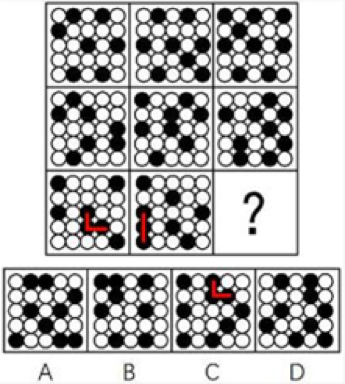
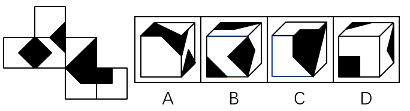
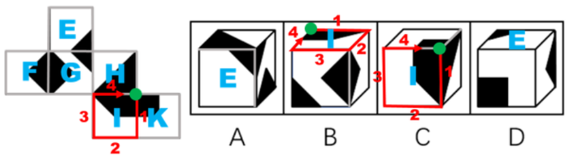
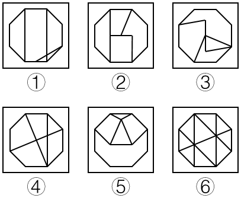
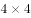

# 2017年422联考《行测》题（山东卷）

> 判断推理 · 40 题 · 山东 2017

## 第 1 题　qid 2049820 · 图形推理

从所给的四个选项中，选出最合适的一个填入问号处，使之呈现一定的规律性。

- **A**. A
- **B**. B
- **C**. C
- **D**. D　✅

**答案**：D

**官方解析**

观察图形，元素组成不同，且面数量明显，优先考虑数面。题干图形的面数量为0、1、2、3、4、？，问号处应为5个面，排除C项。其次，题干图形都是由曲线和直线组成，只有D项是既有曲线又有直线，排除A、B两项。
故正确答案为D。

---

## 第 2 题　qid 2049824 · 图形推理

从所给的四个选项中，选出最合适的一个填入问号处，使之呈现一定的规律性。

- **A**. A
- **B**. B
- **C**. C　✅
- **D**. D

**答案**：C

**官方解析**

观察图形，元素组成不同，优先考虑属性规律。题干图形1、3、5外曲内直，图形2、4外直内曲，“？”应为外直内曲的图形，对应C项。
故正确答案为C。

---

## 第 3 题　qid 2049830 · 图形推理

从所给的四个选项中，选出最合适的一个填入问号处，使之呈现一定的规律性。

- **A**. A　✅
- **B**. B
- **C**. C
- **D**. D

**答案**：A

**官方解析**

观察图形，元素组成相似，外部轮廓相同，但内部黑白颜色不同，考虑黑白运算。第一行：、、、；第二行验证此规律成立；第三行应用此规律，左上角：，排除C项；第三行右下角：，排除D项；第三行右上角，，排除B项。

故正确答案为A。

---

## 第 4 题　qid 2049834 · 图形推理

从所给的四个选项中，选出最合适的一个填入问号处，使之呈现一定的规律性。

- **A**. A
- **B**. B
- **C**. C　✅
- **D**. D

**答案**：C

**官方解析**

观察图形，元素组成不同，考虑数量规律。题干每一行的黑点数量都为7、8、9，问号处应为9个小黑点，B项为8个小黑点，排除。第一行图形的小黑点都不挨着，第二行的小黑点有两个挨着的，第三行的小黑点有三个挨着的，如下图所示，问号处应该有3个小黑点挨着，对应C项。

故正确答案为C。

---

## 第 5 题　qid 2049840 · 图形推理

左边给定的是纸盒的外表面，下列哪项能由它折叠而成？

- **A**. A
- **B**. B
- **C**. C
- **D**. D　✅

**答案**：D

**官方解析**

本题考查六面体的空间重构。

A项：由面E、面G和面H构成，对题干和选项画边如下，题干边4与面H的白色三角形相邻，A选项边4与面H的黑色三角形相邻，与展开图不一致，排除；

B项：由面I、面G和面F构成，对题干和选项画边如下，题干边1与面I的直角梯形的短直角边相邻，B选项边1与直角梯形的底边相邻，与展开图不一致，排除；

C项：由面H、面I、面K构成，对题干和选项画边如下，展开图中1号边对应面K，选项中1号边对应面H，与展开图不一致，排除；

D项：由面E、面K、面F构成，与展开图一致，当选。

故正确答案为D。

---

## 第 6 题　qid 2049844 · 图形推理

把下面的六个图形分为两类，使每一类图形都有各自的共同特征或规律，分类正确的一项是：

 

- **A**. ①④⑤，②③⑥　✅
- **B**. ①②④，③⑤⑥
- **C**. ①②⑤，③④⑥
- **D**. ①②⑥，③④⑤

**答案**：A

**官方解析**

每个图均由两个形状相同的图形相交构成，优先考虑图形间关系。两个图形相交于面，考虑相交面的形状。发现①④⑤相交部分的图形与两个图形的形状均相同，②③⑥相交部分的图形均与两个图形的形状不相同。
故正确答案为A。

---

## 第 7 题　qid 2049846 · 图形推理

把下面的六个图形分为两类，使每一类图形都有各自的共同特征或规律，分类正确的一项是：

- **A**. ①②④，③⑤⑥
- **B**. ①②⑤，③④⑥　✅
- **C**. ①③⑥，②④⑤
- **D**. ①⑤⑥，②③④

**答案**：B

**官方解析**

图形元素组成不同，属性无明显规律，考虑数量规律。整体观察图形，①②⑤均有3条曲线，③④⑥均有1条曲线。
故正确答案为B。

---

## 第 8 题　qid 2049850 · 图形推理

把下面的六个图形分为两类，使每一类图形都有各自的共同特征或规律，分类正确的一项是：

- **A**. ①②⑥，③④⑤　✅
- **B**. ①③⑤，②④⑥
- **C**. ①②④，③⑤⑥
- **D**. ①④⑥，②③⑤

**答案**：A

**官方解析**

图形元素组成不同，优先考虑属性规律。观察发现，题干每一幅图都是轴对称图形，其中图①、图②和图⑥的对称轴均与题干中的某条线重合；图③、图④和图⑤的对称轴均没有与题干中的某条线重合，因此图①、图②和图⑥为一组，图③、图④和图⑤为一组。
故正确答案为A。

---

## 第 9 题　qid 2049854 · 图形推理

把下面的六个图形分为两类，使每一类图形都有各自的共同特征或规律，分类正确的一项是：

- **A**. ①②③，④⑤⑥
- **B**. ①③⑤，②④⑥
- **C**. ①②⑥，③④⑤
- **D**. ①④⑥，②③⑤　✅

**答案**：D

**官方解析**

图形组成不同，属性无明显规律，考虑数量规律。②明显是一笔画图形，优先数笔画。①④⑥均有4个奇点，为两笔画图形，②③⑤均有2个奇点，为一笔画图形。
故正确答案为D。

---

## 第 10 题　qid 2049860 · 图形推理

把下面的六个图形分为两类，使每一类图形都有各自的共同特征或规律，分类正确的一项是：

- **A**. ①②③，④⑤⑥
- **B**. ①③④，②⑤⑥
- **C**. ①③⑥，②④⑤
- **D**. ①④⑥，②③⑤　✅

**答案**：D

**官方解析**

图形组成不同，属性无明显规律，考虑数量规律。窟窿很多，但数面无规律；线也很多，数线也无规律。再观察发现，题干中线条交叉的图形较多，考虑数交点。①④⑥为10个交点，②③⑤为11个交点。
故正确答案为D。

---

## 第 11 题　qid 2049862 · 定义判断

危险犯，指行为人实施的危害行为造成法律规定的危险状态作为既遂标志的犯罪。这类犯罪不是以造成物质性的和有形的犯罪结果为标准，而以法定的客观危险状态的具备为标志。
根据上述定义，以下属于危险犯的是：

- **A**. 猥亵儿童
- **B**. 商业诈骗
- **C**. 诬告陷害
- **D**. 醉酒驾驶　✅

**答案**：D

**官方解析**

第一步：找到定义关键词。

“以造成法律规定的危险状态作为既遂标志”“不以造成物质性和有形的犯罪结果为标准”

第二步：逐一分析选项。

A项：猥亵儿童是指以刺激或满足欲求为目的，对儿童实施淫秽行为。它是以“有形的犯罪结果”为标准的，不符合定义，排除；

B项：商业诈骗是指一些以欺诈、瞒骗或违反信用为手法的非法行为，而此等行为则不以威胁或实际行使武力或暴力以达致目的。是以“造成物质性的犯罪结果”为标准，不符合定义，排除；

C项：诬告陷害是指捏造事实，作虚假告发，意图陷害他人，使他人受刑事追究的行为。使他人受刑事追究是一种“有形的犯罪结果”，不符合定义，排除；

D项：醉酒驾驶是指车辆驾驶人员血液中的酒精含量大于或者等于的驾驶行为。只要是醉酒驾驶了车辆，就是一种危险状态，无需产生“物质性和有形的犯罪结果”，可以作为既遂标志，符合定义，当选。

故正确答案为D。

---

## 第 12 题　qid 2049870 · 定义判断

民族昆虫学是研究在一定社会中人类与昆虫相互关系的各种形式的学科。在研究昆虫的同时，研究社会的结构、人类的行为和昆虫之间的相互作用。
根据上述定义，以下各项中不属于民族昆虫学的研究范围的是：

- **A**. 研究具有某种宗教信仰的人食用昆虫的方式
- **B**. 研究某一民族将蝴蝶标本作为衣饰的原因
- **C**. 研究某一地区的人们利用昆虫娱乐的方式和原因
- **D**. 研究某一国家昆虫学的发展历史　✅

**答案**：D

**官方解析**

第一步：找到定义关键词。
“研究人类和昆虫相互关系”、“人类的行为和昆虫之间的相互作用”。
第二步：逐一分析选项。
A项：研究宗教信仰的人食用昆虫的方式，符合关键词“人类的行为和昆虫之间的相互关系”，符合定义，排除；
B项：研究某一民族将蝴蝶标本作为衣饰的原因，符合关键词“人类的行为和昆虫之间的相互关系”，符合定义，排除；
C项：研究人们利用昆虫娱乐的方式和原因，符合关键词“人类的行为和昆虫之间的相互关系”，符合定义，排除；
D项：只研究了某一国家昆虫学的发展，没有体现人的行为，不符合关键词“人类的行为和昆虫之间的相互作用”，不符合定义，当选。
本题为选非题，故正确答案为D。

---

## 第 13 题　qid 2049874 · 定义判断

税负转嫁，是指在商品交易过程中纳税人通过提高销售价格或压低购进价格的方法，将税收负担转移给购买者或供应者的一种经济现象。
根据上述定义，下列选项没有反映税负转嫁现象的是：

- **A**. 
提高烟草消费税后，某烟草批发商将进口卷烟价格相应提高了，进口卷烟的消费量明显下降

- **B**. 
对棉纱制造商征收棉纱税后，制造商开始提高棉纱出厂价格，因此批发商也提高了价格

- **C**. 
对化妆品在零售环节征税，零售商要求供应商降低货物价格，供应商又以同样方式要求制造商降低价格

- **D**. 
营业税提高后，织布厂在将布匹卖给印染厂时提高了价格，同时减少了本厂职工的工资
　✅

**答案**：D

**官方解析**

本题涉及常识。
第一步：找到定义关键词。
方式：“纳税人”通过“提高销售价格”或“压低购进价格”的方法。
目的：将税收负担“转移”给购买者或供应者。
第二步：逐一分析选项。
A项：烟草消费税征收的对象（纳税人）是所有从事烟草批发业务的单位和个人，烟草批发商属于烟草消费税的纳税人。纳税人提高进口卷烟的价格，是通过提高销售价格将烟草消费税转嫁给消费者，符合定义，排除；
B项：棉纱制造商作为“纳税人”通过“提高棉纱出厂价格”将税收负担“转移”给批发商即购买者，符合定义，排除；
C项：零售商作为化妆品零售环节征税的“纳税人”，通过“要求供应商降低价格的方式来压低购进价格”，进而将税收负担“转移”给供应者，符合定义，排除；
D项：织布厂将布匹卖给印染厂时提高了价格，看似符合税负转嫁的定义，但是织布厂在常识上并非营业税的纳税人。须知，在国家全面实行营改增（2016年5月）以前，从事制造业的企业须缴纳增值税，而从事服务业的企业须缴纳营业税；而全面实行营改增之后，所有行业都不再缴纳营业税，全部改成增值税。所以即使该选项的背景是在全面营改增之前，那么织布厂作为一个制造企业，应该缴纳的也是增值税，而非营业税，因此主体不符合“纳税人”，不涉及税负转嫁，不符合定义，当选。
本题为选非题，故正确答案为D。

---

## 第 14 题　qid 2049876 · 定义判断

去个性化，是指个人在群体压力或群体意识影响下，自我导向功能的削弱或责任感丧失，产生一些个人单独活动时不会出现的行为。去个性化有两个特点：一是身份的隐匿；二是责任感的模糊化。
根据上述定义，以下情境不属于去个性化的是：

- **A**. 网站论坛里面，一些匿名网友随意转发不实信息
- **B**. 路上老人跌倒，很多人在旁围观但无人伸出援手
- **C**. 足球比赛现场，球迷为裁判是否误判而争执打闹
- **D**. 某大型集会时，两小偷趁乱偷走价值连城的古董　✅

**答案**：D

**官方解析**

第一步，找出定义关键词。
原因：“个人在群体压力或群体意识影响下，自我导向功能的削弱或责任感丧失”。
结果：“产生一些个人单独活动时不会出现的行为”。
特点：“身份隐匿；责任感模糊化”。
第二步，逐一分析选项。
A项：匿名网友随意转发不实信息体现了原因“个人在群体压力或群体意识影响下，自我导向功能的削弱或责任感丧失”、“身份隐匿”、“责任感模糊化”，符合定义，排除；
B项：老人跌倒，很多人围观，均未伸出援手体现了原因“个人在群体压力或群体意识影响下，自我导向功能的削弱或责任感丧失”、结果“产生一些个人单独活动时不会出现的行为”、“身份隐匿”、“责任感模糊化”，符合定义，排除；
C项：球迷为裁判是否误判争执打闹体现了原因“个人在群体压力或群体意识影响下，自我导向功能的削弱或责任感丧失”、结果“产生一些个人单独活动时不会出现的行为”、“身份隐匿”，符合定义，排除；
D项：两个小偷偷东西是一种有目的性的自主行为，不符合原因“个人在群体压力或群体意识影响下，自我导向功能的削弱或责任感丧失”和结果“产生一些个人单独活动时不会出现的行为”，不符合定义，当选。
本题为选非题，故正确答案为D。

---

## 第 15 题　qid 2049882 · 定义判断

产品责任，是指产品在使用过程中因其缺陷（包括设计缺陷、制造缺陷和警示说明缺陷）而造成用户、消费者或公众的人身伤亡或财产损失时，依法应当由产品供给方（包括制造者、销售者、修理者等）承担的民事损害赔偿责任。
根据上述定义，以下情况明确属于产品供给方承担产品责任的是：

- **A**. 某高架桥因使用不达标准的钢筋导致坍塌造成行人受伤　✅
- **B**. 未经过敏皮试的患者在注射青霉素之后死亡
- **C**. 市民购买酸奶后未冷藏，饮用后生病住院
- **D**. 某婴儿误食成人维生素导致急性中毒

**答案**：A

**官方解析**

第一步，找出定义关键词。
原因：“产品的缺陷（包括设计缺陷、制造缺陷和警示说明缺陷）”。
结果：“用户、消费者或公众的人身伤亡或财产损失”。
第二步，逐一分析选项。
A项：因为高架桥的不达标钢筋导致行人受伤，符合关键词“产品的缺陷（包括设计缺陷、制造缺陷和警示说明缺陷）”和“用户、消费者或公众的人身伤亡或财产损失”，符合定义，当选；
B项：结果符合“用户、消费者或公众的人身伤亡或财产损失”，但原因是患者没有进行过敏皮试，不符合题干原因“产品的缺陷（包括设计缺陷、制造缺陷和警示说明缺陷）”，不符合定义，排除；
C项：结果符合“用户、消费者或公众的人身伤亡或财产损失”，但原因是市民未保存好酸奶，不符合题干原因“产品的缺陷（包括设计缺陷、制造缺陷和警示说明缺陷）”，不符合定义，排除；
D项：结果符合“用户、消费者或公众的人身伤亡或财产损失”，但原因是婴儿误食，不符合题干原因“产品的缺陷（包括设计缺陷、制造缺陷和警示说明缺陷）”，不符合定义，排除。
故正确答案为A。

---

## 第 16 题　qid 2049900 · 定义判断

众筹，即大众筹资或群众筹资，是指用“团购+预购”的形式，向网友募集项目资金的模式，由发起人、跟投人、平台构成，利用互联网传播的特性，让小企业、艺术家或个人对公众展示他们的创意，争取大家的关注和支持，进而获得所需要的资金援助，具有低门槛、多样性、依靠大众力量、注重创意的特征。
根据以上定义，以下行为属于众筹的是：

- **A**. 某地区盛产西瓜，小赵在网上发布消息组织预购，很多网友参与“团购”，瓜农根据预订信息种植，每年都能很快将西瓜销售一空　✅
- **B**. 小李希望为小区老人建设一个日常活动的活动区，他在小区的网站上发起集资活动，很快获得小区居民的响应，筹集到所需的经费
- **C**. 小辛设计了一个宠物喂食器，网友看到他“晒”的照片，纷纷要求购买，小辛集中接受了一批网友预订，用预订的费用进行了批量生产
- **D**. 小唐设计了一个养鸡场自动捡蛋机，为了批量生产，他在网上介绍自己的项目，一家投资公司看到之后，为小唐提供了生产所需的全部费用

**答案**：A

**官方解析**

第一步：找出定义关键词。
“大众筹资或群众筹资”、“团购+预购”、“利用互联网”、“向公众展示创意”、“获取资金援助”、“低门槛、多样性、依靠大众力量、注重创意”。
第二步：逐一分析选项。
A项：小赵在网上组织预购体现了小赵作为一个发起人“争取大家的关注和支持，进而获得所需要的资金援助”，网友团购并预定了西瓜，符合关键词“团购+预购”，瓜农根据预订信息种植体现了“依靠大众力量、注重创意的特征”（小赵的行为实际上是把原有的零售流程倒置，将销售前置，使得农业生产者可以根据销售预定情况了解市场的需求和行情，并可以在提前判断销量后组织生产，这是一种销售创意），符合定义，当选；
B项：在网站上发起建设老人日常活动区的集资活动，符合关键词“大众筹资或群众筹资”、“利用互联网”，但不符合关键词“团购+预购”，不符合定义，排除；
C项：小辛晒照片以及网友主动预定喂食器仅仅体现了网友主动预定，但没有体现出小辛“争取大家的关注和支持，进而获得所需要的资金援助”的目的，且网友主动预定喂食器没有明确地体现出是否为团购，不符合定义，排除；
D项：为了获得很多的资金来批量生产，小唐在网上介绍了自己的项目，符合关键词“利用互联网”，但有一家投资公司青睐并提供了全部所需费用，并不是“大众筹资或群众筹资”，不符合定义，排除。
故正确答案为A。

---

## 第 17 题　qid 2049914 · 定义判断

“饥饿营销”是指商品提供者有意调低产量，以期达到调控供求关系、制造供不应求“假象”、维持商品较高售价和利润率的目的。饥饿营销比较适合一些单价较高、不容易形成单个商品重复购买的行业。
根据上述定义，下列属于饥饿营销的是：

- **A**. 某厂商设计了新款笔记本电脑，与该品牌以往的一贯风格相差甚远，该厂商不确定是否能被市场接受，限量生产了3万台，上市后市场反应异常火爆，供不应求
- **B**. 某汽车品牌推出新款，很多人排队等候，甚至愿意加价购买，厂家宣称该款汽车产量有限，一直限量限售，以扩大“热销”影响　✅
- **C**. 某品牌一款经典白球鞋，一直销量稳定，近期受时尚界刮起的“怀旧风”影响，白球鞋销量大增，供不应求
- **D**. 近期高档白酒滞销，某知名品牌白酒生产商为保证效益，主动限产，调高售价，销售额未出现明显下滑

**答案**：B

**官方解析**

第一步：找出定义关键词。
“商品提供者有意调低产量”、“制造供不应求的假象”、“维持较高售价和利润率的目的”。
第二步：逐一分析选项。
A项：“限量生产了3万台”符合“有意调低产量”，但是其目的是为了检验能否被市场接受，而不是“维持较高售价和利润率的目的”，不符合定义，排除；
B项：很多人排队等候甚至加价，确实体现出了“供不应求”和“维持较高售价和利润率的目的”，但其是为了扩大“热销”影响而宣称产量有限说明极有可能是“假象”，符合关键词“制造供不应求的假象”，符合定义，当选；
C项：刮起“怀旧风”，所以经典白球鞋供不应求，没有体现出关键词“商品提供者有意调低产量”，不符合定义，排除；
D项：白酒生产商限产是因为高档白酒滞销，为保效益，所以限产，不符合关键词“制造供不应求的假象”，不符合定义，排除。
故正确答案为B。

---

## 第 18 题　qid 2049920 · 定义判断

一次文献，又称原始文献，指以作者本人的工作经验、观察或者实际研究成果为依据而创作的具有一定发明创造和一定新见解的原始文献。二次文献是对一次文献进行加工整理后的产物，即对无序的一次文献的外部特征如题名、作者、出处等进行著录，或将其内容提炼压缩成提要或文摘，并按照一定的学科或专业加以有序化而形成的文献形式。
根据上述定义，下列属于二次文献的是：

- **A**. 小刘摘抄优美词句的“好词好句”手册
- **B**. 小李整理实验记录、处理数据后写出的文章
- **C**. 小郭从出版社拿到的经济类新书目录和简介　✅
- **D**. 小赵购买的急救手册

**答案**：C

**官方解析**

第一步：找出定义关键词。
一次文献：“以作者本人的工作经验、观察或者实际研究成果为依据”、“创作的具有一定发明创造和一定新见解的原始文献”；
二次文献：“对一次文献进行加工整理后的产物”、“对无序的一次文献的外部特征如题名、作者、出处等进行著录”、“将其内容提炼压缩成提要或文摘”、“按照一定的学科或专业加以有序化”、“文献形式”。
第二步：逐一分析选项。
A项：小刘自己摘抄“好词好句”手册，既不符合“进行著录”，也不符合“将其内容提炼压缩成提要或文摘”，不符合二次文献的定义，排除；
B项：整理实验记录、处理数据后写出的文章是小李根据实际研究成果而创作的原始文献，属于一次文献，而不属于二次文献，不符合二次文献的定义，排除；
C项：经济类新书是一次文献，经济类新书目录和简介符合“将其内容提炼压缩成提要或文摘”，也符合“按照一定的学科或专业加以有序化”的“文献形式”，符合二次文献的定义，当选；
D项：小赵购买的急救手册不明确符不符合“对一次文献进行加工整理后的产物”，不符合二次文献的定义，排除。
故正确答案为C。

---

## 第 19 题　qid 2049926 · 定义判断

睡眠者效应指的是信源可信性的传播效果会随时间推移而发生改变的现象。也就是说，传播结束一段时间后，高可信性信源带来的正效果在下降，而低可信性信源带来的负效果却朝向正效果转化。
根据上述定义，以下哪项属于睡眠者效应？

- **A**. 名人广告只能带来短期内销售额的增加，时间一长，产品的销售额就迅速下降了　✅
- **B**. 某产品由于名称容易使人产生不好的联想，尽管质量上乘，但是一直打不开市场
- **C**. 小李前一天晚上看中的一件非常满意的商品，第二天早上一看，觉得不过如此，她迅速取消了订单
- **D**. 爱看武侠小说的李某年轻时常常有打抱不平的冲动，40岁之后的他变得谨慎持重了

**答案**：A

**官方解析**

第一步：找出定义关键词。
“信息传播结束一段时间后，高可靠性信息源带来的正效果在下降，而低可靠性信息源带来的负效果却朝向正效果转化”。
第二步，逐一分析选项。
A项：名人宣传产品带来销售额的增加，名人为产品做的广告对消费者具有高可靠性；销售额增加符合信息源带来的正效果；“时间一长，产品的销售额就迅速下降了”符合“高可靠性信息源带来的正效果在下降”。符合题干定义，当选；
B项：产品名称容易使人产生不好的联想，尽管质量好，但一直打不开市场。传播效果一直没有改变。不符合题干定义，排除；
C项：小李看中商品，并于第二天取消订单，都是其个人行为，没有体现信息的传播，不符合题干定义，排除；
D项：武侠小说多为虚构或者人为夸张，并不能构成可信性信源，不涉及高低之分，不符合题干定义，排除。
故正确答案为A。

---

## 第 20 题　qid 2049928 · 定义判断

预防成本是指为预防不良产品或服务出现而支付的成本。它包括计划与管理系统、人员训练、品质管制过程，以及加强对设计和生产两阶段的注意以减少不良产品出现的机率所产生的种种成本，这类成本一般都发生在生产之前。
根据上述定义，下列不属于“预防成本”的是：

- **A**. 某家具公司为搜集产品质量情报并对资料进行分析研究所支付的费用
- **B**. 某汽车厂商针对新型跑车的设计方案进行评价、试制和质量评审所支付的费用
- **C**. 某手机企业为改进手机品质在公司设立“产品升级奖”所产生的费用
- **D**. 某购物网站定期举办特惠活动，期间印制宣传手册或影像资料所花费的广告费用　✅

**答案**：D

**官方解析**

第一步：找出定义关键词。
“为预防不良产品或服务出现而支付的成本”、“计划与管理系统、人员训练、品质管制过程”、“加强对设计和生产两阶段的注意”、“减少不良产品出现的机率”、“发生在生产之前”。
第二步：逐一分析选项。
A项：“为搜集产品质量情报并对资料进行分析研究所支付的费用”符合“品质管制过程”、“加强对设计和生产两阶段的注意”、“减少不良产品出现的机率”，并且以上过程都“发生在生产之前”，符合定义，排除；
B项：“对新型跑车的设计方案进行评价、试制和质量评审”符合“加强对设计和生产两阶段的注意”、“品质管制过程”，并且以上过程“发生在生产之前”，符合定义，排除；
C项：“改进手机品质”符合“品质管制过程”，并且此过程“发生在生产之前”，符合定义，排除；
D项：为举办特惠活动而印制宣传手册或影像资料，特惠活动等发生在商品生产之后，不符合“发生在生产之前”，并且不涉及“为预防不良产品或服务出现而支付的成本”，不符合定义，当选。
本题为选非题，故正确答案为D。

---

## 第 21 题　qid 2049748 · 类比推理

烟灰：烟灰缸

- **A**. 黑板：黑板擦
- **B**. 鼠标：鼠标垫
- **C**. 首饰：首饰盒　✅
- **D**. 领带：领带夹

**答案**：C

**官方解析**

第一步：判断题干词语间逻辑关系。
烟灰缸是盛放烟灰的容器，二者是逻辑关系中物品与容器的对应关系。
第二步：判断选项词语间逻辑关系。
A项：黑板与黑板擦是配套关系，与题干逻辑关系不一致，排除；
B项：鼠标与鼠标垫是配套关系，与题干逻辑关系不一致，排除；
C项：首饰盒是盛放首饰的容器，与题干逻辑关系一致，当选；
D项：领带与领带夹是配套关系，与题干逻辑关系不一致，排除。
故正确答案为C。

---

## 第 22 题　qid 2049752 · 类比推理

上衣：领袖

- **A**. 兄弟：手足
- **B**. 时间：岁月
- **C**. 身体：耳目　✅
- **D**. 动物：鹰犬

**答案**：C

**官方解析**

第一步：判断题干词语间逻辑关系。
领袖是上衣的组成部分，二者是包容关系中的组成关系。
第二步：判断选项词语间逻辑关系。
A项：手足用来比喻兄弟，与题干逻辑关系不一致，排除；
B项：岁月指年月，泛指时间，与题干逻辑关系不一致，排除；
C项：耳目是身体的组成部分，二者是包容关系中的组成关系，与题干逻辑关系一致，当选；
D项：鹰、犬分别是两种动物，二者是包容关系中的种属关系，与题干逻辑关系不一致，排除。
故正确答案为C。

---

## 第 23 题　qid 2049756 · 类比推理

进展：变化

- **A**. 妥协：退让
- **B**. 口角：冲突　✅
- **C**. 开花：结果
- **D**. 喜欢：信任

**答案**：B

**官方解析**

第一步：判断题干词语间逻辑关系。
进展是变化的一种状态，二者是包容关系中的种属关系。
第二步：判断选项词语间逻辑关系。
A项：妥协是指为了避免冲突或争执而进行的让步，与退让是近义词关系，与题干逻辑关系不一致，排除；
B项：口角是一种冲突，二者是种属关系，冲突还包括肢体冲突等，与题干逻辑关系一致，当选；
C项：开花与结果是植物生长的两种不同的阶段，是并列关系，与题干逻辑关系不一致，排除；
D项：喜欢和信任是两种不同态度，二者是并列关系，与题干逻辑关系不一致，排除。
故正确答案为B。

---

## 第 24 题　qid 2049766 · 类比推理

作茧自缚：化蛹成蝶

- **A**. 灯蛾扑火：化羽归尘
- **B**. 雨润花开：春华秋实
- **C**. 鱼翔浅底：鹰击长空
- **D**. 凤凰浴火：涅槃重生　✅

**答案**：D

**官方解析**

第一步：判断题干词语间逻辑关系。
作茧自缚是指蚕吐丝作茧，把自己裹在里面，然后从虫到蛾，化蛹成蝶是指蝴蝶的孵化过程，即由蚕蛹吐丝结茧，然后从茧变成蝴蝶的过程，作茧自缚和化蛹成蝶存在先后顺序，先作茧自缚，再化蛹成蝶。
第二步：判断选项词语间逻辑关系。
A项：灯蛾扑火是指蛾扑向火源，比喻自己找死，化羽归尘是指化成羽毛归入尘土，前后两词没有明显的联系，与题干逻辑关系不一致，排除；
B项：雨润花开是指雨水充足花朵开放，春华秋实是指春天花开秋天结果，两词之间都提到花开，但是没有先后顺序，与题干逻辑关系不一致，排除；
C项：鱼翔浅底和鹰击长空都是指有雄心壮志的人需要在广阔的领域才能展示出才能，两词是近义词，与题干逻辑关系不一致，排除；
D项：凤凰浴火是指凤凰经历烈火的煎熬和痛苦的考验，涅槃重生是指置之死地而重生，两词存在先后顺序，先凤凰浴火，再涅槃重生，与题干逻辑关系一致，当选。
故正确答案为D。

---

## 第 25 题　qid 2049774 · 类比推理

风：风车：旋转

- **A**. 水：金鱼：游动
- **B**. 雷：闪电：暴雨
- **C**. 电：电车：行驶　✅
- **D**. 火：木柴：燃烧

**答案**：C

**官方解析**

第一步：判断题干词语间逻辑关系。
风车的主要动力来源是风，风可以让风车旋转。
第二步：判断选项词语间逻辑关系。
A项：水是金鱼的生存条件，金鱼游动依靠的是身体各个器官的配合，与题干逻辑关系不一致，排除；
B项：雷是由于云的摩擦放电产生的声音，闪电是因为云的摩擦放电产生光亮，暴雨天气一般会伴随有雷和闪电，与题干逻辑关系不一致，排除；
C项：电车的主要动力来源是电，电可以让电车行驶，与题干逻辑关系一致，当选；
D项：燃烧木柴产生火，与题干逻辑关系不一致，排除。
故正确答案为C。

---

## 第 26 题　qid 2049790 · 类比推理

玫瑰：植物：动物

- **A**. 童话：书籍：影像
- **B**. 画眉：鸟：鱼　✅
- **C**. 镜片：太阳镜：墨镜
- **D**. 雾：雨：风

**答案**：B

**官方解析**

第一步：判断题干词语间逻辑关系。
玫瑰是一种植物，玫瑰与植物是种属关系，植物与动物是并列关系。
第二步：判断选项词语间逻辑关系。
A项：书籍是童话的一种载体，二者是对应关系，与题干逻辑关系不一致，排除；
B项：画眉是一种鸟，二者是种属关系，鸟和鱼是并列关系，与题干逻辑关系一致，当选；
C项：镜片是太阳镜的组成部分，二者是组成关系，与题干逻辑关系不一致，排除；
D项：雾、雨、风都是不同的气象现象，三者是并列关系，与题干逻辑关系不一致，排除。
故正确答案为B。

---

## 第 27 题　qid 2049800 · 类比推理

口试：笔试：招聘

- **A**. 摄影：购物：旅游
- **B**. 招标：中标：建设
- **C**. 批发：零售：销售　✅
- **D**. 出口：内销：商品

**答案**：C

**官方解析**

第一步：判断题干词语间逻辑关系。
口试和笔试是并列关系，是招聘的不同方式。
第二步：判断选项词语间逻辑关系。
A项：摄影、购物是旅游过程中可能进行的不同的旅游活动，不是旅游方式的对应关系，与题干逻辑关系不一致，排除；
B项：招标、中标并不是建设方式，与题干逻辑关系不一致，排除；
C项：批发和零售是并列关系，是销售的不同方式，与题干逻辑关系一致，当选；
D项：商品是出口、内销的物品，不是方式的对应关系，与题干逻辑关系不一致，排除。
故正确答案为C。

---

## 第 28 题　qid 2049812 · 类比推理

年号：历法：计时

- **A**. 股票：基金：投资　✅
- **B**. 水坝：城墙：防洪
- **C**. 火把：流星：照明
- **D**. 手机：信函：洽谈

**答案**：A

**官方解析**

第一步：判断题干词语间逻辑关系。
年号是我国历代封建王朝用来纪年的一种名号，历法是推算年、月、日的方法，二者的主要功能都是计时。
第二步：判断选项词语间逻辑关系。
A项：股票、基金都是一种投资方式，股票、基金的主要功能都是投资，与题干逻辑关系一致，当选；
B项：水坝有防洪的功能，但城墙的主要功能不是防洪，与题干逻辑关系不一致，排除；
C项：火把有照明的功能，但流星的主要功能不是照明，与题干逻辑关系不一致，排除；
D项：手机、信函的主要功能是通讯，与洽谈不对应，与题干逻辑关系不一致，排除。
故正确答案为A。

---

## 第 29 题　qid 2049832 · 类比推理

家庭 对于 （  ） 相当于 细胞 对于 （  ）

- **A**. 社会  生物　✅
- **B**. 住房  细胞核
- **C**. 规范  秩序
- **D**. 和谐  营养

**答案**：A

**官方解析**

将选项逐一代入，判断各选项前后部分的逻辑关系。
A项：“社会”包含“家庭”，家庭是社会的组成部分，“生物”包含“细胞”，细胞是生物的组成部分，前后逻辑关系一致，当选；
B项：“住房”是“家庭”的住所，二者是对应关系，“细胞核”是“细胞”的组成部分，二者是组成关系，前后逻辑关系不一致，排除；
C项：“家庭”和“规范”之间没有直接的逻辑关系，“细胞”和“秩序”之间也没有直接的逻辑关系，排除；
D项：“和谐”可以用来形容家庭，可以是家庭的一种特征、属性，而“营养”是指生物所摄取的养料，“营养”也是“细胞”正常存活的必要物质，前后逻辑关系不一致，排除。
故正确答案为A。

---

## 第 30 题　qid 2049836 · 类比推理

插图 对于 （  ） 相当于 （  ） 对于 小说

- **A**. 漫画  散文
- **B**. 图画  语言
- **C**. 正文  文学
- **D**. 读物  序言　✅

**答案**：D

**官方解析**

将选项逐一代入，判断各选项前后部分的逻辑关系。
A项：漫画是指以虚构、夸饰等手法描绘图画来述事的一种绘画形式，插图是以文字为主的书刊中插入帮助说明内容的图画。有的插图是漫画，有的插图不是漫画；有的漫画是插图，有的漫画不是插图，二者是交叉关系。而散文和小说是两种不同的文学体裁，二者是并列关系，前后逻辑关系不一致，排除；
B项：插图是图画的一种，二者是种属关系；语言并不是小说的一种，二者不是种属关系，前后逻辑关系不一致，排除；
C项：插图和正文是著作的两个不同的组成部分，二者是并列关系；小说是一种文学体裁，文学和小说是对应关系，前后逻辑关系不一致，排除；
D项：有些读物是有插图的，插图是读物的一个或然组成部分；有些小说也是有序言的，序言是小说的一个或然组成部分，前后逻辑关系一致，当选。
故正确答案为D。

---

## 第 31 题　qid 2049918 · 逻辑判断

人们已经知道：如果果蝇体内的w基因发挥作用，雄性果蝇就不会向雌性果蝇求爱，转而追求同性。因此果蝇的同性恋行为被认为是由遗传因素决定的。最近，研究人员培养出w基因发挥作用的雄性果蝇，然后利用这种果蝇进行了实验。他们发现，果蝇的同性恋行为不仅受遗传因素影响，社会因素也发挥了很大的促进作用。
以下哪项如果为真，最能支持研究人员的发现？

- **A**. 如果这种雄性果蝇羽化为成虫后，只要进行一天以上的集体饲养，雄性果蝇就开始追逐其他雌性果蝇，显示出求爱行为；但如果这种果蝇羽化后是一只只隔离饲养的，则不会出现此种行为
- **B**. 如果这种雄性果蝇羽化后是一只只隔离饲养的，若干天后，果蝇就开始表现出对其他雄性果蝇的求爱行为；如果这种雄性果蝇羽化为成虫后是集体饲养的，则不会出现此种行为
- **C**. 如果这种雄性果蝇羽化为成虫后，只要进行一天以上的集体饲养，雄性果蝇就开始追逐其他雄性果蝇，显示出同性恋的求爱行为；但如果这种果蝇羽化后是一只只隔离饲养的，则不会出现此种行为　✅
- **D**. 如果这种雄性果蝇羽化后是一只只隔离饲养的，若干天后，果蝇就开始表现出对其他雌性果蝇的求爱行为；如果这种雄性果蝇羽化为成虫后是集体饲养的，则不会出现此种行为

**答案**：C

**官方解析**

第一步：找到论点论据。
论点：果蝇的同性恋行为不仅受遗传因素影响，社会因素也发挥了很大的促进行为。
论据：无。
第二步：逐一分析选项。
A项：没有谈及雄性果蝇的同性恋行为，无关，排除；
B项：说明集体饲养即社会因素没有促进反而抑制了果蝇的同性恋行为，削弱了论点，排除；
C项：说明一天以上的集体饲养即社会因素也能够促进果蝇的同性恋行为，补充论据，是加强项，当选；
D项：没有谈及雄性果蝇的同性恋行为，无关，排除。
故正确答案为C。

---

## 第 32 题　qid 2049922 · 逻辑判断

车主信息会影响汽车保费，比如年龄较大、女性、高学历的车主，保费相对较低，25岁以下的年轻人保费较高，出过交通事故的车主保费高；另外，汽车价格、车型、车龄甚至颜色都会影响保险费用。高价新车不一定比低价旧车保费贵，因为新车、好车的防盗装置、安全装置多；特定车型颜色鲜艳的车保费贵，比如爱开红色跑车的人，性格比较奔放，开车时相对不太谨慎。
根据上文，最有可能推出的是：

- **A**. 有过交通事故的红色跑车的18岁男性车主所交的保费高　✅
- **B**. 开豪华跑车的女性要比开平价汽车的男性所交的保费高
- **C**. 大龄、有研究生学历并购买新车的女性车主所交的保费低
- **D**. 谨慎细致的车主要比奔放活泼的车主所交的保费低

**答案**：A

**官方解析**

本题为日常结论题，题干中提到了几个会影响汽车保费的因素：车主年龄、性别、学历、是否出过交通事故、汽车价格、车型、车龄、颜色、车主性格。逐一分析选项：
A项：有过交通事故、红色跑车、18岁、男性均是保费较高的因素，保留；
B项：女性的保费较男性低，且豪华跑车的颜色不确定，因此豪华跑车和平价汽车保费高低不确定，不能推出，排除；
C项：大龄、研究生学历、女性都是保费较低的因素，但新车的保费较高还是较低无法确定，因此不能推出，排除；
D项：根据题干最后一句话可知，奔放活泼是保费较高的一个因素，保留。
比较选项，A项涉及的因素最多，因此最有可能推出的是A项。
故正确答案为A。

---

## 第 33 题　qid 2049924 · 逻辑判断

奇虾是一类已经灭绝的大型无脊椎海洋动物，是目前已知最庞大的寒武纪动物。化石表明这种动物口器有十几排牙齿，直径有25厘米，粪便化石长10厘米，粗5厘米。由此推测，奇虾体长可能超过2米。
以下哪项如果为真，最能支持上述推测？

- **A**. 寒武纪时期，海洋虾类食物充足
- **B**. 25厘米直径的巨口奇虾可掠食当时的任何大型生物
- **C**. 对于大型无脊椎动物而言，牙齿越多身体越长　✅
- **D**. 寒武纪时期的海洋虾类，其牙齿和体长有比较固定的构成比例

**答案**：C

**官方解析**

第一步：找到论点论据。
论点：奇虾体长可能超过2米。
论据：这种动物口器有十几排牙齿，直径有25厘米，粪便化石长10厘米，粗5厘米。
第二步：逐一分析选项。
A项：虾类食物与奇虾体长无关，排除；
B项：没有提及奇虾体长，无关，排除；
C项：牙齿越多身体越长，说明论据和论点之间有关，是一种搭桥，可以支持，当选；
D项：牙齿和体长有固定的构成比例，但这个比例不明确，并且如果这个比例是固定的，那么我们可以得到一个确定奇虾体长的结论。而论点是一种可能性的表述，排除。
故正确答案为C。

---

## 第 34 题　qid 2049930 · 逻辑判断

在亚洲某国山区，二月份和三月份出生的新生儿体质普遍不如其他月份的新生儿好。当地医务所的工作人员经过调查后认为，导致这一现象的主要原因是冬季的食物比较匮乏，孕妇不能很好地补充营养从而导致了新生儿体质虚弱。
以下哪项如果为真，最能支持上述调查结论？

- **A**. 该山区中少数能为孕妇提供足够营养的富有家庭在冬天依然生下体质虚弱的婴儿
- **B**. 决定新生儿体质的时期是生产前半年的营养情况，而非当月的营养情况
- **C**. 该山区的孕妇普遍患有一种冬季发作的疾病，这会使得她们体质下降进而影响婴儿的健康
- **D**. 该山区为数不多的几种冬季食物中普遍缺乏某种微量元素，这恰是新生儿所急需的　✅

**答案**：D

**官方解析**

第一步：找到论点论据。
论点：冬季食物比较匮乏是孕妇不能很好地补充营养的主要原因，从而导致了二月份和三月份出生的新生儿体质虚弱。
论据：无。
第二步：逐一分析选项。
A项：少数富有家庭冬天生下了体质虚弱的婴儿，所以说明新生儿体质虚弱并不是因为孕妇营养不足引起的，举例削弱，排除；
B项：半年前包括秋季和冬季，孕妇营养不足主要是由于秋季还是冬季，不明确，排除；
C项：冬季发作的疾病导致婴儿体质下降，并非孕妇营养不足，他因削弱，排除；
D项：冬季仅有的食物缺乏某微量元素，该微量元素是婴儿急需的，故导致婴儿体质虚弱，解释论点，可以支持，当选。
故正确答案为D。

---

## 第 35 题　qid 2049932 · 类比推理

研究显示，黑、灰色汽车是盗贼的最爱，亮色汽车很少被问津，白色汽车失窃率最低。心理学家分析认为，偷车贼往往有“黑暗型人格”，选择和自己性格颜色相反的汽车倒卖，让他们感觉不踏实。相比新款或豪车而言，盗车贼偏好有着三年车龄左右的大众车型，这种车保值且好转手。
根据上文，最有可能推出的是：

- **A**. 三年车龄的红色大众车型最易被盗
- **B**. 暗色系汽车在二手车市场最为畅销
- **C**. 崭新的白色豪华汽车不容易被盗　✅
- **D**. 最畅销的车型也是最易被盗的车型

**答案**：C

**官方解析**

根据题干所给信息逐一分析选项。
A项：与题干亮色汽车很少问津矛盾，排除；
B项：题干只提到黑、灰色汽车容易被盗，并不等同于暗色系汽车在二手车市场最畅销，无中生有，排除；
C项：由“白色汽车失窃率最低，相比新款或豪车而言，盗车贼偏好有着三年车龄左右的大众车型”可以推出，当选；
D项：题干未提到最畅销的车型与最易被盗的车型间的关系，无中生有，排除。
故正确答案为C。
【原文链接】《你的车遭小偷惦记了吗？》

---

## 第 36 题　qid 2049718 · 逻辑判断

水力压裂是一项有广泛应用前景的油气井增产措施，这种方法利用地面高压泵，通过井筒向油层挤注具有较高粘度的压裂液，将油层压开并产生裂缝，使油层与井筒之间建立起一条新的流体通道。压裂之后，油气井的产量一般会大幅度增长。但这种技术会给环境带来极大的破坏。
补充以下哪项论据，可以得到以上结论？

- **A**. 当注入压裂液的速度超过油层的吸收能力时，井底油层会形成很高的压力
- **B**. 为保证已压开的裂缝不致于闭合，需要注入顶替液进入裂缝，将其支撑起来
- **C**. 油气田的开发会影响附近居民的生活，居民用水的管道需要绕开井筒所在位置
- **D**. 向地表以下注入高强度的压裂液，可能会激活休眠地质断层，从而引发地震　✅

**答案**：D

**官方解析**

第一步：找到论点论据。
论点：利用水力压裂进行油气井增产这种措施之后，油气井的产量一般会大幅增长，但这种技术会给环境带来极大地破坏。
论据：无明显论据。
第二步：逐一分析选项。
A项：井底油层会形成很高的压力，和题干提到的是否会对环境造成影响无关，排除；
B项：需注入顶替液进入裂缝，将其撑起来，和题干提到的是否会对环境造成影响无关，排除；
C项：油气田的开发会影响居民的生活，但是否影响环境不明确，排除；
D项：注入压裂液会激活休眠地质断层引发地震，证明使用这种增产措施会导致发生地震，地震会给环境带来极大破坏，补充论据，能够支持题干观点，当选。
故正确答案为D。

---

## 第 37 题　qid 2049730 · 逻辑判断

快乐是非常个人的，也是非常主观的，它与物质、环境相关，但是更主要的是取决于一个人的心态。他人的快乐，未必是自己的快乐；自己的快乐，也未必是他人的快乐；将自己的快乐告诉别人，未必能给他人带来快乐；别人将快乐告诉自己，也未必会给自己带来快乐。
根据以上陈述，能够得出以下哪项？

- **A**. 他人的快乐可能给自己带来快乐
- **B**. 自己的快乐可能是他人的快乐
- **C**. 他人的快乐可能不是自己的快乐　✅
- **D**. 自己的快乐可能给他人带来快乐

**答案**：C

**官方解析**

根据题干已知信息逐一分析选项。
A项：题干他人的快乐未必给自己带来快乐，未必等价于可能不，推不出可能，选项内容正确性无法得知，排除；
B项：题干自己的快乐未必是他人的快乐，未必等价于可能不，推不出可能，选项内容正确性无法得知，排除；
C项：题干他人的快乐未必是自己的快乐，未必等价于可能不，正确，当选；
D项：题干自己的快乐未必给别人带来快乐，未必等价于可能不，推不出可能，选项内容正确性无法得知，排除。
故正确答案为C。

---

## 第 38 题　qid 2049818 · 类比推理

在下列的正方形矩阵中，每个小方格可填入一个汉字，要求每行每列以及粗线框成的4个小正方形中均含有天、地、日、月4个汉字。

根据上述条件，方格①中应填入的汉字是：

- **A**. 地
- **B**. 天　✅
- **C**. 月
- **D**. 日

**答案**：B

**官方解析**

第一步：找到题干中的已知信息

要求每行每列及粗线条的四个小正方形中均含有天、地、日、月四个汉字，找横纵信息最大交叉点，即A和B。那么A处不能填入“天”“地”和“日”字，所以A处只能填入“月”字，所以“B”处填入“天”字。观察图形右上角的小正方形，所以C处只能填入“地”字，又通过第四横行可知，D处不能填“天”，所以，①只能填“天”。

故正确答案为B。

---

## 第 39 题　qid 2049772 · 逻辑判断

某项研究中，研究者追踪了该国19万名在1974年至1994年期间出生的人的医疗数据，他们在2006年至2012年期间做过智力测试。在做智力测试时，大约有的调查对象正因感染而住院。研究人员发现，那些因感染而住院者的智商分数平均比一般人低1.76分。而那些因感染住了5次及以上医院的人，智商分数平均比一般人低9.44分。研究人员指出，人体感染会造成个体智商下降。

以下哪项如果为真，最能削弱以上结论？

- **A**. 大脑周围组织感染会影响大脑的智力水平
- **B**. 有证据表明，感染会影响痴呆病人的认知能力
- **C**. 智商是对心智能力的评价方式，存在着测量误差
- **D**. 患病使得患者情绪紧张，测试时注意力不集中　✅

**答案**：D

**官方解析**

第一步：找出论点和论据。
论点：人体感染会造成个体智商下降。
论据：因感染而住院者的智商分数平均比一般人低1.76分。而那些因感染住了5次及以上医院的人，智商分数平均比一般人低9.44分。
第二步：逐一分析选项。
A项：大脑周围组织感染会影响大脑的智力水平，加强论点，排除；
B项：感染会影响痴呆病人的认知能力，通过举例子的方式支持了题干论点，排除；
C项：智商是对心智能力的评价方式，存在着测量误差，但是否会影响测试结果并不明确，排除；
D项：患病使得患者情绪紧张，测试时注意力不集中，说明智商分数低不代表智商下降了，是因为注意力不集中，切断了论据“智商分数低”和论点“智商下降”之间的联系，属于拆桥项，能削弱，当选。
故正确答案为D。

---

## 第 40 题　qid 2049782 · 逻辑判断

学校工会举办“教工好声音”歌唱比赛，赛后参赛者们预测比赛结果。张老师说：“如果我能获奖，那么李老师也能获奖。”李老师说：“如果我能获奖，那么刘老师也能获奖。”刘老师说：“如果田老师没获奖，那么我也不能获奖。”比赛结果公布后发现，上述3位老师说的都对，并且上述四位老师中有三位获奖。
由此可以推出没有获奖的是：

- **A**. 张老师　✅
- **B**. 李老师
- **C**. 刘老师
- **D**. 田老师

**答案**：A

**官方解析**

第一步：翻译题干。

①：张获奖李获奖；

②：李获奖刘获奖；

③：田获奖刘获奖；

④：三人获奖。

第二步：分析选项。

由①②③可知：张获奖李获奖刘获奖田获奖；

由④知只有三位老师获奖，因此张老师一定没获奖，因为如果张老师获奖可以推出所有四位老师都获奖，与题干冲突。

故正确答案为A。

---
