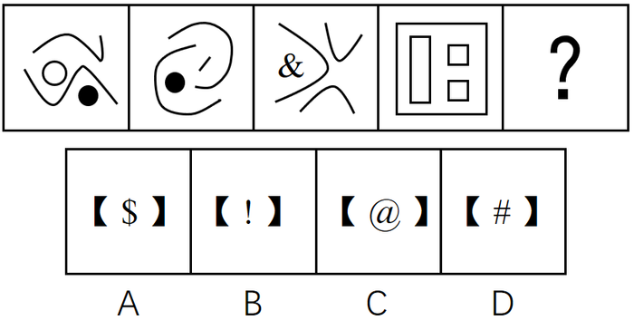
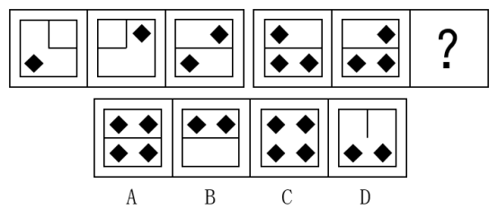
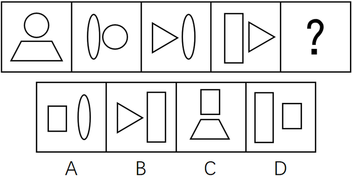

# 2017年422联考《行测》题（江西卷）

> 判断推理 · 35 题 · 江西 2017

## 第 1 题　qid 2050876 · 图形推理

从所给四个选项中，选择最合适的一个填入问号处，使之呈现一定的规律性：

- **A**. A　✅
- **B**. B
- **C**. C
- **D**. D

**答案**：A

**官方解析**

元素组成不同，而题干中4幅图形均由多个面构成，优先考虑数量规律中面的关系。观察发现面数量分别为5、5、3、10，不呈现明显的规律。再观察发现，题干中每幅图形均含有三角形，而选项中只有A选项含有三角形。
故正确答案为A。

---

## 第 2 题　qid 2050882 · 图形推理

从所给四个选项中，选择最合适的一个填入问号处，使之呈现一定的规律性：

- **A**. A
- **B**. B　✅
- **C**. C
- **D**. D

**答案**：B

**官方解析**

元素组成不同，无明显的属性规律，考虑数量规律。观察发现，出现黑色粗线条图形，可优先考虑部分数。题干中4幅图形的部分数均为4，选项中只有B选项部分数为4，其余选项部分数均为3。
故正确答案为B。

---

## 第 3 题　qid 2050886 · 图形推理

从所给四个选项中，选择最合适的一个填入问号处，使之呈现一定的规律性：

- **A**. A
- **B**. B
- **C**. C
- **D**. D　✅

**答案**：D

**官方解析**

思路一：通过观察发现，整体看图形都是轴对称图形，且对称轴方向依次逆时针旋转45°，问号处应选择一个竖轴对称的图形，即D选项。
思路二：通过观察发现，所有小黑点每次都沿图形外圈逆时针移动一格，问号处延续此规律，即D选项。
故正确答案为D。

---

## 第 4 题　qid 2050892 · 图形推理

从所给四个选项中，选择最合适的一个填入问号处，使之呈现一定的规律性：

- **A**. A
- **B**. B
- **C**. C　✅
- **D**. D

**答案**：C

**官方解析**

图形元素组成相似，优先考虑样式规律。第一组图形中，图1和图2黑块相加，内部直线去同存异，得到图3。第二组图形依照此规律，图1和图2黑块相加后，“？”号处内部应为4个小黑块，且中间的直线去掉，对应到C选项。
故正确答案为C。

---

## 第 5 题　qid 2050896 · 图形推理

从所给四个选项中，选择最合适的一个填入问号处，使之呈现一定的规律性：

- **A**. A
- **B**. B
- **C**. C
- **D**. D　✅

**答案**：D

**官方解析**

元素组成相似，且相同元素重复出现，优先考虑样式规律的遍历。观察发现题干相邻两图之间都有一个且只有一个相同的元素，只有D项符合。
故正确答案为D。

---

## 第 6 题　qid 2050902 · 定义判断

危机公关是指由于企业管理不善，同行竞争甚至遭遇恶意破坏或者外界特殊事件的影响，而给企业或者品牌带来危机，企业针对危机所采取的一系列自救行动，包括消除影响、恢复形象等。
根据上述定义，下列属于危机公关的是：

- **A**. 某智能手机制造商在行业竞争中失去领先地位，利润大幅下滑，公司高层决定转向新的领域
- **B**. 由于国际原油价格大幅上涨，使得汽油生产成本提高，公司领导召开会议研究对策
- **C**. 某智能手机制造商生产的一款手机由于电池缺陷被曝光后，该智能手机生产商通过媒体向公众道歉，并主动将问题手机召回　✅
- **D**. 台风将某公司的户外广告牌吹倒了，公司派人前去修复

**答案**：C

**官方解析**

第一步：找出定义关键词。
“由于企业管理不善，同行竞争甚至遭遇恶意破坏或者外界特殊事件的影响，而给企业或者品牌带来危机”、“企业针对危机所采取的一系列自救行动”。
第二步：逐一分析选项。
A项：智能手机制造商在行业竞争中失去领先地位，利润大幅下滑，符合“同行竞争给企业或者品牌带来危机”，公司高层决定转向新的领域，并非针对危机所采取的一系列自救行动，不符合定义，排除；
B项：国际原油价格大幅上涨，使得汽油生产成本提高，并未给企业或者品牌带来危机，不符合定义，排除；
C项：对于电池缺陷曝光事件给企业带来的危机，生产商采取自救行动，通过向公众道歉，并主动将问题手机召回，来挽回企业的声誉，消除影响，符合定义，当选；
D项：台风将某公司的户外广告牌吹倒，并未给企业或者品牌带来危机，不符合定义，排除。
故正确答案为C。

---

## 第 7 题　qid 2050906 · 定义判断

劳动争议是指在劳动者和劳动力使用者之间因劳动权利与义务发生分歧而引起的争议。
根据上述定义，下列属于劳动争议的是：

- **A**. 职工小周因工作调动的问题与当地劳动部门发生争执
- **B**. 某企业职工小张和小李因工作上意见不合而产生矛盾
- **C**. 两个单位之间因职工小刘的借调问题而产生矛盾
- **D**. 职工老王因工伤未能获得保险赔偿而与工厂争执　✅

**答案**：D

**官方解析**

第一步：找到定义关键词。
“劳动者和劳动力使用者之间因劳动权利与义务发生分歧而引起的争议”。
第二步：逐一分析选项。
A项：职工小周与当地劳动部门并非劳动者和劳动力使用者的关系，不符合定义，排除；
B项：企业职工小张和小李并非劳动者和劳动力使用者的关系，不符合定义，排除；
C项：两个单位并非劳动者和劳动力使用者的关系，不符合定义，排除；
D项：职工老王与工厂是劳动者和劳动力使用者的关系，因为工伤未能获得保险赔偿而争执，劳动者有获得保险赔偿的权利，工厂有支付保险赔偿的义务，是因劳动权利与义务发生分歧而引起的争议，符合定义，当选。
故正确答案为D。

---

## 第 8 题　qid 2050908 · 定义判断

典范借鉴是指从他人（或对方）那里发现、学习并应用最佳做法的过程，以达到帮助改善自身业绩的目的。
根据上述定义，下列属于典范借鉴的是：

- **A**. 小王刚学打扑克时总是输，后来掌握了打扑克的一些规则和技巧，他打扑克就经常赢
- **B**. 张三看见李四在某企业工作收入颇丰，随后他也应聘到该企业上班
- **C**. 小刚在同桌小红的帮助下，学习成绩大幅提高
- **D**. 某国企吸取国外著名企业生产同类产品的先进经验，降低成本，提高效益　✅

**答案**：D

**官方解析**

第一步，找出定义关键词。
“从他人（或对方）那里发现、学习并应用最佳做法的过程”、“帮助改善自身业绩的目的”。
第二步，逐一分析选项。
A项：“打扑克”只是娱乐消遣，没有体现“改善自身业绩”，不符合定义，排除；
B项：“张三看见李四在某企业工作收入颇丰，所以应聘到该企业上班”，没有体现“发现、学习并应用最佳做法”，不符合定义，排除；
C项：“小刚在同桌小红的帮助下”，是他人主动帮助他，不符合“从他人（或对方）那里发现、学习并应用”，并且学习成绩不属于业绩范畴，不符合定义，排除；
D项：“某国企吸取国外著名企业生产同类产品的先进经验”体现了“从他人（或对方）那里发现、学习并应用最佳做法的过程”，并且“提高效益”符合“改善自身业绩的目的”，符合定义，当选。
故正确答案为D。

---

## 第 9 题　qid 2050912 · 定义判断

流动偏好是指人们以货币的形式保持一部分资产的愿望和偏爱，它是一种心理动机，目的是应付日常开支、意外开支和在适当时机投机牟利。
根据上述定义，下列不属于流动偏好的是：

- **A**. 为了购买住宅商品房，小王参加工作后就开始为买房存钱　✅
- **B**. 最近一段时间股市行情一直不好，许多股民纷纷退出股市
- **C**. 银行一再降息，全国的储蓄率仍然很高
- **D**. 老刘平时节俭不乱花钱是怕突如其来的下岗后的拮据

**答案**：A

**官方解析**

第一步：找出定义关键词。
方式：以货币的形式保持一部分资产。
目的：应付日常开支、意外开支和在适当时机投机牟利活动需要。
第二步，逐一分析选项。
A项：购买住宅商品房，不属于应付日常开支、意外开支和在适当时机投机牟利，不符合定义，当选；
B项：股民退出股市是为了适当时机投机牟利，符合定义，排除；
C项：储蓄是把钱存入银行，是以货币的形式保持一部分资产，符合关键词，符合定义，排除；
D项：为怕下岗后生活拮据属于为了应付意外开支需要而保持资产，符合定义，排除。
本题为选非题，故正确答案为A。

---

## 第 10 题　qid 2050924 · 定义判断

商业秘密是指不为公众所知悉，能为权利人带来经济利益，具有实用性并经权利人采取保密措施的技术信息和经营信息。
根据上述定义，下列属于商业秘密的是：

- **A**. 云南白药的配方　✅
- **B**. 淘宝网“双十一”活动的具体细则
- **C**. 某军分区的管理规定
- **D**. 三七片的功效和作用

**答案**：A

**官方解析**

第一步，找出定义关键词。
“不为公众所知悉”、“能为权利人带来经济利益”、“具有实用性并经权利人采取保密措施的技术信息和经营信息”。
第二步，逐一分析选项。
A项：“云南白药的配方”是不对大众公开的，同时云南白药的相关产品能够为其生产厂家带来经济利益，并且“云南白药的配方”属于国家级保密处方，受到专利保护、行政保护、商标保护和商业秘密保护等，符合定义，当选；
B项：“淘宝网‘双十一’活动的具体细则”是对消费者公开的，以便于消费者能够享受到优惠，不符合“不为公众所知悉”，不符合定义，排除；
C项：“某军分区的管理规定”，是军区制定的规章制度，不能为权利人带来经济利益，不符合定义，排除；
D项：“三七片的功效和作用”是印刷在三七片的药品使用说明书上的，对大众是公开的，不符合“不为公众所知悉”，不符合定义，排除。
故正确答案为A。

---

## 第 11 题　qid 2050928 · 定义判断

工作扩大化是指在横向水平上增加工作任务的数目或变化性，使工作多样化。工作丰富化是指从纵向上赋予员工更复杂、更系列化的工作，使员工有更大的控制权。
根据上述定义，下列属于工作丰富化的是：

- **A**. 自助餐厅的伙计在面食、沙拉、蔬菜、饮品和甜点部都轮换工作
- **B**. 一家研究所，一个部门主管告诉他的下属，只要在预算内并且合法，他们就可以做想做的任何研究　✅
- **C**. 某公司员工小张不能胜任目前的岗位，领导安排他去了其他部门
- **D**. 快递公司的员工从原来只专门负责分拣货物增加到也负责分送到各个服务网点

**答案**：B

**官方解析**

第一步：找到定义关键词。
工作扩大化：“横向水平上增加工作任务的数目或变化性”、“使工作多样化”；
工作丰富化：“纵向上赋予员工更复杂、更系列化的工作”、“使员工有更大的控制权”。
第二步：逐一分析选项。
A项：自助餐厅的伙计在面食、沙拉部等轮换岗位，不符合“纵向上赋予员工更复杂、更系列化的工作”，不符合工作丰富化的定义，排除；
B项：部门主管让下属可以做想做的任何研究，符合“使员工有更大的控制权”，符合工作丰富化的定义，当选；
C项：小张不能胜任目前岗位，被安排到其他部门，不符合“纵向上赋予员工更复杂、更系列化的工作”，不符合工作丰富化的定义，排除；
D项：由只负责分拣增加到负责送到网点，不符合“纵向上赋予员工更复杂、更系列化的工作”，不符合工作丰富化的定义，排除。
故正确答案为B。

---

## 第 12 题　qid 2050930 · 定义判断

公地悲剧是指享用者都从自己私利出发，争取从中获取更多收益而付出的代价由大家负担。
根据上述定义，下列不属于公地悲剧的是：

- **A**. 军备竞赛的双方都面临着一个困境，一方面军事力量不断增加，另一方面国家安全却受到越来越多的威胁
- **B**. 博弈游戏中，任何“赢”的一方都是背离游戏的，任何“输”的一方也都是背离游戏的　✅
- **C**. 一群牧民一同在一块公共草场放牧。不少牧民都想多养羊增加个人收益，结果草场持续退化，直至无法养羊，最终导致所有牧民破产
- **D**. 有的企业把下水道污物、化学物质、放射性污染物和高温废弃物等排放到水体中，将有毒废气排放到大气中

**答案**：B

**官方解析**

第一步：找到定义关键词。
“享用者都从自己私利出发，争取从中获取更多收益而付出的代价由大家负担”。
第二步：逐一分析选项。
A项：为了能更好的军备竞赛，增加军事力量，体现了从自己私利出发，而国家安全受到越来越多的威胁，体现了付出的代价由大家负担，符合定义，排除；
B项：博弈游戏中，无论输赢都不是背离游戏的，只是针对博弈的两方都是背离游戏的，没有体现付出的代价由大家负担，不符合定义，当选；
C项：牧民想多养羊增加个人收益体现从自己私利出发，而造成草场退化、所有牧民破产，体现了付出的代价由大家负担，符合定义，排除；
D项：有的企业排放污染物，体现了从自己的私利出发，污染物的排放势必污染土壤、空气付出的代价由大家负担，符合定义，排除。
本题为选非题，故正确答案为B。

---

## 第 13 题　qid 2050932 · 定义判断

表象是指事物不在面前时，人们在头脑中出现的关于事物的形象，具有直观性、概括性、可操作性等特点，在形象思维中具有重要作用。
根据上述定义，下列属于表象的是：

- **A**. 没有见过北方冬日的人们，通过诵读毛泽东诗词《沁园春·雪》，可在头脑中形成北国风光的情景
- **B**. 猪八戒是吴承恩先生抽象出来的一个人物形象
- **C**. 当一个孩子盯着一幅画看上几分钟，闭上眼睛，依然能够清晰地记得这幅画的每一个细节　✅
- **D**. 当人们读到《红楼梦》中关于林黛玉生动的外貌描写时，似乎能看到林黛玉就站在眼前

**答案**：C

**官方解析**

第一步：找到定义关键词。
“事物不在面前”、“头脑出现”、“关于事物的形象”。
第二步：逐一分析选项。
A项：对没有见过的事物的主观想象，不符合定义，排除；
B项：猪八戒是作者主观想象的一个未出现过的人物形象，不符合定义，排除；
C项：当孩子闭眼时，这幅画形象在其脑中再次呈现，符合定义，当选；
D项：对没有见过的事物的主观想象，不符合定义，排除。
故正确答案为C。

---

## 第 14 题　qid 2050934 · 定义判断

反应性相倚是指在沟通过程中，沟通双方都以对方的行为作为自己行为的依据，做出相应的反应，而并不按照原来的计划进行沟通。
根据上述定义，下列属于反应性相倚的是：

- **A**. 小张同意按照编辑意见修改稿件，但希望保留原文的写作风格，与编辑沟通后，编辑表示同意　✅
- **B**. 张厂长在大会上宣读了关于加强劳动纪律的发言稿，由于制定的措施不合理，职工在下面议论纷纷，但他还是完成了自己的发言
- **C**. 王老师认为他为学生准备的口试题目并不难，但仍有一些学生回答不出，当学生要求王老师提示时，王老师断然拒绝
- **D**. 爸爸得知小红考试失利后，准备劝慰一番，但他发现小红的情绪并未受到影响，于是放弃了劝慰小红的打算

**答案**：A

**官方解析**

第一步：找出定义关键词。
“沟通双方”、“以对方的行为作为自己行为的依据”、“并不按照原来的计划进行沟通”。
第二步：逐一分析选项。
A项：小张和编辑是沟通双方，小张同意按照编辑意见修改稿件，编辑同意小张保留原文的写作风格，符合“以对方的行为作为自己行为的依据”、“并不按照原来的计划进行沟通”，符合定义，当选；
B项：尽管职工在下面议论纷纷，张厂长还是完成了自己的发言，不符合“以对方的行为作为自己行为的依据”，不符合定义，排除；
C项：当学生要求王老师提示时，王老师断然拒绝了，不符合“以对方的行为作为自己行为的依据”，不符合定义，排除；
D项：爸爸发现小红的情绪没受到影响，放弃劝慰小红，说明爸爸和小红之间可能并没有进行沟通，小红没有以爸爸的行为作为自己行为的依据，不符合定义，排除。
故正确答案为A。

---

## 第 15 题　qid 2050936 · 定义判断

演绎作品是指在已有作品的基础上，通过改编、翻译、注释、整理等创造性劳动而产生的作品。
根据上述定义，下列不属于演绎作品的是：

- **A**. 《基督山伯爵》的电影剧本
- **B**. 《飘》中英文对照版
- **C**. 《〈唐诗三百首〉经典诗句评析》　✅
- **D**. 《〈离骚〉难点词汇释义》

**答案**：C

**官方解析**

第一步：找出定义关键词。
“在已有作品的基础上”、“通过改编、翻译、注释、整理等创造性劳动”、“作品”。
第二步：逐一分析选项。
A项：电影剧本是指以文字描述整部影片的人物和动作内容所采取的写作形式。《基督山伯爵》是已有作品，《基督山伯爵》的电影剧本就是在已有作品的基础上，通过改编、整理等创造性劳动而产生的作品，符合定义。
B项：《飘》是已有作品，《飘》中英文对照版就是在已有作品的基础上，通过翻译、整理等创造性劳动而产生的作品，符合定义。
C项：《唐诗三百首》是已有作品，但对经典诗句进行评析不符合关键词“通过改编、翻译、注释、整理等创造性劳动”，不符合定义。
D项：《离骚》是已有作品，《〈离骚〉难点词汇释义》就是在已有作品的基础上，通过注释、整理等创造性劳动而产生的作品，符合定义。
本题为选非题，故正确答案为C。

---

## 第 16 题　qid 2050942 · 类比推理

电流强度：安培

- **A**. 功率：伏特
- **B**. 电阻：欧姆　✅
- **C**. 电荷：瓦特
- **D**. 压强：牛顿

**答案**：B

**官方解析**

第一步：判断题干词语间逻辑关系。
电流强度的单位是安培，二者是物理概念与单位的对应关系。
第二步：判断选项词语间逻辑关系。
A项：功率的单位是“瓦特”，而非“伏特”，与题干逻辑关系不一致，排除；
B项：电阻的单位是“欧姆”，二者之间是物理概念与单位的对应关系，与题干逻辑关系一致，当选；
C项：带正负电的基本粒子被称为电荷，它的单位不是“瓦特”，与题干逻辑关系不一致，排除；
D项：压强的单位是“帕斯卡”，而非“牛顿”，与题干逻辑关系不一致，排除。
故正确答案为B。

---

## 第 17 题　qid 2050948 · 类比推理

厨房：高压锅：电饭煲

- **A**. 运动场：球迷：座位
- **B**. 教室：课桌：讲台　✅
- **C**. 书桌：书架：台灯
- **D**. 农田：水稻：水牛

**答案**：B

**官方解析**

第一步：判断题干词语间逻辑关系。
高压锅和电饭煲都是厨房用具，两者是并列关系，且厨房是地点，高压锅和电饭煲都主要在厨房中使用，是物品与地点的对应关系。
第二步：判断选项词语间逻辑关系。
A项：“球迷”坐在“座位”上，不是并列关系，与题干逻辑关系不一致，排除；
B项：“课桌”和“讲台”都是教室用具，两者是并列关系，且教室是地点，课桌和讲台都主要在教室里使用，与题干逻辑关系一致，当选；
C项：“书桌”“书架”是属于家具，“台灯”是家电，与题干逻辑关系不一致，排除；
D项：“水稻”和“水牛”不是并列关系，与题干逻辑关系不一致，排除。
故正确答案为B。

---

## 第 18 题　qid 2050952 · 类比推理

精致：粗糙

- **A**. 河水：海水
- **B**. 山峰：深渊
- **C**. 违背：遵循　✅
- **D**. 怀疑：守信

**答案**：C

**官方解析**

第一步：判断题干词语间逻辑关系。
精致和粗糙是反义关系。
第二步：判断选项词语间逻辑关系。
A项：河水和海水是并列关系，而不是反义关系，与题干逻辑关系不一致，排除；
B项：山峰和深渊是并列关系，而不是反义关系，与题干逻辑关系不一致，排除；
C项：违背和遵循是反义关系，与题干逻辑关系一致，当选；
D项：怀疑和守信不是反义关系，与题干逻辑关系不一致，排除。
故正确答案为C。

---

## 第 19 题　qid 2050956 · 类比推理

失之毫厘：谬以千里

- **A**. 三十六计：走为上计
- **B**. 召之即来：挥之即去
- **C**. 种瓜得瓜：种豆得豆
- **D**. 前人栽树：后人乘凉　✅

**答案**：D

**官方解析**

第一步：判断题干词语间逻辑关系。
失之毫厘和谬以千里可以组成一句话，意思是相差虽小，但是造成的误差或错误极大。且失之毫厘会导致谬以千里，二者是因果关系。
第二步：判断选项词语间逻辑关系。
A项：三十六计和走为上计可以组成一句话，意思是事情已经到了无可奈何的地步，没有别的好办法，只能出走。三十六计和走为上计是组成关系，与题干逻辑关系不一致，排除；
B项：召之即来和挥之即去可以组成一句话，意思是非常听从指挥。召之即来和挥之即去是并列关系，与题干逻辑关系不一致，排除；
C项：种瓜得瓜和种豆得豆可以组成一句话，意思是做了什么事，得到什么样的结果。种瓜得瓜和种豆得豆是并列关系，与题干逻辑关系不一致，排除；
D项：前人栽树和后人乘凉可以组成一句话，意思是前人做的劳动，后人来享受。且前人栽树和后人乘凉是因果关系，与题干逻辑关系一致，当选。
故正确答案为D。

---

## 第 20 题　qid 2050958 · 类比推理

黑色：颜色

- **A**. 米饭：粮食　✅
- **B**. 小草：树木
- **C**. 粗心：信心
- **D**. 鱼：湖泊

**答案**：A

**官方解析**

第一步：判断题干词语间逻辑关系。
黑色是一种颜色，二者是种属关系。
第二步：判断选项词语间逻辑关系。
A项：米饭是一种粮食，二者是种属关系，与题干逻辑关系一致，当选；
B项：小草不是树木，二者不是种属关系，与题干逻辑关系不一致，排除；
C项：粗心不是信心，二者不是种属关系，与题干逻辑关系不一致，排除；
D项：鱼可以生活在湖泊里，二者不是种属关系，与题干逻辑关系不一致，排除。
故正确答案为A。

---

## 第 21 题　qid 2050814 · 类比推理

饭店：厨师：菜肴

- **A**. 监狱：狱警：囚犯
- **B**. 工厂：工人：产品　✅
- **C**. 舞台：演员：道具
- **D**. 学校：教师：学生

**答案**：B

**官方解析**

第一步：判断题干词语间逻辑关系。
厨师是一种职业，饭店是厨师工作的地点，菜肴是厨师的制作成品。
第二步：判断选项词语间逻辑关系。
A项：狱警是一种职业，监狱是狱警工作的地点，囚犯不是狱警的制作成品，而是狱警管理的对象，与题干逻辑关系不一致，排除；
B项：工人是一种职业，工厂是工人工作的地点，产品是工人的制作成品，与题干逻辑关系一致，当选；
C项：演员是一种职业，舞台是演员工作的地点，道具不是演员的制作成品，而是演员表演需要的工具，与题干逻辑关系不一致，排除；
D项：教师是一种职业，学校是教师工作的地点，学生不是教师的制作成品，而是教师授课的对象，与题干逻辑关系不一致，排除。
故正确答案为B。

---

## 第 22 题　qid 2050816 · 类比推理

商品：购买：商店

- **A**. 网购：付款：网络
- **B**. 看书：学习：图书馆
- **C**. 信件：邮寄：邮局　✅
- **D**. 股票：投资：账户

**答案**：C

**官方解析**

第一步：判断题干词语间逻辑关系。
购买商品是动宾结构，商店是购买商品的地点。
第二步：判断选项词语间逻辑关系。
A项：付款网购不是动宾结构，与题干逻辑关系不一致，排除；
B项：学习看书不是动宾结构，与题干逻辑关系不一致，排除；
C项：邮寄信件是动宾结构，邮局是邮寄信件的地点，与题干逻辑关系一致，当选；
D项：投资股票是动宾结构，但账户不是投资股票的地点，与题干逻辑关系不一致，排除。
故正确答案为C。

---

## 第 23 题　qid 2050820 · 类比推理

吊灯  对于（  ）  相当于  台历  对于（  ）

- **A**. 屋顶：墙壁
- **B**. 墙壁：客厅
- **C**. 客厅：桌子
- **D**. 屋顶：桌子　✅

**答案**：D

**官方解析**

逐一代入选项。
A项：吊灯安装在屋顶之上，为对应关系，台历与墙壁无明显的逻辑关系，墙壁对应的应该是挂历，前后逻辑关系不一致，排除；
B项：吊灯与墙壁无明显逻辑关系，与墙壁为对应关系的是壁灯，台历可以放在客厅中，为对应关系，前后逻辑关系不一致，排除；
C项：吊灯在客厅中，为场所的对应，台历在桌子上，但桌子不是场所，不是场所的对应，前后逻辑关系不一致，排除；
D项：吊灯可直接安装在屋顶上，台历可直接放置在桌子上，都为直接接触物品的对应关系，前后逻辑关系一致，当选。
故正确答案为D。

---

## 第 24 题　qid 2050824 · 类比推理

电动汽车：电动车：汽车

- **A**. 航天飞机：宇宙飞船：飞行器
- **B**. 军医：医生：军人　✅
- **C**. 研究生：研究：学生
- **D**. 法官：法律：官员

**答案**：B

**官方解析**

第一步：判断题干词语间逻辑关系。
电动车和汽车是交叉关系，电动汽车是二者交叉的部分。
第二步：判断选项词语间逻辑关系。
A项：宇宙飞船是飞行器的一种，二者为种属关系，与题干逻辑关系不一致，排除；
B项：医生和军人是交叉关系，军医是二者交叉的部分，与题干逻辑关系一致，当选；
C项：研究和学生不是交叉关系，与题干逻辑关系不一致，排除；
D项：官员和法律不是交叉关系，与题干逻辑关系不一致，排除。
故正确答案为B。

---

## 第 25 题　qid 2050832 · 类比推理

（  ）对于  冲突  相当于  （  ）  对于  交流

- **A**. 矛盾；接触　✅
- **B**. 战争；遭遇
- **C**. 麻烦；喜欢
- **D**. 陌生；熟悉

**答案**：A

**官方解析**

逐一代入验证选项。
A项：因为矛盾，所以产生冲突，两者是因果关系，因为接触，所以促进交流，前后逻辑关系一致，当选；
B项：冲突可能导致战争，两者是因果关系，遭遇和交流之间没有明显的关联，前后逻辑关系不一致，排除；
C项：麻烦和冲突之间没有明显联系，交流与喜欢之间没有明显联系，前后逻辑关系不一致，排除；
D项：陌生和冲突没有明显的因果关系，因为交流变得熟悉，两者是因果关系，前后逻辑关系不一致，排除。
故正确答案为A。

---

## 第 26 题　qid 2050852 · 逻辑判断

某市有甲乙丙丁四家书店，其中甲书店的各种图书都能在乙书店找到，在乙书店出售的图书一定也在丙书店出售，而丙书店有一些图书在丁书店中也有销售。
由此可以推出：

- **A**. 甲书店中有一些图书能在丁书店中找到
- **B**. 乙书店中有一些图书能在丁书店中找到
- **C**. 丁书店中所有的图书都能够在乙书店中找到
- **D**. 甲书店中所有的图书都能在丙书店中找到　✅

**答案**：D

**官方解析**

第一步：翻译题干。

①甲书店图书乙书店图书

②乙书店图书丙书店图书

③有的丙书店图书丁书店图书

将①、②串联成④甲书店图书乙书店图书丙书店图书

第二步：逐一分析选项。

A项：翻译为有的甲书店图书丁书店图书，无法推出，排除；

B项：翻译为有的乙书店图书丁书店图书，无法推出，排除；

C项：翻译为丁书店图书乙书店图书，无法推出，排除；

D项：翻译为甲书店图书丙书店图书，是对④的肯前推肯后，可以推出，当选。

故正确答案为D。

---

## 第 27 题　qid 2050858 · 逻辑判断

有四个人，他们分别是小偷、强盗、法官、警察。第一个人说：“第二个人不是小偷。”第二个人说：“第三个是警察。”第三个人说：“第四个人不是法官。”第四个人说：“我不是警察，而且除我之外只有警察会说实话。”如果第四个人说的是实话，那么以下说法正确的是：

- **A**. 第一个人是警察，第二个人是小偷
- **B**. 第一个人是小偷，第四个人是法官
- **C**. 第三个人是警察，第四个人是法官
- **D**. 第二个人是强盗，第三个人是小偷　✅

**答案**：D

**官方解析**

分析题干已知信息。
①第二个人不是小偷
②第三个人是警察
③第四个人不是法官
④第四个人不是警察，且只有第四个人和警察说真话
通过④可知①②③中，只有一个人说真话，故本题为真假推理题。因为三句话中，没有矛盾和反对关系，故可考虑代入排除。
A项：第一个人是警察，代入题干，即“第二个人不是小偷”为真，那么与A“第二个人是小偷”矛盾，排除；
B项：第一个人是小偷，那么他说的话是假话，代入题干，“第二个人不是小偷”为假，即第二个人是小偷，而小偷只有一个，不能两人都是小偷，排除；
C项：第三个人是警察，那么第三个人说真话，而题干第二个人说：“第三个是警察。”即两个人说了真话，排除。
故正确答案为D。

---

## 第 28 题　qid 2050864 · 类比推理

小李说：“我这次通过了所有科目的考试，拿到了机动车驾驶证。”如果小李说的不是事实，则下列选项一定正确的是：

- **A**. 小李至少有一个科目的考试没有通过　✅
- **B**. 小李只有一个科目的考试没有通过
- **C**. 小李至多有一个科目的考试没有通过
- **D**. 小李没有通过所有科目的考试

**答案**：A

**官方解析**

第一步：分析题干。
小李指出“所有科目的考试都通过了”，即“所有a都是b”。已知“小李说的不是事实”，即它的矛盾命题为真，根据“所有a都是b”的矛盾命题为“有a的不是b”可知，“有的科目的考试没有通过”为真。
第二步：逐一分析选项。
A项：“有的科目的考试没有通过”等价于“至少有一个科目的考试没有通过”，说法正确，当选；
B项：根据“有的科目的考试没有通过”无法确定“只有一个科目的考试没有通过”，说法不一定正确，排除；
C项：根据“有的科目的考试没有通过”无法确定“至多有一个科目的考试没有通过”，说法不一定正确，排除；
D项：“没有通过所有科目的考试”等同于“所有科目的考试都没通过”，根据“有的科目的考试没有通过”无法确定“所有科目的考试都没通过”，说法不一定正确，排除。
故正确答案为A。

---

## 第 29 题　qid 2050868 · 逻辑判断

某软件公司的员工中，三个广东人，一个北京人，三个北方人，有四个人只负责软件开发，有两个人只负责产品销售。如果以上的介绍涉及了该公司所有员工，则该公司的员工：

- **A**. 最少可能是7个人，最多可能是12个人
- **B**. 最少可能是7个人，最多可能是13个人
- **C**. 最少可能是6个人，最多可能是12个人　✅
- **D**. 最少可能是6个人，最多可能是13个人

**答案**：C

**官方解析**

要使得公司的员工人数最多，应当让所有集合尽可能相斥，但北京人一定是北方人，必须相容，其他均可相斥，故最多有3个广东人、3个北方人、4个只负责软件开发的人、2个只负责产品销售的人，共计12人；如果要使得公司的员工人数尽可能的少，应当让所有集合尽可能地相容，3个广东人，3个北方人（含北京人）共计6人以地域划分，而4个负责软件开发的人、2个负责产品销售的人也共计6人以职业划分，地域划分与职业划分相斥，但是二者可以相容，可将地域划分的人与职业划分的人交叉，实现人数的最少，即一个人拥有地域和职业两个划分标准，从而实现了最少可能达到的人数6人。
故正确答案为C。

---

## 第 30 题　qid 2050890 · 逻辑判断

所有刑事侦查专业的大四学生毕业后都当警察了，有的警察是党员，刑事侦查专业的大四学生都不是警察，由此可以推出的是：

- **A**. 有的党员是刑事侦查专业的大学毕业生
- **B**. 有的党员不是刑事侦查专业的大四学生　✅
- **C**. 有的刑事侦查专业的大四学生是党员
- **D**. 有的刑事侦查专业的大四学生不是党员

**答案**：B

**官方解析**

第一步：翻译题干。

①刑事侦查专业的大四学生毕业后警察；

②有的警察党员；

③刑事侦查专业的大四学生-警察。

第二步：逐一分析选项。

A项：翻译为有的党员刑事侦查专业的大学毕业生，从题干条件②有的警察党员，无法推出其是否是刑事侦查专业的大学毕业生，无法推出，排除；

B项：翻译为有的党员-刑事侦查专业的大四学生，由题干条件②有的警察是党员，可知有的党员是警察，根据条件③刑事侦查专业的大四学生-警察，可以推出有的党员-刑事侦查专业的大四学生，可以推出，当选；

C项：翻译为有的刑事侦查专业的大四学生党员，根据条件③刑事侦查专业的大四学生-警察，无法得知其是否是党员，无法推出，排除；

D项：翻译为有的刑事侦查专业的大四学生-党员，根据条件③刑事侦查专业的大四学生-警察，无法得知其是否是党员，无法推出，排除。

故正确答案为B。

---

## 第 31 题　qid 2050894 · 类比推理

某高校今年实行自主招生，经学校讨论决定，优先录取那些综合素质高的考生，而不是像绝大多数高校那样，根据考生笔试的成绩高低进行录取。此高校的这个决定最应具备作为前提条件的选项是：

- **A**. 综合素质低的考生就不是好学生
- **B**. 每个考生的综合素质是不同的
- **C**. 有能够评判考生综合素质高低的可行方法　✅
- **D**. 笔试成绩高的考生不一定是好学生

**答案**：C

**官方解析**

第一步：找到论点和论据。
论点：某高校自主招生，优先录取综合素质高的考生，而不是像其他高校根据笔试的成绩高低进行录取。
论据：无。
第二步：逐一分析选项。
A项：论点是优先录取那些综合素质高的考生，选项说的是综合素质低的考生就不是好学生，与论点无关，属于无关选项，不能加强论点，排除；
B项：综合素质是否不同与论点优先录取综合素质高的考生无关，属于无关选项，不能作为这个决定最应该具备的前提条件，不能加强论点，排除；
C项：优先录取那些综合素质高的考生的前提是有办法筛选出来，有评判考生综合素质高低的可行方法，能够优先录取出那些综合素质高的考生，是必要条件，这是此高校最应具备的前提条件，可以加强论点，当选；
D项：笔试成绩的高低与综合素质的高低无关，属于无关选项，不能作为这个决定最应该具备的前提条件，不能加强论点，排除。
故正确答案为C。

---

## 第 32 题　qid 2050900 · 逻辑判断

孔子说：“己所不欲，勿施于人。”
以下哪项不是上面这句话的逻辑推理：

- **A**. 若己所欲，则施于人　✅
- **B**. 只有己所欲，才能施于人
- **C**. 除非己所欲，否则不施于人
- **D**. 凡施于人的都应该是己所欲的

**答案**：A

**官方解析**

第一步：翻译题干。

己所不欲勿施于人。

第二步：逐一分析选项。

A项：翻译为己所欲施于人，否前推不出必然结论，无法推出，当选；

B项：翻译为施于人己所欲，否后推否前，可以推出，排除；

C项：翻译为施于人己所欲，否后推否前，可以推出，排除；

D项：翻译为施于人己所欲，否后推否前，可以推出，排除。

本题为选非题，故正确答案为A。

---

## 第 33 题　qid 2050904 · 逻辑判断

广告的目的是为了说服消费者相信他们购买的商品物有所值，没有哪个商家会故意强调自己的产品价格高。以下哪项如果为真，最能加强上述论断？

- **A**. 消费者认为便宜无好货，好货不便宜
- **B**. 广告能激发消费者的购买欲
- **C**. 广告能说服消费者去购买价格便宜的商品
- **D**. 广告能说服消费者去购买质量好的商品　✅

**答案**：D

**官方解析**

本题论点重点强调的是：广告的目的是为了让消费者认为物有所值，弱化了价格问题。本题只有论点没有论据，无法搭桥，因此要通过补充论据的方式来加强，找一个能够解释为什么广告会让消费者认为商品物有所值的选项，或者举例子说明广告的目的确实如论点所说，因此正确答案应该跟物有所值紧密相关，而不侧重价格问题。
第一步：找出论点和论据。
论点：广告的目的是为了说服消费者相信他们购买的商品物有所值，没有哪个商家会故意强调自己的产品价格高。
论据：无。
第二步：逐一分析选项。
A项：论点讨论的是广告的目的是什么，而A选项是消费者个人的消费观念，与广告的目的无关，不能加强，排除；
B项：广告能激发消费者的购买欲，“购买欲”与“物有所值”无明显关联性，属于无关选项，不能加强，排除；
C项：广告能说服消费者去购买价格便宜的商品，但是不能确定这些商品是否物有所值，不能加强，排除；
D项：题干中的观点是让消费者买物有所值的商品，本质就是在说服消费者买质量好的商品，该选项补充了论据，进一步解释说明了“物有所值”的意义，可以加强，当选。
故正确答案为D。

---

## 第 34 题　qid 2050916 · 逻辑判断

小明每个周末都要去校外上英语补习班，小强从来没有上过英语补习班。结果，这次期末考试，小明和小强的英语成绩分别是95分和55分。因此，小明的英语成绩比小强好的原因是由于上了校外补习班。
以下哪项如果为真，最能削弱上述论断：

- **A**. 英语补习班的老师教学不太认真
- **B**. 小红和小明同时上了英语补习班，她这次英语考了80分
- **C**. 上次英语考试，小明和小强的英语成绩分别为99分和39分　✅
- **D**. 小刚也没有上过英语补习班，他这次英语考了80分

**答案**：C

**官方解析**

第一步：找出论点和论据。
论点：小明的英语成绩比小强好的原因是由于上了校外补习班。
论据：小明每个周末都要去校外上英语补习班，小强从来没有上过英语补习班。结果，这次期末考试，小明和小强的英语成绩分别是95分和55分。
第二步：逐一分析选项。
A项：英语补习班老师的教学不太认真，不代表补习班对提高考试成绩没有帮助，跟小明比小强考的分数高无关，属于无关选项，不能削弱，排除；
B项：小红的分数比小强高，无法证明补习班对小明和小强成绩造成的影响，属于无关选项，不能削弱，排除；
C项：上次英语考试，小明和小强的英语成绩分别为99分和39分，而这次小明上了补习班却退步了，而小强则进步了，说明上补习班没有效果，可以削弱，当选；
D项：无论小刚上没上补习班，考多少分，都无法证明补习班对小明和小强成绩造成的影响，属于无关选项，不能削弱，排除。
故正确答案为C。

---

## 第 35 题　qid 2050920 · 逻辑判断

计算机程序员长时间对着电脑屏幕工作很容易患近视眼，为了帮助这部分人预防和缓解近视，公司为员工印发了宣传册，教大家预防和治疗近视的一些方法。
以下哪项如果为真，最能对上述宣传的效果提出质疑：

- **A**. 不经常对着电脑工作的人也可能患近视
- **B**. 预防和治疗近视的方法因人而异
- **C**. 预防和治疗近视需要眼科医生指导
- **D**. 近视很难进行自我预防和治疗　✅

**答案**：D

**官方解析**

第一步：找到论点论据。
论点：计算机程序员长时间对着电脑屏幕工作很容易患近视眼，为了帮助这部分人预防和缓解近视，公司为员工印发了宣传册，教大家预防和治疗近视的一些方法。
论据：没有论据。
第二步：逐一分析选项。
A项：不经常对着电脑工作的人也可能近视，这与预防和治疗近视的方法是否有效无直接关系，属无关选项，不能削弱，排除；
B项：预防和治疗近视的方法因人而异，与预防和治疗近视的方法是否有效无直接关系，属无关选项，不能削弱，排除；
C项：预防和治疗近视需要眼科医生指导，有无眼科医生指导与预防和治疗近视的方法是否有效无直接关系，属无关选项，不能削弱，排除；
D项：近视很难进行自我预防和治疗，说明通过这些方法达不到预防和缓解的目的，从而直接削弱了题干论点，可以削弱，当选。
故正确答案为D。

---
