# 2017年422联考《行测》题（浙江A卷）

> 判断推理 · 40 题 · 浙江 2017

## 第 1 题　qid 2049956 · 图形推理

把下面的六个平面图形分为两类，使每一类图形都有各自的共同特征或规律，分类正确的一项是：

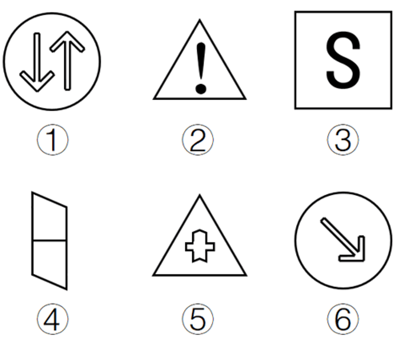

- **A**. ①②⑤，③④⑥
- **B**. ①③⑥，②④⑤
- **C**. ①②④，③⑤⑥
- **D**. ①③④，②⑤⑥　✅

**答案**：D

**官方解析**

图形元素组成不同，优先考虑属性规律。题干中6个图形都是对称图形，所以考虑对称性，①③④为中心对称图形，②⑤⑥为轴对称图形。
故正确答案为D。

---

## 第 2 题　qid 2049954 · 图形推理

从所给的四个选项中，选择最合适的一个填入问号处，使之呈现一定的规律性：

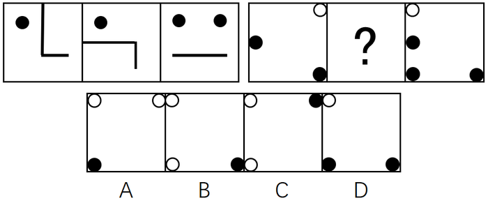

- **A**. A
- **B**. B　✅
- **C**. C
- **D**. D

**答案**：B

**官方解析**

图形元素组成相似，优先考虑样式规律。因为第二组图中问号在中间，所以优先观察第一组图中第一个图形和第三个图形是如何得到第二个图形的。第一个图形与第三个图形去同求异得到图①，然后再逆时针旋转得到第二个图形，第二组满足同样的规律，第一个图形与第三个图形去同求异得到图②，再逆时针旋转得到的图形与B项相同。

故正确答案为B。

---

## 第 3 题　qid 2050160 · 图形推理

把下面的六个图形分为两类，使每一类图形都有各自的共同特征或规律，分类正确的一项是：

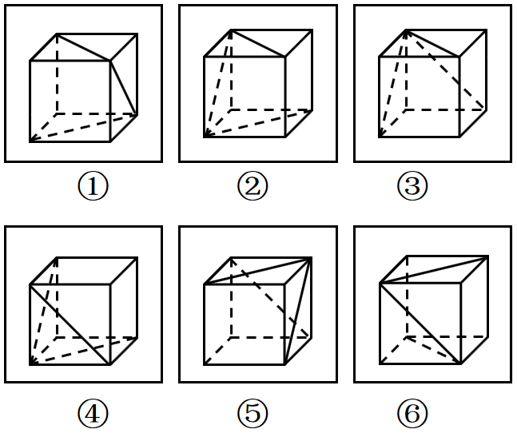

- **A**. ①③④，②⑤⑥
- **B**. ①②⑥，③④⑤　✅
- **C**. ①②⑤，③④⑥
- **D**. ①③⑥，②④⑤

**答案**：B

**官方解析**

本题为分组分类题目，题干中6幅图形均由一个正六面体和面内的3条对角线构成，考虑3条对角线之间的关系。观察发现，3条对角线之间不存在明显的垂直或者平行关系，考虑3条对角线所在面的关系。①②⑥三面中，三条对角线所标示的面存在相对面；而③④⑤三面中，三条对角线所在的面任意两面均两两相邻。
故正确答案为B。

---

## 第 4 题　qid 2050058 · 图形推理

从所给的四个选项中，选择最合适的一个填入问号处，使之呈现一定的规律性：

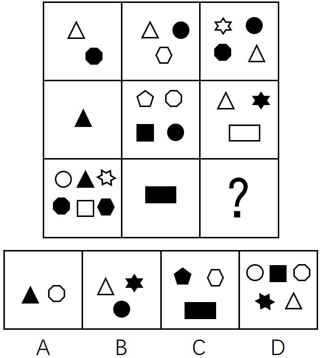

- **A**. A　✅
- **B**. B
- **C**. C
- **D**. D

**答案**：A

**官方解析**

图形组成不同，出现多个独立小元素，优先考虑元素个数和种类。

方法一：横向和竖向考虑题干图形的独立元素的种类和个数均无明显规律，图形中元素有黑有白，分开数，第一行：黑1白1，黑1白2，黑2白2；第二行：黑1白0，黑2白2，黑1白2；第三行：黑3白3，黑1白0，？。观察发现，黑白色两种元素个数的差值存在规律，白色元素个数减去黑色元素个数，出现“0、1、0、-1”的S型重复，如下图所示：

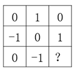

？处应该选择白色元素等于黑色元素的选项，即A选项。

故正确答案为A。

方法二：观察九宫格中有白色与黑色两种元素，如果按照白色元素（忽略形状）和黑色元素（忽略形状）两种元素样式来区分，经观察发现，黑色元素与白色元素加和都为12个，再加上A选项的一黑一白元素，则黑色元素与白色元素加和都为13个。

方法三：观察题干元素种类，第一行：2种，3种，4种；第二行：1种，4种，3种；第三行：6种，1种，？。观察发现，题干依次是：偶数个，奇数个，偶数个，奇数个，偶数个，奇数个，偶数个，奇数个，？，所以问号处要找一个偶数个的，只有A符合。

故正确答案为A。

---

## 第 5 题　qid 2049950 · 图形推理

如图所示，立方体上叠加圆柱体再打通一个圆柱孔，然后从任意面剖开，下面哪一项不可能是该立体的截面？

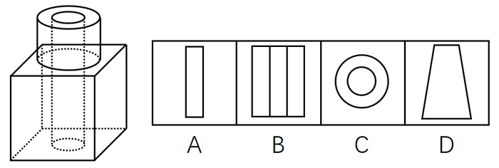

- **A**. A
- **B**. B　✅
- **C**. C
- **D**. D

**答案**：B

**官方解析**

A项：在图形下面的正方体中选一角，竖直向下可以切出，如图1所示；

B项：无法切出；

C项：在上面的圆柱横切，可以切出，如图2所示；

D项：在正方体的一个角斜着切，可以切出，如图3所示。

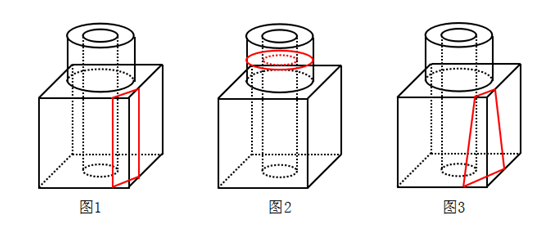

本题为选非题，故正确答案为B。

---

## 第 6 题　qid 2049948 · 图形推理

左边给定的是削掉一个角的纸盒，下列哪一项不是由它展开而成？

- **A**. A
- **B**. B
- **C**. C　✅
- **D**. D

**答案**：C

**官方解析**

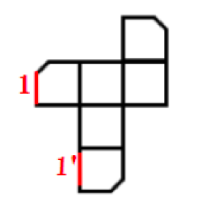

题干图形切去了一个角，出现三个面缺角，三个缺角要重合，如上图所示，C项中1和是重合边，但没有缺角，即三个缺角不重合，所以C选项错误。

本题为选非题，故正确答案为C。

C项详解：

必备知识：首先要知道，六面体中一个顶点发射且只发射出三条边

①图中a和是直角边，是同一条边，因此绿色的点和蓝色的点是同一个点；

②从蓝色点发出的a、b、三条线，因此绿色的点发出的应该也是a、b、三条线（原理见上面的必备知识）；

③那现在知道a和是同一条，因此剩下边1要么就是b，要么是。但是b已经不可能了（因为b这条边两边的面已经是确定的了），所以1只能是这条边，因此它俩折叠完后是重合的。

而题干缺角的三条边应该是互相挨着的，不可能出现C中一条缺口的边1和一条完整的边挨着，所以C错。

本题为选非题，故正确答案为C。

---

## 第 7 题　qid 2050064 · 图形推理

从所给的四个选项中，选择最合适的一个填入问号处，使之呈现一定的规律性：

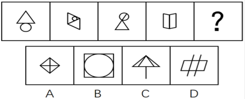

- **A**. A
- **B**. B　✅
- **C**. C
- **D**. D

**答案**：B

**官方解析**

元素组成不同，无属性规律，考虑数量规律。观察发现第四幅图是“日”字的变形，选项当中有“田”字的变形，考虑一笔画，进一步观察，题目中都是一笔画图形，故问号处也应是一笔画图形。选项A是两笔画，B是一笔画，C是两笔画，D是两笔画。
故正确答案为B。

---

## 第 8 题　qid 2049952 · 图形推理

从所给的四个选项中，选择最合适的一个填入问号处，使之呈现一定的规律性：

- **A**. A
- **B**. B
- **C**. C　✅
- **D**. D

**答案**：C

**官方解析**

图形元素组成不同，属性数量无明显规律，但整体观察题干发现，每个图形中都存在三角形，只有C选项符合。（注：B项中出现的是4个扇形，而不是三角形。）
故正确答案为C。

---

## 第 9 题　qid 2050172 · 图形推理

从所给的四个选项中，选择最合适的一个填入问号处，使之呈现一定的规律性：

- **A**. A　✅
- **B**. B
- **C**. C
- **D**. D

**答案**：A

**官方解析**

元素组成不同，题干每幅图均出现小黑点，优先考虑功能元素。观察发现，第一行图形中，功能元素标记的面数量分别为2、2、4，，第三行图形中，功能元素标记的面数量分别为3、1、4，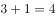，第二行图形中，功能元素标记的面数量分别为2、？、3，那么？处应为功能元素标记面数量为1的图形，只有A项符合。

故正确答案为A。

---

## 第 10 题　qid 2050074 · 图形推理

从所给的四个选项中，选出一个最合适的填入问号处，使之呈现一定的规律：

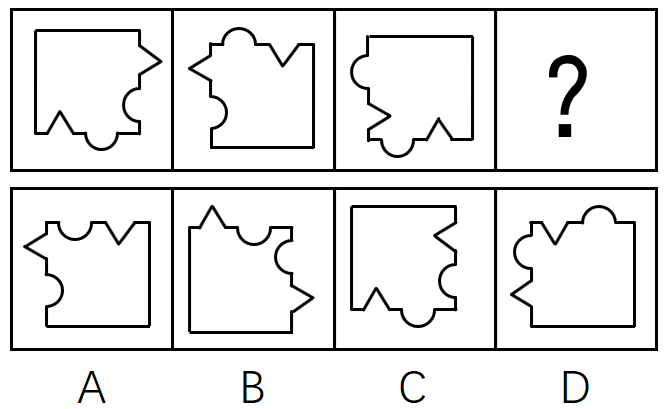

- **A**. A
- **B**. B　✅
- **C**. C
- **D**. D

**答案**：B

**官方解析**

题干图形间有明显的凹进和凸出部分，考虑图形拼合。如下图所示，题干图2逆时针旋转90度之后拼接在图1的右边，图3顺时针旋转90度后拼接在图2的下边，很明显，还缺一幅凸出两个尖的图形，最后就可拼成一个完整的正方形，观察选项，只有B项凸出两个尖。

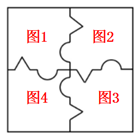

故正确答案为B。

---

## 第 11 题　qid 2049888 · 定义判断

非爱行为，指以爱的名义，对自己亲近的人进行非爱性的掠夺，即违背他人主观意愿，在精神与行为方面强制控制，迫使对方按照施控者的意愿去行为做事，这一行为往往发生在夫妻、恋人、父母与子女等最亲近的人之间。
根据上述定义，下列属于非爱行为的是：

- **A**. 张某按照医嘱，要求女儿每三个小时做一次牵引，以消除疼痛
- **B**. 林某强迫儿子每天练琴3小时，争取在钢琴大赛中取得好成绩　✅
- **C**. 陈某为防止患精神病的女儿逃逸，将其关在地下室禁止其出入
- **D**. 李某按照轮流陪护协议，要求妻子前往医院陪护患重病的母亲

**答案**：B

**官方解析**

第一步：找出定义关键词。
“违背他人主观意愿”、“强制控制”、“迫使对方按照施控者的意愿去做事”、“往往发生在夫妻、恋人、父母与子女等最亲近的人之间”
第二步：逐一分析选项。
A项：要求女儿做牵引，但女儿是否想要做没有明确表明，不能确定是否“违背他人主观意愿”、“强制控制”、“迫使对方按照施控者的意愿去做事”，不符合定义，排除；
B项：强迫儿子练琴中的“强迫”体现出儿子一定不愿意练琴，明确地符合关键词“违背他人主观意愿”、“强制控制”、“迫使对方按照施控者的意愿去做事”，符合定义，当选；
C项：把“精神病”女儿关在地下室，是出于对她的一种保护，不属于违背个人的主观意愿，不符合定义，排除；
D项：要求妻子照顾患病的母亲，但妻子是否想要照顾患病的母亲没有明确表明，不能确定是否“违背他人主观意愿”、“强制控制”、“迫使对方按照施控者的意愿去做事”，不符合定义，排除。
故正确答案为B。

---

## 第 12 题　qid 2049958 · 定义判断

人类增强就是利用生物医学技术、智能技术、神经科学技术、信息技术和纳米技术等高新技术手段使健康人类的机体功能或能力超出其正常范围，从而使人类的体貌、寿命、人格、认知和行为等能力发生根本性变化并具有全新能力的一种技术手段，其目的是显著提高人类生活的质量。
根据上述定义，下列选项不属于人类增强的是：

- **A**. 演员赵某用药剂延缓衰老
- **B**. 医生建议老张去做心脏搭桥手术　✅
- **C**. 医生将传感器植入老陈大脑提高其记忆力
- **D**. 小王为了增加自己的身高服用类增高药物

**答案**：B

**官方解析**

第一步：找出定义关键词。
方式：利用高新技术手段使健康人类机体功能或能力超出正常范围，使人类的体貌、寿命、人格、认知和行为等能力发生根本性变化并具有全新能力。
目的：显著提高人类生活质量。
第二步：逐一分析选项。
A项：药剂属于一种生物医学技术，延缓衰老是人类机体功能超出正常范围的表现，使寿命发生了变化，符合定义，排除；
B项：老张做心脏搭桥手术说明老张的心脏有问题，是从不健康变为健康，而不是从健康变为超出正常范围，不符合定义，当选；
C项：传感器是一种高新技术手段，利用传感器提高记忆力使老陈的认知功能发生变化，符合定义，排除；
D项：服用类增高药物属于一种生物医学技术手段，利用该药物使小王的体貌发生变化，符合定义，排除。
本题为选非题，故正确答案为B。

---

## 第 13 题　qid 2050088 · 定义判断

心理人类学是介于文化人类学与心理学之间的交叉学科，主要研究并了解文化对所属社会成员产生影响的心理机制，发现在个体水平上的心理变量与在总体水平上的文化、社会、经济、生态和生物变量之间的关系。
根据上述定义，下列选项属于心理人类学研究范畴的是：

- **A**. “五四”前后诗歌风格的比较
- **B**. 当代流行话语下的社会主流价值
- **C**. 草原文明与蒙古民族性格的养成　✅
- **D**. 从《背影》看作者对父亲态度的变化

**答案**：C

**官方解析**

第一步：找出定义关键词。
“文化对所属社会成员产生影响的心理机制”、“个体的心理变量与总体的文化、社会、经济、生态和生物变量之间的关系”。
第二步：逐一分析选项。
A项：只是简单比较诗歌风格，没有体现文化对社会成员的影响，不符合题干定义，排除；
B项：该项研究的是当下的主流价值观，不是文化对社会成员的影响，不符合题干定义，排除；
C项：草原文明与蒙古民族性格的养成，既有草原文化，也明确体现该文化对所属的社会成员（即蒙古民族）产生影响的心理机制（民族性格的养成），符合题干定义，当选；
D项：该项研究的是作者和父亲两个个体之间的关系，没有体现文化对社会成员的影响，不符合题干定义，排除。
故正确答案为C。

---

## 第 14 题　qid 2049934 · 定义判断

我国婚姻法规定，禁止直系血亲和三代以内旁系血亲结婚。直系血亲是指和自己有直接血缘关系的亲属，三代以内旁系血亲是指与己身出自同一父母或同一祖父母、外祖父母，除直系血亲外的所有血亲。
根据上述定义，下列选项中的甲和乙可以结婚的是：

- **A**. 张某是甲（女）的姨父，乙系张某的儿子
- **B**. 李某是乙（女）的姑父，甲系李某的儿子
- **C**. 甲是林某与前夫的儿子，乙是林某与后夫的女儿
- **D**. 王某是张某的舅舅，甲系王某的儿子，乙系张某的女儿　✅

**答案**：D

**官方解析**

第一步，找出定义关键词。

“直系血亲是指和自己有直接血缘关系的亲属”、“三代以内旁系血亲是指与己身出自同一父母或同一祖父母、外祖父母，除直系血亲外的所有血亲”。

第二步，逐一分析选项。

A项：张某是甲（女）的姨父，乙是其姨父（张某）的儿子。甲的姨与乙的母亲是同一人，甲与其姨有血亲关系，乙与其母亲也有血亲关系，因此两人有血亲关系。符合定义，不能结婚，排除；

B项：李某是乙（女）的姑父，甲是其姑父（李某）的儿子。乙的姑姑与甲的母亲是同一人，乙与其姑姑有血亲关系，甲与其母亲也有血亲关系，因此两人有血亲关系。符合定义，不能结婚，排除；

C项：甲与乙出自同一外祖父母，属于三代以内旁系血亲，符合定义，不能结婚，排除；

D项：如下图，王某是张某的舅舅，甲系王某儿子，乙系张某女儿，甲、乙二人不符合“三代以内旁系血亲是指与己身出自同一父母或同一祖父母、外祖父母，除直系血亲外的所有血亲”的关系，不符合定义，可以结婚，当选。

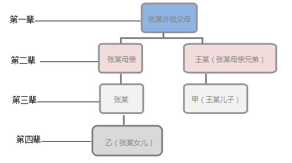

故正确答案为D。 

---

## 第 15 题　qid 2049962 · 定义判断

木椅子效应是指将成绩相等的两组学生分别安排坐在舒适的沙发椅和很不舒服的木椅子上学习，不久之后，坐木椅子的学生学习成绩要比坐沙发椅的学生成绩高出许多。原因是坐木椅子的学生因为不舒服而不断调整坐姿，表面看来好像不安而好动，实质却因此给脑部供应了更多的血液和营养；而坐沙发椅的学生，由于舒适而一动不动，致使血液循环相对减慢，脑部得到的血液和营养相对减少，学习效果因此就差了一些。
根据上述定义，下列选项最能体现木椅子效应的是：

- **A**. 某学生从小到大饱受责罚，学习成绩一直不理想
- **B**. 小刚每天步行上学和回家，风雨无阻却学得很好　✅
- **C**. 某家长为鼓励孩子暑天学习，每天为其提供冷饮
- **D**. 搬入新书房一个月后，小明的成绩名次一路攀升

**答案**：B

**官方解析**

第一步，找出定义关键词。
“坐不舒服木椅子的同学，学习成绩更好”、“坐舒适沙发椅的同学，学习效果差一些”。
第二步，逐一分析选项。
A项：学生从小到大饱受责罚，体现了不舒服的状态，但是学习成绩不理想，不符合“坐不舒服木椅子的同学，学习成绩更好”，不符合定义，排除；
B项：小刚每天步行上学和回家，风雨天也是如此，体现了不舒服的状态，并且学得很好，符合“坐不舒服木椅子的同学，学习成绩更好”符合定义，当选；
C项：家长每天鼓励孩子并为其提供冷饮，体现了舒服的状态，但未明确说明学习好坏，不符合“坐舒适沙发椅的同学，学习效果差一些”，不符合定义，排除；
D项：搬入新书房是否属于舒服的状态不明确，不符合“坐不舒服木椅子的同学，学习成绩更好”，不符合定义，排除。
故正确答案为B。

---

## 第 16 题　qid 2049970 · 定义判断

随着科学技术的发展，人机交流已经成为现实，这其中的关键是脑机接口技术。所谓脑机接口，就是连接大脑与计算机之间的信息系统，可让大脑直接和计算机沟通。脑机接口可以从大脑传递信息到计算机，又可以从计算机传递信息进入大脑。
根据上述定义，下列应用不属于脑机接口技术的是：

- **A**. 某游戏玩家的大脑植入一部装置，通过该装置用意念控制机械手，端起杯子喝茶
- **B**. 某游戏玩家佩戴一套义肢设备，经过多次练习，凭着坚强意志力，实现独立行走　✅
- **C**. 某游戏玩家佩戴一种脸部饰品，饰品根据佩戴者的情绪变化作出相应的指示动作
- **D**. 某游戏玩家戴上一套高科技耳机，集中注意力，通过精神控制小球飞越各种障碍

**答案**：B

**官方解析**

第一步：找出定义关键词。
“连接大脑与计算机”、“可让大脑直接和计算机沟通”。
第二步：逐一分析选项。
A项：大脑植入装置并且可以通过装置用意念控制机械手，体现了“连接大脑和计算机”和“可让大脑直接和计算机沟通”，符合定义，排除；
B项：游戏玩家用坚强的意志力实现使用义肢设备独立行走，主要依靠的是坚强意志力，而不是大脑与计算机的沟通，不符合定义，当选；
C项：脸部饰品会根据佩戴者情绪变化作出相应的指示动作，情绪变化是大脑的表现，体现了“可让大脑直接和计算机沟通”，符合定义，排除；
D项：游戏玩家戴高科技耳机通过精神控制小球飞越各种障碍，体现了“可让大脑直接和计算机沟通”，符合定义，排除。
本题为选非题，故正确答案为B。

---

## 第 17 题　qid 2049936 · 定义判断

数据挖掘（Data mining）是指从大量的存储数据中利用统计、情报检索、模式识别、在线分析处理和专家系统（依靠过去的经验）等方法或技术，发现隐含在其中、事先不知道但又是潜在有用的信息和知识的信息处理过程。
根据上述定义，下列选项不属于数据挖掘应用的是：

- **A**. 
某高校要求教师使用网上教学管理系统，录入学生的期末考试成绩，以便借助短信群发软件告知学生成绩
　✅
- **B**. 
某国际快递和物流公司使用RFID（无线射频识别）技术在不同时间点跨境全程监控和调整药品装运的温度

- **C**. 
某大型网上书店在客户选购一种图书时，推出“购买该商品的用户还购买了”等栏目，从而增加可观收益

- **D**. 
某全球零售企业在分析上一年度消费者购物行为后推出“尿布啤酒”促销举措，使得二者销量大幅增加

**答案**：A

**官方解析**

第一步：找出定义关键词。

“从大量的存储数据中利用统计、情报检索、模式识别、在线分析处理和专家系统（依靠过去的经验）等方法或技术”、“发现隐含在其中、事先不知道但又是潜在有用信息和知识”。

第二步：逐一分析选项。

A项：录入学生期末考试成绩，并用短信群发软件告知学生成绩，“告知学生成绩”没有体现发现隐含在其中的信息。不符合定义，当选；

B项：国际快递和物流公司运输的药品符合“大量的存储数据”；“无线射频识别”符合模式识别、在线分析等方法和技术；而“监控并调整其温度”符合“发现有用信息”这一关键词，符合定义，排除；

C项：“购买该商品的用户还购买了”是通过以前购买过此图书的消费者还购买过其他商品的大量的数据分析而总结出来的，符合“对大量数据利用统计、情报检索”这一关键词，向客户推荐其他商品符合“隐含在其中，潜在有用信息”，符合定义，排除；

D项：“分析上一年度消费者购物行为”符合“对大量数据的统计、情报检索、在线分析处理······技术”，并且推出了“尿布啤酒”这一模式，符合“发现隐含在其中、事先不知道但又是潜在有用信息”，符合定义，排除。

本题为选非题，故正确答案为A。

---

## 第 18 题　qid 2049960 · 定义判断

共享经济指借助网络第三方平台，基于闲置资源使用权的暂时性转移，实现生产要素的社会化，提高存量资产的使用效率以创造更多价值，促进社会经济的可持续发展。
根据上述定义，下列经济活动不属于共享经济的是：

- **A**. 王某从某网络平台订车去飞机场，方便快捷
- **B**. 李某从某网络平台贷款炒股，获得了预期收益　✅
- **C**. 马某旅行前从某网络平台预定民宿，抵达后入住
- **D**. 张某从某网络平台购买外卖美食，在家享受美味

**答案**：B

**官方解析**

第一步：找出定义关键词。

方式：“借助网络第三方平台”、“闲置资源使用权暂时性转移”。

目的：“促进社会经济的可持续发展”。

第二步：逐一分析选项。

A项：王某从网络平台订车去机场，通过网络第三方平台让车辆的使用权暂时性转移给王某，符合定义，排除；

B项：网络贷款炒股, 符合“借助网络第三方平台”，贷款也符合关键词“闲置资源使用权暂时性转移”，但如下图所示，银保监会规定互联网贷款资金不得用于股票，若违反即违规行为，违反社会主义主流价值观，故不符合定义关键词“促进社会经济的可持续发展”，不符合定义，当选；

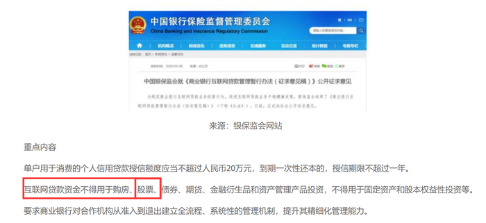

C项：马某从网络平台预定民宿，通过网络第三方平台让民宿的使用权暂时性转移给马某，符合定义，排除；

D项：在网上订购美食，符合“借助网络第三方平台”，由外卖员送货到家，外卖员送货也符合定义关键词“闲置资源使用权暂时性转移”，另外，典型的外卖平台有饿了么、美团等等，这些都是共享经济模式下的知名企业，如下图所示，它们整合线下的闲散劳动力，共同获得经济红利，符合定义，排除。

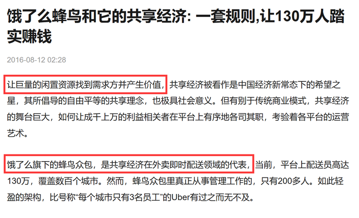

本题为选非题，故正确答案为B。

附注：下图为2020安徽省考判断推理大纲中，明确给出标准答案的原题，因此本题答案为B项。

---

## 第 19 题　qid 2049884 · 定义判断

描写就是用生动形象的语言，把人物或景物的状态具体地描绘出来。从描写的角度分，可分为正面描写和侧面描写。正面描写是指直接展现景物、环境的特点或通过描写人物的外貌、心理和行动来体现人物的个性特征。侧面描写又叫间接描写，是从侧面的角度烘托人物形象、景物特征或相关事态。
根据上述定义，下列选项既有正面描写，又有侧面描写的是：

- **A**. 一道残阳铺水中，半江瑟瑟半江红
- **B**. 大漠风尘日色昏，红旗半卷出辕门
- **C**. 天姥连天向天横，势拔五岳掩赤城　✅
- **D**. 千里莺啼绿映红，水村山郭酒旗风

**答案**：C

**官方解析**

第一步：找出定义关键词。
正面描写：“直接展现景物、环境的特点或通过描写人物的外貌、心理和行动来体现人物的个性特征”。
侧面描写：“侧面烘托人物的形象、景物特征或相关事态”。
第二步：逐一分析选项。
A项：“一道残阳铺水中”写的是傍晚时分，快要落山的夕阳，柔和地铺在江水之上，是正面描写傍晚的景色；“半江瑟瑟半江红”写的是晚霞斜映下的江水看上去好似鲜红色的，而绿波却又在红色上面滚动，也是正面描写江水的景色。都是正面描写，没有侧面描写，排除；
B项：“大漠风尘日色昏”写的是大漠之中，狂风呼啸，尘土飞扬，天色昏暗，是正面描写大漠的景色；“红旗半卷出辕门”写的是一队将士半卷着红旗出了军营，向敌军挺进，也是正面描写奔赴前线的戍边将士出征前的场景。都是正面描写，没有侧面描写，排除；
C项：“天姥连天向天横”写的是天姥山仿佛连接着天遮断了天空，是正面描写天姥山山势高；“势拔五岳掩赤城”写的是天姥山山势高峻超过五岳，遮掩过赤城山，并非在描写五岳和赤城山，而是通过对比从侧面凸显了天姥山的高。既有正面描写又有侧面描写，当选；
D项：“千里莺啼绿映红”正面描写到处莺歌燕舞，桃红柳绿；“水村山郭酒旗风”正面描写依山傍水的村庄和城郭，到处都有迎风招展的酒旗。都是正面描写，没有侧面描写，排除。
故正确答案为C。

---

## 第 20 题　qid 2049966 · 定义判断

心理会计是指人们在心里无意识地把财富划归不同的账户进行管理，并对结果（尤其是经济结果）加以编码、分类和估价的过程，且不同的心理账户有不同的记账方式和心理运算规则。小到个体、家庭，大到企业集团，都有一套或隐或显的心理账户系统，其心理记账方式与经济学和数学的运算方式都不相同，因此经常以非预期的方式影响着决策，使个体的决策违背最简单的理性经济法则。
根据上述定义，下列选项最能体现心理会计现象的是：

- **A**. 整日忧心忡忡的小李将自己全部存款的四分之三用于购买人寿保险
- **B**. 小陈已经攒够购买相机的钱，但他一定要等领到年底奖金再买相机　✅
- **C**. 小王在两家不同银行都有储蓄卡，但他总是去离家更近的银行取款
- **D**. 小刘因公司奖励出游某地感觉不错，后来自费重游此地却感觉不佳

**答案**：B

**官方解析**

第一步，找出定义关键词。
“人们在心里无意识地把财富划归不同的账户进行管理”、“对结果（尤其是经济结果）加以编码、分类和估价”、“不同的心理账户有不同的记账方式和心理运算规则”、“个体的决策违背最简单的理性经济法则”。
第二步，逐一分析选项。
A项：小李将自己存款的四分之三用于购买人寿保险，这是有意识对财富进行支出和管理，并未体现“人们在心里无意识地把财富划归不同的账户进行管理”，不符合定义，排除；
B项：小陈已经攒够购买相机的钱，但他一定要等领到年底奖金再买相机，无论是现在的存款还是年底奖金都是小陈自己的财富，而且无论是现在买还是之后买都是等价的商品。但是工资和年底奖金性质有所不同，所以小陈在心里上认为有差别，“心理账户”就不一样了，符合“人们在心里无意识地把财富划归不同的账户进行管理”，而且也“违背最简单的理性经济法则”，符合定义，当选；
C项：小王选择去哪家银行根据的是距离远近而非财富本身，不符合定义，排除；
D项：小刘对公司奖励的出游某地感觉很满意，但是对自费出游某地感觉不佳，第二次出游是小刘自费，涉及了对自己财富的管理，而第一次出游是公司的奖励，不涉及小刘对自己财富的管理，无法体现“人们在心里无意识地把财富划归不同的账户进行管理”，且D项中没有涉及小刘的决策“违背最简单的理性经济法则”，不符合定义，排除。
故正确答案为B。

---

## 第 21 题　qid 2049940 · 类比推理

犹疑：深信

- **A**. 晚造：提前
- **B**. 老到：幼稚　✅
- **C**. 婉拒：褒扬
- **D**. 爽利：强横

**答案**：B

**官方解析**

第一步：判断题干词语间逻辑关系。
犹疑是指犹豫迟疑，与深信是语义关系中的反义词关系。
第二步：判断选项词语间逻辑关系。
A项：晚造是指晚季作物，与提前不是反义词关系，与题干逻辑关系不一致，排除；
B项：老到是指老练，城府很深，与幼稚是反义词关系，与题干逻辑关系一致，当选；
C项：婉拒是指委婉拒绝，褒扬是指赞美表扬，两者不是反义词关系，与题干逻辑关系不一致，排除；
D项：爽利是指爽快直率，强横是指强硬蛮横，两者不是反义词关系，与题干逻辑关系不一致，排除。
故正确答案为B。

---

## 第 22 题　qid 2049866 · 类比推理

进士：状元

- **A**. 河水：海水
- **B**. 银河：天文
- **C**. 学位：博士　✅
- **D**. 宪法：民法

**答案**：C

**官方解析**

第一步：判断题干词语间逻辑关系。
进士包含状元、榜眼、探花等，状元是进士中名次第一的称谓。二者为种属关系。
第二步：判断选项词语间逻辑关系。
A项：河水、海水是两种不同的水域，二者是并列关系，与题干逻辑关系不一致，排除；
B项：银河是天文领域的概念，二者是对应关系，与题干逻辑关系不一致，排除；
C项：学位包含学士、硕士、博士，博士是学位中等级最高的学术称号，二者为种属关系，与题干逻辑关系一致，当选；
D项：宪法是国家的根本法，民法是调整平等主体的公民、法人之间财产关系和人身关系的法律规范。民法的制定必须以宪法为基础，宪法的效力要高于民法，宪法属于上位法，民法属于下位法。与题干逻辑关系不一致，排除。
故正确答案为C。

---

## 第 23 题　qid 2050068 · 类比推理

救援：围魏救赵

- **A**. 进攻：风声鹤唳
- **B**. 防守：草木皆兵
- **C**. 追击：穷寇勿追　✅
- **D**. 转移：斗折蛇行

**答案**：C

**官方解析**

第一步：判断题干词语间逻辑关系。
围魏救赵，原指战国时齐军用围攻魏国的方法，迫使魏国撤回攻赵部队而使赵国得救。后指袭击敌人后方的据点以迫使进攻之敌撤退的战术。围魏救赵是救援的一种策略。二者是对应关系，同时在语义上有相关性。
第二步：判断选项词语间逻辑关系。
A项：风声鹤唳形容惊慌失措，或自相惊忧。与进攻没有明显的逻辑关系，与题干逻辑关系不一致，排除；
B项：草木皆兵是指把山上的草木都当做敌兵，形容人在惊慌时疑神疑鬼。与防守没有明显的逻辑关系，与题干逻辑关系不一致，排除；
C项：穷寇勿追是指不追无路可走的敌人，以免敌人情急反扑，造成自己的损失。也比喻不可逼人太甚。穷寇勿追是追击的一种策略，与题干逻辑关系一致，当选；
D项：斗折蛇行是指像北斗星一样弯曲，像蛇一样曲折行进。形容道路曲折蜿蜒。与转移没有明显的逻辑关系，与题干逻辑关系不一致，排除。
故正确答案为C。

---

## 第 24 题　qid 2049944 · 类比推理

盲动：一败涂地：重起炉灶

- **A**. 超速：风驰电掣：按部就班
- **B**. 跟风：鹦鹉学舌：真知灼见
- **C**. 熬夜：萎靡不振：养精蓄锐　✅
- **D**. 传神：生动逼真：洛阳纸贵

**答案**：C

**官方解析**

第一步：判断题干词语间逻辑关系。
因为盲动可能导致一败涂地，两者是或然因果关系，一败涂地之后需要重起炉灶。
第二步：判断选项词语间逻辑关系。
A项：超速是一种道路交通违法行为，风驰电掣形容非常迅速，与题干逻辑关系不一致，排除；
B项：鹦鹉学舌比喻人家怎么说，他也跟着怎么说，与跟风意思相近，与题干逻辑关系不一致，排除；
C项：因为熬夜可能导致萎靡不振，两者是或然因果关系，萎靡不振之后需要养精蓄锐，与题干逻辑关系一致，当选；
D项：生动逼真与传神两者意思相近，与题干逻辑关系不一致，排除。
故正确答案为C。

---

## 第 25 题　qid 2049946 · 类比推理

讨论：会议：方案

- **A**. 合作：课题：计划
- **B**. 研究：手机：销量
- **C**. 分析：汽车：技术
- **D**. 调研：基层：实情　✅

**答案**：D

**官方解析**

第一步：判断题干词语间逻辑关系。
造句子：讨论会议方案，没有唯一答案，因此按照第二种方式造句子，即在会议上讨论方案，讨论方案构成动宾短语。
第二步：判断选项词语间逻辑关系。
A项：应该是制定课题计划，而不是合作课题计划，与题干逻辑关系不一致，排除；
B项：在手机上研究销量，但手机是具体的工具，而题干会议并不是工具，与题干逻辑关系不一致，排除；
C项：不能在汽车上分析技术，且汽车也是具体工具，与题干逻辑关系不一致，排除；
D项：在基层调研实情，调研实情构成动宾短语，与题干逻辑关系一致，当选。
故正确答案为D。

---

## 第 26 题　qid 2049880 · 类比推理

中子：辐射：军事

- **A**. 货车：交通：运输
- **B**. 电解质：物理：化学
- **C**. 薄膜：隔热：大棚
- **D**. 干冰：吸热：消防　✅

**答案**：D

**官方解析**

第一步：判断题干词语间逻辑关系。
中子能够发生辐射反应，中子辐射能够应用在军事领域，有军事功能。
第二步：判断选项词语间逻辑关系。
A项：货车是一种交通工具，货车本身具有运输功能，与题干逻辑关系不一致，排除；
B项：电解质有导电的物理性质，电解质本身是一种化学物质，与题干逻辑关系不一致，排除；
C项：薄膜有隔热的作用，薄膜是制作大棚的一种材料，与题干逻辑关系不一致，排除；
D项：“干冰”是固态的二氧化碳，在升华过程中需要“吸热”，周围物体会降温，“干冰”“吸热”的特性能够应用于“消防”领域，有“消防”功能，与题干逻辑关系一致，当选。
故正确答案为D。

---

## 第 27 题　qid 2049938 · 类比推理

鸿雁：笺札：书信

- **A**. 月老：红娘：媒人　✅
- **B**. 乾坤：天地：宇宙
- **C**. 红豆：相思：恋人
- **D**. 东宫：王子：储君

**答案**：A

**官方解析**

第一步：判断题干词语间逻辑关系。
鸿雁是一种鸟类，在古代可以指代书信，鸿雁与书信是比喻象征关系；笺札就是指书信，二者是全同关系。即第一词与第三词为比喻象征关系，第二词与第三词为全同关系。
第二步：判断选项词语间逻辑关系。
A项：月老是中国民间传说中专管婚姻的红喜神，后多用作媒人的代称，二者是比喻象征关系；红娘是以介绍婚姻为职业的中间人，就是指媒人，二者是全同关系，与题干逻辑关系一致，当选；
B项：乾坤不指代宇宙，二者不是比喻象征关系，与题干逻辑关系不一致，排除；
C项：红豆象征相思，且相思与恋人不是全同关系，与题干逻辑关系不一致，排除；
D项：东宫指代储君，二者是比喻象征关系；王子是帝王的儿子，并不等于储君，二者不是全同关系，与题干逻辑关系不一致，排除。
故正确答案为A。

---

## 第 28 题　qid 2049890 · 类比推理

违约 之于 （    ） 相当于 （    ） 之于 承诺

- **A**. 法律；民俗
- **B**. 处罚；兑现
- **C**. 合同；食言　✅
- **D**. 赔偿；责任

**答案**：C

**官方解析**

逐一代入选项。
A项：违约可能违背了法律，民俗和承诺之间没有直接的逻辑关系，前后逻辑关系不一致，排除；
B项：违约之后可能会被处罚，处罚是违约的结果，兑现承诺是动宾短语，前后逻辑关系不一致，排除；
C项：违约是违背了合同，食言是违背了承诺，前后逻辑关系一致，当选；
D项：违约之后可能需要赔偿，赔偿是违约的结果，做出承诺即意味着担负了一定的责任，但承诺不是责任的结果，前后逻辑关系不一致，排除。
故正确答案为C。

---

## 第 29 题　qid 2049886 · 类比推理

番茄 之于 （    ） 相当于 （    ） 之于 蹴鞠

- **A**. 美洲；中国
- **B**. 炒饭；健身
- **C**. 植物；人类
- **D**. 白菜；篮球　✅

**答案**：D

**官方解析**

逐一代入选项。
A项：番茄起源地是美洲，蹴鞠起源地是中国，但前后顺序不一致，排除；
B项：番茄是炒饭时可能用到的一种食材，蹴鞠作为一项体育运动有健身的功能，前后逻辑关系不一致，排除；
C项：番茄是一种植物，二者是种属关系，蹴鞠是人类发明的一种体育运动，前后逻辑关系不一致，排除；
D项：番茄、白菜是两种不同的蔬菜，二者是并列关系，篮球、蹴鞠是两种不同的体育运动，二者是并列关系，前后逻辑关系一致，当选。
故正确答案为D。

---

## 第 30 题　qid 2050208 · 类比推理

（    ） 之于 精当 相当于 固若金汤 之于 （    ）

- **A**. 瑕瑜互见；牢靠
- **B**. 字字珠玑；防御
- **C**. 无懈可击；城池
- **D**. 不刊之论；坚实　✅

**答案**：D

**官方解析**

逐一代入选项。
A项：瑕瑜互见，比喻有缺点也有优点，表示客观的评价，精当是指精确恰当，二者逻辑关系不明显；固若金汤，形容城池或阵地坚固，不易攻破，与牢靠为近义词，前后逻辑关系不一致，排除；
B项：字字珠玑，可以指说话或写文章言简意深，与精当为近义词；固若金汤可以用来形容防御坚固，二者并不是近义词，前后逻辑关系不一致，排除；
C项：无懈可击，形容十分严密，找不到一点漏洞，精当指的是精确恰当，两者逻辑关系不明显；固若金汤，可以形容城池坚固，二者为对应关系，前后逻辑关系不一致，排除；
D项：不刊之论，用来形容文章或言辞的精准得当，与精当为近义词，固若金汤，形容坚固，与坚实为近义词，前后逻辑关系一致，当选。
故正确答案为D。

---

## 第 31 题　qid 2050076 · 逻辑判断

提高能源使用效率、鼓励能源灵活利用是英国减少温室气体排放政策的一个必要环节，它需要采用智能技术，包括通过智能表将能源使用信息从需求方面或客户发送到能源公司等。该信息可用于制定和实施更高效的能源使用条例。但英国消费者对此态度不一，因为该技术用于监控和支持能源高效率使用行为时，居民个人及家庭的能源数据不得不被动分享。所以，个人使用能源相关数据的被动分享有可能成为推广智能技术的最主要障碍。
以下哪项如果为真，最能支持上述结论？

- **A**. 
的调查者表示，不愿意因数据被动分享而降低个人能源使用比例

- **B**. 
的调查者认为，数据的被动分享大大增加个人隐私被侵犯的风险
　✅
- **C**. 
的调查者表示，那些关心气候变化的人更可能接受数据被动分享

- **D**. 
的调查者认为，数据不可能不被分享，否则智能技术不可能应用

**答案**：B

**官方解析**

本题属于加强题型。
第一步：找出论点和论据。
论点：个人使用能源相关数据的被动分享有可能成为推广智能技术的最主要障碍。
论据：智能技术会使得居民个人和家庭的能源数据被动分享。
第二步：逐一分析选项。
A项：此项强调多数人不同意因能源数据被动分享而降低个人能源使用比例，但题干并没有提及降低个人能源使用比例的问题，推广智能技术并不一定意味着降低能源使用比例，因此A项和论点无关，排除；
B项：数据的被动分享会增加隐私被侵犯的风险，解释了人们为什么不愿意被动分享个人能源数据，而推广智能技术必须要被动分享数据，因而也就解释了为何数据的被动分享会阻碍智能技术的推广，补充论据，加强论点，当选；
C项：该项只是说关心气候变化的人可能接受数据被动分享，并没有说明其他人愿意不愿意，所以不能确定被动分享是否会阻碍智能技术的推广，为不明确项，排除；
D项：此项强调数据分享在推广智能技术过程中的必要性，但数据分享是否重要和它是否会阻碍智能技术推广是两个话题，论题不一致，排除。
故正确答案为B。

---

## 第 32 题　qid 2049892 · 逻辑判断

很多家长认为，孩子不听话，“打屁屁”惩罚一下，至少能让孩子注意到自己的行为不当，变得更听话一些。还有一些人坚持“不严加管教会惯坏孩子”的传统信念，认为“打屁屁”是为孩子好。研究者对16万名儿童在过去5年里的经历进行研究，通过收集“打屁屁”行为的原数据加以分析，发现：打屁股会在儿童成长过程中造成智商低、攻击性行为高等多种负面影响。
以下哪项如果为真，最能支持上述结论？

- **A**. 
最新调查显示，智商相对较低的孩子大多数经常被家长打屁股

- **B**. 
本身不听话且更容易惹祸的孩子更有可能受到父母的严厉惩罚

- **C**. 
研究报告称全球大约的父母都有以打屁股管教孩子的经历

- **D**. 
被打屁股而困惑的孩子只懂得按家长要求去做而不会独立思考
　✅

**答案**：D

**官方解析**

第一步：找出论点和论据。
论点：打屁股会在儿童成长过程中造成智商低、攻击性行为高等多种负面影响。
论据：无明显论据。
第二步：逐一分析选项。
A项：智商相对较低的孩子大多数经常被家长打屁股，“智商相对较低”和“经常被家长打屁股”之间的因果关系并不明确，不能加强，排除；
B项：严厉惩罚与打屁股无必然联系，为无关项，排除；
C项：指出大多数父母都会打孩子屁股，但并未指出打屁股这一行为对儿童造成的后果，排除；
D项：指出孩子被打屁股后不会独立思考，而不会独立思考能力是负面影响，解释了论点，可以加强，当选。
故正确答案为D。

---

## 第 33 题　qid 2049910 · 逻辑判断

英国一项研究发现，人只要在每餐饭前半小时喝一杯500毫升的水，并坚持3个月，体重就能减轻2至4公斤。研究团队邀请了84位超重的成人，随机分成2组，其中41位被要求在餐前喝500毫升水，另外43位则照常生活。3个月后，团队发现三餐前喝水的人，平均体重下降了4.3公斤；而餐前没喝水的人，平均体重只下降了0.81公斤。研究人员说，没有喝水的那组人，“平均运动量”比餐前饮水的人更高，这说明餐前喝适当的水真能减肥。
以下哪项如果为真，最能支持上述结论？

- **A**. 餐前喝水的那组人同时也注意控制饮食
- **B**. 餐前没喝水的人中有的体重减轻了4公斤
- **C**. 除了餐前喝水，两组的其他情况都是一样的　✅
- **D**. 餐前没喝水的人就餐中会喝更多的汤和饮料

**答案**：C

**官方解析**

第一步：找到论点和论据。
论点：餐前喝适当的水能减肥。
论据：餐前喝水的人比餐前没喝水的人平均体重下降得要多，且没有喝水的那组人“平均运动量”比餐前饮水的人更高。
第二步：逐一分析选项。
A项：说明可能有其他原因导致餐前喝水的人体重下降得更多，削弱了论点，排除；
B项：论据中说的是“平均体重”，个别人的体重与“平均体重”无关，排除；
C项：说明两组对象初始条件一致，可以支持，当选；
D项：餐前没喝水的人喝更多的汤和饮料，但是喝更多的汤和饮料并不代表体重一定降得比另一组更少，因为有可能固体的食物反而吃的少了，属于不明确选项，排除。
故正确答案为C。

---

## 第 34 题　qid 2049908 · 类比推理

荷兰研究人员一直在试图模拟月球和火星的土壤条件进行农作物栽培实验。他们对该项实验种出的小红萝卜、豌豆、黑麦和西红柿进行初步分析。实验结果令人充满希望，这些产品不仅安全，而且可能比在地球土壤种出的农作物更健康。英国媒体称，能在火星土壤种出可食用作物，殖民火星的希望又向前迈进了一步。
如果以下各项为真，不能质疑英国媒体说法的是：

- **A**. 火星土壤重金属占比和地球土壤不一样　✅
- **B**. 在另一个同类实验中土豆的长势很糟糕
- **C**. 从实验到真正付诸实践还有很长的路要走
- **D**. 月球、火星、地球的气候条件有很大不同

**答案**：A

**官方解析**

第一步：找到论点和论据。
论点：能在火星土壤种出可食用作物，殖民火星的希望又向前迈进了一步。
论据：荷兰研究人员一直在试图模拟月球和火星的土壤条件进行农作物栽培实验。他们对该项实验种出的小红萝卜、豌豆、黑麦和西红柿进行初步分析。实验结果令人充满希望，这些产品不仅安全，而且可能比在地球土壤种出的农作物更健康。
第二步：逐一分析选项。
A项：火星土壤重金属占比和地球土壤不一样，题干中做实验时模拟的就是火星土壤，且最终的结果是种出的产品不仅安全还可能更健康，因此说土壤不一样没有任何意义，因此A选项无法质疑，当选；
B项：在另一个同类实验中土豆的长势很糟糕，举反例削弱，选非题，排除；
C项：从实验到真正付诸实践还有很长的路要走，说明实验和真正实践的差距性，可以质疑，选非题，排除；
D项：月球、火星、地球的气候条件有很大不同，而气候属于能否在火星生活的重要条件之一，属于补充新论据质疑，选非题，排除。
本题为选非题，故正确答案为A。

---

## 第 35 题　qid 2050080 · 类比推理

当一部小说赢得大奖之后，它在网上书店的口碑却往往会变差。但实际上，大赛评比中其他被提名的小说得分确实不如获奖的小说得分高。据此小李认为，大赛评委们选不出真正好的小说。
如果以下各项为真，不能削弱小李观点的是：

- **A**. 大奖提高了读者对获奖小说的期望值
- **B**. 一部小说获奖后作者知名度会迅速上升　✅
- **C**. 得奖吸引一些品位跟这本书不搭调的读者
- **D**. 喜爱这类小说的读者对获奖小说的评价很高

**答案**：B

**官方解析**

第一步：找出论点和论据。
论点：大赛评委们选不出真正好的小说。
论据：当一部小说赢得大奖之后，它在网上书店的口碑却往往会变差。但实际上，大赛评比中其他被提名的小说得分确实不如获奖的小说得分高。
第二步：逐一分析选项。
A项：大奖提高了读者对获奖小说的期望值，也就是说不是评委不会选，而是读者太苛刻，削弱论点，本题为选非题，排除；
B项：只是在说小说获奖后给作者带来的影响，与大赛评委们能不能选出真正好的小说无关，属于无关选项，本题为选非题，当选；
C项：小说获奖之后扩大了读者群，这本书不搭调的读者有可能会对小说不满意，读者的口味不同会使得网上的口碑变差，削弱论点，本题为选非题，排除；
D项：喜欢的人对获奖小说评价很高，削弱了口碑会变差的论据，本题为选非题，排除。
本题为选非题，故正确答案为B。

---

## 第 36 题　qid 2050084 · 逻辑判断

正常情况下，人的大脑左前颞叶及眶频皮层会抑制位于大脑后部、负责处理眼部信号的视觉系统的神经活动，而在FTD（额颞叶痴呆）患者中，这两个区域可能无法发出抑制性信号，如此，大脑就能以一种全新的方式来处理视觉和声音，尽管额叶的损伤可能会导致患者出现一些病态的异常行为，但也会将患者的艺术敏感性或其他创造力释放出来。可以说，FTD是通向艺术殿堂的一扇窗。
如果以下各项为真，最能质疑上述结论的是：

- **A**. 
只有不到的FTD患者在患病期间能成为杰出艺术家

- **B**. 
20世纪最伟大的100名艺术家里，没有一个是FTD患者 

- **C**. 
冥想或苦练能让右脑更具创造性进而开发出潜在艺术才能

- **D**. 
FTD患者患病后所获得的艺术才能只能是家族遗传的结果
　✅

**答案**：D

**官方解析**

第一步：找出论点和论据。

论点：FTD是通向艺术殿堂的一扇窗。

论据：FTD（额颞叶痴呆）患者的大脑能以一种全新的方式来处理视觉和声音，尽管额叶的损伤可能会导致患者出现一些病态的异常行为，但也会将患者的艺术敏感性或其他创造力释放出来。

第二步：逐一分析选项。

A项：“只有不到的FTD患者”说明还是有患者在这个期间成为杰出艺术家，但这并不能证明是否因为FTD导致的他成为了杰出的艺术家，属于不明确选项，排除；

B项：只是列举出了20世纪最伟大的100名艺术家中没有一个FTD患者，而除了这100名之外的其他艺术家中FTD患者有多少并不清楚，属于不明确选项，排除；

C项：右脑更具创造性进而开发出潜在艺术才能，并未涉及到FTD是否能将患者的艺术敏感性或其他创造力释放出来，无关项，排除；

D项：明确说明了FTD患者的艺术能力来源于家族遗传，而不是这个疾病，削弱论点，当选。

故正确答案为D。

---

## 第 37 题　qid 2049896 · 逻辑判断

一项研究显示，先让受试者参加消除某项偏见的学习，并给受试者播放与消除该偏见学习相关联的声音。之后，让受试者进入深度睡眠状态，同时重复播放那些相关联的声音，以重新激活消除该偏见的学习。结果发现，该偏见比睡眠前大大减少，且睡眠质量越高，偏见减少得越多。研究人员由此推测，睡眠干预可减少社会偏见与歧视。
以下哪项如果为真，最能支持上述论证？

- **A**. 普通民众难以得到消除偏见学习的睡眠干预
- **B**. 睡眠充足、睡眠质量高的人比其他人更不易产生偏见与歧视
- **C**. 有身高歧视、相貌歧视的人经过睡眠干预后，歧视程度明显降低　✅
- **D**. 在接受睡眠干预的受试者中，有一部分人并不存在明显的偏见或歧视

**答案**：C

**官方解析**

第一步：找到论点和论据。
论点：睡眠干预可减少社会偏见与歧视。
论据：受试者先参加消除偏见的学习，然后在进入深度睡眠的同时播放与消除偏见学习相关联的声音，偏见比睡眠前大大减少，且睡眠质量越高，偏见减少得越多。
第二步：逐一分析选项。
A项：没有讨论睡眠干预的作用，为无关项，排除；
B项：讨论的是睡眠好的人不易产生偏见与歧视，但是并不能说明睡眠干预是否能消除已有的偏见，为无关项，排除；
C项：举例说明睡眠干预确实减少了某些社会偏见和歧视，如身高歧视、相貌歧视，可以支持，当选；
D项：指出实验中的一部分主体并无明显偏见或歧视，没有歧视的人与题干无关，为无关项，排除。
故正确答案为C。

---

## 第 38 题　qid 2049904 · 逻辑判断

汽车行业作为制造业中技术含量、智能化程度和产业集中度较高的代表，已经成为了德国“工业4.0”的先导阵地。长期处于2.0工业思维的中国汽车制造业要在全球占有一席之地，进行技术创新与变革和拥有丰富经验的资深人才必不可少，而高薪和福利成为吸引人才的制胜法宝。
由此可以推出：

- **A**. 如果能够吸引到资深人才，中国汽车制造业的改革就能成功
- **B**. 高薪和福利是很多中国职场人士选择职业时的一个重要关注点
- **C**. 不进行技术变革，中国汽车制造业就不能在全球占有一席之地　✅
- **D**. 德国汽车制造业在世界汽车行业具有举足轻重的地位和影响力

**答案**：C

**官方解析**

第一步：翻译题干。 

中国汽车制造业要在全球占有一席之地技术创新与变革且拥有丰富经验的资深人才。

第二步：逐一分析选项。

A项：吸引到资深人才中国汽车制造业的改革就能成功，属于对题干箭头后且关系中一项的肯定，且关系肯定其中一项不能得到确定性的结论，排除；

B项：高薪和福利是很多中国职场人士选择职业时的一个重要关注点，题干没有提到中国职场人士选择职业的问题，选项内容正确性无从得知，排除；

C项：不进行技术变革中国汽车制造业就不能在全球占有一席之地，属于对题干箭头后且关系中一项的否定，根据且关系一否全否，题干条件进行否后，否后必否前，当选；

D项：德国汽车制造业在世界汽车行业具有举足轻重的地位和影响力，从题干已知信息无从得知，排除。

故正确答案为C。

---

## 第 39 题　qid 2049902 · 逻辑判断

某科研机构提出潮湿的沙子是古埃及人在沙漠中搬运巨大石块和雕像的关键。研究人员指出，古埃及人将沉重的石块放上滑橇后，先在滑橇前铺设一层潮湿的沙子，再牵引它们，这种搬运方式起到了意想不到的效果。在实验中，研究人员使用流变仪测试沙子的硬度，以证实需要多少牵引力才能使一定数量的沙子变形，并在此基础上设计了牵引模型，从中发现将潮湿的沙子铺在滑橇前能更容易移动重物，而且沙子所含水分决定了沙子的硬度和牵引力。
如果以下哪项为真，最能支持上述结论？

- **A**. 在一幅古埃及墓室壁画中，一名男子站在滑橇前方，似乎正在浇水
- **B**. 滑橇牵引力与沙子硬度成反比，潮湿沙子的硬度是干燥沙子的两倍　✅
- **C**. 实验证明，铺设在滑橇前的潮湿沙子容易堆积，形成较大滑动阻力
- **D**. 一个实验室版的埃及滑橇被成功建造，能够模拟古埃及工地的实况

**答案**：B

**官方解析**

第一步：找到论点和论据。
论点：潮湿的沙子是古埃及人在沙漠中搬运巨大石块和雕像的关键。
论据：古埃及人将沉重的石块放上滑橇后，先在滑橇前铺设一层潮湿的沙子，再牵引它们，这种搬运方式起到了意想不到的效果。在实验中，研究人员使用流变仪测试沙子的硬度，以证实需要多少牵引力才能使一定数量的沙子变形，并在此基础上设计了牵引模型，从中发现将潮湿的沙子铺在滑橇前能更容易移动重物，而且沙子所含水分决定了沙子的硬度和牵引力。
第二步：逐一分析选项。
A项：在一幅古埃及墓室壁画中，滑橇前方的男子似乎在浇水，不明确到底有没有浇水，且没有提及“沙子”，属于无关选项，无法加强，排除；
B项：潮湿的沙子硬度大，相比于干燥沙子，潮湿沙子铺设在滑橇前所需的牵引力较小，也就更容易地移动放有重物的滑橇，解释了为什么潮湿会让牵引变得容易，属于解释加强，当选；
C项：潮湿的沙子容易堆积形成较大滑动阻力，不利于搬运巨大石块和雕像，削弱论点，排除；
D项：实验版的埃及滑橇能模拟古埃及工地的实况，并未提到潮湿的沙子在搬运中的作用，不明确，排除。
故正确答案为B。

---

## 第 40 题　qid 2049906 · 逻辑判断

如果向大气排放的累积超过32000亿吨，那么到本世纪末，将升温控制在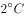以内的门槛就守不住了。有科学家认为，为了达到将升温幅度控制在以内的目标，仅仅限制排放是不够的，必须在全球范围内大规模开展大气的回收行动，使大气污染程度得到有效控制和缓解。

若要使上述科学家的想法成立，最需要补充以下哪项作为前提？

- **A**. 
全球范围内普及关于气候变化的科学知识

- **B**. 
各国政府推出有效政策来控制排放量

- **C**. 
科学界整合资源来支持发展地球工程技术

- **D**. 
各地都建立能有效回收和储存的机制
　✅

**答案**：D

**官方解析**

第一步：找出论点和论据。

论点：为了达到将升温幅度控制在以内的目标，仅仅限制排放是不够的，必须在全球范围内大规模开展大气的回收行动，使大气污染程度得到有效控制和缓解。

论据：无。

本题第一句提出一个控制温度的目标，属于背景性介绍，因此只有论点，没有论据，且问题为“前提条件”，优先考虑补充必要条件。

第二步：逐一分析选项。

A项：全球范围内普及关于气候变化的科学知识，与是否开展大气的回收行动无关，排除。

B项：各国政府推出有效政策来控制排放量，但论点说仅靠控制排放量是不够的，还需要进行回收，该项未提及回收，不能作为支持的前提，排除。

C项：科学界整合资源来支持发展地球工程技术，与是否开展大气的回收行动无关，排除。

D项：各地都建立能有效回收和储存的机制，明确了回收的可行性，属于论点成立的必要条件，当选。

故正确答案为D。

---
