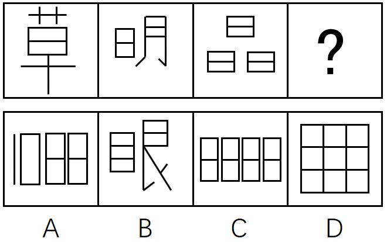
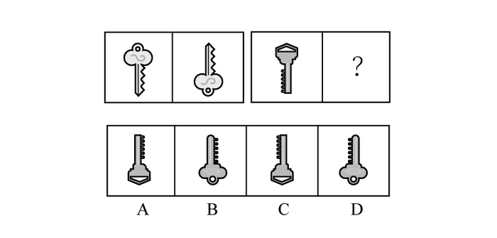
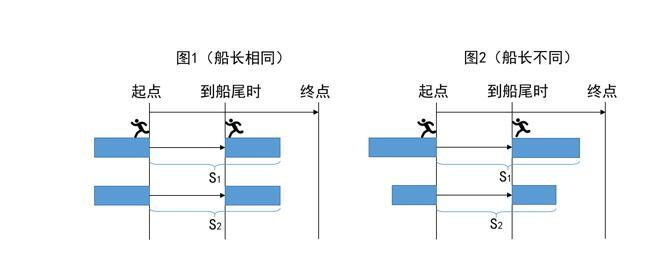

# 2017年422联考《行测》题（海南卷）

> 判断推理 · 25 题 · 海南 2017

## 第 1 题　qid 2050694 · 图形推理

从所给的四个选项中，选择最合适的一个填入问号处，使之呈现一定的规律性：

- **A**. A
- **B**. B
- **C**. C
- **D**. D　✅

**答案**：D

**官方解析**

观察题干图形发现，每幅图都有黑圆和白圆，外框被线条分隔为两个区域，且两圆都在两个不同的区域内，观察选项，只有B项的外框被线条分隔为3个区域，据此排除B项；再次观察发现，白圆所在的区域大小远远大于黑圆所在的区域大小，A项相反，C项不好确定谁的区域更大，而D项非常明显地满足白圆所在的区域远远大于黑圆，择优选择D项。
故正确答案为D。

---

## 第 2 题　qid 2050690 · 图形推理

从所给的四个选项中，选择最合适的一个填入问号处，使之呈现一定的规律性：

- **A**. A
- **B**. B　✅
- **C**. C
- **D**. D

**答案**：B

**官方解析**

元素组成不同，观察发现图形的外边框依次为正方形、圆形、正方形、圆形、？，故问号处应为正方形边框。排除C、D项，在正方形图形内的元素个数依次为3、6、？，圆形图形内的三角形个数为2、4，观察发现都是呈2倍递增。故问号处正方形内的元素个数为12，A项内的个数为7，排除。
故正确答案为B。

---

## 第 3 题　qid 2050684 · 图形推理

从所给的四个选项中，选择最合适的一个填入问号处，使之呈现一定的规律性：

- **A**. A　✅
- **B**. B
- **C**. C
- **D**. D

**答案**：A

**官方解析**

元素组成相同，考虑位置规律。第一横行：图一左右翻转得到图二。同样，第二横行：图一左右翻转得到？处图形，所以？处时针应该指向右边，排除C。数字12应该发生左右翻转，排除D，对比A、B发现钟表的外圈圆颜色不一样，第二横行图一中的圆弧是右上黑、左下黑，左右翻转后应该是左上黑、右下黑，排除B项。
故正确答案为A。

---

## 第 4 题　qid 2049346 · 图形推理

从所给的四个选项中，选择最合适的一个填入问号处，使之呈现一定规律。

- **A**. A
- **B**. B
- **C**. C　✅
- **D**. D

**答案**：C

**官方解析**

图形元素组成不同，属性无明显规律，考虑数量规律。题干图形中面数量明显，考虑数面。题干已知图形中面的数量依次为2、4、6，则问号处的图形应为8个面，A项5个面，B项5个面，D项9个面，只有C项是8个面。
故正确答案为C。

---

## 第 5 题　qid 2050680 · 图形推理

从所给的四个选项中，选择最合适的一个填入问号处，使之呈现一定的规律性：

- **A**. A
- **B**. B
- **C**. C　✅
- **D**. D

**答案**：C

**官方解析**

元素组成相同，考虑位置规律。第一组图中第一幅图中的钥匙上下翻转得到第二幅图，同样，第二组图中把第一幅图的钥匙上下翻转得到？处图形，C项符合。
故正确答案为C。

---

## 第 6 题　qid 2049508 · 定义判断

机器视觉，是指通过光学的装置和非接触的传感器自动地接收和处理一个真实物体的图像，以获得所需信息或用于控制机器人运动的装置。
根据上述定义，下列选项涉及机器视觉的是：

- **A**. 扁平化的摄像头通过暗光拍摄，发现沙发底部灰尘很多，向主人发出需要清洗的红色警报　✅
- **B**. 车载智能设备在路上通过定位系统、导航系统等语音提醒司机行车路线、各路段车速限制及前方天气情况等
- **C**. 新型眼镜在主人探险进入黑暗洞穴后捕捉到大量蝙蝠发出的超声波，立刻启动了面部保护模式
- **D**. 带有拍摄装置的迷你智能机器人进入考古人员难以到达的墓穴深处，拍摄到许多珍贵图像

**答案**：A

**官方解析**

第一步：找出定义关键词。

方式：“通过光学的装置和非接触的传感器”、“自动地接收和处理真实物体的图像”。

目的：“获得信息”、“控制机器人运动”。

第二步：逐一分析选项。

A项：通过摄像头暗光拍摄，符合关键词“通过光学的装置和非接触的传感器”，发现灰尘并汇报，符合关键词“自动地接收和处理真实物体的图像”和“获得信息”，符合定义，保留；

B项：通过定位系统、导航系统等不符合关键词“通过光学的装置和非接触的传感器”，不符合定义，排除；

C项：新型眼镜接收到蝙蝠发出的超声波，不符合关键词“自动地接收和处理真实物体的图像”，不符合定义，排除；

D项：带有拍摄装置的迷你智能机器人符合关键词“通过光学的装置和非接触的传感器”，拍摄到许多珍贵图像，符合关键词“自动地接收真实物体的图像”和“获得信息”，符合定义，保留。

<b>【备注】</b>

本题属于争议题，根据以下两点原因，我们粉笔给出的倾向性答案为A。

首先题干定义的方式为“接收和处理”，A项的“发现灰尘并汇报”符合“接收和处理”，但D项的“拍摄到许多珍贵图像”，更倾向于“接收真实物体的图像”，而非“接收和处理”，D项没有A项与定义更加贴切。

其次，我们通过查找原文，如下图所示，A项就是我们常说的“扫地机器人”，它是运用了机器视觉的。

故正确答案为A。 

---

## 第 7 题　qid 2049494 · 定义判断

拟态，是指某些生物在进化过程中具有与另一种生物或周围自然界物体的相似的形态，这种相似性很高，几乎难以分辨，可以保护某一物种或两个物种。
根据上述定义，下列选项属于拟态的是：

- **A**. 海豚、企鹅和带鱼虽然分别属于鲸类、鸟类和鱼类，但为了适应海洋生活，都进化出了流线形的身体
- **B**. 北极熊生活在白雪皑皑的北极，为了掩护自己捕食时不被猎物过早发现，皮毛逐渐变成与周围环境相似的白色
- **C**. 大鲵，俗名娃娃鱼，已在地球上生活了数亿年，其受到刺激时的叫声酷似人类婴儿哭声，让人听到不忍心伤害，对一些猎食动物也有威慑作用
- **D**. 杜鹃会将与宿主卵酷似的卵产在宿主巢内，其雏鸟在孵出后不久就会将宿主雏鸟挤出巢外，独享体型只有自己一半大小的宿主父母的喂食　✅

**答案**：D

**官方解析**

第一步，找出定义关键词。
“某些生物在进化过程中具有与另一种生物或周围自然界物体的相似的形态”、“相似性很高，几乎难以分辨”、“可以保护某一物种或两个物种”。
第二步，逐一分析选项。
A项：海豚、企鹅和带鱼这三种不同的物种都具有流线形身体这一相似性，但相似性是否很高，是否难以分辨不明确，不符合定义，排除；
B项：北极熊的皮毛逐渐变为与周围的环境相似的白色，只是颜色发生变化，但形态并没有发生改变，这是北极熊的保护色，没有体现了“某些生物在进化过程中具有与另一种生物或周围自然界物体的相似的形态”，不符合定义，排除；
C项：大鲵的叫声与婴儿相似，并不是形态的相似，不符合“某些生物在进化过程中具有与另一种生物或周围自然界物体的相似的形态”，不符合定义，排除；
D项：杜鹃产的卵与宿主卵酷似，符合“相似性很高，几乎难以分辨”，将宿主雏鸟挤出巢外符合“可以保护某一物种或两个物种”，符合定义，当选。
故正确答案为D。

---

## 第 8 题　qid 2049504 · 定义判断

沉默行为是指面对管理制度或生产活动等方面的隐患，为了避免人际冲突，害怕遭受打击报复或维护自身脸面等原因而有意保留自己想法的行为。
根据上述定义，下列属于沉默行为的是：

- **A**. 小王看到同事小赵的计划书有个明显的错误而没有指出来，在接下来与小赵的评比中小王的计划方案获得通过
- **B**. 老张意识到小明最近老是上班时间唱歌已经影响到了别人工作，但考虑到他是自己的徒弟，老张不但不向领导报告，还和其他抱怨的同事争辩　✅
- **C**. 尽管小马就如何提高顾客对公司服务的满意度有见解，由于前面发言的同事已经基本谈到该问题，所以小马也就没再接着说
- **D**. 小刘尽管在新产品开发报告会上有想法，但考虑到该想法尚不成熟，贸然提出可能会影响工作进度，因此在会上也就没发表意见

**答案**：B

**官方解析**

第一步，找出定义关键词。
“面对管理制度或生产活动等方面的隐患”、“为了避免人际冲突，害怕遭受打击报复或维护自身脸面”、“有意保留自己的想法的行为”。
第二步，逐一分析选项。
A项：两人参与评比属于竞争关系，并不是“为了避免人际冲突，害怕遭受打击报复或维护自身脸面”而没有指出来，而是为了自己赢，不符合定义，排除；
B项：小明上班时间唱歌已经影响到了别人工作，属于“管理制度或生产活动等方面的隐患”，老张不向领导报告的原因是小明是自己的徒弟，说明老张是为了维护自己作为师傅的脸面，属于“为了避免人际冲突，害怕遭受打击报复或维护自身脸面”，符合定义，当选；
C项：小马没有提出见解的原因是前面发言的同事已经谈到了这个问题，并不是“为了避免人际冲突，害怕遭受打击报复或维护自身脸面”，不符合定义，排除；
D项：小刘在会上没发表意见的原因是自己想法尚不成熟，并不是“为了避免人际冲突，害怕遭受打击报复或维护自身脸面”，不符合定义，排除。
故正确答案为B。

---

## 第 9 题　qid 2049510 · 定义判断

小推车管理法是指通过把服务对象纳入到服务系统中，并挖掘服务对象潜在资源，与服务提供者共同提高管理服务水平的创新管理模式，该模式对服务提供者和服务接受者来说是一种双赢策略。
根据上述定义，下列选项属于小推车管理法的是：

- **A**. 学生家长群安排家长轮流给班级免费做清洁，学校为此节省了开支
- **B**. 某书店鼓励来购书和阅读的顾客自带小折叠凳，顾客感觉很贴心，书店的销售业绩有很大提升　✅
- **C**. 老张辞掉保姆，自己做起了家务，既锻炼了身体又节约了一笔开销
- **D**. 超市为了树立“环保、节能、负责”的企业形象，对自带环保包装袋的消费者发放电子红包

**答案**：B

**官方解析**

第一步：找出定义关键词。
方式：“把服务对象纳入到服务系统”、“挖掘服务对象潜在资源”。
目的：“与服务提供者共同提高管理服务水平”、“对服务提供者和接受者来说是双赢”。
第二步：逐一分析选项。
A项：学校的服务对象应该是“学生”，而非学生家长，不符合关键词“把服务对象纳入到服务系统”，不符合定义，排除；
B项：书店的服务对象是“顾客”，鼓励他们自带小折叠凳，符合关键词“把服务对象纳入到服务系统”、“挖掘服务对象潜在资源”，顾客觉得贴心，书店销售业绩提高，符合关键词“对服务提供者和接受者来说是双赢”，符合定义，当选；
C项：只提到了老张一个人，只是他有双重身份，既是服务提供者也是接受者，不满足关键词“把服务对象纳入到服务系统”，不符合定义，排除；
D项：超市对自带包装袋的消费者发放电子红包，消费者获利了，但是超市的环保形象有没有树立成功，并不知道，没有B项直接明确，排除。
故正确答案为B。

---

## 第 10 题　qid 2050714 · 定义判断

正式学习，是指学习者在教师的组织和引导下有目的、有计划地开展以接受间接知识为内容的学历或非学历教育学习活动。
根据上述定义，下列属于正式学习的是：

- **A**. 公司为了新员工能顺利上岗，提供了形式多样的经验交流渠道供员工自由选择学习
- **B**. 小王给儿子播放了《动物世界》等节目，无形中儿子学习到了很多生物、地理知识
- **C**. 小宝对学校课堂学习提不起兴趣，后来被父母送到少林寺武校学习武术
- **D**. 保安小牛利用免费网络公开课，系统学习了法律知识并通过了司法考试，如愿成为了一名律师　✅

**答案**：D

**官方解析**

第一步，找出定义关键词。
“学习者在教师的组织和引导下”、“有目的、有计划”、“接受间接知识的教育学习活动”。
第二步，逐一分析选项。
A项：提供形式多样的经验交流渠道供员工自由学习，没有教师的组织和引导，不符合定义，排除；
B项：小王给儿子播放《动物世界》等节目，没有教师的组织和引导，不符合定义，排除；
C项：“小宝对学校课堂学习提不起兴趣，后来被父母送到少林寺武校学习武术”没有体现目的，不明确，保留；
D项：保安小牛利用免费网络公开课系统学习了法律知识并通过了司法考试，符合“学习者在教师的组织和引导下有计划的学习”，如愿成为了一名律师，说明保安小牛学习的目的是为了做律师，符合定义，保留。
比较C、D选项，D选项比C选项更加明确符合定义。
故正确答案为D。

---

## 第 11 题　qid 2049506 · 定义判断

逆向激励是指政策设计初衷与实际执行效果呈现“事与愿违”的现象，逆向激励效应一旦被激发，不仅会导致现状恶化，损害政策制定者的信用，还将进一步强化相关负面后果，最终造成恶性循环。
根据上述定义，下列不属于逆向激励的是：

- **A**. 为了扭转治安问题，上世纪美国颁布了禁酒令，然而酒的销量不跌反升，而且由此又引发了新的犯罪问题
- **B**. 宋神宗为了整肃吏治、严明司法审判，下令凡是能找到错判事实的官员官升一级，结果这项举措却成了新旧官员相互攻讦的武器
- **C**. 为了更有利孩子成长而提供优裕的物质条件，然而却让其养成了好逸恶劳的恶习
- **D**. 老师在课堂上通过有意对害羞学生提问而帮助其克服容易紧张的问题　✅

**答案**：D

**官方解析**

第一步，找出定义关键词。
“政策设计初衷与实际执行效果呈现事与愿违的现象”、“导致现状恶化，强化了相关负面后果，造成恶性循环”。
第二步，逐一分析选项。
A项：为扭转治安问题颁布禁酒令，但酒的销量不降反升，符合“实际执行效果呈现事与愿违”，引发新的犯罪问题符合“现状恶化”，符合题干定义，排除；
B项：“为了整肃吏治、严明司法审判”是该项政策的设计初衷，新旧官员互相攻讦的武器符合“实际执行效果呈现事与愿违”并且“强化了相关负面后果”，符合题干定义，排除；
C项：“为了更有利于孩子成长”是设计初衷，“孩子养成了好逸恶劳的恶习”，符合“实际执行效果呈现事与愿违”并且“强化了相关负面后果”，符合题干定义，排除；
D项：“老师提问害羞的孩子帮助其克服容易紧张的问题”是设计初衷，但是没有说明实际执行效果是否出现事与愿违的现象，不符合题干定义，当选。
本题为选非题，故正确答案为D。

---

## 第 12 题　qid 2049512 · 定义判断

流量，是指单位时间内通过特定表面的流体（液体或气体）的量（体积或质量）。当流体量以体积表示时称为体积流量；当流体量以质量表示时称为质量流量。
根据上述定义，下列选项含有对体积流量描述的是：

- **A**. 亚马逊河蜿蜒6440千米，流域面积达691.5万平方公里，每年注入大西洋的水流占世界河流注入大洋总量的六分之一
- **B**. 日本暖流在台湾岛东面的外海处，其宽度约有100～200千米，深200米，最大流速每昼夜可达60～90千米
- **C**. 维多利亚大瀑布位于非洲赞比亚和津巴布韦接壤区，在赞比西河河水充盈时，会有每秒7500立方米的水汹涌越过　✅
- **D**. 里海位于欧亚内陆交界处，是世界上最大的咸水湖，拥有130条入海河流，也因此蓄水量达到了7.6万平方千米

**答案**：C

**官方解析**

第一步：找出定义关键词。
流量：“单位时间内通过特定表面的流体（液体或气体）的量（体积或质量）”。
体积流量：“流体量以体积表示”。
第二步：逐一分析选项。
A项：提到了长度的单位“千米”、流域面积的单位“平方公里”，不符合“流体量以体积表示”，不符合定义，排除；
B项：提到了宽度的单位“千米”、深度的单位“米”、最大流速的单位“千米”， 不符合“流体量以体积表示”，不符合定义，排除；
C项：提到的“立方米”是一个体积单位，符合“流体量以体积表示”，符合定义，当选；
D项：提到的“平方千米”是一个面积单位，不符合“流体量以体积表示”，不符合定义，排除。
故正确答案为C。

---

## 第 13 题　qid 2049342 · 类比推理

词典：词语

- **A**. 地图：地点　✅
- **B**. 盲文：阅读
- **C**. 电影：台词
- **D**. 电脑：游戏

**答案**：A

**官方解析**

第一步：判断题干词语间逻辑关系。
词典是查询词语的工具，词语是名词。二者是逻辑关系中的对应关系。
第二步：判断选项词语间逻辑关系。
A项：地图是查询地点的工具，地点是名词。二者是逻辑关系中的对应关系，与题干逻辑关系一致，当选；
B项：盲文是一种特殊形式的文字，可以作为盲人阅读的对象，但是阅读是动词，与题干逻辑关系不一致，排除；
C项：电影包含台词和剧情等等，是组成关系，不是对应关系，与题干逻辑关系不一致，排除；
D项：电脑可以用来打游戏，是打游戏的工具，可以说电脑查询资料、文献等，但是不能说查询游戏，与题干逻辑关系不一致，排除。
故正确答案为A。

---

## 第 14 题　qid 2049364 · 类比推理

美丽：沉鱼落雁

- **A**. 独特：举世无双　✅
- **B**. 灵活：身手敏捷
- **C**. 厌恶：嗤之以鼻
- **D**. 粗心：三心二意

**答案**：A

**官方解析**

第一步：判断题干词语间逻辑关系。
沉鱼落雁，鱼见之沉入水底，雁见之降落沙洲，可以形容女子容貌极其美丽。沉鱼落雁比美丽的程度更深。
第二步：判断选项词语间逻辑关系。
A项：举世无双，是指全世界找不到第二个，可以形容人或事物极其独特。举世无双比独特的程度更深，与题干逻辑关系一致，当选；
B项：灵活可以形容敏捷，不呆板。灵活和身手敏捷并不存在程度上的差异，且身手敏捷并非成语，而题干第二个词为成语，因此与题干逻辑关系不一致，排除；
C项：嗤之以鼻，用鼻子吭声冷笑，表示轻蔑，不能用来形容厌恶，与题干逻辑关系不一致，排除；
D项：三心二意，又想这样又想那样，犹豫不定。常指不安心，不专一，不能用来形容粗心，与题干逻辑关系不一致，排除。
故正确答案为A。

---

## 第 15 题　qid 2049352 · 类比推理

儿童：女童：未成年

- **A**. 房屋：桥梁：建筑
- **B**. 小狗：狗崽：犬　✅
- **C**. 佐料：酱油：调料
- **D**. 植物油：椰子油：菜籽油

**答案**：B

**官方解析**

第一步：判断题干词语间逻辑关系。
女童是儿童的一种，二者是种属关系。未成年是指未满十八周岁，儿童是未成年人，二者是种属关系。
第二步：判断选项词语间逻辑关系。
A项：房屋和桥梁是并列关系，房屋和桥梁二者并列与建筑是种属关系，与题干逻辑关系不一致，排除；
B项：狗崽是指刚出生的狗，与小狗是种属关系，小狗是犬的一种，二者也是种属关系，与题干逻辑关系一致，当选；
C项：酱油是调料的一种，与调料是种属关系，调料是指调味用的佐料，调料与佐料是种属关系，但与题干顺序不同，与题干逻辑关系不一致，排除；
D项：椰子油是植物油的一种，二者是种属关系，菜籽油是植物油的一种，二者也是种属关系，但与题干顺序不同，与题干逻辑关系不一致，排除。
故正确答案为B。

---

## 第 16 题　qid 2049378 · 类比推理

储存：光盘：硬盘

- **A**. 晾晒：绳索：衣架
- **B**. 吃饭：钢叉：锅铲
- **C**. 书写：签字笔：毛笔　✅
- **D**. 游泳：泳圈：泳衣

**答案**：C

**官方解析**

第一步：判断题干词语间逻辑关系。
光盘和硬盘两者是并列关系，主要功能都是储存数据，光盘和硬盘与储存是功能对应关系。
第二步：判断选项词语间逻辑关系。
A项：绳索和衣架两者是并列关系，衣架的主要功能是晾晒衣物，而绳索的主要功能是连接、牵引，不是晾晒，与题干逻辑关系不一致，排除；
B项：钢叉和锅铲两者是并列关系，钢叉的主要功能是协助吃饭，而锅铲的主要功能是炒菜，与题干逻辑关系不一致，排除；
C项：签字笔和毛笔两者是并列关系，主要功能是书写文字，签字笔和毛笔与书写是功能对应关系，与题干逻辑关系一致，当选；
D项：泳圈和泳衣两者是并列关系，泳圈的主要功能是协助游泳，泳衣是指游泳时专用的衣服，与题干逻辑关系不一致，排除。
故正确答案为C。

---

## 第 17 题　qid 2049426 · 类比推理

机密：保密：安全

- **A**. 肥胖：健身：成长
- **B**. 无知：学习：追赶
- **C**. 落后：努力：进步　✅
- **D**. 乐观：笑话：开朗

**答案**：C

**官方解析**

第一步：判断题干词语间逻辑关系。
机密形容重要的秘密，保密是指保护秘密不被泄露，保密是为了让机密的事物能够安全，安全是保密的目的。
第二步：判断选项词语间逻辑关系。
A项：健身是一种体育运动，健身是为了让肥胖的身体能够健康，与成长不对应，与题干逻辑关系不一致，排除；
B项：学习是为了让无知的人获得知识或技能，与追赶不对应，与题干逻辑关系不一致，排除；
C项：努力是让落后的事物能够进步，进步是努力的目的，与题干逻辑关系一致，当选；
D项：笑话有讥笑、讽刺的意思，开朗不是笑话的目的，与题干逻辑关系不一致，排除。
故正确答案为C。

---

## 第 18 题　qid 2049414 · 类比推理

火：火热

- **A**. 土：土气
- **B**. 水：水润　✅
- **C**. 金：金黄
- **D**. 木：木讷

**答案**：B

**官方解析**

第一步：判断题干词语间逻辑关系。
“火”是五行之一，“火”具有“火热”的必然属性，二者为属性对应关系。
第二步：判断选项词语间逻辑关系。
A项：“土”是五行之一，但“土气”不是“土”的属性，与题干逻辑关系不一致，排除；
B项：“水”是五行之一，且“水”具有“水润”的必然属性，与题干逻辑关系一致，当选；
C项：“金”是五行之一，但这里的“金”泛指一切金属，金属有很多种颜色，所以“金黄”并非“金”的必然属性，与题干逻辑关系不一致，排除；
D项：“木”是五行之一，但“木讷”不是“木”的属性，与题干逻辑关系不一致，排除。
故正确答案为B。
注：五行包括：金、木、水、火、土。

---

## 第 19 题　qid 2050698 · 类比推理

少小离家：老大回乡

- **A**. 日落而息：日出而作　✅
- **B**. 今日高歌：明朝忧愁
- **C**. 三日打鱼：两天晒网
- **D**. 春种秋收：夏耕冬藏

**答案**：A

**官方解析**

第一步：判断题干词语间逻辑关系。
“少小”与“老大”是反义关系，“离家”与“回乡”也是反义关系。
第二步：判断选项词语间逻辑关系。
A项：“日落”与“日出”是反义关系，“而息”与“而作”也是反义关系，与题干逻辑关系一致，当选；
B项：“今日”与“明朝”不是反义关系，“高歌”和“忧愁”也不是反义关系，与题干逻辑关系不一致，排除；
C项：“三日”与“两天”不是反义关系，与题干逻辑关系不一致，排除；
D项：“春种”与“夏耕”不是反义关系，是事件的先后顺序，与题干逻辑关系不一致，排除。
故正确答案为A。

---

## 第 20 题　qid 2049454 · 逻辑判断

据报道，国际上有不少科学家声称，在新西兰周围发现了一块名为“西兰洲”的新大陆，它符合大洲认定标准的全部要求，是世界第八大洲，相信在不久的将来，各国的地理课本将会被改写。
得出“各国的地理课本将会被改写”的结论必须基于的前提是：

- **A**. 各国地理课本会因为“大陆”“大洲”等相关知识内容变化而改写　✅
- **B**. 认定大洲的标准具有权威性，并且在课本发行前不会改变
- **C**. 各国地理课本目前没有关于“世界第八大洲”的任何内容
- **D**. 各国地理课本本身都有关于“大陆”“大洲”等的内容

**答案**：A

**官方解析**

第一步：找出论点和论据。
 论点：相信在不久的将来，各国的地理课本将会被改写。
 论据：在新西兰周围发现了一块名为“西兰洲”的新大陆，它符合大洲认定标准的全部要求，是世界第八大洲。
 第二步：逐一分析选项。
 A项：各国的地理课本会因为“大陆”“大洲”等相关知识的内容变化而改写，建立了论点与论据之间的联系，搭桥项，保留；
 B项：强调认定大洲的标准具有权威性，证明论据“该大陆符合大洲认定标准的全部要求”具有可靠性，补充论据，保留；
 C项：各国地理课本目前没有关于“世界第八大洲”的任何内容，与发现新大洲，地理课本是否会被改写无关，无关选项，排除；
 D项：各国地理课本本身都有关于“大陆”“大洲”等的内容，与发现新大洲，地理课本是否会被改写无关，无关项，排除。
对比A、B两项，搭桥的加强力度大于补充论据，因此A项加强力度更大。
 故正确答案为A。

---

## 第 21 题　qid 2049394 · 逻辑判断

某考生正在填报志愿，有法律、管理、经济、金融、审计和会计6个专业是考虑填报的专业，但是综合各方面因素，有如下的考虑：
如果填报法律专业，那么就不填报管理专业，但要填报会计专业；
只有不填报审计专业时，才填报金融或经济专业；
如果不填报经济专业，那么也不填报会计专业；
法律专业一直是自己想读的专业，一定要填。
由此可以推出该考生：

- **A**. 填报了金融和经济专业
- **B**. 管理专业和经济专业都没填报
- **C**. 填报了法律专业，还填报了金融专业
- **D**. 填报了会计专业，但没填报审计专业　✅

**答案**：D

**官方解析**

第一步：先翻译题干。 

 ①法律专业管理专业且会计专业；

 ②金融或经济专业审计专业；

 ③经济专业会计专业；

 ④一定填报法律专业。

 第二步：根据题干条件分析选项。

 根据④①可以得出：考生填报法律、会计专业，不填报管理专业；根据③否后推否前，考生填报了会计专业，那也应该填报了经济专业；再根据②得出：考生没有填报审计专业。综合上述结论为：考生填报了法律、会计、经济专业，没有填报管理、审计专业，金融专业不确定。把结论代入选项，D项正确。

 故正确答案为D。

---

## 第 22 题　qid 2049458 · 逻辑判断

目前，英国科学家提出一种观点，认为海绵这种没有大脑，甚至没有任何神经细胞，在地球生活了数亿年的动物在远古时代也曾经拥有神经细胞，但在随后的进化中放弃掉了。
如果以下各项为真，最能支持上述观点的是：

- **A**. 海绵拥有打造神经系统所需要的基因，而对于海绵来说，无论是大脑还是简单的神经系统，都可能是“累赘”，是对能量的浪费　✅
- **B**. 现在研究发现，拥有复杂神经系统的栉水母，才是其他所有动物的“姊妹群”，是动物祖先的最佳代表
- **C**. 已知年代最久远的拥有复杂大脑的动物出现时间远远早于海绵，它们拥有精密的类大脑结构，并拥有专门的神经网络
- **D**. 一些寄生虫与它们的近亲相比，就因为寄生这种生活方式失去了复杂的神经系统；而海绵与它们的近亲相比，生活方式类似于寄生

**答案**：A

**官方解析**

第一步：找出论点和论据。
 论点：海绵这种没有大脑，甚至没有任何神经细胞，在地球生活了数亿年的动物在远古时代也曾经拥有神经细胞，但在随后的进化中放弃掉了。
 论据：无。
 第二步：逐一分析选项。
 A项：海绵拥有打造神经系统所需要的基因，但大脑或简单的神经系统对于海绵来说都是“累赘”，是对能量的浪费，所以在进化的过程中可能会放弃大脑与神经系统，补充论据，当选；
 B项：题干讨论的是海绵，B项讨论的是拥有复杂神经系统的栉水母，为无关项，排除；
 C项：最久远的拥有复杂大脑的动物出现时间早于海绵，与海绵是否拥有大脑无关，为无关项，排除；
 D项：寄生这种生活方式使寄生虫失去了复杂的神经系统，海绵的生活方式类似于寄生，但是海绵是否因此失去神经系统不明确，为不明确选项，排除。
故正确答案为A。
【文段出处】《有些动物的大脑为何丢了？浪费能量无作用》

---

## 第 23 题　qid 2049350 · 逻辑判断

没有出席今晚宴会的人，要么没有被邀请，要么没有时间。
据此，可以推出：

- **A**. 被邀请的即使有时间也不一定出席今晚宴会
- **B**. 有时间且被邀请的不会参加今晚宴会
- **C**. 没被邀请的也不一定不出席今晚宴会　✅
- **D**. 被邀请的才能参加今晚的宴会

**答案**：C

**官方解析**

第一步：翻译题干。

没有出席今晚宴会的人→要么没有被邀请，要么没有时间；

“要么······要么······”的翻译为：两者选其一，也就是说二者都为真的时候，“要么······要么······”为假，二者都为假的时候，“要么······要么······”也为假。

第二步：逐一判断选项。

A项：根据题干已知条件可以推出：被邀请且有时间出席今晚宴会，“被邀请且有时间”属于否后，否后必否前，推出“出席今晚宴会”，A项说不一定出席，排除；

B项：根据题干已知条件可以推出：被邀请且有时间出席今晚宴会，“被邀请且有时间”属于否后，否后必否前，推出“出席今晚宴会”，B项说不出席，排除；

C项：没被邀请的人也不一定不出席今晚宴会，根据题干可以推出：没有被邀请且没有时间出席今晚宴会，意味着没被邀请的人也是有机会出席今晚宴会的，能推出，当选；

D项：参加今晚宴会被邀请，结合题干可知，“参加今晚宴会”属于否前，否前不能得到一个确定性的结论，不能推出，排除。

故正确答案为C。

---

## 第 24 题　qid 2049448 · 逻辑判断

在学术交流会上，一位国外学者以没有遗迹、缺乏相应年代的文字记载而否定夏朝的存在。
以下各项如果为真，最能反驳这位国外学者的是：

- **A**. 曾经外国考古界以同样的理由否定商朝的存在，但随着对甲骨文研究的加深和殷墟的发现，他们不得不改写对中国历史的记录
- **B**. 与西方以石头为建筑材料、记录载体不同，我国古代多以木头为建筑材料、记录载体，此外我们还受到地质气候等影响，保存遗迹、文字等难度要更大
- **C**. 我国有很多关于夏朝的记载和传说，春秋时候杞国人在当时就被认为是夏人后裔，《史记》也有关于夏后氏（夏朝国王）称号等的准确记载　✅
- **D**. 该学者和团队前不久在爱琴海某小岛发现了尚未明确年代的小型石头建筑，他们结合当地人口头传说故事就认定这是史书记载的某文明

**答案**：C

**官方解析**

第一步：找到论点和论据。
论点：夏朝并不存在。
论据：没有遗迹、缺乏相应年代的文字记载。
第二步：逐一分析选项。
A项：试图用与商朝考古例子的类比，来削弱论点，商朝的考古经历是否一定也能在夏朝考古中重现不得而知，类比是一种非常弱的可能性削弱，需要比较其他选项，保留；
B项：说明中西方的遗迹和文字记录载体不同，且中国遗迹和文字保存难度大，但保存难度大并不意味着一定没有相应的遗迹和文字，不直接，排除；
C项：举例说明关于夏朝的文字准确记载在历史上确实是存在的，直接否定论据，相比于A项削弱力度更强，当选；
D项：爱琴海某小岛与夏朝完全无关，排除。
故正确答案为C。

---

## 第 25 题　qid 2050742 · 类比推理

现有甲乙两艘船同时出发，同向行驶至某目的地。小明在甲船出发的瞬间开始从船头走向船尾，他出发时，甲、乙船头与目的地距离相等；当他走到船尾时，两船船尾与目的地距离相等。由此推论以下可能正确的是：
①乙船比甲船长，行驶速度比甲船快
②甲船比乙船短，行驶速度比乙船快
③甲乙两船长度相同、行驶速度相同
④乙船比甲船短，行驶速度比甲船快
⑤甲船比乙船长，行驶速度比乙船快

- **A**. ①③④
- **B**. ①②⑤
- **C**. ③④⑤
- **D**. ①③⑤　✅

**答案**：D

**官方解析**

在小明从船头走到船尾的过程中，两船行驶的时间相同。

  

若两船长度相同（如图1所示），则二者的路程也相同（S1=S2），时间相同情况下，速度必然相等，③正确；

若两船长度不同（如图2所示），则船长的路程就比较远（S1＞S2），则船长的速度更快，①⑤正确，②④错误。

故正确答案为D。

---
