# 2017年422联考《行测》题（陕西卷）

> 判断推理 · 35 题 · 陕西 2017

## 第 1 题　qid 2052106 · 图形推理

从所给的四个选项中，选择最合适的一个填入问号处，使之呈现一定的规律性。

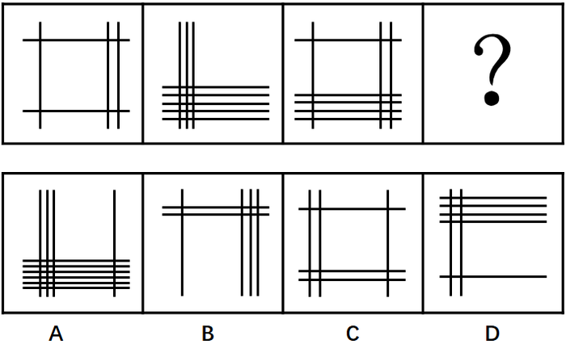

- **A**. A
- **B**. B
- **C**. C　✅
- **D**. D

**答案**：C

**官方解析**

观察图形发现，元素组成凌乱，没有明显属性规律，考虑数数。题干线条数量明显，考虑数线。题干横线的数量为2、5、5，竖线的数量为3、3、3，？处应为3条竖线，对应C项。
故正确答案为C。

---

## 第 2 题　qid 2051572 · 图形推理

从所给的四个选项中，选择最合适的一个填入问号处，使之呈现一定的规律性。

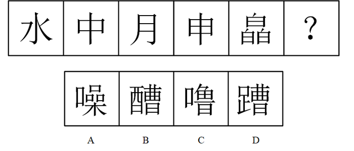

- **A**. A
- **B**. B
- **C**. C
- **D**. D　✅

**答案**：D

**官方解析**

观察图形发现，元素组成凌乱，且无属性规律，考虑数数，题干的面数量较多，考虑数面，题干图形的面数量为：0、2、2、4、6，没有明显的规律，再次观察发现的面数量等于图3的面数量，面数量依次相加为：（2），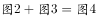（4），（6），，问号处应为10个面，对应D项。

故正确答案为D。

---

## 第 3 题　qid 2051612 · 图形推理

从所给的四个选项中，选择最合适的一个填入问号处，使之呈现一定的规律性。

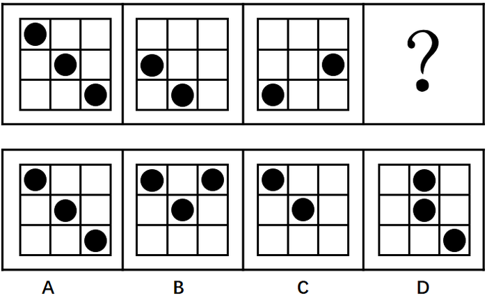

- **A**. A　✅
- **B**. B
- **C**. C
- **D**. D

**答案**：A

**官方解析**

元素组成不同，但无数量规律，且题干为4个图形，不能考虑黑白运算，黑点可能存在重合情况，可以考虑位置规律。对黑点进行标号，如下图所示，根据就近原则，图1中，1向下移动一格，3向左移动一格，2向左或向下移动一格，可得到图2；图2到图3中，1和3继续移动，重合出现在左下角，但图3右边出现了小黑点，说明2的移动规律应该为向左移动，且为循环移动，依此规律，1继续向下循环移动，出现在左上角，2向左移动，出现在中心，3向左循环移动，出现在右下角，即问号处样式应为A。

故正确答案为A。

---

## 第 4 题　qid 2051616 · 图形推理

从所给的四个选项中，选择最合适的一个填入问号处，使之呈现一定的规律性。

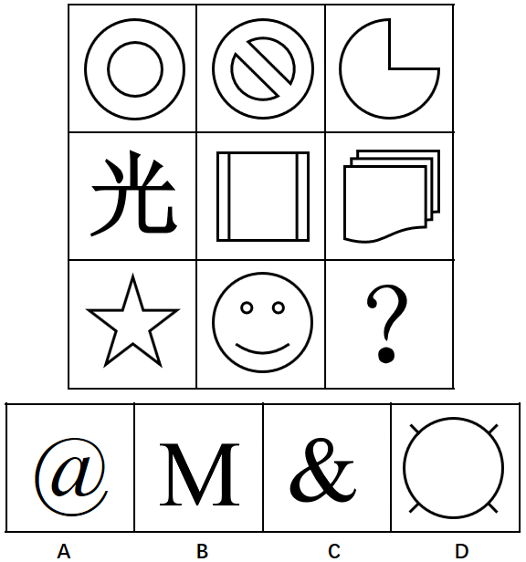

- **A**. A
- **B**. B
- **C**. C　✅
- **D**. D

**答案**：C

**官方解析**

图形组成不同，考虑属性与数量规律。无明显属性规律，考虑数数。第一行分别有2、3、1个面，第二行分别有0、3、3个面，每行的第一个图和第三个图的面数量之和为第二个图的面数量。第三行1、3、？，所以问号处应该有2个面，排除A、B、D项。
故正确答案为C。

---

## 第 5 题　qid 2051620 · 图形推理

从所给的四个选项中，选择最合适的一个填入问号处，使之呈现一定的规律性。

- **A**. A
- **B**. B　✅
- **C**. C
- **D**. D

**答案**：B

**官方解析**

每幅图均由三个图形一条直线组成，且直线与三角形位置不变。从元素的种类和个数上均无规律。把直线与三角形组成的图形当成一个天平，由此可得：五角星比心形图重，心形图比正方形重，正方形比梅花重，太阳比五角星重，所以重量从大到小依次为：，排除A、C、D三项。

故正确答案为B。

---

## 第 6 题　qid 2051622 · 定义判断

比量是指通过已有的经验或知识为参照而进行逻辑推理得出的认识结果。这样的认识结果由于其作为参照基础的知识或是经验和逻辑推理都具有无误性，所以其认识结果也就真实可靠。
根据以上定义，下列不属于比量的是：

- **A**. 甲游玩到山林深处，看到一名僧人在山涧边挑水，身后是茫茫的丛林，从而知道林中有寺庙
- **B**. 乙看到远处露天的舞台上冒烟，而知道舞台上起火了　✅
- **C**. 丙早上起来，透过窗户看见空旷平地上草木摇动，而知道外面在刮风
- **D**. 丁看到一户人家生了一个男孩，非常开心，但是他知道，这孩子将来是要死的

**答案**：B

**官方解析**

第一步：找出定义关键词。
“通过已有的经验或知识为参照而进行逻辑推理得出的认识结果”、“认识结果真实可靠”。
第二步，逐一分析选项。
A项：看见僧人在山涧边挑水时，根据已有的经验推出僧人应该是打水回寺庙，且应该就在附近，得出林中有寺庙，结果真实可靠，符合定义，排除；
B项：看见舞台冒烟认为舞台起火了这一认知结果并不可靠，也可能是舞台在进行烟火特效，不符合定义关键词“认识结果真实可靠”，不符合定义，当选；
C项：看见平旷的空地上草木摇动推出在刮风，是根据已有的经验得出的认识结果，符合定义，排除；
D项：因为每一个人最终的结局都是死亡，所以认为孩子将来是要死的是根据已有的经验得出的认识结果，结果真实可靠，符合定义，排除。
本题为选非题，故正确答案为B。

---

## 第 7 题　qid 2051626 · 逻辑判断

“第三人效果”理论是指人们在判断大众传媒的影响力之际存在着一种普遍的感知定势，即倾向于认为大众媒介的信息对“我”或“你”未必产生多大影响，然而对“他者”产生不可估量的影响。
根据以上定义，下列不涉及“第三人效果”理论的是：

- **A**. 人们认为有关新药的广告或者吸烟有害健康这样的信息对其他人的影响要大过对自己的影响
- **B**. 微信的朋友圈中经常会有人分享很多所谓身体“健康”的信息
- **C**. 支持限制暴力电影的人，他们支持并不是因为电影会影响到自己，而是认为它们会影响到其他人
- **D**. 人们想象他人心目中自己的形象，想象他人对自己的评价，由此而产生自我感　✅

**答案**：D

**官方解析**

第一步：找出定义关键词。
“大众媒体信息”、“对‘我’或‘你’未必产生多大影响”、“对‘他者’产生不可估量的影响”。
第二步：逐一分析选项。
A项：新药的信息属于大众媒体信息，认为这些信息对其他人产生的更大影响体现了对他者产生不可估量的影响，符合定义，排除；
B项：分享身体“健康”信息属于大众媒体信息，认为这些信息会对他者产生不可估量的影响，而非对自己产生多大影响，符合定义，排除；
C项：暴力电影属于大众媒体信息，不认为暴力电影会影响到自己，认为会影响到其他人，符合“对‘我’或‘你’未必产生多大影响”，而“对‘他者’产生不可估量的影响”，符合定义，排除；
D项：他人对自己的评价不属于大众媒体信息，不符合定义，当选。
本题为选非题，故正确答案为D。

---

## 第 8 题　qid 2051630 · 定义判断

包容性创新是指为了实现包容性增长而进行的创新，主要就是让更多人群特别是弱势群体参与到创新活动中来，同时使创新成果扩散到所有的人群，从而增加民众的创新机会和能力，使所有人都从创新活动中受益。
根据上述定义，下列不属于包容性创新的是：

- **A**. 甲公司综合运用卫星通信、全息影像和计算机多媒体技术来为偏远的农村提供医疗服务
- **B**. 乙公司研发出一种低成本冰箱，仅卖376元
- **C**. 丙公司研发出一种白内障治疗仪，将白内障的治疗费用降低到原来的四分之一
- **D**. 随着互联网的发展，相关部门推出火车票网上售票系统　✅

**答案**：D

**官方解析**

第一步：找出定义关键词。
“为了实现包容性增长而进行的创新”、“让更多人群特别是弱势群体参与到创新活动中来，同时使创新成果扩散到所有的人群”。
第二步：逐一分析选项。
A项：为偏远的农村提供医疗服务，符合定义关键词“让更多人群特别是弱势群体参与到创新活动中来，使创新成果扩散到所有的人群”，符合定义，排除；
B项：低成本冰箱是为了使得冰箱这个创新成果扩散到所有人群，符合定义关键词“让更多人群特别是弱势群体参与到创新活动中来，使创新成果扩散到所有的人群”，符合定义，排除；
C项：研发出的白内障治疗仪将治疗费用降低到原来的四分之一，符合定义关键词“让更多人群特别是弱势群体参与到创新活动中来，使创新成果扩散到所有的人群”，符合定义，排除；
D项：火车票网上售票系统使得互联网创新成果扩散到所有人群，但并未涉及弱势群体，不符合定义，当选。
本题为选非题，故正确答案为D。

---

## 第 9 题　qid 2051632 · 定义判断

正强化是指奖励那些符合组织目标的行为，以便使这些行为得到进一步加强，从而有利于组织目标的实现。强化的刺激物不仅包含奖金等物质奖励，还包含表扬、提升、改善工作关系等精神奖励。负强化是指惩罚那些不符合组织目标的行为，以使这些行为削弱甚至消失，从而保证组织目标的实现不受干扰。事实上，对某种行为不再进行正强化也是一种负强化。
根据上述定义，下列不属于负强化的是：

- **A**. 工人工作时聊天声音很大，工厂设置了分贝器，达到一定分贝就报警，响声刺耳
- **B**. 某企业的管理人员尽力发现员工在技能和能力方面与工作需求的对称性　✅
- **C**. 某企业从下个月开始，取消对超额加班的额外奖励
- **D**. 给员工设置无法实现的目标，使他从未感受到骄傲自满

**答案**：B

**官方解析**

第一步：找出定义关键词。
“惩罚那些不符合组织目标的行为，以使这些行为削弱甚至消失，从而保证组织目标的实现不受干扰”、“对某种行为不再进行正强化也是一种负强化”。
第二步：逐一分析选项。
A项：聊天声音达到一定分贝，分贝器就报警，属于惩罚不符合组织目标的行为，是为了使聊天的行为削弱甚至消失，与定义关键词相符，符合定义，排除。
B项：管理人员尽力发现员工在技能和能力方面与工作需求的对称性，与定义中的关键词均不相符，不符合定义（是为了提升和改善工作关系，属于正强化），当选。
C项：取消对超额加班的额外奖励，属于对某种行为不再进行正强化，也是一种负强化，与定义关键词相符，符合定义，排除。
D项：使员工从未感受到骄傲自满是为了使得骄傲这种行为消失，从而保证组织目标的实现，与定义关键词相符，符合定义，排除。
本题为选非题，故正确答案为B。

---

## 第 10 题　qid 2051634 · 定义判断

效果逻辑是一种行为逻辑，强调通过行为来创造或发现机会，获得满意的效果，最终实现愿望。基于效果逻辑的决策者往往从分析既有手段出发，在此基础上确定自己能够做到什么，积极同认识的人进行互动，从而获得利益相关者的承诺，产生新的手段或者目的，实现资源的不断扩张。
根据上述定义，下列决策行为中主要基于效果逻辑的是：

- **A**. 一位厨师接到准备晚餐的任务，客人已经事先确定了菜单，厨师按照已有菜单购买价格最合理的食材，准备做菜所需的工具，进行烹饪
- **B**. 某创业团队在创业初期仅有一个非常模糊的目标，他们在业务拓展过程中不断修正自己的目标　✅
- **C**. 某企业通过市场调研和竞争分析来确定细分的目标市场
- **D**. 某企业年初制定市场营销战略，计算成本价格之差，做出精准的财务规划

**答案**：B

**官方解析**

第一步：找出定义关键词。
“通过行为来创造或发现机会，获得满意的效果，最终实现愿望”、“决策者往往从分析既有手段出发，在此基础上确定自己能够做到什么，积极同认识的人进行互动”、“获得利益相关者的承诺，产生新的手段或者目的，实现资源的不断扩张”。
第二步：逐一分析选项。
A项：厨师根据已有菜单购买食材，进行烹饪。没有通过行为来创造或发现机会，不符合定义，排除；
B项：“某创业团队在创业初期仅有一个非常模糊的目标”，说明他们在现有的基础上确定了自己能做的事情，接着“在业务拓展过程中不断修正自己的目标”说明确实通过与人互动，创造和发现了机会，产生新的目的，符合定义，当选；
C项：“通过市场调研和竞争分析”，无法体现“决策者从分析既有手段出发，在此基础上确定自己能够做到什么，积极同认识的人进行互动”，“确定细分的目标市场”，既然已经确定，那就意味着不存在“通过行为来创造或发现机会”，不符合定义，排除；
D项：年初制定市场营销战略，没有体现“决策者往往从分析既有手段出发，在此基础上确定自己能够做到什么，积极同认识的人进行互动”，既然已经“制定市场营销战略，做出精准的财务规划”，那就意味着不存在“通过行为来创造或发现机会”，不符合定义，排除。
故正确答案为B。

---

## 第 11 题　qid 2051638 · 定义判断

道德发展的原则水平也叫后习俗水平，在这一水平上，人们力求对正当而合适的道德价值和道德原则作出自己的解释，而不管当局或权威人士如何支持这些原则，也不管他自己与这些集体的关系。
根据上述定义，下列事例中行为人的道德发展阶段处于后习俗水平的是：

- **A**. 甲因为害怕父母的惩罚，所以从来没有在学校与同学打过架
- **B**. 乙喜欢帮助同学，因为这样可以受到老师的表扬
- **C**. 丙从来不插队，因为他认为排队是维护社会基本秩序的表现
- **D**. 丁认为法律也只是一种社会契约，而非铁板一块，那些不能提升总体社会福利的法律应该修改　✅

**答案**：D

**官方解析**

第一步，找出定义关键词。
“正当而合适的道德价值和道德原则”、“作出自己的解释”、“不管当局或权威人士如何支持这些原则”、“不管他自己与这些集体的关系”。
第二步，逐一分析选项。
A项：甲从来没有在学校与同学打过架，说明甲需要考虑他自己与学校班集体的关系，同时需要考虑自己与父母的关系，不符合关键词“不管他自己与这些集体的关系”，不符合定义，排除；
B项：乙喜欢帮助同学从而可以受到老师的表扬，说明乙需要考虑自己与集体的关系，不符合关键词“不管他自己与这些集体的关系”，不符合定义，排除；
C项：丙从来不插队，符合定义关键词“正当而合适的道德价值和道德原则”，但丙认为排队是维护社会基本秩序的表现，说明丙考虑了自己与集体的关系，不符合关键词“不管他自己与这些集体的关系”，不符合定义，排除；
D项：丁认为法律也只是一种社会契约，不能提升总体社会福利的法律应该修改，是丁对法律约定的准则“作出自己的解释”，也符合“不管当局或权威人士如何支持这些原则”，符合定义，当选。
故正确答案为D。
注：本题D选项有同学会认为讨论的是法律，而题干讨论的是道德，一定要注意，法律和道德并不是相互矛盾的，且经过查阅相关资料，后习俗水平相关解释中有与D选项类似例子，因此粉笔倾向于答案为D选项。

---

## 第 12 题　qid 2051640 · 定义判断

古典概率通常又叫事前概率，是指当随机事件中各种可能发生的结果及其出现的次数都可以由演绎或者外推法得知，而无需经过任何统计试验即可计算各种可能发生结果的概率。古典概率是以这样的假设为基础的，即随机现象所能发生的事件是有限的、互不相容的，而且每个基本事件发生的可能性相等。
根据上述定义，下列判断中属于古典概率的是：

- **A**. 
某裁判通过抛硬币来决定哪个队先开球，因为他认为抛硬币出现正反的可能性各为
　✅
- **B**. 
某赌者通过大量抛骰子试验，发现出现各个点数的概率接近

- **C**. 
某人观察空中云彩，认为明天下雨的可能性为

- **D**. 
某专家认为，在一个地质断层的场所建造核电站，出现事故的概率为

**答案**：A

**官方解析**

第一步：找出定义关键词。

“当随机事件中各种可能发生的结果及其出现的次数都可以由演绎或者外推法得知，而无需经过任何统计试验即可计算各种可能发生结果的概率”、“随机现象所能发生的事件是有限的、互不相容的，而且每个基本事件发生的可能性相等”。

第二步：逐一分析选项。

A项：抛硬币只有正面和反面两种结果，出现两种结果的可能性相等，符合“随机现象所能发生的事件是有限的、互不相容的，而且每个基本事件发生的可能性相等”，符合定义，当选；

B项：赌者通过大量抛骰子试验才得出结论，不符合“无需经过任何统计试验即可计算各种可能发生结果的概率”，不符合定义，排除；

C项：通过观察空中云彩而得出明天下雨的概率，不符合“无需经过任何统计试验即可计算各种可能发生结果的概率”，不符合定义，排除；

D项：某专家认为建造核电站出现事故的概率为，是通过科学论证后计算出来的，不符合“无需经过任何统计试验即可计算各种可能发生结果的概率”，不符合定义，排除。

故正确答案为A。

---

## 第 13 题　qid 2051642 · 定义判断

跨栏定律最先源于一种医学现象，那些患病器官并不如人们想象的那样糟，相反在与疾病的抗争中，为了抵御病变，它们往往要代偿性地比正常的器官机能更强。后来，该现象被引申到更广的范围：人面前的栏越高，人就可能跳得更高。
根据上述定义，下列现象中与跨栏定律无关的是：

- **A**. 盲人的听觉、触觉、嗅觉都比较灵敏
- **B**. 一些颇有成就的教授之所以走上艺术道路，大都是因为受了生理缺陷的影响
- **C**. 有些人之所以取得了较大的成就，是因为开始时遇到了很大的困难
- **D**. 某些地区率先发展后，建立起一些市场障碍，使非发达地区进入市场的难度增大　✅

**答案**：D

**官方解析**

第一步：找出定义关键词。
“那些患病器官并不如人们想象的那样糟，相反在与疾病的抗争中，为了抵御病变，它们往往要代偿性地比正常的器官机能更强”、“人面前的栏越高，人就可能跳得更高”。
第二步：逐一分析选项。
A项：盲人的听觉、触觉、嗅觉都比较灵敏，符合“人面前的栏越高，人就可能跳得更高”，符合定义，排除；
B项：因为受到生理缺陷的影响，所以走上艺术道路并颇有成就，符合“人面前的栏越高，人就可能跳得更高”，符合定义，排除；
C项：因为开始时遇到了很大的困难，所以取得了较大的成就，符合“人面前的栏越高，人就可能跳得更高”，符合定义，排除；
D项：市场障碍使非发达地区进入市场的难度增大，不符合“人面前的栏越高，人就可能跳得更高”，不符合定义，当选。
此题为选非题，故正确答案为D。

---

## 第 14 题　qid 2051646 · 定义判断

三级价格歧视即对于同一商品或相似的商品，垄断厂商根据不同市场上顾客的需求量对价格变动的反应程度的差别，而实施不同的价格，以攫取更多的利益。
根据上述定义，下列企业的行为与实施三级价格歧视无关的是：

- **A**. 某房地产企业对农村户口的客户有更大的优惠
- **B**. 高铁设置了特等座、一等座和二等座
- **C**. 大多数旅游景点设置了成人票、儿童票、老人票和学生票
- **D**. 电信公司根据客户每月上网时间的不同，采取不同的资费标准　✅

**答案**：D

**官方解析**

第一步：找出定义关键词。

“根据不同市场上顾客的需求量对价格变动的反应程度的差别”、“实施不同的价格，以攫取更多的利益”。

第二步：逐一分析选项。

A项：对不同顾客实施不同价格，是因为与非农村户口相比，农村户口可能相对来说对价格变动更为敏感，对这部分的人群实施优惠，可以激发他们购买的欲望，各个群体的钱均能赚到，以攫取更多的利益，符合定义，排除；

B项：对不同座位实施不同价格，是因为对于一些经济能力比较好的人群来说，他们对特等座的价格并不敏感，而对于另外一部分经济能力一般的人群来说，觉得特等座太贵，一等或二等座就可以了，所以对于价格变动反应不同的群体实施了不同的价格，各个群体的钱均能赚到，符合定义，排除；

C项：对不同顾客实施不同价格，是因为与成人相比，学生可能相对来说对价格变动更为敏感，对这部分的人群实施优惠，可以激发他们旅游的欲望，各个群体的钱均能赚到，以攫取更多的利益，符合定义，排除；

D项：实施不同价格的原因是因为上网时间不同，而非对价格变动反应程度的差别，不符合定义，当选。

此题为选非题，故正确答案为D。

注：如下图所示，D项是二级价格歧视的典型案例。

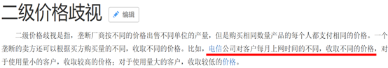

---

## 第 15 题　qid 2051650 · 定义判断

认知失调又叫认知不和谐，是指一个人的行为与自己先前一贯的对自我的认知（而且通常是正面的、积极的自我）产生分歧，从一个认知推断出另一个对立的认知时而产生的不舒适感、不愉快的情绪。
根据上述定义，下列不属于认知失调的是：

- **A**. 甲喜欢吸烟，读了吸烟可能致癌的文章后，心里很不舒服
- **B**. 乙正在减肥，本应少吃高热量食品，但有一天实在无法控制自己的欲望，吃了一个甜甜圈，事后觉得很难过
- **C**. 丙看到与自己干同样工作的同事拿到的工资远远高于自己，心里觉得很不舒服　✅
- **D**. 丁很不喜欢夸夸其谈的上司，仍不得不恭维他，为此，丁感到痛苦

**答案**：C

**官方解析**

第一步：找出定义关键词。
“一个人的行为与自己先前一贯的对自我的认知（而且通常是正面的、积极的自我）产生分歧”、“产生的不舒适感，不愉快的情绪”。
第二步：逐一分析选项。
A项：“甲喜欢吸烟”是甲先前的对自我的认知，且喜欢吸烟是喜欢一件事，是积极的自我，甲读了吸烟可能致癌的文章是行为，心里很不舒服，说明二者产生分歧，符合“一个人的行为与自己先前一贯的对自我的认知（而且通常是正面的、积极的自我）产生分歧”、“产生的不舒适感，不愉快的情绪”，符合定义，排除；
B项：“乙正在减肥，本应少吃高热量食品”是乙先前的对自我的认知，“有一天实在无法控制自己的欲望，吃了一个甜甜圈”是行为，事后觉得很难过，说明二者产生分歧，符合“一个人的行为与自己先前一贯的对自我的认知（而且通常是正面的、积极的自我）产生分歧”、“产生的不舒适感，不愉快的情绪”，符合定义，排除；
C项：丙看到自己干同样工作的同事拿到的工资远远高于自己，这是丙拿自己和同事比才出现的不舒服的心理，不是丙现在的行为和之前的认知产生分歧，不符合“一个人的行为与自己先前一贯的对自我的认知（而且通常是正面的、积极的自我）产生分歧”，不符合定义，当选；
D项：“丁很不喜欢夸夸其谈的上司”是丁先前的对自我的认知，“仍不得不恭维他”是行为，丁感到痛苦，说明二者产生分歧，符合“一个人的行为与自己先前一贯的对自我的认知（而且通常是正面的、积极的自我）产生分歧”、“产生的不舒适感，不愉快的情绪”，符合定义，排除。
本题为选非题，故正确答案为C。

---

## 第 16 题　qid 2051652 · 类比推理

嬴政：吕不韦

- **A**. 刘邦：张良
- **B**. 赵匡胤：赵普　✅
- **C**. 朱翊钧：张居正
- **D**. 刘禅：诸葛亮

**答案**：B

**官方解析**

第一步：分析题干词语间的逻辑关系。
嬴政是秦朝的开国皇帝，而吕不韦是辅佐嬴政的丞相。
第二步：分析选项词语间的逻辑关系。
A项：刘邦是汉朝开国皇帝，张良是汉初三杰之一，张良未曾做过刘邦的丞相，与题干逻辑关系不一致，排除；
B项：赵匡胤是宋朝开国皇帝，而赵普是辅佐赵匡胤的丞相，与题干逻辑关系一致，当选；
C项：朱翊钧是明朝第十三位皇帝，张居正是辅佐朱翊钧的内阁首辅，朱翊钧并非明朝首位开国皇帝，与题干逻辑关系不一致，排除；
D项：刘禅是三国时期蜀汉昭烈帝刘备之子，而诸葛亮是三国时期蜀汉丞相，诸葛亮辅佐过刘备和刘禅。刘禅并非蜀汉的开国皇帝，与题干逻辑关系不一致，排除。
故正确答案为B。

---

## 第 17 题　qid 2051660 · 类比推理

熟石灰：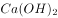

- **A**. 
钡餐：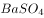
　✅
- **B**. 
纯碱：

- **C**. 
：干冰

- **D**. 
生石灰：

**答案**：A

**官方解析**

第一步：判断题干词语间逻辑关系。

熟石灰的化学式是。

第二步：判断选项词语间逻辑关系。

A项：钡餐的化学式是，符合题干的逻辑关系，当选；

B项：纯碱的化学式是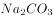，不符合题干的逻辑关系，排除；

C项：干冰的化学式是，但是顺序反了，不符合题干的逻辑关系，排除；

D项：生石灰的化学式是，不符合题干的逻辑关系，排除。

故正确答案为A。

---

## 第 18 题　qid 2051662 · 类比推理

肖洛霍夫：静静的顿河：葛利高里

- **A**. 司汤达：红与黑：于连
- **B**. 雨果：悲惨世界：冉·阿让
- **C**. 路遥：平凡的世界：孙少安　✅
- **D**. 马尔克斯：百年孤独：布恩迪亚

**答案**：C

**官方解析**

第一步：判断题干词语间逻辑关系。
《静静的顿河》是肖洛霍夫的作品，是作品与作者的对应，葛利高里是《静静的顿河》中的人物，且《静静的顿河》是社会主义现实主义作品。
第二步：判断选项词语间逻辑关系。
A项：《红与黑》是司汤达的作品，是作品与作者的对应，于连是《红与黑》中的人物，但《红与黑》描写的是资本主义社会的生活，不符合题干逻辑关系，排除；
B项：《悲惨世界》的作者是雨果，是作品与作者的对应，冉•阿让是《悲惨世界》中的人物，但《悲惨世界》描写的是资本主义社会的生活，不符合题干逻辑关系，排除；
C项：《平凡的世界》的作者是路遥，是作品与作者的对应，孙少安是《平凡的世界》中的人物，是人物和作品的对应，且《平凡的世界》是社会主义现实主义作品，符合题干逻辑关系，当选；
D项：《百年孤独》的作者是马尔克斯，是作品与作者的对应，布恩迪亚是《百年孤独》中的人物，是人物和作品的对应，但《百年孤独》是魔幻现实主义文学，不符合题干逻辑关系，排除。
故正确答案为C。

---

## 第 19 题　qid 2051666 · 类比推理

甲骨文：电纸书

- **A**. 毛笔：激光笔
- **B**. 烽火台：通信卫星　✅
- **C**. 弓箭：导弹
- **D**. 算盘：计算机

**答案**：B

**官方解析**

第一步：判断题干词语间逻辑关系。
甲骨文是古代的一种文字，在龟甲或兽骨上契刻；电纸书是现代的一种类纸阅读器，二者都是信息的载体，都有“传递信息”的功能。
第二步：判断选项词语间逻辑关系。
A项：毛笔是传统的书写工具，激光笔是用来在特定场所，投映一个光点或一条光线指向物体，二者的功能不同，与题干逻辑关系不一致，排除；
B项：烽火台是古时用于点燃烟火传递重要消息的高台；通信卫星是卫星通信系统的空间部分，用来转发无线电信号，二者都是用来传递信息的，与题干逻辑关系一致，当选；
C项：弓箭是用弓发射的具有锋刃的一种远射兵器，导弹是依靠自身动力装置推进，由制导系统导引、控制其飞行弹道，将战斗部导向并摧毁目标的武器，二者都是武器，但导弹没有“传递信息”的功能，没有B项与题干更为类似，排除；
D项：算盘是古代一种简便的计算工具，计算机是现代一种用于高速计算的电子计算机器，二者都有计算的功能，但算盘没有“传递信息”的功能，没有B项与题干更为类似，排除。
故正确答案为B。

---

## 第 20 题　qid 2051670 · 类比推理

陆游：柳暗花明又一村

- **A**. 刘禹锡：病树前头万木春　✅
- **B**. 欧阳修：自缘身在最高层
- **C**. 白居易：白云生处有人家
- **D**. 刘长卿：春江水暖鸭先知

**答案**：A

**官方解析**

第一步，判断题干词语间逻辑关系。
“柳暗花明又一村”出自陆游的作品《游山西村》，二者是作者与诗句的对应关系。
第二步，判断选项词语间逻辑关系。
A项：“病树前头万木春”出自刘禹锡的《酬乐天扬州初逢席上见赠》，为作者与诗句的对应关系，与题干逻辑关系一致，当选；
B项：“自缘身在最高层”出自王安石的《登飞来峰》，作者不是欧阳修，与题干逻辑关系不一致，排除；
C项：“白云生处有人家”出自杜牧的《山行》，作者不是白居易，与题干逻辑关系不一致，排除；
D项：“春江水暖鸭先知”出自苏轼的《惠崇春江晚景》，作者不是刘长卿，与题干逻辑关系不一致，排除。
故正确答案为A。

---

## 第 21 题　qid 2051672 · 类比推理

YouTube：福特：美国

- **A**. Facebook：微软：美国
- **B**. Youku：吉利：中国　✅
- **C**. Alibaba：华为：中国
- **D**. Google：苹果：美国

**答案**：B

**官方解析**

第一步，判断题干词语间逻辑关系。
YouTube与福特都是美国的品牌，为品牌和国家的对应关系。且YouTube是科技品牌，主营视频业务，福特是汽车品牌。
第二步，判断选项词语间逻辑关系。
A项：Facebook与微软都是美国的品牌，为品牌和国家的对应关系，但两者都是科技品牌，与题干逻辑关系不一致，排除；
B项：Youku和吉利都是中国的品牌，为品牌和国家的对应关系，且Youku是科技品牌，主营视频业务，吉利是汽车品牌，与题干逻辑关系一致，当选；
C项：Alibaba与华为都是中国的品牌，为品牌和国家的对应关系，但两者都是科技品牌，与题干逻辑关系不一致，排除；
D项：Google与苹果都是美国的品牌，为品牌和国家的对应关系，但两者都是科技品牌，与题干逻辑关系不一致，排除。
故正确答案为B。

---

## 第 22 题　qid 2051678 · 类比推理

庐山：鄱阳湖：江西

- **A**. 泰山：洪泽湖：山东
- **B**. 武当山：洞庭湖：湖北
- **C**. 黄山：巢湖：安徽　✅
- **D**. 会稽山：太湖：浙江

**答案**：C

**官方解析**

第一步，判断题干词语间逻辑关系。
庐山和鄱阳湖都位于江西省，前两词与第三词是山脉湖泊与所在省份的对应关系。
第二步，判断选项词语间逻辑关系。
A项：泰山位于山东省，但洪泽湖位于江苏省，与题干逻辑关系不一致，排除；
B项：武当山位于湖北省，但洞庭湖位于湖南省，与题干逻辑关系不一致，排除；
C项：黄山和巢湖都位于安徽省，与题干逻辑关系一致，当选；
D项：会稽山位于浙江省，但是太湖位于江苏省，与题干逻辑关系不一致，排除。
故正确答案为C。

---

## 第 23 题　qid 2051684 · 类比推理

教师：陕西人

- **A**. 彩虹：云雾
- **B**. 青年：学生　✅
- **C**. 永乐大典：四库全书
- **D**. 大熊猫：金丝猴

**答案**：B

**官方解析**

第一步，判断题干词语间逻辑关系。
有的教师是陕西人，有的教师不是陕西人；有的陕西人是教师，有的陕西人不是教师，二者为交叉关系。
第二步，判断选项词语间逻辑关系。
A项：彩虹是太阳光照射云雾上的水滴，光线被折射形成的，二者是对应关系，与题干逻辑关系不一致，排除；
B项：有的青年是学生，有的青年不是学生，有的学生是青年，有的学生不是青年，二者为交叉关系，与题干逻辑关系一致，当选；
C项：永乐大典与四库全书都是书籍，二者为并列关系，与题干逻辑关系不一致，排除；
D项：大熊猫与金丝猴都是中国著名的珍贵动物，二者为并列关系，与题干逻辑关系不一致，排除。
故正确答案为B。

---

## 第 24 题　qid 2051686 · 类比推理

头：脚

- **A**. 白天：黑夜
- **B**. 男人：女人
- **C**. 好：孬
- **D**. 红：蓝　✅

**答案**：D

**官方解析**

第一步，分析题干词语间的逻辑关系。
头和脚为并列关系中的反对关系，二者均为不同的人体部位，除了头和脚外人体还有其他部位。
第二步，判断选项词语间逻辑关系。
A项：白天和黑夜为并列关系中的矛盾关系，除了白天就是黑夜，与题干逻辑关系不一致，排除；
B项：男人和女人为并列关系中的矛盾关系，除了男人就是女人，与题干逻辑关系不一致，排除；
C项：好和孬为并列关系中的矛盾关系，要么好要么孬，与题干逻辑关系不一致，排除；
D项：红和蓝为并列关系中的反对关系，二者均为不同的颜色，除了红和蓝外还有其他颜色，与题干逻辑关系一致，当选。
故正确答案为D。

---

## 第 25 题　qid 2051690 · 类比推理

（  ） 对 月食 相当于 （  ） 对 日食

- **A**. 太阳  地球
- **B**. 太阳  月亮
- **C**. 地球  月亮　✅
- **D**. 火星  地球

**答案**：C

**官方解析**

第一步：分析题干。
月食是自然界的一种现象，当太阳、地球、月球三者恰好或几乎在同一条直线上时（地球在太阳和月球之间），太阳到月球的光线便会部分或完全地被地球掩盖，产生月食。
日食，又叫做日蚀，是月球运动到太阳和地球中间，如果三者正好处在一条直线时，月球就会挡住太阳射向地球的光，月球身后的黑影正好落到地球上，这时发生日食现象。
第二步：将选项逐一代入，判断各选项前后部分的逻辑关系。
A项：太阳发出光线但是光线没有照射到月球，产生月食，太阳发出光线但是光线没有照射到地球产生日食，前后逻辑关系不一致，排除；
B项：太阳发出光线但是光线没有照射到月球，产生月食，太阳发出光线被月亮挡住，没有照射到地球，产生日食，前后逻辑关系不一致，排除；
C项：因为地球在太阳和月球之间而产生月食，因为月亮在太阳和地球之间而产生日食，均因为前者的位置而产生了后者的自然现象，前后逻辑关系一致，当选；
D项：火星和月食之间无明显的逻辑关系，而太阳发出光线但是光线没有照射到地球产生日食，前后逻辑关系不一致，排除。
故正确答案为C。

---

## 第 26 题　qid 2051694 · 类比推理

甲、乙、丙三名学生进行交谈，他们当中只有一人去汉中观赏过油菜花。甲说：“我去汉中观赏过油菜花，太漂亮了。”乙说：“我没有去汉中观赏过油菜花。”丙说：“甲没有去汉中观赏过油菜花。”其中，只有一个人的话是真话，那么以下说法中正确的有：

- **A**. 甲去汉中观赏过油菜花
- **B**. 乙去汉中观赏过油菜花　✅
- **C**. 乙说的是真话
- **D**. 丙说的是真话　✅

**答案**：BD

**官方解析**

第一步，找突破口。
甲和丙所说的话为矛盾关系，必有一真一假。
第二步，看其余的题干信息。
只有一人说的话是真话，其余均是假话，则乙说的话是假话，即乙去汉中观赏过油菜花；根据题干中三人中只有一人去汉中观赏过油菜花，则甲没有去观赏过油菜花，即甲和乙说的是假话，丙说的是真话。
故正确答案为BD。

---

## 第 27 题　qid 2051696 · 逻辑判断

甲、乙、丙、丁是四位成功的企业家，他们从事的行业包括建筑行业、计算机行业、教育行业和服装行业，尚不能确定其中每个人所从事的行业。已知：①有一天晚上，甲和丙出席了教育行业企业家的晚宴；②计算机行业企业家曾为乙和服装行业企业家两个人拍过合影；③服装行业企业家正准备购买甲的股份，他曾经通过购买丁的股份获得盈利。
根据以上描述，以下说法中不正确的有：

- **A**. 甲是教育行业企业家，乙是服装行业企业家　✅
- **B**. 甲是建筑行业企业家，乙是教育行业企业家
- **C**. 丙是服装行业企业家，丁是计算机行业企业家
- **D**. 丙是计算机行业企业家，丁是服装行业企业家　✅

**答案**：AD

**官方解析**

分析题干关键信息。根据①可知甲和丙均不是教育行业企业家，对比选项知A项错误，当选；根据②可知乙不是计算机行业企业家，也不是服装行业企业家；根据③可知甲和丁不是服装行业企业家，对比选项知D项错误，当选。
将B、C两项代入验证，亦与题干信息相符。
本题为选非题，故正确答案为AD。

---

## 第 28 题　qid 2051700 · 逻辑判断

甲乙丙丁四人骑着共享单车去春游，共享单车的品牌有：ofo，酷骑，摩拜和oxo。碰巧的是，他们的单车品牌各不相同。
甲说：“乙的车不是ofo单车。”
乙说：“丙的车是oxo单车。”
丙说：“丁的车不是摩拜单车。”
丁说：“甲、乙、丙三人中有一个人的车是oxo单车，而且只有这个人说的是实话。”
如果丁说的是实话，那么以下说法中正确的是：

- **A**. 甲的车是oxo单车，乙的车是ofo单车
- **B**. 甲的车是oxo单车，乙的车是酷骑单车　✅
- **C**. 丙的车是ofo单车，丁的车是摩拜单车　✅
- **D**. 丙的车是ofo单车，丁的车是酷骑单车

**答案**：BC

**官方解析**

根据题干确定信息“丁说的是实话”“甲、乙、丙三人中有一个人的车是oxo单车，而且只有这个人说的是实话”可知：说实话的一定是骑oxo单车的。由乙说的话“丙的车是oxo单车”可知，乙说的一定是假话（如果乙说的是真话，那么丙的车是oxo单车与乙的车是oxo单车矛盾），那么丙的车不是oxo单车。再由丙没有骑oxo单车可知，丙说的一定不是真话，那么真话就是“丁的车是摩拜单车”。三个人中只有一个人说真话且丙和乙都是假话，那么甲的话是真话，即“乙的车不是ofo单车”是真话，甲的车是oxo单车。综上可知，甲的车是oxo单车，乙的车不是ofo单车，丙的车不是oxo单车，丁的车是摩拜单车。甲、丁的单车品牌都确定了，而乙的车不是ofo单车，那么丙的车一定是ofo单车，那么乙的单车是酷骑单车。
故正确答案为BC。

---

## 第 29 题　qid 2051704 · 类比推理

某次重要考试选拔命题教师，命题教师必须具备三个条件：第一，强烈的责任心；第二，丰富的知识；第三，严格的自律性。现在至少符合条件之一的甲、乙、丙、丁四名优秀教师报名参加。已知：
①甲、乙自律性程度相同。
②乙、丙责任心水平相当。
③丙、丁并非都具有强烈的责任心。
④四个人中三人具有强烈的责任心、两人具有严格的自律性、一人具有丰富的知识。
经过考察，发现其中只有一人完全符合命题教师的全部条件，则以下说法正确的有：

- **A**. 甲乙丙具有强烈的责任心　✅
- **B**. 甲乙具有严格的自律性
- **C**. 丙丁具有严格的自律性　✅
- **D**. 完全符合命题教师全部条件的是丙　✅

**答案**：ACD

**官方解析**

分析题干已知信息：

①甲、乙自律性程度相同。

②乙、丙责任心水平相当。

③丙、丁并非都具有强烈的责任心。

④四个人中三人具有强烈的责任心、两人具有严格的自律性、一人具有丰富的知识。

⑤至少符合条件之一的甲、乙、丙、丁四名优秀教师报名参加。

⑥四个人只有一人完全符合命题教师的全部条件。

题干信息涉及的人和信息较多，可列表（表格数字代表符合该条件的人数）如下：

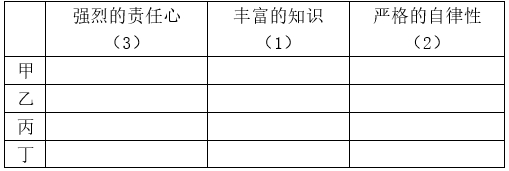

由条件②乙、丙责任心水平相当，以及符合强烈的责任心的人有三人，可知，乙、丙一定都有强烈的责任心（若乙、丙均无强烈的责任心，则符合强烈的责任心的人只有两人，与题干矛盾）。

再由条件③丙、丁并非都具有强烈的责任心，可知丁没有强烈的责任心，则甲一定有强烈的责任心。如下表所示：

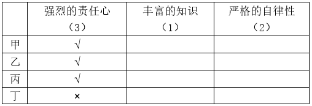

再由条件⑥四个人只有一人完全符合命题教师的全部条件且拥有丰富的知识的教师只有一人，可知拥有丰富知识的人一定不是丁，再由条件⑤甲、乙、丙、丁四名优秀教师至少符合条件之一，可知丁一定有严格的自律性。如下表：

由条件①甲、乙自律性程度相同且拥有严格的自律性的教师只有两人，可知甲、乙一定都没有严格的自律性（如果甲、乙都有严格的自律性，那么丙、丁都没有严格的自律性，这与上述分析丁具有严格的自律性矛盾）。如下表：

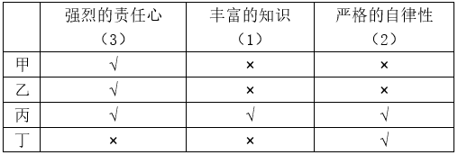

故正确答案为ACD。

---

## 第 30 题　qid 2051708 · 逻辑判断

从艺术创作的角度说，一部电视剧不该承载全部的社会意见，必须选择性呈现；对于现实主义题材的作品，没有义务、也没有能力去解开所有的社会心结。但矛盾在于，从名字到情节都被认为造假的畅销剧，创作动机在于歌颂反腐现实。所以，电视剧及其批评一定有一个是错的。
以下各项，能够支持上述观点的有：

- **A**. 从名字到情节都被认为造假的畅销剧很难实现歌颂反腐现实的目的　✅
- **B**. 创作动机在于歌颂反腐现实的电视剧不应被认为存在造假的成份　✅
- **C**. 电视剧及其批评都有合理的成份
- **D**. 电视剧来源于现实，但不同于现实，对其批评意义不大

**答案**：AB

**官方解析**

第一步：找出论点和论据。
论点：电视剧及其批评一定有一个是错的。
论据：对电视剧的批评是指该剧是一部从名字到情节都被认为造假的畅销剧；电视剧的创作动机在于歌颂反腐现实。
第二步：逐一分析选项。
A项：该项表明被认为造假的畅销剧难以实现电视剧的创作目的，说明对电视剧的批评和电视剧本身二者当中一定有一个是错误的，解释了题干的论点，补充论据，可以支持，当选；
B项：歌颂反腐现实的电视剧不应被认为存在造假的成份，说明电视剧本身和批评该电视剧造假二者当中一定有一个是错误的，解释了题干的论点，补充论据，可以支持，当选；
C项：只强调电视剧及其批评都有合理的成份，没有说明二者是否一定有一个是错的，属于无关选项，排除；
D项：对电视剧进行批评的意义与题干论点无关，排除。
故正确答案为AB。

---

## 第 31 题　qid 2051710 · 逻辑判断

优秀的开发团队，卓越的产品表现，加上广阔的舞台，可以让企业更好地发挥出它的魅力。同时，在推广中获得最新的用户评价，以不断优化产品设计和服务，也是成功的关键。为此，选择合适的推广平台至关重要。对此，运营专家说：“面对人生地不熟的海外市场，中国创业创新者也需要善于利用国际工具，‘借船出海’。”
以下各项中，能够支持运营专家观点的有：

- **A**. 在熟悉的国内市场上，无需在产品的推广工具选择上煞费苦心
- **B**. 在陌生的海外市场上，选择合适的产品推广平台尤为重要　✅
- **C**. 产品的质量和销售服务才是成功的关键
- **D**. 合适的推广平台所反馈的信息有助于实现成功　✅

**答案**：BD

**官方解析**

第一步：找到论点和论据。
论点：面对人生地不熟的海外市场，中国创业创新者也需要善于利用国际工具，“借船出海”。
论据：优秀的开发团队，卓越的产品表现，加上广阔的舞台，可以让企业更好的发挥出它的魅力。同时，在推广中获得最新的用户评价，以不断优化产品设计和服务，也是成功的关键。为此，选择合适的推广平台至关重要。
第二步：逐一分析选项。
A项：国内市场无需在产品的推广工具选择上煞费苦心，题干论点讨论的是海外市场，话题不一致，不能加强，排除；
B项：说明了为什么要选择合适的推广平台，支持“选择合适的推广平台至关重要”，补充论据，当选；
C项：产品的质量和销售服务才是成功的关键，说明推广平台对成功不重要，即无需“借船出海”，削弱论点，排除；
D项：解释“选择合适的推广平台至关重要”的原因，补充论据，当选。
故正确答案为BD。

---

## 第 32 题　qid 2051714 · 逻辑判断

财富不是钱，也不是资源，更不是货币，财富是动态的，是可以市场买卖的东西，财富的多少不是对资源的占有，而是对资源的利用，是由国民的创造力决定的，这种创造力是这个国家国民的整体智慧的积累。没有智慧的积累与培植，哪怕拥有再多的资源，也不会有财富的增长与积累。
以下各项中，能够质疑上述观点的有：

- **A**. 孔子很有智慧，但没有大笔财富
- **B**. 教育和知识水平相当的国家，往往差别很大
- **C**. 有的国家财富增长很快，但并不存在相应的智慧积累和培植　✅
- **D**. 一个国家的整体智慧有可能转变为财富

**答案**：C

**官方解析**

第一步：找出论点和论据。
论点：财富的增长与积累→智慧的积累与培植。
论据：财富是由国民创造力决定的，这种创造力是这个国家国民的整体智慧的积累。
第二步：逐一分析选项。
A项：题干说的是国家国民的整体智慧的积累，而选项A说明的是孔子个人智慧与财富，与论点无关，属于无关选项，排除；
B项：教育和知识水平相当的国家，往往差别很大，没有具体说明什么差别很大，属于不明确选项，不能质疑，排除；
C项：有的国家财富增长很快且不存在相应的智慧积累和培植，举例削弱论点，当选；
D项：一个国家的整体智慧可能转变为财富，是对论点后件的肯定，肯后无法得出确定的结论，因此该选项可能性的表述是正确的。但是无法削弱论点，排除。
故正确答案为C。

---

## 第 33 题　qid 2051716 · 逻辑判断

要研发一款保险产品，要涉及精算、产品、风控、客服、核保、核赔、IT、法律、财务、资产、品宣、电话中心、物控，甚至关联的各个业务口，十多个部门，后续有一大堆繁杂的事项，足见一个保险产品的出台要涉及多少个部门的协同作战，是多少利益和战略的平衡，是多么复杂和专业的问题。所以，我非常理解各家保险公司的同行，想要出台一款产品是多么不容易，简直是“过五关斩六将”。
以下各项中，能质疑上述观点的有：

- **A**. 保险市场上，保险产品琳琅满目，让人应接不暇
- **B**. 研发保险产品的关键在于精算工作，其他业务并不复杂　✅
- **C**. 一家新开张的保险公司，在短时间内出台了好几款设计合理的保险产品　✅
- **D**. 保险产品的质量决定了销量

**答案**：BC

**官方解析**

第一步：找到论点和论据。
论点：想要出台一款保险产品是多么不容易，简直是“过五关斩六将”。
论据：研发一款保险产品，要涉及多少个部门的协同作战，是多少利益和战略的平衡，是多么复杂和专业的问题。
第二步：逐一分析选项。
A项：保险产品的多少与出台保险产品的难易程度无关，是无关选项，排除；
B项：说明研发保险产品关键在精算，其他业务不复杂，削弱论据中的需要多个部门协同作战，在一定程度上可以削弱，当选；
C项：举例说明某家新开张的保险公司，短时间内设计出好几款合理的保险产品，“短时间内出台好几个”削弱论点“出台保险产品不容易”，属于削弱选项，当选；
D项：保险产品的质量决定了销量，质量和销量问题与论点无关，属于无关选项，排除。
故正确答案为BC。

---

## 第 34 题　qid 2051718 · 逻辑判断

金融的不稳定和经济的不稳定是一个问题的两个方面。这种情况之下，如果这些催生经济、金融不稳定的风险因素不能有效化解，那么防范系统性金融风险、防范实体经济萎缩等目标都难以实现。这也是目前中国经济面临的根本性问题。
根据以上文字，可以推出：

- **A**. 金融不稳定和经济不稳定是目前中国经济面临的根本性问题
- **B**. 金融不稳定与经济不稳定是相互联系、表现不同的两个问题
- **C**. 防范系统性金融风险和防范实体经济萎缩都需要化解催生经济、金融不稳定的风险因素　✅
- **D**. 目前中国经济面临的根本性问题就是如何有效化解催生经济、金融不稳定的风险因素

**答案**：C

**官方解析**

第一步：翻译题干。

不能有效化解催生经济、金融不稳定的风险因素难以实现防范系统性金融风险、防范实体经济萎缩等目标。

第二步：逐一分析选项。

A项：题干“这些催生经济、金融不稳定的风险因素不能有效化解”是目前中国经济面临的根本性问题，而不是“金融不稳定和经济不稳定”本身是目前中国经济面临的根本性问题，因此该项无法推出，排除；

B项：金融的不稳定和经济的不稳定是一个问题的两个方面而非两个问题，无法推出，排除；

C项：防范系统性金融风险和防范实体经济萎缩→化解催生经济、金融不稳定的风险因素，是对题干翻译条件的否后，否后可以推出否前，该项可以推出，当选；

D项：中国经济面临的根本性问题就是如何有效化解催生经济、金融不稳定的风险因素，该表述过于绝对，无法推出，排除。

故正确答案为C。

---

## 第 35 题　qid 2051720 · 逻辑判断

可将皇帝与功臣的关系看作一种委托代理关系，皇帝作为帝国的所有者，控制着帝国的产权，但他不可能直接治理国家，必须委托一个或数个代理人来帮助他管理国家，在这样一个委托代理关系下，皇帝给功臣们高官厚禄，对他们的要求是勤奋工作，为皇帝效命。不过皇帝最主要、最关心的还是要求功臣们不得造反。
根据以上文字，以下说法中不正确的有：

- **A**. 作为委托人的皇帝有动机对功臣们进行监督
- **B**. 作为代理人的功臣们有动机勤奋工作，为皇帝效命
- **C**. 给功臣们高官厚禄是一种激励方式
- **D**. 皇帝总是有办法阻止功臣们造反　✅

**答案**：D

**官方解析**

第一步，抓住题干主要信息。
“可将皇帝与功臣的关系看作一种委托代理关系”；
“皇帝给功臣们高官厚禄，对他们的要求是勤奋工作，为皇帝效命”；
“皇帝最主要、最关心的还是要求功臣们不得造反”。
第二步：逐一分析选项。
A项：根据题干信息，皇帝作为委托人对功臣们提出要求，同时要防止功臣们造反，因此皇帝是有动机对功臣们进行监督的，可以推出，排除；
B项：皇帝给功臣们高官厚禄要求功臣们勤奋工作，因此功臣们有动机为皇帝效命，可以推出，排除；
C项：给功臣们高官厚禄是皇帝要求功臣们勤奋工作，为皇帝效命的一种方式，该项可以推出，排除；
D项：题干只说皇帝最关心的是要求功臣们不得造反，没有说皇帝有办法阻止功臣们造反，无中生有，无法推出，当选。
本题为选非题，故正确答案为D。

---
