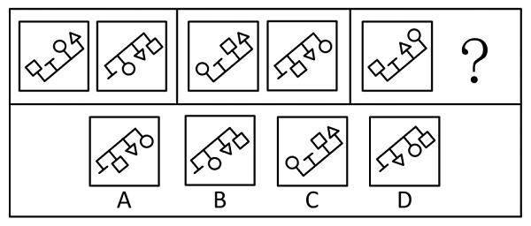
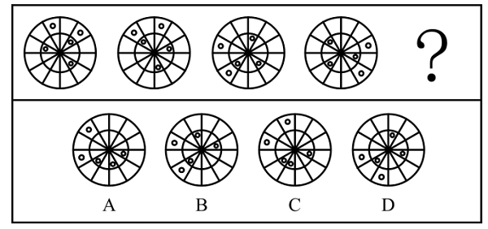
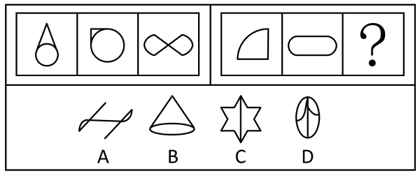
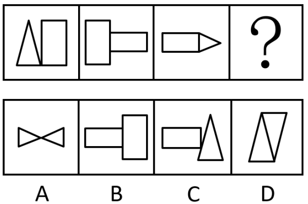
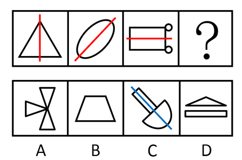
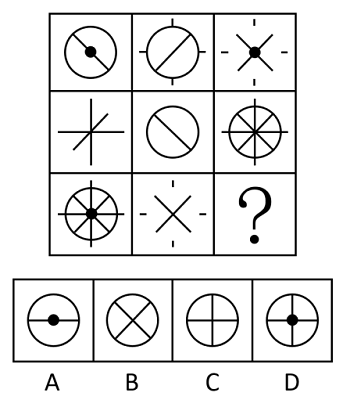
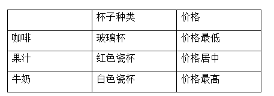

# 2017年上海市行政执法类考试《行测》试题（网友回忆版）

> 判断推理 · 30 题 · 上海 2017

## 第 1 题　qid 5701474 · 逻辑判断

已知大气压强会随着海拔的升高而减小。在8000m左右高空飞行时，为了避免对人体造成不良影响，飞机会启动自动增压系统对舱内加压。根据以上信息下列说法错误的是（    ）。

- **A**. 在8000米左右高空飞行的飞机机舱内的气压应该和地面保持一致　✅
- **B**. 带上飞机装有薯片的密封包装袋会向外膨胀
- **C**. 如果在高空飞机意外破裂一个孔洞，则舱内物体会被强大的吸力拉扯到舱外去
- **D**. 为了抵抗机舱内外的气压差，因此机体材料要有一定的耐压强度

**答案**：A

**官方解析**

A项：由于大气压强随着海拔的升高而减小，因此飞机飞行的高度越高，机舱内气压也会降低，一般来说，飞行高度超过7000米时，如果不采取增压措施，机舱内的乘客就会因为缺氧、低压而就会感到不适，因此飞机会启动自动增压系统对舱内加压。但是如果把舱内气压增加到与地面相同，舱内与舱外的压力差会比较大，将会增加飞机本身承受的压力，这就对机身的结构强度提出了较高的要求，从而会增加飞机的制造成本，因此增压系统只会把舱内气压增加到相当于海拔高度两三千米的气压（这个气压下，乘客一般没有什么不舒服的感觉），可见在8000米高空飞行时，机舱内的气压是小于地面气压的，错误；
B项：由A项分析可知，与在地面上相比，高空飞行时机舱内的气压小于地面上的气压，而薯片包装袋内的气压不变（大于地面上的气压），则包装袋内部的气压大于机舱内的气压，因此包装袋会出现向外膨胀的现象，正确；
C项：在高空飞行时，如果飞机意外破裂一个孔洞，由于机舱内的气压大于机舱外的气压，因此会形成一个向外的压力差，则舱内物体会被强大的压力拉扯到舱外去，正确；
D项：由A项分析可知，机舱内外的气压差越大，飞机本身结构材料所承受的压力也越大，为了抵抗机舱内外的气压差，机体材料要有一定的耐压强度，正确。
本题为选非题，故正确答案为A。

---

## 第 2 题　qid 5701493 · 类比推理

下面我们生活当中常见的液体，不属于溶液的是（    ）。

- **A**. 盐水
- **B**. 牛奶　✅
- **C**. 白糖水
- **D**. 碘酒

**答案**：B

**官方解析**

溶液是一种或几种物质分散到另一种物质中形成的均一、稳定的混合物。白糖水、碘酒、澄清石灰水、稀盐酸、盐水等均属于溶液，而牛奶属于乳浊液，没有均一、稳定性，不属于溶液，A、C、D三项均正确，B项错误。
本题为选非题，故正确答案为B。

---

## 第 3 题　qid 5701547 · 逻辑判断

我们生活的地球被一层很薄的大气层包围着，如果大气层消失，那么我们看到的太阳升起的时刻与实际存在大气层的情况相比会（    ）。

- **A**. 提前
- **B**. 延后　✅
- **C**. 不变
- **D**. 有些地区提前，有些地区延后

**答案**：B

**官方解析**

如果大气层消失，太阳光将在真空中沿直线传播，此时只有太阳上升到地平线以上时才能被观察到。而现实中地球表面上有大气层，阳光射入大气层时会发生折射现象，当太阳在地平线以下时就能通过空气折射被人们提前看到，因此当大气层消失后，我们看到的太阳升起的时刻与实际存在大气层的情况相比会延后。
故正确答案为B。

---

## 第 4 题　qid 5701487 · 逻辑判断

小丽早上起床后用电子人体秤称体重，一开始她蹲在电子秤上，随后忽然站起来，那么对电子秤示数的变化判断正确的是（    ）。

- **A**. 一直变小
- **B**. 一直变大
- **C**. 先变大后变小，最后恢复到蹲在电子秤时相同示数　✅
- **D**. 先变小后变大，最后恢复到蹲在电子秤时相同示数

**答案**：C

**官方解析**

人在用电子秤称体重时，电子秤示数的变化实际上是人对电子秤压力的变化，而人对电子秤的压力与电子秤对人的支持力是一对作用力与反作用力，其大小相等，方向相反。
小丽一开始蹲在电子秤上，小丽受到竖直向下的重力G和电子秤对其竖直向上的支持力F的作用，此时小丽处于静止状态，即受力平衡，则G=F，电子秤的示数与小丽的重力G大小相等。
在小丽站起来的过程中，小丽先做加速运动，再做减速运动，最后保持静止。当向上加速运动时，合力方向与小丽的运动方向相同，即合力向上，此时电子秤对小丽的支持力F大于小丽的重力G，则电子秤的示数变大，A、D两项均错误；当向上减速运动时，合力方向与小丽的运动方向相反，即合力向下，此时电子秤对小丽的支持力F小于小丽的重力G，则电子秤的示数变小，B项错误；当保持静止时，合力为0，即G=F，此时电子秤的示数等于小丽的重力G，即恢复到与蹲在电子秤时相同示数，C项正确。
故正确答案为C。

---

## 第 5 题　qid 5701498 · 逻辑判断

小明将一铜环A放置在水平台面上，随后将一根条形吸铁石B放在铜环中心轴正上方（如图所示），则下列说法中正确的是（    ）。

- **A**. 当B竖直向上运动时，台面对A的支持力增大
- **B**. 当B竖直向下运动时，A中一定会有逆时针方向的感应电流
- **C**. 当B竖直向下运动时，A中一定会有顺时针方向的感应电流
- **D**. 无论B由图示位置起向左平移还是向右平移，A中产生的感应电流方向相同　✅

**答案**：D

**官方解析**

电磁感应现象遵守楞次定律：感应电流具有这样的方向，即感应电流的磁场总要阻碍引起感应电流的磁通量的变化。这个规律导致的结果就是，当闭合线圈无论是靠近磁铁还是远离磁铁，磁铁对闭合线圈的作用力都会阻碍这样的相对运动，即表现为“来拒去留”。
A项：当吸铁石B竖直向上运动时，即为远离铜环A（闭合线圈），根据上述“来拒去留”的原理，吸铁石B会对铜环A产生向上的作用力，因此铜环A对台面的压力变小，台面对铜环A的支持力也变小，错误； 
B、C两项：根据楞次定律可知，当磁通量增大时，感应电流的磁场方向与原磁场方向相反，阻碍其增加，反之二者方向则相同。当吸铁石B竖直向下运动时，逐渐靠近铜环A，通过铜环A的磁通量增大，则铜环A中产生的感应电流方向与吸铁石B的磁场方向相反，但由于吸铁石B的N极与S极不确定，则吸铁石B的磁场方向也不确定，因此铜环A中产生的感应电流方向也无法确定，均错误；
D项：由题干可知，由于吸铁石B位于铜环中心轴的正上方，因此无论吸铁石B由图示位置起向左平移还是向右平移，竖直穿过铜环A的磁通量均减少，根据楞次定律可知，铜环A中感应电流的磁场均与吸铁石B的磁场方向相同，因此铜环A中产生的感应电流方向也相同，正确。
故正确答案为D。

---

## 第 6 题　qid 5690208 · 定义判断

非明确限定性问题是指问题的初始状态或目标状态以及可能的认知操作都不清楚或没有明确说明，使问题具有不确定性。
根据以上定义，以下不属于非明确限定性问题的是        。

- **A**. 面对上涨的房价，是买房还是租房？
- **B**. 怎样证明三角形的内角之和为180度？　✅
- **C**. 怎样设计进入职场后的职业生涯规划？
- **D**. 如何写好一篇关于大数据变革的文章？

**答案**：B

**官方解析**

第一步：找出定义关键词。
“问题的初始状态或目标状态以及可能的认知操作都不清楚或没有明确说明”、“问题具有不确定性”。
第二步：逐一分析选项。
A项：房价上涨后提出“买房还是租房”的问题，不明确租房或买房的目标地点等情况，使得问题不够具体和清晰，符合“问题的初始状态或目标状态以及可能的认知操作都不清楚或没有明确说明”、“问题具有不确定性”，符合定义，排除；
B项：该问题明确说明其目的是要去证明三角形内角之和是180度，使得问题较为明确和具体，不符合“问题的初始状态或目标状态以及可能的认知操作都不清楚或没有明确说明”、“问题具有不确定性”，不符合定义，当选；
C项：无法确定该问题中职业生涯规划的目标和相关的行业状况，因此该问题不够明确，符合“问题的初始状态或目标状态以及可能的认知操作都不清楚或没有明确说明”、“问题具有不确定性”，符合定义，排除；
D项：该问题没有明确说明这篇文章是关于大数据的哪些变革，符合“问题的初始状态或目标状态以及可能的认知操作都不清楚或没有明确说明”、“问题具有不确定性”，符合定义，排除。
本题为选非题，故正确答案为B。

---

## 第 7 题　qid 5690212 · 定义判断

角色知觉是指人对于自己所处的、特定的社会与组织中的地位的知觉。
根据上述定义，下列选项中属于角色知觉的是        。

- **A**. 豆豆看着镜子中的自己，感觉自己是个“小大人”
- **B**. 作为敬业度极高的演员，他不断地揣摩警察局长的人物特征
- **C**. 小明的学习成绩排名靠后，他认为自己在班级中是不被重视的一员　✅
- **D**. 怀揣航天理想的小风，时刻用航天精神要求自己

**答案**：C

**官方解析**

第一步：找出定义关键词。
“对于自己所处的、特定的社会与组织中的地位的知觉”。
第二步：逐一分析选项。
A项：豆豆感觉自己是个“小大人”，“小大人”不属于对于自己所处地位的评价，不符合“对于自己所处的、特定的社会与组织中的地位的知觉”，不符合定义，排除；
B项：该演员揣摩警察局长的人物特征，而不是对自己在特定的社会与组织中的地位的感知，不符合“对于自己所处的、特定的社会与组织中的地位的知觉”，不符合定义，排除；
C项：小明认为自己在班级中是不被重视的一员，体现了小明对于自己在班级这个特定的组织中的地位的评价，符合“对于自己所处的、特定的社会与组织中的地位的知觉”，符合定义，当选；
D项：小风为了航天理想，用航天精神要求自己，没有体现小风对于自己所处地位的感知，不符合“对于自己所处的、特定的社会与组织中的地位的知觉”，不符合定义，排除。
故正确答案为C。

---

## 第 8 题　qid 5690213 · 定义判断

利他行为是指个人出于自愿而不计较外部利益去帮助他人的行为，大致可分为亲缘利他、互惠利他和纯粹利他。“亲缘利他”即有亲缘关系的个体为自己的亲属提供帮助或作出牺牲。“互惠利他”即没有亲缘关系的个体为了回报而相互提供帮助。“纯粹利他”即利他主义者不追求任何回报而帮助他人。
根据上述定义，下列属于互惠利他行为的是        。

- **A**. 父母帮儿子付首付买新房
- **B**. 小王教美国同事烧菜以提高英语水平　✅
- **C**. 居民向地震灾区捐款
- **D**. 丈夫为患病妻子捐肾

**答案**：B

**官方解析**

第一步：找出定义关键词。
利他行为：“出于自愿而不计较外部利益”、“帮助他人”；
亲缘利他：“有亲缘关系的个体”、“为自己的亲属提供帮助或作出牺牲”；
互惠利他：“没有亲缘关系的个体”、“为了回报而相互提供帮助”；
纯粹利他：“不追求任何回报而帮助他人”。
第二步：逐一分析选项。
A项：父母帮助儿子买房，父母与其儿子具有亲缘关系，不符合“没有亲缘关系的个体”，不符合“互惠利他”的定义，排除；
B项：小王与其美国同事没有亲缘关系，符合“没有亲缘关系的个体”，且小王帮助其美国同事是为了提高自己的英语水平，符合“为了回报而相互提供帮助”，符合“互惠利他”的定义，当选；
C项：居民帮助地震灾区，没有体现居民是为了回报而帮助地震灾区，不符合“为了回报而相互提供帮助”，不符合“互惠利他”的定义，排除；
D项：丈夫帮助患病的妻子，没有体现丈夫是为了回报而帮助妻子，不符合“为了回报而相互提供帮助”，不符合“互惠利他”的定义，排除。
故正确答案为B。

---

## 第 9 题　qid 5690226 · 定义判断

顾客感知价值是指顾客所能感知到的利益与其获取产品或服务中所付出的成本进行权衡后对于产品或服务效应的整体评价。
根据上述定义，下列选项中属于顾客感知价值的是        。

- **A**. 小顾从网上订购了一台价值500元的蛋糕机
- **B**. 小彭和妈妈在广告上看到某百货公司在打折，特意乘坐了一个小时的地铁去购物，结果发现商店里由于人太多根本没法购物，认为自己坐了一个小时的车真不值
- **C**. 小燕和同学报名参加了旅行团的厦门行，旅行之初他们觉得一切都非常满意，但当听到其他团队成员价格比自己便宜许多时，就觉得自己的旅行非常不值　✅
- **D**. 小丽和朋友在对比了三家商场的优惠力度后，准备到其中一家商场去购物

**答案**：C

**官方解析**

第一步：找出定义关键词。
“顾客所能感知到的利益与其获取产品或服务中所付出的成本进行权衡”、“对于产品或服务效应的整体评价”。
第二步：逐一分析选项。
A项：小顾订购了一台蛋糕机，但并没有给出关于蛋糕机的相关评价，不符合“对于产品或服务效应的整体评价”，不符合定义，排除；
B项：小彭和妈妈特意乘坐了一个小时的地铁去购物，结果发现人太多根本没法购物，说明小彭和妈妈并没有获取百货公司的产品或服务，不符合“顾客所能感知到的利益与其获取产品或服务中所付出的成本进行权衡”，不符合定义，排除；
C项：小燕和同学参加旅行团后，起初觉得很满意，但发现其他团队成员价格比自己便宜许多时，便觉得不值，小燕结合旅行团给出的服务和自己付出的价格进行权衡后，给出了“非常不值”的评价，符合“顾客所能感知到的利益与其获取产品或服务中所付出的成本进行权衡”、“对于产品或服务效应的整体评价”，符合定义，当选；
D项：小丽和朋友在对比商场优惠力度后，准备到其中一家商场去购物，说明小丽暂时还没有获取商场的产品或服务，不符合“顾客所能感知到的利益与其获取产品或服务中所付出的成本进行权衡”，不符合定义，排除。
故正确答案为C。

---

## 第 10 题　qid 5690232 · 定义判断

职业技术族是指为了获得更好的工作机会而提高自己的专业知识，并丰富自身经历的上班族。
根据以上定义，以下属于职业技术族的是        。

- **A**. 小明运用科学的训练方法，进步很快，顺利由县游泳队进入省游泳队
- **B**. 计算机专业的蒋平喜欢摄影，在IT行业工作几年后，辞职自创一家影楼
- **C**. 高明通过国际培训师的认证，顺利转入一家外企做培训工作　✅
- **D**. 小刘在医院实习期间表现优异，毕业后留在医院工作

**答案**：C

**官方解析**

第一步：找出定义关键词。
“为了获得更好的工作机会”、“提高自己的专业知识”、“上班族”。
第二步：逐一分析选项。
A项：小明由于进步很快，顺利由县游泳队进入省游泳队，进入游泳队并不是获得工作机会，不符合“为了获得更好的工作机会”，不符合定义，排除；
B项：蒋平从IT行业辞职后自创一家影楼，蒋平属于创业者，并非上班族，不符合“上班族”，不符合定义，排除；
C项：高明通过国际培训师的认证，说明高明提高了自己的专业知识，进入外企工作，是获得了更好的工作机会，符合“为了获得更好的工作机会”、“提高自己的专业知识”、“上班族”，符合定义，当选；
D项：小刘在医院实习后便留在了医院工作，没有体现提高专业知识，不符合“提高自己的专业知识”，不符合定义，排除。
故正确答案为C。

---

## 第 11 题　qid 5690235 · 图形推理

下列选项中，符合所给图形的变化规律的是<u>        </u>。

- **A**. A
- **B**. B
- **C**. C
- **D**. D　✅

**答案**：D

**官方解析**

元素组成相同，优先考虑位置规律。第一组图形中，图1中的小图形分别向左下方平移一步，最下方的小图形直接平移到右上方，平移后得到的图形沿图示方向进行翻转得到图2；经验证第二组图形符合此规律，第三组图形应用此规律，只有D项符合。

故正确答案为D。

---

## 第 12 题　qid 5690240 · 图形推理

下列选项中，符合所给图形的变化规律的是<u>        </u>。

- **A**. A
- **B**. B　✅
- **C**. C
- **D**. D

**答案**：B

**官方解析**

元素组成相同，优先考虑位置规律。题干图形可分为内外圈，考虑内外圈分开看。位于外圈的小圆均依次逆时针平移1、3、5步，因此“？”处图形外圈的小圆应由图4外圈的小圆逆时针平移7步得到；位于内圈的小圆均依次顺时针平移1、2、3步，因此“？”处图形内圈的小圆应由图4内圈的小圆顺时针平移4步得到，只有B项符合。
故正确答案为B。

---

## 第 13 题　qid 5690243 · 图形推理

下列选项中，符合所给图形的变化规律的是<u>        </u>。

- **A**. A
- **B**. B　✅
- **C**. C
- **D**. D

**答案**：B

**官方解析**

元素组成不同，优先考虑属性规律，题干图形均为轴对称图形，但据此无法选出唯一答案，考虑数量规律。观察发现，题干图形都存在直线，考虑数直线。第一组图中，每幅图的直线数均为2，第二组图中，前两幅图的直线数也均为2，故“？”处应选择直线数为2的图形，只有B项符合。
故正确答案为B。

---

## 第 14 题　qid 5690245 · 图形推理

下列选项中，符合所给图形的变化规律的是<u>        </u>。

- **A**. A
- **B**. B　✅
- **C**. C
- **D**. D

**答案**：B

**官方解析**

元素组成相似，优先考虑样式规律。观察第一组图形发现，图三由图一和图二求异后得到。第二组图形应用此规律，将图一和图二求异后，得到的图形对应B项。
故正确答案为B。

---

## 第 15 题　qid 5690249 · 图形推理

下列选项中，符合所给图形的变化规律的是<u>        </u>。

- **A**. A
- **B**. B
- **C**. C
- **D**. D　✅

**答案**：D

**官方解析**

元素组成不同，且无明显属性规律，优先考虑数量规律。观察发现，图2为“圆相切”，优先考虑笔画数。题干图形均为一笔画图形，故“？”处图形也应为一笔画图形，只有D项符合。
故正确答案为D。

---

## 第 16 题　qid 5690253 · 图形推理

下列选项中，符合所给图形的变化规律的是<u>        </u>。

- **A**. A　✅
- **B**. B
- **C**. C
- **D**. D

**答案**：A

**官方解析**

元素组成相似，且某些元素重复出现，优先考虑样式规律中的遍历。比较相邻图形发现，图1右侧的图形出现在图2的左侧，图2右侧的图形出现在图3的左侧，因此图3右侧的图形应出现在“？”处图形的左侧，只有A项符合。
故正确答案为A。

---

## 第 17 题　qid 5690255 · 图形推理

下列选项中，符合所给图形的变化规律的是<u>        </u>。

- **A**. A
- **B**. B
- **C**. C　✅
- **D**. D

**答案**：C

**官方解析**

元素组成不同，优先考虑属性规律。题干如下图所示，每幅图中均有对称轴，且其中一条对称轴依次呈现顺时针旋转的规律，只有C项符合。

故正确答案为C。

注：该题中图形明显具有对称轴，且图2的倾斜方向与对称轴方向有关，虽然部分图形存在多条对称轴，但题干和选项的图形特征较为明显，故考虑对称轴的方向。

---

## 第 18 题　qid 5690260 · 图形推理

下列选项中，符合所给图形的变化规律的是<u>        </u>。

- **A**. A
- **B**. B
- **C**. C
- **D**. D　✅

**答案**：D

**官方解析**

元素组成相似，优先考虑样式规律。九宫格中优先横向看，第一行中，图一和图二求异得到图三；经验证，第二行也满足此规律；第三行应用此规律，图一和图二求异，只有D项符合。
故正确答案为D。

---

## 第 19 题　qid 5690263 · 图形推理

下列选项中，符合所给图形的变化规律的是<u>        </u>。

- **A**. A　✅
- **B**. B
- **C**. C
- **D**. D

**答案**：A

**官方解析**

元素组成相同，优先考虑位置规律。观察发现，题干每个图形移动一根火柴可以得到下一个图形，因此题干下一个图形应该是由图4移动一根火柴得到的，只有A项符合。
故正确答案为A。

---

## 第 20 题　qid 5690283 · 图形推理

下列选项中，由左边图形折叠而成的是<u>        </u>。

- **A**. A
- **B**. B　✅
- **C**. C
- **D**. D

**答案**：B

**官方解析**

本题考查六面体。将题干展开图标上序号，如下图，逐一进行分析。

A项：选项由面e、面h与面i组成，题干展开图中面h内部的虚线数量为12条，而选项中面h内部的虚线数量为7条，选项与题干展开图不一致，排除；

B项：选项由面e、面f与面g组成，选项与题干展开图一致，当选；

C项：选项由面f、面i与面k组成，以三个面的公共点为起点，沿面k顺时针画边，题干展开图中边1为面i和面k的公共边，而选项中边1为面f和面k的公共边，选项与题干展开图不一致，排除；

D项：选项由面g、面h与面k组成，题干展开图中面h内部的虚线数量为12条，而选项中面h内部的虚线数量为9条，选项与题干展开图不一致，排除。

故正确答案为B。

---

## 第 21 题　qid 5690288 · 逻辑判断

作为一种新的网络经营方式，微商的发展势头迅猛。承认微商的经营者地位符合“大众创业，万众创新”的政策方针精神。如果新消费者权益保护法不能面向这支庞大的卖家队伍，将是消费者权益保护工作的一种退步。
如果上述陈述属实，则下列        项推断是正确的。

- **A**. 新消费者权益保护法应该要对微商的经营行为进行监控　✅
- **B**. 微商已经取代了其他网络经营方式成为最主要的销售渠道
- **C**. “大众创业，万众创新”的政策与消费者权益保护之间存在某些矛盾
- **D**. 新消费者权益保护法的出台是消费者权益保护的退步

**答案**：A

**官方解析**

日常结论题，根据题干信息逐一分析选项。
A项：题干第三句话指出“如果新消费者权益保护法不能面向这支庞大的卖家队伍，将是消费者权益保护工作的一种退步”，即新消费者权益保护法的工作需要面向这支庞大的卖家队伍（微商），换句话说，新消费者权益保护法应该要对微商的经营行为进行监控，可以推出，当选；
B项：题干第一句话指出“作为一种新的网络经营方式，微商的发展势头迅猛”，但“发展势头迅猛”不代表“已经取代了其他网络经营方式成为最主要的销售渠道”，偷换概念，无法推出，排除；
C项：题干未提及“‘大众创业，万众创新’的政策”与“消费者权益保护”二者之间的关系，无中生有，无法推出，排除；
D项：题干第三句话指出“如果新消费者权益保护法不能面向这支庞大的卖家队伍，将是消费者权益保护工作的一种退步”，即消费者权益保护工作退步的前提是“没有针对微商做出应对工作”，而不是“新消费者权益保护法的出台”，偷换概念，无法推出，排除。
故正确答案为A。

---

## 第 22 题　qid 5690294 · 逻辑判断

近来，网络订餐平台上频频出现问题。对此，北京、上海、浙江等地出台了网络餐饮监管规定，严格审查食品经营者许可证和送餐人员健康情况。这些规定的出台将使这些地区网络订餐平台存在的问题获得有效解决。
得出上述结论需要以        项为前提。

- **A**. 只要有了监管规定，就一定能够严格执行
- **B**. 网络订餐平台作为新生事物，难免会出现一些问题
- **C**. 与传统餐饮业相比，对网络订餐平台的监管难度更大
- **D**. 网络订餐平台存在的问题主要是食品经营者许可证和送餐人员健康情况的问题　✅

**答案**：D

**官方解析**

第一步：找出论点和论据。
论点：北京、上海、浙江等地出台了网络餐饮监管规定，严格审查食品经营者许可证和送餐人员健康情况。这些规定的出台将使这些地区网络订餐平台存在的问题获得有效解决。
论据：无。
本题只有论点，没有论据，且提问为“前提”，加强优先考虑必要条件。
第二步：逐一分析选项。
A项：只要有了监管规定，就一定能够严格执行，但由于不确定网络订餐平台存在的问题具体是什么，进而无法判断严格审查食品经营者许可证和送餐人员健康情况，能否有效解决问题，无法加强，排除；
B项：网络订餐平台作为新生事物，难免会出现一些问题，没有提及出台的规定能否解决问题，为无关项，无法加强，排除；
C项：对网络订餐平台的监管难度更大，没有提及出台的规定能否解决问题，为无关项，无法加强，排除；
D项：如果该项不成立，即网络订餐平台存在的问题并不在于食品经营者许可证和送餐人员的健康情况，那么尽管出台了审查食品经营者许可证和送餐人员健康情况的规定，也是无法解决问题的，因此该项是论点成立的必要条件，可以加强，当选。
故正确答案为D。

---

## 第 23 题　qid 5690297 · 逻辑判断

蔡骏建立了“茶香江左”微信群，被陈灵拉进该群并通过该群和蔡骏建立了互信联系的人都是茶叶经销商，陈灵的一个客户黎阳通过该群和蔡骏建立了互信联系，但是陈灵的客户都不是茶叶经销商。
根据以上信息，可以得出下列        项。

- **A**. 蔡骏是茶叶经销商
- **B**. 陈灵不曾将黎阳拉进“茶香江左”微信群　✅
- **C**. 黎阳和陈灵通过“茶香江左”微信群建立了互信联系
- **D**. 陈灵通过“茶香江左”微信群和蔡骏建立了互信联系

**答案**：B

**官方解析**

第一步：分析题干条件。

（1）被陈灵拉进该群 且 通过该群和蔡骏建立了互信联系茶叶经销商；

（2）黎阳是陈灵的客户；

（3）黎阳通过该群和蔡骏建立了互信联系；

（4）陈灵的客户茶叶经销商。

第二步：根据题干条件进行推理。

根据条件（2）和条件（4）可知，黎阳不是茶叶经销商，根据条件（1）否后必否前可知，被陈灵拉进该群 或 通过该群和蔡骏建立了互信联系，再根据条件（3）可知，黎阳通过该群和蔡骏建立了互信联系，则否一推一可推出：黎阳没有被陈灵拉进该群，B项当选。A、C、D三项均无法推出，排除。

故正确答案为B。

---

## 第 24 题　qid 5690304 · 逻辑判断

大蒜的价格由三年前的每公斤3元上涨到了目前的每公斤10元，可以推断出大蒜的供应商提高了物价，因此政府有必要进行严格的价格管控来抑制不断上涨的蒜价。
如果上述论述属实，下列        项最能削弱上述结论。

- **A**. 近三年大蒜的价格涨幅远远大于其他农产品
- **B**. 政府对大蒜价格的控制可能会打击大蒜种植户的积极性
- **C**. 大蒜的价格主要是由供应商来决定的
- **D**. 由于气候反常，导致大蒜产量降低，目前市场上出现了明显的供不应求的情况　✅

**答案**：D

**官方解析**

第一步：找出论点和论据。
论点：政府有必要进行严格的价格管控来抑制不断上涨的蒜价。
论据：大蒜的价格由三年前的每公斤3元上涨到了目前的每公斤10元，可以推断出大蒜的供应商提高了物价。
本题论点说的是政府有必要管控蒜价，论据说的是供应商提高了物价，大蒜价格大幅上涨。论点和论据都在谈论“蒜价上涨”，二者话题一致，削弱优先考虑削弱论点。
第二步：逐一分析选项。
A项：该项说的是近三年大蒜的价格涨幅远远大于其他农产品，说明政府确实有必要管控蒜价，加强项，无法削弱，排除；
B项：该项说的是政府管控蒜价可能会打击种植户的积极性，是政府管控蒜价可能存在的一个消极结果，但政府管控蒜价是为了抑制蒜价上涨，无法削弱，排除；
C项：该项说的是大蒜的价格主要是由供应商来决定的，与目前大蒜价格大幅上涨，政府是否有必要管控无关，无法削弱，排除；
D项：该项说的是由于大蒜产量降低，目前市场上大蒜供不应求，说明市场供需关系影响了大蒜价格，政府没有必要管控蒜价，可以削弱，当选。
故正确答案为D。

---

## 第 25 题　qid 5690311 · 逻辑判断

国务院下发通知，卷烟批发环节从价税税率由5%提高至11%，并按0.005元/支加征从量税，这将导致烟草企业向政府缴纳更多的税费。烟草企业为了维持利润就会提高香烟的出厂价格，而香烟价格的提升可以使烟民减少购买的频次。
上述论断是建立在下列        项的基础之上的。

- **A**. 烟草企业多缴纳的税费应来自于香烟价格提升所获得的销售收入
- **B**. 烟草企业不可能减少经营支出来抵扣多支出的税费　✅
- **C**. 如果烟草企业需要支付更多的税费，那么它们就不可能继续做公益活动
- **D**. 如果烟草企业不做公益活动，香烟的销量势必会受到影响

**答案**：B

**官方解析**

第一步：找出论点和论据。
论点：烟草企业为了维持利润就会提高香烟的出厂价格，而香烟价格的提升可以使烟民减少购买的频次。
论据：卷烟批发环节从价税税率由5%提高至11%，并按0.005元/支加征从量税，这将导致烟草企业向政府缴纳更多的税费。
本题论据说的是烟草企业需要缴纳更多的税费，论点说的是烟草企业会为了维持利润提高香烟的出厂价格，进而使得烟民减少购买香烟的频次，论点和论据话题倾向性一致，且提问方式为论断的基础，考虑必要条件。
第二步：逐一分析选项。
A项：多缴的税费“应”来自于香烟提价的收入，这个“应”是应该的意思，本题讨论的不是应不应该，而是客观上“税费”和“售价”有没有必然性关系，是否税费涨，售价就必然涨，该选项表述不明确，排除；
B项：该项说的是烟草企业不可能减少经营支出来抵扣多支出的税费，如果烟草公司可以通过减少经营支出来抵消多缴纳的税费，那么就不会为了维持利润提高香烟的出厂价格，否定代入后，题干论断不成立，为必要条件，是题干论断成立的基础，当选； 
C项：该项说的是如果烟草企业需要支付更多的税费，那么就不可能继续做公益活动，讨论的是烟草企业支付税费和做公益活动之间的关系，与论点讨论的烟草企业是否会提高香烟出厂价格无关，话题不一致，不是题干论断成立的基础，排除；
D项：该项说的是烟草企业不做公益活动，会影响香烟的销量，讨论的是烟草企业做公益活动和销量的关系，与论点讨论的烟草企业是否会提高香烟出厂价格无关，不是题干论断成立的基础，排除。
故正确答案为B。

---

## 第 26 题　qid 5690313 · 类比推理

小李的所有大学同学都不是男性，通过小李而认识他所在公司的同事的都是男性。小李的一个大学同学通过小李认识了小赵。
上述文字可以推知下列        项。

- **A**. 小赵不是小李的大学同学
- **B**. 小赵不是男性
- **C**. 小赵不是小李所在公司的同事　✅
- **D**. 小赵不认识小李

**答案**：C

**官方解析**

第一步：翻译题干。

①小李的所有大学同学男性；

②通过小李认识 且 认识的是他所在公司的同事男性；

③小李的一个大学同学，通过小李认识了小赵。

第二步：根据题干条件进行推理。

从题干确定信息条件③入手，结合条件①可知，小李的这个大学同学不是男性，是对条件②的否后，否后必否前，可推出（通过小李认识 且 认识的是他所在公司的同事），即不通过小李认识或认识的不是他所在公司的同事，结合条件③可知，小李的这个大学同学通过小李认识了小赵，根据否一推一原则可知，小赵不是小李所在公司的同事，对应C项。

故正确答案为C。

---

## 第 27 题　qid 5690317 · 逻辑判断

某咖啡馆中同时出售咖啡、牛奶、果汁三种饮品。其中一种饮品盛放在白色瓷杯内，一种盛放在红色瓷杯内，还有一种盛放在玻璃杯内。现已知：
（1）果汁的售价比盛放在玻璃杯内的饮品售价高
（2）咖啡和盛放在红色瓷杯内的饮品的售价不一样高
（3）盛放在红色瓷杯内的饮品的售价比牛奶低
由此可知，下列        项说法是正确的。

- **A**. 咖啡不是盛放在玻璃杯里的
- **B**. 盛放在玻璃杯里的饮料的售价最低　✅
- **C**. 盛放在红色瓷杯里的饮品售价比盛放的白色瓷杯里的高
- **D**. 盛放在白色瓷杯里的饮品售价最低

**答案**：B

**官方解析**

第一步：分析题干条件。

（1）果汁的售价比盛放在玻璃杯内的饮品售价高；

（2）咖啡和盛放在红色瓷杯内的饮品的售价不一样高；

（3）盛放在红色瓷杯内的饮品的售价比牛奶低。

第二步：根据题干条件进行推理。

根据条件（2）和条件（3）可知，咖啡和牛奶不盛放在红色瓷杯内，因此果汁盛放在红色瓷杯内。根据条件（3）可知，果汁的售价比牛奶低，结合条件（1）可知，牛奶不盛放在玻璃杯内，因此咖啡盛放在玻璃杯内，且价格比果汁低。牛奶则盛放在白色瓷杯内，且价格比果汁高，如下表所示，只有B项正确。

故正确答案为B。

---

## 第 28 题　qid 5690320 · 类比推理

某单位经过考察，从张、王、李、赵、陈5名工作人员中选派3人前往西部某地进行挂职锻炼。选派需要考虑如下情况：
（1）张和王至多选派一人；
（2）李和赵至少要选派一人；
（3）如果不选派张，那么也不能选派赵；
（4）如果选派李，那么也要选派王。
根据以上信息，可以得出以下        项。

- **A**. 一定选派王
- **B**. 一定选派李
- **C**. 一定选派赵
- **D**. 一定选派陈　✅

**答案**：D

**官方解析**

第一步：分析题干条件。

（1）张 或 王；

（2）李 或 赵；

（3）张赵；

（4）李王；

（5）从张、王、李、赵、陈中选派3人。

第二步：根据题干条件进行推理。

题干中没有确定信息和最大信息，可考虑假设法。由于条件中涉及到的工作人员张、王、李、赵均出现了两次，则可以从其中任意一人开始假设。比如对张的选派情况进行假设，可分为“选派张”和“不选派张”两种情况。

情况一：选派张

选派张是对条件（1）中“张”的否定，根据或关系否一推一可知，不选派王；不选派王是对条件（4）的否后，根据否后必否前可知，不选派李；不选派李是对条件（2）中“李”的否定，根据或关系否一推一可知，选派赵。此时已选派张和赵，不选派王和李，再结合条件（5）需要选派3人可知，一定要选派陈。

情况二：不选派张

不选派张是对条件（3）的肯前，根据肯前必肯后可知，不选派赵；不选派赵是对条件（2）中“赵”的否定，根据或关系否一推一可知，选派李；选派李是对条件（4）的肯前，根据肯前必肯后可知，选派王。此时已选派李和王，不选派张和赵，再结合条件（5）需要选派3人可知，一定要选派陈。

综上可知，在所有情况下均需要选派陈，只有D项符合。

故正确答案为D。

---

## 第 29 题　qid 5690324 · 类比推理

某校举办演讲比赛，按六人一组进行选拔赛，一组中只有一人能够晋级。现有王芳、李勇、何东、陈璐、刘宁、谢冰六人为一组，他们对选拔赛结果进行了如下预测：
王芳：晋级的要么是我，要么是李勇。
李勇：晋级的要么是王芳，要么是何东。
何东：如果不是刘宁晋级，那就一定是谢冰晋级。
陈璐：晋级的绝对不是王芳。
他们中只有一个人的预测结果是准确的。则选拔赛晋级的人是        。

- **A**. 王芳
- **B**. 李勇
- **C**. 何东
- **D**. 陈璐　✅

**答案**：D

**官方解析**

第一步：分析题干条件。

（1）王芳：要么是王芳，要么是李勇；

（2）李勇：要么是王芳，要么是何东；

（3）何东：刘宁谢冰；

（4）陈璐：王芳。

第二步：根据题干条件进行推理。

题干信息不确定，选项信息充分，优先考虑代入法。

代入A项：晋级的人是王芳，则王芳和李勇的预测结果均准确，不符合题干条件，排除；

代入B项：晋级的人是李勇，则王芳和陈璐的预测结果均准确，不符合题干条件，排除；

代入C项：晋级的人是何东，则李勇和陈璐的预测结果均准确，不符合题干条件，排除；

代入D项：晋级的人是陈璐，则只有陈璐一个人的预测结果是准确的，符合题干条件，当选。

故正确答案为D。

---

## 第 30 题　qid 5690337 · 逻辑判断

为了减少经营亏损，m快递公司的高管开会讨论通过提高价格来减少亏损的可行性。张副总经理在会上坦言，上一轮涨价也是为了减少亏损，但是价格上涨后，很多原来使用本公司快递的顾客转而投向没有涨价的其他快递公司，直接导致本公司的快递业务量明显下降。不仅没有扭亏为盈，反而使亏损进一步加剧。因此，如果再提高快递价格，本公司的亏损恐怕还是不会减少。
张副总经理的论证是基于下列        项假设。

- **A**. 价格上涨其实并不一定导致m快递公司的业务量减少
- **B**. m快递公司这次价格拟上涨的幅度与上一轮上涨幅度是一样的
- **C**. 目前选择m快递公司的顾客可以选择不使用该公司的服务　✅
- **D**. 如果降低价格，将会吸引更多的人使用m快递公司的快递，而业务量的上升有助于减少亏损

**答案**：C

**官方解析**

第一步：找出论点和论据。
论点：如果再提高快递价格，本公司的亏损恐怕还是不会减少。
论据：上一轮涨价也是为了减少亏损，但是价格上涨后，很多原来使用本公司快递的顾客转而投向没有涨价的其他快递公司，直接导致本公司的快递业务量明显下降。不仅没有扭亏为盈，反而使亏损进一步加剧。
本题论据和论点说的均是“如果提高快递价格，公司的亏损不会减少”，二者话题一致，且提问为“假设”，优先考虑必要条件。
第二步：逐一分析选项。
A项：该项说的是价格上涨其实并不一定导致m快递公司的业务量减少，说明提高快递价格，有可能减少公司的亏损，为削弱项，无法加强，排除；
B项：该项说的是m快递公司这次价格拟上涨的幅度与上一轮上涨幅度是一样的，但并不清楚这次公司的亏损是否会减少，为不明确项，无法加强，排除；
C项：该项说的是目前选择m快递公司的顾客可以选择不使用该公司的服务，否定代入，如果选择m快递公司的顾客不可以选择不使用该公司的服务，那么提高快递价格后，公司的亏损一定会减少，即选项不成立，题干论证不成立，故该项是论证成立的必要条件，可以加强，当选；
D项：该项说的是如果降低价格，可以减少公司的亏损，但论点讨论的是如果提高价格，能否减少公司的亏损，话题不一致，无法加强，排除。
故正确答案为C。

---
