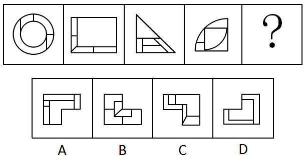
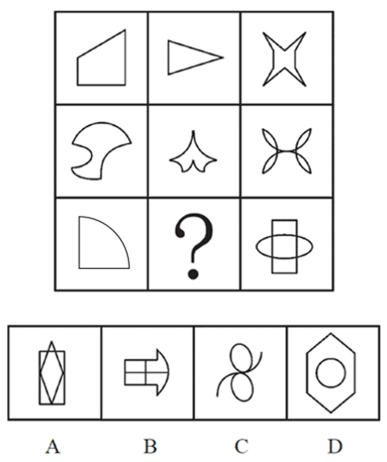
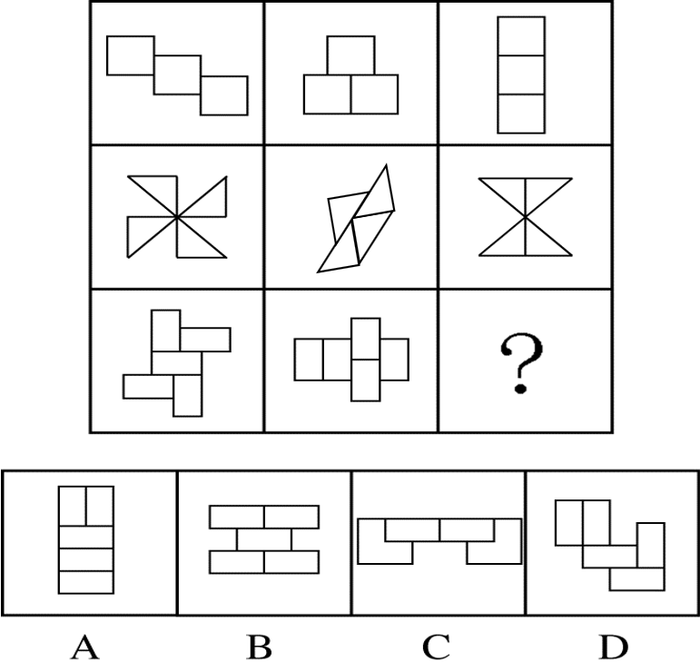
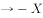

# 2017年北京市公务员录用考试《行测》题

> 判断推理 · 30 题 · 北京 2017

## 第 1 题　qid 2030988 · 图形推理

从所给的四个选项中，选择最合适的一个填入问号处，使之呈现一定的规律性：

- **A**. A　✅
- **B**. B
- **C**. C
- **D**. D

**答案**：A

**官方解析**

题干所有图形均为36宫格，其中每个图形均包含8个黑块，元素组成相同，考虑位置规律。观察发现，每幅图每行黑格的数目一致，考虑黑格在同行中的位置移动。第一行黑格每次向右移动一个单位，第二行黑格每次向右移动两个单位，第三行黑格每次移动三个单位（向左向右均可），第四行黑格每次向左移动一个单位，第五行图形黑格每次向左移动两个单位，第六行图形黑格每次移动三个单位（向左向右均可）。
根据第一行移动规律排除B、C、D三项，在A选项中验证其余行的移动规律，发现均符合上述规律，当选。
故正确答案为A。

---

## 第 2 题　qid 2031008 · 图形推理

从所给的四个选项中，选择最合适的一个填入问号处，使之呈现一定的规律性：

- **A**. A
- **B**. B　✅
- **C**. C
- **D**. D

**答案**：B

**官方解析**

元素组成不同，考虑属性规律和数量规律。题干中所有图形均为轴对称图形且对称轴每次逆时针旋转，据此排除C、D选项。无其他明显属性规律，考虑数量规律。题干中四幅图形均由直线组成，第二幅图和第四幅图都出现单一直线，考虑数直线，每幅图形均由6条直线组成，A、B选项中直线数量依次为5、6，据此排除A选项。

故正确答案为B。

---

## 第 3 题　qid 2031016 · 图形推理

从所给的四个选项中，选择最合适的一个填入问号处，使之呈现一定的规律性：

- **A**. A
- **B**. B
- **C**. C　✅
- **D**. D

**答案**：C

**官方解析**

元素组成不同，且无明显属性规律，考虑数量规律。每幅图形均存在多个封闭空间，优先数面。观察发现，题干中四幅图形均由5个面组成，排除D项。继续观察发现，题干中每幅图形均有一个与外框形状相同的面，A选项不存在与外框形状、比例都完全相同的面，B选项存在多个面的形状与外框形状相同，只有C项满足题干要求。

故正确答案为C。

---

## 第 4 题　qid 2031020 · 图形推理

从所给的四个选项中，选择最合适的一个填入问号处，使之呈现一定的规律性：

- **A**. A
- **B**. B　✅
- **C**. C
- **D**. D

**答案**：B

**官方解析**

元素组成不同，优先考虑属性规律。九宫格优先横向思考，观察发现，第一横行均由直线组成，第二横行均由曲线组成，第三横行给出的两幅图形中有曲线和直线，？处填入的图形也应同时包含直线和曲线，据此排除选项A、C选项。比较B、D选项的不同，发现B选项由一部分组成，D选项由两部分组成，题干中每幅图形均为一部分。
故正确答案为B。

---

## 第 5 题　qid 2031024 · 图形推理

从所给的四个选项中，选择最合适的一个填入问号处，使之呈现一定的规律性：

- **A**. A
- **B**. B　✅
- **C**. C
- **D**. D

**答案**：B

**官方解析**

本题为九宫格题目。题干中出现了明显的轴对称图形和中心对称图形，九宫格优先横向观察。观察发现，第一横行中从左至右图形的对称性分别为中心对称、 轴对称、中心对称轴对称；在第二横行验证此规律，第二横行满足相同的规律。第三横行中应用此规律，“?”处应该选择一个“中心对称轴对称”的选项，只有B项满足条件。

故正确答案为B。

---

## 第 6 题　qid 2031028 · 逻辑判断

在过去的12个月中，某市新能源电动汽车的销售量明显上升。与之相伴随的是，电视、网络等媒体对新能源电动汽车的各种报道也越来越多。于是，有电动车销售商认为，新能源电动汽车销售量的提高主要得益于日益增多的媒体报道所起的宣传作用。
以下哪项如果为真，最能削弱该电动车销售商的观点？

- **A**. 对新能源电动汽车进行报道的人中有不少是环保人士，他们喜欢宣传电动汽车
- **B**. 有些消费者因为传统汽车摇号的中签率低而购买新能源电动汽车
- **C**. 个别消费者购买新能源电动汽车，是因为能够获得政府补贴
- **D**. 看过关于新能源电动汽车报道的人，几乎都不购买该类型汽车　✅

**答案**：D

**官方解析**

第一步，找到论点和论据。
论点：新能源电动汽车销售量的提高主要得益于日益增多的媒体报道所起的宣传作用。
论据：在过去的12个月中，某市新能源电动汽车的销售量明显上升。与之相伴随的是，电视、网络等媒体对新能源电动汽车的各种报道也越来越多。
第二步，逐一分析选项。
A项：题干讨论的是因为日益增多的媒体报道，所以新能源电动汽车销量提高，与报道的人具体是哪些人，他们为什么进行报道无关，无关项，排除；
B项：题干说的是主要得益于日益增多的媒体报道，选项说有些消费者因为传统汽车摇号的中签率低而购买新能源电动汽车，说明传统汽车摇号的中签率低是新能源电动汽车销售量提高的其中一个原因，但不能否定主要原因是媒体报道，不能削弱，排除；
C项：与B类似，说明为了获得政府补贴，所以购买新能源电动汽车，那么为了获得政府补贴是新能源电动汽车销售量提高的其中一个原因，但不能否定主要原因是媒体报道，不能削弱，排除；
D项：看过关于新能源电动汽车报道的人，几乎都不购买该类型汽车，说明日益增多的媒体报道不是新能源电动汽车销量提高的主要原因，直接削弱论点，当选。
故正确答案为D。

---

## 第 7 题　qid 2031030 · 类比推理

入室抢劫者Q或者是从窗户进入房间的，或者是从屋门进入房间的。经查实，Q不是从屋门进入房间的，所以，他一定是从窗户进入房间的。
以下哪项与上述论证的结构最为相似？

- **A**. 
新近考古发掘的一幅字画要么是唐代的，要么是宋代的。经鉴定，这幅字画是唐代的，所以，它一定不是宋代的

- **B**. 
某晚午夜时分，天上最亮的星星或者是牛郎星，或者是织女星。经证实，该天天上最亮的星星不是织女星，所以，一定是牛郎星
　✅
- **C**. 
如果一个数能被8整除，它就能被4整除。某个数不能被4整除，所以，也不能被8整除

- **D**. 
小华通常上网或者是收发邮件，或者是QQ聊天，或者是打游戏。星期天下午她上网没有进行QQ聊天，所以，她一定收发邮件了

**答案**：B

**官方解析**

第一步：翻译题干。

“Q从窗户进入或从屋门进入”为一个或命题，“不是从屋门进入”即对“或”关系其中一项否定，所以“从窗户进入”，即得到肯定的另外一项。

第二步：逐一分析选项。

A项，题干是“或”关系，选项是“要么要么”，且题干是否定了“或”关系其中一项得到了肯定的另一项，选项是肯定了“要么要么”中的一项得到了否定的另一项，与题干结构不一致，排除；

B项，“天上最亮的星星是牛郎星或织女星”为一个或命题，“不是织女星”即对“或”关系其中一项否定，所以“是牛郎星”，即得到肯定的另外一项，与题干结构一致，当选；

C项，“能被8整除能被4整除”并非是或命题，“不能被4整除”即否后，“不能被8整除”即否前，与题干结构不一致，排除；

D项，小华上网收发邮件或QQ聊天或打游戏，题干的“或”关系是两组关系，满足“否一推一”，而选项是三组关系，与题干结构不一致，排除。

故正确答案为B。

---

## 第 8 题　qid 2031032 · 逻辑判断

约翰喜欢攀岩和射击运动。他的大学同学中没有一个既喜欢攀岩，又喜欢射击，但他所有的中学同学和大学同学都喜欢游泳。
若上述断定为真，以下哪项不可能为真？

- **A**. 除攀岩和射击外，约翰也喜欢游泳
- **B**. 约翰所有的同学都喜欢游泳
- **C**. 约翰喜欢的所有运动，他有一位中学同学也都喜欢
- **D**. 约翰喜欢的所有运动，他有一位大学同学也都喜欢　✅

**答案**：D

**官方解析**

第一步：翻译题干。

约翰攀岩且射击

所有约翰的大学同学 -（攀岩且射击）

所有约翰的中学同学游泳

所有约翰的大学同学游泳

第二步：逐一翻译选项。

A项，题干未提约翰是否喜欢游泳，因此约翰可能喜欢游泳，可能为真，排除；

B项，题干只说了所有约翰的中学同学和大学同学都喜欢游泳，而中学同学和大学同学是约翰所有同学的一部分，剩余的那部分同学可能喜欢游泳也可能不喜欢游泳，因此约翰所有的同学都喜欢游泳是可能为真的，排除；

C项，约翰喜欢的所有运动是攀岩和射击，而题干只提到了所有约翰的中学同学喜欢游泳，却没有提他们是否喜欢攀岩和射击，因此约翰的一位中学同学可能喜欢攀岩和射击，可能为真，排除；

D项，约翰喜欢的所有运动是攀岩和射击，而没有一位约翰的大学同学既喜欢攀岩又喜欢射击，因此约翰的一位大学同学不可能喜欢攀岩和射击，该项不可能为真，当选。

故正确答案为D。

---

## 第 9 题　qid 2031034 · 逻辑判断

某饭店宣布“新开发的排放油烟系统，虽然还未完成为期6个月的试验检验，但是至今并未发生故障，所以公司决定要安装在饭店后厨，毕竟这个系统可以更有效地解决油烟问题。”该饭店的主厨说：“我们不能使用未完成试验的排放油烟系统，6个月以后再说吧。”
以下哪项最能支持主厨的反对意见？

- **A**. 能更有效地处理油烟的新系统也可能存在新问题　✅
- **B**. 尽管新的排放油烟系统比以前的难操作，但有一些新能力
- **C**. 新的排放油烟系统保修期更长，维修方便
- **D**. 许多安全事故都是排放油烟系统造成的

**答案**：A

**官方解析**

第一步，找到论点和论据。
论点：我们不能使用未完成试验的排放油烟系统，6个月以后再说吧。
论据：无明显论据。
第二步，逐一分析选项。
A项：虽然至今未发生故障，但新系统可能存在新的问题，解释了主厨的反对意见，补充论据，可以加强，当选；
B项：题干讨论的是“能不能使用未完成试验的排放油烟系统”，选项说新的排放油烟系统有一些新能力，话题不一致，无关选项，排除；
C项：题干讨论的是“能不能使用未完成试验的排放油烟系统”，选项说的是保修期更长、维修方便说明新的排放油烟系统有很多优点，话题不一致，无关选项，排除；
D项：题干讨论的主体是新开发的排放油烟系统，与D选项讨论的主体不一致，排除。
故正确答案为A。

---

## 第 10 题　qid 2031036 · 逻辑判断

在美国，研究院的所有院士都反对人类食用转基因食品，而专门生产转基因玉米的公司，其所有领导层人员都认为转基因食品是安全的，提倡人们放心食用。一些大学教授兼任公司的领导。

假设以上陈述为真，则以下哪项一定为真？

- **A**. 
有些大学教授是美国研究院的院士

- **B**. 
有些研究院院士支持人类食用转基因食品

- **C**. 
一些大学教授支持人们食用转基因食品
　✅
- **D**. 
有些大学教授不支持人们食用转基因食品

**答案**：C

**官方解析**

第一步：翻译题干。

①研究院的院士反对人类食用转基因食品

②公司领导层赞成人类食用转基因食品

③有的大学教授公司领导层

第二步：逐一翻译选项。

A项，根据条件③、②、①的递推规则可得出，有的大学教授公司领导层赞成人类食用转基因食品研究院的院士，即“有些大学教授不是美国研究院的院士”，因此无法得出“有些大学教授是美国研究院的院士”，排除；

B项，根据题干①可知，研究院的院士反对人类食用转基因食品，已知研究院的院士只是所有研究院院士中的一部分，可知：有些研究院院士反对人类食用转基因食品，“有的反对”不能推出“有的支持”，故无法推出，排除；

C项，根据条件③、②的递推规则可得出：有的大学教授公司领导层赞成人类食用转基因食品，可以得出“有的大学教授赞成人类食用转基因食品”的结论，当选；

D项，根据C项，我们已经得出“有的大学教授赞成人类食用转基因食品”的结论，“有的支持”不能推出“有的不支持”，排除。

故正确答案为C。

---

## 第 11 题　qid 2030984 · 逻辑判断

在大气层的自然状态下，自由落体会受到空气阻力的干扰。要排除这种干扰，就要创造一种真空环境。在伽利略所处的时代，人们无法用技术手段创造出真空环境。因此，伽利略只能在思维中撇开空气阻力的因素，设想真空中的落体运动，从而得出自由落体定律，推翻了亚里士多德关于落体的结论。
要使伽利略得出的自由落体定律成立，必须以下哪项为前提？

- **A**. 当时的人们都能进行同样的思维实验
- **B**. 伽利略的思维实验符合真空状态的运动规律　✅
- **C**. 伽利略在比萨斜塔通过现实实验进行了验证
- **D**. 伽利略设想了各种可能性

**答案**：B

**官方解析**

第一步，找到论点和论据。
论点：伽利略得出的自由落体定律成立。
论据：伽利略只能在思维中撇开空气阻力的因素，设想真空中的落体运动。
第二步，逐一分析选项。
A项：“都能进行同样的思维实验”不代表在这个思维下设想的理论就一定是正确的，无关项，排除；
B项：如果伽利略的思维实验不符合真空状态的运动规律，那么自由落体定律根本就不成立，补充了一个必要条件，能加强，当选；
C项：现实实验是有空气阻力的，而自由落体定律是要排除空气阻力的干扰，所以用现实实验来验证自由落体定律，这是不科学的，不能加强，排除；
D项：设想了各种可能性，那到底哪种可能性是对的呢，无从得知，无关项，排除。
故正确答案为B。

---

## 第 12 题　qid 2030986 · 逻辑判断

在一次班会上，老师问大家：“成功的心态应该是怎样的？”郑磊说：“要不断地努力奋斗，活到老学到老。”刘连说：“要保持知足的心态，肯定自己已经取得的成绩。”老师说：“你们的观点都是好的，结合起来才准确：成功的心态既要不断努力，也要知足常乐。”
根据老师的说法不能推出的是：

- **A**. 郑磊和刘连的观点都不全面
- **B**. 一个具有知足常乐心态的人，可能是具有成功心态的人
- **C**. 一个具有成功心态的人，必定是具有不断努力心态的人
- **D**. 不断努力的心态和知足常乐的心态同等重要　✅

**答案**：D

**官方解析**

第一步：翻译题干。

成功的心态不断努力且知足常乐

第二步：逐一翻译选项。

A项：老师说郑磊和刘连的观点结合起来才准确，说明郑磊和刘连的观点都不全面，能推出，排除；

B项：“具有知足常乐心态”只是对题干“不断努力且知足常乐”中一项的肯定，无法推出确定结论，只能推出可能性结论，排除；

C项：成功的心态不断努力，题干是“成功的心态不断努力且知足常乐”，肯前必肯后，能推出，排除；

D项：不断努力和知足常乐在题干中是并列的“且”关系，但两者之间的重要性是不知道的，不能推出，当选。

本题为选非题，故正确答案为D。

---

## 第 13 题　qid 2030990 · 逻辑判断

有研究调查了大学生食用泡菜、酸奶等发酵食品的情况和他们的社交焦虑症发病率，发现食用发酵食品可以显著减少社交焦虑症状的发生。可能原因在于发酵食品中含有能够促进消化吸收和改善肠道环境的益生菌，通过改善消化功能来促进情绪健康。
以下哪项如果为真，最能质疑上述研究结论？

- **A**. 社交焦虑的发病与个性、性别、年龄等也有关系
- **B**. 不少情绪健康的大学生从来不吃泡菜、酸奶等发酵食品
- **C**. 某国大学生的泡菜消费量和社交焦虑症发病率均全球第一　✅
- **D**. 不少出现考试焦虑或社交焦虑的学生都不同程度地存在腹泻症状

**答案**：C

**官方解析**

第一步：找出论点和论据。
论点：食用发酵食品可以显著减少社交焦虑症状的发生。
论据：可能原因在于发酵食品中含有能够促进消化吸收和改善肠道环境的益生菌，通过改善消化功能来促进情绪健康。
本题论据讨论发酵食品通过改善消化功能来促进情绪健康，论点讨论食用发酵食品可以显著减少社交焦虑症状，话题一致，削弱优先考虑削弱论点。
第二步：逐一分析选项。
A项：社交焦虑的发病与个性、性别、年龄等也有关系，但这和发酵食品能减少社交焦虑症状并不冲突，无法削弱，排除；
B项：不少情绪健康的大学生从来不吃发酵食品，但这和发酵食品能减少社交焦虑症状并不冲突，无法削弱，排除；
C项：某国大学生的泡菜消费量和社交焦虑症发病率均全球第一，而泡菜属于发酵食品，说明食用泡菜不能减少社交焦虑症状，直接削弱论点，可以削弱，当选；
D项：不少考试焦虑或社交焦虑的学生都存在腹泻症状，而论点讨论食用发酵食品可以显著减少社交焦虑症状，话题不一致，无关项，无法削弱，排除。
故正确答案为C。

---

## 第 14 题　qid 2030992 · 逻辑判断

几乎所有的数学家都是这样：他们能够识别正确的证明以及不正确证明的无效之处，尽管他们无法定义一个证明的准确意义。
由此，可以推知以下哪项一定为真？

- **A**. 能识别正确证明和不正确证明的人可能无法定义证明的准确意义　✅
- **B**. 有的数学家不能识别不正确证明的无效之处
- **C**. 数学家都不能定义一个证明的准确意义
- **D**. 有的数学家不识别正确的证明，但能识别不正确的证明

**答案**：A

**官方解析**

本题为日常结论，读懂题干的基础上逐一分析选项。
①几乎所有的数学家能够识别正确的证明以及不正确证明的无效之处；②几乎所有的数学家无法定义一个证明的准确意义。
A项：几乎所有的数学家能够识别正确的证明以及不正确证明，而根据②，即可得出能识别正确证明和不正确证明的人可能无法定义证明的准确意义，能够从题干中推出，当选；
B项：几乎所有的数学家都能识别不正确证明的无效之处，无法推出有的数学家不能够识别不正确证明的无效之处，排除；
C项：根据②，题干主体为几乎所有的数学家，并非所有的数学家，过于绝对，排除；
D项：题干中①几乎所有的数学家能够识别正确的证明以及不正确证明的无效之处，识别正确的证明与能识别不正确的证明之间为且关系，没有发生过否定，不能推出否定的一项，排除。
故正确答案为A。

---

## 第 15 题　qid 2030994 · 逻辑判断

雨果说：“多建一所学校，就少建一座监狱。”马克·吐温说：“你每关闭一所学校，你就必须开设一座监狱。”在他们看来，教育能够减少犯罪。有学者认为，近年来，随着教育的大规模扩大，学历程度越高，犯罪率越低。
以下哪项如果为真，最能反驳该学者的观点？

- **A**. 2015年，某高校一名本科生杀死自己的母亲，事后潜逃
- **B**. 学历越高的人，对各项法律条文规定就越了解，就越容易钻法律的空子，实施犯罪
- **C**. 近年来，大部分犯罪为经济犯罪，高学历人群的犯罪率明显高于低学历人群　✅
- **D**. 文化水平低的人，对法律了解相对较少，而且通常低学历者的生存状况较差，更容易铤而走险

**答案**：C

**官方解析**

第一步：找到论点和论据。
论点：近年来，随着教育的大规模扩大，学历程度越高，犯罪率越低。
论据：雨果说：“多建一所学校，就少建一座监狱。”马克·吐温说：“你每关闭一所学校，你就必须开设一座监狱。”在他们看来，教育能够减少犯罪。
第二步：逐一分析选项。
A项：举某高校一名本科生杀死母亲的反面个例，不能说明学历程度与犯罪率之间的关系，为无关选项，排除；
B项：说明学历高的人容易钻法律空子实施犯罪，但是是否去钻法律的空子实施犯罪，不明确，排除；
C项：经济犯罪作为最主要的犯罪形式，经济犯罪中高学历人群犯罪率高于低学历人群，直接否定论点，当选；
D项：说明学历程度低，越容易发生犯罪，但是否是真的去犯罪了，不明确，排除。
故正确答案为C。

---

## 第 16 题　qid 2030998 · 逻辑判断

苗苗是某少儿舞蹈班学生，她喜欢民族舞。对于该舞蹈班学生，她们或者喜欢拉丁舞，或者喜欢芭蕾舞；喜欢民族舞的，则不喜欢芭蕾舞。
以下哪项如果为真，可推出苗苗喜欢街舞这一结论？

- **A**. 舞蹈班有些喜欢拉丁舞的学生也喜欢街舞
- **B**. 舞蹈班学生中，喜欢拉丁舞的都喜欢街舞　✅
- **C**. 舞蹈班学生喜欢的舞蹈只局限于民族舞、拉丁舞、芭蕾舞和街舞
- **D**. 民族舞和街舞比芭蕾舞更容易学

**答案**：B

**官方解析**

翻译题干：

①苗苗喜欢民族舞

②喜欢拉丁舞或芭蕾舞

③喜欢民族舞不喜欢芭蕾舞

结合①③可以推出苗苗不喜欢芭蕾舞，再根据②否一推一，可以推出苗苗喜欢拉丁舞。要想得到苗苗喜欢街舞的结论，只需让“不喜欢芭蕾舞的喜欢街舞”成立，或者让“喜欢拉丁舞的喜欢街舞”成立即可。

故正确答案为B。

---

## 第 17 题　qid 2031002 · 逻辑判断

面对家长们对于某小学装修已两月的教室存在甲醛超标的质疑，该小学校长回应道：“所有的教室我都逐一去过，没有闻到异味，所以，甲醛不超标。”
以下哪项如果为真，最能反驳该小学校长的论证？

- **A**. 不同的人对于味道的感受不同，校长闻起来无异味并不代表事实上无异味
- **B**. 某新房装修完工三个多月后，经正规检测，甲醛依然超标
- **C**. 即使装修后无异味的房间，在装修后几月内通常都会有甲醛超标的可能
- **D**. 甲醛是一种无色无味的气体，不能通过房间的味道来判断是否甲醛超标　✅

**答案**：D

**官方解析**

第一步：找到论点论据。
论点：甲醛不超标。
论据：所有的教室我都逐一去过，没有闻到异味。
第二步：逐一分析选项。
A项：不同的人对于味道的感受不同，校长闻起来无异味并不代表事实上无异味，说明事实上可能闻到了异味，削弱论据，保留；
B项：本题题干讨论的是“某小学装修了两个月的教室”，而选项讨论的是某新房，主体不同，属于无关项，排除；
C项：指出存在超标的可能性，属于对论点的可能性削弱，保留；
D项：说明气味跟甲醛超标之间没有联系，不能通过闻气味来辨别甲醛是否超标，直接拆桥，削弱论证，保留。
比较A、C、D三项，D项直接拆桥，而A是削弱论据，C是一种可能性削弱，削弱力度不及D项。
故正确答案为D。

---

## 第 18 题　qid 2031004 · 逻辑判断

近日来，由于南方持续降雨，导致很多人工养鱼池被淹。因此，有几位养鱼专家就鲫鱼和鲤鱼的价格走势进行预测：
李强说：只有鲫鱼价格上涨，鲤鱼价格才会上涨；
孙振说：鲫鱼和鲤鱼的价格至少有一种会上涨；
王刚说：只有鲤鱼价格不上涨，鲫鱼价格才不上涨；并且如果鲤鱼价格不上涨，则鲫鱼价格不上涨。
假如事实证明三位专家的预测均为真，则以下哪项必须为真？

- **A**. 鲫鱼价格上涨，鲤鱼价格不上涨
- **B**. 鲫鱼价格不上涨，鲤鱼价格上涨
- **C**. 鲫鱼和鲤鱼的价格都上涨　✅
- **D**. 鲫鱼和鲤鱼的价格都不上涨

**答案**：C

**官方解析**

第一步：翻译题干。

李强：鲤鱼价格上涨鲫鱼价格上涨；

孙振：鲫鱼价格上涨 或 鲤鱼价格上涨；

王刚：鲫鱼价格不上涨鲤鱼价格不上涨 且 鲤鱼价格不上涨鲫鱼价格不上涨。

第二步：逐一代入选项验证。

A项，代入李强不确定，孙振正确，王刚错误，不满足三个条件均正确，排除；

B项，代入李强错误，孙振正确，王刚错误，不满足三个条件均正确，排除；

C项，代入李强正确，孙振正确，王刚正确，满足三个条件均正确，当选；

D项，代入李强正确，孙振错误，王刚正确，不满足三个条件均正确，排除。

故正确答案为C。

---

## 第 19 题　qid 2031006 · 逻辑判断

张女士特别爱美，多年来喜欢在冬天穿裙子以显示她婀娜多姿的身材。从去年冬天起，每到阴冷天，她都感觉到膝关节疼痛。后经医生诊断，她得了关节炎。于是张女士认为，阴冷天穿得少是导致关节炎的原因。
以下哪项如果为真，最能质疑张女士的观点？

- **A**. 日本一些年轻女士喜欢冬天穿裙子，却并没有因为阴冷天穿得少而患上关节炎
- **B**. 现代医学研究表明导致关节炎的根本原因是劳损、感染或创伤，阴冷天穿得少关节炎易发作　✅
- **C**. 张女士的姐姐和她生活在一个城市，多年来也喜欢在冬天穿裙子，但没得关节炎
- **D**. 阴冷天穿得多的人群中也有很多得了关节炎，而且以中老年人居多

**答案**：B

**官方解析**

第一步：找到论点论据。
论点：阴冷天穿得少是导致关节炎的原因。
论据：张女士多年来喜欢在冬天穿裙子。从去年冬天起，每到阴冷天，她都感觉到膝关节疼痛。后经医生诊断，她得了关节炎。
第二步：逐一分析选项。
A项：指出有一些日本年轻女士没有因为阴冷天穿得少而患上关节炎，属于举反例削弱，保留；
B项：指出得关节炎的根本原因是劳损、感染或创伤，阴冷天只是更容易发作，指出阴冷天只是在已经得病之后诱发关节炎发作的一个因素，而不是得关节炎的原因，否定了题干所说的阴冷天是原因，直接削弱了论点，保留；
C项：指出张女士的姐姐也喜欢在冬天穿裙子，但没得关节炎，属于举反例削弱，保留；
D项：讨论的是穿的多的人群中是否有人得关节炎，不确定穿的少是否会导致关节炎，属于不明确选项，排除。
比较A、B、C三项，A、C两项举反例的力度不如B直接削弱论点，所以选择B项。
故正确答案为B。

---

## 第 20 题　qid 2031012 · 逻辑判断

张导演在为联欢会的最后三个节目进行排序，相邻的节目不能属于同一种类。张导演要从三个小品节目、三个歌曲节目、三个舞蹈节目中进行选择。要排好最后这三个节目，还要满足如下条件：
（1）如第一个节目是小品，则第二个节目是舞蹈
（2）如第二个节目是歌曲，则第一个节目是舞蹈
（3）如第三个节目是小品或者舞蹈，则第二个节目是歌曲
请问以下哪项是节目安排的可能次序？

- **A**. 节目一：小品  节目二：舞蹈  节目三：舞蹈
- **B**. 节目一：小品  节目二：歌曲  节目三：舞蹈
- **C**. 节目一：歌曲  节目二：小品  节目三：舞蹈
- **D**. 节目一：舞蹈  节目二：小品  节目三：歌曲　✅

**答案**：D

**官方解析**

选项信息充分，故可用代入排除法求解。
A项代入（1）正确，（2）正确，（3）错误，不满足三个条件均正确，排除；
B项代入（1）错误，（2）错误，（3）正确，不满足三个条件均正确，排除；
C项代入（1）正确，（2）正确，（3）错误，不满足三个条件均正确，排除；
D项代入（1）正确，（2）正确，（3）正确，满足三个条件均正确，当选。
故正确答案为D。

---

## 第 21 题　qid 2031040 · 定义判断

内卷化效应，指的是个体长期从事一项相同的工作，并且保持在一定的层面，只是进行自我重复，没有任何变化和改观。
根据上述定义，以下符合内卷化效应的是：

- **A**. 小李大学毕业后三年换了五份工作，每次刚熟悉工作就离职，下次重新开始
- **B**. 钱老师在图书馆工作十几年，虽然经常有研究成果发表，但一直没有升职
- **C**. 老杨已在城里打工二十余年，长期在某家公司做保安，一直没有什么改变　✅
- **D**. 刘阿姨说丈夫张先生性格固执，一起过了几十年，张先生都没有什么改善

**答案**：C

**官方解析**

第一步：找到定义关键词。
“长期从事”、“相同的工作”、“没有任何变化和改观”。
第二步：逐一分析选项。
A项，“三年换了五份”工作不符合“长期从事”、“相同工作”，排除；
B项，“十几年”符合“长期从事”，但“经常有研究成果发表”不符合“没有任何变化和改观”，排除；
C项，“打工二十余年”、“长期做保安”符合“长期从事”、“相同工作”，当选；
D项，“一起过了几十年”指的是夫妻的日常生活，不符合“长期从事”、“相同工作”，排除。
故正确答案为C。

---

## 第 22 题　qid 2031042 · 定义判断

互动式教学，就是通过营造多边互动的教学环境，在教学双方平等交流探讨的过程中，达到不同观点碰撞交融，进而激发教学双方的主动性和探索性，从而提高教学效果的一种教学方式。
根据上述定义，以下属于互动式教学的是：

- **A**. 某学院通过文化讲座向外国留学生介绍儒家思想
- **B**. 王老师带领教育专业的学生进行课堂教学模拟实验
- **C**. 小王觉得自己英语不好，报名参加课外一对一辅导
- **D**. 学生和老师就某一个问题展开课堂辩论　✅

**答案**：D

**官方解析**

第一步：找到定义关键词。
“多边互动的教学环境”、“教学双方平等”、“不同观点碰撞交融”、“激发主动性”、“探索性”、“提高教学效果”。
第二步：逐一分析选项。
A项：通过讲座的方式向学生介绍儒家思想，只是一个单方面的介绍和传授，不能体现出多边互动，教学双方也不能平等交流，也无法使不同的观点碰撞交融，因此不符合定义，排除；
B项：王老师带领学生进行课堂模拟实验，“带领”一词可以看出王老师还是出于一种课堂领导者的位置，那么就无法达到教学双方平等交流探讨，因此不符合定义，排除；
C项：小王自己报名参加课外辅导，是他自己的个人行为，不属于教学方式，因此不符合定义，排除；
D项：学生和老师展开课堂辩论，辩论的双方本身是平等交流的，且辩论的形式有利于不同观点的碰撞交融，通过辩论也可以激发探索性，提高教学效果，因此符合定义，当选。
故正确答案为D。

---

## 第 23 题　qid 2031044 · 定义判断

闪光灯效应是心理学的一个术语，也称闪光灯记忆，是指个人对令人震撼的事件容易留下深刻而准确的记忆，并且记忆的准确性不随时间的推移而减弱的现象。闪光灯记忆所记之事件，多半是与个人有关的重要事件。
根据上述定义，以下属于闪光灯效应的是：

- **A**. 冯雨在心情愉快时阅读课文，对课文内容印象格外深刻
- **B**. 经历汶川地震而幸存的小王，八年之后，对当时的情景仍记忆犹新　✅
- **C**. 高阳小时候上学走过的路，在时隔40年之后返乡之时仍然准确辨认
- **D**. 失联30年的战友重新团聚，许多当年的生活琐事还历历在目

**答案**：B

**官方解析**

第一步：找到定义关键词。
“震撼的事件”、“深刻而准确的记忆”、“记忆的准确性不随时间的推移而减弱”。
第二步：逐一分析选项。
A项：课文内容不属于令人震撼的事件，且体现不出记忆的准确性不随时间推移而减弱，因此不符合定义，排除；
B项：汶川地震对于小王来说属于震撼的事件，且时间过去八年，他仍然能够对当时的情景记忆犹新，说明他记忆的准确性没有随时间的推移而减弱，因此符合定义，当选；
C项：虽然高阳对于上学时走过的路时隔40年后还能准确辨认，但是上学的路对于高阳来说只是印象深刻，不是震撼的事件，因此不符合定义，排除；
D项：生活琐事对于战友来说也不是震撼的事件，而且失联30年战友是指至少两个人，不属于个人，因此不符合定义，排除。
故正确答案为B。

---

## 第 24 题　qid 2031050 · 定义判断

概念，是反映对象本质属性的思维形式。概念的外延是指具有概念所反映的本质属性的全部对象。根据概念外延之间是否有重合的部分，可将概念间的关系区分为相容关系和不相容关系。概念间的相容关系是指两个概念外延至少有部分重合的关系。
根据上述定义，以下概念间不具有相容关系的是：

- **A**. 导体—半导体　✅
- **B**. 美国的首都—华盛顿
- **C**. 作家—中国作家
- **D**. 大学生—中共党员

**答案**：A

**官方解析**

第一步：找到定义关键词。
“两个概念的外延”、“至少有部分重合”。
第二步：逐一分析选项。
A项：导体是指电阻率很小且易于传导电流的物质。半导体指常温下导电性能介于导体与绝缘体之间的材料。导体和半导体之间外延没有重合部分，因此不符合定义，当选；
B项：美国的首都与华盛顿两者是全同关系，它们两个概念的外延全部重合，符合至少有部分重合这一定义关键词，因此符合定义，排除；
C项：中国作家是作家的一种，两者是种属关系，它们两个概念的外延有重合部分，符合至少有部分重合这一定义关键词，因此符合定义，排除；
D项：有的大学生是中共党员，有的中共党员是大学生，两者是交叉关系，它们两个概念的外延有部分是重合的，符合至少有部分重合这一定义关键词，因此符合定义，排除。
本题为选非题，故正确答案为A。

---

## 第 25 题　qid 2031052 · 定义判断

地方保护主义，是指地方政府利用其手中的行政权力，对本地企业和外地企业在经济上实行差别待遇，以维护或扩大该地方局部利益的倾向。
根据上述定义，以下情况属于地方保护主义的是：

- **A**. 南方某山区县为保护本地稀有野生动植物资源，拒绝外地游客进入山区参观
- **B**. 某地政府为保证本地品牌的市场占有率，在宣传报道中夸大外地同类产品的缺陷
- **C**. 某地为保护当地连锁超市利益，通过收取高额税费限制某跨国超市集团发展　✅
- **D**. 某市政府盲目发展本地经济，对大型化工厂的重度污染问题不理睬不治理

**答案**：C

**官方解析**

第一步：找到定义关键词。
“地方政府”、“行政权力”、“本地企业和外地企业”、“经济上的差别待遇”、“维护或扩大该地局部利益”。
第二步：逐一分析选项。
A项：只是不予许外地游客参观，不能体现出对本地企业和外地企业的差别对待，而且该区县的目的是保护稀有动植物资源，不是为了维护和扩大局部利益，因此不符合定义，排除；
B项：该地政府只是在宣传报道中夸大外地同类产品的缺陷，并没有利用手中的行政权力，也没有对本地企业和外地企业在经济上实现差别待遇，因此不符合定义，排除；
C项：通过收取高额税费限制某跨国超市集团发展可以体现当地政府利用行政权力，对本地企业和外地企业在经济上实行差别对待，目的是保护当地连锁超市的利益，因此符合定义，当选；
D项：该市政府是盲目发展经济忽视环境治理，并不能体现对本地企业和外地企业的经济差别对待，因此不符合定义，排除。
故正确答案为C。

---

## 第 26 题　qid 2031056 · 定义判断

同群效应，是指处于社会中的个体的行为不仅会受个体自身特质的影响，同时也会受周围与他具有相同或相似的地位、经历或背景的人的影响，从而改变个体单独存在时可能采取的行为。
根据上述定义，以下属于同群效应的是：

- **A**. 小江在超市看到很多人在排队购买打折的鸡蛋，她想起家里的鸡蛋快要吃完了，于是跟别人一起去排队了
- **B**. 小娜原计划大学毕业就参加工作，但宿舍同学都积极准备考研。小娜认为考研也不错，也加入了考研的行列　✅
- **C**. 小赵腿部有残疾，但他并不消沉，他用张海迪等人的事迹鼓励自己，身体残疾的人通过努力也可以为社会创造价值
- **D**. 小方认为人都应该建立家庭、生儿育女，后来她认识了一些独身主义者，认识到人有多种生活方式可以选择

**答案**：B

**官方解析**

第一步：找到定义关键词。
“个体的行为”、“不仅受自身特质的影响”、“而且受相同人的影响从而改变单独存在时的行为”。
第二步：逐一分析选项。
A项：小江跟着大家一起去买鸡蛋是因为她想起家里的鸡蛋快要吃完了，并没有体现她改变了单独存在时采取的行为，因此不符合定义，排除；
B项：小娜原本准备毕业就参加工作，但是她受到了具有相似地位和经历的宿舍同学的影响，加入了考研的行列，改变了自己最初的想法，符合改变了单独存在时采取的行为，因此符合定义，当选；
C项：小赵用张海迪等人事迹的鼓励自己努力，张海迪对小赵来说是一个精神偶像并不是小赵周围的人，同时也没有体现他改变了单独存在时采取的行为，因此不符合定义，排除；
D项：小方因为认识了一些独身主义者从而认识到有多种生活方式可以选择，这只是小方的思想认识有了变化，并不能体现对其行为的影响，因此不符合定义，排除。
故正确答案为B。

---

## 第 27 题　qid 2031064 · 定义判断

深度报道作为传统的新闻形式，指新闻工作者以社会发展现实问题为主要内容，以分析解释的科学方法进行报道，维护公众利益，引导舆论。深度报道不管如何定义，都离不开社会性和深刻性的两大关键点。
根据上述定义，以下属于深度报道的是：

- **A**. 某记者对雾霾天气进行系统调查，在媒体上发布了一个半小时的新闻报道　✅
- **B**. 某电视台晚间新闻中，对某部长到某地视察进行报道
- **C**. 多家报纸和网站针对马航MH370坠机事件的家属善后工作进行跟踪报道
- **D**. 某报纸刊出了对某市的报道，解释为什么该地值得投资

**答案**：A

**官方解析**

第一步：找出定义关键词。
“社会发展现实问题”、“分析解释的科学方法”、“维护公众利益，引导舆论”、“社会性”、“深刻性”。
第二步：逐一分析选项。
A项：雾霾问题是社会发展现实问题，系统的调查是一种分析解释的科学方法，且对雾霾进行系统调查有利于维护公众的利益，可以体现出社会性和深刻性，因此符合定义，当选；
B项：某部长到某地视察，这是一个新闻事件，并不是社会发展的现实问题，也不能体现出分析解释的科学方法，因此不符合定义，排除；
C项：马航MH370坠机事件的家属善后工作不属于社会发展现实问题，跟踪报道也体现不出分析解释的科学方法，因此不符合定义，排除；
D项：该报纸只是在解释某市为什么值得投资，并不是一个社会发展现实问题，因此不符合定义，排除。
故正确答案为A。

---

## 第 28 题　qid 2031068 · 定义判断

艺术衍生品，是艺术作品衍生而来的艺术与商品的结合体，具备一定的艺术附加值。包括经艺术家亲笔签名且限量发行的专供收藏和欣赏的书籍等，印有艺术家代表作品的文具、生活用品、服装服饰以及与艺术元素相结合的具有收藏价值的产品等。
根据上述定义，以下不属于艺术衍生品的是：

- **A**. 著名绘画大师齐白石绘画作品集
- **B**. 著名钢琴演奏家郎朗签名的CD
- **C**. 冰心先生生前写作使用的钢笔　✅
- **D**. 以徐悲鸿著名画作为图案的金银纪念币

**答案**：C

**官方解析**

第一步：找到定义关键词
“艺术作品衍生的艺术与商品的结合体”、“艺术附加值”。
第二步：逐一分析选项
A项：齐白石的绘画作品集是把作品整理好编辑后印刷装订成册出售的商品，是艺术作品衍生而来的艺术与商品的结合体，符合定义，排除；
B项：郎朗签名的CD，属于定义中艺术衍生品所包括的形式中的经艺术家亲笔签名的唱片，符合定义，排除；
C项：冰心先生写作使用的钢笔，不是艺术作品衍生而来的，不符合定义，当选；
D项：以徐悲鸿著名画作为图案的金银纪念币，属于定义中艺术衍生品所包括的形式中的与艺术元素相结合的具有收藏价值的产品，符合定义，排除。
本题为选非题，故正确答案为C。

---

## 第 29 题　qid 2031076 · 定义判断

牧童经济，是指牧童在放牧时，只管放牧不顾对草原的破坏。经济学中以此来比喻，为追求高生产量（消耗自然资源）和高消费量（商品转化为污染物），大量迅速地消耗自然资源，造成废物累积的环境污染的情况。
根据上述定义，以下属于牧童经济的是：

- **A**. 宇宙飞船中乘客的排泄物经过处理净化，变成氧气、水和盐回收，再给乘客使用
- **B**. 猪粪和部分秸秆被用作沼气池的原料，产生的沼气可供做饭、照明
- **C**. 某地投入大量资金组织村民种植苹果树，因销路不畅导致苹果成熟后落地，大量腐烂
- **D**. 某地为提高农作物产量，大量消耗水资源、化肥和农药，造成土壤、地下水的污染　✅

**答案**：D

**官方解析**

第一步：找到定义关键词。
“为了追求高生产量和高消费量”、“大量迅速地消耗自然资源”、“造成废物累积的环境污染”。
第二步：逐一分析选项。
A项：对乘客的排泄物经过处理净化再利用，是一种循环利用的行为，不能体现大量消耗自然资源造成废物累积的环境污染这一关键词，因此不符合定义，排除；
B项：猪粪和秸秆作为沼气原料用于做饭和照明，是一种废物利用的行为，不能体现大量消耗自然资源造成废物累积的环境污染这一关键词，因此不符合定义，排除；
C项：某地种植苹果因销路不畅而大量腐烂，种植苹果不能体现大量迅速地消耗自然资源，且腐烂也不算是一种环境污染，因此不符合定义，排除；
D项：为提高农产品产量大量消耗水资源，造成土壤和水污染，是一种为追求高生产量大量消耗自然资源造成环境污染的行为，因此符合定义，当选。
故正确答案为D。

---

## 第 30 题　qid 2031082 · 定义判断

有位姑娘想要学习绣花作为谋生手艺，但她买不起针线和面料，也无师可拜。她花了十年时间，免费为他人绣花，用他人提供的绣花材料，练就出色的绣花技艺，打出了名声，也积累了大量图样。十年后她以高于市场的价格为人绣花，仍然有很多顾客。有学者由此提出绣花理念，即一个人的职业生涯开始时，可以借助他人的“资源”，义务或以低于市场的价格为提供资源者工作，借此完成自己技能、关系、资金及其他资源的积累，获取职业发展的成功。
根据上述定义，以下符合绣花理论的是：

- **A**. 小江专营户外运动服装批发，他采用薄利多销策略，主动制定比同市场其他商户略低的价格，所经营店铺逐渐成为该批发市场最大的户外运动服装店
- **B**. 小齐从事过工程师、教师等多个职业，读研究生时学习了管理工程、人事管理等课程。人力资源管理工作融会了他过去学到的所有知识，他毕业后在此领域大获成功
- **C**. 小刘是人力资源专业研究生，上学期间他为多家企业免费做过策划和项目设计，毕业时，由于经验丰富，他顺利进入一家全球500强企业的人力资源部　✅
- **D**. 小李是化学专业本科生，大二时他利用学校为其安排的勤工助学机会，给多名高中生进行家教，后来以专业第一的成绩考上了化学系的研究生

**答案**：C

**官方解析**

第一步：找到定义关键词。
“职业生涯开始时”、“借助他人的‘资源’”、“义务或以低于市场的价格为提供资源者工作，借此完成自己技能、关系、资金及其他资源的积累，获取职业发展的成功”。
第二步：逐一分析选项。
A项：小江专营户外运动服装批发，不能体现借助他人的“资源”这一关键词，因此不符合定义，排除；
B项：小齐从事的工作并没体现出“义务或低于市场价格为提供资源者工作”，因此不符合定义，排除；
C项：小刘上学期间免费为企业做设计，他借助了企业的“资源”，并且免费为企业工作来积累自己的经验，使他进入了500强的企业，获得了职业发展的成功，因此符合定义，当选；
D项：小李利用学校勤工助学的机会进行家教最后考上研究生，勤工助学这个机会的提供者是学校，但小李并不是为学校工作，考且上研究生还处于求学阶段，不是职业发展的成功，因此不符合定义，排除。
故正确答案为C。

---
