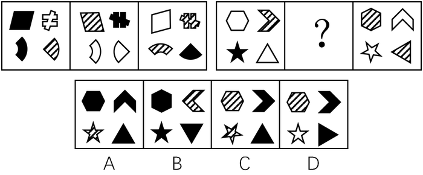
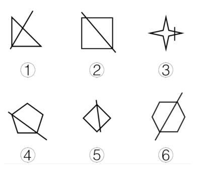
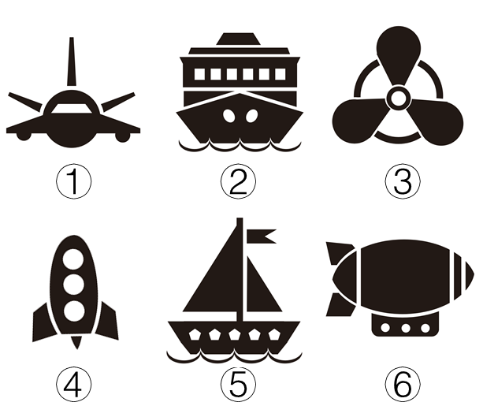

# 2017年四川省公务员录用考试《行测》题（下半年）

> 判断推理 · 35 题 · 四川 2017

## 第 1 题　qid 2097182 · 图形推理

从所给四个选项中，选择最合适的一个填入问号处，使之呈现一定的规律性：

- **A**. A
- **B**. B　✅
- **C**. C
- **D**. D

**答案**：B

**官方解析**

元素组成不同，且无明显属性规律，优先考虑数量规律。观察题干第一组图形的面数量为2、3、4，第二组图形的面数量为2、？、4，因此问号处应为3个面。A项4个面，排除。B项3个面，当选。C项2个面，排除。D项6个面，排除。
故正确答案为B。

---

## 第 2 题　qid 2097184 · 图形推理

从所给四个选项中，选择最合适的一个填入问号处，使之呈现一定规律：

- **A**. A　✅
- **B**. B
- **C**. C
- **D**. D

**答案**：A

**官方解析**

元素组成相似，考虑样式规律。观察第一组图形发现，每个图中都包含有四种不同的小元素，且相同位置的小元素都一样，颜色各不相同。可知本题考查的是小元素的遍历和小元素颜色的遍历规律。依照此规律，第二组图形中六边形分别是白色和横线，则中间图中六边形应该是黑色，排除C项和D项；第二组图形中五角星分别是黑色和白色，则中间图中的五角星应该是横线，排除B项。
故正确答案为A。

---

## 第 3 题　qid 2097186 · 图形推理

把下面的六个图形分为两类，使每一类图形都有各自的共同特征或规律，分类正确的一项是：

- **A**. ①②③，④⑤⑥
- **B**. ①③④，②⑤⑥
- **C**. ①②⑤，③④⑥　✅
- **D**. ①④⑥，②③⑤

**答案**：C

**官方解析**

解法一：题干图形均有为一个图形与一条直线组成，以此条直线为切入点，经过观察可发现③④⑥图形中的一条对称轴与直线为垂直关系，而①②⑤的对称轴与该直线不垂直。
故正确答案为C。
解法二：元素组成不同，且无明显属性规律，考虑数量规律。观察发现，题干全部为直线，并且出现多边形，考虑数直线，直线数依次为4、5、9、6、5、7,无明显规律，继续观察发现，题干线条交叉明显，考虑数点，点数量依次为4、5、10、5、5、6，那么图①②⑤点数量与线数量相等，为一组，图③④⑥点数量和线数量相差1，为一组。
故正确答案为C。

---

## 第 4 题　qid 2097188 · 图形推理

把下面的六个图形分为两类，使每一类图形都有各自的共同特征或规律，分类正确的一项是：

- **A**. ①③④，②⑤⑥
- **B**. ①②⑤，③④⑥
- **C**. ①⑤⑥，②③④
- **D**. ①④⑤，②③⑥　✅

**答案**：D

**官方解析**

元素组成不同，且无明显属性规律，优先考虑数量规律。题干图形均有黑色粗线条组成，考虑部分数，观察可发现①④⑤均为四个部分组成，②③⑥均为七个部分组成。
故正确答案为D。

---

## 第 5 题　qid 2097180 · 图形推理

左边给定的是纸盒的外表面，下列哪一项能由它折叠而成？

- **A**. A
- **B**. B　✅
- **C**. C
- **D**. D

**答案**：B

**官方解析**

本题为空间重构题目，用排除法解题，题干图形标号如下图。

 

A项：面b和面d在展开图中同行中间隔一个，属于相对面，相对面不能同时出现，排除；

B项：与题干一致，当选；

C项：如上图所示，同时对题干和选项的 b面进行顺时针画边，选项的第三条边对应着a面，题干的第一条边对应着a面，选项和题干不一致，排除；

D项：面b和面d在展开图中同行中间隔一个，属于相对面，相对面不能同时出现，排除。

故正确答案为B。

---

## 第 6 题　qid 2097040 · 定义判断

异称词是指不同的社会群体、不同的地区或不同的时代对同一事物的不同称呼。
根据上述定义，下列不属于异称词的是：

- **A**. 老一辈的人仍习惯把火柴称作“洋火”
- **B**. 现在售货员很多时候会称女顾客为“美女”　✅
- **C**. 明代时人们一般把蛤蟆称为癞施或田鸡
- **D**. 四川人说的红苕其实就是河南人说的红薯

**答案**：B

**官方解析**

第一步：找出定义关键词。
“不同社会群体”、“不同地区”、“不同时代”、“对同一事物的不同称呼”。
第二步：逐一分析选项。
A项：老一辈人把火柴称为“洋火”，体现了不同的社会群体对火柴的不同称呼，符合定义，排除； 
B项：现在售货员称女顾客为“美女”，并不是不同社会群体、不同地区、不同时代对同一事物的不同称呼，不符合定义，当选；
C项：明代人们把蛤蟆称为“癞施或田鸡”，体现了不同时代对同一事物的不同称呼，符合定义，排除；
D项：四川人说的红苕就是河南人说的红薯，体现了不同地区对同一事物的不同称呼，符合定义，排除。
本题为选非题，故正确答案为B。

---

## 第 7 题　qid 2097042 · 定义判断

自然界有这样一种现象：当一株植物单独生长时，显得矮小、单调，与众多同类植物一起生长时，则根深叶茂，生机盎然。人们把类似植物界中这种相互影响、相互促进的现象，称为“共生效应”。
根据上述定义，下列最符合共生效应的是：

- **A**. 某大学一寝室，六名同学入学成绩有高有低，四年里六人每天结伴学习，最后都考上了重点大学的研究生
- **B**. 和狼生活在一起，你只能学会嗥叫；和那些优秀的人接触，你就会受到良好的影响
- **C**. 某品牌为摆脱个体经营的局限，采取连锁经营的方式扩大经营范围，销量随之大大提高　✅
- **D**. 亲小人，远贤臣，此后汉所以倾颓也

**答案**：C

**官方解析**

第一步：找出定义关键词。
“当一株植物单独生长时，显得矮小、单调，与众多同类植物一起生长时，则根深叶茂，生机盎然”、“相互影响、相互促进”。
第二步：逐一分析选项。
A项：同一寝室六名同学结伴学习，成绩有高有低，这里的成绩高低不确定是不是每位同学单独学习的状态，不确定是否符合“当一株植物单独生长时，显得矮小、单调”，不符合定义，排除；
B项：体现的是一个人分别和狼以及优秀的人生活在一起时受到的不同影响，只有单方面的影响，并没有体现相互影响和相互促进，不符合定义，排除；
C项：某品牌是通过扩大经营范围而使销量提升，符合“当一株植物单独生长时，显得矮小、单调，与众多同类植物一起生长时，则根深叶茂，生机盎然”，符合定义，当选；
D项：选项的意思是亲近小人，疏远贤臣，这是后汉所以倾覆衰败的原因，因此不能体现相互影响和相互促进，不符合定义，排除。
故正确答案为C。

---

## 第 8 题　qid 2097044 · 定义判断

霍桑效应是指由于受到额外的关注而引起努力或绩效上升的情况。
根据上述定义，下列情形属于霍桑效应的是：

- **A**. 某电气公司总裁常用“如果你想，你就可以”激励科研团队完成构想
- **B**. 初三学生小王因沉迷游戏学习成绩下滑，老师严肃批评了他，他很惭愧
- **C**. 某公司经理经常给新招的员工发邮件，鼓励员工好好工作
- **D**. 数学教师常常私下称赞几名学生聪明，数月后这几人数学成绩均有不同程度的提高　✅

**答案**：D

**官方解析**

第一步：找出定义关键词。
“受到额外的关注”、“努力或绩效上升”。 
第二步：逐一分析选项。
A项：某电气公司总裁常用“如果你想，你就可以”激励科研团队完成构想，没有体现出科研团队受到额外的关注，同时也没体现出引起科研团队努力或者绩效上升，不符合定义，排除； 
B项：小王因沉迷游戏学习成绩下滑，老师严肃批评他，批评是一种额外的关注，但小王觉得很惭愧，没有体现出引起努力或者绩效上升，不符合定义，排除；
C项：经理经常给新招的员工发邮件，鼓励员工好好工作，发邮件体现出在一定程度上受到了额外的关注，但是没有体现出员工是否由此引起努力或者绩效上升，不符合定义，排除；
D项：数学老师私下称赞几名学生聪明，体现了这几名学生受到了老师的额外关注，数月后这几个人的数学成绩均有所提高，体现了这几个人由于称赞而引起成绩上升，符合定义，当选。
故正确答案为D。

---

## 第 9 题　qid 2097046 · 定义判断

社会行为模式是指社会多数成员共同创造、认可或遵守的行为方式。人们社会交往的结果、社会行为模式一旦形成，就具有重复性、稳定性和常规性，与群体共存，并由个人的具体行为表现出来。
根据上述定义，下列不属于社会行为模式的是：

- **A**. 男耕女织
- **B**. 日出而作，日落而息
- **C**. 尊老爱幼
- **D**. 宁为玉碎，不为瓦全　✅

**答案**：D

**官方解析**

第一步：找出定义关键词。
“由社会多数成员共同创造、认可或遵守的行为方式”、“社会行为模式具有重复性、稳定性和常规性”。
第二步：逐一分析选项。
A项：男耕女织是我国古代社会家庭的自然分工方式。封建社会中的小农经济，一家一户经营，男的种田，女的织布，指全家分工劳动，符合由社会多数成员共同创造、认可、遵守的行为方式，且男耕女织在我国古代是一种稳定的分工，符合定义，排除；
B项：日出而作，日落而息描写古代劳动人民朴素的生活及赞颂太平盛世。后人用来说明农民早出晚归，过着勤朴、起居工作有规律的生活。符合由社会多数成员共同创造、认可、遵守的行为方式，且这种生活状态是一种稳定、重复和常规性的状态，符合定义，排除；
C项：尊老爱幼，其中“尊老”指的是尊敬长辈，“爱幼”即爱护晚辈；形容人的品德良好。尊老爱幼是中国的传统美德，且一直持续至今，符合由社会多数成员共同创造、认可、遵守的行为方式，且尊老爱幼在现代依然延续，具有常规性和稳定性，符合定义，排除；
D项：宁为玉碎，不为瓦全是一句成语。意思为宁做玉器被打碎，不做瓦器而保全。比喻宁愿为正义事业牺牲，不愿丧失气节，苟且偷生，出自《北齐书•元景安传》，讲的是元景皓宁愿被杀头也不愿改元姓高，后被元景安告密遭到高洋的杀害。这句成语表达的是个人的看法和想法，并不是由社会多数成员所共同创造的一种行为方式，且这种个人想法并不具备稳定性和常规性，不符合定义，当选。
本题为选非题，故正确答案为D。

---

## 第 10 题　qid 2097048 · 定义判断

无意注意是指没有预定目的，无需意志努力，不由自主地对一定事物所发生的注意。无意注意时，心理活动对一定事物的指向和集中是由一些主观和客观条件所引起的。
根据上述定义，下列不属于无意注意的是：

- **A**. 上课时学生突然被窗外飞进来的蝴蝶所吸引
- **B**. 肚子饿的小明一进房间就看见了桌上的面包
- **C**. 小红埋头完成家庭作业，不知不觉过了很久　✅
- **D**. 人们在绿油油的草地上一眼就看到了小红花

**答案**：C

**官方解析**

第一步：找出定义关键词。
“没有预定目标”、“无需意志努力”、“不由自主地发生”。
第二步：逐一分析选项。
A项：上课时学生的注意被突然飞来的蝴蝶吸引，蝴蝶不是预定目标，符合“没有预定目标”，而学生们注意到蝴蝶属于“无需意志努力”、“不由自主地发生”，符合定义，排除；
B项：小明一进房间就发现了面包，面包不是预定目标，符合“没有预定目标”，一进门就看见属于“无需意志努力”、“不由自主地发生”，符合定义，排除；
C项：小红完成家庭作业，家庭作业是一种预定的目标，不属于“没有预定目标”，并且写作业的过程需要意志努力，不符合定义，当选；
D项：人们从绿草地上一眼就看见红花，红花不是预定目标，符合“没有预定目标”，而人们一眼就看见属于“无需意志努力”、“不由自主地发生”，符合定义，排除。
本题为选非题，故正确答案为C。

---

## 第 11 题　qid 2097050 · 定义判断

裂变思维是指在思考和解决问题时，不受已知的或现成的方式、规则和范畴的约束，从一个问题的中心点向外辐射发散，进行多方向、多角度、多层次的思维活动。
根据上述定义，下列情形体现了裂变思维的是：

- **A**. 某公司研究人员设计制作了一种多功能文具盒，里面装有学生平时所用的大部分文具
- **B**. 某屠宰场将牛肉分为肥肉和瘦肉，并分为牛腩、牛腱子、牛百叶、牛舌等出售
- **C**. 沙蚕在涨潮时，从沙滩里钻出来，在海水中觅食，落潮时就钻入沙滩里，某人在落潮时模仿海水涨潮的声音，捕捉到大量沙蚕　✅
- **D**. 潮汐时间每天向后推迟48分钟，雀鲷鹭则每天推迟约50分钟到海边觅食，因此它们总是海滩上的第一批食客

**答案**：C

**官方解析**

第一步：找出定义关键词。
“思考和解决问题不受已知的或现成的方式、规则和范畴的约束”、“思维从问题中心点向外辐射发散”。
第二步：逐一分析选项。
A项：多功能的文具盒的功能依旧是装文具，不属于“思考和解决问题不受已知的或现成的方式、规则和范畴的约束”，同时这种文具盒只是装的文具多，不属于“思维从问题中心点向外辐射发散”，不符合定义，排除；
B项：屠宰场这种屠宰方式是依照市场的买卖习惯而制定，不属于“思考和解决问题不受已知的或现成的方式、规则和范畴的约束”，不符合定义，排除；
C项：某人在捕捉沙蚕时，不是根据已知的技术或者手段去进行捕捞，而是在发现了沙蚕的习性后，通过模仿海水涨潮的声音，吸引沙蚕出洞而进行捕捉，属于“思考和解决问题不受已知的或现成的方式、规则和范畴的约束”、“思维从问题中心点向外辐射发散”，符合定义，当选；
D项：思维是人所特有的认识能力，而雀鲷鹭是鸟类，主体不符合，不符合定义，排除。
故正确答案为C。

---

## 第 12 题　qid 2097052 · 定义判断

“用名以乱实”指的是任意改变约定俗成的“名”（即概念）的界说和范围，扰乱人们对“实”（即客观事物本身）的认识。
根据上述定义，下列属于“用名以乱实”的是：

- **A**. 杀盗人非杀人
- **B**. 马并非都有四条腿，你见到海马有腿吗　✅
- **C**. 没有所谓的高山和深渊，因为高原上的深渊比平原的高山还高
- **D**. 我是这个小区的，小区的绿地是公共的，当然也是我的

**答案**：B

**官方解析**

第一步：找出定义关键词。
“任意改变约定俗成的概念的界说和范围”、“扰乱人们对客观事物本身的认识”。
第二步：逐一分析选项。
A项：杀盗人不是杀人，以“名”乱“名”，没有“扰乱人们对客观事物本身的认识”，不符合定义，排除；
B项：海马虽然有“马”这个字，但不是马。选项通过将海马归为“马”类，改变了作为具体事物“马”的范围，更改人们的认知，体现了以“名”乱“实”，符合定义，当选；
C项：高原上的深渊比平原的高山还高，是用人们眼睛所看到的来改变对事物的定义，是以“实”乱“名”，不符合定义，排除；
D项：这个人是小区业主，草地也是小区的公共区域，并没有改变界说与范围，即没有改变“名”，没有“扰乱人们对客观事物本身的认识”，不符合定义，排除。
故正确答案为B。

---

## 第 13 题　qid 2097054 · 定义判断

经济学中的鳄鱼法则，来源于这样一种场景认知：假定一只鳄鱼咬住你的脚，如果你用手去试图挣脱你的脚，鳄鱼便会同时咬住你的脚与手。你愈挣扎，就被咬住得越多。所以，万一鳄鱼咬住你的脚，你唯一的办法就是牺牲一只脚。
根据上述定义，下列做法符合鳄鱼法则的是：

- **A**. 丈夫乙有严重的心理疾患，经常喝醉酒后暴打妻子甲，酒醒后又跪地认错，甲一次次原谅了乙
- **B**. 秦某报名参加一个考试的培训，发现老师上得并不好，管理也混乱，但是考虑到没有退款条约，还是坚持每天去上课
- **C**. 甲长期持有一支股票，两年翻了两番，最近走势涨跌不定，甲决定将这支股票抛售
- **D**. 高某刚刚注册了一家公司，结果由于国家政策调整，公司原定投资方向不可能盈利，高某决定将公司注销　✅

**答案**：D

**官方解析**

第一步：找出定义关键词。
“愈挣扎，就被咬住得越多”、“鳄鱼咬住你的脚，你唯一的办法就是牺牲一只脚”。
第二步：逐一分析选项。
A项：甲被丈夫乙多次家暴体现了“被咬住”，但是甲一次次原谅了乙，没有体现“牺牲一只脚”，不符合定义，排除；
B项：秦某发现参加的培训班有问题，但是因为没有退款条约坚持去上课，没有体现“牺牲一只脚”，不符合定义，排除；
C项：甲的股票最近走势涨跌不定，说明时涨时跌，不清楚最近具体的是赚是亏，而且甲之前已经在这支股票中获取较高利润，没有体现“被咬住”，不符合定义，排除；
D项：高某刚注册的公司由于国家政策调整，原投资方向不可能盈利，体现了“被咬住”，高某决定将公司注销，体现了“牺牲一只脚”，符合定义，当选。
故正确答案为D。

---

## 第 14 题　qid 2097056 · 定义判断

棘轮效应是指人的消费习惯形成之后有不可逆性，即易于向上调整，而难于向下调整。
根据上述定义，下列符合棘轮效应的是：

- **A**. 赵老板生意失败，变卖了公司资产和名下房产后，还欠银行20多万元，但为了出行方便，他没有用自己的高档汽车抵债　✅
- **B**. 李某买彩票中了500万大奖后没有告诉任何人，偷偷把钱存到银行，还和从前一样正常上班、下班，而且工作更加积极了
- **C**. 一夜暴富的老朱频繁出入高档消费场所，过着挥金如土的生活，很快就入不敷出，回到了之前的生活状态，旁人都唏嘘不已，他自己倒安之若素
- **D**. 王老汉从农村来城里带孙子，因心疼电费舍不得用空调，借口说不习惯空调吹出的冷风，让儿子买了一台和老家一样的落地电扇用来降温消暑

**答案**：A

**官方解析**

第一步：找出定义关键词。
“消费习惯有不可逆性”、“易于向上调整”、“难于向下调整”。
第二步：逐一分析选项。
A项：赵老板变卖了资产和房产后，还欠银行20多万，但是他没有将高档汽车抵押，体现了他的消费习惯难以向下调整，符合定义，当选；
B项：李某中奖后行为同以前一样，且工作积极，没有体现出其消费习惯有易于向上调整、难于向下调整的现象，不符合定义，排除；
C项：老朱由挥金如土的生活回到了暴富前的生活状态后，依然安之若素，没有体现出消费习惯有易于向上调整、难于向下调整的现象，不符合定义，排除；
D项：王老汉从农村来城里因心疼电费舍不得用空调，说明他的消费习惯没有出现易于向上调整的现象，不符合定义，排除。
故正确答案为A。

---

## 第 15 题　qid 2097058 · 定义判断

主观小量是指通过某些特殊的词语表达出来的，带有说话人认为数量小、程度低或时间短等主观色彩的现象，说话人的这种对数量、程度、时间的看法与数量、程度、时间本身的实际大小或高低没有必然联系。
根据上述定义，下列不属于主观小量的是：

- **A**. 小张对小李说：“他们三个上次都没有来参加聚会。”　✅
- **B**. 经理对员工小高说：“你工作不够努力，这个礼拜只加了两天班。”
- **C**. 母亲对读高一的儿子说：“快了，你还有两年就毕业了。”
- **D**. 校长对班主任说：“你们班怎么组织的？义务劳动才去了三十个人。”

**答案**：A

**官方解析**

第一步：找出定义关键词。
“通过某些特殊的词语表达出来的，带有说话人认为数量小、程度低或时间短等主观色彩的现象”、“说话人的这些看法与实际情况没有必然联系”。
第二步：逐一分析选项。
A项：小张说的三个人没有来参加聚会，是对实际情况的客观陈述，不带有主观色彩，也不符合“说话人的这些看法与实际情况没有必然联系”，不符合定义，当选；
B项：经理说小高不够努力，这个礼拜只加了两天班，是主观认为小高加班时间少，符合“通过某些特殊的词语表达出来的，带有说话人认为数量小、程度低或时间短等主观色彩的现象”，实际上一周加班两天，加班时间并不少，符合“说话人的这些看法与实际情况没有必然联系”，符合定义，排除；
C项：母亲认为还有两年毕业是“快了”，是主观认为两年的时间短，符合“通过某些特殊的词语表达出来的，带有说话人认为数量小、程度低或时间短等主观色彩的现象”，实际上两年的时间并不短，符合“说话人的这些看法与实际情况没有必然联系”，符合定义，排除；
D项：校长说义务劳动才去了三十个人，是主观认为参加义务劳动的人数少，符合“通过某些特殊的词语表达出来的，带有说话人认为数量小、程度低或时间短等主观色彩的现象”，实际上三十个人并不少，符合“说话人的这些看法与实际情况没有必然联系”，符合定义，排除。
本题为选非题，故正确答案为A。

---

## 第 16 题　qid 2097034 · 类比推理

酒精：白酒

- **A**. 电源：电视
- **B**. 面包：蛋糕
- **C**. 氮气：空气　✅
- **D**. 摄像头：手机

**答案**：C

**官方解析**

第一步：判断题干词语间的逻辑关系。
酒精是白酒的一部分，且白酒中一定有酒精，二者属于必然组成关系。
第二步：判断选项词语间的逻辑关系。
A项：电视只有在接通电源后才能使用，二者属于条件对应关系，与题干逻辑关系不一致，排除；
B项：面包与蛋糕属于并列关系，与题干逻辑关系不一致，排除；
C项：氮气是空气的一部分，且空气中一定有氮气，二者属于必然组成关系，与题干逻辑关系一致，当选；
D项：摄像头是手机的一部分，但并非所有的手机都有摄像头，与题干逻辑关系不一致，排除。
故正确答案为C。

---

## 第 17 题　qid 2097036 · 类比推理

花瓶：瓷器

- **A**. 电视机：电器
- **B**. 中药：植物　✅
- **C**. 画作：诗篇
- **D**. 桌子：八仙桌

**答案**：B

**官方解析**

第一步：判断题干词语间的逻辑关系。
有的花瓶是瓷器，有的瓷器是花瓶。二者属于交叉关系。
第二步：判断选项词语间的逻辑关系。
A项：电视机属于电器的一种，二者属于种属关系，与题干逻辑关系不一致，排除；
B项：有的中药是植物，有的植物是中药，二者属于交叉关系，与题干逻辑关系一致，当选；
C项：画作和诗篇属于并列关系，与题干逻辑关系不一致，排除；
D项：八仙桌属于桌子的一种，二者属于种属关系，与题干逻辑关系不一致，排除。
故正确答案为B。

---

## 第 18 题　qid 2097038 · 类比推理

跳绳：运动

- **A**. 花椒：调料　✅
- **B**. 开车：旅游
- **C**. 太阳系：银河系
- **D**. 水稻：米粉

**答案**：A

**官方解析**

第一步：判断题干词语间的逻辑关系。
跳绳属于运动的一种，二者属于种属关系。
第二步：判断选项词语间的逻辑关系。
A项：花椒是调料的一种，二者属于种属关系，与题干逻辑关系一致，当选；
B项：开车不是旅游的一种，两者不属于种属关系，与题干逻辑关系不一致，排除；
C项：太阳系是银河系的一部分，二者属于组成关系，与题干逻辑关系不一致，排除；
D项：水稻是制作米粉的原材料，二者属于材料和成品的对应关系，与题干逻辑关系不一致，排除。
故正确答案为A。

---

## 第 19 题　qid 2097064 · 类比推理

调查：发言权

- **A**. 中毒：死亡
- **B**. 批评：进步
- **C**. 损害：赔偿　✅
- **D**. 锻炼：健康

**答案**：C

**官方解析**

第一步：判断题干词语间的逻辑关系。
没有调查就没有发言权，调查是发言权的必要条件。
第二步：判断选项词语间的逻辑关系。
A项：死亡不一定是因为中毒，因此中毒不是死亡的必要条件，与题干逻辑关系不一致，排除；
B项：进步不一定是因为批评，因此批评不是进步的必要条件，与题干逻辑关系不一致，排除；
C项：赔偿一定是由于受到了损害，因此损害是赔偿的必要条件，与题干逻辑关系一致，当选；
D项：健康不一定是因为锻炼，因此锻炼不是健康的必要条件，与题干逻辑关系不一致，排除。
故正确答案为C。

---

## 第 20 题　qid 2097072 · 类比推理

钻木取火：打火机

- **A**. 滴血认亲：培养皿
- **B**. 鸿雁传书：电子邮件　✅
- **C**. 烽火狼烟：红绿灯
- **D**. 结绳记事：计算器

**答案**：B

**官方解析**

第一步：判断题干词语间的逻辑关系。
钻木取火是古代常用的取火方式，打火机是现代常用的一种取火工具，二者都具有取火的功能。
第二步：判断选项词语间的逻辑关系。
A项：滴血认亲是古代常用的一种验证血缘关系的方式，培养皿是现代实验室常用的工具，二者功能不同，与题干逻辑关系不一致，排除；
B项：鸿雁传书是古代常用的一种传递信息的方式，电子邮件是现代常用的一种传递信息的方式，二者都具有传递信息的功能，与题干逻辑关系一致，当选；
C项：烽火狼烟本是古代中国边境的士兵为了及时的传递敌人来犯的信息，常用于战争领域，红绿灯是现代用于交通的信号，二者功能不同，与题干逻辑不关系一致，排除；
D项：结绳记事是古代文字发明前，人们所使用的一种记事方法，计算器现在人们用于计算的一种工具，二者功能不同，是与题干逻辑关系不一致，排除。
故正确答案为B。

---

## 第 21 题　qid 2097082 · 类比推理

口碑：票房：电影

- **A**. 质量：价格：商品　✅
- **B**. 公平：正义：律师
- **C**. 好评：差评：服务
- **D**. 相貌：品格：性情

**答案**：A

**官方解析**

第一步：分析题干词语间逻辑关系。
口碑和票房是衡量评价电影的两种不同的方式，是评价方式的对应。
第二步：判断选项词语间逻辑关系。
A项：质量和价格是衡量评价商品的两种不同的方式，是评价方式的对应，与题干逻辑关系一致，当选；
B项：公平和正义是律师的属性，律师是为当事人提供法律服务的执业人员，与题干逻辑关系不一致，排除；
C项：好评和差评都是对服务的一种具体评价结果，而口碑和票房是评价电影的两种不同的方式，与题干逻辑关系不一致，排除；
D项：相貌指一个人的面容、长相、身材、衣着以及言谈和举止，品格指品性、性格，性情指人的性格、习性与思想情感，三者之间为并列关系，与题干逻辑关系不一致，排除。
故正确答案为A。

---

## 第 22 题　qid 2097088 · 类比推理

朝代：清代：明代

- **A**. 爬行动物：青蛙：蜥蜴
- **B**. 儒家：朱熹：王阳明
- **C**. 刑罚：有期徒刑：死刑　✅
- **D**. 首都：北京：北平

**答案**：C

**官方解析**

第一步：判断题干词语间的逻辑关系。
清代与明代都是朝代，和朝代是种属关系，并且清代与明代二者为并列关系。
第二步：判断选项词语间的逻辑关系。
A项：青蛙是两栖动物，不是爬行动物，二者不是种属关系，与题干逻辑关系不一致，排除；
B项：王阳明和朱熹是儒家学派分支的代表人物，与儒家不是种属关系，与题干逻辑关系不一致，排除；
C项：有期徒刑与死刑都是属于刑罚的一种，是种属关系，并且有期徒刑与死刑为并列关系，与题干逻辑关系一致，当选；
D项：北平是北京在历史上的一个别名，二者为全同关系，与题干逻辑关系不一致，排除。
故正确答案为C。

---

## 第 23 题　qid 2097092 · 类比推理

雾霾 对于 （    ） 相当于 害虫 对于 （    ）

- **A**. 天气  农田
- **B**. 防范  防治　✅
- **C**. 污染  作物
- **D**. 沙尘  昆虫

**答案**：B

**官方解析**

逐一代入选项。
A项：雾霾为一种灾害性天气，二者为种属关系；害虫可以生活在农田中，二者为场所的对应关系，前后逻辑关系不一致，排除；
B项：防范雾霾、防治害虫，二者为动宾关系，前后逻辑关系一致，当选；
C项：雾霾是一种污染，二者是种属关系，害虫破坏作物，二者是对应关系，前后逻辑关系不一致，排除；
D项：雾霾与沙尘都是天气状况，二者为并列关系；害虫与昆虫是交叉关系，前后逻辑关系不一致，排除。
故正确答案为B。

---

## 第 24 题　qid 2097104 · 类比推理

分析 对于 （    ） 相当于 消除 对于 （    ）

- **A**. 阐述  革除
- **B**. 差距  贫富
- **C**. 解决  创新
- **D**. 问题  弊端　✅

**答案**：D

**官方解析**

逐一代入选项。
A项：分析和阐述是并列关系；消除和革除是近义词。前后逻辑关系不一致，排除；
B项：分析差距，二者是动宾关系；贫富不能被消除，可以说消除贫富差距。前后逻辑关系不一致，排除；
C项：先分析，后解决，二者存在时间上的先后顺序；消除和创新二者在时间上没有必然的先后顺序。前后逻辑关系不一致，排除；
D项：分析问题，二者是动宾关系；消除弊端，二者也是动宾关系。前后逻辑关系一致，当选。
故正确答案为D。

---

## 第 25 题　qid 2097114 · 类比推理

时钟 对于 （    ） 相当于 （    ） 对于 导盲犬

- **A**. 时间  盲杖
- **B**. 闹钟  犬类　✅
- **C**. 制造  驯养
- **D**. 时针  盲人

**答案**：B

**官方解析**

逐一代入选项。
A项：时钟是用来显示时间的工具，二者属于对应关系；盲杖和导盲犬都是盲人的工具，二者是并列关系。前后逻辑关系不一致，排除；
B项：闹钟属于时钟的一种，二者属于种属关系；导盲犬属于犬类的一种，二者属于种属关系。前后逻辑关系一致，当选；
C项：制造时钟，二者属于动宾关系，第一个词是名词，第二个词是动词；驯养导盲犬，二者也属于动宾关系，但词语顺序相反。前后逻辑关系不一致，排除；
D项：时针是时钟的一部分，二者属于组成关系；盲人和导盲犬不是组成关系。前后逻辑关系不一致，排除。
故正确答案为B。

---

## 第 26 题　qid 2097132 · 逻辑判断

一般来说，油品质量标准由石化行业制定，环保部门并无相关油品质量监管权。因此，面对城市车流带来的大量污染物排放和空气污染加剧问题，环保部门在这方面很难真正采取有效的措施。
要得出以上论断，需要补充以下哪项作为前提？

- **A**. 油品质量提高能有效降低汽车污染物排放　✅
- **B**. 油品质量提高需要石化行业提高相应标准
- **C**. 环保部门对油品质量标准制定拥有决定权
- **D**. 当前环保部门对石化行业的监管力度较弱

**答案**：A

**官方解析**

第一步：找出论点和论据。
论点：面对城市车流带来的大量污染物排放和空气污染加剧问题，环保部门在这方面很难真正采取有效的措施。
论据：油品质量标准由石化行业制定，环保部门并无相关油品质量监管权。
第二步：逐一分析选项。
A项：油品质量提高能有效降低汽车污染物排放，将“油品质量”与“污染物排放和空气污染加剧”搭桥，使论点与论据联系更紧密，当选；
B项：油品质量提高需要石化行业提高相应标准，只是提出了一个对策，与题干结论无关，属于无关选项，排除；
C项：环保部门对油品质量标准制定拥有决定权，意味环保部门能够采取有效措施应对大量污染物排放和空气污染加剧问题，也就得不出题干结论，排除； 
D项：当前环保部门对石化行业的监管力度较弱，没有提及污染物这一关键词，属于无关选项，排除。
故正确答案为A。

---

## 第 27 题　qid 2097138 · 逻辑判断

服药能否提高一个人对于音高的识别能力？近来一项国外研究对此做出了肯定的回答，研究者将试验参与者分为两组：第一组服用了丙戊酸，第二组服用了安慰剂，所有的试验参与者均未接受过系统的音乐训练，结果发现，在识别音高测试中，第一组的正确识别率更高。研究者据此认为，通过药物治疗可以改善人们对于音高的识别能力。
以下哪项如果为真，最能质疑研究人员的上述结论？

- **A**. 第一组试验参与者比第二组的人数多
- **B**. 第一组试验参与者与第二组的平均年龄不同
- **C**. 第一组试验参与者裸耳听力测验成绩高于第二组　✅
- **D**. 第一组试验参与者中父母从事音乐工作的比例较高

**答案**：C

**官方解析**

第一步：找出论点和论据。
论点：通过药物治疗可以改善人们对于音高的识别能力。
论据：第一组服用了丙戊酸，第二组服用了安慰剂，所有的试验参与者均未接受过系统的音乐训练，结果发现，在识别的音高测试中，第一组的正确识别率更高。
第二步：逐一分析选项。
A项：第一组试验参与者比第二组的人数多，人数多少与识别率无关，无法削弱，排除；
B项：第一组试验参与者与第二组的平均年龄不同，却没有表明年龄是否会影响音高测试的识别率，属于不明确选项，无法削弱，排除；
C项：第一组试验参与者裸耳听力测验成绩高于第二组，说明音高测试识别率高的原因可能是裸耳听力成绩高导致的，他因削弱，当选； 
D项：第一组试验参与者父母从事音乐工作的比例较高，却没有明确说此原因对该试验的影响究竟如何，属于不明确选项，排除。
故正确答案为C。

---

## 第 28 题　qid 2097200 · 逻辑判断

某科学家在研究意大利古比奥地区白垩纪末期地层中的黏土层时，发现微量元素铱的含量比其他时期地层陡然增加了30~160倍，之后人们从全球多处地点取样检测都得出同样结论：白垩纪末期地层中铱元素含量异常增高的确是普遍性的。科学家据此推测，在白垩纪末期有一颗巨大的小行星撞击了地球，产生的尘埃遮天蔽日，造成地表气候环境巨变，从而导致了恐龙的灭亡。
以下哪项如果为真，最能削弱上述科学家的推测？

- **A**. 小行星一般由硅、铁类元素构成，巨大的小行星落在地球表面，即使经历漫长岁月也不可能踪迹全无
- **B**. 白垩纪末期的岩层大部分是熔岩冷却形成的火成岩，而由小行星撞击地球产生的尘埃堆积而成的沉积岩只占地表的很小一部分
- **C**. 铱元素不仅存在于地球外的天体，也存在于地壳内部
- **D**. 已发现的恐龙和恐龙蛋化石全部存在于富含铱元素的黏土层下的地层中　✅

**答案**：D

**官方解析**

第一步：找出论点和论据。
论点：在白垩纪末期有一颗巨大的小行星撞击了地球，产生的尘埃遮天蔽日，造成地表气候环境巨变，从而导致了恐龙的灭亡。
论据：白垩纪末期地层中的黏土层中铱的含量比其他时期陡然增加了30~160倍。
论据讨论的是白垩纪末期地层中的黏土层中铱的含量增加，论点讨论的是白垩纪末期有一颗巨大的小行星撞击了地球，导致了恐龙的灭亡，论点和论据话题不一致，可考虑直接削弱论点或拆桥。
第二步：逐一分析选项。
A项：因为小行星一般由硅、铁类元素构成，如果是小行星撞击会留下踪迹，但题干没有提到目前有无印记以及硅和铁的情况，无法削弱，排除；
B项：小行星撞击地球产生的尘埃堆积而成的沉积岩只占地表的很小一部分，但是占地表小不代表当时不能造成尘埃遮天蔽日，无法削弱，排除；
C项：铱元素不仅存在于地球外的天体，也存在于地壳内部，说明黏土层中铱的增加可能是由于地球内部的原因导致的，所以不能通过黏土层中铱的含量的增高，一定得到是小行星撞击了地球，切断了论点和论据之间必然性的联系，为可能性的拆桥，保留；
D项：已发现恐龙蛋和恐龙化石全部存在于富含铱元素的黏土层下，因为黏土层的形成是需要很长的时间，所以一定是恐龙先灭亡，然后才有富含铱元素的黏土层的形成，直接否定了题干中的因果关系，削弱论点，保留。
比较C、D两项，C项是可能性的拆桥，而D项为直接明确削弱论点，所以D项的削弱力度更强。
故正确答案为D。
附：此题源自百度百科“富铱堆积岩”。文章中提到了A、B、C三种情况，但是只是作为疑点提出，后面又给出了最后的研究结果，指向的是D项。原文如下：
各种有关恐龙灭绝原因的解释不下几十种，如气候变化说，植物影响说等等，但均不能自圆其说，其中小行星撞击地球的假说倍受各方关注。美国物理学家路易·阿尔瓦雷兹在研究白垩纪末期地层中的粘土层时发现，微量元素——铱的含量比其他时期岩层中陡然增多30~160倍，之后人们从全球多处地点取样测验都得出同样结论，白垩纪末期地层中铱元素含量异常增高的确是普遍性的，于是他认为在白垩纪末期有一颗直径约10公里的小行星撞击了地球, 产生的尘埃遮天蔽日，造成地表气候环境的变化导致了恐龙的消亡。但是，用小行星撞击来解释岩层中铱元素含量增加和恐龙灭绝存在许多疑点。
1、小行星一般都是由硅、 铁类元素构成，这样巨大的小行星落在地球表面即使经历漫长岁月也不可能踪迹全无，而在地球上从未发现有这样大型的陨石；
2、白垩纪末期的岩层大部分是熔岩冷却形成的火成岩 ，由尘埃堆积而成的沉积岩只占地表很小一部分。仅一颗小行星撞击扬起的尘埃能够把当时地球上绝大多数动植物埋入深达几千米的岩层中吗？
3、一颗小行星所含的铱元素就能均匀的散布以至覆盖整个地球表面吗？况且，铱元素在地外小行星上存在（含量并不高），在地球深处也同样存在，为什么只推测来自地球以外而不是来自地球内部呢？
其实，白垩纪末期地层中铱含量增多的异常情况与恐龙的灭绝的确密切相关，但通过仔细研究却可以得出另一种结论。我们知道，在地球内部进行的热核反应会不断积聚起巨大的能量，一旦地壳承受不住时，内部压力便冲破地壳突然释放形成大爆发。铱——这种主要存在于地核内的元素，在大爆发时通过熔岩喷发从地球深处带到了地壳表层，而公认的标志白垩纪结束的粘土层正是大量火山灰尘沉积形成（科学家在夏威夷克拉维亚火山喷出的气体中曾检验出微量的铱）。所以，白垩纪末期地层中铱含量普遍增多恰好证明地壳发生了普遍性剧烈喷发。
化石档案告诉我们，绝大多数恐龙的死亡时间和绝大部分恐龙蛋化石的形成年代是在白垩纪末期，已发现的恐龙和恐龙蛋化石全部保存在白垩纪与第三纪界限（K-T界）的富含铱的薄粘土层下的地层中，富铱层的下伏地层和上伏地层中生物群的面貌截然不同，恐龙在白垩纪末期以后的地层中便消失了。各种地质和化石线索表明，白垩纪末期的地球上确实发生了对恐龙生存极为不利的突然变化，这与地质学界认定的白垩纪末期大规模造山运动等一系列全球性地壳构造剧烈变动的时间正相吻合。

---

## 第 29 题　qid 2097140 · 逻辑判断

人体跟金属一样，在大自然中会逐渐“氧化”。金属氧化是诸如铁生黄锈、铜生铜绿等。人体氧化的罪魁祸首不是氧气，而是氧自由基，是一种细胞核外含不成对电子的活性基因。这种不成对的电子很容易引起化学反应，损害DNA、蛋白质和脂质等重要生物分子，进而影响细胞膜转运过程，使各组织、器官的功能受损，导致机体老化。
以下各项如果为真，不能支持上述论述的是：

- **A**. 
氧自由基有增强白细胞对细菌的吞噬和抑制细菌增殖的功能，可增强机体抗感染及免疫能力
　✅
- **B**. 
用氧自由基抑制剂2-巯基乙胺作为食物添加剂，以小鼠作为实验对象，的2-巯基乙胺可以使小鼠的平均寿命延长

- **C**. 
天然抗氧化剂茶多酚可以有效地抑制氧自由基的作用，食用了含有茶多酚食品的果蝇，其寿命明显延长

- **D**. 
氧自由基可导致人体胶原蛋白酶和硬弹性蛋白酶释放，使皮肤中的胶原蛋白和硬弹性蛋白产生过度交联并发生降解，导致皮肤失去弹性，细胞老化，出现皱纹

**答案**：A

**官方解析**

第一步：找出论点和论据。
论点：人体氧化的罪魁祸首不是氧气，而是氧自由基，是一种细胞核外含不成对电子的活性基因。
论据：这种不成对的电子很容易引起化学反应，损害DNA、蛋白质、脂质等重要生物分子，进而影响细胞膜转运过程，使各组织、器官的功能受损，导致细胞老化。
第二步：逐一分析选项。
A项：指出氧自由基可以增强机体的抗感染能力，强调的是氧自由基对人体的好处，与氧自由基是否是导致人体氧化的罪魁祸首无关，不能加强，当选；
B项：强调使用氧自由基抑制剂后，实验鼠的平均寿命延长，说明氧自由基确实会导致机体老化，补充论据，可以加强，排除；
C项：强调食用可以抑制氧自由基作用的茶多酚后，果蝇的寿命延长，说明氧自由基会导致机体老化，补充论据，可以加强，排除；
D项：说明氧自由基会导致皮肤失去弹性，细胞老化出现皱纹，补充论据，可以加强，排除。
本题为选非题，故正确答案为A。

---

## 第 30 题　qid 2097142 · 逻辑判断

通常情况下，伤害行为的受害者会通过法律渠道表达利益诉求，但是，如果制度不公或失效，就会引发更多的社会伤害行为：不但强势者可能会进一步伤害弱势者，而且他们也可能会受到弱势者的伤害；弱势者也可能对其他弱势者造成伤害，造成“弱者对弱者的欺凌”。这样一来，整个社会就会弥漫着一股戾气，给日常生活带来严重的不安与不快。
由此可以推出：

- **A**. 只有制度不公或失效，强势者才会伤害弱势者
- **B**. 如果制度不公或失效，弱势者就会伤害强势者
- **C**. 只有制度公正且有效，才能防止引发更多的社会伤害行为　✅
- **D**. 如果制度公正且有效，就能给日常生活带来安宁与快乐

**答案**：C

**官方解析**

第一步：翻译题干。

制度不公或失效引发社会伤害行为（包括：强势者伤害弱势者，弱势者伤害强势者，弱势者伤害弱势者三种可能性情况）。

第二步：逐一分析选项。

A项：选项翻译为：强势者伤害弱势者制度不公或失效，强势者伤害弱势者是对题干条件后件一种可能性情况的肯定，无法推出确定性结论，无法推出，排除；

B项：选项翻译为：制度不公或失效弱势者就会伤害强势者，弱势者伤害强势者只是三种可能性情况中的一种，不能确保一定会发生，无法推出，排除；

C项：选项翻译为：防止引发社会伤害行为制度公正且有效，防止引发社会行为是对题干条件的否后，否后必否前，可以推出制度公正且有效，可以推出，当选；

D项：选项翻译为：制度公正且有效日常生活安宁与快乐，制度公正且有效是对题干条件的否前，无法推出确定性结论，无法推出，排除。

故正确答案为C。

---

## 第 31 题　qid 2097198 · 逻辑判断

一项大规模调查发现，与20~24岁男性生育的孩子相比，45岁以上男性生育的孩子患躁郁症的风险是前者的25倍，患注意力紊乱的风险是前者的12倍，患孤独症的风险是前者的3.5倍，有自杀行为或滥用药物的风险是前者的2.5倍。由此，研究专家得出结论，男性延迟生育对孩子的心理健康具有较大的负面作用。
以下哪项如果为真，最能支持上述专家的结论？

- **A**. 延迟生育的男性大多数心理成熟较晚
- **B**. 女性延迟生育带来的负面作用不如男性
- **C**. 与45岁以上男性相比，45岁以下男性生育的孩子患心理疾病的风险较低　✅
- **D**. 若父母年龄均超过40岁，则生育不健康孩子的风险较高

**答案**：C

**官方解析**

第一步：找出论点和论据。
论点：男性延迟生育对孩子的心理健康具有较大的负面作用。
论据：与20~24岁男性生育的孩子相比，45岁以上男性生育的孩子患躁郁症的风险是前者的25倍，患注意力紊乱的风险是前者的12倍，患孤独症的风险是前者的3.5倍，有自杀行为或滥用药物的风险是前者的2.5倍。
第二步：逐一分析选项。
A项：强调延迟生育的男性成熟较晚，与论点延迟生育男性所生的孩子的心理健康状况无关，属于无关选项，排除；
B项：指出女性延迟生育带来的负面影响不如男性，与论点男性延迟生育是否对孩子的心理健康造成较大的负面作用无关，属于无关选项，排除； 
C项： 强调与45岁以上的男性相比，45岁以下的男性生育的孩子患心理疾病的风险较低，说明延迟生育的男性所生的孩子患心理疾病的风险较高，从而证明男性延迟生育确实会对孩子的心理健康造成较大的负面作用，补充论据，可以加强论点，当选；
D项：强调父母年龄均超过40岁，生育不健康孩子的风险较高，不确定是否是男性延迟生育对孩子的心理健康造成的负面作用，并且不健康孩子到底是心理不健康还是身体不健康，也不明确，无法加强论点，排除。
故正确答案为C。

---

## 第 32 题　qid 2097146 · 逻辑判断

紫外线穿透能力强，可达真皮层，将皮肤晒黑，对皮肤伤害性很大，即便在非夏季期间，紫外线虽然强度较弱，也仍然存在，但长时间累积也容易让皮肤受伤，产生黑色素沉淀、肌肤老化松弛等问题。所以爱美的女性必须每天都涂防晒霜。
如果以下各项为真，最能削弱上述结论的是：

- **A**. 
室内距窗户半米处紫外线辐射量约是室外的，距离窗户1.5米处就衰减到室外的，因此如果足不出户就不用涂防晒霜
　✅
- **B**. 
防晒霜一般要求涂抹均匀和及时补涂，如果使用不当，即便是标称高倍数防晒的产品，也不一定能发挥出多大的防护功效

- **C**. 
紫外线在每年的4～9月强度最高，而冬天最弱

- **D**. 
大部分的阳伞都有一定的防晒保护作用，一把普通的阳伞可以遮挡的紫外线，而一把黑色的阳伞可以遮挡的紫外线

**答案**：A

**官方解析**

第一步：找论点论据。
论点：爱美的女性必须每天都涂防晒霜。
论据：紫外线穿透能力强，可达真皮层，将皮肤晒黑，对皮肤伤害性很大，即便在非夏季期间，紫外线虽然强度较弱，也仍然存在，但长时间积累也容易让皮肤受伤，产生黑色素沉淀、肌肤老化松弛等问题。
本题论点说的是女性必须涂防晒霜，论据说的是紫外线会伤害皮肤，二者话题不一致，削弱优先考虑拆桥。
第二步：逐一分析选项。
A项：说的是室内紫外线辐射量降低，足不出户就不用涂防晒霜，说明即使紫外线伤害皮肤，但也不需要每天都涂防晒霜，拆桥项，可以削弱，当选；
B项：说的是防晒霜如何涂抹效果更好，题干讨论的是要不要涂抹防晒霜，和题干讨论的话题不一致，无关项，无法削弱，排除；
C项：说的是紫外线在什么时间最强，什么时间最弱，题干讨论的是要不要涂抹防晒霜，和题干讨论的话题不一致，无关项，无法削弱，排除；
D项：说的是普通的伞和黑色的伞能能遮挡多少紫外线，题干讨论的是要不要涂抹防晒霜，和题干讨论的话题不一致，无关项，无法削弱，排除。
故正确答案为A。

---

## 第 33 题　qid 2097196 · 逻辑判断

近日，音频格式MP3的制定机构停止颁发MP3许可证。有人认为，MP3格式已被官方“杀死”，在音频文件格式中，MP3格式将被AAC格式取代，并将退出历史舞台。
如果以下各项为真，最能反驳上述观点的是：

- **A**. AAC的确有比MP3更好的音乐质量，但二者仅仅在低比特率时差别明显
- **B**. AAC格式受到专利保护，由于还需支付专利使用费限制了AAC的市场份额
- **C**. MP3格式的音乐文件在一些新出现的音乐播放器中无法被识别和播放
- **D**. MP3压缩技术的专利近期已经失效，制定机构的声明仅仅是宣告了许可证发放项目的结束　✅

**答案**：D

**官方解析**

第一步：找出论点和论据。
论点： MP3格式已被官方“杀死”，在音频文件格式中，MP3格式将被AAC格式取代，并将退出历史舞台。
论据：近日，音频格式MP3的制定机构停止颁发MP3许可证。 
第二步：逐一分析选项。
A项：AAC比MP3有更好的音乐质量，说明AAC比MP3有优势，补充论据支持论点，不能削弱，排除；
B项：专利使用费限制了AAC的市场份额，说明AAC不能一家独大，可能不能取代MP3，可能性削弱论点，保留；
C项：MP3的音乐文件在新的播放器中无法识别，说明MP3确实可能将会退出历史舞台，补充论据支持论点，不能削弱，排除；
D项：既然制定机构的声明仅仅是宣告许可证发放项目的结束，说明不能通过停止颁发MP3许可证推出MP3格式将被AAC格式取代，切断了论点和论据之间的联系，拆桥项，保留。
比较B、D两项，B项是可能性削弱，而D项是明确的拆桥，所以D项削弱力度强于B项。
故正确答案为D。

---

## 第 34 题　qid 2097154 · 逻辑判断

扬子鳄是中国特有的一种鳄鱼，主要分布在长江中下游地区，它是古老的、现存数量非常稀少的爬行动物。在扬子鳄身上，至今还可以找到恐龙类爬行动物的许多特征，常被称为“活化石”。因此，扬子鳄对于人们研究古代爬行动物的兴衰以及研究古地质学和生物的进化，都有重要意义。
以下哪项如果为真，是上述论证所需的前提？

- **A**. 扬子鳄是世界上最珍稀的爬行动物之一
- **B**. 扬子鳄生活的年代和恐龙生活的年代大抵相当
- **C**. 现存的具有恐龙类爬行动物特征的动物已经为数不多
- **D**. 研究恐龙类爬行动物的特征是研究古代爬行动物兴衰的关键　✅

**答案**：D

**官方解析**

第一步：找出论点和论据。
论点：扬子鳄对于人们研究古代爬行动物的兴衰以及研究古地质学和生物的进化，都有重要的意义。
论据：在扬子鳄身上，至今还可以找到恐龙类爬行动物的许多特征，常被称为“活化石”。
第二步：逐一分析选项。
A项：选项讨论的是扬子鳄是世界上最珍稀的爬行动物之一，和题干讨论的话题不一致，不能支持，属于无关项，排除；
B项：扬子鳄和恐龙生活的年代大抵相当，不能证明扬子鳄身上就有恐龙类爬行动物的特征，属于不明确项，不能支持论点，排除；
C项：现存的具有恐龙类爬行动物特征的动物多不多，和题干中扬子鳄对人类的研究有没有意义无关，不能支持论点，排除；  
D项：在恐龙类爬行动物的特征和研究古代爬行动物兴衰之间建立联系，属于搭桥项，当选。
故正确答案为D。

---

## 第 35 题　qid 2097222 · 逻辑判断

甲、乙和丙三人在某中学分别教语文、数学、英语、物理、化学和政治六门课程中的两门，已知：每门课程只由甲、乙、丙三人中的一人负责；数学老师和物理老师是邻居；甲是三人中年龄最小的；丙和语文老师、物理老师一起回家；语文老师比政治老师年龄要大；周末，英语老师、政治老师和甲一块打球。
由此可知，三位老师所教的课程是：

- **A**. 甲教物理和化学，乙教英语和语文，丙教数学和政治　✅
- **B**. 甲教数学和化学，乙教政治和语文，丙教物理和英语
- **C**. 甲教物理和英语，乙教化学和数学，丙教语文和政治
- **D**. 甲教英语和化学，乙教物理和语文，丙教数学和政治

**答案**：A

**官方解析**

题干信息确定，选项信息充分，可以用排除法做题。             
已知“丙和语文老师、物理老师一起回家”，即丙不教语文和物理，排除B、C两项；                                      
又知“英语老师、政治老师和甲一块打球”，即甲不教英语和政治，排除D项。                                                
故正确答案为A。

---
