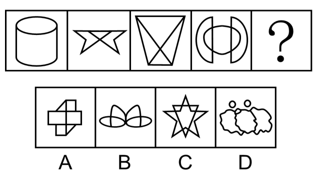
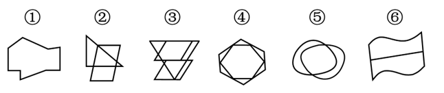
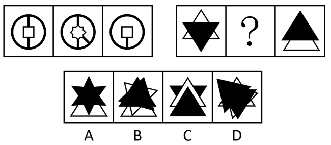
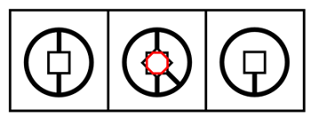

# 2017年四川省公务员考试《行测》题（定向乡镇）

> 判断推理 · 30 题 · 四川 2017

## 第 1 题　qid 4767958 · 图形推理

从所给的四个选项中，选择最合适的一个填入问号处，使之呈现一定的规律性：

- **A**. A
- **B**. B　✅
- **C**. C
- **D**. D

**答案**：B

**官方解析**

元素组成相同，优先考虑位置规律。观察发现题干图形都由外框图形和内部元素组成，考虑内外分开看。第一组外框图形的位置变化规律为：图1上下翻转后得到图2，图2旋转后得到图3；内部元素的位置变化规律为：每个黑点每次逆时针移动一格。第二组图形应用此规律，根据外框图形规律，排除A、C两项，再考虑内部黑块沿外圈每次逆时针移动一格，只有B项符合。

故正确答案为B。

---

## 第 2 题　qid 4767960 · 图形推理

从所给的四个选项中，选择最合适的一个填入问号处，使之呈现一定的规律性：

- **A**. A
- **B**. B　✅
- **C**. C
- **D**. D

**答案**：B

**官方解析**

元素组成不同，优先考虑属性规律。题干图形较规整，且出现明显的等腰元素，优先考虑对称性。题干图形均为轴对称图形，排除C、D两项。继续观察发现，图3出现相切，图4为明显的一笔画图形，考虑笔画数，题干图形均为一笔画图形，可排除A项，只有B项符合。
故正确答案为B。

---

## 第 3 题　qid 4767961 · 图形推理

从所给的四个选项中，选择最合适的一个填入问号处，使之呈现一定的规律性：

- **A**. A
- **B**. B　✅
- **C**. C
- **D**. D

**答案**：B

**官方解析**

元素组成不同，优先考虑属性规律。观察发现，题干图形出现等腰元素，考虑对称性。题干图形均为竖轴对称图形，排除A、D两项；继续观察发现，题干图形出现明显的封闭区域，考虑面数量。题干图形的面数量依次为2、3、4、5，故？处图形应该有6个面，排除C项，只有B项满足所有规律。
故正确答案为B。

---

## 第 4 题　qid 4768021 · 图形推理

把下面的六个图形分为两类，使每一类图形都有各自的共同特征或规律，分类正确的一项是：

- **A**. ①②③，④⑤⑥　✅
- **B**. ①③⑤，②④⑥
- **C**. ①④⑤，②③⑥
- **D**. ①②⑥，③④⑤

**答案**：A

**官方解析**

元素组成不同，优先考虑属性规律。观察发现，图④⑤⑥均为中心对称图形，图①②③均不是中心对称图形，即图①②③为一组，图④⑤⑥为一组。
故正确答案为A。
注：分组分类题目优先考虑两组图形分别具有各自的规律，无法分成具有各自规律的两组时，才考虑将图形分成一组具有该规律，一组不具有该规律。

---

## 第 5 题　qid 4767997 · 图形推理

把下面的六个图形分为两类，使每一类图形都有各自的共同特征或规律，分类正确的一项是：

- **A**. ①②③，④⑤⑥
- **B**. ①③⑤，②④⑥　✅
- **C**. ①④⑤，②③⑥
- **D**. ①④⑥，②③⑤

**答案**：B

**官方解析**

解法一：本题为分组分类题目。元素组成不同，且无明显属性规律，考虑数量规律。观察发现，图形明显被分割，考虑面数量。图①③⑤均有10个面，图②④⑥均有9个面，即图①③⑤为一组，图②④⑥为一组。
故正确答案为B。
解法二：本题为分组分类题目。元素组成不同，且无明显属性规律，考虑数量规律。观察发现，题干图形中线条相交明显，考虑数点，整体数点无规律，而题干图形中出现明显外框，考虑数框内交点数。图①③⑤均有5个框内交点，图②④⑥均有4个框内交点，即图①③⑤为一组，图②④⑥为一组。
故正确答案为B。
解法三：本题为分组分类题目。元素组成不同，且无明显属性规律，考虑数量规律。观察发现，题干均为“框+线条”图形，可以考虑笔画数，图①③⑤为4笔画图形，图②④⑥为3笔画图形，即图①③⑤为一组，图②④⑥为一组。
故正确答案为B。
注：本题不严谨，多种考点均能对应B项，考生应重点掌握做题思路，考场上想到哪个规律就用哪个规律。

---

## 第 6 题　qid 4768005 · 图形推理

从所给的四个选项中，选择最合适的一个填入问号处，使之呈现一定的规律性：

- **A**. A
- **B**. B
- **C**. C
- **D**. D　✅

**答案**：D

**官方解析**

元素组成相似，优先考虑样式规律。第二组图形中问号在图2，故优先观察第一组图形中图1和图3是如何得到图2的。第一组图形中，图3先逆时针旋转45°后，再与图1相加得到图2。第二组图形运用此规律，图3先逆时针旋转45°后，再与图1相加得到图2，只有D项符合。

故正确答案为D。

注：本题考虑相加的特征明显，但出题不够严谨，第一组图形图2缺少部分线条，如下图红线所示，且本题再无其他规律。同学们需重点掌握这类问号在图2的加减同异题目的解题方法，优先观察图1与图3是如何得到图2的。

---

## 第 7 题　qid 4768001 · 定义判断

国家赔偿是指国家机关及其工作人员因行使职权给公民、法人以及其他组织的合法权益造成损害，依法应给予的赔偿。
根据上述定义，下列属于国家赔偿的是：

- **A**. 干警甲因公致残，获得残疾补偿金六万元
- **B**. 乙因其所有的房屋被政府征收，获得政府支付的补偿费四十万元
- **C**. 行人丙因干警丁外出旅游期间违章驾驶受伤，获各项赔偿合计五千元
- **D**. 戊因涉嫌犯罪被公安机关逮捕，后被法院判决宣告无罪，获赔偿款五万元　✅

**答案**：D

**官方解析**

第一步：找出定义关键词。
“国家机关及其工作人员”、“因行使职权”、“给公民、法人以及其他组织的合法权益造成损害”、“依法应给予的赔偿”。
第二步：逐一分析选项。
A项：干警甲因公致残，未体现“给公民、法人以及其他组织的合法权益造成损害”，不符合定义，排除；
B项：乙因其所有的房屋被征收获得四十万元是政府支付的补偿费，房屋征收是政府依照法律程序剥夺房屋及其他不动产所有权人的所有权及其使用权，同时丧失土地使用权并给予市场交易价格补偿的“行政购买行为”，不符合“给公民、法人以及其他组织的合法权益造成损害”、“依法应给予的赔偿”，不符合定义，排除；
C项：干警丁外出旅游期间因违章驾驶造成行人丙受伤，这是丁的个人违法行为，不是因行使职权而造成丙的受伤，不符合“因行使职权给公民、法人以及其他组织的合法权益造成损害”，不符合定义，排除；
D项：戊因涉嫌犯罪被公安机关逮捕，属于公安机关正常行使职权，符合“国家机关及其工作人员”、“因行使职权”，后被法院判决宣告无罪，获赔偿款五万元，符合“给公民、法人以及其他组织的合法权益造成损害”、“依法应给予的赔偿”，符合定义，当选。
故正确答案为D。

---

## 第 8 题　qid 4768004 · 定义判断

消费者主权理论又称为顾客主导型经济模式，即消费者根据自己意思和偏好到市场上购买所需商品和服务，这样消费者意思和偏好等信息就通过市场传达给了生产者，于是生产者根据消费者的消费行为所反馈回来的信息来安排生产，提供消费者所需的商品和服务。
根据上述定义，下列体现消费者主权的是：

- **A**. 智能电视因生产成本降低而降价，销量因此大增
- **B**. 某运动饮料厂家通过向市场投放广告，产品销量大增
- **C**. 随着空气污染加剧，市场上出现各种品牌的具有防霾功能的口罩
- **D**. 政府公布公务员差旅住宿价格标准，各地酒店纷纷设置与之对应的客房　✅

**答案**：D

**官方解析**

第一步：找出定义关键词。
“消费者意思和偏好等信息通过市场传达给生产者”、“生产者根据消费者的消费行为反馈回来的信息来安排生产”。
第二步：逐一分析选项。
A项：智能电视因成本的降低而降价，未体现消费者的信息传达给生产者，不符合“消费者意思和偏好等信息通过市场传达给生产者”，不符合定义，排除；
B项：厂家通过投放广告增加销量，未体现消费者的信息传达给生产者，不符合“消费者意思和偏好等信息通过市场传达给生产者”，不符合定义，排除；
C项：空气污染加剧后市场上出现了防霾口罩，商家是为了应对空气污染而生产的产品，未出现消费者，更未体现根据消费者的信息来生产，不符合“消费者意思和偏好等信息通过市场传达给生产者”、“生产者根据消费者的消费行为反馈回来的信息来安排生产”，不符合定义，排除；
D项：政府公布公务员差旅住宿价格标准，说明作为消费者的公务员关于住宿价格的相关信息已经公开，符合“消费者意思和偏好等信息通过市场传达给生产者”，各地酒店纷纷根据标准设置对应的客房，符合“生产者根据消费者的消费行为反馈回来的信息来安排生产，符合定义，当选。
故正确答案为D。

---

## 第 9 题　qid 4767983 · 定义判断

发散性思维亦称辐射思维，求异思维，它是指根据已有的信息，从不同角度不同方向上进行思考，从多方面寻求多样性答案的一种思维活动。
根据上述定义，下列属于发散性思维的是：

- **A**. 某数学老师经过层层推理，终于证明了一道同学们解不出的数学难题
- **B**. 某广告公司的设计师由“点”想到太阳、五子棋、球等，设计出不同的广告方案　✅
- **C**. 历史上苏北发生了蝗虫灾害，某官员为研究治蝗之策，搜集了自战国以来有关蝗灾的资料
- **D**. 鲁班从野草叶子上锋利的齿和蝗虫大板牙上的小齿得到启示，经过反复试验发明了锯子

**答案**：B

**官方解析**

第一步：找出定义关键词。
“根据已有的信息”、“从不同角度不同方向上进行思考”、“寻求多样性答案”。
第二步：逐一分析选项。
A项：数学老师经过层层推理来解决数学难题，是朝一个方向进行的思考，且是为了得到唯一的答案，不符合“从不同角度不同方向上进行思考”、“寻求多样性答案”，不符合定义，排除；
B项：设计师根据“点”，联想到的太阳、五子棋和球等都是不同类型的事物，且最终设计出了不同的广告方案，符合“根据已有的信息”、“从不同角度不同方向上进行思考”、“寻求多样性答案”，符合定义，当选；
C项：官员只是搜集资料，未体现出不同的思考角度或方向，不符合“从不同角度不同方向上进行思考”，不符合定义，排除；
D项：鲁班从野草叶子上的齿和蝗虫大板牙上的小齿得到启示发明了锯子，主要就是围绕着齿这一个角度进行思考的，不符合“从不同角度不同方向上进行思考”，不符合定义，排除。
故正确答案为B。

---

## 第 10 题　qid 4767984 · 定义判断

生态经济是指在生态系统承载能力范围内，运用生态经济学原理和系统工程方法改变生产和消费方式，挖掘一切可以利用的资源潜力，发展一些经济发达、生态高效的产业，建设体制合理、社会和谐的文化以及生态健康、景观适宜的环境。
根据上述定义，下列体现生态经济理念的是：

- **A**. 将受保护的历史古建筑改造为特色宾馆以吸引旅客
- **B**. 在河流上尽可能多地建设水电站以提供充足的电力
- **C**. 在贫困山区削平山体开采加工更多大理石以拉动当地经济发展
- **D**. 在自然野生动物园延长食物链，适当投放更多类动物供游客观赏　✅

**答案**：D

**官方解析**

第一步：找出定义关键词。
“在生态系统承载能力范围内”、“运用生态经济学原理和系统工程方法”、“建设体制合理、社会和谐的文化以及生态健康、景观适宜的环境”。
第二步：逐一分析选项。
A项：将受保护的历史古建筑改成特色宾馆，没有涉及生态，不符合“在生态系统承载能力范围内”、“运用生态经济学原理和系统工程方法”，不符合定义，排除；
B项：在河流上尽可能多地建设水电站，“尽可能多地”即不是合理的，建多个水电站说明没有考虑该河流流域内生态的承载能力，不符合“在生态系统承载能力范围内”、“建设体制合理、社会和谐的文化以及生态健康、景观适宜的环境”，不符合定义，排除；
C项：削平山体开采加工是对当地生态环境的破坏，通过破坏生态环境的方式来发展经济，不符合“在生态系统承载能力范围内”、“建设体制合理、社会和谐的文化以及生态健康、景观适宜的环境”，不符合定义，排除；
D项：在野生动物园内适当投放更多类动物，符合“在生态系统承载能力范围内”，延长食物链，符合“运用生态经济学原理和系统工程方法”，游客可以观赏到更多种类的动物，符合“建设体制合理、社会和谐的文化以及生态健康、景观适宜的环境”，符合定义，当选。
故正确答案为D。

---

## 第 11 题　qid 4768002 · 定义判断

激励指持续地激发人的动机和内在动力，使其心理过程始终保持在激奋的状态中，鼓励人在自己潜力范围内朝着所期望的目标采取行动的心理过程。
根据上述定义，下列属于激励的是：

- **A**. 公司承诺参赛人员若获冠军将奖励每人5万元　✅
- **B**. 小孩因说脏话骂人，父母禁止其看电视以示惩罚
- **C**. 为保持课堂纪律，教师对扮鬼脸的学生不予理睬
- **D**. 为完成订单，企业要求员工加班并给予高额报酬

**答案**：A

**官方解析**

第一步：找出定义关键词。
“激发人的动机和内在动力”、“使其保持在激奋状态中”、“鼓励人朝着期望的目标采取行动”。
第二步：逐一分析选项。
A项：公司承诺获得冠军的奖励，能够激发参赛人员的内在动力，鼓励参赛人员朝着夺冠的目标采取行动，符合“激发人的动机和内在动力”、“使其保持在激奋状态中”、“鼓励人朝着期望的目标采取行动”，符合定义，当选；
B项：父母对小孩做出禁止看电视的惩罚，并非父母对小孩的激发与鼓励，也未体现小孩追求自己期望的目标，不符合“激发人的动机和内在动力”、“使其保持在激奋状态中”、“鼓励人朝着期望的目标采取行动”，不符合定义，排除；
C项：教师对扮鬼脸的学生不予理睬，并非教师对学生的激发与鼓励，不符合“激发人的动机和内在动力”，并且教师的目的是为了保持课堂纪律，而不是为了鼓励学生追求自己期望的目标，不符合“使其保持在激奋状态中”、“鼓励人朝着期望的目标采取行动”，不符合定义，排除；
D项：企业要求员工加班并给予高额报酬，加班是公司的强制要求，不符合“激发人的动机和内在动力”，并且企业的目的是为了完成订单，而不是为了鼓励员工追求自己期望的目标，不符合“使其保持在激奋状态中”、“鼓励人朝着期望的目标采取行动”，不符合定义，排除。
故正确答案为A。

---

## 第 12 题　qid 4768008 · 定义判断

犯罪中止是指在犯罪过程中，自动放弃犯罪或者自动有效防止犯罪结果发生。
根据上述定义，下列行为属于犯罪中止的是：

- **A**. 甲偷了邻村蒋某看病的钱，后因蒋某家境贫寒，又将钱偷偷放了回去
- **B**. 乙进入罗某家中偷盗，正赶上罗某心脏病突发，乙不再偷窃将罗某送进医院　✅
- **C**. 丙在偏僻路口挟持李某意图抢劫，李某大声呼叫，被路过的巡警听到，丙仓促逃走
- **D**. 丁因老板不发工资，故放火烧老板的仓库，点燃汽油后匆忙逃跑，幸运的是一场大雨将火浇灭

**答案**：B

**官方解析**

第一步：找出定义关键词。
“在犯罪过程中”、“自动放弃犯罪或者自动有效防止犯罪结果发生”。
第二步：逐一分析选项。
A项：该项甲在偷了钱后又将钱偷偷放回去，其盗窃行为已经完成，不符合“在犯罪过程中”，不符合定义，排除；
B项：该项乙在偷窃过程中，因罗某心脏病突发而不再偷窃，符合“在犯罪过程中”、“自动放弃犯罪或者自动有效防止犯罪结果发生”，符合定义，当选；
C项：该项丙在抢劫过程中，李某的呼叫被巡警听到使丙的犯罪行为中止，不符合“自动放弃犯罪或者自动有效防止犯罪结果发生”，不符合定义，排除；
D项：该项丁放火烧仓库，但大雨将火浇灭，不符合“自动放弃犯罪或者自动有效防止犯罪结果发生”，不符合定义，排除。
故正确答案为B。

---

## 第 13 题　qid 4767988 · 定义判断

社会化是个体在特定的社会文化环境中，学习和掌握知识、技能、语言、规范、价值观等社会行为方式和人格特征，适应社会并积极作用于社会，创造新文化的过程。
根据上述定义，下列不属于社会化的是：

- **A**. 小明到学校上哲学课
- **B**. 小张拜师学做木工活
- **C**. 小王接受公司礼仪培训
- **D**. 小赵参加朋友周末聚会　✅

**答案**：D

**官方解析**

第一步：找出定义关键词。
“个体在特定的社会文化环境中，学习和掌握知识、技能、语言、规范、价值观等社会行为方式和人格特征”。
第二步：逐一分析选项。
A项：小明到学校上哲学课，是学习和掌握知识，符合“个体在特定的社会文化环境中，学习和掌握知识、技能、语言、规范、价值观等社会行为方式和人格特征”，符合定义，排除；
B项：小张拜师学做木工活，是学习和掌握技能，符合“个体在特定的社会文化环境中，学习和掌握知识、技能、语言、规范、价值观等社会行为方式和人格特征”，符合定义，排除；
C项：小王接受公司礼仪培训，是学习和掌握公司的礼仪规范，符合“个体在特定的社会文化环境中，学习和掌握知识、技能、语言、规范、价值观等社会行为方式和人格特征”，符合定义，排除；
D项：小赵参加朋友周末聚会，是和朋友相聚，不是学习行为，不符合“个体在特定的社会文化环境中，学习和掌握知识、技能、语言、规范、价值观等社会行为方式和人格特征”，不符合定义，当选。
本题为选非题，故正确答案为D。

---

## 第 14 题　qid 4767995 · 类比推理

扫帚：簸箕

- **A**. 牙刷：杯子　✅
- **B**. 镜架：镜片
- **C**. 围巾：帽子
- **D**. 锁：钥匙

**答案**：A

**官方解析**

第一步：判断题干词语间逻辑关系。
扫帚和簸箕经常配套使用来清洁房屋，二者为配套使用的对应关系，且扫帚是清洁工具，簸箕是容器。
第二步：判断选项词语间逻辑关系。
A项：牙刷和杯子经常配套使用来清洁牙齿，二者为配套使用的对应关系，且牙刷是清洁工具，杯子是容器，与题干逻辑关系一致，当选；
B项：镜架和镜片是眼镜的两个组成部分，为并列关系，题干为配套使用的两种工具，与题干逻辑关系不一致，排除；
C项：围巾和帽子都可以用来保暖，二者为并列关系，与题干逻辑关系不一致，排除；
D项：锁和钥匙经常配套使用来防盗，二者为配套使用的对应关系，但锁和钥匙均不是清洁工具，与题干逻辑关系不一致，排除。
故正确答案为A。

---

## 第 15 题　qid 4768027 · 类比推理

左边：右边

- **A**. 真话：假话
- **B**. 黑色：白色　✅
- **C**. 绝对：相对
- **D**. 浮力：压力

**答案**：B

**官方解析**

第一步：判断题干词语间逻辑关系。
左边和右边都表示方位，除此之外还有中间，二者为并列关系中的反对关系。
第二步：判断选项词语间逻辑关系。
A项：真话和假话为并列关系中的矛盾关系，与题干逻辑关系不一致，排除；
B项：黑色和白色都表示颜色，除此之外还有黄色、蓝色等，二者为并列关系中的反对关系，与题干逻辑关系一致，当选；
C项：绝对和相对为并列关系中的矛盾关系，与题干逻辑关系不一致，排除；
D项：浮力指物体浸没在流体（液体和气体）中，各表面受流体压力的差，因此浮力是一种压力差，二者为对应关系，与题干逻辑关系不一致，排除。
故正确答案为B。

---

## 第 16 题　qid 4768032 · 类比推理

见多：识广

- **A**. 上行：下效
- **B**. 异口：同声
- **C**. 高瞻：远瞩　✅
- **D**. 朝三：暮四

**答案**：C

**官方解析**

第一步：判断题干词语间逻辑关系。
“见多识广”比喻见识广，阅历深，“见多”和“识广”均有阅历深、知识广博的意思，二者为近义关系。
第二步：判断选项词语间逻辑关系。
A项：“上行下效”指上面的人怎么做，下面的人就跟着怎么干，“上行”和“下效”不是近义关系，与题干逻辑关系不一致，排除；
B项：“异口同声”指不同的人同时说出同样的话，“异口”和“同声”不是近义关系，与题干逻辑关系不一致，排除；
C项：“高瞻远瞩”指站得高，看得远，比喻目光远大，“高瞻”和“远瞩”均有站在高处往远处看的意思，二者为近义关系，与题干逻辑关系一致，当选；
D项：“朝三暮四”来源于一个典故，从前，有个玩猴子的人拿橡子喂猴子，他对猴子说，早上给三个橡子，晚上给四个，所有的猴子听了都急了。后来他又说，早上给四个，晚上给三个，所有的猴子都高兴了。“朝三暮四”原比喻使用诈术，进行欺骗，后比喻常常变卦，反复无常，“朝三”和“暮四”不是近义关系，与题干逻辑关系不一致，排除。
故正确答案为C。

---

## 第 17 题　qid 4768014 · 类比推理

小学生：大学生

- **A**. 金属：非金属
- **B**. 奇数：整数
- **C**. 少年：中年　✅
- **D**. 党员：教师

**答案**：C

**官方解析**

第一步：判断题干词语间逻辑关系。
小学生和大学生都是学生，除此之外还有中学生等，二者为并列关系中的反对关系。
第二步：判断选项词语间逻辑关系。
A项：金属和非金属为并列关系中的矛盾关系，与题干逻辑关系不一致，排除；
B项：奇数指不能被2整除的整数，二者为种属关系，与题干逻辑关系不一致，排除；
C项：少年和中年都是按照年龄段划分，除此之外还有老年等，二者为并列关系中的反对关系，与题干逻辑关系一致，当选；
D项：有的党员是教师，有的党员不是教师，有的教师是党员，有的教师不是党员，二者为交叉关系，与题干逻辑关系不一致，排除。
故正确答案为C。

---

## 第 18 题　qid 4768016 · 类比推理

能量：地震

- **A**. 吵架：矛盾
- **B**. 营养：健康
- **C**. 武力：战争
- **D**. 情绪：发怒　✅

**答案**：D

**官方解析**

第一步：判断题干词语间逻辑关系。
地震是地壳快速释放能量过程中造成的振动，地震是能量爆发的一种形式，二者为对应关系。
第二步：判断选项词语间逻辑关系。
A项：吵架是矛盾爆发的一种形式，但词语前后顺序相反，与题干逻辑关系不一致，排除；
B项：摄入营养是保持健康的必要条件，二者为条件对应关系，与题干逻辑关系不一致，排除；
C项：武力是战争中可能会用到的手段，武力是一种方式，与题干逻辑关系不一致，排除；
D项：发怒是情绪爆发的一种形式，二者为对应关系，与题干逻辑关系一致，当选。
故正确答案为D。

---

## 第 19 题　qid 4768006 · 类比推理

概念：定义

- **A**. 真理：定理　✅
- **B**. 归纳：概括
- **C**. 抽象：具象
- **D**. 目的：结果

**答案**：A

**官方解析**

第一步：判断题干词语间逻辑关系。
概念和定义都是把一类事物的共同本质特点加以概括，形成的一种表达和总结；概念的范围更广，定义的范围较小，二者为种属关系。
第二步：判断选项词语间逻辑关系。
A项：真理和定理都是对于客观事物及其规律的正确认识；真理的范围更广，定理的范围较小（指数学或逻辑学中的真命题），二者为种属关系，与题干逻辑关系一致，当选；
B项：归纳是指一种推理方法，由一系列具体的事实概括出一般原理，二者不是种属关系，与题干逻辑关系不一致，排除；
C项：抽象和具象是相对应的概念，二者不是种属关系，与题干逻辑关系不一致，排除；
D项：目的是指行为主体根据自身的需要，借助意识、观念的中介作用预先设想的行为目标和结果，结果是指事物发展的后续影响或阶段终了时的状态，二者不是种属关系，与题干逻辑关系不一致，排除。
故正确答案为A。

---

## 第 20 题　qid 4768009 · 类比推理

认真：兢兢业业

- **A**. 灰心：半途而废
- **B**. 热闹：车水马龙　✅
- **C**. 辛苦：一日千里
- **D**. 勤奋：聚精会神

**答案**：B

**官方解析**

第一步：判断题干词语间逻辑关系。
兢兢业业形容做事谨慎、勤恳、踏实，与认真是近义关系。
第二步：判断选项词语间逻辑关系。
A项：半途而废指事情没有完成就放弃了，与灰心不是近义关系，与题干逻辑关系不一致，排除；
B项：车水马龙指车像流水，马像游龙，形容车马或车辆很多，来往不绝，与热闹是近义关系，与题干逻辑关系一致，当选；
C项：一日千里形容进展极快，与辛苦不是近义关系，与题干逻辑关系不一致，排除；
D项：聚精会神指集中精神，形容注意力高度集中，与勤奋不是近义关系，与题干逻辑关系不一致，排除。
故正确答案为B。

---

## 第 21 题　qid 4768024 · 类比推理

土豆：薯片：淀粉

- **A**. 牛奶：奶粉：蛋白质　✅
- **B**. 高粱：白酒：酒精
- **C**. 棉花：毛巾：棉线
- **D**. 石油：汽油：煤油

**答案**：A

**官方解析**

第一步：判断题干词语间逻辑关系。
土豆是制作薯片的原材料，二者为原材料对应关系；淀粉是土豆的成分，二者是成分对应关系。
第二步：判断选项词语间逻辑关系。
A项：牛奶是制作奶粉的原材料，二者为原材料对应关系；蛋白质是牛奶的成分，二者是成分对应关系，与题干逻辑关系一致，当选；
B项：高粱是制作白酒的原材料，二者为原材料对应关系；酒精不是高粱的成分，与题干逻辑关系不一致，排除；
C项：棉花是制作毛巾的原材料，二者为原材料对应关系；棉花是制作棉线的原材料，棉线不是棉花的成分，与题干逻辑关系不一致，排除；
D项：石油是制作汽油的原材料，二者为原材料对应关系；煤油不是石油的成分，与题干逻辑关系不一致，排除。
故正确答案为A。

---

## 第 22 题　qid 4768029 · 类比推理

穷 对于 （    ） 相当于 独 对于 （    ）

- **A**. 富；孤
- **B**. 达；偶　✅
- **C**. 尽；众
- **D**. 韧；寡

**答案**：B

**官方解析**

逐一代入选项。
A项：穷可以指贫穷、缺乏钱财，和富构成反义关系；独和孤都可以指单独，二者为近义关系，前后逻辑关系不一致，排除；
B项：穷可以指不得志，达可以指显达，二者为反义关系；独和偶二者为反义关系，前后逻辑关系一致，当选；
C项：穷有穷尽的意思，和尽构成近义关系；独和众是反义关系，前后逻辑关系不一致，排除；
D项：穷和韧没有明显关系；独和寡是近义关系，前后逻辑关系不一致，排除。
故正确答案为B。

---

## 第 23 题　qid 4768025 · 类比推理

牙齿 对于 （    ） 相当于 （    ） 对于 花

- **A**. 食物；花蕊
- **B**. 骨骼；花萼
- **C**. 牙龈；花苞
- **D**. 口腔；花瓣　✅

**答案**：D

**官方解析**

逐一代入选项。
A项：牙齿是咀嚼食物的器官，二者为对应关系；花蕊是花的组成部分，二者为组成关系，前后逻辑关系不一致，排除；
B项：牙齿和骨骼都是人体的组成部分，二者是不同的器官，为并列关系；花萼是花的组成部分，二者为组成关系，前后逻辑关系不一致，排除；
C项：牙齿和牙龈是不同的器官，二者为并列关系；花苞有不同解释，可以指花的蓓蕾时期，此时二者为对应关系，也可以指没开时包着花骨朵的小叶片，此时二者为组成关系，前后逻辑关系不一致，排除；
D项：牙齿是口腔的组成部分，二者为组成关系；花瓣是花的组成部分，二者为组成关系，前后逻辑关系一致，当选。
故正确答案为D。

---

## 第 24 题　qid 4768028 · 逻辑判断

家庭电视收视格局正在发生巨大变化。据统计，我国去年四季度有线电视网的用户比上一季度环比减少215万户，首次出现负增长。与此同时，宽带用户总量达到2577万户，其中四季度净增近250万户。据此，有专家认为：智能电视的不断普及，正冲击传统家庭电视收视格局。
下列哪项是以上论述所需要的前提？

- **A**. 家庭电视用户包括有线电视用户和宽带用户
- **B**. 智能电视主要通过宽带实现电视内容的观看　✅
- **C**. 有线电视用户依旧是家庭电视收视市场的核心
- **D**. 电视用户份额较为稳定且流动性较强，流失与增加同时发生

**答案**：B

**官方解析**

第一步：找出论点和论据。
论点：智能电视的不断普及，正冲击传统家庭电视收视格局。
论据：据统计，我国去年四季度有线电视网的用户比上一季度环比减少215万户，首次出现负增长。与此同时，宽带用户总量达到2577万户，其中四季度净增近250万户。
论点论讨智能电视冲击传统家庭电视的收视格局；论据给出的是有线电视网的用户减少，同时宽带用户增加，二者话题不一致，加强优先考虑搭桥。
第二步：逐一分析选项。
A项：该项讨论的是家庭电视用户包括有线电视用户和宽带用户，那么宽带用户的增加无法说明智能电视是否冲击传统家庭电视的收视格局，无法加强，排除；
B项：该项讨论的是智能电视主要通过宽带实现电视内容的观看，宽带用户的增加意味着智能电视用户的增加，建立论点论据的联系，为搭桥项，可以作为前提，当选；
C项：该项讨论的是有线电视用户依旧是家庭电视收视市场的核心，无法说明传统家庭电视的收视格局是否受到智能电视的影响，为无关项，无法加强，排除；
D项：该项讨论的是电视用户整体的数量变化情况，而论点讨论的是智能电视对传统家庭电视的收视格局的影响，话题不一致，无法加强，排除。
故正确答案为B。

---

## 第 25 题　qid 4768168 · 逻辑判断

据美国有机农业部统计，截止2007年，美国有机农产品的销售总额从1990年的10亿美元增加到170亿美元，占全美国农产品总值的4%。因此有人认为，有机农产品在未来的销售前景会更广阔。
以下哪项如果为真，最能削弱上述结论？

- **A**. 各国对有机农产品的认可程度不一
- **B**. 中国在有机农业技术方面支撑不足
- **C**. 有机农产品的认证体系还不标准和完善
- **D**. 对于大部分消费者来说，有机农产品售价较高　✅

**答案**：D

**官方解析**

第一步：找出论点和论据。
论点：有机农产品在未来的销售前景会更广阔。
论据：截止2007年，美国有机农产品的销售总额从1990年的10亿美元增加到170亿美元，占全美国农产品总值的4%。
本题的论点和论据均在讨论有机农产品的发展问题，话题一致，削弱优先考虑否定论点。
第二步：逐一分析选项。
A项：指出各国对有机农产品的认可程度不一，但是并不确定其他国家的认可程度如何，是否会影响有机农产品的销售前景，属于不明确项，无法削弱，排除；
B项：指出中国在有机农业技术方面支撑不足，但是否会影响有机农产品的销售前景并不确定，属于不明确项，无法削弱，排除；
C项：指出有机农产品的认证体系还不标准和完善，但与论点有机农产品的销售前景无关，属于无关项，无法削弱，排除；
D项：指出对于大部分消费者来说，有机农产品售价较高，那么消费者可能会因为较高的价格不去购买有机农产品，对论点有机农产品的销售前景造成直接影响，否定论点，当选。
故正确答案为D。

---

## 第 26 题　qid 4768170 · 类比推理

许多勤奋的学生是成绩好的学生，但是有些不勤奋的学生也是成绩好的学生，而所有的成绩好的学生都有共同的特征：他们学习都十分专注。
据此不可能推出的是：

- **A**. 十分专注的学生都不是勤奋的　✅
- **B**. 有些勤奋的学生不是成绩好的学生
- **C**. 有些不勤奋的学生不是成绩好的学生
- **D**. 十分专注的学生不都是成绩好的学生

**答案**：A

**官方解析**

第一步：翻译题干。

①有的勤奋的学生成绩好的学生；

②有的勤奋的学生成绩好的学生；

③成绩好的学生十分专注；

条件①和条件③可以递推出：④有的勤奋的学生成绩好的学生十分专注；

条件②和条件③可以递推出：⑤有的勤奋的学生成绩好的学生十分专注。

第二步：逐一分析选项。

本题提问为“不可能推出”，因此需要选择与题干条件一定矛盾的选项。

A项：翻译为十分专注勤奋，根据“有的AB”可换位为“有的BA”，将条件④换位可知，有的十分专注勤奋，所有A都不是B和有的A是B是矛盾关系，因此一定不可能推出，当选；

B项：翻译为有的勤奋的学生成绩好的学生，根据条件①可知，有的勤奋的学生成绩好的学生，根据“1有的所有”，当有的为一部分时，有可能推出，排除；

C项：翻译为有的勤奋的学生成绩好的学生，根据条件②可知，有的勤奋的学生成绩好的学生，根据“1有的所有”，当有的为一部分时，有可能推出，排除；

D项：翻译为有的十分专注成绩好的学生，根据所有AB，可以推出有的BA，将条件③换位可知，有的十分专注成绩好的学生，根据1有的所有，当有的为一部分时，有可能推出，排除。

本题为选非题，故正确答案为A。

---

## 第 27 题　qid 4768205 · 逻辑判断

有分析表明，华北平原等地区秸秆焚烧频繁，秸秆焚烧产生大量的有害气体，遇到无风、逆温等大气扩散不利的天气，造成空气严重污染。借助区域试验，大范围秸秆焚烧可使北京地区的PM2.5含量在几个小时内飙升几倍，在焚烧秸秆高发期出现的严重污染天气中，焚烧秸秆带来的污染物对雾霾的贡献率达20%左右，因此，有专家指出焚烧秸秆是造成环境污染的罪魁祸首。
以下哪项如果为真，最能反驳上述论证？

- **A**. 焚烧秸秆是千百年来就有的，而雾霾问题近几年才出现
- **B**. 全国来看，机动车保有量较大的城市一年中雾霾天气更多
- **C**. 有数据显示，北京、上海等11省（区、市）未监测到疑似秸秆焚烧火点，但这些地区仍然是环境污染的重灾区　✅
- **D**. 焚烧秸秆虽然使得农村地区空气中烟尘等污染物的浓度急剧增加，但人们普遍认为农村的空气质量好于城市

**答案**：C

**官方解析**

第一步：找出论点和论据。
论点：焚烧秸秆是造成环境污染的罪魁祸首。
论据：华北平原等地区秸秆焚烧频繁，秸秆焚烧产生大量的有害气体，遇到无风、逆温等大气扩散不利的天气，造成空气严重污染。借助区域试验，大范围秸秆焚烧可使北京地区的PM2.5含量在几个小时内飙升几倍，在焚烧秸秆高发期出现的严重污染天气中，焚烧秸秆带来的污染物对雾霾的贡献率达20%左右。
本题的论点和论据均在讨论焚烧秸秆和空气污染之间的关系，话题一致，削弱优先考虑否定论点。
第二步：逐一分析选项。
A项：指出焚烧秸秆是千百年来就有的，而雾霾问题近几年才出现，但是无法说明近几年的雾霾问题是否与焚烧秸秆有关，属于不明确项，无法削弱，排除；
B项：指出机动车保有量较大的城市一年中雾霾天气更多，说的是机动车保有量和雾霾之间的关系，与论点讨论的焚烧秸秆无关，话题不一致，无法削弱，排除；
C项：举例指出北京、上海等11省（区、市）未监测到疑似秸秆焚烧火点，但这些地区仍然是环境污染的重灾区，那么焚烧秸秆和环境污染之间并没有必然的联系，直接否定论点，可以削弱，当选；
D项：指出人们普遍认为农村的空气质量好于城市，但是人们的认为是否和真实情况一致并不确定，属于不明确项，无法削弱，排除。
故正确答案为C。

---

## 第 28 题　qid 4768208 · 逻辑判断

平时，我们总能听到看到各种女司机开车闯祸的新闻：“温州女司机开路虎连撞3车2人”，“宁波女子倒车撞死老公，自己伸头被夹身亡”，“女司机买豪车在小区转悠炫耀，碾死邻居赔偿58万”，因此在很多人的心目中，“女司机”就是“马路杀手”的代称。
以下哪项如果为真，最能驳斥上述看法？

- **A**. 在市区发生的车祸赔付金额2000元以下的轻微交通事故中，女司机的比例并不高
- **B**. 女性较男性更心细，驾驶准备工作也细致周密，且饮酒吸烟者较少，容易把精力集中在驾车上
- **C**. 国内男女司机比例大概是7：3，在负有同等以上责任的交通事故中，女司机导致的为10%左右　✅
- **D**. 女司机在急加速、急刹车、超速方面的平均次数均低于男司机，文明驾驶程度明显好于男司机

**答案**：C

**官方解析**

第一步：找出论点和论据。
论点：在很多人的心目中，“女司机”就是“马路杀手”的代称。
论据：平时，我们总能听到看到各种女司机开车闯祸的新闻：“温州女司机开路虎连撞3车2人”，“宁波女子倒车撞死老公，自己伸头被夹身亡”，“女司机买豪车在小区转悠炫耀，碾死邻居赔偿58万”。
本题论点论据话题一致，均在说明女司机交通事故率高，削弱优先考虑否定论点。
第二步：逐一分析选项。
A项：该项指出女司机在轻微交通事故中的比例并不高，但无法得知女司机在其他交通事故中的比例，无法削弱，排除；
B项：该项指出女司机在驾车时精力更集中，但精力集中与交通事故的关系并不清楚，无法削弱，排除；
C项：该项指出国内司机中女司机占比30%，但负有同等以上责任的交通事故中，女司机仅占比10%，说明只有极少比例的交通事故是女司机造成的，可以削弱题干论点，当选；
D项：该项指出女司机在驾车时文明驾驶程度高，但文明驾驶程度高与交通事故的关系并不清楚，无法削弱，排除。
故正确答案为C。

---

## 第 29 题　qid 4768258 · 逻辑判断

某中药材店开张筹备中，有几个药柜的标签上尚未标注药名，几个进店的消费者纷纷猜测，甲说：1号柜里是贝母；乙说：2号柜里是三七而且3号柜里不是川芎；丙说：1号柜里肯定不是贝母；丁说：如果2号柜里是三七，那3号柜里就是川芎；戊说：我猜4号柜里是石斛。这时药店老板走进来笑着说：你们中有两个人说错啦。
根据上述叙述，可以推出的是：

- **A**. 1号柜里是贝母
- **B**. 2号柜里不是三七
- **C**. 3号柜里不是川芎
- **D**. 4号柜里是石斛　✅

**答案**：D

**官方解析**

第一步：找出题干矛盾关系。

（1）甲：1号柜里是贝母；

（2）乙：2号柜里是三七而且3号柜里不是川芎；

（3）丙：1号柜里肯定不是贝母；

（4）丁：2号柜里是三七3号柜里就是川芎；

（5）戊：4号柜里是石斛。

甲和丙说的话为矛盾关系，必有一真，必有一假。

乙和丁说的话为矛盾关系，必有一真，必有一假。

第二步：看其余。

根据两个人说的是假话可知，说假话的两个人必定在甲、乙、丙、丁四人中，则戊一定说的是真话，则4号柜里是石斛。

故正确答案为D。

---

## 第 30 题　qid 4768267 · 逻辑判断

据报道，2016年中国马拉松运动中死亡事件，除交通意外、人为伤害等因素外，心源性猝死在整个参赛人群的比例约为0.15/10万，而中国每年因心源性猝死的比例约为4.5/10万，所以，有人认为，马拉松运动并不是高危险运动。
以下哪项如果为真，最能反驳上述观点？

- **A**. 发生心源性猝死有多种原因
- **B**. 年轻人的心脏病发病猝死率高
- **C**. 能参加马拉松运动的大多为健康人　✅
- **D**. 足球运动员的心源性猝死率高于马拉松运动员

**答案**：C

**官方解析**

第一步：找出论点和论据。
论点：马拉松运动并不是高危险运动。
论据：2016年中国马拉松运动中死亡事件，除交通意外、人为伤害等因素外，心源性猝死在整个参赛人群的比例约为0.15/10万，而中国每年因心源性猝死的比例约为4.5/10万。
本题论点说的是马拉松不是高危险运动，论据说的是马拉松运动中心源性猝死的比例低，话题不一致，削弱优先考虑拆桥。
第二步：逐一分析选项。
A项：该项指出发生心源性猝死有多种原因，但并没有说明马拉松运动是否是高危险运动，无法削弱，排除；
B项：该项指出年轻人的心脏病发病猝死率高，但并没有说明马拉松运动是否是高危险运动，无法削弱，排除；
C项：该项指出能参加马拉松运动的大多为健康人，健康人心源性猝死的比例本来就低，不能由心源性猝死的比例低来得出马拉松运动不是高危险运动，属于拆桥项，可以削弱，当选；
D项：该项指出足球运动员的心源性猝死率高于马拉松运动员，但并没有说明马拉松运动是否是高危险运动，无法削弱，排除。
故正确答案为C。

---
