# 2017年国家公务员录用考试《行测》题（地市级）

> 判断推理 · 40 题 · 国考 2017

## 材料 1

       根据所给材料，回答下列问题。        某办公室有王莉、李明和丁勇3名工作人员，本周有分别涉及网络、财务、管理、人事和教育的5项工作需要他们完成。关于任务安排，需要满足下列条件：        ①每人均需至少完成其中的一项工作，一项工作只能由一人完成；        ②人事和管理工作都不是由王莉完成的；        ③如果人事工作由丁勇完成，那么财务工作由李明完成；        ④完成教育工作的人至少还需完成一项其他工作。        到了周末，3人顺利地完成了上述5项工作。 

### 第 1 题　qid 2028540 · 逻辑判断

以下哪项的工作安排符合上述条件？

- **A**. 王莉：管理、网络； 李明：教育、人事；丁勇：财务
- **B**. 王莉：教育、财务； 李明：人事、管理；丁勇：网络　✅
- **C**. 王莉：网络； 李明：人事、管理、财务；丁勇：教育
- **D**. 王莉：网络； 李明：教育、管理；丁勇：人事、财务

**答案**：B

**官方解析**

根据题干条件分析选项。

根据②可知，管理不是王莉完成，排除A项；

根据③可知，丁勇完成人事李明完成财务，D项不符合，排除；

根据④可知，完成教育的人还需完成其他工作，排除C项。

故正确答案为B。

---

### 第 2 题　qid 2028544 · 逻辑判断

如果李明只完成5项工作中的一项，那么包括该工作的所有可能性是以下哪项？

- **A**. 人事、财务　✅
- **B**. 人事、管理、财务
- **C**. 人事、网络
- **D**. 财务

**答案**：A

**官方解析**

第一步：分析题干条件。
①每人至少一项工作，每个工作只能一个人完成
②王≠人事；王≠管理
③丁（人事）→李（财务）
④完成教育的还要做其他的工作
题干条件中提到次数最多的就是“人事”，可以以它为突破口。
根据条件②已知人事工作不是王莉完成，可推出人事工作是要么李明要么丁勇；又根据条件③丁（人事）→李（财务），结合上述结论可知：如果丁做人事，那么李明做财务；如果丁不做人事，那么就是李明做人事。换句话说，李明人事和财务工作至少要做一个。
提问是如果李明只完成5项工作中的一项，根据刚才推导出的结论：“李明人事和财务工作至少要做一个”，那么李明不可能只做管理，排除B项，也不可能只做网络，排除C项。
剩下A、D选项，只需要验证李明是否可以只做人事工作即可。如果李明只做人事，则不做管理工作，根据条件②，王也不做管理，所以管理一定是丁做的，那么王只需同时做网络、财务、教育，便可符合题干条件，是可能的，故排除D项；
故正确答案为A。

---

### 第 3 题　qid 2028546 · 逻辑判断

以下哪项中的任务不可能均由李明完成？

- **A**. 教育、人事、财务
- **B**. 教育、人事、网络
- **C**. 教育、管理、财务
- **D**. 教育、管理、网络　✅

**答案**：D

**官方解析**

第一步：分析题干条件。
①每人至少一项工作，每个工作只能一个人完成
②王≠人事；王≠管理
③丁（人事）→李（财务）
④完成教育的还要做其他的工作
通过107题推理可知“李明人事和财务工作至少要做一个”，而只有D选项中是不包含人事和财务的，如果D选项成立，那么也就意味着，李明至少要同时做四项工作，而王莉和丁勇两人合起来至多只有一项工作可做，与条件①相冲突 。
本题为选非题，故正确答案为D。

---

### 第 4 题　qid 2028550 · 逻辑判断

以下哪项中的任务不可能均由丁勇完成？

- **A**. 财务、管理
- **B**. 网络、人事　✅
- **C**. 管理、人事
- **D**. 教育、管理

**答案**：B

**官方解析**

第一步：分析题干条件。
①每人至少一项工作，每个工作只能一个人完成
②王≠人事；王≠管理
③丁（人事）→李（财务）
④完成教育的还要做其他的工作
根据条件②已知王莉既不做人事，也不做管理，只剩下三种工作：网络、财务和教育。如果王莉不做教育，那么网络、财务至少做一个，如果王莉做教育，根据条件④，王莉在网络、财务中也至少做一个，因此王莉网络、财务至少做一项。由条件③可知，若丁做人事，则李做财务，那么此时王莉必然要做网络，故丁勇不可能同时做人事和网络。
本题为选非题，故正确答案为B。

---

### 第 5 题　qid 2028552 · 逻辑判断

如果管理工作和网络工作是由同一个人完成的，则以下哪项是可能的？

- **A**. 教育工作是由李明完成的　✅
- **B**. 财务工作是由丁勇完成的
- **C**. 管理工作是由李明完成的
- **D**. 人事工作是由丁勇完成的

**答案**：A

**官方解析**

第一步：分析题干条件。
①每人至少一项工作，每个工作只能一个人完成
②王≠人事；王≠管理
③丁（人事）→李（财务）
④完成教育的还要做其他的工作
题干条件：⑤管理、网络由同一人完成
②⑤结合可以推出⑥王莉不做网络，结合上一小题推导的结论：王莉网络、财务至少做一个，可知王莉一定做财务，排除B选项。同时可知丁勇、李明都不做财务，由条件③可知丁勇不做人事，排除D选项。若管理工作和网络工作都由李明来做，就意味着丁勇只能做教育一项工作，这将与条件④矛盾，故排除C选项。
故正确答案为A。

---

### 第 6 题　qid 2028322 · 图形推理

从所给的四个选项中，选择最合适的一个填入问号处，使之呈现一定的规律性：

- **A**. A
- **B**. B
- **C**. C　✅
- **D**. D

**答案**：C

**官方解析**

元素组成凌乱，且图形规整，考虑属性中的对称性。观察前一组图，均为轴对称图形且对称轴数目为一，考虑对称轴方向，对称轴方向依次为横向、左斜、竖向，对称轴每次顺时针旋转。依此规律，后一组图中对称轴方向前两个为左斜、竖向，则？处应该选择一个对称轴右斜的图形。

观察选项，B项为非对称图形，D项为中心对称图形，A项为左斜，C项为右斜。

故正确答案为C。

---

### 第 7 题　qid 2028334 · 图形推理

从所给的四个选项中，选择最合适的一个填入问号处，使之呈现一定的规律性：

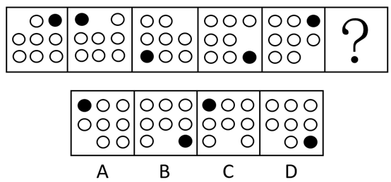

- **A**. A
- **B**. B
- **C**. C　✅
- **D**. D

**答案**：C

**官方解析**

题干中每幅图形均由1个黑圈、7个白圈和1个空白部分组成，元素组成相同，考虑位置关系。观察发现，黑圈都出现在外圈，因此考虑顺逆时针平移，黑圈在图形外圈每次逆时针移动两个单位，则“？”处黑圈应该出现在左上角，据此排除B、D两项。
每个图形都有一个空白部分且位置不同，观察空白部分的移动，空白部分每次在图形外圈顺时针移动一个单位，则“？”处空白部分应该出现在第三行第二列中，据此排除A选项。
故正确答案为C。

---

### 第 8 题　qid 2028342 · 图形推理

从所给的四个选项中，选择最合适的一个填入问号处，使之呈现一定的规律性：

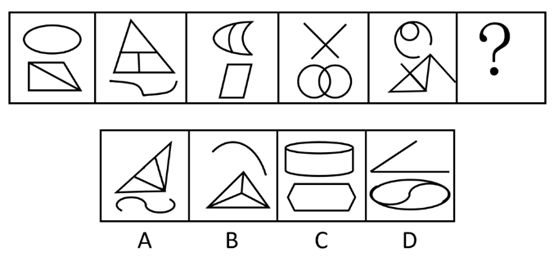

- **A**. A　✅
- **B**. B
- **C**. C
- **D**. D

**答案**：A

**官方解析**

元素组成不同，优先考虑属性规律。题干中每幅图形均由上下两个部分组成，且上下两个部分组成的线条样式不同。第一个、第三个、第五个图形中均为曲线图形在上，直线图形在下；第二个、第四个图形中均为直线图形在上，曲线图形在下，曲线图形和直线图形在上下两部分交叉出现。则？处所选图形应为直线图形在上，曲线图形在下，据此排除B、C选项。
比较A、D两项，最明显的区别在于A项有3个面，D项有2个面，观察发现题干中每幅图形均由3个面组成，据此排除D选项。
故正确答案为A。

---

### 第 9 题　qid 2028350 · 图形推理

从所给的四个选项中，选择最合适的一个填入问号处，使之呈现一定的规律性：

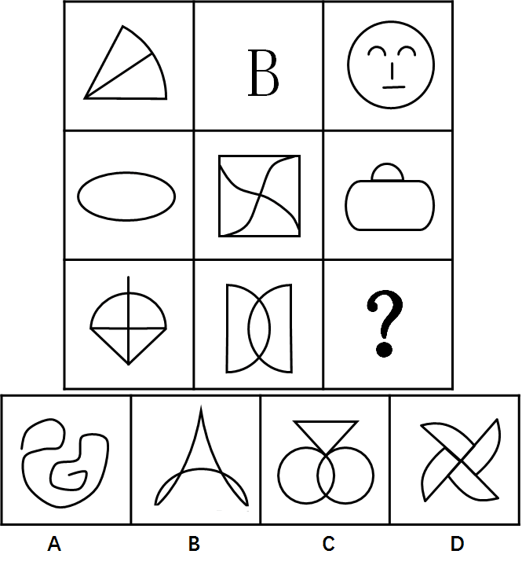

- **A**. A
- **B**. B　✅
- **C**. C
- **D**. D

**答案**：B

**官方解析**

元素组成不同，属性无明显规律，考虑数量规律。九宫格优先横向看，第一行三个图形曲线数分别为1、2、3；第二行满足此规律；第三行图1有1条曲线，图2有两条曲线，故“？”处应该选一个有3条曲线的图形。A项有1条曲线，B项3条，C项2条，D项4条。只有B选项符合规律。
故正确答案为B。

---

### 第 10 题　qid 2028348 · 图形推理

从所给的四个选项中，选择最合适的一个填入问号处，使之呈现一定的规律性：

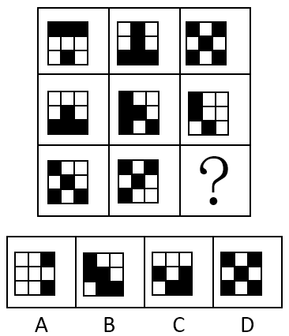

- **A**. A　✅
- **B**. B
- **C**. C
- **D**. D

**答案**：A

**官方解析**

本题为九宫格题目。黑格数量不同，排除位置规律，优先考虑叠加运算。九宫格优先横着看，观察第一行，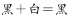，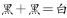，，，即同色为白，异色为黑（同白异黑），将此规律在第二行验证无误后，运用于第三行，左上角应为白色，排除B、D两项。右上角应为黑色，排除C项。

故正确答案为A。

---

### 第 11 题　qid 2028338 · 图形推理

左边给定的是正方体的外表面展开图，下面哪一项能由它折叠而成？

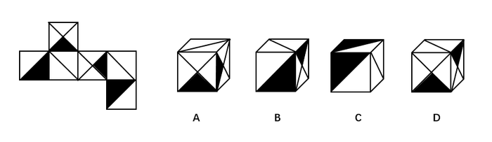

- **A**. A
- **B**. B
- **C**. C
- **D**. D　✅

**答案**：D

**官方解析**

本题属于空间重构类，逐一分析选项，将六个面按顺序标上序号。

A项：六面体展开图中，构成直角的两条边是同一条边。题干面a和面d的公共边（图中红色线）是白色三角形的斜边，A选项两个面的公共边有一条黑色直角三角形斜边，与题干不对应，排除；

B项：选项中右侧双斜对角线形成的面要么是面a，要么是面d,而双对角线形成的黑色三角形的黑色底边是唯一确定的边，故可以分别对面a或面d这两种情况进行画边。第一种情况，假设B选项的双对角线的面是面a，从黑色底边为起点，顺时针画边，如图3所示，发现与B选项（如图2所示）边4对应的面错了，故不符合；第二种情况，假设B选项的双对角线的面是面d，同样从面d的黑色三角形底边顺时针画边，如图4所示，发现与B选项（图2所示）的边4对应的面错了，故也不符合。所以B选项两种情况都不符合，则一定错误，排除；

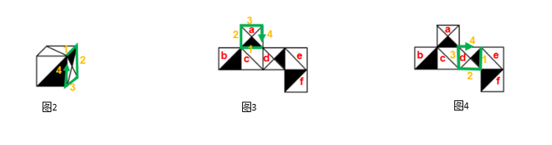

C项：选项中右侧的对角线面，要么是面c，要么是面e，在题干展开图形中，这两个面都与两个黑色直角三角形的直角边相邻（其中面c与面b中的黑色直角三角形的直角边相邻，面e也与另一个直角三角形面f的直角边相邻），而在C选项中，斜对角线与两个黑色的直角三角形的直角边都是不相邻的，故排除；

A、B、C排除，答案选D。

故正确答案为D。

---

### 第 12 题　qid 2028344 · 图形推理

下图中的立体图形①是由立体图形②，③和④组合而成，下列哪一项不能填入问号处？

- **A**. A
- **B**. B　✅
- **C**. C
- **D**. D

**答案**：B

**官方解析**

本题考查立体拼合。题干中①为整体，②③④组合后构成①，其中A、C、D选项均能与②③组合构成①，具体组合方式如下所示：

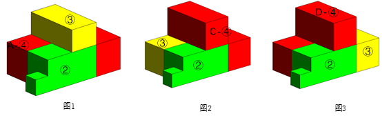

本题为选非题，故正确答案为B。

---

### 第 13 题　qid 2028360 · 图形推理

把下面的六个图形分为两类，使每一类图形都有各自的共同特征或规律，分类正确的一项是：

- **A**. ①④⑥，②③⑤
- **B**. ①②③，④⑤⑥
- **C**. ①⑤⑥，②③④
- **D**. ①③⑤，②④⑥　✅

**答案**：D

**官方解析**

本题为分组分类题目。观察已知图形每个图形中都有小黑点，考虑功能元素。功能元素具有标记作用。观察小黑点在图形中的位置发现：①③⑤图形中小黑点在线上，②④⑥图形中小黑点在交点上。即①③⑤一组，②④⑥一组。
故正确答案为D。

---

### 第 14 题　qid 2028376 · 图形推理

把下面的六个图形分为两类，使每一类图形都有各自的共同特征或规律，分类正确的一项是：

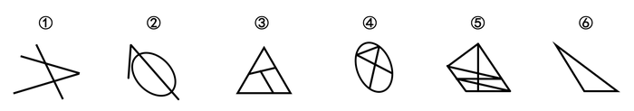

- **A**. ①②⑤，③④⑥
- **B**. ①②③，④⑤⑥
- **C**. ①③⑤，②④⑥　✅
- **D**. ①②⑥，③④⑤

**答案**：C

**官方解析**

本题为分组分类题目。元素组成不同，属性无明显规律，考虑数数。第一个图和第二个图出现了线条之间相交叉，考虑点数量，但并无规律。后发现②是日字形变形，④图形为“田”字变形，考虑笔画数考点。
观察发现，图①③⑤的奇点数均为4，图②④中奇点数为2，⑥无奇点数。即①③⑤为两笔画图形，②④⑥为一笔画图形。
故正确答案为C。

---

### 第 15 题　qid 2028366 · 图形推理

把下面的六个图形分为两类，使每一类图形都有各自的共同特征或规律，分类正确的一项是：

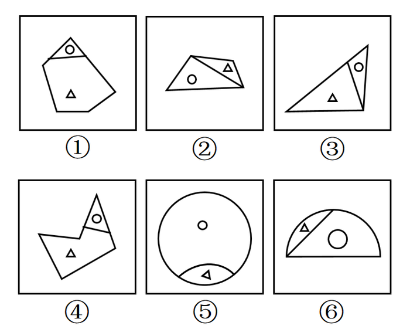

- **A**. ①③④，②⑤⑥　✅
- **B**. ①②⑤，③④⑥
- **C**. ①③⑥，②④⑤
- **D**. ①④⑤，②③⑥

**答案**：A

**官方解析**

本题为分组分类题目。整体观察题干中六个图形，每个图形中均含有相同的元素三角形和圆，且六个图形均被分成了两个大小不同的面。①③④中三角形处于图形面积较大部分，圆处于面积较小部分，②⑤⑥中三角形处于面积较小部分，圆处于面积较大部分。
故正确答案为A。

---

### 第 16 题　qid 2028500 · 定义判断

水利工程是用于控制和调配自然界的地表水和地下水，达到除害兴利目的而修建的工程。
根据上述定义，下列不涉及水利工程的是：

- **A**. 城市污水处理厂利用微生物分解吸收水中的有机物　✅
- **B**. 水电站利用水力发电技术，将水能转化为电能
- **C**. 农业上建设合理开发利用地下水的灌溉设施，以满足作物生长需要
- **D**. 在水利枢纽中设河岸泄洪道以防止因洪水超过水库容量而漫顶造成溃坝

**答案**：A

**官方解析**

第一步：找到定义关键词。
方式：“控制和调配地表水和地下水”；目的：“除害兴利的修建工程”。
第二步：逐一分析选项。
A项：城市污水处理厂利用微生物分解吸收水中的有机物，这一行为不符合定义中的方式，属于环保工程，而非水利工程，不符合定义，当选；
B项：通过水力发电技术，将水能转化为电能，方式目的均符合，符合定义，排除；
C项：合理开发利用地下水的灌溉设施，属于控制和调配地表水和地下水，也达到了满足作物生长的需要，符合定义，排除；
D项：在水利枢纽站设河岸泄洪道，属于控制和调配地表水和地下水的行为，也达到了防止溃坝除害兴利的修建目的，符合定义，排除。
本题为选非题，故正确答案为A。

---

### 第 17 题　qid 2028494 · 定义判断

语句的示意功能是指通过语句表达某种通知、告诫、命令或请求，目的在于要求别人按照语句表达的思想，做出或不做出某种行为。
根据上述定义，下列没有反映语句的示意功能的是：

- **A**. 全体学生请到操场集合
- **B**. 请您务必不要践踏草坪
- **C**. 禁止生产假冒伪劣产品
- **D**. 销售部现在应该在开会　✅

**答案**：D

**官方解析**

第一步：找到定义关键词。
方式：“通过语句表达某种通知、告诫、命令或请求”；目的：“要求别人按照语句表达的思想，做出或不做出某种行为”。
第二步：逐一分析选项。
A项：“全体学生请到操场集合”，属于方式中“通过通知”这一方式，目的也是希望全体同学到操场集合，符合定义，排除；
B项：“请您务必不要践踏草坪”，属于方式中“通过请求”这一方式，目的也是希望不要践踏草坪，符合定义，排除；
C项：“禁止生产假冒伪劣产品”，属于方式中“通过命令”这一方式，目的也是为了禁止生产假冒产品，符合定义，排除；
D项：“销售部现在应该在开会”，这只是一个猜测或判断，并没有体现出题干中“通知、告诫、命令或请求等”方式，不符合定义，当选。
本题为选非题，故正确答案为D。

---

### 第 18 题　qid 2028498 · 定义判断

货币性资产是指持有的现金及将以固定或可确定金额的货币收取的资产，包括现金、应收账款和应收票据以及准备持有至到期的债券等。非货币性资产则是指货币性资产以外的资产，这些资产在将来为企业带来的经济利益（即货币金额）是不固定的或不可确定的。
根据上述定义，下列属于货币性资产的是：

- **A**. 某服装厂的库存货物
- **B**. 某汽车公司用于出租的车辆
- **C**. 某通讯企业旗下手机品牌的商标权
- **D**. 某化工集团按照国家规定获得的技术补贴　✅

**答案**：D

**官方解析**

第一步：找到定义关键词。
“持有的现金及将以固定或可确定金额的货币收取的资产”，即货币金额是固定或可确定的。
第二步：逐一分析选项。
A项：某服装厂的库存货物，其在未来的资产金额可能会受到市场的影响发生变化，是不固定、无法确定的，不符合定义，排除；
B项：用于出租的车辆，其资产金额会受到出租时间长短等诸多因素影响，是不固定、无法确定的，不符合定义，排除；
C项：手机品牌的商标权是一种无形的资产，其货币金额不确定，不符合定义，排除；
D项：技术补贴是按照国家规定所得，说明这些技术补贴的发放金额是按国家标准发放，其金额是固定、可确定的，符合定义，当选。
故正确答案为D。

---

### 第 19 题　qid 2028506 · 定义判断

火力投射密度是指军事行动中军事部门在单位时间内的最大弹药发射量。它是现代军事学中衡量作战部队战斗力的重要指标之一。
根据上述定义，以下属于通过增大火力投射密度来加强部队战斗力的是：

- **A**. 某步兵师在普通士兵中选拔特等射手编入狙击班，进而能够更有效地杀伤敌人的有生力量
- **B**. 某国将其部队列装的半自动步枪全部更换为全自动步枪，增加了子弹的发射频率　✅
- **C**. 某炮兵部队将原计划两小时的炮火掩护时间延长为三小时，更有效地杀伤了掩体中的敌人
- **D**. 某军事科研单位研制出更先进的炮火定位系统，能够将火力打击的误差由半径200米缩小到50米

**答案**：B

**官方解析**

第一步：找到定义关键词。
主体：军事部门；“在单位时间内的最大弹药发射量”，即强调的是单位时间内的发射量。
第二步：逐一分析选项。
A项：在普通士兵中选拔特等射手编入狙击班，而特等射手一般提升的是射击的准确度，与增加单位时间内的最大弹药发射量无关，不符合题干要求，排除；
B项：更换为全自动步枪，增加的是子弹的发射频率，而增加频率就意味着在单位时间内的发射量就会增加，即该项是通过在单位时间内增加发射量提升了部队的战斗力，符合题干要求，当选；
C项：炮火掩护时间由两小时延长为三小时，不符合单位时间内的最大弹药发射量，即该项是通过长时间的发射加强部队的战斗力，并不是在单位时间内增加发射量，不符合题干要求，排除；
D项：火力打击的误差范围缩小，只能说明射击的准确度增强，并看不出单位时间内的弹药发射量是否有增加，不符合题干要求，排除。
故正确答案为B。

---

### 第 20 题　qid 2028504 · 定义判断

埋伏营销是指企业利用媒体和公众对重大事件的关注，通过举办与重大事件相关的活动，使自己与重大事件产生关联，从而引起消费者的联想和媒体的注意。这类营销通常是隐蔽的、突发的，不以赞助者的身份出现，却对自己的品牌悄无声息地进行了宣传。
根据上述定义，下列不属于埋伏营销的是：

- **A**. 某矿泉水公司邀请著名运动员为其代言，并将广告投放在电视媒体的黄金时段和一些大型酒店的视频媒体中　✅
- **B**. 地震发生后，某户外用品公司向灾区捐赠价值100万元的帐篷，并举行了捐赠仪式
- **C**. 某市举办中小学生知识竞赛，一出版集团在现场向参与者免费发放其出版的图书
- **D**. 世界一级方程式锦标赛比赛期间，观众席中时不时会有人挥舞着印有某轮胎企业商标的彩色旗帜

**答案**：A

**官方解析**

第一步：找到定义关键词。
主体：企业；方式：“利用媒体和公众对重大事件的关注”、“举办与重大事件相关的活动，使自己与重大事件产生关联”；目的：“引起消费者的联想和媒体的关注”“对自己的品牌悄无声息地进行了宣传”；特点：“隐蔽、突发”。
第二步：逐一分析选项。
A项：矿泉水公司邀请著名运动员为其代言并投放广告是直接宣传，并没有出现重大事件，宣传特点并不“隐蔽、突发”，不符合定义，当选；
B项：户外用品公司向灾区捐赠帐篷并举行捐赠仪式属于“举办与重大事件相关的活动”，目的是“使自己与救灾行动产生关联，引起媒体的关注”，能够“对自己的品牌悄无声息地进行了宣传”，符合定义，排除；
C项：出版集团在中小学生知识竞赛现场向参与者免费发放其出版的图书符合“举办与重大事件相关的活动”，目的是“使自己与知识竞赛产生关联，引起消费者的联想和媒体的关注”，能够“对自己的品牌悄无声息地进行了宣传”，符合定义，排除；
D项：在方程式锦标赛期间挥舞印有企业商标的旗帜目的是“使自己与重大事件产生关联，引起消费者的联想”，宣传特点“隐蔽”，符合定义，排除。
本题为选非题，故正确答案为A。

---

### 第 21 题　qid 2028510 · 定义判断

著名科学家、科学史学家普赖斯提出：如果K代表参与某一专业领域的人数，那么这个数字的平方根大致等于为这个领域做出一半贡献的排名在前的那部分人的人数。
根据上述定义，下列符合普赖斯观点的是：

- **A**. 某国出版协会统计了本国的期刊，发现与经济有关的期刊大约有150种，所有与经济有关的科研论文中，有一半发表在其中的13种期刊上
- **B**. 某县有20万农业人口，统计发现，过去一年全县的粮食总产量中，大约一半粮食产量是由450位左右的种粮大户贡献的
- **C**. 某组织统计过去一年全世界公开举办的音乐会的演奏曲目，发现所有演奏曲目是由大约250位作曲家完成的，其中大约一半的曲目来自于16位作曲家　✅
- **D**. 某销售奢侈品的网店过去一年的访问量为10万人次，但去年全部的销售额中，大约一半的销售额是由其中大约300位固定客户提供的

**答案**：C

**官方解析**

第一步：找到定义关键词。
“参与某一专业领域的人数”、“这个数字的平方根大致等于为这个领域做出一半贡献的排名在前的那部分人的人数”。
第二步：逐一分析选项。
A项：统计的是期刊种类数量与论文发表的情况，不涉及人数，不符合定义，排除；
B项：农业人口是指没有城镇户口的人，包括外出打工的农民工、放牛放羊的人等，并不完全是种粮者，所以农业人口与种粮大户两个群体不是同一范畴，不符合定义，排除；
C项：250位作曲家是参与作曲的人数，16位作曲家贡献了一半曲目，说的都是作曲家属于同一范畴，250的平方根大致为16人，符合定义“参与某一专业领域的人数平方根大致等于为这个领域做出一半贡献的排名在前的那部分人的人数”，当选；
D项：访问网店的顾客和购买商品的顾客不是同一概念，两个群体不是同一范畴，不符合定义，排除。
故正确答案为C。

---

### 第 22 题　qid 2028508 · 定义判断

自由落体运动是指物体只在重力作用下从静止开始下落的运动。这种运动只有在真空条件下才能发生，在有空气时，如果空气的阻力作用比较小，可以忽略不计，则物体的下落可以近似看作自由落体运动。
根据上述定义，下列可以近似看作自由落体运动的是：

- **A**. 熟透了的苹果从树上被风吹落
- **B**. 飞行中的飞机被导弹击中坠落
- **C**. 抛过来的皮球没被接住，掉在地上
- **D**. 冬日中午，冰棱融化后从屋檐掉下　✅

**答案**：D

**官方解析**

第一步：找出定义关键词。
“只在重力作用下从静止开始下落的运动”“如果空气的阻力作用比较小，近似看作自由落体运动”。
第二步：逐一分析选项。
A项：苹果从树上被风吹落一定受到了横向风的推力，且风力较大，空气阻力也较大，不符合“只在重力作用下运动”，不符合定义，排除；
B项：飞行中的飞机属于高速运动的物体，不符合“从静止开始下落”，不符合定义，排除；
C项：抛过来的皮球属于高速运动的物体，没接住而掉在地上不符合“从静止开始下落”，不符合定义，排除；
D项：冰棱融化后从屋檐掉下符合“从静止开始下落”，且此时没有其他干扰，空气阻力比较小，可近似看作自由落体运动，符合定义，当选。
故正确答案为D。

---

### 第 23 题　qid 2028516 · 定义判断

参照依赖是指个体基于某个参照点对得失价值进行判断，参照点之上，个体感受是收益，反之感受为损失。损失和收益的感知取决于参照点的选择。
根据上述定义，下列不属于参照依赖的是：

- **A**. 张女士因为生育和哺乳不得不暂停工作半年，失去了很多客户，心里很苦恼，但看到自己健康活泼的儿子，又变得高兴起来　✅
- **B**. 小张原本对收入很满意，他听说跟自己同时进公司、现在同是项目经理的小李收入比自己高10%后，对收入没有那么满意了
- **C**. 研究者设计了一项实验：告知被试者他们邻居的月水电支出比他们低，结果发现被试者下个月的家庭能耗显著降低了
- **D**. 姐姐期中考试得了99分，期末考试得了95分，妈妈批评了她；弟弟期中考试得了75分，期末考试得了85分，妈妈奖励了他

**答案**：A

**官方解析**

第一步：找出定义关键词。

“个体基于某个参照点对得失价值进行判断”、“参照点之上感受是收益”、“参照点之下感受为损失”。

第二步：逐一分析选项。

A项：张女士因失去客户而苦恼，和看到健康活泼的儿子而高兴，是对职场和家庭两件不同事件的价值判断，参照点不唯一，不符合“个体基于某个参照点对得失价值进行判断”，不符合定义，当选；

B项：小张的参照点是跟自己同时进公司的小李的收入，小李的收入大于小张的收入，小张的收入处于参照点之下，小张不满意，符合“个体基于某个参照点对得失价值进行判断”、“参照点之下感受为损失”，符合定义，排除；

C项：被试者的参照点是邻居家的水电费，邻居的月水电支出比他们低，被试者下个月的家庭能耗显著降低了，说明被试者觉得花钱多受损失了，在参照点之下，符合“个体基于某个参照点对得失价值进行判断”、“参照点之下感受为损失”，符合定义，排除；

D项：妈妈的参照点是姐姐和弟弟各自的期中考的成绩，姐姐的分数低于自己期中考试的参照点时受到了批评，弟弟的分数高于自己期中考试的参照点时受到了奖励，符合“个体基于某个参照点对得失价值进行判断”、“参照点之上感受是收益”、“参照点之下感受为损失”，符合定义，排除。

本题为选非题，故正确答案为 A。

备注：本题很多同学纠结C项，认为C项没有体现关键词“参照点之上感受是收益”或 “参照点之下感受为损失”，其实大家想想，如果真的没有感受，为什么被试者下个月的家庭能耗显著降低了？其中不就隐含着他觉得自己之前水电支出比邻居高，以邻居家的水电费为参照点，感觉自己损失了，所以符合关键词“参照点之下感受为损失”，如下图所示，C项为参照依赖的典型案例，所以是符合的。

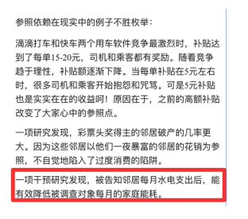

---

### 第 24 题　qid 2028512 · 定义判断

隐匿定位策略是指当一类产品不被消费者看好时，公司能够在不打破产品种类界限的情况下，合法地利用某些策略消除消费者对这类产品的偏见，使消费者转而接受它们，实现更好的销量。
根据上述定义，下列没有运用隐匿定位策略的是：

- **A**. 某公司生产的游戏机销量不佳，公司决定将产品升级并提出创建家庭娱乐平台的概念，该游戏机因此变得畅销
- **B**. 某公司开发了家庭机器人，但消费者并不感兴趣。该公司调整思路，推出一种可爱的、不做家务的机器狗，一上市就大受欢迎
- **C**. 某公司推出一种小型电脑，由于定价高而鲜有问津。该公司在产品宣传中强调其可作为移动数字化设备等，与低端产品区分开，从而打开销路
- **D**. 某公司推出新款SUV车型，但少有人问津，于是公司又推出一款价格昂贵的跑车，消费者觉得SUV性价比更高，纷纷购买　✅

**答案**：D

**官方解析**

本题是一道争议题，通过题干所给定义难以区分BD选项。经粉笔教研，并通过查原文，A、B、C三选项分别对应到原文中的三个案例，因此猜测命题人更倾向于把答案设置为D选项，D没有运用隐匿定位策略。

A选项对应案例：

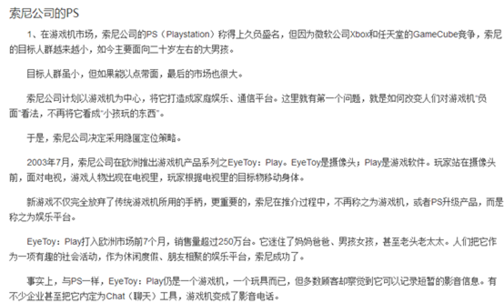

B选项对应案例：

C选项对应案例：

分析：

A项：将产品升级体现了没有打破产品种类界限，提出创建家庭娱乐平台的概念属于合法利用策略消除偏见，最终游戏机获得畅销，符合定义，排除；

B项：“家庭机器人”和“机器狗”是同一类别，没有打破产品种类界限，消费者对该公司的“家庭机器人”并不感兴趣，说明不被消费者看好，于是调整思路，最终使得“家庭机器人”的另一种类别“机器狗”一上市就大受欢迎，符合定义，排除；

C项：某公司宣传强调“小型电脑可作为移动数字化设备”属于合法利用策略消除消费者对产品的偏见，最终打开销路，符合定义，排除；

D项：新款SUV车很少有人问津，不被看好，出台昂贵的跑车,只是在两者之间的价格做了一个比较，让消费者觉得SUV性价比高了，“出台昂贵的跑车”相当于一个参照物，通过粉笔教研发现，D选项实际运用的策略叫做价格锚点，是企业通过价格对比和暗示来营造幻觉的手段，动摇人们对于价值的评估，因此，不符合定义，当选。

提示：本题需要特别注意的是B选项当中机器人和机器狗既不是人也不是狗，二者都属于智能机器，只是造型不同，因此，属于同类产品，而D选项的SUV和跑车无论从造型功能、性能还是对车辆的划分标准上来讲，都不属于同类产品，前者是越野车的范畴，后者是轿车的范畴，因此，B、D两个选项比较起来，D选项更不符合定义。

本题为选非题，故正确答案为D。

【粉笔提示】：该题为理解运用类多定义，需要考生对于题干的定义加以理解，A、B、C选项所涉及的正是隐匿定位策略的三个经典案例。了解案例请复制该链接：

http://baike.baidu.com/link?url=lpP8rmIbN9UbvQL9Zu7KK06zLPgr3HIY_YVJGWUsyuAc7Zt1RZo7RxBYOxViiH_wHRwsl_nG2VG78VawSuOedFp6oiYmZj4nI59ZJMkMk9CZ1lNeM5-vbuZj37BYjiJX

价格锚点定义（更多类似案例可以百度查询）：

http://baike.sogou.com/v71357485.htm?fromTitle=%E4%BB%B7%E6%A0%BC%E9%94%9A%E7%82%B9

---

### 第 25 题　qid 2028522 · 定义判断

传递关系指的是对任意的元素A、B、C来说，若元素A与元素B有某关系并且元素B与元素C有该关系，则元素A与元素C也有该关系。反传递关系指的是若元素A与元素B有某种关系并且元素B与元素C有该关系，但元素A与元素C没有该关系。
根据上述定义，下列关系属于传递关系的是：

- **A**. 自然数中的大于关系　✅
- **B**. 生活中的同学关系
- **C**. 家庭中的父子关系
- **D**. 食物链的天敌关系

**答案**：A

**官方解析**

第一步：找到定义关键词。
传递关系：“A和B有关系且B和C有关系，A和C也有同样的关系”；
反传递关系：“A和B有关系且B和C有关系，A和C没有同样的关系”。
第二步：逐一分析选项。
A项：“自然数中的大于关系”比如三个自然数“5、3、1”，5为A，3为B，1为C，可以推出5＞3＞1，A＞B＞C，符合定义“传递关系”，当选；
B项：“生活中的同学关系”比如小张和小王是小学同学，小王和小李是中学同学，小张和小李不一定是同学关系，不符合定义，排除；
C项：“家庭中的父子关系”比如小张的父亲是老张，老张的父亲是张老，但小张和张老不是父子关系，不符合定义，排除；
D项：“食物链中的天敌关系”比如蛇是壁虎的天敌，壁虎是蚊子的天敌，但蛇和蚊子之间不是天敌关系，不符合定义，排除。
故正确答案为A。

---

### 第 26 题　qid 2028304 · 类比推理

白醋：消毒

- **A**. 热水器：加热
- **B**. 汽油：去渍　✅
- **C**. 白糖：调味
- **D**. 人参：滋补

**答案**：B

**官方解析**

第一步：判断题干词语间逻辑关系。
“白醋”的主要功能是烹调，次要功能是“消毒”，祛除病菌，并且“白醋”是液体，二者是功能的对应关系。
第二步：判断选项词语间逻辑关系。
A项：“加热”是“热水器”的主要功能而不是次要功能，并且“热水器”不是液体，不符合题干逻辑关系，排除；
B项：“汽油”的主要功能是用作燃料，次要功能是“去渍”，去除污垢，并且“汽油”是液体，符合题干逻辑关系，当选；
C项：“调味”是“白糖”的主要功能而不是次要功能，而且“白糖”不是液体，不符合题干逻辑关系，排除；
D项：“滋补”是“人参”的主要功能而不是次要功能，而且“人参”不是液体，不符合题干逻辑关系，排除。
故正确答案为B。

---

### 第 27 题　qid 2028312 · 类比推理

生死：存亡

- **A**. 轻重：缓急
- **B**. 亲疏：长幼
- **C**. 真伪：对错
- **D**. 好坏：优劣　✅

**答案**：D

**官方解析**

第一步：判断题干词语间逻辑关系。
“生死”和“存亡”都表示生命的两种状态，二者是近义词，并且“生”和“存”近义，“死”和“亡”近义。
第二步：判断选项词语间逻辑关系。
A项：“轻重”侧重指力度，而“缓急”侧重指快慢，二者不是近义词，并且无汉字的对应，不符合题干逻辑关系，排除；
B项：“亲疏”一般指关系的亲近程度，而“长幼”指的是辈分的高低，二者不是近义词，并且无汉字的对应，不符合题干逻辑关系，排除；
C项：“真伪”是真假，而“对错”是事情的正确与否，二者侧重的意思不同，不是近义词，并且无汉字的对应，不符合题干逻辑关系，排除；
D项：“好坏”和“优劣”都表示一个事物的好坏两个方面，二者是近义词，并且“好”和“优”近义，“坏”和“劣”近义，符合题干逻辑关系，当选。
故正确答案为D。

---

### 第 28 题　qid 2028310 · 类比推理

成百：上千

- **A**. 三教：九流
- **B**. 三头：六臂
- **C**. 千变：万化　✅
- **D**. 千方：百计

**答案**：C

**官方解析**

第一步：判断题干词语间逻辑关系。
“成百”和“上千”都表示数量多，构成近义关系，并且二者都包含动词，“百”和“千”程度递增。
第二步：判断选项词语间逻辑关系。
A项：“三教”是儒教、道教、佛教，“九流”是儒家、道家、墨家、法家、名家、杂家、农家、纵横家、阴阳家，二者是并列关系，但不包含动词，不符合题干逻辑关系，排除；
B项：“三头”是三个脑袋，“六臂”是六个胳膊，二者是并列关系，但不包含动词，不符合题干逻辑关系，排除；
C项：“千变”和“万化”都表示变化非常多，二者是近义关系，并且都包含动词，“千”和“万”是程度递增，符合题干逻辑关系，当选；
D项：“千方”和“百计”都表示计谋和方法很多，二者是近义关系，但不包含动词，并且从“千”到“百”是程度递减，不符合题干逻辑关系，排除。
故正确答案为C。

---

### 第 29 题　qid 2028316 · 类比推理

踢皮球：互相推诿

- **A**. 燕归巢：时过境迁
- **B**. 破天荒：闻所未闻
- **C**. 睁眼瞎：目不识丁　✅
- **D**. 纸老虎：不堪一击

**答案**：C

**官方解析**

第一步：判断题干词语间逻辑关系。
“踢皮球”常用来形容部门之间职责不清，相互推诿，办事效率低下，故踢皮球可以比喻“相互推诿”。
第二步：判断选项词语间逻辑关系。
A项：“燕归巢”是燕子回到了自己的巢穴，比喻的是思乡；“时过境迁”是指随着时间的推移，情况发生变化。“燕归巢”不能比喻“时过境迁”，不符合题干逻辑关系，排除；
B项：“破天荒”指从来没有出现过的事；“闻所未闻”指听到了从来没听说过的事情。没出现过与没听说过意思有差别，“破天荒”不能比喻“闻所未闻”，不符合题干逻辑关系，排除；
C项：“睁眼瞎”指没文化的人，不识字的人；“目不识丁”形容人不识字或没有学问。“睁眼瞎”可以比喻“目不识丁”，符合题干逻辑关系，当选；
D项：“纸老虎”比喻外强中干的人，装样子吓唬人的；“不堪一击”形容力量薄弱，经不起一次打击。二者意思不同，“纸老虎”不能比喻“不堪一击”，不符合题干逻辑关系，排除。
故正确答案为C。

---

### 第 30 题　qid 2028320 · 类比推理

观众：电视：新闻

- **A**. 士兵：靶场：命令
- **B**. 渔夫：渔船：渔汛
- **C**. 教师：课堂：知识
- **D**. 消费者：消费指南：优惠信息　✅

**答案**：D

**官方解析**

第一步：判断题干词语间逻辑关系。
“观众”是“电视”的主要受众，“电视”是发布“新闻”的一种载体。
第二步：判断选项词语间逻辑关系。
A项：“靶场”是“士兵”的训练场所，“靶场”不是发布“命令”的载体，与题干逻辑关系不符，排除；
B项：“渔船”是“渔夫”捕鱼的工具，“渔船”不是发布“渔汛”的载体，与题干逻辑关系不符，排除；
C项：“课堂”的主要受众是学生而不是“教师”，与题干逻辑关系不符，排除；
D项：“消费者”是“消费指南”的主要受众，“消费指南”也是发布“优惠信息”的一种载体，与题干逻辑关系一致，当选。
故正确答案为D。

---

### 第 31 题　qid 2028318 · 类比推理

战术：战争：胜负

- **A**. 血型：人种：胖瘦
- **B**. 诉状：案件：输赢
- **C**. 策略：竞选：成败　✅
- **D**. 经验：能力：高低

**答案**：C

**官方解析**

第一步：判断题干词语间逻辑关系。
“战争”需要“战术”来指导，并且“胜负”是“战争”可能出现的两种结果，二者是对应关系。
第二步：判断选项词语间逻辑关系。
A项：“血型”是指血液成分表面的抗原类型，“人种”是具有共同遗传体质特征的人类群体，人有“胖瘦”之分，“血型”不能指导人种，并且“胖瘦”也不是结果，不符合题干逻辑关系，排除；
B项：“诉状”是指一方当事人为维护或者实现自身的权益，依法向人民法院提出某种诉讼请求，并陈诉有关事实和理由，或者另一方当事人针对一方当事人的诉讼请求和理由提出抗辩的法律文书，不是用来指导“案件”的，“输赢”是“案件”可能出现的两种结果，不符合题干逻辑关系，排除；
C项：“竞选”需要“策略”来指导，“竞选”可能有“成败”两种结果，符合题干逻辑关系，当选；
D项：“能力”和“经验”是并列关系，并且“能力”有“高低”之分，不符合题干逻辑关系，排除。
故正确答案为C。

---

### 第 32 题　qid 2028324 · 类比推理

寒：寒冷：寒舍

- **A**. 甘：甘甜：甘愿　✅
- **B**. 恨：仇恨：怨恨
- **C**. 肤：皮肤：肌肤
- **D**. 讽：讽刺：讥讽

**答案**：A

**官方解析**

第一步：判断题干词语间逻辑关系。
“寒”字有两个主要的语义：冷；穷困（有时用作谦辞）。“寒冷”一词中的“寒”指的是冷，寒舍一词中的“寒”指的是穷困。
第二步：判断选项词语间逻辑关系。
A项：“甘”字有两个主要的语义：甜，味道好；自愿，乐意。“甘甜”中的“甘”指的是甜，甘愿中的“甘”指的是自愿，与题干逻辑关系一致，当选；
B项：“仇恨”“怨恨”中的“恨”指的都是仇视的意思，与题干逻辑关系不一致，排除；
C项：“皮肤”“肌肤”中的“肤”指的都是肉体表面的皮，与题干逻辑关系不一致，排除；
D项：“讽刺”“讥讽”中的“讽”指的都是用含蓄的话讥刺，与题干逻辑关系不一致，排除。
故正确答案为A。

---

### 第 33 题　qid 2028326 · 类比推理

设计：发放：问卷

- **A**. 播放：快进：磁带
- **B**. 制定：执行：政策　✅
- **C**. 复制：修改：文字
- **D**. 预习：复习：考试

**答案**：B

**官方解析**

第一步：判断题干词语间逻辑关系。
“设计问卷”“发放问卷”构成动宾关系，且“设计”和“发放”有先后顺序（设计在前，发放在后）。
第二步：判断选项词语间逻辑关系。
A项：“播放磁带”构成动宾关系，但“快进”是不及物动词，后面不能跟宾语，与题干逻辑关系不一致，排除；
B项：“制定政策”“执行政策”构成动宾关系，且“制定”和“执行”也有先后顺序（制定在前，执行在后），与题干逻辑关系一致，当选；
C项：“复制文字”“修改文字”构成动宾关系，但“复制”和“修改”之间没有必然的先后顺序，与题干逻辑关系不一致，排除；
D项：“复习考试”和“预习考试”搭配不当，与题干逻辑关系不一致，排除。
故正确答案为B。

---

### 第 34 题　qid 2028328 · 类比推理

教案 对于 （  ） 相当于 （  ） 对于 分类

- **A**. 课件；信息
- **B**. 教学；归类
- **C**. 提纲；商品
- **D**. 授课；标准　✅

**答案**：D

**官方解析**

将选项逐一代入，判断各选项前后部分的逻辑关系。
A项：“教案”与“课件”是并列关系，“教案”是包含教学内容、教学步骤、板书设计等内容的集合，“课件”是包含授课过程中使用的文字、声音、图像等素材的集合；“信息”是名词，“分类”是动词，构成的是动宾短语，故前后逻辑关系不一致，排除；
B项：“教案”是进行“教学”的依据，二者为对应关系；“归类”与“分类”是近义关系，前后逻辑关系不一致，排除；
C项：“教案”中包含了教学内容的“提纲”，是包容关系；“商品”是名词，“分类”是动词，构成“分类商品”的动宾短语，与前一组逻辑关系不一致，排除；
D项：“教案”是进行“授课”的依据，二者为对应关系；“标准”是进行“分类”的依据，二者为对应关系，前后逻辑关系一致，当选。
故正确答案为D。

---

### 第 35 题　qid 2028330 · 类比推理

故人西辞黄鹤楼 对于 （  ） 相当于 （  ） 对于 怀古

- **A**. 出游；越王勾践破吴归
- **B**. 场所；千古兴亡多少事
- **C**. 送别；折戟沉沙铁未销　✅
- **D**. 离别；西出阳关无故人

**答案**：C

**官方解析**

将选项逐一代入，判断各选项前后部分的逻辑关系。
A项：“故人西辞黄鹤楼”出自李白的《黄鹤楼送孟浩然之广陵》，表达的是“送别”之情，与“出游”无关，“越王勾践破吴归”出自李白的《越中览古》，是一篇“怀古”之作，前后逻辑关系不一致，排除；
B项：“故人西辞黄鹤楼”表达的是“送别”之情，不是黄鹤楼这个“场所”，“千古兴亡多少事”出自辛弃疾的“怀古”之作《南乡子·登京口北固亭有怀》，前后逻辑关系不一致，排除；
C项：“故人西辞黄鹤楼”表达的是“送别”之情，“折戟沉沙铁未销”出自唐代诗人杜牧的《赤壁》，表达的是“怀古”之情，前后逻辑关系一致，当选；
D项：“西出阳关无故人”出自王维的《送元二使安西》，表达的是“离别”之情，与“怀古”无关，前后逻辑关系不一致，排除。
故正确答案为C。

---

### 第 36 题　qid 2028368 · 逻辑判断

某网购平台发布了一份网购调研报告，分析亚洲女性的网购特点。分析显示，当代亚洲女性在网购服饰、化妆品方面的决定权为，在网购家居用品方面的决定权为。研究者由此认为，那些喜爱网购的亚洲女性在家庭中拥有更大的控制权。

以下哪项如果为真，最能反驳上述结论？

- **A**. 
喜爱网购的亚洲女性的网购支出只占其家庭消费支出的
　✅
- **B**. 
亚洲女性中，习惯上网购物的人数只占女性总人数的左右

- **C**. 
亚洲女性在购买贵重商品时往往会与丈夫商量，共同决定

- **D**. 
一些亚洲女性经济不独立，对家庭收入没有贡献

**答案**：A

**官方解析**

第一步：找到论点论据。

论点：那些喜爱网购的亚洲女性在家庭中拥有更大的控制权。

论据：当代亚洲女性在网购服饰、化妆品方面的决定权为，在网购家居用品方面的决定权为。

第二步：逐一分析选项。 A项：喜爱网购的亚洲女性的网购支出只占其家庭消费的，说明女性网购部分的支出在家庭消费中比重不大，并不起控制性作用，即的消费不足以证明在家庭消费中起控制作用，削弱论证，当选；

B项：习惯上网购物的人数只占女性总人数的左右，说明喜爱网上购物的女性占比不高，但喜欢购物的女性的占比与喜爱网购的亚洲女性在家中的控制权情况无关，属于无关选项，排除；

C项：购买贵重物品会和丈夫商量，但不确定贵重物品占购买总物品的比例大小，属于不明确选项，排除；

D项：一些亚洲女性经济不独立，是否为喜爱网购的亚洲女性不确定，而经济不独立与控制权之间也没有必然的联系，属于无关选项，排除。

故正确答案为A。

---

### 第 37 题　qid 2028414 · 逻辑判断

针对地球冰川的研究发现，当冰川之下的火山开始喷发后，会快速产生蒸汽流，爆炸式穿透冰层，释放灰烬进入高空，并且产生出沸石、硫化物和黏土等物质。日前人们发现，在火星表面的一些圆形平顶山丘也探测到这些矿物质，并且广泛而大量地存在。因此，人们推测火星早期是覆盖着冰原的，那里曾有过较多的火山活动。
要得到上述结论，需要补充的前提是：

- **A**. 近日火星侦察影像频谱仪发现，火星南极存在火山
- **B**. 火星地质活动不活跃，地表地貌大部分形成于远古较活跃的时期
- **C**. 沸石、硫化物和黏土这三类物质是仅在冰川下的火山活动后才会产生的独特物质　✅
- **D**. 在火星平顶山丘的岩石中发现了某种远古细菌，说明这里很可能曾经有水源

**答案**：C

**官方解析**

第一步：找到论点论据。
论点：人们推测火星早期是覆盖着冰原的，那里曾有过较多的火山活动。
论据：在火星表面的一些圆形平顶山丘也探测到地球冰川下的火山喷发产生的沸石、硫化物和黏土等物质。
第二步：逐一分析选项。
A项：火星南极存在火山，是目前的情况，与火星早期如何无关，更无法确定是否会有较多的火山活动，无关选项，排除；
B项：火星地质不活跃，与火星早期是否有冰原无关，更无法确定是否会有较多的火山活动，无关选项，排除；
C项：强调沸石、硫化物和黏土是冰川下火山活动产生的独特物质，二者之间搭桥，是论证成立的前提，当选；
D项：远古细菌与水源与题干中的火星冰川以及很多火山活动无关，无关选项，排除。
故正确答案为C。

---

### 第 38 题　qid 2028404 · 逻辑判断

阿尔茨海默病是一种较为严重的疾病，4号基因突变曾被认为是阿尔茨海默病的一项致病因素。但近期有科学家提出导致这一复杂疾病的病因可能很简单，就是一些能引起脑部感染的微生物，如HSV-1病毒。
以下哪项如果为真，最能支持上述科学家的观点？

- **A**. 携带4号突变基因同时感染了HSV-1病毒的人群罹患阿尔茨海默病的概率会比单独具有此类突变基因的群体高2倍　✅
- **B**. 当大鼠脑部受到HSV-1感染时，携带4号突变基因的大鼠产生的病毒DNA是正常大鼠的14倍
- **C**. 有些携带4号突变基因的患者使用抗病毒药物治疗后，其病情有所好转
- **D**. 在一些健康老年人的大脑中也存在着HSV-1病毒

**答案**：A

**官方解析**

第一步：找到论点和论据。
论点：导致这一复杂疾病（阿尔茨海默病）的病因可能很简单，就是一些能引起脑部感染的微生物，如HSV-1病毒。
论据：无。
第二步：逐一分析选项。
A项：说明感染HSV-1病毒的人比不感染此类病毒的人得阿尔茨海默病的概率高，说明HSV-1病毒与阿尔茨海默病呈正相关，是举例加强论点，当选；
B项：大鼠受HSV-1病毒感染后产生病毒DNA，与阿尔茨海默病无关，属于无关选项，排除；
C项：治病措施与得病原因话题不一致，与论点阿尔茨海默病的得病原因无关，属于无关选项，排除；
D项：健康人大脑中有此类病毒，但不能说明患有阿尔茨海默病的病因是否为此类病毒，属于无关选项，排除。
故正确答案为A。

---

### 第 39 题　qid 2028380 · 逻辑判断

复活节岛是位于太平洋上的一座孤岛。在报道中，复活节岛文明的衰落常作为一个警世故事，讲述人类肆意采伐棕榈树林，致使肥沃的土壤流失，最终导致岛中食物短缺，文明自此衰落。然而近日有专家提出，复活节岛文明的衰落与树木砍伐并无必然联系。
以下哪项如果为真，最能支持上述专家的观点？

- **A**. 大约公元1200年，岛上居民开始砍伐棕榈树，用于建造木船，运送大型石质雕像
- **B**. 考古发现，当岛上最后的树木（棕榈树）被砍伐之后，仍有大量原住居民生活着，其农业耕作的水平没有下降　✅
- **C**. 花粉分析表明，早在公元800年，森林的毁灭就已经开始，岛屿地层中的大棕榈树和其他树木的花粉越来越少
- **D**. 1772年荷兰殖民者开始登陆复活节岛，并对当地居民进行奴役，那时岛上的土著人口是4000人，到1875年时仅有200人

**答案**：B

**官方解析**

第一步：找到论点和论据。
论点：复活节岛文明的衰落与树木砍伐并无必然联系。
论据：无。
第二步：逐一分析选项。
A项：选项中只提到了树木砍伐造船运输雕像，但对与岛上居民以及其文明衰落没有涉及，属于无关选项，排除；
B项：选项说明即使树木全部被砍伐，农耕水平都没有下降，即表明文明并没有因为树木砍伐而影响岛上居民的生活，说明砍伐树木与文明的衰落没有关系，直接补充论据支持论点，当选；
C项：选项只提到了森林毁灭，未提到文明衰落，题干也未涉及此地文明衰落的具体时间，属于无关选项，排除；
D项：殖民者登陆后岛上居民减少，居民的减少是否与树木砍伐有关不知道，不能支持，排除。
故正确答案为B。

---

### 第 40 题　qid 2028412 · 逻辑判断

研究显示，约200万年前，人类开始使用石器处理食物，例如切肉和捣碎植物。与此同时，人类逐渐演化形成较小的牙齿和脸型，以及更弱的咀嚼肌和咬力。因此研究者推测，工具的使用减弱了咀嚼的力量，从而导致人类脸型的变化。
以下哪项如果为真，最能削弱上述研究者的观点？

- **A**. 对与人类较为接近的灵长类动物进行研究，发现它们白天有一半时间用于咀嚼，它们的口腔肌肉非常发达、脸型也较大
- **B**. 200万年前人类食物类型发生了变化，这加速了人类脸型的变化　✅
- **C**. 在利用石器处理食物后，越来越多的食物经过了程度更高的处理，变得易于咀嚼
- **D**. 早期人类进化出较小的咀嚼结构，这一过程使其他变化成为可能，比如大脑体积的增大

**答案**：B

**官方解析**

第一步：找出论点和论据。
论点：工具的使用减弱了咀嚼的力量，从而导致人类脸型的变化。
论据：约200万年前，人类开始使用石器处理食物，同时，人类逐渐演化形成较小的牙齿和脸型，以及更弱的咀嚼肌和咬力。
第二步：逐一分析选项。
A项：与人类接近的灵长类动物咀嚼时间长脸型更大，说的是灵长类动物，而不是论点提到的人类，无关项，排除；
B项：指出人类食物类型的变化加速了人类脸型的变化，同一时间其他的原因影响了人类的脸型，属于他因削弱，当选；
C项：说明工具的使用使得食物变得易于咀嚼，补充论据支持了论点的前半句话，不能削弱，排除；
D项：大脑体积的增大与脸型变化无关，无关项，排除。
故正确答案为B。

---
