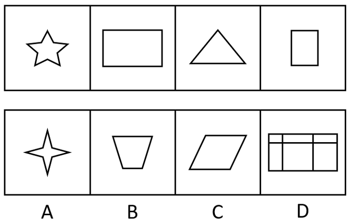
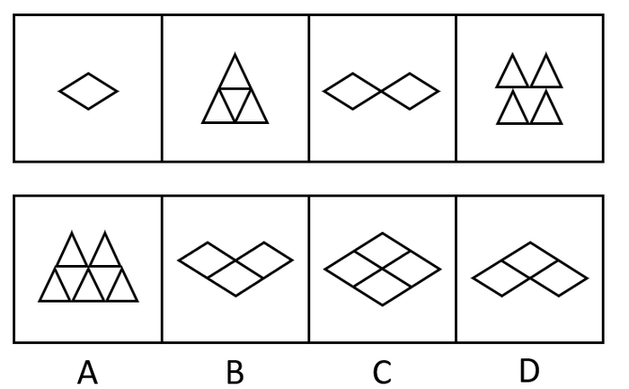
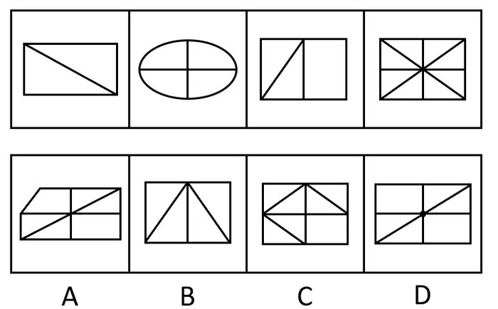

# 2017年天津市选调生选拔考试 综合知识试卷（精选）

> 判断推理 · 15 题 · 天津 2017

## 第 1 题　qid 2261644 · 类比推理

滑板：运动

- **A**. 药：治病　✅
- **B**. 饮料：果汁
- **C**. 电影：广告
- **D**. 新闻：报纸

**答案**：A

**官方解析**

第一步：判断题干词语间逻辑关系。
滑板是用来运动的，二者之间为物品与用途之间的对应关系。
第二步：判断选项词语间逻辑关系。
A项：药是用来治病的，二者之间为物品与用途之间的对应关系，与题干逻辑关系一致，当选；
B项：果汁是一种饮料，二者为包容关系中的种属关系，与题干逻辑关系不一致，排除；
C项：电影中间可以插播广告，电影是广告宣传的一种载体，与题干逻辑关系不一致，排除；
D项：报纸是刊登新闻的一种载体，与题干逻辑关系不一致，排除。
故正确答案为A。

---

## 第 2 题　qid 2261645 · 类比推理

侵蚀：削弱

- **A**. 压缩：服从
- **B**. 联合：净化
- **C**. 增加：扩大　✅
- **D**. 坚持：改进

**答案**：C

**官方解析**

第一步：判断题干词语间逻辑关系。
侵蚀是指逐渐侵害使受消耗或损害，与削弱为近义词关系。
第二步：判断选项词语间逻辑关系。
A项：压缩是指加以压力，以减小体积、大小、持续时间、密度和浓度等，与服从无明显的逻辑关系，与题干逻辑关系不一致，排除；
B项：联合是指结合在一起的，共同的意思，与净化无明显的逻辑关系，与题干逻辑关系不一致，排除；
C项：增加和扩大为近义关系，与题干逻辑关系一致，当选；
D项：坚持是指坚决保持、维护或进行，与改进没有明显的逻辑关系，与题干逻辑关系不一致，排除。
故正确答案为C。

---

## 第 3 题　qid 2261646 · 类比推理

阅读：技能

- **A**. 种瓜：技巧
- **B**. 焊接：技术　✅
- **C**. 浏览：才华
- **D**. 作诗：天赋

**答案**：B

**官方解析**

第一步：判断题干词语间逻辑关系。
阅读是一种技能，二者之间为包容关系的种属关系。
第二步：判断选项词语间逻辑关系。
A项：种瓜需要技巧，但是种瓜本身不是一种技巧，与题干逻辑关系不一致，排除；
B项：焊接是一种技术，二者之间为包容关系的种属关系，与题干逻辑关系一致，当选；
C项：浏览和才华没有直接的逻辑关系，与题干逻辑关系不一致，排除；
D项：作诗需要天赋，但其本身不是一种天赋，与题干逻辑关系不一致，排除。
故正确答案为B。

---

## 第 4 题　qid 2261647 · 类比推理

面粉：小麦

- **A**. 大米：稻谷　✅
- **B**. 桔子：葡萄
- **C**. 饼干：面粉
- **D**. 罐头：菠萝

**答案**：A

**官方解析**

第一步：判断题干词语间逻辑关系。
面粉由小麦磨制而成，小麦是面粉的原材料，并且是必然原材料，二者为对应关系。
第二步：判断选项词语间逻辑关系。
A项：大米是由稻谷去壳后而成，稻谷是大米的原材料，并且是必然原材料，二者为对应关系，与题干逻辑关系一致，当选；
B项：桔子和葡萄都属于水果，二者为并列关系，与题干逻辑关系不一致，排除；
C项：饼干是由面粉、水、鸡蛋、牛奶等烤制而成，面粉是制成饼干的一种配料，与题干逻辑关系不一致，排除；
D项：罐头可以是菠萝、水、糖调制而成的菠萝罐头，菠萝是制成罐头的一种材料，但并不是必然原材料，与题干逻辑关系不一致，排除。
故正确答案为A。

---

## 第 5 题　qid 2261648 · 类比推理

水果：苹果

- **A**. 香梨：黄梨
- **B**. 树木：树枝
- **C**. 宝马：奔驰
- **D**. 山：高山　✅

**答案**：D

**官方解析**

第一步：判断题干词语间逻辑关系。
苹果是一种水果，二者为包容关系中的种属关系。
第二步：判断选项词语间逻辑关系。
A项：香梨和黄梨都是梨的一种，二者为并列关系，与题干逻辑关系不一致，排除；
B项：树枝是树木的一部分，二者为包容关系中的组成关系，与题干逻辑关系不一致，排除；
C项：奔驰和宝马是汽车的两个品牌，二者为并列关系，与题干逻辑关系不一致，排除；
D项：高山是山的一种，二者为包容关系中的种属关系，与题干逻辑关系一致，当选。
故正确答案为D。

---

## 第 6 题　qid 2261649 · 逻辑判断

四个人在讨论一位明星的年龄。甲说：她不会超过25岁；乙说：她不会超过30岁；丙说：她的年龄绝对在35岁以上；丁说：她的岁数在40岁以下。实际上只有一个人说对了。那么正确的是（  ）。

- **A**. 甲说得对
- **B**. 她的年龄在40岁以上　✅
- **C**. 她的岁数在35-40岁之间
- **D**. 丁说得对

**答案**：B

**官方解析**

第一步：分析题干条件。
①甲：小于或等于25；
②乙：小于或等于30；
③丙：大于35；
④丁：小于40。
第二步：根据题干条件分析选项。
根据题干“只有一个人说对了”，说明题干条件不确定，优先代入法。
A项代入：如果甲说的对的话，那么乙和丁说的也一定正确，与题干条件不符，排除；
B项代入：如果年龄在40岁以上的话，甲、乙、丁一定说错，只有丙说对，符合题干条件，当选；
C项代入：如果在35-40岁之间，那么甲、乙说错，丙、丁说对，与题干条件不符，排除；
D项代入：如果丁说对了，那么甲、乙、丙三个人的说法不确定是否正确，与题干条件不符，排除。
故正确答案为B。

---

## 第 7 题　qid 4754711 · 逻辑判断

科学家在运用理性的逻辑思维进行创造发明的过程中，其丰富的想象力、对客观世界敏锐的洞察、表现真理的方式和执着求索的热情，无不与艺术的形象思维相连。同样，艺术家在展开想象的翅膀自由翱翔之际，如果没有科学的世界观和方法论为先导，不借助逻辑思维，其艺术作品也难以显示崇高的精神境界与无穷的魅力。
由此可以推出：

- **A**. 科学与艺术正在逐渐趋同
- **B**. 学习文学艺术之前，首先要进行基础的逻辑思维训练
- **C**. 科学与艺术需相互借鉴各自的思维方式　✅
- **D**. 学习物理、化学之前，应先学习音乐、绘画等基础艺术科目

**答案**：C

**官方解析**

本题为日常结论题，根据题干信息逐一分析选项。
A项：题干说的是科学家和艺术家会相互借鉴对方的思维方式，没有提及科学和艺术是否趋同，无法推出，排除；
B项：根据题干第二句话可知，艺术家会借助逻辑思维，并未说明学习艺术之前“首先”要进行逻辑思维训练，无法推出，排除；
C项：题干第一句描述了科学家运用艺术家的思维，第二句描述了艺术家运用科学家的思维，说明科学与艺术会相互借鉴思维方式，可以推出，当选；
D项：根据题干第一句话可知，科学家会运用艺术思维，并未说明学习物理、化学之前应“先”学习艺术科目，无法推出，排除。
故正确答案为C。

---

## 第 8 题　qid 2261650 · 逻辑判断

小魏、小雷和小李三个同学在讨论刚参加完的高考。小魏很有把握地说：“我肯定能考上重点大学。”小雷犹豫了一下才说：“重点大学我考不上了。”小李说：“要是不论重点或不重点，我考上是没问题的。”结果表明，三人中一人考上了重点大学，一人考上一般大学，另一人则没考上大学。而且预言中只有一个人说对了，而另外两人的预言都与事实相反。
如果上述情况属实，那么考上重点大学、一般大学和没考上大学的名单顺序是（  ）。

- **A**. 小魏、小李和小雷
- **B**. 小雷、小李和小魏　✅
- **C**. 小魏、小雷和小李
- **D**. 小雷、小魏和小李

**答案**：B

**官方解析**

第一步：翻译题干。
①小魏：小魏能考上重点；
②小雷：小雷考不上重点；
③小李：小李能考上大学。
根据题干“预言中只有一个人说对了，而另外两人的预言都与事实相反”，说明题干条件不确定，优先代入法。
第二步：逐一分析选项。
A项代入：小魏、小李和小雷三个人都预言对了，与题干条件不符，排除；
B项代入：小雷、小魏预言错误，小李预言对了，符合题干条件，当选；
C项代入：小魏、小雷预言对了，小李预言错误，与题干条件不符，排除；
D项代入：小魏、小李和小雷三个人都预言错误，与题干条件不符，排除。
故正确答案为B。

---

## 第 9 题　qid 4754704 · 逻辑判断

写作要有题目，就是要有中心思想，要有内容，目的性要明确。没有目的的文章，尽管文理通顺，语气连贯，但是内容空洞，只能归为废话一类，不写为好。因此：

- **A**. 写作必须要有题目，这是最重要的
- **B**. 有些文章全篇都是废话，不知他在说什么
- **C**. 有内容的文章才有目的性
- **D**. 写作要有一个明确的目的，这样才有内容　✅

**答案**：D

**官方解析**

本题为日常结论题，根据题干信息逐一分析选项。
A项：根据题干第一句可知“写作要有题目”，但选项中的“最重要”表述过于绝对，无法推出，排除；
B项：根据题干可以推出有些文章“只能归为废话一类”，但没有提及别人是否能理解这些文章，无法推出“不知他在说什么”，排除；
C项：题干第二句话“没有目的的文章，尽管文理通顺，语气连贯，但是内容空洞”，强调了目的对内容的重要性，即有目的才有内容，选项与题干表述不一致，无法推出，排除；
D项：题干第二句话“没有目的的文章，尽管文理通顺，语气连贯，但是内容空洞”，强调了目的对内容的重要性，即有目的才有内容，可以推出，当选。
故正确答案为D。

---

## 第 10 题　qid 4754717 · 逻辑判断

金刚石与石墨同属于碳元素构成，但性质相差极远。金刚石坚硬无比，石墨却比较柔软。研究发现，其性能差异的根源在于碳原子的排列结构不同。
这说明：

- **A**. 金刚石比石墨更具有军事和工业价值
- **B**. 排列顺序和结构的不同可能引起物质的飞跃　✅
- **C**. 金刚石中的碳原子排列紧密，石墨中的碳原子排列松散
- **D**. 任何事物都是矛盾的统一体

**答案**：B

**官方解析**

本题为日常结论题，根据题干信息逐一分析选项。
A项：题干中没有涉及到金刚石和石墨的军事和工业价值，无中生有，无法推出，排除；
B项：根据“金刚石坚硬无比，石墨却比较柔软”和“研究发现，其性能差异的根源在于碳原子的排列结构不同”可知，以金刚石和石墨为例，可以推出排列顺序和结构的不同可能引起物质的飞跃，可以推出，当选；
C项：题干中只是说“碳原子的排列结构不同”，没有具体指出金刚石中和石墨中的碳原子排列是紧密还是松散，无法推出，排除；
D项：题干没有涉及任何事物都是矛盾的统一体，无中生有，无法推出，排除。
故正确答案为B。

---

## 第 11 题　qid 2631957 · 图形推理

从所给四个选项中，选出唯一的一项作为题干的第五个图，使之呈现一定规律性：

- **A**. A　✅
- **B**. B
- **C**. C
- **D**. D

**答案**：A

**官方解析**

解析一：元素组成不同，优先考虑属性规律。题干图形比较规整，考虑对称性。观察发现，题干图形均为轴对称图形，且只有一条竖直对称轴，因此第五个图也应为只有一条竖直对称轴的轴对称图形，只有C项符合。
故正确答案为C。
解析二：观察图形特征，题干中第三个图为“日”字变形图，第四个图为五角星，选项中出现多端点图形，均为笔画数特征图，考虑笔画数。观察发现，题干图形均为一笔画图形，只有A项符合。
故正确答案为A。
本题不是特别严谨，两种规律都有答案，考生重点学习解题思路即可。因笔画数特征更为明显，且同套题目的五道题目中已经出现考查对称性的题目，因此粉笔更倾向于选A。

---

## 第 12 题　qid 2631962 · 图形推理

从所给四个选项中，选出唯一的一项作为题干的第五个图，使之呈现一定规律性：

- **A**. A
- **B**. B　✅
- **C**. C
- **D**. D

**答案**：B

**官方解析**

元素组成不同，优先考虑属性规律。观察发现，题干图形中出现等腰三角形，选项中出现等腰梯形和平行四边形，均为对称性特征图，因此考虑对称性。题干中第一、三个图形仅为轴对称图形，第二、四个图形既为轴对称又为中心对称图形，因此第五个图形应仅为轴对称图形，只有B项符合。
故正确答案为B。

---

## 第 13 题　qid 2631968 · 图形推理

从所给四个选项中，选出唯一的一项作为题干的第五个图，使之呈现一定规律性：

- **A**. A　✅
- **B**. B
- **C**. C
- **D**. D

**答案**：A

**官方解析**

方法一：元素组成不同，优先考虑属性规律。观察发现，题干图形比较规整，考虑对称性。题干图形分别为仅轴对称，轴对称+中心对称，仅轴对称，轴对称+中心对称，接下来应为仅轴对称图形。
故正确答案为B。
方法二：元素组成不同，且出现较多的多边形，每个图形均由直线组成，考虑数直线数。题干图形直线数量分别为3、4、5、6，故第五个图应为直线数量为7的图形，A项为7条直线，B项为3条直线，C项为1条曲线，D项为5条直线。
故正确答案为A。
本题不是特别严谨，两种规律都有答案，考生重点学习解题思路即可。因多边形特征和直线数递减规律明显，且同套题目的五道题目中已经出现考查对称性的题目，因此粉笔更倾向于选A。

---

## 第 14 题　qid 2631971 · 图形推理

从所给四个选项中，选出唯一的一项作为题干的第五个图，使之呈现一定规律性：

- **A**. A
- **B**. B
- **C**. C
- **D**. D　✅

**答案**：D

**官方解析**

方法一：元素组成不同，优先考虑属性规律。观察发现题干图形比较规整，考虑对称性。题干图形分别为轴对称中心对称，仅轴对称，轴对称中心对称，仅轴对称，第五个图应为轴对称中心对称图形，只有C项符合。

故正确答案为C。

方法二：观察发现图中出现菱形和三角形两种小元素，图二和图四中三角形面数为4、5，图一和图三中菱形的个数依次为1、2，故第五个图应为3个菱形，排除A、C两项。再次观察，图四中增加的三角形出现在上方，排除B项。

故正确答案为D。

本题不是特别严谨，两种规律都有答案，考生重点学习解题思路即可。因相同元素特征比较明显，且同套题目的五道题目中已经出现考查对称性的题目，因此粉笔更倾向于选D。

---

## 第 15 题　qid 2631977 · 图形推理

从所给四个选项中，选出唯一的一项作为题干的第五个图，使之呈现一定规律性：

- **A**. A
- **B**. B　✅
- **C**. C
- **D**. D

**答案**：B

**官方解析**

元素组成不同，且无明显属性规律，考虑数量规律。题干出现较多直线和封闭区间，但是直线和面数量都没有规律。继续观察每幅图都出现明显的线线相交，考虑交点数。题干图形交点数分别为4、5、6、9，整体数无规律，且题干图形存在明显的外框，考虑内外交点数。观察发现，题干图形内部交点分别为0、1、0、1，故第五个图应为0个内部交点的图形，只有B项符合。
故正确答案为B。

---
