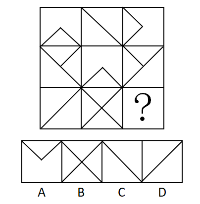
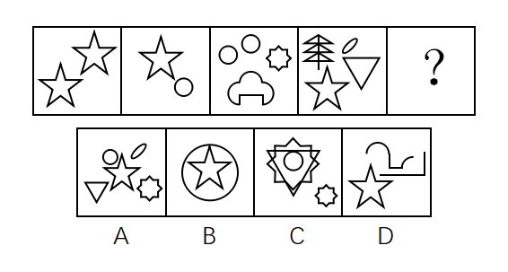
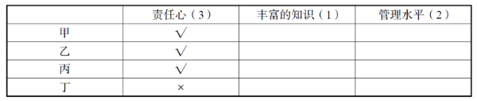
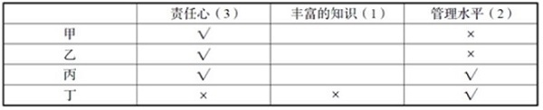

# 2017年天津滨海新区公务员考试《行测》题（网友回忆版）

> 判断推理 · 35 题 · 天津 2017

## 第 1 题　qid 2139586 · 图形推理

从所给四个选项中，选择最合适的一个填入问号处，使之呈现一定的规律性：

- **A**. A
- **B**. B
- **C**. C
- **D**. D　✅

**答案**：D

**官方解析**

元素组成不同，且属性无规律，考虑数量规律。观察发现，左边一组图都是2部分图形，右边一组图的前两幅图都是2部分，问号处应当填一个2部分图形，排除A、C两项；进一步观察发现，题干所有图形都是相离的图形间关系，只有D项符合。
故正确答案为D。

---

## 第 2 题　qid 2139602 · 图形推理

从所给四个选项中，选择最合适的一个填入问号处，使之呈现一定的规律性：

- **A**. A
- **B**. B
- **C**. C
- **D**. D　✅

**答案**：D

**官方解析**

元素组成不同，且无明显属性规律，考虑数量规律。观察发现，题干图形存在明显的封闭区域，优先考虑数面。九宫格优先看横行，第一行图形均有1个面，第二行图形均有3个面，第三行前两幅图形均有4个面，即每行图形的面数量相等，因此“？”处应为有4个面的图形。A项有1个面，B项有5个面，C项有7个面，D项有4个面，只有D项符合。
故正确答案为D。

---

## 第 3 题　qid 2139590 · 图形推理

从所给四个选项中，选择最合适的一个填入问号处，使之呈现一定的规律性：

- **A**. A
- **B**. B
- **C**. C
- **D**. D　✅

**答案**：D

**官方解析**

图形元素组成不同，且无明显属性规律，考虑数量规律。观察发现，第一组图均由黑色正方形组成，且黑色正方形的个数依次为1、4、16，后一幅图中黑色正方形的个数均为前一幅图的4倍。第二组图形中，前两幅图均由黑色三角形组成，且黑色三角形的个数依次是1、3，后一幅图中黑色三角形的个数为前一幅图的3倍，依据此规律，问号处应为有9个黑色三角形的图形，A项为16个，B项为12个，C项为10个，D项为9个。
故正确答案为D。

---

## 第 4 题　qid 2139604 · 图形推理

从所给四个选项中，选择最合适的一个填入问号处，使之呈现一定的规律性：

- **A**. A
- **B**. B
- **C**. C　✅
- **D**. D

**答案**：C

**官方解析**

图形元素组成相似，相同的线条重复出现，优先考虑样式规律中的运算规律。九宫格优先看横行，第一行中图1与图2去同求异后得到图3，第二行同样满足此规律。第三行应遵循该规律，图1和图2去同求异后，相同的左斜线应去掉，不同的右斜线应保留，只有C项符合。
故正确答案为C。

---

## 第 5 题　qid 2139588 · 图形推理

从所给四个选项中，选择最合适的一个填入问号处，使之呈现一定的规律性：

- **A**. A　✅
- **B**. B
- **C**. C
- **D**. D

**答案**：A

**官方解析**

元素组成不同，且无明显属性规律，考虑数量规律。观察发现每个图形均由独立小元素组成，优先考虑数元素的种类和个数。题干图形元素种类分别为1、2、3、4、？，故？处应为元素种类为5的图形，只有A项满足规律。
故正确答案为A。

---

## 第 6 题　qid 2139592 · 定义判断

消费文化，是指在一定的历史阶段中，人们在物质生产、精神生产、社会生活以及消费活动中所表现出来的消费理念、消费方式、消费行为和消费环境的总和。根据上述定义，下列不属于消费文化的是：

- **A**. 十一黄金周假期，促进了居民参与国内外旅游的休闲消费
- **B**. 在年轻人中，他们更乐于通过网上购物的方式来购买自己需要的物品
- **C**. 中老年人，特别是老年人，喜欢在购物环境比较安静和舒适的地方进行消费
- **D**. 随着互联网发展，许多年轻人开办了自己的网店　✅

**答案**：D

**官方解析**

第一步：找出定义关键词。
 “在物质生产、精神生产、社会生活以及消费活动中”、“消费理念、消费方式、消费行为和消费环境的总和”。 
第二步：逐一分析选项。
A项，十一黄金周假期符合关键词“社会生活”，居民旅游休闲消费符合关键词“消费行为”，符合定义，排除；
B项，网购符合关键词“消费活动”，年轻人更乐于采用网上购物这种方式，符合关键词“消费理念”，符合定义，排除；
C项，老年人喜欢在安静和舒适的地方消费，符合关键词“消费活动”和“消费环境”，符合定义，排除；
D项，许多年轻人开网店，不涉及消费活动，不符合定义，当选。
本题为选非题，故正确答案为D。

---

## 第 7 题　qid 2139594 · 定义判断

卡特尔，垄断组织形式之一，是指同一生产部门的资本主义企业，以获取垄断高额利润和加强自己在竞争中的地位为目的，彼此之间签订关于销售市场、商品产量和商品价格的协议，并交换新技术的许可证等而形成的一种垄断联合。根据上述定义，下列不属于卡特尔的是：

- **A**. 
同一生产部门，各生产者签订协议，规定销售市场的区域范围

- **B**. 
同一生产部门，各生产者签订协议，规定某商品的垄断价格

- **C**. 
同一生产部门，实力较强的生产者以高于市场的价格收购实力较弱的生产者的股权
　✅
- **D**. 
同一生产部门，各生产者签订协议，规定生产和销售商品的一定数量，并要求每个参加者遵守

**答案**：C

**官方解析**

第一步：找出定义关键词。
 “同一生产部门的资本主义企业形成的垄断联合”、“签订关于销售市场、商品产量和商品价格的协议”、“交换新技术的许可证”。
第二步：逐一分析选项。
A项，签订协议规定销售市场的区域范围，符合关键词“签订关于销售市场的协议”，符合定义，排除；
B项，签订协议规定商品的垄断价格，符合关键词“签订关于商品价格的协议”，符合定义，排除；
C项，实力较强的生产者以较高的价格收购实力较弱的生产者，不符合关键词“签订关于销售市场、商品产量和商品价格的协议”，也没有体现“交换新技术的许可证”，不符合定义，当选；
D项，签订协议规定生产和销售商品的数量，符合关键词“签订关于商品产量的协议”，符合定义，排除。
本题为选非题，故正确答案为C。

---

## 第 8 题　qid 2139596 · 定义判断

知识经济，是指包括知识产权资源在内的科技进步对经济增长的贡献份额大于劳动、自然资源、资金等传统生产要素对经济增长贡献的份额。知识经济是建立在知识和经验的生产、分配和使用上的经济。根据上述定义，下列不属于知识经济的是：

- **A**. 知识对传统产业的高度渗透，全面提高传统产业的技术含量，促进产业不断升级
- **B**. 在创办公司时，可以用知识产权投资办企业
- **C**. 大学生利用所学的知识创办了一家公司　✅
- **D**. 高新技术产业的迅速发展

**答案**：C

**官方解析**

第一步：找出定义关键词。
 “知识产权资源在内的科技进步”、“对经济增长的贡献份额大于其他传统生产要素对经济增长的贡献份额”。
第二步：逐一分析选项。
A项，知识对传统行业高度渗透，促进产业升级，符合“知识产权资源在内的科技进步对经济增长的贡献份额大于其他传统生产要素对经济增长的贡献份额”，符合定义，排除；
B项，知识产权可以用于投资办企业，符合“知识产权资源在内的科技进步对经济增长的贡献份额大于其他传统生产要素对经济增长的贡献份额”，符合定义，排除；
C项，大学生利用所学知识创业，没有体现“知识产权资源在内的科技进步对经济增长的贡献份额大于其他传统生产要素对经济增长的贡献份额”，不符合定义，当选；
D项，高新技术产业以高新技术为基础，从事一种或多种高新技术及其产品的研究、开发、生产和技术服务的企业集合，符合“知识产权资源在内的科技进步对经济增长的贡献份额大于其他传统生产要素对经济增长的贡献份额”，符合定义，排除。
本题为选非题，故正确答案为C。

---

## 第 9 题　qid 2139598 · 定义判断

情感激励法，是指通过良好的情感关系，激发被管理者的积极性，从而达到提高工作效率的一种管理激励方法。根据上述定义，下列属于情感激励效果的一项是：

- **A**. 一名员工由于在大会上指责经理，被人讽刺、打击、报复，感到很无奈
- **B**. 一名员工被怀疑私自收取顾客好处费而被责令待岗反省，他很伤心
- **C**. 职工的思想和行动得到领导赞许，产生了继续坚持下去的情绪　✅
- **D**. 经理办公室决定，以后不允许职工在公司内谈论家常事

**答案**：C

**官方解析**

第一步：找出定义关键词。
“通过良好的情感关系”、“激发被管理者的积极性”。 
第二步：逐一分析选项。
A项，员工在大会上指责经理，不符合关键词“通过良好的情感关系”，之后被打击报复心情无奈，不符合关键词“激发被管理者的积极性”，不符合定义，排除；
B项，员工被怀疑私自收取顾客好处费而被责令待岗反省，不符合关键词“通过良好的情感关系”，很伤心，不符合关键词“激发被管理者的积极性”，不符合定义，排除；
C项，职工的思想和行动得到领导赞许，符合关键词“通过良好的情感关系”，职工产生了继续坚持下去的情绪，符合关键词“激发被管理者的积极性”，符合定义，当选；
D项，不允许职工在公司内谈论家常事，不涉及关键词“通过良好的情感关系”，也没有体现关键词“激发被管理者的积极性”，不符合定义，排除。
故正确答案为C。

---

## 第 10 题　qid 2139600 · 定义判断

工业产权，是指法律规定对应用于生产和流通中创造发明和显著标记等智力成果在一定期限和地区内享有的占有权。根据上述定义，下列属于工业产权的是：

- **A**. 某国有企业车间、厂房等不动产的所有权
- **B**. 某企业近期购买的国外先进流水线生产设备的所有权
- **C**. 某化工厂的高新技术研究所的产权
- **D**. 某电器生产企业对经多年打拼创下的品牌享有的权利　✅

**答案**：D

**官方解析**

第一步：找出定义关键词。
“对应用于生产和流通中”、“创造发明和显著标记等智力成果”、“在一定期限和地区内享有的占有权”。
第二步：逐一分析选项。
A项：国有企业已经拥有车间、厂房等不动产，不符合“创造发明和显著标记等智力成果”，不符合定义，排除； 
B项：国外先进流水线生产设备，不符合“创造发明和显著标记等智力成果”，不符合定义，排除； 
C项：高新技术研究所的产权，不符合“创造发明和显著标记等智力成果”，不符合定义，排除； 
D项：某电器生产企业符合“对应用于生产和流通中”，打拼创下的品牌符合“创造发明和显著标记等智力成果”、“在一定期限和地区内享有的占有权”，符合定义，当选。
故正确答案为D。

---

## 第 11 题　qid 2139446 · 定义判断

细胞内消化，是指单细胞动物摄入的食物在细胞内被各种水解酶分解的消化方式。根据上述定义，下列属于细胞内消化的是：

- **A**. 家禽类吃了食物后在胃里消化
- **B**. 生活在淡水中的草履虫吞噬枯草杆菌　✅
- **C**. 人在生病虚弱不能进食时，用打点滴的方式注射葡萄糖和氨基酸等
- **D**. 羊驼在进食后会将吃过的食物反刍后消化

**答案**：B

**官方解析**

第一步：找出定义关键词。
“单细胞动物”、“在细胞内被各种水解酶分解的消化方式”。
第二步：逐一分析选项。
A项，家禽不是单细胞动物，不符合定义，排除； 
B项，草履虫是单细胞动物，吞噬枯草杆菌符合“在细胞内被各种水解酶分解的消化方式”，符合定义，当选；
C项，人类不是单细胞动物，不符合定义，排除；
D项，羊驼不是单细胞动物，不符合定义，排除。
故正确答案为B。

---

## 第 12 题　qid 2139448 · 定义判断

现实型渐进决策，是指决策者不可能拥有人类的全部智慧和有关决策的全部信息，决策的时间、费用又有限，故决策者只能采用应付局面的办法，在“有偏袒的相互调整中”作出决策。该理论要求决策程序简化，决策实用、可行并符合利益集团的要求，力求解决现实问题。根据上述定义，下列属于现实型渐进决策的是：

- **A**. 某经贸公司李总经理决策前能全盘考虑一切公司行动，以及行动所产生的影响，选择具有最大价值的行动作为对策
- **B**. 张董事长认为在公司发展的决策中，不可能预见一切结果，只能在供选择的方案中选出一个“满意的”方案，因此往往只看方案的部分结果
- **C**. 田主任在提出部门发展决策时，很大程度上受潜意识的支配，许多决策行为常常感情用事，因而作出不明智的安排
- **D**. 李厂长强调工厂的生产不能一味扩张，要立足于工厂发展的现实，面临机遇时要当机立断，把有限的资源和时间投入到重要的环节，在以后的工作中再对生产进行不断地完善　✅

**答案**：D

**官方解析**

第一步：找出定义关键词。
“决策者不可能拥有人类的全部智慧和有关决策的全部信息，决策的时间、费用又有限”、“采取应付局面的办法”、“在有偏袒的相互调整中作出决策”、“决策实用、可行并符合利益集团的要求，力求解决现实问题”。
第二步：逐一分析选项。
A项：“全盘考虑一切”不符合关键词“决策者不可能拥有有关决策的全部信息”，不符合定义，排除； 
B项：张董事长只是在供选择的方案中选出一个“满意的”方案，但是在选择方案时并没有体现互相调整的过程，不符合定义，排除； 
C项：“受潜意识的支配”“常常感情用事”“作出不明智的安排”不符合关键词“决策实用、可行并符合利益集团的要求，力求解决现实问题”，不符合定义，排除；
D项：李厂长作为决策者，立足于工厂发展的现实进行决策体现出关键词“力求解决现实问题”，“把有限的资源和时间投入到重要的环节”，说明在重要工作和次要工作之间做出了调整，也符合关键词“在有偏袒的相互调整中作出决策”，符合定义，当选。
故正确答案为D。

---

## 第 13 题　qid 2139450 · 定义判断

前景理论，是指大多数人在面临获得的时候是风险规避的；大多数人在面临损失的时候是风险偏爱的；人们对损失比对获得更敏感的理论。根据上述定义，下列不符合前景理论的是：

- **A**. 选择甲肯定赢500元；选择乙有50%的可能赢1000元，50%的可能什么也得不到。这时大部分人会选择甲
- **B**. 采用甲方案，可以救200人；采用乙方案，有三分之一的可能救600人，三分之二的可能一个人也救不了。人们更愿意选择甲方案
- **C**. 到达同一目的地，选择熟悉的路将会迟到10小时，选择陌生的路，有三分之二的可能迟到20小时，有三分之一的可能按时到达。人们更愿意选择熟悉的路　✅
- **D**. 如果选择甲肯定会损失1000元，选择乙50%的可能损失2000元，50%的可能不会损失。人们更愿意选择乙

**答案**：C

**官方解析**

第一步：找出定义关键词。
“大多数人在面临获得的时候是风险规避的”、“面临损失的时候是风险偏爱的”、“对损失比对获得更敏感”。
第二步：逐一分析选项。
A项，选择甲一定会赢，选择乙有一半的概率什么也得不到，大部分的人会选择甲，符合“大多数人在面临获得的时候是风险规避的”，符合定义，排除；
B项，选择甲方案能救200人，选择乙方案有三分之二的概率一个人也救不了，人们更愿意选择甲方案，符合“大多数人在面临获得的时候是风险规避的”，符合定义，排除；
C项，选择熟悉路线会迟到10小时，选择陌生的路，有三分之二的可能会迟到20小时，人们更愿意选择熟悉的路线，不符合“面临损失的时候是风险偏爱的”，不符合定义，当选；
D项，选择甲肯定会损失1000元，选择乙有50%的可能损失2000元，人们更愿意选择乙，符合“面临损失的时候是风险偏爱的”，符合定义，排除。
本题为选非题，故正确答案为C。

---

## 第 14 题　qid 2139452 · 定义判断

出口补贴（出口津贴），是指一国政府为降低出口商品的价格，加强其在国外市场上的竞争能力，在出口某种商品时给予出口厂商的现金补贴或财政上的优惠待遇。根据上述定义，下列不属于出口补贴行为的是：

- **A**. 某公司生产的自行车出口享受税收优惠政策
- **B**. 某出口公司税款被减免
- **C**. 某彩电出口到非洲时降价销售　✅
- **D**. 镇政府资助某出口水产集团

**答案**：C

**官方解析**

第一步：找出定义关键词。
“政府”、“出口某种商品时给予出口厂商的现金补贴或财政上的优惠待遇”、“降低出口商品的价格，加强其在国外市场上的竞争能力”。
第二步：逐一分析选项。
A项，出口的自行车享受税收优惠政策符合关键词“出口某种商品时给予出口厂商的现金补贴或财政上的优惠待遇”，符合定义，排除；
B项，出口公司税款被减免符合关键词“出口某种商品时给予出口厂商的现金补贴或财政上的优惠待遇”，符合定义，排除；
C项，某彩电出口到非洲时降价销售不符合关键词“出口某种商品时给予出口厂商的现金补贴或财政上的优惠待遇”，不符合定义，当选；
D项，镇政府资助某出口水产集团符合关键词“出口某种商品时给予出口厂商的现金补贴或财政上的优惠待遇”，符合定义，排除。
本题为选非题，故正确答案为C。

---

## 第 15 题　qid 2139454 · 定义判断

回避，是指司法人员因与案件或案件当事人有某种特殊关系而不得办理该案件。目的是防止徇私舞弊或发生偏见，以有利于案件的公正审理。根据上述定义，下列不属于回避情况的是：

- **A**. 甲乙丙三兄弟因争夺遗产而诉至法院，法院调解后，乙、丙提出，该院刘审判员是甲的妻兄，而刘审判员与本案张审判员是朋友。乙和丙提出应让张审判员回避　✅
- **B**. 甲与乙打架，甲将乙打成重伤。负责侦查这个案件的公安干警是甲的舅舅，他一向公正无私，为人所称道。但乙的亲属还是要求甲的舅舅回避
- **C**. 甲误伤乙，诉到法院，一审判决甲有期徒刑2年，甲不服判决提出上诉，二审法院受理后，组成合议庭，合议庭的书记员是刚调来的，他在该案一审时为受害人作过证。甲向法院提出这个书记员应当回避
- **D**. 甲与乙因合同纠纷诉讼到法院，负责审理这个案件的审判员是甲的堂兄。乙方提出该审判员应当回避

**答案**：A

**官方解析**

第一步：找出定义关键词。
“司法人员与案件或案件当事人有某种特殊关系”、“不得办理该案件”、“防止徇私舞弊或发生偏见”、“有利于案件的公正审理”。
第二步：逐一分析选项。
A项：甲是案件当事人，刘审判员是甲的妻兄，审理该案的张审判员和刘审判员是朋友，但是刘审判员与案件并没有直接关系，因此张审判长与案件亲属也没有直接关系，不符合“司法人员与案件或案件当事人有某种特殊关系”，不符合定义，当选；
B项：甲是案件当事人，负责侦查案件的公安干警是甲的舅舅，符合“司法人员与案件或案件当事人有某种特殊关系”，符合定义，排除；
C项：乙是案件当事人，合议庭的书记员为该案的受害人即乙做过证，符合“司法人员与案件或案件当事人有某种特殊关系”，符合定义，排除；
D项：甲是案件当事人，审理案件的审判员是甲的堂兄，符合“司法人员与案件或案件当事人有某种特殊关系”，符合定义，排除。
本题为选非题，故正确答案为A。

---

## 第 16 题　qid 2139436 · 类比推理

川菜：素菜：热菜

- **A**. 格律诗：唐诗：五言诗　✅
- **B**. 黄金：液体：导体
- **C**. 电器：通讯工具：电话
- **D**. 鱼：水生动物：爬行动物

**答案**：A

**官方解析**

第一步：判断题干词语间的逻辑关系。
本题考查交叉关系。川菜、素菜和热菜，每两个词之间都是交叉关系。
第二步：判断选项词语间的逻辑关系。
A项，格律诗、唐诗和五言诗，每两个词之间都是交叉关系，与题干逻辑关系一致，当选；
B项，黄金是一种导体，两者是种属关系，与题干逻辑关系不一致，排除；
C项，电话是一种通讯工具，两者是种属关系，与题干逻辑关系不一致，排除；
D项，鱼是一种水生动物，两者是种属关系，与题干逻辑关系不一致，排除。
故正确答案为A。

---

## 第 17 题　qid 2139438 · 类比推理

红楼梦：曹雪芹

- **A**. 三国演义：吴承恩
- **B**. 隋唐演义：单田芳
- **C**. 西游记：罗贯中
- **D**. 水浒传：施耐庵　✅

**答案**：D

**官方解析**

第一步：判断题干词语间的逻辑关系。
本题考查的是作品和作者之间的对应关系，红楼梦的作者是曹雪芹。
第二步：判断选项词语间的逻辑关系。
A项，《三国演义》的作者是罗贯中，而不是吴承恩，与题干逻辑关系不一致，排除；
B项，《隋唐演义》的作者是褚人获，而不是单田芳，与题干逻辑关系不一致，排除；
C项，《西游记》的作者是吴承恩，而不是罗贯中，与题干逻辑关系不一致，排除；
D项，《水浒传》的作者是施耐庵，是作品和作者之间的对应关系，与题干逻辑关系一致，当选。
故正确答案为D。

---

## 第 18 题　qid 2139440 · 类比推理

多多益善：韩信：刘邦

- **A**. 卧薪尝胆：勾践：西施
- **B**. 乐不思蜀：刘禅：司马昭　✅
- **C**. 四面楚歌：张良：项羽
- **D**. 莫须有：韩世忠：秦桧

**答案**：B

**官方解析**

第一步：判断题干词语间的逻辑关系。
韩信和刘邦是“多多益善”典故中涉及的历史人物，且刘邦向韩信提问，韩信回答“多多益善”，其中刘邦是提问者，韩信是回答者。
第二步：判断选项词语间的逻辑关系。
A项，勾践是“卧薪尝胆”涉及的历史人物，但西施不是“卧薪尝胆”涉及的历史人物，与题干逻辑关系不一致，排除；
B项，刘禅和司马昭是“乐不思蜀”典故中涉及的历史人物，且司马昭是提问者，刘禅是回答者，与题干逻辑关系一致，当选；
C项，张良和项羽是“四面楚歌”典故中涉及的历史人物，但项羽不是提问者，与题干逻辑关系不一致，排除；
D项，韩世忠和秦桧是“莫须有”典故中涉及的历史人物，但韩世忠是提问者，秦桧是回答者，与题干顺序相反，与题干逻辑关系不一致，排除。
故正确答案为B。

---

## 第 19 题　qid 2139442 · 类比推理

刀：锋利：切割

- **A**. 窗玻璃：透明：挡风
- **B**. 灯：明亮：照明　✅
- **C**. 床：柔软：舒适
- **D**. 保温杯：隔热：盛水

**答案**：B

**官方解析**

第一步：判断题干词语间的逻辑关系。
本题考查对应关系。刀的属性是锋利，刀因为锋利而能切割，切割是刀的功能。
第二步：判断选项词语间的逻辑关系。
A项，窗玻璃的属性是透明，但是窗玻璃不是因为透明而能挡风，是因为透明而能视物，与题干逻辑关系不一致，排除；
B项，灯的属性是明亮，灯因为明亮而能照明，照明是灯的功能，与题干逻辑关系一致，当选；
C项，柔软和舒适都是床的属性，舒适不是床的功能，与题干逻辑关系不一致，排除；
D项，保温杯的属性是隔热，但是保温杯不是因为隔热而能盛水，是因为隔热而能保温，与题干逻辑关系不一致，排除。
故正确答案为B。

---

## 第 20 题　qid 2139444 · 类比推理

面粉：面包：烤箱

- **A**. 水彩：纸张：画笔
- **B**. 麦粒：油条：磨子
- **C**. 粮食：酒：酒壶
- **D**. 棉花：布：织布机　✅

**答案**：D

**官方解析**

第一步：判断题干词语间的逻辑关系。
本题考查对应关系。面粉是制作面包的原材料，烤箱是制作面包的工具。
第二步：判断选项词语间的逻辑关系。
A项，水彩不是制作纸张的原材料，画笔也不是制作纸张的工具，与题干逻辑关系不一致，排除；
B项，麦粒是制作油条的原材料，麦粒经过加工可产生面粉，面粉制作成油条。但是磨子不是制作油条的工具，而是制作面粉的工具，与题干逻辑关系不一致，排除；
C项，粮食是制作酒的原材料，但是酒壶不是制作酒的工具，而是装酒的工具，与题干逻辑关系不一致，排除；
D项，棉花是制作布的原材料，织布机是制作布的工具，与题干逻辑关系一致，当选。
故正确答案为D。

---

## 第 21 题　qid 2139456 · 类比推理

学者：物理学家：爱因斯坦

- **A**. 世界：亚洲：印度
- **B**. 诗歌：唐诗：格律诗
- **C**. 河流：中国河流：长江　✅
- **D**. 中国：中国城市：南京

**答案**：C

**官方解析**

第一步：判断题干词语间的逻辑关系。
本题考查包容关系。物理学家是学者，两者是种属关系；爱因斯坦是物理学家，两者也是种属关系。
第二步：判断选项词语间的逻辑关系。
A项，亚洲是组成世界的一部分，两者是组成关系，不是种属关系；印度是亚洲的一部分，两者也是组成关系，不是种属关系，与题干逻辑关系不一致，排除；
B项，唐诗是诗歌，两者是种属关系；但唐诗和格律诗是交叉关系，两者不是种属关系，与题干逻辑关系不一致，排除；
C项，中国河流是河流，两者是种属关系；长江是中国河流，两者也是种属关系，与题干逻辑关系一致，当选；
D项，南京是中国城市，两者是种属关系；但中国城市是中国的组成部分，两者是组成关系，不是种属关系，与题干逻辑关系不一致，排除。
故正确答案为C。

---

## 第 22 题　qid 2139460 · 类比推理

教师 对于（  ），相当于（  ）对于 厨房

- **A**. 课堂；厨师　✅
- **B**. 书桌；卧室
- **C**. 学生；餐厅
- **D**. 学校；顾客

**答案**：A

**官方解析**

逐一代入选项。
A项，教师在课堂教学，厨师在厨房烹饪，前后都是职业与工作地点的对应关系，逻辑关系一致，当选；
B项，教师和书桌没有明显的逻辑关系，卧室和厨房是并列关系，前后逻辑关系不一致，排除；
C项，学生是老师的教育对象，两者为对应关系，餐厅和厨房是并列关系，前后逻辑关系不一致，排除；
D项，教师在学校工作，两者为对应关系，顾客和厨房逻辑关系不明显，前后逻辑关系不一致，排除。
故正确答案为A。

---

## 第 23 题　qid 2139462 · 类比推理

冬装 对于（  ），相当于（  ）对于 被子

- **A**. 棉袄；床垫
- **B**. T恤；床单
- **C**. 棉织品；床上用品
- **D**. 服装；被套　✅

**答案**：D

**官方解析**

逐一代入选项。
A项：棉袄是一种冬装，两者为种属关系，床垫和被子都是床上用品，为并列关系，前后逻辑关系不一致，排除；
B项：和冬装同一层级的是夏装，而T恤是夏装的一种，因此冬装和T恤不是同一层级，两者不是并列关系，床单和被子都是床上用品，两者是并列关系，前后逻辑关系不一致，排除；
C项：冬装和棉织品是交叉关系，被子是一种床上用品，两者为种属关系，前后逻辑关系不一致，排除；
D项：冬装是一类服装，被套是被子的组成部分，两者都是包容关系，前后逻辑关系一致，当选。
本题出题不够严谨，D项虽然都是包容关系，但冬装和服装是种属关系，被套和被子是组成关系，考试中通常是将二者区分开来。但因为其他选项一定错误，所以只能择优选择D项。
故正确答案为D。

---

## 第 24 题　qid 2139464 · 类比推理

苏格拉底：人类

- **A**. 松树：植物
- **B**. 故宫：建筑
- **C**. 《唐诗三百首》：书籍
- **D**. 太阳：恒星　✅

**答案**：D

**官方解析**

第一步：判断题干词语间的逻辑关系。
本题考查包容关系。苏格拉底是人类，两者为种属关系。
第二步：判断选项词语间的逻辑关系。
A项，松树是植物，两者为种属关系，保留；
B项，故宫是建筑，两者为种属关系，保留；
C项，《唐诗三百首》是书籍，两者为种属关系，保留；
D项，太阳是恒星，两者为种属关系，保留。
题干和选项都是种属关系，此时需要二级辨析。苏格拉底是特指一个人。A项，松树是一类树；B项，中国有四处故宫，北京故宫、沈阳故宫、南京故宫和台北故宫，不是特指某一个建筑；C项，《唐诗三百首》是很多诗组成的诗集，有多个版本；而D项，太阳是特指一个恒星，对比选项，D项和题干逻辑更相似。
故正确答案为D。

---

## 第 25 题　qid 2139468 · 类比推理

青：青年：青草

- **A**. 禅：参禅：禅让
- **B**. 信：信念：书信　✅
- **C**. 苏：苏打：苏加诺
- **D**. 交：交往：交情

**答案**：B

**官方解析**

第一步：判断题干词语间的逻辑关系。
本题考查对应关系。青年中的青是年轻的意思，青草的青是绿色的意思，两个青意思不同，但读音相同。
第二步：判断选项词语间的逻辑关系。
A项，参禅的禅读chán，禅让的禅读shàn，两个字读音不同，与题干逻辑关系不一致，排除；
B项，信念的“信”是不怀疑，认为可靠的意思，书信的“信”是指按照习惯的格式把要说的话写出来给指定对象看的东西，两个字意思不同，读音相同，与题干逻辑关系一致，当选；
C项，苏打和苏加诺都属于外语音译过来的词语，其中的“苏”，读音相同，但都没有实际意义，与题干逻辑关系不一致，排除；
D项，交往和交情中的“交”都是结交的意思，两个词意思相同，与题干逻辑关系不一致，排除。
故正确答案为B。

---

## 第 26 题　qid 2139484 · 逻辑判断

“同票同权”体现了对农民参政权利的尊重，有利于让更多基层代表反映广大农民真实的心声、愿望，也有利于在建设社会主义新农村的过程中构建和谐城乡格局。由此可以推出：

- **A**. “同票同权”是建设和谐社会的必由之路
- **B**. “同票同权”会提高农民参政的积极性　✅
- **C**. 政府有加大对于农民参政权利的重视力度
- **D**. 农民的参政权利需要依靠有效的政策加以保障

**答案**：B

**官方解析**

日常结论题，根据题干信息逐一分析选项。
A项：题干说的是“构建和谐城乡格局”，而选项说的是“建设和谐社会”，城乡格局只是和谐社会的一部分，此处属于概念扩大；且题干说的是“同票同权”有利于构建和谐城乡格局，并不是“必由之路”，无中生有，排除；
B项：“同票同权”有利于基层群众代表反映广大农民心声，所以有利于提高农民参政的积极性，当选；
C项：题干提到的是“同票同权”的好处，并没有提到政府是否加大对农民参政的重视力度，无中生有，排除； 
D项：题干并没有提到农民的参政权利是否需要政策保障，排除。
故正确答案为B。

---

## 第 27 题　qid 2139488 · 逻辑判断

说谎话往往比说实话更难，因为说实话只要依据事实进行陈述即可，而说谎话往往想获得赞赏或注意，或为了逃避责骂，以及想表达自己的愿望等，这必须要有较强的想象力和逻辑思维能力。由此可以推出：

- **A**. 经常说谎的人比说实话的人有更强的想象力和逻辑思维能力
- **B**. 说实话的人的想象力和逻辑思维能力不及说谎的人
- **C**. 善于说谎话的人更善于说实话
- **D**. 缺乏想象力和逻辑思维能力的人不善于说谎话　✅

**答案**：D

**官方解析**

日常结论题，根据题干信息逐一分析选项。
A项：题干中提到说谎比说实话难，说谎需要有较强的想象力和逻辑思维能力，并没有把经常说谎的人与说实话的人的想象力与逻辑思维能力作比较，排除；
B项：题干中并没有把说谎的人与说实话的人的想象力与逻辑思维能力作比较，排除；
C项：说谎比说实话难，不表示善于说谎的人就更善于说实话，排除； 
D项：题干最后一句话“这必须要有较强的想象力和逻辑思维能力”可翻译为：说谎→有较强的想象力和逻辑思维能力，否定箭头后得否定箭头前，所以缺乏想象力和逻辑思维能力就不善于说谎，当选。
故正确答案为D。

---

## 第 28 题　qid 2139492 · 逻辑判断

某快递公司通过不断改进和更新工具，使得其送快递的效率大为提高，即在单位时间里，用较少的快递员送达了较多的产品。下列哪项为真，一定能支持上述结论？
Ⅰ.和去年相比，今年快递公司的年利润增加了一倍，快递员增加了10%。
Ⅱ.和去年相比，今年快递公司的年送货量增加了一倍，快递员增加了100人。
Ⅲ.和去年相比，今年快递公司的年送货量增加了一倍，快递员增加了10%。

- **A**. 只有Ⅲ　✅
- **B**. 只有Ⅰ和Ⅲ
- **C**. 只有Ⅱ
- **D**. 只有Ⅰ

**答案**：A

**官方解析**

第一步：找出论点和论据。
论点：某快递公司通过不断改进和更新工具，使得其送快递的效率大为提高，即在单位时间里，用较少的快递员送达了较多的产品。
论据：无。
第二步：逐一分析选项。
Ⅰ：题干没有涉及到利润与产品数量之间的关系，不能推出送快递的效率提高了，错误；
Ⅱ：今年比去年送货量增加了一倍，快递员增加了100人，题干没有提到去年快递员的总数，无法比较送货效率是否提高，错误；
Ⅲ：今年比去年送货量增加了一倍，快递员增加了10%，补充论据，能说明送货效率提高了，正确。
A项：只有Ⅲ能支持结论，当选；
B项：Ⅰ不能支持结论，排除；
C项：Ⅱ不能支持结论，排除；
D项：Ⅰ不能支持结论，排除。
故正确答案为A。

---

## 第 29 题　qid 2139496 · 逻辑判断

李某不会开车，所以李某坐地铁上班。得出上述结论的前提是：

- **A**. 所有坐地铁上班的人都不会开车
- **B**. 只有不坐地铁上班的人才会开车
- **C**. 所有不会开车的人都坐地铁上班　✅
- **D**. 所有会开车的人都不坐地铁上班

**答案**：C

**官方解析**

第一步：找出论点和论据。
论点：李某坐地铁上班。
论据：李某不会开车。
第二步：逐一分析选项。
A项：所有坐地铁上班的人都不会开车，是由论点推向论据，搭桥方向反了，排除；
B项：说的是会开车与不坐地铁之间的关系，与论点无关，排除；
C项：所有不会开车的人都坐地铁上班，李某不会开车，所以李某坐地铁上班，在论点与论据之间建立联系，由论据向论点搭桥，当选；
D项：说的是会开车与不坐地铁之间的关系，与论点无关，排除。
故正确答案为C。

---

## 第 30 题　qid 2139498 · 类比推理

合格的教师应该具备三个条件：第一要有责任心；第二要有丰富的知识；第三要有一定的管理水平。现有至少符合条件之一的甲、乙、丙、丁四位大学毕业生报名竞争一个教师岗位，其中一人合格，已知：
（1）甲、乙管理水平相当；
（2）乙、丙都有责任心；
（3）丙、丁并非都有责任心；
（4）四人中三个人责任心强、两人管理能力突出、一人知识丰富。
那么能够胜出的一位是：

- **A**. 丙　✅
- **B**. 丁
- **C**. 甲
- **D**. 乙

**答案**：A

**官方解析**

第一步：分析题干。

①甲、乙管理水平相当；

②乙、丙都有责任心；

③丙、丁并非都有责任心；

④四人中三个人责任心强，两个人管理能力突出、一人知识丰富；

⑤大学毕业生甲、乙、丙、丁至少符合合格教师的条件之一；

⑥只有一个人符合合格教师的全部条件。

第二步：根据题干条件进行推理。

题干涉及的人和信息较多，可列表进行推理。

由条件②乙、丙都有责任心，以及条件③丙、丁并非都有责任心，可知丁没有责任心，再结合条件④四个人中有三个人责任心强，可知甲有责任心，如下表所示（表格中的数字代表符合该条件的人数）。

再由条件④四个人中只有一个人知识丰富，以及条件⑥只有一个人符合合格教师的全部条件，可知丁没有丰富的知识，结合条件⑤丁至少符合合格教师的条件之一，可知丁有管理能力突出，如下表所示。

又由条件④四人中有两个人管理能力突出，以及条件①甲、乙管理水平相当，可知丙和丁管理能力相当，故丙管理能力突出，甲、乙管理能力不突出，如下表所示。

此时，只有丙既有责任心又管理能力突出，结合条件⑥只有一个人符合合格教师的全部条件可知，只能是丙符合全部三个条件，即丙胜出。

故正确答案为A。

---

## 第 31 题　qid 2139584 · 图形推理

一个纸盒子的6个面的颜色各不相同，分别是红、黄、绿、蓝、黑、白这6种颜色。如果满足：
（1）红色的对面是黑色；
（2）蓝色和白色相邻；
（3）黄色和蓝色相邻。
那么下列结论错误的是：

- **A**. 红色与蓝色相邻
- **B**. 黄色与白色相邻　✅
- **C**. 黑色与绿色相邻
- **D**. 蓝色的对面是绿色

**答案**：B

**官方解析**

根据条件（1）红色的对面是黑色，可知红色和黑色是相对面，则红色与黄色、蓝色、绿色、白色都是相邻的，而且黑色与黄色、蓝色、绿色、白色也都是相邻的，排除A、C两项；
剩余四种颜色，根据条件（2）蓝色和白色相邻，以及条件（3）黄色和蓝色相邻可知，蓝色与白色、黄色、红色和黑色相邻，因此，蓝色和绿色是相对面，白色和黄色是相对面，排除D项。
本题为选非题，故正确答案为B。

---

## 第 32 题　qid 2139576 · 逻辑判断

诚信乃立身之本。然而，当文章抄袭、高考舞弊、民族作假、官员贪污受贿等被屡屡曝光，一旦道德体系坍塌，社会将无法继续正常运转。通过查询信用记录中的信用状况，可以很大程度上缓解社会信息不对称问题，并对失信者实行心理上的威慑。由此可以推出：

- **A**. “信用身份证”具有权威的证明力和公信力
- **B**. 诚信证明并非是保证诚信的关键
- **C**. 诚信缺失，社会道德体系面临崩溃的边缘
- **D**. “信用身份证”是维护和重建社会诚信的有益尝试　✅

**答案**：D

**官方解析**

日常结论题，根据题干信息逐一分析选项。
A项：题干只是说通过查询信用记录中的信用状况，可以很大程度缓解社会信息不对称问题，对失信者实行心理上的威慑，它是否具有权威的证明力和公信力无从知晓，无中生有，排除；
B项：题干只是说查询信用记录中的信用情况可以很大程度缓解社会信息不对称问题，是解决问题的一种方式，并没提及保证诚信的关键是什么，无中生有，排除；
C项：题干说的是一些失信事件的曝光，使得一旦道德体系坍塌，社会将无法继续正常运转，没有提及是不是面临崩溃的边缘，无法推出，排除；
D项：题干指出通过查询信用记录中的信用状况，可以很大程度缓解社会信息不对称问题，对失信者实行心理上的威慑，从而可以推出能够一定程度上缓解社会的失信问题，所以“信用身份证”是维护和重建社会诚信的有益尝试，可以推出，当选。
故正确答案为D。

---

## 第 33 题　qid 2139578 · 类比推理

近年来，随着高校进一步扩招，大学毕业生也日益增多，社会劳动力市场出现了供过于求的局面，就业压力大增，部分地区高校毕业生就业率还不到一半的水平。但同时也出现了另外一种现象，大专生的就业形势普遍好于本科生。下述选项中，无助于解释上述现象的是：

- **A**. 大专生就业期望值比本科生低
- **B**. 本科生理论知识强但动手能力相对较弱
- **C**. 社会对技能型人才需求扩大
- **D**. 大专生不比本科生聪明　✅

**答案**：D

**官方解析**

第一步：找出题干矛盾。
大学毕业生日益增多，社会劳动力市场出现了供过于求的局面，就业压力大增，部分地区高校毕业生就业率还不到一半的水平。但是大专生的就业形势普遍好于本科生。
第二步：逐一分析选项。
A项：大专生就业期望值低，对工作要求低，所以找到工作的概率就大，可以解释，选非题，排除；
B项：工作更看重动手能力，本科生动手能力弱，所以就业形式没有专科生好，可以解释，选非题，排除；
C项：专科更偏重技能型人才的培养，社会对技能型人才需求扩大，所以专科生就业形式好于本科，可以解释，选非题，排除；
D项：聪明与否与是否在就业时有优势无必然联系，不能解释为什么大专生的就业形势普遍好于本科生，选非题，当选。
本题为选非题，故正确答案为D。

---

## 第 34 题　qid 2139580 · 逻辑判断

按照科学的本义，科学是理性；哲学是高度理性化的，它当然也是科学。所以，在哲学的历史上，它长期扮演了包罗万象的“科学的科学”这样的角色，直到马克思主义哲学诞生，才正确处理好科学同哲学的关系。但在古老的大学里，哲学博士才是真正的科学博士。根据这段文字，下列推断正确的是：

- **A**. 科学一直是哲学的一个分支
- **B**. 马克思主义哲学科学与哲学完全割裂了关系
- **C**. 哲学和科学都是理性的　✅
- **D**. 科学是哲学，哲学是科学

**答案**：C

**官方解析**

日常结论题，根据题干信息逐一分析选项。
A项：根据第一句“哲学是高度理性化的，它当然也是科学”，可知哲学是一种科学，科学的范围更大，所以不能说科学是哲学的分支，排除；
B项：题干只是说马克思主义哲学正确处理好科学同哲学的关系，并没有说完全割裂了哲学和科学的关系，该项属于无中生有，排除；
C项：根据第一句可知，哲学是科学，科学是理性的，所以哲学和科学都是理性的，该项推断正确，当选；
D项：根据第一句“哲学是高度理性化的，它当然也是科学”，可知哲学是科学，但根据题干无法推出科学是哲学，排除。
故正确答案为C。

---

## 第 35 题　qid 2139582 · 逻辑判断

如果李锐会英语了，那么王伟、文瑞和张敏也肯定会英语。由此可以得知：

- **A**. 如果李锐、文瑞和张敏都会英语，那么王伟也肯定会英语　✅
- **B**. 李锐如果不会英语，那么王伟、文瑞和张敏中至少有一个不会英语
- **C**. 如果张敏不会英语，那么李锐和张敏不都会英语
- **D**. 如果王伟、文瑞不会英语，那么张敏不会英语

**答案**：A

**官方解析**

第一步：翻译题干。
李锐会英语→王伟且文瑞且张敏会英语
第二步：逐一分析选项。
A项：翻译为：李锐且文瑞且张敏会英语 → 王伟会英语，根据李锐且文瑞且张敏会英语可知李锐会英语，“李锐会英语”肯定了题干翻译的箭头前，必然得到肯定的箭头后，即王伟且文瑞且张敏会英语，可知王伟肯定会英语，当选；
B项：翻译为：-李锐会英语→-王伟会英语或-文瑞会英语或-张敏会英语，“-李锐会英语”否定了题干翻译的箭头前，不能得到确定性结论，该项错误，排除；
C项：翻译为：-张敏会英语→李锐和张敏不都会英语，“李锐和张敏不都会英语”包含三种情况，1.张敏会，李锐不会；2.李锐会，张敏不会；3.李锐和张敏都不会。“-张敏会英语”否定了题干翻译箭头的后边，必然得到否定的箭头的前边，即 -李锐会英语，则可知张敏和李锐都不会说英语，该结论只是上述三种情况的一种，所以不严谨，排除；
D项：翻译为：-王伟会英语 且 –文瑞会英语 → -张敏会英语，“-王伟会英语 且 –文瑞会英语”否定了题干翻译箭头的后边，必然得到否定的箭头的前边，即 -李锐会英语，“-李锐会英语”，属于否定了题干翻译箭头的前边，得不到确定性的结论，所以不确定张敏是否会英语，排除。
故正确答案为A。

---
