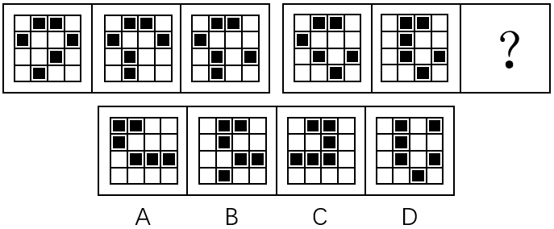
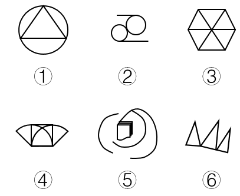
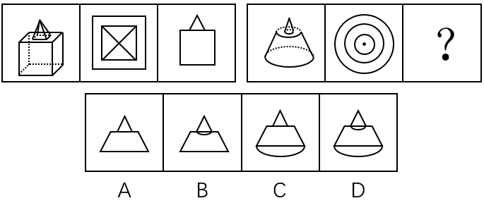
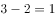

# 2017年山东省选调应届优秀高校毕业生到基层工作考试《行测》试卷（精选）

> 判断推理 · 15 题 · 选调 2017

## 第 1 题　qid 2261738 · 逻辑判断

日本从未对侵略进行过真正反省。没有认识到自己是作孽的民族，将来一定还会是作孽的民族。
下面哪个推理不是这段话所包含的？

- **A**. 如果没有认识到自己是一个作孽的民族，将来还会是作孽的民族。日本没有认识到自己是一个作孽的民族，所以，日本将来还会是一个作孽的民族
- **B**. 只有认识到自己是一个作孽的民族，将来才不会成为作孽的民族，日本没有认识到自己是一个作孽的民族，所以，日本将来还会成为一个作孽的民族
- **C**. 认识到自己是作孽的民族，将来一定不会是作孽的民族。日本没认识到自己是个作孽的民族，所以，日本将来还会是个作孽的民族　✅
- **D**. 日本将来一定还会是一个作孽的民族。因为日本从未对侵略进行过反省

**答案**：C

**官方解析**

第一步：翻译题干。

题干翻译为：从未对侵略进行过反省没有认识到自己是作孽的民族将来一定还会是作孽的民族。

第二步：逐一分析选项。

A项：翻译为：没有认识到自己是一个作孽的民族将来还会是作孽的民族，与题干逻辑关系一致，排除；

B项：只有······才······翻译为“后前”：不会是作孽的民族认识到是作孽的民族，前后否后否前，与题干逻辑关系一致，排除；

C项：翻译为：认识到是作孽的民族一定不会是作孽的民族，否前不能推出否后，与题干逻辑关系不一致，当选；

D项：翻译为：从未对侵略进行过反省将来一定还会是作孽的民族，与题干逻辑关系一致，排除。

本题为选非题，故正确答案为C。

---

## 第 2 题　qid 2261739 · 逻辑判断

2015年，我国粮食产量历史性的实现“十二连增”，既保障了中国的粮食安全，又为经济基本面增添了亮色，让粮食生产的中国经验生动而厚重。然而，“十二连增”背后凸显出来的我国粮食生产特点值得我们深思，要辩证的看粮食的多与少。表面看是多了，但实际看是少了。
下面哪项成立，可支持以上观点？

- **A**. 
2015年，我国粮食产量达到12400亿斤，比1978年翻了一番

- **B**. 
三大谷物稻谷、小麦和玉米合计产量10280亿斤，足以覆盖2015年9280亿斤的国内消费量

- **C**. 
库存玉米约5000亿斤，稻谷约2000亿斤，小麦约800亿斤，均处于历史高位

- **D**. 
粮食的基本自给是以减少粮食以外的农作物种植面积为代价的。2003年，粮食播种面积为14.92亿亩，占播种总面积的比重为，2014年增至16.91亿亩，占播种总面积的比重达到以上
　✅

**答案**：D

**官方解析**

第一步：找出论点和论据。
论点：（粮食）表面看是多了，但实际看是少了。
论据：无。 
第二步：逐一分析选项。
A项：2015年我国粮食产量比1978年翻了一番，只说明粮食多了，没有体现粮食少了，属于无关选项，排除；
B项：三大谷物合计足以覆盖国内消费量，只说明粮食多了，没有体现粮食少了，属于无关选项，排除；
C项：库存均处于历史高位，只说明粮食多了，没有体现粮食少了，属于无关选项，排除；
D项：粮食的基本自给以减少粮食以外的农作物种植面积为代价，说明粮食多了，但其他农作物少了，补充论据支持论点，当选。
故正确答案为D。

---

## 第 3 题　qid 2261740 · 逻辑判断

人社部不久前公布了新的《公务员考试录用违纪违规行为处理办法》，加大了对考试作弊行为的惩处力度，报考者如果有串通作弊或者参与有组织作弊等特别严重的违纪违规行为，将永远不允许进入公务员队伍。
“公考”作为国家选拔工作人员的考试，其重要性不言而喻，绝不能容忍作弊。只有考试纪律严明，对广大考生才公平。那些在“公考”中作弊的人，德与才的缺失在作弊中暴露无遗，确实应该永不录用。其实，“永不录用”只是惩戒措施之一，根据刑法修正案（九）规定，作弊者很可能还被追究法律责任，但仅靠“永不录用”，“作弊入刑”等惩戒措施还不够，应该进一步增加法律法规的威慑力。
当然，加大惩戒力度的目的是创造公平公正的考试环境，并不是故意让考试者“永不翻身”，如果每个考生都遵守考试纪律，规定再严厉也“伤”不到自己。
上述短文中，第一自然段“报考者如果有串通作弊或者参与有组织作弊等特别严重违纪违规行为，将永远不允许进入公务员队伍”中，含有一个逻辑命题，选择其中一项：

- **A**. 选言命题，其公式为：P或者Q
- **B**. 充分条件假言命题，其公式为：如果P那么Q
- **C**. 复合式充分条件假言命题，其公式为：（P或者Q），那么（将）S　✅
- **D**. 必要条件假言命题，其公式为：（P或者Q），才（将）S

**答案**：C

**官方解析**

第一步：翻译题干。

翻译题干第一段最后一句：（1）······或者······选言命题：串通作弊或者有组织作弊；（2）如果······将（就）······充分条件命题：串通作弊或者有组织作弊永远不允许进入公务员队伍。

第二步：逐一分析选项。

A项：选言命题P或者Q，正确，但没有充分条件命题，排除；

B项：充分假言命题即充分条件命题，PQ，但没有选言命题，排除；

C项：复合式充分选言命题，包含了选言命题P或者Q，也包含充分条件命题（P或者Q）S，当选；

D项：题干翻译为充分条件命题，而不是必要条件命题，排除。

故正确答案为C。

---

## 第 4 题　qid 2261741 · 逻辑判断

第48题短文第一第二自然段中，包含有复合型的逻辑推理，找出正确的选项：
①直言三段论推理    ②充分条件假言推理
③必要条件假言推理  ④选言推理

- **A**. ①④
- **B**. ①②
- **C**. ①③
- **D**. ②④　✅

**答案**：D

**官方解析**

第一步：翻译题干。

翻译题干第一段：充分条件选言命题：（串通作弊或者有组织作弊）永远不允许进入公务员队伍。

翻译题干第二段：必要条件命题“只有······才······”：对广大考生公平考试纪律严明。

第二步：逐一分析选项。

A项：并没有体现①直言三段论，即PQ、QS，可得“PS”，排除；

B项：并没有体现①直言三段论，即PQ、QS，可得“PS”，排除；

C项：并没有体现①直言三段论，即PQ、QS，可得“PS”，排除；

D项：第一段是（串通作弊或者有组织作弊）永远不允许进入公务员队伍，有②充分条件假言推理和④选言命题，当选。

故正确答案为D。

---

## 第 5 题　qid 2261742 · 逻辑判断

学校的一项调查发现，有许多大三同学仍然没有明确个人的就业方向。若该命题为真，则下列陈述不能确定真假的是：
①所有大三同学都没有明确个人的就业方向
②所有大三同学都有个人的就业方向
③有的大三同学有个人的就业方向
④大三同学郭强有个人的就业方向

- **A**. ①②③④
- **B**. ①③④　✅
- **C**. ①②③
- **D**. ②③④

**答案**：B

**官方解析**

第一步：分析题干条件。
题干为：许多大三同学没有明确个人的就业方向，可理解为：有的大三学生没有明确个人的就业方向。
第二步：根据题干条件进行推理。
①所有大三同学没有明确个人的就业方向，有的不是无法推出所有不是，不能判断命题真假；
②所有大三同学有明确个人的就业方向，有的不是与所有是互为矛盾关系，则这句话一定为假；
③有的大三同学有个人的就业方向，有的不是无法推出有的是，不能判断命题真假；
④大三同学郭强有个人的就业方向，有的不是无法推出某个是，所以不能判断命题真假。
综上，①③④不能判断命题真假。
故正确答案为B。

---

## 第 6 题　qid 2261743 · 逻辑判断

合法：不合法
在内在逻辑关系上最为相似的选项：

- **A**. 赞成：反对
- **B**. 农业：工业
- **C**. 教授：党员
- **D**. 有偿：无偿　✅

**答案**：D

**官方解析**

第一步：判断题干词语间逻辑关系。
“合法”与“不合法”为矛盾关系，不存在其他情况。
第二步：判断选项词语间逻辑关系。
A项：“赞成”和“反对”为反对关系，存在其他情况，例如“弃权”等，与题干逻辑关系不一致，排除；
B项：“农业”与“工业”为反对关系，存在其他情况，例如“商业”等，与题干逻辑关系不一致，排除；
C项：“教授”与“党员”为交叉关系，有的教授是党员，有的教授不是党员，有的党员是教授，有的党员不是教授，与题干逻辑关系不一致，排除； 
D项：“有偿”与“无偿”为矛盾关系，不存在其他情况，与题干逻辑关系一致，当选。
故正确答案为D。

---

## 第 7 题　qid 2261744 · 逻辑判断

杜甫：《茅屋为秋风所破歌》，安得广厦千万间，大庇天下寒士俱欢颜
与题干逻辑关系相同的选项是：

- **A**. 马致远：《竹枝词》，东边日出西边雨，道是无晴却有晴
- **B**. 李煜：《虞美人》，问君能有几多愁，恰似一江春水向东流　✅
- **C**. 曹禹：《故乡》，杨柳青青江水平，闻郎江上踏歌声
- **D**. 白居易：《鹿柴》，待到重阳日，还来就菊花

**答案**：B

**官方解析**

第一步：判断题干词语间逻辑关系。
题干为作者、作品和诗句的对应关系。
第二步：判断选项词语间逻辑关系。
A项：《竹枝词》的作者是刘禹锡，作者与作品不对应，与题干逻辑关系不一致，排除；
B项：作者与作品对应，与题干逻辑关系一致，当选；
C项：诗句是刘禹锡《竹枝词》中的句子，诗句与作品作者不对应，与题干逻辑关系不一致，排除；
D项：诗句为孟浩然《过故人庄》中的句子，诗句与作品作者不对应，与题干逻辑关系不一致，排除。
故正确答案为B。

---

## 第 8 题　qid 2261745 · 逻辑判断

会展农业是以会议、展览、展销、节庆等活动为表征，是都市型现代农业的高端产业形式和经济形态。
下列不属于会展农业的是：

- **A**. 北京成功举办了世界草莓大会和种子大会
- **B**. 平谷区借助国际桃花音乐节，带动10万农民走上致富道路
- **C**. 目前，一些乡镇搞起了养生山吧和古村聚落等特色业态　✅
- **D**. 有些市区以农业节庆为平台，举办花博会、葡萄大会等农业会展，起到了以会兴业的目的

**答案**：C

**官方解析**

第一步，找出定义关键词。
“以会议、展览、展销、节庆等活动为表征”、“都市型现代农业”。
第二步，逐一分析选项。
A项：北京举办世界草莓大会和种子大会，符合“以会议、展览、展销、节庆等活动为表征”、“都市型现代农业”，符合定义，排除；
B项：平谷区借助国际桃花音乐节，带动10万农民走上致富道路，符合“以会议、展览、展销、节庆等活动为表征”、“都市型现代农业”，符合定义，排除；
C项：一些乡镇搞养生山吧和古村聚落等特色业态，不符合“都市型现代农业”，且没有体现会议、展览、展销、节庆等形式，不符合“以会议、展览、展销、节庆等活动为表征”，不符合定义，当选；
D项：市区以农业节庆为平台，举办农业会展，符合“以会议、展览、展销、节庆等活动为表征”、“都市型现代农业”，符合定义，排除。
本题为选非题，故正确答案为C。

---

## 第 9 题　qid 2261746 · 逻辑判断

以下四个前提成立：
①如果小王是选调生，那么小张不是大学毕业生。
②或者小李是医生，或者小王是选调生。
③如果小张不是大学毕业生，那么小赵不是教师。
④或者小赵是教师，或者小周不是部长。
以下哪项如果为真，可得出“小李是医生”的结论：

- **A**. 小周不是部长
- **B**. 小王不是选调生
- **C**. 小赵不是教师
- **D**. 小周是部长　✅

**答案**：D

**官方解析**

第一步：翻译题干。

①：小王是选调生小张不是大学毕业生；

②：小李是医生或者小王是选调生；

③：小张不是大学毕业生小赵不是教师；

④：小赵是教师或者小周不是部长。

第二步：逐一分析选项。

A项：如果小周不是部长为真，则根据④不能确定小赵是不是教师，所以A项推不出“小李是医生”，排除；

B项：如果小王不是选调生为真，则根据②得小李是医生，当选；

C项：如果小赵不是教师为真，则根据③肯后，肯后推不出确定性结论；根据④推出小周不是部长，但无论根据哪个条件都推不出“小李是医生”，排除；

D项：如果小周是部长为真，则根据④得小赵是教师，根据③得小张是大学毕业生，根据①得小王不是选调生，根据②得小李是医生，当选。

故正确答案为D。（本题出题有误，B、D项均为正确）

---

## 第 10 题　qid 2261747 · 逻辑判断

对于合作社而言，如果实行了土地托管模式，就能使农民获得较高的农业收入并降低经营成本和风险。只有与农户建立高度互信的合作关系，形成紧密的利益联结机制，才能较好地实行土地托管模式。该县去年没有使农民获得比前年更高的农业收入。
如果上述判断是真的，则以下哪些选项也一定是真的？
①没有实行土地托管模式
②没与农民形成紧密的利益联结机制
③与农户没有建立高度互信的合作关系

- **A**. 只有①　✅
- **B**. 只有②
- **C**. 只有③
- **D**. ①②③

**答案**：A

**官方解析**

第一步：翻译题干。

（1）实行了土地托管模式使农民获得较高的农业收入并降低经营成本和风险；

（2）实行土地托管模式与农户建立高度互信的合作关系，形成紧密的利益联结机制；

（3）该县去年没有使农民获得比前年更高的农业收入。

第二步：逐一分析。

①：根据（1）（3）可以推出：没有使农民获得比前年更高的农业收入没有实行土地托管模式，符合题干推理，当选；

②：根据（1）（3）推出没有实行土地托管模式，没有实行土地托管模式是对（2）的否前，否前推不出确定结论，不能推出是否与农民形成紧密的利益联结机制，不符合题干推理，排除；

③：根据（1）（3）推出没有实行土地托管模式，没有实行土地托管模式是对（2）的否前，否前推不出确定结论，不能推出是否与农户建立高度互信的合作关系，不符合题干推理，排除；因此只有①可以推出。

故正确答案为A。

---

## 第 11 题　qid 2261748 · 逻辑判断

从所给四个选项中，选择最合适的一个填入问号处，使之呈现一定的规律性:

- **A**. A
- **B**. B
- **C**. C
- **D**. D　✅

**答案**：D

**官方解析**

图形组成相同，考虑位置规律。观察发现，图形中黑色方块每次只移动一个。则？处图形与前一个图形相比，只有D项移动了一处黑色方块。
故正确答案为D。

---

## 第 12 题　qid 2261749 · 逻辑判断

把下面的六个图形分成两类，使每一类图形都有各自的共同特征或规律，分类正确的一项是：

- **A**. ①③⑥，②④⑤
- **B**. ①③④，②⑤⑥　✅
- **C**. ①②⑤，③④⑥
- **D**. ①②⑥，③④⑤

**答案**：B

**官方解析**

图形组成不同，优先考虑属性规律。通过观察发现，①③④为轴对称图形，②⑤⑥为非对称图形。
故正确答案为B。

---

## 第 13 题　qid 2261750 · 逻辑判断

从所给四个选项中，选择最合适的一个填入问号处，使之呈现一定的规律性：

- **A**. A　✅
- **B**. B
- **C**. C
- **D**. D

**答案**：A

**官方解析**

先观察前一组图形，第一个图为立体图形，后两个图分别为立体图形的俯视图和主视图。同理后一组图形第一个图为立体图形，后两个图分别为立体图形的俯视图和？，则立体图形的主视图应为A项所示图形。
故正确答案为A。

---

## 第 14 题　qid 2261751 · 逻辑判断

从所给四个选项中，选择最合适的一个填入问号处，使之呈现一定的规律性：

- **A**. A
- **B**. B　✅
- **C**. C
- **D**. D

**答案**：B

**官方解析**

观察题干图形特征，每个图形均为外框和内部阴影相交，且相交产生了公共边，因此考虑公共边数量。九宫格横着看无规律，考虑竖着看，第一列图形中外框和阴影相交的公共边数量分别为5、3、2，第二列分别为3、2、1，第三列分别为2、2、？，单独数无规律，考虑运算。由、可知：每列第一个图形中公共边数量第二个图形中公共边数量第三个图形中公共边数量，则“？”处图形外框和阴影相交的公共边数应为0，只有B项符合。

故正确答案为B。

---

## 第 15 题　qid 2261752 · 逻辑判断

从所给四个选项中，选择最合适的一个填入问号处，使之呈现一定的规律性：

- **A**. A
- **B**. B　✅
- **C**. C
- **D**. D

**答案**：B

**官方解析**

图形组成元素相同，考虑位置规律。观察发现，第一个图形到第二个图形，各元素逆时针平移一格；第二个图形到第三个图形，各元素又顺时针平移两格；后面每次分别：逆时针平移三格、顺时针平移四格。则？处各元素应逆时针平移五格。
故正确答案为B。

---
