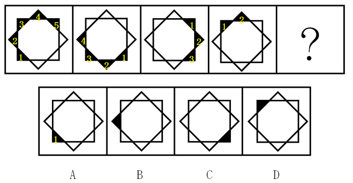
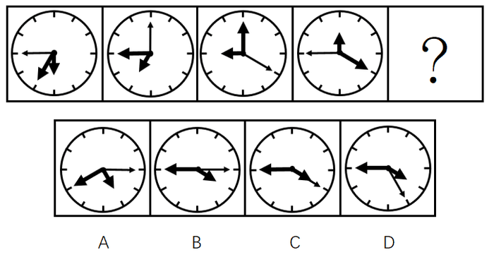
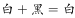
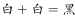
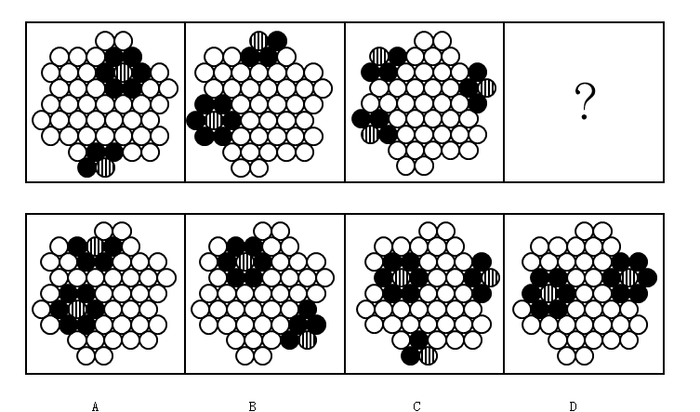
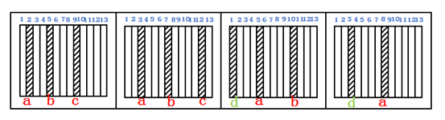
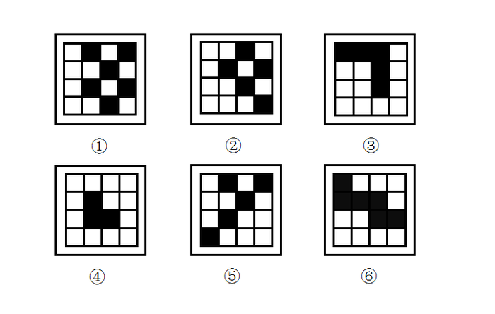

# 2017年广东省公务员录用考试《行测》题（县级、乡镇统一卷）

> 判断推理 · 30 题 · 广东 2017

## 第 1 题　qid 2047724 · 图形推理

从所给四个选项中，选择最合适的一个填入问号处，使之呈现一定规律性：

- **A**. A　✅
- **B**. B
- **C**. C
- **D**. D

**答案**：A

**官方解析**

观察图形，黑色小三角形的个数不同，分别是5、4、3、2，所以问号处应该是1个黑色小三角形，选项均有1个黑色小三角形，进一步观察，发现黑色小三角形的位置不同，所以观察位置变化，小黑块每次逆时针平移两格，并且每次减少一个。图①到图②，小黑块逆时针平移两格，去掉后面的一个黑块（黑块5），图②到图③，小黑块逆时针平移两格，去掉后面的一个黑块（黑块4），图③到图④，小黑块逆时针平移两格，去掉后面的一个黑块（黑块3），图④到图⑤应该是小黑块逆时针平移两格，去掉后面的一个黑块（黑块2），对应A项。

故正确答案为A。

---

## 第 2 题　qid 2047732 · 图形推理

从所给四个选项中，选择最合适的一个填入问号处，使之呈现一定规律性：

- **A**. A
- **B**. B　✅
- **C**. C
- **D**. D

**答案**：B

**官方解析**

观察图形，元素组成相同，考虑位置关系，时针（最短箭头）依次顺时针走1-2-3格，“？”处应走4格，排除A项；分针（短粗箭头）依次顺时针走2-3-4格，“？”处应走5格，无法排除；秒针（长细箭头）依次顺时针走3-4-5格，“？”处应走6格，排除C、D两项，对应B项。
故正确答案为B。

---

## 第 3 题　qid 2047736 · 图形推理

从所给四个选项中，选择最合适的一个填入问号处，使之呈现一定规律性：

- **A**. A
- **B**. B
- **C**. C　✅
- **D**. D

**答案**：C

**官方解析**

观察图形，元素组成不同，属性无明显规律，考虑数量规律。题干的每一幅图形都出现了“丿”，“丿”的个数依次为：1、2、3、？、5，？处应为4个“丿”。A项2个、B项2个、C项4个、D项6个，只有C项符合。
故正确答案为C。

---

## 第 4 题　qid 2047742 · 图形推理

从所给四个选项中，选择最合适的一个填入问号处，使之呈现一定规律性：

- **A**. A　✅
- **B**. B
- **C**. C
- **D**. D

**答案**：A

**官方解析**

观察图形，元素组成相似，外部轮廓相同，内部有黑有白，且黑白的个数不同，考虑黑白运算。第一组的运算公式为：、、；第二组应用规律，正方形的左上角，排除B、D两项。比较A、C两项，中间的圆形阴影不同，圆形内部左上角为，排除C项，对应A项。

故正确答案为A。

---

## 第 5 题　qid 2047746 · 图形推理

从所给四个选项中，选择最合适的一个填入问号处，使之呈现一定规律性：

- **A**. A
- **B**. B
- **C**. C
- **D**. D　✅

**答案**：D

**官方解析**

观察图形，题干出现黑圆、条形圆、白圆三种元素，题干图形中的每一个条形圆只与黑圆相邻，不与白圆相邻，排除A、C项。题干图形中的每一个黑圆都与条形圆相邻，B项中有一个黑圆没有与条形圆相邻，排除B项，对应D选项。
故正确答案为D。

---

## 第 6 题　qid 2047752 · 图形推理

从所给四个选项中，选择最合适的一个填入问号处，使之呈现一定规律性：

- **A**. A
- **B**. B
- **C**. C　✅
- **D**. D

**答案**：C

**官方解析**

观察图形，前三个图有三个斜线条，第四个图有两个斜线条，但是，数量、属性、样式都没有规律，所以只能考虑位置规律。如下图所示，给题干中斜线条分别编号。

a斜线条向右平移的步数分别是1、2、3、？，所以，？处a斜线条应该是在第12格，观察选项，发现只有C选项在第12格有斜线条，所以，答案是C选项。验证其他选项：

b斜线条向右平移的步数分别是2、3、4，观察四图，发现既不符合反弹的路径（应该走到第12个格子），也不符合循环的路径（应该走到第1个格子），所以应该是当超过第13个格子的平移时，斜线条就会消失，故b斜线消失；

c斜线条向右平移的步数分别是3、4，所以从第二个图到第三个图，c斜线条消失；

d斜线条是在c斜线条消失后重新补充的，d斜线条向右平移的步数分别是2、？，？处d斜线条应该是走3步，从第3格子走到第6格子，对应C选项；

同时根据C选项可知在最左侧又补充一个新的e斜线条。

故正确答案为C。

备注：这道题不同于以往的黑白块题，到顶头的位置后是循环走或反弹走，这道题斜线条到顶头的位置后就会消失，这是一个比较新颖的命题形式，希望广大考生引起注意！

---

## 第 7 题　qid 2047758 · 图形推理

从所给四个选项中，选择最合适的一个填入问号处，使之呈现一定规律性：

- **A**. A
- **B**. B
- **C**. C
- **D**. D　✅

**答案**：D

**官方解析**

观察图形，发现题干每一幅图，当白色图形在横线上方时，下方并没有图形，排除A、B选项，再观察发现，当黑色图形在横线上方时，下方就有一个相同形状的白色图形通过黑色图形上下翻转得到，据此排除C项。
故正确答案为D。

---

## 第 8 题　qid 2047762 · 图形推理

从所给四个选项中，选择最合适的一个填入问号处，使之呈现一定规律性：

- **A**. A
- **B**. B
- **C**. C　✅
- **D**. D

**答案**：C

**官方解析**

解析1：观察图形，元素组成不同，考虑数量规律，观察小黑球的数量分别是9、8、11、？，根据乱序规律，？处应该找有10个小黑球的选项，排除A、B、D三个选项，所以答案是C选项。
进一步验证小白球，观察小白球的数量分别是7、8、5、？，根据乱序规律，？处应该找有6个小白球的选项，排除A、B、D三个选项，所以答案依然是C选项。
解析2：题干都是由小黑球、小白球及波浪线组成，整体数黑球和白球的个数，无明显规律；考虑黑球的位置移动，也无明显规律。再次观察题干图形，小黑球和小白球是以波浪线的方式连接，即必然存在波峰和波谷，观察在波峰和波谷的黑白球数目发现，第一幅图是4白2黑，第二幅图是4白2黑，第三幅图是4黑2白，即都是“4-2”分布，选项A、B、D的波峰和波谷的黑白球数目都是3白3黑，只有C选项的波峰和波谷的黑白球数目是4黑2白，满足“4-2”分布的规律。
再观察第二行，题干黑球和白球的数量均是4黑1白，C选项也符合此规律；观察第三行，第一幅图是3黑2白，第二幅图是3白2黑，第三幅图是3黑2白，呈交替出现规律，第四幅图应为3白2黑，C选项也符合此规律。
故正确答案为C。
解析3：元素组成不同，考虑数量规律。题干均由小黑球、小白球组成，且黑白球互相分割，考虑黑白球互相分割后的部分数。题干图形黑球部分数依次为：6、3、3，白球部分数依次为6、4、3；即图1、图3中黑球和白球部分数相等，图2中白球比黑球部分数多1，故问号处应选择一个白球比黑球部分数多1的选项，只有D选项符合。
故正确答案为D。
注：本题不严谨，存在多个规律，故作为参考即可。

---

## 第 9 题　qid 2047768 · 图形推理

把下面的六个图形分为两类，使每一类图形都有各自的共同特征或规律，分类正确的一项是：

                                               

- **A**. ①④⑥，②③⑤　✅
- **B**. ①②⑤，③④⑥
- **C**. ①⑤⑥，②③④
- **D**. ①③⑤，②④⑥

**答案**：A

**官方解析**

元素组成不同，属性无明显规律，考虑数量规律。题干图形都是由一个外框和里面的3条线组成，整体数线，7、4、4、7、4、4，无法分组。仔细观察后发现，每个图形内部存在多条单一直线和单一曲线，可以考虑分开数图形内部的直线和曲线数，即图①④⑥图形内部有3条曲线，图②③⑤图形内部有2条曲线和1条直线，可以分为两组。
故正确答案为A。

---

## 第 10 题　qid 2047776 · 图形推理

把下面的6个图形分为两类，使每一类图形都有各自的共同规律，分类正确的是:

- **A**. ①④⑥，②③⑤
- **B**. ①②⑤，③④⑥　✅
- **C**. ①⑤⑥，②③④
- **D**. ①③⑤，②④⑥

**答案**：B

**官方解析**

题干都是黑白块图形，整体数黑块的个数，无明显规律。仔细观察后发现，图①②⑤黑块的拼接明显比较凌乱，而图③④⑥黑块的拼接比较整齐、紧密相连，即图①②⑤黑块与黑块之间以点相接，图③④⑥黑块与黑块之间以边相接。
故正确答案为B。

---

## 第 11 题　qid 2047860 · 类比推理

U盘：光盘

- **A**. 楼梯：电梯　✅
- **B**. 插头：插座
- **C**. 国画：毛笔
- **D**. 水杯：杯盖​

**答案**：A

**官方解析**

第一步：判断题干词语间逻辑关系。
U盘和光盘都具有存储功能，二者是并列关系。
第二步：判断选项词语间逻辑关系。
A项：楼梯和电梯都可用于建筑物等楼层之间或高度差较大时的交通联系，二者是并列关系，与题干逻辑关系一致，当选；
B项：插头和插座是配套使用的，二者是对应关系中的配套对应，与题干逻辑关系不一致，排除；
C项：画国画的时候需要用到毛笔，二者是对应关系中的工具对应，与题干逻辑关系不一致，排除；
D项：水杯和杯盖是组成关系，与题干逻辑关系不一致，排除。
故正确答案为A。

---

## 第 12 题　qid 2047862 · 类比推理

春暖：花开

- **A**. 和风：细雨
- **B**. 雨后：天晴
- **C**. 天寒：地冻　✅
- **D**. 云开：雾散​

**答案**：C

**官方解析**

第一步：判断题干词语间逻辑关系。
春暖是花开的原因，二者是对应关系中的因果对应。
第二步：判断选项词语间逻辑关系。
A项：和风和细雨都是一种天气状态，二者属于并列关系，与题干逻辑关系不一致，排除；
B项：雨后不是天晴的原因，与题干逻辑关系不一致，排除；
C项：天寒是地冻的原因，二者是对应关系中的因果对应，与题干逻辑关系一致，当选；
D项：云开和雾散都是一种天气状态，二者属于并列关系，与题干逻辑关系不一致，排除。
故正确答案为C。

---

## 第 13 题　qid 2047864 · 类比推理

投票：抽签

- **A**. 联系：沟通
- **B**. 管理：服务
- **C**. 劝说：争辩　✅
- **D**. 推荐：号召​

**答案**：C

**官方解析**

第一步：判断题干词语间逻辑关系。
投票和抽签都是选出结果的一种方式，二者是并列关系中的反对关系。
第二步：判断选项词语间逻辑关系。
A项：联系和沟通是近义词，与题干逻辑关系不一致，排除；
B项：管理是指管理主体组织并利用其各个要素，借助管理手段，完成该组织目标的过程；服务是指为他人做事，并使他人从中受益的一种有偿或无偿的活动，二者无必然逻辑关系，排除；
C项：劝说和争辩都是让人对某件事情表示同意的一种方式，二者是并列关系中的反对关系，与题干逻辑关系一致，当选；
D项：推荐是推举，介绍；号召是向人发出通知，让大家响应所发出的告示，二者无明显逻辑关系，排除。
故正确答案为C。

---

## 第 14 题　qid 2047866 · 类比推理

调研：座谈

- **A**. 转型：创新　✅
- **B**. 垄断：专营
- **C**. 发明：试验
- **D**. 秩序：通畅​

**答案**：A

**官方解析**

第一步：判断题干词语间逻辑关系。
座谈是调研的一种形式。
第二步：判断选项词语间逻辑关系。
A项：创新是转型的一种形式，与题干逻辑关系一致，当选；
B项：垄断泛指把持和独占；专营可指专门经营某一类或者某一种品牌商品（如苹果专营店、耐克专营店），不属于垄断经营，二者无必然逻辑关系，排除；
C项：发明是创造新的事物或方法；试验指已知某种事物，为了了解它的性能或者结果而进行的试用操作，因此试验不是发明的一种形式，排除；
D项：通畅的秩序是指有条理，不混乱，顺利通行；通畅是用来形容秩序，与题干逻辑关系不一致，排除。
故正确答案为A。

---

## 第 15 题　qid 2047868 · 类比推理

言论：自由

- **A**. 版权：保护
- **B**. 危机：调控
- **C**. 生产：安全　✅
- **D**. 设计：创新

**答案**：C

**官方解析**

第一步：判断题干词语间逻辑关系。
题干可以造句“言论自由”，“自由”的“言论”，是偏正结构。
第二步：判断选项词语间逻辑关系。
A项：可以造句“保护版权”，是动宾结构，与题干逻辑关系不一致，排除；
B项：“调控”指的是调节、控制，与“危机”无必然逻辑关系，与题干逻辑关系不一致，排除；
C项：可以造句“生产安全”，“安全”可以用来修饰“生产”，“安全”的“生产”，是偏正结构，与题干逻辑关系一致，保留；
D项：可以造句“设计创新”，“创新”可以用来修饰“设计”，“创新”的“设计”，是偏正结构，与题干逻辑关系一致，保留。
比较C、D两项，法律规定，言论必须是自由的，生产必须是安全的，但并未规定设计必须是创新的，相比而言，C项与题干的逻辑关系更为接近。
故正确答案为C。

---

## 第 16 题　qid 2047870 · 类比推理

水：火

- **A**. 美：丑
- **B**. 有：无
- **C**. 左：右
- **D**. 红：绿　✅

**答案**：D

**官方解析**

第一步：判断题干词语间逻辑关系。
金木水火土，水与火两者属于并列中的反对关系。
第二步：判断选项词语间逻辑关系。
A项：美与丑属于并列中的反对关系，保留；
B项：有与无属于并列中的矛盾关系，与题干逻辑关系不一致，排除；
C项：左与右属于并列中的反对关系，保留；
D项：红与绿属于并列中的反对关系，保留。
比较A、C、D三项，题干中水、火是反对关系，但不是反义关系。而A项中的美、丑，C项中的左、右都是反义关系，D项中的红、绿只是反对关系，不是反义关系，与题干逻辑关系更一致。
故正确答案为D。

---

## 第 17 题　qid 2047872 · 类比推理

净水：过滤

- **A**. 名次：竞赛
- **B**. 房屋：装修
- **C**. 苗条：节食　✅
- **D**. 环境：绿化

**答案**：C

**官方解析**

第一步：判断题干词语间逻辑关系。
过滤是获得净水的一种方式。
第二步：判断选项词语间逻辑关系。
A项：竞赛是获得名次的一种方式，与题干逻辑关系一致，保留；
B项：装修不是获得房屋的一种方式，与题干逻辑关系不一致，排除；
C项：节食是获得苗条的一种方式，与题干逻辑关系一致，保留；
D项：绿化不是获得环境的一种方式，与题干逻辑关系不一致，排除。
比较A、C两个选项与题干，过滤是通过减少杂质达到净水的效果；节食是通过减少食物摄入量达到苗条的效果，C选项更符合。
故正确答案为C。

---

## 第 18 题　qid 2047874 · 类比推理

雾霾：污染：治理

- **A**. 风扇：电器：使用　✅
- **B**. 粳米：粮食：调查
- **C**. 信息：报纸：阅读
- **D**. 报告：文件：审批

**答案**：A

**官方解析**

第一步：判断题干词语间逻辑关系。
雾霾是一种污染，二者是种属关系，治理雾霾、治理污染都是动宾结构。
第二步：判断选项词语间逻辑关系。
A项：风扇是一种电器，二者是种属关系，使用风扇、使用电器都是动宾结构，与题干逻辑关系一致，当选；
B项：粳米是一种粮食，二者是种属关系，但调查和粳米、粮食无必然联系，与题干逻辑关系不一致，排除；
C项：信息不是一种报纸，与题干逻辑关系不一致，排除；
D项：有的报告是文件，有的报告不是文件（如口头报告），二者是交叉关系，与题干逻辑关系不一致，排除。
故正确答案为A。

---

## 第 19 题　qid 2047876 · 类比推理

好感：喜欢：热爱

- **A**. 伤心：悲伤：悲哀
- **B**. 不安：紧张：焦躁　✅
- **C**. 不悦：反感：厌恶
- **D**. 高兴：愉快：喜悦

**答案**：B

**官方解析**

第一步：判断题干词语间逻辑关系。
好感是对人对事满意或喜欢的情绪；喜欢泛指喜爱，也有愉快、高兴、开心的意思；热爱多用来形容爱的程度很深。三者是近义词，并且程度逐渐加深。
第二步：判断选项词语间逻辑关系。
A项：伤心指心里非常痛苦，难过至极；悲伤是哀痛忧伤之意，伤心难过；悲哀是指伤心、难过。三者是近义词，但悲伤和悲哀的程度相同，与题干逻辑关系不一致，排除；
B项：不安指一种忐忑的心态，心里有一种不舒服的情绪；紧张指精神处于高度准备状态，思想上感到不安；焦躁是欲望受到压抑而形成的神经衰弱症的症状。三者是近义词，并且程度逐渐加深，与题干逻辑关系一致，当选；
C项：不悦指不高兴；反感是不满或反对的情绪；厌恶是一种反感的情绪，指讨厌、憎恶；不悦表示不高兴，反感与厌恶表示不满、讨厌。三者不是近义关系，与题干逻辑关系不一致，排除；
D项：高兴通常指愉快而又兴奋；愉快指欢欣快乐；喜悦指欢乐快活。三词的程度无明显变化，与题干逻辑关系不一致，排除。
故正确答案为B。

---

## 第 20 题　qid 2047878 · 类比推理

自行车：出行：环保

- **A**. 蔬菜：食品：健康　✅
- **B**. 台灯：灯泡：节能
- **C**. 手表：时间：指针
- **D**. 货车：运输：载体

**答案**：A

**官方解析**

第一步：判断题干词语间逻辑关系。
自行车是出行工具的一种。自行车是一种环保的出行方式，有利于环保。
第二步：判断选项词语间逻辑关系。
A项：蔬菜是食品的一种，蔬菜是一种健康的食品，多吃蔬菜有利于健康，与题干逻辑关系一致，当选；
B项：灯泡是台灯的一部分，二者为组成关系，与题干逻辑关系不一致，排除；
C项：手表是显示时间的工具，指针是手表的一部分，与题干逻辑关系不一致，排除；
D项：货车是运输工具的一种，货车是载体，与题干逻辑关系不一致，排除。
故正确答案为A。

---

## 第 21 题　qid 2047882 · 逻辑判断

某单位每个月都要对工作人员的工作表现进行考评。去年上半年，该单位的甲、乙、丙、丁4位员工均获得了3次月度优秀奖。已知，甲和乙有2个月同时获奖，乙和丙也有2个月同时获奖，甲和丁获奖的月份完全不同。
以下说法一定正确的是：

- **A**. 只有3个人同时获奖的月份有2个　✅
- **B**. 只有2个人同时获奖的月份有3个
- **C**. 只有1个人获奖的月份有1个
- **D**. 只有2个人同时获奖的月份少于只有1个人获奖的月份

**答案**：A

**官方解析**

根据题干条件可知：

6个月内每个人都3次获得月度优秀奖；

甲、乙有2个月同时获奖；

乙、丙有2个月同时获奖；

甲、丁获奖月份完全不同；

由于题目不涉及获奖的月份和先后顺序，因此可以假设甲获奖的月份为一、二、三月，根据，丁获奖月份则为四、五、六月。根据，乙在一、二、三月中有两次获奖，在四、五、六月中有一次获奖。根据，假如丙在一、二、三月获两次奖且与乙同时，在四、五、六月获一次奖，且与乙不同时，如表格所示：

假如丙在一、二、三月获一次奖，且与乙同时，在四、五、六月获两次奖且必须有一次与乙同时，如表格所示：

根据以上两种情况的假设，可判定，无论何种情况只有3个人同时获奖的月份有2个。

故正确答案为A。

---

## 第 22 题　qid 2047884 · 逻辑判断

现在人们常常提到大学毕业生就业难。但据统计，近年我国就业市场空缺岗位与求职人数的比率一般大于1，劳动力市场的需求大于供给。而在求职人群中，大学毕业生的文化水平较高。因此，我国大学毕业生实际上不存在就业难的问题。
以下信息如果为真，能够有效反驳上述结论的是：

- **A**. 当前经济下行压力较大，不少企业严控用工成本，已经开始裁员
- **B**. 劳动力市场最紧缺的一些岗位主要是适合高级技工的岗位　✅
- **C**. 大学毕业生愿意从事的岗位往往竞争激烈
- **D**. 一些高级技能人才的收入水平要高于大学毕业生

**答案**：B

**官方解析**

第一步：找到论点和论据。
论点：我国大学毕业生实际上不存在就业难的问题。
论据：近年我国就业市场空缺岗位与求职人数的比率一般大于1，劳动力市场的需求大于供给。而在求职人群中，大学毕业生的文化水平较高。
第二步：逐一分析选项。
A项：不少企业严控用工成本，已经开始裁员，这不能说明就业市场不再招录大学生，也不能说明大学生就业困难，与大学生的就业难易无关，属于无关选项，排除；
B项：虽然一些岗位空缺严重，但是主要缺少高级技工，不需要大学生，对大学生而言在这些领域会出现劳动力市场的需求小于供给的现象，进而出现就业难的问题，可以削弱，当选；
C项：大学毕业生愿意从事的岗位往往竞争激烈，并不能说明在实际选择职业时就一定扎堆，大学生仍然可以选择一些不愿意从事的竞争不激烈的岗位，并不能对就业难进行削弱，另外，选项表达的只是一种意愿，而实际情况是未知的，属于不明确选项，排除；
D项：一些高级技工的收入水平高于大学生，与大学生的就业难易无关，属于无关选项，排除。
故正确答案为B。

---

## 第 23 题　qid 2047886 · 逻辑判断

甲和乙都有可能受邀参加某专家论坛。现在，甲得知了以下消息：
（1）论坛主办方决定，至少邀请甲或乙中的一位。
（2）论坛主办方决定不邀请甲。
（3）论坛主办方一定会邀请甲。
（4）论坛主办方决定邀请乙。
假如上述消息中，两条为真，两条为假，则：

- **A**. 论坛主办方决定邀请甲，不邀请乙　✅
- **B**. 论坛主办方决定邀请乙，不邀请甲
- **C**. 论坛主办方决定同时邀请甲和乙
- **D**. 论坛主办方决定既不邀请甲，也不邀请乙

**答案**：A

**官方解析**

首先整理题干：（1）甲或乙；（2）– 甲；（3）甲；（4）乙。
（2）和（3）矛盾，必然一真一假，条件说两真两假，则（1）和（4）为一真一假。分析可知（4）真→（1）真，根据“一真前假，一假后真”，可知（4）为假，（1）为真。根据（4）假可知：–乙，结合（1）真可知：邀请甲。
故正确答案为A。

---

## 第 24 题　qid 2047888 · 逻辑判断

某科研机构研发了一项神经刺激技术，他们在试验中对一批滑雪选手实施了该刺激，持续数周后发现，相比未接受刺激的选手，接受刺激选手的跳跃能力和协调性分别提高了和。本国体育部门计划与该机构合作，在滑雪运动员的训练、比赛中推广使用这一技术。

以下哪项为真，最能质疑该国体育部门的计划？

- **A**. 未接受刺激的运动员通过正常训练也能提高跳跃能力和协调性
- **B**. 这项合作会增加该国体育部门的经费支出
- **C**. 该国是传统滑雪强国，滑雪成绩长期处于世界领先地位
- **D**. 这项技术会降低运动员的专注力，而专注力是能力发挥的前提　✅

**答案**：D

**官方解析**

第一步：找出论点和论据。

论点：本国体育部门计划与该机构合作，在滑雪运动员的训练、比赛中推广使用这一技术。

论据：在试验中对一批滑雪选手实施了该刺激，持续数周后发现，相比未接受刺激的选手，接受刺激选手的跳跃能力和协调性分别提高了和。

第二步：逐一分析选项。

A项：未接受刺激的运动员通过正常训练也可以提高跳跃能力和协调性，但是和接受刺激的运动员来说，到底谁提高的效果更好不知道，属于不明确选项，不能削弱，排除；

B项：增加体育部门的经费支出与该技术的刺激是否可以提高未接受刺激运动员的跳跃能力和协调性无关，论题不一致，排除；

C项：该国的滑雪成绩长期处于世界领先地位与该技术的刺激是否可以提高未接受刺激运动员的跳跃能力和协调性无关，论题不一致，排除；

D项：这项技术会降低决定运动员正常发挥的专注力，说明该技术对运动员的训练和比赛有害，削弱论点，当选。

故正确答案为D。

---

## 第 25 题　qid 2047880 · 类比推理

一名茶叶经销商在对客人介绍一种茶叶时说：“这种茶叶产自云山，而大名鼎鼎的云山茶正是产自云山，所以这就是正宗的云山茶。”
以下与该经销商介绍茶叶时的逻辑最为相似的是：

- **A**. 三班的学生都勤奋好学，小李是三班的学生，所以小李勤奋好学
- **B**. 飞驰牌汽车产自某国，刚才那辆汽车不是飞驰牌，所以肯定不是该国产的
- **C**. 所有司机都必须有驾照，小郑有驾照，所以小郑是司机　✅
- **D**. 好医生需要具备精湛的医术和高尚的医德，小陈二者兼备，所以他是好医生

**答案**：C

**官方解析**

第一步：分析题干推理形式。

题干翻译为：云山茶产自云山，

推理为：这种茶叶产自云山，因此，这种茶叶是云山茶。

推理的逻辑是“肯后推肯前”。

第二步：逐一分析选项。

A项：翻译为“三班的学生勤奋好学”，推理为“小李是三班的学生，所以小李勤奋好学”，推理的逻辑是“肯前推肯后”，与题干逻辑不同，排除；

B项：翻译为“飞驰牌汽车产自某国”，推理为“刚才那辆汽车不是飞驰牌，所以不是该国产的”，并非“肯后”，与题干逻辑不同，排除；

C项：翻译为“司机有驾照”，推理为“小郑有驾照，所以小郑是司机”，推理的逻辑是“肯后推肯前”，与题干逻辑相同，保留；

D项：翻译为“好医生具备精湛的医术和高尚的医德”，推理为“小陈二者兼备，所以他是好医生”，推理的逻辑是“肯后推肯前”，与题干逻辑相同，保留。

比较C项和D项，D项翻译的后半部分包含“精湛的医术和高尚的医德”两个内容，而题干“产自云山”和C项“有驾照”均只包含一个内容，因此C项与题干的逻辑更接近，当选。

故正确答案为C。

---

## 第 26 题　qid 2047700 · 逻辑判断

某公司招聘业务经理，小张和小李前来应聘。小张说：“如果我做了业务经理，我会积极进取，开拓新业务。”小李说：“如果我做了经理，我会优化管理，精减人员。”最终，他们其中一人当上了业务经理，并顺利实现了自己的工作主张。
由此可知，以下说法必定为真的是：

- **A**. 该公司不仅开拓了新业务，还精减了人员
- **B**. 如果该公司开拓了新业务，那么肯定是小张当上了业务经理
- **C**. 如果该公司精减了人员，那么肯定是小李当上了业务经理
- **D**. 如果该公司没有开拓新业务，就肯定精减了人员　✅

**答案**：D

**官方解析**

第一步：翻译题干。
小张做了业务经理→积极进取且开拓新业务；
小李做了业务经理→优化管理且精简人员；
已知其中只有一个人当上了业务经理并实现自己的工作主张，另外一人没有当上业务经理，但是有没有实现自己的工作主张不确定。
第二步：逐一翻译选项并判断选项是否正确。
A项：开拓新业务且精简人员，从题干已知条件可知，开拓新业务和精简人员分属于不同人的工作主张，且已知有一人实现了自己的工作主张，另外一个的主张有没有实现不确定，所以无法推出绝对表达的结论，排除；
B项：开拓新业务→小张做了业务经理，“开拓新业务”属肯后条件，无法推出绝对表达的结论，排除；
C项：精简人员→小李做了业务经理，“精简人员”属肯后条件，无法推出绝对表达的结论，排除；
D项：—开拓新业务→精简人员，由题干已知条件可知，—开拓新业务属于否后，否后必否前，由逆否规则可知“—开拓新业务→—小张做了业务经理”，既然小张没有做业务经理，显然是小李做了业务经理，肯前必肯后，由题干已知条件可知“小李做了业务经理→优化管理且精简人员”，那么该公司实现了精简人员，当选。
故正确答案为D。

---

## 第 27 题　qid 2047750 · 逻辑判断

由于按揭贷款的利率下调，人们每月还贷压力减小，因此一家机构预测某地的商品房销售量会增长，但实际上，销售量并未出现明显增长。
下列哪项如果为真，最能解释以上现象？

- **A**. 当地一直存在人口外流的现象
- **B**. 本地的商品房价格没有明显下降
- **C**. 有的开发商取消了购房优惠政策
- **D**. 因经济环境不好，当地人均收入下降　✅

**答案**：D

**官方解析**

第一步：找出需要解释的矛盾现象。
题干矛盾在于“按揭贷款的利率下调，人们每月还贷压力减小”，“但实际上，销售量并未出现明显增长”，即还贷压力减小的情况下，有多余的资金为什么不买商品房，进而导致商品房销售量未增长的问题。
第二步：逐一分析选项。
A项：当地一直存在人口外流的现象，与题干无关，不能解释题干矛盾现象，排除。
B项：本地商品房价格没有明显下降，意味着商品房的价格降幅很小或者没有变化，但是题干谈及的是还贷压力减小和商品房销售量之间不增长的矛盾，如果是商品房价格有降幅，出现的结果应该是买商品房的人多，不能解释题干矛盾现象，如果是商品房价格没有变化，那么对于购买者来说需求是没变化的，而还贷压力又变小了，该买的依然买，也应该是出现增长，也不能解释题干矛盾现象，排除。
C项：有的开发商取消购房优惠政策，取消购房优惠政策在一定程度上能够影响消费者，从而影响商品房的销售量，能够解释题干矛盾现象，保留。
D项：当地人均收入下降，意味着虽然每月还贷压力减小，但是自身的本来收入也减少了，那么还贷完剩余的钱也少，自然没有多余的钱再去购买商品房，从而商品房的销售量没有出现明显增长，能解释题干矛盾现象，保留。
C项和D项进行比较，C项强调的是部分开发商，数量是多是少并不明确，那么造成的影响也不明确，而D项明确强调了当地居民收入下降导致还完贷款后剩下的资金也减少，更能够影响商品房的销售数量。
故正确答案为D。

---

## 第 28 题　qid 2047760 · 逻辑判断

媒体A报道称：今年以来，患季节性皮肤病的人数大幅上升，这是因为城市水污染日益严重和空气质量恶化造成的。
媒体B报道称：患季节性皮肤病的人数大幅上升与城市水污染、空气质量恶化没有关系，主要是因为人们缺乏锻炼，身体素质下降造成的。
以下哪项如果为真，最能对媒体B的观点提出质疑？

- **A**. 目前7-12周岁儿童的身体素质比10年前普遍下降
- **B**. 大多数春季患皮肤病的人，在秋冬季节症状会有所好转
- **C**. 环保局承认，城市水污染和空气质量问题日益严重
- **D**. 游泳运动员患季节性皮肤病的人数逐年增多　✅

**答案**：D

**官方解析**

第一步：找到论点和论据。
论点：患季节性皮肤病的人数大幅上升的原因是人们缺乏锻炼，身体素质下降。
论据：没有明显的论据。
第二步：逐一分析选项。
A项：儿童身体素质比10年前普遍下降，与题干无关，选项只是给出了一个实际现象，但是患皮肤病的人增多和身体素质下降之间有无联系我们并不明确，无关选项，排除；
B项：大多数春季患皮肤病的人在秋冬季节症状会有所好转，与题干无关，题干观点探讨的是皮肤病人数上升的原因是不是缺乏锻炼、身体素质下降，排除；
C项：环保局承认城市水污染和空气质量问题日益严重，选项只是给出了一个实际现象，但是患皮肤病的人增多和污染问题之间有无联系我们并不明确，无关选项，排除；
D项：游泳运动员患季节性皮肤病的人数逐年增多，说明运动员这种身体素质好、锻炼强度大的群体患皮肤病的人也在增多，意味着皮肤病患者增多与身体素质和锻炼强度之间并没有必然的联系，举反例削弱论点，为正确答案，当选。
故正确答案为D。

---

## 第 29 题　qid 2047772 · 逻辑判断

某投资公司在评价一个项目时说：我们挑选投资项目，主要是看项目的技术门槛和未来市场需求量，而不是当前的业务增长率。现在新的可投资项目这么多，短期内发展很迅速但很快就被其他项目追赶上来的也不少，这显然不是我们想要的。这个项目在一年内营业额就增加了5倍，倒是很有必要怀疑它将来的状况。
以下和该投资公司评价项目的逻辑最为类似的是：

- **A**. 婚姻生活是否幸福取决于夫妻双方的和谐程度，而不是家庭收入，有些收入高的夫妻，婚姻生活反而不幸福　✅
- **B**. 通过票房评价一部电影并不靠谱，一部电影即使票房再高，观众的口碑也不一定好
- **C**. 某足球队在选拔新队员时，除了关注他们的技术水平，更看重他们的训练状态和发展潜力
- **D**. 歌手要成功，天赋和优秀的市场推广缺一不可。那些失败的歌手，要么没有天赋，要么市场推广做得不好

**答案**：A

**官方解析**

第一步：分析题干逻辑关系。
挑选项目，要看技术门槛和未来市场需求量，而不是业务增长率，举例子说明业务增长率高并不一定能推出好项目——这个项目在一年内营业额就增加了5倍，倒是很有必要怀疑它将来的状况。
题干逻辑：给出了一个指标，否定了一个指标，并且举例说明。
第二步：逐一分析选项。
A项：婚姻生活幸福，给出一个指标（夫妻双方的和谐程度），否定了一个指标（而不是家庭收入），并且举例说明（有些收入高的夫妻，婚姻生活反而不幸福），与题干中逻辑关系一致，当选；
B项，票房再高，否定了一个指标（观众的口碑也不一定好），但是并没有给出一个指标，与题干中逻辑关系不一致，排除；
C项：除了关注他们的技术水平，更看重他们的训练状态和发展潜力，给出了两个指标，说明两个指标都要关注，与题干中逻辑关系不一致，排除；
D项：天赋和优秀的市场推广缺一不可，两者缺一不可，给出了两个指标，与题干中逻辑关系不一致，排除。
故正确答案为A。

---

## 第 30 题　qid 2047778 · 逻辑判断

流感病毒的变异速度相当快，即使疫苗每年更新，也不能保证疫苗接种覆盖全部的“当季流行款”。接种流感疫苗，既不能保证百分之百不得流感，还可能导致接种人群出现低烧等副作用。因此，没有必要接种流感疫苗。
以下选项如果为真，不能有效反驳上文结论的是：

- **A**. 接种流感疫苗可以减少儿童、慢性病患者等高危人群因流感而发生严重并发症的风险
- **B**. 接种季节性流感疫苗可以降低易感人群感染流感病毒的概率
- **C**. 接种流感疫苗后只有极少数人会出现全身反应，且一两天可以缓解，比流感的症状要轻很多
- **D**. 从疾病中恢复过来的人可以获得一定的免疫力，1年内不会再次被同样的流感病毒感染　✅

**答案**：D

**官方解析**

第一步：找到论点和论据。
论点：没有必要接种流感疫苗。
论据：接种流感疫苗，不仅不能保证百分之百不得流感，还可能导致低烧等副作用。
第二步：逐一分析选项。
A项：接种流感疫苗可以减少儿童、慢性病患者等高危人群因流感而发生严重并发症的风险，说明接种流感疫苗是有好处的，是有必要的，削弱论点，排除；
B项：接种季节性流感疫苗可以降低易感人群感染流感病毒的概率，说明接种流感疫苗是有好处的，是有必要的，削弱论点，排除；
C项：接种流感疫苗只有极少数人会出现全身反应，说明出现反应的概率特别小，而且反应一两天就可以缓解，症状比流感症状轻得多，产生的副作用也较小，削弱论据，排除；
D项：从疾病中恢复过来的人，1年不会再次被同样的流感病毒感染，只能说明疾病中恢复过来的人可能1年内不需要接种某种流感疫苗，与是否需要接种其他的流感疫苗无关，属于无关选项，当选。
本题为选非题，故正确答案为D。

---
