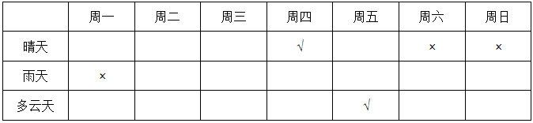
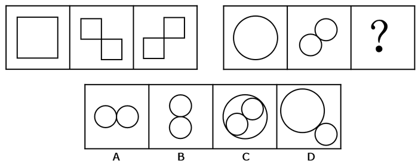
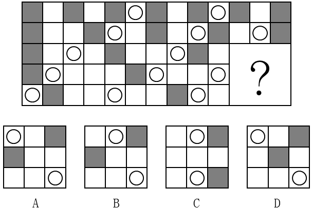
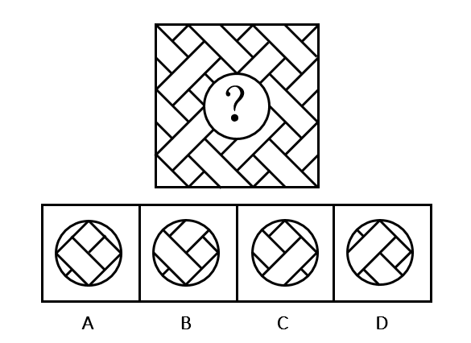

# 2017年广州市公务员录用考试《行测》题（单考区卷）

> 判断推理 · 30 题 · 广州市考 2017

## 第 1 题　qid 2045598 · 类比推理

土地：地租 与 （  ） 在内在逻辑关系上最为相似。

- **A**. 工资：劳动
- **B**. 厂房：工人
- **C**. 资本：利润　✅
- **D**. 学历：知识

**答案**：C

**官方解析**

第一步：判断题干词语间逻辑关系。
通过土地可以获得地租，二者为对应关系。
第二步：判断选项词语间逻辑关系。
A项：通过劳动可以获得工资，但是顺序和题干相反，与题干逻辑关系不一致，排除；
B项：通过厂房不能获得工人，厂房是工人劳动的场所，与题干逻辑关系不一致，排除；
C项：通过资本可以获得利润，与题干逻辑关系一致，当选；
D项：通过学历不能获得知识，一般是通过教育可以获得知识，与题干逻辑关系不一致，排除。
故正确答案为C。

---

## 第 2 题　qid 2045602 · 类比推理

飞机：汽油 与 （  ） 在内在逻辑关系上最为相似。

- **A**. 手串：珠子
- **B**. 蔬菜：种子
- **C**. 手电筒：电池　✅
- **D**. 葡萄：健康

**答案**：C

**官方解析**

第一步：判断题干词语间逻辑关系。
汽油为飞机提供能源动力，二者为对应关系。
第二步：判断选项词语间逻辑关系。
A项：珠子是手串的组成部分，二者是组成关系，与题干逻辑关系不一致，排除；
B项：种子是种子植物的繁殖体系，对延续物种起着重要作用，种子可以用来生产蔬菜，并不是为蔬菜提供能源，与题干逻辑关系不一致，排除；
C项：电池为手电提供能源动力，与题干逻辑关系一致，当选；
D项：葡萄和健康没有必然逻辑关系，与题干逻辑关系不一致，排除。
故正确答案为C。

---

## 第 3 题　qid 2045604 · 类比推理

蜡烛：电灯 与 （  ） 在内在逻辑关系上最为相似。

- **A**. 算盘：计算机　✅
- **B**. 信鸽：电报机
- **C**. 鞭炮：火枪
- **D**. 电视：电影

**答案**：A

**官方解析**

第一步：分析题干词语间逻辑关系。
蜡烛和电灯的功能相同，都可以用来照明，且二者都是人造物。
第二步：判断选项词语间逻辑关系。
A项：算盘和计算机功能相同，都可以用来计算，且二者都是人造物，符合题干的逻辑关系，当选；
B项：信鸽和电报机都可以用来传递信息，但是信鸽是动物，不是人造物，不符合题干的逻辑关系，排除；
C项：鞭炮和火枪的功能不同，不符合题干的逻辑关系，排除；
D项：电视可以播放电影，二者的功能不同，不符合题干的逻辑关系，排除。
故正确答案为A。

---

## 第 4 题　qid 2045606 · 类比推理

弓弩：射箭 与 （  ） 在内在逻辑关系上最为相似。

- **A**. 杠铃：举重　✅
- **B**. 步枪：击剑
- **C**. 跨栏：跳远
- **D**. 泳池：跳水

**答案**：A

**官方解析**

第一步：判断题干词语间逻辑关系。
弓弩是射箭所需要的工具，二者为工具的对应。
第二步：判断选项词语间逻辑关系。
A项：杠铃是举重所需要的工具，二者为工具的对应，与题干逻辑关系一致，当选；
B项：击剑不需要步枪，与题干逻辑关系不一致，排除；
C项：跨栏和跳远都为运动项目，二者为并列关系，与题干逻辑关系不一致，排除；
D项：泳池是跳水的场所不是跳水的工具，与题干逻辑关系不一致，排除。
故正确答案为A。

---

## 第 5 题　qid 2045608 · 类比推理

公司：经理 与 （  ） 在内在逻辑关系上最为相似。

- **A**. 邮局：邮差
- **B**. 餐厅：厨师
- **C**. 火车：司机
- **D**. 大学：校长　✅

**答案**：D

**官方解析**

第一步：判断题干词语间逻辑关系。
经理在公司工作，且经理是有一定级别，是整个公司的管理者。
第二步：判断选项词语间逻辑关系。
A项：邮差在邮局工作，但不是邮局的管理者，与题干逻辑关系不一致，排除；
B项：厨师在餐厅工作，但不是餐厅的管理者，与题干逻辑关系不一致，排除；
C项：司机在火车上工作，但司机不是火车的管理者，与题干逻辑关系不一致，排除；
D项：校长在大学工作，且校长有一定级别，是整个学校的管理者，与题干逻辑关系一致，当选。
故正确答案为D。

---

## 第 6 题　qid 2045612 · 类比推理

太阳：（  ） 与 （  ）：相机 在内在逻辑关系上最为相似。

- **A**. 手表，倒影　✅
- **B**. 能源，科技
- **C**. 烛光，胶卷
- **D**. 向日葵，望远镜

**答案**：A

**官方解析**

将选项逐一代入，判断各选项前后部分的逻辑关系。
A项：太阳和手表都有周期性的特征，即太阳东升西落，手表一天走2圈；倒影和相机都遵循成像原理，倒影是光照射在平静的水面上所成的等大虚像，照相机简称相机，是一种利用光学成像原理形成影像并使用底片记录影像的设备，前后逻辑关系相似，暂且保留；
B项：太阳可以产生太阳能，太阳能是能源，但后者相机是科学技术下的一种产品，能源不是太阳的产品，前后逻辑关系不一致，排除；
C项：太阳和烛光都有照明的功能，但胶卷和相机是配套使用关系，前后逻辑关系不一致，排除；
D项：向日葵又名朝阳花，因其花常朝着太阳而得名，且向日葵的生长离不开太阳；数码相机可以连接望远镜使用，但数码相机可以离开望远镜单独使用，前后逻辑关系不一致，排除。
因为BCD都明显不对，尽管A项前后的逻辑关系并不是太严谨，但根据对比择优的思维，我们倾向于把这道题答案选给A。
故正确答案为A。

---

## 第 7 题　qid 2045616 · 类比推理

水：冻：冰 与 （  ） 在内在逻辑关系上最为相似。

- **A**. 牛：耕：田
- **B**. 纸张：书写：书籍
- **C**. 单身：结婚：已婚　✅
- **D**. 衣服：缝制：布

**答案**：C

**官方解析**

第一步，判断题干词语间的逻辑关系。
可以造句子，水冻住就变为冰。
第二步，判断选项词语间的逻辑关系。
A项：牛耕田，而不是牛耕地就变为田，与题干逻辑关系不一致，排除；
B项：纸张经过书写、装订等一系列过程变为书，而非书写了就变成书籍，与题干逻辑关系不一致，排除；
C项：单身结婚了就变为已婚，与题干逻辑关系一致，当选；
D项：布经过缝制变为衣服，但顺序反了，与题干逻辑关系不一致，排除。
故正确答案为C。

---

## 第 8 题　qid 2045620 · 类比推理

荔枝：短裤：蒲扇 与 （  ）在内在逻辑关系上最为相似。

- **A**. 腊梅：棉靴：火盆　✅
- **B**. 菊花：雾霾：梯田
- **C**. 春分：小暑：大寒
- **D**. 茶叶：桃花：石榴

**答案**：A

**官方解析**

第一步，判断题干词语间的逻辑关系。
荔枝的果期通常在夏季；短裤是夏季要穿的服饰；蒲扇是夏季要用的纳凉工具。即题干三词均与“夏季”有关。
第二步，判断选项词语间的逻辑关系。
A项：腊梅是冬季观赏主要花木；棉靴是冬季要穿的服饰；火盆是冬季要用的取暖工具。三词均与“冬季”有关，与题干逻辑关系一致，当选；
B项：菊花大多在秋季开放；雾霾高发期主要是秋冬季节，冬季最为严重；中国梯田主要分布在江南山岭地区，是以地区划分，而非季节，与题干逻辑关系不一致，排除；
C项：春分、小暑和大寒均属于二十四节气，春分是春季的第四个节气，小暑是夏季的第五个节气，大寒是冬季的最后一个节气，与题干逻辑关系不一致，排除；
D项：中国绝大部分产茶地区，茶树生长和茶叶采制是有季节性的，通常按采制时间，划分为春、夏、秋三季茶；桃花一般在春季开放；石榴果期9-10月，与题干逻辑关系不一致，排除。
故正确答案为A。

---

## 第 9 题　qid 2045624 · 类比推理

火柴：打火机：取火 与 （  ）在内在逻辑关系上最为相似。

- **A**. 煤炉：燃气灶：煮饭　✅
- **B**. 锄头：马车：耕地
- **C**. 镜子：梳子：梳妆
- **D**. 皂角：浣纱：洗衣

**答案**：A

**官方解析**

第一步，判断题干词语间的逻辑关系。
火柴和打火机的功能是取火，二者为并列关系，且均与取火是功能对应关系。
第二步，判断选项词语间的逻辑关系。
A项：煤炉和燃气灶的功能是煮饭，二者为并列关系，且均与煮饭是功能对应关系，与题干逻辑关系一致，当选；
B项：锄头的功能是耕地，但马车的功能是载人或运货，而非耕地，与题干逻辑关系不一致，排除；
C项：镜子和梳子为并列关系，且二者配套使用来辅助梳妆，与题干逻辑关系不一致，排除；
D项：皂角的皮是天然的工业洗涤产品，可以用来洗衣服，但浣纱就是指洗衣服，不是功能的对应关系，与题干逻辑关系不一致，排除。
故正确答案为A。

---

## 第 10 题　qid 2045626 · 类比推理

大同小异：大相径庭：差异 与 （  ）在内在逻辑关系上最为相似。

- **A**. 举世无双：比比皆是：人才
- **B**. 背信弃义：恪守不渝：信任
- **C**. 东施效颦：邯郸学步：模仿
- **D**. 高瞻远瞩：鼠目寸光：视野　✅

**答案**：D

**官方解析**

第一步，判断题干词语间的逻辑关系。
大同小异是指大体相同，略有差异，即差异小；大相径庭比喻相差很远，大不相同，即差异大。两者互为反义词。
第二步，判断选项词语间的逻辑关系。
A项：举世无双形容极其罕见稀有，指世界上再没有第二个这样的人或物，和人才没有必然联系；比比皆是表示到处都是，形容极其常见，和人才没有必然联系。与题干逻辑关系不一致，排除；
B项：背信弃义是指违背诺言，不讲道义，多指朋友间出卖友谊，和信任没有必然联系；恪守不渝是指严格遵守，决不改变，和信任也没有必然联系。与题干逻辑关系不一致，排除；
C项：东施效颦比喻模仿别人，不但模仿不好，反而出丑；邯郸学步比喻一味地模仿别人，不仅学不到本事，反而把原来的本事也丢了。两者为近义词，与题干逻辑关系不一致，排除；
D项：高瞻远瞩是指站得高，看得远，比喻眼光远大，即视野开阔；鼠目寸光形容目光短浅，没有远见，即视野狭窄。两者互为反义词，与题干逻辑关系一致，当选。
故正确答案为D。

---

## 第 11 题　qid 2045580 · 逻辑判断

当人们感知房价还会上涨时，会更愿意购买商品房；但当人们感知房价还会下跌时，会更不愿意购买商品房。因此，政府的鼓励性购房政策刚出台时，并不会刺激人们的购房意愿。
以下哪项最可能是上述论证所假设的？

- **A**. 政府的鼓励性购房政策往往比较滞后，不能及时反映当下的商品房价格
- **B**. 大多数人购房主要是受房价变动的影响，而不是受政府购房政策的影响
- **C**. 政府的鼓励性购房政策刚出台时，大多数人感知房价还会下跌　✅
- **D**. 大多数人在政府限制性购房政策刚出台时，都会有很强的购房意愿

**答案**：C

**官方解析**

第一步：找出论点和论据。
论点：政府的鼓励性购房政策刚出台时，并不会刺激人们的购房意愿。
论据：人们感知房价还会上涨时，更愿意买房；人们感知房价还会下跌时，更不愿意买房。
分析题干，论点是说政策和购房意愿的关系，论据是说人们的感知和购房意愿之间的关系，论点论据话题不一致，问的是论证的假设，首选搭桥或者必要条件的选项，考虑在政策和人们的感知之间搭桥。
第二步：逐一分析选项。
A项：选项是在说政府的鼓励性购房政策比较滞后不能反映当下的房价，并不明确是否会对人们购房意愿造成影响，属于无关选项，排除；
B项：选项是在说大多数人们购房主要是受房价变动的影响，和题干的意思一致，可以加强，但是既不属于搭桥，也不属于必要条件，不是论证假设，排除；
C项：选项是在说政府鼓励性购房政策刚出台时，人们感知房价还会下跌，也就会更不愿意买房。这句话等于是在政策与房价之间搭桥，加强论证，当选；
D项：选项是在说限制性购房政策出台时会怎么样，而题目讨论的是鼓励性政策出台时会怎么样，话题不一致，属于无关选项，排除。
故正确答案为C。

---

## 第 12 题　qid 2045592 · 类比推理

某饭店对配菜有如下要求：
（1）只要配豆腐，就要配肉饼；
（2）只有配鱿鱼，才要配黄瓜；
（3）红烧肉和红烧鱼不能同时都配；
（4）如果不配豆腐也不配黄瓜，那么一定要配红烧肉。
如果某次配菜里有红烧鱼，那么关于该次配菜的断定一定为真的是（  ）。
Ⅰ.配有豆腐或者肉饼
Ⅱ.配有肉饼或者鱿鱼
Ⅲ.配有鱿鱼或者黄瓜
Ⅳ.配有豆腐或者黄瓜

- **A**. Ⅰ和Ⅲ
- **B**. Ⅱ和Ⅳ　✅
- **C**. Ⅰ、Ⅱ和Ⅲ
- **D**. 只有Ⅳ

**答案**：B

**官方解析**

第一步：翻译题干。
（1）：豆腐→肉饼；
（2）：黄瓜→鱿鱼；
（3）：－（红烧肉且红烧鱼），即－红烧肉或－红烧鱼；
（4）：－豆腐且－黄瓜→红烧肉。
题目条件：有红烧鱼
第二步：分析选项。
根据（3），有红烧鱼→－红烧肉；
根据（4）－红烧肉→－（－豆腐且－黄瓜），即－红烧肉→豆腐或黄瓜，到这一步并不能确定是否必须配黄瓜或者豆腐，因此根据“或”命题的推理规则，需要假设：当不配豆腐则必配有黄瓜，根据（2）黄瓜→鱿鱼；当不配黄瓜则必配有豆腐，根据（1）豆腐→肉饼。由以上假设即得出（5）：鱿鱼或肉饼。
因此，由（5）可知，鱿鱼或肉饼从题干可以推出，Ⅱ正确；由（4）可知，不配红烧肉可以推出配豆腐或黄瓜，Ⅳ正确；Ⅰ和Ⅲ的或关系从题干无法得出。
故正确答案为B。

---

## 第 13 题　qid 2045594 · 逻辑判断

只要企业信用风险上升和有效信贷需求不足，银行就会陷入“资产荒”。
如果上述断定为真，银行没有陷入“资产荒”，那么以下哪项也一定为真？

- **A**. 企业信用风险没有上升或者有效信贷需求没有出现不足　✅
- **B**. 企业信用风险没有上升并且有效信贷需求没有出现不足
- **C**. 企业信用风险没有上升但有效信贷需求出现不足，或者企业信用风险上升但有效信贷需求没有出现不足
- **D**. 至少企业信用风险没有上升

**答案**：A

**官方解析**

第一步：翻译题干。
①企业信用风险上升且有效信贷需求不足→银行陷入“资产荒”。
题目条件：②－银行陷入“资产荒”→－（企业信用风险上升且有效信贷需求不足）→－企业信用风险上升或－有效信贷需求不足。
第二步：逐一分析选项。
A项：翻译为，－企业信用风险上升或－有效信贷需求不足，与②推出的结果一致，当选；
B项：翻译为，－企业信用风险上升且－有效信贷需求不足，与②推出的结果不一致，排除；
C项：翻译为：（－企业信用风险上升且有效信贷需求不足）或（企业信用风险上升且－有效信贷需求不足），而②的推理结果为－企业信用风险上升或－有效信贷需求不足，或关系包含了三种情况，根据②的推理结果，还有一种可能是“—企业信用风险上升且—有效信贷需求不足”，而C项只说明另外两种可以推出情况，因此C项不是一定能推出的，排除；
D项：翻译为，－企业信用风险上升，而②推出的结果为企业信用风险可能上升，也有可能不上升，并不能得出肯定结论，与②推出的结果不一致，排除。
故正确答案为A。

---

## 第 14 题　qid 2045596 · 逻辑判断

在全球范围内，所有的大城市的生活成本都比较高，上海是一座大城市，因此上海的生活成本比较高。
以下哪一项与上述论证方式不一样？

- **A**. 要进入法院工作必须通过国家司法考试，小王在法院工作，因此小王已经通过了国家司法考试
- **B**. 某高校的硕士研究生只要通过毕业论文答辩就能获得硕士学位，小张今年获得了硕士学位，因此他已通过了毕业论文答辩　✅
- **C**. 纵观世界历史，每一位杰出的国家领导人无不有着坚强的意志，华盛顿是一位杰出的国家领导人，因此他拥有着坚强的意志
- **D**. 城镇职工养老保险只要按规定缴费满15年就能在退休后按月领取养老金，李先生已按规定缴满20年的养老保险，因此他在退休后能按月领取养老金

**答案**：B

**官方解析**

第一步：翻译题干。
大城市→生活成本都比较高，上海是一座大城市→上海市的生活成本比较高，肯前推出肯后。
第二步：逐一分析选项。
A项：进入法院工作→通过国际司法考试，小王在法院工作→小王通过了国家司法考试，肯前推出肯后，与题干论证方式一致，选非题，排除；
B项：通过毕业论文答辩→获得硕士学位，小张获得硕士学位→小张通过了毕业答辩，肯后推出肯前，与题干论证方式不一致，当选；
C项：杰出的国家领导人→有坚强的意志，华盛顿是一位杰出的国家领导人→华盛顿拥有坚强的意志，肯前推出肯后，与题干论证方式一致，排除；
D项：按规定缴费满15年的养老保险→退休后按月领取养老保险金，按规定缴费满20年的养老保险→退休后按月领取养老保险金，肯前推出肯后，与题干论证方式一致，排除。
本题为选非题，故正确答案为B。

---

## 第 15 题　qid 2045600 · 逻辑判断

根据天气预报，这周只有三种天气，分别是晴天、雨天和多云天。现在已知：
（1）今天是周四，晴天；
（2）周一没有下雨；
（3）明天是多云天；
（4）明天以后要么是雨天，要么是多云天；
（5）这周有三天是晴天。
那么，以下推断错误的是（  ）。

- **A**. 为了避免被雨淋湿，这周最多只有三天需要带雨伞出门
- **B**. 如果周六和周日天气不相同，这周最多有三天是多云天
- **C**. 周二和周三天气不可能相同　✅
- **D**. 如果周二是多云天，则周一是晴天

**答案**：C

**官方解析**

由条件（1）（3）（4）可知：周四晴天，周五多云天，周六、周日非晴天。由条件（1）（5）可知：周一非雨天，周一至周三有两天是晴天。根据题干列表：

A项：根据周四晴天，周五多云天，周一至周三有两天是晴天，推出有四天一定不会下雨，所以最多三天需要带伞出门，A选项可以推出，排除；

B项：周六和周日天气不同，所以周六周日有一天是多云天。周一至周三有两天是晴天，所以另外一天可能是多云天。周五是多云天，所以这周最多有三天是多云天，B选项可以推出，排除；

C项：根据周一非雨天，周一至周三有两天是晴天，可知存在周一是多云天，周二和周三都是晴天这种可能，C项错误，当选；

D项：根据周一非雨天，周一至周三有两天是晴天，如果周二是多云天，那么周一、周三一定是晴天，D选项可以推出，排除。

本题为选非题，故正确答案为C。

---

## 第 16 题　qid 2045640 · 逻辑判断

某大湖是重要的候鸟越冬场所。近年来，该湖出现枯水期提前、枯水期持续时间延长等问题，枯水期水位过低，鱼类减少，影响了越冬的鸟类进食。有专家建议，应该在湖的入江水道处修建水闸，通过控制枯水期水位，增加湖区鱼类的生活空间，保护越冬的候鸟。
以下哪项如果为真，将最有力削弱专家的建议？

- **A**. 水闸影响了湖泊自然吞吐江河的能力，鱼类资源得不到江河的适时补充，自然繁殖会受到严重影响　✅
- **B**. 研究指出，无论丰水期还是枯水期，高水位都会导致候鸟取食困难，有可能使候鸟数量减少
- **C**. 枯水期水位下降会给受珍禽价格飙升诱惑的盗猎者打开方便之门
- **D**. 水闸阻断了江豚在该湖和江河段的洄游路线，即使在水闸上留出过闸口，由于水流速度快，江豚也很难顺利钻过去

**答案**：A

**官方解析**

第一步：找出论点和论据。
论点：应该在湖的入江水道处修建水闸，通过控制枯水期水位，增加湖区鱼类的生活空间，保护越冬的候鸟。
论据：该湖出现枯水期提前，枯水期持续时间延长等问题，枯水期水位过低，鱼类减少，影响了越冬的鸟类进食。
第二步：逐一分析选项。
A项：修建水闸会导致鱼类自然繁殖受到严重影响，使枯水期鱼类减少的情况越来越严重，不能保护越冬的候鸟，削弱论点，当选；
B项：高水位会导致候鸟取食困难，而论点中通过修建水闸来控制枯水期水位，不一定就要控制到高水位，不明确项，排除；
C项：枯水期水位下降，盗猎者增多，会捕杀更多的珍禽候鸟，所以通过修建水闸控制枯水期水位，可防止盗猎者捕杀以保护候鸟，加强论据，排除；
D项：江豚无法钻过闸口，与保护越冬的候鸟无关，无关选项，排除。
故正确答案为A。

---

## 第 17 题　qid 2045642 · 逻辑判断

为解决城市交通拥堵问题，某地政府不断拓宽和新建公路，但是这些新拓建的路面很快就被车流淹没，交通拥堵状况不但没有缓解，反而越来越严重。
以下哪项如果为真，则最无助于解释这一现象？（  ）

- **A**. 新拓建公路的最低限速比其他公路要高一些　✅
- **B**. 新拓建公路会诱使人们更多地购买和使用汽车
- **C**. 新拓建公路会导致沿线居民区和商业区增加
- **D**. 人们偏向于在新拓建的公路上行驶

**答案**：A

**官方解析**

第一步：找出题干矛盾。
此题属于现象解释类题目，需要解释的矛盾现象为某地政府为解决城市交通问题不断拓宽和新建公路，但是交通拥堵状况不但没有缓解，反而越来越严重。即拓宽和新建公路为什么不能缓解交通问题。
第二步：逐一分析选项。
A项：新拓建公路的最低限速比其他公路要高一些，指明速度的问题，到底最低限速是多少也不明确，最低限速和交通拥堵之间的关系也不明确，不能解释题干矛盾现象，为正确答案，当选；
B项：新拓建公路会诱使人们更多地购买和使用汽车，说明路增加了汽车也增加了，可能会导致交通拥堵，能解释题干矛盾现象，排除；
C项：指出新建公路使得沿线居民区和商业区增加，住的人多，人流量大，可能导致交通拥堵，能解释题干矛盾现象，排除；
D项：人们偏向于在新拓建的公路上行驶，说明新拓建公路上的车流量大，可能会导致交通拥堵，能解释题干矛盾现象，排除。
本题为选非题，故正确答案为A。

---

## 第 18 题　qid 2045644 · 逻辑判断

某人因为心理疾病尝试了几种不同的心理疗法：精神分析疗法、认知行为疗法以及沙盘游戏疗法。他说：“心理治疗过程让我非常不快乐，因此，这些疗法是无效的。”
以下哪项如果为真，将最有力质疑上述的结论？

- **A**. 几种不同心理疗法所针对的心理疾病是不同的
- **B**. 尝试多种心理疗法的人要比只尝试一种疗法的人快乐
- **C**. 同时尝试不同心理疗法能够更容易找到可以起作用的方法
- **D**. 治疗效果好的人在治疗过程中往往感觉不快乐　✅

**答案**：D

**官方解析**

第一步：找到论点论据。
论点：这些疗法是无效的。
论据：某人因为心理疾病尝试了几种不同的心理疗法，他说“心理治疗过程让我非常不快乐”。
第二步：逐一分析选项。
A项：几种不同心理疗法所针对的心理疾病是不同的，和治疗法到底有没有效果无关，排除；
B项：尝试多种心理疗法的人要比只尝试一种疗法的人快乐，对比多种和一种疗法所给人的感觉，和治疗法到底有没有效果无关，排除；
C项：同时尝试不同心理疗法能够更容易找到起作用的方法，到底心理疗法有没有起作用，从选项中无从得知，无关选项，排除；
D项：治疗效果好的人在治疗过程中往往感觉不快乐，直接拆开题干治疗不快乐与治疗无效之间的联系，说明治疗不快乐往往是有效，为正确答案，当选。
故正确答案为D。

---

## 第 19 题　qid 2045646 · 逻辑判断

烟雾中毒是室内火灾最常见的致命因素。某推销员声称，他所在公司生产的新型火灾报警器内置声音感应器，房屋建筑材料暴露于高温时会发出的独特声音，报警器能够精确探测这些声音，并在建筑材料实际着火前便发出警报，使住户能在被烟雾困住之前逃离，因此可以很好地取代传统烟雾报警器。
以下哪项如果为真，最能削弱该推销员的论述？

- **A**. 许多房屋建筑材料实际着火时发出的声音在几百米之外也可以听得见
- **B**. 许多室内火灾开始于床垫和沙发，产生大量烟雾却不发出声音　✅
- **C**. 有数据表明，烟雾报警器的使用拯救了许多生命
- **D**. 内置声音感应器的报警系统比传统烟雾报警系统的安装费用高得多

**答案**：B

**官方解析**

第一步：找到论点论据。
论点：新型火灾报警器能够很好地取代传统烟雾报警器。
论据：新型火灾报警器内置声音感应器，房屋建筑材料暴露于高温时会发出的独特声音，报警器能够精确探测这些声音，并在建筑材料实际着火前便发出警报，使住户能在被烟雾困住之前逃离。
第二步：逐一分析选项。
A项：许多房屋建筑材料实际着火时发出的声音在几百米之外也可以听得见，说明燃烧声音大，火灾报警器可以感应到声音，对题干进行了加强，排除；
B项：许多室内火灾开始于床垫和沙发，产生大量烟雾却不发出声音，说明许多火灾刚开始新型火灾报警器是无法探测到的，自然也就不能帮助住户脱困，对论据进行削弱，当选；
C项：有数据表明，烟雾报警器的使用拯救了许多生命，与题干提出的新型火灾报警器能够很好地取代传统烟雾报警器观点无关，排除；
D项：内置声音感应器的报警系统比传统烟雾报警系统的安装费用高得多，费用高不高与题干观点新型火灾报警器能够很好地取代传统烟雾报警器无关，排除。
故正确答案为B。

---

## 第 20 题　qid 2045648 · 逻辑判断

某汽车厂商宣称，其新推出的汽车已经通过了各种撞击测试，当车祸发生时，乘车人的安全可以得到充分保障。但是也有人质疑，仅通过撞击测试不足以证明汽车是安全的。
以下哪项如果为真，则不能支持这种质疑？（    ）

- **A**. 测试不能模拟驾驶员在车祸发生瞬间的应急反应
- **B**. 测试所使用的车辆未必与销售的车辆完全一致
- **C**. 测试通常是在实验室而非车祸多发路段进行　✅
- **D**. 测试用的人偶的尺寸和质量等参数无法完全模拟真实人体

**答案**：C

**官方解析**

第一步：找到论点论据。
论点：仅通过撞击测试不足以证明汽车是安全的。
论据：无明显论据。
第二步：逐一分析选项。
A项：测试不能模拟驾驶员在车祸发生瞬间的应急反应，说明模拟测试不具备真实性，那么测试出来的结果也是不真实的，能够支持质疑者的意见，排除；
B项：测试所使用的车辆未必与销售的车辆完全一致，说明车的数据不一样，模拟测试不具备真实性，那么测试出来的结果也是不真实的，能够支持质疑者的意见，排除；
C项：测试通常是在实验室而非车祸多发路段进行，不管是在实验室还是在车祸多发路段都是围绕撞击来产生研究，只要保证情景一致就可以，C项不能对测试的结果进行质疑，也不能支持质疑者的意见，为正确答案，当选；
D项：测试用的人偶的尺寸和质量等参数无法完全模拟真实人体，说明人的参数不一样，那么撞击对真实的人产生的影响是无法得知的，能够支持质疑者的意见，排除。
本题为选非题，故正确答案为C。

---

## 第 21 题　qid 2045672 · 图形推理

请选择最适合的一项填入问号处，使右边图形的变化规律与左边图形一致：

- **A**. A
- **B**. B
- **C**. C　✅
- **D**. D

**答案**：C

**官方解析**

元素组成相似，考虑样式规律。观察发现，第一组图形中，第一幅图和第二幅图去同求异得到第三幅图。第二组图形应遵循相同的规律，？处应填入第一幅图和第二幅图去同求异后的图形，即为C项。
故正确答案为C。

---

## 第 22 题　qid 2045680 · 图形推理

请选择最适合的一项填入问号处，使右边图形的变化规律与左边图形一致。（    ）

- **A**. A
- **B**. B　✅
- **C**. C
- **D**. D

**答案**：B

**官方解析**

元素组成相同，考虑位置变化。第一组中，第一幅图形的第三个矩形向左移动一段距离到第二个矩形内，且颜色由白色变成黑色，第二幅图形中第二个矩形与第三个矩形形成的整体向左移动一段距离到第一个矩形内，且颜色发生变化，白色的区域变成黑色，黑色的区域变成白色；第二组图形遵循同样的规律，第一幅图形中最小的圆沿直线向右平移一段距离，且颜色由白色变成黑色，第二幅图形中最小的圆与次小的圆形成的整体沿直线向右移动一段距离，且白色区域变成黑色，黑色区域变成白色，只有B项符合。
故正确答案为B。

---

## 第 23 题　qid 2045688 · 图形推理

请选择最适合的一项填入问号处，使之符合之前四个图形的变化规律。（    ）

- **A**. A
- **B**. B　✅
- **C**. C
- **D**. D

**答案**：B

**官方解析**

元素组成不同，且无明显属性规律，优先考虑数量规律。图形特征较为明显，窟窿比较多，因此考虑数面，题干图形面数量依次为1、4、2、2、？，无规律，图形均为直线组成，数直线，题干图形直线数量依次为3、8、5、5、？，无规律。再观察发现，题干图形外框的直线数为3、6、4、4、？，观察数字发现，每个图形外框直线数与该图形面数量之差均为2。因此？处也应选择一个外边框线条数量和面数量差为2的选项，只有B项符合。
故正确答案为B。

---

## 第 24 题　qid 2045692 · 图形推理

请选择最适合的一项填入问号处，使之符合之前四个图形的变化规律。（    ）

- **A**. A
- **B**. B
- **C**. C　✅
- **D**. D

**答案**：C

**官方解析**

元素组成不同，且无明显属性规律，考虑数量规律。每幅图都由黑块和白块组成，每幅图的黑块数量依次为2、3、4、5、？。？处应填入一个黑块数量为6的选项，发现无法排除选项。比较选项，发现选项的黑块分布位置不同，观察题干的黑块位置，发现第二幅图是在第一幅图逆时针旋转的基础上增加一个黑块，第三幅图是在第二幅图逆时针旋转的基础上增加一个黑块，以此类推，第四幅图是在第三幅图逆时针旋转的基础上增加一个黑块，？处应填入的图形是在第四幅图逆时针旋转（如下图）的基础上增加一个黑块，只有C项符合。

故正确答案为C。

---

## 第 25 题　qid 2045696 · 图形推理

请选择最适合的一项填入问号处，使之符合之前四个图形的变化规律。（    ）

- **A**. A　✅
- **B**. B
- **C**. C
- **D**. D

**答案**：A

**官方解析**

本题是一道争议题。理由如下：
解析一：元素组成相同，都是由10个小白块组成，考虑位置规律。这十个小白块都排布为4列，排除C选项。观察发现，第二幅是在第一幅图的基础上，第一幅图第一列最上端的一个小白块移动到第二列形成的。同样，第三幅图是在第二幅图的基础上，第二幅图第一列最上端的小白块移动到第三列形成的。以此类推，第四幅图是第三幅图第一列最上端的小白块移动到第四列形成，？处应填入一个图形，是第四幅图第一列最上端的小白块移动到第五列（第一列最上端的小白块移动后第一列不存在，因此最终还是四列）形成，即为A项。
解析二：元素组成相同，都是由10个小白块组成，考虑位置规律。这十个小白块都排布为4列。观察发现，第二幅是在第一幅图的基础上，第一幅图第一列最上端的一个小白块移动到第二列形成的。同样，第三幅图是在第二幅图的基础上，第二幅图第一列最上端的小白块移动到第三列形成的。以此类推，第四幅图是第三幅图第一列最上端的小白块移动到第四列形成，？处应填入一个图形，是第四幅图第一列最上端的小白块移动到第二列形成，即为C项。

粉笔倾向于把答案给A项，虽然这两种思路都可以得出答案，但是题干都是四列白块，并且每幅图形第一列最上端的小白块依次移动到后一列，？处应填入小白块移动到第五列的位置，因此A项较C项更加严谨。

故正确答案为A。

---

## 第 26 题　qid 2045700 · 图形推理

请选择最适合的一项填入问号处，使之符合之前五个图形的变化规律：

- **A**. A
- **B**. B
- **C**. C　✅
- **D**. D

**答案**：C

**官方解析**

元素组成不同，考虑属性规律和数量规律。观察题干发现，图形都比较规整，都是轴对称图形，排除A项；再观察发现，题干图形都是曲线图形、直线图形交替出现，因此？处应填入一个直线图形，排除B项；属性再无规律，考虑数量规律，题干图形特征比较明显，窟窿很多，考虑数面，依次为0、1、2、3、4、？。因此？处应填入一个面数量为5的图形，只有C项符合。
故正确答案为C。

---

## 第 27 题　qid 2045712 · 图形推理

左侧图形是由右侧图形中的（    ）项组成。

- **A**. ①②③
- **B**. ①②④
- **C**. ①③④
- **D**. ②③④　✅

**答案**：D

**官方解析**

本题考查平面拼合。原图可以由②③④构成，如图所示：

故正确答案为D。

---

## 第 28 题　qid 2045718 · 图形推理

左侧图形是由右侧图形中的（    ）项组成。

- **A**. ①②③
- **B**. ①②④
- **C**. ①③④　✅
- **D**. ②③④

**答案**：C

**官方解析**

本题考查平面拼合。左侧图形为圆形，可以由图①③④组合得到，具体拼合如下图：

故正确答案为C。

---

## 第 29 题　qid 2045722 · 图形推理

下列选项中最适合填入图形空缺处，使整幅图形呈现一致的规律性的是（    ）。

- **A**. A　✅
- **B**. B
- **C**. C
- **D**. D

**答案**：A

**官方解析**

题干图形分为五行，观察第一行，两个黑块之间相隔一个其他元素块；第二行，两个黑块之间相隔两个其他元素块；第三行，两个黑块之间相隔三个其他元素块；第四行，两个黑块之间相隔四个其他元素块；第五行，两个黑块之间相隔五个其他元素块。根据此规律排除C、D两项。比较A、B两项，仅有第一行白圈的位置不同，观察题干图形白圈的位置，发现相邻白圈之间均分布在对角线的位置上，因此排除B项。
故正确答案为A。

---

## 第 30 题　qid 2045724 · 图形推理

下列选项中最适合填入图形空缺处，使整幅图形呈现一致的规律性的是：

- **A**. A
- **B**. B　✅
- **C**. C
- **D**. D

**答案**：B

**官方解析**

本题考查平面拼合。正确选项应该与原图形拼成一个完整的图形。在原图当中，中间圆圈的右上角要想补进去一个图形，必须得把右上角的弧形缺口给填上，观察四个选项，只有B选项的右上角有一个弧形的缺口能与之相对应。

故正确答案为B。

---
