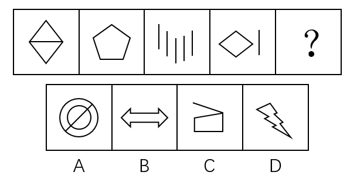
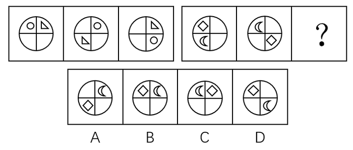
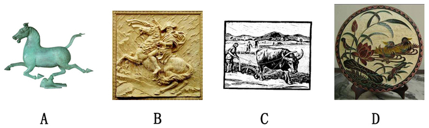

# 2017年新疆兵团公务员录用考试《行测》题（网友回忆版）

> 判断推理 · 25 题 · 新疆 2017

## 第 1 题　qid 2144664 · 图形推理

根据所给图形的既有规律，选出一个最合理的答案（    ）。

- **A**. A
- **B**. B
- **C**. C　✅
- **D**. D

**答案**：C

**官方解析**

元素组成不同，且无明显属性规律，考虑数量规律。图3、图4出现了多条单一直线，优先数直线。题干中所有图形均为5条直线构成，则？处也应为5条直线构成的图形。A项为1条直线，B项为10条直线，C项为5条直线，D项为11条直线。
故正确答案为C。

---

## 第 2 题　qid 2144665 · 图形推理

根据所给图形的既有规律，选择一个最合理的答案（    ）。

- **A**. A
- **B**. B　✅
- **C**. C
- **D**. D

**答案**：B

**官方解析**

方法一：元素组成不同，且无明显属性规律，考虑数量规律。观察题干发现，题干图形中出现多边形，优先考虑数线。第一组图形的线数量分别为3、7、4，图一线数量与图三线数量之和为图二线数量，第二组图形的线数量分别为3、8、？，则？处应为5条线组成的图形。只有B项符合。
方法二：元素组成不同，且无明显属性规律，考虑数量规律。观察题干发现，第一组图形的点数量分别为3、7、4，图一点数量与图三点数量之和为图二点数量，第二组图形的点数量分别为5、8、？，则？处应为有3个交点的图形。A项点数量为4个，B项点数量为4个，C项点数量为4个，D项点数量为3个。只有D项符合。
本题为争议题，线数量和点数量均能选出唯一答案，但本题数线特征更为明显，优先考虑数量规律，更倾向于线数量的命题特征，因此粉笔倾向于数线的规律。
故正确答案为B。

---

## 第 3 题　qid 2144666 · 图形推理

根据所给图形的既有规律，选出一个最合理的答案（    ）。

- **A**. A
- **B**. B　✅
- **C**. C
- **D**. D

**答案**：B

**官方解析**

元素组成相同，优先考虑位置规律。第一组图形中，图一最上方的小直线每次顺时针移动一格，另外两条直线每次顺时针移动四格，第二组图形中，图一最上方的两条直线每次顺时针移动四格，图一右下方小直线每次也为顺时针移动一格（注：图一右侧的小直线在图二未体现，应为与其他直线重叠），故？处也应符合此规律，只有B项符合该规律。
故正确答案为B。

---

## 第 4 题　qid 2144667 · 图形推理

根据所给图形的既有规律，选出一个最合理的答案（    ）。

- **A**. A
- **B**. B　✅
- **C**. C
- **D**. D

**答案**：B

**官方解析**

元素组成相同，优先考虑位置规律。第一组图形中，三角形每次顺时针或逆时针移动两格，圆形每次顺时针移动一格，第二组图形中，菱形每次顺时针或逆时针移动两格，月亮每次顺时针移动一格，则？处也应符合此规律，只有B项符合该规律。
故正确答案为B。

---

## 第 5 题　qid 2144669 · 图形推理

根据所给图形的既有规律，选出一个最合理的答案（    ）。

- **A**. A
- **B**. B　✅
- **C**. C
- **D**. D

**答案**：B

**官方解析**

元素组成相同，优先考虑位置规律。第一组图的图二可由图一整体旋转90度形成，也可左右翻转形成，图二到图三也是同样的规律。但根据第二组图可知，若图一到图二左右翻转而来，则选项无相应答案，因此图一到图二为整体顺时针旋转90度，？处为图二顺时针旋转90度，只有B项符合该规律。
故正确答案为B。

---

## 第 6 题　qid 2144672 · 图形推理

把下面的六个图形分为两类，使每一类图形都有各自的共同特征或规律，分类最为恰当的一项是（  ）。

- **A**. ①②③，④⑤⑥
- **B**. ①②④，③⑤⑥
- **C**. ①③⑤，②④⑥
- **D**. ①④⑤，②③⑥　✅

**答案**：D

**官方解析**

元素组成不同，且无明显属性规律，考虑数量规律。题干图形均为汉字，考虑数汉字笔画数（此处的笔画数为汉字在语文中标准笔画数量）。观察发现，①④⑤为5笔写成，②③⑥为8笔写成，故①④⑤为一组，②③⑥为一组。
故正确答案为D。

---

## 第 7 题　qid 2144673 · 定义判断

好意实惠是指当事人之间无意设定法律上的权利义务关系，而由当事人一方基于良好的道德风尚实施的使另一方受恩惠的关系。下列不属于好意实惠关系的是（  ）。

- **A**. 甲看到行动不便的盲人乙在过马路，主动过去帮助乙通过了马路
- **B**. 丙驾驶摩托车经过丁婆婆身边，主动询问是否需要帮助，然后把丁婆婆送到了目的地而未收取费用
- **C**. 吴某在其便利店中帮人收取快递并保管三天，收取1元的手续费　✅
- **D**. 何某看到邻居张某离开家没有锁门，于是帮张某把门锁好

**答案**：C

**官方解析**

第一步：找出定义关键词。
“当事人之间无意设定法律上的权利义务关系”、“基于良好的道德风尚”、“使另一方受恩惠”。
第二步：逐一分析选项。
A项：甲没有法定的权利义务帮助盲人，基于自己的善良去主动帮助了行动不便的盲人，使得盲人受益，符合定义，排除； 
B项：丙没有法定的权利义务去帮助丁婆婆，基于道德帮助她并且未收取费用，使得丁婆婆受益，符合定义，排除；
C项：吴某帮人并非基于道德风尚并使他人受恩惠，而是借此收取手续费盈利，不符合定义，当选；
D项：何某没有法定的权利义务去帮助邻居锁门，基于道德帮助邻居锁好门，使得邻居受益，符合定义，排除。
本题为选非题，故正确答案为C。

---

## 第 8 题　qid 2144675 · 定义判断

圆雕，是指不附着在任何背景上、可以从各个角度欣赏的立体的雕塑。其手法与形式多种多样，有写实性的与装饰性的，也有具体的与抽象的，着色的与非着色的等。根据上述定义，下图所示雕塑作品中，属于圆雕的是（  ）。

- **A**. A　✅
- **B**. B
- **C**. C
- **D**. D

**答案**：A

**官方解析**

第一步：找出定义关键词。
“不附着在任何背景上”、“可以从各个角度欣赏的立体的雕塑”。
第二步：逐一分析选项。
A项：是不附着在任何背景上，可以从各个角度欣赏的立体雕塑，符合定义，当选；
B项：附着在了背景上，无法从各个角度欣赏，不符合定义，排除；
C项：附着在了背景上，无法从各个角度欣赏，不是立体雕塑，不符合定义，排除；
D项：附着在了背景上，无法从各个角度欣赏，不是立体雕塑，不符合定义，排除。
故正确答案为A。

---

## 第 9 题　qid 2144677 · 定义判断

心理暗示是人们为了某种目的，在无对抗的条件下，用含蓄的、间接的方式发出一定的信息，使他人或自己接受所示意的观点、意见，或按所示意的方式进行活动。根据上述定义，下列不属于心理暗示的是（  ）。

- **A**. 望梅止渴
- **B**. 杯弓蛇影
- **C**. 草木皆兵
- **D**. 知己知彼　✅

**答案**：D

**官方解析**

第一步：找出定义关键词。
“无对抗的条件下”、“含蓄的、间接的方式”、“使他人或自己接受所示意的观点、意见，或按所示意的方式进行活动”。
第二步：逐一分析选项。
A项：望梅止渴，讲述的是曹操为了加快行军速度，用“梅子”间接诱导士兵联想到了“酸”，从而使士兵口腔分泌大量唾液起到了暂时解渴的效果，比喻愿望无法实现，用空想安慰自己。曹操为了达到鼓励行军的目的，在无对抗的条件下，凭借梅子会使人分泌唾液这个含蓄的方式，暗示士兵继续前进，马上就可以有吃喝，符合定义，排除； 
B项：杯弓蛇影，指见到弓的影子联想到了蛇而恐慌，形容疑神疑鬼，自相惊扰。通过错觉这个含蓄、间接的方式，使自己接受自己看到的错觉，让自己感到恐惧，符合定义，排除；
C项：草木皆兵，把山上的草木也当做敌兵，形容人在惊慌时疑神疑鬼。通过错觉这个含蓄、间接的方式，使自己接受自己看到的错觉，让自己感到恐惧，符合定义，排除；
D项：知己知彼，指对敌我双方的优劣短长均能透彻的了解，是对现实的情况进行客观的分析，不存在含蓄的、间接的方式，也没有体现“使他人或自己接受所示意的观点、意见，或按所示意的方式进行活动”，不符合定义，当选。
本题为选非题，故正确答案为D。

---

## 第 10 题　qid 2144679 · 定义判断

环境影响评价指拟定开发计划或建设项目时，事前对该计划或项目将给大气、水体、土壤、生物以及由它们组成的环境系统造成什么影响，这些影响的结果又将对人类的健康和生活环境以及自然环境和经济、文化、历史环境造成什么影响所进行的调查、预测与评价，以及据此制定出防止或减少环境污染和破坏的对策与措施。根据上述定义，下列属于环境影响评价行为的是（  ）。

- **A**. 某零售公司在建新商场之前，对周围的居民进行调查以确定其购买能力
- **B**. 某市在建设垃圾处理厂之前，请专家对全市垃圾总量进行评估，以确定垃圾处理厂的规模
- **C**. 某市在建飞机场后，由于连续发生了多起飞行安全事故，邀请专家对飞机场提出改进措施
- **D**. 某市在建立污水处理厂之前，请专家对周边的河流、水文进行检测后，并提出相应的控制性建议　✅

**答案**：D

**官方解析**

第一步：找出定义关键词。
“事前对该计划或项目将给大气、水体、土壤、生物以及由它们组成的环境系统造成什么影响”、“影响的结果又将对人类的健康和生活环境以及自然环境和经济、文化、历史环境造成什么影响所进行的调查、预测与评价”、“据此制定出防止或减少环境污染和破坏的对策与措施”。
第二步：逐一分析选项。
A项：零售公司对周围的居民进行调查，是为了确定居民的购买能力，不是调查建商场对环境会造成什么影响，也不是根据调查制定减少环境污染的对策，不符合定义，排除； 
B项：某市请专家对全市的垃圾总量进行评估，是为了确定垃圾处理厂的规模，不是对建设垃圾处理厂将对环境带来什么影响做调查，也不是根据调查制定减少环境污染的对策，不符合定义，排除；
C项：发生了多起事故后邀请专家提出改进措施，并非事前的调查评估，且也不是针对环境方面的，不符合定义，排除；
D项：在建立污水处理厂之前，请专家对周围的河流、水文检测，提出了相应的控制性建议，符合题干所说的事前对环境的影响进行评估，根据评估制定防止或减少环境污染的对策，符合定义，当选。
故正确答案为D。

---

## 第 11 题　qid 2144683 · 定义判断

单位犯罪，指公司、企业、事业单位、机关、团体实施的危害社会的、依照法律规定应受惩罚的行为。根据上述定义，下列属于单位犯罪的是（  ）。

- **A**. 某医院的院长利用职务之便收受贿赂
- **B**. 某事业单位一名员工因对领导不敬，因此被降职
- **C**. 某班级的学生认为教师甲的教学能力差，因此集体向学校领导提出开除该老师的建议
- **D**. 某公司派一名员工去另一对手公司偷窃商业机密文件以用于自己公司的发展　✅

**答案**：D

**官方解析**

第一步：找出定义关键词。
“公司、企业、事业单位、机关、团体实施”、“危害社会的行为”、“依照法律规定应受惩罚的行为”。
第二步：逐一分析选项。
A项：实施受贿的是院长，是个人所为，并不是医院所为，不符合定义，排除； 
B项：员工被降职是事业单位授权所为，但他的行为并没有危害社会，也不是依照法律规定应受惩罚的行为，不符合定义，排除；
C项：因为教师教学能力差，学生集体建议学校领导开除该老师，此行为并非危害社会的行为，也并非依照法律规定应受惩罚的行为，不符合定义，排除；
D项：偷窃商业机密文件是公司指派人完成的，是公司的授意所为，且该行为是按照法律规定应受惩罚的行为，符合定义，当选。
故正确答案为D。

---

## 第 12 题　qid 2144685 · 类比推理

“邯郸学步”这则典故是指到邯郸去学走路的步法。战国时期，一个燕国人听说赵国邯郸人走姿很漂亮，便来到邯郸学习邯郸人走路。未得其能，又忘记自己的走姿，最后爬着回到了燕国。根据上述文字，下列最能够解释成语“邯郸学步”的涵义的是（  ）。

- **A**. 装模作样
- **B**. 盲目模仿　✅
- **C**. 本末倒置
- **D**. 一成不变

**答案**：B

**官方解析**

第一步：找出定义关键词。
“到邯郸去学走路的步法”、“未得其能，又忘记自己的走姿”。
第二步：逐一分析选项。
A项：装模作样，指故意做作，故作姿态，题干没有涉及，不符合定义，排除；
B项：题干体现了该燕国人一味地模仿别人，最后把原本的本事也丢了，也就是盲目模仿，符合定义，当选；
C项：本末倒置，指把主要的和次要的、本质和非本质的关系弄颠倒了，题干没有涉及，不符合定义，排除；
D项：一成不变，指一经形成，不再改变，题干没有涉及不再改变，不符合定义，排除。
故正确答案为B。

---

## 第 13 题　qid 2144688 · 逻辑判断

因工作需要，K单位安排了甲、乙、丙、丁、戊五人在10月1-5日的晚上进行值班。每人只需值一晚，且每晚只安排一人。甲说：“乙在1号值班，我在3号值班。”乙说：“丙在1号值班，丁在4号值班。”丙说：“甲在2号值班，戊在5号值班。”丁说：“丙在3号值班，乙在4号值班。”戊说：“丁在2号值班，我在3号值班。”如果每个人都只说对了一个人的值班时间，由此可以推出（  ）。

- **A**. 3号值班的是戊
- **B**. 2号值班的不是丁
- **C**. 1号值班的是丙　✅
- **D**. 4号值班的不是乙

**答案**：C

**官方解析**

第一步：分析题干。
① 甲：乙在1号值班，甲在3号值班。
② 乙：丙在1号值班，丁在4号值班。
③ 丙：甲在2号值班，戊在5号值班。
④ 丁：丙在3号值班，乙在4号值班。
⑤ 戊：丁在2号值班，戊在3号值班。
⑥ 每个人都只说对了一个人的值班时间。
第二步：根据题干条件分析选项。
假设①的前半句为真，即乙在1号值班，则甲不在3号值班；根据乙在1号值班，结合②，可知丙不在1号值班，则丁在4号值班；根据丁在4号值班，结合⑤，可知戊在3号值班；根据戊在3号值班，结合④，可知乙在4号值班，与丁在4号值班矛盾，则假设不成立，即甲的前半句为假，后半句为真，即乙不在1号值班，甲在3号值班。
根据甲在3号值班，结合⑤，可知丁在2号值班；根据甲在3号值班，结合④，可知乙在4号值班；根据乙在4号值班，结合②，可知丙在1号值班。
故正确答案为C。

---

## 第 14 题　qid 2144692 · 逻辑判断

在过去的15年中，动物学家每年都在南极帝企鹅的主要繁殖地统计它们的数量。结果发现南极帝企鹅的数量从6000只下降为1500只。由此可见，南极帝企鹅的数量在急剧下降。以下（  ）如果为真，不能支持上述结论。

- **A**. 帝企鹅的哺育工作几乎完全都在海冰上完成，上升的气温使南极海冰加速萎缩，致使帝企鹅幼仔成活率急剧下降
- **B**. 全球气候变暖使南极地区的暴风雪变成了暴风雨，小企鹅在被暴雨淋湿身体后，因体温过低而被冻死
- **C**. 由于全球温室效应持续增强，致使帝企鹅赖以生存的磷虾数目急剧减少
- **D**. 在地球的北极发现，该地区的北极熊数量有所增加　✅

**答案**：D

**官方解析**

第一步：找出论点和论据。
论点：南极帝企鹅的数量在急剧下降。
论据：南极帝企鹅的数量从6000只下降为1500只。
第二步：逐一分析选项。
A项：气温的上升导致南极帝企鹅的幼仔成活率急剧下降，从而导致了帝企鹅数量的减少，解释了南极帝企鹅数量下降的原因，补充论据加强论点，排除；
B项：全球气候变暖引发的暴风雨导致了很多小企鹅被冻死，解释了南极帝企鹅数量下降的原因，补充论据加强论点，排除；
C项：全球温室效应导致作为帝企鹅食物来源的磷虾的数量剧减，威胁了帝企鹅的生存，导致了帝企鹅数量的减少，解释了南极帝企鹅数量下降的原因，补充论据加强论点，排除； 
D项：阐述的是北极地区的北极熊数量增加，与南极帝企鹅数量的变化无关，无法加强，当选。
本题为选非题，故正确答案为D。

---

## 第 15 题　qid 2144697 · 逻辑判断

中国机器人产业联盟发布消息称，我国工业机器人销量是6.8万台，增长速度是，高于预期的。有生产商表示，工业机器人销量之所以如此高是因为东南亚国家对我国生产的工业机器人的青睐。上述结论的假设前提是（  ）。

- **A**. 东南亚市场在中国工业机器人销售市场中占较大的比重　✅
- **B**. 我国对东南亚国家实行优惠政策
- **C**. 东南亚国家生产机器人的技术没有我国精湛
- **D**. 我国工业机器人在全球市场上销量都遥遥领先

**答案**：A

**官方解析**

第一步：找出论点和论据。
论点：工业机器人销量之所以如此高是因为东南亚国家对我国生产的工业机器人的青睐。
论据：无。
第二步：逐一分析选项。
A项：假设东南亚市场在中国工业机器人销售市场中没有占较大的比重，那么无法得到机器人销量高的原因是东南亚国家的青睐，选项补充了论点的必要条件，可以加强，当选；
B项：我国对东南亚国家实行优惠政策只能说明在价格上的优惠，但是不能说明东南亚市场对我国工业机器人销量的影响情况，无法加强，排除；
C项：东南亚国家的工业机器人制造技术没有我国精湛，只能说明为什么东南亚国家喜欢买我国的工业机器人，但是不能解释为什么我国的工业机器人的销量直接受东南亚国家的影响，无法加强，排除； 
D项：阐述的是我国工业机器人在全球的销量，与我国工业机器人销量和东南亚国家市场的关系无关，无法加强，排除。
故正确答案为A。

---

## 第 16 题　qid 2144693 · 逻辑判断

在超市和农贸市场，常会看到被捆成一小捆的蔬菜。捆扎蔬菜一方面是为了方便购买，另一方面也是商家防止“精明”的大爷大妈们过分挑拣。过去捆扎蔬菜多用草绳，而近年来用五颜六色的胶带捆扎的现象越来越常见。胶带几乎没有重量，不必担心商家借此压秤。因此使用胶带捆绑蔬菜不仅美观大方，也显得更干净。以下选项中最能反驳上述论断的是（  ）。

- **A**. 使用胶带捆绑蔬菜的成本比使用草绳高
- **B**. 捆绑蔬菜用的草绳往往是不干净的，并且可能会含有虫害
- **C**. 胶带携带方便，使用简单
- **D**. 胶带中常残留有各种致癌的有毒物质，使用胶带捆绑蔬菜会使有毒物质转移到蔬菜上　✅

**答案**：D

**官方解析**

第一步：找出论点和论据。
论点：使用胶带捆绑蔬菜不仅美观大方，也显得更干净。
论据：胶带几乎没有重量，不必担心商家借此压秤。
第二步：逐一分析选项。
A项：阐述的是胶带的成本比草绳高，与胶带捆绑蔬菜是否美观干净无关，无法削弱，排除；
B项：草绳不干净，可能会有虫害，说明胶带确实比草绳干净，补充论据加强论点，无法削弱，排除；
C项：胶带容易携带，使用简单，但用于捆绑蔬菜是否美观大方并且更干净并未说明，属于无关项，无法削弱，排除； 
D项：胶带中的有毒物质会转移到蔬菜中，说明胶带捆绑蔬菜并不干净，其中有很大的危害，直接削弱论点，当选。
故正确答案为D。

---

## 第 17 题　qid 2144715 · 逻辑判断

冬天来临，网上一篇关于洗澡顺序的文章广为流传。该文称，人的血管非常脆弱，遇上高温会热胀，一不小心就会爆裂，冬天洗澡时，如果先洗头，会使血液突然聚集到头部，容易诱发脑血管疾病甚至导致脑溢血。若下列论断为真，最能削弱上述结论的是（  ）。

- **A**. 有研究机构称，人的血管是人体中最脆弱的部分
- **B**. 调查表明，有很多南方人在冬天时仍然坚持用冷水洗澡
- **C**. 据统计，日本每年冬天有1.4万人在洗热水澡时死亡
- **D**. 洗热水澡时由于体温升高、心率加快、用力过猛会引起血压变化，血压高是引发脑溢血的根本原因　✅

**答案**：D

**官方解析**

第一步：找出论点和论据。
论点：冬天洗热水澡如果先洗头，容易诱发脑血管疾病甚至导致脑溢血。
论据：人的血管非常脆弱，遇上高温会热胀，一不小心就会爆裂。
第二步：逐一分析选项。
A项：人的血管是人体中最脆弱的部分，肯定了题干论据，无法削弱，排除；
B项：阐述的是现在南方人洗冷水澡的习惯，与洗热水澡从头部先洗对脑血管疾病的影响无关，属于无关项，无法削弱，排除；
C项：日本每年冬天有1.4万人在洗热水澡时死亡，死亡原因未知，与洗澡时先洗头是否会诱发疾病无关，属于无关项，无法削弱，排除； 
D项：说明洗澡时易患心血管疾病的根本原因是血压问题而不是血管问题，直接削弱论点，当选。
故正确答案为D。

---

## 第 18 题　qid 2144722 · 逻辑判断

一些住在核电站附近的人担心，核电站的辐射会造成人体伤害。更多的人则担心，核电站一旦发生爆炸，其危害将不亚于核武器。若下列论断为真，最能消除更多的人担心的问题的是（  ）。

- **A**. 核电站使用的核燃料浓度很低，远远未达到核武器爆炸所要求的浓度，且二者的作用原理和机制不一样　✅
- **B**. 核辐射只要不超过一定的标准，就不会对人体产生危害
- **C**. 30多年前，苏联切尔诺贝利核电站曾发生过严重的爆炸事故，造成的灾难至今还难以消除
- **D**. 现代核电站的技术已经相当完善，很多发达国家都建立了不少的核电站

**答案**：A

**官方解析**

第一步：找出论点和论据。
论点：核电站一旦发生爆炸，其危害将不亚于核武器。
论据：无
第二步：逐一分析选项。
A项：核电站使用的核燃料浓度远未达到核武器爆炸所要求的浓度，说明核电站爆炸的可能性较低，二者的作用原理和机制不一样，说明即使爆炸也无法造成与核武器类似的危害，削弱论点，当选；
B项：阐述的是核辐射是否对人体有害，题干论点讨论的核电站爆炸的危害，选项与论点话题不一致，无法削弱，排除；
C项：以30多年前切尔诺贝利核电站的爆炸事故为例，说明核电站若发生爆炸，危害确实很大，加强了题干论点，无法削弱，排除； 
D项：现代的核电站技术已经相当完善，但是技术完善并不能说明一定不会发生核电站爆炸，爆炸后的危害也未涉及，无法削弱，排除。
故正确答案为A。

---

## 第 19 题　qid 2144725 · 类比推理

与“海水：澎湃”这组词逻辑关系最为相近的一项是（  ）。

- **A**. 西瓜：香甜　✅
- **B**. 道路：修建
- **C**. 策划：推广
- **D**. 平原：山林

**答案**：A

**官方解析**

第一步：判断题干词语间的逻辑关系。
澎湃是海水的属性，二者为属性的对应关系。
第二步：判断选项词语间的逻辑关系。
A项：香甜是西瓜的属性，二者为属性的对应关系，与题干逻辑关系一致，当选；
B项：修建道路，二者是动宾关系，与题干逻辑关系不一致，排除；
C项：先策划，再推广，二者为时间的先后顺序，与题干逻辑关系不一致，排除；
D项：平原是一种地貌形态，山林指的有山有林的地区，二者没有必然的联系，与题干逻辑关系不一致，排除。
故正确答案为A。

---

## 第 20 题　qid 2144728 · 类比推理

与“预习：上课：复习”这组词逻辑关系最为相近的一项是（  ）。

- **A**. 高考：考试：大学
- **B**. 调研：设计：生产　✅
- **C**. 痊愈：挂号：出院
- **D**. 笔试：面试：报名

**答案**：B

**官方解析**

第一步：判断题干词语间的逻辑关系。
先预习，再上课，最后复习，三者之间是时间先后顺序的对应关系。
第二步：判断选项词语间的逻辑关系。
A项：高考是考试的一种，二者是种属关系，大学需要考试，二者是对应关系，与题干逻辑关系不一致，排除；
B项：先调研，再设计，最后生产，三者之间是时间先后顺序的对应关系，与题干逻辑关系一致，当选；
C项：先挂号，再痊愈，最后出院，挂号和痊愈的顺序反了，与题干逻辑关系不一致，排除；
D项：先报名，再笔试，最后面试，也可能是先报名，再面试，再笔试，报名应该在笔试和面试之前，与题干逻辑关系不一致，排除。
故正确答案为B。

---

## 第 21 题　qid 2144730 · 类比推理

与“实现：远大：梦想”这组词逻辑关系最为相近的一项是（  ）。

- **A**. 完成：重要：任务　✅
- **B**. 建造：高楼：大厦
- **C**. 购买：消费：物品
- **D**. 补给：粮食：物品

**答案**：A

**官方解析**

第一步：判断题干词语间的逻辑关系。
造句子：实现远大的梦想。三者为语法关系，实现与梦想是动宾关系，远大与梦想是偏正结构。
第二步：判断选项词语间的逻辑关系。
A项：造句子，完成重要的任务，三者为语法关系，完成与任务是动宾关系，重要与任务是偏正结构，与题干逻辑关系一致，当选；
B项：造句子，建造高楼的大厦，造句子不通顺，高楼与大厦不是偏正结构，与题干逻辑关系不一致，排除；
C项：造句子，购买消费的物品，造句子不通顺，消费与物品不是偏正结构，与题干逻辑关系不一致，排除；
D项：造句子，补给粮食的物品，造句子不通顺，粮食与物品不是偏正结构，与题干逻辑关系不一致，排除。
故正确答案为A。

---

## 第 22 题　qid 2144732 · 类比推理

与“奖金：奖励：激励”这组词逻辑关系最为相近的一项是（  ）。

- **A**. 复习：考试：毕业
- **B**. 书法：音乐：艺术
- **C**. 打折：促销：竞争　✅
- **D**. 失败：成功：成长

**答案**：C

**官方解析**

第一步：判断题干词语间的逻辑关系。
奖金是奖励的一种方式，二者为种属关系；奖励的目的是激励，二者为对应关系。
第二步：判断选项词语间的逻辑关系。
A项：先复习，再考试，最后毕业，三者之间是时间的先后顺序，与题干逻辑关系不一致，排除；
B项：书法和音乐是并列关系，书法和音乐都是艺术的一种，前两词和第三词是种属关系，与题干逻辑关系不一致，排除；
C项：打折是促销的一种方式，二者为种属关系；促销的目的是竞争，二者为对应关系，与题干逻辑关系一致，当选；
D项：失败和成功是反义关系，二者都是成长过程中可能经历的过程，与题干逻辑关系不一致，排除。
故正确答案为C。

---

## 第 23 题　qid 2144735 · 类比推理

“编辑部”对于（  ）相当于（  ）对于“学校”。

- **A**. 作者  校园
- **B**. 期刊  学生
- **C**. 人事处  幼儿园
- **D**. 出版社  教务处　✅

**答案**：D

**官方解析**

逐一代入选项。
A项：编辑部是作者编辑作品的地方，二者为对应关系；学校和校园二者为全同关系，前后逻辑关系不一致，排除；
B项：编辑部编辑期刊，学生不能编辑学校，学生应在学校里读书，前后逻辑关系不一致，排除；
C项：编辑部和人事处是两个不同的工作部门，二者为并列关系；幼儿园是学校的一种，二者为种属关系，前后逻辑关系不一致，排除；
D项：编辑部是出版社的一个部门，二者为组成关系；教务处是学校的一个部门，二者为组成关系，前后逻辑关系一致，当选。
故正确答案为D。

---

## 第 24 题　qid 2144737 · 类比推理

（  ）对于“碧螺春”相当于“景德镇”对于（  ）。

- **A**. 苏州  瓷器　✅
- **B**. 宜兴  陶都
- **C**. 茶叶  白瓷
- **D**. 绿茶  锦都

**答案**：A

**官方解析**

逐一代入选项。
A项：苏州盛产碧螺春，二者为对应关系；景德镇盛产瓷器，二者为对应关系，前后逻辑关系一致，当选；
B项：宜兴盛产紫砂壶而不是碧螺春；陶都是宜兴的别称，和景德镇没有必然的联系，景德镇的别称是瓷都，前后逻辑关系不一致，排除；
C项：碧螺春是一种茶叶，二者为种属关系；白瓷是一种瓷器，景德镇出产白瓷，二者是对应关系，前后逻辑关系不一致，排除；
D项：碧螺春是绿茶的一种，二者为种属关系；锦都是成都的别称，和景德镇没有必然的联系，景德镇的别称是瓷都，前后逻辑关系不一致，排除。
故正确答案为A。

---

## 第 25 题　qid 2144743 · 类比推理

（  ）对于“折射”相当于“杯弓蛇影”对于（  ）。

- **A**. 一叶障目  透射
- **B**. 小孔成像  衍射
- **C**. 碧空如洗  散射
- **D**. 海市蜃楼  反射　✅

**答案**：D

**官方解析**

逐一代入选项。
A项：一叶障目的意思是一片叶子挡在眼前会让人看不到外面的广阔世界，是光的直射原理，不是折射；杯弓蛇影是光的反射，不是透射，前后逻辑关系不一致，排除；
B项：小孔成像是光的直射原理，不是折射；杯弓蛇影是光的反射原理，不是衍射，前后逻辑关系不一致，排除；
C项：碧空如洗指蓝色的天空像洗过一样的明净，形容天气晴朗，和折射没有必然的联系；杯弓蛇影是光的反射原理，不是散射，前后逻辑关系不一致，排除；
D项：海市蜃楼是光的折射现象；杯弓蛇影是光的反射原理，前后逻辑关系一致，当选。
故正确答案为D。

---
