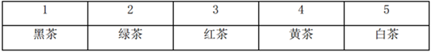
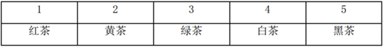
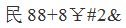
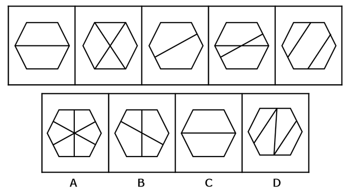
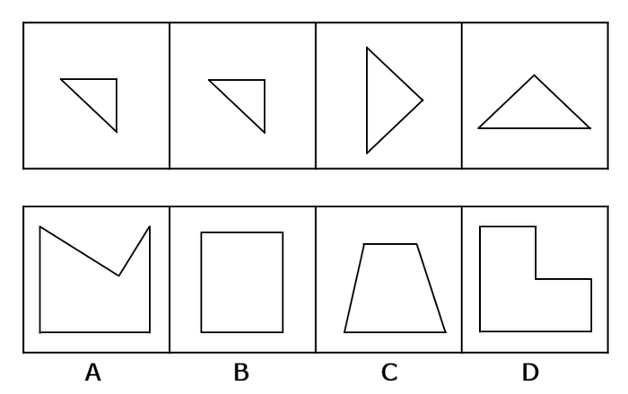
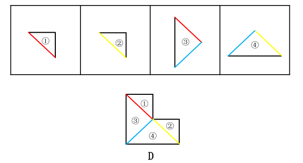
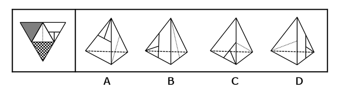
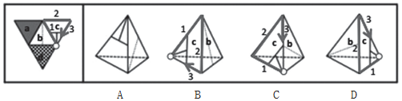
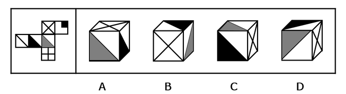
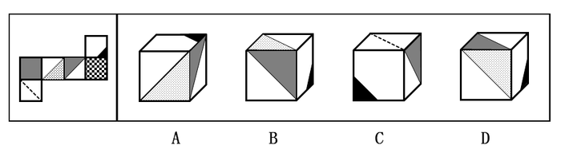

# 2017年江苏省公务员录用考试《行测》题(A类)

> 判断推理 · 45 题 · 江苏 2017

## 材料 1

黑茶、白茶、黄茶等5种茶叶装在1-5号5个盒子中，每个盒子只装1种茶叶，已知：

（1）黄茶装在2号或者4号盒子中；

（2）如果白茶装在3号盒子中，则绿茶装在5号盒子中；

（3）红茶装在1号或者2号盒子中，当且仅当黑茶装在5号盒子中。

### 第 1 题　qid 2042788 · 类比推理

如果白茶装在3号盒子中，则黑茶装在哪个盒子中？

- **A**. 1号　✅
- **B**. 2号
- **C**. 4号
- **D**. 5号

**答案**：A

**官方解析**

第一步：翻译题干。

（1）黄茶装2号或者4号。

（2）白茶装3号绿茶装5号。

（3）红茶装在1号或者2号盒子中，当且仅当黑茶装在5号盒子中。当且仅当为充要条件，翻译为：红茶装1号或2号黑茶装5号。

第二步：分析选项。

如下表，如果白茶装3号盒子，根据条件（2），绿茶装5号。根据条件（3），黑茶不装5号，红茶不装1号和2号，所以红茶装4号。根据条件（1），黄茶装2号，所以，黑茶装1号。A项正确。

故正确答案为A。

---

### 第 2 题　qid 2042792 · 类比推理

如果绿茶装在2号盒子中，白茶没有装在1号盒子中，则黑茶装在哪个盒子中？

- **A**. 1号　✅
- **B**. 3号
- **C**. 4号
- **D**. 5号

**答案**：A

**官方解析**

分析题干。

（1）黄茶装2号或者4号。

（2）白茶装3号绿茶装5号。

（3）红茶装在1号或者2号盒子中，当且仅当黑茶装在5号盒子中。当且仅当为充要条件，翻译为：红茶装1号或2号黑茶装5号。

如下表，如果绿茶装2号，那么根据条件（1），黄茶装4号。白茶不装1号，假如白茶装3号，那么绿茶装5号，与题干条件矛盾，所以，白茶装5号。根据条件（3），黑茶不装5号，红茶不装1号和2号，所以红茶装3号，黑茶装1号。A项正确。

故正确答案为A。

---

### 第 3 题　qid 2042796 · 类比推理

如果黑茶装在5号盒子中，黄茶没有装在4号盒子中，则绿茶装在哪个盒子中？

- **A**. 1号
- **B**. 2号
- **C**. 3号　✅
- **D**. 4号

**答案**：C

**官方解析**

分析题干。

（1）黄茶装2号或者4号。

（2）白茶装3号绿茶装5号。

（3）红茶装在1号或者2号盒子中，当且仅当黑茶装在5号盒子中。当且仅当为充要条件，翻译为：红茶装1号或2号黑茶装5号。

如下表，如果黑茶装5号，黄茶没有装4号，根据条件（1），那么黄茶装2号。根据条件（3），红茶装1号。根据条件（2），绿茶不装5号，那么白茶不装3号，则白茶装4号，所以，绿茶装3号。C项正确。

故正确答案为C。

---

### 第 4 题　qid 2042554 · 类比推理

文物：建筑

- **A**. 烹饪：佐料
- **B**. 故宫：楼房
- **C**. 诗人：教授　✅
- **D**. 皮鞋：布鞋

**答案**：C

**官方解析**

第一步：分析题干词语间逻辑关系。
文物和建筑是交叉关系，有的文物是建筑，有的建筑是文物。
第二步：判断选项词语间逻辑关系。
A项：烹饪需要佐料，二者为对应关系，不符合题干的逻辑关系，排除；
B项：故宫里面有楼房，二者是组成关系，不符合题干的逻辑关系，排除；
C项：有的诗人是教授，有的教授是诗人，符合题干的逻辑关系，当选；
D项：皮鞋和布鞋是并列关系，不符合题干的逻辑关系，排除。
故正确答案为C。

---

### 第 5 题　qid 2042556 · 类比推理

园：园中园

- **A**. 楼：楼外楼
- **B**. 人：梦中人
- **C**. 月：水中月
- **D**. 画：画中画　✅

**答案**：D

**官方解析**

第一步：分析题干词语间逻辑关系。
“园”同“园中园”的园都指园子，且“园中园”是园中之园,两个“园”之间是组成关系。
第二步：判断选项词语间逻辑关系。
A项：“楼”和“楼外楼”所指楼相同，但“楼外楼”中的两个“楼”是并列关系，不是组成关系，不符合题干的逻辑关系，排除；
B项：“人”和“梦中人”所指相同，但“梦中人”只出现一个“人”，跟“园中园”的格式不对应，不符合题干的逻辑关系，排除；
C项：“月”和“水中月”所指相同，但“水中月”只出现一个“月”跟“园中园”的格式不对应,不符合题干的逻辑关系，排除；
D项：“画”和“画中画”都指画，且“画中画”是画中之画，两个“画”之间是组成关系，符合题干的逻辑关系，当选。
故正确答案为D。

---

### 第 6 题　qid 2042558 · 类比推理

铁路：道路

- **A**. 南京：江苏
- **B**. 空调：家电　✅
- **C**. 英国：西欧
- **D**. 美国：国家

**答案**：B

**官方解析**

第一步：判断题干词语间逻辑关系。
铁路是道路，二者为种属关系，且铁路是一种统称，铁路有很多不同的路线。
第二步：判断选项词语间逻辑关系。
A 项：南京是江苏的组成部分，二者为组成关系，与题干逻辑关系不一致，排除；
B 项：空调是家电，二者为种属关系，且空调是一种统称，空调有很多不同的品牌和型号，与题干逻辑关系一致，当选；
C 项：英国是西欧的组成部分，二者为组成关系，与题干逻辑关系不一致，排除；
D 项：美国和国家是种属关系，但是美国不是统称，是特指美国这一个国家，不存在很多个美国，与题干逻辑关系不一致，排除。
故正确答案为B。

---

### 第 7 题　qid 2042560 · 类比推理

人去：楼空

- **A**. 鸟尽：弓藏　✅
- **B**. 兽聚：鸟散
- **C**. 鸢飞：鱼跃
- **D**. 虎踞：龙盘

**答案**：A

**官方解析**

第一步：判断题干词语间逻辑关系。
人去是楼空的原因，二者是对应关系中的因果关系。同时，人去楼空是一个成语，指人已离去，楼中空空。比喻故地重游时睹物思人的感慨。
第二步：判断选项词语间逻辑关系。
A项：鸟尽是弓藏的原因，鸟尽弓藏指的是鸟没有了，弓也就藏起来不用了。比喻事情成功之后，把曾经出过力的人一脚踢开。二者是对应关系中的因果关系，与题干逻辑关系一致，当选；
B项：兽聚与鸟散是并列关系，兽聚鸟散指的是像鸟兽般时聚时散，常用来形容组织性极差，与题干逻辑关系不一致，排除；
C项：鸢飞与鱼跃是并列关系，鸢飞鱼跃指的是鹰在天空飞翔，鱼在水中腾跃，形容万物各得其所，与题干逻辑关系不一致，排除；
D项：虎踞和龙盘是并列关系，虎踞龙盘，形容地势险要,易守难攻。通常指帝都而言，亦专指南京，与题干逻辑关系不一致，排除。
故正确答案为A。

---

### 第 8 题　qid 2042470 · 类比推理

《大学》：《中庸》：四书

- **A**. 泰山：华山：五岳　✅
- **B**. 物欲：财欲：六欲
- **C**. 朝夕：除夕：七夕
- **D**. 春风：秋雨：四季

**答案**：A

**官方解析**

第一步：分析题干词语间逻辑关系。
《大学》和《中庸》是并列关系，二者为四书的组成部分。
第二步：判断选项词语间逻辑关系。
A项：泰山和华山是并列关系，二者为五岳的组成部分，符合题干的逻辑关系，当选；
B项：六欲是中国古代区分感情的一种分类，一般指眼（见欲，贪美色奇物）、耳（听欲，贪美音赞言）、鼻（香欲，贪香味）、舌（味欲，贪美食口快）、身（触欲，贪舒适享受）、意（意欲，贪声色、名利、恩爱）。物欲和财欲不是六欲的组成部分，不符合题干的逻辑关系，排除；
C项：朝夕指的是一天中的早晚，除夕和七夕都是传统节日，不符合题干的逻辑关系，排除；
D项：春风和秋雨都是天气现象，二者不是四季的组成部分，不符合题干的逻辑关系，排除。
故正确答案为A。

---

### 第 9 题　qid 2042140 · 类比推理

买票：乘机：抵达

- **A**. 生产：流通：消费
- **B**. 相识：相恋：结婚　✅
- **C**. 调研：调查：总结
- **D**. 申报：评审：得奖

**答案**：B

**官方解析**

第一步：判断题干词语间逻辑关系。
买票、乘机、抵达三者是逻辑关系中的对应关系，动作发出者为同一主体，并且动作有先后顺序。
第二步：判断选项词语间逻辑关系。
A项：流通的主体是商品，而生产和消费的主体是人，与题干逻辑关系不一致，排除；
B项：相识、相恋、结婚三者动作发出者为同一主体，并且三者有先后的顺序，与题干逻辑关系一致，当选；
C项：调查和总结是调研的两个环节，先调查再总结，但是与调研没有涉及到事件先后顺序，与题干逻辑关系不一致，排除；
D项：申报与得奖是同一主体，但是与评审主体不同，与题干逻辑关系不一致，排除。
故正确答案为B。

---

### 第 10 题　qid 2042566 · 类比推理

扶贫 之于 （  ） 相当于 深化改革 之于 （  ）

- **A**. 小康社会—国家治理现代化　✅
- **B**. 和谐社会—科学发展观
- **C**. 社会动员—大国治理
- **D**. 从严治党—依法治国

**答案**：A

**官方解析**

逐一代入验证选项。
A项：扶贫是实现小康社会的方式和手段，小康社会是目标，二者是逻辑关系中的对应关系；深化改革是实现国家治理现代化的方式和手段，国家治理现代化是目标，前后逻辑关系一致，当选；
B项：扶贫是和谐社会的方式和手段，和谐社会是目标，二者是逻辑关系中的对应关系；深化改革是四个全面的内容之一，与科学发展观不是对应关系，前后逻辑关系不一致，排除；
C项：扶贫需要社会动员，社会动员是扶贫的必要条件，二者是逻辑关系中的对应关系；大国治理需要深化改革，深化改革是大国治理的必要条件，二者虽然是逻辑关系中的对应关系，但是词的顺序反了，排除；
D项：扶贫是帮助贫困地区和贫困户发展经济、促进生产、摆脱贫困的一项重要社会工作，同时也是一项国家政策，而从严治党是中国共产党治党的重要原则，是改革开放和社会主义现代化建设条件下加强党的建设的基本方针和要求，二者没有必然的逻辑关系；深化改革和依法治国是四个全面的两项内容，二者是并列关系，前后逻辑关系不一致，排除。
故正确答案为A。

---

### 第 11 题　qid 2042568 · 类比推理

丝绸之路 之于 （  ） 相当于 万里长征 之于 （  ）

- **A**. 敦煌—遵义　✅
- **B**. 骆驼—草鞋
- **C**. 沙漠—海洋
- **D**. 贸易—解放

**答案**：A

**官方解析**

A项：敦煌是丝绸之路的一个途经地点，遵义是万里长征的一个途经地点，前后逻辑关系一致，保留；
B项：骆驼是丝绸之路的工具，草鞋是万里长征的工具，前后逻辑关系一致，保留；
C项：丝绸之路沿线经过沙漠，但是万里长征没有经过海洋，前后逻辑关系不一致，排除；
D项：丝绸之路的目的是贸易，万里长征的目的是战略转移和北上抗日，而非解放，前后逻辑关系不一致，排除。
比较A、B项，A项中，敦煌是古代丝绸之路上一个重要的标志性地点，敦煌因丝绸之路而闻名，而我们党在长征途中在遵义召开的遵义会议也是我们党一个重要的转折点，遵义也因此而著名；B项中，骆驼是丝绸之路中必不可少的工具，但是草鞋并不是万里长征中必不可少的，不是每一个红军战士都穿的草鞋，草鞋也不是必不可少的工具。这一道题结合时政热点，以及就题目本身的倾向性而言，A项更加贴近出题人的意图。
故正确答案为A。

---

### 第 12 题　qid 2042570 · 类比推理

BD5k6kDB

- **A**. XA99ddAX
- **B**. WQ6s8fQW
- **C**. RM4j9jMR　✅
- **D**. SEe2e2ES

**答案**：C

**官方解析**

第一步：分析题干符号间关系。
从相同符号的位置入手：位置1、8的符号相同，位置2、7的符号相同，位置4、6的符号相同，并且3、5位置上的符号不同。
第二步：判断选项符号间关系。
A项：位置1、8的符号相同，位置2、7的符号相同，位置4、6的符号不相同，与题干不一致，排除；
B项：位置1、8的符号相同，位置2、7的符号相同，位置4、6的符号不相同，与题干不一致，排除；
C项：位置1、8的符号相同，位置2、7的符号相同，位置4、6的符号相同，并且位置3、5上的符号不同，与题干保持一致，当选；
D项：位置1、8的符号相同，位置2、7的符号相同，位置4、6的符号相同，位置3、5上的符号相同，与题干不一致，排除。
故正确答案为C。

---

### 第 13 题　qid 2042572 · 逻辑判断

- **A**. 

- **B**. 

- **C**. 

- **D**. 

　✅

**答案**：D

**官方解析**

第一步：分析题干符号间关系。
从相同符号的位置入手：位置2、3的符号相同，位置7、8的符号相同，并且其他位置上的符号不相同。
第二步：判断选项符号间关系。
A项：位置2、3、5的符号相同，与题干不一致，排除；
B项：位置2、3的符号相同，位置7、8的符号不相同，与题干不一致，排除；
C项：位置2、3的符号相同，位置7、8的符号不相同，与题干不一致，排除；
D项：位置2、3的符号相同，位置7、8的符号相同，并且其他位置上的符号不相同，与题干保持一致，当选。
故正确答案为D。

---

### 第 14 题　qid 2042146 · 图形推理

上边的题干中给出一套图形，其中有五个图，这五个图呈现一定的规律性。在下边给出一套图形，从中选出唯一的一项作为保持上边五个图规律性的第六个图。

- **A**. A
- **B**. B
- **C**. C
- **D**. D　✅

**答案**：D

**官方解析**

本题考查图形的实际意义，寻找最大共同点，题干每幅图中都只有一个站着的人，且衣服都有黑边袖子。选项中只有D项是一个人站着，而且衣服有黑边袖子。
故正确答案为D。

---

### 第 15 题　qid 2042710 · 图形推理

上边的题干中给出一套图形，其中有五个图，这五个图呈现一定的规律性。在下边给出一套图形，从中选出唯一的一项作为保持上边五个图规律性的第六个图。

- **A**. A
- **B**. B　✅
- **C**. C
- **D**. D

**答案**：B

**官方解析**

元素组成不同，无明显属性规律，考虑数量规律。观察图形特征，窟窿较多且存在多边形，优先数面数量和线数量，但均无规律，考虑数点。每幅图中交点数量依次为：6、7、8、9、10，呈现数量递增的规律，因此应选择交点数量为11的图形，只有B项符合。
故正确答案为B。

---

### 第 16 题　qid 2042104 · 图形推理

上边的题干中给出一套图形，其中有五个图，这五个图呈现一定的规律性。在下边给出一套图形，从中选出唯一的一项作为保持上边五个图规律性的第六个图。

- **A**. A
- **B**. B
- **C**. C　✅
- **D**. D

**答案**：C

**官方解析**

整体观察所给图形，每幅图都有4条长短不一的竖线和1条长斜线，并且每幅图的长斜线都是从最短竖线的底部连到最长竖线的顶部。分析选项，A不是最长竖线与最短竖线相连，B、D都是从最短竖线的顶部开始连，均排除，选项中只有C符合。 
故正确答案为C。

---

### 第 17 题　qid 2042712 · 图形推理

下边的四个图形中，只有一个是由上边的四个图形拼合（只能通过上、下、左、右平移）而成的，请把它找出来。

- **A**. A
- **B**. B　✅
- **C**. C
- **D**. D

**答案**：B

**官方解析**

本题为平面拼合，可以采用平行等长相消的方法（找到相对面积较大的图形作为基准图形，找到平行且等长的边进行拼合，拼合之后等长线条抵消）。

平行等长相消的方式如下图所示：

故正确答案为B。

---

### 第 18 题　qid 2042718 · 图形推理

下边的四个图形中，只有一个是由上边的四个图形拼合（只能通过上、下、左、右平移）而成的，请把它找出来。

- **A**. A
- **B**. B
- **C**. C
- **D**. D　✅

**答案**：D

**官方解析**

本题为平面拼合，可以采用平行等长相消的方法（找到相对面积较大的图形作为基准图形，找到平行且等长的边进行拼合，拼合之后等长线条抵消）。

平行等长相消的方式如下图所示：

故正确答案为D。

---

### 第 19 题　qid 2042722 · 图形推理

下边的四个图形中，只有一个是由上边的四个图形拼合（只能通过上、下、左、右平移）而成的，请把它找出来。

- **A**. A　✅
- **B**. B
- **C**. C
- **D**. D

**答案**：A

**官方解析**

本题为平面拼合，拼合方式如下图所示：

故正确答案为A。

---

### 第 20 题　qid 2042726 · 图形推理

左边给定的是纸盒外表面的展开图，右边哪一项能由它折叠而成？请把它找出来。

- **A**. A
- **B**. B　✅
- **C**. C
- **D**. D

**答案**：B

**官方解析**

本题考查四面体的空间重构。对平面展开图中的面进行标记，用排除法解题。

A项：如上图所示，分别对题干和选项的面1画箭头，题干箭头的右边是面2，选项箭头的右边是面4，A项错误，排除；

B项：与题干一致，为正确答案，当选；

C项：如上图所示，分别对题干和选项的面2画箭头，题干箭头的左边是面1，选项中箭头的左边是面4，C项错误，排除；

D项：如上图所示，分别对题干和选项的面1画箭头，题干箭头的下边是面3，选项箭头的下边是面4，D项错误，排除。

故正确答案为B。

---

### 第 21 题　qid 2042728 · 图形推理

左边给定的是纸盒外表面的展开图，右边哪一项能由它折叠而成？请把它找出来。

- **A**. A　✅
- **B**. B
- **C**. C
- **D**. D

**答案**：A

**官方解析**

本题考查四面体的空间重构。对平面展开图中的面进行标记，用排除法解题。

A项：与题干一致，当选；

B项：选项中边2对应面b，题干中边1对应面b，选项与题干不一致，排除；

C项：选项中边3对应面b，题干中边1对应面b，选项与题干不一致，排除；

D项：选项中边2对应面b，题干中边1对应面b，选项与题干不一致，排除。

故正确答案为A。

---

### 第 22 题　qid 2042730 · 图形推理

左边给定的是纸盒外表面的展开图，右边哪一项能由它折叠而成？请把它找出来。

- **A**. A
- **B**. B
- **C**. C
- **D**. D　✅

**答案**：D

**官方解析**

本题考查六面体的空间重构。将平面图中的各面进行标号，如图1所示：

观察发现，选项正面图都是由面①、面④和面⑤组成。可以通过画边法进行解题。以面⑤黄点处为出发点，顺时针依次将各边画出，如上图。

A项：如图2所示，选项中c边对应是面④，而题干中c边对应的是面②，与题干不一致，排除；

B项：如图3所示，选项中c边对应是面④，而题干中c边对应的是面②，与题干不一致，排除；

C项：如图4所示，选项中c边对应是面①，题干中c边对应的是面②，与题干不一致，排除；

D项：与题干一致，当选。

故正确答案为D。

---

### 第 23 题　qid 2042734 · 图形推理

左边给定的是纸盒外表面的展开图，右边哪一项能由它折叠而成？请把它找出来。

- **A**. A
- **B**. B　✅
- **C**. C
- **D**. D

**答案**：B

**官方解析**

本题考查六面体的空间重构。观察发现，选项中的立体图形都包含灰色三角形所在的面。可以通过画边法解答。以灰色三角形的直角为出发，顺时针依次标出各边，如图1所示：

A项：题干中a边挨着黑三角形所在面的空白边，与黑三角形没有公共边，而选项中a边与黑三角形有公共边（如图2所示），排除；

C项：题干中黑三角形所在的面与虚线所在的面是相对面，而选项是相邻面，排除；

D项：题干中a边挨着黑三角所在的面（如图1所示），而选项中c边挨着黑三角所在的面（如图3所示），排除；

故正确答案为B。

---

### 第 24 题　qid 2042138 · 逻辑判断

近日国外一项调查研究发现，肥胖与较差的社会经济地位之间存在着内在的关系，那些社会经济地位较差的人大多比较肥胖，甚至越穷越胖。研究者解释，这是因为社会经济地位较差的人更容易选择高热量低营养的快餐食品，而摄入这些食品很容易导致肥胖。
下列哪项如果为真，最能削弱研究者的上述解释？

- **A**. 高热量低营养食品的摄入虽是一些人的饮食习惯，但却容易造成营养不良
- **B**. 刚富起来的人更容易沉迷于高热量食品，而有些穷人对快餐食品只能偶尔尝鲜
- **C**. 穷人没有足够的金钱和时间去锻炼身体，富人却更有能力在身体健康上投入　✅
- **D**. 现在高热量低营养的快餐食品变得越来越廉价，而健康的低卡路里食品变得越来越昂贵

**答案**：C

**官方解析**

第一步：找到论点和论据。
论点：那些社会经济地位较差的人大多比较肥胖，甚至越穷越胖是因为社会经济地位较差的人更容易选择高热量低营养的快餐食品，而摄入这些食品很容易导致肥胖。
论据：无。
第二步：逐一分析选项。
A项：指出摄入高热量低营养的食品容易造成“一些人”营养不良，此处的“一些人”指代不明，也没有给出穷人更容易胖的原因，无关选项，排除；
B项：指出刚富起来的人更容易沉迷于高热量食品，有些穷人只能偶尔尝鲜，但题干“穷人”和“富人”两个群体比较的是普遍情况，“刚富起来的人”和“有些穷人”都代表不了“富人和穷人”群体的普遍情况，不能用部分或个例去质疑普遍情况，不能削弱，排除；
C项：指出“穷人”和“富人”这两个群体还有“锻不锻炼”这个变量，可能是因为没有钱和时间去锻炼导致穷人更胖，他因削弱，当选；
D项：指出高热量低营养的快餐食品越来越便宜，健康的低卡路里食品越来越贵，解释了穷人更容易选择高热量低营养的快餐食品的原因，补充论据加强，排除。
故正确答案为C。

---

### 第 25 题　qid 2042778 · 逻辑判断

某市举办民间文化艺术展演活动，小李、小张、大王和老许将作为剪纸、苏绣、白局和昆曲的传承人进行现场展演，每人各展演一项，展演按序一一进行。主办方还有如下安排：
（1）老许的展演要排在剪纸和苏绣的后面；
（2）白局、昆曲展演时小李只能观看；
（3）大王的展演要排在剪纸前面；
（4）小张的展演要排在昆曲和老许展演前面。
根据上述安排，可以得出以下哪项？

- **A**. 小李展演剪纸，排在第1位
- **B**. 大王展演苏绣，排在第2位
- **C**. 小张展演昆曲，排在第3位
- **D**. 老许展演白局，排在第4位　✅

**答案**：D

**官方解析**

根据题干，由条件（1）（4）可知老许展演白局，且在剪纸、苏绣和小张的展演后面；由（2）（4）可知小李、小张、老许都不展演昆曲，所以大王展演昆曲；由条件（1）（3）（4）可知大王要排在剪纸、白局（老许）的前面，排在小张的后面，排序应该是：小张、昆曲（大王）、剪纸、白局（老许），所以小张展演苏绣，小李展演剪纸，所以正确的排序依次是：第一位苏绣（小张）、第二位昆曲（大王）、第三位剪纸（小李）、第四位白局（老许）。
故正确答案为D。

---

### 第 26 题　qid 2042780 · 逻辑判断

人类医学的发展与进步，既得益于科学家们的辛苦钻研，也离不开实验动物做出的默默牺牲。在药物开发进入临床前，需要做大量动物实验，探究药物的药效、毒性、安全剂量等。然而，人与鼠、猪、狗、兔子等动物毕竟存在不少差别，即使正确认识了动物的生理构造及药物反应规律，也不能将认识结果轻易、盲目地移用到人的身上。
以下哪项如果为真，最能支持上述观点？

- **A**. 古希腊医学家盖伦根据自己对动物解剖的结果认为，无论是在人的静脉或是动脉中，血液都是作单程运动的，并非循环运动。这当然不符合现代科学观念
- **B**. 宋代《本草衍义》记载，有人以自然铜饲折翅的胡雁，后胡雁伤愈飞去，今人可以之治跌打扑损。食用自然铜治疗骨折，这在现代人看来是不可想象的
- **C**. 1882年，德国罗伯特·科赫利用豚鼠做实验得出结论：结核菌是结核病的病原菌，不论来自猴、牛或人均有相同症状，他因此发现而获得了诺贝尔奖
- **D**. 1957年，一种叫做沙利度胺的妊娠反应药物经过对大鼠试验后被投放市场，一段时间后发现，沙利度胺会造成人类胎儿畸形，但它不会对大鼠胎儿致畸　✅

**答案**：D

**官方解析**

第一步：找到论点和论据。
论点：即使正确认识了动物的生理构造及药物反应规律，也不能将认识结果轻易、盲目地移用到人的身上.
论据：人与鼠猪、狗、兔子等动物毕竟存在不少差别.
第二步：逐一分析选项。
A项：指出古希腊医学家盖伦把自己对动物的解剖结果移用到人身上，认为人的血液都是作单程运动的，而这一观点不符合现代科学观念，说明动物和人的生理构造不同，补充了一个新论据，保留；
B项：指出自然铜可以治疗折翅的胡雁，移用到人身上能治跌打扑损，食用能治疗骨折，说明自然铜治疗折翅胡雁的功效能移用到人身上，削弱论点，排除；
C项：指出不论猴、牛或人感染结核菌均有相同症状，所以动物感染结核菌的症状能移用到人身上，举例削弱，排除；
D项：指出沙利度胺会造成人类胎儿畸形，但不会对大鼠胎儿致畸，所以不能把沙利度胺不会对大鼠胎儿致畸的结论移用到人身上，说明在人身上用药和在动物身上用药是不同的，补充了一个新论据，保留；
对比A、D两项，题干重点讨论的主题是医学和动物实验的关系，动物实验的目的是测试药效果。A项讨论的是生理构造，虽然也符合主题的一个部分，但不是最关键的,排除，而D项通过实验充分论证了药物对人与大鼠的胚胎造成的结果不一样，更切合题意，当选。
故正确答案为D。

---

### 第 27 题　qid 2042292 · 类比推理

老张：你在这儿摆摊设点属于占道经营！
小王：这儿是中山北路又不是中山北道，我占的什么道？
以下哪项与上述对话方式最为相似？

- **A**. 甲：你这种执法行为一点人情味都没有！    乙：我严格执法是为了保障人民群众的生命财产安全。
- **B**. 甲：你成天打游戏是在虚度年华！     乙：我只有在游戏中才觉得年华没有虚度。
- **C**. 甲：你工作时间不能抽烟！   乙：我抽烟时从不工作。　✅
- **D**. 甲：你这种说法是栽赃陷害！      乙：你这种说法是血口喷人！

**答案**：C

**官方解析**

第一步：分析题干对话方式。
题干对话中小王故意曲解老张的话中“占道经营”的“道”，实际上这里的“道”泛指道路，小王通过混淆概念达到自己强词夺理的目的。
第二步：逐一分析选项。
A项：甲乙二人的话不在一个领域内，“人情味”与“保障人民群众的生命财产安全”并无冲突，与题干无相似之处，排除；
B项：甲乙二人对于“打游戏是否虚度年华”理解不同，与题干并无相似之处，排除；
C项：乙故意将甲话中的“工作时间不能抽烟”曲解成为“抽烟的时候不能工作”，混淆概念达到其强词夺理的目的，与题干最为相似，当选；
D项：乙仅仅是在指责对方，指出对方是在冤枉自己，与题干并无相似之处，排除。
故正确答案为C。

---

### 第 28 题　qid 2042782 · 逻辑判断

将东西两位戏剧大师的生平经历、文学造诣及身后影响作对比，是一个有趣的话题，有专家认为，将汤显祖称作“东方的莎士比亚”有很大的问题，因为无论是就人格的魅力，还是就文本美感而言，汤显祖都是不逊于莎士比亚的。
以下哪项最可能是上述专家观点所包含的假设？

- **A**. 汤显祖的人格魅力及其文本的美感均高于莎士比亚
- **B**. 汤显祖在西方的影响要大于莎士比亚在东方的影响
- **C**. 汤显祖和莎士比亚都不愿意别人用他人的名字来称呼自己
- **D**. “东方的威尼斯”是逊色于真正的威尼斯的　✅

**答案**：D

**官方解析**

第一步：找到论点和论据。
论点：将汤显祖称作“东方的莎士比亚”有很大的问题。
论据：无论是就人格的魅力，还是就文本美感而言，汤显祖都是不逊于莎士比亚。
第二步：逐一分析选项。
A项：题干问的是包含的假设，即需要补充联系或者前提。而A项指出汤显祖的人格魅力及其文本的美感均高于莎士比亚，是论据的重复表述，不能解释论点与论据间的必然联系，排除；
B项：指出汤显祖在西方的影响要大于莎士比亚在东方的影响，未提到汤显祖在东方的影响力有多大，而论点提到的是“东方的莎士比亚”，无关选项，排除；
C项：指出汤显祖和莎士比亚都不愿意别人用他人的名字来称呼自己，无关选项，排除；
D项：指出“东方的威尼斯”是逊色于真正的威尼斯的，即冠名为“东方”的人或地方都会逊色于西方，推理出“东方的莎士比亚”是逊色于真正的莎士比亚的，而汤显祖并不逊色于莎士比亚，因此将汤显祖称作“东方的莎士比亚”有很大的问题。论点与论据间搭桥，当选。
故正确答案为D。

---

### 第 29 题　qid 2042298 · 逻辑判断

老张、老张的妹妹、老张的儿子和老张的女儿4人进行乒乓球比赛。比赛后发现，第1名与第4名的年龄相同，但第1名的孪生同胞（上述4人之一）与第4名的性别不同。
根据以上信息，可以推出第1名是：

- **A**. 老张
- **B**. 老张的女儿　✅
- **C**. 老张的妹妹
- **D**. 老张的儿子

**答案**：B

**官方解析**

根据题干信息，第1名的年龄=第4名的年龄，而第1名的孪生同胞与第4名性别不同，因此第1名的孪生同胞一定不是第4名，根据孪生同胞年龄相同，得出第1名的年龄=孪生同胞的年龄=第4名的年龄，四个人中有三个人年龄相同，由于老张不可能与自己的儿子和女儿同龄，那么这三个人只能是老张的儿子、女儿和妹妹，则孪生同胞为老张的儿子和女儿，第4名为老张的妹妹。已知第1名的孪生同胞与第4名性别不同，那么孪生同胞为老张的儿子，第1名为老张的女儿。
故正确答案为B。

---

### 第 30 题　qid 2042784 · 逻辑判断

张某死了，法医查明是中毒身亡，张某的两个邻居甲和乙对前来调查的赵警官说了这样的话：
甲：如果张某死于谋杀，他老婆李某脱不了干系，这段时间她正和张某闹离婚；
乙：张某不是死于自杀，就是死于谋杀，不可能是意外。
赵警官听了甲和乙的话以后，作出如下两个判断：
（1）如果甲和乙说的都是对的或都是错的，那么张某就是死于意外；
（2）如果甲乙两人中有一人说的是错的，那么张某就不是死于意外。
后来，查明事实后发现，赵警官的判断都是正确的。
根据以上信息，可以得出以下哪项？

- **A**. 张某死于谋杀　✅
- **B**. 张某死于自杀
- **C**. 张某死于意外
- **D**. 李某杀了张某

**答案**：A

**官方解析**

第一步：翻译题干。

甲：谋杀→李某

乙：自杀或谋杀，意外

赵警官：

（1）（甲对且乙对）或（甲错且乙错）→意外

（2）甲、乙一对一错→意外

第二步：逐一分析选项。

由于全部已知信息均为不确定（条件关系），故依次将选项代入分析。

代入A项，假设张某死于谋杀，那么他一定不是死于意外，那么赵警官的第（1）句后件为假，则第（1）句前件必须为假，才能保证他的判断为真，所以甲、乙二人说的话必有一对一错，不可能都对或都错。此时验证甲、乙二人的话，发现乙一定为真，此时只需要保证谋杀者不是李某就可以保证甲的话为假，（的矛盾命题是a且否b，若为假，则且否为真）与题干已知条件没有矛盾，故A项当选。 

代入B项，假设张某死于自杀，即不是死于意外，同上述推论，能够得出甲、乙二人说的话必有一对一错。此时验证甲、乙二人的话，发现乙为真，甲也为真（前件后件都为假，整个命题为真），与一对一错的推论相矛盾，故B项可排除。

代入C项，假设张某死于意外，那么赵警官的第（2）句后件为假，推出第（2）句前件必须为假，才能保证他的判断是正确的，即甲、乙二人的话都对或都错。此时验证甲、乙二人的话，发现乙为假，甲为真，与二人都对或都错的推论相矛盾，故C项可排除。

代入D项，假设李某杀了张某，那么他不是死于意外，同A项推论，甲、乙二人说的话必有一对一错。此时验证甲、乙二人的话，发现乙为真，甲也为真（前件后件都为真），与一对一错的推论相矛盾，故D项可排除。

故正确答案为A。

---

### 第 31 题　qid 2042372 · 定义判断

斜杠青年：指不满足于从事单一职业，追求拥有多重职业身份及多元生活方式的年轻人。他们在自我介绍时往往喜欢用斜杠来区分自己的不同身份，如：张三，金牌律师/企划师/专栏作家。
下列属于斜杠青年的是：

- **A**. 最近两三年，八零后导演黄某某先后出演了10多次男配角，去年在一个著名的国际电影节上斩获了最佳男配角奖　✅
- **B**. 小丁在国外获得博士学位后，任职于国内一所著名高校，因科研成就突出，被破格聘为教授，并入选省“双百”人才计划
- **C**. 某公司程序员小陈爱好广泛，性格温和，人际关系融洽，节假日常邀上三五个好友一起登山、打球、游泳
- **D**. 李总做过保安，送过快递，当过安装工，开过小杂货店，他经常自豪地向员工讲述自己30多年来丰富的职业经历

**答案**：A

**官方解析**

第一步：找到定义关键词。
“年轻人”、“不满足于从事单一职业”、“追求拥有多重职业身份及多元生活方式”。
第二步：逐一分析选项。
A项：80后导演黄某某先后出演了10多次男配角，最终获得了最佳男配角奖，体现了黄某某在同一时间所扮演的导演和演员两种不同的身份和职业，符合定义，当选；
B项：小丁在国外获得博士学位后任职于高校，后因科研成就突出被聘为教授，自始至终小丁的职业只有教师这一项，没有体现多重职业身份和多元生活方式，不符合定义，排除；
C项：小陈爱好广泛经常约朋友一起登山、打球、游泳，只是体现了不同的兴趣爱好，和职业无关，也未体现多重身份，不符合定义，排除；
D项：李总做过保安、送过快递、当过安装工、开过小杂货店，虽然这些体现了李总不满足于从事一种职业，追求多种职业身份及多元生活方式，但是这些身份和经验都是过往的经验，并不是在当下工作之外所具有的其他身份。根据相关资料可推测，“斜杠青年”所指的多重身份更偏向于某人在同一时间所具备的不同身份，D项不符合定义，排除。
故正确答案为A。

---

### 第 32 题　qid 2042376 · 定义判断

影子工作：指消费者使已购商品变为可用物品所付出的任何劳动。
下列属于影子工作的是：

- **A**. 小孙到饭店就餐，老板告诉他，这几天大部分服务员都已经放假，顾客需要点餐，并递给他一支笔和一张菜单
- **B**. 小李的儿子快出生了，他赶紧抽时间将同事老王给的婴儿车拿出来修理一番，车子焕然一新，十分好用
- **C**. 经不住软磨硬泡，爸爸终于答应给小明买两条金鱼，小明高兴坏了，连夜在网上收集了十几页的金鱼养殖攻略
- **D**. 将拼板餐桌从商场运回家后，老冯忙乎了半天，对照安装说明，拆了装，装了拆，终于组装成功，中午就派上了用场　✅

**答案**：D

**官方解析**

第一步：找到定义关键词。
“消费者使已购商品变为可用物品所付出的任何劳动”。
第二步：逐一分析选项。
A项：小孙到饭店就餐，服务员休假只能自己点单，点单说明还没有消费，不存在已购商品，更没有体现出使已购商品变为可用物品的过程，同时点餐和变为可用物品之间没有联系，不符合定义，排除；
B项：小李将同事老王送的婴儿车拿出来修理一番，车子焕然一新，十分好用，送的婴儿车本就是一种可用物品，没有体现出使已购商品变为可用物品的过程，同时，婴儿车的购买者是老王而不是小李，不符合定义，排除；
C项：爸爸答应给小明买两条金鱼，小明搜集了十几页的养殖攻略，答应买金鱼但是还没买，没有体现出已购商品这个概念，同时金鱼也不是一种可用物品，不符合定义，排除；
D项：老冯将拼板餐桌从商场运回家，对照安装说明组装成功，中午派上用场，首先拼板餐桌是已购商品，老冯经过劳动使其变为可用物品，符合定义，当选。
故正确答案为D。

---

### 第 33 题　qid 2042742 · 定义判断

权利暗示：指基于职务地位、业务能力、人格魅力而产生的对组织机构外部成员的影响力。
下列不属于权利暗示的是:

- **A**. 张教授是微电子领域的专家，不少企业遇到相关问题，都会向他请教解决的方法
- **B**. 五年级的小聪，电子游戏玩得特别顺溜，学校组队参加各级比赛时总请他协助指导　✅
- **C**. 退伍军人老赵处事公平，街坊邻居遇到大小纠纷，首先想到的就是请他来主持公道
- **D**. 教育局李主任长期研究教师的专业发展，亲友们却常常向他求教孩子的教育问题

**答案**：B

**官方解析**

第一步：找出定义关键词。
“基于职务地位、业务能力、人格魅力而产生的对组织机构外部成员的影响力”。
第二步：逐一分析选项。
A项：张教授是微电子领域的专家，不少企业遇到相关问题都会向他请教解决的办法，体现了张教授基于业务能力产生的对组织机构外部成员的影响，符合定义，排除；
B项：小聪电子游戏玩得顺溜，学校组队参加比赛时总请他协助指导，电子游戏玩得顺溜没有体现职务地位、业务能力和人格魅力的影响，同时小聪作为学校的学生，学校组队参加比赛协助指导是对本组织内部的影响，不能体现出对组织机构外部成员的影响，不符合定义，当选；
C项：退伍军人老赵处事公平，街坊邻居遇到大小纠纷请他来主持公道，体现了由于人格魅力而产生的对街坊邻居的影响，同时街坊邻居相对于与军人所属的军队这一组织机构来说属于组织外部成员，符合定义，排除；
D项：李主任长期研究教师的专业发展，亲友们常常向他求教孩子的教育问题，体现了由于职务地位和业务能力而产生的对他所在的组织机构以外的成员的影响力，符合定义，排除。
本题为选非题，故正确答案为B。

---

### 第 34 题　qid 2042302 · 定义判断

随机试验：指在同一条件下会出现多种可能结果且可以重复进行的试验；试验的所有可能结果虽预先可知，但每次具体实验的结果却无法预知。
下列属于随机试验的是：

- **A**. 将一壶淡水加热到沸腾，观察其状态变化的实验
- **B**. 在狮子身上安装定位设备了解其生活习性的实验
- **C**. 为检测某辆新款汽车的安全性能所做的撞击实验
- **D**. 抛一枚硬币观察带有数字的一面朝上次数的实验　✅

**答案**：D

**官方解析**

第一步：找到定义关键词。

“在同一条件下会出现多种可能结果且可以重复进行的试验”、“试验的所有可能结果虽预先可知，但每次具体实验的结果却无法预知”。

第二步：逐一分析选项。

A项：将一壶淡水加热到沸腾，观察状态变化的实验，这种实验可重复进行，但是在同一条件下不可能出现多种结果，出现的结果只有一种，就是水加热至沸腾后，由液态变成气态，每次实验的具体结果是可以预知的，不符合定义，排除；

B项：在狮子上安装定位设备了解其生活习性的实验，同一头狮子是可以重复实验，但是狮子的情况和习性都不相同，实验的所有的结果并不都是可预知的，不符合定义，排除；

C项：为检测某辆新款汽车的安全性能所做的撞击实验，同一辆汽车的撞击实验是不可以重复进行的实验，而实验的结果是可以预知的，同时实验的结果并不具备多种可能性，排除；

D项：抛一枚硬币观察带有数字的一面朝上次数的实验，实验可以重复进行，且每次实验的结果具有两种可能性，一是带有数字的一面朝上，二是带有数字的一面朝下，其实验的所有结果是可以具体得知的，那就是带有数字的一面朝上的概率是，但是每次实验的结果带有数字的一面到底是朝上还是朝下却不可预知，符合定义，当选。

故正确答案为D。

---

### 第 35 题　qid 2042310 · 定义判断

临时救助：指家庭或个人遭遇突发事件、意外伤害、重大疾病等变故，基本生活陷入困境时，政府有关部门提供的应急性、过渡性救助。
下列属于临时救助的是：

- **A**. 80岁的李大爷无儿无女，独自生活，社区工作人员定期到他家中探望，把每月的养老金交到他手上，还时不时地送来一些生活用品
- **B**. 老张患上了强直性脊柱炎，巨额医疗费花光了积蓄，夫妻名下的房子也变卖了，一家三口只得暂住在街道办为他们租来的小房子里　✅
- **C**. 地震发生后，社会各界积极响应市政府号召，通过多种渠道捐款捐物，很快就筹集了大批物资并分发到了灾民手中
- **D**. 老赵在几年前的一次车祸中失去了左腿，从那以后再也不能外出工作，每月数百元的低保金就成了家里主要的经济来源

**答案**：B

**官方解析**

第一步：找到定义关键词。
原因：“家庭或个人遭遇突发事件、意外伤害、重大疾病等变故”、“基本生活陷入困境”。
结果：“政府有关部门提供的应急性、过渡性救助”。
第二步：逐一分析选项。
A项：80岁的李大爷无儿无女，独自生活，社区工作人员定期探望，给予养老金，没有体现出李大爷遭遇了突发事件、意外伤害或者重大疾病等变故，不符合定义，排除；
B项：老张患上了强直性脊柱炎，体现了家庭或者个人遭遇重大疾病的变故，花光了积蓄、变卖房子体现了生活陷入困境，一家人只得暂住在街道办为他们租来的小房子里，体现了政府有关部门提供的应急性、过渡性救助，符合定义，当选；
C项：地震发生后，社会各界响应号召为灾民捐送物资，并不是政府有关部门提供的应急性、过渡性救助，不符合定义，排除；
D项：老赵因车祸失去左腿，体现了遭遇意外伤害等变故，但每月的低保金成为主要经济来源并不是应急性、过渡性的救助，低保金是一种长期的救助，不符合定义，排除。
故正确答案为B。

---

### 第 36 题　qid 2042312 · 定义判断

渐进式退休：指员工到了法定退休年龄，用人单位根据实际工作需要对部分人员灵活确定退休时间。
下列属于渐进式退休的是：

- **A**. 马教授临近退休年龄，因为他是国内最具影响力的学者之一，对学科发展作出了重大贡献，学校决定聘任他为终身教授
- **B**. 赵先生已经到了退休年龄，但是他主持的重大攻关项目还没有结题，他所在的研究所决定聘用他继续工作，直到项目完成　✅
- **C**. 近年来，李工程师的身体状况越来越糟糕，还患上了轻度的抑郁症，无法坚持工作，公司领导经过研究，决定让他提前退休
- **D**. 某研究机构决定，从下半年开始，本单位申请提前退休的职工，初、中级职称不低于54岁，高级职称不低于58岁

**答案**：B

**官方解析**

第一步：找到定义关键词。
“员工到了法定退休年龄”、“用人单位根据实际工作需要对部分人员灵活确定退休时间”。
第二步：逐一分析选项。
A项：马教授临近退休说明还没有到法定退休年龄，不符合定义，排除；
B项：赵先生到了退休年龄，因为他主持的项目没有结题，研究所决定聘用他继续工作，体现了“用人单位根据实际工作需要对部分人员灵活确定退休时间”，符合定义，当选；
C项：李工程师提前退休说明还没有到法定退休年龄，不符合定义，排除；
D项：某机构职工申请提前退休说明还没有到法定退休年龄，不符合定义，排除。
故正确答案为B。

---

### 第 37 题　qid 2042318 · 定义判断

订单式培养：指用人单位提出用人申请后，由劳动保障部门委托培训机构根据用工需求组织实施的明确就业岗位去向的人才培养模式。
下列属于订单式培养的是：

- **A**. 某职业技术学院调研后发现，烹饪即将成为未来数年的紧俏职业，当年就开设了烹饪专业，果不其然，毕业生很抢手，很多餐饮名店都登门签约
- **B**. 某民办托儿所急需几名保育员，主管部门接到申请后马上找到一家资深代培机构组织培训，几名合格的保育员很快到岗　✅
- **C**. 某市每年都会根据各乡镇上报的用人需求，在全省高校中聘请一批科研人员，然后分派到各地担任科技副镇长
- **D**. 某物业公司最近被多个小区选中，需要补充大批保安，为了顺利接手各个小区的安保工作，公司急招了数十名新手，正委托专业保安公司强化培养

**答案**：B

**官方解析**

第一步：找出定义关键词。
“用人单位提出用人申请后”、“劳动保障部门委托培训机构根据用工需求组织实施的明确就业岗位去向的人才培养”。
第二步：逐一分析选项。
A项：职业技术学院开设烹饪专业不是受劳动保障部门委托，而是主动开设，而且也没有体现用人单位提出申请，不符合定义，排除；
B项：托儿所提出的是保育员的用人申请，主管部门委托代培机构组织培训符合劳动保障部门委托培训机构根据需求组织人才培养，符合定义，当选；
C项：某市在高校中聘请科研人员担任科技副镇长，不属于委托培训机构根据需求组织人才培养，不符合定义，排除；
D项：物业公司委托专业保安公司强化培养新入职的保安，是用人单位进行的委托培训，而非劳动保障部门，而且也没有体现提出用人申请，不符合定义，排除。
故正确答案为B。

---

### 第 38 题　qid 2042744 · 定义判断

短命政策：指地方政府制定的事关群众权益却无法得到社会公众认可或受到普遍反对，一出台很快就被迫终止的政策措施。
下列不属于短命政策的是：

- **A**. 某市交管部门出台“闯黄灯视为违反交规，记6分”政策，在社会上引起了强烈反响，5天后该部门举行发布会宣布“暂时不予执行”
- **B**. 某市推出购房新政：毕业未满5年的高校毕业生在市区购房实行“零首付”。因为不符合有关政策，几天后就被上级紧急叫停　✅
- **C**. 南方某城市推出在市区范围内的“禁摩令”后，大批快递员集体离职，摩的司机纷纷上访。很快，这一政策被宣布“暂缓执行”
- **D**. 北方某市交通局宣布某风景优美的县级公路设卡收费，消息传出后，舆论一片哗然。没到月底，这一收费政策就寿终正寝

**答案**：B

**官方解析**

第一步：找到定义关键词。
“地方政府制定的政策事关群众权益却无法得到社会公众认可或受到普遍反对”“一出台很快被迫终止”。
第二步：逐一分析选项。
A项：某市交管部门出台政策引起强烈反响，5天后宣布“暂时不予执行”，交管部门出台的政策事关群众权益，在社会上引起强烈反响，可能没有得到群众的认可，故被迫终止，可能符合定义，保留；
B项：某市推出的购房政策因为不符合有关政策，几天后被紧急叫停，购房政策被叫停的原因并不是无法得到社会公众认可或受到普遍反对，而是不符合有关政策，不符合定义，保留；
C项：南方某城市推出的“禁摩令”，导致大批快递员集体离职和摩的司机纷纷上访，体现了地方政府制定的政策无法得到公众的认可，最后政策被宣布“暂缓执行”，体现了政策一出台就被迫终止，符合定义，排除；
D项：北方某市交通局宣布某风景优美的县级公路设卡收费，消息传出后，舆论一片哗然，没到月底，这一收费政策就寿终正寝体现了最终政策被迫终止，符合定义，可能没有得到群众的认可，故被迫终止，可能符合题干定义，保留。
比较A、B、D三项，A、D两项可能符合定义，而B项不符合定义，故B项更符合题干要求。
本题为选非题，故正确答案为B。

---

### 第 39 题　qid 2042746 · 定义判断

分享经济：指个人、组织或者企业借助现代化的信息交流手段，盘活闲置资源的经济活动。通过这种活动，供给方能够获得额外收益，需求方能够以更低成本获得产品和服务。
下列属于分享经济的是：

- **A**. 某小区业委会建立了一个业主微信群，业主家中如果有闲置物品，就可以拍照发到群里，供其他家庭根据需要选用。业主们对业委会的这一做法非常满意
- **B**. 每年毕业季，将要离开校园的大学生们就会在校园的各个角落摆摊设点，甩卖不打算带走的生活用品，低年级的学弟学妹们往往能从中淘到不少“宝贝”
- **C**. 某快递公司通过手机软件把用户需求推送给自由快递人，自由快递人选择就近订单，顺路把大大小小的包裹及时、准确地送到客户手中。公司投送费用大幅下降　✅
- **D**. 小钟建了网站专门发布来自各厂家的技术难题，有偿征集网友设计的解决方案，经过技术处理再行转让。厂家们虽然并未节省研发费用，却很喜欢这种方式

**答案**：C

**官方解析**

第一步：找到定义关键词。
“个人、组织或者企业借助现代化的信息交流手段，盘活闲置资源”、“供给方能够获得额外收益”、“需求方能够以更低成本获得产品和服务”。
第二步：逐一分析选项。
A项：业主通过微信群发布闲置物品信息属于“个人借助现代化的信息交流手段”，但供其他家庭根据需要选用并未体现出“供给方（业主）能够获得额外收益”，不符合定义，排除；
B项：大学生们在校园摆摊设点不属于“借助现代化的信息交流手段”，不符合定义，排除； 
C项：某快递公司通过手机软件属于“企业借助现代化的信息交流手段”，自由快递人顺路把包裹及时、准确地送到客户手中体现出“供给方（自由快递人）能够获得额外收益”，盘活了自由快递人的闲置时间，公司投送费用大幅下降体现了“需求方（公司）能够以更低成本获得服务”，符合定义，当选；
D项：未体现盘活闲置资源，同时需求方厂家并未节省研发费用说明没有降低成本，不符合定义，排除。
故正确答案为C。

---

### 第 40 题　qid 2042346 · 定义判断

劳动碰瓷：指个别劳动者利用企业的管理漏洞，促使企业发生违法行为，进而索要双倍工资或经济补偿等经济利益。
下列属于劳动碰瓷的是：

- **A**. 林某应聘到某公司后，以种种借口未与公司签订劳动合同。三个月后，林某以公司拒绝与他订立劳动合同为由向劳动仲裁部门提出申请，要求公司赔偿未签订合同期间的双倍工资　✅
- **B**. 工作满一年后，丁女士发现公司没有为她交纳养老保险，经过多次交涉都没有得到满意的结果，她向劳动仲裁部门提出申请，要求公司为她补交养老保险
- **C**. 洪女士生下二胎后，厂里把她怀孕期间的工资扣掉了一半，并劝她辞职，洪女士最终决定告上法庭，要求厂里补足她的工资奖金，并给予赔偿
- **D**. 某公司招聘的10余名工人均未签订书面劳动合同，因为不断要求增加工资被集体辞退，几天后，他们以公司拒签劳动合同，过错在先为由申请劳动仲裁，要求同意他们回公司继续工作

**答案**：A

**官方解析**

第一步：找到定义关键词。
“个别劳动者利用企业的管理漏洞，促使企业发生违法行为”、“索要双倍工资或经济补偿等经济利益”。
第二步：逐一分析选项。
A项：林某以种种借口未与公司签订劳动合同符合利用企业的管理漏洞促使企业发生违法行为，之后申请仲裁要求赔偿双倍工资符合索要双倍工资的经济利益，符合定义，当选；
B项：公司没有为丁女士缴纳养老保险不是丁女士利用企业的管理漏洞促使企业发生违法行为，而是企业主动的违法行为，不符合定义，排除；
C项：厂方把洪女士怀孕期间的工资扣掉一半是企业主动的违法行为，不是洪女士利用企业的管理漏洞促使企业发生违法行为，不符合定义，排除；
D项：某公司与招聘的工人均未签订书面劳动合同是企业主动的违法行为，工人申请仲裁要求回公司继续工作也不是索要经济利益，不符合定义，排除。
故正确答案为A。

---

### 第 41 题　qid 2042350 · 定义判断

评论式营销：指商家借助对商品、服务的评论引导客户消费倾向，推动产品推广和销售的营销模式。
下列属于评论式营销的是：

- **A**. 某中医药研究所举办了中药膏方的系列公益讲座，许多膏方受益者现身说法，引起了很多市民关注，药店膏方热销
- **B**. 某购物网站建立起对买家的信誉评价机制，帮助卖家筛选恶意差评的顾客并列入黑名单，很快提高了店铺的营业额
- **C**. 某饭店推出“集赞换龙虾”活动后，有近两千粉丝对它的活动规则和龙虾品质提出质疑，营业额急剧下滑
- **D**. 某知名家电企业推出了一款新产品，外包装上醒目地印着行内专家的专业评价，该产品一投放市场就很抢手　✅

**答案**：D

**官方解析**

第一步：找到定义关键词。
方式： “借助对商品、服务的评论引导客户消费倾向”。
目的：“推动产品推广和销售”。
第二步：逐一分析选项。
A项：中医药研究所并不一定是商家，公益讲座也不是为了引导顾客消费，不符合定义，排除；
B项：购物网站建立对买家的信誉评价机制是为了筛选恶意差评顾客，并没有引导客户消费倾向，不符合定义，排除；
C项：饭店推出的营销活动被粉丝质疑并没有引导客户消费倾向，营业额下滑说明也没有推动产品销售，不符合定义，排除；
D项：家电产品上印着行内专家的专业评价是借助对商品的评论引导客户消费倾向，产品一投放市场就很抢手说明推动了产品推广和销售，符合定义，当选。
故正确答案为D。

---

### 第 42 题　qid 2042352 · 定义判断

错峰就业：指大学毕业生在求职高峰时，主动选择短时间游学、实习、创业考察或志愿服务，推迟个人就业，以寻找更合适的就业岗位。
下列属于错峰就业的是：

- **A**. 小林大学毕业时正碰上“史上最难的就业季”，他没有急着找工作，而是到多个非营利性社团、咖啡厅体验生活。半年后与两个志同道合的朋友创办了一家科技咨询公司　✅
- **B**. 小高毕业后一直没有找到合适工作，每次有人问起工作的事情，他一点也不着急，心里盘算着再过几年，自己设法开个网店，照样能够过上舒舒服服的小日子
- **C**. 虽然已被推荐保研，但考虑到家中久病的父亲和尚在读书的弟弟，小李还是到人才市场投递了简历。在等待消息的过程中，她又到老家附近的餐馆找了一份零工
- **D**. 又到毕业季，与忙着投简历的其他同学不同，小金大二时就创办了一家共享办公租赁服务公司，只等一毕业，就可以全身心地投入到公司的经营管理上

**答案**：A

**官方解析**

第一步：找到定义关键词。
“在求职高峰”、“主动选择短时间游学、实习、创业考察或志愿服务，推迟个人就业”、“寻找更合适的就业岗位”。
第二步：逐一分析选项。
A项：小林毕业时碰上“史上最难的就业季”属于在求职高峰，到非营利性社团、咖啡厅体验生活属于主动推迟个人就业，半年后与志同道合的朋友创办科技咨询公司属于寻找到更适合的工作岗位，符合定义，当选；
B项：小高毕业后没有找到合适工作后并没有选择游学、实习、创业考察、志愿服务等方式推迟就业，不符合定义，排除；
C项：小李因家庭情况投简历、打零工属于主动就业，不属于主动推迟个人就业，不符合定义，排除；
D项：小金毕业前就创办了公司，而不是毕业后，属于提前就业，不属于主动推迟个人就业，不符合定义，排除。
故正确答案为A。

---

### 第 43 题　qid 2042354 · 定义判断

覆盖竞争：指在行业内部竞争已经十分激烈的阶段，行业外部的生产经营者强势介入该行业领域，导致业内竞争进一步加剧的现象。
下列属于覆盖竞争的是：

- **A**. 从事电子产品设计与开发的某公司进入刚刚开始兴起的无人机研制领域
- **B**. 鉴于去年各个分公司的销售业绩都实现了快速增长，公司高层经研究决定今年再成立几家分公司
- **C**. 某房地产公司在市区中心地带的大型购物广场开业后，周边五六家大型商场的客流量明显减少　✅
- **D**. 某汽车零部件销售商为了进一步满足客户需求，决定新增汽车维修保养业务

**答案**：C

**官方解析**

第一步：找到定义关键词。
“行业内部竞争已经十分激烈”、“行业外部的生产经营者强势介入”、“业内竞争进一步加剧”。
第二步：逐一分析选项。
A项：刚刚开始兴起的无人机研制领域说明行业内部竞争并不激烈，不符合定义，排除；
B项：公司鉴于去年分公司销售业绩快速增长，决定再成立分公司，并没有出现行业外部生产经营者的介入，不符合定义，排除；
C项：房地产公司介入商场行业符合“行业外部的生产经营者强势介入”，周边大型商场的客流量减少说明“业内竞争进一步加剧”，符合定义，当选；
D项：汽车零部件销售商新增汽车维修保养业务是为了进一步满足客户需求，并没有出现行业外部生产经营者的介入，不符合定义，排除；
故正确答案为C。

---

### 第 44 题　qid 2042356 · 定义判断

新乡贤：指长期扎根农村，利用自己的知识、技术、财富为村民热心服务并作出突出贡献，在当地社会生活及民众心目中具有较高威望和影响力的乡村人士。
下列属于新乡贤的是：

- **A**. 10多年来，老李虽然一直在外经商，但他时时惦念着家乡，每年都会捐出大量资金为家乡修桥铺路，资助家乡的特困大学生完成学业，乡亲们经常千里迢迢地跑来看望他
- **B**. 小张复员后回到家乡，两三年就成了远近闻名的“养殖大王”，为了带动乡亲们共同致富，他开办了多期培训班，免费传授实用养殖技术和经验，受到了大家的称赞
- **C**. 20多年来，某市商会会长孙先生利用自己长期积累的丰富经验，为经营各种农副产品的家乡村民牵线搭桥，指导他们寻找商机，被乡亲们誉为贴心的“诸葛亮”
- **D**. 某乡村小学校长程某退休后，利用自己学生多、关系广的优势，为挖掘家乡历史文化资源、发展乡村文化旅游业积极谋划、东奔西走，被乡亲们传为佳话　✅

**答案**：D

**官方解析**

第一步：找到定义关键词。
“长期扎根农村”、“利用自己的知识、技术、财富为村民热心服务并作出突出贡献”、“具有较高威望和影响力的乡村人士”。
第二步：逐一分析选项。
A项：老李一直在外经商，并没有长期扎根农村，不符合定义，排除；
B项：小张免费传授实用养殖技术和经验属于利用自己的知识为村民热心服务，但他回乡时间只有两三年，不是长期扎根农村，不符合定义，排除； 
C项：孙先生为某市商会会长说明他没有长期扎根农村，不属于乡村人士，不符合定义，排除； 
D项：程某之前在乡村小学当校长为村民服务，退休后挖掘家乡历史文化资源为村民服务，属于长期扎根农村，具有一定的威望和影响力，符合定义，当选。
故正确答案为D。

---

### 第 45 题　qid 2042358 · 定义判断

零优势意识：指一种危机意识和忧患意识，即能够看到自身优势的相对性，从而带着危机感把比较优势转化为竞争优势，以防止自身优势无法发挥甚至逐渐丧失。
下列属于零优势意识的是：

- **A**. 以色列是世界上自然资源最贫乏的国家之一，水和耕地资源尤为短缺，但以色列人不断创新农业技术，通过滴灌技术和光热网膜技术把沙漠变成绿洲，创造出资源节约型农业典范，甚至成为重要的农产品出口大国
- **B**. 田忌与齐王赛马，每次都输，原来马分上中下三等，进行三场比赛，无论哪一等级的马，田忌都比不过齐王。孙膑知道后指导田忌用下等马对齐王的上等马，再用上等马对中等马，用中等马对下等马，结果只输第一场，赢了后两场
- **C**. 某古城以保留众多清代建筑物闻名于世，旧城改造中，市政府吸取外地教训，避免“拆了值钱的，盖了不值钱的”，全力保护和开发旅游资源。如今，已彻底改变了过去旅游资源丰富而旅游消费水平低的态势，形成了稳固的行业优势　✅
- **D**. 某公司在制造感光材料时，需要有人长时间在暗室工作，但员工大多无法适应长时间黑暗，效率很低。针对这种情况，该公司将暗室内的工作人员全部换成盲人，极大地提高了工作效率

**答案**：C

**官方解析**

第一步：找到定义关键词。
“看到自身优势的相对性”、“带着危机感把比较优势转化为竞争优势”、“防止自身优势无法发挥甚至逐渐丧失”。
第二步：逐一分析选项。
A项：以色列是世界上自然资源最贫乏的国家之一，通过滴灌技术和光热网膜技术把沙漠变成绿洲，创造出资源节约型农业典范，并没有体现自身优势在哪里，也没有体现将比较优势转化为竞争优势，不符合定义，排除；
B项：田忌赛马，将下等马、上等马、中等马分别比齐王的上等马、中等马和下等马，结果赢了比赛，田忌的马实力弱于齐王的马，没有体现自身优势，不符合定义，排除；
C项：某古城以保留众多清代建筑物闻名于世，体现了自身优势；市政府在旧城改造中吸取教训，全力保护和开发旅游资源，改变了过去旅游资源丰富而消费水平低的态势，体现了自身优势的相对性，即旅游资源丰富但是消费水平低，而且将这种比较优势转化成了一种竞争优势，使得形成了行业优势，符合定义，当选；
D项：某公司在制造感光材料时，聘请盲人工作，没有体现自身优势的相对性，即不足之处，也没有体现将自身的比较优势转化为竞争优势，不符合定义，排除。
故正确答案为C。

---
