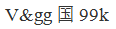
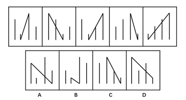
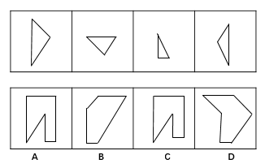
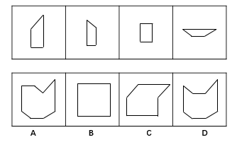
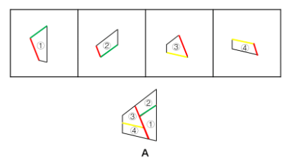
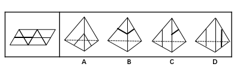
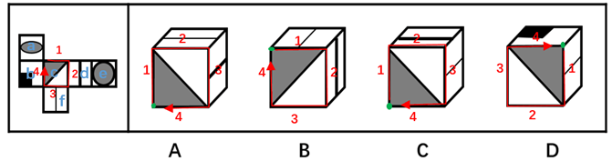
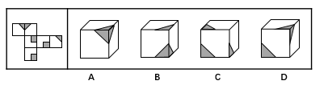
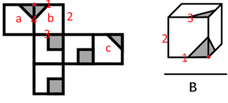
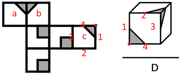

# 2017年江苏省公务员录用考试《行测》题(B类)

> 判断推理 · 45 题 · 江苏 2017

## 材料 1

甲、乙、丙、丁、戊5位摄影专业大学生为参加毕业摄影大赛分赴黑龙江、西藏、云南、福建、江苏5地摄影采风。他们5人各有偏爱的摄影题材：人物、花卉、风景、野生动物、古建筑，这次采风他们相约就上述题材每人各拍一种。已知：

（1）如果甲去黑龙江，乙就去江苏； 

（2）只有丙去福建，丁才去云南； 

（3）或者乙去江苏拍古建筑，或者戊去福建拍人物； 

（4）去江苏拍古建筑的大学生临行前曾与乙、丁话别。 

### 第 1 题　qid 2042362 · 逻辑判断

根据以上信息，可以得出以下哪项？

- **A**. 甲不去江苏
- **B**. 乙不去西藏
- **C**. 丙不去黑龙江
- **D**. 丁不去云南　✅

**答案**：D

**官方解析**

分析题干。
（1）甲去黑龙江→乙去江苏；
（2）丁去云南→丙去福建；
（3）乙去江苏拍古建筑或者戊去福建拍人物；
（4）乙、丁二人不去江苏拍古建筑。
根据条件（4）可知乙、丁二人不去江苏拍古建筑，根据条件（3）可得出戊去福建拍人物。乙不去江苏，根据条件（1）可得出甲不去黑龙江。已知戊去福建拍人物，所以丙不去福建，根据条件（2）可得出，丁不去云南，D项可以推出。
故正确答案为D。

---

### 第 2 题　qid 2042364 · 逻辑判断

如果丙去西藏，则可以得出以下哪项？

- **A**. 甲去江苏　✅
- **B**. 乙去福建
- **C**. 丁去云南
- **D**. 戊去黑龙江

**答案**：A

**官方解析**

分析题干。

（1）甲去黑龙江乙去江苏；

（2）丁去云南丙去福建；

（3）乙去江苏拍古建筑或者戊去福建拍人物；

（4）乙、丁二人不去江苏拍古建筑。

已知丙去西藏，根据条件（3）（4）可知，戊去福建拍人物，并且乙丁不去江苏，可推出只能甲去江苏，A项正确。

故正确答案为A。

---

### 第 3 题　qid 2042370 · 逻辑判断

如果乙去黑龙江拍风景，而去云南的只拍花卉，则可以得出以下哪项？

- **A**. 甲去云南拍花卉
- **B**. 丙去江苏拍古建筑
- **C**. 丁去西藏拍野生动物　✅
- **D**. 戊去福建拍古建筑

**答案**：C

**官方解析**

分析题干。
（1）甲去黑龙江→乙去江苏；
（2）丁去云南→丙去福建；
（3）乙去江苏拍古建筑或者戊去福建拍人物；
（4）乙、丁二人不去江苏拍古建筑。
根据条件（3）、（4）可知，戊去福建拍人物，而D项是拍古建筑，排除D项。如果乙去黑龙江拍风景，根据条件（2）丙不去福建得出丁不去云南，丁不去江苏，不去黑龙江，不去福建，那么丁只有去西藏。如果去黑龙江的拍风景，去云南的拍花卉，去江苏的拍古建筑，去福建的拍人物，那么去西藏的只能拍野生动物，C项正确。
故正确答案为C。

---

### 第 4 题　qid 2042122 · 类比推理

汉字：符号

- **A**. 海豚：海鱼
- **B**. 大米：粮食　✅
- **C**. 高管：女性
- **D**. 法学：国学

**答案**：B

**官方解析**

第一步：分析题干词语间逻辑关系。
汉字是符号的一种，二者为包容关系中的种属关系。
第二步：判断选项词语间逻辑关系。
A项：海豚是哺乳动物，不是海鱼，不符合题干的逻辑关系，排除；
B项：大米是粮食的一种，二者为包容关系中的种属关系，符合题干的逻辑关系，当选；
C项：高管和女性为交叉关系，有的高管是女性，有的女性是高管，不符合题干的逻辑关系，排除；
D项：国学是涵盖各朝各代的各类文化学术，是相对西学而言的中国之学；法学是法律学，法学不是国学的一种，不符合题干的逻辑关系，排除。
故正确答案为B。

---

### 第 5 题　qid 2042126 · 类比推理

西湖：太湖

- **A**. 都会：议会
- **B**. 电脑：人脑
- **C**. 男生：女生
- **D**. 加法：除法　✅

**答案**：D

**官方解析**

第一步：分析题干词语间逻辑关系。
西湖和太湖都是淡水湖泊，二者是并列关系中的反对关系。
第二步：判断选项词语间逻辑关系。
A项：都会指的是都市，议会又称国会，是资本主义国家中代表资产阶级利益的最高立法机关，二者没有关系，不符合题干的逻辑关系，排除；
B项：电脑是人脑的智慧产品，不符合题干的逻辑关系，排除；
C项：男生和女生是并列关系中的矛盾关系，不符合题干的逻辑关系，排除；
D项：加法和除法都是运算法则，运算法则还有乘法和减法，加法和除法是并列关系中的反对关系，符合题干的逻辑关系，当选。
故正确答案为D。

---

### 第 6 题　qid 2042460 · 类比推理

生产：销售

- **A**. 收入：支出
- **B**. 起草：修改　✅
- **C**. 救灾：抗灾
- **D**. 闭幕：开幕

**答案**：B

**官方解析**

第一步：分析题干词语间逻辑关系。
生产和销售是有着时间的先后顺序的行为，先生产再销售，且生产和销售是产品流通的两个环节。
第二步：判断选项词语间逻辑关系。
A项：先收入后支出，但收入和支出可以做名词，且不是两个环节，不符合题干的逻辑关系，排除；
B项：先起草后修改，且起草和修改是撰写文件的两个环节，符合题干的逻辑关系，当选；
C项：广义的救灾包括防灾、抗灾，抗灾是救灾的一种，二者为种属关系，不符合题干的逻辑关系，排除；
D项：先开幕后闭幕，但是开幕和闭幕的顺序和题干不一致，不符合题干的逻辑关系，排除。
故正确答案为B。

---

### 第 7 题　qid 2042464 · 类比推理

中山陵：金陵

- **A**. 城隍庙：寺庙
- **B**. 青海湖：青海　✅
- **C**. 碧云天：青天
- **D**. 钱塘江：长江

**答案**：B

**官方解析**

第一步：分析题干词语间逻辑关系。
中山陵位于金陵，金陵是南京的古称，二者为地点的对应关系。
第二步：判断选项词语间逻辑关系。
A项：城隍庙是寺庙的一种，二者为种属关系，不符合题干的逻辑关系，排除；
B项：青海湖位于青海，二者为地点的对应关系，符合题干的逻辑关系，当选；
C项：碧云天和青天均指晴天，不符合题干的逻辑关系，排除；
D项：钱塘江和长江为并列关系，都为江水，钱塘江位于浙江，不符合题干的逻辑关系，排除。
故正确答案为B。

---

### 第 8 题　qid 2042470 · 类比推理

《大学》：《中庸》：四书

- **A**. 泰山：华山：五岳　✅
- **B**. 物欲：财欲：六欲
- **C**. 朝夕：除夕：七夕
- **D**. 春风：秋雨：四季

**答案**：A

**官方解析**

第一步：分析题干词语间逻辑关系。
《大学》和《中庸》是并列关系，二者为四书的组成部分。
第二步：判断选项词语间逻辑关系。
A项：泰山和华山是并列关系，二者为五岳的组成部分，符合题干的逻辑关系，当选；
B项：六欲是中国古代区分感情的一种分类，一般指眼（见欲，贪美色奇物）、耳（听欲，贪美音赞言）、鼻（香欲，贪香味）、舌（味欲，贪美食口快）、身（触欲，贪舒适享受）、意（意欲，贪声色、名利、恩爱）。物欲和财欲不是六欲的组成部分，不符合题干的逻辑关系，排除；
C项：朝夕指的是一天中的早晚，除夕和七夕都是传统节日，不符合题干的逻辑关系，排除；
D项：春风和秋雨都是天气现象，二者不是四季的组成部分，不符合题干的逻辑关系，排除。
故正确答案为A。

---

### 第 9 题　qid 2042140 · 类比推理

买票：乘机：抵达

- **A**. 生产：流通：消费
- **B**. 相识：相恋：结婚　✅
- **C**. 调研：调查：总结
- **D**. 申报：评审：得奖

**答案**：B

**官方解析**

第一步：判断题干词语间逻辑关系。
买票、乘机、抵达三者是逻辑关系中的对应关系，动作发出者为同一主体，并且动作有先后顺序。
第二步：判断选项词语间逻辑关系。
A项：流通的主体是商品，而生产和消费的主体是人，与题干逻辑关系不一致，排除；
B项：相识、相恋、结婚三者动作发出者为同一主体，并且三者有先后的顺序，与题干逻辑关系一致，当选；
C项：调查和总结是调研的两个环节，先调查再总结，但是与调研没有涉及到事件先后顺序，与题干逻辑关系不一致，排除；
D项：申报与得奖是同一主体，但是与评审主体不同，与题干逻辑关系不一致，排除。
故正确答案为B。

---

### 第 10 题　qid 2042120 · 类比推理

作家 之于 作品 相当于 （ ）之于 （ ）

- **A**. 蜜蜂------蜂蜜　✅
- **B**. 货币------货物
- **C**. 鸡蛋------母鸡
- **D**. 园丁------园林

**答案**：A

**官方解析**

第一步：判断题干词语间逻辑关系。
作品是作家的劳动成果，二者是逻辑关系中的对应关系。
第二步：判断选项词语间逻辑关系。
A项：蜂蜜是蜜蜂的劳动成果，符合题干的逻辑关系，当选；
B项：货币是用来购买货物的，货物不是货币的劳动成果，不符合题干的逻辑关系，排除；
C项：鸡蛋是母鸡的孳息，不是劳动成果，同时词顺序反了，不符合题干的逻辑关系，排除；
D项：园丁，主要指专门从事园艺的劳动者，负责栽培护理园内植物工作的人。园林不是园丁的劳动成果，不符合题干的逻辑关系，排除。
故正确答案为A。

---

### 第 11 题　qid 2042568 · 类比推理

丝绸之路 之于 （  ） 相当于 万里长征 之于 （  ）

- **A**. 敦煌—遵义　✅
- **B**. 骆驼—草鞋
- **C**. 沙漠—海洋
- **D**. 贸易—解放

**答案**：A

**官方解析**

A项：敦煌是丝绸之路的一个途经地点，遵义是万里长征的一个途经地点，前后逻辑关系一致，保留；
B项：骆驼是丝绸之路的工具，草鞋是万里长征的工具，前后逻辑关系一致，保留；
C项：丝绸之路沿线经过沙漠，但是万里长征没有经过海洋，前后逻辑关系不一致，排除；
D项：丝绸之路的目的是贸易，万里长征的目的是战略转移和北上抗日，而非解放，前后逻辑关系不一致，排除。
比较A、B项，A项中，敦煌是古代丝绸之路上一个重要的标志性地点，敦煌因丝绸之路而闻名，而我们党在长征途中在遵义召开的遵义会议也是我们党一个重要的转折点，遵义也因此而著名；B项中，骆驼是丝绸之路中必不可少的工具，但是草鞋并不是万里长征中必不可少的，不是每一个红军战士都穿的草鞋，草鞋也不是必不可少的工具。这一道题结合时政热点，以及就题目本身的倾向性而言，A项更加贴近出题人的意图。
故正确答案为A。

---

### 第 12 题　qid 2042132 · 类比推理

sTT889CCb655

- **A**. bCC233Qpp455
- **B**. jKK677xYY122
- **C**. uVv667YYz988
- **D**. eFF334NNm877　✅

**答案**：D

**官方解析**

第一步：分析题干符号间关系。
从相同符号的位置入手：位置2、3的符号相同；位置4、5的符号相同；7、8位置符号相同；11、12位置符号相同。
第二步：判断选项符号间关系。
A项：位置4、5的符号不相同，排除；
B项：位置4、5的符号不相同，排除；
C项：位置2、3的符号不相同，排除；
D项：相同符号的位置和题干保持一致，当选。
故正确答案为D。

---

### 第 13 题　qid 2042514 · 逻辑判断

WTgg我28K

- **A**. 

- **B**. 

　✅
- **C**. 

- **D**. 

**答案**：B

**官方解析**

第一步：分析题干符号间关系。
从相同符号的位置入手：位置3、4的符号相同；其他位置的符号各不相同。 
第二步：判断选项符号间关系。
A项：位置3、4的符号相同，位置6、7的符号也相同，与题干不一致，排除；
B项：位置3、4的符号相同，其他位置的符号各不相同，与题干保持一致，当选；
C项：位置3、4的符号不相同，与题干不一致，排除；
D项：位置3、4的符号相同，位置6、7的符号也相同，与题干不一致，排除。
故正确答案为B。

---

### 第 14 题　qid 2042146 · 图形推理

上边的题干中给出一套图形，其中有五个图，这五个图呈现一定的规律性。在下边给出一套图形，从中选出唯一的一项作为保持上边五个图规律性的第六个图。

- **A**. A
- **B**. B
- **C**. C
- **D**. D　✅

**答案**：D

**官方解析**

本题考查图形的实际意义，寻找最大共同点，题干每幅图中都只有一个站着的人，且衣服都有黑边袖子。选项中只有D项是一个人站着，而且衣服有黑边袖子。
故正确答案为D。

---

### 第 15 题　qid 2042102 · 图形推理

上边的题干中给出一套图形，其中有五个图，这五个图呈现一定的规律性。在下边给出一套图形，从中选出唯一的一项作为保持上边五个图规律性的第六个图。

- **A**. A
- **B**. B
- **C**. C　✅
- **D**. D

**答案**：C

**官方解析**

题干为一组图形，元素组成不同且无属性规律，考虑数量规律。优先数面数量和线数量都无规律，考虑数点。每幅图中交点数量依次为：4、5、6、7、8，呈现数量递增的规律，因此应选择点数量为9的图形，只有C项符合。
故正确答案为C。

---

### 第 16 题　qid 2042104 · 图形推理

上边的题干中给出一套图形，其中有五个图，这五个图呈现一定的规律性。在下边给出一套图形，从中选出唯一的一项作为保持上边五个图规律性的第六个图。

- **A**. A
- **B**. B
- **C**. C　✅
- **D**. D

**答案**：C

**官方解析**

整体观察所给图形，每幅图都有4条长短不一的竖线和1条长斜线，并且每幅图的长斜线都是从最短竖线的底部连到最长竖线的顶部。分析选项，A不是最长竖线与最短竖线相连，B、D都是从最短竖线的顶部开始连，均排除，选项中只有C符合。 
故正确答案为C。

---

### 第 17 题　qid 2042108 · 图形推理

下边的四个图形中，只有一个是由上边的四个图形拼合（只能通过上、下、左、右平移）而成的，请把它找出来。

- **A**. A
- **B**. B
- **C**. C　✅
- **D**. D

**答案**：C

**官方解析**

本题为平面拼合，可以采用平行等长相消的方法（找到相对面积较大的图形作为基准图形，找到平行且等长的边进行拼合，拼合之后等长线条抵消）。

平行等长相消的方式如下图所示：

故正确答案为C。

---

### 第 18 题　qid 2042110 · 图形推理

下边的四个图形中，只有一个是由上边的四个图形拼合（只能通过上、下、左、右平移）而成的，请把它找出来。

- **A**. A
- **B**. B
- **C**. C
- **D**. D　✅

**答案**：D

**官方解析**

本题为平面拼合，可以采用平行等长相消的方法（找到相对面积较大的图形作为基准图形，找到平行且等长的边进行拼合，拼合之后等长线条抵消）。

平行等长相消的方式如下图所示：

故正确答案为D。

---

### 第 19 题　qid 2042112 · 图形推理

下边的四个图形中，只有一个是由上边的四个图形拼合（只能通过上、下、左、右平移）而成的，请把它找出来。

- **A**. A　✅
- **B**. B
- **C**. C
- **D**. D

**答案**：A

**官方解析**

本题为平面拼合，可以采用平行等长相消的方法（找到相对面积较大的图形作为基准图形，找到平行且等长的边进行拼合，拼合之后等长线条抵消）。

平行等长相消的方式如下图所示：

故正确答案为A。

---

### 第 20 题　qid 2042114 · 图形推理

左边给定的是纸盒外表面的展开图，右边哪一项能由它折叠而成？请把它找出来。

- **A**. A
- **B**. B
- **C**. C　✅
- **D**. D

**答案**：C

**官方解析**

本题考查四面体的空间重构能力。对平面展开图中的面进行标记，用排除解题。

A项：如上图所示，分别对题干和选项的面1画箭头，题干箭头右边是面2，选项箭头右边是面3，A选项错误，排除；

B项：如上图所示，分别对题干和选项的面3画箭头，题干箭头下边是面4，选项中箭头下边是面2，立体图与平面图不对应，排除；

C项：如上图所示，对选项的面1画箭头，题干中箭头的右边是面2，选项中箭头的右边也是面2，无法排除，先保留；

D项：如上图所示，对选项的面1画箭头，题干中箭头的下边是面4，选项中箭头的下边是面3，立体图与平面图不对应，排除。

故正确答案为C。

---

### 第 21 题　qid 2042116 · 图形推理

左边给定的是纸盒外表面的展开图，右边哪一项能由它折叠而成？请把它找出来。

- **A**. A
- **B**. B
- **C**. C
- **D**. D　✅

**答案**：D

**官方解析**

本题考查四面体的空间重构能力。将平面展开图中的面进行标记，用排除法解题。

A项：选项为中间是细线的两个面，即题干的面③、面④，如图1沿着面③、面④分别画两个箭头，可知两个面中小三角的顶点并不重合，所以A选项错误，排除；

B项：选项为中间是粗线的两个面，即展开图的面①、面②，如图2沿着面①、面②分别画两个箭头，可知两个面中小三角的顶点并不重合，所以B选项错误，排除；

C项：C选项左边的面有可能是面③也可能是面④，如果是面③，如图3所示，箭头下面挨着面①，且边c与边d是同一条边，该边与面①内部横线无交点，错误；同理，C选项左侧面如果是面④也错误。所以C选项错误，排除。

故正确答案为D。

---

### 第 22 题　qid 2042118 · 图形推理

左边给定的是纸盒外表面的展开图，右边哪一项能由它折叠而成？请把它找出来。

- **A**. A
- **B**. B
- **C**. C　✅
- **D**. D

**答案**：C

**官方解析**

观察发现4个选项中均出现面c，可以考虑对它进行画边，如下图所示，在展开图中以灰色三角形的直角为起点，顺时针画边，选项同理。

A项：题干第二条边与面d相邻，选项中第二条边与面f相邻（注意面d和面f中间竖线的粗细不同），A选项错误，排除；

B项：题干第一条边与面a相邻，选项中第一条边与面f相邻，B选项错误，排除；

C项：与题干一致，为正确答案；

D项：题干第一条边与面a相邻，选项中第一条边与面f相邻，D选项错误，排除。

故正确答案为C。

---

### 第 23 题　qid 2042128 · 图形推理

左边给定的是纸盒外表面的展开图，右边哪一项能由它折叠而成？请把它找出来。

- **A**. A　✅
- **B**. B
- **C**. C
- **D**. D

**答案**：A

**官方解析**

本题考查六面体的空间重构。将平面图中的各面进行标号，如下图：

解法一：

面②中的b点与面④中的c点重合，如上图中的红点；面①中的a点与面⑤中的d点重合，如上图中的黄点。也就是说面①、面②和面⑤中的灰色三角形有一个公共点，即图中的黄点，只有A项符合。

解法二：

首先可以排除C项。如平面图所示，至少有两个三角形的直角边是公共边，而C项没有任何两个三角形有公共边，排除；

B项：在平面图中，从两个紧挨着的灰色三角形面的直角顶点（标红点）出发，对b面顺时针画边。如下图所示：

两个紧挨着的灰色三角形面的直角顶点在B项中如上图所示（标红点）。若b面是右边的面，那么从红点出发顺时针画边，第一条边就是两三角形面的公共边，而在原图公共边是4边。那么b面只能是左边的面，从红点出发顺时针画边，3边与第三个三角形面相邻，而原图3边与小方块面相邻。故与平面图不相符，排除； 

D项：在平面图中，从单独直角三角形面的直角顶点（标红点）出发，对c面顺时针画边。如下图所示：

单独直角三角形面的直角顶点在D项中如上图所示（标红点）。3边与三角形面相邻，而原图3边与小方块面相邻，故与平面图不相符，排除。

故正确答案为A。 

---

### 第 24 题　qid 2042138 · 逻辑判断

近日国外一项调查研究发现，肥胖与较差的社会经济地位之间存在着内在的关系，那些社会经济地位较差的人大多比较肥胖，甚至越穷越胖。研究者解释，这是因为社会经济地位较差的人更容易选择高热量低营养的快餐食品，而摄入这些食品很容易导致肥胖。
下列哪项如果为真，最能削弱研究者的上述解释？

- **A**. 高热量低营养食品的摄入虽是一些人的饮食习惯，但却容易造成营养不良
- **B**. 刚富起来的人更容易沉迷于高热量食品，而有些穷人对快餐食品只能偶尔尝鲜
- **C**. 穷人没有足够的金钱和时间去锻炼身体，富人却更有能力在身体健康上投入　✅
- **D**. 现在高热量低营养的快餐食品变得越来越廉价，而健康的低卡路里食品变得越来越昂贵

**答案**：C

**官方解析**

第一步：找到论点和论据。
论点：那些社会经济地位较差的人大多比较肥胖，甚至越穷越胖是因为社会经济地位较差的人更容易选择高热量低营养的快餐食品，而摄入这些食品很容易导致肥胖。
论据：无。
第二步：逐一分析选项。
A项：指出摄入高热量低营养的食品容易造成“一些人”营养不良，此处的“一些人”指代不明，也没有给出穷人更容易胖的原因，无关选项，排除；
B项：指出刚富起来的人更容易沉迷于高热量食品，有些穷人只能偶尔尝鲜，但题干“穷人”和“富人”两个群体比较的是普遍情况，“刚富起来的人”和“有些穷人”都代表不了“富人和穷人”群体的普遍情况，不能用部分或个例去质疑普遍情况，不能削弱，排除；
C项：指出“穷人”和“富人”这两个群体还有“锻不锻炼”这个变量，可能是因为没有钱和时间去锻炼导致穷人更胖，他因削弱，当选；
D项：指出高热量低营养的快餐食品越来越便宜，健康的低卡路里食品越来越贵，解释了穷人更容易选择高热量低营养的快餐食品的原因，补充论据加强，排除。
故正确答案为C。

---

### 第 25 题　qid 2042144 · 类比推理

某厅级机关计划选派1人前往海外进修公共管理，最合适的人选应具有如下条件：男性；通晓1门外语；熟悉当地文化。有4位业务水平较高的处长甲、乙、丙、丁最后进入面试环节。4人中有3名男性，2人通晓1门外语，1人熟悉当地文化，每位面试者都至少符合1项条件。已知：
（1）甲、乙的外语能力相同；
（2）乙、丙的性别相同；
（3）丙、丁并非都是男性。
通过考察，只有1人符合全部条件，被成功派往海外。
根据以上信息，可以得出被派往海外进修的人是：

- **A**. 甲
- **B**. 乙
- **C**. 丙　✅
- **D**. 丁

**答案**：C

**官方解析**

根据题干甲、乙、丙、丁4人中有3名男性，由条件（2）（3）可知，甲、乙、丙是男性，丁是女性，由于被选派的是男性，排除D；根据题干只有1人符合选派条件：男性；通晓一门外语；熟悉当地文化；而只有1人熟悉当地文化，即熟悉当地文化的必须被选派，由于甲、乙、丙、丁4人至少符合一个条件，所以丁通晓一门外语，由题干2人通晓一门外语可知，剩下3人只有1人通晓一门外语；由条件（1）可知，甲、乙均不会外语，排除A、B，所以丙会外语。所以丙是唯一熟悉当地文化、通晓一门外语的男性。
故正确答案为C。

---

### 第 26 题　qid 2042288 · 逻辑判断

某高速路段管理处决定招聘10名道路辅助管理人员，以解决正式管理人员不足的问题，但是这一建议招致某人士的反对。该人士认为，增加这10名道路辅助管理人员后，将会有更多的道路违规、违纪行为被发现，而后期处理这些问题需要占用更多的正式管理人员，这将导致本已紧张的正式管理人员更加不足。
以下哪项如果为真，最能削弱该人士的观点？

- **A**. 新招聘的道路辅助人员工作起来未必能尽心尽职
- **B**. 有许多道路违规、违纪行为问题当场就可解决，不需要拖到后期处理
- **C**. 道路辅助管理人员也可以对道路违规、违纪行为进行后期处理　✅
- **D**. 增加道路辅助管理人员将有效减少该路段道路违规、违纪行为的发生

**答案**：C

**官方解析**

第一步：找到论点论据。
论点：不应该招聘10名道路辅助管理人员来解决正式管理人员不足的问题。
论据：增加10名道路辅助管理人员后，将会有更多的道路违规、违纪行为被发现，后期处理这些问题需要占用更多的正式管理人员，这将导致本已紧张的正式管理人员更加不足。
第二步：逐一分析选项。
A项：指出新招聘的道路辅导管理人员工作未必能尽心尽职，同时也未说明一定不会尽心尽职，属于不明确选项，排除；
B项：指出许多的道路违规、违纪行为问题当场能解决，不需要拖到后期处理，但另外剩下的问题是否需要拖到后期处理并不清楚，属于不明确选项，排除；
C项：论据的理由是，发现了更多违规，后期处理需要正式管理人员。想直接削弱论据，要么就说不会发现更多违规，要么就说后期处理不需要正式管理人员。C项指出道路辅助管理人员也可以对道路违规、违纪行为进行后期处理，说明后期不需要占用正式管理人员，直接削弱论据，当选；
D项：指出增加道路辅助管理人员减少了道路违规、违纪行为的发生，而要想直接否定论据最直接的应该说的是不会发现更多违规，因此，削弱程度没有C项深。
故正确答案为C。
这道题C项和D项存在争议，相比较而言，C项是对论据的直接削弱，D项不够明确，因此粉笔倾向于选C。

---

### 第 27 题　qid 2042292 · 类比推理

老张：你在这儿摆摊设点属于占道经营！
小王：这儿是中山北路又不是中山北道，我占的什么道？
以下哪项与上述对话方式最为相似？

- **A**. 甲：你这种执法行为一点人情味都没有！    乙：我严格执法是为了保障人民群众的生命财产安全。
- **B**. 甲：你成天打游戏是在虚度年华！     乙：我只有在游戏中才觉得年华没有虚度。
- **C**. 甲：你工作时间不能抽烟！   乙：我抽烟时从不工作。　✅
- **D**. 甲：你这种说法是栽赃陷害！      乙：你这种说法是血口喷人！

**答案**：C

**官方解析**

第一步：分析题干对话方式。
题干对话中小王故意曲解老张的话中“占道经营”的“道”，实际上这里的“道”泛指道路，小王通过混淆概念达到自己强词夺理的目的。
第二步：逐一分析选项。
A项：甲乙二人的话不在一个领域内，“人情味”与“保障人民群众的生命财产安全”并无冲突，与题干无相似之处，排除；
B项：甲乙二人对于“打游戏是否虚度年华”理解不同，与题干并无相似之处，排除；
C项：乙故意将甲话中的“工作时间不能抽烟”曲解成为“抽烟的时候不能工作”，混淆概念达到其强词夺理的目的，与题干最为相似，当选；
D项：乙仅仅是在指责对方，指出对方是在冤枉自己，与题干并无相似之处，排除。
故正确答案为C。

---

### 第 28 题　qid 2042298 · 逻辑判断

老张、老张的妹妹、老张的儿子和老张的女儿4人进行乒乓球比赛。比赛后发现，第1名与第4名的年龄相同，但第1名的孪生同胞（上述4人之一）与第4名的性别不同。
根据以上信息，可以推出第1名是：

- **A**. 老张
- **B**. 老张的女儿　✅
- **C**. 老张的妹妹
- **D**. 老张的儿子

**答案**：B

**官方解析**

根据题干信息，第1名的年龄=第4名的年龄，而第1名的孪生同胞与第4名性别不同，因此第1名的孪生同胞一定不是第4名，根据孪生同胞年龄相同，得出第1名的年龄=孪生同胞的年龄=第4名的年龄，四个人中有三个人年龄相同，由于老张不可能与自己的儿子和女儿同龄，那么这三个人只能是老张的儿子、女儿和妹妹，则孪生同胞为老张的儿子和女儿，第4名为老张的妹妹。已知第1名的孪生同胞与第4名性别不同，那么孪生同胞为老张的儿子，第1名为老张的女儿。
故正确答案为B。

---

### 第 29 题　qid 2042316 · 逻辑判断

近来，有科学家研究了历史上气候变化对人类社会的影响。他们发现，全球超过的国家及地区在气候寒冷时期爆发的战争次数是温暖时期的两倍；在中国过去的1000多年里，战争、大范围动乱和朝代更替大都对应着特别漫长的寒冷时期；欧洲1550年到1850年的“小冰期”与欧洲历史上发生过的猎巫事件甚至法国大革命之间都存在紧密的联系。由此，他们得出结论：气候变冷会导致社会冲突和朝代更替的发生。

以下哪项如果为真，最能质疑上述科学家的观点？

- **A**. 气候变化总在发生，社会冲突、朝代更替也总在发生，共同发生变化的东西不一定存在因果联系　✅
- **B**. 气候变暖是引发人类冲突与战争的重要原因，例如，在1981年到2002年间的温度升高期间，撒哈拉以南非洲国家内战的次数比平时有所增加
- **C**. 2003年，由于印度洋升温影响季风活动，导致苏丹达尔富尔地区降水大幅度下降，引发粮食和水资源严重短缺，继而引发武装冲突
- **D**. 气候变冷比气候变暖更可怕，气候变冷意味着农作物收成下降，粮食、能源供应紧张，人们的日常生活受到更为严重的影响

**答案**：A

**官方解析**

第一步：找到论点论据。

论点：气候变冷会导致社会冲突和朝代更替的发生。

论据：全球超过的国家及地区在气候寒冷时期爆发的战争次数是温暖时期的两倍，在中国过去的1000多年里，战争、大范围动乱和朝代更替大都对应着特别漫长的寒冷时期；欧洲1550年到1850年的“小冰期”与欧洲历史上发生过的猎巫事件甚至法国大革命之间都存在紧密的联系。

第二步：逐一分析选项。

A项：指出气候变冷和社会冲突、朝代更替之间未必有因果联系，直接削弱论点，当选；

B项：说明气候变暖和社会冲突、朝代更替之间确有关系，但无法判断气候变冷是否会引发社会冲突与朝代变更，无关选项，排除；

C项：举例说明气候变暖会导致武装冲突，无法判断气候变冷是否会引发社会冲突与朝代变更，无关选项，排除；

D项：指出气候变冷对于日常生活的危害，与社会冲突和朝代更替无关，无关选项，排除。

故正确答案为A。

---

### 第 30 题　qid 2042344 · 逻辑判断

对于小李、小王和小苗能否考取研究生，有以下4种猜测：
（1）小李能考取；
（2）要是小王能考取，那么小苗也能考取；
（3）或是小王能考取，或者小李能考取；
（4）小王能考取。
事后证实，这4种猜测中只有一种是对的。
根据以上信息，可以得出以下哪项？

- **A**. 小李考取了
- **B**. 小苗没有考取
- **C**. 小苗考取了
- **D**. 小李没有考取　✅

**答案**：D

**官方解析**

第一步：翻译题干。
（1）小李考取；
（2）小王考取→小苗考取；
（3）小王考取或者小李考取；
（4）小王考取；
第二步：假设法
4种猜测只有一种是对的。假设条件（1）是对的，或关系中其中一项对，整个或关系就为真，因此（3）也是对的，和题干要求矛盾。该假设错误，（1）一定错。既然小李考取是一句假话，那么它的矛盾命题小李没有考取就一定是真的。
故正确答案为D。

---

### 第 31 题　qid 2042372 · 定义判断

斜杠青年：指不满足于从事单一职业，追求拥有多重职业身份及多元生活方式的年轻人。他们在自我介绍时往往喜欢用斜杠来区分自己的不同身份，如：张三，金牌律师/企划师/专栏作家。
下列属于斜杠青年的是：

- **A**. 最近两三年，八零后导演黄某某先后出演了10多次男配角，去年在一个著名的国际电影节上斩获了最佳男配角奖　✅
- **B**. 小丁在国外获得博士学位后，任职于国内一所著名高校，因科研成就突出，被破格聘为教授，并入选省“双百”人才计划
- **C**. 某公司程序员小陈爱好广泛，性格温和，人际关系融洽，节假日常邀上三五个好友一起登山、打球、游泳
- **D**. 李总做过保安，送过快递，当过安装工，开过小杂货店，他经常自豪地向员工讲述自己30多年来丰富的职业经历

**答案**：A

**官方解析**

第一步：找到定义关键词。
“年轻人”、“不满足于从事单一职业”、“追求拥有多重职业身份及多元生活方式”。
第二步：逐一分析选项。
A项：80后导演黄某某先后出演了10多次男配角，最终获得了最佳男配角奖，体现了黄某某在同一时间所扮演的导演和演员两种不同的身份和职业，符合定义，当选；
B项：小丁在国外获得博士学位后任职于高校，后因科研成就突出被聘为教授，自始至终小丁的职业只有教师这一项，没有体现多重职业身份和多元生活方式，不符合定义，排除；
C项：小陈爱好广泛经常约朋友一起登山、打球、游泳，只是体现了不同的兴趣爱好，和职业无关，也未体现多重身份，不符合定义，排除；
D项：李总做过保安、送过快递、当过安装工、开过小杂货店，虽然这些体现了李总不满足于从事一种职业，追求多种职业身份及多元生活方式，但是这些身份和经验都是过往的经验，并不是在当下工作之外所具有的其他身份。根据相关资料可推测，“斜杠青年”所指的多重身份更偏向于某人在同一时间所具备的不同身份，D项不符合定义，排除。
故正确答案为A。

---

### 第 32 题　qid 2042376 · 定义判断

影子工作：指消费者使已购商品变为可用物品所付出的任何劳动。
下列属于影子工作的是：

- **A**. 小孙到饭店就餐，老板告诉他，这几天大部分服务员都已经放假，顾客需要点餐，并递给他一支笔和一张菜单
- **B**. 小李的儿子快出生了，他赶紧抽时间将同事老王给的婴儿车拿出来修理一番，车子焕然一新，十分好用
- **C**. 经不住软磨硬泡，爸爸终于答应给小明买两条金鱼，小明高兴坏了，连夜在网上收集了十几页的金鱼养殖攻略
- **D**. 将拼板餐桌从商场运回家后，老冯忙乎了半天，对照安装说明，拆了装，装了拆，终于组装成功，中午就派上了用场　✅

**答案**：D

**官方解析**

第一步：找到定义关键词。
“消费者使已购商品变为可用物品所付出的任何劳动”。
第二步：逐一分析选项。
A项：小孙到饭店就餐，服务员休假只能自己点单，点单说明还没有消费，不存在已购商品，更没有体现出使已购商品变为可用物品的过程，同时点餐和变为可用物品之间没有联系，不符合定义，排除；
B项：小李将同事老王送的婴儿车拿出来修理一番，车子焕然一新，十分好用，送的婴儿车本就是一种可用物品，没有体现出使已购商品变为可用物品的过程，同时，婴儿车的购买者是老王而不是小李，不符合定义，排除；
C项：爸爸答应给小明买两条金鱼，小明搜集了十几页的养殖攻略，答应买金鱼但是还没买，没有体现出已购商品这个概念，同时金鱼也不是一种可用物品，不符合定义，排除；
D项：老冯将拼板餐桌从商场运回家，对照安装说明组装成功，中午派上用场，首先拼板餐桌是已购商品，老冯经过劳动使其变为可用物品，符合定义，当选。
故正确答案为D。

---

### 第 33 题　qid 2042742 · 定义判断

权利暗示：指基于职务地位、业务能力、人格魅力而产生的对组织机构外部成员的影响力。
下列不属于权利暗示的是:

- **A**. 张教授是微电子领域的专家，不少企业遇到相关问题，都会向他请教解决的方法
- **B**. 五年级的小聪，电子游戏玩得特别顺溜，学校组队参加各级比赛时总请他协助指导　✅
- **C**. 退伍军人老赵处事公平，街坊邻居遇到大小纠纷，首先想到的就是请他来主持公道
- **D**. 教育局李主任长期研究教师的专业发展，亲友们却常常向他求教孩子的教育问题

**答案**：B

**官方解析**

第一步：找出定义关键词。
“基于职务地位、业务能力、人格魅力而产生的对组织机构外部成员的影响力”。
第二步：逐一分析选项。
A项：张教授是微电子领域的专家，不少企业遇到相关问题都会向他请教解决的办法，体现了张教授基于业务能力产生的对组织机构外部成员的影响，符合定义，排除；
B项：小聪电子游戏玩得顺溜，学校组队参加比赛时总请他协助指导，电子游戏玩得顺溜没有体现职务地位、业务能力和人格魅力的影响，同时小聪作为学校的学生，学校组队参加比赛协助指导是对本组织内部的影响，不能体现出对组织机构外部成员的影响，不符合定义，当选；
C项：退伍军人老赵处事公平，街坊邻居遇到大小纠纷请他来主持公道，体现了由于人格魅力而产生的对街坊邻居的影响，同时街坊邻居相对于与军人所属的军队这一组织机构来说属于组织外部成员，符合定义，排除；
D项：李主任长期研究教师的专业发展，亲友们常常向他求教孩子的教育问题，体现了由于职务地位和业务能力而产生的对他所在的组织机构以外的成员的影响力，符合定义，排除。
本题为选非题，故正确答案为B。

---

### 第 34 题　qid 2042302 · 定义判断

随机试验：指在同一条件下会出现多种可能结果且可以重复进行的试验；试验的所有可能结果虽预先可知，但每次具体实验的结果却无法预知。
下列属于随机试验的是：

- **A**. 将一壶淡水加热到沸腾，观察其状态变化的实验
- **B**. 在狮子身上安装定位设备了解其生活习性的实验
- **C**. 为检测某辆新款汽车的安全性能所做的撞击实验
- **D**. 抛一枚硬币观察带有数字的一面朝上次数的实验　✅

**答案**：D

**官方解析**

第一步：找到定义关键词。

“在同一条件下会出现多种可能结果且可以重复进行的试验”、“试验的所有可能结果虽预先可知，但每次具体实验的结果却无法预知”。

第二步：逐一分析选项。

A项：将一壶淡水加热到沸腾，观察状态变化的实验，这种实验可重复进行，但是在同一条件下不可能出现多种结果，出现的结果只有一种，就是水加热至沸腾后，由液态变成气态，每次实验的具体结果是可以预知的，不符合定义，排除；

B项：在狮子上安装定位设备了解其生活习性的实验，同一头狮子是可以重复实验，但是狮子的情况和习性都不相同，实验的所有的结果并不都是可预知的，不符合定义，排除；

C项：为检测某辆新款汽车的安全性能所做的撞击实验，同一辆汽车的撞击实验是不可以重复进行的实验，而实验的结果是可以预知的，同时实验的结果并不具备多种可能性，排除；

D项：抛一枚硬币观察带有数字的一面朝上次数的实验，实验可以重复进行，且每次实验的结果具有两种可能性，一是带有数字的一面朝上，二是带有数字的一面朝下，其实验的所有结果是可以具体得知的，那就是带有数字的一面朝上的概率是，但是每次实验的结果带有数字的一面到底是朝上还是朝下却不可预知，符合定义，当选。

故正确答案为D。

---

### 第 35 题　qid 2042310 · 定义判断

临时救助：指家庭或个人遭遇突发事件、意外伤害、重大疾病等变故，基本生活陷入困境时，政府有关部门提供的应急性、过渡性救助。
下列属于临时救助的是：

- **A**. 80岁的李大爷无儿无女，独自生活，社区工作人员定期到他家中探望，把每月的养老金交到他手上，还时不时地送来一些生活用品
- **B**. 老张患上了强直性脊柱炎，巨额医疗费花光了积蓄，夫妻名下的房子也变卖了，一家三口只得暂住在街道办为他们租来的小房子里　✅
- **C**. 地震发生后，社会各界积极响应市政府号召，通过多种渠道捐款捐物，很快就筹集了大批物资并分发到了灾民手中
- **D**. 老赵在几年前的一次车祸中失去了左腿，从那以后再也不能外出工作，每月数百元的低保金就成了家里主要的经济来源

**答案**：B

**官方解析**

第一步：找到定义关键词。
原因：“家庭或个人遭遇突发事件、意外伤害、重大疾病等变故”、“基本生活陷入困境”。
结果：“政府有关部门提供的应急性、过渡性救助”。
第二步：逐一分析选项。
A项：80岁的李大爷无儿无女，独自生活，社区工作人员定期探望，给予养老金，没有体现出李大爷遭遇了突发事件、意外伤害或者重大疾病等变故，不符合定义，排除；
B项：老张患上了强直性脊柱炎，体现了家庭或者个人遭遇重大疾病的变故，花光了积蓄、变卖房子体现了生活陷入困境，一家人只得暂住在街道办为他们租来的小房子里，体现了政府有关部门提供的应急性、过渡性救助，符合定义，当选；
C项：地震发生后，社会各界响应号召为灾民捐送物资，并不是政府有关部门提供的应急性、过渡性救助，不符合定义，排除；
D项：老赵因车祸失去左腿，体现了遭遇意外伤害等变故，但每月的低保金成为主要经济来源并不是应急性、过渡性的救助，低保金是一种长期的救助，不符合定义，排除。
故正确答案为B。

---

### 第 36 题　qid 2042312 · 定义判断

渐进式退休：指员工到了法定退休年龄，用人单位根据实际工作需要对部分人员灵活确定退休时间。
下列属于渐进式退休的是：

- **A**. 马教授临近退休年龄，因为他是国内最具影响力的学者之一，对学科发展作出了重大贡献，学校决定聘任他为终身教授
- **B**. 赵先生已经到了退休年龄，但是他主持的重大攻关项目还没有结题，他所在的研究所决定聘用他继续工作，直到项目完成　✅
- **C**. 近年来，李工程师的身体状况越来越糟糕，还患上了轻度的抑郁症，无法坚持工作，公司领导经过研究，决定让他提前退休
- **D**. 某研究机构决定，从下半年开始，本单位申请提前退休的职工，初、中级职称不低于54岁，高级职称不低于58岁

**答案**：B

**官方解析**

第一步：找到定义关键词。
“员工到了法定退休年龄”、“用人单位根据实际工作需要对部分人员灵活确定退休时间”。
第二步：逐一分析选项。
A项：马教授临近退休说明还没有到法定退休年龄，不符合定义，排除；
B项：赵先生到了退休年龄，因为他主持的项目没有结题，研究所决定聘用他继续工作，体现了“用人单位根据实际工作需要对部分人员灵活确定退休时间”，符合定义，当选；
C项：李工程师提前退休说明还没有到法定退休年龄，不符合定义，排除；
D项：某机构职工申请提前退休说明还没有到法定退休年龄，不符合定义，排除。
故正确答案为B。

---

### 第 37 题　qid 2042318 · 定义判断

订单式培养：指用人单位提出用人申请后，由劳动保障部门委托培训机构根据用工需求组织实施的明确就业岗位去向的人才培养模式。
下列属于订单式培养的是：

- **A**. 某职业技术学院调研后发现，烹饪即将成为未来数年的紧俏职业，当年就开设了烹饪专业，果不其然，毕业生很抢手，很多餐饮名店都登门签约
- **B**. 某民办托儿所急需几名保育员，主管部门接到申请后马上找到一家资深代培机构组织培训，几名合格的保育员很快到岗　✅
- **C**. 某市每年都会根据各乡镇上报的用人需求，在全省高校中聘请一批科研人员，然后分派到各地担任科技副镇长
- **D**. 某物业公司最近被多个小区选中，需要补充大批保安，为了顺利接手各个小区的安保工作，公司急招了数十名新手，正委托专业保安公司强化培养

**答案**：B

**官方解析**

第一步：找出定义关键词。
“用人单位提出用人申请后”、“劳动保障部门委托培训机构根据用工需求组织实施的明确就业岗位去向的人才培养”。
第二步：逐一分析选项。
A项：职业技术学院开设烹饪专业不是受劳动保障部门委托，而是主动开设，而且也没有体现用人单位提出申请，不符合定义，排除；
B项：托儿所提出的是保育员的用人申请，主管部门委托代培机构组织培训符合劳动保障部门委托培训机构根据需求组织人才培养，符合定义，当选；
C项：某市在高校中聘请科研人员担任科技副镇长，不属于委托培训机构根据需求组织人才培养，不符合定义，排除；
D项：物业公司委托专业保安公司强化培养新入职的保安，是用人单位进行的委托培训，而非劳动保障部门，而且也没有体现提出用人申请，不符合定义，排除。
故正确答案为B。

---

### 第 38 题　qid 2042326 · 定义判断

创伤后成长：指一个人在经历重大的生活挫折之后发生的积极性改变。
下列属于创伤后成长的是：

- **A**. 一名车祸幸存者说，事故之后她能更主动地掌控自己的生活　✅
- **B**. 在多次丢失手机以后，小张照看自己的随身物品比以前细心多了
- **C**. 在同事突然撒手人寰后，小刘深感生命脆弱，开始坚持健身锻炼
- **D**. 赴震区考察归来后，王工程师对建筑物防震设计有了更深刻的认识

**答案**：A

**官方解析**

第一步：找到定义关键词。
“经历重大的生活挫折”、“发生的积极性改变”。
第二步：逐一分析选项。
A项：车祸幸存者说明经历了车祸的重大生活挫折，她更主动地掌控自己的生活属于积极性改变，符合定义，当选；
B项：多次丢失手机与A项的车祸比较不属于经历重大的生活挫折，不符合定义，排除；
C项：同事的去世是否算“经历重大的生活挫折”，与同事关系的亲疏远近相关，选项此处并未提及和同事的关系，因此不够明确，不如A项车祸幸存者更能体现“经历重大的生活挫折”，同事的去世不是小刘的生活挫折，不符合定义，排除；
D项：王工程师赴灾区考察不是经历生活挫折，不符合定义，排除。
故正确答案为A。

---

### 第 39 题　qid 2042338 · 定义判断

小众经济：指面向小众人群的个性化定制模式，即采用个性化生产加工方式为用户提供独一无二的产品，实现精准服务，以满足消费者需求。
下列不属于小众经济的是：

- **A**. 某食品公司推出的特色月饼，价格虽然比传统月饼高出30%，但仍大有市场，不到一周就收到了数十万元的订单　✅
- **B**. 某知名服装集团生产的每件西装都是根据用户的量体数据专门设计，保证衣服合体，西装里面还绣着用户名字
- **C**. 某科技园将3D打印技术应用于特色食品的生产，可以按照用户要求制作带有新郎、新娘卡通形象的巧克力喜糖
- **D**. 某知名家电企业为一对外国新婚夫妇提供了唯一的采用外文标识的电冰箱，并将她们的婚纱照打印在电冰箱面板上

**答案**：A

**官方解析**

第一步：找出定义关键词。
“面向小众人群的个性化定制模式”、“采用个性化生产加工方式为用户提供独一无二的产品”、“实现精准服务”。
第二步：逐一分析选项。
A项：食品公司推出的“特色月饼” 只是与传统月饼有区别，但仍然是面向大众批量化生产的商品，并不是面向小众人群、独一无二的产品，不符合定义，当选；
B项：西装“根据用户的量体数据专门设计”“里面还绣着用户名字”符合“面向小众人群”“提供独一无二的产品”，符合定义，排除；
C项：“按照用户要求制作带有新郎、新娘卡通形象的巧克力喜糖”符合“个性化定制模式”“提供独一无二的产品”，符合定义，排除；
D项：“提供了唯一的采用外文标识的电冰箱”“将她们的婚纱照打印在电冰箱面板上”符合“面向小众人群”“提供独一无二的产品”，符合定义，排除。
本题为选非题，故正确答案为A。

---

### 第 40 题　qid 2042346 · 定义判断

劳动碰瓷：指个别劳动者利用企业的管理漏洞，促使企业发生违法行为，进而索要双倍工资或经济补偿等经济利益。
下列属于劳动碰瓷的是：

- **A**. 林某应聘到某公司后，以种种借口未与公司签订劳动合同。三个月后，林某以公司拒绝与他订立劳动合同为由向劳动仲裁部门提出申请，要求公司赔偿未签订合同期间的双倍工资　✅
- **B**. 工作满一年后，丁女士发现公司没有为她交纳养老保险，经过多次交涉都没有得到满意的结果，她向劳动仲裁部门提出申请，要求公司为她补交养老保险
- **C**. 洪女士生下二胎后，厂里把她怀孕期间的工资扣掉了一半，并劝她辞职，洪女士最终决定告上法庭，要求厂里补足她的工资奖金，并给予赔偿
- **D**. 某公司招聘的10余名工人均未签订书面劳动合同，因为不断要求增加工资被集体辞退，几天后，他们以公司拒签劳动合同，过错在先为由申请劳动仲裁，要求同意他们回公司继续工作

**答案**：A

**官方解析**

第一步：找到定义关键词。
“个别劳动者利用企业的管理漏洞，促使企业发生违法行为”、“索要双倍工资或经济补偿等经济利益”。
第二步：逐一分析选项。
A项：林某以种种借口未与公司签订劳动合同符合利用企业的管理漏洞促使企业发生违法行为，之后申请仲裁要求赔偿双倍工资符合索要双倍工资的经济利益，符合定义，当选；
B项：公司没有为丁女士缴纳养老保险不是丁女士利用企业的管理漏洞促使企业发生违法行为，而是企业主动的违法行为，不符合定义，排除；
C项：厂方把洪女士怀孕期间的工资扣掉一半是企业主动的违法行为，不是洪女士利用企业的管理漏洞促使企业发生违法行为，不符合定义，排除；
D项：某公司与招聘的工人均未签订书面劳动合同是企业主动的违法行为，工人申请仲裁要求回公司继续工作也不是索要经济利益，不符合定义，排除。
故正确答案为A。

---

### 第 41 题　qid 2042350 · 定义判断

评论式营销：指商家借助对商品、服务的评论引导客户消费倾向，推动产品推广和销售的营销模式。
下列属于评论式营销的是：

- **A**. 某中医药研究所举办了中药膏方的系列公益讲座，许多膏方受益者现身说法，引起了很多市民关注，药店膏方热销
- **B**. 某购物网站建立起对买家的信誉评价机制，帮助卖家筛选恶意差评的顾客并列入黑名单，很快提高了店铺的营业额
- **C**. 某饭店推出“集赞换龙虾”活动后，有近两千粉丝对它的活动规则和龙虾品质提出质疑，营业额急剧下滑
- **D**. 某知名家电企业推出了一款新产品，外包装上醒目地印着行内专家的专业评价，该产品一投放市场就很抢手　✅

**答案**：D

**官方解析**

第一步：找到定义关键词。
方式： “借助对商品、服务的评论引导客户消费倾向”。
目的：“推动产品推广和销售”。
第二步：逐一分析选项。
A项：中医药研究所并不一定是商家，公益讲座也不是为了引导顾客消费，不符合定义，排除；
B项：购物网站建立对买家的信誉评价机制是为了筛选恶意差评顾客，并没有引导客户消费倾向，不符合定义，排除；
C项：饭店推出的营销活动被粉丝质疑并没有引导客户消费倾向，营业额下滑说明也没有推动产品销售，不符合定义，排除；
D项：家电产品上印着行内专家的专业评价是借助对商品的评论引导客户消费倾向，产品一投放市场就很抢手说明推动了产品推广和销售，符合定义，当选。
故正确答案为D。

---

### 第 42 题　qid 2042352 · 定义判断

错峰就业：指大学毕业生在求职高峰时，主动选择短时间游学、实习、创业考察或志愿服务，推迟个人就业，以寻找更合适的就业岗位。
下列属于错峰就业的是：

- **A**. 小林大学毕业时正碰上“史上最难的就业季”，他没有急着找工作，而是到多个非营利性社团、咖啡厅体验生活。半年后与两个志同道合的朋友创办了一家科技咨询公司　✅
- **B**. 小高毕业后一直没有找到合适工作，每次有人问起工作的事情，他一点也不着急，心里盘算着再过几年，自己设法开个网店，照样能够过上舒舒服服的小日子
- **C**. 虽然已被推荐保研，但考虑到家中久病的父亲和尚在读书的弟弟，小李还是到人才市场投递了简历。在等待消息的过程中，她又到老家附近的餐馆找了一份零工
- **D**. 又到毕业季，与忙着投简历的其他同学不同，小金大二时就创办了一家共享办公租赁服务公司，只等一毕业，就可以全身心地投入到公司的经营管理上

**答案**：A

**官方解析**

第一步：找到定义关键词。
“在求职高峰”、“主动选择短时间游学、实习、创业考察或志愿服务，推迟个人就业”、“寻找更合适的就业岗位”。
第二步：逐一分析选项。
A项：小林毕业时碰上“史上最难的就业季”属于在求职高峰，到非营利性社团、咖啡厅体验生活属于主动推迟个人就业，半年后与志同道合的朋友创办科技咨询公司属于寻找到更适合的工作岗位，符合定义，当选；
B项：小高毕业后没有找到合适工作后并没有选择游学、实习、创业考察、志愿服务等方式推迟就业，不符合定义，排除；
C项：小李因家庭情况投简历、打零工属于主动就业，不属于主动推迟个人就业，不符合定义，排除；
D项：小金毕业前就创办了公司，而不是毕业后，属于提前就业，不属于主动推迟个人就业，不符合定义，排除。
故正确答案为A。

---

### 第 43 题　qid 2042354 · 定义判断

覆盖竞争：指在行业内部竞争已经十分激烈的阶段，行业外部的生产经营者强势介入该行业领域，导致业内竞争进一步加剧的现象。
下列属于覆盖竞争的是：

- **A**. 从事电子产品设计与开发的某公司进入刚刚开始兴起的无人机研制领域
- **B**. 鉴于去年各个分公司的销售业绩都实现了快速增长，公司高层经研究决定今年再成立几家分公司
- **C**. 某房地产公司在市区中心地带的大型购物广场开业后，周边五六家大型商场的客流量明显减少　✅
- **D**. 某汽车零部件销售商为了进一步满足客户需求，决定新增汽车维修保养业务

**答案**：C

**官方解析**

第一步：找到定义关键词。
“行业内部竞争已经十分激烈”、“行业外部的生产经营者强势介入”、“业内竞争进一步加剧”。
第二步：逐一分析选项。
A项：刚刚开始兴起的无人机研制领域说明行业内部竞争并不激烈，不符合定义，排除；
B项：公司鉴于去年分公司销售业绩快速增长，决定再成立分公司，并没有出现行业外部生产经营者的介入，不符合定义，排除；
C项：房地产公司介入商场行业符合“行业外部的生产经营者强势介入”，周边大型商场的客流量减少说明“业内竞争进一步加剧”，符合定义，当选；
D项：汽车零部件销售商新增汽车维修保养业务是为了进一步满足客户需求，并没有出现行业外部生产经营者的介入，不符合定义，排除；
故正确答案为C。

---

### 第 44 题　qid 2042356 · 定义判断

新乡贤：指长期扎根农村，利用自己的知识、技术、财富为村民热心服务并作出突出贡献，在当地社会生活及民众心目中具有较高威望和影响力的乡村人士。
下列属于新乡贤的是：

- **A**. 10多年来，老李虽然一直在外经商，但他时时惦念着家乡，每年都会捐出大量资金为家乡修桥铺路，资助家乡的特困大学生完成学业，乡亲们经常千里迢迢地跑来看望他
- **B**. 小张复员后回到家乡，两三年就成了远近闻名的“养殖大王”，为了带动乡亲们共同致富，他开办了多期培训班，免费传授实用养殖技术和经验，受到了大家的称赞
- **C**. 20多年来，某市商会会长孙先生利用自己长期积累的丰富经验，为经营各种农副产品的家乡村民牵线搭桥，指导他们寻找商机，被乡亲们誉为贴心的“诸葛亮”
- **D**. 某乡村小学校长程某退休后，利用自己学生多、关系广的优势，为挖掘家乡历史文化资源、发展乡村文化旅游业积极谋划、东奔西走，被乡亲们传为佳话　✅

**答案**：D

**官方解析**

第一步：找到定义关键词。
“长期扎根农村”、“利用自己的知识、技术、财富为村民热心服务并作出突出贡献”、“具有较高威望和影响力的乡村人士”。
第二步：逐一分析选项。
A项：老李一直在外经商，并没有长期扎根农村，不符合定义，排除；
B项：小张免费传授实用养殖技术和经验属于利用自己的知识为村民热心服务，但他回乡时间只有两三年，不是长期扎根农村，不符合定义，排除； 
C项：孙先生为某市商会会长说明他没有长期扎根农村，不属于乡村人士，不符合定义，排除； 
D项：程某之前在乡村小学当校长为村民服务，退休后挖掘家乡历史文化资源为村民服务，属于长期扎根农村，具有一定的威望和影响力，符合定义，当选。
故正确答案为D。

---

### 第 45 题　qid 2042358 · 定义判断

零优势意识：指一种危机意识和忧患意识，即能够看到自身优势的相对性，从而带着危机感把比较优势转化为竞争优势，以防止自身优势无法发挥甚至逐渐丧失。
下列属于零优势意识的是：

- **A**. 以色列是世界上自然资源最贫乏的国家之一，水和耕地资源尤为短缺，但以色列人不断创新农业技术，通过滴灌技术和光热网膜技术把沙漠变成绿洲，创造出资源节约型农业典范，甚至成为重要的农产品出口大国
- **B**. 田忌与齐王赛马，每次都输，原来马分上中下三等，进行三场比赛，无论哪一等级的马，田忌都比不过齐王。孙膑知道后指导田忌用下等马对齐王的上等马，再用上等马对中等马，用中等马对下等马，结果只输第一场，赢了后两场
- **C**. 某古城以保留众多清代建筑物闻名于世，旧城改造中，市政府吸取外地教训，避免“拆了值钱的，盖了不值钱的”，全力保护和开发旅游资源。如今，已彻底改变了过去旅游资源丰富而旅游消费水平低的态势，形成了稳固的行业优势　✅
- **D**. 某公司在制造感光材料时，需要有人长时间在暗室工作，但员工大多无法适应长时间黑暗，效率很低。针对这种情况，该公司将暗室内的工作人员全部换成盲人，极大地提高了工作效率

**答案**：C

**官方解析**

第一步：找到定义关键词。
“看到自身优势的相对性”、“带着危机感把比较优势转化为竞争优势”、“防止自身优势无法发挥甚至逐渐丧失”。
第二步：逐一分析选项。
A项：以色列是世界上自然资源最贫乏的国家之一，通过滴灌技术和光热网膜技术把沙漠变成绿洲，创造出资源节约型农业典范，并没有体现自身优势在哪里，也没有体现将比较优势转化为竞争优势，不符合定义，排除；
B项：田忌赛马，将下等马、上等马、中等马分别比齐王的上等马、中等马和下等马，结果赢了比赛，田忌的马实力弱于齐王的马，没有体现自身优势，不符合定义，排除；
C项：某古城以保留众多清代建筑物闻名于世，体现了自身优势；市政府在旧城改造中吸取教训，全力保护和开发旅游资源，改变了过去旅游资源丰富而消费水平低的态势，体现了自身优势的相对性，即旅游资源丰富但是消费水平低，而且将这种比较优势转化成了一种竞争优势，使得形成了行业优势，符合定义，当选；
D项：某公司在制造感光材料时，聘请盲人工作，没有体现自身优势的相对性，即不足之处，也没有体现将自身的比较优势转化为竞争优势，不符合定义，排除。
故正确答案为C。

---
