# 2017年江苏省公务员录用考试《行测》题（C类）

> 判断推理 · 40 题 · 江苏 2017

## 第 1 题　qid 2043672 · 类比推理

兔：青草

- **A**. 蚕：桑叶　✅
- **B**. 狗：老鼠
- **C**. 鱼：河水
- **D**. 虫：小鸡

**答案**：A

**官方解析**

第一步：分析题干词语间逻辑关系。
青草是兔子的食物，二者为对应关系。
第二步：判断选项词语间逻辑关系。
A项：桑叶是蚕的食物，二者为对应关系，符合题干的逻辑关系，当选；
B项：老鼠不是狗的食物，不符合题干的逻辑关系，排除；
C项：河水不是鱼的食物，不符合题干的逻辑关系，排除；
D项：虫是小鸡的食物，但二者和题干位置顺序相反，不符合题干的逻辑关系，排除。
故正确答案为A。

---

## 第 2 题　qid 2042464 · 类比推理

中山陵：金陵

- **A**. 城隍庙：寺庙
- **B**. 青海湖：青海　✅
- **C**. 碧云天：青天
- **D**. 钱塘江：长江

**答案**：B

**官方解析**

第一步：分析题干词语间逻辑关系。
中山陵位于金陵，金陵是南京的古称，二者为地点的对应关系。
第二步：判断选项词语间逻辑关系。
A项：城隍庙是寺庙的一种，二者为种属关系，不符合题干的逻辑关系，排除；
B项：青海湖位于青海，二者为地点的对应关系，符合题干的逻辑关系，当选；
C项：碧云天和青天均指晴天，不符合题干的逻辑关系，排除；
D项：钱塘江和长江为并列关系，都为江水，钱塘江位于浙江，不符合题干的逻辑关系，排除。
故正确答案为B。

---

## 第 3 题　qid 2042554 · 类比推理

文物：建筑

- **A**. 烹饪：佐料
- **B**. 故宫：楼房
- **C**. 诗人：教授　✅
- **D**. 皮鞋：布鞋

**答案**：C

**官方解析**

第一步：分析题干词语间逻辑关系。
文物和建筑是交叉关系，有的文物是建筑，有的建筑是文物。
第二步：判断选项词语间逻辑关系。
A项：烹饪需要佐料，二者为对应关系，不符合题干的逻辑关系，排除；
B项：故宫里面有楼房，二者是组成关系，不符合题干的逻辑关系，排除；
C项：有的诗人是教授，有的教授是诗人，符合题干的逻辑关系，当选；
D项：皮鞋和布鞋是并列关系，不符合题干的逻辑关系，排除。
故正确答案为C。

---

## 第 4 题　qid 2043676 · 类比推理

聪明：耳聪目明

- **A**. 长安：长治久安
- **B**. 卑鄙：卑微鄙陋　✅
- **C**. 悲愤：悲痛愤怒
- **D**. 辨症：辨别症候

**答案**：B

**官方解析**

第一步：判断题干词语间逻辑关系。
耳聪目明是指听觉和视觉都很灵敏，形容头脑清醒，感觉灵敏；聪明是指智力发达，记忆和理解能力强，引申来指称一个人的智商。聪明是耳聪目明的引申义。
第二步：判断选项词语间逻辑关系。
A项：长安是地名，不是长治久安的引申义，不符合题干的逻辑关系，排除；
B项：卑微鄙陋是指地位卑微、见识鄙陋；卑鄙是指语言、品行恶劣，不道德。卑鄙是卑微鄙陋的引申义，符合题干的逻辑关系，当选；
C项：悲愤形容悲痛而又愤怒，悲愤的本义就是悲痛愤怒，不是引申义，不符合题干的逻辑关系，排除；
D项：辨症的本义是辨别症候，不是引申义，不符合题干的逻辑关系，排除。
故正确答案为B。

---

## 第 5 题　qid 2043678 · 类比推理

眼睛：鼻子：五官

- **A**. 西湖：东湖：五湖
- **B**. 五律：五绝：五言诗
- **C**. 父子：夫妇：五伦　✅
- **D**. 五音：五色：五线谱

**答案**：C

**官方解析**

第一步：分析题干词语间逻辑关系。
眼睛和鼻子是并列关系，五官是指眉、眼、耳、鼻、口，前两词和第三词构成包容关系中的组成关系。
第二步：判断选项词语间逻辑关系。
A项：西湖和东湖是并列关系，五湖指的是洞庭湖、鄱阳湖、太湖、巢湖、洪泽湖，并不包括西湖和东湖，不符合题干的逻辑关系，排除；
B项：五律是指五言律诗，五绝是指五言绝句。五律和五绝同为诗歌的范畴，二者为并列关系（律诗一般每首八句，每句五字；绝句一般每首四句，每句五字）。五言诗即每句五个字的诗体。五律和五绝同属五言诗，前两词和第三词构成包容关系中的种属关系，而不是组成关系，不符合题干的逻辑关系，排除；
C项：五伦是古代中国的五种人伦关系和言行准则。即古人所谓君臣、父子、兄弟、夫妇、朋友五种人伦关系。前两词和第三词构成包容关系中的组成关系，符合题干的逻辑关系，当选；
D项：五音是指宫、商、角、徵、羽；五色是指青、黄、赤、白、黑。五线谱是目前世界上通用的记谱法，即在5根等距离的平行横线上，标以不同时值的音符及其他记号来记载音乐的一种方法。三个词之间并无明显逻辑关系，排除。
故正确答案为C。

---

## 第 6 题　qid 2043680 · 类比推理

学生：学霸：学习

- **A**. 军人：军官：卫国　✅
- **B**. 房奴：孩奴：还贷
- **C**. 白领：金领：管理
- **D**. 女士：护士：护理

**答案**：A

**官方解析**

第一步：分析题干词语间逻辑关系。
学霸是指学习优秀的学生，学生和学霸为包容关系中的种属关系；学生的职责是学习，二者属于对应关系。
第二步：判断选项词语间逻辑关系。
A项：军官是指被授予排级以上职务或者初级以上专业技术职务，并被授予相应军衔的现役军人，军人和军官为种属关系；军人的职责是卫国，符合题干的逻辑关系，当选；
B项：房奴指房屋的奴隶；孩奴指孩子的奴隶，二者并非种属关系，不符合题干的逻辑关系，排除；
C项：白领一般是指有教育背景和工作经验的人士；金领一般是具有良好的教育背景，在某一行业有所建树的资深人士，二者为并列关系，不符合题干的逻辑关系，排除；
D项：护士并不一定是女士，也有男护士，二者为交叉关系，不符合题干的逻辑关系，排除。
故正确答案为A。

---

## 第 7 题　qid 2043682 · 类比推理

医患关系 之于 （    ） 相当于 师生关系 之于 （    ）

- **A**. 理解   原谅
- **B**. 紧张   活泼
- **C**. 信任   平等　✅
- **D**. 医闹   旷课

**答案**：C

**官方解析**

逐一代入选项。
A项：维护医患关系需要医患双方的理解，但是维护师生关系并不需要双方的原谅，前后逻辑关系不一致，排除；
B项：紧张可以用来形容医患关系，但是活泼不能用来形容师生关系，前后逻辑关系不一致，排除；
C项：维护医患关系需要信任，维护师生关系需要平等，前后逻辑关系一致，保留；
D项：医患关系紧张可能导致医闹行为，师生关系紧张可能导致旷课行为，前后逻辑关系一致，保留。
比较C、D项，这题不太严谨，根据江苏历年真题来看，考“关系与需要的基础”之间的对应更加常见，故本题择优给C项，题目出得不好，在大家的备考阶段，这道题简单了解即可，无需作为备考重点。
故正确答案为C。

---

## 第 8 题　qid 2042568 · 类比推理

丝绸之路 之于 （  ） 相当于 万里长征 之于 （  ）

- **A**. 敦煌—遵义　✅
- **B**. 骆驼—草鞋
- **C**. 沙漠—海洋
- **D**. 贸易—解放

**答案**：A

**官方解析**

A项：敦煌是丝绸之路的一个途经地点，遵义是万里长征的一个途经地点，前后逻辑关系一致，保留；
B项：骆驼是丝绸之路的工具，草鞋是万里长征的工具，前后逻辑关系一致，保留；
C项：丝绸之路沿线经过沙漠，但是万里长征没有经过海洋，前后逻辑关系不一致，排除；
D项：丝绸之路的目的是贸易，万里长征的目的是战略转移和北上抗日，而非解放，前后逻辑关系不一致，排除。
比较A、B项，A项中，敦煌是古代丝绸之路上一个重要的标志性地点，敦煌因丝绸之路而闻名，而我们党在长征途中在遵义召开的遵义会议也是我们党一个重要的转折点，遵义也因此而著名；B项中，骆驼是丝绸之路中必不可少的工具，但是草鞋并不是万里长征中必不可少的，不是每一个红军战士都穿的草鞋，草鞋也不是必不可少的工具。这一道题结合时政热点，以及就题目本身的倾向性而言，A项更加贴近出题人的意图。
故正确答案为A。

---

## 第 9 题　qid 2042716 · 逻辑判断

- **A**. 
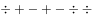

- **B**. 

　✅
- **C**. 

- **D**. 

**答案**：B

**官方解析**

第一步：分析题干符号间关系。
从相同符号的位置入手：位置1、6、7的符号相同；位置2、4的符号相同。并且3、5位置上的符号不同。
第二步：判断选项符号间关系。
A项：位置1、6、7的符号相同，位置2、4的符号相同，位置3、5的符号也相同，与题干不一致，排除；
B项：位置1、6、7的符号相同，位置2、4的符号相同，位置3、5的符号不相同，与题干一致，当选；
C项：位置2、4的符号不相同，与题干不一致，排除； 
D项：位置1、6、7的符号相同，位置2、4的符号相同，位置3、5的符号也相同，与题干不一致，排除。
故正确答案为B。

---

## 第 10 题　qid 2042720 · 逻辑判断

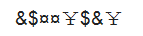

- **A**. 

- **B**. 

- **C**. 
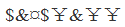

- **D**. 

　✅

**答案**：D

**官方解析**

第一步：分析题干符号间关系。
从相同符号的位置入手：位置1、7的符号相同；位置2、6的符号相同；位置3、4的符号相同；位置5、8的符号相同。
第二步：判断选项符号间关系。
A项：位置1、7的符号不相同，位置2、6的符号不相同，与题干不一致，排除；
B项：位置1、7的符号相同，位置2、6的符号不相同，与题干不一致，排除；
C项：位置1、7的符号不相同，与题干不一致，排除；
D项：位置1、7的符号相同；位置2、6的符号相同；位置3、4的符号相同；位置5、8的符号相同，与题干一致，当选。
故正确答案为D。

---

## 第 11 题　qid 2043616 · 图形推理

上边的题干中给出一套图形，其中有五个图，这五个图呈现一定的规律性。在下边给出一套图形，从中选出唯一的一项作为保持上边五个图规律性的第六个图。

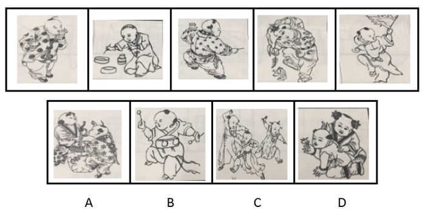

- **A**. A
- **B**. B　✅
- **C**. C
- **D**. D

**答案**：B

**官方解析**

题干中每个图形都是一个孩童在玩耍，选项中只有B为一个孩童，其他均为多个孩童。
故正确答案为B。

---

## 第 12 题　qid 2043618 · 图形推理

上边的题干中给出一套图形，其中有五个图，这五个图呈现一定的规律性。在下边给出一套图形，从中选出唯一的一项作为保持上边五个图规律性的第六个图。

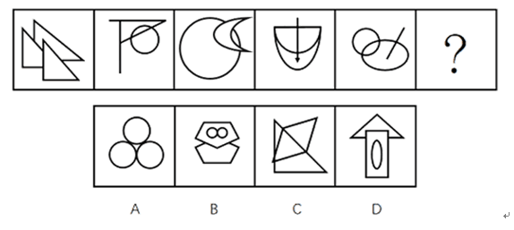

- **A**. A
- **B**. B
- **C**. C
- **D**. D　✅

**答案**：D

**官方解析**

元素组成不同，属性无明显规律，考虑数量规律。题干中每个图形都有3个面，选项A、B、C都是4个面，D是3个面。
故正确答案为D。

---

## 第 13 题　qid 2043620 · 图形推理

上边的题干中给出一套图形，其中有五个图，这五个图呈现一定的规律性。在下边给出一套图形，从中选出唯一的一项作为保持上边五个图规律性的第六个图。

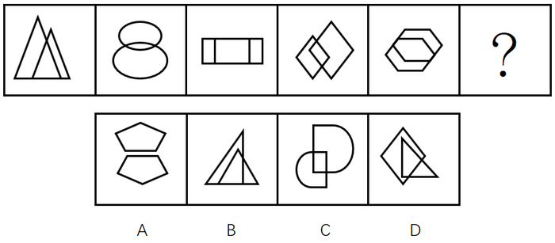

- **A**. A
- **B**. B
- **C**. C　✅
- **D**. D

**答案**：C

**官方解析**

元素组成不同，但每个图形都是由两个相似的元素组成，排除B、D，题干中每个图形的两个元素都相交，排除A。
故正确答案为C。

---

## 第 14 题　qid 2043622 · 图形推理

下边的四个图形中，只有一个是由上边的四个图形拼合（只能通过上、下、左、右平移）而成的，请把它找出来。

- **A**. A
- **B**. B
- **C**. C
- **D**. D　✅

**答案**：D

**官方解析**

平面拼合，找平行线做突破口，图2、图3都有直角边，且长度一致，优先拼合在一起，图1的底边加图4的底边与图2斜边平行且等长，应拼合在一起，得到D项图形，如下图所示：

故正确答案为D。

---

## 第 15 题　qid 2043624 · 图形推理

下边的四个图形中，只有一个是由上边的四个图形拼合（只能通过上、下、左、右平移）而成的，请把它找出来。

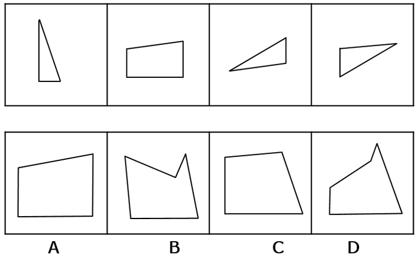

- **A**. A
- **B**. B
- **C**. C　✅
- **D**. D

**答案**：C

**官方解析**

平面拼合，找平行线做突破口，图3底边与图2顶边平行，且长度一致，优先拼合在一起，图3、图4斜边平行，且长度一致，应拼合在一起，得到C项图形，如下图所示：

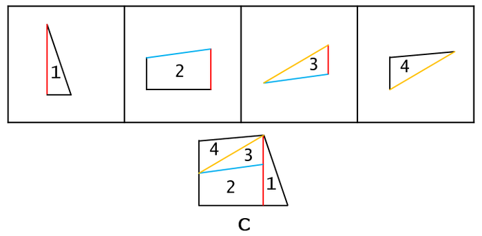

故正确答案为C。

---

## 第 16 题　qid 2043626 · 图形推理

下边的四个图形中，只有一个是由上边的四个图形拼合（只能通过上、下、左、右平移）而成的，请把它找出来。

- **A**. A
- **B**. B　✅
- **C**. C
- **D**. D

**答案**：B

**官方解析**

本题为平面拼合，可以采用平行等长相消的方法（找到相对面积较大的图形作为基准图形，找到平行且等长的边进行拼合，拼合之后等长线条抵消）。

 如下图所示：

故正确答案为B。

---

## 第 17 题　qid 2043628 · 图形推理

下边的四个图形中，只有一个是由上边的四个图形拼合（只能通过上、下、左、右平移）而成的，请把它找出来。

- **A**. A
- **B**. B　✅
- **C**. C
- **D**. D

**答案**：B

**官方解析**

本题为平面拼合，可以采用平行等长相消的方法（找到相对面积较大的图形作为基准图形，找到平行且等长的边进行拼合，拼合之后等长线条抵消）。

平行等长相消的方式如下图所示：

故正确答案为B。

---

## 第 18 题　qid 2043630 · 图形推理

左边给定的是纸盒外表面的展开图，右边哪一项能由它折叠而成？请把它找出来。

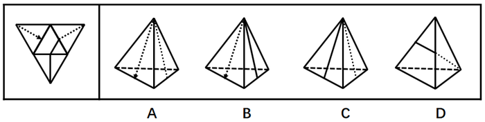

- **A**. A　✅
- **B**. B
- **C**. C
- **D**. D

**答案**：A

**官方解析**

本题属于四面体重构，可采用画边法排除选项。

A项：由面①和面③构成，与题干一致，当选；

B项：由面①和面④构成，如下图画边，题干边3与面③相邻，B选项边3与面①相邻，与题干不一致，排除；

C项：由面③和面④构成，如下图画边，题干边3与面①相邻，C选项边3与面④相邻，与题干不一致，排除；

D项：由面②和面③构成，如下图画边，题干边2与面②相邻，且面②的三角形靠近边1，而D选项边2与面②相邻，且面②的三角形靠近边3，与题干不一致，排除。

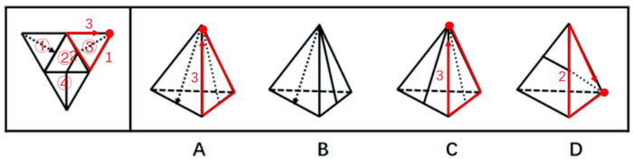

故正确答案为A。

---

## 第 19 题　qid 2043632 · 图形推理

左边给定的是纸盒外表面的展开图，右边哪一项能由它折叠而成？请把它找出来。

- **A**. A
- **B**. B　✅
- **C**. C
- **D**. D

**答案**：B

**官方解析**

本题属于四面体重构，可采用画边法逐一分析，排除错误选项。 

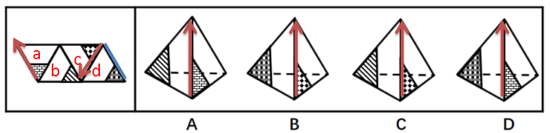

A项：由面a和面b构成，如上图所示，从面a中小黑三角形的顶点出发顺时针画边，第一条边（A项中红色箭头）挨着b面，可是展开图中从面a中小黑三角形的顶点出发顺时针画边第一条边（展开图最左侧红色箭头）挨着d面，平面图与立体图不对应，排除；

B项：由面c和面d构成，如上图所示，从面c中小黑三角形的顶点出发顺时针画边，第一条边（B项中红色箭头）挨着d面，可是展开图中从面c中小黑三角形的顶点出发顺时针画边第一条边（展开图右侧红色箭头）挨着d面，平面图与立体图对应，当选；

C项：由面c和面b构成，如上图所示，从面c中小黑三角形的顶点出发顺时针画边，第一条边（C项中红色箭头）挨着b面，可是展开图中从面c中小黑三角形的顶点出发顺时针画边第一条边（展开图右侧红色箭头）挨着d面，平面图与立体图不对应，排除；

D项：由面a和面d构成，如上图所示，从面a中小黑三角形的顶点出发顺时针画边，第一条边（A项中红色箭头）挨着d面，虽然展开图中从面a中小黑三角形的顶点出发顺时针画边第一条边（展开图最左侧红色箭头）也挨着面d，但是二者的公共边并不一致，选项D中的面a和面d的公共边为红色箭头，展开图中二者公共边为蓝色线段，二者不一致，平面图与立体图不对应，排除；

故正确答案为B。

---

## 第 20 题　qid 2043634 · 图形推理

左边给定的是纸盒外表面的展开图，右边哪一项能由它折叠而成？请把它找出来。

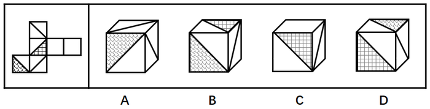

- **A**. A
- **B**. B　✅
- **C**. C
- **D**. D

**答案**：B

**官方解析**

本题属于六面体空间重构，在平面图中标示面，利用排除法选出正确答案。

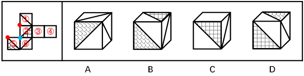

A项：由面①、面⑤和面⑥构成，面①和面⑥为相对面，相对面必然出现且只出现其中一面，排除；

B项：由面②、面⑤和面⑥构成，三面相对位置正确，当选；

C项：由面①、面②和面③构成，平面图中①②③面为逆时针，立体图中①②③面为顺时针，平面图与立体图不对应，排除；

D项：D项无论是由面①、面②和面⑤构成或者是由面②、面⑤和面⑥构成，三面的公共点均与面①或者面⑥中的线段不存在公共点，平面图与立体图不对应，排除。

故正确答案为B。

---

## 第 21 题　qid 2043684 · 逻辑判断

茶叶是中国人喜爱的健康饮品。一般人将茶叶冲泡饮用几次之后，就将喝剩的茶叶倒掉。某专家对此指出，其实茶叶中能够溶解于水的物质是有限的，大量有营养的物质仍然保留在茶叶中，白白倒掉实在可惜，人们应该将喝剩的茶叶吃掉。
以下哪项如果为真，最能反驳该专家的观点？

- **A**. 茶叶中许多没有营养的物质也不能溶于水
- **B**. 茶叶中含有茶叶碱和微量元素，可以提神醒脑
- **C**. 一般人喝茶已成为习惯，并非为了吸收营养物质　✅
- **D**. 很多人将喝剩的茶叶留下来做茶饼，茶叶蛋等

**答案**：C

**官方解析**

该专家的话很长，最后一句“应该”引出论点：人们应该将喝剩的茶叶吃掉。
论据：茶叶中能够溶解于水的物质是有限的，大量有营养的物质仍然保留在茶叶中，白白倒掉实在可惜。
A项：茶叶中许多没有营养的物质也不能溶于水，说明剩茶中也有无营养的物质，但并不能否定营养物质的存在，不能削弱，排除。
B项：茶叶中含有茶叶碱和微量元素可以提神醒脑，说明确实有营养物质存在，但是否溶于水没有明确指出，不能削弱，排除。
C项：一般人喝茶已成为习惯，并非为了吸收营养，说明茶叶即使有营养物质也不一定要吃，拆桥削弱，当选。
D项：将喝剩的茶叶留下来做茶饼、茶叶蛋，说明有人会吃掉，但是无法表明是否应该吃。比如有人闯红灯并不意味着应该闯红灯。因此该项不明确，排除。
故正确答案为C。

---

## 第 22 题　qid 2043686 · 逻辑判断

甲、乙、丙、丁、戊5人近期均到一座大型购物美食广场打工。她们打工的商家有家用电器店、服装店、药店、馄饨店、拉面馆，每人各去一家。每人开始打工的时间各不一样，分别是去年的3月、4月、5月、6月、7月。已知：
（1）甲是厨师，她在一家小吃店顺利找到工作；
（2）乙去了服装店，但她开始打工的时间比甲晚3个月；
（3）丙与去家用电器打工的人是同乡，5人中她开始打工的时间最晚；
（4）丁比戊开始打工的时间早，她去的是药店。
根据以上信息，可以得出以下哪项？

- **A**. 3月份甲开始到馄饨店打工
- **B**. 5月份戊开始到家用电器店打工　✅
- **C**. 6月份丁开始到药店打工
- **D**. 7月份丙开始到拉面馆打工

**答案**：B

**官方解析**

分析题干：

（1）甲是厨师，在小吃店上班；

（2）乙在服装店，比甲的上班时间晚三个月；

（3）丙与去家用电器打工的人是同乡，她最晚开始打工；

（4）丁在药店，丁打工时间早于戊。

如下图，根据条件（3）可知丙在7月开始打工。根据条件（2）可知，乙比甲晚三个月，剩下3、4、5、6四个月份，那么甲在3月去小吃店上班，乙在6月去服装店上班，排除C项。根据条件（4）可知，丁去打工的时间早于戊，那么丁在4月去药店，又因为丙没有去电器城，那么戊在5月去了电器城。拉面馆和馄饨店都可以称作小吃店，所以甲和丙的上班地点无法确定，排除A、D项。

故正确答案为B。

---

## 第 23 题　qid 2042782 · 逻辑判断

将东西两位戏剧大师的生平经历、文学造诣及身后影响作对比，是一个有趣的话题，有专家认为，将汤显祖称作“东方的莎士比亚”有很大的问题，因为无论是就人格的魅力，还是就文本美感而言，汤显祖都是不逊于莎士比亚的。
以下哪项最可能是上述专家观点所包含的假设？

- **A**. 汤显祖的人格魅力及其文本的美感均高于莎士比亚
- **B**. 汤显祖在西方的影响要大于莎士比亚在东方的影响
- **C**. 汤显祖和莎士比亚都不愿意别人用他人的名字来称呼自己
- **D**. “东方的威尼斯”是逊色于真正的威尼斯的　✅

**答案**：D

**官方解析**

第一步：找到论点和论据。
论点：将汤显祖称作“东方的莎士比亚”有很大的问题。
论据：无论是就人格的魅力，还是就文本美感而言，汤显祖都是不逊于莎士比亚。
第二步：逐一分析选项。
A项：题干问的是包含的假设，即需要补充联系或者前提。而A项指出汤显祖的人格魅力及其文本的美感均高于莎士比亚，是论据的重复表述，不能解释论点与论据间的必然联系，排除；
B项：指出汤显祖在西方的影响要大于莎士比亚在东方的影响，未提到汤显祖在东方的影响力有多大，而论点提到的是“东方的莎士比亚”，无关选项，排除；
C项：指出汤显祖和莎士比亚都不愿意别人用他人的名字来称呼自己，无关选项，排除；
D项：指出“东方的威尼斯”是逊色于真正的威尼斯的，即冠名为“东方”的人或地方都会逊色于西方，推理出“东方的莎士比亚”是逊色于真正的莎士比亚的，而汤显祖并不逊色于莎士比亚，因此将汤显祖称作“东方的莎士比亚”有很大的问题。论点与论据间搭桥，当选。
故正确答案为D。

---

## 第 24 题　qid 2042344 · 逻辑判断

对于小李、小王和小苗能否考取研究生，有以下4种猜测：
（1）小李能考取；
（2）要是小王能考取，那么小苗也能考取；
（3）或是小王能考取，或者小李能考取；
（4）小王能考取。
事后证实，这4种猜测中只有一种是对的。
根据以上信息，可以得出以下哪项？

- **A**. 小李考取了
- **B**. 小苗没有考取
- **C**. 小苗考取了
- **D**. 小李没有考取　✅

**答案**：D

**官方解析**

第一步：翻译题干。
（1）小李考取；
（2）小王考取→小苗考取；
（3）小王考取或者小李考取；
（4）小王考取；
第二步：假设法
4种猜测只有一种是对的。假设条件（1）是对的，或关系中其中一项对，整个或关系就为真，因此（3）也是对的，和题干要求矛盾。该假设错误，（1）一定错。既然小李考取是一句假话，那么它的矛盾命题小李没有考取就一定是真的。
故正确答案为D。

---

## 第 25 题　qid 2042292 · 类比推理

老张：你在这儿摆摊设点属于占道经营！
小王：这儿是中山北路又不是中山北道，我占的什么道？
以下哪项与上述对话方式最为相似？

- **A**. 甲：你这种执法行为一点人情味都没有！    乙：我严格执法是为了保障人民群众的生命财产安全。
- **B**. 甲：你成天打游戏是在虚度年华！     乙：我只有在游戏中才觉得年华没有虚度。
- **C**. 甲：你工作时间不能抽烟！   乙：我抽烟时从不工作。　✅
- **D**. 甲：你这种说法是栽赃陷害！      乙：你这种说法是血口喷人！

**答案**：C

**官方解析**

第一步：分析题干对话方式。
题干对话中小王故意曲解老张的话中“占道经营”的“道”，实际上这里的“道”泛指道路，小王通过混淆概念达到自己强词夺理的目的。
第二步：逐一分析选项。
A项：甲乙二人的话不在一个领域内，“人情味”与“保障人民群众的生命财产安全”并无冲突，与题干无相似之处，排除；
B项：甲乙二人对于“打游戏是否虚度年华”理解不同，与题干并无相似之处，排除；
C项：乙故意将甲话中的“工作时间不能抽烟”曲解成为“抽烟的时候不能工作”，混淆概念达到其强词夺理的目的，与题干最为相似，当选；
D项：乙仅仅是在指责对方，指出对方是在冤枉自己，与题干并无相似之处，排除。
故正确答案为C。

---

## 第 26 题　qid 2043688 · 逻辑判断

某专家对已故诺贝尔经济学奖得主的寿命进行统计，发现他们的平均寿命是85岁，其中超过90岁的占多数，还有不少过百岁的，去世时年龄最小的也高达74岁。该专家由此认为，获得诺贝尔经济学奖能使人长寿。
以下哪项如果为真，最能削弱上述专家的观点？

- **A**. 诺贝尔经济学奖只颁给在世的学者，这一颁奖规则对已经长寿的学者极为有利　✅
- **B**. 获得诺贝尔奖能带来功成名就的巨大身心愉悦，而愉悦的身心状态可延年益寿
- **C**. 宏观经济学之父凯恩斯年仅63岁就去世了，很遗憾他没有获得诺贝尔经济学奖
- **D**. 获得诺贝尔物理学奖的学者寿命也很长，但他们都没有获得过诺贝尔经济学奖

**答案**：A

**官方解析**

第一步：找到论点论据。
论点：获得诺贝尔经济学奖能使人长寿。
论据：对已故诺贝尔经济学奖得主的寿命进行统计，发现他们的平均寿命是85岁，其中超过90岁的占多数，还有不少过百岁的，去世时年龄最小的也高达74岁。
第二步：逐一分析选项。
A项：指出并非获得诺贝尔经济学奖使人长寿，而是已经长寿的学者才极有可能获得该奖项，属于因果倒置削弱，当选；
B项：指出获得诺贝尔奖确实能够让人长寿，加强了论点，排除；
C项：与诺贝尔经济学奖能否使人长寿无关，排除；
D项：与诺贝尔经济学奖能否使人长寿无关，排除。
故正确答案为A。

---

## 第 27 题　qid 2043690 · 逻辑判断

某单位的孔、陈、孟、刘4人需要分配到甲、乙、丙、丁4个村庄开展扶贫工作，每人各去一个村庄。根据工作需要，分配满足如下条件：
（1）若孔去甲村庄，则刘去丁村庄；
（2）要么陈去乙村庄，要么孟去丙村庄，两者仅有一项成立；
（3）孟去丁村庄。
如果上述条件均得到满足，则可以得出以下哪项？

- **A**. 孔去丙村庄，刘去甲村庄　✅
- **B**. 孔去甲村庄，刘去丙村庄
- **C**. 孔去丙村庄，刘去乙村庄
- **D**. 孔去乙村庄，刘去丙村庄

**答案**：A

**官方解析**

首先翻译题干已知信息：

孔、陈、孟、刘4人分别去甲、乙、丙、丁4个村庄。

（1）孔去甲村刘去丁村；

（2）要么陈去乙村，要么孟去丙村；

（3）孟去丁村。

根据条件（3）可知孟没有去丙村，结合条件（2）可知，陈去乙村，此时可以排除C项、D项；由条件（3）的孟去丁村可知刘没有去丁村，结合条件（1），（刘去丁村）（孔去甲村），即孔不去甲村，排除B项。此4人的情况是：刘去甲村，陈去乙村，孔去丙村，孟去丁村。

故正确答案为A。

---

## 第 28 题　qid 2043714 · 逻辑判断

暑假到了，父亲、母亲、儿子、女儿一行4人驾车去旅行。小汽车前排坐两人（一人当司机），后排也坐两人。4人各有不同爱好：音乐、体育、摄影、书法，所学专业也各不相同数学、历史、逻辑、物理。已知：
（1）儿子学物理；
（2）母亲酷爱音乐；
（3）学逻辑的摄影爱好者与女儿分两排斜向而坐。
如果儿子坐在司机斜后方，则可以得出以下哪项？

- **A**. 父亲是司机
- **B**. 母亲是司机　✅
- **C**. 儿子是司机
- **D**. 女儿是司机

**答案**：B

**官方解析**

本题为组合排列题。根据题意：
儿子专业物理；母亲爱好音乐；逻辑专业爱好摄影者不是儿子、母亲、女儿，只能是父亲；所以题干信息整理如下：
（1）儿子专业是物理；
（2）母亲爱好是音乐；
（3）父亲专业是逻辑，爱好是摄影；
（4）父亲与女儿分两排斜向而坐；
如果儿子与司机斜向而坐，由上述条件（4）可知，司机只能是母亲。
故正确答案为B。

---

## 第 29 题　qid 2043692 · 类比推理

暑假到了，父亲、母亲、儿子、女儿一行4人驾车去旅行。小汽车前排坐两人（一人当司机），后排也坐两人。4人各有不同爱好：音乐、体育、摄影、书法，所学专业也各不相同数学、历史、逻辑、物理。已知：
（1）儿子学物理；
（2）母亲酷爱音乐；
（3）学逻辑的摄影爱好者与女儿分两排斜向而坐。
如果爱好摄影的人坐在前排，则以下除了哪项其他均是可能的？

- **A**. 父亲是司机
- **B**. 母亲是司机
- **C**. 儿子是司机
- **D**. 女儿是司机　✅

**答案**：D

**官方解析**

本题为组合排列题。根据题意：
儿子专业物理；母亲爱好音乐；逻辑专业爱好摄影者不是儿子、母亲、女儿，只能是父亲；所以题干信息整理如下：
（1）儿子专业是物理；
（2）母亲爱好是音乐；
（3）父亲专业是逻辑，爱好是摄影；
（4）父亲与女儿分两排斜向而坐；
爱好摄影的是父亲，父亲坐前排，根据上述条件（4）可知女儿坐后排，所以女儿一定不可能是司机。本题要求选择哪项是不可能的，而D项是一定不可能的。
故正确答案为D。

---

## 第 30 题　qid 2043716 · 逻辑判断

暑假到了，父亲、母亲、儿子、女儿一行4人驾车去旅行。小汽车前排坐两人（一人当司机），后排也坐两人。4人各有不同爱好：音乐、体育、摄影、书法，所学专业也各不相同：数学、历史、逻辑、物理。已知：
（1）儿子学物理；
（2）母亲酷爱音乐；
（3）学逻辑的摄影爱好者与女儿分两排斜向而坐。
如果学历史的人不爱好音乐，则可以得出以下哪项？

- **A**. 父亲学历史，爱好摄影
- **B**. 母亲学数学，爱好音乐　✅
- **C**. 儿子学物理，爱好体育
- **D**. 女儿学历史，爱好书法

**答案**：B

**官方解析**

第一步：整理题干条件。
（1）儿子学物理；
（2）母亲爱好音乐；
（3）学逻辑的摄影爱好者与女儿分两排斜向而坐；
（4）学历史的人不爱好音乐。
第二步：根据题干信息进行分析。
结合条件（1）（2）（3）可知，逻辑专业的摄影爱好者不是母亲、儿子、女儿，所以父亲是学逻辑的摄影爱好者。结合条件（2）（4）可知母亲不是学历史的，再结合条件（1）可知母亲不是学物理的，所以母亲是学数学的，女儿是学历史的。儿子与女儿的爱好无法得出。
故正确答案为B。

---

## 第 31 题　qid 2042372 · 定义判断

斜杠青年：指不满足于从事单一职业，追求拥有多重职业身份及多元生活方式的年轻人。他们在自我介绍时往往喜欢用斜杠来区分自己的不同身份，如：张三，金牌律师/企划师/专栏作家。
下列属于斜杠青年的是：

- **A**. 最近两三年，八零后导演黄某某先后出演了10多次男配角，去年在一个著名的国际电影节上斩获了最佳男配角奖　✅
- **B**. 小丁在国外获得博士学位后，任职于国内一所著名高校，因科研成就突出，被破格聘为教授，并入选省“双百”人才计划
- **C**. 某公司程序员小陈爱好广泛，性格温和，人际关系融洽，节假日常邀上三五个好友一起登山、打球、游泳
- **D**. 李总做过保安，送过快递，当过安装工，开过小杂货店，他经常自豪地向员工讲述自己30多年来丰富的职业经历

**答案**：A

**官方解析**

第一步：找到定义关键词。
“年轻人”、“不满足于从事单一职业”、“追求拥有多重职业身份及多元生活方式”。
第二步：逐一分析选项。
A项：80后导演黄某某先后出演了10多次男配角，最终获得了最佳男配角奖，体现了黄某某在同一时间所扮演的导演和演员两种不同的身份和职业，符合定义，当选；
B项：小丁在国外获得博士学位后任职于高校，后因科研成就突出被聘为教授，自始至终小丁的职业只有教师这一项，没有体现多重职业身份和多元生活方式，不符合定义，排除；
C项：小陈爱好广泛经常约朋友一起登山、打球、游泳，只是体现了不同的兴趣爱好，和职业无关，也未体现多重身份，不符合定义，排除；
D项：李总做过保安、送过快递、当过安装工、开过小杂货店，虽然这些体现了李总不满足于从事一种职业，追求多种职业身份及多元生活方式，但是这些身份和经验都是过往的经验，并不是在当下工作之外所具有的其他身份。根据相关资料可推测，“斜杠青年”所指的多重身份更偏向于某人在同一时间所具备的不同身份，D项不符合定义，排除。
故正确答案为A。

---

## 第 32 题　qid 2042376 · 定义判断

影子工作：指消费者使已购商品变为可用物品所付出的任何劳动。
下列属于影子工作的是：

- **A**. 小孙到饭店就餐，老板告诉他，这几天大部分服务员都已经放假，顾客需要点餐，并递给他一支笔和一张菜单
- **B**. 小李的儿子快出生了，他赶紧抽时间将同事老王给的婴儿车拿出来修理一番，车子焕然一新，十分好用
- **C**. 经不住软磨硬泡，爸爸终于答应给小明买两条金鱼，小明高兴坏了，连夜在网上收集了十几页的金鱼养殖攻略
- **D**. 将拼板餐桌从商场运回家后，老冯忙乎了半天，对照安装说明，拆了装，装了拆，终于组装成功，中午就派上了用场　✅

**答案**：D

**官方解析**

第一步：找到定义关键词。
“消费者使已购商品变为可用物品所付出的任何劳动”。
第二步：逐一分析选项。
A项：小孙到饭店就餐，服务员休假只能自己点单，点单说明还没有消费，不存在已购商品，更没有体现出使已购商品变为可用物品的过程，同时点餐和变为可用物品之间没有联系，不符合定义，排除；
B项：小李将同事老王送的婴儿车拿出来修理一番，车子焕然一新，十分好用，送的婴儿车本就是一种可用物品，没有体现出使已购商品变为可用物品的过程，同时，婴儿车的购买者是老王而不是小李，不符合定义，排除；
C项：爸爸答应给小明买两条金鱼，小明搜集了十几页的养殖攻略，答应买金鱼但是还没买，没有体现出已购商品这个概念，同时金鱼也不是一种可用物品，不符合定义，排除；
D项：老冯将拼板餐桌从商场运回家，对照安装说明组装成功，中午派上用场，首先拼板餐桌是已购商品，老冯经过劳动使其变为可用物品，符合定义，当选。
故正确答案为D。

---

## 第 33 题　qid 2043694 · 定义判断

价值自认：指人们常常高估自己行为的价值，并从中获得快乐和美感。
下列属于价值自认的是：

- **A**. 小张毕业后刚到工作单位，幸运地分到了一套单身公寓。他花了半个月把房间布置得像新房一样，每天一走进去，心里就乐开了花
- **B**. 小星在校园机器人竞赛中获得一等奖后，他的父亲老吴整天乐呵呵的，逢人就夸儿子多么多么优秀
- **C**. 谢先生的成名曲一夜走红后，很快就跨入影视圈出演了多部电视剧，虽然观众反响平平，他却一直对自己的演技充满自信　✅
- **D**. 老赵的作品获得了省书法协会二等奖，同事们纷纷前来向他表示祝贺，他暗下决心：明年一定争取拿到更高的奖项

**答案**：C

**官方解析**

第一步：找到定义关键词。
“高估自己行为的价值”、“获得快乐和美感”。
第二步：逐一分析选项。
A项：小张布置自己分到的单身公寓，没有体现高估自己行为的价值，不符合定义，排除；
B项：小星的父亲是在评估儿子小星的行为，不是评估自己的行为，也没有体现高估的情况，不符合定义，排除；
C项：谢先生跨界出演电视剧，观众反响平平，说明其演技未必很好，而他仍对自己的演技充满信心，体现了高估自己行为的价值的情形，与A、B、D项比较，C项最符合定义，当选；
D项：老赵获奖后并没有高估自己获奖这件事，而是暗下决心继续努力，不符合定义，排除。
故正确答案为C。

---

## 第 34 题　qid 2042302 · 定义判断

随机试验：指在同一条件下会出现多种可能结果且可以重复进行的试验；试验的所有可能结果虽预先可知，但每次具体实验的结果却无法预知。
下列属于随机试验的是：

- **A**. 将一壶淡水加热到沸腾，观察其状态变化的实验
- **B**. 在狮子身上安装定位设备了解其生活习性的实验
- **C**. 为检测某辆新款汽车的安全性能所做的撞击实验
- **D**. 抛一枚硬币观察带有数字的一面朝上次数的实验　✅

**答案**：D

**官方解析**

第一步：找到定义关键词。

“在同一条件下会出现多种可能结果且可以重复进行的试验”、“试验的所有可能结果虽预先可知，但每次具体实验的结果却无法预知”。

第二步：逐一分析选项。

A项：将一壶淡水加热到沸腾，观察状态变化的实验，这种实验可重复进行，但是在同一条件下不可能出现多种结果，出现的结果只有一种，就是水加热至沸腾后，由液态变成气态，每次实验的具体结果是可以预知的，不符合定义，排除；

B项：在狮子上安装定位设备了解其生活习性的实验，同一头狮子是可以重复实验，但是狮子的情况和习性都不相同，实验的所有的结果并不都是可预知的，不符合定义，排除；

C项：为检测某辆新款汽车的安全性能所做的撞击实验，同一辆汽车的撞击实验是不可以重复进行的实验，而实验的结果是可以预知的，同时实验的结果并不具备多种可能性，排除；

D项：抛一枚硬币观察带有数字的一面朝上次数的实验，实验可以重复进行，且每次实验的结果具有两种可能性，一是带有数字的一面朝上，二是带有数字的一面朝下，其实验的所有结果是可以具体得知的，那就是带有数字的一面朝上的概率是，但是每次实验的结果带有数字的一面到底是朝上还是朝下却不可预知，符合定义，当选。

故正确答案为D。

---

## 第 35 题　qid 2042310 · 定义判断

临时救助：指家庭或个人遭遇突发事件、意外伤害、重大疾病等变故，基本生活陷入困境时，政府有关部门提供的应急性、过渡性救助。
下列属于临时救助的是：

- **A**. 80岁的李大爷无儿无女，独自生活，社区工作人员定期到他家中探望，把每月的养老金交到他手上，还时不时地送来一些生活用品
- **B**. 老张患上了强直性脊柱炎，巨额医疗费花光了积蓄，夫妻名下的房子也变卖了，一家三口只得暂住在街道办为他们租来的小房子里　✅
- **C**. 地震发生后，社会各界积极响应市政府号召，通过多种渠道捐款捐物，很快就筹集了大批物资并分发到了灾民手中
- **D**. 老赵在几年前的一次车祸中失去了左腿，从那以后再也不能外出工作，每月数百元的低保金就成了家里主要的经济来源

**答案**：B

**官方解析**

第一步：找到定义关键词。
原因：“家庭或个人遭遇突发事件、意外伤害、重大疾病等变故”、“基本生活陷入困境”。
结果：“政府有关部门提供的应急性、过渡性救助”。
第二步：逐一分析选项。
A项：80岁的李大爷无儿无女，独自生活，社区工作人员定期探望，给予养老金，没有体现出李大爷遭遇了突发事件、意外伤害或者重大疾病等变故，不符合定义，排除；
B项：老张患上了强直性脊柱炎，体现了家庭或者个人遭遇重大疾病的变故，花光了积蓄、变卖房子体现了生活陷入困境，一家人只得暂住在街道办为他们租来的小房子里，体现了政府有关部门提供的应急性、过渡性救助，符合定义，当选；
C项：地震发生后，社会各界响应号召为灾民捐送物资，并不是政府有关部门提供的应急性、过渡性救助，不符合定义，排除；
D项：老赵因车祸失去左腿，体现了遭遇意外伤害等变故，但每月的低保金成为主要经济来源并不是应急性、过渡性的救助，低保金是一种长期的救助，不符合定义，排除。
故正确答案为B。

---

## 第 36 题　qid 2042312 · 定义判断

渐进式退休：指员工到了法定退休年龄，用人单位根据实际工作需要对部分人员灵活确定退休时间。
下列属于渐进式退休的是：

- **A**. 马教授临近退休年龄，因为他是国内最具影响力的学者之一，对学科发展作出了重大贡献，学校决定聘任他为终身教授
- **B**. 赵先生已经到了退休年龄，但是他主持的重大攻关项目还没有结题，他所在的研究所决定聘用他继续工作，直到项目完成　✅
- **C**. 近年来，李工程师的身体状况越来越糟糕，还患上了轻度的抑郁症，无法坚持工作，公司领导经过研究，决定让他提前退休
- **D**. 某研究机构决定，从下半年开始，本单位申请提前退休的职工，初、中级职称不低于54岁，高级职称不低于58岁

**答案**：B

**官方解析**

第一步：找到定义关键词。
“员工到了法定退休年龄”、“用人单位根据实际工作需要对部分人员灵活确定退休时间”。
第二步：逐一分析选项。
A项：马教授临近退休说明还没有到法定退休年龄，不符合定义，排除；
B项：赵先生到了退休年龄，因为他主持的项目没有结题，研究所决定聘用他继续工作，体现了“用人单位根据实际工作需要对部分人员灵活确定退休时间”，符合定义，当选；
C项：李工程师提前退休说明还没有到法定退休年龄，不符合定义，排除；
D项：某机构职工申请提前退休说明还没有到法定退休年龄，不符合定义，排除。
故正确答案为B。

---

## 第 37 题　qid 2042326 · 定义判断

创伤后成长：指一个人在经历重大的生活挫折之后发生的积极性改变。
下列属于创伤后成长的是：

- **A**. 一名车祸幸存者说，事故之后她能更主动地掌控自己的生活　✅
- **B**. 在多次丢失手机以后，小张照看自己的随身物品比以前细心多了
- **C**. 在同事突然撒手人寰后，小刘深感生命脆弱，开始坚持健身锻炼
- **D**. 赴震区考察归来后，王工程师对建筑物防震设计有了更深刻的认识

**答案**：A

**官方解析**

第一步：找到定义关键词。
“经历重大的生活挫折”、“发生的积极性改变”。
第二步：逐一分析选项。
A项：车祸幸存者说明经历了车祸的重大生活挫折，她更主动地掌控自己的生活属于积极性改变，符合定义，当选；
B项：多次丢失手机与A项的车祸比较不属于经历重大的生活挫折，不符合定义，排除；
C项：同事的去世是否算“经历重大的生活挫折”，与同事关系的亲疏远近相关，选项此处并未提及和同事的关系，因此不够明确，不如A项车祸幸存者更能体现“经历重大的生活挫折”，同事的去世不是小刘的生活挫折，不符合定义，排除；
D项：王工程师赴灾区考察不是经历生活挫折，不符合定义，排除。
故正确答案为A。

---

## 第 38 题　qid 2043698 · 定义判断

地块经济：指大量的同质化制造加工小企业集中在一个相对小的区域内，形成比较完整的产业链的区域经济发展模式。
下列不属于地块经济的是：

- **A**. 
义乌小商品闻名遐迩，是国内规模最大的小商品生产和批发基地之一。在那里，各种各样的小商品可以说应有尽有

- **B**. 
桂林一年四季都挤满了来自全国各地的游客，当地的饭店宾馆、旅游品商店、出租车公司一个个都赚得盆满钵满
　✅
- **C**. 
嵊州堪称“中国领带之乡”，每年生产领带3亿条，出口1.6亿条，在国内、国际市场分别占了、以上的份额

- **D**. 
亳州素有“药都”的美誉，每天都有无数商家从四面八方来到这里，运送药材的车队常常是一眼望不到头

**答案**：B

**官方解析**

第一步：找到定义关键词。
“大量同质化制造加工小企业集中”。
第二步：逐一分析选项。
A项：义乌是国内规模最大的小商品生产和批发基地之一，属于“大量同质化制造加工小企业集中”，符合定义，排除；
B项：当地的饭店宾馆、旅游品商店、出租车公司不符合“大量同质化制造加工小企业集中”，不符合定义主体，当选；
C项：嵊州“中国领带之乡”，属于“大量同质化制造加工小企业集中”，符合定义，排除；
D项：亳州是“药都”，属于“大量同质化制造加工小企业集中”，符合定义，排除。
本题为选非题，故正确答案为B。

---

## 第 39 题　qid 2042356 · 定义判断

新乡贤：指长期扎根农村，利用自己的知识、技术、财富为村民热心服务并作出突出贡献，在当地社会生活及民众心目中具有较高威望和影响力的乡村人士。
下列属于新乡贤的是：

- **A**. 10多年来，老李虽然一直在外经商，但他时时惦念着家乡，每年都会捐出大量资金为家乡修桥铺路，资助家乡的特困大学生完成学业，乡亲们经常千里迢迢地跑来看望他
- **B**. 小张复员后回到家乡，两三年就成了远近闻名的“养殖大王”，为了带动乡亲们共同致富，他开办了多期培训班，免费传授实用养殖技术和经验，受到了大家的称赞
- **C**. 20多年来，某市商会会长孙先生利用自己长期积累的丰富经验，为经营各种农副产品的家乡村民牵线搭桥，指导他们寻找商机，被乡亲们誉为贴心的“诸葛亮”
- **D**. 某乡村小学校长程某退休后，利用自己学生多、关系广的优势，为挖掘家乡历史文化资源、发展乡村文化旅游业积极谋划、东奔西走，被乡亲们传为佳话　✅

**答案**：D

**官方解析**

第一步：找到定义关键词。
“长期扎根农村”、“利用自己的知识、技术、财富为村民热心服务并作出突出贡献”、“具有较高威望和影响力的乡村人士”。
第二步：逐一分析选项。
A项：老李一直在外经商，并没有长期扎根农村，不符合定义，排除；
B项：小张免费传授实用养殖技术和经验属于利用自己的知识为村民热心服务，但他回乡时间只有两三年，不是长期扎根农村，不符合定义，排除； 
C项：孙先生为某市商会会长说明他没有长期扎根农村，不属于乡村人士，不符合定义，排除； 
D项：程某之前在乡村小学当校长为村民服务，退休后挖掘家乡历史文化资源为村民服务，属于长期扎根农村，具有一定的威望和影响力，符合定义，当选。
故正确答案为D。

---

## 第 40 题　qid 2043700 · 定义判断

咕咚效应：由于谣言传播而导致的集体无意识恐慌蔓延的现象，源自童话《咕咚来了》，讲述木瓜落进湖中后响起的“咕咚”声在动物中以讹传讹引发恐慌的故事。
下列属于咕咚效应的是：

- **A**. 某市去年房价暴涨，老李看到自己辛苦上班多年还不如别人买一套房一转手赚得多，担心房价继续飙涨，对自己的资产贬值感到恐慌，认为买房可以增值保值，于是忍不住加入到抢房的行列
- **B**. 英国脱欧公投结果出来后，由于担心一旦脱欧后在英国的金融机构会无法再获得欧盟的“单一护照”在伦敦设立欧洲总部的银行纷纷计划撤离，不少外资银行开始准备迁往巴黎、法兰克福、柏林等地
- **C**. 某网络大V杜撰“来自自来水的避孕药”博文，声称由于药物滥用，自来水中的避孕药含量过高，且无法通过常规的净化装置过滤，弄得人心惶惶，许多家庭担心饮水安全，纷纷抢购瓶装水　✅
- **D**. 网上疯传一则“硅油可致脱发并易致癌”的文章，披露市面上的洗发水九成含有硅油。微商小郑借机在朋友圈推销自制的天然皂角手工皂和茶籽洗发水，受到了推崇健康生活、回归自然者的追捧

**答案**：C

**官方解析**

第一步：找到定义关键词。
“谣言”、“集体无意识”、“恐慌蔓延”。
第二步：逐一分析选项。
A项：某市去年房价暴涨不属于“谣言”，老李忍不住加入到抢房的行列不符合“集体无意识”，选项主体为老李一人未体现集体，同时忍不住加入到抢房行列为下意识而为，不符合定义关键词，排除；
B项：英国脱欧公投结果出来不属于“谣言”，不符合定义关键词，排除；
C项：杜撰“来自自来水的避孕药”博文属于“谣言”，许多家庭担心饮水安全，纷纷抢购瓶装水体现了“集体无意识的恐慌蔓延”，符合定义关键词，当选；
D项：受到了推崇健康生活、回归自然者的追捧没有体现出“恐慌蔓延”，不符合定义关键词，排除。
故正确答案为C。

---
