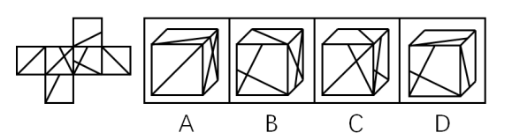
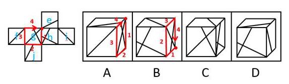
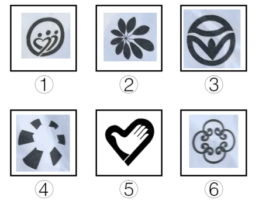
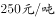
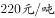
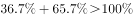

# 2017年河南省公务员录用考试《行测》题（网友回忆版）

> 判断推理 · 35 题 · 河南 2017

## 第 1 题　qid 2136750 · 图形推理

从所给的四个选项中，选择最合适的一个填入问号处，使之呈现一定的规律性：

- **A**. A
- **B**. B　✅
- **C**. C
- **D**. D

**答案**：B

**官方解析**

观察图形发现，元素组成不同且图形被分隔为多个区域，优先考虑数面。题干图形面数量分别为3、4、5、6、7，呈递增规律，故？处应选择一个面数量为8的图形。观察选项发现，A项9个面，B项8个面，C项8个面，D项8个面，排除A选项。进一步观察发现，题干所有图形中，面积最大的面均为一个三角形的面，只有B选项符合。
故正确答案为B。

---

## 第 2 题　qid 2136754 · 图形推理

把下面的六个图形分为两类，使每一类图形都有各自的共同特征或规律，分类正确的一项是：

- **A**. ①②④，③⑤⑥
- **B**. ①④⑤，②③⑥
- **C**. ①③⑥，②④⑤　✅
- **D**. ①⑤⑥，②③④

**答案**：C

**官方解析**

本题为分组分类题。观察图形发现，题干中图形均被分隔为不同的封闭区域，考虑面数量。但题干图形面数量均为4个，可考虑面的特征。观察发现，题干中有的图形中存在两个完全相同的面，有的图形中几个面均不相同，即图①③⑥中均存在两个完全相同的面，图②④⑤中不存在两个完全相同的面，因此可将图形分为①③⑥一组，②④⑤一组。
故正确答案为C。

---

## 第 3 题　qid 2136758 · 图形推理

把下面的六个图形分为两类，使每一类图形都有各自的共同特征或规律，分类正确的一项是：

- **A**. ①②③，④⑤⑥
- **B**. ①④⑤，②③⑥
- **C**. ①③⑤，②④⑥
- **D**. ①⑤⑥，②③④　✅

**答案**：D

**官方解析**

本题为分组分类题目。观察图形发现，所有图形都为关于竖轴轴对称的图形。

解法一：画出题干中每个图形的对称轴发现，图②③④的对称轴左右两边均存在形状完全一致的小图形，图①⑤⑥的对称轴左右两边均不存在形状完全一致的小图形，因此可将图形分为①⑤⑥一组，②③④一组。

解法二：画出题干中每个图形的对称轴发现，图②③④的对称轴穿过图形的一个面，图①⑤⑥的对称轴穿过图形的三个面，因此可将图形分为①⑤⑥一组，②③④一组。

故正确答案为D。

备注：两种解法考虑的都是对称轴与图形之间的关系，且答案一致，故任一解法均可答题。

---

## 第 4 题　qid 2136764 · 图形推理

左边是给定的正方体的外表面展开图，右边哪一项能由它折叠而成？

- **A**. A
- **B**. B
- **C**. C　✅
- **D**. D

**答案**：C

**官方解析**

本题考查六面体的空间重构。如下图所示，先对题干展开图的6个面进行标号：

A项：如上图所示，同时对选项和题干展开图中面g进行画边，选项中第4条边对应的是面e中小直角三角形的直角边，而题干展开图中第4条边对应的是面e中直角梯形的长底边，选项和题干展开图不一致，排除；

B项：如上图所示，同时对选项和题干展开图中面g进行画边，选项中第2条边对应面h，而题干展开图中第2条边对应面j，选项和题干展开图不一致，排除；

C项：选项和题干展开图一致，当选；

D项：面e与面j为相对面，不能同时出现，选项和题干展开图不一致，排除。

故正确答案为C。

---

## 第 5 题　qid 2136768 · 图形推理

把下面的六个图形分为两类，使每一类图形都有各自的共同特征或规律，分类正确的一项是：

- **A**. ①③④，②⑤⑥　✅
- **B**. ①②⑤，③④⑥
- **C**. ①⑤⑥，②③④
- **D**. ①③⑥，②④⑤

**答案**：A

**官方解析**

本题为分组分类题目。图形元素组成不同，无明显属性规律，考虑数量规律。观察发现，题干出现粗线条、生活化图形，考虑部分数。题干图形中，图②⑤⑥都是一部分，而图①为5部分，图③为2部分，图④为6部分，所以图①③④都是多部分。即①③④一组，②⑤⑥一组。
故正确答案为A。
注：图形分组分类优先考虑两组图形分别呈现规律，但这道题出现粗线条、生活化图形，部分数特征明显，且无其他规律，可考虑一组为一部分、一组为多部分的规律。

---

## 第 6 题　qid 2136772 · 图形推理

左图是给定的立体图形，将其从任一面剖开，下面哪一项不可能是该立体图形的截面？

- **A**. A
- **B**. B
- **C**. C　✅
- **D**. D

**答案**：C

**官方解析**

A项：在图形前面的L形部分，竖直向下可以切出，如图1所示；

B项：在图形的一角斜着从棱切到面，可以切出，如图2所示；

C项：无法切出直角三角形；

D项：在图形的一角斜着从面切到面，可以切出，如图3所示。

本题为选非题，故正确答案为C。

---

## 第 7 题　qid 2136776 · 图形推理

从所给的四个选项中，选择最合适的一个填入问号处，使之呈现一定的规律性：

- **A**. A
- **B**. B
- **C**. C　✅
- **D**. D

**答案**：C

**官方解析**

元素组成不同，属性无明显规律，考虑数量规律。观察题干图形发现，点、线、面、素均无明显规律。再次观察，发现图1、图2出现矩形和正方形，图3圆中的直线都是垂直相交的，考虑数直角数量。题干图形中直角数分别是8、7、6、5、4，依次递减，故？处应选择有3个直角的图形。选项直角数分别为A项4个、B项1个、C项3个、D项9个，只有C项符合题干规律。
故正确答案为C。

---

## 第 8 题　qid 2136778 · 图形推理

从所给的四个选项中，选择最合适的一个填入问号处，使之呈现一定的规律性：

- **A**. A
- **B**. B
- **C**. C　✅
- **D**. D

**答案**：C

**官方解析**

元素组成不同，且无属性规律，考虑数量规律。观察题干图形发现，每个图形中均存在曲线，可优先考虑曲线数。题干图形中的曲线数依次为1、2、3、4、5，故问号处应选择有6条曲线的图形。选项曲线数分别为A项12条、B项5条、C项6条、D项10条，只有C项符合题干规律。
故正确答案为C。

---

## 第 9 题　qid 2136730 · 图形推理

从所给的四个选项中，选择最合适的一个填入问号处，使之呈现一定的规律性：

- **A**. A
- **B**. B　✅
- **C**. C
- **D**. D

**答案**：B

**官方解析**

九宫格优先横行观察，第一行都有3个球，第二行都有4个球，第三行前两幅图都有4个球，故问号处也应有四个球，排除D项；观察发现，题干所有球均分为上下两行，排除A项；比较B、C两项，发现B、C两项下边两个球之间的距离不一致，观察题干发现，九宫格第一行中，横线上下两行间隔排列，第二行，横线上下两行对齐排列，第三行前两幅图中，横线上下两行间隔排列，因此问号处选择一个横线上下两行间隔排列的，只有B选项符合。
故正确答案为B。

---

## 第 10 题　qid 2136734 · 图形推理

从所给的四个选项中，选择最合适的一个填入问号处，使之呈现一定的规律性：

- **A**. A
- **B**. B　✅
- **C**. C
- **D**. D

**答案**：B

**官方解析**

图形元素组成不同，且无属性规律，考虑数量规律。观察发现，题干中每个图形都含有4个奇点，即都是两笔画图形，故问号处应选择两笔画图形。选项中，A项和D项都是一笔画图形，C项是三笔画图形，只有B项是两笔画图形。
故正确答案为B。

---

## 第 11 题　qid 2136756 · 定义判断

暂予监外执行是指对被判处有期徒刑、拘役或无期徒刑的罪犯，在某些法定情形出现时，暂时不采取在监狱或看守所执行原判刑罚的一种变通执行方法。罪犯有下列情形之一的，可以暂予监外执行：（1）有严重疾病需要保外就医的；（2）怀孕或正在哺乳自己的婴儿的；（3）生活不能自理，适用暂予监外执行不致危害社会的。被判处无期徒刑的罪犯，只有在符合第二种情形时，才可以暂予监外执行。对适用保外就医可能有社会危险性的罪犯，或者自伤自残的罪犯，不得保外就医。
根据上述定义，下列罪犯最有可能适用暂予监外执行的是：

- **A**. 罪犯甲（女）被判处有期徒刑，丈夫死亡，父母患重病，尚有三个3-8岁的未成年子女无人照看
- **B**. 罪犯乙被判处有期徒刑，入监后对生活失去信心，自杀未果，危及生命
- **C**. 罪犯丙被判处有期徒刑，服刑期间突发疾病，肢体瘫痪，生活不能自理　✅
- **D**. 罪犯丙（女）被判处死刑，判决生效后发现其已怀孕三个月

**答案**：C

**官方解析**

第一步：找出定义关键词。
被判处有期徒刑或者拘役的罪犯：（1）有严重疾病需要保外就医的；（2）怀孕或者正在哺乳自己婴儿的妇女；(3）生活不能自理，适用暂予监外执行不致危害社会的。
被判处无期徒刑的罪犯：只有符合第二种情形的，才可以暂予监外执行。
对适用保外就医可能有社会危险性的罪犯，或者自伤自残的罪犯，不得保外就医。
第二步：逐一分析选项。
A项：罪犯甲（女）被判处有期徒刑，但是她的丈夫死亡、父母患病、子女无人照顾等这些条件不满足“（1）有严重疾病需要保外就医的；（2）怀孕或者正在哺乳自己婴儿的妇女；（3）生活不能自理，适用暂予监外执行不致危害社会的”，不符合定义，排除；
B项：罪犯乙被判处有期徒刑，入监后对生活失去信心，虽然自杀未遂并危及生命，可能需要保外就医，但是根据关键词“对适用保外就医可能有社会危险性的罪犯，或者自伤自残的罪犯，不得保外就医”，不符合定义，排除；
C项：罪犯丙被判处有期徒刑，在服刑期间患病肢体瘫痪，并且生活不能自理符合“生活不能自理，适用暂予监外执行不致危害社会的”的情形，符合定义，当选；
D项：罪犯丙（女）被判处死刑，虽然她已怀孕，但是怀孕可以监外执行的前提是被判处有期徒刑或无期徒刑，而不是死刑，因此不在暂予监外执行考虑的范畴，不符合定义，排除。
故正确答案为C。

---

## 第 12 题　qid 2136762 · 定义判断

服务型公关是指组织以提供各种实惠服务为主，通过实际行动获取社会公众的了解和好评，从而建立组织良好形象的公共关系活动。
根据上述定义，下列属于服务型公关的是：

- **A**. 某热水器厂家定期向用户发送热水器使用注意事项，每年为用户免费更换滤网　✅
- **B**. 某环保公司通过某电视节目宣布向灾区一次性提供价值5亿元人民币的救助物资
- **C**. 某酒厂在电视黄金时段投放大量广告宣传其新产品
- **D**. 某制药公司董事长就生产的某批次药品不合格一事向消费者公开道歉，并辞去相关职务

**答案**：A

**官方解析**

第一步：找出定义关键词。
“组织”、“以提供各种实惠服务为主”、“通过实际行动获取社会公众的了解和好评”、“建立组织良好形象”。
第二步：逐一分析选项。
A项：热水器厂定期给用户发送注意事项，免费换滤网，符合“以提供各种实惠服务为主”、“通过实际行动获取社会公众的了解和好评”，符合定义，当选；
B项：环保公司是通过电视节目宣布向灾区一次性提供救援物资，提供的是物资，而不是提供服务，不符合“以提供各种实惠服务为主”，不符合定义，排除；
C项：酒厂打广告的行为，只是一种营销宣传手段，不是向社会提供服务，不符合“以提供各种实惠服务为主”，不符合定义，排除；
D项：制药公司董事长是个人，不是组织，主体不符，同时他就药品质量问题公开道歉的行为，不符合“以提供各种实惠服务为主”，不符合定义，排除。
故正确答案为A。

---

## 第 13 题　qid 2136766 · 定义判断

消费痛点指消费者在使用或希望使用某商品时，认为存在特别令人不满意或令人感到麻烦的地方。
根据上述定义，下列不属于消费痛点的是：

- **A**. 江女士特别注意美容，购买了某品牌护肤品，但她发现使用起来很不方便
- **B**. 老马为了养生特地购买了海参，但他发现发制和烹煮特别耗费时间和精力
- **C**. 小林家使用的抽油烟机效果很好，但清洗太复杂，每次都需专业人员登门
- **D**. 谢女士买了一条心仪已久的裙子，但是穿上后周围的朋友都说不适合她，她感到很沮丧　✅

**答案**：D

**官方解析**

第一步：找出定义关键词。
“消费者”、“使用或希望使用某种商品时”、“令人不满意或令人感到麻烦的地方”。
第二步：逐一分析选项。
A项：消费者江女士使用护肤品时感觉很不方便，符合“令人感到麻烦”，符合定义，排除； 
B项：消费者老马在使用海参时，发现烹制和蒸煮特别耗费时间和精力，符合“令人感到麻烦”，符合定义，排除；
C项：消费者小林家使用的抽油烟机清洗太复杂，符合“令人不满意或令人感到麻烦”，符合定义，排除；
D项：消费者谢女士购买心仪的裙子后，是由于周围朋友说不适合她，她才感到沮丧，并不是对裙子感到不满意或感到麻烦，不符合定义，当选。
本题为选非题，故正确答案为D。

---

## 第 14 题　qid 2136770 · 定义判断

舌尖效应是指对于平时很熟悉的事物，人们就是一时想不起来，有一种话到口边却说不出来的感觉，在情绪紧张时尤其明显。
根据上述定义，下列属于舌尖效应的是：

- **A**. 退休不久的老孙在街上看到过去同一办公室的同事，同事热情地与他打招呼，但老孙就是想不起同事的名字　✅
- **B**. 小王去一家广告公司应聘，面对招聘人员的提问，他沉着冷静，对答如流，但当招聘人员最后问他所期望的工资待遇时，他却难以启齿
- **C**. 江先生平时聊天总能侃侃而谈，在一次相亲中他遇到一位心仪的女性，他一紧张反而变得笨嘴拙舌，不知如何与对方攀谈
- **D**. 在一次数学考试中，小张遇到一道难题，他的大脑一片空白，心里很着急，但就是不知如何回答

**答案**：A

**官方解析**

第一步：找出定义关键词。
“对于平时很熟悉的事物”、“一时想不起来”、“话到口边却说不出来”、“在情绪紧张时尤为明显”。
第二步：逐一分析选项。
A项：刚退休不久的老孙遇到同一办公室的同事，符合“对于平时很熟悉的事物”，“老孙就是想不起同事的名字”符合“一时想不起来”、“话到口边却说不出来”，符合定义，当选； 
B项：对所期望的工资待遇难以启齿的原因不是因为一时想不起来，而是因为不知道怎么回答，不符合定义，排除；
C项：江先生相亲时遇到心仪的女性，相亲对象不属于很熟悉的事物，不符合“对于平时很熟悉的事物”，不符合定义，排除；
D项：数学考试是答卷，不符合“话到口边却说不出来”，不符合定义，排除。
故正确答案为A。

---

## 第 15 题　qid 2136774 · 定义判断

所谓面源污染，是指溶解的或固体的污染物从非特定的地点，在降水（或融雪）的冲刷作用下，通过径流过程而汇入受纳水体（包括河流、湖泊、水库和海湾等），并引起水体的富营养化或其他形式的污染，是相对于点源污染而言的一种水环境污染类型。
根据上述定义，下列情形属于面源污染的是：

- **A**. 某核电站因地震发生核泄漏造成海水污染
- **B**. 酸雨造成了土壤污染和农作物大面积减产
- **C**. 农村到处散落的垃圾经降水过程污染水体　✅
- **D**. 造纸厂的工业污水不经处理由排污管排放到湖里

**答案**：C

**官方解析**

第一步：找出定义关键词。
“溶解的或固体的污染物”、“从非特定地点”、“在降水（或融雪）的冲刷作用下”、“通过径流过程而汇入受纳水体”、“水环境污染”。
第二步：逐一分析选项。
A项：某核电站属于特定地点，不符合“从非特定地点”，而且因地震发生核泄漏，不符合“在降水（或融雪）的冲刷作用下”，不符合定义，排除；
B项：酸雨造成了土壤污染和农作物减产，不符合“通过径流过程而汇入受纳水体”造成“水环境污染”，不符合定义，排除；
C项：散落的垃圾符合“溶解的或固体的污染物”，经降水过程符合“在降水（或融雪）的冲刷作用下”，污染水体符合“水环境污染”，符合定义，当选；
D项：由排污管排放，不符合“在降水（或融雪）的冲刷作用下”，不符合定义，排除。
故正确答案为C。

---

## 第 16 题　qid 2136714 · 定义判断

内生式发展，是一种主要由发展地区内部来推动和参与、充分利用发展地区自身的力量和资源、尊重自身的价值与制度、探索适合自身发展道路的发展。
根据上述定义，下列情形属于内生式发展的是：

- **A**. 新农村建设中，地方政府撤村建社区，让农民集中到社区居住
- **B**. 为推动农民致富，地方政府让农民放弃种植小麦，统一种植果树
- **C**. 农民放弃机械化的耕作模式，采用传统的人工耕作方式
- **D**. 山区农民组建藤条编织合作社，将藤编产品打入国际市场　✅

**答案**：D

**官方解析**

第一步：找出定义关键词。
“由发展地区内部来推动和参与”、“利用发展地区自身的力量和资源”、“探索适合自身发展道路的发展”。
第二步：逐一分析选项。
A项：地方政府撤村建社区，属于地方政府主动采取的措施，不符合“由发展地区内部来推动和参与”，不符合定义，排除； 
B项：地方政府让农民放弃种植小麦，属于地方政府主动采取的措施，不符合“由发展地区内部来推动和参与”，不符合定义，排除；
C项：农民放弃机械化的耕作模式，采用传统的人工耕作模式，是否符合“探索适合自身发展道路的发展”不明确，排除；
D项：山区农民组建藤条编织合作社，符合“利用发展地区自身的力量和资源”，将藤条产品打入国际市场，符合“探索适合自身发展道路的发展”，符合定义，当选。
故正确答案为D。

---

## 第 17 题　qid 2136720 · 定义判断

无卡支付指付款人借助互联网、移动互联网、无线局域网等渠道进行的，不需要通过受理设备读取物理卡片，即可向收款人转移可以接受的货币债权。
根据上述定义，下列不属于无卡支付的是：

- **A**. 小王是个网购达人，为方便购物，他开通了支付宝的“快捷支付”功能，输入卖家支付宝账号即可付款完成交易
- **B**. 某高校开通了“校园一卡通”服务，该卡既可以当门禁卡、借书证使用，也可以用它在餐厅、超市消费，方便了广大师生　✅
- **C**. 小钱是资深的游戏玩家，经常在游戏平台用网银购买大量游戏装备
- **D**. 餐馆老板老吴开通了微信支付，顾客买单时只需用手机扫描账单上的二维码，即可用微信支付相应的费用

**答案**：B

**官方解析**

第一步：找出定义关键词。
“借助互联网、移动互联网、无线局域网等渠道进行的”、“不需要通过受理设备读取物理卡片”、“向收款人转移可以接受的货币债权”。
第二步：逐一分析选项。
A项：“开通支付宝‘快捷支付’功能，输入卖家支付宝账号”符合“借助互联网、移动互联网、无线局域网等渠道”的支付方式，“即可付款完成交易”符合“向收款人转移可以接受的货币债权”，符合定义，排除；
B项：“该卡既可以当门禁卡、借书证使用，也可以用它在餐厅、超市消费”不符合“不需要通过受理设备读取物理卡片”的支付方式，不符合定义，当选；
C项：“在游戏平台用网银购买游戏装备”符合“借助互联网、移动互联网、无线局域网等渠道进行的”支付方式，符合定义，排除；
D项：“微信支付，扫描二维码即可付款”符合“借助互联网、移动互联网、无线局域网等渠道进行的”支付方式，符合定义，排除。
本题为选非题，故正确答案为B。

---

## 第 18 题　qid 2136696 · 定义判断

责任分散效应也称为旁观者效应，是指对某一事件来说，如果是单个个体被要求单独完成任务，个体责任感会增强。但如果是要求群体共同完成任务，群体中的每个个体的责任感会变弱，甚至会出现人多不负责、责任不落实的情况。这一效应常发生在事故发生后众多旁观者身上。
根据上述定义，下列情形不属于责任分散效应的是：

- **A**. 有一位口吐白沫的人倒在街上，小明看到后心想“有人会打120的”
- **B**. 邻居家的房子着火了，小吴和其他邻居从楼道逃生　✅
- **C**. 有一个小孩被车撞倒在马路中央，经过的车辆纷纷绕道而行
- **D**. 某女士在闹市区遭遇歹徒袭击，数次高呼“救命”而无人施救

**答案**：B

**官方解析**

第一步：找出定义关键词。
“单个个体被要求单独完成任务，个体责任感会增强”、“群体共同完成任务，群体中的每一个个体的责任感变弱，甚至会出现人多不负责、责任不落实的情况”、“事故发生后”。
第二步：逐一分析选项。
A项：“口吐白沫的人倒在街上”后周围人产生了帮助的责任，“小明看到后心想有人会打120，所以自己就没打”符合“群体中的每一个个体的责任感会变弱，甚至会出现人多不负责、责任不落实的情况”，符合定义，排除；
B项：“邻居家的房子着火了，小吴和其他邻居从楼道逃生”，小吴和邻居的行为不符合“群体中的每一个个体的责任感变弱，甚至会出现人多不负责、责任不落实的情况”，且小吴和其他邻居从楼道逃生是事故发生中，不符合“事故发生后”，不符合定义，当选；
C项：“小孩被车撞倒在马路中央”后周围人产生了帮助的责任，“经过的车辆纷纷绕道而行”符合“群体中的每一个个体的责任感变弱，甚至会出现人多不负责、责任不落实的情况”，符合定义，排除；
D项：“某女士在闹市区遭遇歹徒袭击”后周围人产生了帮助的责任，“数次高呼救命而无人施救”符合“群体中的每一个个体的责任感变弱，甚至会出现人多不负责、责任不落实的情况”，“某女士在闹市区遭遇歹徒袭击”是事故中还是事故后不明确，但是综合比较B、D两个选项，得出B项更不符合定义，排除。
本题为选非题，故正确答案为B。

---

## 第 19 题　qid 2136704 · 定义判断

持有损益是指资产和负债的所有者由于持有资产或负债，而被动承受价格变动对资产或负债价值影响的后果，所有者在其中并未对资产或负债采取任何加工或转换的行为。
根据上述定义，下列属于持有损益的是：

- **A**. 小文持有某种股票，因股价变化使他获得3万元的收益　✅
- **B**. 某企业的生产设备因消耗而引起资产价值减少2万元
- **C**. 某公司折价（95元）发行面值100元的债券，形成5元的价差
- **D**. 某单位原材料储备过程中因霉变损失6000元

**答案**：A

**官方解析**

第一步：找出定义关键词。
“资产和负债的所有者”、“被动承受价格变动对资产或负债价值影响的后果”、“并未对资产或负债采取任何加工或转换”。
第二步：逐一分析选项。
A项：小文是因为股价的变化而获得收益的，他并没有对资产采取任何加工或转换，符合定义，当选； 
B项：某企业是因为生产设备的消耗，而造成了资产的减少，不符合“被动承受价格变动对资产或负债价值影响的后果”，不符合定义，排除；
C项：某公司是因为折价债券，而造成的资产减少，不符合“被动承受价格变动对资产或负债价值影响的后果”，不符合定义，排除；
D项：某单位是因为储备过程中原材料霉变，而损失了资产，不符合“被动承受价格变动对资产或负债价值影响的后果”，不符合定义，排除。
故正确答案为A。

---

## 第 20 题　qid 2136706 · 定义判断

超率累进税率是指以征税对象数额的相对比率（如产值利润率、资金利润率、销售利润率、成本利润率等）划分征税级距，分别规定相应的差别税率，相对比例每超过一个级距的，对超过的部分就按高一级的税率计算征税。
根据上述定义，下列各项中按照超率累进税率征税的是：

- **A**. 
我国法律规定，土地增值额未超过扣除项目金额的部分，土地增值税税率为；超过扣除项目金额、未超过的部分，税率为
　✅
- **B**. 
我国建国初期征收工商所得税税率分为21级，所得额未满300元的税率为；所得额在万元以上的税率为

- **C**. 
我国企业所得税的税率为。符合条件的小型微利企业，按的税率征收企业所得税；国家需要重点扶持的高新技术企业，按的税率征收企业所得税

- **D**. 
我国法律规定，白酒消费税税率为，黄酒消费税税率为，啤酒消费税税率为

**答案**：A

**官方解析**

第一步：找出定义关键词。 “征税对象数额的相对比率划分征税级距”、“相对比例每超过一个级距的，对超过的部分就按高一级的税率计算征税”。 第二步：逐一分析选项。 A项：土地增值额未超过扣除项目金额的部分，按照一个税率进行征税，而超过的部分，在超过且未超过的，有更高的税率，符合“相对比例每超过一个级距的，对超过的部分就按高一级的税率计算征税”，符合定义，当选； B项：只是不同的金额，有不同的税率，但是并不符合定义中所说的超过一个级别的部分是另外一个税率，不符合定义，排除； C项：只是规定了不同对象的企业所得税是多少，不符合“征税对象数额的相对比率划分征税级距”，不符合定义，排除； D项：只是规定了不同种类的酒的不同税率，不符合“征税对象数额的相对比率划分征税级距”，不符合定义，排除。 故正确答案为A。  

---

## 第 21 题　qid 2136646 · 图形推理

正方形：立方体

- **A**. 三角形：棱形
- **B**. 直线：平面
- **C**. 圆：球　✅
- **D**. 四边形：八面体

**答案**：C

**官方解析**

第一步：判断题干词语间的逻辑关系。
正方形和立方体都可以通过边长确定形状，确定了边长那么正方形的形状就是确定的，确定了边长那么立方体的形状就是确定的。二者为对应关系。
第二步：判断选项词语间的逻辑关系。
A项：要想确定三角形的形状需要知道底边和高，棱形是多种立体图形的总称，例如：三棱锥，四棱锥，四棱柱等，无法通过某一个量确定形状。二者不能通过同一个量确定形状，与题干逻辑关系不一致，排除；
B项：直线与平面二者不能通过同一个量确定形状，与题干逻辑关系不一致，排除；
C项：圆和球都可以通过直径确定形状，确定了直径就确定了圆的形状，确定了直径就确定了球的形状。二者为对应关系，与题干逻辑关系一致，当选；
D项：四边形包含多种，通过确定某一个量不一定能确定四边形的形状。而八面体中有的是正八面体，有些不是。只有正八面体才能通过边长确定形状，而普通八面体无法通过边长确定。二者不能通过同一个量确定形状，与题干逻辑关系不一致，排除。
故正确答案为C。

---

## 第 22 题　qid 2136650 · 类比推理

无机物：化合物

- **A**. 中草药：野菜　✅
- **B**. 二氧化碳：有机盐
- **C**. 空间：时间
- **D**. 原子：电子

**答案**：A

**官方解析**

第一步：判断题干词语间的逻辑关系。
无机物是单质和无机化合物的统称。化合物分为无机化合物和有机化合物。二者之间是交叉关系。
第二步：判断选项词语间的逻辑关系。
A项：野菜是可以做蔬菜的野生植物，中草药即为中药，是中医所用的药物，以植物为最多，也包括动物和矿物。二者之间是交叉关系，与题干逻辑关系一致，当选；
B项：有机盐是有机酸、生物碱适当中和生成的盐，二氧化碳和有机盐没有必然的逻辑关系，与题干逻辑关系不一致，排除；
C项：空间是与时间相对的一种物质客观存在形式，二者之间是并列关系，与题干逻辑关系不一致，排除；
D项：原子由原子核和绕核运动的电子组成，电子是原子的组成部分，二者为组成关系，与题干逻辑关系不一致，排除。
故正确答案为A。

---

## 第 23 题　qid 2136654 · 类比推理

报销：凭据：发票

- **A**. 平衡：支出：消费
- **B**. 乘车：凭证：车票　✅
- **C**. 辩护：律师：法律
- **D**. 观赏：电影：门票

**答案**：B

**官方解析**

第一步：判断题干词语间的逻辑关系。
报销需要凭据，二者之间是对应关系，发票是一种报销凭据，二者之间是种属关系。
第二步：判断选项词语间的逻辑关系。
A项：消费是支出的一种方式，但是平衡和支出之间没有明显逻辑关系，与题干逻辑关系不一致，排除；
B项：乘车需要凭证，车票是一种乘车凭证，与题干逻辑关系一致，当选；
C项：辩护需要律师，但法律是律师使用的工具，而不是律师的一种，与题干逻辑关系不一致，排除；
D项：观赏和电影之间是动宾关系，而且门票和电影也不是种属关系，与题干逻辑关系不一致，排除。
故正确答案为B。

---

## 第 24 题　qid 2136658 · 类比推理

青岛：城市：沿海地区

- **A**. 苹果：水果：果树　✅
- **B**. 矿泉水：饮料：茶杯
- **C**. 足球：运动：草坪
- **D**. 公交车：公路：市区

**答案**：A

**官方解析**

第一步：判断题干词语间的逻辑关系。
青岛是城市，二者为种属关系，青岛是沿海地区的一部分，二者为组成关系。
第二步：判断选项词语间的逻辑关系。
A项：苹果是水果，二者为种属关系，苹果是果树的一部分，二者为组成关系，与题干逻辑关系一致，当选；
B项：矿泉水是一种饮料，茶杯是一种器皿而不是场所，与题干逻辑关系不一致，排除；
C项：足球是一种运动，二者为种属关系，在草坪上进行足球运动，二者为地点对应关系，与题干逻辑关系不一致，排除；
D项：公交车可以在市区的公路上行驶，但公交车与公路之间不是种属关系，与题干逻辑关系不一致，排除。
故正确答案为A。

---

## 第 25 题　qid 2136662 · 类比推理

民歌 对于（  ）相当于（  ）对于 航天器

- **A**. 民谣；飞机
- **B**. 民间；太空
- **C**. 舞曲；宇航员
- **D**. 歌曲；飞船　✅

**答案**：D

**官方解析**

逐一代入选项。
A项：民谣和民歌均是民间流行、赋予民族色彩的歌，二者为全同关系；飞机是一种航空器，航空器与航天器为并列关系，前后逻辑关系不一致，排除；
B项：民歌是在民间流传的歌曲，航天器是在太空飞行的一种仪器，但是前后的顺序颠倒，前后逻辑关系不一致，排除；
C项：民歌是某个民族在古代或者近代时期创作的带有自己民族风格的歌曲，舞曲是电子音乐的一种载体，指的是电子舞曲和DANCE-POP，民歌和舞曲是两种不同的音乐形式，二者之间是并列关系；宇航员可以在航天器内工作，两者是对应关系，前后逻辑关系不一致，排除；
D项：民歌是某个民族在古代或者近代时期创作的带有自己民族风格的歌曲，与歌曲是种属关系；飞船是一种一次性使用的航天器，与航天器是种属关系，前后逻辑关系一致，当选。
故正确答案为D。

---

## 第 26 题　qid 2136712 · 逻辑判断

什么才是伟大的文学作品？它必须同时具备丰满的情节，细腻的描述，能将主人公的命运置身于时代的大背景下，最终展现世世代代流淌于人类血液中的共性。
由此可以推出：

- **A**. 一部文学作品之所以伟大在于它具备丰满的情节
- **B**. 只关注个人世界的作品也能够成为伟大的文学作品
- **C**. 不能体现人类共性的作品不是伟大的文学作品　✅
- **D**. 情节丰满、描述细腻、能将主人公命运置身于时代大背景下的作品就是伟大的文学作品

**答案**：C

**官方解析**

第一步：翻译题干。

伟大的文学作品丰满的情节 且 细腻的描述 且 能将主人公的命运置于时代的大背景下 且 最终展现世世代代流淌于人类血液中的共性。

第二步：逐一分析选项。

A项：“伟大的文学作品”和“丰满的情节”是因果关系，因果关系不是推理关系，无法推出，排除；

B项：题干并未提到“只关注个人世界的作品”，属于无中生有，不能推出，排除；

C项：可翻译为“体现人类共性的作品伟大的文学作品”等价于“伟大的文学作品体现人类共性的作品”，肯前必肯后，从题干中可以推出，当选；

D项：翻译为：情节丰满、描述细腻、能将主人公命运置身于时代大背景下的作品伟大的文学作品，肯定题干箭头后面，得不到确定性的结论，排除。

故正确答案为C。

---

## 第 27 题　qid 2136690 · 逻辑判断

早期宇宙只含有最轻的元素：氢和氦。重一点的元素，如碳，只在恒星发生核反应时产生，并在恒星爆炸时散发出来，存在于随后形成的气云之中。最近发现某气云在40亿年前就含有碳，那时该处宇宙中只有年龄不超过20亿年的恒星。
由此可以推出：

- **A**. 气云中的碳此后形成了恒星的一部分
- **B**. 截至目前无一恒星与气云同样古老
- **C**. 气云中也同时含有氢和氦两种元素
- **D**. 该气云中碳的形成不超过60亿年　✅

**答案**：D

**官方解析**

日常结论题，根据题干信息逐一分析选项。
A项：题干中恒星爆炸时散发出来的碳存在于随后形成的气云之中，并没有提到气云中的碳是否变成了恒星的一部分，无中生有，排除；
B项：气云是恒星爆炸后形成，但是是否存在某一个恒星和气云是同样的年纪，我们不得而知，无中生有，排除；
C项：题干未提到气云中是否含有氢和氦两种元素，无中生有，排除； 
D项：某气云在40亿年前就含有碳，碳只在恒星发生核反应时产生，那时该处宇宙中只有年龄不超过20亿年的恒星，所以气云中碳的形成不可能超过60亿年，当选。
故正确答案为D。

---

## 第 28 题　qid 2136692 · 逻辑判断

南方地区种植棉花一般使用营养钵育苗。但是使用营养钵育苗常遇到草害问题，严重抑制棉苗生长发育。草害仅由以下两种原因之一引起：一是新选址的苗床来不及翻耕，留下的残余杂草繁殖的；二是施入了未彻底腐熟的肥料，杂草籽被带入苗床，使之快速繁殖。因此，要在棉花播种后出苗前施用除草剂，可选用拉索乳油或都尔乳油，都能有效防止杂草危害。

由此可以推出：

- **A**. 若没有杂草繁殖影响，使用棉花营养钵育苗就不会遇到草害　✅
- **B**. 在棉花出苗后施用除草剂的效果不佳
- **C**. 种植棉花时有效防止了杂草危害，说明选择了上述两种除草剂中的一种
- **D**. 使用棉花营养钵育苗的棉苗生长发育不好，说明遇到了草害问题

**答案**：A

**官方解析**

日常结论题，根据题干信息逐一分析选项。

A项：根据题干可知引起草害的原因只有两个，一个是新选址留下的残余杂草繁殖，第二个是未彻底腐熟的肥料中的杂草籽快速繁殖，综合两个原因就是杂草繁殖的影响，所以没有杂草繁殖就不会遇到草害，当选；

B项：根据题干中最后一句可知在棉花播种后出苗前施用除草剂能有效防止杂草危害，但并不意味着在其他时间段施用除草剂的效果不佳，排除；

C项：根据题干中最后一句可知“选用拉索乳油或都尔乳油有效防止杂草危害”，C项中“有效防止了杂草危害”属于肯后，肯后不确定，排除；

D项：题干中指出草害会抑制棉苗生长发育，但并不意味着发育不好是遇到了草害，也许是其他原因抑制了棉苗的生长发育，排除。

故正确答案为A。

---

## 第 29 题　qid 2136694 · 逻辑判断

某研究所的员工构成情况是：所有的工程师都是男性，并非所有工程师都是研究生，并非所有研究生都是男性。
由此可以推出：

- **A**. 有的男性不是工程师
- **B**. 有的男研究生是工程师
- **C**. 有的研究生是男性
- **D**. 有的男性不是研究生　✅

**答案**：D

**官方解析**

第一步：翻译题干。

①工程师男性；

②并非所有工程师都是研究生=有的工程师不是研究生=有的工程师研究生；

③并非所有研究生都是男性=有的研究生不是男性=有的研究生男性。

第二步：逐一分析选项。

A项：翻译为：有的男性工程师，根据条件①“工程师男性”可知“有的男性工程师”，而“有的男性是工程师”推不出“有的男性不是工程师”，无法推出，排除；

B项：翻译为：有的男研究生工程师，“男研究生”的概念在题干中没有出现，无法推出，排除；

C项：翻译为：有的研究生男性，根据条件③“有的研究生男性”推不出“有的研究生是男性”，无法推出，排除；

D项：翻译为：有的男性研究生，根据条件②可知“有的工程师研究生”，可以推出“有的研究生工程师”，再根据条件①“工程师男性”可推出“有的研究生男性”，即“有的男性研究生”，可以推出，当选。

故正确答案为D。

---

## 第 30 题　qid 2136700 · 逻辑判断

某学生考试作弊被学院监考老师发现。如果老师将此事向学校上报，这个学生会被学校开除；如果这个学生被开除，学院的年终考核会被一票否决。如果老师未将此事向学校上报，学生考试作弊现象将愈演愈烈。
由此可以推出：

- **A**. 如果学院的年终考核未被一票否决，则学生考试作弊现象将愈演愈烈　✅
- **B**. 如果学院的年终考核被一票否决，作弊现象不会愈演愈烈
- **C**. 如果该学生被开除，说明老师已将此事向学校上报
- **D**. 如果作弊现象愈演愈烈，说明该学生没有被开除

**答案**：A

**官方解析**

第一步：翻译题干。

①老师上报学生被开除年终考核被一票否决；

②老师未上报作弊愈演愈烈。

第二步：逐一分析选项。

A项翻译：年终考核未被一票否决作弊愈演愈烈，否定了①的箭头后，否定箭头后必否定箭头前，可以推出老师未上报；再根据②可得，作弊愈演愈烈，选项可以推出，当选；

B项翻译：年终考核被一票否决作弊不会愈演愈烈，肯定了①的箭头后，肯定箭头后得不到确定性的结论，排除；

C项翻译：学生被开除老师上报，肯定了①的箭头后，肯定箭头后得不到确定性的结论，排除；

D项翻译：作弊愈演愈烈学生没被开除，肯定了②的箭头后，肯定箭头后得不到确定性的结论，排除。

故正确答案为A。

---

## 第 31 题　qid 2136670 · 类比推理

四个好朋友相约在孤岛进行野外生活体验一个月，随后他们对这次活动有如下对话：
甲：我们四个都没有坚持一个月；
乙：我们四个中有人坚持了一个月；
丙：乙和丁至少有一人没有坚持一个月；
丁：我没有坚持一个月。
如果四个人中有两人说的是真话，两人说的是假话，则下列说法正确的是：

- **A**. 说真话的是甲和丁
- **B**. 说真话的是乙和丙　✅
- **C**. 说真话的是甲和丙
- **D**. 说真话的是乙和丁

**答案**：B

**官方解析**

本题属于真假推理题。
第一步：找出题干矛盾命题。
甲说的“四人都没有坚持一个月”和乙说的“四人有人坚持了一个月”是矛盾关系，已知两人说真话，两人说假话，矛盾关系必有一真一假，所以丙和丁的话必有一真一假。
假设丁说的是真话，则丙说的一定也是真话，与题干相违背，所以丁说的一定是假话。
第二步：看其余人的话。
丁说的是假话，则丁坚持了一个月，即有人坚持了一个月，所以乙和丙的话是真话。
故正确答案为B。

---

## 第 32 题　qid 2136672 · 逻辑判断

在一项关于公民阅读习惯的问卷调查中，参与调查的受访者，90后占，80后占，70后占，60后占。学历为初中及以下的受访者占，高中学历的占，大学专科学历的占，大学本科学历的占，硕士研究生占，的受访者为博士研究生。

由此可以推出受访者中必然有：

- **A**. 学历为博士的60后
- **B**. 学历为硕士的70后
- **C**. 学历为本科的80后　✅
- **D**. 学历为专科的90后

**答案**：C

**官方解析**

日常推理题，根据题干信息逐一分析选项。

题干分别从年龄的角度和学历的角度详细说明了参与调查受访者的比例。

结合选项发现本题问的是年龄和学历这两个角度的人群是否有交叉，因此可优先看每个角度占比最大的人群，即80后占，大学本科学历占。

假设80后人群和大学本科学历人群无交叉，即80后人群中没有大学本科学历的人，那么二者的占比之和应，但题干中。因此80后人群与大学本科学历人群一定有交叉，即有些80后的人有大学本科学历。

故正确答案为C。 

---

## 第 33 题　qid 2136674 · 逻辑判断

玩过暴力游戏的儿童，在与同伴相处时，更容易表现出攻击性倾向，例如与老师争执、喜欢结伙打架等。无论是同伴、教师还是家长报告，这一效应均普遍存在。
如果以下选项为真，最能削弱以上结论的是：

- **A**. 玩暴力游戏的儿童主要是男孩
- **B**. 暴力游戏可以让人们以一种安全的方式表达自己的攻击倾向
- **C**. 与同伴相处中原本爱打架的儿童更喜欢玩暴力游戏　✅
- **D**. 近年来，尽管暴力游戏售卖量增加，但现实中的儿童暴力事件却有所减少

**答案**：C

**官方解析**

第一步：找出论点和论据。
论点：玩过暴力游戏的儿童，在与同伴相处时，更容易表现出攻击性倾向。
论据：例如与老师争执、喜欢结伙打架等。无论是同伴、教师还是家长报告，这一效应均普遍存在。
第二步：逐一分析选项。
A项：该项讨论的是玩暴力游戏的儿童主要是男孩，侧重说的是玩游戏的人群特点，但不能说明玩暴力游戏的儿童是否更容易表现出攻击性倾向。属于无关项，排除；
B项：该项侧重说明暴力游戏可以让人们用安全的方式表达自己的攻击倾向，说明在游戏中人们可以表达自己。但这不能说明在与同伴相处时，玩游戏的儿童是否更容易表现出攻击性倾向。属于无关项，排除；
C项：与同伴相处中爱打架的儿童更喜欢玩暴力游戏，即与同伴相处中有攻击倾向的儿童更喜欢玩暴力游戏。而论点是玩暴力游戏的儿童更容易表现出攻击性倾向，属于因果倒置，可以削弱，当选；
D项：该项说明的是近几年暴力游戏的售卖量以及暴力事件的数量变化。但并未说明玩过暴力游戏的儿童是否有攻击性倾向，属于无关项，排除。
故正确答案为C。

---

## 第 34 题　qid 2136676 · 逻辑判断

对大多数人而言，印象中的长城雄伟壮观、绵亘蜿蜒，八达岭、居庸关、山海关、慕田峪等景区就是如此。但它们占整个长城的都不到，其余以上的长城，大多淹没在荒郊野外，保护状况堪忧。

以下哪项如果为真，最能支持上述结论？

- **A**. 处于偏远地区的古长城存在着被盗挖的现象　✅
- **B**. 好奇心和挑战欲强的探险者往往会攀爬野长城
- **C**. 保护长城的相关法律法规缺乏实施细则，难以落实
- **D**. 景区内的长城更容易受到游客破坏且得不到及时修缮

**答案**：A

**官方解析**

第一步：找出论点和论据。

论点：以上的长城，大多淹没在荒郊野外，保护状况堪忧。

论据：无明显论据。

第二步：逐一分析选项。

A项：“处于偏远地区的古长城存在着被盗挖的现象”说明偏远地区的长城保护状况堪忧，补充论据，可以加强，当选；

B项：“攀爬野长城”与长城的保护情况无关，无法加强，排除；

C项：该项只说了“保护长城的法律难以落实”，但具体的保护状况是什么样的，长城有没有被破坏不确定，无法加强，排除； 

D项：该项讨论的是景区内的长城，而论点讨论的是其余的长城，主体不一致，无法加强，排除。

故正确答案为A。

---

## 第 35 题　qid 2136678 · 逻辑判断

中国政府生物技术研发投资仅次于美国，在国际上居第二位。有专家认为，如果在推广确认安全的转基因作物生产上迟疑不决，不但会让我们在国际竞争中错失先机，也会造成庞大公共研发资金的极大浪费。
以下哪项如果为真，不能质疑专家的论述？

- **A**. 中国政府生物技术研发投资中，只有极少量被用于转基因作物研究
- **B**. 国际竞争主要取决于理论上的创新，而不是技术上的推广
- **C**. 匆忙推广不完善的研发成果可能会造成公共研发资金的更大浪费
- **D**. 许多反对推广转基因作物生产的国家在生物技术研发领域都投资甚少　✅

**答案**：D

**官方解析**

第一步：找出论点和论据。
论点：如果在推广确认安全的转基因作物生产上迟疑不决，不但会让我们在国际竞争中错失先机，也会造成庞大公共研发资金的极大浪费。
论据：无。
第二步：逐一分析选项。
A项：“只有极少量被用于转基因作物研究”说明虽然中国在生物技术研发投资位居国际第二，投资多很多，但是其中投入到转基因作物研究的钱并不多，因此不会造成庞大公共研发资金的极大浪费，可以削弱，选非题，排除；
B项：“国际竞争主要取决于理论上的创新，而不是技术上的推广”说明推广转基因作物迟疑不决，不会让我们在国际竞争中错失先机，可以削弱，选非题，排除；
C项：论点的意思是迟疑不决会浪费大量资金，应该尽快推广，而该项说明匆忙推广可能造成更大的资金浪费，不应该尽快推广，可以削弱，选非题，排除；
D项：论点讨论的是我国，而该项讨论的是反对推广转基因作物生产的国家，是否包含我国不确定。而且这些反对推广转基因作物生产的国家是否在国际竞争中错失先机、造成浪费是不知道的。该项不能削弱，选非题，当选。
本题为选非题，故正确答案为D。

---
