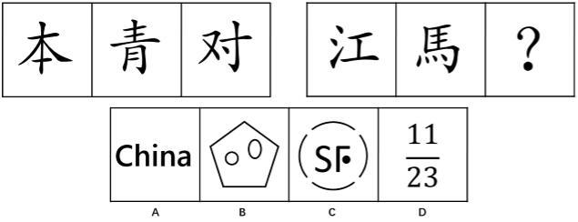
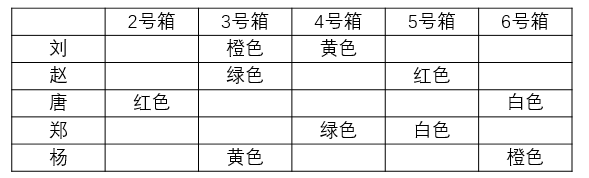
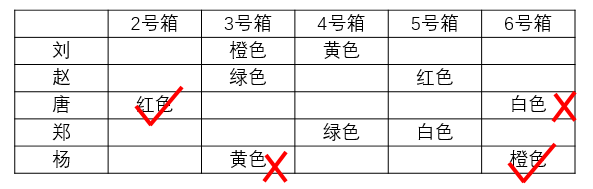
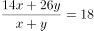
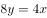

# 2017年深圳市公务员录用考试《行测》题

> 判断推理 · 20 题 · 深圳市考 2017

## 第 1 题　qid 2060626 · 图形推理

从所给四个选项中，选择最合适的一个填入问号处，使之呈现一定的规律性：

- **A**. A　✅
- **B**. B
- **C**. C
- **D**. D

**答案**：A

**官方解析**

观察题干，发现每个图形都是由若干个小方块组成，优先考虑方块的数量关系。第一组三幅图中方块的数量分别为12、7、14，第二组前两幅图形方块的数量关系为10、9，数量上不具有规律。此时，我们可以通过一种特殊规律来解题，即：考虑每幅图中的小方块是否能一笔连成。题干每幅图中的所有小方块均可以在线条不交叉的情况下，用一笔连成（如下图），而选项中只有A项符合此规律。

故正确答案为A。

注：此规律在广东省考、广州市考以及深圳市考中经常出现，备考这几个省市的考生一定要掌握。

---

## 第 2 题　qid 2060632 · 图形推理

从所给四个选项中，选择最合适的一个填入问号处，使之呈现一定的规律性：

- **A**. A　✅
- **B**. B
- **C**. C
- **D**. D

**答案**：A

**官方解析**

元素组成不同，没有明显的属性规律，考虑数量规律。观察发现，第二组图形和选项中出现了独立存在的多个不同小元素，考虑部分数。第一组图形中部分数为1、2、3，第二组图形中部分数为4、5、？，？处应该填入一个部分数为6的选项。选项中部分数依次为6、3、7、5，只有A选项满足规律。
故正确答案为A。

---

## 第 3 题　qid 2060634 · 图形推理

从所给四个选项中，选择最合适的一个填入问号处，使之呈现一定的规律性：

- **A**. A
- **B**. B　✅
- **C**. C
- **D**. D

**答案**：B

**官方解析**

题干中每幅图形均由2黑块和7白块组成，元素组成相同，考虑位置规律。观察第一组图形，利用临近假设法，第一组图形中第一图中的黑块顺时针移动一个单位得到第二图，第二图中的黑块顺时针移动两个单位得到第三图。

第二组图形中，第一图中的黑块顺时针移动四个单位得到第二图，？处的图形应该是第二图中的黑块顺时针移动五个单位得到第三图，即为B选项。

故正确答案为B。

注意：

①第一组图形中黑块分别移动一个单位和两个单位，第二组图形中黑块可移动四个单位和五个单位，亦可移动四个单位和八个单位，优先考虑等差规律，同时移动八个单位应该与第二组图形相同，而选项中没有该图形，说明上述解析思路与出题人思路不一致。

②第二组图形第一图中的黑块亦可逆时针移动四个单位得到第二图，在做题过程中优先应用与第一组图形相同的移动规律，即顺时针移动，而后再考虑逆时针移动规律。

补充解析：第一组图1和图2进行黑白运算后再顺时针旋转，同理，第二组图形图1和图2进行黑白运算后再顺时针旋转。

---

## 第 4 题　qid 2060640 · 图形推理

从所给四个选项中，选择最合适的一个填入问号处，使之呈现一定的规律性：

- **A**. A
- **B**. B
- **C**. C　✅
- **D**. D

**答案**：C

**官方解析**

元素组成相似，考虑样式规律。第一组图中每幅图形中都含有X和横线（注意e的中间有横线），即第一组图形是X和横线的遍历。将此规律应用到第二组图形中，每幅图形都应该含有X和横线，而选项中只有C中含有X和横线。
故正确答案为C。
另外的解法：第一组图形中空间数为0、0、1，第二组图形中空间数量也应该是0、0、1，且存在封闭空间的字母为半封闭图形，即C选项。

---

## 第 5 题　qid 2060654 · 图形推理

从所给四个选项中，选择最合适的一个填入问号处，使之呈现一定的规律性：

- **A**. A
- **B**. B　✅
- **C**. C
- **D**. D

**答案**：B

**官方解析**

观察题干，每幅图均由数量若干的黑点和箭头组成。首先可观察黑点数目，第一组图中黑点数目依次为5、6、7，第二组图形中黑点数目为4、5、？，？处的图形黑点数目应为6，而四个选项中黑点数目均为6。观察题干中的箭头，第一组图中任意两个箭头所环绕的时针方向均为顺时针，第二组前两图中任意两个箭头所环绕的时针方向也为顺时针，在选项中寻找任意两个箭头环绕的时针方向仅为顺时针方向的图形。
A选项箭头环绕的时针方向为逆时针，B选项箭头环绕的时针方向为顺时针，C选项不存在时针方向，D选项中箭头环绕的时针方向既存在顺时针也存在逆时针。
故正确答案为B。

---

## 第 6 题　qid 2060684 · 类比推理

（1）筹集创业基金
（2）实施公司管理
（3）拟定创业计划
（4）选定创业项目
（5）办理相关手续

- **A**. 4-1-3-2-5
- **B**. 4-1-3-5-2
- **C**. 4-3-1-5-2　✅
- **D**. 5-3-1-2-4

**答案**：C

**官方解析**

第一步：先确定逻辑关系最为明显的事件顺序。
观察题干，五个事件主要围绕“创业”的过程展开。逻辑关系的先后顺序比较明显的是事件（4），“选定创业项目”是创业过程的第一步，故事件（4）为首句，排除D项。
第二步：逐一对照选项并判断正确答案。
根据第一步得到的结果可以判断只有A、B、C三项符合。通过分析事件（1）和事件（3）可知，应该先“拟定创业计划”，然后再“筹集创业基金”，因此事件（3）应该排在事件（1）前面，排除A、B两项。
故正确答案为C。

---

## 第 7 题　qid 2060686 · 类比推理

（1）殷商的甲骨文
（2）春秋战国的木简
（3）钟鼎上的钟鼎文
（4）互联网无纸化办公
（5）东汉蔡伦改进造纸术

- **A**. （1）-（3）-（2）-（5）-（4）　✅
- **B**. （1）-（2）-（3）-（5）-（4）
- **C**. （1）-（3）-（2）-（4）-（5）
- **D**. （1）-（3）-（5）-（2）-（4）

**答案**：A

**官方解析**

第一步：先确定逻辑关系最为明显的事件顺序。
观察题干，五个事件主要围绕“文字书写进化”的过程。甲骨文是最古老的文字。最早的甲骨文随着殷亡而消逝，然后是钟鼎文（金文）起而代之。然后到了春秋时期出现了木简，接下来是东汉时期出现了造纸术，最后是现代的互联网无纸化办公。根据每个事件的历史年代，排序为：（1）-（3）-（2）-（5）-（4）。
第二步：逐一对照选项并判断正确答案。
根据上述判断，只有A选项符合题意。
故正确答案为A。

---

## 第 8 题　qid 2060690 · 类比推理

（1）狐狸濒临绝种
（2）人类的生活环境更加恶劣
（3）野兔几近灭绝
（4）草场遭到严重破坏
（5）狼的生存受到严峻挑战

- **A**. 4-1-3-2-5
- **B**. 4-1-3-5-2
- **C**. 4-3-1-5-2　✅
- **D**. 4-3-1-2-5

**答案**：C

**官方解析**

第一步：先确定逻辑关系最为明显的事件顺序。
观察题干，五个事件主要围绕“草场遭到严重破坏”后沿生物链产生的一系列后果展开。选项中事件④为首句，逻辑关系的先后顺序比较明显的是事件③和事件④，野兔的食物是草，“草场遭到严重破坏”后，首先造成的影响就是“野兔几近灭绝”，因此事件③与事件④相邻，事件③排在事件④后面，排除A、B两项。
第二步：逐一对照选项并判断正确答案。
根据第一步得到的结果可以判断只有C、D两项符合。题干五个事件中，生物构成的生物链为草—野兔—狐狸—狼—人，生物链中最高级的是人，因此事件②应该排在最后，即事件②为尾句，排除D项。
故正确答案为C。

---

## 第 9 题　qid 2060694 · 类比推理

（1）欢迎到会人员
（2）布置会议现场
（3）预定会议场地
（4）制定会议方案
（5）分发会议资料

- **A**. 4-3-2-1-5　✅
- **B**. 4-3-5-1-2
- **C**. 3-2-4-1-5
- **D**. 3-2-4-5-1

**答案**：A

**官方解析**

第一步：先确定逻辑关系最为明显的事件顺序。
观察题干，五个事件主要围绕“开会”的过程展开。选项的首句为事件（3）或事件（4），只有先“制定会议方案”，才会“预定会议场地”，因此事件（4）排在事件（3）之前，排除C、D两项。
第二步：逐一对照选项并判断正确答案。
根据第一步得到的结果可以判断只有A项和B项符合。通过分析事件（1）和事件（2）可知，应该先“布置会议现场”，然后再“欢迎到会人员”，因此事件（2）应该排在事件（1）前面，排除B项。
故正确答案为A。

---

## 第 10 题　qid 2060698 · 类比推理

（1）施肥
（2）收获
（3）保温
（4）松土
（5）播种

- **A**. （5）-（4）-（1）-（2）-（3）
- **B**. （4）-（5）-（3）-（1）-（2）　✅
- **C**. （4）-（3）-（5）-（1）-（2）
- **D**. （5）-（4）-（1）-（3）-（2）

**答案**：B

**官方解析**

观察题干，五个事件主要围绕“‘种植’的过程”。逻辑关系的先后顺序比较明显的是事件（4）和事件（5），只有先“松土”，才能“播种”，因此事件（4）排在事件（5）前面，排除A、D项，同时容易判断事件（2）“收获”应该排在最后。通过分析事件（3）和事件（5），“播种”在“保温”之前，所以事件（5）在事件（3）之前，排除C项。
故正确答案为B。

---

## 第 11 题　qid 2060674 · 类比推理

某公司新员工培训结束后，三个培训主管在讨论有多少学员不能通过培训考核，对话如下：
甲：有的学员是能通过考核的。
乙：有的学员是不能通过考核的。
丙：有一个学员不能通过考核。
如果他们三人中只有一个人说的话是真的，则：

- **A**. 所有的学员都没有通过考核
- **B**. 有一个学员没有通过考核
- **C**. 所有的学员都通过了考核　✅
- **D**. 只有一部分学员通过了考核

**答案**：C

**官方解析**

本题为真假推理题。

第一步：分析题干。
甲：“有的学员能通过考核。”
乙：“有的学员不能通过考核。”
丙：“有个学员不能通过考核。”
甲、乙二人的话构成反对关系，“有的能”和“有的不能”至少有一真，而三人中只有一人说了真话，所以剩下的丙的话一定为假，即有个学员通过了考核。所以甲的话是真的，乙的话是假的。根据乙的话“有的学员不能通过考核”这句话是假的，可以推出，所有学员都通过了考核。
第二步：分析选项。
只有C选项符合上述结论。
故正确答案为C。

---

## 第 12 题　qid 2060692 · 逻辑判断

红叶市消防大队向市公安局申请购置一辆新的消防车，以进一步增强消防大队的火灾出警及处置能力。市公安局经研究，未通过这项申请，否决理由是：消防大队所配置消防车的数量，必须和该消防大队的规模和综合能力相配套，根据该消防大队现有的消防员、其他救火设施设备的规模和综合能力，现有的消防车已能够满足使用。
（  ）是红叶市公安局关于此项决定的论证所必须假设的。

- **A**. 红叶市的火灾发生不会有较大增长
- **B**. 红叶市政府财政面临困难无力购置新的消防车
- **C**. 消防大队现有的消防车中，至少有一辆近期内不会报废　✅
- **D**. 市公安局至少在五年内不会改变编制以扩大消防大队的规模和综合能力

**答案**：C

**官方解析**

第一步：找出论点和论据。
论点：不通过红叶市消防大队购置一辆新的消防车的申请。
论据：消防大队所配置消防车的数量，必须和该消防大队的规模和综合能力相配套。根据现有的消防员和设备的规模和综合能力，现有的消防车已能够满足使用。
第二步：逐一分析选项。
A项：红叶市公安局论证的依据是现有消防员、消防设备规模是否和消防车数量是否匹配，与火灾发生情况无关，无关选项，排除；
B项：是否有资金购买，和论点是否应该通过购置新的消防车的申请没有直接关系，无关选项，排除；
C项：近期至少有一辆消防车不会报废，是目前消防车满足使用的必要条件，可以按照否定代入的方法判别（如果否定C项的说法，即所有消防车近期内都会报废，那么消防车数量和消防大队规模一定不匹配，此时论点不成立），因此该项属于必要条件，支持了论点，当选；
D项：未来五年的计划不是当前的情形，与题干所讨论的目前是否需要增加消防车无关，无关选项，排除。
故正确答案为C。

---

## 第 13 题　qid 2060700 · 类比推理

某种魔方有六面，六面全部复原时的颜色分别为红、蓝、黄、白、绿、橙。在某综艺节目现场，有此种魔方6个，每个只复原了一面，且每个魔方复原面的颜色不同。主持人将此6个魔方放入编号为1～6的6个不透明的箱子中，并打开了1号箱子，里面装的是复原面为蓝色的魔方，随后主持人请刘、赵、唐、郑、杨五位嘉宾猜其他箱子里魔方复原面的颜色。五位嘉宾分别作出了如下猜测：
刘：3号箱子中魔方复原面为橙色，4号箱子中魔方复原面为黄色。
赵：3号箱子中魔方复原面为绿色，5号箱子中魔方复原面为红色。
唐：2号箱子中魔方复原面为红色，6号箱子中魔方复原面为白色。
郑：4号箱子中魔方复原面为绿色，5号箱子中魔方复原面为白色。
杨：3号箱子中魔方复原面为黄色，6号箱子中魔方复原面为橙色。
随后主持人一一打开箱子，发现每位嘉宾都只猜对了一个箱子中魔方复原面的颜色，并且每个箱子都有一位嘉宾猜对。
由此可以推测：

- **A**. 2号箱子中魔方复原面为绿色
- **B**. 4号箱子中魔方复原面不是黄色
- **C**. 5号箱子中魔方复原面为白色　✅
- **D**. 6号箱子中魔方复原面为红色

**答案**：C

**官方解析**

第一步：分析题干信息。

为方便分析，将题干五位嘉宾的猜测整理成如下表格：

“每位嘉宾都只猜对了一个箱子中魔方复原面的颜色，并且每个箱子都有一位嘉宾猜对”由此可知：上表中每一行有一个颜色是对的、有一个颜色是错的，每一列中有一个颜色是对的，其他颜色是错的。2号箱这一列只有红色，因此这个红色就是对的，如下图：

因此6号箱这一列橙色就是对的，如下图：

因此刘所在一行中，橙色是错的，黄色是对的，如下图：

进而可以推知赵的猜测和郑的猜测，由于2号箱红色是对的，所以5号箱红色是错的，故赵所在一行绿色是对的，郑所在一行绿色是错的，白色是对的，如下图：

第二步：逐一分析选项

A项：2号箱子中魔方复原面为红色，该项错误，排除；

B项：4号箱子中魔方复原面为黄色，该项错误，排除；

C项：5号箱子中魔方复原面为白色，该项正确，当选；

D项：6号箱子中魔方复原面为橙色，该项错误，排除。

故正确答案为C。

---

## 第 14 题　qid 2060702 · 逻辑判断

某饰品店只有从厂家低于正常价格进货，才能以低于市场的价格销售饰品而获利；除非该饰品店的销售量很大，否则，其不能从厂家低于正常价格进货；要想有大的销售量，该饰品店就要满足消费者个人兴趣或者拥有特定款式的独家销售权。
如果上述断定为真，并且事实上该饰品店没有满足消费者的个人兴趣，则以下不可能为真的是：

- **A**. 如果该饰品店不拥有特定款式独家销售权，就不能从厂家购得低于正常价格的饰品
- **B**. 该饰品店通过满百包邮促销的方法获利
- **C**. 该饰品店虽然没有拥有特定款式独家销售权，但仍以低于市场的价格销售饰品而获利　✅
- **D**. 即使该饰品店拥有特定款式独家销售权，也不能从厂家购得低于正常价格的饰品

**答案**：C

**官方解析**

第一步：翻译题干。
① 以低于市场的价格销售饰品而获利→从厂家低于正常价格进货
② 从厂家低于正常价格进货→该饰品店的销售量很大
③ 销售量很大→满足消费者个人兴趣 或 拥有特定款式的独家销售权
将三个条件串连可知：
④ 以低于市场的价格销售饰品而获利→从厂家低于正常价格进货→该饰品店的销售量很大→满足消费者个人兴趣 或 拥有特定款式的独家销售权
已知：饰品店没有满足消费者的个人兴趣
第二步：逐一分析选项。
A项：不拥有特定款式独家销售权→不能从厂家购得低于正常价格的饰品，结合已知条件，是对条件④的逆否等价推理，可以推出，排除；
B项：通过满百包邮费促销的方式获利这一结论根据已知条件无法推知，可能为真也可能为假，不符合一定为假的要求，排除；
C项：没有拥有特定款式独家销售权且以低于市场的价格销售饰品而获利，已知信息为饰品店没有满足消费者的个人兴趣，结合该项“没有拥有特定款式独家销售权”是对条件④的否后，一定推出否前，即一定能推出“不能以低于市场的价格销售饰品而获利”，所以“没有拥有特定款式独家销售权”和“以低于市场的价格销售饰品而获利”不能同时成立，故该项一定推不出，一定为假，当选；
D项：拥有特定款式独家销售权是对条件④的肯后，只能推出可能性的结论，该项可能为真，也可能为假，不符合一定为假，排除。
故正确答案为C。

---

## 第 15 题　qid 2060704 · 逻辑判断

去年以来，互联网共享单车蓬勃发展，共享单车因其经济便宜、无桩停放、随骑随停、方便快捷深受市民的喜爱。但共享单车在发展过程中，也逐渐显露出各种问题，其中乱停放现象尤为突出，单车乱停放影响市容市貌，甚至有些单车被丢弃停放在机动车道上，严重影响了市民的出行安全，长此以往，势必会影响共享单车业态发展。对此，有人建议，应当设立共享单车专门停车点，并规范管理，要求按点取车停车，大力整治单车乱停放问题，即可促进共享单车业态发展。
如果以下选项为真，最能削弱上述建议的推理的是：

- **A**. 共享单车之所以广受欢迎，最基本的原因在于随停随骑　✅
- **B**. 即便设立专门停车点，仍会有一部分人乱停放
- **C**. 整治单车乱停放最有效的措施是有关部门加强监管和处罚
- **D**. 设立专门停车点需要一定的成本，可能会提高共享单车的使用价格

**答案**：A

**官方解析**

第一步：找出论点和论据。
论点：应当设立共享单车专门停车点，并规范管理，要求按点取车停车，大力整治单车乱停放问题，可以促进共享单车业态发展。
论据：无。
本题只有论点，没有论据，削弱优先考虑削弱论点，即证明“设立共享单车专门停车点，并规范管理，要求按点取车停车，大力整治单车乱停放问题”不能促进共享单车业态发展。
第二步：逐一分析选项。
A项：共享单车之所以广受欢迎，最基本的原因在于随停随骑，说明如果不能随停随骑，共享单车就无法广受欢迎，说明按点取车停车，整治了单车乱停放问题，并不能促进共享单车业态发展，直接削弱论点，当选；
B项：该项是在论述采取了建议的措施后可能的负面情况，即一部分会乱停放，但实际上乱停放的部分人有多少无法确定，属于不明确选项，无法削弱，排除；
C项：指出整治单车乱停放最有效的措施是监管和处罚，但不代表“设立共享单车专门停车点”不能整治单车乱停放问题，也无法证明整治了单车乱停放问题，不能促进共享单车业态发展，无法削弱，排除；
D项：设立专门停车点的成本问题和这项措施本身的作用无关，无关选项，排除。
故正确答案为A。

---

## 第 16 题　qid 2060706 · 类比推理

机会成本是指做出一个选择而放弃的其他选择的最大收益。假设：你贏得2张只能选择其中之一的旅游优惠券，其中一张优惠券是海南7日游的免费券（原价10000元，旅游期间不会产生其他费用），另一张是马尔代夫旅游的半价券（原价20000元，旅游期间不会产生其他费用）。
根据以上叙述，则选择去海南旅游的机会成本是：

- **A**. 0元
- **B**. 10000元　✅
- **C**. 20000元
- **D**. 30000元

**答案**：B

**官方解析**

机会成本关键词为“做出一个选择而放弃的其他选择的最大收益”。
选择去海南旅游即放弃了马尔代夫的旅游的最大收益，即马尔代夫旅游的半价券，原价为20000元，则半价为10000元。
故正确答案为B。

---

## 第 17 题　qid 2060708 · 类比推理

考勤主管：“你为什么迟到，不知道上班有时间规定吗？”
工作人员：“我这是第一次迟到，我以前从来没有迟到过。”
下列（  ）出现的逻辑错误与题干最为类似。

- **A**. 
甲：“今天天气真好，可以一起去游玩吗？”

乙：“今天的天气这么好，不适合游玩。”

- **B**. 
警官：“这个东西是你偷的吧？”

嫌疑人：“我发誓我没有偷过任何东西。”

- **C**. 
妈妈：“你不是喜欢吃鱼吗？为什么不多吃点？”

孩子：“我今天心情特别好，从来没有这么好过。”
　✅
- **D**. 
丙：“昨天那个人讲得太好了，不是吗？”

丁：“是的，而且那个人还很友好。”

**答案**：C

**官方解析**

第一步，分析题干逻辑错误。
考勤主管问的是为什么迟到，工作人员回答的是第几次迟到，是答非所问。
第二步，逐一分析选项。
A项：不适合游玩是对“可以一起去游玩吗”的回答，并非答非所问，与题干逻辑关系不一致，排除；
B项：没有偷过任何东西是对“这东西是你偷的吧”的回答，并非答非所问，与题干逻辑关系不一致，排除；
C项：心情好并没有回答“为什么不多吃点鱼”，是答非所问，与题干逻辑关系一致，当选；
D项：“是的”是对“那个人讲的太好了”的回答，并非答非所问，与题干逻辑关系不一致，排除。
故正确答案为C。

---

## 第 18 题　qid 2060710 · 逻辑判断

某公司近两年的业绩均呈下滑趋势。该公司拟采取裁员政策，以淘汰不合格的员工。不合格的员工一定是存在的，但是如何确定哪一位员工是不合格的却是一个需要深入思考的问题。比如，一个在同一岗位上工作超过5年的员工可能比一个刚刚转岗进入新岗位的员工的工作效率高。但是一直在原岗位工作的员工可能不如转岗后依然可以完成岗位工作的员工的综合素质强。
由此可以推出：

- **A**. 该公司为扭转业绩而实行裁员政策是不可取的
- **B**. 该公司应通过调动员工岗位来扭转业绩
- **C**. 该公司应通过员工的在岗时间来评定该员工的工作能力
- **D**. 该公司还没有找到扭转公司业绩的有效措施　✅

**答案**：D

**官方解析**

逐一分析选项。
A项：题干中只是强调如何确定哪一位员工是不合格需要深入思考，并没有否定裁员政策，排除；
B项：题干中是说拟采取裁员政策扭转业绩，没有谈及应调动员工岗位扭转业绩，无中生有，排除；
C项：题干中在岗时间长是可能比在岗时间短的工作效率高，并不一定工作能力就强，排除；
D项：公司是拟采取裁员政策来扭转公司业绩，说明还没找到扭转公司业绩的有效措施，可以推出，当选。
故正确答案为D。

---

## 第 19 题　qid 2060712 · 逻辑判断

两个小组参加汽车零部件拆装速度测试比赛。所有参赛者平均每人每天8小时可以拆装18组零部件。其中，第一小组的平均速度是每人每天8小时拆装26组零部件；第二小组的平均速度是每人每天8小时拆装14组零部件。通过测试赛，该汽车零部件的制造商认为该零部件的设计需要进一步简化。由此可见：

- **A**. 第一小组的参赛者动手能力均优于第二小组
- **B**. 第二小组的参赛人员比第一小组的参赛人员多　✅
- **C**. 所有参赛者的零部件拆装速度均不达标
- **D**. 所有参赛者的动手能力在比赛结束后都得到加强

**答案**：B

**官方解析**

逐一分析选项。

A项：题干中只是提供了两组参赛者的平均速度，并不能推出第一组的动手能力均优于第二小组，排除；

B项：通过第一组与第二组的平均速度可知，设第二组的参赛人数为x，第一组的参赛人数为y，根据题干可以列出式子，得到，人数比为，第二组人数多于第一组，可以推出，当选；

C项：题干中并没有涉及参赛者的零部件拆装速度是否达标的问题，无中生有，排除；

D项：题干中没有涉及比赛结束后的情况，无中生有，排除。

故正确答案为B。

---

## 第 20 题　qid 2060714 · 类比推理

在一场“请问谁在说谎”的游戏中，四位游戏参与者每人从一副没有大小王的扑克牌中抽取一张。
甲说：“我抽中的牌是黑桃。”
乙说：“我抽中的牌是红桃。”
丙说：“我抽中的牌不是红桃。”
丁说：“我抽中的牌是梅花。”
已知4人抽取的扑克牌花色各不相同，且只有一人说谎。
根据上述条件，下列说法正确的是：

- **A**. 甲、乙、丙、丁四人均有可能说谎
- **B**. 可以推知每个人抽取的扑克牌花色
- **C**. 丙有可能抽中方块
- **D**. 乙抽中的牌一定是红桃　✅

**答案**：D

**官方解析**

第一步：分析题干。
四人中只有一人说谎，即一人为假，且四人表述没有明显的矛盾。
第二步：逐一分析选项。
乙与丙均提到了红桃，从最大信息入手，假设乙说的话为假，那么乙抽中的不是红桃，其余三句均为真话，可知丙抽中的不是红桃，甲抽中黑桃，丁抽中梅花，那么红桃没有被抽中，与4人抽取的扑克牌花色各不相同矛盾，因此假设不成立，乙说的话一定是真话，那么乙抽中的一定是红桃。
故正确答案为D。

---
