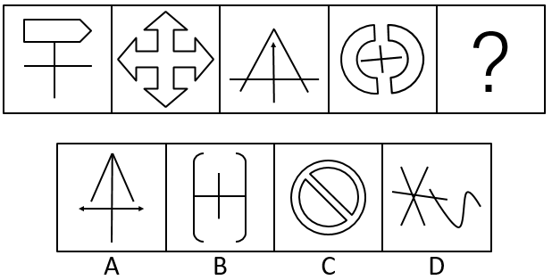
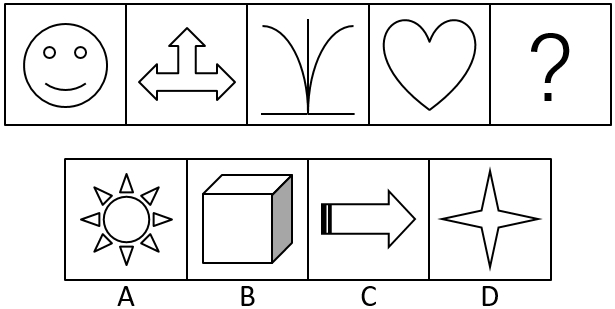
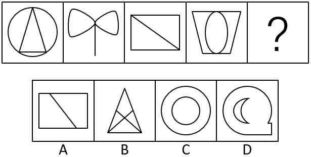

# 2017年湖北省选调生行测题（精选）

> 判断推理 · 19 题 · 湖北 2017

## 第 1 题　qid 2261865 · 图形推理

从所给四个选项中，选择最合适的一个填入问号处，使之呈现一定的规律性：

- **A**. A
- **B**. B
- **C**. C　✅
- **D**. D

**答案**：C

**官方解析**

图形元素组成不相同，优先考虑属性规律。进一步观察图形共同特征可知，题干每幅图均有封闭区间，而选项中只有C项有封闭区间。
故正确答案为C。

---

## 第 2 题　qid 2261866 · 图形推理

从所给四个选项中，选择最合适的一个填入问号处，使之呈现一定的规律性：

- **A**. A
- **B**. B
- **C**. C　✅
- **D**. D

**答案**：C

**官方解析**

图形元素组成不相同，优先考虑属性规律。题干每幅图都是轴对称图形，排除B项；继续观察，题干每幅图都是竖轴对称，但A、D两项都有多个轴对称，没有唯一竖对称轴；题干每幅图都只有一条对称轴，只有C项有一条对称轴。
故正确答案为C。

---

## 第 3 题　qid 2261867 · 图形推理

从所给四个选项中，选择最合适的一个填入问号处，使之呈现一定的规律性：

- **A**. A　✅
- **B**. B
- **C**. C
- **D**. D

**答案**：A

**官方解析**

图形元素组成不相同，且无明显属性规律，考虑数量规律。题干图3和A项是典型的“日”字变形，且选项B是“田”字变形，考虑笔画数。题干每幅图均是一笔画图形，A项是一笔画，B项是两笔画，C项是两笔画，D项是两笔画。
故正确答案为A。

---

## 第 4 题　qid 2261868 · 定义判断

团体迷思，指团体在决策过程中，由于成员倾向让自己的观点与团体一致，因而令整个团体缺乏不同的思考角度，不能进行客观分析。一些值得争议的观点、有创意的想法或客观的意见不会有人提出、或者是遭到忽视及隔离。
根据上述定义，下列属于团体迷思的是（  ）。

- **A**. 小赵提的一个建议遭到了领导否决，他以后再也不提意见了
- **B**. 在会议上大家都不发表意见，可一走出会议室就议论纷纷　✅
- **C**. 老王性格内向，不习惯在单位大会上发表个人见解
- **D**. 公司管理很混乱，看不到希望，大家都懒得提意见

**答案**：B

**官方解析**

第一步：找出定义关键词。
“团体在决策过程中，由于成员倾向让自己的观点与团体一致，因而令整个团体缺乏不同的思考角度，不能进行客观分析”。
第二步：逐一分析选项。
A项：小赵是因建议遭到领导否决而不提意见，不是为了让自己的观点与团体一致，不符合定义，排除；
B项：在会议上大家都不发表意见，走出会议室就议论纷纷，说明大多数人是有意见的，都是看到别人不发表意见自己也就不发表意见，符合倾向让自己的观点与团体一致，符合题干定义，当选；
C项：老王是因为性格内向而不发表见解，不是为了让自己的观点与团体一致，不符合定义，排除；
D项：大家懒得提意见是因为公司管理乱，没希望，不是因为倾向于让自己的观点与团体一致，不符合定义，排除。
故正确答案为B。

---

## 第 5 题　qid 2261869 · 定义判断

揭短营销是一种通过暴露自己的短处或是不足来进行营销的手段。揭短营销表面上揭露了企业的短处，实际上是对商品的客观评价。
根据上述定义，下列情形属于揭短营销的是：

- **A**. 卖苹果的摊主故意说自己的苹果酸，引得路人买他的苹果
- **B**. 某公司宣扬产品优点的同时，也告知顾客产品的不足之处　✅
- **C**. 某商家在宣传自己的产品时，揭露同行的产品存在的弱点
- **D**. 酒厂故意在商店打碎一瓶酒，以此吸引顾客的注意

**答案**：B

**官方解析**

第一步：找出定义关键词。
“通过暴露自己的短处或是不足来进行营销”“表面上揭露了企业的短处，实际上是对商品的客观评价”。
第二步：逐一分析选项。
A项：摊主不是“企业”，不符合定义，排除；
B项：某公司宣扬产品优点同时告知不足之处，是暴露自己的不足，也是客观的评价，符合题干定义，当选；
C项：商家揭露的是同行的弱点，不是自己的不足之处，不符合定义，排除；
D项：该酒厂并未揭露自己的短处或不足，不符合定义，排除。
故正确答案为B。

---

## 第 6 题　qid 2261870 · 定义判断

社会公共消费，是指以社会和集体作为消费单位，在社会或集体范围内为满足其成员的共同需要而消费各种消费资料和劳务的一种消费需求，是在社会或集体范围内共同进行的消费。
根据上述定义，下列情形不属于社会公共消费的是：

- **A**. 中小学生的义务教育消费
- **B**. 单位为员工提供体育健身设施
- **C**. 单位为优秀工作者发放奖金　✅
- **D**. 某市为60岁以上老人发放福利金

**答案**：C

**官方解析**

第一步：找出定义关键词。
“以社会和集体作为消费单位，在社会或集体范围内为满足其成员的共同需要而消费各种消费资料和劳务的一种消费需求，是在社会或集体范围内共同进行的消费”。
第二步：逐一分析选项。
A项：中小学生的义务教育消费，是以社会和集体作为消费单位，是在社会范围内为满足成员（中小学生）的共同需要进行的消费，符合题干定义，排除；
B项：单位为员工提供体育健身设施，是以集体作为消费单位，是在集体范围内为满足成员（单位员工）的共同需要进行的消费，符合题干定义，排除；
C项：单位给优秀工作者发放奖金，是以个人作为消费单位，不是为满足集体成员（单位员工）进行的消费行为，不是集体范围内共同进行的消费，不符合定义，当选；
D项：某市为60岁以上老人发放福利金，是以社会和集体作为消费单位，是在社会范围内为满足成员（60岁以上老人）的共同需要进行的消费，符合定义，排除。
本题为选非题，故正确答案为C。

---

## 第 7 题　qid 2261871 · 定义判断

如若对某人提出一个很大而又易被拒绝接受的要求，接着向他提出一个小一点的要求，那么他接受这个小要求的可能性，比直接向他提出这个小要求而被接受的可能性大得多，这种现象被称为门面效应。
根据上述定义，下列情形符合门面效应的是：

- **A**. 商业谈判时，公司先提出一个较高的报价，后面不得已下调
- **B**. 和他人初步认识时不提过分要求，等到关系熟了后再提要求
- **C**. 小王想请两天假，他故意向领导说请5天，领导说最多3天　✅
- **D**. 买菜时，老梁跟摊贩讨价还价，以双方都能接受的价格成交

**答案**：C

**官方解析**

第一步：找出定义关键词。
“提出一个很大而又易被拒绝接受的要求，接着提出一个小一点的要求”、“接受这个小要求的可能性，比直接向他提出这个小要求而被接受的可能性大得多”。
第二步：逐一分析选项。
A项：商业谈判时先提出较高的报价，后面“不得已”下调，说明下调后的价格不是公司原本希望的要求，不符合定义，排除；
B项：初步认识时不提过分要求，关系熟了再提要求，不是接连提出要求，不符合定义，排除；
C项：小王故意请5天假，是比2天更大一点的要求，领导给了3天假，比他本来希望请的2天假更多，符合定义，当选；
D项：两个人讨价还价，不是向某人先提出一个大要求，再提出小要求，且最后双方都能接受的价格不一定是双方本来期待的价格，不符合定义，排除。
故正确答案为C。

---

## 第 8 题　qid 2261872 · 定义判断

史华兹论断认为，所有的坏事情，只有在我们认为它是不好的情况下，才会真正成为不幸事件。面对挫败，是自暴自弃，让它成为不可逆转的事实，还是让它变成促使重新奋发的动力，取决人们的主观努力。能从坏中看好，积极对待，反而会有个好结果。
根据上述定义，下列情形不符合史华兹论断的是：

- **A**. 大成眼睛失明，但他学习盲人按摩，成为职业技能大赛冠军
- **B**. 公司重奖对其服务投诉的消费者，获得了社会的普遍赞赏
- **C**. 出了生产事故后，车间进行整改，成为企业安全生产标兵
- **D**. 某企业出了质量丑闻后，积极自责自纠，最终却仍然倒闭　✅

**答案**：D

**官方解析**

第一步：找出定义关键词。
“坏事情”、“能从坏中看好，积极对待，反而会有个好结果”。
第二步：逐一分析选项。
A项：大成眼睛失明是“坏事情”，但他学习盲人按摩，成为职业技能大赛冠军，证明他能从坏中看好，积极对待，反而有个好结果，符合定义，排除； 
B项：投诉是“坏事情”，但公司重奖对其投诉的消费者，获得了社会的普遍赞赏，即消费者的认可，证明该公司能积极看待，反而有个好结果，符合定义，排除；
C项：生产事故是“坏事情”，车间进行整改，成为安全生产标兵，证明该车间从坏中看好，积极对待，反而有个好结果，符合定义，排除；
D项：质量丑闻是“坏事情”，积极自责自纠，但最终却仍然倒闭，证明虽然积极对待，但最后没有得到好结果，不符合定义，当选。
本题为选非题，故正确答案为D。

---

## 第 9 题　qid 2261873 · 类比推理

生产全球化：贸易全球化：经济全球化

- **A**. 亚太经合组织：20国集团：世贸组织
- **B**. 劳动力竞争：资金竞争：市场竞争　✅
- **C**. 资本国际化：金融自由化：投资便利化
- **D**. 边际成本：边际效应：消费剩余

**答案**：B

**官方解析**

第一步：判断题干词语间逻辑关系。
经济全球化是指贸易、投资、金融、生产等活动的全球化，因此生产全球化和贸易全球化均为经济全球化的一种表现形式，且二者是并列关系。
第二步：判断选项词语间逻辑关系。
A项：亚太经合组织、20国集团、世贸组织分别是不同的国际组织，三者是并列关系，与题干逻辑关系不一致，排除；
B项：劳动力竞争和资金竞争均为市场竞争的一种表现形式，且二者是并列关系，与题干逻辑关系一致，当选；
C项：资本国际化，金融自由化、投资便利化均为促进贸易发展的方向，三者是并列关系，与题干逻辑关系不一致，排除；
D项：边际成本、边际效应、消费剩余均为经济学名词，三者是并列关系，与题干逻辑关系不一致，排除。
故正确答案为B。

---

## 第 10 题　qid 2261874 · 类比推理

春季：观花

- **A**. 春暖：花开
- **B**. 夏日：流火
- **C**. 秋天：采摘　✅
- **D**. 冬季：结冰

**答案**：C

**官方解析**

第一步：判断题干词语间逻辑关系。
春季适宜观花，观花是人的行为，二者是季节与行为之间的对应关系。
第二步：判断选项词语间逻辑关系。
A项：春暖导致花开，二者为因果对应关系，与题干逻辑关系不一致，排除；
B项：七月流火指天气逐渐凉爽起来，七月指夏历七月，而非“夏日”，与题干逻辑关系不一致，排除；
C项：秋天适宜采摘，采摘是人的行为，二者是季节与行为之间的对应关系，与题干逻辑关系一致，当选；
D项：冬季容易结冰，但结冰不是人的一种行为，与题干逻辑关系不一致，排除。
故正确答案为C。

---

## 第 11 题　qid 2261875 · 类比推理

雾霾：治污

- **A**. 人生：婚姻
- **B**. 渍水：排涝　✅
- **C**. 虫灾：减产
- **D**. 资本：管理

**答案**：B

**官方解析**

第一步：判断题干词语间逻辑关系。
雾霾是“污”的一种，治污需要治理雾霾，且治污后雾霾减少。
第二步：判断选项词语间逻辑关系。
A项：人生可能有婚姻，可能没有婚姻，与题干逻辑关系不一致，排除；
B项：渍水是“涝”的一种，排涝需要排放渍水，且排涝后渍水减少，与题干逻辑关系一致，当选；
C项：虫灾会导致减产，二者是因果对应关系，与题干逻辑关系不一致，排除；
D项：管理资本，而且为动宾搭配，且管理后资本不一定会减少，与题干逻辑关系不一致，排除。
故正确答案为B。

---

## 第 12 题　qid 2261876 · 类比推理

电商：微商

- **A**. 电脑：手机
- **B**. 大数据：云计算
- **C**. 自媒体：微信　✅
- **D**. 微博：短信

**答案**：C

**官方解析**

第一步：判断题干词语间逻辑关系。
微商是电商的一种，二者为种属关系。
第二步：判断选项词语间逻辑关系。
A项：电脑和手机都是电子产品，二者为并列关系，与题干逻辑关系不一致，排除；
B项：大数据和云计算都是计算机技术，二者为并列关系，与题干逻辑关系不一致，排除；
C项：微信是一种自媒体，二者为种属关系，与题干逻辑关系一致，当选；
D项：微博和短信都有沟通交流的功能，二者为并列关系，与题干逻辑关系不一致，排除。
故正确答案为C。

---

## 第 13 题　qid 2261877 · 类比推理

扶贫：济困

- **A**. 励精：图治
- **B**. 克难：攻坚　✅
- **C**. 狼吞：虎咽
- **D**. 星罗：棋布

**答案**：B

**官方解析**

第一步：判断题干词语间逻辑关系。
扶贫指扶持贫穷的人，济困指接济困难的人，二者为近义关系。
第二步：判断选项词语间逻辑关系。
A项：励精指振奋精神，图治指治理国家，不是近义关系，与题干逻辑关系不一致，排除；
B项：克难指克服困难，攻坚指攻破坚壁，二者为近义关系，保留；
C项：狼吞和虎咽是近义关系，均可形容吃东西又猛又急，二者为近义关系，保留；
D项：星罗指星星罗列，棋布指棋子分布，均可形容数量繁多，二者为近义关系，保留。
二级辨析：看构词结构。题干扶贫和济困均为谓宾结构。
B项：克难和攻坚是谓宾结构，与题干逻辑关系一致，当选；
C项：狼吞和虎咽是主谓结构，与题干逻辑关系不一致，排除；
D项：星罗和棋布是主谓结构，与题干逻辑关系不一致，排除。
故正确答案为B。

---

## 第 14 题　qid 2261878 · 类比推理

（    ） 对于 手机 相当于 （    ） 对于 空调

- **A**. 网聊；烘干
- **B**. 短信；冷冻
- **C**. 通话；抽湿　✅
- **D**. 通讯；调强

**答案**：C

**官方解析**

逐一代入选项。
A项：手机有网聊功能，而空调的功能不是烘干，前后逻辑关系不一致，排除；
B项：手机有短信功能，空调可以制冷，而非冷冻，用于冷冻的应为冰箱，前后逻辑关系不一致，排除；
C项：手机有通话功能，空调有抽湿功能，前后逻辑关系一致，当选；
D项：手机有通讯功能，空调没有调强功能，前后逻辑关系不一致，排除。
故正确答案为C。

---

## 第 15 题　qid 2261879 · 逻辑判断

南方某镇不仅向全镇低收入家庭送书赠报，还规定全镇居民和有一年以上居住证的新居民，每年可凭购书发票到镇里报销200元。舆论分析说，政府的做法，有利于培养老百姓读书看报习惯，形成全社会学习风气。
以下哪项最能支持舆论分析？

- **A**. 读书看报不仅是人的行为方式或文化习惯，也是一种消费行为，完全可以用经济手段加以刺激引导
- **B**. 人们越来越多的意识到，知识创造财富
- **C**. 政府有补贴，可以促使穷人和富人都去购书订报　✅
- **D**. 如果文化补贴时间足够长，将来政府停发补贴，或将补贴发往其他方面，人们仍会读书看报

**答案**：C

**官方解析**

第一步：找出论点和论据。
论点：政府的做法（向全镇低收入家庭送书赠报，规定全镇居民和有一年以上居住证的新居民每年可凭购书发票到镇里报销200元）有利于培养老百姓读书看报习惯，形成全社会学习风气。
论据：无。
第二步：逐一分析选项。
A项：读书可以用经济手段加以刺激引导，与是否会形成全社会学习风气无关，不能支持，排除；
B项：人们意识到知识创造财富，不代表人们会读书看报以及形成全社会学习风气，无关项，不能支持，排除；
C项：政府补贴可以促使穷人和富人都去购书订报，可以形成全社会学习风气，可以支持，当选；
D项：如果补贴时间够长是一种未来假设，但题干没有提及补贴时间是否足够长，无关项，不能支持，排除。
故正确答案为C。

---

## 第 16 题　qid 2261880 · 逻辑判断

全球超算TOP500最新榜单中，国产“神威”“太湖之光”二度问鼎。中国更以167台超算超过美国165台，成为入列500强超算最多的国家。而这167台计算机都是近15年内开发，2001年前这一数字还是零。国产超算发展成效如此喜人，可挖原因一是有一支吃苦耐劳、作风过硬、高水平、高素质的科研团队。二是国产化率显著提升。三是突破性创新频频出现。近年我国超算领域确实是国产化率不断提高。
由此，可推出国产超算发展喜人的原因：

- **A**. 是国产化率显著提高
- **B**. 也许不是国产化显著提高　✅
- **C**. 也许是创新成果频频突破
- **D**. 是有一支吃苦耐劳、作风过硬、高水平的、高素质的科研团队

**答案**：B

**官方解析**

日常结论题，根据题干信息逐一分析选项。
A项：国产化率显著提高只是国产超算发展喜人的原因之一，不能推出一定是该原因，不能推出，排除；
B项：也许不是国产化显著提高，题干有三个可挖原因，所以可能不是该原因，可以推出，当选；
C项：也许创新成果频频突破，强调创新成果不断有突破，题干是突破性创新频频出现，强调数量多，偷换概念，不能推出，排除；
D项：有一支吃苦耐劳、作风过硬、高水平、高素质的科研团队只是原因之一，不能推出一定是该原因，不能推出，排除。
故正确答案为B。

---

## 第 17 题　qid 2261881 · 逻辑判断

“城归”，有学者解释为，从农村出去打工、经商的农民，或从农村走出的读书人、退役士兵等，经过多年在城市打拼，累积了经验，获得技术和资金。如今又重回乡村生产生活。据国务院公布的数据，目前“城归”已超过450万人。在新农村建设中，需要大量人才和资金支持，而“城归”群体的迅速壮大是提供人才和资金的必要条件。
据此可以推出：

- **A**. 如果没有“城归”群体的发展壮大，那么就不能实现新农村建设目标　✅
- **B**. 只要有人才和资金支持，就能实现新农村建设目标
- **C**. 一旦有人才就会有资金
- **D**. 倘若有资金支持，就能实现新农村建设目标

**答案**：A

**官方解析**

第一步：翻译题干。

①新农村建设人才和资金；

②人才和资金“城归”群体壮大；

将①和②串联得出：③新农村建设人才和资金“城归”群体壮大。

第二步：逐一分析选项。

A项：翻译为“城归”群体壮大新农村建设，是对③的否后推否前，可以推出，当选；

B项：翻译为人才和资金新农村建设，是对①的肯后，肯后无必然结论，无法推出，排除；

C项：翻译为人才资金，题干未提及人才和资金之间的关系，无关项，无法推出，排除；

D项：翻译为资金新农村建设，新农村建设不仅需要资金还需要人才，无法推出，排除。

故正确答案为A。

---

## 第 18 题　qid 2261882 · 逻辑判断

人们常说，治污要治本，治本先清源。加强环境保护，遏制环境污染，如果只注意治理已经出现的污染，不从源头上抓起，往往是按下葫芦浮起瓢，陷入防不胜防的恶性循环，不能根治污染。
据此可推出：

- **A**. 国际社会普遍认为，解决环境问题的治本之策是从源头上减少污染物排放
- **B**. 如果要根治污染，必须从源头上减少污染物排放　✅
- **C**. 只要从源头抓起，就能根治污染
- **D**. 从源头上防治污染，必须加快调整经济结构，推动产业优化升级

**答案**：B

**官方解析**

第一步：翻译题干。

源头抓起根治。

第二步：逐一分析选项。

A项：“国际社会普遍认为”与“人们常说”不符，偷换概念，无法推出，排除；

B项：翻译为根治污染源头减少污染排放，否后推否前，可以推出，当选；

C项：翻译为源头抓起根治污染，否前得不到确定性结论，无法推出，排除；

D项：题干未提及“加快调整经济结构，推动产业优化升级”与源头防止污染之间的关系，无法推出，排除。

故正确答案为B。

---

## 第 19 题　qid 2261883 · 逻辑判断

某大学国家重点实验室自成立以来，实行的弹性考核，只要非科研人员进行3至5年的阶段性工作汇报，对研究人员每年该争取多少科研项目和经费、发表多少科研论文、取得多少次发明专利等，一概不提硬性指标。这一做法尊重科学研究规律，拒绝浮躁功利，呵护科学家的创新原动力，收到了良好的成效。
上述举措依据的前提是：

- **A**. 保证科研人员能坚持开展周期性长、前瞻性强、挑战性高的科研内容　✅
- **B**. 该室近年来产生的重大成果多数都涉及许多学科，考核难度大
- **C**. 只有较长的研究周期，才能保证前瞻性强、挑战性高的科研内容
- **D**. 研究周期长的课题，一旦突破，相关成果就会出现井喷现象

**答案**：A

**官方解析**

第一步：找出论点和论据。
论点：只要非科研人员进行3至5年的阶段性工作汇报，对研究人员每年该争取多少科研项目和经费、发表多少科研论文、取得多少次发明专利等，一概不提硬性指标。
论据：无明显论据。
第二步：逐一分析选项。
A项：考虑否定代入，如果科研人员不坚持开展周期性长、前瞻性强、挑战性高的科研内容，该举措难以考核科研人员，是论点成立的必要条件，可以加强，当选；
B项：涉及许多学科，考核难度大不代表不能考核，不能加强，排除；
C项：较长的研究周期才能保证科研内容，不代表不需要硬性考核，不能加强，排除；
D项：成果一旦突破便会出现井喷现象，但也可以在过程中实行硬性考核，不能加强，排除。
故正确答案为A。

---
