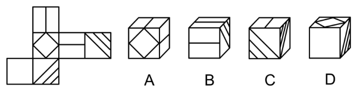
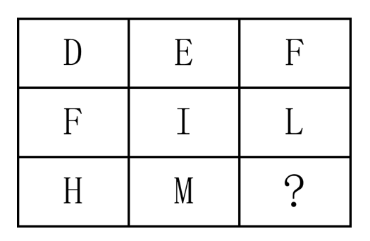
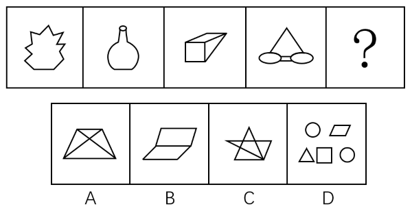

# 2017年福建省选调生考试《行政职业能力测验》

> 判断推理 · 30 题 · 福建 2017

## 第 1 题　qid 4733950 · 图形推理

左边展开平面图折不成右边的哪个立体图形？

- **A**. A
- **B**. B
- **C**. C　✅
- **D**. D

**答案**：C

**官方解析**

将题干展开图标上序号，如下图所示，逐一进行分析。

A项：选项由面a、面b和面c组成，选项与题干展开图一致，排除；

B项：选项必然包含面a和面c，展开图中面a和面f为相对面，相对面不能同时出现，故选项的右侧面应为面d，即选项由面a、面c和面d组成，选项与题干展开图一致，排除；

C项：选项必然包含面d和面f，展开图中面a和面f为相对面，相对面不能同时出现，故选项的顶面应为面c，即选项由面c、面d和面f组成。在选项和展开图中，以三个面的公共点为起点沿面c顺时针画边，展开图中边1与面c上线段平行，而选项中边1与面c上线段垂直，选项与题干展开图不一致，当选；

D项：选项必然包含面b和面e，展开图中面b和面d为相对面，相对面不能同时出现，故选项的右侧面应为面f，即选项由面b、面e和面f组成，选项与题干展开图一致，排除。

本题为选非题，故正确答案为C。

---

## 第 2 题　qid 4733945 · 图形推理

从所给的四个选项中，选择最合适的一个填入问号处，使之呈现一定的规律性：

- **A**. A
- **B**. B
- **C**. C　✅
- **D**. D

**答案**：C

**官方解析**

解法一：元素组成不同，且无明显属性规律，优先考虑数量规律。观察发现题干第一组图的部分数分别为2、4，第二组图的部分数也分别为2、4，故？处图形的部分数应为4，只有C项符合规律。
解法二：题干图形均为汉字，观察发现第一组部首均为“广”，第二组部首均为“阝”，第三组部首应为“口”，排除B项；继续观察发现题干第一组笔画数均为8，第二组笔画数均为7，第三组第一个图的笔画数为7，故？处图形的笔画数应为7，排除A项；比较C、D两项，发现部分数存在区别，题干第一组图的部分数分别为2、4，第二组图的部分数也分别为2、4，故？处图形的部分数应为4，排除D项，只有C项满足所有规律。
故正确答案为C。
注：本题不够严谨，将汉字当成“图形”时，解法一更加严谨，但本题汉字部首相同的特征较为明显，可先根据此考点进行排除，再考虑汉字的笔画以及部分数，因此解法二可能更符合出题人的思路，故写两种解法供大家参考。

---

## 第 3 题　qid 4733938 · 图形推理

从所给的四个选项中，选择最合适的一个填入问号处，使之呈现一定的规律性：

- **A**. O
- **B**. N
- **C**. L
- **D**. R　✅

**答案**：D

**官方解析**

观察发现题干图形均为字母，且在字母表中的顺序存在规律。九宫格题目优先看横行，第一行中相邻字母在字母表中间隔0个字母，第二行中相邻字母在字母表中间隔2个字母，按此规律，第三行中相邻字母在字母表中间隔4个字母，故？处应为R，对应D项。
故正确答案为D。

---

## 第 4 题　qid 2405606 · 图形推理

从所给四个选项中，选择最合适的一个填入问号处，使之呈现一定规律性：

- **A**. A
- **B**. B
- **C**. C　✅
- **D**. D

**答案**：C

**官方解析**

元素组成不同，优先考虑属性规律。题干图形均为对称图形，考虑对称轴的方向和数量。经观察发现，对称轴数量均为一条，方向依次为横向、竖向、横向、竖向、横向、？，因此问号处应选择一个仅有一条竖向对称轴的图形，排除B、D两项。又因题干图形均为直线图形，排除A项，只有C项满足。
故正确答案为C。

---

## 第 5 题　qid 4735151 · 图形推理

从所给的四个选项中，选择最合适的一个填入问号处，使之呈现一定的规律性：

- **A**. A
- **B**. B
- **C**. C　✅
- **D**. D

**答案**：C

**官方解析**

元素组成不同，且无明显属性规律，考虑数量规律。观察题干图形，窟窿比较多，考虑面数量。从图1到图4，面数量分别为1、2、3、4，故？处图形面数量应为5，排除A、B两项。继续观察发现，题干图形都是一部分，排除D项，只有C项符合。
故正确答案为C。

---

## 第 6 题　qid 4733952 · 逻辑判断

“洼地效应”就是利用比较优势，创造理想的经济和社会人文环境，使之对各类生产要素具有更强的吸引力，从而形成独特竞争优势，吸引外来资源向本地区汇聚、流动，弥补本地资源结构上的缺陷，促进本地区经济和社会的快速发展。简单地说，指一个区域与其他区域相比，环境质量更高，对各类生产要素具有更强的吸引力，从而形成独特竞争优势。
根据以上定义，下面属于洼地效应的是:

- **A**. 一些知名跨国公司跑到中国办公司　✅
- **B**. 天津静海地区传销比较多
- **C**. XX省假鞋泛滥
- **D**. 某明星被曝光吸毒，于是微博粉丝纷纷取消关注

**答案**：A

**官方解析**

第一步：找出定义关键词。
“利用比较优势”、“形成独特竞争优势”、“吸引外来资源向本地区汇聚、流动”、“促进本地区经济和社会的快速发展”。
第二步：逐一分析选项。
A项：跨国公司来中国办公司，是中国对外来资源的吸引，符合“吸引外来资源向本地区汇聚、流动”，也可以促进中国的经济发展，符合“促进本地区经济和社会的快速发展”，符合定义，当选；
B项传销、C项假鞋泛滥以及D项明星吸毒均属于违法行为，不符合“形成独特竞争优势”，也不符合“促进本地区经济和社会的快速发展”，不符合定义，排除。
故正确答案为A。

---

## 第 7 题　qid 4733956 · 逻辑判断

近因效应是指当人们识记一系列事物时对末尾部分项目的记忆效果优于中间部分项目的现象。这种现象是由于近因效应的作用。前后信息间隔时间越长，近因效应越明显。
根据以上定义，下面属于近因效应的是：

- **A**. “压轴戏”是舞台演出安排在最后的最精彩的节目，整个舞台的演出都会因这最后一刻的精彩而变得辉煌起来，能给人留下深刻的印象　✅
- **B**. 一位心理学家曾做过这样一个实验：他让两个学生都做对30道题中的一半，但是让学生A做对的题目尽量出现在前15道题，而让学生B做对的题目尽量出现在后15道题，然后让一些被试对两个学生进行评价：两相比较，谁更聪明一些？结果发现，多数被试都认为学生A更聪明
- **C**. 小林与小红第一次见面，小林觉得小红处理事情不卑不亢，对她十分欣赏
- **D**. 王与张长期合作，二者在合作过程中建立了深厚的友谊

**答案**：A

**官方解析**

第一步：找出定义关键词。
“对末尾部分项目的记忆效果优于中间部分项目”。
第二步：逐一分析选项。
A项：整个舞台的演出都会因压轴戏的精彩而变得辉煌起来，能给人留下深刻的印象，说明最后的压轴戏给人带来的的记忆效果最好，符合“对末尾部分项目的记忆效果优于中间部分项目”，符合定义，当选；
B项：让学生A做对的题目尽量出现在前15道题，而让学生B做对的题目尽量出现在后15道题，而大多数被试认为学生A更聪明，说明受到了先入为主的影响，不涉及中间和末尾项目二者记忆效果的比较，不符合“对末尾部分项目的记忆效果优于中间部分项目”，不符合定义，排除；
C项：小林在与小红第一次见面时就对她十分欣赏，不涉及中间和末尾项目，更不涉及二者记忆效果的比较，不符合“对末尾部分项目的记忆效果优于中间部分项目”，不符合定义，排除；
D项：王与张在长期合作中建立了深厚的友谊，不涉及中间和末尾项目二者记忆效果的比较，不符合“对末尾部分项目的记忆效果优于中间部分项目”，不符合定义，排除。
故正确答案为A。

---

## 第 8 题　qid 4733940 · 定义判断

社会信心就是相信和敢于将自己完全委托给社会。主要表现为对社会在不久的将来能解决好现在最突出的社会问题的信心，包括：人口问题、生态环境问题、劳动就业问题、青少年犯罪问题和人口老龄化问题等等。
以下符合社会信心的是：

- **A**. 王琳自从上次被别人欺负了之后，一直不敢出门与人交流
- **B**. 谢增春对于自己未来的生活充满了幻想
- **C**. 更多社会力量介入高考，提升贫困大学生就业率，防止贫穷代际传递　✅
- **D**. 有些地方政府为了GDP不惜牺牲环境资源

**答案**：C

**官方解析**

第一步：找出定义关键词。
“相信和敢于将自己完全委托给社会”、“对社会在不久的将来能解决好现在最突出的社会问题的信心”。
第二步：逐一分析选项。
A项：王琳自从上次被别人欺负了之后，一直不敢出门与人交流，说明她不敢将自己完全委托给社会，对社会能解决问题没有信心，不符合“相信和敢于将自己完全委托给社会”、“对社会在不久的将来能解决好现在最突出的社会问题的信心”，不符合定义，排除；
B项：谢增春对于自己未来的生活充满了幻想，但是否为和社会相关的幻想并不明确，不符合“相信和敢于将自己完全委托给社会”、“对社会在不久的将来能解决好现在最突出的社会问题的信心”，不符合定义，排除；
C项：贫困大学生就业问题和贫穷代际传递都属于现在突出的社会问题，更多社会力量介入高考，提升贫困大学生就业率，防止贫穷代际传递，不仅能提升贫困大学生本身的社会信心，更能够提升社会各个阶层的社会发展信心，符合“对社会在不久的将来能解决好现在最突出的社会问题的信心”，符合定义，当选；
D项：有些地方政府为了GDP不惜牺牲环境资源，说明了这些地方政府对社会将来能解决问题没有信心，因此不惜牺牲环境资源，不符合“对社会在不久的将来能解决好现在最突出的社会问题的信心”，不符合定义，排除。
故正确答案为C。

---

## 第 9 题　qid 2030868 · 定义判断

机体的运动分为随意运动和不随意运动。不随意运动是指生来就有的、不经意识支配的、不自主的运动和动作，其生理机制主要是通过种族遗传获得的先天性的非条件反射。随意运动是指受意识调节、具有一定目的和方向的运动，是人和动物行为的基础。
根据以上定义，下列不属于随意运动的是：

- **A**. 患有智力残障的小明特别喜欢画画，他总是央求院长多给自己买一些不同颜色的画笔
- **B**. 临近年级期末考试大会战，学习成绩一向名列前茅的小王总是感觉有种莫名的焦躁感
- **C**. 哭是人类生理情绪的一种表达或表露，新生儿出生后的啼哭，其实是一种本能的反应　✅
- **D**. 患有多重人格障碍症的比利，特别喜欢向某护士小姐讲述自己童年的乡村经历和趣事

**答案**：C

**官方解析**

第一步：找出定义关键词。
“受意识调节、具有一定目的和方向的运动”。
第二步：逐一分析选项。
A项：“央求院长多给自己买一些不同颜色的画笔”说明是一种“受意识调节、具有一定目的和方向的运动”，符合定义“随意运动”关键词，符合题干定义，排除；
B项：“焦躁”是欲望受到压抑形成的神经衰弱症的症状。“感觉有种莫名的焦躁感”是一种受意识调节的运动，符合关键词，符合题干定义，故排除；
C项：婴儿啼哭是“一种本能的反应”，符合“不随意运动”关键词：“生来就有的、不经意识支配的、不自主的运动和动作”，属于不随意运动，不符合题干定义，当选；
D项：比利喜欢向某护士小姐讲述自己童年的乡村经历和趣事，符合关键词“受意识调节、具有一定目的和方向的运动”，属于随意运动，符合题干定义，排除。
本题为选非题，故正确答案为C。

---

## 第 10 题　qid 2030872 · 定义判断

雷达诱饵是指模拟被保护目标的雷达信号特征，引诱敌方雷达受骗的假目标装置，通常在飞机、舰船、导弹等受到敌方雷达探测和跟踪时才发射和投放，以提高其生存能力。
根据上述定义，下列涉及雷达诱饵的是：

- **A**. 在一次例行军事训练中，安装有雷达的海浪号导弹护卫舰，其舰身可以通过反射和吸收电磁波来干扰敌方的雷达
- **B**. 某部研制的一种小型无人驾驶飞行器，机上装有干扰装置，能模拟各种攻击飞机的雷达回波来诱骗敌方　✅
- **C**. 某部歼击机飞入战区危险地域时，通过发射高强度红外辐射，诱使敌方导弹跟踪诱饵，从而保护载体免遭导弹攻击
- **D**. 某导弹安装有高精密雷达系统，通过准确定位可以快速锁定攻击目标的具体地理位置，从而予以精准打击

**答案**：B

**官方解析**

第一步：找出定义关键词。
“模拟被保护目标的雷达信号特征”、“引诱敌方雷达受骗的假目标装置”、“通常在飞机、舰船、导弹等受到敌方雷达探测和跟踪时才发射和投放”。
第二步：逐一分析选项。
A项：“舰身可以通过反射和吸收电磁波来干扰敌方的雷达”并未体现关键词“模拟被保护目标的雷达信号特征”、“引诱敌方雷达受骗的假目标装置”，不符合定义，排除；
B项：机身上的装置能“模拟各种攻击飞机的雷达回波”，符合“模拟被保护目标的雷达信号特征”、“引诱敌方雷达受骗的假目标装置”，当选；
C项：“通过发射高强度红外辐射”，是一种主动发射的干扰，不符合“通常在飞机、舰船、导弹等受到敌方雷达探测和跟踪时才发射和投放”，排除；
D项：是对导弹性能的陈述，没有涉及关键词“模拟被保护目标的雷达信号特征”、“引诱敌方雷达受骗的假目标装置”，不符合定义，排除。
故正确答案为B。

---

## 第 11 题　qid 2030878 · 定义判断

责任推卸定律是人们一旦预测到在不久的将来自己会与某件事情产生瓜葛，就会从这一分钟开始推卸掉与此事有关的一切责任，而承担责任的往往是对情况一无所知的人。
根据以上定义，下列属于责任推卸定律的是：

- **A**. 小刘在得知这次的设计方案最终没有通过客户的审核后，感到非常庆幸，因为他从一开始就被迫退出了此次方案的起草设计
- **B**. 预感到事情处理起来会比较麻烦后，小赵向经理说明了情况，最终还是给公司造成了损失，但经理说不需要他承担责任
- **C**. 暴雨带来水位的不断攀升，为了避免刚出生不久的小鼠崽们被淹死，鼠妈妈将他们一一转移到安全的地方
- **D**. 班长小郑在得知这次任务的执行结果会影响职位晋升后，谎称自己身体不舒服，将此次任务转交给不知情的副班长处理　✅

**答案**：D

**官方解析**

第一步：找出定义关键词。
“人们一旦预测到在不久的将来自己会与某件事情产生瓜葛”、“从这一分钟开始推卸掉与此事有关的一切责任”、“承担责任的往往是对情况一无所知的人”。
第二步：逐一分析选项。
A项：题干说的是“预测到在不久的将来自己会与某件事情产生瓜葛”，是对未来事情的预测，而A项是对已经过去的行为的庆幸，且小刘是被迫退出方案的起草设计，而非主动选择，不能体现出对未来的“预测性”。与题干关键词不符，排除；
B项：小赵虽然从一开始就预测到问题，但他并没有“从这一分钟开始推卸掉与此事有关的一切责任”，与题干关键词不符，排除；
C项：“鼠妈妈”“小鼠崽”都不属于人，主体错误，排除；
D项：班长小郑得知任务执行的结果会影响职位晋升后，谎称生病，并将任务转交给不知情的副班长处理，符合题干所有关键词，当选。
故正确答案为D。

---

## 第 12 题　qid 2030882 · 定义判断

并列结合学习是指个体所要学习的新知识与当前认知结构中的原有观念既非类属关系，也非总括关系，而是在横向上存在某种吻合或对应关系时所进行的学习，是处于同一概念层次的新旧知识间产生联合意义的学习。
根据以上定义，下列属于并列结合学习的是：

- **A**. 喜欢园林艺术的小琴在大学期间主修生物医药，升入研究生后她决定选择园林艺术专业
- **B**. 为了提升小张在音乐方面的涵养，妈妈同时为他报了民乐和西洋乐两个基础知识培训班
- **C**. 经济管理专业的课程安排是大一学习经济学基础知识，大二学习经济学相关专业知识
- **D**. 小明在学习完基因遗传的有关知识后，在父母的建议下开始学习基因变异的有关知识　✅

**答案**：D

**官方解析**

第一步：找出定义关键词。
“个体所要学习的新知识与当前认知结构中的原有观念既非类属关系，也非总括关系”、“在横向上存在某种吻合或对应关系时所进行的学习”。
第二步：逐一分析选项。
A项：“生物医药”与“园林艺术”不符合关键词“在横向上存在某种吻合或对应关系时所进行的学习”，二者之间并没有直接关系，不符合定义，排除；
B项：“同时”指的是同时学习民乐和西洋乐，都是新知识，没有原有观念，不符合定义，排除；
C项：“大学课程安排”不符合关键词“个体所要学习的新知识与当前认知结构中的原有观念”，且“经济学基础知识”是“经济学相关专业知识”的基础和前提，不符合关键词“在横向上存在某种吻合或对应关系时所进行的学习”，不符合定义，排除；
D项：符合所有关键词，“基因遗传”和“基因变异”都属于基因学的一个分支，当选。
故正确答案为D。

---

## 第 13 题　qid 2030886 · 定义判断

稳定化选择，亦称“常态化选择”。是自然选择消除偏离平均值异常个体的一种选择。生物群体的遗传组成在环境条件不变的情况下一般维持稳定，这是自然选择的一般特性。
根据以上定义，下列属于稳定化选择的是：

- **A**. 对伦敦3000名新生儿体重与其后的死亡率间关系的研究，发现死亡率最低的是中间体重的婴儿，体重过大和过轻的婴儿在发育中途死亡率高　✅
- **B**. 育种专家为了达到育种目标，通常都会对其所饲养的动物、栽培的植物进行定向选择，使其群体的平均值发生定向移动
- **C**. 马的祖先是一种躯体不大的小动物，其前肢有四趾，后肢有三趾。随着时间的推移，不论马的前肢还是后肢仅其中趾逐渐发达，两侧的其它趾则逐渐退化
- **D**. 寄生在人或动物肠内的绦虫，由于退化，既无运动器官，又无感觉器官、消化器官，虽在形态和生理方面退化，但有利于种族的繁衍

**答案**：A

**官方解析**

第一步：找出定义关键词。
“自然选择”、“消除偏离平均值异常个体的一种选择”。
第二步：逐一分析选项。
A项：“体重过大和过轻的婴儿在发育中途死亡率高”，而中间体重的婴儿死亡率最低，符合所有关键词“自然选择”“消除偏离平均值异常个体的一种选择”，符合定义，当选；
B项：“育种专家为了达到育种目标”说明不是自然选择的结果，不符合定义，排除；
C项：属于“自然选择”，但并没有体现“消除偏离平均值异常个体的一种选择”，不符合定义，排除；
D项：属于“自然选择”，但并没有体现“消除偏离平均值异常个体的一种选择”，不符合定义，排除。
故正确答案为A。

---

## 第 14 题　qid 2030902 · 定义判断

书证是指以其内容来证明待证事实的有关情况的文字材料。凡是以文字来记载人的思想和行为以及采用各种符号、图案来表达人的思想，其内容对待证事实具有证明作用的物品都是书证。物证，是指证明案件真实情况的一切物品和痕迹。物证的特点是以其外部特征、物质属性、存在状况等来发挥证明作用。
根据上述定义，下列属于物证的是：

- **A**. 某盗窃案，公诉方出示的对犯罪嫌疑人审问的录音
- **B**. 某走私案，公安机关依法没收犯罪嫌疑人的境外书刊　✅
- **C**. 某金融案，为查明账册涂改人而进行鉴定得到的笔迹鉴定书
- **D**. 某杀人案，在犯罪嫌疑人住处收集到的记载着其作案经过的日记本

**答案**：B

**官方解析**

第一步：找出定义关键词。
“证明案件真实情况的一切物品和痕迹”、“以其外部特征、物质属性、存在状况等来发挥证明作用”。
第二步：逐一分析选项。
A项：录音是根据其内容证明事实，不符合以其外部特征、物质属性、存在状况等来发挥证明作用，不属于物证，排除；
B项：没收的书刊属于证明走私案件真实情况的物品，是通过其存在状态来发挥证明作用的，属于物证，当选；
C项：笔迹鉴定书属于以其鉴定内容来证明待证事实的文字材料，属于书证，排除；
D项：记载作案经过的日记本是以其日记内容来证明杀人事实的有关情况的文字材料，而不是以日记本的外部特征、物质属性、存在状况等来发挥证明作用，属于书证，排除。
故正确答案为B。

---

## 第 15 题　qid 2030910 · 定义判断

媒介依存症是伴随着媒介技术日益发展而产生的作用于人的心理的一种社会病理现象。它是指过度沉迷于媒介接触而不能自拔的行为，是现代人的一种社会病理现象。媒介传播的信息深刻地影响着人们的思想，而人们也加重了对信息的依赖，对于媒体介质的过分依赖，失去了与某媒体介质的接触后便出现心理或生理问题产生生活障碍的症候。
根据上述定义，下列不属于媒介依存症的是：

- **A**. 小王是个手机达人，哪怕上课时也不放下手机，当无法使用手机或者忘带手机时，便会焦虑不安
- **B**. 杜鹃是个网络达人，整天就泡在网上聊天，如果离开了网络，便感觉到生活无所适从
- **C**. 李文最近迷上了网络直播，每天的时间就是追看各类网络直播，如果网络速度变慢，出现卡顿，便会焦躁不安　✅
- **D**. 刘霞每天都会定点去看某综艺节目，如果节目停播，整个人便会变得郁郁寡欢

**答案**：C

**官方解析**

第一步：找出定义关键词。
“过度沉迷于媒介接触而不能自拔”、“失去了与某媒体介质的接触后便出现心理或生理问题”。
第二步：逐一分析选项。
A项：小王上课也不放下手机属于“过度沉迷于手机接触”，当无法使用手机或者忘带手机时，便会焦虑不安体现了“失去了与某媒体介质的接触后便出现心理或生理问题”，符合定义，排除；
B项：杜鹃整天泡在网上聊天属于“过度沉迷于网络接触”，如果离开了网络，便感觉到生活无所适从体现了“失去了与某媒体介质的接触后便出现心理或生理问题”，符合定义，排除；
C项：李文每天的时间就是追看各类网络直播属于“过度沉迷于网络直播接触”，如果网络速度变慢，便会焦躁不安，虽然出现了心理问题，但是并没有失去与网络直播的接触，不符合定义，当选；
D项：刘霞定点看综艺节目属于“过度沉迷于节目接触”，如果节目停播或无法看到，整个人便会变得郁郁寡欢体现了“失去了与某媒体介质的接触后便出现心理或生理问题”，符合定义，排除。
本题为选非题，故正确答案为C。

---

## 第 16 题　qid 4733942 · 类比推理

破旧：立新

- **A**. 深入：浅出
- **B**. 去伪：存真　✅
- **C**. 东张：西望
- **D**. 南征：北战

**答案**：B

**官方解析**

第一步：判断题干词语间逻辑关系。
破旧立新的意思是破除旧的，建立新的，通过“破旧”来达到“立新”的目的，二者是方式目的的对应关系。
第二步：判断选项词语间逻辑关系。
A项：深入浅出指言论或文章的内容很深刻，措辞却浅显易懂，“深入”的目的不是“浅出”，与题干逻辑关系不一致，排除；
B项：去伪存真的意思是除掉虚假的，留下真实的，通过“去伪”来达到“存真”的目的，二者是方式目的的对应关系，与题干逻辑关系一致，当选；
C项：东张西望的意思是这里那里地到处看，“东张”的目的不是“西望”，与题干逻辑关系不一致，排除；
D项：南征北战的意思是到处出征作战，形容经历的战斗很多，“南征”的目的不是“北战”，与题干逻辑关系不一致，排除。
故正确答案为B。

---

## 第 17 题　qid 4733953 · 类比推理

麦克风：话筒

- **A**. 付账：买单
- **B**. 粉刺：青春痘　✅
- **C**. 灯笼：走马灯
- **D**. 巧克力：糖果

**答案**：B

**官方解析**

第一步：判断题干词语间逻辑关系。
麦克风又称话筒，二者为全同关系，且均为名词。
第二步：判断选项词语间逻辑关系。
A项：买单指在饭馆用餐后结账付款，与付账为全同关系，但二者均为动词，与题干逻辑关系不一致，排除；
B项：粉刺又名青春痘，二者为全同关系，且均为名词，与题干逻辑关系一致，当选；
C项：走马灯是一种供观赏的花灯，是灯笼的一种，二者为种属关系，与题干逻辑关系不一致，排除；
D项：巧克力是以可可浆和可可脂为主要原料制成的一种甜食，与糖果不是全同关系，与题干逻辑关系不一致，排除。
故正确答案为B。

---

## 第 18 题　qid 4733944 · 类比推理

密度：质量：体积

- **A**. 路程：速度：时间
- **B**. 电阻：电流：电压
- **C**. 溶液：溶质：浓度
- **D**. 效率：工作量：时间　✅

**答案**：D

**官方解析**

第一步：判断题干词语间逻辑关系。
密度乘以体积等于质量，三者为运算的对应关系。
第二步：判断选项词语间逻辑关系。
A项：速度乘以时间等于路程，但词语顺序与题干不同，与题干逻辑关系不一致，排除；
B项：电阻乘以电流等于电压，但词语顺序与题干不同，与题干逻辑关系不一致，排除；
C项：溶液是一种或几种物质分散到另一种物质里形成的均一、稳定的混合物，溶质是溶液中被溶剂溶解的物质，二者都是具体的事物，不能与浓度进行运算，与题干逻辑关系不一致，排除；
D项：效率乘以时间等于工作量，三者为运算的对应关系，与题干逻辑关系一致，当选。
故正确答案为D。

---

## 第 19 题　qid 4733947 · 类比推理

中医：病人

- **A**. 餐馆：服务员
- **B**. 汽车：司机
- **C**. 高铁：旅客　✅
- **D**. 老师：校长

**答案**：C

**官方解析**

第一步：判断题干词语间逻辑关系。
“中医”的服务对象是“病人”，二者为服务主体与服务对象的对应关系。
第二步：判断选项词语间逻辑关系。
A项：“餐馆”里面有“服务员”，二者不是服务主体与服务对象的对应关系，与题干逻辑关系不一致，排除；
B项：“司机”可以驾驶“汽车”，二者不是服务主体与服务对象的对应关系，与题干逻辑关系不一致，排除；
C项：“高铁”的服务对象是“旅客”，二者为服务主体与服务对象的对应关系，与题干逻辑关系一致，当选；
D项：有的“老师”是“校长”，有的“老师”不是“校长”，有的“校长”是“老师”，有的“校长”不是“老师”，二者为交叉关系，与题干逻辑关系不一致，排除。
故正确答案为C。

---

## 第 20 题　qid 4733964 · 类比推理

（    ）对于 田径 相当于 雕塑 对于（    ）

- **A**. 冰壶；三维
- **B**. 游泳；欣赏
- **C**. 跳远；艺术　✅
- **D**. 竞走；平面

**答案**：C

**官方解析**

逐一代入选项。
A项：冰壶是一种冰上体育运动项目，田径是指由走、跑、跳跃、投掷等运动项目及其由部分项目组成的全能运动项目的总称，二者没有明显的逻辑关系；三维是指在平面二维系中又加入了一个方向向量构成的空间系，雕塑是三维的，二者为属性的对应关系，前后逻辑关系不一致，排除；
B项：游泳是人在水里用各种不同的姿势划水前进或进行表演的运动项目的总称，田径是指由走、跑、跳跃、投掷等运动项目及其由部分项目组成的全能运动项目的总称，二者为并列关系中的反对关系；雕塑具有欣赏的功能，二者为功能的对应关系，前后逻辑关系不一致，排除；
C项：跳远是一种田径运动项目，二者为包容关系中的种属关系；雕塑是一种艺术，二者为包容关系中的种属关系，前后逻辑关系一致，当选；
D项：竞走是一种田径运动项目，二者为包容关系中的种属关系；雕塑一般是立体的，而非平面的，二者没有明显的逻辑关系，前后逻辑关系不一致，排除。
故正确答案为C。

---

## 第 21 题　qid 4733987 · 逻辑判断

专家推测中国正在迎来第四次单身热潮。
下列选项最能支持上述推测的是：

- **A**. 中国独居人口已从20年前6%上升至14.6%　✅
- **B**. 中国45-49岁的未婚女性已从10年前12%降至4.9%
- **C**. 单身男性比单身女性多得多
- **D**. 婚姻不是必需品，一个人的生活更多意味着独立、时尚、自由

**答案**：A

**官方解析**

第一步：找出论点和论据。
论点：中国正在迎来第四次单身热潮。
论据：无。
本题只有论点没有论据，优先考虑补充论据。
第二步：逐一分析选项。
A项：选项指出独居人口较20年前大幅度上升，补充论据说明我国正迎来单身热潮，可以加强，当选；
B项：45-49岁的未婚女性所占比例下降，说明该年龄段的单身人数减少，总体的单身人数无法得知，无法加强，排除；
C项：选项在比较单身男女的多少，而论点讨论的是总体的单身人数，话题不一致，无法加强，排除；
D项：该项指出婚姻的含义，与论点讨论的我国正迎来单身热潮无关，话题不一致，无法加强，排除。
故正确答案为A。

---

## 第 22 题　qid 4733968 · 逻辑判断

一项新研究显示，父亲肥胖可能影响孩子在幼儿园和学校交友的能力。美国科学家发现，父母如果肥胖，孩子到三岁时发育迟缓的风险会大幅增加。母亲肥胖时，孩子通不过精细运动技能测试的可能性将大大提高。这种测试考查儿童用双手和手指操作物体的能力。同样，父亲肥胖（但母亲不肥胖）的儿童不容易通过社交技能测试，也就是说，他们会在社交场合感到局促，会觉得很难交到朋友。
下列最能对研究者结论提出质疑的是：

- **A**. 幼儿园老师要求小朋友不要歧视肥胖小朋友
- **B**. 晓东在接受心理辅导后克服了交友恐惧症
- **C**. 小红父亲很胖很宅，但小红喜欢邀请同班孩子到家里玩　✅
- **D**. 小明的同学因为小明父亲很肥胖而拒绝与他交往

**答案**：C

**官方解析**

第一步：找出论点和论据。
论点：父亲肥胖可能影响孩子在幼儿园和学校交友的能力。
论据：父亲肥胖（但母亲不肥胖）的儿童不容易通过社交技能测试，也就是说，他们会在社交场合感到局促，会觉得很难交到朋友。
论点和论据均在讨论父亲肥胖和孩子的社交能力之间的关系，二者话题一致，削弱优先考虑削弱论点。
第二步：逐一分析选项。
A项：幼儿园老师要求不要歧视肥胖小朋友，该项讨论的是肥胖的孩子，而论点讨论的是父亲肥胖的孩子，主体不一致，无法削弱，排除；
B项：晓东克服了交友恐惧症，并未指出晓东的父亲是否肥胖，为不明确项，无法削弱，排除；
C项：举例说明虽然小红的父亲肥胖，但小红的社交能力很强，即父亲的肥胖并未影响到小红的社交能力，削弱论点，当选；
D项：小明的同学因为小明父亲很肥胖而拒绝与他交往，举例说明小明因为父亲很肥胖影响到了自己的社交状况，使小明很难交到朋友，补充论据加强，无法削弱，排除。
故正确答案为C。

---

## 第 23 题　qid 4734004 · 逻辑判断

美国佛罗里达州的一些社区几乎全部是退休人员居住，即使有也只有很少的带小孩的家庭居住。然而这些社区聚集了很多欣欣向荣的专门出租婴儿和小孩使用的家具的企业。
以下哪项如果是正确的，能最好地调和以上描述的表面矛盾？

- **A**. 专门出租小孩用的家具的企业是从佛罗里达州外的批发商那里买来的家具
- **B**. 居住在这些社区的为数不多的孩子都相互认识，并经常到其他人的房子里过夜
- **C**. 这些社区的许多居民经常搬家，更愿意租用他们的家具而不愿意去买
- **D**. 这些社区的许多居民必须为一年来访几个星期的孙子或孙女们提供必要的用品　✅

**答案**：D

**官方解析**

第一步：找出题干矛盾。
在几乎全部是退休人员、很少有带小孩的家庭居住的社区，聚集了很多欣欣向荣的专门出租婴儿和小孩使用的家具的企业。
第二步：逐一分析选项。
A项：该项指出出租小孩用的家具的企业是从哪里进货的，而题干讨论的是为什么出租婴儿和小孩使用的家具的企业选择在很少有小孩居住的社区开店，无法解释题干矛盾，排除；
B项：该项指出居住在这些社区的为数不多的孩子会在其他人的房子里过夜，但社区内孩子的总数量不会发生变化，不能解释为什么在几乎全部是退休人员、很少有带小孩的家庭居住的社区，聚集了很多欣欣向荣的专门出租婴儿和小孩使用的家具的企业，无法解释题干矛盾，排除；
C项：该项指出许多经常搬家的居民更愿意租用家具，但是这些搬家的居民是否有小孩，是否租用了婴儿和小孩使用的家具不明确，不能解释为什么在几乎全部是退休人员、很少有带小孩的家庭居住的社区，聚集了很多欣欣向荣的专门出租婴儿和小孩使用的家具的企业，无法解释题干矛盾，排除；
D项：该项指出这些社区的许多居民必须要为一年来访几个星期的孙子或孙女们提供必要的用品，说明该社区虽然居住的都是退休人员，但每年都会有小孩来，小孩来时为了给孩子提供必备用品，就会去专门出租婴儿和小孩使用的家具的企业租用，可以解释题干矛盾，当选。
故正确答案为D。

---

## 第 24 题　qid 4734046 · 逻辑判断

用外泌体分子对那些出生时患有疾病的（骨质疏松）老鼠进行实验，骨折率降低了78%。研究者称，外泌体可作为防止骨折的常规注射物。
科研人员得到这一结论的前提是：

- **A**. 对于外泌体分子是否能够降低骨折率正在研究当中
- **B**. 老鼠跟人类身体构造不同
- **C**. 小林通过外泌体分子注射，治好了他的骨质疏松
- **D**. 骨质疏松是导致骨折的罪魁祸首　✅

**答案**：D

**官方解析**

第一步：找出论点和论据。
论点：外泌体可作为防止骨折的常规注射物。
论据：用外泌体分子对那些出生时患有疾病的（骨质疏松）老鼠进行实验，骨折率降低了78%。
论点讨论的是外泌体可作为防止骨折的常规注射物，隐含的针对对象是人类；论据讨论的是外泌体可降低患有骨质疏松老鼠的骨折率，论点、论据话题不一致，提问为“前提”，加强优先考虑搭桥。
第二步：逐一分析选项。
A项：外泌体分子能否降低骨折率正在研究中，不清楚研究结果能否证明外泌体分子可降低骨折率，不明确项，无法加强，排除；
B项：老鼠跟人类身体构造不同，说明论据中老鼠的实验结论不一定能用到人类身上，拆开了论点和论据的关系，拆桥项，无法加强，排除；
C项：小林通过外泌体分子注射治好了骨质疏松，但论点讨论的是外泌体对骨折的预防作用，骨质疏松和骨折间的关系并不明确，无法加强，排除；
D项：骨质疏松是导致骨折的罪魁祸首，该项没有特定的指向对象，说明和老鼠一样，人类的骨质疏松也是导致骨折的重要原因，因此针对老鼠的实验结论也可应用到人身上，在论点和论据间建立了联系，搭桥项，可以加强，当选。
故正确答案为D。

---

## 第 25 题　qid 4734081 · 逻辑判断

由女医生治疗的老年住院患者入院后30天内，死亡的概率低于男医生照顾的患者。研究人员推测，如果男医生能够达到女医生的治疗效果，美国每年医保患者死亡人数将减少32000人。
下列选项如果正确，能够对结论提出质疑的是：

- **A**. 老年住院患者只是全部患者的一小部分　✅
- **B**. 美国每年医疗事故造成死亡人数远不止32000人
- **C**. 女医生占多数的部分医院老年住院患者的死亡率高于其他医院
- **D**. 由女医生治疗的老年住院患者的整体死亡率高于男医生治疗的患者

**答案**：A

**官方解析**

第一步：找出论点和论据。
论点：如果男医生能够达到女医生的治疗效果，美国每年医保患者死亡人数将减少32000人。
论据：由女医生治疗的老年住院患者入院后30天内，死亡的概率低于男医生照顾的患者。
本题论点讨论提高男医生的治疗效果可减少医保患者死亡人数，论据讨论由女医生治疗的老年住院患者入院30天内的死亡概率更低，二者话题不一致，削弱优先考虑拆桥。
第二步：逐一分析选项。
A项：指出老年住院患者在全部患者中占比很小，说明即使男医生治疗的老年住院患者入院30天内死亡概率降低，但因为老年住院患者并不能代表全部患者，也就无法得出医保患者死亡人数将减少32000人的结论，断开了老年住院患者与全部患者（医保患者）间的联系，为拆桥项，可以削弱，保留；
B项：指出美国每年因医疗事故死亡的人数更多，但论点讨论提高男医生的治疗效果可减少医保患者死亡人数，话题不一致，为无关项，无法削弱，排除；
C项：指出有些医院女医生占多数，但其老年住院患者的死亡率却高于其他医院，这些医院中老年住院患者是否均由女医生治疗并不确定，而且题干说的是女医生群体的整体治疗效果，这与其他医院的具体情况并不冲突，为不明确项，无法削弱，排除；
D项：指出由女医生治疗的老年住院患者的整体死亡率高于男医生治疗的患者，说明30天内的死亡概率不足以作为治疗效果的评判依据，质疑了论据的有效性，削弱论据，可以削弱，保留。
对比A、D两项，A项为拆桥，D项为削弱论据，拆桥的削弱力度大于削弱论据，因此优选A项。
故正确答案为A。

---

## 第 26 题　qid 4734064 · 类比推理

西班牙大气研究中心专家表示，1989年生效的《蒙特利尔议定书》，在一定程度上遏制了臭氧层的破坏，避免了全世界数千万人罹患皮肤癌。他说，这只是一个估算，但如果未遵守议定书，臭氧层必定进一步遭到破坏，全球紫外线辐射指数也会不断提高，由此可以推知：

- **A**. 所有的缔约国都遵守了《蒙特利尔议定书》
- **B**. 目前臭氧层修复程度大大提升
- **C**. 议定书的影响在其生效10年后开始显现
- **D**. 人类活动产生的一些气体使得臭氧层遭到破坏　✅

**答案**：D

**官方解析**

日常结论题，根据题干信息逐一分析选项。
A项：题干第一句话中“1989年生效的《蒙特利尔议定书》，在一定程度上遏制了臭氧层的破坏”，说明确实有国家遵守了该议定书，但并不清楚缔约国是否都遵守了议定书，选项中“所有”的表述过于绝对，无法推出，排除；
B项：题干第一句话中“1989年生效的《蒙特利尔议定书》，在一定程度上遏制了臭氧层的破坏”，仅能说明臭氧层被破坏的趋势得到了缓解，选项却说臭氧层得到了“修复”，属于偷换概念，且选项中“大大提升”是对程度的描述，但根据题干无法得出臭氧层被修复的具体程度，无法推出，排除；
C项：题干没有提及《蒙特利尔议定书》生效后会在何时显现出影响，但选项却给出了具体的年份，无中生有，无法推出，排除；
D项：题干第二句话中“如果未遵守议定书，臭氧层必定进一步遭到破坏”，“进一步遭到破坏”说明臭氧层被破坏与人类活动有关，且根据常识可知，氟利昂等制冷剂变为气体挥发后会破坏臭氧层，因此人类活动产生的一些气体会破坏臭氧层，可以推出，当选。
故正确答案为D。

---

## 第 27 题　qid 4734056 · 类比推理

据学校工作人员说，有新来的老师没有办理图书馆证。那么以下不能直接判断真假的是：
①所有新来的老师都没办图书馆证
②所有图书馆的老师都办了图书馆证
③有的新来的老师办了图书馆证
④有的新来的老师没有办理图书馆证

- **A**. ①②
- **B**. ①②③　✅
- **C**. ②③
- **D**. ③④

**答案**：B

**官方解析**

第一步：翻译题干已知信息。

有的新老师没有办理图书馆证。

第二步：逐一分析题干条件。

①所有新老师没有办理图书馆证，“有的”无法推出“所有”，不能直接判断真假；

②所有图书馆的老师办了图书馆证，但题干中未提及“图书馆的老师”，不能直接判断真假；

③有的新老师办了图书馆证，但根据题干，可能所有新老师都没有办理图书馆证，无法根据“有的A不是B”推出“有的A是B”，不能直接判断真假；

④有的新老师没有办理图书馆证，与题干已知信息表述一致，一定为真，可以直接判断真假。

综上，根据题干已知信息无法直接判断出①②③的真假。

故正确答案为B。

---

## 第 28 题　qid 4734088 · 类比推理

在一次羽毛球赛中，甲、乙、丙、丁四人晋级四强。至于谁能最终问鼎冠军，小张、小李、小王三人作了如下预测：
小张：冠军是甲或者乙；
小李：如果冠军不是丙，那么冠军也不是丁；
小王：冠军不是甲。
已知小张、小李、小王三人中有并且只有一人的预测准确，那么下列哪项成立？

- **A**. 冠军是丁　✅
- **B**. 冠军是乙
- **C**. 冠军是丙
- **D**. 冠军是甲

**答案**：A

**官方解析**

第一步：找关系。

（1）小张：甲 或 乙；

（2）小李：丙丁；

（3）小王：甲。

因为三人中有且仅有一人预测准确，而条件（1）和条件（3）不可能同时为假，因此其中必有一真，则条件（2）为假。

第二步：看其余。

根据条件（2）为假可知，冠军不是丙，是丁，对应A项。

故正确答案为A。

---

## 第 29 题　qid 1688596 · 逻辑判断

根据《2015-2024的农业展望》报告，发展中国家对粮食的需求将会发生重大变化。因为随着人口、人均收入和城镇化的弊端扩大，对食品的需求也将增加。收入的提高将促进消费者的饮食进一步多样化，尤其是增加相对于淀粉类食物的动物蛋白的消费。
由此可以推出：

- **A**. 发展中国家今后必须面对肥胖以及其他与饮食相关的疾病问题
- **B**. 随着收入的提高，发展中国家对生活质量的要求将与日俱增
- **C**. 如果消费者饮食进一步多样化，就会引起主粮作物价格下降
- **D**. 肉类和奶制品的需求会进一步增加，其价格可能会一路攀升　✅

**答案**：D

**官方解析**

逐一分析比较选项。
A项：面对疾病问题在题干中没有提及，属于无中生有，排除；
B项：谈的是收入的提高对生活质量的要求提高，而题干中说的是对食品的需求，概念扩大，排除；
C项：讨论对主粮作物价格的影响，在题干中没有提及，属于无中生有，且“就会引起”过于绝对，排除；
D项：谈论对于肉类和奶制品的需求会增加，可以由题干中的“增加相对于淀粉类食物的动物蛋白的消费”推出，肉类与奶制品属于动物蛋白，需求增加可能会引起价格攀升，满足推断，当选。
故正确答案为D。

---

## 第 30 题　qid 42737 · 类比推理

在某高速公路的一段，一字相逢地搭列着五个小镇，已知：
（1）落霞镇既不要临着古井镇，也不临着荷花镇；
（2）浣溪镇既不临着紫微镇，也不临着荷花镇；
（3）紫微镇既不要临着古井镇；也不要临着荷花镇；
（4）落霞镇没有木塔；
（5）有木塔的是排在第一和第四的小镇。
由此可见，排在第二的小镇是：

- **A**. 落霞镇　✅
- **B**. 荷花镇
- **C**. 浣溪镇
- **D**. 紫微镇

**答案**：A

**官方解析**

第一步：抓住题干主要信息。
（1）落霞镇不临古井镇和荷花镇，（2）浣溪镇不临紫微镇和荷花镇，（3）紫微镇不临古井镇和荷花镇，（4）落霞镇没有木塔，（5）有木塔的是排在第一和第四的小镇。
第二步：找突破口。
本题突破口是信息量最大对象，即荷花镇。由第一步中（1）落霞镇不临荷花镇，（2）中浣溪镇不临荷花镇，（3）中紫微镇不临荷花镇可知只能是古井镇临荷花镇，且只能是荷花镇在1位置，古井镇在2位置或荷花镇在5位置，古井镇在4位置。
第三步：从突破口继续分析推导，并结合选项得出答案。
假设荷花镇在1位置，古井镇在2位置，又知第一步中（1）落霞镇不临古井镇，（4）落霞镇没有木塔，（5）有木塔的是排在第一和第四的小镇，因此落霞镇只能在5位置；又知（3）紫微镇不临古井镇，因此紫微镇只能在4位置，从而浣溪镇只能在3位置，此时浣溪镇与紫微镇相临，这与（2）浣溪镇不临紫微镇不符，因此假设错误，从而只能有荷花镇在5位置，古井镇在4位置。
已知荷花镇在5位置，古井镇在4位置，又知（1）落霞镇不临古井镇，（4）落霞镇没有木塔，（5）有木塔的是排在第一和第四的小镇，因此落霞镇只能在2位置；又知（3）紫微镇不临古井镇，因此紫微镇只能在1位置，从而浣溪镇只能在3位置，此时符合（2）浣溪镇不临紫微镇，因此假设成立。
综上，紫微镇在1位置，落霞镇在2位置，浣溪镇在3位置，古井镇在4位置，荷花镇在5位置。因此排在第二的小镇是落霞镇。
故正确答案为A。

---
