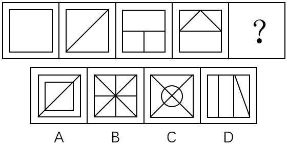
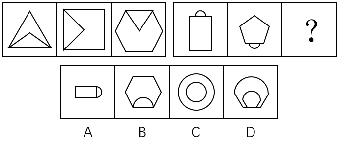
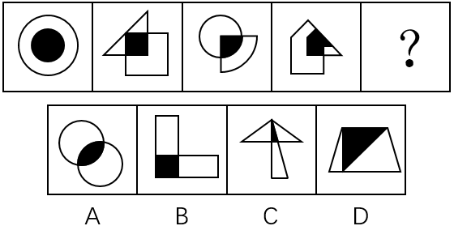

# 2017年重庆市选调优秀大学生到基层工作考试《行测》题

> 判断推理 · 30 题 · 选调 2017

## 第 1 题　qid 2261560 · 图形推理

根据图形规律，填入问号处最适合的一项是：

- **A**. A
- **B**. B　✅
- **C**. C
- **D**. D

**答案**：B

**官方解析**

元素组成不同，且无明显属性规律，考虑数量规律。观察发现，题干图形均为多边形被分割，面数量明显，优先考虑数面，题干图形面的数量依次为：1、2、3、4、？，问号处应填写一个面的数量为5的图形，没有答案。再次观察发现题干图形均由直线构成，考虑数直线数，题干图形直线数依次为4、5、6、7、？，因此问号处应填写一个直线数为8的图形，只有B项符合。
故正确答案为B。

---

## 第 2 题　qid 2261562 · 图形推理

根据图形规律，填入问号处最适合的一项是：

- **A**. A
- **B**. B
- **C**. C
- **D**. D　✅

**答案**：D

**官方解析**

观察图形发现，题干每幅图都两个面拼接在一起，可以考虑图形间关系。第一组的图形间关系为：两个小图形都有一条完整的公共边；第二组的图形间关系为：两个小图有一部分公共边。只有D项符合。
故正确答案为D。

---

## 第 3 题　qid 2261563 · 图形推理

根据图形规律，填入问号处最合适的一项是：

- **A**. A
- **B**. B　✅
- **C**. C
- **D**. D

**答案**：B

**官方解析**

解析一：元素组成不同，优先考虑属性规律。观察发现，题干所有图形既是轴对称图形，又是中心对称图形，A、C、D三项都仅为轴对称图形，B项既是轴对称图形，又是中心对称图形，只有B项符合。
故正确答案为B。
解析二：元素组成不同，且出现多端点、五角星、“田”字等特征图，可考虑笔画数，题干每一幅图都是3笔画图形，只有C项符合。
故正确答案为C。
此题从图形特征上来看，每一幅图画的比较规整，考查对称性的趋势是要更明显一点的，因此粉笔倾向于答案给B。

---

## 第 4 题　qid 2261565 · 图形推理

根据图形规律，填入问号处最合适的一项是：

- **A**. A
- **B**. B
- **C**. C　✅
- **D**. D

**答案**：C

**官方解析**

观察发现，题干所有图形均内部都有一个黑色阴影小元素，且黑色阴影小元素的形状与图形中一个图形的形状相同，只有C项符合。
故正确答案为C。

---

## 第 5 题　qid 2261567 · 图形推理

根据图形规律，填入问号处最合适的一项是：

- **A**. A
- **B**. B　✅
- **C**. C
- **D**. D

**答案**：B

**官方解析**

元素组成相同，优先考虑位置规律。观察发现，第一行第一个图形通过上下翻转可以得到第二图形，第二个图形通过左右翻转可以得到第三个图形，经验证第二行符合此规律，因此第三行？处应选择一个第二个图形经过左右翻转得到的图形，只有B项符合。
故正确答案为B。

---

## 第 6 题　qid 2261568 · 定义判断

垃圾邮件是指批量发送的内容违法或违规的邮件，或者违背用户主观意志接收到的并且客观上对用户造成骚扰的邮件。
下列属于垃圾邮件的是：

- **A**. 小李是某航空公司的白金会员，他不定期收到的航空公司打折促销的邮件
- **B**. 小张在某房产网注册后，每天收到的各类广告邮件　✅
- **C**. 小马在银行办理信用卡后，银行每月向他发送的电子对账单和还账提醒账单
- **D**. 小赵在某婚恋网站注册并发布交友条件后，网站根据其交友条件向其电子邮箱推送的会员信息

**答案**：B

**官方解析**

第一步：找出定义关键词。
“批量发送的内容违法或违规的邮件”、“违背用户主观意志接收到的并且客观上对用户造成骚扰的邮件”。
第二步：逐一分析选项。
A项：航空公司不定期向其白金会员发送打折促销邮件，其所发送的内容并不构成违法或违规，打折促销邮件客观上也不会造成对小李的骚扰，不符合定义，排除；
B项：小张在某房产网注册的初衷并不是接收各类广告邮件，发送各类广告邮件的行为违背了小张的主观意愿，且小张每天都会收到各类广告邮件，也造成了对小张的骚扰，符合定义，当选；
C项：小马在银行办理信用卡后，银行每月会向他发送电子账单和还账提醒账单，银行作为信用卡发放主体，有义务向客户及时提供各类账单信息，且银行发送的邮件内容并不构成违法和违规，不符合定义，排除；
D项：小赵在某婚恋网注册并发布交友信息的初衷是希望该网站向其推送符合自身交友条件的会员信息，婚恋网站的这种行为本身符合小赵的主观意愿，不符合定义，排除。
故正确答案为B。

---

## 第 7 题　qid 2261569 · 定义判断

公共利益是一定社会条件下或特定范围内不特定多数主体利益相一致的方面，它不同于国家利益和集团（体）利益，也不同于社会利益和共同利益，具有主体数量的不确定性、实体上的共享性等特征。
下列不属于公共利益的是：

- **A**. 国家进行公共设施及公益事业建设需要集体所有的土地
- **B**. 国有企业事业单位需要使用集体所有土地　✅
- **C**. 政府组织实施的保障性安居工程建设
- **D**. 政府组织实施的科技、教育、文化、卫生、体育、环境和资源保护、防灾减灾、文物保护、社会福利、市政公用等公共事业

**答案**：B

**官方解析**

第一步：找出定义关键词。
“一定社会条件下或特定范围内不特定多数主体利益相一致的方面”、“具有主体数量的不确定性、实体上的共享性等特征”。
第二步：逐一分析选项。
A项：国家进行公共设施及公益事业建设，其所面对的主体数量是不确定的，且公共设施和公益事业建设完成后，实体上是公民共享，符合定义，排除；
B项：国有企业事业单位需要使用集体所有土地，其所面对的主体数量是确定的，且国有企事业单位并不具有共享性，不符合定义，当选；
C项：政府组织实施保障性安居工程建设，所面对的主体数量是不确定的，且保障性安居工程建成后，实体上是公民共享，符合定义，排除；
D项：政府组织实施的教科文卫等公共事业，其所面对的主体数量是不确定的，且这些公共事业在实体上具有共享性，符合定义，排除。
本题为选非题，故正确答案为B。

---

## 第 8 题　qid 2261570 · 定义判断

饥饿营销，是指商品提供者有意调低产量，以期达到调控供求关系、制造供不应求“假象”、以维护产品形象并维持商品较高售价和利润率的营销策略。
下列选项中属于饥饿营销的是：

- **A**. 某知名手机厂商因生产链故障而实行限量销售
- **B**. 2011年福岛核泄漏事故发生后商场对食盐实行限量销售
- **C**. 我国的烟酒企业及营业场所不向未成年人出售烟酒
- **D**. 某知名服装品牌定期推出限量版服装　✅

**答案**：D

**官方解析**

第一步：找出定义关键词。
“商品提供者有意调低产量”、“以期达到调控供求关系、制造供不应求‘假象’、以维护产品形象并维持商品较高售价和利润率”。
第二步：逐一分析选项。
A项：某知名手机厂商因生产链故障而实行限量销售说明手机厂商并非有意调低产量，而是因为生产链故障原因这一客观因素造成限量销售，不符合定义，排除；
B项：商场是销售商并非食盐的生产商，无法有意调低产量，销量的降低也不是主观行为，是福岛核泄漏事故这一客观事实造成的，不符合定义，排除；
C项：烟草企业及营业场所不得向未成年人出售香烟，这是《中华人民共和国未成年人保护法》中所规定的内容，并非商品提供者有意限制销售人群，不符合定义，排除；
D项：某服装品牌商推出限量版服装，其行为符合商品提供者有意调低产量，符合关键词“以期达到调控供求关系、制造供不应求‘假象’、以维护产品形象并维持商品较高售价和利润率”，符合定义，当选。
故正确答案为D。

---

## 第 9 题　qid 2261571 · 定义判断

增强现实技术，它是一种将真实世界信息和虚拟世界信息“无缝”集成的新技术，是把原本在现实世界的一定时间空间范围内很难体验到的实体信息（视觉信息、声音、味道、触觉等），通过电脑等科学技术，模拟仿真后再叠加，将虚拟的信息应用到真实世界，被人类感官所感知，从而达到超越现实的感官体验。
根据上述定义，下列属于增强现实技术的是：

- **A**. 利用虚拟人体学习解剖
- **B**. 部队官兵利用虚拟战场系统训练协同作战
- **C**. 利用投影仪将电脑显示的内容投放至幕布
- **D**. 文物遗址上残缺部分的虚拟重构　✅

**答案**：D

**官方解析**

第一步：找出定义关键词。
“将真实世界信息和虚拟世界信息‘无缝’集成”、“把原本在现实世界的一定时间空间范围内很难体验到的实体信息”、“模拟仿真后再叠加”。
第二步：逐一分析选项。
A项：利用虚拟人体学习解剖，并未与现实进行重叠，不符合“模拟仿真后再叠加”，不符合定义，排除；
B项：利用虚拟战场系统训练协同作战，并未与现实进行重叠，不符合“模拟仿真后再叠加”，不符合定义，排除；
C项：利用投影仪将电脑显示的内容投放至幕布，不是原本在现实世界很难体验到的实体信息，同时并未与现实进行重叠，不符合“将真实世界信息和虚拟世界信息‘无缝’集成”、“把原本在现实世界的一定时间空间范围内很难体验到的实体信息”、“模拟仿真后再叠加”，不符合定义，排除；
D项：文物遗址上残缺部分的虚拟重构，是将虚拟的部分，套在现实残缺部分之上，体现了与现实进行重叠，符合“将真实世界信息和虚拟世界信息‘无缝’集成”、“把原本在现实世界的一定时间空间范围内很难体验到的实体信息”、“模拟仿真后再叠加”，符合定义，当选。
故正确答案为D。

---

## 第 10 题　qid 2261572 · 定义判断

同果异因是指不同原因都可以导致相同的一个结果。同因异果则指相同的原因可以导致不同的结果，一果多因是指一个结果的产生，是由多种因素综合作用的结果，一因多果则指一个原因可以导致多个结果。
根据上述定义，下列属于同因异果的是：

- **A**. 资金、人才以及核心竞争力的缺乏制约着这家公司的发展
- **B**. 这场灾难给该国的工业、农业和交通运输业等产业造成了巨大的损失
- **C**. 有的企业倒闭由于债务危机，有的企业倒闭由于违法
- **D**. 同一个老师上课，不同的学生却有不同的成绩　✅

**答案**：D

**官方解析**

第一步：找出定义关键词。
同果异因：“不同的原因导致相同的结果”；
同因异果：“相同的原因导致不同的结果”；
一果多因：“一个结果的产生，是由多种因素综合作用的结果”；
一因多果：“一个原因导致多个结果”。
第二步：逐一分析选项。
A项：资金、人才以及核心竞争力的缺乏制约着这家公司的发展，说明这家公司发展受到制约的这一结果，是由多种因素综合作用造成的，符合“一果多因”定义，不符合“同因异果”定义，排除；
B项：这场灾难给该国的工业、农业和交通运输业等产业造成了巨大的损失，说明由灾难这一个原因，导致了多个结果，符合“一因多果”定义，不符合“同因异果”定义，排除；
C项：企业发生倒闭既有债务原因，也有违法的原因，属于不同的原因导致相同的结果，符合“同果异因”定义，不符合“同因异果”定义，排除；
D项：同一个老师上课，符合相同的原因，不同的学生却有不同的成绩，符合不同的结果，符合“相同的原因导致不同的结果”，符合“同因异果”定义，当选。
故正确答案为D。

---

## 第 11 题　qid 2261573 · 逻辑判断

在一次讨论职工工会工作方案大会上，投票表决讨论，工会主席依据统计结果说：“参加大会的人员对方案都赞同，该方案全票通过！”如果以上不是事实，下面哪项必为事实：

- **A**. 该单位职工都不赞同此方案
- **B**. 该单位有些职工赞同，有些不赞同
- **C**. 该单位至少有职工赞同此方案
- **D**. 该单位至少有职工反对此方案　✅

**答案**：D

**官方解析**

第一步：翻译题干。
参加大会的人员对方案都赞同。
第二步：逐一分析选项。
A项：“参加大会的人员对方案都赞同”为假，可以推出：有的参加大会的人员不赞同该方案，无法推出“该单位职工都不赞同此方案”，排除；
B项：“参加大会的人员对方案都赞同”为假，可以推出：有的参加大会的人员不赞同该方案，无法推出“该单位有些职工赞同”，排除；
C项：“参加大会的人员对方案都赞同”为假，可以推出：有的参加大会的人员不赞同该方案，无法推出“该单位至少有职工赞同此方案”，排除；
D项：“参加大会的人员对方案都赞同”为假，可以推出：有的参加大会的人员不赞同该方案，可以推出“该单位至少有职工反对此方案”，当选。
故正确答案为D。

---

## 第 12 题　qid 4695843 · 逻辑判断

王刚说，除非想出国，否则不会每天晚上去外语培训班上课，秦娟说：不会吧，邻居老李就快退休了想出国，但并没有每天晚上去外语培训班听课。
事实上，秦娟把王刚的话误解为（    ）。

- **A**. 去外语培训班听课的人都是想出国的人
- **B**. 所有想出国的人都得参加外语培训班　✅
- **C**. 只有想出国，才会每天晚上去外语培训班听课
- **D**. 不想出国的人，不会去听外语课

**答案**：B

**官方解析**

第一步：翻译题干。 

王刚：每天晚上去外语培训班上课想出国；

秦娟：想出国 且 每天晚上去外语培训班上课。

第二步：逐一分析选项。

根据秦娟的话可知她在反驳王刚，即“想出国 且 每天晚上去外语培训班上课”是她误解意思的矛盾，那么她把王刚的话误解成：想出国每天晚上去外语培训班上课，对应B项。

A项翻译为：去外语培训班听课想出国，C项翻译为：每天晚上去外语培训班上课想出国，D项翻译为：去听外语课想出国，均可排除。

故正确答案为B。

---

## 第 13 题　qid 4695848 · 逻辑判断

开学第一周，李明正在考虑选修哪些选修课。当看到王教授开设的《线性代数》时，他突然想起他的同学王伟选修过王教授的这门课并且得到了A。李明推断：他也将从王教授那里得到A。
如果以下陈述为真，它们将加强李明的论证，除了（    ）。

- **A**. 李明在高中时是理科生，而王伟是文科生
- **B**. 张强、赵华和孙敏选修王教授的这门课得到了A
- **C**. 王伟在去年的校级数学知识竞赛中获得了一等奖　✅
- **D**. 王伟在高中没有上过线性代数的预备知识赛

**答案**：C

**官方解析**

第一步：找出论点和论据。
论点：李明也将从王教授那里得到A。
论据：李明的同学王伟选修过王教授的这门课并且得到了A。
本题论点讨论的是李明，论据讨论的是王伟，主体不一致，加强可优先考虑搭桥，也可以考虑补充论据，且本题为选非题，排除加强选项，选择剩余的选项即可。
第二步：逐一分析选项。
A项：指出高中时李明是理科生，而王伟是文科生，说明李明可能比王伟更擅长理科，且王伟《线性代数》得了A，那么李明也得A的可能性就增加了，具有加强作用，排除；
B项：指出张强、赵华和孙敏选修王教授的这门课得到了A，说明选修王教授的这门课程得到A的概率比较高，补充论据，具有加强作用，排除；
C项：指出王伟去年获得数学知识竞赛一等奖，说明王伟数学能力较强，这可能是他《线性代数》得到A的原因，但无法判断李明的数学能力如何，也就无法判断李明选修王教授开设的《线性代数》是否也会得到A，无法加强，当选；
D项：指出王伟在高中没有上过线性代数的预备知识赛，说明王伟之前可能不具有《线性代数》的相关知识但也得了A，无论李明是否具有相关知识，都有利于其《线性代数》得A，具有一定的加强作用，排除。
本题为选非题，故正确答案为C。

---

## 第 14 题　qid 4695851 · 逻辑判断

iphone7发布已经3个月时间，依靠新的iphone带动销量可能会令苹果失望，据悉，苹果已经砍掉了iphone7的不少订单，这可能与库存压力较大有关，然而出现这一情况并不能说明苹果正在走下坡路。
以下哪项不能支持上述结论？

- **A**. 全球经济不景气，消费者购买新手机的意愿降低
- **B**. 苹果iphone发布十周年即将到来，消费者对于来年新品的预期较强
- **C**. 苹果既有产品可以满足消费者性能需要
- **D**. 新产品多年未变的外观和不足的创新　✅

**答案**：D

**官方解析**

第一步：找出论点和论据。
论点：苹果已经砍掉了iphone7的不少订单事件并不能说明苹果正在走下坡路。
论据：无。
本题只有论点，没有论据，加强优先考虑补充论据，且本题为加强选非题，找到可证明苹果没有走下坡路的三个选项排除即可。
第二步：逐一分析选项。
A项：指出全球经济不景气让消费者购买手机的意愿降低，说明是整个市场环境的问题，不代表苹果公司在走下坡路，补充论据，可以加强，排除；
B项：指出消费者等待苹果新产品的上市，仍然具有很强的购买欲望，证明iPhone7的情况不能说明苹果公司在走下坡路，补充论据，可以加强，排除；
C项：指出苹果手机能够满足消费者的需求，说明消费者对苹果的既有产品感到满意，那么仅凭iPhone7的情况不能证明苹果公司在走下坡路，可以加强，排除；
D项：指出苹果公司存在外观多年没变和创新不足的问题，这些苹果自身的问题会影响销量，不利于苹果公司的发展，具有削弱作用，无法加强，当选。
本题为选非题，故正确答案为D。

---

## 第 15 题　qid 4695856 · 逻辑判断

一高中英语教师在最后的一次试验中，把一些真正的、通常使用的格言散置于几个他自己编造的、无意义的听起来像格言的句子之中。接着，他让学生对所有列出的句子进行评价。学生普遍都认为伪造的格言与真正的格言一样的具有哲理和意义。这个老师于是就推论出这样的结论：格言之所以得到了格言的地位，主要是因为它们经常被使用，而不是因为它们具有内在的哲理。
下面哪一项如果正确的话，最能质疑老师的结论？

- **A**. 在所列出的句子中，真正的格言的数量比伪造的格言的数量多
- **B**. 有些格言使用的频率比其他格言高
- **C**. 那些被选择作为评价者的学生，缺乏判断句子哲理性的经验　✅
- **D**. 一些学生以一种方式来考虑句子，另一些学生会以另一种截然不同的方式来考虑它

**答案**：C

**官方解析**

第一步：找出论点和论据。
论点：格言之所以得到了格言的地位，主要是因为它们经常被使用，而不是因为它们具有内在的哲理。
论据：学生普遍都认为伪造的格言与真正的格言一样的具有哲理和意义。
本题论点说的是“经常被使用”让格言得到了地位，而不是“内在的哲理”，论据是试验中的学生对句子的评价，即学生认为伪造的格言与真正的格言一样的具有哲理和意义，论点论据都在说不是“内在的哲理”让格言有意义，话题一致，削弱优先考虑否定论点，且论据是试验结果，也可以从试验对象没有代表性、试验设计不科学等方面进行削弱。
第二步：逐一分析选项。
A项：该项说的是试验中真伪格言数量之间的比较，但数量差并不影响学生对句子的评价，对试验结果不具有削弱作用，排除；
B项：该项说的是格言之间使用频率的比较，不是真伪格言使用频率的比较，且无法判断“有些”的具体数量有多少，不能确定是不是“经常被使用”让格言得到了地位，无法削弱，排除；
C项：该项指出作为评价者的学生缺乏判断句子哲理性的经验，证明论据中的试验结果不准确，削弱论据，可以削弱，当选；
D项：该项说的是学生考虑句子的方式不同，但没有提及考虑方式对试验结果的影响，无法确定是否会对试验结果产生影响，无法削弱，排除。
故正确答案为C。

---

## 第 16 题　qid 4695863 · 逻辑判断

为响应全民健身活动，某公司组织员工进行了一次登山比赛。为此，营销部、财务部、物流部三个部门均派出三名登山高手参加比赛。赛前，公司张、王、李、赵四位员工分别预测了一下比赛结果。
张：营销部经常组织登山活动，这次比赛，他们一定会揽得第1、2、3名；
王：这次参赛的登山高手很多，前三名营销部最多拿一个；
李：财务部或者物流部也不错，也会进前三名的；
赵：我预测第1名如果不是营销部的，那就会是财务部。
登山比赛结束后，四人中只有一人预测准确。
请问，以下哪项最可能是比赛结果？

- **A**. 前三名都被营销部包揽了
- **B**. 冠军营销部、亚军物流部、第三名财务部
- **C**. 冠军物流部、亚军营销部、第三名营销部　✅
- **D**. 冠军财务部、亚军营销部、第三名物流部

**答案**：C

**官方解析**

第一步：分析题干条件。

（1）张：营销部揽得前三名；

（2）王：前三名营销部最多拿一个；

（3）李：财务部或者物流部会进前三名；

（4）赵：营销部第1名财务部第1名。

分析题干条件，条件（3）“财务部或者物流部会进前三名”，即营销部不会揽得前三名，故条件（1）和条件（3）为矛盾关系，必有一真一假。

第二步：根据题干条件进行推理。

根据题干条件可知，只有一人预测正确，而真话一定在矛盾关系当中，故条件（2）和（4）均为假话；根据条件（2）为假话可知，其矛盾命题为真，即前三名营销部最少拿两个；根据条件（4）为假话可知，其矛盾命题“营销部第1名 且 财务部第1名”为真，故物流部第1名；继续推理可知，第2名和第3名都是营销部，只有C项符合。

故正确答案为C。

---

## 第 17 题　qid 2261574 · 逻辑判断

研究发现，人体中的胆固醇与心脑血管疾病风险相关。为了降低膳食胆固醇对心脑血管疾病的影响，各国营养界提倡将膳食胆固醇摄入量控制在300毫克以内。因此，每天只吃一个中等大的鸡蛋（约200毫克胆固醇）有助于身体健康。
以下哪项为真最能削减上述论述？

- **A**. 每个人对食物中胆固醇的反应是不一样的，有些“高反应者”每天只吃一个鸡蛋，胆固醇也会升高　✅
- **B**. 鸡蛋中的胆固醇存在于蛋黄
- **C**. 某国人的鸡蛋摄入量大幅下降，但心脏病并未因此减少
- **D**. 鸡蛋中其他成分不会对身体造成不良影响

**答案**：A

**官方解析**

第一步：找出论点和论据。
论点：每天只吃一个中等大的鸡蛋（约200毫克胆固醇）有助于身体健康。
论据：为了降低膳食胆固醇对心脑血管疾病的影响，各国营养界提倡将膳食胆固醇摄入量控制在300毫克以内。
第二步：逐一分析选项。
A项：有些“高反应者”，即使每天只吃一个鸡蛋，也会引起胆固醇的升高，而人体中的胆固醇又与心脑血管疾病风险相关，说明对于“高反应者”，每天只吃一个鸡蛋也不利于其身体健康，通过举反例，削弱了论点，当选；
B项：论点讨论的是胆固醇的摄入量与身体健康之间的关系，而选项讨论的是胆固醇存在于蛋黄中，话题不一致，无法削弱，排除；
C项：鸡蛋的摄入量大幅下降，但并未说明鸡蛋的摄入量是多少，选项并未表述清楚，且“鸡蛋摄入量大幅下降，但心脏病并未因此减少”并不能说明每天吃一个中等大的鸡蛋不利于身体健康，无法削弱，排除；
D项：论点讨论的是胆固醇的摄入量与身体健康之间的关系，而选项讨论的是鸡蛋中其他成分不会对身体造成不良影响，话题不一致，无法削弱，排除。
故正确答案为A。

---

## 第 18 题　qid 2261575 · 逻辑判断

某街道当前正在开展“十佳社区评选活动”，评选方法是选择8个方面，包括：物业管理、人际关系、清洁程度、绿化程度、建筑设施安全性、社会治安指标等等，评以1分至10分之间的某—分值，然后求得8个分值的平均数即该社区得分。
以下哪项是实施上述活动需要预设的前提？
Ⅰ.社区各种舒适性质量程度都可以用准确的数字表达
Ⅱ.社区的各种指标对于社区居民来说都是同等重要的
Ⅲ.其他社区均以同一标准来考核

- **A**. 仅Ⅰ
- **B**. 仅Ⅱ
- **C**. 仅Ⅲ
- **D**. 仅Ⅰ、Ⅱ和Ⅲ　✅

**答案**：D

**官方解析**

逐一分析题干所给条件。
Ⅰ.如果社区各种舒适性质量程度都不可以用准确的数字表达，则评选活动将无法开展，“社区各种舒适性质量程度都可以用准确的数字表达”是实施上述活动的必要条件；
Ⅱ.如果社区的各种指标对于社区居民来说不是同等重要，则评选的结果就缺乏科学性，“社区的各种指标对于社区居民来说都是同等重要的”是实施上述活动的必要条件；
Ⅲ.十佳社区评选活动，如果各社区的考核标准不同，则评选结果既不公平，也缺乏科学性，“其他社区均以同一标准来考核”是实施上述活动的必要条件。
故正确答案为D。

---

## 第 19 题　qid 24929 · 逻辑判断

气候变暖后，一般中高纬度地区粮食产量增加，而热带和亚热带只能以一些耐高温作物为主，产量下降，尤其是非洲和拉丁美洲。全球最贫穷的地区饥荒危机将增加，饥饿和营养不良引起机体免疫力下降，增加人们对疾病的易感性。
由此能推出：

- **A**. 中高纬度并非是全球最贫困的地区　✅
- **B**. 非洲和拉丁美洲存在全球最贫困地区
- **C**. 全球变暖对中高纬度气候的影响小于对热带和亚热带气候的影响
- **D**. 全球变暖对非洲和拉丁美洲粮食产量的影响高于世界平均水平

**答案**：A

**官方解析**

第一步：抓住每句话中的对象及主要内容。
第一句说明气候变暖导致中高纬度地区粮食产量增加，非洲和拉丁美洲等热带和亚热带地区产量下降；第二句说明全球最贫穷的地区饥荒危机将增加。
第二步：逐一判断选项的作用。
A项，由题干可知，中高纬度地区粮食产量增加，全球最贫穷的地区饥荒危机将增加。根据“最贫穷的地区饥荒危机将增加”可以推出，中高纬度地区不会是最贫困地区，正确，当选；
B项，粮食产量下降的地方有很多，包括非洲和拉丁美洲，通过“尤其”可知非洲和拉丁美洲的产量下降较为严重，但是最贫困地区，题干没有提及，也有可能是位于热带和亚热带的其他洲的地区，排除；
C项，题干提及的是全球变暖对粮食的影响，不是气候，无关选项，排除；
D项，根据题干，不知道全球变暖对粮食产量的世界平均水平的影响，所以不能推出是否全球变暖对非洲和拉丁美洲粮食产量的影响高于世界平均水平，排除。
故正确答案为A。

---

## 第 20 题　qid 2261580 · 逻辑判断

2007年以来，北京地铁不分路途远近，不管是否换乘，票价一律两元，2013年3月8日，北京地铁客运量首次突破1000万人次，并稳定下来，早晚上下班高峰时段，地铁站台内等四五趟车是家常便饭，于是有人提议：地铁票价应该上涨，通过价格杠杆来分散高峰时段客流压力，并将轨道交通人流向地面交通进行分流，以使城市公共交通结构趋于合理。
以下各项陈述都将削弱上述观点，除了：

- **A**. 较高的地铁票价又将促使许多上下班者开车上班，这将加速北京的空气污染，增加地面交通的拥挤程度
- **B**. 坐地铁的乘客绝大多数都是刚性需要，没有人愿意没事时来地铁观光，体验地铁里的拥挤或呼吸车厢里的污浊空气
- **C**. 许多坐地铁的乘客都是低票价的受益者，他们强烈反对提高地铁票价　✅
- **D**. 地面公共交通已经趋于饱和，如果地铁出行成本昂贵，那么公交车将和地铁车厢一样拥挤

**答案**：C

**官方解析**

第一步：找出论点和论据。
论点：地铁票价应该上涨。
论据：通过价格杠杆来分散高峰时段客流压力，并将轨道交通人流向地面交通进行分流，以使城市公共交通结构趋于合理。
第二步：逐一分析选项。
A项：较高的地铁票价会使一部分原本乘坐地铁的人通过开车上下班，最终会造成地面交通的拥挤，说明提高票价并不能使公共交通结构趋于合理，削弱了论据，排除；
B项：“坐地铁的乘客绝大多数都是刚性需要”说明大多数乘客不会因为票价的上涨而换成其他交通方式，因此并不能达到使城市交通结构趋于合理的目的，削弱了论据，排除；
C项：乘坐低票价的乘客反对提高地铁票价，并不能否认提高地铁票价可以缓解轨道交通压力，使城市公共交通结构趋于合理，不能削弱论点，属于无关项，当选；
D项：“地面公共交通已趋于饱和”，如果提高票价，则会进一步加重地面交通压力，从而无法达到使公共交通结构趋于合理的目标，削弱了论据，排除。
本题为选非题，故正确答案为C。

---

## 第 21 题　qid 2261581 · 类比推理

佛教∶宗教

- **A**. 商品∶交换
- **B**. 化学∶科学　✅
- **C**. 系统∶整体
- **D**. 社区∶社会

**答案**：B

**官方解析**

第一步：判断题干词语间逻辑关系。
佛教是一种宗教，二者为种属关系。
第二步：判断选项词语间逻辑关系。
A项：商品是用于交换的劳动产品，交换是商品的必然属性，二者为对应关系，与题干逻辑关系不一致，排除；
B项：化学是一种科学，二者为种属关系，与题干逻辑关系一致，当选；
C项：系统是指由要素组成的有机整体，整体性是其最基本的属性，二者为对应关系，与题干逻辑关系不一致，排除；
D项：社区是社会的一部分，二者为组成关系，与题干逻辑关系不一致，排除。
故正确答案为B。

---

## 第 22 题　qid 2261582 · 类比推理

产品∶商品

- **A**. 金属∶木头
- **B**. 工人∶党员
- **C**. 工具∶锄头　✅
- **D**. 学生∶学者

**答案**：C

**官方解析**

第一步：判断题干词语间逻辑关系。
商品是一种产品，二者为种属关系。
第二步：判断选项词语间逻辑关系。
A项：金属和木头都是一种材质，二者为并列关系，与题干逻辑关系不一致，排除；
B项：有的工人是党员，有的党员是工人，二者为交叉关系，与题干逻辑关系不一致，排除；
C项：锄头是一种工具，二者为种属关系，与题干逻辑关系一致，当选；
D项：学者指做学问的人，求学的人；学生指在学校肄业或在其他教育、研究机构学习的人。有的学生是学者，有的学者是学生，二者为交叉关系，与题干逻辑关系不一致，排除。
故正确答案为C。

---

## 第 23 题　qid 2261583 · 类比推理

运动员∶裁判

- **A**. 消费者∶消费者协会
- **B**. 候选人∶计票员
- **C**. 股民∶企业
- **D**. 商贩∶城管　✅

**答案**：D

**官方解析**

第一步：判断题干词语间逻辑关系。
运动员对应裁判，裁判对运动员做出判罚，二者在工作上是主客体的对应关系。
第二步：判断选项词语间逻辑关系。
A项：消费者协会是对商品和服务进行社会监督的保护消费者合法权益的全国性社会组织。消费者协会保护消费者的权益，不是工作上的主客体的对应关系，与题干逻辑关系不一致，排除；
B项：计票员和候选人是并列关系，不存在主客体关系，与题干逻辑关系不一致，排除；
C项：股民指从事股票交易的个人投资者。股民对应发行股票的企业，而不是所有企业，且股民和企业在工作上也不存在主客体的对应关系，与题干逻辑关系不一致，排除；
D项：商贩对应城管，城管对商贩进行管理，二者在工作上是主客体的对应关系，与题干逻辑关系一致，当选。
故正确答案为D。

---

## 第 24 题　qid 2261584 · 类比推理

下里巴人∶通俗

- **A**. 差强人意∶失望
- **B**. 千钧一发∶沉重
- **C**. 目无全牛∶熟练　✅
- **D**. 七月流火∶炎热

**答案**：C

**官方解析**

第一步：判断题干词语间逻辑关系。
下里巴人比喻通俗的文学艺术，形容比较通俗。
第二步：判断选项词语间逻辑关系。
A项：差强人意指勉强使人满意，与失望是反义词关系，与题干逻辑关系不一致，排除；
B项：千钧一发比喻情况万分危急，与沉重没有必然的关系，与题干逻辑关系不一致，排除；
C项：目无全牛比喻技术熟练到了得心应手的境地，形容比较熟练，与题干逻辑关系一致，当选；
D项：七月流火指夏去秋来，寒天将至，与炎热没有必然的关系，与题干逻辑关系不一致，排除。
故正确答案为C。

---

## 第 25 题　qid 2261585 · 类比推理

街市∶熙熙攘攘

- **A**. 教室∶勤奋好学
- **B**. 医院∶医术精湛
- **C**. 寺庙∶信仰虔诚
- **D**. 沙滩∶金光灿灿　✅

**答案**：D

**官方解析**

第一步：判断题干词语间逻辑关系。
熙熙攘攘的街市，熙熙攘攘是对街市的描绘，二者为对应关系。
第二步：判断选项词语间逻辑关系。
A项：勤奋好学的学生，而非教室，与教室没有必然的关系，与题干逻辑关系不一致，排除；
B项：医术精湛的医生，而非医院，与医院没有必然的关系，与题干逻辑关系不一致，排除；
C项：信仰虔诚的信众，而非寺庙，与寺庙没有必然的关系，与题干逻辑关系不一致，排除；
D项：金光灿灿的沙滩，金光灿灿是对沙滩的描绘，二者为对应关系，与题干逻辑关系一致，当选。
故正确答案为D。

---

## 第 26 题　qid 2261586 · 类比推理

紧急 对于（  ）相当于 危机 对于（  ）

- **A**. 未雨绸缪  生死攸关
- **B**. 生死攸关  火烧眉毛
- **C**. 雷霆万钧  危若累卵
- **D**. 迫在眉睫  千钧一发　✅

**答案**：D

**官方解析**

逐一代入选项。
A项：未雨绸缪比喻事先做好准备工作，与紧急没有必然的关系；生死攸关指生死存亡的关键，生死攸关可以修饰危机，前后逻辑关系不一致，排除；
B项：生死攸关指生死存亡的关键，与紧急没有必然的关系；火烧眉毛比喻事到眼前，非常急迫，与危机没有必然的关系，前后逻辑关系不一致，排除；
C项：雷霆万钧形容威力极大，无法阻挡，与紧急没有必然的关系；危若累卵比喻形势非常危险，如同堆起来的蛋，随时都有塌下打碎的可能，可以形容危机，前后逻辑关系不一致，排除；
D项：迫在眉睫形容事情已到眼前，情势十分紧迫，形容很紧急；千钧一发比喻情况万分危急，形容很危急，前后逻辑关系一致，当选。
故正确答案为D。

---

## 第 27 题　qid 2261587 · 类比推理

勤以补拙 对于（  ）相当于（  ）对于 品逸若梅

- **A**. 废寝忘食  人心向背
- **B**. 焚膏继晷  人情世故
- **C**. 克勤克俭  人穷志短
- **D**. 俭以养廉  人淡如茶　✅

**答案**：D

**官方解析**

逐一代入选项。
A项：勤以补拙指勤奋能够弥补不足，废寝忘食形容专心努力，二者没有必然逻辑的关系；人心向背指人民大众的拥护或反对，品逸若梅是人心向背的一个条件，二者为对应关系，前后逻辑关系不一致，排除；
B项：勤以补拙指勤奋能够弥补不足，焚膏继晷形容勤奋地工作或读书，二者为近义词关系；人情世故指为人处世的道理，与品逸若梅没有必然的逻辑关系，前后逻辑关系不一致，排除；
C项：克勤克俭指既能勤劳，又能节俭，与勤以补拙没有必然的关系；人穷志短指人的处境困厄，志向也就小了，与品逸若梅没有必然的逻辑关系，前后逻辑关系不一致，排除；
D项：勤以补拙，勤是补拙的一种方式，俭以养廉，俭是养廉的一种方式，二者的结构相同；人淡如茶，人如茶水一样清淡，品逸若梅，品格如梅花一样高尚，二者结构相同，前后逻辑关系一致，当选。
故正确答案为D。

---

## 第 28 题　qid 2261588 · 类比推理

出：入：出入

- **A**. 拼：凑：拼凑
- **B**. 攻：守：攻守　✅
- **C**. 手：脚：手脚
- **D**. 仇：恨：仇恨

**答案**：B

**官方解析**

第一步：判断题干词语间逻辑关系。
出和入是反义关系，出入指出进、往来，既包括出，也包括入。
第二步：判断选项词语间逻辑关系。
A项：拼和凑是近义词关系，与题干逻辑关系不一致，排除；
B项：攻和守是反义词关系，攻守指攻取与守卫，既包括攻，也包括守，与题干逻辑关系一致，当选；
C项：手和脚是并列关系，与题干逻辑关系不一致，排除；
D项：仇和恨是近义词关系，与题干逻辑关系不一致，排除。
故正确答案为B。

---

## 第 29 题　qid 2261589 · 类比推理

政策：促进：约束

- **A**. 生命：繁殖：死亡
- **B**. 书房：书架：电脑
- **C**. 观点：新颖：创意
- **D**. 口号：倡导：禁止　✅

**答案**：D

**官方解析**

第一步：判断题干词语间逻辑关系。
政策可以促进，也可以约束，促进和约束是政策的两种功能，且促进和约束为反义关系。
第二步：判断选项词语间逻辑关系。
A项：繁殖和死亡是生命的两种状态，但繁殖和死亡不是反义词关系，与题干逻辑关系不一致，排除；
B项：书架放在书房中，二者为地点上的对应关系，与题干逻辑关系不一致，排除；
C项：新颖和创意是观点的属性，新颖和创意与观点是对应关系，与题干逻辑关系不一致，排除；
D项：口号可以倡导，也可以禁止，倡导和禁止是口号的两种功能，属于功能上的对应关系；倡导和禁止，二者属于反义关系，与题干逻辑关系一致，当选。
故正确答案为D。

---

## 第 30 题　qid 2261590 · 类比推理

月季：鲜花：芬芳

- **A**. 学生：学校：学习
- **B**. 冰箱：家电：保鲜　✅
- **C**. 石头：房屋：宏伟
- **D**. 胶卷：相机：摄像

**答案**：B

**官方解析**

第一步：判断题干词语间逻辑关系。
月季是一种鲜花，二者为种属关系；芬芳指香、香气，月季可以散发出香气，二者为功能对应关系。
第二步：判断选项词语间逻辑关系。
A项：学生在学校学习，学生和学校是地点上的对应关系，与题干逻辑关系不一致，排除；
B项：冰箱是一种家电，二者为种属关系；冰箱具有保鲜的功能，二者为功能对应关系，与题干逻辑关系一致，当选；
C项：石头是建造房屋的一种原材料，二者为原料上的对应关系，与题干逻辑关系不一致，排除；
D项：胶卷和相机属于或然对应关系，与题干逻辑关系不一致，排除。
故正确答案为B。

---
