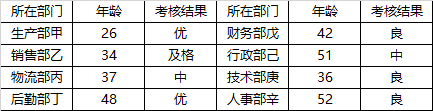

# 2018年421联考《行测》题（吉林乙级）（网友回忆版）

> 判断推理 · 25 题 · 吉林 2018

## 第 1 题　qid 2187456 · 定义判断

噪光，是指环境中超过人体的生理承受范围，使人感到厌烦，进而对人的心理或生理健康产生一定影响乃至危害的光辐射现象。
根据上述定义，下列不属于噪光的是：

- **A**. 调酒师在酒吧工作时，在旋转灯、魔球灯的彩光照射下，他感觉头晕恶心
- **B**. 行人在街上行走时，路边建筑物的单向透视玻璃反射阳光，使他感觉目眩
- **C**. 司机在驾驶过程中，车辆灯光照射到玻璃幕墙上形成反光，使他产生幻觉
- **D**. 建筑工人在施工时，在阳光下操作起重机升降的过程中，他感觉光线耀眼　✅

**答案**：D

**官方解析**

第一步：找出定义关键词。
“环境中超过人体的生理承受范围”、“使人感到厌烦”、“对人的心理或生理健康产生一定影响乃至危害的光辐射现象”。
第二步：逐一分析选项。
A项：旋转灯、魔球灯的彩光照射是光辐射现象，调酒师在彩光照射下感觉头晕恶心，符合“超过人体的生理承受范围、对人的心理或生理健康产生一定影响乃至危害”，符合定义，排除；
B项：路边建筑物的单向透视玻璃反射的阳光是光辐射现象，行人感觉目眩，符合“超过人体的生理承受范围、对人的心理或生理健康产生一定影响乃至危害”，符合定义，排除；
C项：车辆灯光照射到玻璃幕墙上形成的反光是光辐射现象，司机产生幻觉符合“超过人体的生理承受范围、对人的心理或生理健康产生一定影响乃至危害”，符合定义，排除；
D项：阳光是光辐射现象，建筑工人在施工中感觉光线耀眼，但没有明确说明光线耀眼是否“对人的心理或生理健康产生一定影响乃至危害”，不符合定义，当选。
本题为选非题，故正确答案为D。

---

## 第 2 题　qid 2188084 · 定义判断

柏金赫现象，是指人眼在低照明水平时，会产生视感觉的敏感性向光谱蓝端迁移的现象。
根据上述定义，下列利用了柏金赫现象的是

- **A**. 将同样的红玫瑰花，印制在薄尼龙纱窗及粗厚的沙发织物上，可以形成既配套又独具材质变化魅力的装饰效果
- **B**. 面积较大的房间，使用奶黄、浅咖啡色等暖色调来装修，既可以使人感到温馨愉快，又可以避免给人以空旷感
- **C**. 创作一幅用于悬挂在较暗室内环境中的磨漆画时，在色彩构成方面，选用蓝、绿等冷色调优于红、橙等暖色调　✅
- **D**. 医院手术室环境及医护人员工作服都选用蓝绿色，可以使医生注视了蓝绿色后，更易看清细小的血管、神经等

**答案**：C

**官方解析**

第一步：找出定义关键词。
“人眼在低照明水平时”、“产生视感觉的敏感性向光谱蓝端迁移”。
第二步：逐一分析选项。
A项：没有提到低水平照明，不符合“人眼在低照明水平时”，不符合定义，排除； 
B项：没有提到低水平照明，不符合“人眼在低照明水平时”，不符合定义，排除；
C项：“创作一幅用于悬挂在较暗室内环境中的磨漆画”符合“人眼在低照明水平时”，“蓝、绿色等冷色调优于暖色调”符合“产生视感觉的敏感性向光谱蓝端迁移”，符合定义，当选；
D项：没有提到低水平照明，不符合“人眼在低照明水平时”，不符合定义，排除。
故正确答案为C。

---

## 第 3 题　qid 2188085 · 定义判断

轻率概括，是指在没有积累足以进行概括的材料的情况下，只依据少数个例就草率地作出普遍性结论的一种逻辑错误。
根据上述定义，下列不属于轻率概括的是

- **A**. 做微商都很容易赚钱！我的一个亲戚，年初开始做微商，现在已经买车了
- **B**. 为了与2000万精英做共同的选择，请赶快来购买我们的在线付费课程吧　✅
- **C**. 我的朋友说她的哲学课很难，我的哲学课也很难，可见哲学课必定都很难
- **D**. 我几乎每天都吃汉堡，但是我的体重却没有变，所以吃汉堡不会导致肥胖

**答案**：B

**官方解析**

第一步：找出定义关键词。
“在没有积累足以进行概括的材料的情况下”、“只依据少数个例就草率地作出普遍性结论”。
第二步：逐一分析选项。
A项：只依据一个亲戚的个例作出做微商很容易赚钱的普遍性结论，符合定义，排除；
B项：与2000万精英做共同的选择是依据大量的例子得出的普遍性结论，不符合定义，当选；
C项：只依据我和我朋友的哲学课很难的少数个例作出哲学课都很难这一普遍性结论，符合定义，排除；
D项：只依据我的饮食这一个例得到吃汉堡不会导致肥胖这一普遍性结论，符合定义，排除。
本题为选非题，故正确答案为B。

---

## 第 4 题　qid 2188088 · 定义判断

艺术直觉是人们在艺术活动中，对事物的特征、本质、意义，不经过逻辑推理和分析而直接地感受和领悟。
根据上述定义，下列属于艺术直觉的是

- **A**. 某技术工人在一次技术操作中突然发现合理的操作方法
- **B**. 某歌手经多次演出找到适合自己的歌唱方式和表演方式
- **C**. 某游客在欣赏毕加索的画时突然领悟到作品的独特内涵　✅
- **D**. 某艺术鉴赏家通过多次对比发现了梵高绘画作品的特征

**答案**：C

**官方解析**

第一步：找出定义关键词。
“人们在艺术活动中”、“对事物的特征、本质、意义”、“不经过逻辑推理和分析”、“直接的感受和领悟”。
第二步：逐一分析选项。
A项：技术操作不是艺术活动，不符合“人们在艺术活动中”，不符合定义，排除； 
B项：经多次演出找到适合的方式，不符合“直接的感受和领悟”，不符合定义，排除；
C项：欣赏毕加索的画，符合“人们在艺术活动中”，突然领悟到作品的独特内涵，符合“对事物的特征、本质、意义”产生“直接的感受和领悟”，符合定义，当选；
D项：通过多次对比发现特征，不符合“直接的感受和领悟”，不符合定义，排除。
故正确答案为C。

---

## 第 5 题　qid 2188090 · 定义判断

循环论证是一种逻辑错误，是指论据和论点不是相互独立，而是拥有相同的内容，其论证过程是用不同的语言重复一样的内容。
根据上述定义，下列不属于循环论证的是

- **A**. 你完全错了，因为你说得没有道理
- **B**. 外星人是存在的，因为你证明不了他不存在　✅
- **C**. 你应该相信世上有神，因为神确实是存在的
- **D**. 他不值得你这么爱他，因为他不配

**答案**：B

**官方解析**

第一步：找出定义关键词。
“论据和论点有相同的内容”、“用不同的语言重复一样的内容”。
第二步：逐一分析选项。
A项：论点是“你完全错了”，论据是“你说的没道理”。没道理与错了是同一个意思，符合“用不同的语言重复一样的内容”，符合定义，排除；
B项：论点是“外星人是存在的”，论据是“你证明不了他不存在”，论证过程是无法证明所以不存在，这是诉诸无知，不符合“用不同的语言重复一样的内容”，不符合定义，当选；
C项：论点是“你应该相信世上有神”，论据是“神确实存在”，相信有神和神存在是同一个意思，符合“用不同的语言重复一样的内容”，符合定义，排除；
D项：论点是“他不值得你爱”，论据是“他不配”，他不值得和他不配是同一个意思，符合“用不同的语言重复一样的内容”，符合定义，排除。
本题为选非题，故正确答案为B。

---

## 第 6 题　qid 2188078 · 类比推理

市场行为：购买：销售

- **A**. 修辞：夸张：排比　✅
- **B**. 思想家：孔子：政治家
- **C**. 飞机：汽车：轮船
- **D**. 无机物：硫铁矿：氨基酸

**答案**：A

**官方解析**

第一步：判断题干词语间逻辑关系。
购买和销售都是市场行为，后两个词与第一个词构成种属关系。
第二步：判断选项词语间逻辑关系。
A项：夸张和排比都是修辞，后两个词与第一个词构成种属关系,与题干逻辑关系一致，当选；
B项：孔子是思想家，是种属关系，但是政治家与思想家是交叉关系，与题干逻辑关系不一致，排除；
C项：飞机、汽车、轮船都是交通工具，三者是并列关系，与题干逻辑关系不一致，排除；
D项：硫铁矿是无机物，是种属关系，但是氨基酸是有机物，与无机物不构成种属关系，与题干逻辑关系不一致，排除。
故正确答案为A。

---

## 第 7 题　qid 2187426 · 类比推理

缺锌：生长迟缓

- **A**. 成年：参加选举
- **B**. 吃药：感冒痊愈
- **C**. 迁徙：季节变化
- **D**. 加热：温度升高　✅

**答案**：D

**官方解析**

第一步：判断题干词语间逻辑关系。
缺锌导致生长迟缓，二者为因果对应关系。
第二步：判断选项词语间逻辑关系。
A项：成年是参加选举的必要条件而不是参加选举的原因，与题干逻辑关系不一致，排除；
B项：吃感冒药可以导致感冒痊愈，但题干只是说吃药，太过笼统，所以题干两词无必然逻辑关系，与题干逻辑关系不一致，排除；
C项：季节变化导致迁徙，二者为因果对应关系，但两词顺序与题干相反，与题干逻辑关系不一致，排除；
D项：加热可以导致温度升高，二者为因果对应关系，与题干逻辑关系一致，当选。
故正确答案为D。

---

## 第 8 题　qid 2187430 · 类比推理

若明若暗：雾里看花

- **A**. 如醉如梦：一清二楚
- **B**. 如日中天：日薄西山
- **C**. 如火如荼：无声无息
- **D**. 如履薄冰：如临深渊　✅

**答案**：D

**官方解析**

第一步：判断题干词语间逻辑关系。
若明若暗，比喻对情况的了解或对问题的认识不清楚；雾里看花，比喻对事物看不真切，二者为近义关系。
第二步：判断选项词语间逻辑关系。
A项：如醉如梦形容处于不清醒、迷糊状态中，一清二楚形容对事物十分了解，二者无必然逻辑关系，与题干逻辑关系不一致，排除；
B项：如日中天比喻事物正发展到十分兴盛的阶段，日薄西山比喻腐朽的事物衰败接近灭亡，二者为反义关系，与题干逻辑关系不一致，排除；
C项：如火如荼形容旺盛、热烈或激烈，无声无息比喻没有名声不被人知道，二者无必然逻辑关系，与题干逻辑关系不一致，排除；
D项：如履薄冰和如临深渊均比喻行事极为谨慎，存有戒心，二者为近义关系，与题干逻辑关系一致，当选。
故正确答案为D。

---

## 第 9 题　qid 2188081 · 类比推理

混合物：空气

- **A**. 财务报表：利润表　✅
- **B**. 金属：绝缘体
- **C**. 合唱团：团员
- **D**. 满族：维吾尔族

**答案**：A

**官方解析**

第一步：判断题干词语间逻辑关系。
空气是一种混合物，二者为种属关系。
第二步：判断选项词语间逻辑关系。
A项：利润表是一种财务报表，二者为种属关系，与题干逻辑关系一致，当选；
B项：金属可导电，不是绝缘体，与题干逻辑关系不一致，排除；
C项：团员一般指共青团员，合唱团和团员不存在逻辑关系，与题干逻辑关系不一致，排除；
D项：满族和维吾尔族都是少数民族，二者为并列关系，与题干逻辑关系不一致，排除。
故正确答案为A。

---

## 第 10 题　qid 2188082 · 类比推理

紫外线 对于（  ），相当于 单晶体 对于（  ）

- **A**. 臭氧层  晶体
- **B**. 电磁波  石英
- **C**. 可见光  非晶体　✅
- **D**. 红外线  石墨

**答案**：C

**官方解析**

第一步：逐一代入选项。
A项：臭氧层可以有效阻挡来自太阳的紫外线，二者为对应关系，单晶体是一种晶体，二者为种属关系，前后逻辑关系不一致，排除；
B项：紫外线是一种电磁波，二者为种属关系，石英的主要成分是二氧化硅，不是单晶体，前后逻辑关系不一致，排除；
C项：紫外线不是可见光，单晶体不是非晶体，前后逻辑关系一致，当选；
D项：紫外线和红外线是并列关系，石墨是混合晶体，不是单晶体，二者不是并列关系，前后逻辑关系不一致，排除。
故正确答案为C。

---

## 第 11 题　qid 2188105 · 类比推理

①痛定思痛募武丁
②国富军弱遭欺凌
③苛求稳定罢刀兵
④将兵奋发起五更
⑤报效沙场边疆宁

- **A**. ②①④⑤③
- **B**. ③②④⑤①
- **C**. ②④①⑤③
- **D**. ③②①④⑤　✅

**答案**：D

**官方解析**

第一步：先确定逻辑关系最为明显的逻辑顺序。
观察题干，五个事件主要围绕“被欺凌后开始招兵”的过程。逻辑关系的先后顺序比较明显的是事件②和事件③，先求稳定而罢刀兵导致国富军弱，即③应该在②的前面，故③为首句，排除A、C两项。
第二步：逐一对照选项并判断正确答案。
根据第一步的结果可以判断只有B、D两项符合，遭受欺凌之后就要开始招募兵丁，因此接着是事件①，先招兵之后才能勤加练兵，故①应该在④前，勤加练兵的目的是报效沙场保卫边疆，故⑤应是尾句，排除B项。
故正确答案为D。

---

## 第 12 题　qid 2188106 · 类比推理

①双手交叠之后，推及患者的上腹部
②反复地实施，直至阻塞物吐出为止
③冲击压力使腹部残留空气形成气流
④立即从后方环抱住患者，进行急救
⑤气道阻塞造成窒息，患者意识清醒

- **A**. ⑤④③①②
- **B**. ④①③②⑤
- **C**. ⑤④①③②　✅
- **D**. ④③②①⑤

**答案**：C

**官方解析**

第一步：先确定逻辑关系最为明显的逻辑顺序。
观察题干，五个事件主要围绕患者气道被阻，进行抢救的过程。逻辑关系的先后顺序比较明显的事件是⑤，其余信息都是在描述具体的抢救措施，⑤为事件起因，因此⑤为首句，排除B、D选项。
第二步，逐一对照选项并判断正确答案。
根据第一步的结果可以判断只有A、C符合，应先是“推及患者的上腹部”才能形成气流，因此①应该在③前面，排除A选项。
故正确答案为C。

---

## 第 13 题　qid 2188107 · 类比推理

①合成两种额外的抗原蛋白
②进行基因工程技术的改造
③准确找到并杀死肿瘤细胞
④将患者自身的T细胞取出
⑤大量扩增注射回患者体内

- **A**. ②①④③⑤
- **B**. ④②①⑤③　✅
- **C**. ④①②③⑤
- **D**. ②①④⑤③

**答案**：B

**官方解析**

第一步：先确定逻辑关系最为明显的事件顺序。
观察题干，五个事件主要围绕“提取细胞进行改造杀死肿瘤细胞”的过程。逻辑关系的先后顺序比较明显的是事件②和事件④，应该先提取T细胞，然后再进行基因工程的改造，即事件④在事件②前面，排除A、D项。
第二步，逐一对照选项并判断正确答案。
根据第一步的结果可以判断只有B、C符合，通过分析事件③和事件⑤可知，应先“注回患者体内”，然后再“找到并杀死肿瘤细胞”，即事件⑤在事件③前面，排除C项。
故正确答案为B。

---

## 第 14 题　qid 2188108 · 类比推理

①水土流失人烟稀少
②生态破坏日趋荒芜
③宣战沙漠憧憬家园
④气候温润草丰木茂
⑤四方牧者纷至沓来

- **A**. ④⑤②①③　✅
- **B**. ③②①⑤④
- **C**. ③④⑤①②
- **D**. ①②③⑤④

**答案**：A

**官方解析**

第一步：先确定逻辑关系最为明显的事件顺序。
观察题干，五个事件主要围绕“生态破坏”的过程。逻辑关系的先后顺序比较明显的是事件②和事件③，因为“生态破坏日趋荒芜”，才会导致“宣战沙漠憧憬家园”，事件②应该排在③之前，排除B、C项。
第二步：逐一对照选项并判断正确答案。
根据第一步得到的结果可以判断只有A、D项符合，通过分析事件④和⑤可知，只有“气候温润草丰木茂”，才能“四方牧者纷至沓来”，事件④应该排在⑤前面，从而排除D项。
故正确答案为A。

---

## 第 15 题　qid 2188109 · 类比推理

①某国的家庭规模不断地缩小
②便利店市场的增长势头持续
③前往大超市采购的需求降低
④生育率和结婚率不断地降低
⑤倾向近距离小批量购买模式

- **A**. ④①②⑤③
- **B**. ①④⑤③②
- **C**. ①④③②⑤
- **D**. ④①③⑤②　✅

**答案**：D

**官方解析**

第一步：先确定逻辑关系最为明显的事件顺序。
观察题干，五个事件主要围绕“家庭规模缩小导致便利店市场增长”的过程。逻辑关系的先后顺序比较明显的是事件①和④，因为“生育率和结婚率不断地降低”，才会导致“某国的家庭规模不断地缩小”，事件④应该排在事件①之前，排除B、C项。
第二步：逐一对照选项并判断正确答案。
根据第一步得到的结果可以判断只有A项和D项符合，通过分析事件①②和③可知,只有“某国的家庭规模不断地缩小，前往大超市采购的需求降低”，才会使“便利店市场的增长势头持续”， 事件①③应该排在②前面，从而排除A项。
故正确答案为D。

---

## 第 16 题　qid 2188086 · 逻辑判断

某公司公布了公司员工年终考核结果，现择其一部分内容列表如下：

根据上述信息，下列论断最为准确的是

- **A**. 由于所列人员分处不同的年龄段，所以所列的考核结果一定是所有的考核结果类型
- **B**. 由于所列人员不一定展示所有的考核结果类型，所以所列的考核结果可能不是所有的考核结果类型　✅
- **C**. 由于所列人员并非公司的所有人员，所以所列的考核结果一定不是所有的考核结果类型
- **D**. 由于所列人员涉及了所有的部门，所以所列的考核结果一定是所有的考核结果类型

**答案**：B

**官方解析**

日常结论题，根据题干信息逐一分析选项。
A项：题干所列人员分处不同的年龄段，但相同年龄段的考核结果类型不一定相同，所以不能推出所列的考核结果一定是所有的考核结果类型，无法推出，排除；
B项：由于所列人员不一定展示所有的考核结果类型，所以所列的考核结果可能不是所有的考核结果类型，强调的是一种可能性，可以推出，当选；
C项：题干所列人员并非公司的所有人员，但其他人员有可能也符合以上这些考核结果类型，因此也有可能列出了所有的考核结果类型，无法推出，排除；
D项：题干所列人员涉及了所有的部门，但一个部门可以有多种考核结果类型，因此不一定就列出了所有的考核结果类型，无法推出，排除。
故正确答案为B。

---

## 第 17 题　qid 2187445 · 逻辑判断

脊髓性肌萎缩症是一种罕见的致死性遗传病，大多数患儿活不到20个月。近日，有研究人员使用一种新的基因疗法，研发了一种生物技术药物Spinraza，通过在患者脊髓周边注射给药，Spinraza使73名受试患者中的近一半患者不同程度的恢复了运动机能。研究人员据此得出结论：这种新的基因疗法将为脊髓性肌萎缩症的治疗带来突破性进展。
以下哪项如果为真，最能支持上述论证

- **A**. 该项研究的具体程序设计较为科学合理
- **B**. 这种基因疗法也可用于其他疾病的治疗
- **C**. 美国药监局已经批准了这一新药的上市
- **D**. 对照组的所有患者都没有恢复运动机能　✅

**答案**：D

**官方解析**

第一步：找出论点和论据。
论点：这种新的基因疗法将为脊髓性肌萎缩症的治疗带来突破性发展。
论据：有研究人员使用一种新的基因疗法，研发出一种生物技术药物Spinraza，通过在患者脊髓周边注射给药，Spinraza使73名受试患者中的近一半患者不同程度的恢复了运动机能。
本题论据讨论的是“一种新的基因疗法使73名受试患者中的近一半患者不同程度的恢复了运动机能”，论点是基于此得出的“这种新的基因疗法将为脊髓性肌萎缩症的治疗带来突破性发展”，二者话题一致，加强优先考虑补充论据。
第二步：逐一分析选项。
A项：该项研究的具体程序设计较为科学合理，说明该研究是科学的，加强论据，保留；
B项：该基因疗法可用于其他疾病的治疗，与脊髓性肌萎缩症的治疗无关，不能支持，排除；
C项：新药获批上市，说明新药被允许使用，但是对治疗脊髓性肌萎缩症是否有效果，以及是否能为脊髓性肌萎缩症的治疗带来突破性发展都不明确，无法支持，排除；
D项：对照组的所有患者都没有恢复运动机能，补充了对照实验，通过实验结论对比能得出“新的基因疗法将为脊髓性肌萎缩症的治疗带来突破性发展”，保留。
比较A、D两项，A项证明了论据为真，而D项证明了论点为真，D项的加强力度要强于A项，当选。
故正确答案为D。

---

## 第 18 题　qid 2187455 · 逻辑判断

在一场关于“传承和创新哪个更重要”的辩论赛中，正方和反方进行了激烈的辩论。正方二辩在发言中提出一种观点：“先后性就等于重要性。”
作为对上述观点的反驳，以下最为有力的是

- **A**. 吃一碗面，加点醋是必要的。但你说是以吃面为主，还是以吃醋为主？
- **B**. 我必须先拧开瓶盖，才能喝到水。这不正说明拧瓶盖是必要的步骤吗？
- **C**. 正所谓“雄鸡一唱天下白”，但你总不能说天白就是雄鸡唱出来的吧！
- **D**. 我穿鞋时总习惯先穿左脚，再穿右脚，这就说明左脚比右脚更重要吗？　✅

**答案**：D

**官方解析**

第一步：找出论点和论据。
论点：先后性就等于重要性。
论据：无。
第二步：逐一分析选项。
A项：选项讨论的是吃醋与吃面哪个为主，没有体现先后性，话题不一致，无法削弱，排除；
B项：先拧开瓶盖，后能喝上水，强调了先后顺序，但拧开瓶盖是喝上水的必要环节不能说明拧开瓶盖就比喝上水更重要，无法削弱，排除；
C项：雄鸡一唱，天就白了，体现了先后顺序，但是天白不是雄鸡唱出来的，而且也没有涉及重要性的问题，与论点话题不一致，无法削弱，排除； 
D项：我穿鞋先穿左脚，再穿右脚，体现了先后性，选项用反问的方式说明先穿哪个脚并不重要，说明先后性并不等于重要性，削弱论点，当选。
故正确答案为D。

---

## 第 19 题　qid 2188095 · 类比推理

长江后浪推前浪，一代更比一代强。
下列与题干论证方法相同的是

- **A**. 鹬蚌相争，渔翁得利
- **B**. 少壮不努力，老大徒伤悲
- **C**. 路遥知马力，日久见人心　✅
- **D**. 一叶障目，不见泰山

**答案**：C

**官方解析**

第一步：分析题干的论证方式。
题干的意思为“如同长江后面的浪花推动前面的浪花一样，各个时代人才辈出，后人总能超越前人”，通过长江的浪花类比论证“一代更比一代强”。
第二步：逐一分析选项。
A项：选项的意思为“鹬鸟和河蚌相争，最后渔翁得利”，没有用到类比论证，与题干的论证方式不同，排除；
B项：选项的意思为“年轻力壮的时候不奋发图强，到了老年，悲伤也没用了”，没有用到类比论证，与题干的论证方式不同，排除；
C项：选项的意思为“路途遥远才能知道马的力气大小，日子长了才能看出人心的好坏”，通过“路遥知马力”类比论证“日久见人心”，与题干论证方式相同，当选；
D项：选项的意思为“一片树叶挡住了眼睛，连面前高大的泰山都看不见”，没有用到类比论证，与题干论证方式不同，排除。
故正确答案为C。

---

## 第 20 题　qid 2188096 · 类比推理

在某公司的一次会议上，甲说：“我们部门的工作不受重视，什么事总是低人一头！”乙听了说：“你不想低人一头，那就只能选择努力高人一头了。”
与题干中乙所犯的逻辑错误相同的是：

- **A**. 文学作品的叙述方法，不是顺叙，就是倒叙，二者必居其一　✅
- **B**. 经验主义不能一概反对。例如，工作经验就不应该反对
- **C**. 我很相信一位哲人的名言：世界上没有任何东西是可信的
- **D**. 凡是犯罪行为都是违法行为，所以违法行为都是犯罪行为

**答案**：A

**官方解析**

第一步：分析题干逻辑。
乙认为只有两个选择，不是低人一头就是高人一头。而实际上还可以和他人平等。乙犯的错误是误把反对关系当成了矛盾关系。
第二步：逐一分析选项。
A项：文学作品的叙述方法并不是只有顺叙和倒叙两种，还有平叙、插叙等，该项把反对关系当成了矛盾关系，与题干逻辑错误一致，当选；
B项：经验包括工作经验，二者不存在矛盾反对关系，与题干逻辑错误不一致，排除；
C项：任何东西都不相信，是怀疑论的观点，该项不存在矛盾反对关系，与题干逻辑错误不一致，排除；
D项：通过犯罪行为→违法行为，是无法得到违法行为→犯罪行为的，肯后推不出必然结论，且该项并不存在矛盾反对关系，与题干逻辑错误不一致，排除。
故正确答案为A。

---

## 第 21 题　qid 2188122 · 逻辑判断

某出版商认为：加工成本在近5年上升了~；原材料成本上升了~；销售及广告成本上升了以上。将所有这些加起来的话，总成本至少上升了。这仅是对大型出版社而言，如果是小出版社，总成本至少上升了。可见，书价的上涨主要是成本的上涨造成的，因此我反对提高作家的版权收入。

对上述论证的评价，最恰当的是：

- **A**. 未提供加工成本上涨的具体证据
- **B**. 忽略了导致书价上涨的其他原因
- **C**. 错误地计算了总成本上涨的比例　✅
- **D**. 忽略了对中型出版社的统计数据

**答案**：C

**官方解析**

第一步：找出论点和论据。

论点：书价的上涨主要是成本的上涨造成的。

论据：加工成本在近五年上升了~；原材料成本上升了~；销售及广告成本上升了以上。将所有这些加起来的话，总成本至少上升了。这仅是对于大型出版社而言，如果是小出版社，总成本至少上升了。

第二步：逐一分析选项。

A项：未提供加工成本上涨的具体证据，题干并未涉及，不能评价论证，排除；

B项：题干论点强调的是书价的上涨与成本的上涨之间的关系，至于其他的原因并非本题论点的讨论范围，不能评价论证，排除；

C项：错误的计算了总成本上涨的比例。本题的论据是通过加工成本上升了左右；原材料成本上升了左右；销售及广告成本上升了以上。将所有这些加起来的话，总成本至少上升了。其实这个就犯了百分数简单加和的错误。举一个简单的例子：一个100元的书，其中加工成本、原材料成本、销售成本各是10元，加工成本涨就是1块钱，原材料成本涨也是1元，销售成本上涨也是1元，那么全部加起来就是103元，总成本也只是上涨。不可能是，因此该项确实指出了题干论证的错误，当选；

D项：论据给出大小两种出版社成本，中型出版社介于二者之间，但是即使没有中型出版社的数据，对整个论证也没有影响，排除。

故正确答案为C。

---

## 第 22 题　qid 2188123 · 逻辑判断

社会经济越是发展，一个企业越是要勇于承担责任，产品的品质、品牌、社会责任，这三样一个都不能少，少了任何一个，消费者都不会买单。
下面哪项陈述，最能削弱以上观点？

- **A**. 某名牌企业被检出产品的质量不达标，产品销售量明显降低
- **B**. 某企业产品的质量较差，但凭借促销手段，销售量持续增长　✅
- **C**. 某名牌企业一直依法纳税，热心公益事业，销售量稳步提升
- **D**. 某名牌企业在被曝出偷税漏税丑闻后，产品销售量明显降低

**答案**：B

**官方解析**

第一步：找出论点和论据。
论点：产品的品质、品牌、社会责任少了任何一个，消费者都不会买单。
论据：无。
第二步：逐一分析选项。
A项：质量不达标，销售量明显降低，说明产品缺少了质量，消费者不买单，补充论据加强，无法削弱，排除；
B项：质量较差，但凭借销售手段销售量持续增长，说明缺少了产品的品质，但是消费者依然买单，削弱论点，当选；
C项：依法纳税，热心公益事业，属于有社会责任，销量提升，补充论据加强，无法削弱，排除； 
D项：偷税漏税，产品销量降低，说明产品缺少了社会责任，消费者不买单，补充论据加强，无法削弱，排除。
故正确答案为B。

---

## 第 23 题　qid 2187475 · 逻辑判断

光镊是用高度会聚的激光束形成的三维势阱来俘获、操纵和控制微小颗粒的一项技术。与机械镊子相比，光镊是以非机械接触的方式来完成夹持和操纵细胞的，它先对目标细胞进行非接触式的捕获和固定，再对细胞进行精确的操作。因为光镊对细胞产生的损伤非常小，所以在生命科学研究中，几乎所有的单细胞操作都采用光镊的方式来进行操控。
由此可以推出：

- **A**. 所有对细胞进行精确操作的方法，对细胞的损伤都非常小
- **B**. 对目标细胞进行非接触式的捕获和固定只能使用光镊方式
- **C**. 几乎所有的非单细胞操作都不采用光镊的方式来进行操控
- **D**. 所有以机械接触方式来夹持和操纵细胞的都不是光镊方式　✅

**答案**：D

**官方解析**

日常结论题，根据题干信息逐一分析选项。
A项：题干中只提到了光镊对细胞产生的损伤非常小，且是一种非常精确操作的方法，并没有提到所有对细胞进行精确操作的方法，对细胞的损伤都非常小，属于无中生有，无法推出，排除；
B项：题干中只提到了光镊是以非机械接触的方式来完成夹持和操纵细胞，并没有说对目标细胞进行非接触式的捕获和固定只能使用光镊方式，无法推出，排除；
C项：题干中指出几乎所有的单细胞操作都采用光镊的方式来进行操控，并没有提及非单细胞的操控方式，属于无中生有，无法推出，排除；
D项：题干中指出光镊是以非机械接触的方式来完成夹持和操纵细胞的，可以推出以机械接触方式来夹持和操纵细胞的都不是光镊方式，当选。
故正确答案为D。

---

## 第 24 题　qid 2187467 · 类比推理

某企业拟开设4门培训课程：《企业文化培训》《劳动法培训》《商务礼仪培训》《销售培训》。员工甲乙丙丁4人各选修了其中一门课程。已知：
①他们4人选修的课程各不相同；
②法律专业毕业的丙选修的是非法律类课程；
③甲选修的不是《企业文化培训》就是《商务礼仪培训》。
补充以下哪个条件，能确定丙选修的是《销售培训》？

- **A**. 丁选修的不是《劳动法培训》
- **B**. 丁选修的是《企业文化培训》　✅
- **C**. 丁选修的是《劳动法培训》
- **D**. 丁选修的不是《销售培训》

**答案**：B

**官方解析**

第一步：分析题干已知信息。
①甲乙丙丁4人选修的课程各不相同，即四人各选修一门课程；
②法律专业毕业的丙选修的是非法律类课程，即丙只能选修三门课程中的一门；
③甲选修的课程只能在《企业文化培训》和《商务礼仪培训》中选择。
第二步：代入选项，逐一分析。
A项：如果丁选修的不是《劳动法培训》，那么丁只能选择《企业文化培训》、《商务礼仪培训》、《销售培训》三门课程中的一门，不能得到任何确定信息，也无法推导丙选修的是哪门课程，排除；
B项：如果丁选修的是《企业文化培训》，那么甲选修的肯定是《商务礼仪培训》，剩下的课程中只有《劳动法培训》和《销售培训》两门课程，已知丙不能选修法律类课程，所以丙只能选修《销售培训》，当选；
C项：如果丁选修的是《劳动法培训》，那么甲、丙所选修的课程不能确定，排除； 
D项：如果丁选修的不是《销售培训》，那么丁只能选择《企业文化培训》、《劳动法培训》、《商务礼仪培训》三门课程中的一门，但是不能判断甲、丙、丁 三人具体选修的是哪一门课程，排除。
故正确答案为B。

---

## 第 25 题　qid 2187477 · 逻辑判断

文化自信是主体对自身文化的认同、肯定和坚守。文化自觉是文化自信的前提，没有深刻的文化自觉，就不可能有高度的文化自信。没有高度的文化自信，就没有文化的繁荣昌盛，就没有中华民族的伟大复兴。
由上文推知，下列一定正确的是

- **A**. 没有文化的繁荣昌盛，就一定没有深刻的文化自觉
- **B**. 只要有了高度的文化自信，就会有文化的繁荣昌盛
- **C**. 没有深刻的文化自觉，就没有中华民族的伟大复兴　✅
- **D**. 有了高度的文化自信，就会有中华民族的伟大复兴

**答案**：C

**官方解析**

第一步：翻译题干。

①文化自信文化自觉

②文化的繁荣昌盛文化自信

③中华民族的伟大复兴文化自信

①和②可以递推出：④文化的繁荣昌盛文化自信文化自觉

①和③可以递推出：⑤中华民族的伟大复兴文化自信文化自觉

第二步：逐一分析选项。

A项：翻译为文化自觉文化的繁荣昌盛，是对④的肯后，但肯后得不到确定性的结论，推不出，排除；

B项：翻译为文化自信文化的繁荣昌盛，是对②的肯后，但肯后得不到确定性的结论，推不出，排除；

C项：翻译为中华民族的伟大复兴文化自觉，是对⑤的肯前，肯前必肯后，当选；

D项：翻译为文化自信中华民族的伟大复兴，是对③的肯后，但肯后得不到确定性的结论，推不出，排除。

故正确答案为C。

---
