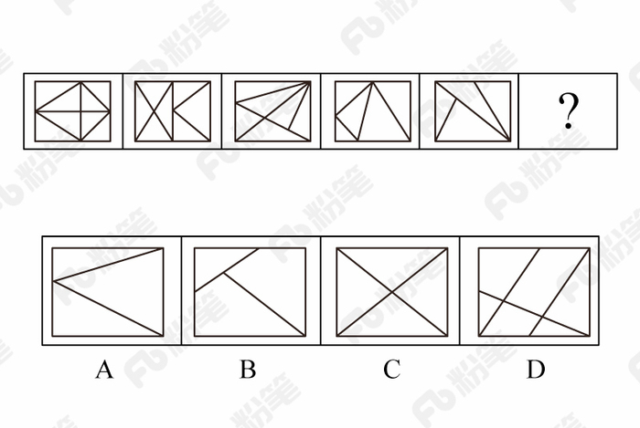
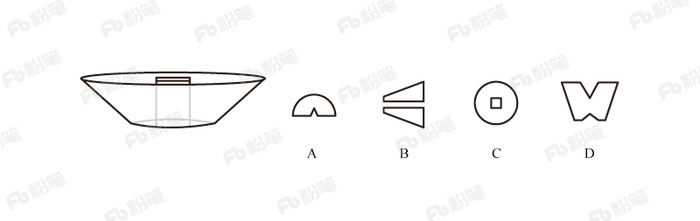
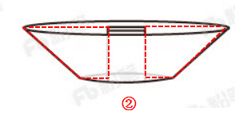
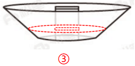

# 2018年421联考《行测》题（四川卷）（网友回忆版）

> 判断推理 · 30 题 · 四川 2018

## 第 1 题　qid 2188596 · 图形推理

从所给四个选项中，选出最合适的一个填入问号处，使之呈现一定规律性：

- **A**. A
- **B**. B　✅
- **C**. C
- **D**. D

**答案**：B

**官方解析**

元素组成不同，且无明显属性规律，优先考虑数量规律。观察题干发现，折线与直线相交，形成明显的“窟窿”，优先考虑数面。题干图形面数量依次为：1、2、3、4，故？处为5个面，C、D项为4个面，排除。对比A、B项，发现A项折线开口朝下，B项折线开口朝上，而题干图形折线开口朝向依次为：上、下、上、下，故？处开口朝上，B项当选。
故正确答案为B。

---

## 第 2 题　qid 2188599 · 图形推理

从所给四个选项中，选出最合适的一个填入问号处，使之呈现一定规律性：

- **A**. A　✅
- **B**. B
- **C**. C
- **D**. D

**答案**：A

**官方解析**

元素组成不同，且无明显属性规律，优先考虑数量规律。观察题干图形发现，“窟窿”较多，优先考虑数面。题干图形中面的数量依次为：8、7、6、5、4，故？处为3个面，排除C、D项。对比A、B项，发现面的形状不同，但题干图形中的面均是三角形，只有A项符合。
故正确答案为A。

---

## 第 3 题　qid 2188604 · 图形推理

从所给四个选项中，选出最合适的一个填入问号处，使之呈现一定规律性：

- **A**. A
- **B**. B
- **C**. C　✅
- **D**. D

**答案**：C

**官方解析**

元素组成相同，优先考虑位置规律。九宫格优先横行看，第一行黑块1在最外圈沿着顺时针的方向移动，黑块2在最外圈沿着逆时针的方向移动，灰块依次从右向左平移一格。第二行验证发现符合此规律。则？处黑块1应出现在第一行第二列，黑块2应出现在第二行第三列，灰块应出现在第三行第一列，只有C项符合。

故正确答案为C。

---

## 第 4 题　qid 2188609 · 图形推理

左图给定的是正方体纸盒的外表面，下面哪一项能由它折叠而成？

- **A**. A
- **B**. B
- **C**. C　✅
- **D**. D

**答案**：C

**官方解析**

本题考查六面体的空间重构。将题干展开图中的面依次标号，如下图：

A项：选项中的三个面分别是面a、面b（或面e）、面c，面a和面c中间相隔一个面，二者是相对面，相对面不能同时出现，排除；

B项：选项中的三个面分别是面b、面e、面d，面b和面e是“Z”字形的两端，二者是相对面，相对面不能同时出现，排除；

C项：与题干展开图一致，当选；

D项：选项中三个面分别是面a（或面c）、面d、面f，面d和面f中间相隔一个面，二者是相对面，相对面不能同时出现，排除。

故正确答案为C。

---

## 第 5 题　qid 2188612 · 图形推理

左图是从圆台中挖出一个截面为正方形的长方体形成的立体图形，如果从任一面切开，以下哪一个不可能是该立体图形的截面？

- **A**. A
- **B**. B
- **C**. C
- **D**. D　✅

**答案**：D

**官方解析**

A项：可从圆台的侧面切入，经过长方体，到圆台底，如图1所示即可切出，排除；

B项：在圆台正中间竖着切，如图2所示，排除；

C项：可沿水平方向切出，如图3所示，排除；

D项：不能切出，因为如果外侧要切出梯形，只能从中间竖着切，中间应是中空的，无法切出中间两个缺口，当选。

本题为选非题，故正确答案为D。 

---

## 第 6 题　qid 2188615 · 定义判断

间接正犯又称为间接实行犯，是指利用他人为道具而实施犯罪的实行行为，利用者通过支配被利用者的工具行为实现自己的犯罪意图。利用者与被利用者不构成共同犯罪。它包括以下两种情况：一是利用无刑事责任能力人犯罪；二是利用他人过失或不知情的行为犯罪。
根据上述定义，下列甲的行为属于间接正犯的是：

- **A**. 甲挑唆乙和丙的关系，致使乙一怒之下将丙打成重伤。甲、乙、丙均为完全刑事责任能力人
- **B**. 甲教唆精神病人乙用刀砍伤与其素有仇怨的丙。甲、丙为完全刑事责任能力人，乙为无刑事责任能力人　✅
- **C**. 甲派员工乙殴打一直欠钱不还的丙，并允诺给其好处，乙随后将丙打伤。甲、乙、丙均为完全刑事责任能力人
- **D**. 甲让自己尚未成年的孩子乙诬告丙，未想到乙捏造的事实正是丙客观存在的事实。甲、丙为完全刑事责任能力人，乙为无刑事责任能力人

**答案**：B

**官方解析**

第一步：找出定义关键词。
“利用他人为道具而实施犯罪的实行行为”、“利用者与被利用者不构成共同犯罪”、“两种情况：一是利用无刑事责任能力人犯罪；二是利用他人过失或不知情的行为犯罪”。
第二步：逐一分析选项。
A项：甲挑唆乙和丙的关系，致使乙将丙打伤，但甲、乙、丙均是完全刑事责任能力人，且乙知情，不符合“两种情况：一是利用无刑事责任能力人犯罪；二是利用他人过失或不知情的行为犯罪”中的任何一种，不符合定义，排除；
B项：甲教唆乙将丙砍伤，符合“利用他人为道具而实施犯罪的实行行为”,被利用的乙是无刑事责任能力人，符合“利用无刑事责任能力人犯罪”的情况，符合定义，当选；
C项：甲派乙殴打丙，乙是被利用者，但甲、乙、丙均是完全刑事责任能力人，且乙知情，不符合“两种情况：一是利用无刑事责任能力人犯罪；二是利用他人过失或不知情的行为犯罪”中的任何一种，不符合定义，排除；
D项：甲让自己的孩子乙诬告丙，乙虽然是无刑事责任能力人，但乙捏造的事实正是丙客观存在的，并非诬告，因此不符合“利用无刑事责任能力人犯罪”，不符合定义，排除。
故正确答案为B。

---

## 第 7 题　qid 2188477 · 定义判断

不征税收入是指专门从事特定目的，从性质和根源上不属于营利性活动带来的经济利益，不负有纳税义务并且不作为应纳税所得额组成部分的收入，比如财政拨款、行政事业性收费等；免税收入是纳税人应税收入的重要组成部分，只是国家为了实现某些经济和社会目标，在特定时期或对特定项目取得的经济利益给予的税收优惠照顾，而在一定时期又有可能恢复征税的收入。
根据上述定义，下列说法错误的是：

- **A**. 为鼓励高新技术企业自主创新，政府规定，在近两年内对这类企业研发产品的销售收入暂不收税，因此企业在研发产品上的销售收入属于免税收入
- **B**. 某农产品企业获得了当地政府对农业加工产品的专项财政补贴，该补贴属于不征税收入
- **C**. 国家规定，企业技术转让所得年净收入在30万元以下的，暂免征收所得税，因此这部分所得属于免税收入
- **D**. 为鼓励纳税人积极购买国债，国家规定国债所得利息收入暂不计入应纳税所得额，不征收企业所得税，因此国债利息收入属于不征税收入　✅

**答案**：D

**官方解析**

第一步：找出定义关键词。
不征税收入：“专门从事特定目的”、“从性质和根源上不属于营利性活动带来的经济利益” 、“不负有纳税义务并且不作为应纳税所得额组成部分的收入”。
免税收入：“国家为了实现某些经济和社会目标”、“在特定时期或对特定项目取得的经济利益给予的税收优惠照顾”、“而在一定时期又有可能恢复征税的收入”。
第二步：逐一分析选项。
A项：为鼓励高新技术企业自主创新，符合“国家为了实现某些经济和社会目标”，在近两年内对这类企业研发产品的销售收入暂不收税，符合“在特定时期或对特定项目取得的经济利益给予的税收优惠照顾”，符合“免税收入”定义，排除； 
B项：某农产品企业，符合“专门从事特定目的”，获得了当地政府专项财政补贴，符合“从性质和根源上不属于营利性活动带来的经济利益”，符合“不征税收入”定义，排除；
C项：企业技术转让所得年净收入暂免征收所得税，符合“在特定时期或对特定项目取得的经济利益给予的税收优惠照顾”和“而在一定时期又有可能恢复征税的收入”，符合“免税收入”定义，排除；
D项：为鼓励纳税人积极购买国债，符合“国家为了实现某些经济和社会目标”，规定国债所得利息收入暂不计入应纳税所得额，符合“在特定时期或对特定项目取得的经济利益给予的税收优惠照顾”和“而在一定时期又有可能恢复征税的收入”，符合“免税收入”定义，不符合“不征税收入”定义，错误，当选。
本题为选非题，故正确答案为D。

---

## 第 8 题　qid 2188620 · 定义判断

信息腐败指的是手中掌握有公共权力的人，借用自身的权力获得某些特殊信息，然后由自己或其代理人利用这些垄断信息从事某些牟利活动的一种违法乱纪行为。
根据上述定义，下列涉及信息腐败的是：

- **A**. 市政府某局干部为了个人升迁，贿赂有关人员，多次修改个人档案信息
- **B**. 某法学院教授为了将其负责的研究生班办成品牌，私自使用秘密窃取的某资格考试试卷对该班学生进行辅导
- **C**. 省科技厅王处长离职后到某公司就职，他将自己研究的某项技术加以创新，为该公司开发出极具市场竞争力的新产品
- **D**. 副区长龙某将工程招标报名情况、投标企业业绩要求、中标方式等秘密信息泄露给某投标企业，并收受该企业50余万元　✅

**答案**：D

**官方解析**

第一步：找出定义关键词。
“手中掌握有公权力的人”、“借用自身权利获得某些特殊信息，从事某些牟利活动”。
第二步：逐一分析选项。
A项：市政府某局干部贿赂有关人员改档案信息，并没有获得特殊信息，不符合“借用自身权力获得某些特殊信息，从事某些牟利活动”，不符合定义，排除； 
B项：某法学院教授是用窃取的试卷辅导学生，不符合“借用自身权力获得某些特殊信息，从事某些牟利活动”，不符合定义，排除；
C项：省科技厅王处长离职后将自己的技术创新，并没有利用权力获得信息，不符合“借用自身权力获得某些特殊信息，从事某些牟利活动”，不符合定义，排除；
D项：副区长将工程投标秘密信息泄露给投标企业，并获得50万余元，符合“借用自身权力获得某些特殊信息，从事某些牟利活动”，符合定义，当选。
故正确答案为D。

---

## 第 9 题　qid 2188476 · 定义判断

前摄抑制是指先学习的材料对识记和回忆后学习的材料所产生的干扰作用；倒摄抑制是指后学习的材料对识记和回忆先学习的材料所产生的干扰作用。
根据上述定义，下列选项只包含倒摄抑制的是：

- **A**. 背课文时发现中间段落往往是最难记住的
- **B**. 一天中，人们一般在早晨和夜晚的记忆效果最佳
- **C**. 学习英文字母后，之前学的拼音字母会读错　✅
- **D**. 头部受伤后，回忆不起来之前发生的事情

**答案**：C

**官方解析**

第一步：找出定义关键词。
前摄抑制：“先学习的材料对识记和回忆后学习的材料所产生的干扰作用”；
倒摄抑制：“后学习的材料对识记和回忆先学习的材料所产生的干扰作用”。
第二步：逐一分析选项。
A项：背课文中间段落最难记住，说明前面段落和后面段落都对中间段落产生了影响，即“先学习的材料”和“后学习的材料”分别对“对回忆后学习的材料产生了干扰作用”和“对回忆先学习的材料产生了干扰作用”，因此选项中既包含了前摄抑制，又包含了倒摄抑制，排除；
B项：早晨和夜晚的记忆效果最佳，只是说记忆效果的好坏，并不涉及学习材料，不包含倒摄抑制，排除；
C项：之前的拼音字母会读错，说明后学的英文字母对先学的拼音字母产生了影响，即“后学习的材料对识记和回忆先学习的材料所产生的干扰作用”，选项中只包含倒摄抑制，当选；
D项：由于头部受伤而导致回忆不起来之前的事情，没有提到“先、后学习的材料对识记和回忆后、先学习的材料所产生的干扰作用”，因此选项中既没有包含前摄抑制，也没有包含倒摄抑制，排除。
故正确答案为C。

---

## 第 10 题　qid 2188626 · 定义判断

趋同进化是遗传学中的一个概念，指的是不同的物种在进化过程中，由于适应相似的环境而呈现出表型上的相似性。而趋异进化则相反，它是指同一物种在进化过程中，由于适应不同的环境而呈现出表型差异的现象。
根据上述定义，下列属于趋异进化的是：

- **A**. 澳洲的袋食蚁兽与亚洲的穿山甲相比较，具有相似的生活方式和适于捕食白蚁的相似生理结构
- **B**. 鲸、海豚等和鱼类的亲缘关系很远，前者是哺乳类，后者是鱼类，但由于都在水域中生活，体形都很相似
- **C**. 欧亚大陆温带地区生活的鼹鼠、非洲南部的金毛鼹在分类上相距甚远，但它们的生存环境和生活方式相似，形态也相似
- **D**. 更新世时期，冰川将一群棕熊从主群中分了出来，在北极环境下发展成与环境颜色一致、善于捕猎的白色北极熊。北极熊食肉，而其他棕熊以植物为主要食物　✅

**答案**：D

**官方解析**

第一步：找出定义关键词。
趋同进化：“不同的物种在进化过程中”、“由于适应相似的环境而呈现出表型上的相似性”；
趋异进化：“同一物种在进化过程中”、“由于适应不同的环境而呈现出表型差异的现象”。
第二步：逐一分析选项。
A项：袋食蚁兽和穿山甲是不同的物种，符合“不同的物种在进化过程中”，具有相似的生活方式和适于捕食白蚁的相似生理结构，符合“由于适应相似的环境而呈现出表型上的相似性”，符合“趋同进化”定义，不符合“趋异进化”定义，排除；
B项：鲸、海豚等和鱼类亲缘关系很远，符合“不同的物种在进化过程中”，因为生活在水中而体形相似，符合“由于适应相似的环境而呈现出表型上的相似性”， 符合“趋同进化”定义，不符合“趋异进化”定义，排除；
C项：鼹鼠和金毛鼹分类相距甚远符合“不同的物种在进化过程中”，生存环境和生活方式相似，形态也相似符合“由于适应相似的环境而呈现出表型上的相似性”， 符合“趋同进化”定义，不符合“趋异进化”定义，排除；
D项：白色北极熊是从棕熊中分出来的，符合“同一物种在进化过程中”，北极熊在北极环境中发展成与环境颜色一致、善于捕猎的食肉白色北极熊，而其他棕熊以植物为主要食物，符合“由于适应不同的环境而呈现出表型差异的现象”，符合“趋异进化”定义，当选。
故正确答案为D。

---

## 第 11 题　qid 2188601 · 定义判断

经济文盲指的是被很多经济学名词弄得满头大汗不知其意的人们，他们的典型特色是容易盲从，专家说啥信啥，缺乏独立思考，即使专家说错了他们也会继续相信。
根据上述定义，下列涉及经济文盲的是：

- **A**. 某“专家”在其出版的书中宣扬“绿豆治百病大法”，引发市场绿豆涨价
- **B**. 一天电视节目里某娱乐明星说低钠盐好处多，第二天一些超市的低钠盐被一抢而空
- **C**. 为了通过某资格考试，小王死记硬背了“边际效益”等很多经济学名词，但是他并没有发现复习资料中其实有很多错误
- **D**. 小王被《重金属攻略》一书中的“浮动盈亏”等概念弄糊涂了，但是看到书中宣传的重金属盈利前景，还是迅速参与了交易　✅

**答案**：D

**官方解析**

第一步：找出定义关键词。
“被经济学名词弄得满头大汗”、“容易盲从”、“专家说啥信啥”、“缺乏独立思考，盲目跟从”。
第二步：逐一分析选项。
A项：绿豆治百病大法是一种民间食疗方法，不是经济学名词，不符合定义，排除；
B项：低钠盐好处多是指低钠盐对人体的好处，不是经济学名词，不符合定义，排除；
C项：“边际效益”是经济学名词，小王是为了通过考试而死记硬背这些经济学名词，而不是盲目跟从专家说法，不符合定义，排除；
D项：《重金属攻略》一书中的“浮动盈亏”是经济学名词，小王被“浮动盈亏”等概念弄糊涂了，符合“被经济学名词弄得满头大汗”。看到书中宣传的重金属的盈利前景就马上参与交易，符合“缺乏独立思考，盲目跟从”，符合定义，当选。
故正确答案为D。

---

## 第 12 题　qid 2188605 · 定义判断

拟态环境指由大众传播活动形成的信息环境，它不是客观环境的镜子式再现，而是大众传播媒介通过对新闻和信息的选择、加工和报道，重新加以结构化以后向人们所提示的环境。
根据上述定义，下列不涉及拟态环境的是：

- **A**. 小刘在某报看到一篇文章宣传某农产品的多种养生功能，他对此深信不疑
- **B**. 受某产品广告语“新一代的选择”的影响，年轻人非常认同且热衷于购买这一产品
- **C**. 小李在公司内网论坛上看到大家都说同事张某专业功底深厚，经观察他发现确实如此　✅
- **D**. 某微信公众号发布一则消息，称2016年1月1日起乘车不系安全带将罚200元，交警部门对此出面辟谣

**答案**：C

**官方解析**

第一步：找出定义关键词。
“由大众传播活动形成的信息环境”、“不是客观环境的镜子式再现”、“大众传播媒介通过对新闻和信息的选择、加工和报道”、“重新加以结构化”。
第二步：逐一分析选项。
A项：报纸是大众传播媒介，通过报纸对某农产品的多种养生功能进行报道，是将农产品的多种养生功能这些信息进行整合，重新加以结构化向人们展示，符合定义，排除； 
B项：广告是大众传播媒介，该产品的广告语“新一代的选择”是对该产品的加工报道，符合“大众传播媒介对信息进行选择、加工和报道”，符合定义，排除；
C项：公司内网论坛不是大众传播媒介，且“经观察他发现确实如此”说明张某专业功底深厚这个信息是客观存在的，不符合“不是客观环境的镜子式再现”，不符合定义，当选；
D项：微信公众号是大众传播媒介，通过公众号发布消息体现了“对信息进行报道”，交警部门出面辟谣说明此消息不是真的，说明公众号发布的消息与客观事实不符，符合“不是客观环境的镜子式再现”，符合定义，排除。
本题为选非题，故正确答案为C。

---

## 第 13 题　qid 2188607 · 类比推理

高血压：传染病

- **A**. 蝙蝠：哺乳动物
- **B**. 黄梅戏：京剧
- **C**. 鲫鱼：两栖动物　✅
- **D**. 计算机：电脑硬件

**答案**：C

**官方解析**

第一步：判断题干词语间逻辑关系。
高血压不是一种传染病，且高血压是一种疾病，传染病是一类疾病。
第二步：判断选项词语间逻辑关系。
A项：蝙蝠是一种哺乳动物，二者为种属关系，与题干逻辑关系不一致，排除；
B项：黄梅戏和京剧为并列关系，与题干逻辑关系不一致，排除；
C项：鲫鱼不是两栖动物，且鲫鱼是一种动物，两栖动物是一类动物，与题干逻辑关系一致，当选；
D项：电脑硬件是计算机的组成部分，二者为组成关系，与题干逻辑关系不一致，排除。
故正确答案为C。

---

## 第 14 题　qid 2188610 · 类比推理

软实力：硬实力

- **A**. 军事实力：经济实力
- **B**. 精神文明：物质文明　✅
- **C**. 现实主义：浪漫主义
- **D**. 心理健康：精神健康

**答案**：B

**官方解析**

第一步：判断题干词语间逻辑关系。
软实力和硬实力为矛盾关系。
第二步：判断选项词语间逻辑关系。
A项：军事实力和经济实力之外还有文化实力等，二者为反对关系，与题干逻辑关系不一致，排除；
B项：精神文明和物质文明为矛盾关系，与题干逻辑关系一致，当选；
C项：现实主义和浪漫主义之外还有古典主义等，二者为反对关系，与题干逻辑关系不一致，排除；
D项：有一种说法认为心理健康就是精神健康，二者为全同关系，也有一种说法认为心理健康和精神健康是交叉关系，但任何一种说法都不是矛盾关系，与题干逻辑关系不一致，排除。
故正确答案为B。

---

## 第 15 题　qid 2188611 · 类比推理

工作：职员：薪水

- **A**. 资费：网民：电邮
- **B**. 驾照：司机：汽车
- **C**. 考试：学生：成绩　✅
- **D**. 饭店：厨师：菜肴

**答案**：C

**官方解析**

第一步：判断题干词语间逻辑关系。
职员工作可以获得薪水，工作是职员的行为，薪水是工作的结果。
第二步：判断选项词语间逻辑关系。
A项：网民资费可以获得电邮，造句不通顺，与题干关系不一致，排除；
B项：司机驾照可以获得汽车，造句不通顺，与题干关系不一致，排除；
C项：学生考试可以获得成绩，考试是学生的行为，成绩是考试的结果，与题干关系一致，当选；
D项：厨师饭店可以获得菜肴，造句不通顺，与题干关系不一致，排除。
故正确答案为C。

---

## 第 16 题　qid 2188614 · 类比推理

生产：质检：销售

- **A**. 上学：预习：复习
- **B**. 调查：整理：分析　✅
- **C**. 监督：改进：效率
- **D**. 无业：贫困：救济

**答案**：B

**官方解析**

第一步：判断题干词语间逻辑关系。
先生产再质检最后销售，三者都是行为，且是时间先后顺序的对应关系。
第二步：判断选项词语间逻辑关系。
A项：先预习再复习，但上学与后两者不构成时间先后顺序的对应关系，与题干关系不一致，排除；
B项：先调查再整理最后分析，三者都是行为，且是时间先后顺序的对应关系，与题干关系一致，当选；
C项：效率不是行为，与前两者不构成时间先后顺序的对应关系，与题干关系不一致，排除；
D项：无业不是行为，与后两者不构成时间先后顺序的对应关系，与题干关系不一致，排除。
故正确答案为B。

---

## 第 17 题　qid 2188617 · 类比推理

房屋：不动产：抵押

- **A**. 股票：财产：增值
- **B**. 苹果：水果：食用　✅
- **C**. 轮船：海洋：行驶
- **D**. 中药：三七：抗血栓

**答案**：B

**官方解析**

第一步：判断题干词语间逻辑关系。
房屋是一种不动产，前两者为种属关系；抵押房屋，第三个词和第一个词是动宾结构。
第二步：判断选项词语间逻辑关系。
A项：股票是一种财产，前两者为种属关系；但是，股票增值，第三个词和第一个词是主谓结构，与题干逻辑关系不一致，排除；
B项：苹果是一种水果，前两者为种属关系；食用苹果，第三个词和第一个词是动宾结构，与题干逻辑关系一致，当选；
C项：轮船在海洋上航行，前两者为地点对应关系，与题干逻辑关系不一致，排除；
D项：三七是中药，前两者是种属关系，但是两词顺序与题干相反，与题干逻辑关系不一致，排除。
故正确答案为B。

---

## 第 18 题　qid 2188619 · 类比推理

扣子：西装：裤子

- **A**. 鼠标：电脑：键盘
- **B**. 学生：青年：艺术家
- **C**. 窗帘：窗户：房子
- **D**. 方向盘：轿车：商务车　✅

**答案**：D

**官方解析**

第一步：判断题干词语间逻辑关系。
扣子是西装和裤子的一部分，第一个词和后两个词是组成关系；有的西装是裤子，有的西装不是裤子，后两者为交叉关系。
第二步：判断选项词语间逻辑关系。
A项：鼠标与电脑配套使用，二者为对应关系，与题干逻辑关系不一致，排除；
B项：有的学生是青年，有的学生不是青年，二者为交叉关系，与题干逻辑关系不一致，排除；
C项：窗帘挂在窗户上，二者为对应关系，与题干逻辑关系不一致，排除；
D项：方向盘是轿车和商务车的一部分，第一个词和后两个词是组成关系；有的轿车是商务车，有的轿车不是商务车，二者为交叉关系，与题干逻辑关系一致，当选。
故正确答案为D。

---

## 第 19 题　qid 2188622 · 类比推理

常规问题：非常规问题：问题

- **A**. 期中考试：期末考试：考试
- **B**. 顶层设计：基层落实：管理
- **C**. 豪华装修：简单装修：装修
- **D**. 转基因油：非转基因油：油　✅

**答案**：D

**官方解析**

第一步：判断题干词语间逻辑关系。
常规问题与非常规问题都是问题的一种，前两词与第三词为种属关系，且前两词为并列关系中的矛盾关系。
第二步：判断选项词语间逻辑关系。
A项：期中考试与期末考试都是考试的一种，前两词与第三词为种属关系，但前两词为并列关系中的反对关系，考试除此之外还有周考和月考等，与题干逻辑关系不一致，排除； 
B项：顶层设计与基层落实都是管理的方式，前两词与第三词为种属关系，但前两词是并列关系中的反对关系，与题干逻辑关系不一致，排除；
C项：豪华装修与简单装修都是装修的一种，前两词与第三词为种属关系，但前两词是并列关系中的反对关系，除此之外还可以有中等装修等，与题干逻辑关系不一致，排除；
D项：转基因油与非转基因油都是油的一种，前两词与第三词为种属关系，且前两词为并列关系中的矛盾关系，与题干逻辑关系一致，当选。
故正确答案为D。

---

## 第 20 题　qid 2188625 · 类比推理

（    ） 对于 服装 相当于 雕琢 对于 （    ）

- **A**. 鞋帽 修饰
- **B**. 设计 图案
- **C**. 外表 心灵
- **D**. 裁剪 玉器　✅

**答案**：D

**官方解析**

逐一代入选项。
A项：鞋帽是一种服装，雕琢是一种修饰，二者均为种属关系，前后逻辑关系一致，保留；
B项：设计服装为动宾关系，雕琢和图案搭配不当，前后逻辑关系不一致，排除；
C项：服装会对外表产生影响，雕琢和心灵无明显逻辑关系，前后逻辑关系不一致，排除；
D项：裁剪服装为动宾关系，雕琢玉器为动宾关系，前后逻辑关系一致，保留。
对比A、D两项，A项，鞋帽、服装都是名词，雕琢、修饰都是动词，前后词性并不匹配；D项，裁、剪是近义关系，都是动词，雕、琢是近义关系，都是动词，且裁剪和雕琢都是去掉多余的部分，对比优选D项。
故正确答案为D。

---

## 第 21 题　qid 2188598 · 类比推理

石油 对于（  ）相当于 廉洁 对于 （  ）

- **A**. 煤炭  贪腐
- **B**. 能源  品德　✅
- **C**. 矿产  政府
- **D**. 原油  简朴

**答案**：B

**官方解析**

逐一代入选项。
A项：石油和煤炭是并列关系，廉洁和贪腐是反义关系，前后逻辑关系不一致，排除；
B项：石油是一种能源，廉洁是一种品德，二者均为种属关系，前后逻辑关系一致，当选；
C项：石油是一种矿产，廉洁是政府的属性，前后逻辑关系不一致，排除；
D项：未经加工处理的石油称为原油，廉洁和简朴无明显逻辑关系，前后逻辑关系不一致，排除。
故正确答案为B。

---

## 第 22 题　qid 2188602 · 类比推理

（  ）对于 风景 相当于 美丽 对于（  ）

- **A**. 秀丽  动人
- **B**. 画卷  人生
- **C**. 怡人  心灵　✅
- **D**. 如画  如花

**答案**：C

**官方解析**

第一步：逐一代入选项。
A项：秀丽的风景，二者为偏正结构，美丽和动人为近义关系，前后逻辑关系不一致，排除；
B项：画卷里可能有风景，二者为或然组成关系，美丽的人生，二者为偏正结构，前后逻辑关系不一致，排除；
C项：怡人的风景，美丽的心灵，二者均为偏正结构，前后逻辑关系一致，当选；
D项：风景如画，美丽如花，但后两词顺序与前两词相反，前后逻辑关系不一致，排除。
故正确答案为C。

---

## 第 23 题　qid 2188603 · 逻辑判断

心理学家研究发现，一般情况下学生的注意力随着老师讲课时间的变化而变化。讲课开始时，学生的注意力逐步增强，中间有一段时间保持在较为理想的状态，随后学生的注意力开始分散。
以下哪项如果为真，最能削弱上述结论？

- **A**. 老师经过适当安排能够获得足够注意力　✅
- **B**. 总有个别学生能够全程保持注意力集中
- **C**. 兴趣是影响注意力能否集中的关键因素
- **D**. 人能完全集中注意力的时间只有七秒钟

**答案**：A

**官方解析**

第一步：找出论点和论据。
论点：一般情况下学生的注意力随着老师讲课时间的变化而变化。
论据：讲课开始时，学生的注意力逐步增强，中间有一段时间保持在较为理想的状态，随后学生的注意力开始分散。
第二步：逐一分析选项。
A项：老师能够获得足够注意力，说明学生的注意力不会随着老师讲课时间的变化而变化，否定了论点，当选；
B项：论点说的是一般情况，因此选项中个别学生的情况是无法削弱的，排除；
C项：论点说的是学生的注意力随着老师讲课时间的变化而变化，该项说的是兴趣是影响注意力能否集中的关键因素，兴趣是关键因素也不代表时间不会影响注意力，无法削弱，排除；
D项：论点说的是学生的注意力随着老师讲课时间的变化而变化，该项说的是人能完全集中注意力的时间短，不能说明注意力是否会随着时间变化而变化，无法削弱，排除。
故正确答案为A。

---

## 第 24 题　qid 2188606 · 逻辑判断

在大量的信息中容易迷失是人性的弱点。那些不管是有用的还是没用的，全都想要收集到的完美主义者，是不能很好地分析信息的。克服这一点的关键就是，养成明确的“目标意识”，尽可能瞄准自己想要的信息收集。为了防止主观臆断和先入为主，必须把信息的收集和判断这两个工作分开，如果信息的数量庞大，就要进行两次乃至多次的检验。
由此可以推出：

- **A**. 不能很好地分析信息的人都是完美主义者
- **B**. 养成明确的“目标意识”，才不容易在大量的信息中迷失　✅
- **C**. 把信息的收集和判断这两个工作分开，就能够防止主观臆断
- **D**. 如果信息的数量不大，就不需要进行两次乃至多次的检验

**答案**：B

**官方解析**

第一步：翻译题干。

①全都想要收集到的完美主义者不能很好地分析信息；

②不容易在大量的信息中迷失养成明确的“目标意识”；

③防止主观臆断和先入为主把信息的收集和判断这两个工作分开；

④信息的数量庞大两次乃至多次的检验。

第二步：逐一分析选项。

A项：翻译为不能很好地分析信息的人完美主义者，是对①的肯后，但肯后无法得到确定结论，排除；

B项：翻译为不容易在大量的信息中迷失养成明确的“目标意识”，是对②的肯前，肯前必肯后，当选；

C项：翻译为把信息的收集和判断这两个工作分开能够防止主观臆断，是对③的肯后，但肯后无法得到确定结论，排除；

D项：翻译为信息的数量不大两次乃至多次的检验，是对④的否前，但否前无法得到确定结论，排除。

故正确答案为B。

---

## 第 25 题　qid 2188608 · 逻辑判断

婴儿的幼年特征可以唤起成年人的慈爱和养育之心，许多动物的外形和行为具有人类婴儿的特征。因此，人们容易被这样的动物所吸引，将它们养成宠物。
以下哪项如果为真，最能支持上述结论？

- **A**. 很多空巢老人喜欢饲养宠物
- **B**. 体态庞大且凶猛的动物很少成为宠物　✅
- **C**. 有的家庭在生育儿女后就不会再养宠物
- **D**. 父母喜欢养宠物的，子女也喜欢养宠物

**答案**：B

**官方解析**

第一步：找出论点和论据。
论点：人们容易被这样的动物所吸引，将它们养成宠物。
论据：婴儿的幼年特征可以唤起成年人的慈爱和养育之心，许多动物的外形和行为具有人类婴儿的特征。
第二步：逐一分析选项。
A项：该项说的是很多空巢老人喜欢饲养宠物，但宠物的外形和行为是否具有人类婴儿特征不明确，无法加强，排除；
B项：该项说的是体态庞大且凶猛的动物很少成为宠物，说明人们更喜欢养体态较小且无害的动物，具有婴儿的特征，补充论据，当选；
C项：论点说的是人们容易被外形和行为具有人类婴儿特征的动物所吸引，将它们养成宠物，该项说的是有的家庭在生育儿女后就不会再养宠物，话题不一致，无法加强，排除；
D项：论点说的是人们容易被外形和行为具有人类婴儿特征的动物所吸引，将它们养成宠物，该项说的是父母喜欢养宠物的，子女也喜欢养宠物，话题不一致，无法加强，排除。
故正确答案为B。

---

## 第 26 题　qid 2188613 · 逻辑判断

某研究小组汇集了140多种非人类灵长类动物脑量数据，以研究灵长类动物大脑体积比其他脊椎动物大得多的原因。在研究中，研究人员不仅考虑了灵长类动物的社会化因素，如种群规模、社会体系、交配系统等，还研究了它们的饮食习性，即它们是食叶、食果，抑或属于杂食动物。研究人员据此认为，饮食习性是灵长类动物大脑体积大的主要原因。
以下哪项如果为真，最能支持上述结论？

- **A**. 灵长类动物的饮食习性对其体型发育有重要影响
- **B**. 以往人们普遍接受的社会因素决定灵长类动物大脑体积的观点只是一种假说
- **C**. 研究结果并没有显示出在同种灵长类动物中，水果或树叶摄入量与大脑体积之间存在联系
- **D**. 在这140多种灵长类动物中，食果类动物的大脑体积，要明显大于食叶动物；杂食动物的大脑体积，也要大于食叶动物　✅

**答案**：D

**官方解析**

第一步：找出论点和论据。
论点：饮食习性是灵长类动物大脑体积大的主要原因。
论据：研究人员不仅考虑了灵长类动物的社会化因素，如种群规模、社会体系、交配系统等，还研究了它们的饮食习性，即它们是食叶、食果，抑或属于杂食动物。
第二步：逐一分析选项。
A项：论点说的是饮食习性是灵长类动物大脑体积大的主要原因，该项说的是饮食习性对灵长类动物的体型发育有重要影响，话题不一致，无关选项，无法加强，排除；
B项：该项说的是社会因素决定灵长类动物大脑体积的观点只是一种假说，假说本身就不一定成立，无法加强，排除；
C项：该项说明同种灵长类动物中，水果或树叶摄入量与大脑体积之间不存在联系，能削弱，无法加强，排除；
D项：该项说明不同饮食习性的灵长类动物大脑体积大小不同，补充论据，当选。
故正确答案为D。

---

## 第 27 题　qid 2188616 · 逻辑判断

近日，有动物实验研究发现，在正常饮食中加入一定剂量的苦瓜水提取物，可降低Ⅱ型糖尿病小鼠的高血糖。这是由于苦瓜中含有一种类似胰岛素的物质，能够降低血糖。有人据此认为，Ⅱ型糖尿病患者多吃苦瓜有助于降低血糖水平。
以下哪项如果为真，最能质疑上述论证？

- **A**. 苦瓜含糖量低，对血糖的影响小
- **B**. 日常食用的苦瓜中，苦瓜水提取物含量极少　✅
- **C**. 苦瓜水提取物可能会导致血清总蛋白轻微降低
- **D**. 苦瓜水提取物对Ⅰ型糖尿病小鼠的血糖无显著影响

**答案**：B

**官方解析**

第一步：找出论点和论据。
论点：Ⅱ型糖尿病患者多吃苦瓜有助于降低血糖水平。
论据：近日，有动物实验研究发现，在正常饮食中加入一定剂量的苦瓜水提取物，可降低Ⅱ型糖尿病小鼠的高血糖，这是由于苦瓜中含有一种类似胰岛素的物质，能够降低血糖。
第二步：逐一分析选项。
A项：论点讨论的是多吃苦瓜有助于降低血糖水平，该项讨论的是苦瓜含糖量低对血糖的影响小，但是否能够降低血糖不明确，属于不明确项，无法削弱，排除；
B项：论点讨论的是多吃苦瓜有助于降低血糖水平，原因是苦瓜水提取物中类似胰岛素的物质能够降低血糖，该项说日常食用的苦瓜中苦瓜提取物含量极少，即不能通过日常食用苦瓜取得降低血糖的效果，断开了论点和论据之间的联系，属于拆桥项，可以削弱，当选；
C项：题干讨论的是苦瓜水中的类似胰岛素的物质是否有助于降低血糖，该项讨论的是苦瓜水是否会导致血清总蛋白降低，话题不一致，无关项，无法削弱，排除；
D项：题干是通过用Ⅱ型糖尿病小鼠做实验，得出苦瓜是否有助于Ⅱ型糖尿病患者降低血糖的结论，该项讨论的是苦瓜水提取物是否对Ⅰ型糖尿病小鼠有影响，主体不一致，无关项，无法削弱，排除。
故正确答案为B。

---

## 第 28 题　qid 2188621 · 逻辑判断

近年来，一种儿童天赋基因检测在家长圈里流行起来。提供这种检测的公司声称，他们通过唾液获取儿童的基因，就能分析出儿童具有哪些“特长”，如音乐天赋、数学天赋、交际能力、长跑能力、抗压能力等，不少家长纷纷花高价为孩子做了这种检测，他们认为通过这种检测，可以有的放矢地去开发儿童的天赋和潜能，不再需要通过尝试过多的兴趣班来挖掘儿童的特长。
以下哪项如果为真，最能削弱上述家长的观点？

- **A**. 有些教师也可以根据自身的经验有的放矢地开发儿童的天赋和潜能
- **B**. 相比于儿童天赋基因检测，肥胖基因、癌症基因检测具有更强的科学依据
- **C**. 天赋是多基因共同调控的结果，目前很难准确地界定哪些基因对哪些天赋有影响　✅
- **D**. 有的商家按全基因组检测收费，但只做单一或者某几个基因的检测，家长们很难区分出来

**答案**：C

**官方解析**

第一步：找出论点和论据。
论点：通过这种检测，可以有的放矢地去开发儿童的天赋和潜能，不再需要通过尝试过多的兴趣班来挖掘儿童的特长。
论据：通过唾液获取儿童的基因，就能分析出儿童具有哪些“特长”，如音乐天赋、数学天赋、交际能力、长跑能力、抗压能力等。
第二步：逐一分析选项。
A项：题干讨论的是能否通过检测基因开发儿童的天赋和潜能，该项讨论的是有些教师可以根据经验开发儿童的天赋和潜能，话题不一致，无关选项，无法削弱，排除；
B项：题干讨论的是能否通过检测基因开发儿童的天赋和潜能，该项讨论的是肥胖基因、癌症基因比儿童天赋基因检测更具科学依据，但儿童基因检测是否有科学依据不清楚，属于不明确项，无法削弱，排除；
C项：论据讨论的是能通过检测基因分析出儿童的具有哪些天赋，该项说的是很难界定哪些基因对天赋有影响，削弱论据，当选；
D项：题干讨论的是能否通过检测基因开发儿童的天赋和潜能，该项讨论的是家长难以区分商家是否做了全组检测，话题不一致，无关选项，无法削弱，排除。
故正确答案为C。

---

## 第 29 题　qid 2188623 · 逻辑判断

一个人如果是智者，那么他一定是一位谦虚的人；而一个人只有认识到自己的不足，他才会谦虚。但是，如果一个人听不进别人的意见，那么他就不会认识到自己的不足。
由此可以推出：

- **A**. 一个人如果认识到自己的不足，他就是一位智者
- **B**. 一个人如果听不进别人的意见，他就不是一位智者　✅
- **C**. 一个人如果听得进别人的意见，他就会认识到自己的不足
- **D**. 一个人如果认识不到自己的不足，他一定听不进别人的意见

**答案**：B

**官方解析**

第一步：翻译题干。
①智者→谦虚
②谦虚→ 认识到自己的不足
③听不进别人的意见 →－认识到自己的不足
将①②以及③的逆否递推出：④智者→谦虚→ 认识到自己的不足→－ 听不进别人的意见
第二步：逐一分析选项。
A项：翻译为认识到自己的不足 →智者，是对④的肯后，但肯后得不到确定性的结论，排除；
B项：翻译为听不进别人的意见→－智者，是对④的否后，否后必否前，当选；
C项：翻译为听得进别人的意见→ 认识到自己的不足，是对③的否前，但否前得不到确定性的结论，排除；
D项：翻译为-认识到自己的不足 →听不进别人的意见，是对③的肯后，但肯后得不到确定性的结论，排除。
故正确答案为B。

---

## 第 30 题　qid 2188627 · 逻辑判断

高校食堂某窗口前有张明、李伟、王刚、赵曼、钱强5人在排队买菜。每人只买一份菜。已知：
(1)要买红烧肉的人排在张明后面；
(2)李伟紧排在要买芹菜炒香干的人前面；
(3)王刚虽然排在队伍的第2位，但他还不知道要买什么；
(4)赵曼一向吃素，今天她来得有点晚，排在了队伍的最后。
由此可以推出：

- **A**. 李伟排在队伍的正中间位置
- **B**. 钱强排在队伍的正中间位置
- **C**. 李伟不可能排在队伍的最前面　✅
- **D**. 张明不可能排在队伍的最前面

**答案**：C

**官方解析**

由条件（2）李伟紧排在要买芹菜炒香干的人前面，可知：紧排在李伟后面的人知道自己要买什么；结合条件（3）王刚虽然排在队伍的第2位，但他还不知道要买什么，可知：李伟不可能排在王刚的前面，即李伟不可能排在队伍的最前面，对应C项。
故正确答案为C。

---
