# 2018年421联考《行测》题（山东卷）（网友回忆版）

> 判断推理 · 40 题 · 山东 2018

## 第 1 题　qid 2187820 · 图形推理

从所给的四个选项中，选择最合适的一个填入问号处，使之呈现一定的规律性：

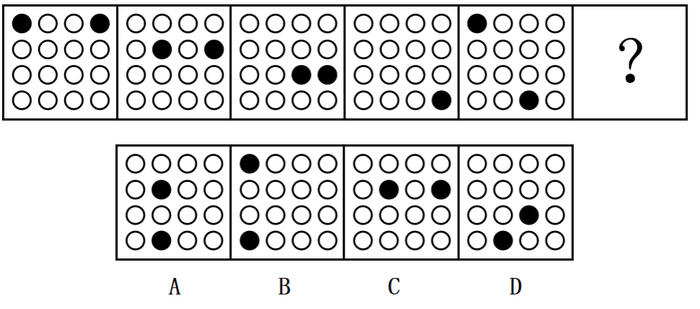

- **A**. A　✅
- **B**. B
- **C**. C
- **D**. D

**答案**：A

**官方解析**

元素组成相同，优先考虑位置规律。如下图所示，1号黑球沿着对角线向右下方循环移动，每次移动1格；2号黑球沿图形外圈移动，每次顺时针移动1格。故？处的1号黑球应该移动到第2行第2列的位置，2号黑球应该移动到第4行第2列的位置。只有A项符合。

故正确答案为A。

---

## 第 2 题　qid 2187832 · 图形推理

从所给的四个选项中，选择最合适的一个填入问号处，使之呈现一定的规律性：

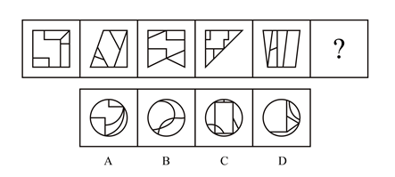

- **A**. A　✅
- **B**. B
- **C**. C
- **D**. D

**答案**：A

**官方解析**

元素组成不同，且无明显属性规律，优先考虑数量规律。观察题干图形发现，图“窟窿”较多，优先考虑数面。题干五幅图形均有5个面，则？处也应该为5个面，C项为9个面，排除。再观察发现，题干每幅图形均有面积最大的图形，且面积最大的图形均为中心对称图形，只有A项符合。
故正确答案为A。

---

## 第 3 题　qid 2187836 · 图形推理

从所给的四个选项中，选择最合适的一个填入问号处，使之呈现一定的规律性：

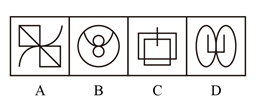

- **A**. A
- **B**. B
- **C**. C
- **D**. D　✅

**答案**：D

**官方解析**

元素组成不同，优先考虑属性规律。九宫格图形优先看横行，第一行为全直线图形，第二行为全曲线图形，第三行的图2和图3均为直曲图形，则？处也应为直曲图形，排除B、C项。继续观察发现，题干所有图形均为封闭图形，只有D项符合。

故正确答案为D。

---

## 第 4 题　qid 2187841 · 图形推理

从所给的四个选项中，选择最合适的一个填入问号处，使之呈现一定的规律性：

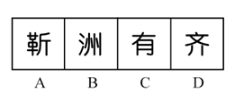

- **A**. A
- **B**. B
- **C**. C　✅
- **D**. D

**答案**：C

**官方解析**

元素组成不同，且无明显属性规律，优先考虑数量规律。观察发现，第二行的“兄”和第三行的“侣”均出现了明显的封闭面，优先考虑数面。观察题干图形，第一行的三个图形都是0个面，第二行的三个图形都有1个面，第三行后两个图形都有2个面，故？处的图形也应有2个面。四个选项中，A有3个，B有0个，C有2个，D有1个。
故正确答案为C。

---

## 第 5 题　qid 2187846 · 图形推理

把下面的六个图形分为两类，使每一类图形都有各自的共同特征或规律，分类正确的一项是：

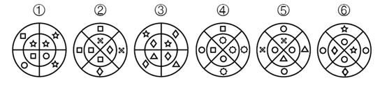

- **A**. ①④⑥，②③⑤
- **B**. ①③④，②⑤⑥
- **C**. ①②④，③⑤⑥　✅
- **D**. ①④⑤，②③⑥

**答案**：C

**官方解析**

解法一：元素组成不同，且无明显属性规律，考虑数量规律。观察发现每个图形均分为内外两圈，并且图形中出现了很多小元素，优先考虑数素，但元素种类、个数均无规律。再观察发现图形的内圈、外圈均有形状相同的小元素，并且①②④的内圈、外圈中形状相同的小元素都是相邻的，③⑤⑥的内圈、外圈中形状相同的小元素都是相对的。
故正确答案为C。
解法二：元素组成不同，且无明显属性规律，考虑数量规律。观察发现每个图形均分为内外两圈，并且图形中出现了很多小元素，优先考虑数素，但元素种类、个数均无规律。继续观察发现图形的内圈与外圈小元素完全相同，并且①②④的外圈是内圈顺时针旋转一格形成的，③⑤⑥的外圈是内圈逆时针旋转一格形成的。
故正确答案为C。

---

## 第 6 题　qid 2187814 · 图形推理

把下面的六个图形分为两类，使每一类图形都有各自的共同特征或规律，分类正确的一项是：

- **A**. ①④⑥，②③⑤　✅
- **B**. ①②③，④⑤⑥
- **C**. ①③④，②⑤⑥
- **D**. ①③⑤，②④⑥

**答案**：A

**官方解析**

元素组成不同，优先考虑属性规律。观察发现，图形中出现多个类似箭头的图形，如图⑤和图⑥，并且其他图形都很规整，优先考虑对称性。观察题干发现①④⑥为，②③⑤只是轴对称图形。

故正确答案为A。

---

## 第 7 题　qid 2187823 · 图形推理

把下面的六个图形分为两类，使每一类图形都有各自的共同特征或规律，分类正确的一项是：

- **A**. ①②⑥，③④⑤　✅
- **B**. ①④⑤，②③⑥
- **C**. ①④⑥，②③⑤
- **D**. ①②⑤，③④⑥

**答案**：A

**官方解析**

本题为分组分类题目。元素组成不同，无明显属性规律，优先考虑数量规律。观察发现，图形线与线相交明显，优先考虑数交点，但整体数交点无规律。再观察发现每幅图都有外框，考虑分开数内外交点。图1至图6外部交点数分别为：5、6、5、5、8、4，内部交点数分别为：5、6、1、1、4、4，单独看内部和外部交点数无规律，考虑内外交点运算。图①②⑥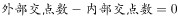，图③④⑤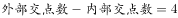。即①②⑥为一组，③④⑤为一组。

故正确答案为A。

---

## 第 8 题　qid 2187830 · 图形推理

左边给定的是纸盒的外表面，下面哪一项能由它折叠而成？

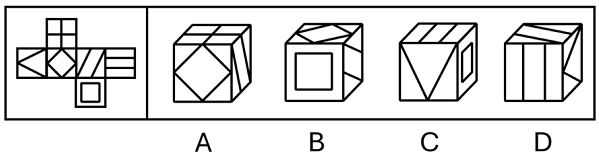

- **A**. A
- **B**. B　✅
- **C**. C
- **D**. D

**答案**：B

**官方解析**

将题干展开图标上序号，如下图所示，逐一进行分析。

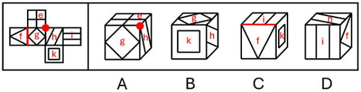

A项：选项由面e、面g和面h构成，选项中三个面的公共点处引出1条线，题干中三个面的公共点处没有引出线条，选项与题干展开图不一致，排除；

B项：选项由面g、面h和面k构成，选项与题干展开图一致，当选；

C项：选项由面f、面i和面k构成，选项面f中大三角形的底边挨着面i，题干面f中大三角形的底边挨着面g，选项与题干展开图不一致，排除；

D项：选项由面f、面h和面i构成，其中面f和面h为相对面，不可能同时出现，选项与题干展开图不一致，排除。

故正确答案为B。

---

## 第 9 题　qid 2187837 · 图形推理

下面四个选项中，符合左边立体图形的俯视图和左视图的是：

- **A**. A
- **B**. B　✅
- **C**. C
- **D**. D

**答案**：B

**官方解析**

本题考查三视图。俯视图是从物体的上面向下面看得到的视图，题干的俯视图中间应该有2条竖线，排除A、D项；左视图是从物体的左面向右面看得到的视图，中间没有横线，排除C项。
故正确答案为B。

---

## 第 10 题　qid 2187842 · 图形推理

下图和哪个选项一起可以拼接成一个封闭立体图形？

- **A**. A
- **B**. B
- **C**. C
- **D**. D　✅

**答案**：D

**官方解析**

本题为空间重构题，如下图分别标记1、2。

由成直角的两条边是公共边可知，要想与题干一起折成封闭立体图形，需要1和2区域标红线的两部分均相互垂直且等长。A项1、2部分均不等长，B项第2部分不等长，C项第1部分不等长，只有D项满足。

故正确答案为D。

---

## 第 11 题　qid 2187810 · 定义判断

化感作用是指一种植物通过向环境释放化学物质而对该种植物或周围植物（包括微生物）所产生的直接或间接的作用。
根据上述定义，下列不属于化感作用的是：

- **A**. 在人参上喷洒的农药被土壤吸收后，会杀死土壤中的硝化细菌和氨化细菌　✅
- **B**. 胡桃树的叶、皮会释放葡萄糖代胡桃醌从而杀死胡桃树下的植物
- **C**. 桉树叶中分泌出来的酚类物质被雨水冲刷下来后对附近亚麻的生长有抑制作用
- **D**. 黑麦残株经微生物分解后产生羟基肟酸，影响自身的生长发育

**答案**：A

**官方解析**

第一步：找出定义关键词。
“一种植物通过向环境释放化学物质”、“对该种植物或周围植物（包括微生物）所产生的直接或间接的作用”。
第二步：逐一分析选项。
A项：在人参上喷洒的农药，农药并不是人参释放出来的，不符合“一种植物通过向环境释放化学物质”，不符合定义，当选；
B项：胡桃树的叶、皮释放葡萄糖代胡桃醌，符合“一种植物通过向环境释放化学物质”，杀死胡桃树下的植物，符合“对该种植物或周围植物（包括微生物）所产生的直接或间接的作用”，符合定义，排除；
C项：桉树叶分泌出来的酚类物质，符合“一种植物通过向环境释放化学物质”，对附近的亚麻的生长有抑制作用，符合“对该种植物或周围植物（包括微生物）所产生的直接或间接的作用”，符合定义，排除；
D项：黑麦残株被分解后产生羟基肟酸，符合“一种植物通过向环境释放化学物质”，影响自身的生长发育，符合“对该种植物或周围植物（包括微生物）所产生的直接或间接的作用”，符合定义，排除。
本题为选非题，故正确答案为A。

---

## 第 12 题　qid 2187816 · 定义判断

合义务的择一举动是指虽然行为人实施了违法行为，造成了结果，但即使其遵守法律，也不能避免该结果的情形。
根据上述定义，下列属于合义务的择一举动的是：

- **A**. 甲驾车正常行驶，行人王某从人行道上猛然冲向甲，结果王某被撞伤
- **B**. 乙醉酒后驾车，行人王某同样喝醉了酒，从人行道上猛然冲向乙，结果王某被撞伤　✅
- **C**. 丙驾车超速行驶，行人王某横穿马路，丙来不及刹车，将王某撞伤
- **D**. 丁驾车超载行驶，行人王某横穿马路，幸而丁紧急刹车，才没有撞到王某

**答案**：B

**官方解析**

第一步：找出定义关键词。
“行为人实施了违法行为，造成了结果”、“即使其遵守法律，也不能避免该结果的情形”。
第二步：逐一分析选项。
A项：甲驾车正常行驶，王某猛然冲出被撞伤，不符合“行为人实施了违法行为”，不符合定义，排除；
B项：乙酒后驾车将王某撞伤，符合“行为人实施了违法行为，造成了结果”，但如果乙没有酒后驾车，也不能避免该结果的情形，因为行人王某同样喝醉了酒并且冲向乙，符合“即使其遵守法律，也不能避免该结果的情形”，符合定义，当选；
C项：丙驾车超速行驶将王某撞伤，符合“行为人实施了违法行为，造成了结果”，但如果丙遵守法律不超速驾驶，就可以及时刹车，从而避免该结果出现，不符合“但即使其遵守法律，也不能避免该结果的情形”，不符合定义，排除；
D项：丁驾车超载行驶是违法行为，但是没有造成结果，不符合定义，排除。
故正确答案为B。

---

## 第 13 题　qid 2187821 · 定义判断

认知失调是一个人在做出决定、采取行动或者接触到一些有违原先信念，情感或价值的信念后所体验到的冲突状态。当人们感到认知失调时，不协调的存在感将推动人们去努力减少不协调，除设法调整自身的行为或改变自己的态度外，人们还可以主动避开那些很可能使不协调增加的情境内外因素和信息因素。
根据上述定义，下列反映认知失调的是：

- **A**. 小明参与了一个很无聊的活动，从中得到了很少的报酬
- **B**. 推销员说服小红用相对高的价格买了自己不是很需要的厨具，几天后小红觉得自己非常喜欢这套厨具　✅
- **C**. 小王因为考试没考好被爸爸批评了，他回到自己房间后认真思考了原因，决定以后更加努力学习
- **D**. 勤奋的小宇参加了很多课外班，这导致每次练习钢琴都会迟到，他对钢琴老师表示非常抱歉

**答案**：B

**官方解析**

第一步：找出定义关键词。
“做出决定、采取行动或者接触到一些有违原先信念，情感或价值的信念后所体验到的冲突状态”、“不协调的存在感将推动人们去努力减少不协调”。
第二步：逐一分析选项。
A项：小明参与无聊的活动，得到少的报酬，没有体现“体验到的冲突状态”，不符合定义，排除； 
B项：小红用相对较高价格买了自己不是很需要的厨具，高价购买但并不需要，符合“体验到的冲突状态”，几天后觉得非常喜欢，符合“不协调的存在感将推动人们去努力减少不协调”，符合定义，当选；
C项：小王没考好被爸爸批评，没有体现“体验到的冲突状态”，不符合定义，排除；
D项：小宇参加了很多课外班导致钢琴课迟到，没有体现“体验到的冲突状态”，不符合定义，排除。
故正确答案为B。

---

## 第 14 题　qid 2187828 · 定义判断

战略性新兴产业是以重大技术突破和重大发展需求为基础，对经济社会全局和长远发展具有重大引领带动作用，知识技术密集、物质资源消耗少、成长潜力大的产业。
根据上述定义，下列不属于战略性新兴产业的是：

- **A**. 食品加工业　✅
- **B**. 节能环保产业
- **C**. 信息产业
- **D**. 新材料产业

**答案**：A

**官方解析**

第一步：找出定义关键词。
“以重大技术突破和重大发展需求为基础” 、“知识技术密集、物质资源消耗少、成长潜力大”。
第二步：逐一分析选项。
A项：食品加工业不是新兴产业，也不符合“以重大技术突破和重大发展需求为基础”，不符合定义，当选； 
B项：节能环保产业是为节约能源资源、发展循环经济、保护环境提供技术基础和装备保障的产业，是战略性新兴产业，符合定义，排除；
C项：信息产业是专门生产、收集、整理、传递信息，并制造各种信息设备的工业，是战略性新兴产业，符合定义，排除；
D项：新材料产业包括新材料及其相关产品和技术装备，是战略性新兴产业，符合定义，排除。
本题为选非题，故正确答案为A。

---

## 第 15 题　qid 2187844 · 定义判断

集合体是指由一定数量的同类个体组成的统一整体，组成集合体的个体通常并不必然具有该集合体的所有属性。集合概念是指以集合体为反映对象的概念。
根据上述定义，下列用黑体字显示的概念属于集合概念的是：

- **A**. 
<b>自然数</b>是不小于0的整数

- **B**. 
<b>人民</b>享有广泛的民主权利

- **C**. 
<b>我们班的同学</b>来自五湖四海
　✅
- **D**. 
<b>教师</b>是知识分子

**答案**：C

**官方解析**

第一步：找出定义关键词。
“由一定数量的同类个体组成的统一整体”、“组成集合体的个体通常并不必然具有该集合体的所有属性”。
第二步：逐一分析选项。
A项：自然数中的每个个体必然是不小于0的整数，不符合“组成集合体的个体通常并不必然具有该集合体的所有属性”，不符合定义，排除；
B项：人民具有的广泛民主权利必然是每一个人都会具有的，不符合“组成集合体的个体通常并不必然具有该集合体的所有属性”，不符合定义，排除；
C项：我们班的同学来自五湖四海，但对其中的某一位同学来说，并不能说某个人来自五湖四海，符合“组成集合体的个体通常并不必然具有该集合体的所有属性”，符合定义，当选；
D项：每位教师也都是知识分子，不符合“组成集合体的个体通常并不必然具有该集合体的所有属性”，不符合定义，排除。
故正确答案为C。

---

## 第 16 题　qid 2187860 · 定义判断

水平迁移是指处于同一抽象和概括水平的经验之间的相互影响，是在难度、复杂程度上属于同一水平层次的两种经验之间的相互影响；垂直迁移是指处于不同抽象和概括水平的经验之间的相互影响，是具有较高概括水平的上位经验与具有较低概括水平的下位经验之间的相互影响。
根据上述定义，下列属于垂直迁移的是：

- **A**. 小学生在学会写“木”这个字后，有助于学会写“森”
- **B**. 学习了“植物”“动物”等概念后，有助于对“生物”这一概念的学习　✅
- **C**. 学习了“老虎”“狮子”等概念后，有助于对不熟悉的鲸或海豚的识别
- **D**. 学习了有关正方形的知识后，有助于对菱形、长方形等相关知识的学习

**答案**：B

**官方解析**

第一步：找出定义关键词。
水平迁移：“处于同一抽象和概括水平的经验之间的相互影响”、“是在难度、复杂程度上属于同一水平层次的两种经验之间的相互影响”；
垂直迁移：“处于不同抽象和概括水平的经验之间的相互影响”、“具有较高概括水平的上位经验与具有较低概括水平的下位经验之间的相互影响”。
第二步：逐一分析选项。
A项：木和森都是汉字，学习木有助于学习森符合“处于同一抽象和概括水平的经验之间的相互影响”，符合“水平迁移”定义，不符合“垂直迁移”定义，排除；
B项：生物是对植物、动物等的概括，概括水平高于植物、动物，学习植物、动物有助于学习生物符合“处于不同抽象和概括水平的经验之间的相互影响”、“具有较高概括水平的上位经验与具有较低概括水平的下位经验之间的相互影响”，符合“垂直迁移”定义，当选；
C项：老虎、狮子、鲸和海豚都是动物，学习老虎、狮子有助于学习鲸、海豚符合“处于同一抽象和概括水平的经验之间的相互影响”，符合“水平迁移”定义，不符合“垂直迁移”定义，排除；
D项：正方形、菱形和长方形都是图形，学习正方形有助于学习菱形、长方形符合“处于同一抽象和概括水平的经验之间的相互影响”，符合“水平迁移”定义，不符合“垂直迁移”定义，排除。
故正确答案为B。

---

## 第 17 题　qid 2187863 · 定义判断

主观唯心主义认为人的主观精神（如目的、意志、感觉、经验、心灵等）是世界的本原，客观唯心主义认为上帝、理念等客观精神是先于物质世界并独立于物质世界而存在的本体，而物质世界不过是这种客观精神的外化，前者是本原的、第一性的，后者是派生的、第二性的。
根据上述定义，下列思想属于客观唯心主义的是：

- **A**. 相由心生，境由心转
- **B**. 一花一世界，一草一灵魂
- **C**. 一切事物的存在是因为它们被我们所感知到
- **D**. 理是世界万事万物存在的根据　✅

**答案**：D

**官方解析**

第一步：找出定义关键词。
主观唯心主义：“人的主观精神（目的、意志、感觉、经验、心灵等）是世界的本原”、“本原的、第一性”；
客观唯心主义：“上帝、理念等客观精神是先于物质世界并独立于物质世界”、“派生的、第二性”。
第二步：逐一分析选项。
A项：“相由心生，境由心转”的意思是环境的美好与恶劣是由心境的快乐与否而决定的，符合主观精神中的“心灵”为世界的本原，符合主观唯心主义，不符合客观唯心主义，排除；
B项：“一花一世界，一草一灵魂”的意思是每个自我都有一个世界，而且每个世界都是平等且相对独立的，每个世界都互相影响，每个世界的发展方向都取决于其意识体本身，符合“人的主观精神（目的、意志、感觉、经验、心灵等）是世界的本原”，符合主观唯心主义，不符合客观唯心主义，排除；
C项：一切事物的存在是因为被我们所感知到，符合主观精神中的“感觉”为世界的本原，符合主观唯心主义，不符合客观唯心主义，排除；
D项：理是世界万事万物存在的根据，符合“理念是先于物质世界并独立于物质世界”，符合客观唯心主义定义，当选。
故正确答案为D。

---

## 第 18 题　qid 2187866 · 定义判断

加害给付是指在履行合同的过程中，合同关系中的债务人所作出的履行行为不符合合同的规定，并且这种不适当履行行为造成了对债权人的履行利益以外的损害，这一损害包括人身损害或给付标的以外的其他财产损害。
根据上述定义，下列没有反映加害给付的是：

- **A**. 甲公司与乙宾馆协议，约定在该宾馆举办答谢酒宴，结果在酒席中部分客人食用海鲜后出现了食物中毒的情况
- **B**. 甲与乙一直有合作协议，2018年年初，甲将患有传染病的家禽卖给农场主乙，致使乙农场的其他家禽染病死亡
- **C**. 甲电子商城与供货商乙签订采购协议，乙将有问题的充电宝供货给甲，一名消费者购买了甲商场的充电宝，使用时发生爆炸，一只手受伤
- **D**. 甲水果店欲采购水果，于是与乙供货商签订合同，后发现乙送来的水果中部分已经腐烂，无法销售　✅

**答案**：D

**官方解析**

第一步：找出定义关键词。
“履行合同过程中”、“债务人作出的履行行为不符合合同规定”、“造成对债权人的履行利益以外的损害”、“人身损害或给付标的以外的其他财产损害”
第二步：逐一分析选项。
A项：甲是债权人，乙是债务人，甲与乙约定在宾馆举办答谢宴，符合“履行合同过程中”，客人食用海鲜出现食物中毒，符合“债务人作出的履行行为不符合合同规定”，也符合造成“人身损害”，符合定义，排除；
B项：甲是债务人，乙是债权人，甲乙有合作协议，符合“履行合同过程中”，甲将有传染病的家禽卖给乙，符合“债务人作出的履行行为不符合合同规定”，乙农场的其他家禽染病死亡符合“给付标的以外的其他财产损害”，符合定义，排除；
C项：消费者是债权人，甲是债务人，甲将有问题的充电宝卖给消费者符合“合同关系中的债务人所作出的履行行为不符合合同的规定”，消费者使用中发生爆炸导致一只手受伤符合“造成对债权人的履行利益以外的损害”，符合定义，排除；
D项：甲是债权人，乙是债务人，甲乙签订合同，符合“履行合同过程中”，乙送的水果部分腐烂，符合“债务人作出的履行行为不符合合同规定”，腐烂的水果无法销售，是造成该产品本身无法销售，不符合“给付标的以外的其他财产损害”，不符合定义，当选。
本题为选非题，故正确答案为D。

---

## 第 19 题　qid 2187868 · 定义判断

正态曲线中间突起部分是“头”，两边相对平缓的部分叫“尾”。人们的大多数需求会集中在“头”部，分布在“尾”部的需求是个性化的、零散的、小量的。但这部分差异化的、少量的需求会在需求曲线上面形成一条长长的“尾”。所谓长尾效应是指，将所有分布在“尾”部的市场累加起来就会形成一个比“头”部市场还大的市场，强调“个性化”和“小利润大市场”，就是只赚每个人很少的钱，但是要赚很多人的钱。
根据上述定义，下列符合长尾效应的是：

- **A**. 小季开了一家网上书店，主管图书销售，手工艺者也可以在此销售自己手工制作的书签，书签很便宜但很受欢迎，销售额居然超过了图书的销售额　✅
- **B**. 随着网络图书销售的兴起，小张将实体书店改成“书吧”，不再销售图书。一段时间后，他发现每天的咖啡和茶点的销售额比原本的图书销售额还要高
- **C**. 很多“白领”工作期间想喝咖啡却没时间去买，小王创办一家咖啡配送网站，到咖啡店买咖啡送到下单客户手中，虽然每杯只收2元服务费，但网站收益很不错
- **D**. 小刘的电子商务网站原本做小家电销售和配送，后来他们拓展主营业务，配送杂志和鲜花，一段时间后，杂志和鲜花的订单和收益逐渐超过了家电配送

**答案**：A

**官方解析**

第一步：找出定义关键词。
“个性化”、“小利润大市场”、“只赚每个人很少的钱，但是要赚很多人的钱”
第二步：逐一分析选项。
A项：书店主管图书销售，说明图书是“头部”即主要的市场，而书签销售额超过了图书的销售额符合“只赚每个人很少的钱，但是要赚很多人的钱”、“小利润大市场”符合定义，当选；
B项：小张不销售图书而去销售咖啡和茶点，没有体现出咖啡和茶点的价格是否便宜，不符合“只赚每个人很少的钱”，且没有体现出是否有大市场，不符合定义，排除；
C项：很多白领想喝咖啡，但咖啡配送不符合一个“个性化”和“小利润大市场”，不符合定义，排除；
D项：杂志和鲜花的收益超过了家电配送，没有提及价格是否便宜，不符合“只赚每个人很少的钱，但是要赚很多人的钱”，不符合定义，排除。
故正确答案为A。

---

## 第 20 题　qid 2187883 · 定义判断

在面临不希望发生的事情时，个体往往在回避或接纳事实之间调整以获得内心平衡，若出现一个新选择与内心平衡状态相近，就很容易接纳。因此，首先提出高要求，再提出较低要求，往往更容易为对方所接受。这在心理学上被称为“拆屋效应”。
根据上述定义，下列不属于拆屋效应的是：

- **A**. 某商家首先把价格抬高，然后开展打折活动，往往能吸引更多的顾客前来购买商品
- **B**. 某学生犯错后离家出走，几天后安全返校，班主任反倒不再过多追究其之前的错误
- **C**. 某朋友提出一个无理要求遭拒绝后，马上提出一个相对合理的要求，往往更易被接受
- **D**. 某人在看到多数人作出某一选择时，即使该选择有多么不合理，也会选择妥协　✅

**答案**：D

**官方解析**

第一步：找出定义关键词。
“先提出高要求”、“再提出较低要求”、“更容易为对方所接受”。
第二步：逐一分析选项。
A项：商家把价格抬高符合“提出高要求”，然后展开打折活动，打折之后价格降低符合“再提出较低要求”，最后吸引来了更多顾客买商品说明“更容易为对方所接受”，符合定义，排除；
B项：犯错离家出走是班主任没有办法接受的，符合“提出高要求”，学生之前所犯的错误相对于离家出走就是更容易接受的，符合“再提出较低要求”，最后班主任不再追究之前的错误符合“更容易为对方所接受”，符合定义，排除；
C项：提出一个无理要求符合“提出高要求”，遭拒绝后提出一个相对合理的要求符合“再提出较低要求”，往往更易被接受符合“更容易为对方所接受”，符合定义，排除；
D项：只是看到多数人做出了不合理的选择，自己也选择了妥协，从始至终只有一个“要求”就是不合理的选择，并没有体现出“先提出高要求，再提出较低要求，最后更容易为对方所接受”，不符合定义，当选。
本题为选非题，故正确答案为D。

---

## 第 21 题　qid 2187879 · 类比推理

宇航员：探月

- **A**. 航空公司：飞行
- **B**. 清洁工：保洁　✅
- **C**. 志愿者：组织
- **D**. 药厂：制药

**答案**：B

**官方解析**

第一步：判断题干词语间逻辑关系。
宇航员是一个职业，探月是他的工作内容，二者为职业和工作内容的对应关系。
第二步：判断选项词语间逻辑关系。
A项：航空公司是一个组织，飞行是航空公司的工作，二者不是职业和工作内容的对应关系，与题干逻辑关系不一致，排除；
B项：清洁工是一个职业，保洁是他的工作内容，二者为职业和工作内容的对应关系，与题干逻辑关系一致，当选；
C项：志愿者是一种身份，不是一个职业，且志愿者的工作内容是义务帮助，与题干逻辑关系不一致，排除；
D项：药厂是一个组织，制药是药厂的工作，二者不是职业和工作内容的对应关系，与题干逻辑关系不一致，排除。
故正确答案为B。

---

## 第 22 题　qid 2187881 · 类比推理

语言：德语

- **A**. 图书馆：书本
- **B**. 命题：概念
- **C**. 有理数：正分数　✅
- **D**. 地球：卫星

**答案**：C

**官方解析**

第一步：判断题干词语间逻辑关系。
德语是一种语言，二者为种属关系。
第二步：判断选项词语间逻辑关系。
A项：书本存放在图书馆，二者为事物与场所的对应关系，与题干逻辑关系不一致，排除；
B项：命题和概念没有明显的逻辑关系，与题干逻辑关系不一致，排除；
C项：正分数是一种有理数，二者为种属关系，与题干逻辑关系一致，当选；
D项：地球是行星，不是卫星，与题干逻辑关系不一致，排除。
故正确答案为C。

---

## 第 23 题　qid 2187884 · 类比推理

有形损耗：无形损耗

- **A**. 中国哲学：西方哲学
- **B**. 蒸馏酒：葡萄酒
- **C**. 急性中毒：慢性中毒　✅
- **D**. 有色金属：稀有金属

**答案**：C

**官方解析**

第一步：判断题干词语间逻辑关系。
有形损耗是指固定资产由于使用和自然原因而引起使用价值和价值的损失，是能看得到的损耗；无形损耗是指固定资产由于科学技术进步而引起的价值上的损失，是看不见的损耗。二者都是损耗的一种，并且除了有形损耗就是无形损耗，二者为矛盾关系。
第二步：判断选项词语间逻辑关系。
A项：中国哲学和西方哲学都是哲学的一种，但是除了这两种还有别的哲学，比如日本哲学、韩国哲学等，二者不是矛盾关系，与题干逻辑关系不一致，排除；
B项：蒸馏酒是需要通过蒸馏工艺制作的酒，葡萄酒是以葡萄为原材料制作的酒，二者是从不同方面区分酒的，有的蒸馏酒是葡萄酒，有的葡萄酒是蒸馏酒，二者为交叉关系，与题干逻辑关系不一致，排除；
C项：急性中毒指一次接触大量毒物所致的中毒，慢性中毒指多次或长期接触少量毒物，经一定潜伏期而发生的中毒。二者都是中毒的一种，并且除了急性中毒就是慢性中毒，二者为矛盾关系，与题干逻辑关系一致，当选；
D项：有色金属通常指除去铁（有时也除去锰和铬）和铁基合金以外的所有金属。稀有金属是指在地壳中含量较少，分布稀散或难以从原料中提取的金属，如锂、铍、钛、钒、锗等，所以稀有金属是有色金属的一种，二者为种属关系，与题干逻辑关系不一致，排除。
故正确答案为C。

---

## 第 24 题　qid 2187886 · 类比推理

循规蹈矩：规矩

- **A**. 年富力强：富强
- **B**. 功成名就：成就　✅
- **C**. 待人接物：人物
- **D**. 伶牙俐齿：牙齿

**答案**：B

**官方解析**

第一步：判断题干词语间逻辑关系。
循规蹈矩指遵守规矩，有规矩，二者为对应关系。
第二步：判断选项词语间逻辑关系。
A项：年富力强指年纪轻精力旺盛，富强指富足强盛，二者无明显逻辑关系，与题干逻辑关系不一致，排除；
B项：功成名就指功业建立了，名声也有了，即有成就，二者为对应关系，与题干逻辑关系一致，当选；
C项：待人接物指对待别人，应接事物，即指跟别人往来接触，人物指作品中描写的人，二者无明显逻辑关系，与题干逻辑关系不一致，排除；
D项：伶牙俐齿指口齿伶俐能说会道，牙齿是人体的器官，二者无明显逻辑关系，与题干逻辑关系不一致，排除。
故正确答案为B。

---

## 第 25 题　qid 2187887 · 类比推理

大豆：酱油

- **A**. 柠檬：白醋
- **B**. 淀粉：年糕
- **C**. 花生：香油
- **D**. 甘蔗：红糖　✅

**答案**：D

**官方解析**

第一步：判断题干词语间逻辑关系。
大豆是制作酱油的主要原材料，二者为原材料和成品的对应关系。
第二步：判断选项词语间逻辑关系。
A项：制作白醋的主要原材料是大米，不是柠檬，与题干逻辑关系不一致，排除；
B项：制作年糕的主要原材料是黏性大的米（如糯米等），不是淀粉，与题干逻辑关系不一致，排除；
C项：制作香油的主要原材料是芝麻，不是花生，与题干逻辑关系不一致，排除；
D项：甘蔗是制作红糖的主要原材料，二者为原材料和成品的对应关系，与题干逻辑关系一致，当选。
故正确答案为D。

---

## 第 26 题　qid 2187875 · 类比推理

亭台：楼宇：砖瓦

- **A**. 彩虹：阳光：蜃景
- **B**. 电闪：雷鸣：电荷
- **C**. 蛋糕：面包：面粉　✅
- **D**. 核聚变：核裂变：核能

**答案**：C

**官方解析**

第一步：判断题干词语间逻辑关系。
亭台、楼宇都是供游赏、休息的建筑物，二者是并列关系；砖瓦是亭台和楼宇的原材料，所以第三个词和前两个词是原材料与制成品的对应关系。
第二步：判断选项词语间逻辑关系。
A项：彩虹是气象中的一种光学现象，当阳光照射到空气中的水滴时，会产生彩虹，所以阳光是产生彩虹的必要条件之一，二者不是并列关系，与题干逻辑关系不一致，排除；
B项：电闪和雷鸣都是自然现象，二者是并列关系；但是电荷不是电闪和雷鸣的原材料，与题干逻辑关系不一致，排除；
C项：蛋糕和面包都是食物，二者为并列关系；面粉是蛋糕和面包的原材料，所以第三个词和前两个词是原材料与制成品的对应关系，与题干逻辑关系一致，当选；
D项：核聚变和核裂变都是核反应形式，二者为并列关系；核聚变和核裂变的过程都释放核能，即核能不是核聚变和核裂变的原材料，与题干逻辑关系不一致，排除。
故正确答案为C。

---

## 第 27 题　qid 2187878 · 类比推理

小斑虎猫：虎猫属：猫科

- **A**. 庄稼：粮食：谷物
- **B**. 卷尺：尺子：工具　✅
- **C**. 小学：初中：高中
- **D**. 少尉：少校：少将

**答案**：B

**官方解析**

第一步：判断题干词语间逻辑关系。
小斑虎猫是虎猫属的一种，虎猫属是猫科的一种，三者为种属关系。
第二步：判断选项词语间逻辑关系。
A项：庄稼指地里的粮食作物，与粮食是种属关系，谷物是粮食的一种，但两词顺序与题干相反，与题干逻辑关系不一致，排除；
B项：卷尺是尺子的一种，尺子是工具的一种，三者为种属关系，与题干逻辑关系一致，当选；
C项：小学、初中、高中指不同的教育阶段，三者为并列关系，与题干逻辑关系不一致，排除；
D项：少尉、少校、少将指不同等级的军衔，三者为并列关系，与题干逻辑关系不一致，排除。
故正确答案为B。

---

## 第 28 题　qid 2187882 · 类比推理

批准：审查：申报

- **A**. 烹饪：切菜：洗菜
- **B**. 跑步：走路：爬行
- **C**. 早退：迟到：报到
- **D**. 痊愈：治疗：受伤　✅

**答案**：D

**官方解析**

第一步：判断题干词语间逻辑关系。
先申报、再审查、最后批准，三者存在时间上的先后顺序。
第二步：判断选项词语间逻辑关系。
A项：先洗菜、再切菜、最后烹饪，三者存在时间上的先后顺序，与题干逻辑关系一致，保留；
B项：先爬行、再走路、最后跑步，为婴儿学习行走的三个阶段，三者存在时间上的先后顺序，与题干逻辑关系一致，保留；
C项：早退、迟到、报到，一般是先迟到，再报到（只有到了以后才能报到），与题干逻辑关系不一致，排除；
D项：先受伤、再治疗、最后痊愈，三者存在时间上的先后顺序，与题干逻辑关系一致，保留。
比较题干和A、B、D三项，首先看主体，题干的“批准”和“审查”是同一个主体的行为，而“申报”一般是另一个主体的行为，A、B、D三项没有能跟题干主体完全对应上的，有同学可能认为题干涉及两个不同主体，D也涉及两个不同主体，这个角度没有看主体对应的具体位置，其实是非常不严谨的，不建议这么思考，容易掉坑；
本题与其他题的不同之处在于，考查的是动作的倒序，即把最后一个动作反而放在了第一个词，这种情况下，咱们可重点关注第一个词，题干的“批准”和D项的“痊愈”，都是做一系列事后想要达到的积极结果，而A项的“烹饪”和B项的“跑步”都是偏中性的客观表述，D项跟题干更为一致，择优选择D项。
故正确答案为D。

---

## 第 29 题　qid 2187885 · 类比推理

扇子 对于（  ）相当于（  ）对于 钢笔

- **A**. 折扇  笔帽
- **B**. 团扇  墨水
- **C**. 空调  毛笔　✅
- **D**. 扇面  圆珠笔

**答案**：C

**官方解析**

逐一代入选项。
A项：折扇是扇子的一种，二者为种属关系，笔帽是钢笔的组成部分，二者为组成关系，前后逻辑关系不一致，排除；
B项：团扇是扇子的一种，二者为种属关系，钢笔和墨水是配套使用的对应关系，前后逻辑关系不一致，排除；
C项：扇子和空调为并列关系，二者都可以用来降温，毛笔和钢笔为并列关系，二者都可以用来书写，前后逻辑关系一致，当选；
D项：扇面是扇子的组成部分，二者为组成关系，钢笔和圆珠笔为并列关系，前后逻辑关系不一致，排除。
故正确答案为C。

---

## 第 30 题　qid 2187888 · 类比推理

（  ）对于 污染 相当于 起诉 对于（  ）

- **A**. 防治  驳回
- **B**. 排放  判决　✅
- **C**. 农药  原告
- **D**. 工厂  法院

**答案**：B

**官方解析**

逐一代入选项。
A项：防治污染为动宾关系，驳回起诉为动宾关系，但后一组两词顺序相反，前后逻辑关系不一致，排除；
B项：排放和污染为两个行为，且先排放后污染，判决和起诉为两个行为，且先起诉后判决，前后逻辑关系一致，当选；
C项：农药污染指农药或其有害代谢物、降解物对环境和生物产生的污染，为固定搭配，原告起诉为主谓关系，前后逻辑关系不一致，排除；
D项：工厂可以产生污染，二者是场所的对应关系，法院可以受理起诉，二者是场所的对应关系，但后一组两词顺序相反，前后逻辑关系不一致，排除。
故正确答案为B。

---

## 第 31 题　qid 2187871 · 逻辑判断

一般来说，幼儿的体温因阳光照射而上升的幅度比成人小。可是人们发现，在汽车车厢内，如果温度较高，幼儿很容易发生中暑，而成人几乎很少出现这一现象。甚至在的高温环境下待在车厢里一小时，也不会中暑。

以下哪项如果为真，最能解释上述发现？

- **A**. 
在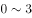岁的幼儿中，年龄越小的孩子，抵抗能力越弱

- **B**. 
随着年龄的增长，人体内的水分占体液总量的比例变小，体温的变化也不再明显

- **C**. 
车内属于密闭空间，当室外气温达到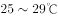时，车内温度就能达到，而成人在车内感到不适时很可能会打开车窗

- **D**. 
中暑多在丧失了相当于体重的水分时发生，幼儿体重相对应的体表面积更大，能更快地吸收热量，由于汗腺数目与大人相同，水分流失速度更快
　✅

**答案**：D

**官方解析**

第一步：找出题干矛盾。
一般幼儿的体温因阳光照射上升的幅度比成人小，但高温环境下幼儿很容易中暑而成人却很少中暑。
第二步：逐一分析选项。
A项：说明幼儿抵抗能力弱，但抵抗力弱是否代表容易中暑不知道，不能解释题干矛盾，排除；
B项：随着年龄的增长，体温变化不明显，说明人的体温正常变化和在封闭空间内应当是一样的，不能解释题干矛盾，排除；
C项：成人所处的环境是打开车窗，而题干强调的是在高温环境下待一个小时，与题干环境不一致，不能解释题干矛盾，排除；
D项：由于幼儿体重相对应的体表面积更大，水分流失更快，解释了幼儿体温上升幅度比成人小，但更容易中暑的原因，能够解释题干矛盾，当选。
故正确答案为D。

---

## 第 32 题　qid 2187873 · 逻辑判断

甲说：如果考试不合格，就不能被录取。
乙说：不对。李明考试合格了，但没有被录取。
乙的回答说明他将甲的话错误地理解为：

- **A**. 有些被录取的人考试合格了
- **B**. 李明应该被录取
- **C**. 只要考试合格，就要被录取　✅
- **D**. 并非所有考试合格的都要被录取

**答案**：C

**官方解析**

第一步：翻译题干。

甲：考试合格录取

乙：李明考试合格 且 录取

由题干可知，乙认为甲说的不对，因此他对甲的理解就是“李明考试合格 且 录取”的矛盾命题。即：考试合格录取。

第二步：逐一分析选项。

A项：翻译为有些录取考试合格，不是乙的矛盾命题，排除；

B项：李明应该被录取，不是乙的矛盾命题，排除；

C项：翻译为考试合格录取，与乙的结论是矛盾命题，当选；

D项：翻译为有的考试合格录取，不是乙的矛盾命题，排除。

故正确答案为C。

---

## 第 33 题　qid 2187874 · 逻辑判断

在国家发展新兴产业的大背景下，某公司虽然在某产业长期处于领先地位，但上半年的生产数据显示，领先优势越来越小，在邀请专家进行企业诊断后，专家认为该公司领先优势缩小的原因在于公司虽然管理制度健全，但由于企业文化缺乏进取心，导致在好的政策环境下公司发展趋缓。
以下哪项如果为真，不能反驳专家的观点？

- **A**. 相较沿海地区同类公司受益于健全的产业链，公司处于内地，其发展有所受限
- **B**. 发展趋缓的原因在于长期以来公司下半年的生产数据一般高于上半年
- **C**. 公司一直注重加强企业文化建设，形成了和谐的企业氛围　✅
- **D**. 企业文化并不是一个公司的核心竞争力，关键问题在于新产品研发力度不够

**答案**：C

**官方解析**

第一步：找出论点和论据。
论点：该公司领先优势缩小的原因在于公司虽然管理制度健全，但由于企业文化缺乏进取心，导致在好的政策环境下公司发展趋缓。
论据：无。
第二步：逐一分析选项。
A项：论点说的是企业文化缺乏进取心导致的公司发展缓慢，该项说的是公司处于内地，导致公司发展受限，提供了一个新原因也能导致结果产生，他因削弱，排除；
B项：论点说的是企业文化缺乏进取心导致的公司发展缓慢，该项说的是长期以来公司下半年的生产数据一般高于上半年导致公司发展趋缓，直接否定了论点的原因，可以削弱，排除；
C项：论点说的是企业文化缺乏进取心导致的公司发展缓慢，该项说的是加强企业文化会形成和谐的氛围，和谐的氛围与缺乏进取心之间话题不一致，无关选项，无法削弱，当选；
D项：论点说的是企业文化缺乏进取心导致的公司发展缓慢，该项说的是企业文化不是核心竞争力，即企业文化对公司发展影响不大，削弱论点，排除。
本题为选非题，故正确答案为C。

---

## 第 34 题　qid 2187877 · 逻辑判断

美国幼儿教育注重培养孩子的“批判式思维”，其中重要一点就是区分事实陈述与观点陈述，事实陈述是可被验证的，有“真假”，无“好坏”；观点陈述则多为主观体验，受价值观等影响。
以下广告语中，兼顾事实与观点的是：

- **A**. 金牌巧克力，唤醒你的甜蜜回忆
- **B**. 量牌65英寸无边框全玻璃超薄电视，给您海一般视野　✅
- **C**. 喜酒沁人心脾，滴滴难舍，回味无穷
- **D**. 水平对置发动机，左右对称全时四驱，成就捷牌汽车

**答案**：B

**官方解析**

逐一分析选项。
A项：唤醒你的甜蜜回忆是主观体验，属于观点陈述，该广告只体现了观点陈述而无事实陈述，排除；
B项：65英寸无边框全玻璃，是可被验证的，有“真假”，无“好坏”，属于事实陈述。海一般视野是主观体验，属于观点陈述，该广告语兼顾事实与观点，当选；
C项：沁人心脾，滴滴难舍，回味无穷是主观体验，属于观点陈述，该广告只体现了观点陈述而无事实陈述，排除；
D项：水平对置发动机，左右对称全时四驱是可被验证的，有“真假”，无“好坏”，属于事实陈述，该广告只体现了事实陈述而无观点陈述，排除。
故正确答案为B。

---

## 第 35 题　qid 2187880 · 逻辑判断

自闭症患者往往认知水平低下，一些自闭症患者会表现出述情障碍，即无法理解情感，缺乏对自身或他人情感的认知能力，由于缺乏情感认知能力，人们通常认为自闭症患者比较冷漠。
以下哪项如果为真，最能支持上述结论？

- **A**. 
在道德两难的困境中，自闭症患者会为了避免作出伤害性举动而承受强烈的情绪压力

- **B**. 
述情障碍的发生率在自闭症患者中高达左右，远远高于普通人
　✅
- **C**. 
自闭症患者也会对他人产生正常的共情反应，甚至会比普通人更加关注别人的情绪

- **D**. 
述情障碍虽会伴随自闭症出现，但二者并无必然联系，因为很多普通人也会出现

**答案**：B

**官方解析**

第一步：找出论点和论据。
论点：由于缺乏情感认知能力，人们通常认为自闭症患者比较冷漠。
论据：无。
题干只有论点，加强可以考虑补充论据。
第二步：逐一分析选项。
A项：论点讨论的是自闭症患者由于缺乏情感认知能力而比较冷漠，该项说自闭症患者会为了避免伤害别人而自己承受情绪压力，说明自闭症患者对他人是有情感认知的，对题干有削弱的作用，无法加强，排除；
B项：自闭症患者比普通人更容易发生述情障碍，即更容易缺乏情感认知能力，补充论据加强，当选；
C项：论点讨论的是自闭症患者由于缺乏情感认知能力而比较冷漠，该项讨论的是自闭症患者比普通人更加关注别人的情绪，即自闭症患者的情感认知能力更强，削弱项，无法加强，排除；
D项：论点讨论的是自闭症患者由于缺乏情感认知能力而比较冷漠，该项讨论的是述情障碍与自闭症无必然联系，普通人也可能会出现述情障碍，因此，不能说明自闭症患者比普通人更冷漠，削弱项，无法加强，排除。
故正确答案为B。

---

## 第 36 题　qid 2187894 · 逻辑判断

当人们在海洋游泳时，身体会释放一种看不见的电信号，科研人员根据这一种情况研制了海洋隐形衣，该隐形衣通过屏蔽掉身体释放的电信号，使得鲨鱼等海洋生物无法发现人们的踪迹。这样，人们就可以近距离接触并观察鲨鱼等海洋生物。
以下哪项是科研人员假设的前提？

- **A**. 有些海洋生物利用超声波进行信息交流、觅食、发现并躲避天敌
- **B**. 部分鱼类其视网膜中含有很多视锥细胞，能够敏锐地感受水中细微的光线变化
- **C**. 鲨鱼等海洋生物是凭借人体释放的电信号来发现人们踪迹的　✅
- **D**. 该隐形衣非常轻薄，对人们在水下的活动不会形成阻碍

**答案**：C

**官方解析**

第一步：找出论点和论据。
论点：该隐形衣通过屏蔽掉身体释放的电信号，使得鲨鱼等海洋生物无法发现人们的踪迹。这样，人们就可以近距离接触并观察鲨鱼等海洋生物。
论据：无。
第二步：逐一分析选项。
A项：题干讨论的是电信号，该项讨论的是海洋生物利用超声波进行交流等，话题不一致，无法加强，排除；
B项：题干讨论的是电信号，该项讨论的是鱼类可以通过视网膜上的视锥细胞观察水中光线变化，话题不一致，无法加强，排除；
C项：题干讨论的是海洋隐身衣可以通过屏蔽身体发出的电信号而使鲨鱼等海洋生物无法发现人的踪迹，该项说鲨鱼等海洋生物是凭借人体释放的电信号来发现人们踪迹，是论点成立的必要条件，可以加强，当选；
D项：题干讨论的是电信号，该项讨论的是隐身衣会不会阻碍人们的水下活动，话题不一致，无法加强，排除。
故正确答案为C。

---

## 第 37 题　qid 2187895 · 逻辑判断

为什么一些灵长类动物的大脑尺寸比其它动物要大？原因通常被认为是社会行为，即灵长类动物生活于更大更复杂的社会群体中，为了更好地处理各种社会关系，它们需要更大的大脑。
以下哪项如果为真，不能质疑上述观点？

- **A**. 通过灵长类动物的饮食特点而非社群复杂性，能够更容易预测大脑的大小
- **B**. 猩猩等一些灵长类动物通常是独居生活，但它们的大脑也很大
- **C**. 大脑皮层的大小与大脑尺寸没有直接关联，但对于灵长类动物的认知、空间推理能力等非常重要　✅
- **D**. 灵长类动物中，食果类的大脑比食叶类大，这是因为果实在时间和空间上更分散，找到果实是一项更为复杂的任务

**答案**：C

**官方解析**

第一步：找出论点和论据。
论点：灵长类动物的大脑尺寸比其它动物要大的原因是灵长类动物生活于更大更复杂的社会群体中，为了更好地处理各种社会关系，它们需要更大的大脑。
论据：无。
第二步：逐一分析选项。
A项：说明饮食特点决定了大脑的大小而不是处理好各种社会关系，可以削弱，排除；
B项：通过举猩猩的例子说明独居动物的大脑也很大，即社会行为和大脑的大小无关，可以削弱，排除；
C项：论点说的是灵长类动物大脑较大的原因，该项说的是大脑皮层对于灵长类动物的重要性，话题不一致，无法削弱，当选；
D项：食果类比食叶类的大脑更大，说明寻找食物的方式决定了大脑的大小而不一定是处理好各种社会关系，可以削弱，排除。
本题为选非题，故正确答案为C。

---

## 第 38 题　qid 2187838 · 逻辑判断

目前，人们通过在河流上筑坝建造水电站获得电能，但是地球上适合筑坝的地方为数不多，筑坝也会破坏生态环境。相比之下，海洋覆盖的地球表面。海面上波涛滚滚，昼夜不息，蕴藏着巨大的能量，收集波浪能适合的海域广，生态环境破坏小。因此，收集波浪能用于发电将比在河流上筑坝发电更有优势。

以下哪项如果为真，<b>不能</b>质疑上述结论？

- **A**. 据估计，全世界可开发利用的波浪能达2.5TW，目前一些小功率的波浪能设备已经推广应用于导航浮标、灯塔等　✅
- **B**. 河流的流向较为稳定，而波浪是海水的缓慢运动，方向并不固定，在此条件下设立的发电机效率非常低
- **C**. 不管是在海床上建塔来支撑发电，还是把发电机固定在海床上都要耗费巨资，成本比河流电站要昂贵得多
- **D**. 河水的水能易于收集，而深海地区及开阔洋面中的波浪能难以提取，可供利用的波浪能仅局限于靠近海岸的地方

**答案**：A

**官方解析**

第一步：找出论点和论据。
论点：收集波浪能用于发电将比在河流上筑坝发电更有优势。
论据：海面上波涛滚滚，昼夜不息，蕴藏着巨大的能量，收集波浪能适合的海域广，生态环境破坏小。
第二步：逐一分析选项。
A项：全世界可利用的波浪能达2.5TW，小的波浪能设备已经可以推广利用，说明收集波浪能发电确实有优势，加强论点，当选；
B项：河流流向固定，波浪方向不固定且发电效率低，说明收集波浪能发电不如在河流上筑坝发电好，否定论点，排除；
C项：收集波浪能发电成本比河流电站贵很多，说明收集波浪能发电不如在河流上筑坝发电好，否定论点，排除；
D项：河水的水能比波浪能容易提取，且可利用的波浪能范围小，说明收集波浪能发电不如在河流上筑坝发电好，否定论点，排除。
本题为选非题，故正确答案为A。

---

## 第 39 题　qid 2187845 · 逻辑判断

甲、乙、丙、丁四人讨论本班同学完成作业的情况。甲说：班里所有同学都写完了作业。乙说：如果小李写完了作业，那么小赵就没有写完作业。丙说：小李写完了作业。丁说：班里有人没有写完作业。
已知四人中只有一人说的不对，那么可推出下列哪项？

- **A**. 甲说的不对，小赵没有写完作业　✅
- **B**. 乙说的不对，小李写完了作业
- **C**. 丙说的不对，小赵没有写完作业
- **D**. 丁说的不对，小赵写完了作业

**答案**：A

**官方解析**

本题属于真假推理题。
第一步：找关系。
甲说“班里所有同学都写完了作业”和丁说“班里有人没有写完作业”是矛盾关系，必有一真必有一假。已知四人中只有一人说的不对，说明假话一定在甲和丁之中，因此乙和丙说的是真话。
第二步：看其余。
根据丙说的是真话，可知：小李写完了作业，根据乙说的是真的，结合丙的话可知：小赵没有写完作业，故甲说“所有人都写完作业”是假话，丁说的是真话，A项可以推出。
故正确答案为A。

---

## 第 40 题　qid 2187848 · 逻辑判断

在人际交往的过程中，容貌是最容易观察到的属性特征。和容貌普通的人相比，容貌有吸引力的个体，往往被认为具有较高的能力、较为积极的人格特征和较好的人际关系，甚至收入水平和个人幸福指数也会比较高。在工作中，相同的任务被不同人完成时，通常顾客会对容貌姣好员工的服务质量给予相对较高的评价。
由此可以推出：

- **A**. 随着容貌吸引力越来越大，人们对其个性特征的评价越来越好
- **B**. 企业应选择容貌姣好的人为员工，以提高顾客的服务满意度　✅
- **C**. 简历不应附带照片，因为照片会影响招聘者决策的公平性
- **D**. 发表文章时提供作者的照片，可以提高读者对文章质量的评价

**答案**：B

**官方解析**

日常结论题，根据题干信息逐一分析选项。
A项：题干中指出容貌有吸引力的个体，往往被认为具有较为积极的人格特征，选项中说的是对其个性特征的评价越来越好，人格特征和对个性特征的评价不同，偷换概念，“越来越好”也是没有提到的，无中生有，排除；
B项：题干最后一句指出通常顾客会对容貌姣好员工给予更高的评价，说明选择容貌姣好的人为员工，确实可以提高顾客的服务满意度，可以得出企业想要提高顾客的服务满意度，应选择容貌姣好的人为员工，可以推出，当选；
C项：题干中指出容貌有吸引力的个体，更容易获得好的评价，并未提照片是否会影响招聘者决策的公平性，无中生有，排除；
D项：题干中并未提及发表文章时提供作者照片与文章质量评价之间的关系，无中生有，排除。
故正确答案为B。

---
