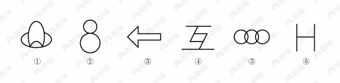
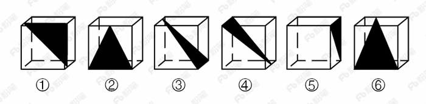
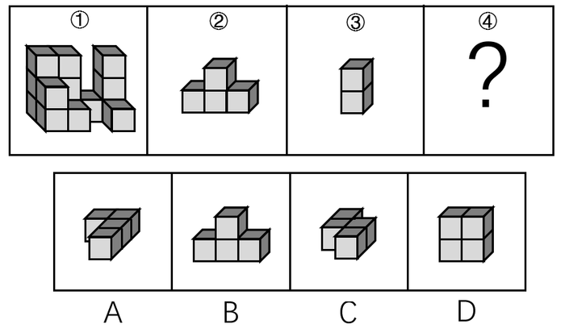

# 2018年421联考《行测》题（山西卷）（网友回忆版）

> 判断推理 · 35 题 · 山西 2018

## 第 1 题　qid 2187829 · 图形推理

把下面的图形分为两类，使每一类图形都有各自的共同特征或规律，分类正确的一项是：

- **A**. ①④⑥，②③⑤
- **B**. ①③④，②⑤⑥
- **C**. ①②⑤，③④⑥　✅
- **D**. ①③⑤，②④⑥

**答案**：C

**官方解析**

本题为分组分类题目。元素组成不同，优先考虑属性规律。观察发现，①②⑤都是全曲线图形，③④⑥都是全直线图形。即①②⑤一组，③④⑥一组。
故正确答案为C。

---

## 第 2 题　qid 2187817 · 图形推理

从正方体中裁出如下图所示六个不同的三角形，将其分为两类，使每一类图形都有各自的共同特征或规律，分类正确的一项是：

- **A**. ①②⑤，③④⑥　✅
- **B**. ①⑤⑥，②③④
- **C**. ①③⑤，②④⑥
- **D**. ①②④，③⑤⑥

**答案**：A

**官方解析**

本题为分组分类题目。每个图形都在正方体中裁出了一个三角形，观察发现，①②⑤中三角形的底边和高的长度都等于正方体的棱长，所以三个三角形的面积相同，③④⑥中三角形底边长度等于正方体的棱长，高的长度等于正方体外表面正方形的对角线的长度，所以三个三角形的面积相同。即①②⑤一组，③④⑥一组。
故正确答案为A。

---

## 第 3 题　qid 2188409 · 图形推理

下列哪个选项中的图形能够折叠成完整封闭的立体几何结构：

- **A**. A
- **B**. B　✅
- **C**. C
- **D**. D

**答案**：B

**官方解析**

本题考查空间重构。
A项：不能由展开图拼合而成，若想拼合，底面（即最后一行的面）须为正方形，排除；
B项：可以由展开图拼合而成，拼合成的图形为七棱柱，当选；
C项：不能由展开图拼合而成，还需要一个矩形面才能拼合成六棱柱，排除；
D项：不能由展开图拼合而成，还需要一个矩形面才能拼合成六面体，排除。
故正确答案为B。

---

## 第 4 题　qid 2187802 · 图形推理

从所给的四个选项中，选择最合适的一个填入问号处，使之呈现一定的规律性：

- **A**. A
- **B**. B　✅
- **C**. C
- **D**. D

**答案**：B

**官方解析**

元素组成不同，无明显属性规律，考虑数量规律。观察发现，题干图形均有面，考虑数面，数量依次为3、4、5、6、8，没有规律，再观察发现每个图形中均有形状相同的面，且数量依次为2、3、4、5、6，？，问号处图形应该含有7个形状相同的面。A项6个，B项7个，C项2个，D项没有形状相同的面，只有B项符合。
故正确答案为B。

---

## 第 5 题　qid 2188414 · 图形推理

从所给的四个选项中，选择最合适的一个填入问号处，使下图中的立体图形①、②、③和④可组成一个完整的长方体：

- **A**. A
- **B**. B
- **C**. C　✅
- **D**. D

**答案**：C

**官方解析**

题干中的立体图形可共同构成一个的长方体。如图所示：

将③放入蓝色位置，图②上下翻转放入黄色位置，将C项图形立起放入橘黄色位置，即是一个完整长方体。

故正确答案为C。 

---

## 第 6 题　qid 2187850 · 定义判断

精准医疗是指以个体化医疗为基础，通过基因组、蛋白质组等技术，对大样本人群与特定疾病类型进行生物标记物的分析与鉴定、验证与应用，从而精确寻找到疾病的原因和治疗的靶点，最终实现对疾病和特定患者进行个性化精确治疗。
根据上述定义，下列选项不属于精准医疗的是：

- **A**. 甲某罹患癌症，医生对其基因进行全面检测并确定治疗方案
- **B**. 乙某近期反常头晕，医生询问症状后就给其开了非处方药物　✅
- **C**. 丙某在就医时称自己对某种药物过敏，医生根据其过敏情况设计用药方案
- **D**. 丁某患失眠症到中医院就诊，医生据“同病异治，异病同治”的理念施治

**答案**：B

**官方解析**

第一步：找出定义关键词。
“以个体化医疗为基础”、“通过基因组、蛋白质组等技术”、“对大样本人群与特定疾病类型进行生物标记物的分析与鉴定、验证与应用”、“寻找到疾病的原因和治疗的靶点”、“实现对疾病和特定患者进行个性化精确治疗”。
第二步：逐一分析选项。
A项：医生对甲某的基因进行全面检测，符合“以个体化医疗为基础”、“通过基因组、蛋白质组等技术”、“寻找到疾病的原因和治疗的靶点”，制定治疗方案符合“实现对疾病和特定患者进行个性化精确治疗”，符合定义，排除；
B项：乙某出现反常头晕症状，医生仅通过询问症状就开了非处方药，不符合“以个体化医疗为基础”、“实现对疾病和特定患者进行个性化精确治疗”，不符合定义，当选；
C项：“医生根据其过敏情况设计用药方案”符合“以个体化医疗为基础”、“实现对疾病和特定患者进行个性化精确治疗”，符合定义，排除；
D项：“同病异治”是指同一病症，因时、因地、因人不同，或由于病情进展程度、病机变化，以及用药过程中正邪消长等差异，治疗上应相应采取不同治法。“异病同治”指不同的疾病，在其发展过程中，由于出现了相同的病机，因而采用同一方法治疗的法则。中医治病的法则，不是着眼于病的异同，而是着眼于病机的区别。异病可以同治，既不决定于病因，也不决定于病证，关键在于辨识不同疾病有无共同的病机。病机相同，才可采用相同的治法。因此“同病异治，异病同治”符合“实现对疾病和特定患者进行个性化精确治疗”，符合定义，排除。
本题为选非题，故正确答案为B。

---

## 第 7 题　qid 2187852 · 定义判断

情感广告是诉诸于消费者的情绪或情感反应，传达商品带给他们的附加值或情绪满足的一种广告策略。这种情绪在消费者心目中的价值可能远远超出商品本身，从而使消费者形成积极的品牌态度。
根据上述定义，下列广告语不属于情感广告的是：

- **A**. 某品牌饮料广告语：“××可乐，中国人自己的可乐！”
- **B**. 某品牌啤酒进入东南亚市场的广告语：“好不好，家乡水。”
- **C**. 某品牌纸尿裤广告语：“宝宝天天好心情，妈妈一定更美丽。”
- **D**. 某品牌润肤露广告语：“为了肌肤柔美润舒，请使用××润肤露。”　✅

**答案**：D

**官方解析**

第一步：找出定义关键词。
“诉诸于消费者的情绪或情感反应”、“传达商品带给他们的附加值或情绪满足的一种广告策略”、“使消费者形成积极的品牌态度”。
第二步：逐一分析选项。
A项：“中国人自己的可乐”，会使消费者产生爱国的情绪满足，符合“传达商品带给他们的情绪满足”，符合定义，排除； 
B项：“好不好，家乡水”，会使消费者产生怀念家乡，以家乡为自豪的情绪满足，符合“传达商品带给他们的情绪满足”，符合定义，排除；
C项：“宝宝天天好心情”，会使消费者产生孩子很舒适的情绪满足，符合“传达商品带给他们的情绪满足”，符合定义，排除；
D项：“为了肌肤柔美润舒”，没有体现出商品的附加值或者情绪满足，不符合定义，当选。
本题为选非题，故正确答案为D。

---

## 第 8 题　qid 2188029 · 定义判断

理性预期指的是，针对某个经济现象进行预期的时候，如果人们是理性的，那么他们就会最大限度地充分利用所得到的信息来作出行动而不会犯系统性的错误。
根据以上定义，下列属于理性预期的是：

- **A**. 省立医院分院一投入使用，小陈就在附近开了一家水果店　✅
- **B**. 老秦获悉某政策即将施行，凭着长期炒股的经验进行股票操作
- **C**. 传言说城南要建某重点中学分校，老刘立即在附近买了一套房子
- **D**. 小张得知其高考成绩在全省排第二十位，果断决定第一志愿报清华大学

**答案**：A

**官方解析**

第一步：找出定义关键词。
“针对某个经济现象进行预期”、“人们是理性的”、“他们就会最大限度地充分利用所得到的信息来作出行动而不会犯系统性的错误”。
第二步：逐一分析选项。
A项：人们到医院看望病人时经常选择水果作为礼物，所以医院的投入使用会使得水果的需求量增加，那么小陈选择在医院附近开水果店，符合“针对某个经济现象进行预期”，且其做出的判断是理性的，符合定义，当选；
B项：政策的施行可能对股票产生影响，老秦获悉这一信息后进行股票操作，符合“针对某个经济现象进行预期”，但凭着长期炒股的经验，不能确定其判断是否理性，不符合“人们是理性的”，不符合定义，排除；
C项：建重点中学分校可能会影响其附近的房价，但该消息为传言，传言是否真实并不确定，故老刘在附近买了一套房子这一决定是否是理性的并不明确，不符合定义，排除；
D项：小张根据高考成绩填报志愿，不符合“针对某个经济现象进行预期”，不符合定义，排除。
故正确答案为A。

---

## 第 9 题　qid 2187813 · 定义判断

二维码是用某种特定的几何图形按一定规律，在平面分布的黑白相间的图形记录数据符号信息。在代码编制上利用“0”“1”比特流的概念，用若干与二进制相对应的几何形体来表示文字数值信息，通过图像输入设备或光电扫描设备自动识读，以实现信息自动处理。一个二维码所能表示的比特数是固定的，它包含的信息越多，则冗余度就越小；反之，冗余度就越大。
根据上述定义，下列选项不符合二维码内涵的是：

- **A**. 某种特定的几何图形按一定规律分布可以构成相应的二维码
- **B**. 二维码中图像代码的基本原理利用的是计算机的内部逻辑基础
- **C**. 把文字数值信息转化成与二进制相对应的几何形体，可供设备识读
- **D**. 二维码包含的信息量都很大，意味着在编码时需要尽量减少冗余度　✅

**答案**：D

**官方解析**

第一步：找出定义关键词。
“用某种特定的几何图形按一定规律”、“在平面分布的黑白相间的图形记录数据符号信息”、“在代码编制上利用‘0’‘1’比特流的概念”、“用若干与二进制相对应的几何形体来表示文字数值信息”、“通过图像输入设备或光电扫描设备自动识读，以实现信息自动处理”、“一个二维码所能表示的比特数是固定的，它包含的信息越多，则冗余度就越小”。
第二步：逐一分析选项。
A项：某种特定的几何图形按一定规律分布符合“用某种特定的几何图形按一定规律”，符合定义，排除；
B项：图像代码的基本原理利用的是计算机的内部逻辑基础，符合“在代码编制上利用‘0’‘1’比特流的概念”，符合定义，排除；
C项：把文字数值信息转化成与二进制相对应的几何形体，可供设备识读，符合“用若干与二进制相对应的几何形体来表示文字数值信息”、“通过图像输入设备或光电扫描设备自动识读，以实现信息自动处理”，符合定义，排除；
D项：根据题干信息，“一个二维码所能表示的比特数是固定的，它包含的信息越多，则冗余度就越小”，即冗余度由信息量大小决定，无法尽量减少冗余度，不符合定义，当选。
本题为选非题，故正确答案为D。

---

## 第 10 题　qid 2188417 · 定义判断

地震震级是通过仪器给出地震大小的一种量度，是划分震源放出能量大小的等级，地震所释放的能量越大，地震震级也越大，每一次地震只有一个震级。地震烈度表示地震对地表及工程建筑物影响的强弱程度，是在没有仪器记录的情况下，凭地震时人们的感觉或地震发生后器物反应的程度、工程建筑物的破坏程度、地表的变化状况而定的一种宏观尺度。
根据上述定义，下列说法正确的是：

- **A**. 地震震级越大，地震烈度相应越强
- **B**. 一次地震只有一个震级，一个烈度
- **C**. 距震源越近，震级越大，烈度越强
- **D**. 地表破坏越严重说明地震烈度越强　✅

**答案**：D

**官方解析**

第一步：找出定义关键词。
地震震级：“通过仪器给出地震大小的一种量度，是划分地震源放出能量大小的等级”、“地震所释放的能量越大，地震震级也越大，每一次地震只有一个震级”；
地震烈度：“表示地震对地表及工程建筑物影响的强弱程度”、“是在没有仪器记录的情况下，凭地震时人们的感觉或地震发生后器物反应的程度、工程建筑物的破坏程度、地表的变化状况而定的一种宏观尺度”。
第二步：逐一分析选项。
A项：题干定义只是分别说了地震震级和地震烈度是什么，两者的关系并没有提及，不符合定义，排除；
B项：一次地震只有一个震级符合“每一次地震只有一个震级”，但只有一个烈度，题干定义并没有提及，不符合定义，排除；
C项：题干定义只是分别说了地震震级和地震烈度是什么，并没有提及震级和烈度与震源远近的关系，不符合定义，排除；
D项：地表破坏越严重说明地震烈度越强，符合 “地震烈度是在没有仪器记录的情况下，凭地震时人们的感觉或地震发生后器物反应的程度、工程建筑物的破坏程度、地表的变化状况而定的一种宏观尺度”，符合地震烈度定义，当选。
故正确答案为D。

---

## 第 11 题　qid 2187803 · 定义判断

绿色设计是指在整个产品周期内，着重考虑产品的环境属性，如可拆卸性、可回收性、可维护性、可重复利用性等，并将其作为设计目标，在满足环境保护条件的同时，保证产品的质量达到最优状态。
根据上述定义，下列选项符合绿色设计理念的是：

- **A**. 迪拜太阳村巧摆太阳能收集器以实现日照时间最大化
- **B**. 荷兰某化学品公司将健康环保作为公司重要的价值观
- **C**. 巴西流行利用绿色植物代替砖、石、钢筋水泥来砌墙　✅
- **D**. 某学校将教室背景设计为浅绿色来保护孩子们的眼睛

**答案**：C

**官方解析**

第一步：找出定义关键词。
“着重考虑产品的环境属性并将其作为设计目标”、“可拆卸性、可回收性、可维护性、可重复利用性等”、“满足环境保护条件的同时，保证产品的质量达到最优状态”。
第二步：逐一分析选项。
A项：巧摆太阳能收集器，只是改变了太阳能收集器的摆放位置，并未体现在产品周期考虑环境属性，且目的是实现日照时间最大化，不是为了环境保护，也不是为了产品质量达到最优，不符合定义，排除；
B项：将健康环保作为公司的价值观，没有提及设计产品时是否“着重考虑产品的环境属性，并将其作为设计目标”，不符合定义，排除；
C项：利用绿色植物代替砖、石、钢筋水泥来砌墙，属于在产品周期考虑了环境属性，符合“着重考虑产品的环境属性并将其作为设计目标”，符合定义，当选；
D项：将教室背景设计为浅绿色的目的是保护孩子们的眼睛，不符合“满足环境保护条件，保证产品的质量达到最优状态”，不符合定义，排除。
故正确答案为C。

---

## 第 12 题　qid 2187806 · 定义判断

在企业活动中，库存有多种类型。装运库存是指在价值链末端工厂的库房里，那些已经准备好可以随时出货的产品。在途库存又称中转库存，指尚未到达目的地，正处于运输状态或等待运输状态而储备在运输工具中的库存。
根据上述定义，下列选项属于在途库存的是：

- **A**. 小张给自己网购了一件毛衣，下单两天后查知该毛衣已到某中转站
- **B**. 某高速服务区内一辆大货车满载着A超市从B地采购的各类毛巾　✅
- **C**. 某皮鞋厂的卡车里，堆满了该厂用于制造新款皮鞋的牛皮
- **D**. 某公司在城南的自有库房中存放着给城北门店销售的玩具

**答案**：B

**官方解析**

第一步：找出定义关键词。
装运库存：“在价值链末端工厂的库房”、“已经准备好可以随时出货的产品”；
在途库存：“尚未达到目的地”、“正处在运输状态或等待运输状态而储存在运输工具中的库存”。
第二步：逐一分析选项。
A项：小张网购的毛衣已到某中转站，不符合“在价值链末端工厂的库房”，也不符合“正处在运输状态或等待运输状态而储存在运输工具中的库存”，不符合任何一个定义，排除； 
B项：高速公路服务区大货车内的毛巾，符合“尚未达到目的地”且“正处在运输状态或等待运输状态而储存在运输工具中的库存”，符合“在途库存”定义，当选；
C项：皮鞋厂卡车里的牛皮是皮鞋厂的原材料，而不是产品，不符合“在价值链末端工厂的库房里”,且“某皮鞋厂的卡车里”并未指明是“正处于运输状态或等待运输状态”还是“已经到达目的地”，不符合“尚未到达目的地”，不符合任何一个定义，排除；
D项：某公司城南的自有仓库中存放的玩具，符合“在价值链末端工厂的库房”，也符合“已经准备好可以随时出货的产品”，符合“装运库存”定义，不符合“在途库存”定义，排除。
故正确答案为B。

---

## 第 13 题　qid 2187858 · 定义判断

刺激泛化是指条件作用的形成使有机体习得了对某一刺激做出特定反应的行为，因此也就可能对类似的刺激做出同样的行为反应。刺激分化是通过选择性强化和消退使有机体学会对条件刺激和与条件刺激相类似的刺激做出不同的行为反应。
根据上述定义，下列说法不正确的是：

- **A**. “一朝被蛇咬，十年怕井绳”属于刺激泛化
- **B**. “横看成岭侧成峰，远近高低各不同”属于刺激分化　✅
- **C**. 为突出品牌，厂家对包装进行独特设计，力图使顾客产生刺激分化
- **D**. 某品牌牙膏创成名牌后，生产商将其生产的化妆品也以同品牌命名，利用的是顾客的刺激泛化

**答案**：B

**官方解析**

第一步：找出定义关键词。
刺激泛化：“条件作用的形成使有机体习得了对某一刺激做出特定反应的行为”、“对类似的刺激做出同样的行为反应”
刺激分化：“通过选择性强化和消退”、“对相类似的刺激做出不同的行为反应”
第二步：逐一分析选项。
A项：被蛇咬后怕井绳是对类似的刺激做出同样的行为反应，符合“刺激泛化”定义，排除；
B项：“横看成岭侧成峰，远近高低各不同”是对同一事物从不同角度的观看所产生的视觉差异，不涉及刺激反应，不符合“刺激分化”定义，当选；
C项：厂家对包装进行独特设计的目的是为了和其他品牌进行区分，想让顾客看到该厂的产品后，做出和看到其他厂商相同产品时不同的反应，符合“通过选择性强化和消退”、“对相类似的刺激做出不同的行为反应”，符合“刺激分化”定义，排除；
D项：生产商将化妆品也以同品牌命名，想让顾客看到同品牌化妆品后也产生名牌的认知，符合“想让消费者对类似的刺激做出同样的行为反应”，符合“刺激泛化”定义，排除。
本题为选非题，故正确答案为B。

---

## 第 14 题　qid 2188408 · 定义判断

广义相对论是爱因斯坦以几何语言建立而成的引力理论，他将引力改描写成因时空中的物质与能量而弯曲的时空，以取代传统对于引力是一种力的看法，而这种时空曲率与处于时空中的物质与辐射的能量动量直接相关。
根据上述定义，下列选项中的现象不涉及广义相对论的是：

- **A**. 科学家在观察日全食时发现，光线经过太阳附近时会产生偏角弯曲
- **B**. 科学家发现，在强引力场中时钟要走得慢一些，因而从巨大质量的星体表面发射到地球的光线，会向光谱的红端移动
- **C**. 科学家发现，当一个星体足够致密时，其引力使时空中的区域极端扭曲以至光线都无法逸出，由此发现了黑洞的存在
- **D**. 麦哲伦航行时发现，驶向远方的船帆逐渐下沉，最后消失在视线中，而海平面似呈弯曲状，远处的海水似乎比近处的海水水位低　✅

**答案**：D

**官方解析**

第一步：找出定义关键词。
“引力理论”、“将引力改描写成因时空中的物质与能量而弯曲的时空，以取代传统对于引力是一种力的看法”、“这种时空曲率与处于时空中的物质与辐射的能量动量直接相关”。
第二步：逐一分析选项。
A项：光线经过太阳附近时会产生偏角弯曲，体现了“弯曲的时空”，符合定义，排除；
B项：时钟要走得慢一些，体现了时空，因而从巨大质量星体表面发射到地球的光线，会向光谱的红端移动，体现了“弯曲的时空”，符合定义，排除；
C项：星体的引力使时空中的区域极端扭曲以至光线都无法逸出，由此发现了黑洞的存在，体现了“弯曲的时空”，符合定义，排除；
D项：麦哲伦航行时发现海平面似成弯曲状，远处的海水似乎比近处的海水水位低，说明地球是圆形的，这里的弯曲状指的是地球表面的形状，和弯曲的时空概念无关，不符合定义，当选。
备注：同构选项：选项ABC都是在说和宇宙时空有关的，D说的是地球表面是弯曲的，因此同构选项同时排除选项ABC，选非题选D。
本题为选非题，故正确答案为D。

---

## 第 15 题　qid 2187822 · 定义判断

水体旅游是人们前往水体及周边区域以寻求愉悦为主要目的的一种具有社会、休闲和消费属性的短期经历，目前已逐渐成为人们休闲时尚与区域旅游开发的重要载体。水体旅游资源是指水域（水体）及相关联的岸地、岛屿、林草、建筑等能对人产生吸引力的自然景观和人文景观。
根据上述定义，下列选项不属于水体旅游资源的是：

- **A**. 武夷山“九曲溪”两旁随处可见历代文人墨客的题词
- **B**. 秦淮河岸的街道上，有一座建于明代的“江南贡院”
- **C**. 某森林公园建有一个放养着上千条锦鲤的“放生池”　✅
- **D**. 某大厦矗立于长江岸边，成为游客拍照留念的背景

**答案**：C

**官方解析**

第一步：找出定义关键词。
“水域（水体）及相关联的岸地、岛屿、林草、建筑等”、“对人产生吸引力的自然景观和人文景观”。
第二步：逐一分析选项。
A项：“九曲溪”是水域，历代文人墨客题词，符合“对人产生吸引力的自然景观和人文景观”，符合定义，排除；
B项：秦淮河是水域，河岸街道上建于明代的“江南贡院”，符合“对人产生吸引力的自然景观和人文景观”，符合定义，排除；
C项： “放生池”是人工造的水池，而“水域”指海洋、河流、湖泊等范围，“放生池”并不是“水域”，不符合定义，当选；
D项：长江是水体，矗立于岸边的大厦，符合“对人产生吸引力的自然景观和人文景观”，符合定义，排除。
本题为选非题，故正确答案为C。

---

## 第 16 题　qid 2187707 · 类比推理

青衿：读书人

- **A**. 南冠：囚犯　✅
- **B**. 浮屠：寺庙
- **C**. 春蚕：奉献
- **D**. 袍泽：官员

**答案**：A

**官方解析**

第一步：判断题干词语间逻辑关系。
青衿借指读书人，二者为比喻象征关系。
第二步：判断选项词语间逻辑关系。
A项：南冠借指囚犯，二者为比喻象征关系，与题干逻辑关系一致，当选；
B项：浮屠借指佛塔，而不是寺庙，与题干逻辑关系不一致，排除；
C项：春蚕借指乐于奉献的人，而不是奉献，与题干逻辑关系不一致，排除；
D项：袍泽借指军中的同事，而不是官员，与题干逻辑关系不一致，排除。
故正确答案为A。

---

## 第 17 题　qid 2187713 · 类比推理

演员：公园：演出

- **A**. 谣言：微信：查处
- **B**. 股民：股市：投资　✅
- **C**. 士兵：战争：升迁
- **D**. 信息：卫星：定位

**答案**：B

**官方解析**

第一步：判断题干词语间逻辑关系。
演员在公园演出，为人、场所和行为的对应关系，且演出是演员主动发出的动作。
第二步：判断选项词语间逻辑关系。
A项：谣言在微信被查处，不是人、场所和行为的对应关系，且谣言与查处为被动关系，与题干逻辑关系不一致，排除；
B项：股民在股市投资，为人、场所和行为的对应关系，且投资是股民主动发出的动作，与题干逻辑关系一致，当选；
C项：士兵参加战争可能被升迁，但是战争不是场所，且士兵与升迁为被动关系，与题干逻辑关系不一致，排除；
D项：卫星是传播信息的方式，信息可以用于定位，与题干逻辑关系不一致，排除。
故正确答案为B。

---

## 第 18 题　qid 2187709 · 类比推理

风霜雨雪：雾里看花

- **A**. 春夏秋冬：踏雪寻梅
- **B**. 金木火土：水中望月　✅
- **C**. 桃李杏橘：青梅煮酒
- **D**. 梅兰竹菊：茜窗画眉

**答案**：B

**官方解析**

第一步：判断题干词语间逻辑关系。
风霜雨雪为四字并列的成语，雾里看花是场景和行为的对应关系，且雾与风霜雨雪是并列关系。
第二步：判断选项词语间逻辑关系。
A项：春夏秋冬为四字并列关系的成语，踏雪和寻梅是两个行为的并列关系，与题干逻辑关系不一致，排除；
B项：金木火土为四字并列的成语，水中望月是场景和行为的对应关系，且水与金木火土是并列关系，与题干逻辑关系一致，当选；
C项：桃李杏橘为四字并列的成语，但是青梅不是场景，与题干逻辑关系不一致，排除；
D项：梅兰竹菊为四字并列的成语，茜窗画眉是场景和行为的对应关系，但茜窗画眉中不包含与梅兰竹菊并列的字，与题干逻辑关系不一致，排除。
故正确答案为B。

---

## 第 19 题　qid 2188411 · 类比推理

仪态万方：美丽多姿

- **A**. 风度翩翩：富富有余
- **B**. 腰缠万贯：富甲一方　✅
- **C**. 其貌不扬：荣华富贵
- **D**. 仪表堂堂：身无长物

**答案**：B

**官方解析**

第一步：判断题干词语间逻辑关系。
仪态万方形容容貌、姿态各方面都很美；美丽多姿也是指姿态美丽，二者是近义关系。
第二步：判断选项词语间逻辑关系。
A项：风度翩翩指仪态万方，气质不凡；富富有余指物品等十分充裕，除满足需要外，还有富余，二者不是近义关系，与题干逻辑关系不一致，排除；
B项：腰缠万贯指人极其富有；富甲一方指拥有的财物在某地方上居第一位，比喻十分富有，二者是近义关系，与题干逻辑关系一致，当选；
C项：其貌不扬指长得不漂亮，相貌普通；荣华富贵比喻兴盛或显达，形容有钱有势，二者不是近义关系，与题干逻辑关系不一致，排除；
D项：仪表堂堂形容人外表端正、举止大方、姿态威严；身无长物指除自身外再没有多余的东西，形容贫穷，二者不是近义关系，与题干逻辑关系不一致，排除。
故正确答案为B。

---

## 第 20 题　qid 2187711 · 类比推理

骡子：耕畜：犁地

- **A**. 基因：生命：遗传
- **B**. 衙役：衙门：当差
- **C**. 鸬鹚：水鸟：捕鱼　✅
- **D**. 恒星：宇宙：发光

**答案**：C

**官方解析**

第一步：判断题干词语间逻辑关系。
骡子是一种耕畜，二者为包容关系中的种属关系，骡子能犁地，二者为功能的对应关系。
第二步：判断选项词语间逻辑关系。
A项：基因储存孕育生命的信息，二者为对应关系，“基因”是具有“遗传”效应的DNA片段，二者为对应关系，与题干逻辑关系不一致，排除；
B项：衙役指在衙门中当差的人，二者为对应关系，当差是衙役的工作内容，二者为对应关系，与题干逻辑关系不一致，排除；
C项：鸬鹚是一种水鸟，二者为包容关系中的种属关系，鸬鹚能捕鱼，二者为功能的对应关系，与题干逻辑关系一致，当选；
D项：恒星是宇宙的组成部分，二者为包容关系中的组成关系，恒星会发光，二者为属性的对应关系，与题干逻辑关系不一致，排除。
故正确答案为C。

---

## 第 21 题　qid 2187703 · 类比推理

团扇：羽毛扇：舞蹈扇

- **A**. 宣纸：餐巾纸：铜版纸
- **B**. 圈椅：实木椅：办公椅　✅
- **C**. 排球：羽毛球：乒乓球
- **D**. 墨镜：老花镜：显微镜

**答案**：B

**官方解析**

第一步：判断题干词语间逻辑关系。
团扇为圆形或近似圆形，团扇以其形状命名，羽毛扇以其原材料命名，舞蹈扇以其功能命名，三者为交叉关系。
第二步：判断选项词语间逻辑关系。
A项：宣纸产自古代宣州，以其产地命名，餐巾纸以其功能命名，铜版纸以用途命名，与题干逻辑关系不一致，排除；
B项：圈椅以其形状命名，实木椅以其原材料命名，办公椅以其功能命名，三者为交叉关系，与题干逻辑关系一致，当选；
C项：排球以队列的分布命名，羽毛球以其原材料命名，乒乓球以其声音命名，与题干逻辑关系不一致，排除；
D项：墨镜以其颜色命名，老花镜和显微镜都以其功能命名，与题干逻辑关系不一致，排除。
故正确答案为B。

---

## 第 22 题　qid 2188412 · 类比推理

西子湖：曹娥江

- **A**. 美人蕉：老婆饼
- **B**. 东坡肉：五柳鱼　✅
- **C**. 女儿红：祖母绿
- **D**. 狮子头：凤凰胆

**答案**：B

**官方解析**

第一步：判断题干词语间逻辑关系。
西子湖即杭州西湖，之所以叫西子湖，是得名于我国四大美女之一的西施。曹娥江，中国东海独流入海河流钱塘江的最大支流，因东汉少女曹娥入江救父而得名。二者都是水域，是并列关系。
第二步：判断选项词语间逻辑关系。
A项：美人蕉是一种植物，老婆饼是一种糕点，二者不是并列关系，与题干逻辑关系不一致，排除；
B项：“东坡肉”是眉山和江南地区的特色传统名菜，相传为北宋词人苏东坡所创制；“五柳鱼”是一道四川名菜，得名于“五柳先生”陶渊明，二者都是菜肴，是并列关系，且均得名于某一人物，与题干逻辑关系一致，当选；
C项：女儿红是糯米酒，祖母绿是绿宝石的一种，二者不是并列关系，与题干逻辑关系不一致，排除；
D项：狮子头是一道菜肴，凤凰胆是一种天然玉石珠，二者不是并列关系，与题干逻辑关系不一致，排除。
故正确答案为B。

---

## 第 23 题　qid 2187714 · 类比推理

春秋：寒暑：一年

- **A**. 妇孺：老幼：生命
- **B**. 荏苒：蹉跎：岁月
- **C**. 东西：南北：方向　✅
- **D**. 冷热：干湿：温度

**答案**：C

**官方解析**

第一步：判断题干词语间逻辑关系。
春秋和寒暑都用来泛指一年，为比喻象征关系。
第二步：判断选项词语间逻辑关系。
A项：妇孺和老幼都有生命，为对应关系，与题干逻辑关系不一致，排除；
B项：荏苒指岁月易逝，蹉跎指岁月白白过去，与题干逻辑关系不一致，排除；
C项：东西和南北都可以用来泛指方向，与题干逻辑关系一致，当选；
D项：冷热用来形容温度的高低，干湿和温度无必然关系，与题干逻辑关系不一致，排除。
故正确答案为C。

---

## 第 24 题　qid 2188413 · 类比推理

纺车 之于 （    ） 相当于 （    ） 之于 联合收割机

- **A**. 手摇；蒸汽机
- **B**. 织布；传动带
- **C**. 3D织布机；曲辕犁　✅
- **D**. 自动打线车；发动机

**答案**：C

**官方解析**

逐一代入选项。
A项：手摇纺车，手摇与纺车构成偏正结构；蒸汽机和联合收割机是并列关系，前后逻辑关系不一致，排除；
B项：纺车是生产线或纱的设备，与织布无必然的逻辑关系；传动带是联合收割机的组成部分，二者是组成关系，前后逻辑关系不一致，排除；
C项：纺车是生产线或纱的设备，3D织布机是织布的设备，二者是并列关系，且纺车为古代发明，3D织布机为现代发明；曲辕犁和联合收割机都可以用于农田耕作，二者是并列关系，且曲辕犁为古代发明，联合收割机为现代发明，前后逻辑关系一致，当选；
D项：纺车是生产线或纱的设备，自动打线车是采用纺坠来捻丝的设备，二者是并列关系；发动机是联合收割机的一部分，二者是组成关系，前后逻辑关系不一致，排除。
故正确答案为C。

---

## 第 25 题　qid 2187712 · 类比推理

（  ）之于 风油精 相当于 碳酸 之于（  ）

- **A**. 薄荷脑；可乐　✅
- **B**. 清凉；陈醋
- **C**. 叶绿素；花露水
- **D**. 液体；二氧化碳

**答案**：A

**官方解析**

逐一代入选项。
A项：薄荷脑是风油精的成分，二者是成分对应关系；碳酸是可乐的成分，二者是成分对应关系，前后逻辑关系一致，当选；
B项：风油精具有清凉的作用，二者是功能对应关系；陈醋与碳酸之间没有明显的逻辑关系，前后逻辑关系不一致，排除；
C项：风油精含有叶绿素，二者是成分对应关系，花露水和碳酸之间没有明显逻辑关系，前后逻辑关系不一致，排除；
D项：风油精是一种液体，二者是种属关系；二氧化碳与水反应可以生成碳酸，二者是对应关系，前后逻辑关系不一致，排除。
故正确答案为A。

---

## 第 26 题　qid 2187785 · 逻辑判断

研究人员在普遍使用的功能性磁共振成像技术（fMRI）专用软件中发现了算法错误。他们采集499名健康的人处于静息状态时的检查结果，发现其统计方法还需用真实呈现的病例加以验证。这意味着软件有时会错得离谱，就算大脑处于静止状态时也会显示有活动——软件显示出的活动是软件算法的产物，而非被研究大脑真的处于活跃状态。
以下哪项如果为真，最能支持上述结论？

- **A**. 
研究结论可以经fMRI获得有关数据并通过相关程序编译出来

- **B**. 
fMRI能捕捉脑部血流变化，但无法有效显示大脑是否处于活跃状态

- **C**. 
目前普遍用来诊断脑部功能的fMRI软件的假阳性率达到以上
　✅
- **D**. 
只有经fMRI专用软件获得的结果会进行验证性试验并进一步确认

**答案**：C

**官方解析**

第一步：找出论点和论据。

论点：软件有时会错得离谱，就算大脑处于静止状态时也会显示有活动——软件显示出的活动是软件算法的产物，而非被研究大脑真的处于活跃状态。

论据：采集499名健康的人处于静息状态时的检查结果，发现其统计方法还需用真实呈现的病例加以验证。

第二步：逐一分析选项。

A项：论点说的是软件有时会错得离谱，该项说的是研究结论可以经该技术获得数据并编译，话题不一致，无法加强，排除；

B项：fMRI可以捕捉脑部血流变化，但无法有效显示大脑是否处于活跃状态，说明fMRI软件确实存在问题，有加强的作用，保留；

C项：fMRI软件假阳性率达，说明结论错误率很高，那么软件有时确实会错得离谱，也有加强的作用，保留； 

D项：论点说的是软件有时会错得离谱，选项说的是用软件获得的结果有没有进行验证性试验，话题不一致，无法加强，排除。

对比B、C两个选项，B项重复了论据中已经指出的内容，虽然能证明软件确实有问题，有一定的加强作用，但是无法证明问题有多大，是否错得离谱，而C选项明确地说了假阳性率高达，也就是出错概率非常高，更明确地证明软件有时会错得离谱。

故正确答案为C。

---

## 第 27 题　qid 2187807 · 逻辑判断

场所恐惧症主要表现为对某些特定环境的恐惧，如高处、广场、客观环境和拥挤的公共场所等，常以自发性惊恐发作开始，然后产生预期焦虑和回避行为，进而出现条件化的形成。一些临床研究表明，场所恐惧症患者常伴有惊恐发作。然而，有专家认为最初一次惊恐发作是场所恐惧症起病的必备条件，因而认为场所恐惧症是惊恐发作发展的后果，应归入惊恐障碍这一类别。
以下哪项如果为真，最能质疑上述专家观点？

- **A**. 
场所恐惧症病程常有波动，许多患者可能短期好转甚至缓解

- **B**. 
场所恐惧症可能与遗传有关，且与惊恐障碍存在一定联系

- **C**. 
研究发现场所恐惧症起病多在40多岁，且病程趋向慢性

- **D**. 
研究发现约有患者的场所恐惧出现于惊恐发作以前
　✅

**答案**：D

**官方解析**

第一步：找出论点和论据。
论点：场所恐惧症是惊恐发作发展的后果，应归入惊恐障碍这一类别。
论据：最初一次惊恐发作是场所恐惧症患者起病的必备条件。
第二步：逐一分析选项。
A项：论点说的是场所恐惧症是惊恐发作发展的后果，选项说的是场所恐惧症的病程，话题不一致，无法削弱，排除；
B项：场所恐惧症与惊恐障碍有一定的联系，但并不明确是否为必要条件关系或因果关系，属于不明确项，无法削弱，排除；
C项：论点说的是场所恐惧症是惊恐发作发展的后果，选项说的是场所恐惧症起病的年龄，话题不一致，无法削弱，排除；
D项：有些患者的场所恐惧症出现在惊恐发作之前，举例说明场所恐惧症并不是惊恐发作发展的后果，否定论点，当选。
故正确答案为D。

---

## 第 28 题　qid 2187788 · 逻辑判断

甲、乙、丙三人大学毕业后选择从事各不相同的职业：教师、律师、工程师。其他同学做了如下猜测：
小李：甲是工程师，乙是教师。
小王：甲是教师，丙是工程师。
小方：甲是律师，乙是工程师。
后来证实，小李、小王和小方都只猜对了一半。那么，甲、乙、丙分别从事何种职业？

- **A**. 甲是教师，乙是律师，丙是工程师
- **B**. 甲是工程师，乙是律师，丙是教师
- **C**. 甲是律师，乙是工程师，丙是教师
- **D**. 甲是律师，乙是教师，丙是工程师　✅

**答案**：D

**官方解析**

题干条件不确定，优先采用代入法。
将A项代入，小李和小方两句都猜错了，而小王两句都猜对了，不符合题干要求，排除；
将B项代入，小李两句一对一错，而小王和小方两句都猜错了，不符合题干要求，排除；
将C项代入，小李和小王两句都猜错了，而小方两句都猜对了，不符合题干要求，排除；
将D项代入，小李、小王和小方都只猜对了一半，符合题干要求，当选。
故正确答案为D。

---

## 第 29 题　qid 2188416 · 逻辑判断

我们身体的生物钟系统会受到许多因素的影响，其中之一就是光照。研究表明，光照可以有效地欺骗大脑进入“白昼模式”，哪怕当时人的眼睛是闭着的也没关系。研究人员发现可以用光照疗法来帮助我们调整时差，包括持续光照和不同间隔的闪光，而每10秒一次持续仅2毫秒的闪光最有效。研究还发现，在睡眠时经历过“闪光处理”的人出现困意的周期会延后两个小时。
以下哪项如果是真，最能支持上述观点？

- **A**. 每次闪光间隙的黑暗都有助于让眼睛重启，从而恢复眼睛对光照的敏感
- **B**. 大部分睡眠时经历“闪光处理”的人的睡眠质量都不会受到闪光的影响
- **C**. 去时区早两小时的城市，启程日日出前两小时经光照疗法的人无时差感　✅
- **D**. 依靠自身来调节时差耗时良久，大概平均每天只能倒过一个小时的时差

**答案**：C

**官方解析**

第一步：找出论点和论据。
论点：我们身体的生物钟系统会受到许多因素的影响，其中之一就是光照。 
论据：研究表明，光照可以有效地欺骗大脑进入“白昼模式”，哪怕当时人的眼睛是闭着的也没关系。研究人员发现可以用光照疗法来帮助我们调整时差，包括持续光照和不同间隔的闪光，而每10秒一次持续仅2毫秒的闪光最有效。研究还发现，在睡眠时经历过“闪光处理”的人出现困意的周期会延后两个小时。
第二步：逐一分析选项。
A项：论点讨论的是光照是否可以影响生物钟系统，该项讨论的是眼睛对光照是否敏感，话题不一致，无法加强，排除；
B项：论据讨论的是闪光处理是否可以延后人出现困意的周期，即让人睡得晚，该项讨论的是“闪光处理”是否会影响睡眠质量，即让人睡不好，话题不一致，无法加强，排除；
C项：该项举例说明去时区早两小时的城市，光照疗法确实可以帮助人调整时差，补充论据加强，当选；
D项：论点讨论的是光照是否可以影响生物钟系统，该项讨论的是自身调节时差需要大量时间，话题不一致，无关选项，无法加强，排除。
故正确答案为C。

---

## 第 30 题　qid 2187779 · 逻辑判断

某研究团队让两批测试者分别进入睡眠实验室里睡上一夜。第一批被安排睡得很晚，从而减少总睡眠时间；第二批被安排睡得早，但在睡眠过程中多次被吵醒。第二晚过后，结果就已经显现：第二批测试者的积极情绪受到严重影响。他们的精力水平较低，同情心和友善度等积极情绪指数有所下滑。部分研究者据此认为，被吵醒导致了测试者无法得到足够的慢波睡眠，而慢波睡眠是恢复精力感的关键，但也有研究者对此项研究的可信度提出质疑。
以下哪项如果为真，最能反驳质疑者？

- **A**. 第一批测试者积极情绪的指数下滑程度不太明显　✅
- **B**. 第二批测试者中大部分人长期以来情绪不够积极
- **C**. 两批测试者的健康状况和心理素质原本就很接近
- **D**. 两批测试者在参与睡眠实验前精力水平参差不齐

**答案**：A

**官方解析**

第一步：找出论点和论据。
论点：有研究者对“被吵醒导致了测试者无法得到足够的慢波睡眠，而慢波睡眠是恢复精力感的关键”这一结论的可信度提出质疑。
论据：两批测试者分别进入睡眠实验室里睡上一夜。第一批被安排睡得很晚，从而减少总睡眠时间；第二批被安排睡得早，但在睡眠过程中多次被吵醒。结果显现：第二批测试者的积极情绪受到严重影响。他们的精力水平较低，同情心和友善度等积极情绪指数有所下滑。
第二步：逐一分析选项。
A项：第一批测试者积极情绪的指数下滑程度不太明显，与第二批严重影响做了比较，说明慢波睡眠确实是恢复精力感的关键，补充了实验结果，证明研究是有可信度的，可以削弱质疑者，当选；
B项：第二批测试者中大部分人长期以来情绪不够积极，说明实验前提条件不一致，削弱实验结论，可以支持质疑者，排除；
C项：题干的实验结果是每一个实验对象本身实验前后积极情绪指数的比较，并不是不同的实验对象的积极情绪指数的比较， 所以实验前所有实验对象的健康状况和心理素质的情况对实验的结果不会产生影响，因此该项无法反驳质疑者，排除；
D项：题干的实验结果是每一个实验对象本身实验前后积极情绪指数的比较，所以两批测试者在参与睡眠实验前精力水平参差不齐，无法反驳质疑者，排除。
故正确答案为A。

---

## 第 31 题　qid 2187780 · 逻辑判断

东亚人看起来更谦虚，但心理学研究表明，和接受其他文化熏陶的人相比，他们也一样充满骄傲和自信。某研究团队招募了40名志愿者参与研究，其中一半来自东亚国家，剩下的来自西方国家。他们向这些志愿者展示大量正面和负面的词语，并询问他们哪些形容词适合自己。结果，志愿者们无论有什么样的文化背景，他们都倾向于用更多正面的形容词来描述自己，认为一些较为负面的特征不适合自己。研究者认为，这表明参与测试的人无论具有何种文化背景，他们同样都有美化自己的动机。
以下哪项如果为真，最能削弱上述论证？

- **A**. 东亚人习惯负面评价自己，而西方人往往对自己的能力言过其实　✅
- **B**. 当志愿者被要求用正面词汇形容自己时，他们的反应都是一样的
- **C**. 东亚人谦逊只是一种文化惯例，他们有着和西方人一样的自尊心
- **D**. 研究发现，无论来自何种文化背景，志愿者们的脑电波都很相似

**答案**：A

**官方解析**

第一步：找出论点和论据。
论点：和接受其他文化熏陶的人相比，东亚人也一样充满骄傲和自信。
论据：参与测试的人无论具有何种文化背景，他们同样都有美化自己的动机。
第二步：逐一分析选项。
A项：选项陈述了东亚人习惯负面评价自己，说明东亚人并非充满骄傲和自信，削弱了论点，当选；
B项：选项只针对当志愿者被要求用正面词汇形容自己的情况，而题干没有这个限制条件，话题不一致，无关选项，无法削弱，排除；
C项：说明东亚人和西方人一样充满骄傲和自信，加强了论点，排除； 
D项：脑电波相似和是否会有美化自己的动机之间没有必然联系，无法削弱，排除。
故正确答案为A。

---

## 第 32 题　qid 2187783 · 逻辑判断

色素主要为花色甙等酚类物质，它们的颜色构成了葡萄酒的色泽,并且给葡萄酒带来了它们自身的香气和细腻口感。陈年葡萄酒中的颜色主要来源于单宁。单宁除了给酒的色泽作出贡献外，还能作用于口腔产生一种苦涩感，从而促进人们的食欲。单宁含量过高，苦涩味重且酒质粗糙；含量过低则酒体软弱而淡薄。此外，单宁还能掩盖酸味，所以红葡萄酒由于含有丰富的单宁，其酸味明显小于白葡萄酒。
由此可以推出：

- **A**. 陈年葡萄酒会促进食欲，色泽来源于单宁
- **B**. 苦涩味重且酒质粗糙的酒必含有过多单宁
- **C**. 酒体软弱而淡薄的酒中单宁含量必然过低
- **D**. 单宁能影响酒的色泽和饮者的味觉及食欲　✅

**答案**：D

**官方解析**

日常结论题，根据题干信息逐一分析选项。
A项：题干中提及的是单宁能作用于口腔产生一种苦涩感，从而促进人们的食欲，而不是陈年葡萄酒，偷换概念，排除；
B项：题干中只提到了单宁含量过高，苦涩味重且酒质粗糙，并没有说苦涩味重且酒质粗糙的酒必含有过多单宁，无法推出，排除；
C项：题干中只提到了单宁含量过低，则酒体软弱而淡薄，并没有说酒体软弱而淡薄的酒中单宁含量必然过低，无法推出，排除；
D项：单宁能影响酒的色泽和饮者的味觉及食欲，是对题干“单宁除了给酒的色泽作出贡献外，还能作用于口腔产生一种苦涩感，从而促进人们的食欲”整句话的同义替换，当选。
故正确答案为D。

---

## 第 33 题　qid 2187781 · 逻辑判断

我国在西南地区进行的页岩气勘探获得重大成果，估算天然气资源量达千亿立方米，这是我国首次在四川盆地以外的南方复杂构造区取得页岩气勘探的重大突破。有专家称该地有望成为新的工业气田，可以满足上千万居民的生活和工农业发展的用气需求，促进经济发展。
该专家观点成立的假设前提是：

- **A**. 南方复杂的地质构造有利于天然气生成
- **B**. 凡是勘探到的天然气都能顺利开采出来　✅
- **C**. 我国目前天然气产量无法满足实际需求
- **D**. 天然气作为清洁能源是促进经济发展的重要动力

**答案**：B

**官方解析**

第一步：找出论点和论据。
论点：该地有望成为新的工业气田，可以满足上千万居民的生活和工农业发展的用气需求，促进经济发展。
论据：西南地区进行的页岩气勘探获重大成果，估算天然气资源量达千亿立方米。
第二步：逐一分析选项。
A项：南方复杂的地质构造有利于天然气生成，论点讨论的是该地是否有望成为新的工业气田，而非天然气生成与地质构造的关系，话题不一致，无法加强，排除；
B项：论据中估算该地资源量达千亿立方米，勘探到的天然气都能顺利开采出来，这是一个必要条件，满足这一条件才能有望满足上千万居民的生活和工农业发展的用气需求，是论点成立的前提，可以加强，当选；
C项：我国目前天然气产量无法满足需求，与该地是否能成为新的工业气田无关，无法加强，排除； 
D项：天然气的好处与该地是否能成为新的工业气田无关，无法加强，排除。 
故正确答案为B。

---

## 第 34 题　qid 2188418 · 逻辑判断

月球潮汐力与地球上的地震、海啸、火山爆发等自然灾害存在明显相关性的说法是可疑的，因为每年自然灾害很多，而“超级月亮”每14个月才一次，即便考虑月球经过近地点，每个月也只有一次。部分学者会找出一些和“超级月亮”出现时间相隔不远的灾害来论证，这显然缺乏证据支撑。也忽略了大量事例，比如月球在远地点前后发生的灾害。基于大量关于地震和月球关系数据的研究表明，地震发生频率和月球经过近地点没有统计上的相关性，因此说月球潮汐力会引发地震显然缺乏可靠证据。
由此可以推出：

- **A**. 月球潮汐力与月球在远地点前后发生的地震具有相关性
- **B**. 月球潮汐力与月球经过近地点发生的地震具有因果关系
- **C**. 月球潮汐力与地震之间的关系需要在时间和空间上综合分析　✅
- **D**. 地震触发机制有多种因素，但月球潮汐力的作用效果较明显

**答案**：C

**官方解析**

日常结论题，根据题干信息逐一分析选项。
A项：题干中指出“部分学者会找出一些和‘超级月亮’出现时间相隔不远的灾害来论证”，这显然缺乏证据支撑。也忽略了大量事例，比如“月球在远地点前后发生的灾害”，说明月球潮汐力与月球在远地点发生地震之间没有必然关系，无法推出，排除；
B项：题干中指出“地震发生频率和月球经过近地点没有统计上的相关性”，而选项中说二者是因果关系，无法推出，排除；
C项：题干中指出“‘超级月亮’每14个月才一次”，“地震发生频率和月球经过近地点没有统计上的相关性”，分别从时间和空间的角度说明月球潮汐力与地震等灾害之间没有相关性，那么要想证明月球潮汐力与地震之间的关系也需要在时间和空间上综合分析，可以推出，当选；
D项：题干中指出“月球潮汐力会引发地震显然缺乏可靠证据，”而选项中说明月球潮汐力是地震的触发机制效果较明显,与题干意思相反，无法推出，排除。
故正确答案为C。

---

## 第 35 题　qid 2187791 · 逻辑判断

如果央行允许人民币继续贬值，那么市场对于人民币贬值的预期就容易强化。如果市场形成较强的人民币贬值预期，大量的资金就会流出我国。资金流出我国，不仅会强化这种人民币的贬值预期，导致更多的资金流出我国，而且可能会导致我国资产价格全面下跌，继而可能引爆金融市场的区域性风险及系统性风险。这些都是我们不愿意看到且不允许出现的情况。
由此可以推出：

- **A**. 货币持续贬值会导致资产全面下跌
- **B**. 资金流失严重会出现货币贬值预期
- **C**. 央行不会允许人民币继续贬值　✅
- **D**. 我国将重点着手干预资金外流

**答案**：C

**官方解析**

日常结论题，根据题干信息逐一分析选项。
A项：题干只是表述货币持续贬值“可能”会导致资产价格全面下跌，而该项说“会”导致，说的过于绝对，无法推出，排除；
B项：题干表述的是较强的人民币贬值预期会出现资金大量流失，该项是资金流失严重会出现货币贬值预期，属于逻辑错误，无法推出，排除；
C项：题干最后一句表明我们不允许出现这种情况，“这种情况”指代的是前文“如果央行允许人民币继续贬值”这种情况，该项属于最后一句的同义替换，可以推出，当选；
D项：我国是否将采取措施干预资金外流，题干没有提及，无中生有，排除。
故正确答案为C。

---
