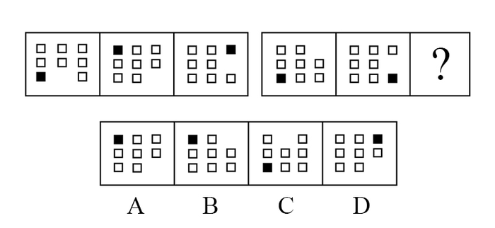
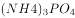

# 2018年421联考《行测》题（江西卷）（网友回忆版）

> 判断推理 · 35 题 · 江西 2018

## 第 1 题　qid 2188222 · 图形推理

从所给四个选项中，选择最合适的一个填入问号处，使之呈现一定的规律性：

- **A**. A
- **B**. B
- **C**. C　✅
- **D**. D

**答案**：C

**官方解析**

元素组成不同，优先考虑属性规律。观察发现，题干图形均为轴对称图形，且均有一条竖着的对称轴，因此“？”处也应为有一条竖着的对称轴的图形，只有C项符合。
故正确答案为C。

---

## 第 2 题　qid 2188238 · 图形推理

从所给四个选项中，选择最合适的一个填入问号处，使之呈现一定的规律性：

- **A**. A
- **B**. B
- **C**. C
- **D**. D　✅

**答案**：D

**官方解析**

元素组成相同，优先考虑位置规律。观察发现，前一组图中小黑正方形每次沿顺时针方向移动两格，空白部分每次沿逆时针方向移动一格。第二组图运用此规律，观察发现，第一幅图到第二幅图中，小黑正方形沿逆时针方向移动了两格，空白部分沿顺时针方向移动了一格，因此？处图形的小黑正方形应在右上角，空白部分应在右下角，对应D项。
故正确答案为D。

---

## 第 3 题　qid 2188242 · 图形推理

左边给定的是纸盒的外表面，下列能由它折叠而成的一项是：

- **A**. A　✅
- **B**. B
- **C**. C
- **D**. D

**答案**：A

**官方解析**

将原展开图标上序号，如上图所示，逐一进行分析。

A项：已知面2和面4是相对面，不能同时出现，故A项上面是面1，前面是面2，对角线面在面2的右侧，则右侧是面6，选项与题干展开图一致，当选；

B项：已知面2和面4是相对面，不能同时出现，故B项侧面是面1，前面是面2，观察题干展开图发现，不论上面是面5还是面6，对角线面中的对角线的一个顶点都在三个面的公共点上，选项与题干展开图不一致，排除；

C项：已知面1和面3是相对面，不能同时出现，故C项上面是面3，前面是面4，观察题干展开图发现，不论侧面是面5还是面6，对角线面的对角线的一个顶点都在三个面的公共点上，选项与题干展开图不一致，排除；

D项：已知面1和面3是相对面，不能同时出现，故D项前面是面3，上面是面4，观察题干展开图发现，不论侧面是面5还是面6，对角线面的对角线的一个顶点都在三个面的公共点上，选项与题干展开图不一致，排除。

故正确答案为A。

---

## 第 4 题　qid 2188249 · 图形推理

从所给四个选项中，选择最合适的一个填入问号处，使之呈现一定的规律性：

- **A**. A
- **B**. B
- **C**. C
- **D**. D　✅

**答案**：D

**官方解析**

元素组成不同，且无明显属性规律，考虑数量规律。题干图形中“窟窿”较多，考虑数面，九宫格优先横看，第一行面数量是：2、1、0；第二行面数量是：4、3、2；第三行面数量是：？5、4，故？处面数量应为6，A项为3，B项为5，C项为0，D项为6，只有D项符合。
故正确答案为D。

---

## 第 5 题　qid 2188253 · 图形推理

把下面的六个图形分为两类，使每一类图形都有各自的共同特征或规律，分类正确的一项是：

- **A**. ①②④，③⑤⑥
- **B**. ①④⑤，②③⑥　✅
- **C**. ①③④，②⑤⑥
- **D**. ①③⑥，②④⑤

**答案**：B

**官方解析**

元素组成不同，题干图形均有小黑点，考虑功能元素。观察发现，图①④⑤中小黑点标记在线上，图②③⑥中小黑点标记在交点处。即图①④⑤为一组，图②③⑥为一组。
故正确答案为B。

---

## 第 6 题　qid 2188211 · 定义判断

人类命运共同体是指在追求本国利益时兼顾他国合理关切，在谋求本国发展中促进各国共同发展。人类只有一个地球，各国共处一个世界，要倡导“人类命运共同体”意识。
根据上述定义，以下不符合人类命运共同体理念的是：

- **A**. 中国始终坚持正确义利观，树立共同、综合、合作、可持续的新安全观
- **B**. 中国必须统筹国际国内两个大局，始终走和平发展道路
- **C**. 人类命运共同体没有超越社会制度差异、意识形态差异和价值观念分歧　✅
- **D**. 中国愿意始终做世界和平的建设者、全球发展的贡献者、国际秩序的维护者

**答案**：C

**官方解析**

第一步：找出定义关键词。
“追求本国利益时兼顾他国合理关切”、“在谋求本国发展中促进各国共同发展”。
第二步：逐一分析选项。
A项：中国始终坚持正确义利观，树立共同、综合、合作、可持续的新安全观，说明中国兼顾他国利益，愿与他国合作共发展，符合“在谋求本国发展中促进各国共同发展”，符合定义，排除； 
B项：中国必须统筹国际国内两个大局，始终走和平发展道路，说明中国兼顾他国利益，愿与他国合作共发展，符合“在谋求本国发展中促进各国共同发展”，符合定义，排除；
C项：人类命运共同体没有超越社会制度差异、意识形态差异和价值观念分歧，没有超越差异和分歧说明依然存在差异和观念分歧，不符合“在谋求本国发展中促进各国共同发展”，不符合定义，当选；
D项：中国愿意始终做世界和平的建设者、全球发展的贡献者、国际秩序的维护者，说明中国兼顾他国利益，愿与他国合作共发展，符合“在谋求本国发展中促进各国共同发展”，符合定义，排除。
本题为选非题，故正确答案为C。

---

## 第 7 题　qid 2188216 · 定义判断

要约是指凡向一个或一个以上特定的人提出的订立合同的建议，如果其内容十分确定，并且表明要约人有在其要约一旦得到承诺就将受其约束的意思表示。
典型案例：
2016年6月8日甲方向乙方拍发了一封电报：“今我处有一批葡萄罐头，你方是否需要？”次日即收到乙方回电：“需要，请详告货目、价款。”甲方遂于6月13日发电详告：“葡萄罐头1500箱，规格锡皮545克型，每箱20瓶，每瓶单价2.10元，质量符合国家标准，整批货物加运杂费1200元。”乙方接电后，回电请求改锡皮545克型为300克型，并要求8月中旬交货，见货单即付款。
6月17日，甲方考虑到自己库存的300克型的数量少，8月中旬交货有困难，不能满足乙方的需要。便发电告诉乙方：“我方只有545克型货物，8月中旬能交货。”乙方于6月21日回电：“你方6月17日来电，我方同意。另请考虑规模为锡皮300克型的货物。”
根据上述定义，以上案例中的要约有多少个？

- **A**. 2
- **B**. 3
- **C**. 4　✅
- **D**. 5

**答案**：C

**官方解析**

第一步：找出定义关键词。
“向一个或一个以上特定的人提出的订立合同的建议”、“其内容十分确定”、“表明要约人有在其要约一旦得到承诺就将受其约束的意思表示”。
第二步：分析案例。
1.甲方向乙方拍发了一封电报：“今我处有一批葡萄罐头，你方是否需要？”是一个询问，不是要约；
2.次日即收到乙方回电：“需要，请详告货目、价款”，是对于甲方的答复，不是要约；
3.甲方遂于6月13日发电详告的内容十分确定，并且一旦乙方接受甲方的报价即形成约束，此处是要约；
4.乙方接电后，回电请求改锡皮545克型为300克型，并要求8月中旬交货，见货单即付款，该回电内容十分确定，且一旦甲方同意乙方要求即形成约束，此处是要约；
5.6月17日，甲方便发电告诉乙方：“我方只有545克型货物，8月中旬能交货”，甲方的发电的内容十分确定，并且一旦乙方接受甲方的要求即形成约束，此处是要约；
6.乙方于6月21日回电：“另请考虑规模为锡皮300克型的货物”，该回电内容十分确定，且一旦甲方同意乙方要求即形成约束，此处是要约；
故该案例中要约有4个。
故正确答案为C。

---

## 第 8 题　qid 2188220 · 定义判断

个人独资企业，是指依照《个人独资企业法》在中国境内设立，由一个自然人投资，财产为投资人个人所有，投资人以其个人财产对企业债务承担无限责任的经营实体。
根据上述定义，以下对个人独资企业理解正确的是：

- **A**. 个人独资企业解散后，即免除了对债权人的责任
- **B**. 个人独资企业所获利润，投资人需要缴纳企业所得税
- **C**. 个人独资企业的财产归投资人个人所有，投资人对企业事务拥有控制与支配权　✅
- **D**. 一人有限责任公司可以投资设立个人独资企业

**答案**：C

**官方解析**

第一步：找出定义关键词。
“依照《个人独资企业法》在中国境内设立”、“一个自然人投资”、“财产为投资人个人所有”、“投资人以其个人财产对企业债务承担无限责任”、“经营实体”。
第二步：逐一分析选项。
A项：由“投资人以其个人财产对企业债务承担无限责任”可知，即使个人独资企业解散，债权人依然对债务负有责任，该项理解错误，排除； 
B项：按照现行税法规定个人独资企业不交企业所得税，而交个人所得税，该项理解错误，排除；
C项：由“财产为投资人个人所有”可知，个人独资企业的财产归投资人个人所有，由“一个自然人投资”可知，投资人不仅拥有所有权，也拥有对企业事务拥有控制与支配权，该项理解正确，当选；
D项：中国《公司法》规定：“一个自然人只能投资设立一个一人有限责任公司。该一人有限责任公司不能投资设立新的一人有限责任公司。”所以一人有限责任公司不可以投资设立个人独资企业，该项理解错误，排除。
故正确答案为C。

---

## 第 9 题　qid 2188237 · 定义判断

人力资源管理是指根据企业发展战略的要求，有计划地对人力资源进行合理配置，通过对企业中员工的招聘、培训、使用、考核、激励、调整等一系列过程，调动员工的积极性，发挥员工的潜能，为企业创造价值，给企业带来效益。确保企业战略目标的实现，是企业的一系列人力资源政策以及相应的管理活动。
根据上述定义，以下不属于人力资源管理活动的是：

- **A**. 甲公司劳动人事部门向单位全体员工发出调查问卷，为制定本公司规章制度做准备
- **B**. 乙公司劳动人事部门制定招聘计划，拟出招聘条件，派出员工前往某大学招聘大学毕业生
- **C**. 丙公司劳动人事部门组织新进员工进行岗前技术培训
- **D**. 丁公司劳动人事部门组织全体员工举行元旦联欢活动　✅

**答案**：D

**官方解析**

第一步：找出定义关键词。
“根据企业发展战略的要求，有计划地对人力资源进行合理配置”、“对企业中员工的招聘、培训、使用、考核、激励、调整等一系列过程”、“调动员工的积极性，发挥员工的潜能，为企业创造价值，给企业带来效益”。
第二步：逐一分析选项。
A项：向单位全体员工发出调查问卷，为制定本公司规章制度做准备，符合“调动员工的积极性，发挥员工的潜能”，符合定义，排除； 
B项：制定招聘计划，拟出招聘条件，派出员工前往某大学招聘大学毕业生，符合“对企业中员工的招聘”，符合定义，排除；
C项：组织新进员工进行岗前技术培训，符合“对企业中员工的培训”，符合定义，排除；
D项：组织元旦联欢活动，不符合“对员工的招聘、培训、使用、考核、激励、调整”，不符合定义，当选。
本题为选非题，故正确答案为D。

---

## 第 10 题　qid 2188244 · 定义判断

复合肥料是指含有氮、磷、钾三种或其中两种要素，由化学方法直接合成或在此基础上再添加其他营养成分加工制成的化学肥料。
根据上述定义，以下不属于复合肥料的是：

- **A**. 磷酸铵
- **B**. 硝酸钾
- **C**. 硝磷钾
- **D**. 氯化钾　✅

**答案**：D

**官方解析**

第一步：找出定义关键词。

“含有氮、磷、钾三种或其中两种要素”、“由化学方法直接合成或在此基础上再添加其他营养成分加工制成”。

第二步：逐一分析选项。

A项：磷酸铵化学式为，含有氮、磷两种要素，符合“含有氮、磷、钾三种或其中两种要素”，符合定义，排除；

B项：硝酸钾化学式为，含有氮、钾两种要素，符合“含有氮、磷、钾三种或其中两种要素”，符合定义，排除；

C项：硝磷钾由硝酸铵、磷酸铵、硫酸钾或氯化钾等组成，含有氮、磷、钾三种要素，符合“含有氮、磷、钾三种或其中两种要素”，符合定义，排除；

D项：氯化钾化学式为KCl，只含有氮、磷、钾三种要素中的钾要素，不符合“含有氮、磷、钾三种或其中两种要素”，不符合定义，当选。

本题为选非题 ，故正确答案为D。

---

## 第 11 题　qid 2188219 · 定义判断

虹吸是指利用液面高度差的作用力现象，将液体充满一根倒U形的管状结构内后，将开口高的一端置于装满液体的容器中，容器内的液体会持续通过虹吸管从开口于更低的位置流出。
根据上述定义，以下不属于虹吸现象原理的是：

- **A**. 汽车司机用橡胶管从油桶中吸出汽油或柴油
- **B**. 我国黄河中下游的水面大都高出堤外地面，在河南、山东一带农民引黄河水灌溉农田
- **C**. 小王给家里的鱼缸换水时把管子里的空气挤出，然后把管子插入水中，水源源不断地流出
- **D**. 小刘家住某小区30 楼，家中自来水来自二次供水　✅

**答案**：D

**官方解析**

第一步：找出定义关键词。
“利用液面高度差的作用力”、“利用虹吸管将溶液从开口高的一端流向开口更低的位置流出”
第二步：逐一分析选项。
A项：用橡胶管从油桶中吸出油的原理是将油桶放在高的地方，下面放接油的器皿，通过橡胶管快速将油流到下面接油的桶，符合“油从开口高的一端向开口更低的位置流出”，符合定义，排除；
B项：黄河水高于堤外地面，即黄河水是高于农田的，那么将黄河水引到农田符合“从开口高的一端向开口更低的位置流出”，符合定义，排除；
C项：鱼缸水高于地面，鱼缸换水时水从开口高的一端向开口更低的位置流出，符合定义，排除；
D项：二次供水的设备一般设在地上或地下室，通过加压将水流从低到高进行输送，不符合“利用虹吸管将溶液从开口高的一端向开口更低的位置流出”，不符合定义，当选。
本题为选非题，故正确答案为D。

---

## 第 12 题　qid 2188246 · 定义判断

股东派生诉讼是指当公司的董事、监事、高级管理人员或者他人的违反法律、行政法规或者公司章程的行为侵害了公司权益，而公司拒绝或怠于追究其责任时，符合法定要件的股东为公司的利益以自己的名义对侵害人提起诉讼，请求违法行为人赔偿公司损失的行为。
根据上述定义，以下属于股东派生诉讼的是：

- **A**. 
某上市公司董事会秘书李某执行公司职务时，违反公司章程的规定，给公司造成了损失。王某是该公司连续一年持有股份的股东，王某可以以公司的名义起诉李某

- **B**. 
刘某是甲有限责任公司的董事长兼总经理。任职期间，多次利用职务之便，指示公司会计将资金借贷给一家主要由刘某儿子投资设立的乙公司。对此，持有公司股权的股东王某认为甲公司应起诉乙公司还款，但甲公司不可能起诉，王某便以自己的名义起诉乙公司，要求乙公司将借款返还给甲公司
　✅
- **C**. 
黄某是甲公司的董事，自2012年起，黄某在任职期间，另行申请设立了乙公司，该公司的经营范围与甲公司基本相同。黄某利用甲公司的业务渠道和技术资料从事与该公司同类的业务活动，造成甲公司约70万元的损失。甲公司遂起诉要求黄某停止违法经营活动，返还违法经营所得，并赔偿损失

- **D**. 
某股份有限责任公司总经理钟某违反公司章程的规定，未经股东大会同意，将公司资金无偿借贷给妻子弟弟，给公司造成了利益损失。对此，公司监事会有权提起诉讼，请求追究钟某的法律责任

**答案**：B

**官方解析**

第一步：找出定义关键词。

“符合法定要件的股东”、“为公司的利益以自己的名义对侵害人提起诉讼”。

第二步：逐一分析选项。

A项：王某以公司的名义起诉李某，而不是以自己的名义，不符合“为公司的利益以自己的名义对侵害人提起诉讼”，不符合定义，排除； 

B项：持有公司股权的股东王某，符合“符合法定要件的股东”，以自己的名义起诉乙公司，要求乙公司将借款返还给甲公司，符合“为公司的利益以自己的名义对侵害人提起诉讼”，符合定义，当选；

C项：甲公司起诉黄某，令其停止违法经营活动，是公司进行的起诉，不符合主体“符合法定要件的股东”，不符合定义，排除；

D项：公司监事会起诉钟某，公司监事会不符合主体“符合法定要件的股东”，不符合定义，排除。

故正确答案为B。

---

## 第 13 题　qid 2188252 · 定义判断

多普勒效应是指波源和观察者作相对运动时，观察者接收到的频率和波源发出的频率不同的现象。两者相互接近时接收到的频率升高，相互离开时则降低。
根据上述定义，以下没有利用多普勒效应的是：

- **A**. 多普勒导航
- **B**. 激光测速仪　✅
- **C**. 彩超
- **D**. 多普段摄影机

**答案**：B

**官方解析**

第一步：找出定义关键词。
“波源和观察者作相对运动”、“观察者接收到的频率和波源发出的频率不同的现象”。
第二步：逐一分析选项。
A项：多普勒导航系统是利用多普勒效应测定多普勒频移，从而计算出飞机当时的速度和位置来进行导航，符合定义，排除；
B项：激光测速仪是采用激光测距的原理，激光测距，是通过对被测物体发射激光光束，并接收该激光光束的反射波，记录该时间差，来确定被测物体与测试点的距离，而非利用多普勒效应，不符合定义，当选；
C项：彩超是彩色多普勒超声的简称。它是根据多普勒效应在二维超声显像（即B超）的基础上，叠加彩色血流信号，实现彩色血流显像的一种方法，符合定义，排除；
D项：多普段摄影机是指对于同一地区，在同一瞬间提取多个波段摄像的摄影机，符合“波源和观察者作相对运动”、“观察者接收到的频率和波源发出的频率不同的现象”，符合定义，排除。
本题为选非题，故正确答案为B。

---

## 第 14 题　qid 2188255 · 定义判断

技术标准是指对工农业产品和工程建设的质量、规格和检验方法，以及对技术文件上常用的图形、符号等所作的技术规定。是从事生产、建设的一种共同依据。
根据上述定义，以下属于技术标准的是：

- **A**. 国家关于婴幼儿奶粉质量标准的规定　✅
- **B**. 国家关于评定卫生城市的标准细则
- **C**. 国家关于缺陷产品召回的管理规定
- **D**. 工业局对冶金机械厂区设备烟尘排放量的检测标准

**答案**：A

**官方解析**

第一步：找出定义关键词。
“对工农业产品和工程建设的质量、规格和检验方法”、“对技术文件上常用的图形、符号等所作的技术规定”、“是从事生产、建设的一种共同依据”。
第二步：逐一分析选项。
A项：婴幼儿奶粉属于工农业产品，对其质量制定标准，符合“工农业产品和工程建设的质量、规格和检验方法”，符合定义，当选；
B项：对卫生城市的评定标准，不涉及工农业产品和工程建设的问题，不符合“工农业产品和工程建设的质量、规格和检验方法”，不符合定义，排除；
C项：缺陷产品召回是产品生产完成、投入市场后产生问题的处理，不是生产的依据，不符合 “对工农业产品和工程建设的质量、规格和检验方法”、“是从事生产、建设的一种共同依据”，不符合定义，排除；
D项：冶金机械厂区设备的烟尘排放量的检测标准，是检测其对环境的影响，而非产品本身的生产质量问题，不符合“对工农业产品和工程建设的质量、规格和检验方法”，不符合定义，排除。
故正确答案为A。

---

## 第 15 题　qid 2188259 · 定义判断

货币政策是指中央银行为实施既定的经济目标而采取的各种控制、调节货币供应量和信用总量的方针、政策、措施的总称。
根据上述定义，以下属于中国人民银行运用货币政策工具的是：

- **A**. 中国人民银行为了刺激消费，大幅下调存款利率　✅
- **B**. 商业银行依法按照一定比例向中国人民银行交足存款准备金
- **C**. 中国人民银行经理国库业务
- **D**. 中国人民银行在商业银行资金短缺时，对其提供贷款

**答案**：A

**官方解析**

第一步：找出定义关键词。
“中央银行”、“为实施既定的经济目标”、“采取的各种控制、调节货币供应量和信用总量的方针、政策、措施的总称”。
第二步：逐一分析选项。
A项：中国人民银行下调存款利率，是“中央银行”为了实现刺激经济，而“控制、调节货币供应量和信用总量”的方式，符合定义，当选；
B项：商业银行交足准备金，不符合主体“中央银行”，不符合定义，排除；
C项：经理国库业务，是人民银行为化解国库资金风险所采取的措施，不符合“为实施既定的经济目标”而采取的措施，不符合定义，排除；
D项：中国人民银行为商业银行提供贷款，即在商业银行存在破产风险时，央行会为其提供贷款，不符合“为实施既定的经济目标”而采取的措施，不符合定义，排除。
故正确答案为A。

---

## 第 16 题　qid 2188212 · 类比推理

（  ）对于 纸张 相当于 衣服 对于（  ）

- **A**. 书籍，布料　✅
- **B**. 树木，裤子
- **C**. 宣纸，保暖
- **D**. 笔墨，服装

**答案**：A

**官方解析**

逐一代入选项。
A项：纸张是书籍的原材料，布料是衣服的原材料，二者均为原材料的对应关系，前后逻辑关系一致，当选；
B项：树木可以用来做纸张，二者为原材料的对应关系，裤子是衣服的一种，二者为种属关系，前后逻辑关系不一致，排除；
C项：宣纸是纸张的一种，二者为种属关系，衣服可以用来保暖，二者是功能的对应关系，前后逻辑关系不一致，排除；
D项：笔墨和纸张都是写字的工具，二者为并列关系，衣服是服装的一种，二者为种属关系，前后逻辑关系不一致，排除。
故正确答案为A。

---

## 第 17 题　qid 2188213 · 类比推理

缇萦救父：孝

- **A**. 孔融让梨：义
- **B**. 季札还愿：智
- **C**. 毛遂自荐：礼
- **D**. 尾生抱柱：信　✅

**答案**：D

**官方解析**

第一步：判断题干词语间逻辑关系。
缇萦救父，指缇萦的父亲获罪并将遭受刑罚，她为父亲奔走、上书，最终使父亲免受肉刑。缇萦救父比喻孝，二者为比喻象征关系。
第二步：判断选项词语间逻辑关系。
A项：孔融让梨，指孔融小时候就有谦让的礼仪，知道把大的梨给哥哥吃。孔融让梨比喻礼，而不是义，与题干逻辑关系不一致，排除；
B项：季札还愿，指季札见徐公深爱自己的宝剑，心中默许出使回国时将剑赠与徐公。回来时徐公竟已经去世，于是季札将宝剑摆放在墓前。季札还愿比喻信，而不是智，与题干逻辑关系不一致，排除；
C项：毛遂自荐，指毛遂在平原君选备人物去楚国时，自赞自荐。毛遂自荐比喻勇，而不是礼，与题干逻辑关系不一致，排除；
D项：尾生抱柱，指尾生与女子约定在桥梁相会，久候女子不到，水涨，于是抱桥柱而死。尾生抱柱比喻信，二者为比喻象征关系，与题干逻辑关系一致，当选。
故正确答案为D。

---

## 第 18 题　qid 2188215 · 类比推理

学校：学生

- **A**. 监狱：警察
- **B**. 医院：医生
- **C**. 工厂：工人　✅
- **D**. 游船：船员

**答案**：C

**官方解析**

第一步：判断题干词语间逻辑关系。
学生在学校里读书，在学校中学生人数占比较大。
第二步：判断选项词语间逻辑关系。
A项：狱警在监狱里工作，而警察的范围太宽泛，警察和监狱没有必然的逻辑关系，与题干逻辑关系不一致，排除；
B项：医生在医院里工作，在医院中患者人数占比较大，而非医生，与题干逻辑关系不一致，排除；
C项：工人在工厂里工作，在工厂里工人占比较大，与题干逻辑关系一致，当选；
D项：船员在游船上工作，在游船上游客人数占比较大，而非船员，与题干逻辑关系不一致，排除。
故正确答案为C。

---

## 第 19 题　qid 2188217 · 类比推理

本草纲目：李时珍：明朝

- **A**. 齐民要术：贾思勰：三国
- **B**. 海国图志：林则徐：清朝
- **C**. 梦溪笔谈：沈括：南宋
- **D**. 茶经：陆羽：唐朝　✅

**答案**：D

**官方解析**

第一步：判断题干词语间逻辑关系。
《本草纲目》的作者是李时珍，李时珍是明朝人，三者为著作、作者和作者所处朝代的对应关系。
第二步：判断选项词语间逻辑关系。
A项：《齐民要术》的作者是贾思勰，但贾思勰是南北朝时期的北魏人，与题干逻辑关系不一致，排除；
B项：林则徐是清朝人，但《海国图志》的作者是魏源，与题干逻辑关系不一致，排除；
C项：《梦溪笔谈》的作者是沈括，但沈括是北宋人，与题干逻辑关系不一致，排除；
D项：《茶经》的作者是陆羽，陆羽是唐朝人，三者为著作、作者和作者所处朝代的对应关系，与题干逻辑关系一致，当选。
故正确答案为D。

---

## 第 20 题　qid 2188221 · 类比推理

竞争 对于（  ）相当于 关系 对于（  ）

- **A**. 竞赛：亲密
- **B**. 残酷：关联
- **C**. 比赛：疏远
- **D**. 激烈：融洽　✅

**答案**：D

**官方解析**

逐一代入选项。
A项：竞赛是一种竞争，二者为种属关系，亲密的关系，二者为偏正结构，前后逻辑关系不一致，排除；
B项：残酷的竞争，二者为偏正结构，关系和关联都指相互有联系，二者为近义关系，前后逻辑关系不一致，排除；
C项：比赛是一种竞争，二者为种属关系，疏远的关系，二者为偏正结构，前后逻辑关系不一致，排除；
D项：激烈的竞争，融洽的关系，二者均为偏正结构，前后逻辑关系一致，当选。
故正确答案为D。

---

## 第 21 题　qid 2188262 · 类比推理

姚明：中国：篮球

- **A**. 梅西：巴西：足球
- **B**. 伍兹：美国：棒球
- **C**. 费德勒：西班牙：网球
- **D**. 瓦尔德内尔：瑞典：乒乓球　✅

**答案**：D

**官方解析**

第一步：判断题干词语间逻辑关系。
姚明是中国人，是篮球明星，三者为人物、国籍和从事领域的对应关系。
第二步：判断选项词语间逻辑关系。
A项：梅西是足球明星，但梅西是阿根廷人，与题干逻辑关系不一致，排除；
B项：伍兹是美国人，但伍兹是高尔夫球明星，与题干逻辑关系不一致，排除；
C项：费德勒是网球明星，但费德勒是瑞士人，与题干逻辑关系不一致，排除；
D项：瓦尔德内尔是瑞典人，是乒乓球明星，三者为人物、国籍和从事领域的对应关系，与题干逻辑关系一致，当选。
故正确答案为D。

---

## 第 22 题　qid 2188265 · 逻辑判断

横看成岭侧成峰，远近高低各不同：江西：庐山

- **A**. 白日依山尽，黄河入海流：山东：泰山
- **B**. 会当凌绝顶，一览众山小：安徽：黄山
- **C**. 长安回望绣成堆，山顶千门次第开：陕西：骊山　✅
- **D**. 画栋朝飞南浦云，珠帘暮卷西山雨：河南：嵩山

**答案**：C

**官方解析**

第一步：判断题干词语间逻辑关系。
“横看成岭侧成峰，远近高低各不同”是形容庐山的诗句，庐山位于江西省，三者为对应关系。
第二步：判断选项词语间逻辑关系。
A项：“白日依山尽，黄河入海流”是作者登鹳雀楼时所作的诗句，与泰山无关，与题干逻辑关系不一致，排除；
B项：“会当凌绝顶，一览众山小”是作者登泰山时所作的诗句，与黄山无关，与题干逻辑关系不一致，排除；
C项：“长安回望绣成堆，山顶千门次第开”是写从长安回望骊山，山如锦绣拥簇，是形容骊山的诗句，骊山位于陕西省，与题干逻辑关系一致，当选；
D项：“画栋朝飞南浦云，珠帘暮卷西山雨”这两句是作者在描写滕王阁的诗句，写出了滕王阁的寂寞，与嵩山无关，与题干逻辑关系不一致，排除。
故正确答案为C。

---

## 第 23 题　qid 2188268 · 类比推理

手机：充电器

- **A**. 房屋：窗户
- **B**. 电脑：鼠标　✅
- **C**. 水果：樱桃
- **D**. 银行存款：利息

**答案**：B

**官方解析**

第一步：判断题干词语间逻辑关系。
充电器用来给手机充电的，与手机配套使用，二者为配套的对应关系。
第二步：判断选项词语间逻辑关系。
A项：窗户是房屋的一部分，二者是组成关系，与题干逻辑关系不一致，排除；
B项：鼠标是电脑的一种输入设备，与电脑配套使用，二者为配套的对应关系，与题干逻辑关系一致，当选；
C项：樱桃是一种水果，二者是种属关系，与题干逻辑关系不一致，排除；
D项：银行存款可以获得利息，两者不是配套的对应关系，与题干逻辑关系不一致，排除。
故正确答案为B。

---

## 第 24 题　qid 2188272 · 类比推理

路见不平：拔刀相助

- **A**. 蛇鼠一窝：猫鼠同眠
- **B**. 过街老鼠：人人喊打　✅
- **C**. 兴高采烈：喜气洋洋
- **D**. 卧薪尝胆：扬眉吐气

**答案**：B

**官方解析**

第一步：判断题干词语间逻辑关系。
因为“路见不平”所以“拔刀相助”，二者为因果对应关系。
第二步：判断选项词语间逻辑关系。
A项：“蛇鼠一窝”形容坏人互相勾结，或者形容两个相互关联的人做坏事的行径如出一辙；“猫鼠同眠”比喻官吏失职，包庇下属干坏事，也比喻上下狼狈为奸。二者是近义关系，与题干逻辑关系不一致，排除；
B项：因为是“过街老鼠”所以“人人喊打”，二者为因果对应关系，与题干逻辑关系一致，保留；
C项：“兴高采烈”和“喜气洋洋”都是形容人开心，二者是近义关系，与题干逻辑关系不一致，排除；
D项：因为“卧薪尝胆”，所以 “扬眉吐气”，二者是因果对应关系，与题干逻辑关系一致，保留。
对比B、D两项，题干路见不平，拔刀相助两词语常连起来用，B选项过街老鼠，人人喊打也常连起来用，B项比D项更好。
故正确答案为B。

---

## 第 25 题　qid 2188273 · 类比推理

钢笔：圆珠笔：铅笔

- **A**. 肥皂：皂角：香皂
- **B**. 杆秤：磅秤：台秤　✅
- **C**. 桌子：凳子：椅子
- **D**. 燃气灶：电视机：洗衣机

**答案**：B

**官方解析**

第一步：判断题干词语间逻辑关系。
钢笔、圆珠笔和铅笔都是笔，三者是并列关系，并且三者功能相同。
第二步：判断选项词语间逻辑关系。
A项：皂角可以用来制作肥皂和香皂，第二词分别与第一、三词为原材料对应关系，与题干逻辑关系不一致，排除；
B项：杆秤、磅秤和台秤都是秤，三者是并列关系，并且三者功能相同，与题干逻辑关系一致，当选；
C项：桌子、凳子和椅子都是家具，三者是并列关系，但三者的功能并不都相同，只有后两者的功能相同，与题干逻辑关系不一致，排除；
D项：燃气灶、电视机和洗衣机都是家用产品，三者是并列关系，但三者的功能都不相同，与题干逻辑关系不一致，排除。
故正确答案为B。

---

## 第 26 题　qid 2188225 · 逻辑判断

某单位组织职工进行素质拓展培训，职工可自愿报名参加。老张碰到新来员工小李，聊起此事，老张提醒小李说：“单位组织素质拓展培训，赶紧报名去吧。”小李说：“我手上工作没有处理完，不用报了。”
以下除哪项外，都可以作为小李的回答所包含的假设？

- **A**. 如果工作处理好了，则要报名参加素质拓展培训　✅
- **B**. 只要我工作没有处理完，我就不必参加素质拓展培训
- **C**. 凡是报名参加素质拓展培训的，都是已经处理完工作的
- **D**. 只有工作处理完的人，才报名参加素质拓展培训

**答案**：A

**官方解析**

第一步：找出论点和论据。

论点：小李不用报了。

论据：小李手上工作没有处理完。

第二步：逐一分析选项。

A项：翻译为工作处理好了报名，搭桥方向错误，不能作为小李的假设，当选；

B项：翻译为工作处理好了报名，属于搭桥项，可以加强，排除；

C项：翻译为报名工作处理好了，等价于工作处理好了报名，属于搭桥项，可以加强，排除；

D项：翻译为报名工作处理好了，等价于工作处理好了报名，属于搭桥项，可以加强，排除。

本题为选非题，故正确答案为A。

---

## 第 27 题　qid 2188234 · 逻辑判断

跨国企业海外市场营销体系与本土市场营销体系相比，具有很大的差异。在国内市场一些较为有效的市场营销策略可能并不适合海外市场，如果照搬国内市场营销策略，那么就可能在开拓海外市场中受挫。而采取适宜的地域差异化营销策略，对提升海外市场营销效果，促进海外市场的发展有重要作用。实际上，绝大多数采用差异化营销策略的跨国企业是成功的企业，当然，一些没有采用差异化营销战略的跨国企业也有取得成功的。然而，所有成功的跨国企业都有一个共同特征，那就是它们都着眼于企业长远发展、具有比较完善的战略管理体系。
如果上述陈述都是正确的，那么下列陈述中也必然正确的是：

- **A**. 所有着眼于企业长远发展、具有比较完善的战略管理体系的跨国企业都是成功的跨国企业
- **B**. 一些着眼于企业长远发展、具有比较完善的战略管理体系的跨国企业是没有采用差异化营销战略的跨国企业　✅
- **C**. 绝大多数成功的跨国企业是采用过差异化营销战略的跨国企业
- **D**. 一些着眼于企业长远发展、具有比较完善的战略管理体系的跨国企业不是成功的跨国企业

**答案**：B

**官方解析**

第一步：翻译题干。

①照搬国内市场营销策略可能在开拓海外市场中受挫

②绝大多数采用差异化营销策略成功的跨国企业

③有的没有采用差异化营销战略成功的跨国企业

④成功的跨国企业着眼于企业长远发展

②与④递推可得：⑤绝大多数采用差异化营销策略成功的跨国企业着眼于企业长远发展

③与④分别递推可得：⑥有的没有采用差异化营销战略成功的跨国企业着眼于企业长远发展

第二步：逐一分析选项。

A项：翻译为着眼于企业长远发展成功的跨国企业，是对④的肯后，但肯后得不到确定结论，无法推出，排除；

B项：翻译为有的着眼于企业长远发展没有采用差异化营销战略，根据⑥可知：有的没有采用差异化营销战略着眼于企业长远发展，其等价命题为：有的着眼于企业长远发展没有采用差异化营销策略，可以推出，当选；

C项：翻译为绝大多数成功的跨国企业→采用过差异化营销战略，“绝大多数A是B”不能和“有的A是B”等价于“有的B是A”一样换位，所以根据绝大多数成功的跨国企业→采用过差异化营销战略推不出来绝大多数采用过差异化营销战略→成功的跨国企业，因此，无法推出，排除；

D项：翻译为有的着眼于企业长远发展成功的跨国企业，根据有的a是b不能推出有的b不是a，无法推出，排除。

故正确答案为B。

---

## 第 28 题　qid 2188239 · 逻辑判断

某演艺中心是某市标志性建筑，在出现大型活动时，该演艺中心除了平时启用的安全出入口，还有5个平时不开放的、供紧急情况下启用的出入口。这些紧急出入口的启用需要遵循以下规则：
（1）如果启用1号，那么必须同时启用2号且关闭5号
（2）不允许同时关闭3号和4号
（3）只有关闭4号，才能启用2号或者5号
那么，如果启用1号，以下哪项也同时启用？

- **A**. 2号和4号
- **B**. 3号和5号
- **C**. 2号和3号　✅
- **D**. 4号和5号

**答案**：C

**官方解析**

第一步：翻译题干。 ①1号2号且5号； ②3号或4号； ③2号或5号4号； ④1号。 第二步：逐一分析选项。 根据④与①可知，2号启用，5号不启用，再根据③可知，4号不启用，再结合条件②否一推一可知，4号关闭，3号一定不能关闭，即3号启用，因此启用的是2号、3号。 故正确答案为C。 

---

## 第 29 题　qid 2188247 · 逻辑判断

所有来自澳大利亚的留学生，都住在东区留学生公寓，所有住在东区留学生公寓内的学生，都必须参加今年的国际交流会；有些来自澳大利亚的留学生加入了汉语俱乐部；有些土木工程专业的学生也加入了汉语俱乐部；所有土木工程专业的学生都没有参加今年的国际交流会。
由此不能推出以下哪项结论？

- **A**. 所有澳大利亚留学生都参加了今年的国际交流会
- **B**. 没有一个土木工程专业的学生住在东区留学生公寓
- **C**. 有些澳大利亚留学生是学土木工程专业的　✅
- **D**. 有些汉语俱乐部成员没有参加今年的国际交流会

**答案**：C

**官方解析**

第一步：翻译题干。 ①澳大利亚留学生东区留学生公寓；

②东区留学生公寓国际交流会；

③有的澳大利亚留学生汉语俱乐部；

④有的土木工程汉语俱乐部；

⑤土木工程国际交流会；

将⑤逆否和①②可以递推出：⑥澳大利亚留学生东区留学生公寓国际交流会土木工程。

第二步：逐一分析选项。

A项：翻译为澳大利亚留学生国际交流会，是对⑥的肯前，肯前必肯后，可以推出，排除；

B项：翻译为土木工程东区留学生公寓，是对⑥的否后，否后必否前，可以推出，排除；

C项：翻译为有的澳大利亚留学生土木工程，根据⑥可知，所有澳大利亚留学生都不是土木工程专业的，无法推出，当选；

D项：翻译为有的汉语俱乐部国际交流会，④的等价命题是：有的汉语俱乐部土木工程，结合⑤递推可知，有的汉语俱乐部土木工程国际交流会，可以推出，排除。

本题为选非题，故正确答案为C。

---

## 第 30 题　qid 2188254 · 类比推理

某学校有五位学生会留任委员会候选成员，分别是小张、小王、小李、小刘、小陈，其中小张、小王、小李对此次竞选的结果预测如下：
小张：如果小陈没有当选，则我也不会当选；
小王：我和小刘、小陈三人要么都当选，要么都不当选；
小李：如果我当选，则小王也当选。
评定结果出来后，发现三人的预测都是错误的，则最终有多少人当选？

- **A**. 1
- **B**. 2
- **C**. 3　✅
- **D**. 4

**答案**：C

**官方解析**

第一步：翻译题干。

①小张：小陈小张；

②小王：要么小王 且 小刘 且 小陈，要么小王 且 小刘 且 小陈；

③小李：小李小王。

第二步：逐一分析选项。

由于三人的预测都是错误的，已知AB的矛盾命题为A 且 B，根据①是错的，可知：小张当选，小陈没有当选；根据③是错的，可知：小李当选，小王没有当选，即：小陈、小王没有当选；再结合②是错的，可知：小王、小刘、小陈三人中既有人当选，也有人没有当选，可以推出小刘当选。那么最终小张、小李、小刘三人当选。

故正确答案为C。

---

## 第 31 题　qid 2188263 · 逻辑判断

某集团自2013年启动了行业内首创、专为博士量身打造的高端人才品牌项目——未来领袖设计，旨在培养行业的领军人物。据调查，该集团有些新入职的员工拥有海外留学经历，该集团所有拥有海外留学经历的员工都被集团董事长单独接见过，而该集团所有甲省员工都没有被董事长单独接见过。
如果上述陈述为真，则以下哪项也一定为真？

- **A**. 有些新入职员工没有被董事长单独接见过
- **B**. 有些拥有海外留学经历的员工是甲省的
- **C**. 所有新入职的员工都是甲省的
- **D**. 有些新入职的员工不是甲省的　✅

**答案**：D

**官方解析**

第一步：翻译题干。

①有的新入职的员工海外留学经历；

②海外留学经历被董事长单独接见过；

③甲省员工被董事长单独接见过；

将③逆否和①②可以递推出：④有的新入职的员工海外留学经历被董事长单独接见过甲省员工。

第二步：逐一分析选项。

A项：根据④只能推出有些新入职的员工被集团董事长单独接见过，并不能推出有些新入职员工没有被董事长单独接见过，无法推出，排除；

B项：根据④可知：所有拥有海外留学经历的员工都不是甲省员工，选项与题干不相符，排除；

C项：根据④可知：有些新入职的员工不是甲省员工，选项与题干不相符，排除；

D项：根据④可以推出有些新入职的员工不是甲省员工，可以推出，当选。

故正确答案为D。

---

## 第 32 题　qid 2188266 · 逻辑判断

实验室有四个烧杯，每个烧杯下放置一张小纸条：第一个写着“所有的烧杯中都有硫酸”，第二个写着“本杯是氯化钠”，第三个写着“本杯不是水”，第四个写着“有些烧杯中没有硫酸”。
如果这四个烧杯对应的话只有一句是真的，那么以下哪项必定为真？

- **A**. 第一个烧杯中是硫酸
- **B**. 第二个烧杯中是氯化钠
- **C**. 第三个烧杯中是水　✅
- **D**. 第四个烧杯中不是硫酸

**答案**：C

**官方解析**

第一步：找出题干矛盾命题。
①所有的烧杯都有硫酸；
②第二个烧杯是氯化钠；
③第三个烧杯不是水；
④有些烧杯没有硫酸。
分析题干条件可知，①和④为矛盾关系，必有一真一假。
第二步：根据题干条件推理。
根据题干条件可知，只有一句话是真的，说明②③一定是假话。根据②是假的可知：“第二个烧杯不是氯化钠”；根据③是假的可知：“第三个烧杯是水”，对应C项。
故正确答案为C。

---

## 第 33 题　qid 2188271 · 类比推理

某高校引进一批青年教师，其中部分物理系教师具备博士学位，取得博士学位的物理系教师都有三年以上的教学经历，有的女教师也具有三年以上的教学经历，所有女教师都已经结婚。
根据以上文字，下列选项中一定正确的是：

- **A**. 所有物理系教师都具有三年以上的教学经历
- **B**. 所有取得博士学位的物理系教师都已经结婚
- **C**. 可能有取得博士学位的物理系教师为女教师　✅
- **D**. 可能有男教师尚未结婚

**答案**：C

**官方解析**

第一步：翻译题干。

①有的物理教师博士学位；

②博士学位 且 物理教师三年以上教学经历；

③有的女教师三年以上教学经历；

④女教师已婚；

将条件③进行换位，与条件④传递可得：⑤有的三年以上教学经历女教师已婚。

第二步：逐一分析选项。

A项：翻译为“物理教师三年以上教学经历”，与条件②博士学位 且 物理教师三年以上教学经历不相符，无法推出，排除；

B项：翻译为“博士学位 且 物理教师已婚”，由条件②可知：博士学位 且 物理教师只能推出有三年以上教学经历，无法推出已婚，排除；

C项：选项为“博士学位 且 物理教师可能为女教师”，由条件②可知：博士学位 且 物理教师能推出三年以上教学经历，再结合条件⑤有些三年以上教学经历已婚，可以推出这种可能性，可以推出，当选； 

D项：题干只提到了女教师是已婚的，并没有涉及男教师是否结婚，存在“所有男教师都结婚了”的可能性，因此选项并不是一定为真的，题干问的是一定为真，无法推出，排除。

故正确答案为C。

---

## 第 34 题　qid 2188274 · 类比推理

老大、老二、老三三兄弟在上海、浙江和江西工作，他们的职业是律师、医生和公务员。已知：老大不在上海工作，老二不在浙江工作；在上海工作的不是公务员；在浙江工作的是律师；老二不是医生。那么老大、老二、老三分别在哪里工作？

- **A**. 浙江、上海和江西
- **B**. 浙江、江西和上海　✅
- **C**. 江西、上海和浙江
- **D**. 江西、浙江和上海

**答案**：B

**官方解析**

分析题干，从最大信息入手。
“老二”和“浙江”被提到的次数最多，由它们入手展开推理。
已知老二不在浙江工作，在浙江工作的是律师，可知老二不是律师；又因为老二不是医生，所以老二只能是公务员；根据在上海工作的不是公务员，可知老二不在上海；又因为老二不在浙江工作，所以老二只能在江西。只有B项符合。
故正确答案为B。

---

## 第 35 题　qid 2188277 · 逻辑判断

小张比小李成绩更好，但是，因为小明比小红成绩更好，所以小张比小红成绩更好。以下除哪项外，都可以作为以上说法成立的一个必要前提？

- **A**. 小张和小明成绩同样好
- **B**. 小李比小红成绩更好
- **C**. 小张比小明成绩更好
- **D**. 小明比小张成绩更好　✅

**答案**：D

**官方解析**

第一步：找出论点和论据。
论点：小张比小红成绩更好。
论据：小明比小红成绩更好；小张比小李成绩更好。
第二步：逐一分析选项。
A项：小张和小明成绩同样好，由论据已知小明比小红成绩好，那么小张肯定比小红成绩更好，可以加强，排除；
B项：小李比小红成绩更好，由论据已知小张比小李成绩好，那么小张肯定比小红成绩更好，可以加强，排除；
C项：小张比小明成绩更好，由论据已知小明比小红成绩更好，那么小张肯定比小红成绩更好，可以加强，排除； 
D项：小明比小张成绩更好，由论据已知小明比小红成绩更好，不确定小张和小红之间哪个成绩更好，无法由论据得到题干论点，无法加强，当选。
本题为选非题，故正确答案为D。

---
