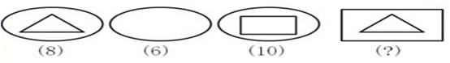
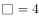
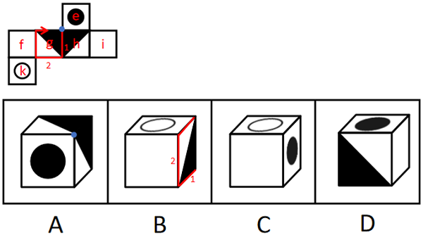
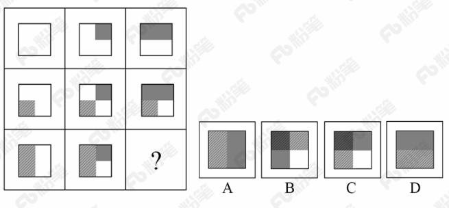

# 2018年421联考《行测》题（海南卷）（网友回忆版）

> 判断推理 · 25 题 · 海南 2018

## 第 1 题　qid 2188770 · 图形推理

从所给四个选项中，选择最合适的一个填入问号处，使之呈现一定的规律性：

- **A**. 3
- **B**. 5
- **C**. 6　✅
- **D**. 7

**答案**：C

**官方解析**

我们发现每个图形下面都对应一个数字，因此图形跟下面的数字有关。图1和图2的区别是内部的一个三角形，也就是减少一个三角形，数量减少2，即；图2和图3的区别是内部的一个长方形，也就是增加一个长方形，数量增加4，即；问号处为一个和一个的组合，即。

故正确答案为C。

---

## 第 2 题　qid 2188065 · 图形推理

下列选项中，和题干所给图形是同一个的是：

- **A**. A
- **B**. B　✅
- **C**. C
- **D**. D

**答案**：B

**官方解析**

将题干展开图标上序号，如下图所示，逐一进行分析。

A项：选项由面e、面g、面h构成，展开图中面e与面g、面h的公共边均为黑色三角形的直角边，选项中面e与面g、面h的公共边为白色三角形的直角边，选项与题干展开图不一致，排除；

B项：选项由面k、面h、面i构成，选项与题干展开图一致，当选；

C项：选项中顶面是面k，侧面是面e，由于面k与面e为相对面，相对面不能同时出现，选项与题干展开图不一致，排除；

D项：选项中顶面是面e，正面是面g或面h，侧面是面f或面i。展开图中面e与面g、面h的公共边均为黑色三角形的直角边，选项中面e与面g或面h的公共边为白色三角形的直角边，选项与题干展开图不一致，排除。

故正确答案为B。 

---

## 第 3 题　qid 2188058 · 图形推理

请从所给四个选项中选择一个最合适的选项填入问号处，使之呈现一定规律性：

- **A**. A　✅
- **B**. B
- **C**. C
- **D**. D

**答案**：A

**官方解析**

元素组成相同，优先考虑位置规律。九宫格优先看横行，第一行图1旋转得到图2，图2上下翻转得到图3。第二行验证规律，图1旋转得到图2，图2上下翻转得到图3，规律成立。则第三行应用此规律，图2由图1旋转得到，故？处图形由图2上下翻转得到，只有A项符合。

故正确答案为A。

---

## 第 4 题　qid 2188070 · 图形推理

从所给四个选项中，选择最合适的一个填入问号处，使之呈现一定的规律性：

- **A**. A
- **B**. B
- **C**. C　✅
- **D**. D

**答案**：C

**官方解析**

题干图形中黑白块比较明显，考虑黑白运算，但整体进行黑白运算无规律。观察题干图形发现，第一行中，第一幅图到第二幅图右上角增加一个灰色方块，第二幅图到第三幅图左上角增加一个灰色方块；第二行中每幅图的左下角均出现了浅灰条纹方块，灰色方块的变化规律同第一行图形，对第三行图形应用此规律，则问号处图形的左上角应为浅灰方块与浅灰条纹方块的叠加，C项图形的左上角为深灰条纹方块，符合题意。
故正确答案为C。

---

## 第 5 题　qid 2187599 · 图形推理

从所给四个选项中，选择最适合的一个填入问号处，使之呈现一定规律性：

- **A**. A
- **B**. B
- **C**. C
- **D**. D　✅

**答案**：D

**官方解析**

元素组成不同，优先考虑属性规律。观察题干发现，图1、3、5、7有封闭区域，优先考虑开闭性。图1、3、5、7有封闭区域，图2、4、6无封闭区域，则？处应选择无封闭区域，排除A、B。对比C、D，发现C是2部分图形，D是1部分图形，而题干均是1部分图形。
故正确答案为D。

---

## 第 6 题　qid 2187604 · 图形推理

从所给四个选项中，选择最适合的一个填入问号处，使之呈现一定的规律性：

- **A**. A
- **B**. B
- **C**. C
- **D**. D　✅

**答案**：D

**官方解析**

元素组成不同，且无明显属性规律，考虑数量规律。观察题干发现，图形出现了单一直线，优先考虑数直线。但直线数没有规律，观察发现横着的线条居多，考虑数横线数，图1至图4横线数均为6条，因此“？”处应选择一个横线数为6的图形。四个选项中，A项有5条横线，B项有2条横线，C项有0条横线，D项有6条横线。
故正确答案为D。

---

## 第 7 题　qid 2187614 · 图形推理

从所给四个选项中，选择最适合的一个填入问号处，使之呈现一定的规律性：

- **A**. 形　✅
- **B**. 94
- **C**. 田
- **D**. XY

**答案**：A

**官方解析**

元素组成不同，且无明显属性规律，考虑数量规律。观察发现，图3、图5出现简单汉字，优先考虑笔画数。题干六幅图的笔画数依次为1、2、3、4、5、6，因此？处应选择一个7笔画图形，A项7笔画，B项2笔画，C项5笔画，D项4笔画，只有A项符合。
故正确答案为A。

---

## 第 8 题　qid 2187597 · 定义判断

生物识别技术，即通过计算机与光学、声学、生物传感器和生物统计学原理等高科技手段密切结合，利用人体固有的生理特征（如指静脉、人脸、虹膜、指纹等）和行为特征（如笔迹、声音、步态等）来进行个人身份的鉴定。
根据上述定义，下列最可能运用了生物识别技术的是：

- **A**. 受害者在旁听了嫌疑人的数码电话录音后，确定了他就是当时的袭击者
- **B**. 警方在犯罪现场找到一张外卖送货小票，通过查询网上外卖订购系统信息，锁定了几个犯罪嫌疑人
- **C**. 某涉密场所设置了严格的门禁，人们只有在密码输入正确且在电阻屏上手写出具有进入权限的工作人员姓名后才能进入
- **D**. 某公司为考核员工出勤情况，引进了指纹打卡机，员工上班时必须输入指纹报到　✅

**答案**：D

**官方解析**

第一步：找出定义关键词。
“通过计算机与高科技手段密切结合”、“利用人体固有的生理特征（如指静脉、人脸、虹膜、指纹等）和行为特征（如笔迹、声音、步态等）”、“进行个人身份的鉴定”。
第二步：逐一分析选项。
A项：通过数码电话录音鉴定身份，不符合“通过计算机与高科技手段密切结合”，不符合定义，排除； 
B项：警方通过查询网上外卖订购系统信息，锁定嫌疑人，不符合“利用人体固有的生理特征和行为特征”，不符合定义，排除；
C项：通过输入密码和手写具有权限的人员姓名鉴定身份，不符合“利用人体固有的生理特征和行为特征”，不符合定义，排除；
D项：通过指纹打卡机鉴定身份，符合“通过计算机与高科技手段密切结合”、“利用人体固有的生理特征（指纹）”、“进行个人身份的鉴定”，符合定义，当选。
故正确答案为D。

---

## 第 9 题　qid 2187609 · 定义判断

甜柠檬效应就是个体在追求预期目标失败时，为了冲淡自己内心的不安，就百般提高现已实现的目标的价值，从而达到心理平衡的现象。
根据上述定义，下列属于“甜柠檬效应”的是：

- **A**. 小明本来想买一台笔记本电脑，结果却在导购员的劝说下购买了平板电脑，使用后他很满意，并一直向朋友推荐
- **B**. 这几周，小红为自己的销售业绩不断下滑而苦恼；但当她知道自己仍是公司的销售状元时，变得放心多了
- **C**. 小文的数学成绩又让他的辅导老师失望了，老师最后只能用“比起上一次，还是有进步”来安慰自己　✅
- **D**. 据教练估计，小张需要减肥到60千克才能达到他想要的健身效果，可是小张在减到63千克时就放弃了，因为他觉得自己足够健美了

**答案**：C

**官方解析**

第一步：找出定义关键词。

“个体追求预期目标失败”、“为了冲淡自己内心的不安”、“百般提高现已实现的目标的价值”、“达到心理平衡”。

第二步：逐一分析选项。

A项：小明本来想买电脑最后买了平板电脑，没有实现预期目标，但是使用后很满意，不符合“为了冲淡自己内心的不安”、“百般提高现已实现的目标的价值”，不符合定义，排除；

B项：小红为销售业绩下滑而苦恼符合“个人追求预期目标失败”，但小红为销售状元是客观事实，不符合“为了冲淡自己内心的不安”、“百般提高现已实现的目标的价值”，不符合定义，排除；

C项：小文数学成绩让辅导老师失望，老师对小文的成绩的心理预期没有达到，符合“个体追求预期目标失败”，老师最后只能安慰自己小文比上一次进步了，符合“百般提高现已实现的目标的价值”，符合定义，当选；

D项：减肥到60千克才能达到效果是教练提出的目标，小张在63千克时放弃了，是小张自己主动放弃了，并不符合追求个人目标失败，不符合定义，排除。

故正确答案为C。

---

## 第 10 题　qid 2187575 · 定义判断

健康教育是为促进人们自发地、自觉地接受并采取有益于健康的行为与生活方式，根除或者减少对健康有影响的危险因素，预防疾病并达到促进身心健康和提高生活质量的目标而开展的有组织、有计划的系统的社会教育活动。
根据上述定义，下列属于健康教育的是：

- **A**. 某公司在乡下举办健康知识讲座，并以此为机会向老人们推销保健品
- **B**. 某高校开设的一门“心理健康”选修课非常受同学们欢迎，甚至附近的市民都来蹭课
- **C**. 周日某医院组织医务人员在小区广场举行义诊活动，免费为居民提供测血压、量体温以及医疗咨询等服务
- **D**. 为防范入秋以来老年人心脑血管疾病高发的现象，社区每年9月份都会聘请知名专家针对老年居民举行系列讲座，普及相关医疗知识　✅

**答案**：D

**官方解析**

第一步：找出定义关键词。
“为促进人们自发地、自觉地接受并采取有益于健康的行为与生活方式”、“根除或者减少对健康有影响的危险因素”、“开展社会教育活动”。
第二步：逐一分析选项。
A项：某公司举办健康知识讲座是为了推销保健品，不符合“为促进人们自发地、自觉地接受并采取有益于健康的行为与生活方式”，不符合定义，排除；
B项：某高校开设的选修课，不符合“开展社会教育活动”，不符合定义，排除；
C项：某医院举行义诊活动，免费为居民提供服务，不符合“开展社会教育活动”，不符合定义，排除；
D项：为防范老年人心脑血管疾病高发的现象，符合“根除或者减少对健康有影响的危险因素”，社区举行讲座，普及医疗知识符合“为促进人们自发地、自觉地接受并采取有益于健康的行为与生活方式”以及“开展社会教育活动”，符合定义，当选。
故正确答案为D。

---

## 第 11 题　qid 2187594 · 定义判断

横向交往和纵向交往是组织内员工通过人际互动构建社会资本过程的两种工具性交往风格。横向交往是指个体通过与自身周围社会地位相似的群体建立广泛联系的过程；纵向交往是指个体能动地与社会中占据主导资源支配的群体建立关系的过程。
根据上述定义，下列属于纵向交往的是：

- **A**. 每到节假日，院长都会代表学院去慰问对学院作出巨大贡献的退休干部
- **B**. 老刘对自己家的保姆非常满意，为了让保姆过完春节后继续过来工作，他赠送了保姆探亲的往返机票
- **C**. 老张为了能够继续顺利地承包村里的鱼塘，主动和村民搞好关系，每年春节都给村民免费发放几条鱼
- **D**. 某家长为了让班级任课老师严格要求自己的孩子，节假日都会给老师们发去问候的短信　✅

**答案**：D

**官方解析**

第一步：找出定义关键词。
纵向交往：“个体能动地”、“与社会中占据主导资源支配的群体建立关系”；
横向交往：“个体通过与自身周围社会地位相似的群体建立广泛联系”。
第二步：逐一分析选项。
A项：院长慰问退休干部，退休干部不符合“社会中占据主导资源支配的群体”，不符合“纵向交往”定义，排除；
B项：老刘赠送保姆机票，保姆不符合“社会中占据主导资源支配的群体”，不符合“纵向交往”定义，排除；
C项：老张和村民搞好关系，村民不符合“社会中占据主导资源支配的群体”，不符合“纵向交往”定义，排除；
D项：为了让班级任课老师严格要求自己的孩子，说明老师在孩子教育上是“社会中占据主导资源支配的群体”，家长节假日都会给老师们发去问候的短信，符合“个体能动地与社会中占据主导资源支配的群体建立关系”，符合“纵向交往”定义，当选。
故正确答案为D。

---

## 第 12 题　qid 2187589 · 定义判断

慎微，即重视并正确处理细小的事情；慎初，即把住第一次，守住第一关。
根据上述定义，下列最不能体现“慎微”这一原则的是：

- **A**. 妇女权益保护机构的工作人员劝诫人们：家庭暴力不是小事，而是犯罪，大家对此一定要零容忍　✅
- **B**. 小菲最近在积极瘦身，她毅力十足，高热量的食物一次都没吃，哪怕是一丁点儿
- **C**. 李大叔为一年后的马拉松赛而完成了人生的第一次长跑，他计划着每天都会比前一天多跑一些，这样子就能渐渐达到马拉松的里程
- **D**. 妈妈对小明的学习要求十分严格，如果儿子因为马虎大意犯了小错，也会立刻纠正他

**答案**：A

**官方解析**

第一步：找出定义关键词。
慎微：“重视并正确处理细小的事情”；
慎初：“把住第一次，守住第一关”。
第二步：逐一分析选项。
A项：劝诫人们要对家庭暴力零容忍，家庭暴力不是小事，即家庭暴力是大事要重视，不符合“重视并正确处理细小的事情”，不符合“慎微”定义，当选；
B项：减肥的小菲“一丁点的高热量食物”都没有吃，符合“重视并正确处理细小的事情”，符合“慎微”定义，排除；
C项：李大叔为了一年后的马拉松赛而完成了人生的第一次长跑，每天要比以前“多跑一些”，符合“重视并正确处理细小的事情”，符合“慎微”定义，排除；
D项：妈妈对小明要求严格，小明犯了“小错”也会立即纠正，符合“重视并正确处理细小的事情”，符合“慎微”定义，排除。
本题为选非题，故正确答案为A。

---

## 第 13 题　qid 2187596 · 类比推理

左顾右盼∶上下打量

- **A**. 南来北往∶东西奔走　✅
- **B**. 纵横交错∶中西合璧
- **C**. 千叮万嘱∶一心一意
- **D**. 天高地厚∶山清水秀

**答案**：A

**官方解析**

第一步：判断题干词语间逻辑关系。
左顾右盼指左右来回看；上下打量指上下看，二者都有看的意思，是近义关系，并且左顾右盼中的“左右”是反义关系，上下打量中的“上下”是反义关系。
第二步：判断选项词语间逻辑关系。
A项：南来北往指南北方向来回奔走；东西奔走指东西方向来回奔走，二者都有到处奔走的意思，是近义关系，并且南来北往中的“南北”是反义关系，东西奔走中的“东西”是反义关系，与题干逻辑关系一致，当选；
B项：纵横交错指横的竖的交叉在一起；中西合璧指中国和外国的好东西和建筑、名胜合到一块，二者不是近义关系，与题干逻辑关系不一致，排除；
C项：千叮万嘱指再三叮嘱；一心一意指做事专心，一门心思只做一件事，二者不是近义关系，与题干逻辑关系不一致，排除；
D项：天高地厚指恩情深厚，也指事物的复杂、深奥程度；山清水秀指山水风景优美，二者不是近义关系，与题干逻辑关系不一致，排除。
故正确答案为A。

---

## 第 14 题　qid 2188141 · 类比推理

领悟：大彻大悟

- **A**. 哭泣：放声痛哭　✅
- **B**. 微笑：哈哈大笑
- **C**. 昏迷：昏天暗地
- **D**. 喝酒：纸醉金迷

**答案**：A

**官方解析**

第一步：判断题干词语间逻辑关系。
大彻大悟有领悟的意思，且大彻大悟是一种极致的领悟。
第二步：判断选项词间逻辑关系。
A项：放声痛哭具有哭泣的意思，且放声痛哭是一种极致的哭泣，与题干逻辑关系一致，当选；
B项：哈哈大笑就是大声笑，微笑是不显著的笑容，哈哈大笑不包含微笑的意思，且哈哈大笑不是一种极致的微笑，而是一种极致的笑，与题干逻辑关系不一致，排除；
C项：昏天暗地形容天色昏暗，也比喻社会黑暗混乱，与昏迷无明显逻辑关系，与题干逻辑关系不一致，排除；
D项：纸醉金迷形容叫人沉迷的奢侈豪华的环境，与喝酒无明显逻辑关系，与题干逻辑关系不一致，排除。
故正确答案为A。

---

## 第 15 题　qid 2187590 · 类比推理

秤∶重量

- **A**. 水∶浮力
- **B**. 地图∶距离
- **C**. 台灯∶光亮
- **D**. 尺子∶长度　✅

**答案**：D

**官方解析**

第一步：判断题干词语间逻辑关系。
秤是用来测量重量的，二者是测量工具和测量对象的对应关系。
第二步：判断选项词语间逻辑关系。
A项：水可以产生浮力，并不是测量浮力的工具，与题干逻辑关系不一致，排除；
B项：地图可以显示距离，并不是测量距离的工具，与题干逻辑关系不一致，排除；
C项：台灯可以发出光，带来光亮，二者为功能对应关系，与题干逻辑关系不一致，排除；
D项：尺子是测量工具，是用来测量长度的，二者是测量工具和测量对象的对应关系，与题干逻辑关系一致，当选。
故正确答案为D。

---

## 第 16 题　qid 2188089 · 类比推理

建筑∶房屋∶房间

- **A**. 汽车∶越野车∶车窗
- **B**. 电器∶电视机∶屏幕　✅
- **C**. 医院∶私立医院∶医生
- **D**. 餐具∶盘子∶筷子

**答案**：B

**官方解析**

第一步：判断题干词语间逻辑关系。
房屋是一种建筑，二者是种属关系，房间是房屋的组成部分，二者是组成关系，且房屋通过房间体现作用。
第二步：判断选项词语间逻辑关系。
A项：越野车是汽车的一种，二者是种属关系，车窗是越野车的组成部分，二者是组成关系，但越野车并不是通过车窗体现作用，与题干逻辑关系不一致，排除；
B项：电视机是一种电器，二者是种属关系，屏幕是电视机的组成部分，二者是组成关系，且电视通过屏幕体现作用，与题干逻辑关系一致，当选；
C项：私立医院是一种医院，二者是种属关系，但医生与私立医院是职业与工作地点的对应关系，与题干逻辑关系不一致，排除；
D项：盘子是一种餐具，二者是种属关系，但筷子和盘子都是餐具，二者是并列关系，与题干逻辑关系不一致，排除。
故正确答案为B。

---

## 第 17 题　qid 2187578 · 类比推理

拖鞋∶皮鞋∶场合

- **A**. 药物∶手术∶病情　✅
- **B**. 川菜∶凉菜∶味道
- **C**. 跑步∶踢球∶体力
- **D**. 茶水∶咖啡∶爱好

**答案**：A

**官方解析**

第一步：判断题干词语间逻辑关系。
拖鞋和皮鞋都是鞋子的一种，二者是并列关系，且不同的场合选择的鞋子不同。
第二步：判断选项词语间逻辑关系。
A项：药物和手术都是治疗方式的一种，二者是并列关系，且不同的病情选择的治疗方式不同，与题干逻辑关系一致，保留；
B项：川菜和凉菜是交叉关系，且无法按照不同的味道选择，与题干逻辑关系不一致，排除；
C项：跑步和踢球都是运动方式的一种，二者是并列关系，但无法按照不同的体力来选择，与题干逻辑关系不一致，排除；
D项：茶水和咖啡都是饮品的一种，二者是并列关系，根据不同的爱好可以选择喝茶水和喝咖啡，与题干逻辑关系一致，保留。
对比A项和D项，场合和病情是客观的，而爱好是主观的，故A项与题干逻辑关系更近。
故正确答案为A。
注：拖鞋和皮鞋也可以看作交叉关系，与B项中川菜和凉菜的逻辑关系相同，但B项无法按照不同的味道选择川菜和凉菜，与题干逻辑关系不一致，所以不能选B项。

---

## 第 18 题　qid 2187576 · 类比推理

蜘蛛∶织网∶爬行

- **A**. 蚕∶破蛹∶吐丝
- **B**. 蜜蜂∶酿蜜∶飞行　✅
- **C**. 夜莺∶筑巢∶歌唱
- **D**. 猎豹∶奔跑∶捕食

**答案**：B

**官方解析**

第一步：判断题干词语间逻辑关系。
“蜘蛛”“织网”为主谓宾结构，“蜘蛛”“爬行”为主谓结构。
第二步：判断选项词语间逻辑关系。
A项：“蚕”“破蛹”为主谓宾结构，“蚕”“吐丝”也为主谓宾结构，与题干逻辑关系不一致，排除；
B项：“蜜蜂”“酿蜜”为主谓宾结构，“蜜蜂”“飞行”为主谓结构，与题干逻辑关系一致，当选；
C项：“夜莺”“筑巢”为主谓宾结构，“夜莺”“歌唱”为主谓结构，但“歌唱”是一种拟人化的表述，并非“夜莺”的生物学行为，与题干逻辑关系不一致，排除；
D项：“猎豹”“奔跑”为主谓结构，与题干逻辑关系不一致，排除。
故正确答案为B。

---

## 第 19 题　qid 2187619 · 类比推理

行驶超过60万千米的汽车都应当报废处理；有些行驶超过60万千米的汽车存在设计缺陷；在应当报废的汽车中有些不是T品牌汽车；所有T品牌汽车都不存在设计缺陷。
如果以上判断正确，则必定成立的是：

- **A**. 有些T品牌汽车应当报废
- **B**. 有些T品牌汽车不应当报废
- **C**. 应当报废的汽车都行驶超过60万千米
- **D**. 有些存在设计缺陷的汽车应当报废　✅

**答案**：D

**官方解析**

第一步：翻译题干。

①超60万千米报废；

②有些超60万千米设计缺陷；

③有些报废T品牌；

④T品牌设计缺陷；

将②换位可得：有些设计缺陷超60万千米，和①可以递推出：⑤有些设计缺陷超60万千米报废。

第二步：逐一分析选项。

A项：翻译为有些T品牌报废，由③“有些报废T品牌汽车”，推不出，排除；

B项：翻译为有些T品牌报废，由③“有些报废T品牌”无法得到“有些T品牌”的情况，推不出，排除；

C项：翻译为报废超60万千米，是对①的肯后，但肯后得不到确定性的结论，推不出，排除；

D项：翻译为有些设计缺陷报废，是对⑤的肯前，肯前必肯后，可以推出，当选。

故正确答案为D。

---

## 第 20 题　qid 2187639 · 逻辑判断

美国斯坦福大学的研究人员对130名同时患有血脂异常、高血压（并未服用降压药）的患者进行了长达12年的试验。在试验中，研究人员将这130名研究对象随机分成人数相等的两组，并让其中的一组研究对象服用松树皮提取物（每天服用的剂量为200毫克），另一组研究对象服用安慰剂。在这12年中，研究人员每6周测量1次研究对象的血压、血糖、胆固醇及C反应蛋白的水平。试验结果显示，服用松树皮提取物人员的上述各项指标与服用安慰剂人员的上述各项指标并无明显的差别。由此可知，松树皮提取物无降血压、降血糖、降血脂以及预防心血管疾病等功效。
以下各项如果为真，最能反驳上述结论的是：

- **A**. 两组试验患者仅人数相等，其血压和血脂等的原始指标差异较大　✅
- **B**. 对照组服用安慰剂，对高血压和高血脂患者有心理暗示作用
- **C**. 12年的实验时间太长，这有可能使一些重要的实验数据失真
- **D**. 参加实验的患者人数仅130人，样本太小，代表性不够

**答案**：A

**官方解析**

第一步：找出论点和论据。
论点：松树皮提取物无降血压、降血糖、降血脂以及预防心血管疾病等功效。
论据：试验结果显示，服用松树皮提取物人员的上述各项指标与服用安慰剂人员的上述各项指标并无明显的差别。
论点论据都在说松树皮提取物无降压、降糖、降脂以及预防心血管疾病等功效，二者话题一致，削弱优先考虑削弱论点，其次考虑削弱论据。
第二步：逐一分析选项。
A项：此选项说明两组试验患者除了分别服用松树皮提取物和安慰剂外，其血压和血脂等的原始指标还差异较大，说明实验前起点不一致，能削弱，保留；
B项：此选项说明对照组服用安慰剂后有一定的心理暗示作用，但是心理暗示会降低还是升高他们的各项指标不确定，属于不明确选项，无法削弱，排除；
C项：此选项说明实验数据存在失真的可能，为可能性削弱，保留；
D项：此选项说明样本太小，代表性不够，有一定的削弱力度，保留。
对于A、C、D项，C项为可能性削弱，D项只是样本量不够，不具有代表性；但是A项直接说明题干实验本身就是有问题的，削弱力度更强，择优选A。
故正确答案为A。

---

## 第 21 题　qid 2188097 · 类比推理

某行政部门需选派人员参加对口扶贫工作。对此，书记、局长和副局长有如下要求：
书记：如果不选派李科长参加对口扶贫，那么就选派马科长参加对口扶贫；
局长：如果不选派马科长参加对口扶贫，那么也不选派李科长参加对口扶贫；
副局长：要么选派马科长参加对口扶贫，要么选派李科长参加对口扶贫。
下面各项中，同时符合书记、局长和副局长三者要求的是：

- **A**. 马科长参加对口扶贫　✅
- **B**. 李科长参加对口扶贫
- **C**. 马科长、李科长都参加对口扶贫
- **D**. 马科长、李科长都不参加对口扶贫

**答案**：A

**官方解析**

第一步：翻译题干。 ①书记：李科长马科长 ②局长：马科长李科长 ③副局长：要么马科长，要么李科长 将②逆否可以推出④：李科长马科长 第二步：逐一分析选项。 根据①和④，无论李科长是否参加，马科长都会参加，再根据③可知，马科长和李科长只有一个参加，那么李科长不参加，A项可以推出。 故正确答案为A。

---

## 第 22 题　qid 2188103 · 逻辑判断

水熊虫是一种小型水生动物，又称缓步动物。水熊虫是地球上已知生命力最强的生物，它可以在没有防护措施的条件下在极端压力环境中生存。缓步动物的奇特能力促使研究人员对其基因组展开调查。目前，对缓步动物的第一次基因组测序结果显示，在缓步动物演化过程中，通过水平基因转移（不同物种基因组之间的DNA转移），从其他物种中获得了大量基因。
以下各项如果为真，最能质疑上述观点的是：

- **A**. 基因检测发现水熊虫体内有一种基因，其蛋白质能够抵抗人类培养细胞内的DNA损伤
- **B**. 水熊虫可以在太空真空环境中长时间生存，在冰冻30多年之后也能成功复苏
- **C**. 水熊虫从祖先那里继承所有基因，体内遗传物质中没有发现来自植物或者微生物的　✅
- **D**. 水熊虫体内遗传物质存在一种非常奇怪的“混搭”法，正是这种“混搭”才使水熊虫以更复杂的方式生长和发育

**答案**：C

**官方解析**

第一步：找出论点和论据。
论点：在缓步动物演化过程中，通过水平基因转移（不同物种基因组之间的DNA转移），从其他物种中获得了大量基因。
论据：无。
第二步：逐一分析选项。
A项：论点说的是水熊虫从其他物种中获得了大量基因，该项说的是水熊虫体内有一种基因，其蛋白质能够抵抗人类培养细胞内的DNA损伤，话题不一致，无法削弱，排除；
B项：论点说的是水熊虫从其他物种中获得了大量基因，该项说的是水熊虫可以在太空真空和冰冻这样的极端环境中生存，话题不一致，无法削弱，排除；
C项：水熊虫从祖先那里继承了所有的基因，体内遗传物质中没有发现来自植物或者微生物的，说明水熊虫并没有从其他物种获得大量基因，否定了论点，当选；
D项：水熊虫体内遗传物质存在“混搭”，“混搭”说明水熊虫可能从其他物种获得了大量基因，支持了论点，排除。
故正确答案为C。

---

## 第 23 题　qid 2187621 · 逻辑判断

2017年，可以说是我国电影发展的重要一年。然而，一些电影从业者则认为：中国是电影大国，但不是电影强国。
以下各项如果为真，最不能质疑这些电影从业者观点的是：

- **A**. 我国电影年产量达到近800部，位居世界前列；而全年500多亿元的总票房更是稳居全球第一
- **B**. 我国的银幕总量、观众人次已经超过电影界长期的领头羊——北美市场，并且，观众的电影需求依旧旺盛，我国电影市场的潜力还有待挖掘
- **C**. 判断一个国家是否是电影强国的最主要依据是其电影的全球竞争力，而国产电影的市场主要在大陆，和美国等传统电影强国差距较大，国际票房甚至低于印度　✅
- **D**. 中国电影业受近代中国曲折坎坷的命运的决定性影响，它发展多舛，但自2002年起，我国电影以奇迹般的发展速度迅速崛起，并预计将在未来10年内超越电影头号强国美国

**答案**：C

**官方解析**

第一步：找出论点和论据。
论点：中国是电影大国，但不是电影强国。
论据：无。
第二步：逐一分析选项。
A项：我国电影年产量位居世界前列，总票房稳居世界第一，指出中国在电影上取得了多项成就，说明中国属于电影强国，否定了论点，排除；
B项：我国的银幕总量、观众人次已经超过行业领头羊，说明中国在电影上取得了多项成就，属于电影强国，并且观众的需求依旧旺盛，市场的潜力还有待挖掘，说明未来还有很大的发展空间，否定了论点，排除；
C项：判断一个国家是否是电影强国的最主要依据是其全球竞争力，而国产电影和传统电影强国差距较大，国际票房较低，说明中国现在的全球竞争力并不强，不属于电影强国，加强了论点，当选；
D项：我国电影以奇迹般的速度崛起，说明我国电影发展速度很快，并且我国电影预计将在未来十年内超越电影头号强国美国，说明我国电影现在已位于电影强国之列，只不过还不是头号强国，有一定的削弱力度，排除。
本题为选非题，故正确答案为C。

---

## 第 24 题　qid 2187616 · 逻辑判断

微生物组在地球生态系统和人类健康中的作用超乎想象，它不仅将极大地帮助人类克服当今所面临的生存挑战，还能提供人类未来生存之道，这其中有一个道理，就是微生物之间能够互相协作，使得它们在生态系统中更加稳定、更加有效地发挥作用，并赋予微生物组具有超越单个微生物的更为强大的功能。
以下各项如果为真，最能支持上述观点的是：

- **A**. 美国的“国家微生物组计划”正是为了在所有的生态系统、大自然及人造世界里推动最前沿的微生物科学研究
- **B**. 作为新兴产业的生物农药和生物肥料，近年来在蓬勃发展，其在国际上的市场份额也逐年快速递增
- **C**. 将多种微生物一起培养，其生物系统的稳定性和适应能力都大为提高，其对某些有害化合物的降解效率也提升了　✅
- **D**. 酿酒微生物场所提供了多种多样的微生物资源，可以从中发掘高效纤维素降解霉菌、高乙醇合成酵母等

**答案**：C

**官方解析**

第一步：找出论点和论据。
论点：微生物组在地球生态系统和人类健康中的作用超乎想象。
论据：微生物组不仅将极大地帮助人类克服当今所面临的生存挑战，还能提供人类未来生存之道；微生物之间能够互相协作，使得它们在生态系统中更加稳定、更加有效地发挥作用，并赋予微生物组具有超越单个微生物的更为强大的功能。
第二步：逐一分析选项。
A项：论点说的是微生物组对地球生态系统和人类健康的作用，该项说的是美国“国家微生物组计划”的研究内容，话题不一致，无法加强，排除；
B项：论点说的是微生物组对地球生态系统和人类健康的作用，该项说的是生物农药和生物肥料的市场份额，话题不一致，无法加强，排除；
C项：多种微生物一起培养，微生物系统的稳定性和适应能力提高，对有害化合物的降解效率也会提高，指出微生物之间相互协作确实可以发挥更为强大的功能，补充论据，可以加强，当选；
D项：论点说的是微生物组对地球生态系统和人类健康的作用，该项说的是酿酒的微生物可以合成酵母，并没有涉及多种微生物是否合作，是否有更强大的功能的问题，话题不一致，无法加强，排除。
故正确答案为C。

---

## 第 25 题　qid 2187636 · 逻辑判断

甘肃境内大地湾彩陶的发现解决了中国彩陶艺术的起源地问题。20世纪初，为了探索华夏文明的源头，学术界从考古、文献两个角度作出尝试和努力。1923年，为了寻找彩陶的起源，瑞典地质学家安特生来到甘肃，随着甘肃马家窑彩陶的不断出土，安特生认为，甘肃彩陶受西欧、西亚彩陶的影响比较明显。但是，之后大地湾一期出土的彩陶在年代上明显要早于马家窑彩陶，与目前发现的最早含有彩陶文化的西亚两河流域的耶莫有陶文化、哈孙纳文化的年代大致相当。
据此，我们可以推出：

- **A**. 华夏文明受西欧、西亚文化影响明显
- **B**. 甘肃是世界最早产生彩陶的区域之一　✅
- **C**. 大地湾彩陶文化是最早的彩陶文化
- **D**. 甘肃地区是华夏文明的起源地

**答案**：B

**官方解析**

日常结论题，根据题干信息逐一分析选项。
A项：题干中指出，甘肃彩陶受西欧、西亚彩陶的影响比较明显，不能代表整个华夏文明受西欧、西亚文化影响明显，无法推出，排除；
B项：题干最后一句指出，大地湾彩陶与目前发现的最早含有彩陶文化的西亚两河流域的耶莫有陶文化、哈孙纳文化的年份大致相当，可以推出甘肃是世界最早产生彩陶的区域之一，当选；
C项：题干最后一句指出，大地湾彩陶与目前发现的最早含有彩陶文化的西亚两河流域的耶莫有陶文化、哈孙纳文化的年份大致相当，不代表大地湾彩陶文化是最早的彩陶文化，无法推出，排除；
D项：题干第一句指出，甘肃境内大地湾是中国彩陶艺术的起源地，选项中甘肃地区是华夏文明的起源地，彩陶艺术起源地不能代表整个华夏文明的起源地，无法推出，排除。
故正确答案为B。

---
