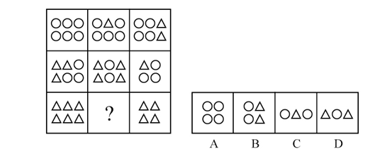
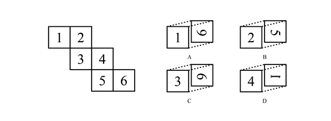
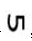
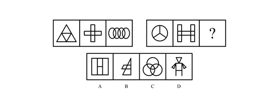
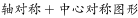
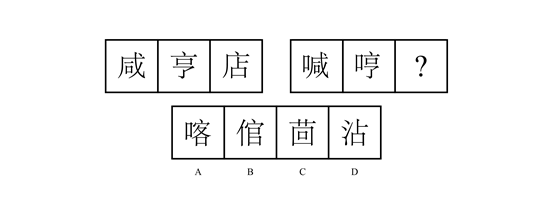
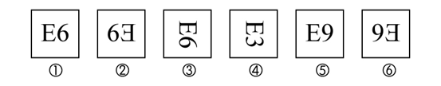
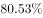

# 2018年421联考《行测》题（陕西卷）（网友回忆版）

> 判断推理 · 35 题 · 陕西 2018

## 第 1 题　qid 2188173 · 图形推理

从所给的四个选项中，选择最合适的一个填入问号处，使之呈现一定的规律性：

- **A**. A
- **B**. B
- **C**. C　✅
- **D**. D

**答案**：C

**官方解析**

图形出现多个小元素，优先考虑数素。观察发现，元素种类和个数均无规律，考虑元素换算。九宫格优先看横行，第一行利用，发现两边全部消掉了，无法得出和的关系，因此考虑用第二行做运算，第二行利用图2可以得到，则换算后第一行图形中小三角数量依次为12、11、10；同理，第二行小三角数量依次为9、8、7；第三行小三角数量依次为：6、？、4，所以？处为5个小三角。四个选项换算后，分别为8、6、5、4个小三角。只有C项符合。

故正确答案为C。

---

## 第 2 题　qid 2188177 · 图形推理

左边给定的是某正方体纸盒的外表面展开图，下列哪一项与该正方体是一致的？

- **A**. A
- **B**. B
- **C**. C
- **D**. D　✅

**答案**：D

**官方解析**

本题考查六面体的空间重构。

A项：选项中面1与面6是相对面，而题干面1与面4是相对面，选项与题干不一致，排除；

B项：从内表面看到的应该是面5的镜像，即，而不能是正常的数字，排除；

C项：从内表面看到的应该是面6的镜像，即，而不能是正常的数字，排除；

D项：选项与题干一致，当选。

故正确答案为D。 

---

## 第 3 题　qid 2188180 · 图形推理

从所给的四个选项中，选择最合适的一个填入问号处，使之呈现一定的规律性：

- **A**. A
- **B**. B
- **C**. C
- **D**. D　✅

**答案**：D

**官方解析**

第一种解析：

元素组成不同，无明显属性规律，优先考虑数量规律。观察发现，出现多圆相交，优先考虑笔画数。第一组图均为1笔画图形，第二组图中，前两幅图均为2笔画图形，因此？处选择一个笔画数为2的图形。A项3笔画，B项1笔画，C项1笔画，D项2笔画，只有D相符合。

故正确答案为D。

第二种解析： 

元素组成不同，优先考虑属性规律。观察发现题干第一组图中图一出现了等腰三角形，优先考虑对称性。题干第一组图中图1为轴对称图形，图2为，图3为，则第二组图应用此规律，图1为轴对称图形，图2为，故？处应该选择一个，只有A项符合。

故正确答案为A。

第三种解析：

元素组成不同，无明显属性规律，优先考虑数量规律。观察发现，每幅图都是由同一种图形组成，只有C项符合。

故正确答案为C。

粉笔倾向于第一种规律。原因有二：

一、两组图的形式一般考查整个一组图的整体规律（如一组图均为轴对称图形或均为中心对称图形）或者一组图中的三幅图规律呈对称的形式（如图1和图3是一样的规律），因此，第二种规律不严谨。

二、本题题干图形笔画的特征图（如第一组图的图3以及C选项都是笔画的典型特征图多圆相交）非常明显，因此猜测命题人的意图是考查笔画数, 因此，第二种和第三种规律都不严谨。

综上所述，第一种规律即笔画数更严谨，故粉笔倾向于选择D。

---

## 第 4 题　qid 2188184 · 图形推理

从所给的四个选项中，选择最合适的一个填入问号处，使之呈现一定的规律性：

- **A**. A
- **B**. B
- **C**. C
- **D**. D　✅

**答案**：D

**官方解析**

解法一：元素组成相似，优先考虑样式规律。观察发现，题干两组图中，第一幅图均有“咸”，第二幅图均有“亨”，第三幅图也应具有相同部分，只有D项符合。
故正确答案为D。
解法二：元素组成不同，无明显属性规律，优先考虑数量规律。观察题干发现，汉字的窟窿比较多，优先考虑数面。第一组图的面数量均为1，第二组图前两幅图的面数量为2，因此？处应选择一个面数量为2的图形，排除AD项。再观察题干图形发现，第一组图每幅图均出现“、”元素，第二组图中的图形也应均出现“、”元素，只有B项符合。
故正确答案为B。
解法三：元素组成相似，优先考虑样式规律。观察题干发现，第一组图都有1个“口”，第二组图都有2个“口”，因此？处应选择有2个“口”的图形，排除D项。再观察题干图形发现，第二组图中的2个“口”都是在汉字的左半部分和右半部分，只有A项符合。
故正确答案为A。
解法四：元素组成不同，无明显属性规律，优先考虑数量规律。观察题干发现，汉字的窟窿比较多，优先考虑数面。第一组图的面数量均为1，第二组图前两幅图的面数量为2，因此？处应选择一个面数量为2的图形，排除AD项。再观察题干图形发现，第一组图每幅图均出一个“口”，第二组图每幅图均出现了两个“口”，排除B项，只有C项符合。
故正确答案为C。
注：此题为争议题，我们根据题干特征，明显包括相同部分，并且该规律更加简单明确，因此我们择优选D。

---

## 第 5 题　qid 2188191 · 图形推理

把下列六个图形分成两类，使每一类图形都有各自的共同特征或规律，分类正确的一项是：

- **A**. ①③⑥，②④⑤　✅
- **B**. ①②③，④⑤⑥
- **C**. ①②④，③⑤⑥
- **D**. ①③④，②⑤⑥

**答案**：A

**官方解析**

题干图形出现了开口的字母和数字，考虑每幅图的字母和数字的开口方向，故①③⑥为一组，字母和数字开口方向一致；②④⑤为一组，字母和数字开口方向相对。
故正确答案为A。

---

## 第 6 题　qid 2188172 · 定义判断

近因效应是指在总体印象形成过程中，新近获得的信息对人们认知的影响，远远大于以往所获得的信息。这是因为，在印象形成过程中，人们对原来的印象逐渐淡忘，当有新信息进入视野时，容易对人们的感官产生新的刺激，从而形成最新的印象，直接影响人们的认知和判断。
根据以上定义，下列不属于近因效应的一项是：

- **A**. 某社会名流声名卓著，到了晚年却因为一桩丑闻而臭名昭著
- **B**. 面试时衣冠整洁，给人以良好的印象，被录取的几率也较大　✅
- **C**. 夫妻本来感情很好，因为一件小事吵架，闹嚷着要离婚
- **D**. 小玲和小菲是多年好友，因小玲最近“得罪”了小菲，两人形同陌路

**答案**：B

**官方解析**

第一步：找出定义关键词。
“新近获得的信息对人们认知的影响，远远大于以往所获得的信息”。
第二步：逐一分析选项。
A项：该社会名流原来名声很好，到了晚年也就是新近时期，却因为一桩丑闻臭名昭著，符合“新近获得的信息对人们认知的影响，远远大于以往所获得的信息”，符合定义，排除；
B项：面试的时候衣冠整洁会给人留下好印象，增加录取几率，没有以往和新近信息对人们认知上影响的对比，不符合“新近获得的信息对人们认知的影响，远远大于以往所获得的信息”，不符合定义，当选；
C项：夫妻本来感情很好，说明夫妻之间以往的关系很好，因为一件小事吵架，体现了新近时期双方之间关系不好，最终闹嚷着要离婚，符合“新近获得的信息对人们认知的影响，远远大于以往所获得的信息”，符合定义，排除；
D项：小玲和小菲好友多年，说明以往两人的关系很好，最近因为小玲得罪了小菲, 体现了近期两人之间关系不好，最终两人形同陌路，符合“新近获得的信息对人们认知的影响，远远大于以往所获得的信息”，符合定义，排除。
本题为选非题，故正确答案为B。

---

## 第 7 题　qid 2188174 · 定义判断

激励不相容是指在委托代理关系中，委托人和代理人双方都会以自己的利益最大化来指导自己的行为，制度安排使他们在目标和行为上出现不一致，那些符合委托人利益的目标却无法对代理人产生激励作用的现象。
根据以上定义，下列属于激励不相容的是：

- **A**. 甲单位采取措施让每个员工在为企业多做贡献中成就自己的事业
- **B**. 乙公司职位晋升中论资排辈现象严重，新人进入一段时间后工作积极性大大降低
- **C**. 丙在保险公司购买了医疗保险后，没有像以前那样有规律的作息，开始熬夜，酗酒　✅
- **D**. 丁医院对医生实行挂号费递增提成制度，医生每个月接的挂号单越多，提成比例越高

**答案**：C

**官方解析**

第一步：找出定义关键词。
“委托代理关系中”、“目标和行为出现不一致”、“符合委托人利益的目标却无法对代理人产生激励作用”
A项：单位让员工多做贡献成就自己的事业，意味着单位受益的同时，员工也可以成就自己的事业，对自己有益，不符合“目标和行为不一致”，不符合定义，排除；
B项：乙公司职位晋升未体现委托人和代理人的目标有冲突，不符合“目标和行为出现不一致”，不符合定义，排除；
C项：丙在保险公司购买医疗保险符合“委托代理关系中”，但是丙的行为跟其投保的目的相违背，符合“目标和行为出现不一致”，最终丙的这种行为会导致出险率提高，符合“符合委托人利益的目标无法对代理人产生激励作用”，符合定义，当选；
D项：丁医院对医生实行挂号费递增提成制度，医院和医生同时可以受益，不符合“目标和行为不一致”，不符合定义，排除。
故正确答案为C。

---

## 第 8 题　qid 2188179 · 定义判断

商业生态系统是指组织和个人组成的经济联合体，其成员包括核心企业、消费者、市场中介、供应商、风险承担者等，在一定程度上还包括竞争者，这些成员之间构成了价值链，不同的链之间相互交织形成了价值网，物质、能量和信息等通过价值网在联合体成员间流动和循环，从而形成整体的竞争优势。
根据以上定义，下列企业行为与商业生态系统不符合的一项是：

- **A**. 日立公司强调如何利用企业的内部资源来形成竞争优势　✅
- **B**. 滴滴公司通过建设一个信息平台，撬动圈内其他企业和个人的资源
- **C**. 飞利浦和美国电话电报公司合作，也同德国西门子公司合作
- **D**. 苹果公司和微软公司的关系很复杂，既合作又竞争

**答案**：A

**官方解析**

第一步：找出定义关键词。
“组织和个人组成的经济联合体”、“包括核心企业、消费者、市场中介、供应商、风险承担者等，在一定程度上还包括竞争者”、“经济联合体成员之间构成价值链进而形成价值网”、“形成整体竞争优势”。
第二步：逐一分析选项。
A项：日立公司利用企业内部资源形成竞争优势，内部资源只涉及成员中的核心企业，而不是多成员构成的联合体，不符合“经济联合体成员之间构成价值链进而形成价值网”，不符合定义，当选； 
B项：滴滴公司撬动圈内其他企业和个人的资源，说明滴滴公司与其他企业和个人构成了经济联合体，符合“经济联合体成员之间构成价值链进而形成价值网”、“形成整体竞争优势”，符合定义，排除；
C项：飞利浦和美国电话电报公司以及德国西门子公司合作，说明飞利浦公司和另外两个公司构成经济联合体，符合“经济联合体成员之间构成价值链进而形成价值网”、“形成整体竞争优势”，符合定义，排除；
D项：苹果公司和微软公司合作，说明苹果公司和微软公司构成经济联合体，符合“经济联合体成员之间构成价值链进而形成价值网”、“形成整体竞争优势”，符合定义，排除。
本题为选非题，故正确答案为A。

---

## 第 9 题　qid 2188193 · 定义判断

迭代开发就是由于市场的不确定性高，在需求没被完全地确定之前，开发就迅速启动，每次循环不求完美，但求不断发现新问题，获取和积累新知识，并自适应地控制过程，在一次迭代中完成系统的部分功能，然后将未成熟的产品交付给领先用户，通过他们的反馈来进一步细化需求，从而进入下一轮的迭代，不断获取用户需求、完善产品。
根据以上定义，下列不属于迭代开发的一项是：

- **A**. 甲公司先向市场推出极简的原型产品，以最小的成本和有效方式验证产品是否符合用户需求，然后再结合需求，迅速添加组件
- **B**. 乙公司开发产品时，遵循预先计划的需求、分析、设计、编码、测试的步骤顺序进行，成功开发出新产品　✅
- **C**. 丙公司的某产品在推出5年之后才撤掉之前的测试版字样，成为稳定的产品
- **D**. 丁公司在其开发的软件上采用了开源软件的模式，与用户联合升级软件

**答案**：B

**官方解析**

第一步：找出定义关键词。
“不断发现新问题”、“结合用户反馈的需求完善产品”。
第二步：逐一分析选项。
A项：甲公司推出原型产品，然后结合需求添加组件，符合“不断发现新问题”、“结合用户反馈的需求完善产品”，符合定义，排除； 
B项：乙公司遵循预先计划成功开发出新产品，没有体现边反馈边完善，不符合“不断发现新问题”、“结合用户反馈的需求完善产品”，不符合定义，当选；
C项：丙公司推出5年才撤掉之前的测试版字样，5年内一直在测试中不断完善稳定，符合“不断发现新问题”、“结合用户反馈的需求完善产品”，符合定义，排除；
D项：丁公司与用户联合升级软件，说明丁公司的软件先投入市场，不断根据客户需求升级，符合“结合用户反馈的需求完善产品”，符合定义，排除。
本题为选非题，故正确答案为B。

---

## 第 10 题　qid 2188198 · 定义判断

强制性思维，又称思维云集，指患者头脑中出现大量不属于自己的思维，这些思维不受患者意愿的支配，强制性地在大脑中涌现，好像在外力作用下别人思想在自己脑中运行，内容大多杂乱无序，有时甚至是患者所厌恶的。
根据以上定义，下列属于强制性思维的一项是：

- **A**. 甲思维活动非常迟缓，联想困难，思考问题吃力，反应迟钝
- **B**. 乙思维活动中联想松弛，内容散漫，思考问题不聚焦、不深入
- **C**. 丙经常感觉到自己的思考被外界因素干扰，自己非常厌恶
- **D**. 丁经常感到自己头脑中出现一些凌乱无序的想法，自己根本无法支配　✅

**答案**：D

**官方解析**

第一步：找出定义关键词。
“患者头脑中出现大量不属于自己的思维”、“这些思维不受患者意愿的支配”、“强制性地在大脑中涌现”。
第二步：逐一分析选项。
A项：甲思维迟缓，联想困难等都是描述他自己的思维缓慢，但是没有出现不属于自己的思维，不符合“患者头脑中出现大量不属于自己的思维”，不符合定义，排除；
B项：乙联想松弛，内容散漫等都是自己的思想，不符合“患者头脑中出现大量不属于自己的思维”，不符合定义，排除；
C项：丙只是厌恶自己的思考被外界因素干扰，并没有出现不属于自己的思维，不符合“患者头脑中出现大量不属于自己的思维”，不符合定义，排除；
D项：丁脑中出现凌乱无序的想法，符合“患者头脑中出现大量不属于自己的思维”，自己根本无法支配，符合“这些思维不受患者意愿的支配”、“强制性地在大脑中涌现”，符合定义，当选。
故正确答案为D。

---

## 第 11 题　qid 2188175 · 逻辑判断

社会认同原理是指在周围环境不确定的情况下，一个人无法判断自己的行为是否合理时，往往会根据周围其他人的行为来决定自己应该怎么做，这种行为模式完全是无意识的、条件反射式的。因此，偏颇甚至伪造的证据也能愚弄我们。
根据以上定义，下列与社会认同原理无关的一项是：

- **A**. 小悦悦被车碾压后，路过的19人竟无一人主动上前救助
- **B**. 某人正遭受匪徒侵害，周围有数百人观看，但都无动于衷
- **C**. 某地报道了幼儿园遭袭的消息后，其他地方也出现了类似报道
- **D**. 制造商们总是把自己的产品跟当前的文化热潮联系起来　✅

**答案**：D

**官方解析**

第一步：找出定义关键词。
“周围环境不确定”、“一个人无法判断自己的行为是否合理,根据周围其他人的行为来决定自己应该怎么做”、“无意识的、条件反射式的”。
第二步：逐一分析选项。
A项：小悦悦被车碾压，群众对周围环境存在不确定的情况，路过的19人竟无一人主动上前救助，符合“一个人无法判断自己的行为是否合理，根据周围其他人的行为来决定自己应该怎么做”，符合定义，排除；
B项：某人正遭受侵害，人们无动于衷，符合“对周围环境不确定”、“一个人无法判断自己的行为是否合理，根据周围其他人的行为来决定自己应该怎么做”,符合定义，排除；
C项：某地报道了幼儿园遭袭的消息，其他地方也出现了类似报道，不明确是否有人追随袭击幼儿园的行为，只能说有可能符合“一个人无法判断自己的行为是否合理,根据周围其他人的行为来决定自己应该怎么做”，保留；
D项：把自己的产品跟当前的文化热潮联系起来，是有意追随热潮推广自己的产品，不符合定义“无意识的、条件反射式的”行为模式，不符合定义，保留。
对比C、D两项，C项不明确，但D项一定不符合，因此D项当选。
本题为选非题，故正确答案为D。

---

## 第 12 题　qid 2188176 · 逻辑判断

帕金森定律是指行政机构的层级会像金字塔一样不断增多，行政人员会不断膨胀，每个人都很忙，但组织效率越来越低下的现象。导致这种现象的原因是一个不称职的官员，通常会任用两个水平比自己更低的人当助手，两个助手再分别为自己找两个更无能的助手，如此类推，就形成了一个臃肿的组织。
根据以上定义，下列可以用帕金森定律解释的一项是：

- **A**. 某贫困县有能力的人得不到重用，而那些能力平庸的人又大量超编进入行政机构，致使这个国家级贫困县吃“皇粮”的人不断增多　✅
- **B**. 行政管理涉及的因素非常复杂，管理者不能避免目标制订和执行永不出错，管理者需要时时刻刻做好准备，面对到来的失误和失败
- **C**. 某行政部门“根据贡献决定晋升”的晋升机制，导致组织中的相当部分人员被推到了与其不相称的级别，结果造成人浮于事，效率低下
- **D**. 某管理者让下属有非常充足的时间去完成某项工作，结果下属不仅把自己弄得一团糟，整个部门也跟着混乱不堪

**答案**：A

**官方解析**

第一步：找出定义关键词。
“行政机构的层级增多”、“组织效率低下”、“不称职官员任用水平比自己低的人当助手”、“臃肿的组织”。
第二步：逐一分析选项。
A项：有能力的人得不到重用，能力平庸的人大量进入行政机构，符合“不称职的官员任用水平比自己低的人当助手”，吃“皇粮”的人不断增多，符合“形成了臃肿的组织”，符合定义，当选；
B项：行政管理者不能避免目标制订和执行永不出错，没有体现出“管理者任用水平比自己低的人”，也没有体现“形成了臃肿的组织”，不符合定义，排除；
C项：部分人员是因为晋升制度被推到了与其不相称的级别，不符合“不称职的官员任用水平比自己低的人当助手”，不符合定义，排除；
D项：某管理者不明确是否为行政机构的官员，也没有体现出“形成了臃肿的组织”，不符合定义，排除。
故正确答案为A。

---

## 第 13 题　qid 2188181 · 定义判断

跷跷板互惠原理是指人与人之间的互动，就如坐跷跷板一样，不能永远固定某一端高，另一端低，而是要高低交错。因此，人们通常会以适当的方式回报他人为自己所做的一切，因为接受往往与偿还的义务紧紧联系在一起。
根据以上定义，下列体现跷跷板互惠原理的一项是：

- **A**. 赠人玫瑰，手有余香，做好事不求回报，同时内心得到了回报
- **B**. 为了降低客户订单的违约率，销售人员通常在签约结束前问客户会不会如约履行承诺
- **C**. 我们喜欢与自己相似的人，不管相似之处是在观点、个性、背景还是在生活方式上
- **D**. 某文具店推出进店即送水的服务后，文具销售量大增　✅

**答案**：D

**官方解析**

第一步：找出定义关键词。
“人与人之间的互动”、“以适当的方式回报他人为自己所做的一切”。
第二步：逐一分析选项。
A项：赠人玫瑰，手有余香是指把玫瑰送给别人，自己手里留着余香，形容做好事不求别人回报，没有体现出回报他人，不符合定义，排除；
B项：签约结束前问客户会不会如约履行承诺，不符合“回报别人为自己所做的一切”，不符合定义，排除；
C项：喜欢与自己相似的人，不存在回报他人，不符合定义，排除；
D项：文具店推出进店即送水的服务是为顾客做的事情，顾客购买文具使得销量大增，体现了顾客对文具店的回报，符合“以适当的方式回报他人为自己做的一切”，符合定义，当选。
故正确答案为D。

---

## 第 14 题　qid 2188187 · 定义判断

“赋、比、兴”是三种作诗的手法。“赋”是“直陈其事”，直接把事情说出来；“比”是“由心及物”，是用所见之物寄托内心的感情；“兴”是“见物起兴”，就是看到外界事物，引起内心的感动，是由物及心。
根据上述定义，下列诗句中使用了“兴”的手法的是：
①硕鼠硕鼠，无食我黍！三岁贯女，莫我肯顾。逝将去女，适彼乐土。乐土乐土，爰得我所。
②关关雎鸠，在河之洲。窈窕淑女，君子好逑。
③昔年种柳，依依汉南。今看摇落，凄怆江潭。树犹如此，人何以堪！

- **A**. ①②
- **B**. ①③
- **C**. ②③　✅
- **D**. ①②③

**答案**：C

**官方解析**

第一步：找出定义关键词。
“见物起兴”、“看见外界事物，引起内心的感动”、“由物及心” 。
第二步：逐一分析选项。
①出自《硕鼠》，是《诗经》中的一篇。意思是大老鼠呀大老鼠，不要吃我种的黍！多年辛苦养活你，我的生活你不顾。发誓从此离开你，到那理想新乐土。新乐土呀新乐土，才是安居好去处！虽然有外界事物老鼠，但主要就是说老鼠不要吃黍，要离开它到新的乐土。《硕鼠》是魏国的民歌，人民用硕鼠比喻剥削者，表达了对理想国度的向往，不是“见物起兴”，不符合定义，排除；
②出自《关雎》，是《诗经》中的一篇。意思是关关和鸣的雎鸠相伴在河中的小洲上，善良美丽的少女是小伙理想的对象。这是诗人对河边采摘荇菜的美丽姑娘的恋歌。通过雎鸠的叫声，表达了诗人对少女的爱慕，符合“看见外界事物，引起内心的感动”、“由物及心”，符合定义，当选；
③出自南北朝时庾信的《枯树赋》，意思是当年我在汉南种下的依依杨柳，是多么袅娜动人；而今的江边潭畔，如眉的柳叶片片摇落，让人感到多么凄婉悲怆啊。时光匆匆而逝，树木尚且敌不过春秋的更替，人又怎能逃得过岁月的沧桑呢？通过杨柳不同时间段所呈现出的不同形态，表达了作者伤春惜时的感情，符合“看见外界事物，引起内心的感动”、“由物及心”，符合定义，当选。
故正确答案为C。

---

## 第 15 题　qid 2188195 · 定义判断

惭愧是指一个人在日常生活中，由于对好的行为和圣贤的深入了解，内心产生一种以圣贤为榜样，以好的行为为准绳，并且拒绝不符合圣贤和好的言行的心理品格；当这种心理品格植根后，个人如果出现行为上的背离，内心就会产生一种良心自责感。
根据以上定义，下列属于惭愧的一项是：

- **A**. 甲在寒冬季节将水洒在楼道，后来担心水冻成冰后给他人带来伤害，内心非常歉疚
- **B**. 乙考试作弊，一直担心事情暴露后会遭到大家的谴责和批评，内心忐忑不安
- **C**. 丙在背后说同学坏话，事后想起书中关于“真、善、美”的种种阐释，内心觉得很不安　✅
- **D**. 丁偶然听了某道德楷模的讲座，内心对该道德楷模产生一种敬佩的感觉

**答案**：C

**官方解析**

第一步：找出定义关键词。
“对好的行为和圣贤的深入了解”、“以圣贤为榜样，以好的行为为准绳并且拒绝不符合圣贤和好的言行的心理品格”、“在心理品格植根后”、“如果出现行为上的背离”、“会产生一种良心自责感”
第二步：逐一分析选项。
A项：甲内心歉疚的原因是寒冬季节洒水会给别人带来伤害，而不是因为背离了圣贤和好的言行，不符合定义，排除； 
B项：乙内心忐忑的原因是害怕作弊暴露会遭到大家的谴责，而不是因为自己的行为背离了圣贤和好的言行，不符合定义，排除； 
C项：丙想起书中关于“真、善、美”的阐释，说明好的“心理品格已经植根于心中”，在说坏话之后内心觉得不安，是因为发现自己背离了圣贤和好的言行从而 “会产生一种良心自责感”，符合定义，当选；
D项：听完讲座产生敬佩感，说明心理品格已经植根于心中，但并未体现“出现行为上的背离，会产生一种良心自责感”，不符合定义，排除。
故正确答案为C。

---

## 第 16 题　qid 2188178 · 类比推理

骆驼祥子：四世同堂

- **A**. 呐喊：雷雨
- **B**. 土门：秦腔　✅
- **C**. 红与黑：老人与海
- **D**. 国富论：资本论

**答案**：B

**官方解析**

第一步：判断题干词语间逻辑关系。
骆驼祥子和四世同堂都是老舍的著作，两本著作与同一作者相对应。
第二步：判断选项词语间逻辑关系。
A项：呐喊是鲁迅的著作，雷雨是曹禺的著作，与题干逻辑关系不一致，排除；
B项：土门和秦腔都是贾平凹的著作，两本著作与同一作者相对应，与题干逻辑关系一致，当选；
C项：红与黑是司汤达的著作，老人与海是海明威的著作，与题干逻辑关系不一致，排除；
D项：国富论是亚当·斯密的著作，资本论是马克思的著作，与题干逻辑关系不一致，排除。
故正确答案为B。

---

## 第 17 题　qid 2188183 · 类比推理

弹簧秤：千克：质量

- **A**. 温度计：摄氏度：温度　✅
- **B**. 直尺：平方米：面积
- **C**. 表：光年：时间
- **D**. 考试：分数：成绩

**答案**：A

**官方解析**

第一步：判断题干词语间逻辑关系。
弹簧秤是测量质量的工具，千克是质量的单位，三者是对应关系。
第二步：判断选项词语间逻辑关系。
A项：温度计是测量温度的工具，摄氏度是温度的单位，与题干逻辑关系一致，当选；
B项：直尺是测量长度的工具，而不能测量面积，与题干逻辑关系不一致，排除；
C项：表可以用来计量时间，光年是距离的单位，不是时间的单位，与题干逻辑关系不一致，排除；
D项：考试不是测量成绩的工具，分数不是成绩的单位，与题干逻辑关系不一致，排除。
故正确答案为A。

---

## 第 18 题　qid 2188188 · 类比推理

肺腑之言 对于（  ）相当于（  ）对于 艰苦

- **A**. 诚实  风尘仆仆
- **B**. 真诚  风餐露宿　✅
- **C**. 诚信  千锤百炼
- **D**. 忠诚  风吹雨打

**答案**：B

**官方解析**

逐一代入选项。
A项：肺腑之言指的是发自内心真诚的话，诚实指的是不虚假，二者无明显逻辑关系，风尘仆仆指的是旅途的劳累，艰苦指的是艰难困苦，二者无明显逻辑关系，前后逻辑关系不一致，排除；
B项：肺腑之言形容真诚的话，风餐露宿形容艰苦的生活，二者均为近义关系，前后逻辑关系一致，当选；
C项：诚信指的是守信用，与肺腑之言无明显逻辑关系，千锤百炼比喻多次斗争考验或者比喻对诗文的多次精细修改，与艰苦无明显逻辑关系，前后逻辑关系不一致，排除；
D项：忠诚指尽心尽力，与肺腑之言无明显逻辑关系，风吹雨打比喻经受磨练或严峻的考验，与艰苦无明显逻辑关系，前后逻辑关系不一致，排除。
故正确答案为B。

---

## 第 19 题　qid 2188192 · 类比推理

耿耿于怀：牵肠挂肚

- **A**. 敲山震虎：打草惊蛇
- **B**. 旷古绝伦：无独有偶
- **C**. 工力悉敌：旗鼓相当　✅
- **D**. 望洋兴叹：易如反掌

**答案**：C

**官方解析**

第一步：判断题干词语间逻辑关系。
耿耿于怀指令人牵挂的或不愉快的事情在心里难以排解；牵肠挂肚形容非常挂念，很不放心；耿耿于怀和牵肠挂肚都有牵挂的意思，二者为近义关系。
第二步：判断选项词语间逻辑关系。
A项：敲山震虎指故意采取行动，间接警告对方；打草惊蛇比喻采取机密行动时，不慎惊动了对方，二者不是近义关系，与题干逻辑关系不一致，排除；
B项：旷古绝伦指空前未有，超出一般；无独有偶表示虽然罕见，但是不只有一个，还有一个可以成对，二者不是近义关系，与题干逻辑关系不一致，排除；
C项：工力悉敌指双方用的功夫和力量相当，不相上下；旗鼓相当比喻双方力量不相上下，二者为近义关系，与题干逻辑关系一致，当选；
D项：望洋兴叹本义指在伟大事物面前感叹自己的渺小，现多指要做一件事力量不够感到无可奈何；易如反掌指像翻一下手掌那样容易，比喻事情非常容易做，二者不是近义关系，与题干逻辑关系不一致，排除。
故正确答案为C。

---

## 第 20 题　qid 2188194 · 类比推理

菜刀：砧板

- **A**. 火车：铁轨　✅
- **B**. 飞机：引擎
- **C**. 电脑：操作系统
- **D**. 行星：轨道

**答案**：A

**官方解析**

第一步：判断题干词语间逻辑关系。
用菜刀在砧板上切东西，二者都是工具，为配套使用的对应关系。
第二步：判断选项词语间逻辑关系。
A项：火车在铁轨上行驶，两者都是工具，为配套使用的对应关系，与题干逻辑关系一致，当选；
B项：引擎是飞机的组成部分，二者为组成关系，与题干逻辑关系不一致，排除；
C项：操作系统是电脑的组成部分，二者为组成关系，与题干逻辑关系不一致，排除；
D项：行星沿着轨道运行，二者不是配套使用的对应关系，与题干逻辑关系不一致，排除。
故正确答案为A。

---

## 第 21 题　qid 2188189 · 类比推理

花容月貌 对于（  ）相当于（  ）对于 言语

- **A**. 漂亮  巧舌如簧
- **B**. 美丽  甜言蜜语
- **C**. 姿色  言外之意
- **D**. 容貌  花言巧语　✅

**答案**：D

**官方解析**

逐一代入选项。
A项：花容月貌形容女子如花如月般貌美，与漂亮是近义关系；巧舌如簧形容能说会道，与言语不是近义关系，前后逻辑关系不一致，排除；
B项：花容月貌形容女子如花如月般貌美，与美丽是近义关系；甜言蜜语指像蜜糖一样甜的话，与言语不是近义关系，前后逻辑关系不一致，排除；
C项：花容月貌形容一个人有姿色，两者为比喻象征义；言外之意指有这个意思，但没有在话里明说出来，与言语无逻辑关系，前后逻辑关系不一致，排除；
D项：花容月貌是形容人的容貌的，两者是比喻象征义；花言巧语形容虚假而动听的话，与言语是比喻象征义，前后逻辑关系一致，当选。
故正确答案为D。

---

## 第 22 题　qid 2188197 · 类比推理

植物：松树：长寿

- **A**. 生物：康乃馨：健康
- **B**. 植物：玫瑰：富贵
- **C**. 动物：鸽子：和平　✅
- **D**. 雕像：狮子：威严

**答案**：C

**官方解析**

第一步：判断题干词语间逻辑关系。
松树是植物的一种，二者为种属关系，松树象征着长寿，二者为比喻象征关系。
第二步：判断选项词语间逻辑关系。
A项：康乃馨是生物的一种，二者为种属关系，但康乃馨象征着爱、热情和魅力，而不是健康，与题干逻辑关系不一致，排除；
B项：玫瑰是植物的一种，二者为种属关系，但玫瑰象征着爱情，而不是富贵，与题干逻辑关系不一致，排除；
C项：鸽子是动物的一种，二者为种属关系，鸽子象征着和平，二者为比喻象征关系，与题干逻辑关系一致，当选； 
D项：狮子不是雕像的一种，二者不是种属关系，与题干逻辑关系不一致，排除。
故正确答案为C。

---

## 第 23 题　qid 2188200 · 类比推理

空中乘务员：飞行员

- **A**. 司机：交警
- **B**. 学生：教师
- **C**. 顾客：营业员
- **D**. 护士：医生　✅

**答案**：D

**官方解析**

第一步：判断题干词语间逻辑关系。
空中乘务员和飞行员是两种职业，为并列关系。
第二步：判断选项词语间逻辑关系。
A项：交警和司机为交叉关系，与题干逻辑关系不一致，排除；
B项：学生不是一种职业，而是教师教学的对象，二者是对应关系，与题干逻辑关系不一致，排除；
C项：顾客不是一种职业，而是营业员服务的对象，二者是对应关系，与题干逻辑关系不一致，排除； 
D项：护士和医生是两种职业，为并列关系，与题干逻辑关系一致，当选。
故正确答案为D。

---

## 第 24 题　qid 2188203 · 类比推理

铁：铁锈

- **A**. 生石灰：碳酸钙
- **B**. 水：水蒸气
- **C**. 砷：砒霜　✅
- **D**. 小麦：面粉

**答案**：C

**官方解析**

第一步：判断题干词语间逻辑关系。
铁在空气中能氧化生成铁锈。
第二步：判断选项词语间逻辑关系。
A项：生石灰和空气中的物质发生化学反应后，生成碳酸钙，不是与氧气发生反应，与题干逻辑关系不一致，排除；
B项：当水达到沸点时，水变成水蒸气，由水变成水蒸气发生了物理变化，不是发生了氧化反应，与题干逻辑关系不一致，排除；　　
C项：砷在空气中能氧化生成砒霜，与题干逻辑关系一致，当选；
D项：面粉由小麦加工而成，二者为原材料的对应关系，与题干逻辑关系不一致，排除。
故正确答案为C。

---

## 第 25 题　qid 2188205 · 类比推理

打靶：战士：坦克

- **A**. 菜肴：厨师：炊具
- **B**. 实验：教授：论文
- **C**. 零件：工人：车床
- **D**. 购物：消费者：银行卡　✅

**答案**：D

**官方解析**

第一步：判断题干词语间逻辑关系。
战士使用坦克打靶，三者为人物、工具和行为的对应关系。
第二步：判断选项词语间逻辑关系。
A项：厨师用炊具制作菜肴，菜肴不是行为，与题干逻辑关系不一致，排除；
B项：教授通过做实验来发表论文，实验不是行为，论文也不是工具，与题干逻辑关系不一致，排除；　　
C项：工人使用车床制造零件，零件不是行为，与题干逻辑关系不一致，排除；
D项：消费者使用银行卡购物，三者为人物、工具和行为的对应关系，与题干逻辑关系一致，当选。
故正确答案为D。

---

## 第 26 题　qid 2188186 · 逻辑判断

期末考试过后，四位老师对六年级(1)班的英语课成绩有如下结论：
甲：所有学生没有及格的。
乙：英语课代表王萌萌没有及格。
丙：学生并不是都没有及格。
丁：有的学生没有及格。
如果四位老师中只有一人断定属实，那么判断属实的是：

- **A**. 甲
- **B**. 乙
- **C**. 丙　✅
- **D**. 无法判断

**答案**：C

**官方解析**

第一步：分析题干。
甲：所有学生没及格；
乙：王萌萌没及格；
丙：有的学生及格；
丁：有的学生没及格。
第二步：分析选项。
四位老师只有一人断定属实，其中甲和丙的话为矛盾关系，必定一真一假，真话在甲丙之中，那么乙和丁的话应当为假。由丁为假可以推出“所有学生考试及格”，说明甲说的是假话、所有可以推出有的，即可以推出有的学生及格，判断属实的应当是丙。
故正确答案为C。

---

## 第 27 题　qid 2188196 · 类比推理

春天来了，花园里鲜花朵朵，美不胜收。甲说：“这种红颜色的花是桃花”。乙说：“这种红颜色的花可能是桃花”。丙说：“这种红颜色的花是杏花”。已知花园里不会同时存在桃花和杏花，这三个人中只有一人判断正确，那么判断正确的是：

- **A**. 甲
- **B**. 乙
- **C**. 丙　✅
- **D**. 无法判断

**答案**：C

**官方解析**

第一步：分析题干。
甲：红色的花是桃花；乙：红色的花可能是桃花；丙：红色的花是杏花。
第二步：逐一分析选项。
三个人中只有一人判断正确，且花园里不会同时存在桃花和杏花，即-（桃花且杏花），去括号得到-桃花或-杏花，或关系有三种情况，此时甲丙不是矛盾关系，题干不存在矛盾关系的真假推理题可直接用假设法做题，从最大信息入手假设，即从桃花入手，关于红色的花是否为桃花，有两种情况，分情况讨论。第一种情况，红色的花是桃花，此时甲一定为真，乙也可能为真，但是只有一个人判断正确，所以这个假设不成立。第二种情况，红色的花一定不是桃花，此时甲一定为假，乙也一定为假（注：“可能”和“必然不”构成矛盾），只有一人判断正确，即丙一定是判断正确。 
故正确答案为C。

---

## 第 28 题　qid 2188201 · 逻辑判断

某公司的所有销售人员都是陕西人，有的陕西人喜欢吃辣椒，该公司的总经理喜欢吃辣椒。
由此可以推出：

- **A**. 该公司的总经理是陕西人
- **B**. 该公司的总经理可能是做销售起家的陕西人
- **C**. 该公司的销售人员都喜欢吃辣椒
- **D**. 该公司的销售人员可能都不喜欢吃辣椒　✅

**答案**：D

**官方解析**

第一步：翻译题干。

①销售人员陕西人

②有的陕西人喜欢吃辣椒

③总经理喜欢吃辣椒

第二步：逐一分析选项。

A项：翻译为总经理陕西人，根据题干条件②③，无法推出，排除；

B项：“做销售起家”在题干没有提到，无中生有，无法推出，排除；

C项：翻译为销售人员喜欢吃辣椒，根据题干条件①②，无法推出，排除；

D项：题干只说了有的陕西人喜欢吃辣椒，虽然该公司的销售人员都是陕西人，但是确实有可能都不喜欢吃辣椒，可以推出，当选。

故正确答案为D。

---

## 第 29 题　qid 2188204 · 逻辑判断

在很多手机APP中，都存在过度采集信息的问题，并引起公众疑虑。用户一旦授权APP采集这些信息，最担心的就是隐私信息的安全问题。而在这个信息技术飞速发展的时代，绝对的信息安全几乎不可能实现。近来，美国的脸书泄露用户信息事件，以及国内最近的大数据“杀熟”，可谓殷鉴不远。作为最基础的电信服务提供商，运营商拥有数以亿计用户的隐私数据，一旦出现问题，后果更是难以估测。
由此可以推出：

- **A**. 必须规范手机APP和电信运营商对隐私信息的采集与使用　✅
- **B**. 个人必须注重信息安全，尽可能少使用手机APP
- **C**. 国内网络用户不要使用脸书，更不要注册
- **D**. 国家和个人必须抵制大数据“杀熟”，规范对大数据的采集与使用

**答案**：A

**官方解析**

日常结论题，根据题干信息逐一分析选项。
A项：根据题干第一句话可知，手机APP存在过度采集信息的问题，引起公众疑虑，根据文段后面可知，电信运营商拥有大量用户的隐私数据，出现问题后果难以估计，可以推出必须规范手机APP和电信运营商对隐私信息的采集和使用，当选；
B项：根据题干第二句话可知，在授权APP信息采集的过程中，会出现隐私信息的安全问题，但是并不能推出“尽可能少使用手机APP”，不能推出，排除；
C项：根据题干第四句话可知，美国的脸书泄漏用户信息，但是并不能推出国内互联网用户应该如何做，不能推出，排除；
D项：根据题干第四句话可知，国内大数据“杀熟”殷鉴不远，但是并不能推出要抵制这种情况，排除。
故正确答案为A。

---

## 第 30 题　qid 2188206 · 逻辑判断

对于共享单车来说，同样需要早日走出烧钱比拼的阶段，寻求更能产生经济效益的经营模式，此次美团对摩拜的并购，为共享单车这个市场的突破寻找了新的方向。美团虽是一家实力雄厚的企业，在前两年公司估值已达70亿美元，并且通过与大众点评的战略合作积累了企业并购的经验，这使市场没有理由不看好它此次的收购，但如果此次美团将摩拜揽入旗下后延续以往的烧钱模式，以此为手段实现对共享单车的进入，那么这场并购的意义就要打一个不小的折扣，甚至会将美团拖得疲惫不堪。
下列各项如果为真，最能支持上述观点的是：

- **A**. 美团对摩拜的并购标志着共享单车盈利模式的终结
- **B**. 美团的雄厚实力足以支持并购来的摩拜，即使烧钱，也不足为惧
- **C**. 市场对于这次并购的态度并不重要，美团有自己的战略考虑
- **D**. 美团只有将共享单车与其主营业务相融合，实现盈利，并购才有意义　✅

**答案**：D

**官方解析**

第一步：找出论点和论据。
论点：如果此次美团将摩拜揽入旗下后延续以往的烧钱模式，以此为手段实现对共享单车的进入，那么这场并购的意义就要打一个不小的折扣，甚至会将美团拖得疲惫不堪。
论据：无。 
第二步：逐一分析选项。
A项：该项讨论的是美团并购摩拜标志着什么，但没有体现美团继续烧钱是否会被拖得疲惫不堪，无法加强，排除；
B项：题干讨论的是收购摩拜后如果继续烧钱，并购意义将打折扣，美团也会被拖得疲惫不堪，该项讨论的是美团实力雄厚不怕烧钱，削弱论点，排除；
C项：该项讨论的是市场的态度不重要，美团有自己的战略考虑，但是未说明具体战略是什么，同时也未体现该战略是否会将美团拖得疲惫不堪，无法加强，排除；
D项：该项讨论的是美团只有采用将共享单车与主营业务结合，实现盈利并购这种新的盈利模式才有意义，继续烧钱是没意义的，补充论据加强，当选。
故正确答案为D。

---

## 第 31 题　qid 2188182 · 逻辑判断

中国科研环境在持续改善。数据显示，2016年，中国研发经费投入总量为1.57万亿元，成为仅次于美国的世界第二大研发经费投入国家。随着一系列国家重点创新项目、重点学科和重点实验室陆续建立，今天的中国，已有能力为科研人员提供不输于西方国家的科研条件。
下列各项如果为真，最能加强上述论证的是：

- **A**. 随着科研经费的提升，中国也随之出台了一系列科研政策
- **B**. 国家重点创新项目、重点学科和重点实验室对科研人员极具吸引力
- **C**. 科研经费能够落到实处，各类“重点”举措使科研人员人尽其才
- **D**. 科研经费的提升对于改善科研环境具有举足轻重的作用　✅

**答案**：D

**官方解析**

第一步：找出论点和论据。
论点：中国科研环境在持续改善。
论据：数据显示，2016年，中国研发经费投入总量为1.57万亿元，成为仅次于美国的世界第二大研发经费投入国家。一系列国家重点创新项目、重点学科和重点实验室陆续建立，今天的中国，已有能力为科研人员提供不输于西方国家的科研条件。
第二步：逐一分析选项。
A项：出台了科研政策是为人才提供科研条件的一个方面，补充论据，能加强，保留；
B项：这些“重点”举措对科研人员有吸引力，说明一系列补充论据，能加强，保留；
C项：论据讨论的是科研经费的提升与国家系列“重点”举措，如果这些经费没有落到实处，各类“重点”举措不能够各尽其才，那么研发经费和科研人员均不能发挥作用，论据一定不成立，因此，此项是论据成立的必要条件，保留；
D项：论点讨论的是中国科研环境在持续改善，论据讨论的是中国的研发经费投入较多，该项讨论的是科研经费的提升确实对改善科研环境举足轻重，在论点和论据中建立了联系，属于搭桥项，保留。
对比选项，A、B、C、D四项均有加强力度，A、B两项均为补充论据， C项为论据成立的必要条件，力度较弱，D项为搭桥项，力度最强，择优选D项。
故正确答案为D。

---

## 第 32 题　qid 2188185 · 逻辑判断

2018年全国高校毕业生将达820万，再创历史新高。眼下为了“抢”人才，不少城市纷纷出台引才新政。媒体进行的一项调查显示：在回答“你希望就业的城市”这一问题时，六成受访者选择二线城市，三成受访者选择一线城市，仅一成选择三四线城市。这主要基于生活成本、就业机会与发展空间的综合考量。的受访者认为房价等生活成本是主要考虑因素。换个更直白的说法，就是一线城市居之不易，于是大学生就业“首选二线城市”。

下列各项如果为真，最能支持上述观点的是：

- **A**. 一线城市经济活力强，具有更多的发展机会
- **B**. 综合考虑生活成本与发展机会，二线城市更受毕业生青睐　✅
- **C**. 就目前情况来看，三四线城市经济活力不足，发展机会有限
- **D**. 高房价令毕业生对一线城市望而生畏

**答案**：B

**官方解析**

第一步：找出论点和论据。

论点：一线城市居之不易，大学生就业“首选二线城市”。

论据：调查显示在回答“你希望就业的城市”这一问题时，六成受访者选择二线城市，三成受访者选择一线城市，仅一成选择三四线城市。这主要基于生活成本、就业机会与发展空间的综合考量。的受访者认为房价等生活成本是主要考虑因素。

第二步：逐一分析选项。

A项：一线城市有更多的发展机会，无法确定大学生就业是否会选择一线城市，属于不明确项，无法加强，排除；

B项：考虑生活成本和发展机会，二线城市更受青睐，也就是说大学生就业会优先选择二线城市，补充论据，当选；

C项：论点说的是大学生首选一线还是二线城市，该项说的是三四线城市的情况，话题不一致，无法加强，排除；

D项：论点说的是大学生首选一线还是二线城市，该项说的是毕业生对一线城市望而生畏，只能说明他们可能不会选择一线城市，但是否会首选二线城市并不一定，不如B项明确，排除。

故正确答案为B。

---

## 第 33 题　qid 2188190 · 逻辑判断

在互联网产业集群区块链技术落地应用生态系统中，有着几千万的注册会员，他们组成了庞大的消费者群体，也是互联网产业集群的具体对应物。作为传统意义上的消费者，千百年来通过自身商业消费行为，这个群体创造的价值见证了一代又一代的富翁、成功者、层出不穷的首富，他们过着纸醉金迷、灯红酒绿、令人羡慕的生活，享受着财富带来的豪宅、豪车、地位、荣耀，他们的子女可以获得优质的教育机会，得到父辈所有资源的传承，这些固然有着个人努力的成分，但是肯定与千百万人购买和使用了他们的产品与服务息息相关。
由此可以推出：

- **A**. 互联网产业集群区块链技术的掌握者获取了大量财富
- **B**. 互联网产业集群区块链技术的掌握者提供了吸引人的产品和服务
- **C**. 与历史上的时代宠儿一样，互联网产业集群区块链技术是一种造富手段　✅
- **D**. 互联网产业集群区块链技术是未来互联网的发展趋势

**答案**：C

**官方解析**

日常结论题，根据题干信息逐一分析选项。
A项：题干并没有提及区块链技术的掌握者，属于无中生有，无法推出，排除；
B项：题干并没有提及区块链技术的掌握者，属于无中生有，无法推出，排除； 
C项：题干第一句话说“互联网产业集群区块链技术的几千万注册会员组成了庞大的消费者群体”，第二句话说“消费者群体购买和使用产品与服务的行为曾经造就了一代又一代的富翁、成功者”，说明拥有大量消费者的互联网产业集群区块链技术也是一种造富手段，可以推出，当选；
D项：题干中没有涉及未来互联网的发展趋势，无中生有，排除。
故正确答案为C。

---

## 第 34 题　qid 2188199 · 逻辑判断

汽车的出现改变了现代生活的面貌：改变了我们的生活所在地、购买习惯、工作方式等。随着汽车越来越普遍，它们已经成为社会文化和生态不可分割的一部分，但是世界卫生组织的数据显示，每年由车祸导致的死亡人数约有125万人。其中，半数死亡的情况为车辆与路人、自行车、摩托车相撞所致。车祸已成为15-29岁人群致死事件的罪魁祸首。那么自动驾驶车辆的出现将有改变这一现象的趋势。
下列各项如果为真，最能质疑上述结论的是：

- **A**. 自动驾驶车辆撞人致死的事件已经发生　✅
- **B**. 自动驾驶车辆的控制系统有待进一步完善
- **C**. 车祸的酿成与普罗大众的个人素质不无关系
- **D**. 自动驾驶车辆的商业普及率还很低

**答案**：A

**官方解析**

第一步：找出论点和论据。
论点：自动驾驶车辆的出现将有改变这一现象的趋势。（其中“这一现象”指的就是：每年由车祸导致的死亡人数约有125万人。其中，半数死亡的情况为车辆与路人、自行车、摩托车相撞所致。车祸已成为15-29岁人群致死事件的罪魁祸首。）
论据：无
第二步：逐一分析选项。
A项：自动驾驶车辆撞人致死的事件已经发生，说明自动驾驶车辆的出现并不能改变每年由于车祸致人死亡的现象，否定了论点，当选；
B项：论点说的是自动驾驶车辆将减少车祸的发生，该项说的是控制系统有待进一步完善，无法确定将来的操作系统能否减少车祸的发生，无法削弱，排除；
C项：论点说的是自动驾驶车辆将减少车祸的发生，该项说的是车祸发生的原因，话题不一致，无法削弱，排除；
D项：论点说的是自动驾驶车辆将减少车祸的发生，自动驾驶车辆的商业普及率还很低，无法确定将来自动驾驶车辆的普及率是多少，将来能否减少车祸的发生，属于不明确项，无法削弱，排除。
故正确答案为A。

---

## 第 35 题　qid 2188202 · 逻辑判断

2007年以来，我国正式启动了商业银行设立金融租赁公司的试点工作，金融租赁行业迅猛发展，行业内企业数量不断增加，整体规模也在不断扩大。从为实体经济提供服务的角度看，金融租赁行业在降低传统实体企业的固定成本、助力实体企业技术革新和提升效率方面，发挥了积极作用。但是，与深化供给侧结构性改革、推动产业结构转型升级等要求相比，金融租赁业还未充分发挥其业务特长和优势。
下列各项如果为真，最能质疑上述观点的是：

- **A**. 金融租赁行业覆盖面偏窄
- **B**. 金融租赁行业已成为中小企业发展的助力　✅
- **C**. 金融租赁行业整体客户黏性较低
- **D**. 金融租赁行业盈利模式相对单一

**答案**：B

**官方解析**

第一步：找出论点和论据。
论点：与深化供给侧结构性改革、推动产业结构转型升级等要求相比，金融租赁业还未充分发挥其业务特长和优势。
论据：无。
第二步：逐一分析选项。
A项：金融租赁行业覆盖面偏窄，指出金融租赁业存在的不足，无法削弱，排除；
B项：金融租赁行业已成为中小企业发展的助力，肯定了金融租赁业在推动产业结构转型升级中发挥的作用，有一定的削弱作用，当选；
C项：金融租赁行业整体客户黏性较低，指出金融租赁业存在的不足，无法削弱，排除；
D项：金融租赁行业盈利模式相对单一，指出金融租赁业存在的不足，无法削弱，排除。
故正确答案为B。

---
