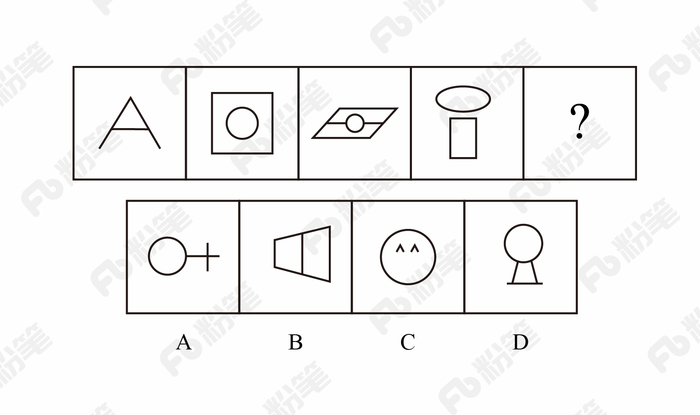
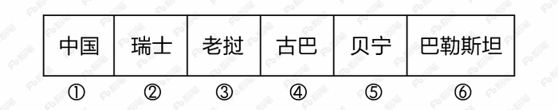
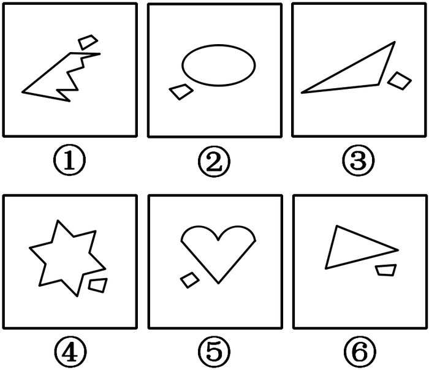
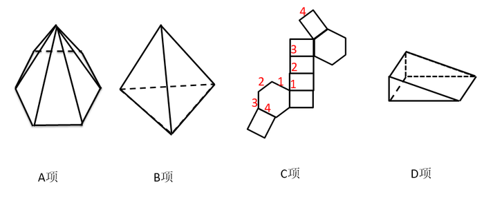

# 2018年421联考《行测》题（青海卷）（网友回忆版）

> 判断推理 · 40 题 · 青海 2018

## 第 1 题　qid 2188409 · 图形推理

下列哪个选项中的图形能够折叠成完整封闭的立体几何结构：

- **A**. A
- **B**. B　✅
- **C**. C
- **D**. D

**答案**：B

**官方解析**

本题考查空间重构。
A项：不能由展开图拼合而成，若想拼合，底面（即最后一行的面）须为正方形，排除；
B项：可以由展开图拼合而成，拼合成的图形为七棱柱，当选；
C项：不能由展开图拼合而成，还需要一个矩形面才能拼合成六棱柱，排除；
D项：不能由展开图拼合而成，还需要一个矩形面才能拼合成六面体，排除。
故正确答案为B。

---

## 第 2 题　qid 2187817 · 图形推理

从正方体中裁出如下图所示六个不同的三角形，将其分为两类，使每一类图形都有各自的共同特征或规律，分类正确的一项是：

- **A**. ①②⑤，③④⑥　✅
- **B**. ①⑤⑥，②③④
- **C**. ①③⑤，②④⑥
- **D**. ①②④，③⑤⑥

**答案**：A

**官方解析**

本题为分组分类题目。每个图形都在正方体中裁出了一个三角形，观察发现，①②⑤中三角形的底边和高的长度都等于正方体的棱长，所以三个三角形的面积相同，③④⑥中三角形底边长度等于正方体的棱长，高的长度等于正方体外表面正方形的对角线的长度，所以三个三角形的面积相同。即①②⑤一组，③④⑥一组。
故正确答案为A。

---

## 第 3 题　qid 2187790 · 图形推理

从所给的四个选项中，选择最合适的一个填入问号处，使之呈现一定的规律性：

- **A**. A　✅
- **B**. B
- **C**. C
- **D**. D

**答案**：A

**官方解析**

元素组成不同，无明显属性规律，考虑数量规律。观察发现，图一出现端点较多，B项为日字变形图，都是笔画数特征图，考虑笔画数。题干都是两笔画图形，？处也应该是两笔画图形。A项两笔画，B项一笔画，C项三笔画，D项三笔画，只有A项符合。
故正确答案为A。

---

## 第 4 题　qid 2188414 · 图形推理

从所给的四个选项中，选择最合适的一个填入问号处，使下图中的立体图形①、②、③和④可组成一个完整的长方体：

- **A**. A
- **B**. B
- **C**. C　✅
- **D**. D

**答案**：C

**官方解析**

题干中的立体图形可共同构成一个的长方体。如图所示：

将③放入蓝色位置，图②上下翻转放入黄色位置，将C项图形立起放入橘黄色位置，即是一个完整长方体。

故正确答案为C。 

---

## 第 5 题　qid 2187802 · 图形推理

从所给的四个选项中，选择最合适的一个填入问号处，使之呈现一定的规律性：

- **A**. A
- **B**. B　✅
- **C**. C
- **D**. D

**答案**：B

**官方解析**

元素组成不同，无明显属性规律，考虑数量规律。观察发现，题干图形均有面，考虑数面，数量依次为3、4、5、6、8，没有规律，再观察发现每个图形中均有形状相同的面，且数量依次为2、3、4、5、6，？，问号处图形应该含有7个形状相同的面。A项6个，B项7个，C项2个，D项没有形状相同的面，只有B项符合。
故正确答案为B。

---

## 第 6 题　qid 2188474 · 图形推理

把下面的图形分为两类，使每一类图形都有各自的共同特征或规律，分类正确的一项是：

- **A**. ①②⑤，③④⑥
- **B**. ①③⑤，②④⑥
- **C**. ①④⑥，②③⑤　✅
- **D**. ①②⑥，③④⑤

**答案**：C

**官方解析**

本题为分组分类题目，元素组成不同，优先考虑属性规律。观察题干图形发现，①④⑥均为带有封闭区域的图形，②③⑤均为全开放图形，即①④⑥一组，②③⑤一组。
故正确答案为C。

---

## 第 7 题　qid 2188862 · 图形推理

把下面的图形分为两类，使每一类图形都有各自的共同特征或规律，分类正确的一项是：

- **A**. ①②⑥，③④⑤
- **B**. ①④⑤，②③⑥　✅
- **C**. ①③⑥，②④⑤
- **D**. ①③⑤，②④⑥

**答案**：B

**官方解析**

解析一：每个图形均由一大一小两个图形组成，且功能元素无规律，考虑数量规律。观察发现，图①④⑤中大图形的线条数均大于等于小图形的线条数，图②③⑥中大图形的线条数均小于小图形的线条数。
故正确答案为B。
解析二：每个图形均由一大一小两个图形组成，考虑图形间关系。观察发现，图①③⑥中小图形的角朝向大图形，图②④⑤中小图形的边朝向大图形。（注：有同学可能认为②④⑤中小图形线条与大图形平行，但图②大图形为曲线图，不符合规律。）
故正确答案为C。
注：本题为争议题，解析一和解析二均有不严谨的地方，解析一中图⑤大小图形线条数相等，解析二中图②③⑥无法严谨的界定小图形的边还是角朝向大图形，经过比较，解析二比解析一更不严谨，因此粉笔倾向于解析一。

---

## 第 8 题　qid 2187839 · 图形推理

下列选项中的图形<b>不能</b>折叠成完整封闭的立体几何结构的是：

- **A**. A
- **B**. B
- **C**. C　✅
- **D**. D

**答案**：C

**官方解析**

逐一分析选项。

如下图：

A项：可以折叠成一个底面为六边形的正六棱锥，排除；

B项：可以折叠成一个正四面体，排除；

C项：如图所示，相同标号的边应该为公共边，但标记为4的两条边不可能为公共边，所以不能折叠成完整封闭的立体图形，当选；

D项：可以折叠成完整封闭的立体图形，排除。

本题为选非题，故正确答案为C。

---

## 第 9 题　qid 2187850 · 定义判断

精准医疗是指以个体化医疗为基础，通过基因组、蛋白质组等技术，对大样本人群与特定疾病类型进行生物标记物的分析与鉴定、验证与应用，从而精确寻找到疾病的原因和治疗的靶点，最终实现对疾病和特定患者进行个性化精确治疗。
根据上述定义，下列选项不属于精准医疗的是：

- **A**. 甲某罹患癌症，医生对其基因进行全面检测并确定治疗方案
- **B**. 乙某近期反常头晕，医生询问症状后就给其开了非处方药物　✅
- **C**. 丙某在就医时称自己对某种药物过敏，医生根据其过敏情况设计用药方案
- **D**. 丁某患失眠症到中医院就诊，医生据“同病异治，异病同治”的理念施治

**答案**：B

**官方解析**

第一步：找出定义关键词。
“以个体化医疗为基础”、“通过基因组、蛋白质组等技术”、“对大样本人群与特定疾病类型进行生物标记物的分析与鉴定、验证与应用”、“寻找到疾病的原因和治疗的靶点”、“实现对疾病和特定患者进行个性化精确治疗”。
第二步：逐一分析选项。
A项：医生对甲某的基因进行全面检测，符合“以个体化医疗为基础”、“通过基因组、蛋白质组等技术”、“寻找到疾病的原因和治疗的靶点”，制定治疗方案符合“实现对疾病和特定患者进行个性化精确治疗”，符合定义，排除；
B项：乙某出现反常头晕症状，医生仅通过询问症状就开了非处方药，不符合“以个体化医疗为基础”、“实现对疾病和特定患者进行个性化精确治疗”，不符合定义，当选；
C项：“医生根据其过敏情况设计用药方案”符合“以个体化医疗为基础”、“实现对疾病和特定患者进行个性化精确治疗”，符合定义，排除；
D项：“同病异治”是指同一病症，因时、因地、因人不同，或由于病情进展程度、病机变化，以及用药过程中正邪消长等差异，治疗上应相应采取不同治法。“异病同治”指不同的疾病，在其发展过程中，由于出现了相同的病机，因而采用同一方法治疗的法则。中医治病的法则，不是着眼于病的异同，而是着眼于病机的区别。异病可以同治，既不决定于病因，也不决定于病证，关键在于辨识不同疾病有无共同的病机。病机相同，才可采用相同的治法。因此“同病异治，异病同治”符合“实现对疾病和特定患者进行个性化精确治疗”，符合定义，排除。
本题为选非题，故正确答案为B。

---

## 第 10 题　qid 2187831 · 定义判断

在决断之前，每个事物的价值在决策者心中大致相近，则难于决断其优劣；但在作出选择之后，决策者对这些事物的态度评价就发生了改变。这种现象叫作决断后效应。
根据上述定义，下列现象属于决断后效应的是：

- **A**. 某职员对自己的去留一筹莫展，一番考量之后他认为留下来要面对许多复杂关系，不如重新开创新天地
- **B**. 某女士对各有优劣的两个品牌手机难以抉择，最后她从经济角度考虑选择其中一款，可到货后发现这款有色差
- **C**. 某老师对选A还是B去参加比赛犹豫不决，班长建议选B。事后，老师认为选B完全正确，因为B最终夺得冠军
- **D**. 某学生填报志愿时对报甲大学还是乙大学犹豫不决，最后他听从老师建议选择了甲大学，从此觉得甲大学优于乙大学　✅

**答案**：D

**官方解析**

第一步：找出定义关键词。
“决断之前”、“每个事物的价值在决策者心中大致相近”、“作出选择之后”、“决策者对这些事物的态度评价就发生了改变”。
第二步：逐一分析选项。
A项：对自己的去留一筹莫展，符合“决断之前”、“每个事物的价值在决策者心中大致相近”，但考量之后他认为留下来要面对复杂关系，这只是他的认知，并没有进行决断，不符合“作出选择之后”，更不符合“决策者对这些事物的态度评价就发生了改变”，不符合定义，排除；
B项：对两个品牌手机难以抉择，符合“决断之前”、“每个事物的价值在决策者心中大致相近”，最后选择了其中一款，发现有色差，只是描述情况，并没体现“决策者对这些事物的态度评价就发生了改变”，不符合定义，排除；
C项：老师对A与B的选择犹豫不决，符合“决断之前”、“每个事物的价值在决策者心中大致相近”，但赛后认为选B是正确的，是因为他夺冠了的结果证明选择正确，并没体现因为做出决策而对A、B重新评价，不符合“作出选择之后”、“决策者对这些事物的态度评价就发生了改变”，不符合定义，排除；
D项：对甲乙两所大学犹豫不决，符合“决断之前”、“每个事物的价值在决策者心中大致相近”，选择了甲大学之后，觉得甲大学优于乙大学，符合“作出选择之后”、“决策者对这些事物的态度评价就发生了改变”，符合定义，当选。
故正确答案为D。

---

## 第 11 题　qid 2188029 · 定义判断

理性预期指的是，针对某个经济现象进行预期的时候，如果人们是理性的，那么他们就会最大限度地充分利用所得到的信息来作出行动而不会犯系统性的错误。
根据以上定义，下列属于理性预期的是：

- **A**. 省立医院分院一投入使用，小陈就在附近开了一家水果店　✅
- **B**. 老秦获悉某政策即将施行，凭着长期炒股的经验进行股票操作
- **C**. 传言说城南要建某重点中学分校，老刘立即在附近买了一套房子
- **D**. 小张得知其高考成绩在全省排第二十位，果断决定第一志愿报清华大学

**答案**：A

**官方解析**

第一步：找出定义关键词。
“针对某个经济现象进行预期”、“人们是理性的”、“他们就会最大限度地充分利用所得到的信息来作出行动而不会犯系统性的错误”。
第二步：逐一分析选项。
A项：人们到医院看望病人时经常选择水果作为礼物，所以医院的投入使用会使得水果的需求量增加，那么小陈选择在医院附近开水果店，符合“针对某个经济现象进行预期”，且其做出的判断是理性的，符合定义，当选；
B项：政策的施行可能对股票产生影响，老秦获悉这一信息后进行股票操作，符合“针对某个经济现象进行预期”，但凭着长期炒股的经验，不能确定其判断是否理性，不符合“人们是理性的”，不符合定义，排除；
C项：建重点中学分校可能会影响其附近的房价，但该消息为传言，传言是否真实并不确定，故老刘在附近买了一套房子这一决定是否是理性的并不明确，不符合定义，排除；
D项：小张根据高考成绩填报志愿，不符合“针对某个经济现象进行预期”，不符合定义，排除。
故正确答案为A。

---

## 第 12 题　qid 2187813 · 定义判断

二维码是用某种特定的几何图形按一定规律，在平面分布的黑白相间的图形记录数据符号信息。在代码编制上利用“0”“1”比特流的概念，用若干与二进制相对应的几何形体来表示文字数值信息，通过图像输入设备或光电扫描设备自动识读，以实现信息自动处理。一个二维码所能表示的比特数是固定的，它包含的信息越多，则冗余度就越小；反之，冗余度就越大。
根据上述定义，下列选项不符合二维码内涵的是：

- **A**. 某种特定的几何图形按一定规律分布可以构成相应的二维码
- **B**. 二维码中图像代码的基本原理利用的是计算机的内部逻辑基础
- **C**. 把文字数值信息转化成与二进制相对应的几何形体，可供设备识读
- **D**. 二维码包含的信息量都很大，意味着在编码时需要尽量减少冗余度　✅

**答案**：D

**官方解析**

第一步：找出定义关键词。
“用某种特定的几何图形按一定规律”、“在平面分布的黑白相间的图形记录数据符号信息”、“在代码编制上利用‘0’‘1’比特流的概念”、“用若干与二进制相对应的几何形体来表示文字数值信息”、“通过图像输入设备或光电扫描设备自动识读，以实现信息自动处理”、“一个二维码所能表示的比特数是固定的，它包含的信息越多，则冗余度就越小”。
第二步：逐一分析选项。
A项：某种特定的几何图形按一定规律分布符合“用某种特定的几何图形按一定规律”，符合定义，排除；
B项：图像代码的基本原理利用的是计算机的内部逻辑基础，符合“在代码编制上利用‘0’‘1’比特流的概念”，符合定义，排除；
C项：把文字数值信息转化成与二进制相对应的几何形体，可供设备识读，符合“用若干与二进制相对应的几何形体来表示文字数值信息”、“通过图像输入设备或光电扫描设备自动识读，以实现信息自动处理”，符合定义，排除；
D项：根据题干信息，“一个二维码所能表示的比特数是固定的，它包含的信息越多，则冗余度就越小”，即冗余度由信息量大小决定，无法尽量减少冗余度，不符合定义，当选。
本题为选非题，故正确答案为D。

---

## 第 13 题　qid 2188408 · 定义判断

广义相对论是爱因斯坦以几何语言建立而成的引力理论，他将引力改描写成因时空中的物质与能量而弯曲的时空，以取代传统对于引力是一种力的看法，而这种时空曲率与处于时空中的物质与辐射的能量动量直接相关。
根据上述定义，下列选项中的现象不涉及广义相对论的是：

- **A**. 科学家在观察日全食时发现，光线经过太阳附近时会产生偏角弯曲
- **B**. 科学家发现，在强引力场中时钟要走得慢一些，因而从巨大质量的星体表面发射到地球的光线，会向光谱的红端移动
- **C**. 科学家发现，当一个星体足够致密时，其引力使时空中的区域极端扭曲以至光线都无法逸出，由此发现了黑洞的存在
- **D**. 麦哲伦航行时发现，驶向远方的船帆逐渐下沉，最后消失在视线中，而海平面似呈弯曲状，远处的海水似乎比近处的海水水位低　✅

**答案**：D

**官方解析**

第一步：找出定义关键词。
“引力理论”、“将引力改描写成因时空中的物质与能量而弯曲的时空，以取代传统对于引力是一种力的看法”、“这种时空曲率与处于时空中的物质与辐射的能量动量直接相关”。
第二步：逐一分析选项。
A项：光线经过太阳附近时会产生偏角弯曲，体现了“弯曲的时空”，符合定义，排除；
B项：时钟要走得慢一些，体现了时空，因而从巨大质量星体表面发射到地球的光线，会向光谱的红端移动，体现了“弯曲的时空”，符合定义，排除；
C项：星体的引力使时空中的区域极端扭曲以至光线都无法逸出，由此发现了黑洞的存在，体现了“弯曲的时空”，符合定义，排除；
D项：麦哲伦航行时发现海平面似成弯曲状，远处的海水似乎比近处的海水水位低，说明地球是圆形的，这里的弯曲状指的是地球表面的形状，和弯曲的时空概念无关，不符合定义，当选。
备注：同构选项：选项ABC都是在说和宇宙时空有关的，D说的是地球表面是弯曲的，因此同构选项同时排除选项ABC，选非题选D。
本题为选非题，故正确答案为D。

---

## 第 14 题　qid 2187803 · 定义判断

绿色设计是指在整个产品周期内，着重考虑产品的环境属性，如可拆卸性、可回收性、可维护性、可重复利用性等，并将其作为设计目标，在满足环境保护条件的同时，保证产品的质量达到最优状态。
根据上述定义，下列选项符合绿色设计理念的是：

- **A**. 迪拜太阳村巧摆太阳能收集器以实现日照时间最大化
- **B**. 荷兰某化学品公司将健康环保作为公司重要的价值观
- **C**. 巴西流行利用绿色植物代替砖、石、钢筋水泥来砌墙　✅
- **D**. 某学校将教室背景设计为浅绿色来保护孩子们的眼睛

**答案**：C

**官方解析**

第一步：找出定义关键词。
“着重考虑产品的环境属性并将其作为设计目标”、“可拆卸性、可回收性、可维护性、可重复利用性等”、“满足环境保护条件的同时，保证产品的质量达到最优状态”。
第二步：逐一分析选项。
A项：巧摆太阳能收集器，只是改变了太阳能收集器的摆放位置，并未体现在产品周期考虑环境属性，且目的是实现日照时间最大化，不是为了环境保护，也不是为了产品质量达到最优，不符合定义，排除；
B项：将健康环保作为公司的价值观，没有提及设计产品时是否“着重考虑产品的环境属性，并将其作为设计目标”，不符合定义，排除；
C项：利用绿色植物代替砖、石、钢筋水泥来砌墙，属于在产品周期考虑了环境属性，符合“着重考虑产品的环境属性并将其作为设计目标”，符合定义，当选；
D项：将教室背景设计为浅绿色的目的是保护孩子们的眼睛，不符合“满足环境保护条件，保证产品的质量达到最优状态”，不符合定义，排除。
故正确答案为C。

---

## 第 15 题　qid 2187806 · 定义判断

在企业活动中，库存有多种类型。装运库存是指在价值链末端工厂的库房里，那些已经准备好可以随时出货的产品。在途库存又称中转库存，指尚未到达目的地，正处于运输状态或等待运输状态而储备在运输工具中的库存。
根据上述定义，下列选项属于在途库存的是：

- **A**. 小张给自己网购了一件毛衣，下单两天后查知该毛衣已到某中转站
- **B**. 某高速服务区内一辆大货车满载着A超市从B地采购的各类毛巾　✅
- **C**. 某皮鞋厂的卡车里，堆满了该厂用于制造新款皮鞋的牛皮
- **D**. 某公司在城南的自有库房中存放着给城北门店销售的玩具

**答案**：B

**官方解析**

第一步：找出定义关键词。
装运库存：“在价值链末端工厂的库房”、“已经准备好可以随时出货的产品”；
在途库存：“尚未达到目的地”、“正处在运输状态或等待运输状态而储存在运输工具中的库存”。
第二步：逐一分析选项。
A项：小张网购的毛衣已到某中转站，不符合“在价值链末端工厂的库房”，也不符合“正处在运输状态或等待运输状态而储存在运输工具中的库存”，不符合任何一个定义，排除； 
B项：高速公路服务区大货车内的毛巾，符合“尚未达到目的地”且“正处在运输状态或等待运输状态而储存在运输工具中的库存”，符合“在途库存”定义，当选；
C项：皮鞋厂卡车里的牛皮是皮鞋厂的原材料，而不是产品，不符合“在价值链末端工厂的库房里”,且“某皮鞋厂的卡车里”并未指明是“正处于运输状态或等待运输状态”还是“已经到达目的地”，不符合“尚未到达目的地”，不符合任何一个定义，排除；
D项：某公司城南的自有仓库中存放的玩具，符合“在价值链末端工厂的库房”，也符合“已经准备好可以随时出货的产品”，符合“装运库存”定义，不符合“在途库存”定义，排除。
故正确答案为B。

---

## 第 16 题　qid 2188417 · 定义判断

地震震级是通过仪器给出地震大小的一种量度，是划分震源放出能量大小的等级，地震所释放的能量越大，地震震级也越大，每一次地震只有一个震级。地震烈度表示地震对地表及工程建筑物影响的强弱程度，是在没有仪器记录的情况下，凭地震时人们的感觉或地震发生后器物反应的程度、工程建筑物的破坏程度、地表的变化状况而定的一种宏观尺度。
根据上述定义，下列说法正确的是：

- **A**. 地震震级越大，地震烈度相应越强
- **B**. 一次地震只有一个震级，一个烈度
- **C**. 距震源越近，震级越大，烈度越强
- **D**. 地表破坏越严重说明地震烈度越强　✅

**答案**：D

**官方解析**

第一步：找出定义关键词。
地震震级：“通过仪器给出地震大小的一种量度，是划分地震源放出能量大小的等级”、“地震所释放的能量越大，地震震级也越大，每一次地震只有一个震级”；
地震烈度：“表示地震对地表及工程建筑物影响的强弱程度”、“是在没有仪器记录的情况下，凭地震时人们的感觉或地震发生后器物反应的程度、工程建筑物的破坏程度、地表的变化状况而定的一种宏观尺度”。
第二步：逐一分析选项。
A项：题干定义只是分别说了地震震级和地震烈度是什么，两者的关系并没有提及，不符合定义，排除；
B项：一次地震只有一个震级符合“每一次地震只有一个震级”，但只有一个烈度，题干定义并没有提及，不符合定义，排除；
C项：题干定义只是分别说了地震震级和地震烈度是什么，并没有提及震级和烈度与震源远近的关系，不符合定义，排除；
D项：地表破坏越严重说明地震烈度越强，符合 “地震烈度是在没有仪器记录的情况下，凭地震时人们的感觉或地震发生后器物反应的程度、工程建筑物的破坏程度、地表的变化状况而定的一种宏观尺度”，符合地震烈度定义，当选。
故正确答案为D。

---

## 第 17 题　qid 2187858 · 定义判断

刺激泛化是指条件作用的形成使有机体习得了对某一刺激做出特定反应的行为，因此也就可能对类似的刺激做出同样的行为反应。刺激分化是通过选择性强化和消退使有机体学会对条件刺激和与条件刺激相类似的刺激做出不同的行为反应。
根据上述定义，下列说法不正确的是：

- **A**. “一朝被蛇咬，十年怕井绳”属于刺激泛化
- **B**. “横看成岭侧成峰，远近高低各不同”属于刺激分化　✅
- **C**. 为突出品牌，厂家对包装进行独特设计，力图使顾客产生刺激分化
- **D**. 某品牌牙膏创成名牌后，生产商将其生产的化妆品也以同品牌命名，利用的是顾客的刺激泛化

**答案**：B

**官方解析**

第一步：找出定义关键词。
刺激泛化：“条件作用的形成使有机体习得了对某一刺激做出特定反应的行为”、“对类似的刺激做出同样的行为反应”
刺激分化：“通过选择性强化和消退”、“对相类似的刺激做出不同的行为反应”
第二步：逐一分析选项。
A项：被蛇咬后怕井绳是对类似的刺激做出同样的行为反应，符合“刺激泛化”定义，排除；
B项：“横看成岭侧成峰，远近高低各不同”是对同一事物从不同角度的观看所产生的视觉差异，不涉及刺激反应，不符合“刺激分化”定义，当选；
C项：厂家对包装进行独特设计的目的是为了和其他品牌进行区分，想让顾客看到该厂的产品后，做出和看到其他厂商相同产品时不同的反应，符合“通过选择性强化和消退”、“对相类似的刺激做出不同的行为反应”，符合“刺激分化”定义，排除；
D项：生产商将化妆品也以同品牌命名，想让顾客看到同品牌化妆品后也产生名牌的认知，符合“想让消费者对类似的刺激做出同样的行为反应”，符合“刺激泛化”定义，排除。
本题为选非题，故正确答案为B。

---

## 第 18 题　qid 2187855 · 定义判断

回弹效应是指通过技术进步提高能源使用效率，节约了能源消费，但技术进步的同时也会促进经济规模的扩大，对能源产生新的需求，从而部分、甚至完全地抵消所节约的能源。
根据上述定义，下列选项可以有效控制回弹效应的是：

- **A**. 发动机效率提升降低了行车成本，更多人选择以车代步
- **B**. 厂商进一步提高能源效率，利润增加，生产出更多产品
- **C**. 太阳能热水器热销，慢慢取代传统电热水器　✅
- **D**. 现在越来越多的消费者购买节能型家用电器

**答案**：C

**官方解析**

第一步：找出定义关键词。
“通过技术进步提高能源使用效率，节约了能源消费”、“技术进步的同时也会促进经济规模的扩大，对能源产生新的需求”、“部分、甚至完全地抵消所节约的能源”。
第二步：逐一分析选项。
A项：更多人选择以车代步，说明对汽车产生了更多的需求，符合“对能源产生新的需求”，汽车使用的多会导致消耗能源更多，会部分抵消发动机效率提升所节约的能源，无法有效控制回弹效应，排除； 
B项：厂商生产出更多产品，说明对生产产品所需的能源有了更多的需求，符合“对能源产生新的需求”，生产更多产品会消耗更多的能源，会部分抵消提高能源效率所节约的能源，无法有效控制回弹效应，排除；
C项：太阳能热水器取代传统电热水器，说明对太阳能产生了更多的需求，符合“对能源产生新的需求”，但太阳能热水器对太阳能的利用并不会抵消所节约的能源，所以可以有效控制回弹效应，当选；
D项：越来越多的消费者购买节能型家用电器，说明对生产节能型家用电器所需的能源有了更多的需求，符合“对能源产生新的需求”，卖出更多节能型家用电器会消耗更多能源，会部分抵消节能电器所节约的能源，无法有效控制回弹效应，排除。
故正确答案为C。

---

## 第 19 题　qid 2187707 · 类比推理

青衿：读书人

- **A**. 南冠：囚犯　✅
- **B**. 浮屠：寺庙
- **C**. 春蚕：奉献
- **D**. 袍泽：官员

**答案**：A

**官方解析**

第一步：判断题干词语间逻辑关系。
青衿借指读书人，二者为比喻象征关系。
第二步：判断选项词语间逻辑关系。
A项：南冠借指囚犯，二者为比喻象征关系，与题干逻辑关系一致，当选；
B项：浮屠借指佛塔，而不是寺庙，与题干逻辑关系不一致，排除；
C项：春蚕借指乐于奉献的人，而不是奉献，与题干逻辑关系不一致，排除；
D项：袍泽借指军中的同事，而不是官员，与题干逻辑关系不一致，排除。
故正确答案为A。

---

## 第 20 题　qid 2188412 · 类比推理

西子湖：曹娥江

- **A**. 美人蕉：老婆饼
- **B**. 东坡肉：五柳鱼　✅
- **C**. 女儿红：祖母绿
- **D**. 狮子头：凤凰胆

**答案**：B

**官方解析**

第一步：判断题干词语间逻辑关系。
西子湖即杭州西湖，之所以叫西子湖，是得名于我国四大美女之一的西施。曹娥江，中国东海独流入海河流钱塘江的最大支流，因东汉少女曹娥入江救父而得名。二者都是水域，是并列关系。
第二步：判断选项词语间逻辑关系。
A项：美人蕉是一种植物，老婆饼是一种糕点，二者不是并列关系，与题干逻辑关系不一致，排除；
B项：“东坡肉”是眉山和江南地区的特色传统名菜，相传为北宋词人苏东坡所创制；“五柳鱼”是一道四川名菜，得名于“五柳先生”陶渊明，二者都是菜肴，是并列关系，且均得名于某一人物，与题干逻辑关系一致，当选；
C项：女儿红是糯米酒，祖母绿是绿宝石的一种，二者不是并列关系，与题干逻辑关系不一致，排除；
D项：狮子头是一道菜肴，凤凰胆是一种天然玉石珠，二者不是并列关系，与题干逻辑关系不一致，排除。
故正确答案为B。

---

## 第 21 题　qid 2187709 · 类比推理

风霜雨雪：雾里看花

- **A**. 春夏秋冬：踏雪寻梅
- **B**. 金木火土：水中望月　✅
- **C**. 桃李杏橘：青梅煮酒
- **D**. 梅兰竹菊：茜窗画眉

**答案**：B

**官方解析**

第一步：判断题干词语间逻辑关系。
风霜雨雪为四字并列的成语，雾里看花是场景和行为的对应关系，且雾与风霜雨雪是并列关系。
第二步：判断选项词语间逻辑关系。
A项：春夏秋冬为四字并列关系的成语，踏雪和寻梅是两个行为的并列关系，与题干逻辑关系不一致，排除；
B项：金木火土为四字并列的成语，水中望月是场景和行为的对应关系，且水与金木火土是并列关系，与题干逻辑关系一致，当选；
C项：桃李杏橘为四字并列的成语，但是青梅不是场景，与题干逻辑关系不一致，排除；
D项：梅兰竹菊为四字并列的成语，茜窗画眉是场景和行为的对应关系，但茜窗画眉中不包含与梅兰竹菊并列的字，与题干逻辑关系不一致，排除。
故正确答案为B。

---

## 第 22 题　qid 2187711 · 类比推理

骡子：耕畜：犁地

- **A**. 基因：生命：遗传
- **B**. 衙役：衙门：当差
- **C**. 鸬鹚：水鸟：捕鱼　✅
- **D**. 恒星：宇宙：发光

**答案**：C

**官方解析**

第一步：判断题干词语间逻辑关系。
骡子是一种耕畜，二者为包容关系中的种属关系，骡子能犁地，二者为功能的对应关系。
第二步：判断选项词语间逻辑关系。
A项：基因储存孕育生命的信息，二者为对应关系，“基因”是具有“遗传”效应的DNA片段，二者为对应关系，与题干逻辑关系不一致，排除；
B项：衙役指在衙门中当差的人，二者为对应关系，当差是衙役的工作内容，二者为对应关系，与题干逻辑关系不一致，排除；
C项：鸬鹚是一种水鸟，二者为包容关系中的种属关系，鸬鹚能捕鱼，二者为功能的对应关系，与题干逻辑关系一致，当选；
D项：恒星是宇宙的组成部分，二者为包容关系中的组成关系，恒星会发光，二者为属性的对应关系，与题干逻辑关系不一致，排除。
故正确答案为C。

---

## 第 23 题　qid 2187703 · 类比推理

团扇：羽毛扇：舞蹈扇

- **A**. 宣纸：餐巾纸：铜版纸
- **B**. 圈椅：实木椅：办公椅　✅
- **C**. 排球：羽毛球：乒乓球
- **D**. 墨镜：老花镜：显微镜

**答案**：B

**官方解析**

第一步：判断题干词语间逻辑关系。
团扇为圆形或近似圆形，团扇以其形状命名，羽毛扇以其原材料命名，舞蹈扇以其功能命名，三者为交叉关系。
第二步：判断选项词语间逻辑关系。
A项：宣纸产自古代宣州，以其产地命名，餐巾纸以其功能命名，铜版纸以用途命名，与题干逻辑关系不一致，排除；
B项：圈椅以其形状命名，实木椅以其原材料命名，办公椅以其功能命名，三者为交叉关系，与题干逻辑关系一致，当选；
C项：排球以队列的分布命名，羽毛球以其原材料命名，乒乓球以其声音命名，与题干逻辑关系不一致，排除；
D项：墨镜以其颜色命名，老花镜和显微镜都以其功能命名，与题干逻辑关系不一致，排除。
故正确答案为B。

---

## 第 24 题　qid 2187705 · 类比推理

井底蛙：三脚猫：智慧

- **A**. 笑面虎：变色龙：真诚　✅
- **B**. 千里马：孺子牛：可靠
- **C**. 替罪羊：铁公鸡：坚强
- **D**. 地头蛇：纸老虎：勇敢

**答案**：A

**官方解析**

第一步：判断题干词语间逻辑关系。
“井底蛙”比喻目光短浅，见识狭隘之人；“三脚猫”形容水平不高，粗浅，二者均是缺乏“智慧”的表现，与“智慧”为对应关系。
第二步：判断选项词语间逻辑关系。
A项：“笑面虎”多指笑里藏刀的人，表面上一团和气，背地里总想着怎么排挤别人；“变色龙”比喻在生活中善于变化和伪装的人，或者比喻立场不稳、见风使舵的人，二者均是缺乏“真诚”的表现，与“真诚”为对应关系，与题干逻辑关系一致，当选；
B项：“千里马”比喻人才，“孺子牛”比喻心甘情愿为人民大众服务、无私奉献的人，二者与“可靠”无明显逻辑关系，与题干逻辑关系不一致，排除；
C项：“替罪羊”比喻代人受过的人，“铁公鸡”比喻生活中小气、吝啬、一毛不拔的人，二者与“坚强”无明显逻辑关系，与题干逻辑关系不一致，排除；
D项：“地头蛇”比喻凭借当地势力欺压人民的恶霸，“纸老虎”比喻貌似强大、实际虚弱的人或集团，二者与“勇敢”无明显逻辑关系，与题干逻辑关系不一致，排除。
故正确答案为A。

---

## 第 25 题　qid 2187706 · 类比推理

火药：鞭炮：二踢脚

- **A**. 乌铁：刀具：三棱刀
- **B**. 红砖：建筑：四合院
- **C**. 清水：白酒：五粮液　✅
- **D**. 杉木：乐器：六弦琴

**答案**：C

**官方解析**

第一步：判断题干词语间逻辑关系。
火药是制作鞭炮所必需的材料，前两者为必然对应关系；二踢脚是鞭炮的一种，后两者为种属关系。
第二步：判断选项词语间逻辑关系。
A项：乌铁可以作为制作刀具的材料，但不是制作刀具必需的材料，刀具还可以是高速钢、硬质合金、金属陶瓷等，与题干逻辑关系不一致，排除；
B项：红砖可以作为建筑的材料，但不是建筑必需的材料，建筑的材料还可以是灰砂砖等，与题干逻辑关系不一致，排除；
C项：清水是制作白酒所必需的材料，前两者为必然对应关系；五粮液是白酒的一种，后两者为种属关系，与题干逻辑关系一致，当选；
D项：杉木可以用来制作乐器，但不是制作乐器必需的材料，乐器的材料还可以是金属等，与题干逻辑关系不一致，排除。
故正确答案为C。

---

## 第 26 题　qid 2187714 · 类比推理

春秋：寒暑：一年

- **A**. 妇孺：老幼：生命
- **B**. 荏苒：蹉跎：岁月
- **C**. 东西：南北：方向　✅
- **D**. 冷热：干湿：温度

**答案**：C

**官方解析**

第一步：判断题干词语间逻辑关系。
春秋和寒暑都用来泛指一年，为比喻象征关系。
第二步：判断选项词语间逻辑关系。
A项：妇孺和老幼都有生命，为对应关系，与题干逻辑关系不一致，排除；
B项：荏苒指岁月易逝，蹉跎指岁月白白过去，与题干逻辑关系不一致，排除；
C项：东西和南北都可以用来泛指方向，与题干逻辑关系一致，当选；
D项：冷热用来形容温度的高低，干湿和温度无必然关系，与题干逻辑关系不一致，排除。
故正确答案为C。

---

## 第 27 题　qid 2187708 · 类比推理

钟表 之于 （    ） 相当于 （    ） 之于 排字工

- **A**. 时间；印刷工
- **B**. 刻度；线装书
- **C**. 更夫；打印机　✅
- **D**. 油纸；修理工

**答案**：C

**官方解析**

逐一代入选项。
A项：钟表是一种计时的装置，用来提示时间，二者为对应关系；印刷工和排字工是两种职业，二者为并列关系，前后逻辑关系不一致，排除；
B项：钟表有刻度，二者为对应关系；排字工与线装书没有明显的逻辑关系，前后逻辑关系不一致，排除；
C项：更夫是古代每天夜里敲竹梆子或锣在夜间报时的一个职业，更夫与现代的钟表均有提示时间的功能，二者为并列关系；排字工指古代按照原稿把铅字植入排字盘中的一个职业，排字工与现代的打印机具有相同的功能，二者为并列关系，前后逻辑关系一致，当选；
D项：钟表与油纸没有明显逻辑关系；修理工和排字工是两种职业，二者为并列关系，前后逻辑关系不一致，排除。
故正确答案为C。

---

## 第 28 题　qid 2188413 · 类比推理

纺车 之于 （    ） 相当于 （    ） 之于 联合收割机

- **A**. 手摇；蒸汽机
- **B**. 织布；传动带
- **C**. 3D织布机；曲辕犁　✅
- **D**. 自动打线车；发动机

**答案**：C

**官方解析**

逐一代入选项。
A项：手摇纺车，手摇与纺车构成偏正结构；蒸汽机和联合收割机是并列关系，前后逻辑关系不一致，排除；
B项：纺车是生产线或纱的设备，与织布无必然的逻辑关系；传动带是联合收割机的组成部分，二者是组成关系，前后逻辑关系不一致，排除；
C项：纺车是生产线或纱的设备，3D织布机是织布的设备，二者是并列关系，且纺车为古代发明，3D织布机为现代发明；曲辕犁和联合收割机都可以用于农田耕作，二者是并列关系，且曲辕犁为古代发明，联合收割机为现代发明，前后逻辑关系一致，当选；
D项：纺车是生产线或纱的设备，自动打线车是采用纺坠来捻丝的设备，二者是并列关系；发动机是联合收割机的一部分，二者是组成关系，前后逻辑关系不一致，排除。
故正确答案为C。

---

## 第 29 题　qid 2188411 · 类比推理

仪态万方：美丽多姿

- **A**. 风度翩翩：富富有余
- **B**. 腰缠万贯：富甲一方　✅
- **C**. 其貌不扬：荣华富贵
- **D**. 仪表堂堂：身无长物

**答案**：B

**官方解析**

第一步：判断题干词语间逻辑关系。
仪态万方形容容貌、姿态各方面都很美；美丽多姿也是指姿态美丽，二者是近义关系。
第二步：判断选项词语间逻辑关系。
A项：风度翩翩指仪态万方，气质不凡；富富有余指物品等十分充裕，除满足需要外，还有富余，二者不是近义关系，与题干逻辑关系不一致，排除；
B项：腰缠万贯指人极其富有；富甲一方指拥有的财物在某地方上居第一位，比喻十分富有，二者是近义关系，与题干逻辑关系一致，当选；
C项：其貌不扬指长得不漂亮，相貌普通；荣华富贵比喻兴盛或显达，形容有钱有势，二者不是近义关系，与题干逻辑关系不一致，排除；
D项：仪表堂堂形容人外表端正、举止大方、姿态威严；身无长物指除自身外再没有多余的东西，形容贫穷，二者不是近义关系，与题干逻辑关系不一致，排除。
故正确答案为B。

---

## 第 30 题　qid 2187713 · 类比推理

演员：公园：演出

- **A**. 谣言：微信：查处
- **B**. 股民：股市：投资　✅
- **C**. 士兵：战争：升迁
- **D**. 信息：卫星：定位

**答案**：B

**官方解析**

第一步：判断题干词语间逻辑关系。
演员在公园演出，为人、场所和行为的对应关系，且演出是演员主动发出的动作。
第二步：判断选项词语间逻辑关系。
A项：谣言在微信被查处，不是人、场所和行为的对应关系，且谣言与查处为被动关系，与题干逻辑关系不一致，排除；
B项：股民在股市投资，为人、场所和行为的对应关系，且投资是股民主动发出的动作，与题干逻辑关系一致，当选；
C项：士兵参加战争可能被升迁，但是战争不是场所，且士兵与升迁为被动关系，与题干逻辑关系不一致，排除；
D项：卫星是传播信息的方式，信息可以用于定位，与题干逻辑关系不一致，排除。
故正确答案为B。

---

## 第 31 题　qid 2188482 · 逻辑判断

母亲年龄是唐氏综合征筛查所考虑的风险因素之一。一般认为，母亲年龄越大，宝宝出现遗传异常的风险就越高。当卵子里有一条多余的21号染色体时，胎儿就会出现唐氏综合征。随着女性年龄的增长，出现此类异常的风险也随之升高。最近，一些专家开始对这种筛查方法提出质疑，认为遗传异常并不仅仅只是女方年龄的问题。
以下哪项如果为真，最能支持上述专家质疑？

- **A**. 精子的21号染色体也可能粘连多余的遗传物质，父亲的年龄越大，制造精子过程出错的概率就越高　✅
- **B**. 造成宝宝精神健康问题的重点似乎并不在于母亲的“绝对年龄”，而在于父亲与母亲的“相对年龄”
- **C**. 子宫基本不会随着年龄增长发生变化，只要激素水平充足，年老妇女的子宫也能够正常养育胎儿
- **D**. 现代人因为环境以及生活习惯影响，容易产生基因突变，即便是健康夫妇也有生育“唐氏儿”的风险

**答案**：A

**官方解析**

第一步：找出论点和论据。
论点：遗传异常并不仅仅只是女方年龄的问题。
论据：无。
第二步：逐一分析选项。
A项：精子的21号染色体也可能粘连多余的遗传物质，父亲的年龄越大，制造精子过程出错的概率就越高，说明胎儿出现唐氏综合征不只是母亲的年龄问题，还有父亲的年龄问题，补充论据，可以加强，当选；
B项：论点说的是遗传异常问题，该项说的是宝宝精神健康问题，话题不一致，无法加强，排除；
C项：题干论点说的是遗传异常是否与女性年龄有关，该项是在讨论年老妇女能否正常养育胎儿，遗传异常和正常养育胎儿不是一回事，话题不一致，无法加强，排除；
D项：环境以及生活习惯容易产生基因突变，使得健康夫妇也有生育“唐氏儿”的风险，并没有提到健康夫妇年龄的大小，不能确定女方年龄是否对遗传异常造成影响，无法加强，排除。
故正确答案为A。

---

## 第 32 题　qid 2188416 · 逻辑判断

我们身体的生物钟系统会受到许多因素的影响，其中之一就是光照。研究表明，光照可以有效地欺骗大脑进入“白昼模式”，哪怕当时人的眼睛是闭着的也没关系。研究人员发现可以用光照疗法来帮助我们调整时差，包括持续光照和不同间隔的闪光，而每10秒一次持续仅2毫秒的闪光最有效。研究还发现，在睡眠时经历过“闪光处理”的人出现困意的周期会延后两个小时。
以下哪项如果是真，最能支持上述观点？

- **A**. 每次闪光间隙的黑暗都有助于让眼睛重启，从而恢复眼睛对光照的敏感
- **B**. 大部分睡眠时经历“闪光处理”的人的睡眠质量都不会受到闪光的影响
- **C**. 去时区早两小时的城市，启程日日出前两小时经光照疗法的人无时差感　✅
- **D**. 依靠自身来调节时差耗时良久，大概平均每天只能倒过一个小时的时差

**答案**：C

**官方解析**

第一步：找出论点和论据。
论点：我们身体的生物钟系统会受到许多因素的影响，其中之一就是光照。 
论据：研究表明，光照可以有效地欺骗大脑进入“白昼模式”，哪怕当时人的眼睛是闭着的也没关系。研究人员发现可以用光照疗法来帮助我们调整时差，包括持续光照和不同间隔的闪光，而每10秒一次持续仅2毫秒的闪光最有效。研究还发现，在睡眠时经历过“闪光处理”的人出现困意的周期会延后两个小时。
第二步：逐一分析选项。
A项：论点讨论的是光照是否可以影响生物钟系统，该项讨论的是眼睛对光照是否敏感，话题不一致，无法加强，排除；
B项：论据讨论的是闪光处理是否可以延后人出现困意的周期，即让人睡得晚，该项讨论的是“闪光处理”是否会影响睡眠质量，即让人睡不好，话题不一致，无法加强，排除；
C项：该项举例说明去时区早两小时的城市，光照疗法确实可以帮助人调整时差，补充论据加强，当选；
D项：论点讨论的是光照是否可以影响生物钟系统，该项讨论的是自身调节时差需要大量时间，话题不一致，无关选项，无法加强，排除。
故正确答案为C。

---

## 第 33 题　qid 2187788 · 逻辑判断

甲、乙、丙三人大学毕业后选择从事各不相同的职业：教师、律师、工程师。其他同学做了如下猜测：
小李：甲是工程师，乙是教师。
小王：甲是教师，丙是工程师。
小方：甲是律师，乙是工程师。
后来证实，小李、小王和小方都只猜对了一半。那么，甲、乙、丙分别从事何种职业？

- **A**. 甲是教师，乙是律师，丙是工程师
- **B**. 甲是工程师，乙是律师，丙是教师
- **C**. 甲是律师，乙是工程师，丙是教师
- **D**. 甲是律师，乙是教师，丙是工程师　✅

**答案**：D

**官方解析**

题干条件不确定，优先采用代入法。
将A项代入，小李和小方两句都猜错了，而小王两句都猜对了，不符合题干要求，排除；
将B项代入，小李两句一对一错，而小王和小方两句都猜错了，不符合题干要求，排除；
将C项代入，小李和小王两句都猜错了，而小方两句都猜对了，不符合题干要求，排除；
将D项代入，小李、小王和小方都只猜对了一半，符合题干要求，当选。
故正确答案为D。

---

## 第 34 题　qid 2187791 · 逻辑判断

如果央行允许人民币继续贬值，那么市场对于人民币贬值的预期就容易强化。如果市场形成较强的人民币贬值预期，大量的资金就会流出我国。资金流出我国，不仅会强化这种人民币的贬值预期，导致更多的资金流出我国，而且可能会导致我国资产价格全面下跌，继而可能引爆金融市场的区域性风险及系统性风险。这些都是我们不愿意看到且不允许出现的情况。
由此可以推出：

- **A**. 货币持续贬值会导致资产全面下跌
- **B**. 资金流失严重会出现货币贬值预期
- **C**. 央行不会允许人民币继续贬值　✅
- **D**. 我国将重点着手干预资金外流

**答案**：C

**官方解析**

日常结论题，根据题干信息逐一分析选项。
A项：题干只是表述货币持续贬值“可能”会导致资产价格全面下跌，而该项说“会”导致，说的过于绝对，无法推出，排除；
B项：题干表述的是较强的人民币贬值预期会出现资金大量流失，该项是资金流失严重会出现货币贬值预期，属于逻辑错误，无法推出，排除；
C项：题干最后一句表明我们不允许出现这种情况，“这种情况”指代的是前文“如果央行允许人民币继续贬值”这种情况，该项属于最后一句的同义替换，可以推出，当选；
D项：我国是否将采取措施干预资金外流，题干没有提及，无中生有，排除。
故正确答案为C。

---

## 第 35 题　qid 2187794 · 逻辑判断

四位球迷在某球赛的晋级赛开始之前对几个队伍的赛况进行预测，他们比较关注其中的两支球队，分别作了如下预测：
方某说：如果甲队不能晋级，那么乙队也不能晋级。
白某说：不管甲队能不能晋级，乙队都不能晋级。
夏某说：乙队能晋级，但甲队不能晋级。
邓某说：我看这几支球队都不能晋级。
比赛结果证明，四位球迷中只有一位的预测是正确的。
根据上述情况，以下哪项一定为真？

- **A**. 白某预测是正确的
- **B**. 邓某预测是正确的
- **C**. 如果甲队能够晋级，那么方某的预测是正确的　✅
- **D**. 如果甲队不能晋级，那么方某的预测是正确的

**答案**：C

**官方解析**

第一步：翻译题干。

方：甲队晋级乙队晋级；

白：乙队晋级；

夏：乙队晋级 且 甲队晋级；

邓：乙队晋级 且 甲队晋级。

第二步：找关系。

方某和夏某是矛盾关系，必有一真一假。

第三步：看其余。

四位球迷只有一位预测为真，可知白某、邓某一定为假，排除A、B两项。

由白某为假，可知乙队晋级了，此时无法直接判断方某、夏某的真假，代入C、D两项验证。

代入C项：假设甲队晋级，即甲和乙都晋级了，此时，夏某为假，方某为真，该项正确，当选；

代入D项：假设甲队没有晋级，即甲没晋级，乙晋级了，此时，夏某为真，方某为假，该项错误，排除。

故正确答案为C。

---

## 第 36 题　qid 2187781 · 逻辑判断

我国在西南地区进行的页岩气勘探获得重大成果，估算天然气资源量达千亿立方米，这是我国首次在四川盆地以外的南方复杂构造区取得页岩气勘探的重大突破。有专家称该地有望成为新的工业气田，可以满足上千万居民的生活和工农业发展的用气需求，促进经济发展。
该专家观点成立的假设前提是：

- **A**. 南方复杂的地质构造有利于天然气生成
- **B**. 凡是勘探到的天然气都能顺利开采出来　✅
- **C**. 我国目前天然气产量无法满足实际需求
- **D**. 天然气作为清洁能源是促进经济发展的重要动力

**答案**：B

**官方解析**

第一步：找出论点和论据。
论点：该地有望成为新的工业气田，可以满足上千万居民的生活和工农业发展的用气需求，促进经济发展。
论据：西南地区进行的页岩气勘探获重大成果，估算天然气资源量达千亿立方米。
第二步：逐一分析选项。
A项：南方复杂的地质构造有利于天然气生成，论点讨论的是该地是否有望成为新的工业气田，而非天然气生成与地质构造的关系，话题不一致，无法加强，排除；
B项：论据中估算该地资源量达千亿立方米，勘探到的天然气都能顺利开采出来，这是一个必要条件，满足这一条件才能有望满足上千万居民的生活和工农业发展的用气需求，是论点成立的前提，可以加强，当选；
C项：我国目前天然气产量无法满足需求，与该地是否能成为新的工业气田无关，无法加强，排除； 
D项：天然气的好处与该地是否能成为新的工业气田无关，无法加强，排除。 
故正确答案为B。

---

## 第 37 题　qid 2187780 · 逻辑判断

东亚人看起来更谦虚，但心理学研究表明，和接受其他文化熏陶的人相比，他们也一样充满骄傲和自信。某研究团队招募了40名志愿者参与研究，其中一半来自东亚国家，剩下的来自西方国家。他们向这些志愿者展示大量正面和负面的词语，并询问他们哪些形容词适合自己。结果，志愿者们无论有什么样的文化背景，他们都倾向于用更多正面的形容词来描述自己，认为一些较为负面的特征不适合自己。研究者认为，这表明参与测试的人无论具有何种文化背景，他们同样都有美化自己的动机。
以下哪项如果为真，最能削弱上述论证？

- **A**. 东亚人习惯负面评价自己，而西方人往往对自己的能力言过其实　✅
- **B**. 当志愿者被要求用正面词汇形容自己时，他们的反应都是一样的
- **C**. 东亚人谦逊只是一种文化惯例，他们有着和西方人一样的自尊心
- **D**. 研究发现，无论来自何种文化背景，志愿者们的脑电波都很相似

**答案**：A

**官方解析**

第一步：找出论点和论据。
论点：和接受其他文化熏陶的人相比，东亚人也一样充满骄傲和自信。
论据：参与测试的人无论具有何种文化背景，他们同样都有美化自己的动机。
第二步：逐一分析选项。
A项：选项陈述了东亚人习惯负面评价自己，说明东亚人并非充满骄傲和自信，削弱了论点，当选；
B项：选项只针对当志愿者被要求用正面词汇形容自己的情况，而题干没有这个限制条件，话题不一致，无关选项，无法削弱，排除；
C项：说明东亚人和西方人一样充满骄傲和自信，加强了论点，排除； 
D项：脑电波相似和是否会有美化自己的动机之间没有必然联系，无法削弱，排除。
故正确答案为A。

---

## 第 38 题　qid 2188418 · 逻辑判断

月球潮汐力与地球上的地震、海啸、火山爆发等自然灾害存在明显相关性的说法是可疑的，因为每年自然灾害很多，而“超级月亮”每14个月才一次，即便考虑月球经过近地点，每个月也只有一次。部分学者会找出一些和“超级月亮”出现时间相隔不远的灾害来论证，这显然缺乏证据支撑。也忽略了大量事例，比如月球在远地点前后发生的灾害。基于大量关于地震和月球关系数据的研究表明，地震发生频率和月球经过近地点没有统计上的相关性，因此说月球潮汐力会引发地震显然缺乏可靠证据。
由此可以推出：

- **A**. 月球潮汐力与月球在远地点前后发生的地震具有相关性
- **B**. 月球潮汐力与月球经过近地点发生的地震具有因果关系
- **C**. 月球潮汐力与地震之间的关系需要在时间和空间上综合分析　✅
- **D**. 地震触发机制有多种因素，但月球潮汐力的作用效果较明显

**答案**：C

**官方解析**

日常结论题，根据题干信息逐一分析选项。
A项：题干中指出“部分学者会找出一些和‘超级月亮’出现时间相隔不远的灾害来论证”，这显然缺乏证据支撑。也忽略了大量事例，比如“月球在远地点前后发生的灾害”，说明月球潮汐力与月球在远地点发生地震之间没有必然关系，无法推出，排除；
B项：题干中指出“地震发生频率和月球经过近地点没有统计上的相关性”，而选项中说二者是因果关系，无法推出，排除；
C项：题干中指出“‘超级月亮’每14个月才一次”，“地震发生频率和月球经过近地点没有统计上的相关性”，分别从时间和空间的角度说明月球潮汐力与地震等灾害之间没有相关性，那么要想证明月球潮汐力与地震之间的关系也需要在时间和空间上综合分析，可以推出，当选；
D项：题干中指出“月球潮汐力会引发地震显然缺乏可靠证据，”而选项中说明月球潮汐力是地震的触发机制效果较明显,与题干意思相反，无法推出，排除。
故正确答案为C。

---

## 第 39 题　qid 2187782 · 逻辑判断

宇宙加速膨胀是因为物质之间相互排斥，减速膨胀是因为物质之间相互吸引。因此，要在此基础上解释宇宙的加速或减速膨胀，必须要有不同特性的物质在不同的时期占主导地位，从而产生强大的排斥力或吸引力。粒子物理标准模型中的所有粒子都产生吸引的引力，然而星系转动曲线的研究表明，在星系里面还有大量的、看不到的物质，这些物质可以产生非常强大的吸引性引力。
以上论证如果为真，那么星系转动曲线研究结论隐含了下列哪一项前提？

- **A**. 粒子物理标准模型中的所有粒子产生的吸引性引力不足　✅
- **B**. 粒子物理标准模型中的粒子不是唯一的，存在其它粒子
- **C**. 星系转动曲线的研究说明这个时期的宇宙正在加速膨胀
- **D**. 星系转动曲线的研究说明存在超大质量、看不到的黑洞

**答案**：A

**官方解析**

第一步：找出论点和论据。
论点：在星系里面还有大量的、看不到的物质，这些物质可以产生非常强大的吸引性引力。
论据：无。
第二步：逐一分析选项。
A项：题干背景明确说明，要在此基础上解释宇宙的加速或减速膨胀，必须要有不同特性的物质在不同的时期占主导地位，从而产生强大的排斥力或吸引力。粒子物理标准模型中的所有粒子已经都能产生吸引力了，只有它们产生的吸引性引力不足，才需要其他物质有强大的吸引力，该项是论点成立的一个必要条件，补充论据，可以加强，当选；
B项：粒子的唯一性和题干所讨论的论点产生吸引性引力无关，无法加强，排除；
C项：星系转动曲线的研究应该说明这个时期的宇宙正在减速膨胀，与题干所给已知信息不符，无法加强，排除；
D项：论点和论据中没有提到黑洞，该项是无关选项，无法加强，排除。
故正确答案为A。

---

## 第 40 题　qid 2187779 · 逻辑判断

某研究团队让两批测试者分别进入睡眠实验室里睡上一夜。第一批被安排睡得很晚，从而减少总睡眠时间；第二批被安排睡得早，但在睡眠过程中多次被吵醒。第二晚过后，结果就已经显现：第二批测试者的积极情绪受到严重影响。他们的精力水平较低，同情心和友善度等积极情绪指数有所下滑。部分研究者据此认为，被吵醒导致了测试者无法得到足够的慢波睡眠，而慢波睡眠是恢复精力感的关键，但也有研究者对此项研究的可信度提出质疑。
以下哪项如果为真，最能反驳质疑者？

- **A**. 第一批测试者积极情绪的指数下滑程度不太明显　✅
- **B**. 第二批测试者中大部分人长期以来情绪不够积极
- **C**. 两批测试者的健康状况和心理素质原本就很接近
- **D**. 两批测试者在参与睡眠实验前精力水平参差不齐

**答案**：A

**官方解析**

第一步：找出论点和论据。
论点：有研究者对“被吵醒导致了测试者无法得到足够的慢波睡眠，而慢波睡眠是恢复精力感的关键”这一结论的可信度提出质疑。
论据：两批测试者分别进入睡眠实验室里睡上一夜。第一批被安排睡得很晚，从而减少总睡眠时间；第二批被安排睡得早，但在睡眠过程中多次被吵醒。结果显现：第二批测试者的积极情绪受到严重影响。他们的精力水平较低，同情心和友善度等积极情绪指数有所下滑。
第二步：逐一分析选项。
A项：第一批测试者积极情绪的指数下滑程度不太明显，与第二批严重影响做了比较，说明慢波睡眠确实是恢复精力感的关键，补充了实验结果，证明研究是有可信度的，可以削弱质疑者，当选；
B项：第二批测试者中大部分人长期以来情绪不够积极，说明实验前提条件不一致，削弱实验结论，可以支持质疑者，排除；
C项：题干的实验结果是每一个实验对象本身实验前后积极情绪指数的比较，并不是不同的实验对象的积极情绪指数的比较， 所以实验前所有实验对象的健康状况和心理素质的情况对实验的结果不会产生影响，因此该项无法反驳质疑者，排除；
D项：题干的实验结果是每一个实验对象本身实验前后积极情绪指数的比较，所以两批测试者在参与睡眠实验前精力水平参差不齐，无法反驳质疑者，排除。
故正确答案为A。

---
