# 2018年上海市公务员录用考试《行测》题（A类）（网友回忆版）

> 判断推理 · 35 题 · 上海 2018

## 第 1 题　qid 2395202 · 类比推理

左下图是某人站在力传感器上做下蹲、起跳动作的示意图，点P是他的重心位置。右下图是根据力传感器采集到的数据做出的力-时间图像。两图中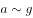各点均对应，其中有几个点在左下图中没有画出。重力加速度取。

根据图像分析可知：

- **A**. 此人受到的重力为750N
- **B**. b点是此人下蹲至最低点的位置
- **C**. 此人在c点的速度最大
- **D**. 此人在d点的加速度最大　✅

**答案**：D

**官方解析**

人站在力传感器上做下蹲、起跳动作，一开始在a点处于静止状态，此时人对传感器压力F大小等于人所受重力G，故此人所受重力，A项错误；

在下蹲过程中，从a到b点，人对传感器压力F小于人所受重力G，故传感器对人的支持力N小于人所受重力G，人向下加速下蹲，由于b点后一小段部分支持力N仍小于人所受重力G，因而继续加速下蹲，故b点不是下蹲至最低点的位置，B项错误；

在c点前后附近，支持力N大于人所受重力G，故此时人具有向上的加速度，与下蹲方向相反，因而减速下蹲，c点前后速度逐渐减少，C项错误；

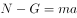，在d点时，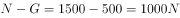最大，此时加速度a也最大，D项正确。

故正确答案为D。

---

## 第 2 题　qid 2395203 · 逻辑判断

如图所示，小董在一口与地面垂直的竖井旁边装了一只探照灯，灯光照射的方向与水平的夹角为，为了使灯光垂直照射向竖井的底部，小董在井上方又放置了一块镜子，那么，该镜子的反射面与水平面的夹角为：

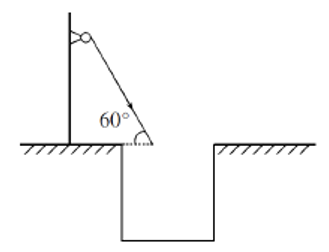

- **A**. 

- **B**. 

- **C**. 
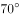

- **D**. 

　✅

**答案**：D

**官方解析**

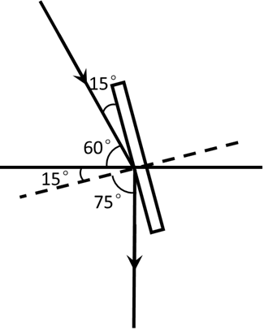

如图所示，画出竖直的反射光线，根据光的反射定律，入射角和反射角相等，法线（虚线）和镜子垂直，则镜面与水平方向成，

故正确答案为D。

---

## 第 3 题　qid 2395204 · 逻辑判断

下列A、B、C、D四个模拟电路中，电键闭合与否和灯泡亮暗对应关系表述错误的是：

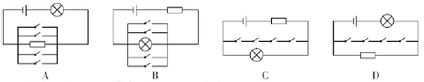

- **A**. A图中即使电键都不闭合，灯泡也会亮
- **B**. B图中只要有一个电键闭合，灯泡就不会亮
- **C**. C图中只有当所有电键都闭合，灯泡才不会亮
- **D**. D图中只有所有电键都闭合，灯泡才会亮　✅

**答案**：D

**官方解析**

A图，即使电键都不闭合，灯泡依然与电阻、电源连接形成闭合回路，灯泡会亮，A项正确；
B图，只要有一个电键闭合，灯泡即被短路，此时无电流通过灯泡，灯泡不亮，B项正确；
C图，只有所有电键都闭合，灯泡才会被短路，此时无电流通过灯泡，灯泡不亮，若有一个电键不闭合，则电路中无短路部分，灯泡依然正常发亮，C项正确；
D图，所有开关均闭合也无法形成短路。灯泡与电源均连接在闭合回路中，灯泡均发亮，D项错误。
本题为选非题，故正确答案为D。

---

## 第 4 题　qid 2137374 · 逻辑判断

如图所示，木板AB放置在水平地面上，一铅块位于木块上，抓住木板A点，使其以B点为支点向上抬起直至与地面垂直，那么铅块所受的摩擦力f的变化情况为<u>      </u>。

- **A**. 铅块滑动前后，f均随木板倾角的增大而减小
- **B**. 铅块滑动前，f随木板倾角的增大而减小；铅块滑动后，f随木板倾角的增大而增大
- **C**. 铅块滑动前，f随木板倾角的增大而增大；铅块滑动后，f随木板倾角的增大而减小　✅
- **D**. 铅块滑动前后，f均随木板倾角的增大而增大

**答案**：C

**官方解析**

当木板在水平地面时，没有摩擦力；

随着木板抬起至铅块滑动前，铅块受的是静摩擦力。如图所示，根据受力分析可知，静摩擦力。随着木板抬起，木块倾角变大，变大，则静摩擦力f变大，据此可以排除A、B两项；

铅块开始滑动后，所受摩擦力变为动摩擦力，动摩擦力。随着木块倾角α变大，变小，则动摩擦力变小，直至与地面垂直时，动摩擦力变为0，据此可排除D项，C项正确。

故正确答案为C。

---

## 第 5 题　qid 2395205 · 逻辑判断

一辆列车从长沙开往天津，当列车经过弯道时做匀速圆周运动，假设铁路的内轨和外轨高度一样，那么下列说法正确的是：

- **A**. 列车通过弯道向心力的来源是外轨的水平弹力，所以外轨容易磨损　✅
- **B**. 列车通过弯道向心力的来源是外轨的水平弹力，所以内轨容易磨损
- **C**. 列车通过弯道向心力的来源是列车的重力，所以内外轨道均不磨损
- **D**. 列车通过弯道向心力的来源是列车的重力，所以内外轨道均磨损，且磨损程度一致

**答案**：A

**官方解析**

列车在经过弯道时，做匀速圆周运动，此时水平方向受到的合力提供向心力，由于内轨和外轨高度一样，向心力只有可能来自外轨指向圆心的水平弹力，因而外轨容易磨损。
故正确答案为A。

---

## 第 6 题　qid 2137406 · 类比推理

如图所示，在水平台面上放置有一光滑斜面，倾角为α，在斜面上某处放了一根垂直于纸面的直导线，在导线中通有垂直纸面向里的电流，图中a点在导线正下方，b点与导线的连线与斜面垂直，c点在a点左侧，d点在b点右侧。现欲使导线静止在斜面上，下列措施可行的是<u>      </u>。

- **A**. 在a处放置一电流方向垂直纸面向里的直导线
- **B**. 在b处放置一电流方向垂直纸面向里的直导线
- **C**. 在c处放置一电流方向垂直纸面向里的直导线
- **D**. 在d处放置一电流方向垂直纸面向里的直导线　✅

**答案**：D

**官方解析**

根据右手定则和左手定则，在a、b、c、d四处放置电流方向垂直纸面向里的直导线，两根导线会在电流产生的磁场影响下，相互吸引。

若在a、b、c处放置导线，则斜面上导线在斜面方向不受向上的力，不可能静止，故ABC三项错误；

若在d处放置导线，则斜面上导线受磁场对导线向d的力，存在斜面方向向上的分力，可能静止，D项正确。

故正确答案为D。

---

## 第 7 题　qid 2137398 · 逻辑判断

毕业季来临之际，摄影师用单反相机给某毕业班的同学们拍完合照，随后要用同一台相机给每个学生拍单人照片，那么这时他应该      。

- **A**. 把相机离人近一些，同时镜头后缩
- **B**. 把相机离人近一些，同时镜头前伸　✅
- **C**. 把相机离人远一些，同时镜头后缩
- **D**. 把相机离人远一些，同时镜头前伸

**答案**：B

**官方解析**

本题考查光学相关知识。

从班级合照转向单人照，则拍照视野由大变小，根据常识，相机要离人近一些，排除C、D两项。同时对于镜头而言，照单人照，则使人在底片中尽量大，如图所示，应该是镜头前伸，A项排除，B项当选。

故本题答案为B。

---

## 第 8 题　qid 2137382 · 逻辑判断

蜻蜓点水后在平静的水面上会出现波纹。下面四张图是蜻蜓点水时的俯视照片，照片反映了蜻蜓连续三次点水后某瞬间的水面波纹。不考虑蜻蜓每次点水所用的时间，则下列描述与对应图片相符的是<u>       </u>。

- **A**. A图中蜻蜓向右飞行，且飞行速度和水波的传播速度相等　✅
- **B**. B图中蜻蜓向右飞行，且飞行速度比水波的传播速度慢
- **C**. C图中蜻蜓向左飞行，且飞行速度和水波的传播速度相等
- **D**. D图中蜻蜓向左飞行，且飞行速度比水波的传播速度快

**答案**：A

**官方解析**

水波在水面传播速度相等，所以水波圆圈越小，代表水波产生越晚。观察 ABD三项，水波自左向右大小依次变小，说明水波自左到右依次产生，蜻蜓应向右飞，而C项水波圆心在同一点，说明蜻蜓原地点水。故排除C、D两项。
若蜻蜓飞行速度和水波传播速度相等，则新点水时，刚好在旧水波圆圈上点水。随后扩散时，新产生的水波圆圈应与旧水波圆圈相切，A项正确。
若蜻蜓飞行速度比水波传播速度慢，则新点水时，在旧水波圆圈内点水。随后扩散时，新产生的水波圆圈应与旧水波圆圈无交点，B项错误。
故正确答案为A。

---

## 第 9 题　qid 2137394 · 类比推理

如图所示，一皮球从粗糙的曲线形坡面的a点开始无初速度地向下滚动，由于摩擦力作用，皮球滚到b点后开始折返到c点，已知a、b两点的高差为h1，b、c两点的高差为h2，那么<u>      </u>。

- **A**. h1=h2
- **B**. h1＜h2
- **C**. h1＞h2　✅
- **D**. h1、h2大小关系不确定

**答案**：C

**官方解析**

根据题干描述的运动过程，可将本题分成两个过程，两个过程遵循能量守恒定律。

过程一，从a点开始，到b点结束，为a、b高度差。

皮球在a点的所有能量是它的重力势能（）

=mg①

运动到b点的所有能量是它的重力势能（）

=mg②

因为&gt;，所以mg&gt;mg，&gt;，所以从a到b能量减少，减少的能量即为皮球从a运动到b摩擦力所做的功（），所以

=mg-mg=mg（-）③

过程二，从b点开始，到c点结束，为b、c高度差。

同理，如过程一，皮球从b点到c点能量减少，减少的能量即为皮球从b运动到c摩擦力所做的功，所以

④

故，比较和大小，即可理解为比较③和④的大小，此处可简单理解为：因为过程一比过程二多走了ac这段路，所以过程一摩擦力所做的功比较大，所以

⑤

将③④代入⑤可得：

mg&gt;mg，&gt;，C项正确。

故正确答案为C。

---

## 第 10 题　qid 2137392 · 类比推理

某司机驾车在如下图所示的路面上前行，已知AB段为下凹路段，BC段是上凸路段，当汽车依次经过M、N、O、P（M为最低点，P为最高点）四点时对路面的压力分别为FM、FN、FO、FP，汽车重力为G，前进过程中速率保持不变，那么下列关系式一定成立的是<u>       </u>。

- **A**. FM≥G
- **B**. FN＞G
- **C**. FO＜G　✅
- **D**. FP＞G

**答案**：C

**官方解析**

本题考查向心力的相关知识

本题小车在弧形路面行走，故在受力分析时一定要考虑指向圆心的向心力。

A项，如果车在M点，则车受向下的重力以及向上的支持力，两者合力提供向心力。由于小车速率保持不变的运动，向心力不为0，则支持力FM必须大于重力从而提供向心力，即FM＞G，取不到相等的情况，错误。

B项，在N点，汽车受重力，斜向上指向圆心的支持力FN，将重力分解，沿着支持力反方向Gsinθ和与之垂直的斜向下方向Gcosθ（由于汽车匀速，Gcosθ与摩擦力平衡在此不作考虑）。FN与Gsinθ的合力提供向心力，FN＞Gsinθ，但由于向心力未知，FN与G的大小关系未知，错误。

C项，同理，汽车在O点时，重力分力Gsinθ与FO提供向心力，此情况圆心在斜面下方，故Gsinθ＞FO，则G＞FO，正确。

D项，汽车在P点，由重力G和支持力FP提供向心力，则G＞FP，错误。

故正确答案为C。

备注：各选项的受力分析图如图所示：

---

## 第 11 题　qid 2137182 · 逻辑判断

水平台面上放置一装有某种液体的容器，将A、B、C三个重量一样的块体放入容器中，当该三个块体稳定后，发现A漂浮在液面上，B悬浮在液体中，而C则沉到容器底部，那么下列说法中正确的是      。

- **A**. 
如果三个块体都是空心的，则它们的体积可能相等

- **B**. 
如果三个块体的材料相同，则A、B一定是空心的
　✅
- **C**. 
如果三个块体都是空心的，则它们所受浮力的大小关系为

- **D**. 
如果三个块体都是实心的，则它们密度的大小关系为

**答案**：B

**官方解析**

逐项分析：

A、C两项：A、B、C三个块体重量一样，即，根据A、B、C三个块体稳定后分别处于漂浮、悬浮、沉底状态可知，、、；故。若三个块体的体积相同，则根据浮力公式可知，三个块体的浮力大小关系为，与题干相矛盾，则三个块体的体积不可能相等，均错误；

B项：三个块体材料相同，而C是沉到容器底部的，说明其平均密度大于液体密度，而A是漂浮，则说明A的平均密度小于液体密度，B物体悬浮，则说明B的平均密度等于液体密度。由此可知A、B物体的平均密度小于C物体，材料相同、重量相同的情况下，A、B一定是空心的，正确；

D项：都是实心的情况下，根据沉浮状态可以判定，错误。

故正确答案为B。

---

## 第 12 题　qid 2395206 · 图形推理

左边给定的是正方体的外表面展开图，下面哪一项不能由它折叠而成？

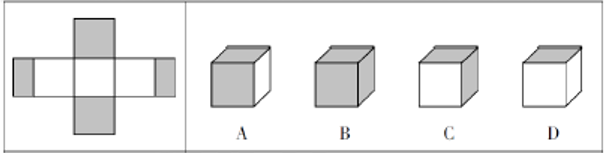

- **A**. A
- **B**. B　✅
- **C**. C
- **D**. D

**答案**：B

**官方解析**

题干中看上去是由5个正方形的面和2个长方形的面构成，其实整个图形的最左侧的灰色面与最右侧的灰色面在折合之后是相邻的，正好组成了一个灰色的正方形。

对题干中六个面进行标号，见下图：

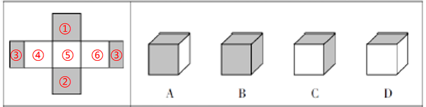

B项的三个面都是灰色的，也就是说这三个面分别为①、②和③，而①、②是相对面，不可能同时被看到，因此可知B项一定不是左侧展开图的折合图。

本题为选非题，故正确答案为B。

---

## 第 13 题　qid 2395207 · 图形推理

从所给的四个选项中，选择最合适的一个填入问号处，使之呈现一定的规律性。

- **A**. A
- **B**. B
- **C**. C　✅
- **D**. D

**答案**：C

**官方解析**

元素组成相似，且相同线条重复出现，优先考虑样式规律中的加减同异。题干已知了两组图，问号设在了第三组图的最后一个位置，可知通过第一组图找规律，第二组图验证规律，第三组图应用规律。通过观察第一组图形可知，前两个图形的线条相加后得到第三个图形，第二组图也符合这个规律，因此应用至第三组图，只有C项符合。
故正确答案为C。

---

## 第 14 题　qid 2395208 · 图形推理

从所给的四个选项中，选择最合适的一个填入问号处，使之呈现一定的规律性。

- **A**. A
- **B**. B
- **C**. C
- **D**. D　✅

**答案**：D

**官方解析**

元素组成相似，且每个图都由黑色区域和白色区域构成，黑色数量不同，优先考虑黑白运算。通过第一组图可以得知：、、、，将此规律运用于第二组，只有D项符合。

故正确答案为D。

---

## 第 15 题　qid 2395209 · 图形推理

从所给的四个选项中，选择最合适的一个填入问号处，使之呈现一定的规律性。

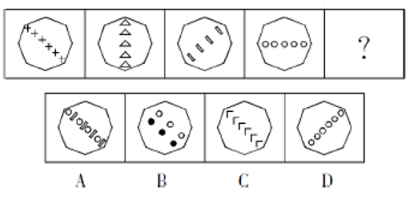

- **A**. A
- **B**. B
- **C**. C　✅
- **D**. D

**答案**：C

**官方解析**

元素组成不同，优先考虑属性规律。观察发现，题干图形均为轴对称图形，并且每幅图的对称轴画出来发现，对称轴每次顺时针旋转，排除D、B两项。题干中每幅图形内部都只由一种小元素构成，A项内部由两种小元素构成，C项内部由一种小元素构成，排除A项。

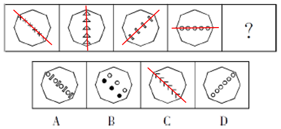

故正确答案为C。

---

## 第 16 题　qid 2395210 · 图形推理

从所给的四个选项中，选择最合适的一个填入问号处，使之呈现一定的规律性。

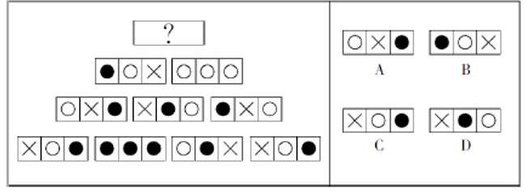

- **A**. A
- **B**. B
- **C**. C　✅
- **D**. D

**答案**：C

**官方解析**

本题为金字塔类题目，自下向上找规律，即下层相邻的两幅图之间进行运算得到上面的一幅图。

每幅图都由横向的三个区域构成，每个区域存在三种可能性：×、和。通过对应区域的运算可知：×+=，+=×，+=，+=×，+×=，+×=，+=。将从上往下数第二行两幅图形对应区域进行运算，最左侧区域：+=×，排除A、B两项；中间区域：+=，排除D项。

故正确答案为C。

---

## 第 17 题　qid 2395211 · 图形推理

从所给的四个选项中，选择最合适的一个填入问号处，使之呈现一定的规律性。

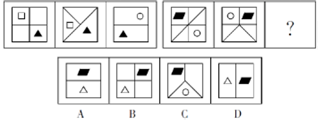

- **A**. A
- **B**. B　✅
- **C**. C
- **D**. D

**答案**：B

**官方解析**

第一组图，每个图都有1个白色图形，1个黑三角，并且二者在不同区域中。不同的是正方形所划分出来的区域为4、3、2，逐步减少。第二组图应用规律，第一个图划分了6个区域、第二个图划分了5个区域、第三个图应该划分为4个区域，只有B项符合。
故正确答案为B。

---

## 第 18 题　qid 2395212 · 图形推理

从所给的四个选项中，选择最合适的一个填入问号处，使之呈现一定的规律性。

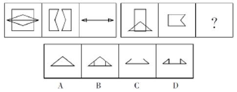

- **A**. A
- **B**. B
- **C**. C
- **D**. D　✅

**答案**：D

**官方解析**

元素组成相似，且相同线条重复出现，考虑样式规律中的加减同异。第一组的第2个图顺时针旋转后与第1个图形求异运算得到第3个图形。第二组图应用规律，只有D项符合。

故正确答案为D。

---

## 第 19 题　qid 2395213 · 图形推理

从所给的四个选项中，选择最合适的一个填入问号处，使之呈现一定的规律性。

- **A**. A
- **B**. B
- **C**. C　✅
- **D**. D

**答案**：C

**官方解析**

元素组成不同，优先考虑属性规律，观察发现，题干出现等腰三角形及其变形，优先考虑对称性。图一一条对称轴，图二两条对称轴，图三三条对称轴，故？处应选择一个四条对称轴的图形，只有C项符合。
故正确答案为C。

---

## 第 20 题　qid 2395214 · 图形推理

从所给的四个选项中，选择最合适的一个填入问号处，使之呈现一定的规律性。

- **A**. A
- **B**. B
- **C**. C
- **D**. D　✅

**答案**：D

**官方解析**

元素组成相同，优先考虑位置规律，观察发现，后一幅图在前一幅图的基础上逆时针旋转90度，故？处应该选择将图一逆时针旋转90度得到的图形，只有D项符合。
故正确答案为D。

---

## 第 21 题　qid 2395215 · 图形推理

从所给的四个选项中，选择最合适的一个填入问号处，使之呈现一定的规律性。

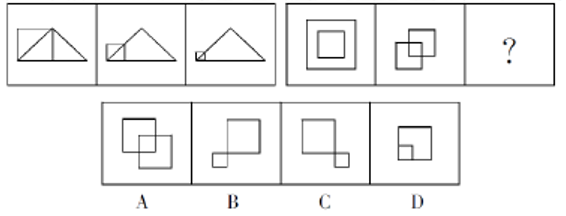

- **A**. A
- **B**. B　✅
- **C**. C
- **D**. D

**答案**：B

**官方解析**

观察第一组图形发现，图1到图2，正方形以左下角为基点缩小，三角形不变；图2到图3，正方形以左下角为基点继续缩小，三角形不变。第二组也应遵循此规律，从图1到图2外框正方形以左下角为基点缩小，中间的正方形不变；从图2到？处，左边的正方形继续以左下角为基点缩小，中间的正方形不变，只有B项符合。
故正确答案为B。

---

## 第 22 题　qid 2395216 · 图形推理

如图所示，由图1折叠成图2，再折叠成图3，然后剪去图4的阴影三角部分，现将其完全展开后得到的图形是：

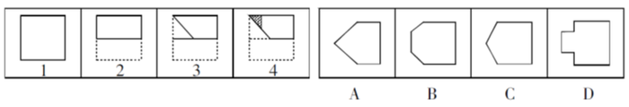

- **A**. A
- **B**. B
- **C**. C
- **D**. D　✅

**答案**：D

**官方解析**

观察题干发现，从图1到图3折叠两次，且剪去一三角形得到图4，现想知将其完全展开后的图形形状，只需将折叠部分依次展开即可，如下图所示：

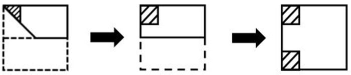

故正确答案为D。

---

## 第 23 题　qid 2395217 · 图形推理

从所给的四个选项中，选择最合适的一个填入问号处，使之呈现一定的规律性。

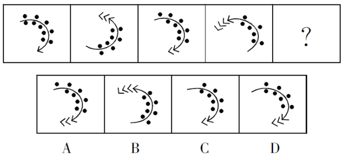

- **A**. A
- **B**. B
- **C**. C
- **D**. D　✅

**答案**：D

**官方解析**

元素组成不同，且无明显属性规律，考虑数量规律。观察发现，图三在图一的基础上增加了一个小箭头，减少了一个小黑点，图四在图二的基础上增加了一个小箭头，减少了一个小黑点，因此？应在图三的基础上增加一个小箭头，减少一个小黑点，只有D项符合。
故正确答案为D。

---

## 第 24 题　qid 2137242 · 逻辑判断

领导干部如果没有底线思维，就不能做到严格自律。而只有不忘初心，才能始终保持底线思维。也只有始终坚守理想信念，才能不忘初心。
根据以上信息，可以得出下列      项。

- **A**. 如果领导干部不能做到严格自律，就会丧失底线思维
- **B**. 领导干部只有不忘初心，才能做到严格自律　✅
- **C**. 领导干部只要始终坚守理想信念，就能做到严格自律
- **D**. 领导干部只要不忘初心，就可以做到严格自律

**答案**：B

**官方解析**

第一步：翻译题干。
①领导干部没有底线思维→不能严格自律
②保持底线思维→不忘初心
③不忘初心→坚守理想信念
将①逆否和②③可以递推出：严格自律→底线思维→不忘初心→坚守理想信念
第二步：逐一分析选项。
A项翻译：领导干部不能严格自律→丧失底线思维，肯定条件①的后件无法得到肯定性结论，排除；
B项翻译：严格自律→不忘初心，通过将①逆否和②③可以递推出，当选；
C项翻译：坚守理想信念→严格自律，通过将①逆否和②③可以递推出严格自律→坚守理想信念，肯定后件无法得出肯定性结论，排除；
D项翻译：不忘初心→严格自律，通过将①逆否和②③可以递推出严格自律→不忘初心，肯定后件无法得出肯定性结论，排除。
故正确答案为B。

---

## 第 25 题　qid 2395218 · 类比推理

近两年，长江刀鱼的市场售价出现了明显回升。这是因为近两年刀鱼捕捞量只有二三十年前的几十分之一，和五年前相比也有不小的差距。
以上表述是以下列（    ）项为前提假设的。

- **A**. 每年三月下旬是刀鱼价格的巅峰期
- **B**. 刀鱼有“长江第一鲜”的美誉
- **C**. 长江刀鱼的捕捞作业受潮汛影响较大
- **D**. 刀鱼的人工养殖难题依然没有解决　✅

**答案**：D

**官方解析**

第一步：找出论点和论据。
论点：近两年，长江刀鱼的市场售价出现了明显回升。
论据：近两年刀鱼捕捞量只有二三十年前的几十分之一，和五年前相比也有不小的差距。
论点讨论的是长江刀鱼与售价的关系，论据讨论的是长江刀鱼与捕捞量之间的关系，论点论据话题不一致，提问又是“前提假设”，优先考虑搭桥，其次考虑必要条件。
第二步：逐一分析选项。
A项：每年三月下旬是否是刀鱼价格的巅峰期，与刀鱼近两年与之前的价格相比是否有明显回升无关，不是前提假设，排除；
B项：刀鱼有“长江第一鲜”的美誉，与刀鱼的价格无关，不是前提假设，排除；
C项：长江刀鱼的捕捞作业受潮汛影响较大，没说近两年潮汛情况，所以不确定捕捞作业受到什么样的影响，也未涉及刀鱼价格，不是前提假设，排除；
D项：如果刀鱼的人工养殖难题解决了，那么人工养殖的刀鱼就会进入市场，即使近两年捕捞量比之前少，也推不出价格就会回升，该项是论证成立的必要条件，是前提假设，当选。
故正确答案为D。

---

## 第 26 题　qid 2395219 · 逻辑判断

调查显示，因互联网金融模式的普适性和创新性，大众使用互联网金融理财业务的意愿率已超过。这意味着，手握大量闲置资金的人们不再将传统银行作为资金存储、增值的唯一去向，银行内大量的低成本资金由此发生大搬家，而这正是传统银行业面临挑战的重要原因。

以下选项如果为真，最能支持上文观点的是：

- **A**. 互联网金融的资金安全风险问题比传统银行业要突出
- **B**. 以往人们的闲置资金主要集中到了传统银行中　✅
- **C**. 除了传统银行和互联网金融，人们很难找到闲置资金存储、增值的其他去向
- **D**. 传统银行业的服务水平相对优于互联网金融

**答案**：B

**官方解析**

第一步：找出论点和论据。

论点：大众不再将传统银行作为闲置资金的唯一去向，资本大搬家，导致传统银行面临挑战。

论据：大众使用互联网金融理财业务的意愿率已超过。

第二步：逐一分析选项。

A项：该项指出互联网金融有安全问题，与是否导致了传统银行面临挑战无关，不能加强，排除；

B项：该项指出以往人们的闲置资金主要集中到了传统银行中，现在有集中到了互联网金融，说明闲置资金的确出现了搬家，确实会导致传统银行面临挑战，可以加强，当选；

C项：人们很难找到闲置资金存储、增值的其他去向，不代表钱主要存在了银行，除去还剩的大众是否把钱继续放在传统银行并不清楚，也就无法说明互联网金融导致了传统银行面临挑战，不能加强，排除；

D项：该项指出传统银行比互联网金融好的方面，与互联网金融是否导致了传统银行面临挑战无关，不能加强，排除。

故正确答案为B。

---

## 第 27 题　qid 2137308 · 逻辑判断

X市的有线电视付费频道的用户数量比Y市要多，因此X市的市民比Y市市民更加了解国际时事。
下列各项如果为真，除了      项外，都将削弱上述论证。

- **A**. X市有线电视付费频道的月租费要低于Y市的同类频道　✅
- **B**. 调查显示，X市市民平均看电视的时间要比Y市市民少
- **C**. X市有线电视付费频道播放的都是娱乐类节目
- **D**. 大多数Y市市民在X市工作，通常只是在周末才回到Y市

**答案**：A

**官方解析**

第一步：找出论点和论据。
论点：X市的市民比Y市市民更加了解国际时事。
论据：X市的有线电视付费频道的用户数量比Y市要多。
第二步：逐一分析选项。
A项，月租低一定程度上可以解释为什么X市有线电视付费频道的用户数量多，但是没有体现谁更了解国际时事，无关选项，无法削弱，本题为选非题，当选；
B项，X市市民平均看电视的时间少，说明虽然X市有线电视付费频道的用户数量多，但是不一定谁看的电视多，不一定谁更加了解国际时事，可以削弱，排除；
C项，X市有线电视付费频道播放的都是娱乐类节目，说明无法用有线电视付费频道的用户数量来判断谁更加了解国际时事，可以削弱，排除；
D项，大多数Y市市民在X市工作，在周末回到Y市，说明虽然X市的有线电视付费频道的用户数量多，但是也有可能是Y市的人在付费使用，所以无法得出X市的市民比Y市市民更加了解国际时事，可以削弱，排除。
本题为选非题，故正确答案为A。

---

## 第 28 题　qid 2137286 · 逻辑判断

一直以来，科学家都在追寻一个问题的答案，那就是：究竟是什么给了地球足够的氧气，使其能孕育出动物和人类。地球大气中出现氧气是在距今24亿年前。约4.7亿年前，苔藓类地被植物在地球上迅速蔓延，直到4亿年前，地球大气中氧气含量才达到今天的水平。因此，有科学家认为，地球氧气大增源自苔藓类地被植物。
下列      项如果为真，最能支持上述科学家的观点。

- **A**. 地球上最早出现的陆生植物出人意料地多产，它们大大提升了地球大气中的氧气含量
- **B**. 通过电脑模拟可以估算得出：在约4.45亿年前，地球上的地衣和苔藓所产生的氧气占总氧气量的30%
- **C**. 苔藓类地被植物的蔓延增加了沉积岩中的有机碳含量，而这导致空气中的氧气含量也随着增加　✅
- **D**. 氧气含量的增加使得地球上演化出包括人类在内的大型、可移动的智慧生物成为可能

**答案**：C

**官方解析**

第一步：找出论点和论据。
论点：地球氧气大增源自苔藓类地被植物。
论据：地球大气中出现氧气是在距今24亿年前。约4.7亿年前，苔藓类地被植物在地球上迅速蔓延，直到4亿年前，地球大气中氧气含量才达到今天的水平。
论点和论据都在讨论“地球氧气大增”和“苔藓类地被植物蔓延”之间的关系，论点和论据话题一致，加强优先考虑解释或举例。
第二步：逐一分析选项。
A项：说的是陆生植物导致大气中的氧气含量增加，苔藓类地被植物是陆生植物的一种，无法确定苔藓类植物是否与氧气含量大增有关，属于不明确选项，排除；
B项：在约4.45亿年前，地球上的地衣和苔藓所产生的氧气占总氧气量的30%，选项只是在说4.45亿年前的氧气含量占比，无法确定后来的氧气大增是否来源于苔藓植物，属于不明确选项，排除；
C项：说明苔藓类地被植物的蔓延增加了沉积岩中的有机碳含量，从而导致空气中的氧气含量也随着增加，是对论点的解释，当选；
D项：讨论的是氧气增加的结果，而题干讨论的是氧气增加的原因，两者讨论话题不一致，属于无关选项，排除。
故正确答案为C。

---

## 第 29 题　qid 2395220 · 逻辑判断

作为中国传统的经典艺术形式，书法相当独特。事实上，在现当代中国文化遭遇东西文化碰撞的情况下，涉及传统文化领域的表述面临两类尴尬：满足于传统的经验式表述，很难融入现当代语境，仿佛以文言文应对现代社会之沟通；借助西方美学、艺术理论解读传统书法，又近于隔靴搔痒，颇似传统心态解读西方文明，如同借助风水观审视修建铁路，铺设电网。 
如果上述言论为真，那么可以推出下列（    ）项。

- **A**. 传统经验式表述很难在现当代语境中广泛传播书法之美　✅
- **B**. 借助西方艺术理论无法解读书法
- **C**. 借助西方美学解读传统书法是用传统心态解读西方文明的表现
- **D**. 书法十分独特，因此其他传统文化领域的表述并没有遭遇和书法类似的尴尬

**答案**：A

**官方解析**

日常结论题，根据题干信息逐一分析选项。
A项：根据“涉及传统文化领域的表述面临两类尴尬：满足于传统的经验式表述，很难融入现当代语境，仿佛以文言文应对现代社会之沟通”，可以推出“传统经验式表述很难在现当代语境中广泛传播书法之美”，当选；
B项：题干只是说借助西方理论解读书法近于隔靴搔痒，也就是说很难解读，而不是无法解读，该项不能推出，排除；
C项：题干说的是借助西方美学解读传统书法颇似用传统心态解读西方文明，说的是两者相似，而不是前者是后者的表现，该项不能推出，排除；
D项：根据“涉及传统文化领域的表述面临两类尴尬”可知，该种尴尬并非只针对书法，其他传统文化也可能存在类似的尴尬，该项不能推出，排除。
故正确答案为A。

---

## 第 30 题　qid 2137322 · 类比推理

H市在公共场所中的每一块绿地都配备了垃圾桶。这些垃圾桶或者标有“可回收垃圾”或者标有“不可回收垃圾”。
如果上述陈述为真，则下列        项一定为真。
ⅠH市配备的垃圾桶上有的标有“可回收垃圾”
Ⅱ如果H市有一块绿地没有配备垃圾桶，那么该绿地不属于公共场所
Ⅲ如果H市有块绿地配备了标有“不可回收垃圾”的垃圾桶，那么它属于公共场所

- **A**. 只有Ⅰ
- **B**. 只有Ⅱ　✅
- **C**. 只有Ⅲ
- **D**. Ⅰ和Ⅱ

**答案**：B

**官方解析**

第一步：翻译题干。
①公共场所中的绿地→垃圾桶。
②垃圾桶→标有“可回收垃圾” 或 标有“不可回收垃圾”。
第二步：逐一分析陈述。
Ⅰ.H市配备的垃圾桶上有的标有“可回收垃圾”。翻译后即：有的垃圾桶→标有“可回收垃圾”。肯定了命题②的箭头前，肯定箭头前必肯定箭头后。但“标有‘可回收垃圾’”不等同于“标有‘可回收垃圾’ 或 标有‘不可回收垃圾’”。因为即使没有“标有‘可回收垃圾’的垃圾桶”，有“标有‘不可回收垃圾’的垃圾桶”也符合命题②的箭头后的或关系，因此该陈述不是一定为真；
Ⅱ.如果H市有一块绿地没有配备垃圾桶，那么该绿地不属于公共场所。翻译后即：-垃圾桶→-公共场所。否定了命题①的箭头后，否定箭头后必否定箭头前，该陈述一定为真；
Ⅲ.如果H市有块绿地配备了标有“不可回收垃圾”的垃圾桶，那么它属于公共场所。翻译后即：标有“不可回收垃圾”→公共场所。肯定了命题②的箭头后，肯定箭头后得不到确定性的结论，该陈述不是一定为真。
综上所述，只有陈述Ⅱ一定为真。
故正确答案为B。

---

## 第 31 题　qid 2137302 · 类比推理

江海之所以能为百谷王者，以其善下之，故能为百谷王。是以圣人欲上民，必以言下之；欲先民，必以身后之。
下列（    ）项与以上论证方法最为相似。

- **A**. 名不正，则言不顺；言不顺，则事不成。事不成，则礼乐不兴；礼乐不兴，则刑罚不中；刑罚不中，则民无所措手足。故君子名之必可言也，言之必可行也
- **B**. 春风朝煦，萧艾蒙其温；秋霜宵坠，芝蕙被其凉。是以威以齐物为肃，德以普济为弘　✅
- **C**. 木受绳则直，金就砺则利，君子博学而日参省乎己，则知明而行无过矣
- **D**. 假舆马者，非利足也，而致千里；假舟楫者，非能水也，而绝江河。君子性非异也，善假于物也

**答案**：B

**官方解析**

第一步：分析题干论证结构。
题干意为“江海之所以能成为百川百谷之王，是因为江海能够自处于谦下的位置，而河川自然流向大海，江海自然能够成为百谷之王。因此，统治者想要凌驾于黎民百姓之上，必须在言辞上处于谦恭的地位；想要先于百姓，更要在实际上处于他们的后方”。是从“江海”这一自然的特殊现象到“统治者”这类人的一般性结论的归纳推理。
第二步：逐一分析选项。
A项：意为“名分不正，说起话来就不顺当合理；说话不顺当合理，事情就办不成；事情办不成，礼乐也就不能兴盛；礼乐不能兴盛，刑罚的执行就不会得当；刑罚不得当，百姓就不知怎么办好。所以君子一定要定下一个名分，必须能够说得明白，说出来一定能够行得通”。并不涉及由自然推及人类，与题干论证结构不一致，排除；
B项：意为“春风在早晨吹拂，萧、艾都受到它的温暖；秋霜在晚上降落，芝、蕙都受到它的寒凉。所以明君施威、济德，只有对所有臣民一视同仁，才是肃严、弘大的”。是从“春风朝拂”“秋霜夜降”这一自然的特殊现象到“统治者”这类人的一般性结论的归纳推理，与题干逻辑关系一致，当选；
C项：意为“木材用墨线量过，再经辅具加工就能取直，刀剑等金属制品在磨刀石上磨过就能变得锋利，君子广泛地学习，而且每天多次对自己检查反省，那么他就会聪明机智，而行为就不会有过错了”。并不涉及由自然推及人类，与题干论证结构不一致，排除；
D项：意为“凭借车马的人，并不是他擅长走路，却能到达千里远；凭借船桨的人，并不是他擅长游泳，却能横渡大江大河。君子的资质秉性跟一般人没有不同，只是君子善于借助外物罢了。”并不涉及由自然推及人类，与题干论证结构不一致，排除。
故正确答案为B。

---

## 第 32 题　qid 2395221 · 逻辑判断

某单位工会关于寒假期间的工作有如下安排：Ⅰ.如果李副主席在本市过年，那么他就要负责迎新春宣传活动。Ⅱ.如果张副主席在本市过年，那么他就要负责微信平台的维护。Ⅲ.如果王主席在外地过年，那么李副主席或张副主席就只能在本市过年。Ⅳ.只有负责迎新春宣传活动或者微信平台的维护，王主席才在本市过年。Ⅴ.迎新春宣传活动和微信平台维护都只需要一名副主席负责。
根据上述工作安排，则下列（    ）项为真。

- **A**. 王主席在外地过年，不参与寒假期间的工作　✅
- **B**. 张副主席在本市过年，负责微信平台的维护
- **C**. 李副主席在本市过年，负责迎新春宣传活动
- **D**. 张副主席在本市过年，负责迎新春宣传活动

**答案**：A

**官方解析**

第一步：翻译题干。

Ⅰ.李副主席在本市过年李副主席负责迎新春宣传活动

Ⅱ.张副主席在本市过年张副主席负责微信平台的维护

Ⅲ.王主席在外地过年李副主席或张副主席在本市过年

Ⅳ.王主席在本市过年王主席负责迎新春宣传活动或者微信平台的维护

Ⅴ.迎新春宣传活动和微信平台维护都只需要一名副主席负责

根据Ⅴ可知，王主席不负责迎新宣传活动也不负责微信平台的维护，属于对Ⅳ的否后，根据否后必否前可知，王主席在外地过年，属于对Ⅲ的肯前，根据肯前推肯后可知，李副主席或张副主席在本市过年。

第二步：逐一分析选项。

A项：王主席在外地过年，不参与寒假期间工作，可以推出，当选；

B项：根据题干只能推出李副主席或张副主席在本市过年，不能确定张副主席是否在本市过年，无法推出，排除；

C项：根据题干只能推出李副主席或张副主席在本市过年，不能确定李副主席是否在本市过年，无法推出，排除；

D项：根据题干只能推出李副主席或张副主席在本市过年，不能确定张副主席是否在本市过年，无法推出，排除。

故正确答案为A。

---

## 第 33 题　qid 2137330 · 逻辑判断

某单位打算邀请五位专家在6月下旬参加一个项目论证会。某日，工作人员致电五位专家以确定会议日期。
专家甲说：“我有两天不行，因为我每周一都要参加本单位的例会。”
专家乙说：“我6月27号以后要出国访问。”
专家丙说：“我下周四之前都在外地开会。”
专家丁说：“我下周五、六、日都要参加其他会议。”
专家戊说：“最好在下半周举行，一般上半周都没有时间。”
根据上述信息，可以召开项目论证会的时间是        。

- **A**. 6月21日
- **B**. 6月22日
- **C**. 6月23日
- **D**. 6月24日　✅

**答案**：D

**官方解析**

6月一共有30天，那下旬一共10天，即21-30日。根据甲的话可知，10天中会有两个周一，任意连续的7天必然有且只有一个周一，可知24-30号必然有且只有一个周一，则21-23日必然存在周一，有三种情况，如下图：

由题干可知，专家丙说：“我下周四之前都在外地开会。”，专家丙是针对下旬的论证会邀请所作答，也就意味着专家所说的下周四一定是下旬里。而三种情况中，都只有一个周四包含在下旬中，所以唯一的周四就是专家丙所说的“下周四”。

在直接推理比较复杂，可以采用代入排除法。

A项，三种情况下，21日都在下周四之前，丙不能参加，所以不能是21日，排除；

B项，三种情况下，22日都在下周四之前，丙不能参加，所以不能是22日，排除；

C项，三种情况下，23日都在下周四之前，丙不能参加，所以不能是23日，排除；

D项，第一种情况下，24日是周四，每个人都可以参加，当选。

故正确答案为D。

---

## 第 34 题　qid 2137316 · 逻辑判断

去年全年，某地区因驾驶员酒驾导致的交通事故数量是因驾驶员疲劳驾驶导致的交通事故数量的2倍。因此，在禁止疲劳驾驶方面的宣传工作要比禁止酒驾的宣传工作做得更好。
下列（    ）项问题的答案最能对上述结论做出评价。

- **A**. 交通事故的数量是否与交通安全方面的宣传工作有直接关系？　✅
- **B**. 在下一个年度中，因疲劳驾驶而导致的交通事故数量是否会增加？
- **C**. 是不是所有疲劳驾驶的驾驶员都会出交通事故？
- **D**. 如果加大禁止酒驾的宣传力度，能在多大程度上降低酒驾导致的交通事故数量？

**答案**：A

**官方解析**

第一步：找出论点和论据。
论据：去年全年，某地区因驾驶员酒驾导致的交通事故数量是因驾驶员疲劳驾驶导致的交通事故数量的2倍。
论点：在禁止疲劳驾驶方面的宣传工作要比禁止酒驾的宣传工作做得更好。
第二步：逐一分析选项。
A项：该项讨论的是论点和论据的话题是否有直接的关系，而论点和论据是否有关系决定着题干结论是否成立，因此该项可以对题干的结论做出评价，当选；
B项：”下一个年度的交通事故数量“题干未提，无关项，排除；
C项：题干仅仅是比较了因酒驾导致交通事故的数量及因疲劳驾驶导致交通事故的数量，并未提及所有疲劳驾驶的驾驶员是否会发生交通事故，无关项，排除；
D项：加大禁止酒驾的宣传力度能在多大程度上降低酒驾导致的交通事故数量，仅讨论了禁止酒驾的问题，而题干是禁止酒驾和禁止疲劳驾驶二者之间的比较，无关项，排除。
故正确答案为A。

---

## 第 35 题　qid 2395261 · 类比推理

某个航班上，大多数中年乘客都购买了航空意外险，而该航空公司的金卡及以上会员均购买了航空延误险，所有购买了航空意外险的乘客都没有购买航空延误险。
如果上述论述为真，下列（    ）项关于该航班乘客的论述必定为真。
Ⅰ.有中年乘客没有购买航空延误险。
Ⅱ.该航空公司的金卡及以上会员都没有购买航空意外险。
Ⅲ.有中年乘客购买了航空延误险。

- **A**. Ⅱ
- **B**. Ⅱ和Ⅲ
- **C**. Ⅰ、Ⅱ和Ⅲ
- **D**. Ⅰ和Ⅱ　✅

**答案**：D

**官方解析**

第一步：翻译题干。

①大多数中年乘客购买了航空意外险

②金卡及以上会员购买了航空延误险

③购买了航空意外险-购买航空延误险

根据①③可知，大多数中年乘客购买了航空意外险-购买航空延误险，可以推出有的中年乘客没有购买航空延误险，Ⅰ必定为真；

根据②③可知，金卡及以上会员购买了航空延误险-购买了航空意外险，即金卡及以上会员都没有购买航空意外险，Ⅱ必定为真；

根据①③可知，大多数中年乘客购买了航空意外险-购买航空延误险，即大多数中年乘客没有购买了航空延误险，但无法推出有的中年乘客一定购买了航空延误险，Ⅲ不必然为真；

只有Ⅰ和Ⅱ必然为真。

故正确答案为D。

---
