# 2018年上海市公务员录用考试《行测》题（B类）（网友回忆版）

> 判断推理 · 35 题 · 上海 2018

## 第 1 题　qid 2137374 · 逻辑判断

如图所示，木板AB放置在水平地面上，一铅块位于木块上，抓住木板A点，使其以B点为支点向上抬起直至与地面垂直，那么铅块所受的摩擦力f的变化情况为<u>      </u>。

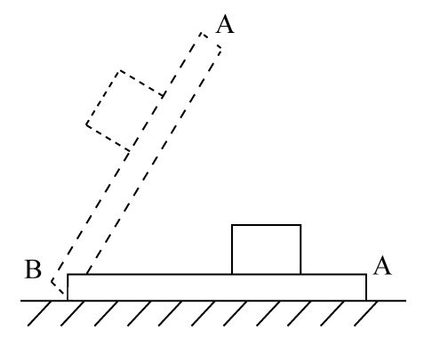

- **A**. 铅块滑动前后，f均随木板倾角的增大而减小
- **B**. 铅块滑动前，f随木板倾角的增大而减小；铅块滑动后，f随木板倾角的增大而增大
- **C**. 铅块滑动前，f随木板倾角的增大而增大；铅块滑动后，f随木板倾角的增大而减小　✅
- **D**. 铅块滑动前后，f均随木板倾角的增大而增大

**答案**：C

**官方解析**

当木板在水平地面时，没有摩擦力；

随着木板抬起至铅块滑动前，铅块受的是静摩擦力。如图所示，根据受力分析可知，静摩擦力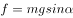。随着木板抬起，木块倾角变大，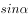变大，则静摩擦力f变大，据此可以排除A、B两项；

铅块开始滑动后，所受摩擦力变为动摩擦力，动摩擦力。随着木块倾角α变大，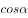变小，则动摩擦力变小，直至与地面垂直时，动摩擦力变为0，据此可排除D项，C项正确。

故正确答案为C。

---

## 第 2 题　qid 2137378 · 类比推理

如图所示，太阳光与水平地面成50°角入射，利用平面镜反射的原理可使太阳光沿井照亮下水道，则下列关于平面镜放置正确的是<u>      </u>。

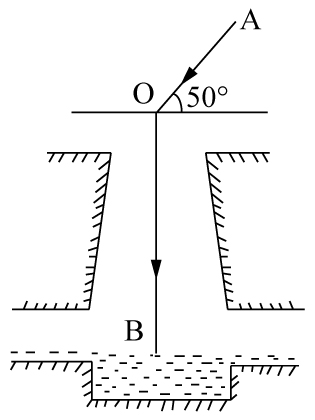

- **A**. 与竖直方向成50°
- **B**. 与水平方向成50°
- **C**. 与水平方向成70°　✅
- **D**. 与水平方向成25°

**答案**：C

**官方解析**

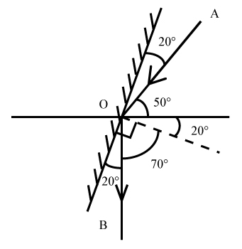

如图所示，法线（虚线）和镜子垂直，入射角和反射角相等，则镜面与水平方向成，ABD三项错误，C项正确。

故正确答案为C。

---

## 第 3 题　qid 2137382 · 逻辑判断

蜻蜓点水后在平静的水面上会出现波纹。下面四张图是蜻蜓点水时的俯视照片，照片反映了蜻蜓连续三次点水后某瞬间的水面波纹。不考虑蜻蜓每次点水所用的时间，则下列描述与对应图片相符的是<u>       </u>。

- **A**. A图中蜻蜓向右飞行，且飞行速度和水波的传播速度相等　✅
- **B**. B图中蜻蜓向右飞行，且飞行速度比水波的传播速度慢
- **C**. C图中蜻蜓向左飞行，且飞行速度和水波的传播速度相等
- **D**. D图中蜻蜓向左飞行，且飞行速度比水波的传播速度快

**答案**：A

**官方解析**

水波在水面传播速度相等，所以水波圆圈越小，代表水波产生越晚。观察 ABD三项，水波自左向右大小依次变小，说明水波自左到右依次产生，蜻蜓应向右飞，而C项水波圆心在同一点，说明蜻蜓原地点水。故排除C、D两项。
若蜻蜓飞行速度和水波传播速度相等，则新点水时，刚好在旧水波圆圈上点水。随后扩散时，新产生的水波圆圈应与旧水波圆圈相切，A项正确。
若蜻蜓飞行速度比水波传播速度慢，则新点水时，在旧水波圆圈内点水。随后扩散时，新产生的水波圆圈应与旧水波圆圈无交点，B项错误。
故正确答案为A。

---

## 第 4 题　qid 2137384 · 类比推理

武警战士小东在野外实战训练时，需要从离地3米的窗台跳下，当他两脚着地的瞬间，膝盖马上弯曲，使身体的重心又下降了0.5米，从而缓冲地面对身体的作用力，那么该作用力估计为      。

- **A**. 自身所受重力的4倍
- **B**. 自身所受重力的6倍
- **C**. 自身所受重力的7倍　✅
- **D**. 自身所受重力的10倍

**答案**：C

**官方解析**

武警战士小东从离地3米的窗台跳下，当他两脚着地的瞬间，膝盖马上弯曲，使身体的重心又下降了0.5米，重心下降的距离h=3+0.5=3.5米。假设人从接触地面开始地面对身体的作用力恒为F，可知作用力F的作用距离s=0.5米。从开始起跳到最终站稳的过程中，由动能定理: 合外力做的功等于物体动能的变化量，可知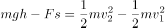，因为小东开始起跳时，速度等于零，最终落地停稳时，速度也等于零，所以，即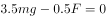，，所以该作用力F估计为自身重力的7倍。

故正确答案为C。

---

## 第 5 题　qid 2137392 · 类比推理

某司机驾车在如下图所示的路面上前行，已知AB段为下凹路段，BC段是上凸路段，当汽车依次经过M、N、O、P（M为最低点，P为最高点）四点时对路面的压力分别为FM、FN、FO、FP，汽车重力为G，前进过程中速率保持不变，那么下列关系式一定成立的是<u>       </u>。

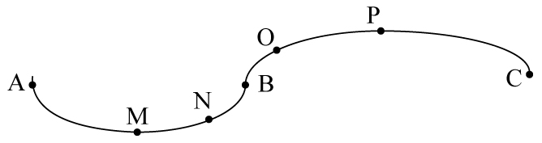

- **A**. FM≥G
- **B**. FN＞G
- **C**. FO＜G　✅
- **D**. FP＞G

**答案**：C

**官方解析**

本题考查向心力的相关知识

本题小车在弧形路面行走，故在受力分析时一定要考虑指向圆心的向心力。

A项，如果车在M点，则车受向下的重力以及向上的支持力，两者合力提供向心力。由于小车速率保持不变的运动，向心力不为0，则支持力FM必须大于重力从而提供向心力，即FM＞G，取不到相等的情况，错误。

B项，在N点，汽车受重力，斜向上指向圆心的支持力FN，将重力分解，沿着支持力反方向Gsinθ和与之垂直的斜向下方向Gcosθ（由于汽车匀速，Gcosθ与摩擦力平衡在此不作考虑）。FN与Gsinθ的合力提供向心力，FN＞Gsinθ，但由于向心力未知，FN与G的大小关系未知，错误。

C项，同理，汽车在O点时，重力分力Gsinθ与FO提供向心力，此情况圆心在斜面下方，故Gsinθ＞FO，则G＞FO，正确。

D项，汽车在P点，由重力G和支持力FP提供向心力，则G＞FP，错误。

故正确答案为C。

备注：各选项的受力分析图如图所示：

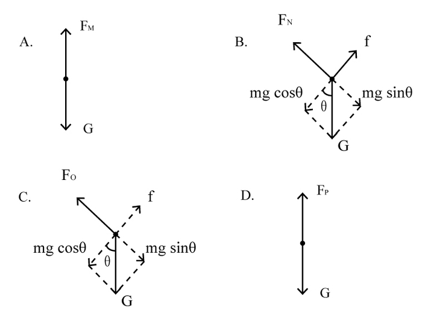

---

## 第 6 题　qid 2137394 · 类比推理

如图所示，一皮球从粗糙的曲线形坡面的a点开始无初速度地向下滚动，由于摩擦力作用，皮球滚到b点后开始折返到c点，已知a、b两点的高差为h1，b、c两点的高差为h2，那么<u>      </u>。

- **A**. h1=h2
- **B**. h1＜h2
- **C**. h1＞h2　✅
- **D**. h1、h2大小关系不确定

**答案**：C

**官方解析**

根据题干描述的运动过程，可将本题分成两个过程，两个过程遵循能量守恒定律。

过程一，从a点开始，到b点结束，为a、b高度差。

皮球在a点的所有能量是它的重力势能（）

=mg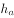①

运动到b点的所有能量是它的重力势能（）

=mg②

因为&gt;，所以mg&gt;mg，&gt;，所以从a到b能量减少，减少的能量即为皮球从a运动到b摩擦力所做的功（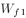），所以

=mg-mg=mg（-）③

过程二，从b点开始，到c点结束，为b、c高度差。

同理，如过程一，皮球从b点到c点能量减少，减少的能量即为皮球从b运动到c摩擦力所做的功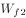，所以

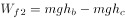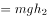④

故，比较和大小，即可理解为比较③和④的大小，此处可简单理解为：因为过程一比过程二多走了ac这段路，所以过程一摩擦力所做的功比较大，所以

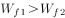⑤

将③④代入⑤可得：

mg&gt;mg，&gt;，C项正确。

故正确答案为C。

---

## 第 7 题　qid 2137398 · 逻辑判断

毕业季来临之际，摄影师用单反相机给某毕业班的同学们拍完合照，随后要用同一台相机给每个学生拍单人照片，那么这时他应该      。

- **A**. 把相机离人近一些，同时镜头后缩
- **B**. 把相机离人近一些，同时镜头前伸　✅
- **C**. 把相机离人远一些，同时镜头后缩
- **D**. 把相机离人远一些，同时镜头前伸

**答案**：B

**官方解析**

本题考查光学相关知识。

从班级合照转向单人照，则拍照视野由大变小，根据常识，相机要离人近一些，排除C、D两项。同时对于镜头而言，照单人照，则使人在底片中尽量大，如图所示，应该是镜头前伸，A项排除，B项当选。

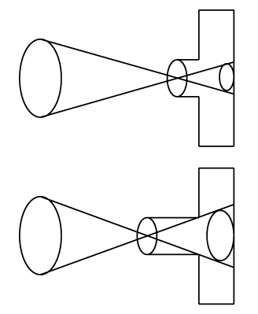

故本题答案为B。

---

## 第 8 题　qid 2137406 · 类比推理

如图所示，在水平台面上放置有一光滑斜面，倾角为α，在斜面上某处放了一根垂直于纸面的直导线，在导线中通有垂直纸面向里的电流，图中a点在导线正下方，b点与导线的连线与斜面垂直，c点在a点左侧，d点在b点右侧。现欲使导线静止在斜面上，下列措施可行的是<u>      </u>。

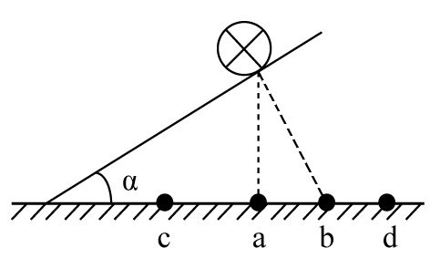

- **A**. 在a处放置一电流方向垂直纸面向里的直导线
- **B**. 在b处放置一电流方向垂直纸面向里的直导线
- **C**. 在c处放置一电流方向垂直纸面向里的直导线
- **D**. 在d处放置一电流方向垂直纸面向里的直导线　✅

**答案**：D

**官方解析**

根据右手定则和左手定则，在a、b、c、d四处放置电流方向垂直纸面向里的直导线，两根导线会在电流产生的磁场影响下，相互吸引。

若在a、b、c处放置导线，则斜面上导线在斜面方向不受向上的力，不可能静止，故ABC三项错误；

若在d处放置导线，则斜面上导线受磁场对导线向d的力，存在斜面方向向上的分力，可能静止，D项正确。

故正确答案为D。

---

## 第 9 题　qid 2137416 · 类比推理

三盏灯泡L1（110V、100W）、L2（110V、40W）和L3（110V、25W），电源所能提供的电压为220V，在图示的四个电路中，能通过调节变阻器R使电路中各灯泡均能够正常发光且最省电的一种电路是<u>      </u>。

- **A**. A
- **B**. B
- **C**. C　✅
- **D**. D

**答案**：C

**官方解析**

假使三盏灯泡均正常发光，则三盏灯泡耗电量固定，若想电路最省电，则需滑动变阻器R耗电最小。根据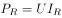，电压相等时，电流越小，滑动变阻器R耗电越小。正常发光时，通过三盏灯泡的电流分别表示为 、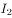、和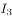。

对于A，三盏灯泡并联，若正常发光，三盏灯泡两端电压均为110V，滑动变阻器两端电压为110V。干路电流，即通过滑动变阻器电流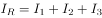。

对于B，和滑动变阻器R并联，若正常发光，灯泡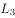两端电压为110V。干路电流，即通过灯泡的电流，而由于P=UI，三个灯泡额定电压相等，额定功率最小，所以正常工作时，电流最小，故等式不可能成立，B电路图无法让三盏灯都正常发光。

对于C，、和滑动变阻器R并联，若正常发光，三盏灯泡两端电压均为110V，滑动变阻器两端电压为110V。干路电流，即通过灯泡的电流，可得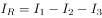。

对于D，电路相当于和滑动变阻器R、和分别并联后再串联，若正常发光，三盏灯泡两端电压均为110V，滑动变阻器R两端电压为110V。干路电流，可得。

A、C、D三个电路图中，滑动变阻器R两端电压均为110V，C中最小，滑动变阻器消耗功率最小，电路总耗电最小，A、D两项错误，C项正确。

故正确答案为C。

---

## 第 10 题　qid 2137168 · 类比推理

我们知道地球带的是负电荷，如果在赤道上方有一竖直的避雷针，当有带正电荷的乌云经过避雷针上方时开始放电，那么地磁场对避雷针的作用力方向为      。

- **A**. 正东　✅
- **B**. 正南
- **C**. 正西
- **D**. 正北

**答案**：A

**官方解析**

题干要求判断地磁场对避雷针的作用力方向，则要使用左手定则来判断受力方向。当乌云经过避雷针上方开始放电时会产生电流，电流方向由正电荷流向负电荷，也就是指向地心；而地磁场的方向是由地理南极指向地理北极。使用左手定则，让磁感线穿入手心，四指指向电流方向，那么大拇指的方向就是受力方向，由图中可知，大拇指所指方向为正东，所以地磁场对避雷针的作用力方向为正东。

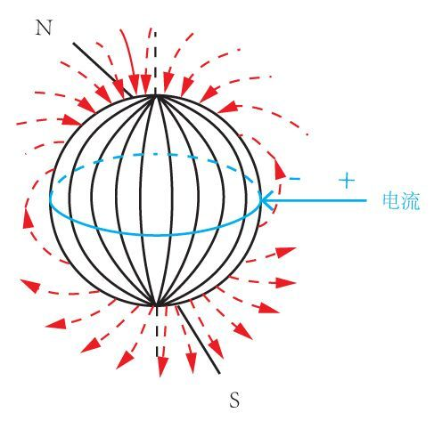

故正确答案为A。

---

## 第 11 题　qid 2137182 · 逻辑判断

水平台面上放置一装有某种液体的容器，将A、B、C三个重量一样的块体放入容器中，当该三个块体稳定后，发现A漂浮在液面上，B悬浮在液体中，而C则沉到容器底部，那么下列说法中正确的是      。

- **A**. 
如果三个块体都是空心的，则它们的体积可能相等

- **B**. 
如果三个块体的材料相同，则A、B一定是空心的
　✅
- **C**. 
如果三个块体都是空心的，则它们所受浮力的大小关系为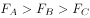

- **D**. 
如果三个块体都是实心的，则它们密度的大小关系为

**答案**：B

**官方解析**

逐项分析：

A、C两项：A、B、C三个块体重量一样，即，根据A、B、C三个块体稳定后分别处于漂浮、悬浮、沉底状态可知，、、；故。若三个块体的体积相同，则根据浮力公式可知，三个块体的浮力大小关系为，与题干相矛盾，则三个块体的体积不可能相等，均错误；

B项：三个块体材料相同，而C是沉到容器底部的，说明其平均密度大于液体密度，而A是漂浮，则说明A的平均密度小于液体密度，B物体悬浮，则说明B的平均密度等于液体密度。由此可知A、B物体的平均密度小于C物体，材料相同、重量相同的情况下，A、B一定是空心的，正确；

D项：都是实心的情况下，根据沉浮状态可以判定，错误。

故正确答案为B。

---

## 第 12 题　qid 2137186 · 图形推理

下列选项中，符合所给图形的变化规律的是<u>      </u>。

- **A**. A
- **B**. B
- **C**. C
- **D**. D　✅

**答案**：D

**官方解析**

元素组成相同，考虑位置规律。观察发现图3到图4，整体图形逆时针旋转90°，根据此规律从图1到？处，整体图形也逆时针旋转了90°，对应D项。验证D项，图形整体旋转90°后刚好走到图3的位置。
故正确答案为D。

---

## 第 13 题　qid 2137196 · 图形推理

下列选项中，符合所给图形的变化规律的是（    ）。

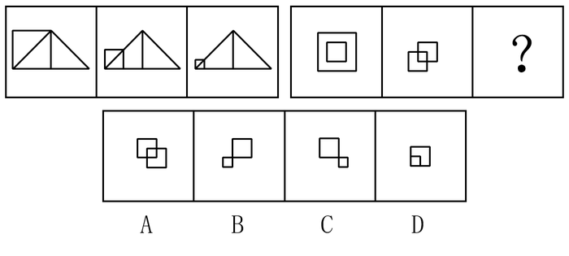

- **A**. A
- **B**. B　✅
- **C**. C
- **D**. D

**答案**：B

**官方解析**

观察第一组图形发现，图1到图2，正方形缩小到左边，三角形不变；图2到图3，正方形继续缩小到左边，三角形不变。第二组也应遵循此规律，从图1到图2外框正方形缩小到左边，中间的正方形不变；从图2到？处，左边的正方形继续缩小到左边，中间的正方形不变，对应B项。A项左边的正方形没有继续缩小，排除。C项左边的正方形缩小到了右边，排除。D项左边的正方形缩小到了中间，排除。
故正确答案为B。

---

## 第 14 题　qid 2137200 · 图形推理

下列选项中，符合所给图形的变化规律的是<u>      </u>。

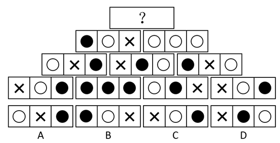

- **A**. A
- **B**. B
- **C**. C　✅
- **D**. D

**答案**：C

**官方解析**

元素组成相同，考虑位置关系。题干为金字塔型，考了紧邻形成三角形图形之间的关系，观察发现，从下往上数第一层左边两个图形内部相同位置的小图形叠加的规律：和叠加后变为第二层左边图形的，和叠加后变为第二层左边图形的，和叠加后变为第二层左边图形的，第一层中间两个图内部图形按照和叠加变为，和叠加后变为，和叠加后变为，从而组成第二层中间图的内部三个小图，第一层右边两个图形的内部小图也是按照和叠加后变为，和叠加后变为，和叠加后变为的规律最后形成了第二行最右侧的图形。照此规律，第二层的左边相邻两个图形内部小图相互叠加则变为第三层的左边图形，第二层右边相邻两图形内部小图相互叠加则变为第三层右边的图形，叠加规律为：和叠加后变为，和叠加后变为，和叠加变为，和叠加后变为，以此类推，第三层的两个图形内部小图相同位置进行叠加后变为顶层的图形，叠加规律为：和叠加后变为的，和叠加后变为，和叠加后变为，只有C项符合。

故正确答案为C.

---

## 第 15 题　qid 2137202 · 图形推理

如下图所示，由图1折叠成图2，再折叠成图3，然后剪去图4的阴影三角部分，现将其完全展开后得到的图形是<u>      </u>。

- **A**. A
- **B**. B
- **C**. C
- **D**. D　✅

**答案**：D

**官方解析**

观察题干发现，从图1到图3折叠两次，且剪去一三角形得到图4，现想知将其完全展开后的图形形状，只需将折叠部分依次展开即可，如下图所示： 

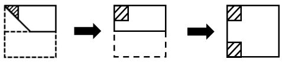

故正确答案为D。

---

## 第 16 题　qid 2137204 · 图形推理

下列选项中，符合所给图形的变化规律的是<u>      </u>。

- **A**. A
- **B**. B
- **C**. C
- **D**. D　✅

**答案**：D

**官方解析**

元素组成相同，考虑位置规律。观察发现，题干图形均可分为内圈、外圈两部分，内圈可分为4格，包括小白球和两条短线，依次整体旋转（或上下翻转），则问号处两个小白球应该出现在下方，两条短线出现在上方，据此排除A、C两项；外圈可分为4格，包括两条短线，依次顺时针旋转，则问号处两根小短线应分别出现在右上方和右下方，对应D项。

故正确答案为D。

---

## 第 17 题　qid 2137206 · 图形推理

下列选项中，符合所给图形的变化规律的是<u>      </u>。

- **A**. A
- **B**. B
- **C**. C　✅
- **D**. D

**答案**：C

**官方解析**

元素组成不同，优先考虑属性规律。观察发现，题干图形都是轴对称图形，且对称轴数量分别为1、2、3、？，故？处应为轴对称图形且有4个对称轴。A项有无数个对称轴，B项有3个对称轴，C项有4个对称轴，D项有1个对称轴。
故正确答案为C。

---

## 第 18 题　qid 2137210 · 图形推理

下列选项中，符合所给图形的变化规律的是<u>      </u>。

- **A**. A
- **B**. B
- **C**. C
- **D**. D　✅

**答案**：D

**官方解析**

元素组成相似，图形间有相同线条重复出现，考虑加减同异。首先观察第一组图，将图2顺时针旋转90度后，和图1求异后得到图3；第二组图运用规律，图2顺时针旋转90度后，和图1求异，应得到的是D项。
故正确答案为D。

---

## 第 19 题　qid 2137218 · 图形推理

下列选项中，由所给图形叠加而成的图形是<u>      </u>。

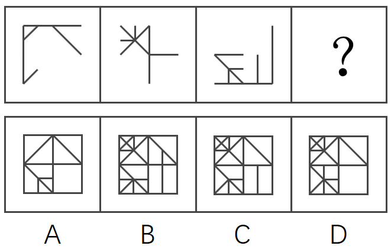

- **A**. A
- **B**. B
- **C**. C　✅
- **D**. D

**答案**：C

**官方解析**

本题考查图形相加，题干前三幅图相加得到第四幅图。观察选项发现，相加后的图形主要有4个小矩形组成，可对比选项差异，回到题干去验证。观察选项发现，右下角的小矩形有差异，A、D两项里面为空白，而B、C两项里面有条竖线。回到题干，图3右下角有条竖线，故排除A、D两项。继续对比B、C两项发现右上角的矩形有差异，B项右上角矩形内有条小竖线，C项右上角矩形内没有小竖线，回到题干，3幅图的右上角均没有小竖线，排除B项。如下图所示，只有C项符合。

 

故正确答案为C。

---

## 第 20 题　qid 2137220 · 图形推理

下列选项中，符合所给图形的变化规律的是<u>      </u>。

- **A**. A
- **B**. B
- **C**. C
- **D**. D　✅

**答案**：D

**官方解析**

解法一：观察发现，每幅图形都由一些小元素组成，考虑数元素。元素的数量依次为4、5、6、？，问号处应该为7个元素，排除A、B两项；对比C、D两项，元素种类相同，区别是相同元素的数量不同，进一步观察题干发现，圆的数量依次为1、2、3、？，问号处应该为4个圆，排除C项。
故正确答案为D。
解法二：观察发现，每幅图形都由一些小元素组成，考虑数元素。题干中所有图形都是由2种元素构成。A选项3种元素，B选项2种元素，C选项3种元素，D选项3种元素。
故正确答案为B。
粉笔更倾向于D选项为正确答案。理由是，在一些题目中图形的方向不同，可以看作不同种类的图形，而且因为元素种类的规律比较简单，如果想单纯考虑元素种类的话，没必要把图形的数量规律画的如此明显，因此粉笔更倾向于答案为D选项。
此题为争议题，任何一种解法都规律严谨，各位考生不要纠结。

---

## 第 21 题　qid 2137222 · 图形推理

下列选项中，符合所给图形的变化规律的是<u>      </u>。

- **A**. A　✅
- **B**. B
- **C**. C
- **D**. D

**答案**：A

**官方解析**

元素组成相同，优先考虑位置规律。每个图形都是由4个长方形组成的，在图一中，从左到右依次给长方形编号为1、2、3、4，图一到图二1号长方形向右平移两步，图二到图三2号长方形向右平移两步，图三到图四应该是3号长方形向右平移两步，只有A项符合。
故正确答案为A。

---

## 第 22 题　qid 2137228 · 图形推理

下列选项中，根据图1和图2的关系，与图3对应的图形是<u>      </u>。

- **A**. A
- **B**. B
- **C**. C　✅
- **D**. D

**答案**：C

**官方解析**

元素组成基本相同，优先考虑位置规律。第一组图找规律，观察图1和图2，梯形和三角形的位置进行互换，×和+的位置进行互换，圆的位置不变，外框都是正方形；第二组图用规律，图3中三角形和圆的位置进行互换，#和*的位置进行互换，外框是梯形，所以对应选项C。
故正确答案为C。

---

## 第 23 题　qid 2137236 · 图形推理

左边给定的平面图折叠后的立体图形是<u>      </u>。

- **A**. A　✅
- **B**. B
- **C**. C
- **D**. D

**答案**：A

**官方解析**

将题干展开图标上序号（题干中四个小三角形移动拼成一个完整的面i），如下图所示，逐一进行分析。

A项：选项由面i、面h与面k或面i、面e与面f构成，选项与题干展开图一致，当选；

B项：选项由面g、面i与一个空白面构成，题干展开图中面g与面i是相对面，不能同时出现，选项与题干展开图不一致，排除；

C项：选项由面g、面i与一个空白面构成，题干展开图中面g与面i是相对面，不能同时出现，选项与题干展开图不一致，排除；

D项：选项由面e、面f、面k与面h中的三个面构成，题干展开图中面e与面k是相对面，面f与面h是相对面，不能同时出现，无法满足同时出现三个面的情况，选项与题干展开图不一致，排除。

故正确答案为A。

---

## 第 24 题　qid 2137242 · 逻辑判断

领导干部如果没有底线思维，就不能做到严格自律。而只有不忘初心，才能始终保持底线思维。也只有始终坚守理想信念，才能不忘初心。
根据以上信息，可以得出下列      项。

- **A**. 如果领导干部不能做到严格自律，就会丧失底线思维
- **B**. 领导干部只有不忘初心，才能做到严格自律　✅
- **C**. 领导干部只要始终坚守理想信念，就能做到严格自律
- **D**. 领导干部只要不忘初心，就可以做到严格自律

**答案**：B

**官方解析**

第一步：翻译题干。
①领导干部没有底线思维→不能严格自律
②保持底线思维→不忘初心
③不忘初心→坚守理想信念
将①逆否和②③可以递推出：严格自律→底线思维→不忘初心→坚守理想信念
第二步：逐一分析选项。
A项翻译：领导干部不能严格自律→丧失底线思维，肯定条件①的后件无法得到肯定性结论，排除；
B项翻译：严格自律→不忘初心，通过将①逆否和②③可以递推出，当选；
C项翻译：坚守理想信念→严格自律，通过将①逆否和②③可以递推出严格自律→坚守理想信念，肯定后件无法得出肯定性结论，排除；
D项翻译：不忘初心→严格自律，通过将①逆否和②③可以递推出严格自律→不忘初心，肯定后件无法得出肯定性结论，排除。
故正确答案为B。

---

## 第 25 题　qid 2137250 · 逻辑判断

专业教育的主要目的是帮助大学生尽可能全面地掌握各自专业领域的基础知识，而通识教育的目的则重在帮助大学生获得生活的意义和价值。因此有专家指出，相较于专业教育，通识教育对个人未来生活的影响更大。
下列      项如果为真，最能支持该专家的断言。

- **A**. 价值问题关乎人的幸福和尊严，值得在通识教育中予以探究和思考
- **B**. 当今我国大学开设的专业教育类课程要远远多于通识教育类课程
- **C**. 一个人如果没有专业知识，可能还能活下去；倘若没有价值追求，就将只是一具没有灵魂的躯壳　✅
- **D**. 没有专业知识，人很难应对未来生活的挑战；而不正确的价值追求，则会误导人的生活

**答案**：C

**官方解析**

第一步：找出论点和论据。
论点：相较于专业教育，通识教育对个人未来生活的影响更大。
论据：专业教育的主要目的是帮助大学生尽可能全面地掌握各自专业领域的基础知识，而通识教育的目的则重在帮助大学生获得生活的意义和价值。
第二步：逐一分析选项。
A项：指出通识教育中应探究和讨论价值问题，但没有涉及到专业教育的情况，无法进行比较，无法加强，排除；
B项：指出大学开设的专业课程数量比通识课程多，只是数量的比较，无法判断这两种课程对人未来生活的影响哪个更大，无法加强，排除；
C项：指出没有专业知识可能活下去，但是没有价值追求就失去了灵魂，显然失去了灵魂更加严重，而价值追求对应通识教育，因此通识教育对个人未来生活的影响更大，补充论据，当选；
D项：没有专业知识难以应对未来生活的挑战，不正确的价值追求误导人的生活，说明两者对个人未来生活的影响都很大，但没有明确比较两者谁的影响更大，无法加强，排除。
故正确答案为C。

---

## 第 26 题　qid 2137262 · 逻辑判断

未取得教师资格证书的大学毕业生不能被某地区的学校录用为教师。该地区的师范大学历史系的所有学生在毕业前都必须取得教师资格证书。因此，任何一位该大学历史系的毕业生都可以在该地区被录用为教师。
下列      项如果为真，能够使上述论证得以成立。

- **A**. 每一个取得教师资格证书的人的教学水平都是相同的
- **B**. 取得教师资格证书是大学毕业生在该地区被录用为教师的唯一条件　✅
- **C**. 该地区师范大学历史系取得教师资格证书的所有学生都能毕业
- **D**. 想知道自己是否胜任教师这一职业的唯一方法就是去参加教师资格证书考试

**答案**：B

**官方解析**

第一步：找出论点和论据。
论点：任何一位该大学历史系的毕业生都可以在该地区被录用为教师。
论据：未取得教师资格证书的大学毕业生不能被某地区的学校录用为教师。该地区的师范大学历史系的所有学生在毕业前都必须取得教师资格证书。
第二步：逐一分析选项。
A项：讨论的是取得教师资格证书的人的教学水平是否一致，而题干讨论的是历史系毕业生能不能在该地区被录用为教师的问题，两者讨论的话题不一致，排除；
B项：说明取得教师资格证是被录用的唯一条件，而根据题干已知该大学历史系的毕业生都取得了教师资格证，建立了该大学历史系的毕业生和在该地区被录用为教师之间的联系，所以该大学历史系的毕业生都可以被录用，加强了题干的论证，当选；
C项：讨论的是该大学历史系有教师资格证的学生是否能毕业，而题干所讨论的是该大学的历史系学生毕业之后能不能当老师的问题，两者话题不一致，排除； 
D项：讨论的是能否胜任这个职业的事情，而题干所说的是能否被学校录用的问题，两者讨论话题不一致，排除。
故正确答案为B。

---

## 第 27 题　qid 2137286 · 逻辑判断

一直以来，科学家都在追寻一个问题的答案，那就是：究竟是什么给了地球足够的氧气，使其能孕育出动物和人类。地球大气中出现氧气是在距今24亿年前。约4.7亿年前，苔藓类地被植物在地球上迅速蔓延，直到4亿年前，地球大气中氧气含量才达到今天的水平。因此，有科学家认为，地球氧气大增源自苔藓类地被植物。
下列      项如果为真，最能支持上述科学家的观点。

- **A**. 地球上最早出现的陆生植物出人意料地多产，它们大大提升了地球大气中的氧气含量
- **B**. 通过电脑模拟可以估算得出：在约4.45亿年前，地球上的地衣和苔藓所产生的氧气占总氧气量的30%
- **C**. 苔藓类地被植物的蔓延增加了沉积岩中的有机碳含量，而这导致空气中的氧气含量也随着增加　✅
- **D**. 氧气含量的增加使得地球上演化出包括人类在内的大型、可移动的智慧生物成为可能

**答案**：C

**官方解析**

第一步：找出论点和论据。
论点：地球氧气大增源自苔藓类地被植物。
论据：地球大气中出现氧气是在距今24亿年前。约4.7亿年前，苔藓类地被植物在地球上迅速蔓延，直到4亿年前，地球大气中氧气含量才达到今天的水平。
论点和论据都在讨论“地球氧气大增”和“苔藓类地被植物蔓延”之间的关系，论点和论据话题一致，加强优先考虑解释或举例。
第二步：逐一分析选项。
A项：说的是陆生植物导致大气中的氧气含量增加，苔藓类地被植物是陆生植物的一种，无法确定苔藓类植物是否与氧气含量大增有关，属于不明确选项，排除；
B项：在约4.45亿年前，地球上的地衣和苔藓所产生的氧气占总氧气量的30%，选项只是在说4.45亿年前的氧气含量占比，无法确定后来的氧气大增是否来源于苔藓植物，属于不明确选项，排除；
C项：说明苔藓类地被植物的蔓延增加了沉积岩中的有机碳含量，从而导致空气中的氧气含量也随着增加，是对论点的解释，当选；
D项：讨论的是氧气增加的结果，而题干讨论的是氧气增加的原因，两者讨论话题不一致，属于无关选项，排除。
故正确答案为C。

---

## 第 28 题　qid 2137302 · 类比推理

江海之所以能为百谷王者，以其善下之，故能为百谷王。是以圣人欲上民，必以言下之；欲先民，必以身后之。
下列（    ）项与以上论证方法最为相似。

- **A**. 名不正，则言不顺；言不顺，则事不成。事不成，则礼乐不兴；礼乐不兴，则刑罚不中；刑罚不中，则民无所措手足。故君子名之必可言也，言之必可行也
- **B**. 春风朝煦，萧艾蒙其温；秋霜宵坠，芝蕙被其凉。是以威以齐物为肃，德以普济为弘　✅
- **C**. 木受绳则直，金就砺则利，君子博学而日参省乎己，则知明而行无过矣
- **D**. 假舆马者，非利足也，而致千里；假舟楫者，非能水也，而绝江河。君子性非异也，善假于物也

**答案**：B

**官方解析**

第一步：分析题干论证结构。
题干意为“江海之所以能成为百川百谷之王，是因为江海能够自处于谦下的位置，而河川自然流向大海，江海自然能够成为百谷之王。因此，统治者想要凌驾于黎民百姓之上，必须在言辞上处于谦恭的地位；想要先于百姓，更要在实际上处于他们的后方”。是从“江海”这一自然的特殊现象到“统治者”这类人的一般性结论的归纳推理。
第二步：逐一分析选项。
A项：意为“名分不正，说起话来就不顺当合理；说话不顺当合理，事情就办不成；事情办不成，礼乐也就不能兴盛；礼乐不能兴盛，刑罚的执行就不会得当；刑罚不得当，百姓就不知怎么办好。所以君子一定要定下一个名分，必须能够说得明白，说出来一定能够行得通”。并不涉及由自然推及人类，与题干论证结构不一致，排除；
B项：意为“春风在早晨吹拂，萧、艾都受到它的温暖；秋霜在晚上降落，芝、蕙都受到它的寒凉。所以明君施威、济德，只有对所有臣民一视同仁，才是肃严、弘大的”。是从“春风朝拂”“秋霜夜降”这一自然的特殊现象到“统治者”这类人的一般性结论的归纳推理，与题干逻辑关系一致，当选；
C项：意为“木材用墨线量过，再经辅具加工就能取直，刀剑等金属制品在磨刀石上磨过就能变得锋利，君子广泛地学习，而且每天多次对自己检查反省，那么他就会聪明机智，而行为就不会有过错了”。并不涉及由自然推及人类，与题干论证结构不一致，排除；
D项：意为“凭借车马的人，并不是他擅长走路，却能到达千里远；凭借船桨的人，并不是他擅长游泳，却能横渡大江大河。君子的资质秉性跟一般人没有不同，只是君子善于借助外物罢了。”并不涉及由自然推及人类，与题干论证结构不一致，排除。
故正确答案为B。

---

## 第 29 题　qid 2137308 · 逻辑判断

X市的有线电视付费频道的用户数量比Y市要多，因此X市的市民比Y市市民更加了解国际时事。
下列各项如果为真，除了      项外，都将削弱上述论证。

- **A**. X市有线电视付费频道的月租费要低于Y市的同类频道　✅
- **B**. 调查显示，X市市民平均看电视的时间要比Y市市民少
- **C**. X市有线电视付费频道播放的都是娱乐类节目
- **D**. 大多数Y市市民在X市工作，通常只是在周末才回到Y市

**答案**：A

**官方解析**

第一步：找出论点和论据。
论点：X市的市民比Y市市民更加了解国际时事。
论据：X市的有线电视付费频道的用户数量比Y市要多。
第二步：逐一分析选项。
A项，月租低一定程度上可以解释为什么X市有线电视付费频道的用户数量多，但是没有体现谁更了解国际时事，无关选项，无法削弱，本题为选非题，当选；
B项，X市市民平均看电视的时间少，说明虽然X市有线电视付费频道的用户数量多，但是不一定谁看的电视多，不一定谁更加了解国际时事，可以削弱，排除；
C项，X市有线电视付费频道播放的都是娱乐类节目，说明无法用有线电视付费频道的用户数量来判断谁更加了解国际时事，可以削弱，排除；
D项，大多数Y市市民在X市工作，在周末回到Y市，说明虽然X市的有线电视付费频道的用户数量多，但是也有可能是Y市的人在付费使用，所以无法得出X市的市民比Y市市民更加了解国际时事，可以削弱，排除。
本题为选非题，故正确答案为A。

---

## 第 30 题　qid 2137316 · 逻辑判断

去年全年，某地区因驾驶员酒驾导致的交通事故数量是因驾驶员疲劳驾驶导致的交通事故数量的2倍。因此，在禁止疲劳驾驶方面的宣传工作要比禁止酒驾的宣传工作做得更好。
下列（    ）项问题的答案最能对上述结论做出评价。

- **A**. 交通事故的数量是否与交通安全方面的宣传工作有直接关系？　✅
- **B**. 在下一个年度中，因疲劳驾驶而导致的交通事故数量是否会增加？
- **C**. 是不是所有疲劳驾驶的驾驶员都会出交通事故？
- **D**. 如果加大禁止酒驾的宣传力度，能在多大程度上降低酒驾导致的交通事故数量？

**答案**：A

**官方解析**

第一步：找出论点和论据。
论据：去年全年，某地区因驾驶员酒驾导致的交通事故数量是因驾驶员疲劳驾驶导致的交通事故数量的2倍。
论点：在禁止疲劳驾驶方面的宣传工作要比禁止酒驾的宣传工作做得更好。
第二步：逐一分析选项。
A项：该项讨论的是论点和论据的话题是否有直接的关系，而论点和论据是否有关系决定着题干结论是否成立，因此该项可以对题干的结论做出评价，当选；
B项：”下一个年度的交通事故数量“题干未提，无关项，排除；
C项：题干仅仅是比较了因酒驾导致交通事故的数量及因疲劳驾驶导致交通事故的数量，并未提及所有疲劳驾驶的驾驶员是否会发生交通事故，无关项，排除；
D项：加大禁止酒驾的宣传力度能在多大程度上降低酒驾导致的交通事故数量，仅讨论了禁止酒驾的问题，而题干是禁止酒驾和禁止疲劳驾驶二者之间的比较，无关项，排除。
故正确答案为A。

---

## 第 31 题　qid 2137322 · 类比推理

H市在公共场所中的每一块绿地都配备了垃圾桶。这些垃圾桶或者标有“可回收垃圾”或者标有“不可回收垃圾”。
如果上述陈述为真，则下列        项一定为真。
ⅠH市配备的垃圾桶上有的标有“可回收垃圾”
Ⅱ如果H市有一块绿地没有配备垃圾桶，那么该绿地不属于公共场所
Ⅲ如果H市有块绿地配备了标有“不可回收垃圾”的垃圾桶，那么它属于公共场所

- **A**. 只有Ⅰ
- **B**. 只有Ⅱ　✅
- **C**. 只有Ⅲ
- **D**. Ⅰ和Ⅱ

**答案**：B

**官方解析**

第一步：翻译题干。
①公共场所中的绿地→垃圾桶。
②垃圾桶→标有“可回收垃圾” 或 标有“不可回收垃圾”。
第二步：逐一分析陈述。
Ⅰ.H市配备的垃圾桶上有的标有“可回收垃圾”。翻译后即：有的垃圾桶→标有“可回收垃圾”。肯定了命题②的箭头前，肯定箭头前必肯定箭头后。但“标有‘可回收垃圾’”不等同于“标有‘可回收垃圾’ 或 标有‘不可回收垃圾’”。因为即使没有“标有‘可回收垃圾’的垃圾桶”，有“标有‘不可回收垃圾’的垃圾桶”也符合命题②的箭头后的或关系，因此该陈述不是一定为真；
Ⅱ.如果H市有一块绿地没有配备垃圾桶，那么该绿地不属于公共场所。翻译后即：-垃圾桶→-公共场所。否定了命题①的箭头后，否定箭头后必否定箭头前，该陈述一定为真；
Ⅲ.如果H市有块绿地配备了标有“不可回收垃圾”的垃圾桶，那么它属于公共场所。翻译后即：标有“不可回收垃圾”→公共场所。肯定了命题②的箭头后，肯定箭头后得不到确定性的结论，该陈述不是一定为真。
综上所述，只有陈述Ⅱ一定为真。
故正确答案为B。

---

## 第 32 题　qid 2137326 · 逻辑判断

校学术委员会开会讨论新一轮的重点学科建设规划。王教授主张：既要重点建设教育科学，也要建设自然地理学；赵教授提出：只有重点建设计算机信息工程，才能建设自然地理学；李教授认为：如果要重点建设教育科学和自然地理学，那么也要建设计算机信息工程。经过充分讨论，在上述三位教授的意见中，学术委员会最后只采纳了其中一位的意见。
根据以上陈述，下列        项符合学术委员会的决定。

- **A**. 重点建设计算机信息工程和自然地理学，但是不建设教育科学
- **B**. 重点建设教育科学和计算机信息工程，但是不建设自然地理学
- **C**. 重点建设计算机信息工程，但是不建设教育科学和自然地理学
- **D**. 重点建设自然地理学和教育科学，但是不建设计算机信息工程　✅

**答案**：D

**官方解析**

第一步：分析题干条件。

王教授：教育科学 且 自然地理学；

赵教授：自然地理学计算机信息工程；

李教授：（教育科学 且 自然地理学）计算机信息工程。

第二步：看其余，根据题干推理。

题干中只采纳一个人的建议，说明只有一真。分析条件（2）（3）可知，两个都涉及到推出关系，且后半部分相同，如果（2）成立，那么（3）一定成立，又题干条件只有一真，所以（2）一定错，即（2）的矛盾“重点建设自然地理学且不建设计算机信息工程”一定对，排除A、B、C三项。

故正确答案为D。

注：本题问的是下列哪项符合学术委员会的决定，也可以考虑代入选项进行验证。

代入A项，王教授的意见为假，赵教授和李教授的意见为真，不满足只采纳了一个人的意见，排除；

代入B项，王教授的意见为假，赵教授和李教授的意见为真，不满足只采纳了一个人的意见，排除；

代入C项，王教授的意见为假，赵教授和李教授的意见为真，不满足只采纳了一个人的意见，排除；

代入D项，王教授的意见为真，赵教授和李教授的意见为假，满足只采纳了一个人的意见，当选。

故正确答案为D。

---

## 第 33 题　qid 2137330 · 逻辑判断

某单位打算邀请五位专家在6月下旬参加一个项目论证会。某日，工作人员致电五位专家以确定会议日期。
专家甲说：“我有两天不行，因为我每周一都要参加本单位的例会。”
专家乙说：“我6月27号以后要出国访问。”
专家丙说：“我下周四之前都在外地开会。”
专家丁说：“我下周五、六、日都要参加其他会议。”
专家戊说：“最好在下半周举行，一般上半周都没有时间。”
根据上述信息，可以召开项目论证会的时间是        。

- **A**. 6月21日
- **B**. 6月22日
- **C**. 6月23日
- **D**. 6月24日　✅

**答案**：D

**官方解析**

6月一共有30天，那下旬一共10天，即21-30日。根据甲的话可知，10天中会有两个周一，任意连续的7天必然有且只有一个周一，可知24-30号必然有且只有一个周一，则21-23日必然存在周一，有三种情况，如下图：

由题干可知，专家丙说：“我下周四之前都在外地开会。”，专家丙是针对下旬的论证会邀请所作答，也就意味着专家所说的下周四一定是下旬里。而三种情况中，都只有一个周四包含在下旬中，所以唯一的周四就是专家丙所说的“下周四”。

在直接推理比较复杂，可以采用代入排除法。

A项，三种情况下，21日都在下周四之前，丙不能参加，所以不能是21日，排除；

B项，三种情况下，22日都在下周四之前，丙不能参加，所以不能是22日，排除；

C项，三种情况下，23日都在下周四之前，丙不能参加，所以不能是23日，排除；

D项，第一种情况下，24日是周四，每个人都可以参加，当选。

故正确答案为D。

---

## 第 34 题　qid 2137332 · 类比推理

五名幼儿园的小朋友围坐成一圈玩游戏。已知：小红不坐在小兰旁边；小白坐在小敏旁边；小兰坐在小杉旁边。
如果上述陈述属实，可以确定的是下列        项。
I小红坐在小杉和小敏的中间
II小兰坐在小杉和小白的中间
III小白坐在小杉的旁边
IV小敏坐在小白和小兰的中间

- **A**. II和IV都不是真的
- **B**. I和II是真的　✅
- **C**. II和III都是真的
- **D**. II和III都不是真的

**答案**：B

**官方解析**

第一步：分析题干。
由“小红不坐在小兰旁边；小白坐在小敏旁边；小兰坐在小杉旁边”可知，这五名幼儿园小朋友的顺序，有可能是两种情况，第一种是：按照小白、小敏、小红、小杉、小兰的顺序围成一圈；第二种是：按照小敏、小白、小红、小杉、小兰的顺序围成一圈。
第二步：逐一分析选项。
I、II和IV中的“中间”是指在两个人中间的任何一个位置都是可以的，并不一定是要直接挨着，因为如果把“中间”理解成是直接挨着的话，那根据分析，可以得到I、II和IV是可能是正确的，而III一定是错误的，但是没有这样的选项。所以，对于“中间”的理解只能是在两个人中间的任何一个位置都是可以的，并不一定是要直接挨着的。所以，I、II和IV确定是真的，而III确定是错的。
故正确答案为B。

---

## 第 35 题　qid 2137338 · 逻辑判断

在现代音乐制作领域中，音乐创作被弃之一旁，取而代之的是音乐工业，它如同其他工业领域一样，强调的是标准化和一致性，因而流行音乐最典型的特征包括朗朗上口的曲调、副歌以及标准化节奏（一节四拍）。
下列        项最适合作为上文论述的结论。

- **A**. 现代流行音乐的典型特征是由音乐工业的要求决定的　✅
- **B**. 音乐工业对标准化和一致性的要求与其他工业没有区别
- **C**. 音乐创作在现代已经完全消失了
- **D**. 流行音乐应该具备的典型特征包括朗朗上口的曲调、副歌以及标准化节奏（一节四拍）

**答案**：A

**官方解析**

日常结论题，根据题干信息逐一分析选项。
A项：因为音乐创作被弃之一旁，取而代之的是音乐工业，而流行音乐最典型的特征包括朗朗上口的曲调、副歌以及标准化节奏（一节四拍），所以可得到A项的结论，当选；
B项：由题干我们只能知道，音乐工业同其他工业领域一样，强调的是标准化和一致性，但是我们并不知道音乐工业的要求和其它工业的要求有没有区别，排除；
C项：音乐创作被弃之一旁，并不能说明它已经完全消失了，表述太绝对，排除；
D项：朗朗上口的曲调、副歌以及标准化节奏（一节四拍）只是流行音乐的典型特征，但是文段并没有表达流行音乐“应该”具有这些特征，不能作为结论，排除。
故正确答案为A。

---
