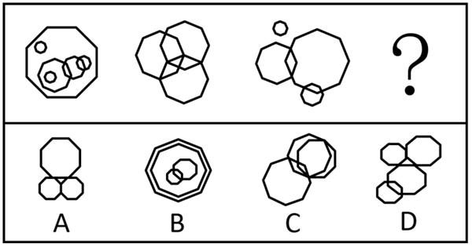
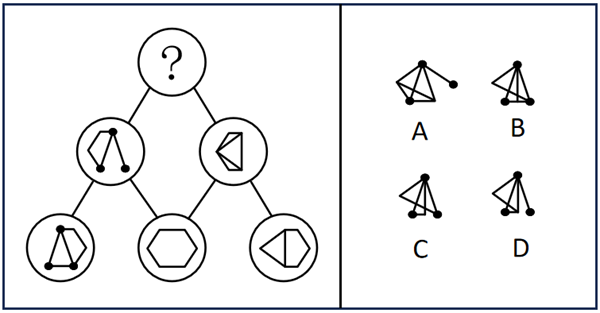
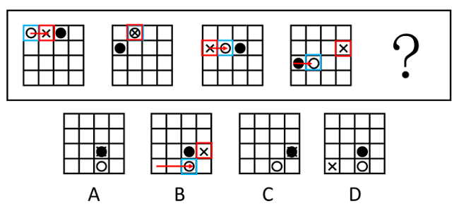
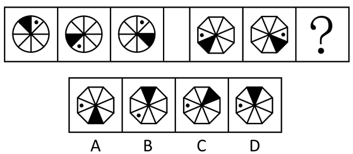
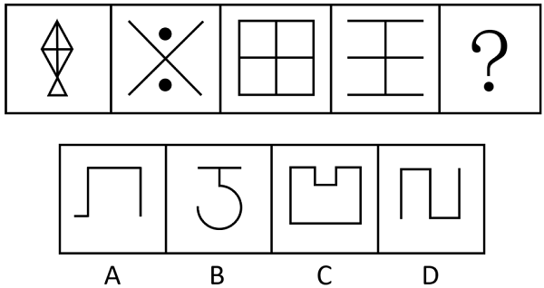
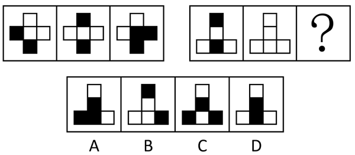
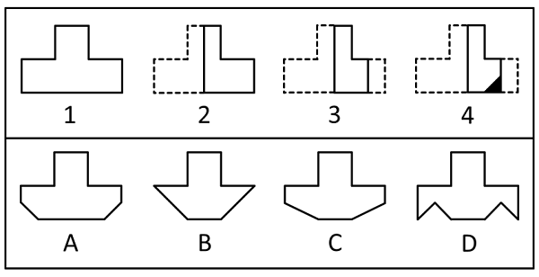

# 2018年上海市行政执法类考试《行测》试题（网友回忆版）

> 判断推理 · 24 题 · 上海 2018

## 第 1 题　qid 5676939 · 定义判断

一体化是指企业用产品、技术，市场优势，根据企业控制程度和物资流动方向，不断地向深度和广度发展的战略。纵向一体化是指生产或经营相互衔接、紧密联系的企业之间实现一体化；水平一体化是处于相同产业、生产同类产品或工艺相近的企业实现联合。
根据上述定义，下列不属于纵向一体化战略的是        。

- **A**. 某空调生产厂商先后兼并了几家其他空调生产企业　✅
- **B**. 某钢铁生产企业拥有了自己的矿山和炼焦设施
- **C**. 某服装生产商与零售企业组成新公司，专攻服装的海外市场
- **D**. 某汽车企业收购了一家为其供应特种零件的生产商

**答案**：A

**官方解析**

第一步：找出定义关键词。
一体化：“企业用产品、技术，市场优势，根据企业控制程度和物资流动方向，不断地向深度和广度发展的战略”；
纵向一体化：“生产或经营相互衔接、紧密联系的企业之间实现一体化”；
水平一体化：“处于相同产业、生产同类产品或工艺相近的企业实现联合”。
第二步：逐一分析选项。
A项：该空调生产厂商和其他空调生产企业属于生产同类产品的企业，该空调生产厂商兼并了其他空调生产企业，符合“处于相同产业、生产同类产品或工艺相近的企业实现联合”，符合“水平一体化”定义，不符合“纵向一体化”定义，当选；
B项：采矿、炼焦是钢铁生产的重要环节，因此钢铁生产企业与矿山、炼焦工业的生产经营紧密联系，钢铁生产企业拥有自己的矿山和炼焦设施，符合“生产或经营相互衔接、紧密联系的企业之间实现一体化”，符合“纵向一体化”定义，排除；
C项：服装生产商要依靠零售企业进行产品的销售，二者的生产经营紧密联系，服装生产商与零售企业组成新公司，符合“生产或经营相互衔接、紧密联系的企业之间实现一体化”，符合“纵向一体化”定义，排除；
D项：零件的生产商需要向汽车企业供应零部件，二者的生产经营紧密联系，汽车企业收购了为其供应特种零件的生产商，符合“生产或经营相互衔接、紧密联系的企业之间实现一体化”，符合“纵向一体化”定义，排除。
本题为选非题，故正确答案为A。

---

## 第 2 题　qid 5676941 · 定义判断

不相关多元化是企业通过收购、兼并其他行业的业务，或者在其他行业投资，把业务扩展到其他行业中，新产品、新业务与企业的现有业务、技术、市场毫无关系。
根据上述定义，下列不涉及不相关多元化的是        。

- **A**. 某家电连锁企业进军生物制药领域
- **B**. 某咖啡店不仅销售咖啡，也提供包括茶、冰激凌、点心等在内的其他产品　✅
- **C**. 房地产市场红火时，许多与房地产行业毫无关联的企业都纷纷拓展地产业务
- **D**. 某集团先后进军汽车制造、金融、投资贸易等领域

**答案**：B

**官方解析**

第一步：找出定义关键词。
“把业务扩展到其他行业中”、“新产品、新业务与企业的现有业务、技术、市场毫无关系”。
第二步：逐一分析选项。
A项：某家电连锁企业进军生物制药领域，其中家电与生物制药属于不同行业，符合“把业务扩展到其他行业中”、“新产品、新业务与企业的现有业务、技术、市场毫无关系”，符合定义，排除；
B项：某咖啡店不仅销售咖啡，也提供包括茶、冰激凌、点心等在内的其他产品，其中咖啡、茶、冰激凌、点心等都属于餐饮行业，不符合“把业务扩展到其他行业中”、“新产品、新业务与企业的现有业务、技术、市场毫无关系”，不符合定义，当选；
C项：许多与房地产行业毫无关联的企业都纷纷拓展地产业务，符合“把业务扩展到其他行业中”、“新产品、新业务与企业的现有业务、技术、市场毫无关系”，符合定义，排除；
D项：某集团先后进军汽车制造、金融、投资贸易等领域，符合“把业务扩展到其他行业中”，符合定义，排除。
本题为选非题，故正确答案为B。

---

## 第 3 题　qid 5676942 · 定义判断

观察学习是通过观察学习对象的行为、动作以及它们所引起的结果，获取信息，而后由学习主体的大脑进行加工、辨析、内化，再将习得的行为在自己的动作、行为、观念中反映出来的一种学习方法。
根据上述定义，下列不涉及观察学习的是        。

- **A**. 儿童通过模仿成人的行为来学习本领
- **B**. 1万小时的锤炼是任何人从平凡变成超凡的必要条件　✅
- **C**. 领导应该以身作则，为下属树立好榜样
- **D**. 昔孟母，择邻处；子不学，断机抒

**答案**：B

**官方解析**

第一步：找出定义关键词。
“通过观察学习对象获取信息”、“由学习主体的大脑进行学习，再将习得的行为在自己的动作、行为、观念中反映出来”。
第二步：逐一分析选项。
A项：该项中儿童模仿成人的行为，符合“通过观察学习对象获取信息”，来学习本领，符合“由学习主体的大脑进行学习，再将习得的行为在自己的动作、行为、观念中反映出来”，符合定义，排除； 
B项：该项中仅说明如何从平凡变成超凡，没有体现观察学习对象，不符合“通过观察学习对象获取信息”、“由学习主体的大脑进行学习，再将习得的行为在自己的动作、行为、观念中反映出来”，不符合定义，当选；
C项：该项中下属可以通过学习领导的榜样行为进行自我提高，符合“通过观察学习对象获取信息”、“由学习主体的大脑进行学习，再将习得的行为在自己的动作、行为、观念中反映出来”，符合定义，排除；
D项：该项中孟母之所以要“择邻处”是因为她担心孟子模仿邻居那些不好的行为，因此要选择合适的邻居，符合“通过观察学习对象获取信息”、“由学习主体的大脑进行学习，再将习得的行为在自己的动作、行为、观念中反映出来”，符合定义，排除。
本题为选非题，故正确答案为B。

---

## 第 4 题　qid 5676947 · 定义判断

表现性目标是指学生在从事某种活动后所获得的结果。它关注的是学生在活动中表现出来的某种程度上的首创性反应形式，而不是事先规定的结果。它是为学生提供了活动的领域，至于结果则是开放的。
根据上述定义，下列不属于表现性目标的是        。

- **A**. 考察与欣赏《老人与海》的重要意义
- **B**. 通过使用铁丝与木头发展三维形式
- **C**. 背诵《唐诗三百首》全文　✅
- **D**. 探讨《红楼梦》的文学价值

**答案**：C

**官方解析**

第一步：找出定义关键词。
“为学生提供了活动的领域”、“结果是开放的”。
第二步：逐一分析选项。
A项：该项中考察与欣赏《老人与海》的重要意义，说明学生需要表达出自己的想法，而每个人的想法是不同的，符合“为学生提供了活动的领域”、“结果是开放的”，符合定义，排除；
B项：该项中通过使用铁丝与木头发展三维形式，说明学生需要自己尝试，结果也是可以不一样的，符合“为学生提供了活动的领域”、“结果是开放的”，符合定义，排除；
C项：该项中背诵《唐诗三百首》全文，说明结果是背诵具体的文章，不符合“结果是开放的”，不符合定义，当选；
D项：该项中探讨《红楼梦》的文学价值，说明探讨的文学价值的结果不是唯一的，符合“为学生提供了活动的领域”、“结果是开放的”，符合定义，排除。
本题为选非题，故正确答案为C。

---

## 第 5 题　qid 5676958 · 定义判断

货币的时间价值是指货币经过一定时间的投资和再投资所增加的价值，也称为资金的时间价值。货币的时间价值不产生于生产与制造领域，而产生于社会资金的流通领域。
根据上述定义，下列不涉及货币的时间价值的是        。

- **A**. 将100元存入银行，一年后加上利息可以获得103元
- **B**. 不值钱的原材料经过艺术家一年多的精心制作后成为艺术品，卖出了数十万元的天价　✅
- **C**. 1992年5月20日上证指数为617.28点，2002年5月20日为1541.53点，十年间的上证股票投资平均收益率约为9.58%
- **D**. 房价暴涨期间，老王一年前买的房产价值翻了一番

**答案**：B

**官方解析**

第一步：找出定义关键词。
“货币经过一定时间的投资和再投资所增加的价值”、“不产生于生产与制造领域”、“产生于社会资金的流通领域”。
第二步：逐一分析选项。
A项：将100元存入银行，一年后获得的利息收益，属于投资所增加的价值，符合“货币经过一定时间的投资和再投资所增加的价值”，符合定义，排除；
B项：艺术家将原材料制作成艺术品，属于生产制造，不符合“货币经过一定时间的投资和再投资所增加的价值”、“不产生于生产与制造领域”、“产生于社会资金的流通领域”，不符合定义，当选； 
C项：1992年5月20日到2002年5月20日投资股票所获得的收益，属于投资所增加的价值，符合“货币经过一定时间的投资和再投资所增加的价值”，符合定义，排除；
D项：老王一年前买的房产价值翻了一番所获得的收益，属于投资所增加的价值，符合“货币经过一定时间的投资和再投资所增加的价值”，符合定义，排除。
本题为选非题，故正确答案为B。

---

## 第 6 题　qid 19889493 · 图形推理

符合所给图形规律的一项是<u>        </u>。

- **A**. A
- **B**. B　✅
- **C**. C
- **D**. D

**答案**：B

**官方解析**

元素组成不同，且无明显属性规律，考虑数量规律。观察发现，题干图形均出现明显封闭区域，考虑面数量。题干图形面数量依次为8、7、6、？，故？处图形的面数量应为5，只有B项符合。
故正确答案为B。

---

## 第 7 题　qid 19889497 · 图形推理

符合所给图形规律的一项是<u>        </u>。

- **A**. A
- **B**. B
- **C**. C
- **D**. D　✅

**答案**：D

**官方解析**

元素组成相似，且相同线条重复出现，优先考虑样式规律中的加减同异。本题为金字塔类题目，要自下向上找规律，即下层相邻的两幅图之间进行运算得到上面的一幅图。观察发现，第三行的图1和图2求异后可得第二行的图1，第三行的图2和图3求异后可得第二行的图2，则问号处也应遵循此规律，即第二行的两个图形求异后得到问号处图形，只有D项符合。
故正确答案为D。

---

## 第 8 题　qid 5676977 · 图形推理

符合所给图形规律的一项是<u>        </u>。

- **A**. A
- **B**. B　✅
- **C**. C
- **D**. D

**答案**：B

**官方解析**

图形元素组成相同，优先考虑位置规律。观察发现，题干图形中的黑球依次从左向右平移2格（到底后移至下一行），故？处图形中的黑球应位于第三行第三格，排除C项。继续观察发现，从左向右的运动轨迹看，白球和叉号相隔的距离依次为-1、0、1、2（如下图所示），故？处图形中的白球和叉号相隔的距离应为3，只有B项符合。

故正确答案为B。

---

## 第 9 题　qid 5676972 · 图形推理

符合所给图形规律的一项是<u>        </u>。

- **A**. A
- **B**. B
- **C**. C
- **D**. D　✅

**答案**：D

**官方解析**

元素组成相同，考虑位置规律。第一组图中，图1到图3黑点沿顺时针（或逆时针）方向每次移动4格，图1到图2黑块沿逆时针方向移动2格，图2到图3黑块沿逆时针方向移动3格。第二组图运用此规律，图1到图3黑点沿顺时针（或逆时针）方向每次移动4格，图1到图2黑块沿逆时针方向移动2格，图2到图3黑块沿逆时针方向移动3格，只有D项符合。
故正确答案为D。

---

## 第 10 题　qid 19889498 · 图形推理

下列四个图形中与众不同的是<u>        </u>。

- **A**. A
- **B**. B
- **C**. C
- **D**. D　✅

**答案**：D

**官方解析**

解法一：图形元素组成不同，优先考虑属性规律。观察发现，A、B、C三项均为轴对称图形，D项不是轴对称图形。
本题为选非题，故正确答案为D。
解法二：图形元素组成不同，线条数量明显，考虑线数量。观察发现，B、C、D三项的线条数均为5，A项线条数为2。
本题为选非题，故正确答案为A。
由于当元素组成不同时，优先考虑属性规律，且本题对称特征明显，故优先考虑对称性；同时，在历年线数量题目中，将直线与曲线合并数的题目并不多，因此综合本题目特征，粉笔倾向选择D项为正确答案。

---

## 第 11 题　qid 5676965 · 图形推理

符合所给图形规律的一项是<u>        </u>。

- **A**. A
- **B**. B
- **C**. C　✅
- **D**. D

**答案**：C

**官方解析**

元素组成不同，优先考虑属性规律。观察发现，题干图形从左至右为全封闭图形和全开放图形交替出现，故？处应为全封闭图形，只有C项符合。
故正确答案为C。

---

## 第 12 题　qid 5676967 · 图形推理

符合所给图形规律的一项是<u>        </u>。

- **A**. A
- **B**. B
- **C**. C　✅
- **D**. D

**答案**：C

**官方解析**

元素组成相似，优先考虑样式规律。题干每组图形轮廓和分割区域相同，且黑块数量没有规律，考虑黑白运算。第一组图形的运算规则为：白+黑=白，黑+白=白，白+白=黑，黑+黑=黑；第二组图形运用此规律，只有C项符合。
故正确答案为C。

---

## 第 13 题　qid 5676968 · 图形推理

符合所给图形规律的一项是<u>        </u>。

- **A**. A
- **B**. B
- **C**. C
- **D**. D　✅

**答案**：D

**官方解析**

元素组成相似，优先考虑样式规律。题干图形均有外框和内部图形，且相同元素重复出现，考虑遍历。第一组图形中图一的外框成为图三的内部图形，图二的内部图形成为图三的外框；第二组图形运用此规律，故？处图形的内部图形应为图一的外框，？处图形的外框应为图二的内部图形，只有D项符合。
故正确答案为D。

---

## 第 14 题　qid 5676970 · 图形推理

如下图所示，由图1折叠成图2，再折叠成图3，然后剪去图4的阴影三角部分，现将该纸完全展开后得到的图形是<u>        </u>。

- **A**. A
- **B**. B
- **C**. C
- **D**. D　✅

**答案**：D

**官方解析**

观察题干发现，从图1到图3折叠两次，且剪去一个三角形得到图4，现要得到其完全展开后的图形形状，只需将折叠部分依次展开即可，如下图所示：

故正确答案为D。

---

## 第 15 题　qid 5676985 · 逻辑判断

安全生产事关人民福祉，事关经济社会发展大局。只有完善制度、强化责任、加强管理、严格监管，才能确保人民生命财产安全。为此，必须落实责任追究，对生产经营单位、生产经营单位主要负责人和监管人员的行政责任等加大处罚力度。
根据上述信息，可以得到下列        项。

- **A**. 如果要落实责任追究，就必须完善制度、强化责任、加强管理、严格监督
- **B**. 如果不落实责任追究，就不能确保人民的生命财产安全　✅
- **C**. 完善制度、强化责任、加强管理、严格监管，是做好安全生产工作的重要目标
- **D**. 对生产经营单位、生产经营单位主要负责人和监管人员的行政责任等加大处罚力度，能够确保人民的生命财产安全

**答案**：B

**官方解析**

第一步：翻译题干。

①确保人民生命财产安全完善制度、强化责任、加强管理、严格监管；

②完善制度、强化责任、加强管理、严格监管落实责任追究 且 加大处罚力度；

①和②串联可以得到③：确保人民生命财产安全完善制度、强化责任、加强管理、严格监管落实责任追究 且 加大处罚力度。

第二步：逐一分析选项。

A项：该项翻译为“落实责任追究完善制度、强化责任、加强管理、严格监管”，肯定了③最后“且”关系中的一项，得不到确定性结论，无法推出，排除；

B项：该项翻译为“落实责任追究确保人民生命财产安全”，否定了③最后“且”关系中的一项，即否定了整个“且”关系，是对③的否后，否后必否前，可以推出，当选；

C项：该项说完善制度、强化责任、加强管理、严格监管，是做好安全生产工作的重要目标，但题干并没有提到这两者之间的关系，无中生有，无法推出，排除；

D项：该项翻译为“加大处罚力度确保人民生命财产安全”，肯定了③最后“且”关系中的一项，得不到确定性结论，无法推出，排除。

故正确答案为B。

---

## 第 16 题　qid 5676987 · 逻辑判断

博物学家在宏观层面关注自然、利用自然，与自然和谐相处。博物学家的专业门槛并不高，普通人都可以像博物学家一样生活。所以，普通人也可能成为一名博物学家。但是，普通人却不能像数学家一样的生活。
下列        项如果为真，最能支持上述论证。

- **A**. 数学家不关注自然
- **B**. 数学家不能像普通人那样生活
- **C**. 数学家需要有比博物学家更多的专业知识　✅
- **D**. 如果能像博物学家一样生活，就有可能成为一名博物学家

**答案**：C

**官方解析**

第一步：找出论点和论据。
论点：普通人不能像数学家一样的生活。
论据：博物学家的专业门槛并不高，普通人都可以像博物学家一样生活。所以，普通人也可能成为一名博物学家。
第二步：逐一分析选项。
A项：该项说的是数学家不关注自然，而论点讨论的是普通人能否像数学家一样的生活，话题不一致，无法加强，排除；
B项：该项说的是数学家不能像普通人那样生活，据此无法判断普通人能否像数学家一样的生活，无法加强，排除；
C项：根据论据可知，对于专业门槛不高的博物学家，普通人就可以像他们一样生活，而该项表明数学家需要有比博物学家更多的专业知识，说明数学家的专业门槛较高，可以得出普通人不能像数学家一样的生活，可以加强，当选；
D项：该项说的是如果能像博物学家一样生活，就有可能成为一名博物学家，而论点讨论的是普通人能否像数学家一样的生活，话题不一致，无法加强，排除。
故正确答案为C。

---

## 第 17 题　qid 5676992 · 逻辑判断

如果所有的小一班学生都来自闵行区，并且王鹏是小一班学生，那么王鹏也是来自闵行区。根据上述论断，如果要推出“有的小一班学生不是来自闵行区”的结论，需要以下列        项为前提。

- **A**. 王鹏不是来自闵行区，并且王鹏是小一班学生　✅
- **B**. 王鹏不是来自闵行区，并且所有的小一班学生都来自闵行区
- **C**. 王鹏不是来自闵行区，并且王鹏不是小一班学生
- **D**. 王鹏来自闵行区，并且王鹏不是小一班学生

**答案**：A

**官方解析**

第一步：翻译题干。

论据：所有的小一班学生都来自闵行区 且 王鹏是小一班学生王鹏也是来自闵行区；

结论：有的小一班学生不是来自闵行区。

第二步：根据题干信息进行推导。

论据“所有的小一班学生都来自闵行区 且 王鹏是小一班学生王鹏也是来自闵行区”是个假言命题，前件“所有的小一班学生都来自闵行区 且 王鹏是小一班学生”是一个联言命题，后件为“王鹏也是来自闵行区”；

结论“有的小一班学生不是来自闵行区”是对论据前件中支命题“所有的小一班学生都来自闵行区”的否定。

要否定前件中的一个支命题，首先要否定前件，根据逆否规则，否后件可以推出否前件，可知要否定“所有的小一班学生都来自闵行区”，得先否定“王鹏也是来自闵行区”，即保证“王鹏来自闵行区”。

根据逆否规则，“王鹏来自闵行区（所有的小一班学生都来自闵行区 且 王鹏是小一班学生）”，根据摩根规则，“（所有的小一班学生都来自闵行区 且 王鹏是小一班学生）”等价于“所有的小一班学生都来自闵行区 或 王鹏是小一班学生”，即“或者有些小一班学生不来自闵行区，或者王鹏不是小一班学生”，要得到“有的小一班学生不是来自闵行区”，需要否定另一个支命题“王鹏不是小一班学生”，即保证“王鹏是小一班学生”。

综上分析，要得到“有的小一班学生不是来自闵行区”这一结论，需要添加的前提条件是“王鹏不是来自闵行区，并且王鹏是小一班学生”，对应A项。

故正确答案为A。

---

## 第 18 题　qid 5676994 · 逻辑判断

尽管学习计算机可以帮助了解世界、适应社会的飞速发展，但网络游戏却使青少年荒废青春，沉迷于网络世界，与现实出现脱节，甚至出现人格分裂的现象。所以有专家得出结论，把业余时间都花在网络游戏上的青少年比其他小孩更不容易适应社会。
上述结论是建立在下列        项假设基础之上的。

- **A**. 不玩游戏的青少年，可以花更多的时间在户外运动及与人交流上　✅
- **B**. 优秀的游戏玩家可以获得社会较高的关注度和经济收入
- **C**. 玩网络游戏能提高青少年的专注力和自信，但不一定能提高其智力
- **D**. 青少年在玩网络游戏时，能结交很多志同道合的朋友

**答案**：A

**官方解析**

第一步：找出论点和论据。
论点：把业余时间都花在网络游戏上的青少年比其他小孩更不容易适应社会。
论据：尽管学习计算机可以帮助了解世界、适应社会的飞速发展，但网络游戏却使青少年荒废青春，沉迷于网络世界，与现实出现脱节，甚至出现人格分裂的现象。
本题论点和论据均在讨论沉迷网络游戏的青少年会与现实脱节、比其他小孩更不容易适应社会，论点和论据话题一致，且提问方式为“假设”，加强优先考虑必要条件。
第二步：逐一分析选项。
A项：该项指出不玩游戏的青少年可以花更多的时间在户外运动及与人交流上，如果该项不成立，则不玩游戏的青少年也不会花更多时间与人交流，那么不玩网络游戏的青少年就不会比玩网络游戏的青少年更容易适应社会，该项不成立时论点也不成立，为论点成立的必要条件，可以加强，当选；
B项：该项指出优秀的游戏玩家可以获得社会较高的关注度和经济收入，而论点在讨论沉迷网络游戏的青少年是否更不容易适应社会，话题不一致，无法加强，排除；
C项：该项指出玩网络游戏能提高青少年的专注力和自信，但不一定能提高其智力，而论点在讨论沉迷网络游戏的青少年是否更不容易适应社会，话题不一致，无法加强，排除；
D项：该项指出青少年在玩网络游戏时，能结交很多志同道合的朋友，即青少年玩网络游戏也会与人交流，可能不会与现实脱节或不容易适应社会，有一定的削弱力度，无法加强，排除。
故正确答案为A。

---

## 第 19 题　qid 5676997 · 逻辑判断

小微企业每年创造的就业机会远远多于大中型企业。因此，从降低失业率的角度来看，各级政府应该采取各种措施鼓励创办小微企业，而不是只想着做大做强大中型企业。
下列        项如果为真，最能削弱上述论证。

- **A**. 相当一部分尚未就业的人有能力创办小微企业
- **B**. 小微企业员工对工作的满意度普遍高出大中型企业的员工
- **C**. 有相当比例的小微企业在创办几年后由于经营不善而倒闭　✅
- **D**. 政府在鼓励创办小微企业方面的支出远远低于对大中型企业的投入

**答案**：C

**官方解析**

第一步：找出论点和论据。
论点：从降低失业率的角度来看，各级政府应该采取各种措施鼓励创办小微企业，而不是只想着做大做强大中型企业。
论据：小微企业每年创造的就业机会远远多于大中型企业。
论点和论据讨论的都是小微企业可以创造就业机会、降低失业率的问题，话题一致，削弱优先考虑削弱论点。
第二步：逐一分析选项。
A项：相当一部分尚未就业的人有能力创办小微企业，讨论的是创办小微企业的问题，而论点讨论的是小微企业能否创造就业机会、降低失业率，话题不一致，无法削弱，排除；
B项：小微企业员工对工作的满意度普遍高出大中型企业的员工，讨论的是小微企业员工的工作满意度，而论点讨论的是小微企业能否创造就业机会、降低失业率，话题不一致，无法削弱，排除；
C项：有相当比例的小微企业在创办几年后由于经营不善而倒闭，说明多数小微企业的员工在几年后仍会失业，说明小微企业不能从根本上解决就业问题、降低失业率，那么政府就无法通过鼓励创办小微企业来降低失业率，削弱论点，当选；
D项：政府在鼓励创办小微企业方面的支出远远低于对大中型企业的投入，讨论的是政府在鼓励创办小微企业方面的支出较少，据此无法判断小微企业能否创造就业机会、降低失业率，无法削弱，排除。
故正确答案为C。

---

## 第 20 题　qid 5677000 · 逻辑判断

在卫星导航领域，我国已广泛使用了美国开发的全球定位系统（GPS），同时也建设了自己北斗卫星导航系统（BDS）。在包括卫星导航系统在内的诸多高科技领域，我们并不排除与国外的合作，但是核心技术都应该拥有自主知识产权。卫星导航系统的建设涉及许多核心技术，如果一味引进国外技术而不去发展拥有自主知识产权的技术，我国的卫星导航系统建设必将受制于人。
如果上述说法为真，下列        项一定为真。

- **A**. 如果发展了拥有自主知识产权的技术，我国的卫星导航系统建设就不会受制于人
- **B**. 我国卫星导航系统建设所涉及的核心技术应该拥有自主知识产权　✅
- **C**. 我国的卫星导航系统建设绝对不能与国外合作
- **D**. 只要不是一味引进国外技术，我国的卫星导航系统建设就不会受制于人

**答案**：B

**官方解析**

日常结论题，根据题干信息逐一分析选项。

A项：题干中最后一句话翻译为“一味引进国外技术 且 发展拥有自主知识产权的技术我国的卫星导航系统建设必将受制于人”。该项翻译为“发展拥有自主知识产权的技术我国的卫星导航系统建设受制于人”。选项是对题干最后一句的否前，但否前得不到确定性的结论，无法推出，排除；

B项：题干中第二句话指出“在包括卫星导航系统在内的诸多高科技领域，我们并不排除与国外的合作，但是核心技术都应该拥有自主知识产权”，说明我国卫星导航系统建设所涉及的核心技术应该拥有自主知识产权，可以推出，当选；

C项：题干中第二句话指出“在包括卫星导航系统在内的诸多高科技领域，我们并不排除与国外的合作”，因此选项中的“绝对不能与国外合作”说法不正确，无法推出，排除；

D项：题干中最后一句话翻译为“一味引进国外技术 且 发展拥有自主知识产权的技术我国的卫星导航系统建设必将受制于人”。该项翻译为“一味引进国外技术我国的卫星导航系统建设受制于人”。选项是对题干最后一句的否前，但否前得不到确定性的结论，无法推出，排除。

故正确答案为B。

---

## 第 21 题　qid 5677009 · 逻辑判断

当今的全球化是由技术，特别是通讯技术推动的，这种技术使国界除了无法阻挡金融资本的流动之外，也无力阻挡思想、文化的渗透。虽然金融全球化可能仅仅影响到为数有限的国家里的少数精英，但是思想和信息的全球化触及了世界最偏远地方的村庄甚至靠狩猎采集为生的部落。
下列        项最适合作为上文论述的结论。

- **A**. 金融全球化的影响范围超过了思想和信息的全球化
- **B**. 金融全球化和思想、信息全球化的影响人群是不同的
- **C**. 通讯技术推动的全球化产生了比金融全球化更广泛的影响　✅
- **D**. 当今世界的全球化完全是由通讯技术，而非金融资本推动的

**答案**：C

**官方解析**

日常结论题，根据题干信息逐一分析选项。
A项：由题干最后一句话我们知道思想和信息的全球化影响的范围比金融全球化更广，该项表述错误，不能作为结论，排除；
B项：由题干最后一句话我们知道思想和信息的全球化影响的范围比金融全球化更广，并没有提及影响人群的区别，该项偷换概念，不能作为结论，排除；
C项：由题干第一句话我们知道由通讯技术推动的全球化，除了无法阻挡金融资本的流动之外，也无力阻挡思想、文化的渗透，且由题干最后一句话我们知道思想和信息的全球化影响的范围比金融全球化更广，所以可得到该项的结论，当选；
D项：由题干第一句话我们知道当今的全球化是由技术，特别是通讯技术推动的，但是不是“完全”由通讯技术推动并不清楚，该项表述太过绝对，不能作为结论，排除。
故正确答案为C。

---

## 第 22 题　qid 19889504 · 逻辑判断

近年来，旅游过程中出现的安全问题时有发生，并受到媒体和社会公众的广泛关注。由于成年人个人安全的第一责任人是自己，所以在外出旅游时，提高游客自身的安全意识是最为重要的。
下列        项最能加强文中的观点。

- **A**. 近年来旅游中的主要安全事故都是由于游客自身造成的　✅
- **B**. 当游客出现旅游安全事故时，旅行社也负有不可推卸的责任
- **C**. 未成年的游客出现安全问题时，第一责任人应是其监护人
- **D**. 游客在外出旅游之前，应该先学习相关的安全知识

**答案**：A

**官方解析**

第一步：找出论点和论据。
论点：在外出旅游时，提高游客自身的安全意识是最为重要的。
论据：成年人个人安全的第一责任人是自己。
结合题干背景，本题论点和论据均在讨论在外出旅游时，提高游客自身的安全意识是减少旅游过程中安全问题发生的关键。话题一致，加强考虑补充论据。
第二步：逐一分析选项。
A项：该项指出近年来旅游中的主要安全事故都是由于游客自身造成的，即补充说明游客提高自身的安全意识的重要性，补充论据，可以加强，当选；
B项：该项指出当游客出现旅游安全事故时，旅行社也负有不可推卸的责任，讨论的是旅游安全事故“发生后”的责任归属，与提高游客自身的安全意识能否减少旅游过程中安全问题的发生无关，话题不一致，为无关项，无法加强，排除；
C项：该项指出未成年的游客出现安全问题时，第一责任人应是其监护人，讨论的是“未成年人”旅游安全问题的责任归属，而论点讨论的是“成年人”是个人安全的第一责任人，在外出旅游时，要提高自身的安全意识，话题不一致，为无关项，无法加强，排除；
D项：该项指出游客在外出旅游之前，应该先学习相关的安全知识，此选项为对策建议类选项，游客是否学习了安全知识，以及提高安全意识后，能否减少旅游过程中安全问题的发生均不明确，为不明确项，无法加强，排除。
故正确答案为A。

---

## 第 23 题　qid 5677013 · 逻辑判断

小马、小薛、小曲和小周是上海某建筑公司技术处的四名员工，有次在参加工会活动时四人聚在一起聊天，小马说：我们技术处的员工都是党员；小薛说：小周就不是党员；小曲说：我们技术处有人不是党员；小周说：小薛也不是党员。
已知四个人中只有一个人说的是假话，那么下列说法中肯定为真的是        项。

- **A**. 小马说的是假话，小薛不是党员　✅
- **B**. 小薛说的是假话，小曲不是党员
- **C**. 小曲说的是假话，小马不是党员
- **D**. 小周说的是假话，小周不是党员

**答案**：A

**官方解析**

第一步：找出题干矛盾命题。
（1）小马：技术处的员工都是党员；
（2）小薛：小周不是党员；
（3）小曲：技术处有人不是党员；
（4）小周：小薛不是党员。
分析题干条件，（1）与（3）为矛盾关系，必有一真一假。
第二步：根据题干条件进行推理。
根据题干条件可知，四个人中只有一个人说的是假话，故（2）和（4）为真，小周不是党员，小薛也不是党员，那么（1）为假，（3）为真，所以小马说的是假话，对应A项。
故正确答案为A。

---

## 第 24 题　qid 5677015 · 类比推理

办公室拟将甲、乙、丙、丁4项工作分配给张、黄、李、赵四人去完成，每项工作只能由一人完成，每人也只能完成其中的一项工作。已知：
（1）如果张或者李完成甲工作，那么赵完成乙或者丁工作；
（2）如果黄完成甲或者丙工作，那么李完成丁工作。
如果李完成乙工作，那么完成甲、丙两项工作的分别是        。

- **A**. 赵和张　✅
- **B**. 黄和赵
- **C**. 张和黄
- **D**. 黄和张

**答案**：A

**官方解析**

第一步：翻译题干。

（1）每项工作只能由张、黄、李、赵其中一人完成；

（2）每人也只能完成甲、乙、丙、丁其中的一项工作；

（3）张 或 李，甲赵，乙 或 丁；

（4）黄，甲 或 丙李，丁；

（5）李，乙。

第二步：根据题干条件进行推理。

从题干确定信息（5）入手可知李不完成丁工作，是对条件（4）的否后，否后必否前，可得出黄不完成甲和丙工作，排除B、C、D三项；结合条件（1）（2）（5）可知，黄完成丁工作，由此可知赵不完成乙和丁工作，是对条件（3）的否后，否后必否前，可得出张和李均不完成甲工作，因此赵完成甲工作，剩余张完成丙工作，A项当选。

故正确答案为A。

---
