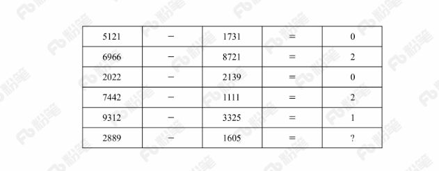
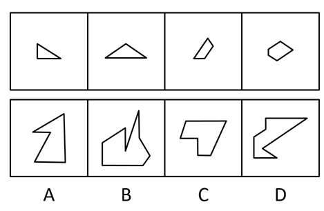
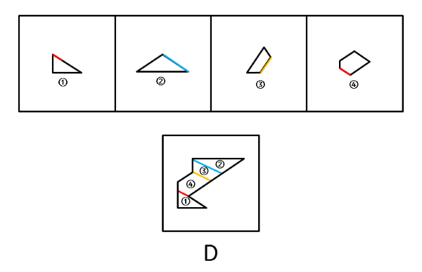
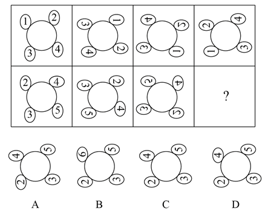
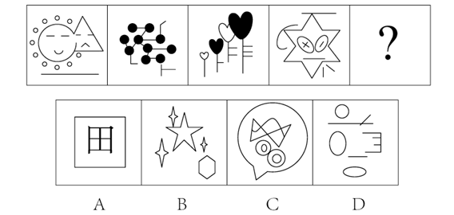
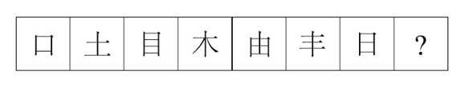
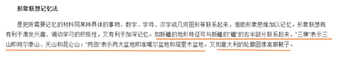

# 2018年云南省选调生录用考试《行测》试题（网友回忆版）

> 判断推理 · 35 题 · 选调 2018

## 第 1 题　qid 2187620 · 图形推理

从所给四个选项中，选择最适合的一个填入问号处，使之呈现一定的规律性：

 

- **A**. 1
- **B**. 2
- **C**. 3　✅
- **D**. 4

**答案**：C

**官方解析**

元素组成不同，且无明显属性规律，考虑数量规律。观察题干发现第一、三、五列都是由数字组成，第二、四列是由数学符号组成，并且数字有很多封闭空间，优先考虑数面。第一行中，“5121”和“1731”均是0个面，二者相减等于0。同理，第二至第五行均为前两个数字的面数量相减等于第三个数字，则最后一行应用此规律，“2889”是5个面，“1605”是2个面，相减等于3。
故正确答案为C。

---

## 第 2 题　qid 2187608 · 图形推理

下列选项中，可以由题干图形拼凑而成的是：

- **A**. A
- **B**. B
- **C**. C
- **D**. D　✅

**答案**：D

**官方解析**

本题考查平面拼合，注意本题图形可以旋转拼成（如果不发生旋转，无法得到任何一个选项中的图形，因此本题需要旋转拼合）。可采用平行等长相消的方式解题：消除平行等长的线段后进行组合即可得到轮廓图，即为D项，如下图所示：

故正确答案为D。

---

## 第 3 题　qid 2187614 · 图形推理

从所给四个选项中，选择最适合的一个填入问号处，使之呈现一定的规律性：

- **A**. 形　✅
- **B**. 94
- **C**. 田
- **D**. XY

**答案**：A

**官方解析**

元素组成不同，且无明显属性规律，考虑数量规律。观察发现，图3、图5出现简单汉字，优先考虑笔画数。题干六幅图的笔画数依次为1、2、3、4、5、6，因此？处应选择一个7笔画图形，A项7笔画，B项2笔画，C项5笔画，D项4笔画，只有A项符合。
故正确答案为A。

---

## 第 4 题　qid 2187563 · 图形推理

从所给四个选项中，选择最适合的一个填入问号处，使之呈现一定的规律性：

- **A**. A
- **B**. B
- **C**. C
- **D**. D　✅

**答案**：D

**官方解析**

元素组成相同，优先考虑位置规律。第一行图形中，图1沿顺时针旋转得到图2，图2经过上下翻转得到图3，图3经过左右翻转得到图4；将此规律应用到第二行图形，图1沿顺时针旋转得到图2，图2经过上下翻转得到图3，因此“？”处图形应由图3经过左右翻转得到。

故正确答案为D。

---

## 第 5 题　qid 2187570 · 图形推理

从所给四个选项中，选择最适合的一个填入问号处，使之呈现一定的规律性：

- **A**. A
- **B**. B
- **C**. C　✅
- **D**. D

**答案**：C

**官方解析**

解析一：元素组成不同，优先考虑属性规律。题干每幅图形都由直线和曲线构成，排除A项；继续观察，发现每幅图形都只有一条曲线，排除B项；对比C项和D项，发现C项图形直线数多于曲线数，D项直线数等于曲线数，观察题干图形都是直线数多于曲线数。
故正确答案为C。
解析二：元素组成不同，优先考虑属性规律。题干每幅图形都由直线和曲线构成，排除A项；继续观察题干图形发现图1有明显刻意构造的角，图2及图3均有角，故问号处选择有角的图形，排除B项、D项。
故正确答案为C。

---

## 第 6 题　qid 2187604 · 图形推理

从所给四个选项中，选择最适合的一个填入问号处，使之呈现一定的规律性：

- **A**. A
- **B**. B
- **C**. C
- **D**. D　✅

**答案**：D

**官方解析**

元素组成不同，且无明显属性规律，考虑数量规律。观察题干发现，图形出现了单一直线，优先考虑数直线。但直线数没有规律，观察发现横着的线条居多，考虑数横线数，图1至图4横线数均为6条，因此“？”处应选择一个横线数为6的图形。四个选项中，A项有5条横线，B项有2条横线，C项有0条横线，D项有6条横线。
故正确答案为D。

---

## 第 7 题　qid 2187599 · 图形推理

从所给四个选项中，选择最适合的一个填入问号处，使之呈现一定规律性：

- **A**. A
- **B**. B
- **C**. C
- **D**. D　✅

**答案**：D

**官方解析**

元素组成不同，优先考虑属性规律。观察题干发现，图1、3、5、7有封闭区域，优先考虑开闭性。图1、3、5、7有封闭区域，图2、4、6无封闭区域，则？处应选择无封闭区域，排除A、B。对比C、D，发现C是2部分图形，D是1部分图形，而题干均是1部分图形。
故正确答案为D。

---

## 第 8 题　qid 2187580 · 逻辑判断

比德，是指将自然物的某些特征比附于人们的某种道德情操，使自然物的自然属性人格化，人的道德品性客观化，其实质是认为自然美美在它所比附的道德伦理品格。
根据以上定义，下列没有包含“比德”自然审美观的是：

- **A**. 人们总是把风儿比作叹息，那么秋天一定是最多愁善感、小性恼人的姑娘，她不可琢磨，难以讨好　✅
- **B**. 画家郑板桥以“咬定青山不放松，立根原在破岩中。千磨万击还坚劲，任尔东南西北风”赞美岩竹的坚韧顽强，隐喻自己藐视俗见的刚劲风骨
- **C**. 作者在某小说中称赞生性淡泊、安分守己的少妇“宛如冬梅，风知素韵，霜晓寒姿”
- **D**. 知者达于事理而周流无滞，有似于水，故知者乐水；仁者安于义理而厚重不迁，有似于山，故仁者乐山

**答案**：A

**官方解析**

第一步：找出定义关键词。
“将自然物的某些特征比附于人们的某种道德情操”。
第二步：逐一分析选项。
A项：将秋天比作多愁善感、小性恼人的小姑娘，而多愁善感、小性恼人并不是道德情操，不符合“将自然物的某些特征比附于人们的某种道德情操”，不符合定义，当选；
B项：将岩竹的坚韧顽强比作郑板桥藐视俗见的刚劲风骨，符合“将自然物的某些特征比附于人们的某种道德情操”，符合定义，排除；
C项：将冬梅的风韵姿态比作生性淡薄、安分守己的少妇，符合“将自然物的某些特征比附于人们的某种道德情操”，符合定义，排除；
D项：将循环流转、永不停滞的水比作聪慧敏捷的智者，将永恒不变的大山比作宽厚仁德的仁者，符合“将自然物的某些特征比附于人们的某种道德情操”，符合定义，排除。
本题为选非题，故正确答案为A。

---

## 第 9 题　qid 2187589 · 定义判断

慎微，即重视并正确处理细小的事情；慎初，即把住第一次，守住第一关。
根据上述定义，下列最不能体现“慎微”这一原则的是：

- **A**. 妇女权益保护机构的工作人员劝诫人们：家庭暴力不是小事，而是犯罪，大家对此一定要零容忍　✅
- **B**. 小菲最近在积极瘦身，她毅力十足，高热量的食物一次都没吃，哪怕是一丁点儿
- **C**. 李大叔为一年后的马拉松赛而完成了人生的第一次长跑，他计划着每天都会比前一天多跑一些，这样子就能渐渐达到马拉松的里程
- **D**. 妈妈对小明的学习要求十分严格，如果儿子因为马虎大意犯了小错，也会立刻纠正他

**答案**：A

**官方解析**

第一步：找出定义关键词。
慎微：“重视并正确处理细小的事情”；
慎初：“把住第一次，守住第一关”。
第二步：逐一分析选项。
A项：劝诫人们要对家庭暴力零容忍，家庭暴力不是小事，即家庭暴力是大事要重视，不符合“重视并正确处理细小的事情”，不符合“慎微”定义，当选；
B项：减肥的小菲“一丁点的高热量食物”都没有吃，符合“重视并正确处理细小的事情”，符合“慎微”定义，排除；
C项：李大叔为了一年后的马拉松赛而完成了人生的第一次长跑，每天要比以前“多跑一些”，符合“重视并正确处理细小的事情”，符合“慎微”定义，排除；
D项：妈妈对小明要求严格，小明犯了“小错”也会立即纠正，符合“重视并正确处理细小的事情”，符合“慎微”定义，排除。
本题为选非题，故正确答案为A。

---

## 第 10 题　qid 2187597 · 定义判断

生物识别技术，即通过计算机与光学、声学、生物传感器和生物统计学原理等高科技手段密切结合，利用人体固有的生理特征（如指静脉、人脸、虹膜、指纹等）和行为特征（如笔迹、声音、步态等）来进行个人身份的鉴定。
根据上述定义，下列最可能运用了生物识别技术的是：

- **A**. 受害者在旁听了嫌疑人的数码电话录音后，确定了他就是当时的袭击者
- **B**. 警方在犯罪现场找到一张外卖送货小票，通过查询网上外卖订购系统信息，锁定了几个犯罪嫌疑人
- **C**. 某涉密场所设置了严格的门禁，人们只有在密码输入正确且在电阻屏上手写出具有进入权限的工作人员姓名后才能进入
- **D**. 某公司为考核员工出勤情况，引进了指纹打卡机，员工上班时必须输入指纹报到　✅

**答案**：D

**官方解析**

第一步：找出定义关键词。
“通过计算机与高科技手段密切结合”、“利用人体固有的生理特征（如指静脉、人脸、虹膜、指纹等）和行为特征（如笔迹、声音、步态等）”、“进行个人身份的鉴定”。
第二步：逐一分析选项。
A项：通过数码电话录音鉴定身份，不符合“通过计算机与高科技手段密切结合”，不符合定义，排除； 
B项：警方通过查询网上外卖订购系统信息，锁定嫌疑人，不符合“利用人体固有的生理特征和行为特征”，不符合定义，排除；
C项：通过输入密码和手写具有权限的人员姓名鉴定身份，不符合“利用人体固有的生理特征和行为特征”，不符合定义，排除；
D项：通过指纹打卡机鉴定身份，符合“通过计算机与高科技手段密切结合”、“利用人体固有的生理特征（指纹）”、“进行个人身份的鉴定”，符合定义，当选。
故正确答案为D。

---

## 第 11 题　qid 2187575 · 定义判断

健康教育是为促进人们自发地、自觉地接受并采取有益于健康的行为与生活方式，根除或者减少对健康有影响的危险因素，预防疾病并达到促进身心健康和提高生活质量的目标而开展的有组织、有计划的系统的社会教育活动。
根据上述定义，下列属于健康教育的是：

- **A**. 某公司在乡下举办健康知识讲座，并以此为机会向老人们推销保健品
- **B**. 某高校开设的一门“心理健康”选修课非常受同学们欢迎，甚至附近的市民都来蹭课
- **C**. 周日某医院组织医务人员在小区广场举行义诊活动，免费为居民提供测血压、量体温以及医疗咨询等服务
- **D**. 为防范入秋以来老年人心脑血管疾病高发的现象，社区每年9月份都会聘请知名专家针对老年居民举行系列讲座，普及相关医疗知识　✅

**答案**：D

**官方解析**

第一步：找出定义关键词。
“为促进人们自发地、自觉地接受并采取有益于健康的行为与生活方式”、“根除或者减少对健康有影响的危险因素”、“开展社会教育活动”。
第二步：逐一分析选项。
A项：某公司举办健康知识讲座是为了推销保健品，不符合“为促进人们自发地、自觉地接受并采取有益于健康的行为与生活方式”，不符合定义，排除；
B项：某高校开设的选修课，不符合“开展社会教育活动”，不符合定义，排除；
C项：某医院举行义诊活动，免费为居民提供服务，不符合“开展社会教育活动”，不符合定义，排除；
D项：为防范老年人心脑血管疾病高发的现象，符合“根除或者减少对健康有影响的危险因素”，社区举行讲座，普及医疗知识符合“为促进人们自发地、自觉地接受并采取有益于健康的行为与生活方式”以及“开展社会教育活动”，符合定义，当选。
故正确答案为D。

---

## 第 12 题　qid 2187587 · 定义判断

反客为主式营销，是指消费者基于对产品质量及企业文化价值的认同，借助网络工具，成为营销活动的主导者，主动发起营销活动或直接参与营销传播的一种新型的网络营销。
根据上述定义，下列属于反客为主式营销的是：

- **A**. 某商场新开业，发起朋友圈集“赞”赢奖品活动，利用微信用户的网络传播达到了一定的营销效果
- **B**. 小泉是某手机品牌的忠实粉丝，最近该品牌又开发了一款智能手机，他第一时间购买了该手机，并在网上向朋友们宣传该手机的超凡性能　✅
- **C**. 张阿姨根据网络电视广告购买了一款医疗保健品，使用后觉得效果好，她又把这款保健品介绍给了其他人
- **D**. 小丽兼职做微商卖化妆品，同事们为了照顾她的生意，纷纷帮她在网上转发销售广告

**答案**：B

**官方解析**

第一步：找出定义关键词。
“消费者基于对产品质量及企业文化价值的认同”、“借助网络工具，成为营销活动的主导者”、“主动发起营销活动或直接参与营销传播”。
第二步：逐一分析选项。
A项：商场发起朋友圈集“赞”赢奖品活动，消费者转发宣传是为了赢奖品，不符合“消费者基于对产品质量及企业文化价值的认同”，不符合定义，排除；
B项：小泉是某手机品牌的忠实粉丝，购买后宣传该手机的超凡性能，符合“消费者基于对产品质量及企业文化价值的认同”，第一时间购买并在网上向朋友宣传，符合“借助网络工具，成为营销活动的主导者”以及“主动发起营销活动或直接参与营销传播”，符合定义，当选；
C项：张阿姨把这款保健品介绍给了其他人，没有提到“借助网络工具”，不符合定义，排除；
D项：同事们为了照顾她的生意纷纷转发，不符合“消费者基于对产品质量及企业文化价值的认同”，不符合定义，排除。
故正确答案为B。

---

## 第 13 题　qid 2187594 · 定义判断

横向交往和纵向交往是组织内员工通过人际互动构建社会资本过程的两种工具性交往风格。横向交往是指个体通过与自身周围社会地位相似的群体建立广泛联系的过程；纵向交往是指个体能动地与社会中占据主导资源支配的群体建立关系的过程。
根据上述定义，下列属于纵向交往的是：

- **A**. 每到节假日，院长都会代表学院去慰问对学院作出巨大贡献的退休干部
- **B**. 老刘对自己家的保姆非常满意，为了让保姆过完春节后继续过来工作，他赠送了保姆探亲的往返机票
- **C**. 老张为了能够继续顺利地承包村里的鱼塘，主动和村民搞好关系，每年春节都给村民免费发放几条鱼
- **D**. 某家长为了让班级任课老师严格要求自己的孩子，节假日都会给老师们发去问候的短信　✅

**答案**：D

**官方解析**

第一步：找出定义关键词。
纵向交往：“个体能动地”、“与社会中占据主导资源支配的群体建立关系”；
横向交往：“个体通过与自身周围社会地位相似的群体建立广泛联系”。
第二步：逐一分析选项。
A项：院长慰问退休干部，退休干部不符合“社会中占据主导资源支配的群体”，不符合“纵向交往”定义，排除；
B项：老刘赠送保姆机票，保姆不符合“社会中占据主导资源支配的群体”，不符合“纵向交往”定义，排除；
C项：老张和村民搞好关系，村民不符合“社会中占据主导资源支配的群体”，不符合“纵向交往”定义，排除；
D项：为了让班级任课老师严格要求自己的孩子，说明老师在孩子教育上是“社会中占据主导资源支配的群体”，家长节假日都会给老师们发去问候的短信，符合“个体能动地与社会中占据主导资源支配的群体建立关系”，符合“纵向交往”定义，当选。
故正确答案为D。

---

## 第 14 题　qid 2187603 · 定义判断

形象联想记忆法是把所需要记忆的材料同某些具体的事物、数字、字母、汉字或几何图形等联系起来，借助形象思维加以记忆。形象联想既有利于激发兴趣，调动学习的积极性，又有利于加深记忆。
根据上述定义，下列没有运用形象联想记忆法的是：

- **A**. 新疆的地形特征“三山夹两盆”可与“疆”的右半部分联系起来：“三横”表示三山，“两田”表示两大盆地
- **B**. 号称“时尚女鞋之国”的意大利，它的轮廓就像一只高跟靴子
- **C**. 海参，长得就像黄瓜（cucumber），又长在海里（sea），所以它叫“sea cucumber”
- **D**. 篮球界的迈克尔·乔丹、音乐界的迈克尔·杰克逊、赛车界的迈克尔·舒马赫······记住，这些牛人都叫“迈克尔”　✅

**答案**：D

**官方解析**

第一步：找出定义关键词。

“需要记忆的材料同具体的事物、数字、字母、汉字或几何图形等联系起来”、“借助形象思维加以记忆”。

第二步：逐一分析选项。

A项：新疆的地形特征“三山夹两盆”是需要记忆的材料，与“疆”的右半部分联系起来记忆，符合“同具体的汉字联系起来”、“借助形象思维加以记忆”，符合定义，排除；

B项：意大利为“时尚女鞋之国”是需要记忆的材料，轮廓像“高跟鞋”，符合“同具体的几何图形联系起来”、“借助形象思维加以记忆”，符合定义，排除；

C项：“海参”的英文表述（sea cucumber）是需要记忆的材料，长得像黄瓜（cucumber），符合“同具体的事物联系起来”、“借助形象思维加以记忆”，符合定义，排除；

D项：篮球界、音乐界、赛车界······的这些牛人都叫“迈克尔”是需要记忆的材料，但没有体现“同具体的事物、数字、字母、汉字或几何图形等联系起来”，不符合定义，当选。

本题为选非题，故正确答案为D。

---

## 第 15 题　qid 2187609 · 定义判断

甜柠檬效应就是个体在追求预期目标失败时，为了冲淡自己内心的不安，就百般提高现已实现的目标的价值，从而达到心理平衡的现象。
根据上述定义，下列属于“甜柠檬效应”的是：

- **A**. 小明本来想买一台笔记本电脑，结果却在导购员的劝说下购买了平板电脑，使用后他很满意，并一直向朋友推荐
- **B**. 这几周，小红为自己的销售业绩不断下滑而苦恼；但当她知道自己仍是公司的销售状元时，变得放心多了
- **C**. 小文的数学成绩又让他的辅导老师失望了，老师最后只能用“比起上一次，还是有进步”来安慰自己　✅
- **D**. 据教练估计，小张需要减肥到60千克才能达到他想要的健身效果，可是小张在减到63千克时就放弃了，因为他觉得自己足够健美了

**答案**：C

**官方解析**

第一步：找出定义关键词。

“个体追求预期目标失败”、“为了冲淡自己内心的不安”、“百般提高现已实现的目标的价值”、“达到心理平衡”。

第二步：逐一分析选项。

A项：小明本来想买电脑最后买了平板电脑，没有实现预期目标，但是使用后很满意，不符合“为了冲淡自己内心的不安”、“百般提高现已实现的目标的价值”，不符合定义，排除；

B项：小红为销售业绩下滑而苦恼符合“个人追求预期目标失败”，但小红为销售状元是客观事实，不符合“为了冲淡自己内心的不安”、“百般提高现已实现的目标的价值”，不符合定义，排除；

C项：小文数学成绩让辅导老师失望，老师对小文的成绩的心理预期没有达到，符合“个体追求预期目标失败”，老师最后只能安慰自己小文比上一次进步了，符合“百般提高现已实现的目标的价值”，符合定义，当选；

D项：减肥到60千克才能达到效果是教练提出的目标，小张在63千克时放弃了，是小张自己主动放弃了，并不符合追求个人目标失败，不符合定义，排除。

故正确答案为C。

---

## 第 16 题　qid 2187576 · 类比推理

蜘蛛∶织网∶爬行

- **A**. 蚕∶破蛹∶吐丝
- **B**. 蜜蜂∶酿蜜∶飞行　✅
- **C**. 夜莺∶筑巢∶歌唱
- **D**. 猎豹∶奔跑∶捕食

**答案**：B

**官方解析**

第一步：判断题干词语间逻辑关系。
“蜘蛛”“织网”为主谓宾结构，“蜘蛛”“爬行”为主谓结构。
第二步：判断选项词语间逻辑关系。
A项：“蚕”“破蛹”为主谓宾结构，“蚕”“吐丝”也为主谓宾结构，与题干逻辑关系不一致，排除；
B项：“蜜蜂”“酿蜜”为主谓宾结构，“蜜蜂”“飞行”为主谓结构，与题干逻辑关系一致，当选；
C项：“夜莺”“筑巢”为主谓宾结构，“夜莺”“歌唱”为主谓结构，但“歌唱”是一种拟人化的表述，并非“夜莺”的生物学行为，与题干逻辑关系不一致，排除；
D项：“猎豹”“奔跑”为主谓结构，与题干逻辑关系不一致，排除。
故正确答案为B。

---

## 第 17 题　qid 2187590 · 类比推理

秤∶重量

- **A**. 水∶浮力
- **B**. 地图∶距离
- **C**. 台灯∶光亮
- **D**. 尺子∶长度　✅

**答案**：D

**官方解析**

第一步：判断题干词语间逻辑关系。
秤是用来测量重量的，二者是测量工具和测量对象的对应关系。
第二步：判断选项词语间逻辑关系。
A项：水可以产生浮力，并不是测量浮力的工具，与题干逻辑关系不一致，排除；
B项：地图可以显示距离，并不是测量距离的工具，与题干逻辑关系不一致，排除；
C项：台灯可以发出光，带来光亮，二者为功能对应关系，与题干逻辑关系不一致，排除；
D项：尺子是测量工具，是用来测量长度的，二者是测量工具和测量对象的对应关系，与题干逻辑关系一致，当选。
故正确答案为D。

---

## 第 18 题　qid 2187595 · 类比推理

勤奋∶学习∶进步

- **A**. 艰苦∶创业∶失败
- **B**. 努力∶工作∶成功　✅
- **C**. 喝酒∶驾车∶车祸
- **D**. 鲁莽∶说话∶厌恶

**答案**：B

**官方解析**

第一步：判断题干词语间逻辑关系。
勤奋的学习可能会带来进步，勤奋用来修饰学习，进步是积极的结果。
第二步：判断选项词语间逻辑关系。
A项：艰苦的创业可能会带来失败，艰苦用来修饰创业，但是失败是消极的结果，与题干逻辑关系不一致，排除；
B项：努力工作可能会带来成功，努力用来修饰工作，成功是积极的结果，与题干逻辑关系一致，当选；
C项：喝酒后驾车可能会带来车祸，喝酒和驾车是两个不同的动作，喝酒不能用来修饰驾车，与题干逻辑关系不一致，排除；
D项：鲁莽的说话可能会让人厌恶，鲁莽用来修饰说话，厌恶是消极的结果，与题干逻辑关系不一致，排除。
故正确答案为B。

---

## 第 19 题　qid 2187596 · 类比推理

左顾右盼∶上下打量

- **A**. 南来北往∶东西奔走　✅
- **B**. 纵横交错∶中西合璧
- **C**. 千叮万嘱∶一心一意
- **D**. 天高地厚∶山清水秀

**答案**：A

**官方解析**

第一步：判断题干词语间逻辑关系。
左顾右盼指左右来回看；上下打量指上下看，二者都有看的意思，是近义关系，并且左顾右盼中的“左右”是反义关系，上下打量中的“上下”是反义关系。
第二步：判断选项词语间逻辑关系。
A项：南来北往指南北方向来回奔走；东西奔走指东西方向来回奔走，二者都有到处奔走的意思，是近义关系，并且南来北往中的“南北”是反义关系，东西奔走中的“东西”是反义关系，与题干逻辑关系一致，当选；
B项：纵横交错指横的竖的交叉在一起；中西合璧指中国和外国的好东西和建筑、名胜合到一块，二者不是近义关系，与题干逻辑关系不一致，排除；
C项：千叮万嘱指再三叮嘱；一心一意指做事专心，一门心思只做一件事，二者不是近义关系，与题干逻辑关系不一致，排除；
D项：天高地厚指恩情深厚，也指事物的复杂、深奥程度；山清水秀指山水风景优美，二者不是近义关系，与题干逻辑关系不一致，排除。
故正确答案为A。

---

## 第 20 题　qid 2187578 · 类比推理

拖鞋∶皮鞋∶场合

- **A**. 药物∶手术∶病情　✅
- **B**. 川菜∶凉菜∶味道
- **C**. 跑步∶踢球∶体力
- **D**. 茶水∶咖啡∶爱好

**答案**：A

**官方解析**

第一步：判断题干词语间逻辑关系。
拖鞋和皮鞋都是鞋子的一种，二者是并列关系，且不同的场合选择的鞋子不同。
第二步：判断选项词语间逻辑关系。
A项：药物和手术都是治疗方式的一种，二者是并列关系，且不同的病情选择的治疗方式不同，与题干逻辑关系一致，保留；
B项：川菜和凉菜是交叉关系，且无法按照不同的味道选择，与题干逻辑关系不一致，排除；
C项：跑步和踢球都是运动方式的一种，二者是并列关系，但无法按照不同的体力来选择，与题干逻辑关系不一致，排除；
D项：茶水和咖啡都是饮品的一种，二者是并列关系，根据不同的爱好可以选择喝茶水和喝咖啡，与题干逻辑关系一致，保留。
对比A项和D项，场合和病情是客观的，而爱好是主观的，故A项与题干逻辑关系更近。
故正确答案为A。
注：拖鞋和皮鞋也可以看作交叉关系，与B项中川菜和凉菜的逻辑关系相同，但B项无法按照不同的味道选择川菜和凉菜，与题干逻辑关系不一致，所以不能选B项。

---

## 第 21 题　qid 2187582 · 类比推理

品质∶好坏∶质量

- **A**. 食物∶大小∶重量
- **B**. 分数∶高低∶成绩　✅
- **C**. 旅游∶远近∶兴趣
- **D**. 人口∶多少∶密度

**答案**：B

**官方解析**

第一步：判断题干词语间逻辑关系。
品质和质量是近义关系，且品质和质量都有好坏之分，为对应关系。
第二步：判断选项词语间逻辑关系。
A项：食物是有重量的，二者不是近义关系，与题干逻辑关系不一致，排除；
B项：分数和成绩是近义关系，且成绩和分数都有高低之分，为对应关系，与题干逻辑关系一致，当选；
C项： 旅游和兴趣不是近义关系，与题干逻辑关系不一致，排除；
D项：人口和密度不是近义关系，与题干逻辑关系不一致，排除。
故正确答案为B。

---

## 第 22 题　qid 2187586 · 类比推理

网购∶上网

- **A**. 读书∶书本
- **B**. 喝水∶烧水
- **C**. 练字∶写字　✅
- **D**. 唱歌∶歌唱

**答案**：C

**官方解析**

第一步：判断题干词语间逻辑关系。
网购必须要上网，上网是网购的必要条件。
第二步：判断选项词语间逻辑关系。
A项：书本是指装订成册的著作，不是读书的必要条件，比如可以看电子书，与题干逻辑关系不一致，排除；
B项：烧水不是喝水的必要条件，与题干逻辑关系不一致，排除；　　
C项：练字必须要写字，写字是练字的必要条件，与题干逻辑关系一致，当选；
D项：唱歌和歌唱是近义关系，与题干逻辑关系不一致，排除。
故正确答案为C。

---

## 第 23 题　qid 2187585 · 类比推理

碗∶水杯

- **A**. 玻璃∶书包
- **B**. 光∶蜡烛
- **C**. 沙发∶床　✅
- **D**. 电脑∶娱乐

**答案**：C

**官方解析**

第一步：判断题干词语间逻辑关系。
碗和水杯都是用来盛放东西的器具，二者为并列关系。
第二步：判断选项词语间逻辑关系。
A项：玻璃和书包没有必然的逻辑关系，与题干逻辑关系不一致，排除；
B项：蜡烛可以发出光，二者为功能对应关系，与题干逻辑关系不一致，排除；
C项：沙发和床都是可以供人休息的家具，二者为并列关系，与题干逻辑关系一致，当选；
D项：电脑可以用来娱乐，二者为功能对应关系，与题干逻辑关系不一致，排除。
故正确答案为C。

---

## 第 24 题　qid 2187573 · 逻辑判断

少壮不努力，老大徒伤悲∶惜时∶奋斗

- **A**. 假作真时真亦假，无为有处有还无∶清醒∶智慧
- **B**. 天生我材必有用，千金散尽还复来∶自信∶豁达　✅
- **C**. 苔花如米小，也学牡丹开∶自我∶认真
- **D**. 它山之石，可以攻玉∶谦虚∶谨慎

**答案**：B

**官方解析**

第一步：判断题干词语间逻辑关系。
少壮不努力，老大徒伤悲，是指年轻力壮的时候不奋发图强，到了老年，悲伤也没用了。这句诗表达了要惜时、奋斗的思想，诗句和后两个词是对应关系。
第二步：判断选项词语间逻辑关系。
A项：假作真时真亦假，无为有处有还无，是指把假的当成真的，时间久了假的就被认为是真的，而真的被认为是假的，把不存在的东西说成是存在的东西时，那捏造的事实甚至比存在的事实更显得真实，反过来也是如此。这句诗说的是真实和虚假之间的关系，并没有表达出清醒、智慧的思想，与题干逻辑关系不一致，排除；
B项：天生我材必有用，千金散尽还复来，是指上天生下我，一定有需要用到我的地方，金钱用尽了，这些散失去的东西以后依然会归来。这句诗表达了要自信、豁达的思想，诗句和后两个词是对应关系，与题干逻辑关系一致，当选；
C项：苔花如米小，也学牡丹开，是指哪怕那如米粒一般微小的苔花，丝毫也不自惭形秽，依然像那美丽高贵的牡丹一样，自豪地盛开。这句诗表达的意思是自强、顽强，并没有表达出自我、认真的思想，与题干逻辑关系不一致，排除；
D项：它山之石，可以攻玉，是指别的山上的石头，可以琢磨玉器。这句诗比喻能帮助自己改正缺点的人或意见，可以表达出谦虚的思想，但是和谨慎没有关系，与题干逻辑关系不一致，排除。
故正确答案为B。

---

## 第 25 题　qid 2187591 · 类比推理

势均∶力敌

- **A**. 旗鼓∶相当
- **B**. 并驾∶齐驱　✅
- **C**. 不相∶上下
- **D**. 平分∶秋色

**答案**：B

**官方解析**

第一步：判断题干词语间逻辑关系。
“势均”指势力均等，“力敌”指力量相当，二者是近义关系。
第二步：判断选项词语间逻辑关系。
A项：“旗鼓”指古代作战以摇旗击鼓指挥进退，“相当”指差不多，不相上下，二者不是近义关系，与题干逻辑关系不一致，排除；
B项：“并驾”指几匹马并排拉着一辆车，“齐驱”指一齐快跑，二者是近义关系，与题干逻辑关系一致，当选；　　
C项：“不相”指分不出，“上下”指高低好坏，二者不是近义关系，与题干逻辑关系不一致，排除；
D项：“平分”指平均分一半，“秋色”指秋天景色，二者不是近义关系，与题干逻辑关系不一致，排除。
故正确答案为B。

---

## 第 26 题　qid 2187636 · 逻辑判断

甘肃境内大地湾彩陶的发现解决了中国彩陶艺术的起源地问题。20世纪初，为了探索华夏文明的源头，学术界从考古、文献两个角度作出尝试和努力。1923年，为了寻找彩陶的起源，瑞典地质学家安特生来到甘肃，随着甘肃马家窑彩陶的不断出土，安特生认为，甘肃彩陶受西欧、西亚彩陶的影响比较明显。但是，之后大地湾一期出土的彩陶在年代上明显要早于马家窑彩陶，与目前发现的最早含有彩陶文化的西亚两河流域的耶莫有陶文化、哈孙纳文化的年代大致相当。
据此，我们可以推出：

- **A**. 华夏文明受西欧、西亚文化影响明显
- **B**. 甘肃是世界最早产生彩陶的区域之一　✅
- **C**. 大地湾彩陶文化是最早的彩陶文化
- **D**. 甘肃地区是华夏文明的起源地

**答案**：B

**官方解析**

日常结论题，根据题干信息逐一分析选项。
A项：题干中指出，甘肃彩陶受西欧、西亚彩陶的影响比较明显，不能代表整个华夏文明受西欧、西亚文化影响明显，无法推出，排除；
B项：题干最后一句指出，大地湾彩陶与目前发现的最早含有彩陶文化的西亚两河流域的耶莫有陶文化、哈孙纳文化的年份大致相当，可以推出甘肃是世界最早产生彩陶的区域之一，当选；
C项：题干最后一句指出，大地湾彩陶与目前发现的最早含有彩陶文化的西亚两河流域的耶莫有陶文化、哈孙纳文化的年份大致相当，不代表大地湾彩陶文化是最早的彩陶文化，无法推出，排除；
D项：题干第一句指出，甘肃境内大地湾是中国彩陶艺术的起源地，选项中甘肃地区是华夏文明的起源地，彩陶艺术起源地不能代表整个华夏文明的起源地，无法推出，排除。
故正确答案为B。

---

## 第 27 题　qid 2188097 · 类比推理

某行政部门需选派人员参加对口扶贫工作。对此，书记、局长和副局长有如下要求：
书记：如果不选派李科长参加对口扶贫，那么就选派马科长参加对口扶贫；
局长：如果不选派马科长参加对口扶贫，那么也不选派李科长参加对口扶贫；
副局长：要么选派马科长参加对口扶贫，要么选派李科长参加对口扶贫。
下面各项中，同时符合书记、局长和副局长三者要求的是：

- **A**. 马科长参加对口扶贫　✅
- **B**. 李科长参加对口扶贫
- **C**. 马科长、李科长都参加对口扶贫
- **D**. 马科长、李科长都不参加对口扶贫

**答案**：A

**官方解析**

第一步：翻译题干。 ①书记：李科长马科长 ②局长：马科长李科长 ③副局长：要么马科长，要么李科长 将②逆否可以推出④：李科长马科长 第二步：逐一分析选项。 根据①和④，无论李科长是否参加，马科长都会参加，再根据③可知，马科长和李科长只有一个参加，那么李科长不参加，A项可以推出。 故正确答案为A。

---

## 第 28 题　qid 2187619 · 类比推理

行驶超过60万千米的汽车都应当报废处理；有些行驶超过60万千米的汽车存在设计缺陷；在应当报废的汽车中有些不是T品牌汽车；所有T品牌汽车都不存在设计缺陷。
如果以上判断正确，则必定成立的是：

- **A**. 有些T品牌汽车应当报废
- **B**. 有些T品牌汽车不应当报废
- **C**. 应当报废的汽车都行驶超过60万千米
- **D**. 有些存在设计缺陷的汽车应当报废　✅

**答案**：D

**官方解析**

第一步：翻译题干。

①超60万千米报废；

②有些超60万千米设计缺陷；

③有些报废T品牌；

④T品牌设计缺陷；

将②换位可得：有些设计缺陷超60万千米，和①可以递推出：⑤有些设计缺陷超60万千米报废。

第二步：逐一分析选项。

A项：翻译为有些T品牌报废，由③“有些报废T品牌汽车”，推不出，排除；

B项：翻译为有些T品牌报废，由③“有些报废T品牌”无法得到“有些T品牌”的情况，推不出，排除；

C项：翻译为报废超60万千米，是对①的肯后，但肯后得不到确定性的结论，推不出，排除；

D项：翻译为有些设计缺陷报废，是对⑤的肯前，肯前必肯后，可以推出，当选。

故正确答案为D。

---

## 第 29 题　qid 2187611 · 逻辑判断

随着新媒体技术的发展，患者在网上寻找医生信息的情况日益增多，为此有科研人员对美国28个典型医生评价商业网站展开研究。研究报告称，近的人在接受调查访问时表示，在选择医生时，网上评价对他们的选择非常重要。但对这28个网站的研究显示，允许用户根据“临床状况、医生性别、所说语言、所接受的保险”等条件搜寻的网站很少。研究人员得出结论说，对这些商业性医生评价网站而言，要找到相对准确的医生定量评价颇为困难。

以下各项如果为真，最能支持上述论证的是：

- **A**. 病人通过医生评价网站能清楚了解某位医生的治疗经验
- **B**. 美国医生评价网站存在搜索机制繁冗且评价稀缺等问题　✅
- **C**. 通过调查系统性地收集数据，才更有可能积累足够的评价
- **D**. 调查发现有三分之一的抽样医生在所有网站中都没有评价

**答案**：B

**官方解析**

第一步：找出论点和论据。
论点：对这些商业性医生评价网站而言，要找到相对准确的医生定量评价颇为困难。
论据：对这28个网站的研究显示，允许用户根据“临床状况、医生性别、所说语言、所接受的保险”等条件搜寻的网站很少。
论点和论据都在说在这些网站上，较难找到相对准确的医生定量评价，二者话题一致，加强优先考虑补充论据。
第二步：逐一分析选项。
A项：病人通过医生评价网站能清楚了解某位医生的治疗经验，与论点找到医生定量评价的难易程度无关，无法加强，排除；
B项：美国医生评价网站存在搜索机制繁冗且评价稀缺等问题，解释了在这些网站上，较难找到相对准确的医生定量评价的原因，解释原因，可以加强，保留；
C项：通过调查系统性地收集数据，才更有可能积累足够的评价，不明确在这些网站上，是否较难找到相对准确的医生定量评价，无法加强，排除；
D项：调查发现有三分之一的抽样医生在所有网站中都没有评价，举例说明在这些网站上，较难找到相对准确的医生定量评价，举例加强，可以加强，保留。
对比B、D两项，B项为解释原因，D项为举例加强，解释原因的力度强于举例加强，故B项更为合适。
故正确答案为B。

---

## 第 30 题　qid 2187616 · 逻辑判断

微生物组在地球生态系统和人类健康中的作用超乎想象，它不仅将极大地帮助人类克服当今所面临的生存挑战，还能提供人类未来生存之道，这其中有一个道理，就是微生物之间能够互相协作，使得它们在生态系统中更加稳定、更加有效地发挥作用，并赋予微生物组具有超越单个微生物的更为强大的功能。
以下各项如果为真，最能支持上述观点的是：

- **A**. 美国的“国家微生物组计划”正是为了在所有的生态系统、大自然及人造世界里推动最前沿的微生物科学研究
- **B**. 作为新兴产业的生物农药和生物肥料，近年来在蓬勃发展，其在国际上的市场份额也逐年快速递增
- **C**. 将多种微生物一起培养，其生物系统的稳定性和适应能力都大为提高，其对某些有害化合物的降解效率也提升了　✅
- **D**. 酿酒微生物场所提供了多种多样的微生物资源，可以从中发掘高效纤维素降解霉菌、高乙醇合成酵母等

**答案**：C

**官方解析**

第一步：找出论点和论据。
论点：微生物组在地球生态系统和人类健康中的作用超乎想象。
论据：微生物组不仅将极大地帮助人类克服当今所面临的生存挑战，还能提供人类未来生存之道；微生物之间能够互相协作，使得它们在生态系统中更加稳定、更加有效地发挥作用，并赋予微生物组具有超越单个微生物的更为强大的功能。
第二步：逐一分析选项。
A项：论点说的是微生物组对地球生态系统和人类健康的作用，该项说的是美国“国家微生物组计划”的研究内容，话题不一致，无法加强，排除；
B项：论点说的是微生物组对地球生态系统和人类健康的作用，该项说的是生物农药和生物肥料的市场份额，话题不一致，无法加强，排除；
C项：多种微生物一起培养，微生物系统的稳定性和适应能力提高，对有害化合物的降解效率也会提高，指出微生物之间相互协作确实可以发挥更为强大的功能，补充论据，可以加强，当选；
D项：论点说的是微生物组对地球生态系统和人类健康的作用，该项说的是酿酒的微生物可以合成酵母，并没有涉及多种微生物是否合作，是否有更强大的功能的问题，话题不一致，无法加强，排除。
故正确答案为C。

---

## 第 31 题　qid 2187639 · 逻辑判断

美国斯坦福大学的研究人员对130名同时患有血脂异常、高血压（并未服用降压药）的患者进行了长达12年的试验。在试验中，研究人员将这130名研究对象随机分成人数相等的两组，并让其中的一组研究对象服用松树皮提取物（每天服用的剂量为200毫克），另一组研究对象服用安慰剂。在这12年中，研究人员每6周测量1次研究对象的血压、血糖、胆固醇及C反应蛋白的水平。试验结果显示，服用松树皮提取物人员的上述各项指标与服用安慰剂人员的上述各项指标并无明显的差别。由此可知，松树皮提取物无降血压、降血糖、降血脂以及预防心血管疾病等功效。
以下各项如果为真，最能反驳上述结论的是：

- **A**. 两组试验患者仅人数相等，其血压和血脂等的原始指标差异较大　✅
- **B**. 对照组服用安慰剂，对高血压和高血脂患者有心理暗示作用
- **C**. 12年的实验时间太长，这有可能使一些重要的实验数据失真
- **D**. 参加实验的患者人数仅130人，样本太小，代表性不够

**答案**：A

**官方解析**

第一步：找出论点和论据。
论点：松树皮提取物无降血压、降血糖、降血脂以及预防心血管疾病等功效。
论据：试验结果显示，服用松树皮提取物人员的上述各项指标与服用安慰剂人员的上述各项指标并无明显的差别。
论点论据都在说松树皮提取物无降压、降糖、降脂以及预防心血管疾病等功效，二者话题一致，削弱优先考虑削弱论点，其次考虑削弱论据。
第二步：逐一分析选项。
A项：此选项说明两组试验患者除了分别服用松树皮提取物和安慰剂外，其血压和血脂等的原始指标还差异较大，说明实验前起点不一致，能削弱，保留；
B项：此选项说明对照组服用安慰剂后有一定的心理暗示作用，但是心理暗示会降低还是升高他们的各项指标不确定，属于不明确选项，无法削弱，排除；
C项：此选项说明实验数据存在失真的可能，为可能性削弱，保留；
D项：此选项说明样本太小，代表性不够，有一定的削弱力度，保留。
对于A、C、D项，C项为可能性削弱，D项只是样本量不够，不具有代表性；但是A项直接说明题干实验本身就是有问题的，削弱力度更强，择优选A。
故正确答案为A。

---

## 第 32 题　qid 2187621 · 逻辑判断

2017年，可以说是我国电影发展的重要一年。然而，一些电影从业者则认为：中国是电影大国，但不是电影强国。
以下各项如果为真，最不能质疑这些电影从业者观点的是：

- **A**. 我国电影年产量达到近800部，位居世界前列；而全年500多亿元的总票房更是稳居全球第一
- **B**. 我国的银幕总量、观众人次已经超过电影界长期的领头羊——北美市场，并且，观众的电影需求依旧旺盛，我国电影市场的潜力还有待挖掘
- **C**. 判断一个国家是否是电影强国的最主要依据是其电影的全球竞争力，而国产电影的市场主要在大陆，和美国等传统电影强国差距较大，国际票房甚至低于印度　✅
- **D**. 中国电影业受近代中国曲折坎坷的命运的决定性影响，它发展多舛，但自2002年起，我国电影以奇迹般的发展速度迅速崛起，并预计将在未来10年内超越电影头号强国美国

**答案**：C

**官方解析**

第一步：找出论点和论据。
论点：中国是电影大国，但不是电影强国。
论据：无。
第二步：逐一分析选项。
A项：我国电影年产量位居世界前列，总票房稳居世界第一，指出中国在电影上取得了多项成就，说明中国属于电影强国，否定了论点，排除；
B项：我国的银幕总量、观众人次已经超过行业领头羊，说明中国在电影上取得了多项成就，属于电影强国，并且观众的需求依旧旺盛，市场的潜力还有待挖掘，说明未来还有很大的发展空间，否定了论点，排除；
C项：判断一个国家是否是电影强国的最主要依据是其全球竞争力，而国产电影和传统电影强国差距较大，国际票房较低，说明中国现在的全球竞争力并不强，不属于电影强国，加强了论点，当选；
D项：我国电影以奇迹般的速度崛起，说明我国电影发展速度很快，并且我国电影预计将在未来十年内超越电影头号强国美国，说明我国电影现在已位于电影强国之列，只不过还不是头号强国，有一定的削弱力度，排除。
本题为选非题，故正确答案为C。

---

## 第 33 题　qid 2187623 · 逻辑判断

最近有一位科学家提出新观点：地球板块运动开始的时间不会晚于35亿年前。他的依据是：板块运动必然会让自然界深色的镁铁质岩石转变成浅色的长英质岩石。而在35亿年前，地球已经有浅色的长英质岩石出现了。
以下各项如果为真，最能质疑这位专家观点的是：

- **A**. 颜色浅的长英质岩石本质上是颜色深的镁铁质岩石“再生”而来的，而在数十亿年前，镁铁质岩石在地球上占有绝对的数量优势地位
- **B**. 以全球各地35亿年前的沉积层样品分析，其中含有长英质岩石颗粒的不足一半
- **C**. 长英质岩石在自然界中的占比比镁铁质岩石高出很多似乎只有板块运动这一解释，但早期的板块构造运动很可能是时断时续的，局部范围的
- **D**. 35亿年前地球火山密布，火山爆发释放的岩浆会把镁铁质岩石深深埋在地下，这些镁铁质岩石会被熔化，进而转变成长英质岩石，但板块运动不是火山爆发的唯一原因　✅

**答案**：D

**官方解析**

第一步：找出论点和论据。
论点：地球板块运动开始的时间不会晚于35亿年前。
论据：板块运动必然会让自然界深色的镁铁质岩石转变成浅色的长英质岩石，而在35亿年前，地球已经有浅色的长英质岩石出现了。
第二步：逐一分析选项。
A项：题干说的是能不能通过浅色的长英质岩石出现来判断地球板块运动开始的时间，该项说的是镁铁质岩石数量的多少，话题不一致，而且数十亿年时间也不够明确，无法削弱，排除；
B项：题干说的是能不能通过浅色的长英质岩石出现来判断地球板块运动开始的时间，该项说的是长英质岩石的颗粒在沉积层的占比多少，话题不一致，无法削弱，排除；
C项：“似乎”和“可能”说明不能确定是板块运动导致镁铁质岩石转变成长英质岩石，还是板块运动直接导致长英质岩石的占比高，而且并没有提到时间，属于不明确项，无法削弱，排除；
D项：火山爆发会把镁铁质岩石转化成长英质岩石，但板块运动不是火山爆发的唯一原因，指出镁铁质岩石转变成长英质岩石并不一定与板块运动有关，拆断了论据与论点之间的联系，是拆桥项，当选。
故正确答案为D。

---

## 第 34 题　qid 2187640 · 逻辑判断

现在有一种观点认为：随着信用卡的普及以及近年来移动支付的发展，硬币将不可避免地迅速淡出流通市场。
以下各项如果为真，最能反驳上述观点的是：

- **A**. 各国的硬币都是用本土的历史、文化及风俗等特色符号铸刻的微型浮雕，其本身具有很高的收藏价值
- **B**. 在银行储蓄卡开始兴起时，人们对硬币的命运也有过相同的预测，但硬币根本没有因此淡出流通市场
- **C**. 硬币本身的面值不高，但是正是这种“不值钱”的特性，让它在零售等方面发挥着重要的流通作用
- **D**. 目前，一些在生活中扮演重要角色的自动贩售机等设备仍然只支持硬币支付，并且近几年这些设备不会更新换代　✅

**答案**：D

**官方解析**

第一步：找出论点和论据。
论点：随着信用卡的普及以及近年来移动支付的发展，硬币将不可避免地迅速淡出流通市场。
论据：无。
第二步：逐一分析选项。
A项：论点讨论的是硬币将迅速淡出流通市场，该项讨论的是硬币在收藏方面有价值，话题不一致，无关选项，无法削弱，排除；
B项：论点讨论的是信用卡及移动支付普及时，硬币将迅速淡出流通市场，该项讨论的是银行储蓄卡兴起时，硬币没有淡出流通市场，类比削弱，保留；
C项：论点讨论的是硬币将迅速淡出流通市场，该项讨论的是硬币具有“不值钱”的特性在零售中有重要的流通作用，但是否能被替代，最终是否会淡出流通市场并不清楚，属于不明确选项，无法削弱，排除；
D项：论点讨论的是硬币将迅速淡出流通市场，该项讨论的是生活中重要的设备仍然只支持硬币，且近几年这些设备不会更新换代，因此硬币是不能被迅速替代的，削弱论点，保留；
对比B、D项，B项类比削弱，力度最弱，D项削弱论点，力度最强，择优选D。
故正确答案为D。

---

## 第 35 题　qid 2187637 · 逻辑判断

南极可以、应该，甚至是必须被视为“准全球公域”。通常认为，全球公域是指处于国家管辖范围以外的区域及其资源。它属于全人类共有，人人都可以使用。《南极条约》对南极领土主权问题的搁置奠定了南极作为“准全球公域”的法律基础，而“开放”“和平”“科研自由”等规定，实际上赋予了南极公域的性质。“南极应只用于和平目的”这一规定，使得南极地区成为冷战期间一块难得的净土：避免遭受战争摧残，而且成功实现了无核化。
以下各项如果为真，最能支持上述论点的是：

- **A**. 南极大陆蕴藏着丰富的生物资源、水资源，市场潜能巨大
- **B**. 南极治理的主导权长期掌握在少数科技发达的西方国家手中
- **C**. 美国组建了南极支援特遣队，常驻新西兰负责空军的南极飞行行动
- **D**. 若南极冰盖消融，海平面将上升57米，这直接关系到人类的共同命运　✅

**答案**：D

**官方解析**

第一步：找出论点和论据。
论点：南极可以、应该，甚至是必须被视为“准全球公域”。
论据：“南极应只用于和平目的”这一规定，使得南极地区成为冷战期间一块难得的净土：避免遭受战争摧残，而且成功实现了无核化。
论点和论据讨论的均为南极是“准全球公域”，二者话题一致，加强优先考虑补充论据。
第二步：逐一分析选项。
A项：论点说的是南极应该被视为“准全球公域”，该项说的是南极大陆蕴藏着丰富的资源，话题不一致，无关选项，无法加强，排除；
B项：南极治理的主导权长期掌握在少数发达的西方国家手中，说明南极不是“准全球公域”，无法加强，排除；
C项：论点说的是南极应该被视为“准全球公域”，该项说的是美国组建了南极支援特遣队，话题不一致，无关选项，无法加强，排除；
D项：因为南极冰盖消融直接关系到人类的共同命运，所以应该是全人类共有，被视为“准全球公域”，补充论据加强，当选。
故正确答案为D。

---
