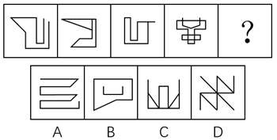
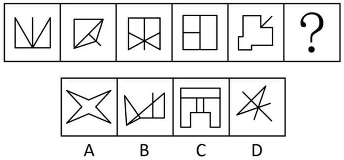
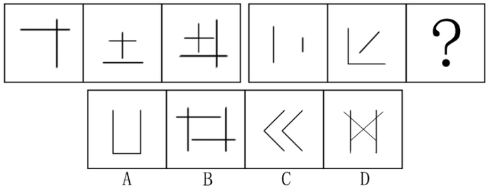
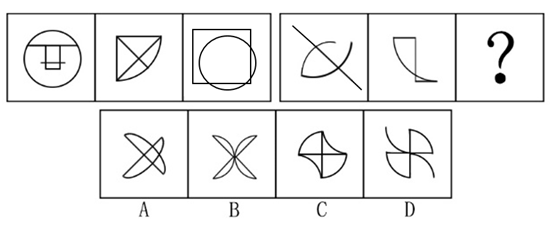

# 2018年北京市公务员录用考试《行测》题（网友回忆版）

> 判断推理 · 30 题 · 北京 2018

## 第 1 题　qid 2136974 · 图形推理

请从四个选项中选出最恰当的一项填在问号处，使图形呈现一定的规律性：

- **A**. A　✅
- **B**. B
- **C**. C
- **D**. D

**答案**：A

**官方解析**

观察图形发现，元素组成不同，且无属性规律，考虑数量规律。观察发现，题干图形中出现明显一笔画成的图形和有端点的图形，考虑笔画数。进一步观察发现，题干中各图均为一笔画图形，而选项中A项为一笔画图形、B项和C项为两笔画图形、D项为三笔画图形。
故正确答案为A。

---

## 第 2 题　qid 2136980 · 图形推理

请从四个选项中选出最恰当的一项填在问号处，使图形呈现一定的规律性：

- **A**. A
- **B**. B
- **C**. C
- **D**. D　✅

**答案**：D

**官方解析**

观察图形发现，元素组成不同，优先考虑属性规律。观察发现，题干图形均为轴对称图形，并且对称轴只有一条。选项中，A项图形有2条对称轴，B项图形不是轴对称图形，C项图形有1条对称轴，D项图形有1条对称轴，排除A项和B项。进一步观察题干图形发现，题干中每个图形的对称轴都与题干图形中的一条线重合，而C项图形的对称轴并不与图形中某一条线重合。
故正确答案为D。

---

## 第 3 题　qid 2136984 · 图形推理

请从四个选项中选出最恰当的一项填在问号处，使图形呈现一定的规律性：

- **A**. A
- **B**. B
- **C**. C　✅
- **D**. D

**答案**：C

**官方解析**

观察图形发现，元素组成不同，且无属性规律，考虑数量规律。题干中每个图形都是由多个独立小元素构成，可考虑小元素的数量或者种类规律。观察发现，题干中每个图形均由4种不同的小元素构成。观察选项发现，A项和D项由3种小元素构成，B项由2种小元素构成，只有C项由4种小元素构成。
故正确答案为C。

---

## 第 4 题　qid 2136992 · 图形推理

此题包含两套图形和可供选择的4个图形。这两套图形具有某种相似性，也存在某种差异。要求你从四个选项中选择最适合取代问号的一个。正确的答案应不仅使两套图形表现出最大的相似性，而且使第二套图形也表现出自己的特征。

- **A**. A
- **B**. B
- **C**. C
- **D**. D　✅

**答案**：D

**官方解析**

观察图形发现，元素组成不同，考虑属性规律。观察发现，题干中第一组图形均为轴对称图形，并且对称轴只有一条。画出每个图的对称轴发现，每个图的对称轴沿逆时针方向每次旋转45度；第二组前两个图形也都是轴对称图形，且每个图的对称轴沿逆时针方向每次旋转45度，故问号处图形对称轴方向应该竖直向下，排除B项和C项。进一步观察题干图形，每个图均由直线组成，考虑数直线数，第一组图形直线数量分别为2、3、4，第二组图形直线数量分别为2、3，故问号处图形直线数应为4。选项中，A项直线数为3，D项直线数为4条。
故正确答案为D。

---

## 第 5 题　qid 2136998 · 图形推理

此题包含两套图形和可供选择的4个图形。这两套图形具有某种相似性，也存在某种差异。要求你从四个选项中选择最适合取代问号的一个。正确的答案应不仅使两套图形表现出最大的相似性，而且使第二套图形也表现出自己的特征。

- **A**. A
- **B**. B
- **C**. C　✅
- **D**. D

**答案**：C

**官方解析**

元素组成不同，且无属性规律，考虑数量规律。观察发现，图形均由直线和曲线构成，且曲线和直线都有交点，考虑数曲直交点。第一组图曲直交点数分别为2、3、4,第二组图曲直交点数分别为2、3，故问号处图形的曲直交点数应为4。选项中，A项为6个曲直交点，B项为5个曲直交点，C项为4个曲直交点，D项为5个曲直交点。
故正确答案为C。

---

## 第 6 题　qid 2137044 · 逻辑判断

某国总统竞选活动中，候选人G在X州获得5万多张选票，在Y州获得3万余张选票。据此，约翰先生认为，G在X州有更高的支持率。
以下哪项如果为真，能够反驳约翰先生的观点？

- **A**. 候选人G到X州做过宣传演讲，但未曾去过Y州
- **B**. 候选人G是基督徒，X州比Y州的基督徒多得多
- **C**. X州支持候选人G的女性多于Y州
- **D**. Y州的人口仅有X州人口的一半　✅

**答案**：D

**官方解析**

第一步：找出论点和论据。

论点：G在X州有更高的支持率。

论据：某国总统竞选活动中，候选人G在X州获得5万多张选票，在Y州获得3万余张选票。

第二步：逐一分析选项。

A项：候选人G在X州做过宣传演讲，但没有去过Y州，宣传演讲是否能获得更高的支持率，不明确，排除；

B项：X州的基督教徒比Y州多，与候选人G获得的支持率无关，无法削弱，排除；

C项：X州支持候选人G的女性多于Y州，但题干未提到X州支持候选人G的男性是否多于Y州，且不明确两个州总人口是多少，得不出支持率的高低，排除；

D项：支持率等于得票数除以人口总数，Y州的人口仅有X州人口的一半。如果Y州人口数为，则G在X州的支持率为，G在Y州的支持率为，所以G在Y州的支持率更高，可以削弱，当选。

故正确答案为D。

---

## 第 7 题　qid 2137048 · 逻辑判断

近几年，智能手机已成为手机市场上的主要销售产品，功能手机（非智能手机）的销售量则大幅度降低。某手机生产商预测：“智能手机很快将完全取代功能手机。”
以下哪项如果为真，能够对该手机生产商的预言构成反驳？

- **A**. 智能手机除具备通话、发短信等功能外，上网也方便，深受消费者喜爱
- **B**. 很多老年人只会使用功能手机，手机是他们生活中必不可少的通讯工具　✅
- **C**. 由于购买非智能手机的人越来越少，无生产商愿意再生产非智能手机
- **D**. 智能手机为工作和娱乐提供诸多便利，越来越多的人选择购买智能手机

**答案**：B

**官方解析**

第一步：找出论点和论据。
论点：智能手机很快将完全取代功能手机。
论据：近几年，智能手机已成为手机市场上的主要销售产品，功能手机（非智能手机）的销售量则大幅度降低。
第二步：逐一分析选项。
A项：智能手机深受消费者喜爱，不表示智能手机就将完全取代功能手机，无关项，排除；
B项：功能手机对于老人的生活必不可少，所以智能手机不可能完全取代功能手机，削弱论点，当选；
C项：没有生产商愿意再生产非智能手机，说明最后功能性手机可能会消失，加强论点，排除；
D项：越来越多的人选择购买智能手机，说明可能逐渐会没人购买功能性手机，加强论点，排除。
故正确答案为B。

---

## 第 8 题　qid 2137038 · 逻辑判断

高栓患有假性近视。为了使其视力恢复到正常状态，李大夫要求高栓停止打网络游戏。
为使李大夫的要求具有说服力，必须假设以下哪项？

- **A**. 假性近视患者打网络游戏，将严重影响其视力恢复到正常状态　✅
- **B**. 打网络游戏是引起假性近视的主要原因
- **C**. 李大夫经验丰富，他治愈了90%以上前来就诊的假性近视患者
- **D**. 假性近视如果不及时缓解将导致真性近视

**答案**：A

**官方解析**

第一步：找出论点和论据。
论点：李大夫要求高栓停止打网络游戏。
论据：高栓患有假性近视，想要恢复到正常状态。
第二步：逐一分析选项。
A项：说明假性近视患者打网络游戏会影响视力的恢复，即在网络游戏和恢复视力之间进行搭桥，当选；
B项：说明打网络游戏是引起假性近视的原因，但是并不意味着不打游戏就能使视力恢复到正常情况，排除；
C项：只说到李大夫经验丰富，治愈率高，但是并没有说明网络游戏和恢复视力之间的关系，不是必须的假设，排除； 
D项：只说到假性近视不及时治疗所带来的后果，但是并没有说明网络游戏和恢复视力之间的关系，属于无关选项，排除。
故正确答案为A。

---

## 第 9 题　qid 2137042 · 逻辑判断

酒类广告常会告诉人们，少喝一点酒没事，控制好饮酒量可能还对心脏有好处。
以下哪项如果为真，最能削弱上述结论？

- **A**. 每个人的最佳饮酒量不同，要依据个人年龄、性别和叶酸摄入量等因素决定
- **B**. 对于那些高密度脂蛋白低、有健康的饮食和大量运动的人来说，饮酒可能有益
- **C**. 调查显示80%的酒类广告都承认过度美化和夸大饮酒的益处　✅
- **D**. 红葡萄酒中白藜芦醇和抗氧化剂等有益成分的含量有限

**答案**：C

**官方解析**

第一步：找出论点和论据。
论点：酒类广告宣称少喝一点酒没事，控制好饮酒量可能还对心脏有好处。
论据：无。
第二步：逐一分析选项。
A项：说明每个人的最佳饮酒量由一些因素决定，但没有说明喝酒是好还是不好，无法削弱，排除；
B项：说明对于一部分人而言饮酒可能有益，加强了题干的论点，排除；
C项：说明大部分的酒类广告承认了自己的广告内容有夸大和美化之嫌，即对酒类广告的内容进行了削弱，当选； 
D项：只说到红葡萄酒中的有益成分含量有限，并不能说明喝酒好还是不好，无法削弱，排除。
故正确答案为C。

---

## 第 10 题　qid 2137050 · 类比推理

L城有四位著名的雕刻家张明、杨刚、李强和刘庆，该城近20年来所有的名人雕像都出自他们中某一人之手。他们四人都有一个习惯：即完工后在作品不显眼处刻字留言。已知张明和杨刚的留言总是真的，李强和刘庆的留言总是假的。现发现L城去年雕刻完成的一尊名人像，据上面的留言可确定此像为李强所雕，那么该留言内容应为：

- **A**. 此像非张明所雕
- **B**. 此像非杨刚所雕
- **C**. 此像为李强所雕
- **D**. 此像为刘庆所雕　✅

**答案**：D

**官方解析**

本题属于真假推理题。
第一步：分析题干。
张明和杨刚的留言总是真的，李强和刘庆的留言总是假的。
第二步：逐一分析选项。
A项：如果“此像非张明所雕”为该雕像上的留言内容，已知雕像是李强所雕，则留言内容符合实情，而已知李强的留言总是假的，因此选项与题干矛盾，排除；
B项：如果“此像非杨刚所雕”为该雕像上的留言内容，已知雕像是李强所雕，则留言内容符合实情，而已知李强的留言总是假的，因此选项与题干矛盾，排除；
C项：如果“此像为李强所雕”为该雕像上的留言内容，已知雕像是李强所雕，则留言内容符合实情，而已知李强的留言总是假的，因此选项与题干矛盾，排除；
D项：如果“此像为刘庆所雕”为该雕像上的留言内容，已知雕像是李强所雕，则留言内容不符合实情，而已知李强的留言总是假的，因此选项符合题干矛盾，当选。
故正确答案为D。

---

## 第 11 题　qid 2137098 · 逻辑判断

据介绍，北半球人口相对密集，燃烧化石燃料等人类活动不断推高碳排放量，因此北半球大气中的二氧化碳浓度在2013年已达到400PPM这一标杆水平。相对来说，南半球人类活动较少，而南极洲更是人烟稀少，但即便如此，2017年6月南极洲的二氧化碳浓度也达到了400PPM这一标杆值。
根据以上信息，下列推论正确的是：

- **A**. 人类活动对地球的影响已经深入到极地　✅
- **B**. 二氧化碳浓度升高对南极洲地貌有深远影响
- **C**. 南极洲二氧化碳浓度不会再降到400PPM以下
- **D**. 北极的二氧化碳浓度在4、5年前就远超南极

**答案**：A

**官方解析**

日常推理题，根据题干信息逐一分析选项。
A项：南极洲人烟稀少但二氧化碳浓度仍达到了400PPM这一标杆值，说明人类活动对地球的影响已经深入到极地，可以推出，当选；
B项：题干只是提到南极洲二氧化碳浓度达到了400PPM这一标杆值，并没有提到达到这个数值以后的具体影响，对南极洲地貌是否有深远影响不得而知，无中生有，排除；
C项：题干只是说南极洲二氧化碳浓度达到了400PPM这一标杆值，没有提到以后会不会再降下去，无中生有，排除；
D项：题干说的是北半球在2013年二氧化碳浓度达到了400PPM这一标杆值，而南极洲在2017年才达到这个值，但通过北半球的平均情况无法得出北极是否远超于南极，选项叙述程度比较重，且偷换概念，排除。
故正确答案为A。

---

## 第 12 题　qid 2137102 · 逻辑判断

某调查发现，患抑郁症的人平均每天使用手机的时间达122分钟以上，而没有患抑郁症的人平均每天使用手机的时间为59分钟。有人提出，玩手机可能会影响情绪，使用手机的时间越多，抑郁的可能性越大。
以下哪项如果为真，不能支持以上结论？

- **A**. 长时间玩手机，尤其是睡前玩手机，可能会造成睡眠时间的不足，而导致情绪容易出问题
- **B**. 长时间玩手机，会接触海量数据，这些数据不能及时处理，易造成情绪低迷、烦躁和疲劳，增加抑郁风险
- **C**. 人把过多时间和精力放在手机上，必然和现实中的人接触减少，逃避面对现实是抑郁的特征之一　✅
- **D**. 长期玩手机的人，通常把大部分时间用在上网和打游戏，而不是和朋友聊天，缺少人际支持是抑郁的风险因素

**答案**：C

**官方解析**

第一步：找出论点和论据。
论点：玩手机可能会影响情绪，使用手机的时间越多，抑郁的可能性越大。
论据：某调查发现，患抑郁症的人平均每天使用手机的时间达122分钟以上，而没有患抑郁症的人平均每天使用手机的时间为59分钟。
第二步：逐一分析选项。
A项：指出长时间玩手机会导致情绪出问题，说明玩手机会影响情绪，可以加强，排除；
B项：长时间玩手机会有海量数据不能及时处理，容易造成情绪低迷、烦躁和疲劳等，因此增加抑郁风险。该项是在解释原因说明为什么玩手机时间越多，抑郁的可能性越大，可以加强，排除；
C项：强调逃避面对现实是抑郁的特征之一，而题干论点讨论的是患抑郁症的原因，话题不一致，无法加强，当选；
D项：长期玩手机的人很少有时间和朋友聊天，和朋友聊天时间少即缺少人际支持，这是抑郁的风险因素。该项说明玩手机时间越多，抑郁的可能性越大，可以加强，排除。
本题是选非题，故正确答案为C。

---

## 第 13 题　qid 2137106 · 逻辑判断

共享单车作为一种新鲜事物，近来发展迅速。在城市的大街小巷，几乎到处可见共享单车的影子。共享单车构成城市一道新的亮丽风景线，也为人们的出行提供了方便。但是，有一些市民对整个自行车生产行业表示担忧，他们认为：共享单车的出现和大量投入使用，使得很多计划购买自行车的个人不再购买。因此，整个自行车行业的生产和销售量随之减少。
以下哪项如果为真，最能削弱这些市民的结论？

- **A**. 不同品牌的自行车生产商将面临更激烈的市场竞争，有些厂家与共享单车运营公司合作，会生产和销售更多的自行车
- **B**. 共享单车也存在很多的问题，比如，存在安全隐患，在有需求时不能及时找到，有一些民众仍愿意购买专属自己的自行车
- **C**. 共享单车由共享单车所属公司委托自行车生产商生产，共享单车的数量远远超过了因个人需求而产生的购买量　✅
- **D**. 共享单车的使用需要网上申请账号，使用时需要进行微信扫码，很多中年人不会上网，因此他们更愿意自己购买自行车

**答案**：C

**官方解析**

第一步：找出论点和论据。
论点：整个自行车行业的生产和销售量随之减少。
论据：共享单车的出现和大量投入使用，使得很多计划购买自行车的个人不再购买。
第二步：逐一分析选项。
A项：该项只能说明有些厂家与共享单车运营公司合作，会生产和销售更多的自行车。但是自行车行业整体的生产和销售量会不会减少，不明确，排除；
B项：该项只能说明有一些民众仍愿意购买专属自己的自行车，但只是一些民众而不是全部的民众愿意这样做。这不能说明自行车行业整体的生产和销售量会不会减少，不明确，排除；
C项：共享单车的数量远远超过了因个人需求而产生的购买量，说明因为共享单车的出现，自行车的整体需求量更多了，整个自行车行业的生产和销售量并未减少，直接削弱题干论点，当选；
D项：该项说明很多中年人更愿意自己购买自行车，而中年人只是整个人群的一部分，其他人是否更愿意自己购买自行车不明确。因此该项不能说明自行车行业整体的生产和销售量会不会减少，不明确，排除。
故正确答案为C。

---

## 第 14 题　qid 2137110 · 逻辑判断

从1995年起，印度某地每年有数百名贫困儿童患上一种急性大脑疾病。患儿常在清晨出现癫痫症状，许多儿童很快死亡。这种情况通常发生于每年5月-7月。该地区盛产荔枝，5月-7月恰好是荔枝成熟的时间，因此有人怀疑这种疾病可能与荔枝有关。研究发现，所有荔枝中都含有亚甲环丙基甘氨酸和次甘氨酸，没熟的荔枝中这两种物质含量更高。研究者认为，这些患者属于次甘氨酸和亚甲环丙基甘氨酸中毒，疾病爆发确实与大量食用荔枝有关。
以下哪项如果为真，最能支持以上结论？

- **A**. 所有患儿的尿样本中均检测出了亚甲环丙基甘氨酸和次甘氨酸
- **B**. 居民根据官方建议限制了儿童每日吃荔枝数量，两年后患病人数大幅降低　✅
- **C**. 相比没有出现症状的儿童，生病儿童患病前吃过荔枝的可能性更高
- **D**. 相比没有出现症状的儿童，生病儿童更有可能吃下生的或者腐烂的荔枝

**答案**：B

**官方解析**

第一步：找出论点和论据。
论点：这些患者属于次甘氨酸和亚甲环丙基甘氨酸中毒，疾病爆发确实与大量食用荔枝有关。
论据：从1995年起，印度某地每年有数百名贫困儿童患上一种急性大脑疾病。患儿常在清晨出现癫痫症状，许多儿童很快死亡。这种情况通常发生于每年5月-7月。该地区盛产荔枝，5月-7月恰好是荔枝成熟的时间，因此有人怀疑这种疾病可能与荔枝有关。研究发现，所有荔枝中都含有亚甲环丙基甘氨酸和次甘氨酸，没熟的荔枝中这两种物质含量更高。
第二步：逐一分析选项。
A项：检测出亚甲环丙基甘氨酸和次甘氨酸，不代表一定是吃了荔枝，无关项，不能加强，排除；
B项：该项表明吃荔枝的量少，患病人数就低，通过对比的方式说明患病与大量吃荔枝有关系，可以加强，当选；
C项：论点强调的是患病与大量吃荔枝有关，该项强调吃荔枝的可能性高，不代表吃的量大，无法加强，排除； 
D项：论点强调的是患病与大量吃荔枝有关，该项强调吃生的或者腐烂的荔枝的可能性高，不代表吃的量大，无法加强，排除。
故正确答案为B。

---

## 第 15 题　qid 2137114 · 逻辑判断

大众通常认为，早期的音乐训练能增强个体的乐声和语音处理能力。但有些心理学家对此表示怀疑。研究人员调查了出生于1959年到1985年之间的1211对同卵双胞胎和1358对异卵双胞胎，记录他们的音乐练习时间，评估他们的音乐能力。他们发现，练习更长时间并不能表现出更出色的音乐能力，比如一对基因相同的同卵双胞胎的音乐练习时间相差20228小时，但他们的音乐能力完全相同。这些研究者认为，如果没有正确的基因，即使练习2万小时也没有意义，音乐能力是由基因决定的。
以下哪项如果为真，最能驳斥研究者的结论？

- **A**. 音乐能力评估采用手指模拟快节奏音乐的方式，而手指的灵活性受遗传影响
- **B**. 具有遗传上优越的听觉技能的个体可能自我选择成为音乐家，练习时间更长
- **C**. 同卵双胞胎之间通常有“心灵感应”，影响了个体在音乐能力测试中的表现　✅
- **D**. 音乐能力差的个体会低估自己的练习时间，以便维持心理平衡

**答案**：C

**官方解析**

第一步：找出论点和论据。
论点：音乐能力是由基因决定的。
论据：研究人员调查了出生于1959年到1985年之间的1211对同卵双胞胎和1358对异卵双胞胎，记录他们的音乐练习时间，评估他们的音乐能力。他们发现，练习更长时间并不能表现出更出色的音乐能力，比如一对基因相同的同卵双胞胎的音乐练习时间相差20228小时，但他们的音乐能力完全相同。
第二步：逐一分析选项。
A项：该项说明音乐能力与遗传有关，即与基因有关，有一定的加强作用，不能削弱，排除；
B项：该项强调的是具有遗传上优越的听觉技能的个体练习时间更长，那练习对音乐能力是否有影响不确定，不能削弱，排除；
C项：“心灵感应”，影响了个体在音乐能力测试中的表现，说明“心灵感应”影响了调查的结果，属于他因削弱，当选； 
D项：音乐能力差的个体会低估自己的练习时间，意思是本来练习的多，但感觉练习的少，感觉练的少跟实际练了多少无关，不能削弱，排除。
故正确答案为C。

---

## 第 16 题　qid 2137032 · 类比推理

H企业的招聘小组工作期限为两年，每一年都由五人组成。这五人中，有三人来自五位高管约翰、琼斯、玛丽、安妮和亚当，有两人来自三位高级工程师艾伦、麦迪和彼得。每年，该小组中有一名成员当组长。第一年当组长的成员第二年必须退出该小组。此外，该小组还要满足如下要求：
(1)琼斯、艾伦不能在同一年成为小组成员；
(2)每一年，安妮和艾伦中有且只有一位参加。
艾伦在第一年担任了该小组组长，则下列选项中，第二年一定参加该小组的是：

- **A**. 琼斯、安妮
- **B**. 琼斯、彼得
- **C**. 安妮、麦迪　✅
- **D**. 亚当、彼得

**答案**：C

**官方解析**

题干条件中提到次数最多的就是“艾伦”，可以以它为突破口。
根据条件“艾伦在第一年担任了该小组组长”以及“第一年当组长的成员第二年必须退出该小组”，可推出艾伦第二年不可能是小组成员；
根据条件（2）“每一年，安妮和艾伦中有且只有一位参加”，结合上述结论艾伦第二年没参加可知：第二年安妮一定参加该小组，锁定A、C两项；
又根据条件“有两人来自三位高级工程师艾伦、麦迪和彼得”，结合上述结论艾伦第二年没参加可知：第二年剩余两名高级工程师麦迪和彼得一定参加该小组；
提问是第二年一定参加该小组的是哪项，根据刚才推导出的结论：“安妮、麦迪和彼得第二年一定参加该小组”，可知C选项中两人符合条件。
选项A、B中的琼斯无法判定是否一定参加该小组，因为第二年艾伦不参加该小组，在条件（1）中琼斯第二年无论其是否参加该小组，该条件都可满足，故无法判定，排除；选项D中的亚当也无法判定是否一定参加该小组，排除。
故正确答案为C。

---

## 第 17 题　qid 2137034 · 逻辑判断

一项研究发现，生活贫困能够导致人们的某种基因发生变化，这种基因能够增强负责应对恐慌的大脑区域活动，比如杏仁核的活动增加会导致患上抑郁症的风险增加。同时，较低的社会经济状况与低水平的血清素之间也存在关联，进而增加抑郁症的患病风险。研究员还发现，这种基因变化也会传递给后代。
根据上述研究，可以得知：

- **A**. 生活贫困会通过影响生理而对精神健康产生作用　✅
- **B**. 社会经济地位较高的人群患抑郁症的风险较低
- **C**. 穷困阶层因基因的变化而使得贫穷和疾病多代延续
- **D**. 杏仁核活动增强的同时，血清素水平降低

**答案**：A

**官方解析**

本题为日常结论题。
A项：题干提及“较低的社会经济状况与低水平的血清素之间存在关联，进而增加抑郁症的患病风险”，可以推出生活贫困会通过影响生理而对精神健康产生作用，符合文意，当选；
B项：题干只谈及了社会经济较低的人患抑郁症的情况，并未提到社会经济较高的人，无中生有，排除；
C项：题干说的是社会经济较低的人的基因变化会传递给后代，而非基因变化导致贫穷和疾病这个结果传递给后代，偷换概念，排除；
D项：题干并未提及杏仁核和血清素之间的联系，无中生有，排除。
故正确答案为A。

---

## 第 18 题　qid 2137036 · 逻辑判断

一条鳄鱼抢走了一个小孩，它对孩子的母亲说：“我会不会吃掉你的小孩？答对了，孩子还给你；答错了，我就吃了他。”孩子母亲说：“你会吃了他吧。”母亲的回答让鳄鱼陷入了一种选择困境，这就是所谓的“鳄鱼悖论”。
根据上述情景，以下哪一项描述有相似的困境或悖论？

- **A**. 裁缝说：“世上没有我做不出来的衣服。”公主说：“世上没有让我满意的衣服。”国王最后说：“你们都说的不对。”
- **B**. 小偷去保险箱偷珠宝，发现箱子有两个按钮，只有触动其中一个才能打开箱子。绿色按钮下面写着“按我，打不开”，红色按钮下面写着“不按我，能打开”。　✅
- **C**. 狐狸抓到一只鸡，对鸡说：“如果我现在心情好，就放你走；心情不好，就吃掉你。你说我心情好还是不好？猜对了就放你走。”鸡赶紧说：“你的心情很好。”
- **D**. 家里花瓶打碎了，肯定是大宝或小宝干的。妈妈问是谁打的。大宝说：“是小宝打的。”小宝说：“不是大宝打的。”原来他们都在说谎。

**答案**：B

**官方解析**

第一步：分析题干。
鳄鱼陷入一个悖论当中，无论鳄鱼怎样做，都无法兑现自己的许诺。因为鳄鱼的诺言有两项内容：
①如果妈妈猜对，我就释放小孩；
②如果妈妈猜错，我就吃掉小孩。
在妈妈表达了猜测之后，鳄鱼的行为只有两种选择，而这两种选择都与鳄鱼原先的诺言相违背。
鳄鱼的第一种选择，把小孩吃掉。这种选择的结果证明那位妈妈的猜测是正确的，按照鳄鱼原先的许诺①，此时鳄鱼应该把小孩归还，但是鳄鱼的选择却把小孩吃掉了，所以鳄鱼违背了自己的诺言。
鳄鱼的第二种选择，把小孩放掉。这种选择的结果证明那位妈妈的猜测是错误的，按照鳄鱼原先的许诺②，此时鳄鱼应该把小孩吃掉啊！但是鳄鱼的选择却把小孩释放了，所以鳄鱼还是违背了自己的诺言。
第二步：逐一分析选项。
A项：如果裁缝和公主说的都不对，即应该是“世界上有裁缝做不出来的衣服”和“世界上有让公主满意的衣服”，“有做不出的衣服”和“有满意的衣服”不矛盾，与题干不相似，排除；
B项：红色按钮说“不按我，能打开”，即“按绿色，能打开”，已知触动其中一个才能打开箱子，但是现在“按绿色，打不开”和“按绿色，能打开”同时存在，不可能按绿色既能打开又打不开，所以前后构成矛盾，与题干相似，当选；
C项：如果鸡回答正确，就不会被吃掉；如果鸡回答错误，即狐狸心情不好，那么鸡就会被吃掉，是狐狸的承诺并不矛盾，与题干不相似，排除；
D项：如果大宝和小宝都在说谎，即应该是“不是小宝打的”和“是大宝打的”， 因为已知肯定是大宝或小宝干的，所以两句话最后的结果都是“大宝干的”，没有矛盾的地方，与题干不相似，排除。
故正确答案为B。

---

## 第 19 题　qid 2137040 · 逻辑判断

抹香鲸是体型最大的齿鲸。由于潜水能力极强，抹香鲸也是潜水最深、潜水时间最长的哺乳动物。只有在有大量乌贼存活且不结冰的海域，才会有抹香鲸存活。阿拉弗拉海域没有抹香鲸。
根据以上断定，可得出以下哪项结论？
I.阿拉弗拉海域或者没有大量乌贼存活，或者是结冰的海域
II.只有在不结冰的海域里，乌贼才能存活
III.阿拉弗拉海域没有齿鲸

- **A**. 
仅I

- **B**. 
仅II

- **C**. 
仅III

- **D**. 
I，II和III都得不出
　✅

**答案**：D

**官方解析**

第一步：翻译题干。

有抹香鲸海域有大量乌贼存活且不结冰。

第二步：逐一分析结论。

I，阿拉弗拉海域没有抹香鲸，是对题干翻译的否前，否定箭头前得不到确定性结论，所以推不出该结论，排除A项；

II，翻译为：乌贼存活不结冰的海域，题干中两者是且关系，不是推出关系，所以推不出该结论，排除B项；

III，根据题干信息只能推出阿拉弗拉海域没有抹香鲸这种最大的齿鲸，至于是否有其他的齿鲸，不确定，所以推不出该结论，排除C项。

故正确答案为D。

---

## 第 20 题　qid 2137046 · 逻辑判断

有些参加语言学暑期高级讲习班的学生获得过青年语言学奖。所有中文专业的三年级硕士生都参加了语言学暑期高级讲习班。所有中文专业的一年级硕士生都没有参加语言学暑期高级讲习班。
如果以上陈述为真，可以推出：

- **A**. 有些获得过青年语言学奖的学生是中文专业的三年级硕士生
- **B**. 有些中文专业的三年级硕士生获得过青年语言学奖
- **C**. 有些获得过青年语言学奖的学生不是中文专业的一年级硕士生　✅
- **D**. 有些中文专业的一年级硕士生获得过青年语言学奖

**答案**：C

**官方解析**

第一步：翻译题干。

①有些参加语言学暑期高级讲习班的学生获得过青年语言学奖；

可换位为：②有些获得过青年语言学奖参加了语言学暑期高级讲习班。

③中文专业的三年级硕士生参加了语言学暑期高级讲习班。

④中文专业的一年级硕士生参加语言学暑期高级讲习班；

根据逆否等价可得：⑤参加语言学暑期高级讲习班中文专业的一年级硕士生。

第二步：逐一分析选项。

A项，根据②可知“有些获得过青年语言学奖参加了语言学暑期高级讲习班”，但是“参加了语言学暑期高级讲习班”是对翻译③的箭头后的肯定，肯定箭头后得不到确定性结论，该项不能推出，排除；

B项，根据③可知中文专业的三年级硕士生参加了语言学暑期高级讲习班，但中文专业的三年级硕士生是否属于翻译①中的“有些参加语言学暑期高级讲习班的学生”不确定，所以推不出中文专业的三年级硕士生中有些获得过青年语言学奖，该项不能推出，排除；

C项，根据传递规则，由②和⑤可得，有些获得过青年语言学奖参加了语言学暑期高级讲习班中文专业的一年级硕士生，即“有些获得过青年语言学奖的学生不是中文专业的一年级硕士生”，该项可以推出，当选；

D项，根据传递规则，由②和⑤可得，有些获得过青年语言学奖参加了语言学暑期高级讲习班中文专业的一年级硕士生，即有些获得过青年语言学奖的学生不是中文专业的一年级硕士生，“有的是”无法推出“有的不是”，所以无法得到结论“有些获得过青年语言学奖的学生是中文专业的一年级硕士生”，更无法推出“有些中文专业的一年级硕士生获得过青年语言学奖”，该项不能推出，排除。

故正确答案为C。

---

## 第 21 题　qid 2137066 · 定义判断

微商，一般是指以个人为单位的、利用web3.0时代所衍生的载体渠道，将传统方式与互联网结合，不存在区域限制，且可移动地实现销售渠道新突破的小型个体行为。
根据上述定义，以下属于微商的是：

- **A**. 某大型化妆品公司在微信账号上销售商品，吸引了一大批消费者
- **B**. 某眼镜店通过大力宣传吸引了许多年轻消费者进店购买
- **C**. 李某开的饭店为周边居民提供电话预定上门送外卖的服务
- **D**. 张某在市中心的服装店生意不错，他在微信上卖出的更多　✅

**答案**：D

**官方解析**

第一步：找出定义关键词。
 “以个人为单位”、“小型个体行为”、“利用web3.0时代所衍生的载体渠道，将传统与互联网结合”。
第二步：逐一分析选项。
A项：大型化妆品公司，不符合“以个人为单位”和“小型个体行为”，主体不符合，不符合定义，排除；
B项：眼镜店不符合“以个人为单位”，主体不符合，同时，做法不符合“利用web3.0时代所衍生的载体渠道，将传统与互联网结合”，不符合定义，排除；
C项：李某提供的是电话订餐和上门送外卖的服务，不符合“利用web3.0时代所衍生的载体渠道，将传统与互联网结合”，不符合定义，排除；
D项：张某的服装店符合“以个人为单位”和“小型个体行为”，利用微信符合“利用web3.0时代所衍生的载体渠道，将传统方式与互联网结合”，符合定义，当选。
故正确答案为D。

---

## 第 22 题　qid 2137070 · 定义判断

组织学习，是指组织为了实现发展目标、提高核心竞争力而围绕信息或知识技能所采取的各种行动，是组织不断努力改变或重新设计自身以适应持续变化的环境的过程。
根据上述定义，以下属于组织学习的是：

- **A**. 我国某大型国企派人学习科技课程　✅
- **B**. 李明为了晋升去参加周末管理课程
- **C**. 某外企工作团队节假日去三亚度假
- **D**. 某集团组织新进员工开展户外拓展

**答案**：A

**官方解析**

第一步：找出定义关键词。
“组织”、“为了实现发展目标，提高核心竞争力”、“围绕信息或知识技能所采取的各种行动”。
第二步：逐一分析选项。
A项：某大型国企符合“组织”，派人学习科技课程符合“围绕信息或知识技能所采取的各种行动”，符合定义，当选；
B项：李明是个人，不符合“组织”，主体不符合，不符合定义，排除；
C项：工作团队，不符合“组织”，同时，度假不符合学习，不符合定义，排除；
D项：某集团，符合“组织”，但是开展户外拓展，不符合“为了实现发展目标，提高核心竞争力”和“围绕信息或知识技能所采取的各种行为”，不符合定义，排除。
故正确答案为A。

---

## 第 23 题　qid 2137072 · 定义判断

赤潮，又称“红潮”。赤潮是海洋中一种或多种微小浮游植物、原生动物或细菌，在一定的环境条件下突发性迅速增殖或聚集，引起一定海域范围在一段时间内变色的自然生态现象。赤潮是一种海洋生物灾害。通常水体颜色因赤潮生物的数量、种类而呈红、黄、绿和褐色等。
根据上述定义，以下最有可能属于赤潮现象的是：

- **A**. 我国长江中游多次发生水体变蓝现象
- **B**. 位于尼泊尔博克拉市区的贝格纳斯湖湖水曾变红
- **C**. 日本濑户内海、有明海等水域频繁发生水体变红　✅
- **D**. 美国密西西比河部分水域发生洪灾，水中含大量泥沙

**答案**：C

**官方解析**

第一步：找出定义关键词。
“是海洋中一种或多种微小浮游植物、原生动物或细菌，在一定的环境条件下突发性迅速增殖或聚集”、“引起一定海域范围在一段时间内变色的自然生态现象”。
第二步：逐一分析选项。
A项：“长江中游水体变蓝”长江不是海洋，不符合定义，排除； 
B项：贝格纳斯湖是湖泊不是海洋，不符合定义，排除；
C项：日本濑户内海、有明海等均符合“海洋中”这一关键词，且水体变红符合“引起一定海域范围在一段时间内变色”，符合定义，当选；
D项：密西西比河是河流，而非“海洋”，且“水中含大量泥沙”不符合“引起一定海域范围在一段时间内变色”，不符合定义，排除。
故正确答案为C。

---

## 第 24 题　qid 2137074 · 定义判断

网络小说，是指由作者创作并首次在网络上发表，并以连载模式形成的小说。和传统小说相比，网络小说偏重于娱乐性和读者阅读时的体验。
根据上述定义，以下属于网络小说的是：

- **A**. 小张将自己考研的坎坷经历写成文章发表在网上，很多考研的学生看过之后很受感动，转发次数上百万
- **B**. 小黄根据姥姥讲的民间故事，写了长篇灵异小说发表在网站上，每日更新，小说完结后出版社主动与小黄联系，打算出版　✅
- **C**. 小金根据《西游记》绘制长篇连环画，每天在网上连载发表，受到很多网友的追捧
- **D**. 小姜将生活中的不文明现象写成一篇微小说发表在网上，电视台编导与他联系，想把他的小说拍摄成文明宣传片

**答案**：B

**官方解析**

第一步：找出定义关键词。
“由作者创作并首次在网络上发表”、“并以连载模式形成的小说”、“偏重于娱乐性和读者阅读时的体验”。
第二步：逐一分析选项。
A项：将考研经历写成文章发表，不符合“连载”这一关键词，不符合定义，排除； 
B项：将姥姥讲的故事写成长篇小说符合“由作者创作并首次在网络上发表”，每日更新符合“并以连载模式形成的小说”，灵异小说符合“偏重于娱乐性和读者阅读时的体验”，符合定义，当选；
C项：“连环画”不是小说，不符合定义，排除；
D项：“将不文明现象写成一篇微小说”不符合“并以连载模式形成的小说”，不符合定义，排除。
故正确答案为B。

---

## 第 25 题　qid 2137076 · 定义判断

《科学技术期刊管理办法》对科技期刊的定义为：具有固定刊名、刊期、年卷或年月顺序编号、印刷成册、以报道科学技术为主要内容的连续出版物。这一定义限定了科技期刊的刊载内容、外观和出版方式。
根据上述定义，以下属于科技期刊的是：

- **A**. 《中国首届砂石生产技术交流会论文集》
- **B**. 《青年文摘》
- **C**. 《哈尔滨工程大学学报》　✅
- **D**. 《汽车新型光源科技研讨会会议纪要》

**答案**：C

**官方解析**

第一步：找出定义关键词。
“具有固定刊名、刊期、年卷或年月顺序编号”、“印刷成册”、“以报道科学技术为主要内容”、“连续出版物”。
第二步：逐一分析选项。
A项：《中国首届砂石生产技术交流会论文集》是该届交流会论文的合集，不符合“连续出版物”，不符合定义，排除； 
B项：《青年文摘》是面向全国、以青少年为核心读者群的文摘类综合刊物，不符合“以报道科学技术为主要内容”，不符合定义，排除；
C项：《哈尔滨工程大学学报》是由工业和信息化部主管，哈尔滨工程大学主办的国内外公开发行的理工科综合性学术期刊，符合定义，当选；
D项：《汽车新型光源科技研讨会会议纪要》是记载和传达该研讨会会议情况和议定事项的法定公文，不符合“连续出版物”，不符合定义，排除。
故正确答案为C。

---

## 第 26 题　qid 2137082 · 定义判断

电信诈骗，是指犯罪分子通过电话、网络和短信方式，发布虚假信息，设置骗局，对受害人实施远程、非接触式诈骗，诱使受害人给犯罪分子打款或转账，进行非法侵占他人财物的犯罪行为。
根据上述定义，以下不属于电信诈骗的是：

- **A**. 王某在网上发起新房团购，承诺一千元定金可抵五万元房款，顾客缴纳定金之后才发现该楼盘已售罄，王某也消失了
- **B**. 李某盗用正在出差的张先生的微信头像，冒充张先生给张太太发微信说遇到事故，骗走两万元
- **C**. 张某谎称自己患上不治之症，伪造诊断书、编造假故事放在网上，通过众筹募集到三万元医药费
- **D**. 李老太太打电话找保洁，家政公司派来的保洁员王某忽悠李老太太从王某丈夫的店里购买了数千元保健品　✅

**答案**：D

**官方解析**

第一步：找出定义关键词。
“通过电话、网络和短信方式”、“发布虚假信息，设置骗局”、“诱使受害人给犯罪分子打款或转账”、“非法侵占他人财物”。
第二步：逐一分析选项。
A项：王某在网上发起新房团购，符合“通过电话、网络和短信方式”，顾客缴纳定金之后才发现该楼盘已售罄，王某也消失了，符合“非法侵占他人财物”，符合定义，排除； 
B项：李某盗用微信头像冒充张先生发微信说遇到事故，符合“发布虚假信息，设置骗局”，最终骗走两万元，符合“非法侵占他人财物”，符合定义，排除；
C项：张某伪造诊断书、编造假故事放在网上，符合“发布虚假信息，设置骗局”，通过众筹募集到三万元医药费，符合“非法侵占他人财物”，符合定义，排除；
D项：家政公司派来的保洁员王某忽悠李老太太，不符合“通过电话、网络和短信方式”，不符合定义，当选。
本题为选非题，故正确答案为D。

---

## 第 27 题　qid 2137084 · 定义判断

幸存者偏差，又称为“生存者偏差”或“存活者偏差”，是一种常见的逻辑谬误，指的是只能看到经过某种筛选而产生的结果，而没有意识到筛选的过程，因此忽略了被筛选掉的关键信息。
根据上述定义，以下不符合幸存者偏差的是：

- **A**. 某位互联网大亨是从大学退学创业成功的，很多人感叹，上大学没什么用，大学退学的人成功了，自己当老板，那么多大学毕业的人，还在给老板打工
- **B**. 二战期间，军方专家根据从战斗中返航的飞机机翼和机尾位置中弹最多的特点，认为应该强化油箱和驾驶员舱位的装甲防护，才能降低被炮火击落的几率　✅
- **C**. 在国际钢琴大赛中荣获金奖的女孩说，她有今天的成绩，是由于父母从小严厉管教，逼她坚持弹琴。欣欣的妈妈想：只要坚持让欣欣每天练琴，她将来也会成为钢琴家
- **D**. 王先生坚信“喝葡萄酒的人长寿”，因为他调查了身边很多长寿的老人，发现其中很多人经常饮用葡萄酒

**答案**：B

**官方解析**

第一步：找出定义关键词。
原因：只能看到经过某种筛选而产生的结果，没有意识到筛选的过程
结果：忽略了被筛选掉的关键信息
第二步：逐一分析选项。
A项：通过一个互联网大亨退学创业成功就得出上大学没有用的结论，忽略了上大学也成功创业的人，符合“只能看到经过某种筛选而产生的结果，没有意识到筛选的过程”，符合定义，排除；
B项：专家通过分析战斗中返航的飞机机翼和机尾位置中弹最多的特点得出应该强化油箱和驾驶员舱位的装甲防护，恰恰是通过分析得到机翼和机尾位置不是致命伤，因此应该强化油箱和驾驶员舱位的装甲防护，是将未能飞回来的飞机也考虑在内了，进行了一个全面的分析，不符合“只能看到经过某种筛选而产生的结果，没有意识到筛选的过程”，不符合定义，当选；
C项：妈妈通过国际获奖女孩的例子就得到只要坚持练琴就会成为钢琴家，而忽略了坚持练琴也没有成为钢琴家的人，符合“只能看到经过某种筛选而产生的结果，没有意识到筛选的过程”，符合定义，排除；
D项：通过调查很多长寿的老人得到了喝葡萄酒的人会长寿，但是却忽略了喝葡萄酒已经去世的那部分人，符合“只能看到经过某种筛选而产生的结果，没有意识到筛选的过程”，符合定义，排除。
本题为选非题，故正确答案为B。

---

## 第 28 题　qid 2137086 · 定义判断

沉锚效应，指的是人们在对某人某事做出判断时，易受第一印象或第一信息支配，就像沉入海底的锚一样把人们的思想固定在某处。
根据上述定义，以下不符合沉锚效应的是：

- **A**. 小高在面试时西装革履，侃侃而谈，不卑不亢，主管对他很满意。但在实习期，主管发现小高做事虎头蛇尾，对他很失望，最终没有录取他　✅
- **B**. 小刘开了一家饰品店，他有意将饰品价格标注得略高于可接受的价格，然后主动给顾客打折，顾客认为这家店的饰品都很实惠
- **C**. 张老师第一次上课时内容充实，言语幽默，学生对他评价很好，第二次上课时张老师讲课单调乏味，学生觉得张老师今天状态不好，影响了发挥
- **D**. 一家皮具制造商只在机场和高端百货商店建立专卖店，且有意与世界名牌店比邻，虽然其商品比其他同类国产商品价格略高，但近年来销量一直保持增长趋势

**答案**：A

**官方解析**

第一步：找出定义关键词。
“人们在对某人某事做出判断时，易受第一印象或第一信息支配”、“把思想固定在某处”。
第二步：逐一分析选项。
A项：主管在面试时对小高很满意，但实习期间对他很失望，不符合“人们在对某人某事做出判断时，易受第一印象或第一信息支配”，不符合定义，当选；
B项：小刘主动给顾客打折，顾客就认为这家店的饰品都很便宜，符合“人们在对某人某事做出判断时，易受第一印象或第一信息支配”，符合定义，排除；
C项：张老师第一次上课，学生对他评价很好，第二次上课单调乏味，学生认为张老师状态不好，影响发挥，符合“人们在对某人某事做出判断时，易受第一印象或第一信息支配”，符合定义，排除；
D项：皮具制造商只在机场和高端百货商店建立专卖店，且有意与世界名牌比邻，近年来销量一直增长，符合“人们在对某人某事做出判断时，易受第一印象或第一信息支配”，符合定义，排除。
本题为选非题，故正确答案为A。

---

## 第 29 题　qid 2137088 · 定义判断

环境移民，是指人类生存的自然环境和人居环境受到突发或渐进式的不利影响而产生的各种人口迁移行为，包括自愿的、非自愿的，事后被迫的、预先计划的，暂时的、永久性的，个体和家庭自发的、政府主导的移民类型。
根据上述定义，以下不属于环境移民的是：

- **A**. 切尔诺贝利核污染区域居民集体撤离家园
- **B**. 为了保护三江源地区而限制放牧后的生态移民
- **C**. 安史之乱时期中原人民大量南迁
- **D**. 元朝定都大都之后大量牧民南迁　✅

**答案**：D

**官方解析**

第一步：找出定义关键词。
“自然环境和人居环境受到突发或渐进式的不利影响而产生的各种人口迁移行为”。
第二步：逐一分析选项。
A项：切尔诺贝利核污染是一件发生在前苏联统治下乌克兰境内切尔诺贝利核电站的核子反应堆事故，会对人类居住的自然环境和居住环境造成破坏性影响，符合因自然环境和人居环境的不利影响而移民，符合定义，排除； 
B项：保护三江源而限制放牧，符合人居环境受到不利影响而移民，符合定义，排除； 
C项：安史之乱由唐朝将领安禄山与史思明背叛唐朝后发动的战争，因唐朝内战而移民，符合人居环境受到不利影响而移民，符合定义，排除；
D项：因为重新定都而移民，不符合因自然环境和人居环境受到不利影响而移民，不符合定义，当选。
本题为选非题，故正确答案为D。

---

## 第 30 题　qid 2137090 · 定义判断

即发侵权，是指侵权活动开始之前，权利人有证据证明某行为很快就会构成对自己知识产权的侵犯，或该行为的正常延续必然构成侵权行为，权利人可依法予以起诉。
根据上述定义，以下事例可以以即发侵权进行起诉的是：

- **A**. 知名乐队黑眼豆豆新出的专辑“夜空”正在大卖，同时，另一个知名度不高且取名为黑米果果的乐队也正抓紧制作名为“星空”的专辑
- **B**. 小雪人形状的雪糕深受孩子们喜爱，最近市面上又出现一种形状非常相似的山寨小雪人雪糕
- **C**. 小张是某软件开发公司的研发部经理，掌握该公司某项专利产品的核心技术，后来小张被另一公司高薪挖走，正在开发类似的产品　✅
- **D**. 小小读书郎的电子产品上市之后深受好评，另一家公司也紧跟着研发小小状元人机互动学习机

**答案**：C

**官方解析**

第一步：找出定义关键词。
“侵权活动开始之前”、“有证据证明某行为很快就会构成对自己知识产权的侵犯，或该行为的正常延续必然构成侵权行为”。
第二步：逐一分析选项。
A项：另一个知名度不高且取名为黑米果果的乐队也正抓紧制作名为“星空”的专辑，对之前黑眼豆豆乐队的专辑“夜空”是否侵权，是没有证据证明的，不符合“有证据证明某行为很快就会构成对自己知识产权的侵犯”，不符合定义，排除； 
B项：市面上已经出现了一种形状非常相似的山寨小雪人雪糕，这是侵权行为已经发生了，不符合“侵权活动开始之前”，不符合定义，排除；
C项：小张被另一个公司高薪挖走，正在开发类似的产品，符合“有证据证明某行为很快就会构成对自己知识产权的侵犯，或该行为的正常延续必然构成侵权行为”，符合定义，当选；
D项：另一家公司也紧跟着研发小小状元人机互动学习机，对小小读书郎的电子产品是否侵权是没有证据证明的，不符合“有证据证明某行为很快就会构成对自己知识产权的侵犯”，不符合定义，排除。
故正确答案为C。

---
