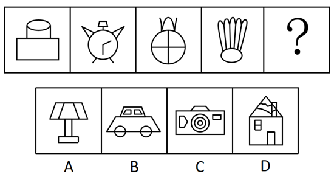
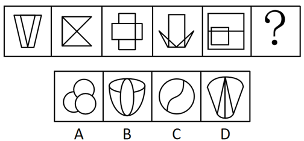
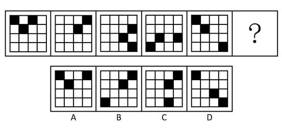

# 2018年四川省公务员录用考试《行测》题（下半年）（网友回忆版）

> 判断推理 · 30 题 · 四川 2018

## 第 1 题　qid 2280966 · 图形推理

从所给的选项中，选择最合适的一个填入问号处，使之呈现一定的规律性：

- **A**. A
- **B**. B
- **C**. C　✅
- **D**. D

**答案**：C

**官方解析**

图形元素组成不同，无明显属性规律，考虑数量规律。观察发现，题干图形“窟窿”比较多，优先考虑数面，数量依次是3、4、5、6、？，则问号处应选一个含有7个面的选项。A项5个面，B项8个面，C项7个面，D项11个面，只有C项符合。
 故正确答案为C。

---

## 第 2 题　qid 2280971 · 图形推理

从所给的选项中，选择最合适的一个填入问号处，使之呈现一定的规律性：

- **A**. A
- **B**. B
- **C**. C　✅
- **D**. D

**答案**：C

**官方解析**

图形元素组成不同，无明显属性规律，考虑数量规律。观察发现图⑤是“日”字变形图，为笔画数特征图，故考虑数笔画。题干均为一笔画图形，故问号处也选择一个一笔画图形。观察选项：
A项的奇点数是4，为两笔画图形；
B项的奇点数是4，为两笔画图形；
C项的奇点数是2，为一笔画图形；
D项的奇点数是4，为两笔画图形。
故正确答案为C。

---

## 第 3 题　qid 2280977 · 图形推理

从所给的选项中，选择最合适的一个填入问号处，使之呈现一定的规律性：

- **A**. A
- **B**. B
- **C**. C　✅
- **D**. D

**答案**：C

**官方解析**

图形元素组成相同，优先考虑位置规律。观察发现，1号小黑块每次沿着十六宫格的外圈顺时针移动3格，2号小黑块每次沿着十六宫格的外圈顺时针移动1格，3号小黑块每次沿着十六宫格的内圈顺时针移动1格，如图所示：

应用此规律，从图五到问号处，1号小黑块移动到第一行最后一格，2号小黑块移动到第四行第三格，3号小黑块移动到第二行第三格，只有C项符合。

故正确答案为C。

---

## 第 4 题　qid 2280987 · 图形推理

从所给的选项中，选择最合适的一个填入问号处，使之呈现一定的规律性：

- **A**. A　✅
- **B**. B
- **C**. C
- **D**. D

**答案**：A

**官方解析**

图形元素组成不同，且无明显属性规律，考虑数量规律，观察发现，每幅图都有线穿过小黑球，考虑线穿过小黑球的数量，从图一到图五线穿过小黑球的数量分别为12、13、14、15、16，因此问号处应选择一个线条穿过17个小黑球的图形，只有A项符合。
故正确答案为A。

---

## 第 5 题　qid 2280997 · 图形推理

从所给的选项中，选择最合适的一个填入问号处，使之呈现一定的规律性：

- **A**. A
- **B**. B
- **C**. C
- **D**. D　✅

**答案**：D

**官方解析**

图形元素组成相同，优先考虑位置规律。观察发现，第一组图中，图一的第二格向下翻转并与原来的第一格、第三格叠加后得到图二，图二再整体旋转得到图三；第二组图应用此规律，但第二组图没有三格，而是四个格子，观察前两幅图发现，图一的上面两个格子向下翻转与原来的下面两个格子叠加后得到图二，图二再整体旋转得到问号处图形，只有D项符合。

故正确答案为D。

---

## 第 6 题　qid 2281003 · 图形推理

左边为给定的纸盒外表面，右边哪一项能由它折叠而成？

- **A**. A
- **B**. B　✅
- **C**. C
- **D**. D

**答案**：B

**官方解析**

将原展开图标上序号如下图，逐一进行分析。

A项错误，选项中出现2个相同的黑三角面，而展开图中6个面各不相同，选项与题干不一致，排除；

B项正确，由面b、面c和面d构成，选项与题干一致，当选；

C项错误，由面b、面c和面d构成，选项中面c和面d的公共边挨着面d中黑色三角形较长的直角边（如图中绿线所示），而展开图中二者的公共边挨着面d中黑色三角形较短的直角边（如图中绿线所示），选项与题干不一致，排除；

D项错误，由面a、面b和面c构成，选项中面b和面c的公共边挨着面b的黑色三角形（如图中黄线所示），而展开图中二者的公共边挨着面b的白色三角形（如图中黄线所示），选项与题干不一致，排除。

故正确答案为B。

---

## 第 7 题　qid 2281011 · 图形推理

下图为给定的多面体，下面哪项多面体能与该多面体拼接成实心的长方体？

- **A**. A　✅
- **B**. B
- **C**. C
- **D**. D

**答案**：A

**官方解析**

本题考查立体拼合。根据凹凸一致原则，A项可以和给定的多面体拼成长方体。具体组合方式如下图所示：

故正确答案为A。

---

## 第 8 题　qid 2281020 · 定义判断

反应性相倚是指在沟通过程中，沟通双方都以对方的行为作为自己行为的依据，做出相应的反应，而并不按照原来的计划进行沟通。
根据上述定义，下列属于反应性相倚的是：

- **A**. 小何计划出国读博，申请几所学校都收到了录取通知，他反复研究，并征求导师的意见，做出了最终决定
- **B**. 方某通过房产中介看中了黄某的房子，与黄某沟通后发现其房屋的产权证尚未取得，于是方某决定推迟购买
- **C**. 小李报名参加演讲比赛，初赛晋级后进入复赛，但复赛时间和小李的外语考试冲突，于是小李改变计划，选择退赛
- **D**. 某公司计划推行新考核制度，各部门负责人希望按部门情况分别拟定，后公司决定先保留原制度，针对个别情况逐步调整，各部门表示同意　✅

**答案**：D

**官方解析**

第一步：找出定义关键词。
“沟通过程中，沟通双方都以对方的行为作为自己的依据，做出相应的反应”“并不按照原来的计划进行沟通”。
第二步：逐一分析选项。
A项：小何收到几所学校的录取通知书，反复研究并征求导师的意见后做出最终决定，小何与学校之间未进行沟通，小何与导师之间的沟通没有体现出彼此以对方的行为依据做出反应，不符合“沟通过程中，沟通双方都以对方的行为作为自己的依据，做出相应的反应”，不符合定义，排除； 
B项：方某通过与黄某进行沟通后做出了推迟购买的决定，但是黄某没有做出相应的反应，不符合“沟通过程中，沟通双方都以对方的行为作为自己的依据，做出相应的反应”，不符合定义，排除；
C项：小李因为复赛时间与外语考试冲突，选择退赛，未体现出沟通，不符合“沟通过程中，沟通双方都以对方的行为作为自己的依据，做出相应的反应”，不符合定义，排除；
D项：某公司计划推行新考核制度，各部门负责人与公司沟通后，公司针对各部门负责人的行为（希望按照部门情况分别拟定）做出了保留原制度，但针对个别情况会逐步调整的反应，各部门负责人针对公司决定也表示同意。符合“沟通过程中，沟通双方都以对方的行为作为自己的依据，做出相应的反应”，且沟通双方都有调整，“并不按照原来的计划进行沟通”，符合定义，当选。
故正确答案为D。

---

## 第 9 题　qid 2281025 · 定义判断

法条竞合犯是指一个犯罪行为同时触犯数个具有包容关系的刑法条文，依法只适用其中一条定罪量刑的情况。
根据上述定义，下列属于法条竞合犯的是：

- **A**. 王某醉酒驾驶致伤三人
- **B**. 张某拦路抢劫致人死亡
- **C**. 李某生产销售价值百万的假药　✅
- **D**. 周某组织多人制造假币

**答案**：C

**官方解析**

第一步：找出定义关键词。
“一个犯罪行为”、“同时触犯数个具有包容关系的刑法条文”、“依法只适用其中一条定罪量刑”。
第二步：逐一分析选项。
A项：王某醉酒驾驶触犯了“危险驾驶罪”，伤人触犯了“交通肇事罪”，两者并不具有包容关系，不符合关键词“同时触犯数个具有包容关系的刑法条文”，不符合定义，排除； 
B项：拦路抢劫致人死亡属于“抢劫罪”，是抢劫罪的从重处罚情节，不符合关键词“同时触犯数个具有包容关系的刑法条文”，不符合定义，排除；
C项：李某的行为犯了“生产、销售假药罪”和“生产销售伪劣产品罪”，符合关键词“同时触犯数个具有包容关系的刑法条文”，符合定义，当选；
D项：周某制造假币只是犯了“伪造货币罪”，不符合关键词“同时触犯数个具有包容关系的刑法条文”，不符合定义，排除。
故正确答案为C。

---

## 第 10 题　qid 2281027 · 定义判断

营业外收入是指企业确认与企业生产经营活动没有直接关系的各种收入。这一收入实际上是一种纯收入，不是由企业经营资金耗费所产生的，不需要企业付出代价，不需要与有关费用进行配比。换言之，除企业营业执照中规定的主营业务以及附属的其他业务之外的所有收入都视为营业外收入。
根据上述定义，下列关于营业外收入的说法哪项不正确？

- **A**. 某旅游景区服务公司获得的门票收入属于营业外收入　✅
- **B**. 某高分子材料公司从当地政府获得的高新技术企业的政策补贴属于营业外收入
- **C**. 甲乙两公司是合作企业，后乙公司违反国家有关行政管理法规，按照规定支付给甲公司一定数量的罚款，该罚款属于甲公司的营业外收入
- **D**. 甲公司购入一批环保设备，5年后将这些设备进行报废处理并获得相应的报废款，这一款项扣除资产账面价值、清理费用、处置相关税费后的净收益属于营业外收入

**答案**：A

**官方解析**

第一步：找出定义关键词。
“除企业营业执照中规定的主营业务以及附属的其他业务之外的所有收入”。
第二步：逐一分析选项。
A项：旅游景区售卖门票，就是景区的主营业务收入，不属于“除企业营业执照中规定的主营业务以及附属的其他业务之外的所有收入”，不符合定义，当选； 
B项：高分子材料公司获得的政策补贴，与业务活动无关，属于“除企业营业执照中规定的主营业务以及附属的其他业务之外的所有收入”，符合定义，排除；
C项：由于乙公司违反法规支付给甲公司的罚款，与甲公司的业务活动无关，属于“除企业营业执照中规定的主营业务以及附属的其他业务之外的所有收入”，符合定义，排除；
D项：甲公司的设备报废处理获得报废款，与甲公司的业务活动无关，属于“除企业营业执照中规定的主营业务以及附属的其他业务之外的所有收入”，符合定义，排除。
本题为选非题，故正确答案为A。

---

## 第 11 题　qid 2281030 · 定义判断

股权众筹是指创新创业者或小微企业通过股权众筹融资中介机构互联网平台（互联网网站或其他类似的电子媒介）公开募集股本的活动。
根据上述定义，下列属于股权众筹活动的是：

- **A**. 
做生意的杨某以1.5亿元入股邻居的创业项目，创立了一个网购平台

- **B**. 
某公司在地方股权交易市场挂牌后，宣布公司定向发行原始股，融资2亿元

- **C**. 
孔某通过自己制作的网站宣传推广某项目，成功吸引40余人投资，融资200余万元

- **D**. 
赵某通过熟人介绍在某网络创投平台出资20万元，获得创业企业的股权，成为该企业的股东
　✅

**答案**：D

**官方解析**

第一步：找出定义关键词。

“创新创业者或小微企业”、“通过股权众筹融资中介机构互联网平台（互联网网站或其他类似的电子媒介）公开募集股本的活动 ”。
第二步：逐一分析选项。
A项，杨某以1.5亿元入股邻居的创业项目，创立了一个网购平台，没有通过互联网公开募集股本，不符合“通过股权众筹融资中介机构互联网平台（互联网网站或其他类似的电子媒介）公开募集股本的活动”，不符合定义，排除； 
B项，某公司在地方股权交易市场挂牌后定向发行原始股，地方股权交易市场并不是股权众筹融资中介机构互联网平台，不符合“通过股权众筹融资中介机构互联网平台（互联网网站或其他类似的电子媒介）公开募集股本的活动”，不符合定义，排除；
C项，孔某通过自己制作的网站宣传推广某项目，成功吸引40余人投资，融资200余万元，孔某只是通过网站去宣传项目而没有进行众筹，不符合“通过股权众筹融资中介机构互联网平台（互联网网站或其他类似的电子媒介）公开募集股本的活动”，不符合定义，排除；
D项，赵某通过熟人介绍在某网络创投平台出资20万元，说明赵某投资的企业通过创投网络平台募集到了赵某的资金，符合“通过股权众筹融资中介机构互联网平台（互联网网站或其他类似的电子媒介）公开募集股本的活动”，符合定义，当选。
故正确答案为D。

---

## 第 12 题　qid 2281031 · 定义判断

一般来说，关于世界的表述有两种类型。第一种是实证表述，只是如实做出关于世界是什么样子的表述。第二种是规范表述，做出的是关于世界应该是什么样子的表述，通常含有价值判断，即做出好坏或应该与否的判断。
根据上述定义，下列判断正确的是：

- **A**. “提高汇率会减少通货膨胀是错误的”是实证表述
- **B**. “政府立法禁止在公共场合吸烟是正确的”是实证表述
- **C**. “汽油税的分担对于驾驶员来说太不公平了”是规范表述　✅
- **D**. “如果政府提高酒税，酒厂的利益就会减少”是规范表述

**答案**：C

**官方解析**

第一步：找出定义关键词。
实证表述：“如实做出关于世界是什么样子的表述”。
规范表述：“做出的是关于世界应该是什么样子的表述”、“含有价值判断，即做出好坏或应该与否的判断”。
第二步：逐一分析选项。
A项：“是错误的”是一种价值判断，符合“规范表述”的定义，不符合“实证表述”定义，排除；
B项：“是正确的”是一种价值判断，符合“规范表述”的定义，不符合“实证表述”定义，排除；
C项：“太不公平了”是一种价值判断，符合“做出的是关于世界应该是什么样子的表述”，符合“规范表述”的定义，当选；
D项：“如果······就······”是一种如实的表述，符合“实证表述”的定义，不符合“规范表述”定义，排除。
故正确答案为C。

---

## 第 13 题　qid 2281032 · 定义判断

无偿合同是指当事人一方只享有合同权利而不偿付任何代价的合同。换言之，该合同中的一方当事人向对方给予某种利益，而对方取得该利益时无需支付任何代价。
根据上述定义，下列选项不属于无偿合同的是：

- **A**. 
老王膝下无儿女，他将自己名下的一套房产赠予一直照顾自己的侄子，并与对方签订了赠予合同

- **B**. 
何某邀请李某来自己的公司任职，并与李某签订合同，承诺如果李某在公司工作满5年，将获得公司的股份
　✅
- **C**. 
黎某要出国学习半年，不愿将装修一新的住宅对外出租，遂与好友王某协商一致，将其住宅交与王某代为看管

- **D**. 
黄某将自己的车借给同事郑某使用，并与郑某签订协议，约定借给其使用一年，不需缴纳使用费，但要如期归还

**答案**：B

**官方解析**

第一步：找出定义关键词。

“一方当事人向对方给予某种利益”“对方取得该利益时无需支付任何代价”。

第二步：逐一分析选项。

A项：老王与侄子签订赠予房产的合同，侄子不需要支付任何代价就得到了老王的一套房产，符合关键词“一方当事人向对方给予某种利益”“对方取得该利益时无需支付任何代价”，符合定义，排除；

B项：何某与李某签订任职合同，李某需要付出工作满5年的代价，才能获得何某公司的股份，不符合“对方取得该利益时无需支付任何代价”，不符合定义，当选；

C项：黎某与王某协商一致，王某代为看管黎某的住宅半年，且黎某没有付出什么代价，符合“一方当事人向对方给予某种利益”、“对方取得该利益时无需支付任何代价”，符合定义，排除；

D项：黄某与郑某签订协议，郑某不需要付出什么代价，就可以免费使用黄某的车一年，符合关键词“一方当事人向对方给予某种利益”、“对方取得该利益时无需支付任何代价”，符合定义，排除。

本题为选非题，故正确答案为B。

---

## 第 14 题　qid 2281033 · 定义判断

诉诸无知是指以对某个命题的无知为根据，从而断言该命题是真或者是假的一种谬误。其公式是：因为尚未证明A假，所以A是真的；或者因为尚未证明A真，所以A是假的。
根据上述定义，下列论证中犯了诉诸无知错误的是：

- **A**. 既然圣经上说上帝是存在的，那么你就不能说上帝是不存在的
- **B**. 既然现在没有充分的证据证明甲是有罪的，那么甲就可能是无罪的
- **C**. 既然当时的绝大多数人都相信托勒密的地心说，那么托勒密的地心说就是正确的
- **D**. 既然古代典籍未提到元明时期该地附近有寺院，那么就说明当时该地附近没有寺院　✅

**答案**：D

**官方解析**

第一步：找出定义关键词。
“尚未证明A假，所以A是真的”“尚未证明A真，所以A是假的”。
第二步：逐一分析选项。
A项，圣经说上帝是存在的，说明有证据表明上帝是存在的，那么上帝存在，不符合“尚未证明A假，所以A是真的”，也不符合“尚未证明A真，所以A是假的”，不符合定义，排除；
B项，现在没有充分的证据证明甲有罪，符合“尚未证明A真”，那么甲就可能是无罪的，这只是一种可能性，不符合 “所以A是假的”，不符合定义，排除；
C项，绝大多数人相信托勒密的地心说，那么地心说正确，但是人们相信有地心说并不代表有证据证明地心说是存在的，不符合“尚未证明A假，所以A是真的”，也不符合“尚未证明A真，所以A是假的”，不符合定义，排除；
D项，古代典籍未提到元明时期该地附近有寺院，符合“尚未证明A真”，那么当时该地附近就没有寺院，符合“所以A是假的”，符合定义，当选。
故正确答案为D。

---

## 第 15 题　qid 2281034 · 定义判断

波丽安娜效应根据小说《少女波丽安娜》中的人物提出，是指通常情况下，人们会对别人给予他们的正面描述表示认同。巴纳姆效应是指绝大多数人都会很容易地相信一个笼统的、一般性的人格描述特别适合自己。
根据上述定义，下列选项中没有反映上述效应的是：

- **A**. 小王在面试的环节中表现非常好，事后面试官告诉他，认为他有很强的沟通协调能力和解决问题的能力，他觉得自己确实是这样
- **B**. 某明星近来人气很高，虽然有一些负面新闻，但在粉丝看来，他是亲切而率真的，他自己也在微博上澄清了事实，希望获得大家的支持　✅
- **C**. 小明在网上看到了有关星座性格分析的内容，他觉得里面的描述比如“适应能力很好，在生活中充满了活力，在社交圈举止得当”这些内容非常符合自己
- **D**. 实验者给一批被试者做了人格调查，后拿出两份结果让其判断。事实上，一份是被试者个人填写的结果，另一份是这批被试者的回答平均起来的结果，被试者大都认为后者更准确地表达了自己的人格特征

**答案**：B

**官方解析**

第一步：找出定义关键词。
波丽安娜效应：“人们会对别人给予他们的正面描述表示认同”。
巴纳姆效应：“绝大多数人都会很容易地相信一个笼统的、一般性的人格描述特别适合自己”。
第二步：逐一分析选项。
A项：面试官认为小王有很强的沟通能力和解决问题的能力，是对小王的正面描述，并且小王也认为自己确实如此，符合“人们会对别人给予他们的正面描述表示认同”，符合波丽安娜效应，排除；
B项：某明星有一些负面新闻，该明星在微博上澄清事实，不符合“对正面描述表示认同”，不符合波丽安娜效应，粉丝认为他是亲切率真的，但是未体现出该明星表示认同，不符合“绝大多数人都会很容易地相信一个笼统的、一般性的人格描述特别适合自己”，不符合巴纳姆效应，当选；
C项：星座性格分析中的内容“适应能力很好，在生活中充满了活力，在社交圈举止得当”，符合“笼统的、一般性的人格描述”，小明认为这些描述很符合自己，符合“绝大多数人都会很容易地相信一个笼统的、一般性的人格描述特别适合自己”，符合巴纳姆效应，排除；
D项：被试者大都认为被试者回答的平均结果更准确地表达了自己的人格特征，符合“绝大多数人都会很容易地相信一个笼统的、一般性的人格描述特别适合自己”，符合巴纳姆效应，排除。
本题为选非题，故正确答案为B。

---

## 第 16 题　qid 2281035 · 定义判断

心理学家马斯洛将人的需求像阶梯一样从低到高按层次分为五种，分别是：生理需求、安全需求、爱和归属需求、尊重需求和自我实现需求。其中，尊重需求属于较高层次的需求，表现为希望获得成就、名声、地位、晋升机会或获得他人对自己的认可与尊重等。
根据上述定义，下列行为中最能体现尊重需求的是：

- **A**. 小王在工作之余和关系好的同事一起打羽毛球
- **B**. 小张为了能养家糊口每天拼命地努力工作赚钱
- **C**. 小李为自己和家人都购买了人身意外伤害保险
- **D**. 小刘对自己被评为年度优秀员工感到非常开心　✅

**答案**：D

**官方解析**

第一步：找出定义关键词。
“希望获得成就、名声、地位、晋升机会或获得他人对自己的认可与尊重等”。
第二步：逐一分析选项。
A项：小王与同事一起打羽毛球，没有体现他“希望获得成就、名声、地位、晋升机会或获得他人对自己的认可与尊重”，不符合定义，排除；
B项：小张努力工作赚钱是为了养家糊口，不符合“希望获得成就、名声、地位、晋升机会或获得他人对自己的认可与尊重”，不符合定义，排除；
C项：小李购买人身意外伤害保险是为了自己和家人在风险来临时有所保障，不符合“希望获得成就、名声、地位、晋升机会或获得他人对自己的认可与尊重”，不符合定义，排除；
D项：小刘感到开心是因为自己被评为年度优秀员工，这项荣誉是小刘工作取得的成就，也是对小刘工作的认可，符合“希望获得成就、名声、地位、晋升机会或获得他人对自己的认可与尊重”，符合定义，当选。
故正确答案为D。

---

## 第 17 题　qid 2281037 · 定义判断

瑕疵担保责任是指依法律规定，在交易活动中当事人一方移转财产（或权利）给另一方时，应担保该财产（或权利）无瑕疵，若移转的财产（或权利）有瑕疵，则应向对方当事人承担相应的责任。
根据上述定义，下列选项中乙公司不需要承担瑕疵担保责任的是：

- **A**. 甲公司从乙公司购买了四台不锈钢水箱，后一台水箱发生爆裂，经鉴定水箱钢板厚度偏薄，焊接质量较差，与国家标准要求不符
- **B**. 甲公司与乙公司签订协议，甲支付50万元获得乙公司旗下6个专利产品，后甲在使用过程中发现其中一个产品版权属于丙公司所有
- **C**. 甲公司与乙公司签订《股权转让协议》，约定甲公司将名下的股权全额转让给乙公司，协议签订不久，乙公司资金发生问题，申请破产　✅
- **D**. 甲公司租赁乙公司的厂房开办化工厂，后房屋漏雨，甲公司安排工人杨某到屋顶更换石棉瓦，结果杨某在更换过程中因房屋大梁突然断裂从高处坠落受伤

**答案**：C

**官方解析**

第一步：找出定义关键词。
“在交易活动中当事人一方移转财产（或权利）给另一方时”“应担保该财产（或权利）无瑕疵”“若移转的财产（或权利）有瑕疵，则应向对方当事人承担相应的责任”。
第二步：逐一分析选项。
A项，甲公司从乙公司购买了四台不锈钢水箱，符合“在交易活动中当事人一方移转财产（或权利）给另一方时”，后一台水箱发生爆裂，经鉴定水箱钢板厚度偏薄，焊接质量较差，符合“若移转的财产（或权利）有瑕疵”，所以乙公司需要承担瑕疵担保责任，符合定义，排除；
B项，甲公司与乙公司签订协议，甲支付50万元获得乙公司旗下6个专利产品，符合“在交易活动中当事人一方移转财产（或权利）给另一方时”，发现其中一个产品版权属于丙公司所有，说明乙公司转让的专利产品有瑕疵，符合“若移转的财产（或权利）有瑕疵”, 所以乙公司需要承担瑕疵担保责任，符合定义，排除；
C项，甲公司与乙公司签订《股权转让协议》，约定甲公司将名下的股权全额转让给乙公司，符合“在交易活动中当事人一方移转财产（或权利）给另一方时”，但是此次转让股权是甲公司把股权转让给乙公司，而此时该承担瑕疵担保责任的应该是甲公司，而不是乙公司，所以乙公司不需要承担瑕疵担保责任，不符合定义，当选；
D项，甲公司租赁乙公司的厂房开办化工厂，符合“在交易活动中当事人一方移转财产（或权利）给另一方时”，后房屋漏雨，并且杨某在更换过程中因房屋大梁突然断裂从高处坠落受伤，说明该厂房存在瑕疵，符合“若移转的财产（或权利）有瑕疵”，所以乙公司需要承担瑕疵担保责任，符合定义，排除。
本题为选非题，故正确答案为C。

---

## 第 18 题　qid 2281038 · 类比推理

平邮：快递

- **A**. 经济舱：头等舱
- **B**. 普快列车：高铁　✅
- **C**. 短信：微信
- **D**. 信件：传真

**答案**：B

**官方解析**

第一步：判断题干词语间逻辑关系。
平邮和快递都是邮递业务，二者是并列关系，且平邮的速度比快递的速度慢。
第二步：判断选项词语间逻辑关系。
A项：经济舱和头等舱是并列关系，但速度相同，与题干逻辑关系不一致，排除；
B项：普快列车和高铁都是火车，二者是并列关系，且普快列车的速度比高铁慢，与题干逻辑关系一致，当选；
C项：短信和微信都是通讯的方式，是并列关系，但是速度相同，与题干逻辑关系不一致，排除；
D项：信件指书信和递送的文件、印刷品，传真可做动词也可做名词，做名词的时候指的是传送信息的方式，二者不是并列关系，与题干逻辑关系不一致，排除。
故正确答案为B。

---

## 第 19 题　qid 2281039 · 类比推理

孑孓：蚊子

- **A**. 树苗：杨树
- **B**. 羊羔：绵羊
- **C**. 蝌蚪：青蛙　✅
- **D**. 麦种：小麦

**答案**：C

**官方解析**

第一步：判断题干词语间逻辑关系。
孑孓指蚊子的幼虫，前者是同一生物的幼年时期，后者是成年时期，且孑孓需待在水中直至长成蚊子。孑孓经过变态发育成为蚊子，二者是对应关系。
第二步：判断选项词语间逻辑关系。
A项，树苗是树的幼苗的统称，不仅仅是杨树的幼苗，且树苗生长不属于变态发育，与题干逻辑关系不一致，排除；
B项，羊羔是羊的幼仔的统称，不仅仅是绵羊的幼仔，且羊羔成长不属于变态发育，与题干逻辑关系不一致，排除；
C项，蝌蚪经过变态发育成为青蛙，且蝌蚪需待在水中直至长成青蛙，二者是对应关系，与题干逻辑关系一致，当选；
D项，麦种是小麦的种子，并不是小麦的幼年的不同称呼，且麦种生长不属于变态发育，与题干逻辑关系不一致，排除。
故正确答案为C。

---

## 第 20 题　qid 2281040 · 类比推理

序幕：尾声

- **A**. 散文：戏剧　✅
- **B**. 方言：粤语
- **C**. 元音：辅音
- **D**. 进士：状元

**答案**：A

**官方解析**

第一步：判断题干词语间逻辑关系。
序幕指的是某些多幕剧置于第一幕之前的一场戏，尾声指的是最后一部份，两者是并列关系中的反对关系。
第二步：判断选项词语间逻辑关系。
A项，散文、戏剧、诗歌和小说是四大文学体裁，文学上的戏剧概念是指为戏剧表演所创作的脚本，即剧本，因此散文和戏剧是并列关系中的反对关系，与题干逻辑关系一致，当选；
B项，粤语是方言的一种，二者是种属关系，与题干逻辑关系不一致，排除；
C项，元音是音素的一种，与辅音相对。英语国际音标共48个音素，其中元音音素20个，辅音音素28个。因此二者是并列关系中的矛盾关系，与题干逻辑关系不一致，排除；
D项，状元是进士中的第一名，二者为种属关系，与题干逻辑关系不一致，排除。
故正确答案为A。

---

## 第 21 题　qid 2280968 · 类比推理

红酒：咖啡：饮品

- **A**. 熊猫：刺绣：中国
- **B**. 勺子：铲子：金属
- **C**. 邮票：信封：邮寄
- **D**. 板栗：核桃：干果　✅

**答案**：D

**官方解析**

第一步：判断题干词语间逻辑关系。
红酒和咖啡是并列关系，二者均是饮品，与饮品为种属关系。
第二步：判断选项词语间逻辑关系。
A项，熊猫和刺绣是并列关系，二者均原产于中国，前两词与中国为物品与原产地的对应关系，与题干逻辑关系不一致，排除；
B项，勺子和铲子是并列关系，二者可能是金属的，前两词与金属是成品和原材料的对应关系，与题干逻辑关系不一致，排除；
C项，邮票和信封是配套使用关系，且二者都可以用来邮寄，前两词与邮寄是功能的对应关系，与题干逻辑关系不一致，排除；
D项，板栗和核桃是并列关系，二者均是干果，前两词与干果为种属关系，与题干逻辑关系一致，当选。
故正确答案为D。

---

## 第 22 题　qid 2280970 · 类比推理

（  ）对于 小说 相当于 琴弦 对于（  ）

- **A**. 写实  音乐
- **B**. 浪漫  乐器
- **C**. 情节  竖琴　✅
- **D**. 诗歌  吉他

**答案**：C

**官方解析**

逐一代入选项。
A项：小说的内容可以是写实的，二者是属性对应关系；琴弦是一些乐器的组成部分，乐器可以演奏出音乐，二者不是属性对应关系。前后逻辑关系不一致，排除；
B项：小说可以是浪漫的，二者是属性对应关系；琴弦是一些乐器的组成部分，二者是组成关系。前后逻辑关系不一致，排除；
C项：情节是小说的组成部分，二者是组成关系；琴弦是竖琴的组成部分，二者是组成关系。前后逻辑关系一致，当选；
D项：诗歌和小说是并列关系；琴弦是吉他的组成部分，二者是组成关系。前后逻辑关系不一致，排除。
故正确答案为C。

---

## 第 23 题　qid 2280975 · 逻辑判断

某公司举行优秀员工评选活动，在最后一轮评选中有甲、乙、丙、丁四名员工入围。甲认为乙会当选，乙认为丙会当选，丙和丁都认为自己不能当选。评选结果公布后发现，上述四种猜测只有一种是错误的。
由此可以推出，一定当选的是：

- **A**. 甲
- **B**. 乙　✅
- **C**. 丙
- **D**. 丁

**答案**：B

**官方解析**

第一步：找关系。

甲：乙当选

乙：丙当选

丙：丙当选

丁：丁当选

乙和丙说的话互为矛盾关系，必有一真一假，而根据四个猜测中只有一个是假的，那么唯一的一假在乙、丙当中，而甲、丁说的话一定为真。

第二步：看其余。

根据甲猜测为真可知，一定当选的是乙。

故正确答案为B。

---

## 第 24 题　qid 2280980 · 逻辑判断

一项调查发现，在牛奶人均消费量大的地区，癌症的发病率较高；而牛奶人均消费量少的地区，癌症发病率极低。有人据此得出结论：饮用牛奶会使癌症的发病率上升。
以下哪项如果为真，最能质疑上述结论？

- **A**. 癌症发病率高的地区，其他疾病的发病率相对较低
- **B**. 牛奶含钙量高，吸收好，而且睡前喝牛奶有助于睡眠
- **C**. 调查中牛奶人均消费量大的地区，人口总数也相对较大
- **D**. 牛奶人均消费量大的地区居民寿命较长，且罹患癌症的主要是中老年人　✅

**答案**：D

**官方解析**

第一步：找出论点和论据。
论点：饮用牛奶会使癌症的发病率上升。
论据：在牛奶人均消费量大的地区，癌症的发病率较高；而牛奶人均消费量少的地区，癌症发病率极低。
论点论据都在讨论“饮用牛奶”与“癌症发病率”的关系，二者话题一致，且论点存在因果关系，削弱优先考虑因果倒置或他因削弱。
第二步：逐一分析选项。
A项：指出癌症发病率高的地区，其他疾病的发病率相对较低，题干只关注癌症的发病率，与其他疾病的发病率无关，属于无关项，不能削弱，排除；
B项：指出牛奶含钙量高，吸收好，睡前喝牛奶有助于睡眠，但并没有指出饮用牛奶和癌症的发病率之间的关系，属于无关项，不能削弱，排除；
C项：指出在牛奶人均消费量大的地区，人口总数也相对较大，但没有指出癌症发病率的问题，属于无关选项，不能削弱，排除；
D项：指出牛奶人均消费量大的地区居民寿命较长，而且罹患癌症主要是中老年人，而年纪大也有可能使得癌症的发病率上升，属于他因削弱，当选。
故正确答案为D。

---

## 第 25 题　qid 2280985 · 逻辑判断

为了解对学校食堂的满意度，某大学进行了一项“我最满意的食堂”评比活动。通过让学生对食堂的饭菜质量、价格、服务态度、卫生状况等10项指标进行评分来反映其对食堂的满意度，学生给每个评分指标赋以1到10分的某一个分值，然后计算出10项评分指标的平均得分，从而得出学生对食堂的满意度。
实施这一项评比活动需要假设的前提是：
Ⅰ.对饭菜质量、服务态度等指标的评价可以用数字来表达
Ⅱ.上述10项指标对学生来说同等重要
Ⅲ.该大学的每个学生都参与了这次评比活动

- **A**. 仅Ⅰ
- **B**. 仅Ⅱ
- **C**. 仅Ⅰ和Ⅱ　✅
- **D**. Ⅰ、Ⅱ和Ⅲ

**答案**：C

**官方解析**

第一步：找出论点和论据。
论点：通过让学生对食堂的饭菜质量、价格、服务态度、卫生状况等10项指标进行评分，计算出10项评分指标的平均得分，从而得出学生对食堂的满意度。
论据：无。
第二步：逐一分析选项。
Ⅰ：对饭菜质量、服务态度等指标的评价可以用数字来表达，是使得评价可以量化的前提条件，若指标评价不能用数字表达，那么题干论点提到的通过指标的平均得分得到学生对食堂的满意度就无法实现，该项是评比活动需要假设的前提。
Ⅱ：10项指标同等重要，这使得学生的评判可以公平公正进行，若10项指标不是同等重要，那么通过评价指标的平均分得到对食堂的评价就不科学，也无意义，该项是评比活动需要假设的前提。
Ⅲ：参加评比活动的学生人数和评比最后得到的结果无必然联系，不是该评比活动需要假设的前提。
实施这一项评比活动需要假设的前提是Ⅰ和Ⅱ。
故正确答案为C。

---

## 第 26 题　qid 2280989 · 逻辑判断

毛囊干细胞是在毛囊中长期生活的细胞，终身为我们产生毛发。毛囊干细胞从血液中吸收葡萄糖，经过代谢，葡萄糖变为丙酮酸。这些丙酮酸一部分被细胞运输进线粒体，在线粒体中，丙酮酸进一步的代谢能够为细胞提供能量，另一部分丙酮酸将在细胞内进行后续的变化，产生新的代谢产物——乳酸。乳酸可以激活毛囊干细胞，使毛发生长得更快速。据此，有研究人员认为，通过药物提高乳酸的含量可以治疗脱发。
以下哪项如果为真，最能支持上述结论？

- **A**. 葡萄糖的代谢功能是生命体自我修复的重要方式
- **B**. 通过药物提供的乳酸能够直接作用于毛囊干细胞　✅
- **C**. 人为增加乳酸的含量不会对毛囊干细胞产生其他影响
- **D**. 减少丙酮酸进入线粒体，可以使毛囊干细胞产生更多乳酸

**答案**：B

**官方解析**

第一步：找出论点和论据。
论点：通过药物提高乳酸的含量可以治疗脱发。
论据：毛囊干细胞从血液中吸收葡萄糖，经过代谢后葡萄糖产生的丙酮酸将在细胞内进行后续的变化，产生乳酸，乳酸可以激活毛囊干细胞，使毛发生长得更快速。
第二步：逐一分析选项。
A项，论点说的是通过药物提高乳酸的含量可以治疗脱发，该项说的是葡萄糖的代谢功能是生命体自我修复的重要方式，话题不一致，无法加强，排除；
B项，通过药物提供的乳酸能够直接作用于毛囊干细胞，是论点成立的前提，能够加强，当选；
C项，论点说的是通过药物提高乳酸的含量可以治疗脱发，该项说的是是否会对毛囊干细胞产生其他影响，其他影响与论点的脱发无关，话题不一致，无法加强，排除；
D项，论点说的是通过药物提高乳酸的含量可以治疗脱发，该项说的是减少丙酮酸可以产生更多乳酸，话题不一致，无法加强，排除。
故正确答案为B。

---

## 第 27 题　qid 2280991 · 逻辑判断

某处室管理人员都具有博士学位，大部分川籍工作人员都不超过30周岁，少部分川籍工作人员无博士学位。
根据以上陈述，可以得出以下哪项？

- **A**. 有些管理人员超过30周岁
- **B**. 有些管理人员不超过30周岁
- **C**. 有些川籍工作人员是管理人员
- **D**. 有些川籍工作人员不是管理人员　✅

**答案**：D

**官方解析**

第一步：翻译题干。

①管理人员博士学位；

②有的川籍工作人员超过30岁；

③有的川籍工作人员博士学位；

将①逆否和③可以递推出：④有的川籍工作人员博士学位管理人员。

第二步：逐一分析选项。

A项翻译为：“有的管理人员超过30岁”，题干中未涉及管理人员的年龄，无法推出，排除；

B项翻译为：“有的管理人员超过30岁”，题干中未涉及管理人员的年龄，无法推出，排除；

C项翻译为：“有的川籍工作人员管理人员”，题干条件④为“有的川籍工作人员管理人员”，由“有的A不是B”无法推出“有的A是B”，排除；

D项翻译为：“有的川籍工作人员管理人员”，与条件④一致，可以推出，当选。

故正确答案为D。

---

## 第 28 题　qid 2280995 · 逻辑判断

医生告诫人们，抽烟喝酒有害健康。但又有学者从统计学角度发现，一些根据习俗从不抽烟不喝酒的民族，平均寿命要比经常抽烟喝酒的民族短5～10岁。因此学者推测，抽烟喝酒虽然可能损伤肺和肝的功能，但不一定会影响人的寿命。
以下哪项如果为真，最能质疑上述观点？

- **A**. 抽烟和喝酒的时候能让大脑获得欣快感，排解压力，感到愉悦
- **B**. 那些根据习俗而杜绝烟酒的民族其饮食也相对单一，并且热量极高
- **C**. 抽烟喝酒是肺癌和肝癌的重要原因，而这两种疾病位于疾病死亡谱的前两位　✅
- **D**. 烟酒可以刺激大脑分泌多巴胺，让人体各器官进入放松状态，促进身体修复

**答案**：C

**官方解析**

第一步：找出论点和论据。
论点：抽烟喝酒虽然可能损伤肺和肝的功能，但不一定会影响人的寿命。
论据：一些根据习俗从不抽烟不喝酒的民族，平均寿命要比经常抽烟喝酒的民族短5~10岁。
第二步：逐一分析选项。
A项：该项说的是抽烟喝酒对大脑有影响，而题干讨论的是抽烟喝酒是否影响寿命，话题不一致，无法削弱，排除；
B项：指出论据中对比研究的两组对象除了是否抽烟喝酒之外，还有饮食结构这一变量会影响实验结果，说明论据中的研究不科学不合理，削弱论据，保留；
C项：指出抽烟喝酒会造成肺癌和肝癌，而且这两种疾病死亡率最高，显然会影响人的寿命，直接否定了论点，保留； 
D项：该项说的是烟酒有利于促进身体修复，而题干讨论的是抽烟喝酒是否影响寿命，话题不一致，无法削弱，排除。
比较B、C两项，直接否定论点的削弱力度强于削弱论据，排除B项。
故正确答案为C。

---

## 第 29 题　qid 2280999 · 类比推理

猫的粪便中含有弓形虫，养猫的人可能会感染上“弓形虫病”。这种病症状跟流感很像，但对少数免疫力低下的人如孕妇，也会有致命的危险。有统计显示，许多养宠物的英国人和美国人患有弓形虫病。弓形虫病还可能通过影响多巴胺的分泌，诱发抑郁和焦虑；患弓形虫病，也可能加剧精神分裂症和双向情感障碍的症状。
根据上述描述，以下推论正确的是：

- **A**. 猫本身并不会患弓形虫病
- **B**. 不养猫的人不会患上弓形虫病
- **C**. 孕妇养猫会导致胎儿的发育畸形
- **D**. 猫便处理不当会威胁养猫人的身心健康　✅

**答案**：D

**官方解析**

日常结论题，根据题干信息逐一分析选项。
A项：根据第一句话可知，猫的粪便中含有弓形虫，没有明确说明猫本身是否患有弓形虫病，无法推出，排除；
B项：题干中说养猫的人可能会感染上“弓形虫病”，但没有明确说明不养猫的人不会患上此病，无法推出，排除；
C项：题干中指出对少数免疫力低下的孕妇有致命危险，但并未涉及孕妇养猫会导致胎儿发育畸形，无法推出，排除；
D项：根据题干可知，猫的粪便中含有弓形虫，养猫的人可能会感染上“弓形虫病”，而此病可能诱发抑郁和焦虑，也可能加剧精神分裂症和双向情感障碍的症状，说明如果猫便处理不当会威胁养猫人的身心健康，可以推出，当选。
故正确答案为D。

---

## 第 30 题　qid 2281004 · 逻辑判断

科学家重建地球地质历史上的大气成分面临的难题之一就是——缺少可用样品。近年来，不少人开始关注琥珀，他们认为相比其他有机材料，琥珀在长久的地质年代内，所保存的化学和同位素信息几乎不会改变，因此可以用于揭示不同年代的全球大气成分。
以下哪项如果为真，最能质疑上述结论？

- **A**. 由于琥珀内部常保留着生物的形体，故能反映当时生态环境与生物的关系
- **B**. 琥珀主要诞生于约四千万至六千万年前的始新世纪，其他年份并没有形成琥珀　✅
- **C**. 琥珀是由松柏科植物的树脂经压力和热力作用形成，由于时间漫长，数量极少
- **D**. 琥珀的硬度较低，如果因搬运、储存不当而造成损害，会影响同位素检测的准确性

**答案**：B

**官方解析**

第一步：找出论点和论据。
论点：琥珀可以用于揭示不同年代的全球大气成分。
论据：相比其他有机材料，琥珀在长久的地质年代内，所保存的化学和同位素信息几乎不会改变。
第二步：逐一分析选项。
A项：琥珀内部常保留着生物的形体，故能反映当时生态环境与生物的关系，反映当时生态环境与生物的关系并不一定能揭示不同年代的全球大气成分，话题不一致，无法削弱，排除；
B项：琥珀主要诞生于约四千万至六千万年前的始新世纪，其他年份并没有形成琥珀，因此琥珀无法揭示不同年代的全球大气成分，直接削弱了论点，当选；
C项：琥珀是由松柏科植物的树脂经压力和热力作用形成，由于时间漫长，数量极少，数量的多少与是否可以用于揭示不同年代的全球大气成分无关，无法削弱，排除； 
D项：琥珀的硬度较低，如果因搬运、储存不当而造成损害，会影响同位素检测的准确性，只是一种假设情况，而琥珀是否能揭示不同年代的全球大气成分并不明确，无法削弱，排除。
故正确答案为B。

---
