# 2018年国家公务员录用考试《行测》题（地市级网友回忆版）

> 判断推理 · 40 题 · 国考 2018

## 材料 1

某学院在开学之初，利用4天时间开设了哲学、逻辑、数学、统计、宗教、历史和艺术7门课程让学生试听。每天上午、下午各一门。除一门课程可以开设两次之外，其他课程均不重复。这4天的课程设置还须满足以下条件：

（1）艺术课程至少有一次安排在第3天；

（2）数学课程只能安排在逻辑课程的次日；

（3）第1天或第2天中至少有一天安排统计课程；

（4）哲学课程与数学课程或艺术课程安排在同一天；

（5）开设两次的课程不能安排在同一天，也不能安排在第3天，其中一次要安排在第4天。

### 第 1 题　qid 2133644 · 类比推理

以下哪门课程不能安排在第4天？

- **A**. 历史
- **B**. 哲学
- **C**. 艺术　✅
- **D**. 宗教

**答案**：C

**官方解析**

第一步：分析题干。
（1）艺术至少有一次安排在第3天
（2）数学只能安排在逻辑的次日
（3）第1天或第2天至少有一天为统计
（4）哲学与数学或哲学与艺术安排在同一天
（5）开设2次的课程不在同一天，也不在第3天，其中一次安排在第4天
第二步：根据题干条件分析选项。
根据条件（1）（5），艺术至少一次安排在第3天，而开设两次的课程不在第3天，那么艺术一定只能开设一次，因此艺术只能安排在第3天，一定不能安排在第4天。
故正确答案为C。
注：对于条件（4）有两种理解，第一种是：哲学若出现两次的话，只要有一次满足和数学或艺术在同一天即可，另一次可以和其他科目在同一天。在这种理解的前提下，上述答案无争议。
第二种的理解是：只要安排哲学，就必须和数学或艺术在同一天。假设哲学安排在第4天且出现2次，那么一次和数学在同一天，一次和艺术在同一天，由（3）（5）可知，第三天是艺术和哲学，第4天是数学和哲学。这就不能满足条件（2），数学在逻辑的次日。
如果是这种理解，假设哲学安排在第4天且只出现1次，又由上文可知，艺术安排在第3天，那么数学就必须在第四天，而由条件（2）可知逻辑在第3天，即：第三天安排艺术和逻辑，第四天安排数学和哲学。由条件（5）可知第4天有一科出现两次，所以只能数学出现两次，此时，数学必须在第1天或第2天再出现一次，那么此时与条件（2）矛盾。
因此，对于条件（4）只能理解为：哲学若出现两次的话，只要有一次满足和数学或艺术在同一天即可，另一次可以和其他科目在同一天。

---

### 第 2 题　qid 2133646 · 类比推理

以下哪门课程安排在任意一天都有可能？

- **A**. 数学
- **B**. 宗教　✅
- **C**. 统计
- **D**. 以上都不是

**答案**：B

**官方解析**

第一步：分析题干。

（1）艺术至少有一次安排在第3天

（2）数学只能安排在逻辑的次日

（3）第1天或第2天至少有一天为统计

（4）哲学与数学或哲学与艺术安排在同一天

（5）开设2次的课程不在同一天，也不在第3天，其中一次安排在第4天

第二步：根据题干条件分析选项。

根据条件（2），数学只能安排在逻辑的次日，那么数学一定不能安排在第1天，排除A项；

根据条件（3）（5），第1天或第2天至少有一天为统计，假设统计也安排在第3天，那么统计需要开设2次，而开设2次的课程不能在第3天，与假设矛盾，那么统计一定不能安排在第3天，排除C项。

题干问的是可能性，只要有一种情况能够成立，那么就是有可能的。

对于宗教，如果安排如下：

与题干条件不矛盾，那么宗教可以在第1天和第4天。

如果安排如下：

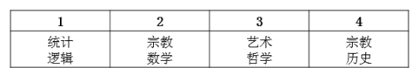

与题干条件不矛盾，那么宗教可以在第2天。

如果安排如下：

与题干条件不矛盾，那么宗教可以在第3天。

因此宗教安排在任意一天都是可能的。

故正确答案为B。

---

### 第 3 题　qid 2133648 · 类比推理

以下哪门课程不能开设两次？

- **A**. 哲学
- **B**. 逻辑
- **C**. 统计　✅
- **D**. 历史

**答案**：C

**官方解析**

第一步：分析题干。

（1）艺术至少有一次安排在第3天

（2）数学只能安排在逻辑的次日

（3）第1天或第2天至少有一天为统计

（4）哲学与数学或哲学与艺术安排在同一天

（5）开设2次的课程不在同一天，也不在第3天，其中一次安排在第4天

第二步：根据题干条件分析选项。

对于条件（3），有两种不同的理解方式。第一种是指统计只能出现在第1天和第2天，不能出现在第3天和第4天。如果按此理解，结合条件（5），出现2次的课程一定要在第4天出现一次，那么可得统计不能上两次课。

其他三项均可出现两次，排列如下：

故正确答案为C。

注：对于条件（3），有些人有第二种理解方式，即统计除了必须出现在第1天或第2天以外，也可以在第3天和第4天出现。如果按照这种理解统计也可以安排两次，如下：

此时没有正确答案，故只能按第一种方式来理解。

若对条件（4）的理解有疑问，详细解析可见第106题备注。

---

### 第 4 题　qid 2133650 · 类比推理

逻辑课程不能排在第几天？

- **A**. 第1天
- **B**. 第2天　✅
- **C**. 第3天
- **D**. 第4天

**答案**：B

**官方解析**

第一步：分析题干。

（1）艺术至少有一次安排在第3天

（2）数学只能安排在逻辑的次日

（3）第1天或第2天至少有一天为统计

（4）哲学与数学或哲学与艺术安排在同一天

（5）开设2次的课程不在同一天，也不在第3天，其中一次安排在第4天

第二步：根据题干条件分析选项。

根据条件（2）（4），数学只能安排在逻辑的次日，哲学与数学或哲学与艺术安排在同一天，如果逻辑安排在第2天，那么数学和艺术均安排在第3天，与条件（4）矛盾，则逻辑不能安排在第2天。

故正确答案为B。

注：题干问的是不可能性，只要有可能的均要排除。

对于逻辑，如果安排如下：

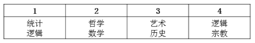

与题干条件不矛盾，那么逻辑可以安排在第1天和第4天。

如果安排如下：

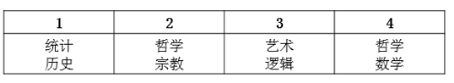

与题干条件不矛盾，那么逻辑可以安排在第3天。

若对条件（4）的理解有疑问，详细解析可见第106题备注。

---

### 第 5 题　qid 2133652 · 类比推理

如果宗教课程开设两次，那么历史课程安排在哪一天？

- **A**. 第1天
- **B**. 第2天
- **C**. 第3天
- **D**. 第4天　✅

**答案**：D

**官方解析**

第一步：分析题干。
（1）艺术至少有一次安排在第3天
（2）数学只能安排在逻辑的次日
（3）第1天或第2天至少有一天为统计
（4）哲学与数学或哲学与艺术安排在同一天
（5）开设2次的课程不在同一天，也不在第3天，其中一次安排在第4天
第二步：根据题干条件分析选项。
根据条件（1），艺术安排在第3天，根据条件（5），开设的课程必须有一次安排在第4天，那么宗教必须有一次安排在第4天，根据条件（2），数学只能安排在逻辑之后，而宗教开设2次，那么逻辑和数学只能开设1次，因此逻辑不能安排在第4天；假设逻辑安排在第3天，根据条件（2），数学安排在第4天，那么哲学与艺术和数学均无法安排在同一天，与条件（4）矛盾。假设逻辑安排在第2天，数学安排在第3天，那么数学和艺术安排在同一天，同样与条件（4）矛盾。那么逻辑只能安排在第1天，数学只能安排在第2天，根据条件（3）（5），第1天和第2天必须还要安排宗教和统计，因此历史只能安排在第4天。
故正确答案为D。

---

### 第 6 题　qid 2133614 · 图形推理

从所给的四个选项中，选出最合适的一个填入问号处，使之呈现一定的规律性：

- **A**. A
- **B**. B
- **C**. C　✅
- **D**. D

**答案**：C

**官方解析**

元素组成不同，无明显属性规律，考虑数量规律。题干每幅图均存在线线相交，优先考虑数交点，分别为6、8、6、6、13、？，并无明显规律。题干每幅图都有圆与直线相交叉，考虑曲直交点，分别是2、4、2、3、6、？，并无明显规律。再次观察发现每幅图都有圆，圆分内外，即可以分别数圆内外的交点，圆内部的交点分别为0、1、2、3、4、？，故？处应选择一个圆内部有5个交点的图形，A项是4个，B项是2个，C项是5个，D项是8个，只有C项符合。
故正确答案为C。

---

### 第 7 题　qid 2133622 · 图形推理

从所给的四个选项中，选出最合适的一个填入问号处，使之呈现一定的规律性：

- **A**. A
- **B**. B
- **C**. C
- **D**. D　✅

**答案**：D

**官方解析**

观察题干图形发现，每一幅图形都有两个图形组成，并且每幅图形中都有圆，进一步观察发现，题干图形间关系分别是：相交、相切、相交、相切、相交、？，故？处应选择一个相切的图形，只有D项符合。
故正确答案为D。

---

### 第 8 题　qid 2133630 · 图形推理

从所给的四个选项中，选出最合适的一个填入问号处，使之呈现一定的规律性：

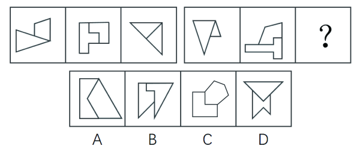

- **A**. A
- **B**. B
- **C**. C
- **D**. D　✅

**答案**：D

**官方解析**

解析一：观察图形发现，每幅图都由两个图形组成，且分开看两图形均为轴对称图形。如下图所示，将所有图形的对称轴分别画出来后发现，第一组图的对称轴分别是平行（形成夹角为）、相交形成夹角、相交形成夹角；第二组图也分别是平行（形成夹角为）、相交形成夹角、？，故？处应选择一个两图对称轴相交形成夹角的图形，只有D项符合。

故正确答案为D。

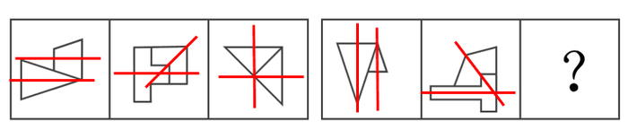

解析二：元素组成不同考虑数量规律，第一组图形交点数量依次为6、10、4，6+4=10；第二组图形交点数依次为5、11、？，因此？处填一个6个交点数的图形，只有A项符合。

本题粉笔倾向于解析一，考查对称性。因为从图形特征上来看，数点特征不明显，此次国考图形题中已有题目考察点数量，再考点数量可能性不大。而对称性是国考高频考点，且图形中出现了等腰三角形、等腰梯形，存在对称性的特征图，本题也是对称性这一考点的创新考法，同学需重点注意。

---

### 第 9 题　qid 2133636 · 图形推理

从所给的四个选项中，选出最合适的一个填入问号处，使之呈现一定的规律性：

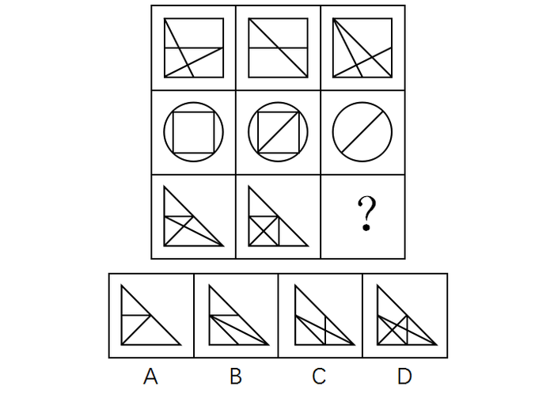

- **A**. A
- **B**. B
- **C**. C　✅
- **D**. D

**答案**：C

**官方解析**

图形组成相似，优先考虑样式规律。九宫格中优先横向看。第一行中，图一和图二外框不变，内部线条去同存异得到图三；经验证，第二行也满足此规律；第三行，应用此规律，外框不变，内部线条去同存异，因此？处应该选择C项。
故正确答案为C。
注：有同学可能数面数量，按数列相加，每列面数量总和为16，因此问号处填有8个面的图形，选D，这也是一种规律。但本题粉笔倾向于考查样式规律中的加减同异，因为从图形特征上看，每行元素组成相似非常明显，历年真题中满足这种特征的题目，考查样式规律的概率更高，因此优先考虑样式规律，故粉笔倾向于选C。

---

### 第 10 题　qid 2133640 · 图形推理

左图给定的是正方体纸盒的外表面，下面哪一项能由它折叠而成？

- **A**. A
- **B**. B
- **C**. C
- **D**. D　✅

**答案**：D

**官方解析**

本题属于空间重构类，将六个面分别标记a-f，其中面a、b、f相同，面c、e相同。

逐一分析选项： 

A项：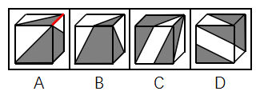

选项侧面是面c或面e。在选项中，侧面中小白三角形长直角边挨着的是黑色三角形，但如上图所示，无论是哪一种情况，展开图中面c或面e的小白三角形的长直角边都挨着白色三角形，相邻关系不一致，排除；

B项：选项上方的面在展开图中没有出现，排除；

C项：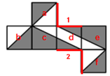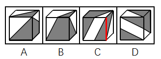

选项正面是面d，如上图所示，选项中面d右侧的黑色小三角形的长直角边挨着黑色大三角形，而展开图中面d的两个黑三角形的长直角边，无论是边1还是边2（如上图所示），都没挨着黑色大三角形，相邻关系不一致，排除。

D项：可以由面a、面d和面e组成，也可以由面c、面d和面f组成，两种情况都可以，当选。

故正确答案为D。

---

### 第 11 题　qid 2133642 · 图形推理

下面四个立体图形中，哪一项<b>不能</b>用一个平面分割为两个完全相同或互为镜像的部分？

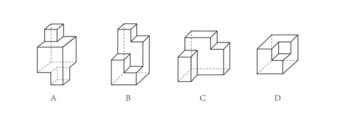

- **A**. A
- **B**. B　✅
- **C**. C
- **D**. D

**答案**：B

**官方解析**

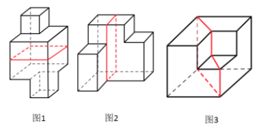

A项：如图1所示，沿着中间横向方向，进行切割，可以切成两个完全相同的部分，排除；

B项：由于各个部分高低不同，无法切出两个完全相同或互为镜像的部分，当选；

C项：如图2所示，沿着立体图形，从上到下竖直方向进行切割，可以切成两个完全相同或互为镜像的部分，排除；

D项：如图3所示，沿着中间对角线方向进行切割，可以切成两个互为镜像的部分，排除。

本题为选非题，故正确答案为B。

---

### 第 12 题　qid 2133602 · 图形推理

左图为给定的多面体，从任一角度观看，下面哪一项<b>不可能</b>是该多面体的视图？

- **A**. A
- **B**. B
- **C**. C
- **D**. D　✅

**答案**：D

**官方解析**

本题考查三视图。

A项，从前往后观看，可以看到，为主视图，排除；

B项，从下往上观看，可以看到，为仰视图，排除；

C项，从右往左观看，可以看到，为右视图，排除；

D项，无法得到。

本题为选非题，故正确答案为D。

---

### 第 13 题　qid 2133606 · 图形推理

把下面的六个图形分为两类，使每一类图形都有各自的共同特征或规律，分类正确的一项是：

- **A**. ①②⑥，③④⑤　✅
- **B**. ①③④，②⑤⑥
- **C**. ①④⑤，②③⑥
- **D**. ①④⑥，②③⑤

**答案**：A

**官方解析**

本题为分组分类题目。观察发现，题干图形出现多个封闭面连在一起，考虑图形间关系。图①②⑥中图形之间通过公共边连接，图③④⑤中图形之间通过点连接。即图①②⑥一组，图③④⑤一组。
故正确答案为A。

---

### 第 14 题　qid 2133620 · 图形推理

把下面的六个图形分为两类，使每一类图形都有各自的共同特征或规律，分类正确的一项是：

- **A**. ①②⑥，③④⑤
- **B**. ①②⑤，③④⑥　✅
- **C**. ①②③，④⑤⑥
- **D**. ①③⑤，②④⑥

**答案**：B

**官方解析**

本题为分组分类题目。图形元素组成不同，无明显属性规律，考虑数量规律。观察发现，图①为“日”字的变形图，图⑤为多圆相交，考虑笔画数。图①②⑤的奇点数都是2，为一笔画图形，图③④⑥的奇点数都是4，为两笔画图形。即图①②⑤一组，图③④⑥一组。
故正确答案为B。

---

### 第 15 题　qid 2133634 · 图形推理

把下面的六个图形分为两类，使每一类图形都有各自的共同特征或规律，分类正确的一项是：

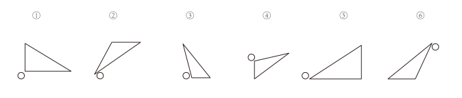

- **A**. ①③④，②⑤⑥　✅
- **B**. ①③⑥，②④⑤
- **C**. ①②③，④⑤⑥
- **D**. ①③⑤，②④⑥

**答案**：A

**官方解析**

本题为分组分类题目。观察发现每个图形都由一个小白球和一个三角形组成，考虑功能元素。功能元素具有标记位置的作用，每个小白球都挨着三角形的一个角，观察发现，①③④中小白球挨着的是三角形中最大的角，②⑤⑥中小白球挨着的是三角形中最小的角。即①③④一组，②⑤⑥一组。
故正确答案为A。

---

### 第 16 题　qid 2133662 · 定义判断

伦理信用是指人们交往中由一定的预先约定、契约、承诺、誓言等引发的一种伦理关系，其蕴涵的合理秩序则凝结为遵守诺言、履行约定的道德准则，人们基于对信用伦理关系合理秩序的理解和规则的践行便形成了相应的道德品行。
根据上述定义，下列涉及伦理信用的是：

- **A**. 陈某看到一群人在围殴邻居的孩子，他一边报警，一边跑上前去大声喝止
- **B**. 赵某答应了丈夫的临终请求，在丈夫去世后，对丈夫前妻留下的两个孩子视如己出，将他们抚养成人　✅
- **C**. 王某父亲曾借给张某10万元，王父去世后，王某要求张某还钱
- **D**. 李某家乡发生洪涝灾害，不少农民颗粒无收，父亲要求他发动其公司员工和微信圈朋友捐钱捐物

**答案**：B

**官方解析**

第一步：找出定义关键词。
“由一定的预先约定、契约、承诺、誓言等引发的一种伦理关系”、“遵守诺言、履行约定的道德准则”。
第二步：逐一分析选项。
A项：陈某喝止围殴孩子的人，不属于“预先约定、契约、承诺、誓言”，也不属于“遵守诺言、履行约定的道德准则”，不符合定义，排除； 
B项：赵某答应了丈夫的临终请求，属于“预先约定、契约、承诺、誓言”，对丈夫前妻留下的两个孩子视如己出，抚养成人，属于“遵守诺言、履行约定”，符合定义，当选；
C项：王某要求张某还钱，没有提到张某是否还钱，没有涉及道德准则，不符合定义，排除；
D项：父亲要求李某发动其公司员工和微信圈朋友给灾民捐钱捐物，不属于“预先约定、契约、承诺、誓言”，也不属于“遵守诺言、履行约定的道德准则”，并且选项并未明确说到李某是否这样做了，不符合定义，排除。
故正确答案为B。

---

### 第 17 题　qid 2133666 · 定义判断

定向调控指政府针对不同调控领域，制定清晰明确的调控政策，使调控更具针对性。相机调控指政府根据市场情况和各项调节措施的特点，灵活决定当前应采取哪一种或几种政策措施，重在“预调、微调”。定向调控是“做什么”，相机调控是“怎么做”。
根据上述定义，下列属于相机调控的是：

- **A**. 甲国政府于年初提出了经济增长率和就业水平的“下限”、物价涨幅的“上限”等工作目标
- **B**. 乙国政府提出“双引擎”策略：一是对小微企业、“三农”等市场主体“减负”；二是支持公共产品、公共服务建设，拉动投资。由各地制定具体措施
- **C**. 丙国政府根据一二三四线城市房地产市场的不同特点，制定了有针对性的契税、房贷政策　✅
- **D**. 丁国政府实行产品和服务的生产及销售完全由自由市场的自由价格机制所引导、产权明晰的经济政策

**答案**：C

**官方解析**

第一步：找出定义关键词。
定向调控：“政府针对不同调控领域”、“制定清晰明确的调控政策，使调控更具针对性”、“做什么”；
相机调控：“政府根据市场情况和各项调节措施的特点”、“灵活决定当前应采取哪一种或几种政策措施”、“预调、微调”、“怎么做”。
第二步：逐一分析选项。
A项：甲国政府提出的工作目标属于清晰明确的调控政策，是属于“做什么”而非“怎么做”，符合“定向调控”定义，不符合“相机调控”定义，排除； 
B项：乙国政府的“双引擎”策略涉及了小微企业、“三农”、公共产品等不同调控领域，“制定清晰明确的调控政策，使调控更具针对性”，符合“定向调控”定义，不符合“相机调控”定义，排除；
C项：丙国政府根据不同城市房地产市场的不同特点制定政策，符合“政府根据市场情况和各项调节措施的特点”、“灵活决定当前应采取哪一种或几种政策措施”，符合“相机调控”定义，当选；
D项：“完全由自由市场的自由价格机制所引导”说明没有涉及政府调控，不符合任何一个定义，排除。
故正确答案为C。
注——本题出处如下：
定向调控和相机调控是2016年《政府工作报告》出现的词汇，指为应对持续加大的经济下行压力，政府在区间调控基础上，实施定向调控和相机调控。
“相机调控”强调政府要根据市场情况和各项调节措施的特点，灵活机动地决定和选择当前究竟应采取哪一种或哪几种政策措施。所以说相机调控很重要的就是要“预调、微调”。对于不同的地区和不同的产业，政府出台的政策应该是有差别的。例如房地产市场就出现了分化现象，政府根据一二三四线城市房地产市场的不同特点，制定了有针对性的契税房贷政策。
定向调控的要求，财政加大对“三农”、小微企业、服务业、新兴产业等实体经济关键领域和薄弱环节的支持力度，并完善机制，防范化解债务风险；货币政策方面，实施定向降准，运用信贷政策支持再贷款，运用抵押补充贷款工具，着力推动解决企业融资成本高问题。

---

### 第 18 题　qid 2133672 · 定义判断

法律的当然解释是指法律虽然没有明确规定某一事项，但依规范目的，该事项应当被解释为适用这一法律规定。其解释方法有举重以明轻和举轻以明重。前者是指对于某一应当被允许的行为，举一个情节比其严重而被允许的规定，以说明其应当被允许。后者是指对于某一应当被禁止的行为，举一个情节比其轻微而被禁止的规定，以说明其应当被禁止。
根据上述定义，下列判断正确的是：

- **A**. 法律规定禁止在公园采摘树叶，依据举轻以明重，在公园攀折树枝的行为应当被禁止　✅
- **B**. 唐律规定主人打死夜无故入人家者无罪，依据举轻以明重，主人打伤夜无故入人家者无罪
- **C**. 法律规定禁止携带小型动物，依据举重以明轻，携带大型动物的行为应当被禁止
- **D**. 法律规定16周岁以下的未成年人不承担刑事责任，依据举重以明轻，15周岁的未成年人不承担刑事责任

**答案**：A

**官方解析**

第一步：找出定义关键词。
举重以明轻：“对于某一应当被允许的行为”、“举一个情节比其严重而被允许的规定”；
举轻以明重：“对于某一应当被禁止的行为”、“举一个情节比其轻微而被禁止的规定”。
第二步：逐一分析选项。
A项：“公园攀折树枝的行为”属于“某一应当被禁止的行为”，因为攀折树枝比采摘树叶更为严重，所以“法律规定禁止在公园采摘树叶”属于“举一个情节比其轻微而被禁止的规定”，符合“举轻以明重”的定义，当选； 
B项：“打死夜无故入人家者无罪”属于“某一应当被允许的行为”，不属于“某一应当被禁止的行为”，不符合“举轻以明重”的定义，排除；
C项：“携带大型动物的行为”属于“某一应当被禁止的行为”，法律规定禁止携带小型动物属于“举一个情节比其轻微而被禁止的规定”，符合“举轻以明重”，不符合“举重以明轻”的定义，排除；
D项：15周岁的未成年人本来就属于法律规定的“16周岁以下的未成年人”，不符合“举重以明轻”的定义，排除。
故正确答案为A。

---

### 第 19 题　qid 2133674 · 定义判断

系统脱敏法是一种心理治疗法，当患者面前出现引起焦虑和恐惧的刺激物时，引导患者放松，使患者逐渐消除焦虑与恐惧，不再对该刺激物产生病理性反应。它包括快速脱敏法和接触脱敏法等。前者是治疗者陪伴病人置身于令病人感到恐惧的情景，直到病人不再紧张为止。后者是通过示范，让病人逐渐与所惧怕的对象接触，最终达到克服恐惧的目的。
根据上述定义，如果要治疗一名特别害怕蛇的孩子，下列治疗方法中属于接触脱敏法的是：

- **A**. 让孩子旁观别人触摸、拿起和放下蛇的过程后，再慢慢让孩子逐渐接近和触摸蛇　✅
- **B**. 带孩子去室内蛇类养殖场，看各种不同种类的蛇，看多了自然就不再害怕了
- **C**. 给孩子讲有关蛇的有趣的童话故事，引发孩子开心的情绪，逐渐减少对蛇的恐惧
- **D**. 录下孩子看见蛇后恐惧害怕的表情和动作，然后一遍又一遍地把这些视频放给孩子看

**答案**：A

**官方解析**

第一步：找出定义关键词。
“通过示范，让病人逐渐与所惧怕的对象接触”、“最终达到克服恐惧的目的” 。
第二步：逐一分析选项。
A项：让孩子旁观别人触摸、拿起和放下蛇，符合“示范接触孩子所恐惧的对象”，再慢慢让孩子逐渐接触和触摸蛇，符合“让病人逐渐与所惧怕的对象接触”，最终克服恐惧，符合定义，当选； 
B项：带孩子去室内蛇类养殖场看各种不同的蛇，没有体现示范与蛇的接触，不符合定义，排除；
C项：给孩子讲有关蛇的童话故事，既没有体现示范与蛇的接触，也没有体现让孩子直接接触所惧怕的对象，不符合定义，排除；
D项：录下孩子看见蛇后恐惧害怕的表情和动作，放给孩子看，给孩子看的是视频而不是真的蛇，没有体现通过示范，让孩子与蛇接触，不符合定义，排除。
故正确答案为A。

---

### 第 20 题　qid 2133676 · 定义判断

独立证明法和归谬法是间接论证的两种方法，其中独立证明法是通过证明与被反驳命题相矛盾的命题为真，从而确定被反驳命题为假的方法。归谬法就是由所要反驳的命题为真，引出荒谬的结论，从而证明所要反驳的命题为假。
根据上述定义，下列论证中使用了独立证明法的是：

- **A**. 
甲：人类是由猿猴进化而来的。

乙：不可能！有哪一个人见过，哪一只猴子变成了人？

- **B**. 
甲：天不生仲尼，万古如长夜。

乙：难道仲尼以前的人都生活在黑暗之中？

- **C**. 
甲：人性本恶。

乙：如果真的人性本恶，那么道德规范又从何而来呢？

- **D**. 
甲：温饱是谈道德的先决条件。

乙：温饱绝不是谈道德的先决条件。古往今来，没有解决衣食之困的社会也在谈道德。
　✅

**答案**：D

**官方解析**

第一步：找出定义关键词。
独立证明法：“证明与被反驳命题相矛盾的命题为真”、“确定被反驳命题为假” ；
归谬法：“由所要反驳的命题为真，引出荒谬的结论”、“从而证明所要反驳的命题为假”。
第二步：逐一分析选项。
A项：甲说人类是由猿猴进化而来，乙说的“有哪一个人见过哪一只猴子变成了人”是从肯定所要反驳的命题为真而引出了一个荒谬的结论，没有猴子变成了人，属于归谬法，不符合定义，排除； 
B项：甲说的“天不生仲尼，万古如长夜”意指孔子没有诞生的话，中国人的文化史将如漫漫长夜一般黑暗，其矛盾命题应该是：孔子没诞生的话，中国人的文化史也不会像漫漫长夜一般黑暗。乙说的“难道仲尼以前的人都生活在黑暗中？”讨论的并不是文化史而是人们的生活，和甲说的话题不一致，不是甲所说的矛盾命题，不符合定义，排除；
C项：乙说的“人性本恶”属于肯定所要反驳的命题为真，从而得到“道德规范从何而来”这样一个荒谬的结论，属于归谬法，不符合定义，排除；
D项：乙说的“温饱不是谈道德的先决条件”是甲说的“温饱是谈道德的先决条件”的矛盾命题，“古往今来，没有解决衣食之困的社会也在谈道德”证明了“温饱不是谈道德的先决条件”命题为真，属于通过证明与被反驳命题相矛盾的命题为真，从而确定被反驳命题为假的方法，符合定义，当选。
故正确答案为D。

---

### 第 21 题　qid 2133654 · 定义判断

符号现象是指表意上没有相关性的甲乙两事物，当我们用甲事物代表乙事物时，甲事物就可以视为乙事物的符号。
根据上述定义，下列不属于符号现象的是：

- **A**. 消防车的警笛声
- **B**. 医疗机构使用的十字标记
- **C**. 法院大门上雕刻的天平图案　✅
- **D**. 体育比赛裁判员的哨声

**答案**：C

**官方解析**

第一步：找出定义关键词。
“甲乙两事物表意上没有相关性”、“用甲事物代表乙事物时，甲可以视为乙的符号” 。
第二步：逐一分析选项。
A项：消防车是用来救火的，警笛声是用来警示的，两者没有相关性，但是当警笛声用在消防车上的时候，表示的是救火，可以视其为消防车的符号，符合定义，排除；
B项：十字标记本身没有实际意义，所以和医疗机构没有相关性，但是用十字标记代表医疗机构时，可以视为其符号，符合定义，排除；
C项：法院和天平两者都有公平、公正、不倾斜的意思，两者表意上相关，不符合题干关键词“甲乙两事物表意上没有相关性”，不符合定义，当选；
D项：哨声就是一种声音，本身没有实际意义，和体育比赛裁判没有相关性，但当哨声用在体育比赛中的时候，裁判要做出相应的判罚，可以视其为裁判员的符号，符合定义，排除。
本题为选非题，故正确答案为C。

---

### 第 22 题　qid 2133658 · 定义判断

人耳对一个声音的感受性会因另一个声音的存在而发生改变。一个声音能被人耳听到的最低值会因另一声音的出现而提高，这种现象就是听觉掩蔽。
根据上述定义，下列符合听觉掩蔽的是：

- **A**. 吵闹的课间，老师得大声说话，同学们才能听到　✅
- **B**. 长时间戴耳机听音乐，会觉得听到的音量逐渐变小
- **C**. 人类无法听到蝙蝠等动物发出来的超声波
- **D**. 安静的房间内，我们能够听到闹钟“滴答”的声音

**答案**：A

**官方解析**

第一步：找出定义关键词。
“人耳对一个声音的感受性会因另一个声音的存在而发生改变”、“被人耳听到的最低值会因另一个声音的出现而提高”。
第二步：逐一分析选项。
A项：吵闹的课间老师得大声说话才能被听到，对于老师的话来说，吵闹的课间是另一个声音，符合“人耳对一个声音的感受性会因另一个声音的存在而发生改变”，老师大声说话才能被听到符合“被人耳听到的最低值会因另一个声音的出现而提高”，符合定义，当选； 
B项：长时间戴耳机听音乐，音量逐渐变小，不存在另一个声音的存在对其产生影响，不符合定义，排除；
C项：无法听到超声波，不存在另一个声音的存在对其产生影响，也不符合最低值的提高，不符合定义，排除；
D项：听到闹钟“滴答”的声音，不存在另一个声音的存在对其产生影响，也不符合最低值的提高，不符合定义，排除。
故正确答案为A。

---

### 第 23 题　qid 2133664 · 定义判断

异质型人力资本是指某个特定历史阶段中具有边际收益递增生产力形态的人力资本，表现为拥有者所具有的独特能力，这些能力主要包括：综合协调能力、判断决策能力、学习创新能力和承担风险能力等。
根据上述定义，下列不涉及异质型人力资本的是：

- **A**. 某厂长期亏损，李某担任厂长后施行了大刀阔斧的改革，很快使工厂扭亏为盈
- **B**. 技术员陈某潜心钻研技术，他将人们认为不太可能整合的两种技术巧妙结合在一起，大大降低了生产成本
- **C**. 某包装厂效益平平，设计师王某应聘到该厂后，由于他的设计新颖、风格清新，一下子使该厂的包装产品畅销起来
- **D**. 某厂聘请某院士担任技术顾问，一大批风险投资公司慕名而来，一些高学历人才也陆续加盟　✅

**答案**：D

**官方解析**

第一步：找出定义关键词。
“拥有者所具有的独特能力”、“综合协调能力、判断决策能力、学习创新能力和承担风险能力”。
第二步：逐一分析选项。
A项：厂长李某大刀阔斧的改革，符合独特能力中的判断决策能力，符合定义，排除； 
B项：技术员陈某将人们认为不太可能整合的两种技术结合在一起，符合独特能力中的学习创新能力和综合协调能力，符合定义，排除；
C项：设计师王某设计新颖，符合独特能力中的学习创新能力，符合定义，排除；
D项：院士担任技术顾问，风投公司慕名而来，高学历人才加盟，均为院士被聘请后产生的效果，而没有阐述院士的独特能力，不符合定义，当选。
本题为选非题，故正确答案为D。

---

### 第 24 题　qid 2133668 · 定义判断

数客互动管理是指通过先进的电子通讯和网络手段，达到企业与目标客户群之间高效、直接、自主、往复的沟通，从而满足客户的个性化需要。
根据上述定义，下列属于数客互动管理的是：

- **A**. 某市政府在官网设立市长信箱，广泛收集各方面的意见，及时答复群众质询，努力改进政府工作
- **B**. 某玩具公司建立网络交流平台，家长只要将需要的玩具类型、价格、功能等提交给平台，公司就可以及时生产出来　✅
- **C**. 某家具生产企业通过收集网络海量数据，进行市场需求分析，及时调整家具风格
- **D**. 某热水器厂家根据客户提供的信息，定期与客户联系，为客户提供免费检修服务

**答案**：B

**官方解析**

第一步：找出定义关键词。
“先进的电子通讯和网络手段”、“企业与目标客户之间高效、直接、自主、往复的沟通”、“满足客户个性化需求”。
第二步：逐一分析选项。
A项：某市政府设立市长信箱，政府不是企业，不符合企业与客户之间的沟通，不符合定义，排除； 
B项：玩具公司通过建立网络交流平台，让家长可以将玩具需求提交，在企业和客户之间产生沟通，从而生产出满足家长个性化需求的玩具，符合定义，当选；
C项：家具生产企业收集数据分析市场，没有体现企业与目标客户之间的沟通，不符合定义，排除；
D项：热水器厂家定期与客户联系提供检修服务，单一的免费检修服务没有体现满足客户个性化需求，不符合定义，排除。
故正确答案为B。

---

### 第 25 题　qid 2133660 · 定义判断

蜂鸣式营销是一种通过向潜在消费者直接提供企业产品或服务，使其获得产品或服务体验的销售方式。根据上述定义，下列不属于蜂鸣式营销的是：

- **A**. 某软件公司在网上推出一款试用版软件，用户可免费试用三个月
- **B**. 某公司聘请演员在各大城市繁华地区扮演情侣，邀请可能成为目标客户的路人为他们拍照，借机向其宣传新款相机的功能
- **C**. 某企业定期向用户发送邮件，寄送产品杂志，推送优惠信息，并承诺购买产品一个月内不满意可以无条件退货　✅
- **D**. 某饮料公司让营销人员频频出现在街道、咖啡馆、酒吧、超市等场所，请路人品尝不同口味的饮料来宣传自己的品牌

**答案**：C

**官方解析**

第一步：找出定义关键词。
“向潜在消费者直接提供企业产品或服务”、“使其获得产品或服务体验的销售方式”。
第二步：逐一分析选项。
A项：在网上推出试用版软件，符合“向潜在消费者直接提供企业服务”，“使其获得产品或服务体验的销售方式”，符合定义，排除； 
B项：邀请可能成为目标的路人拍照，借机宣传，符合“向潜在消费者直接提供企业产品”，“使其获得产品或服务体验的销售方式”，符合定义，排除；
C项：寄送产品杂志，推送优惠信息，并没有直接提供企业产品，不符合“向潜在消费者直接提供企业产品”，承诺购买产品一个月内不满意可以无条件退货，说的是买了之后怎么样，不符合体验产品或服务，不符合定义，当选；
D项：请路人品尝不同口味的饮料来宣传品牌，符合“向潜在消费者直接提供企业产品”，“使其获得产品或服务体验的销售方式”，符合定义，排除。
本题为选非题，故正确答案为C。

---

### 第 26 题　qid 2133682 · 类比推理

法律：法盲

- **A**. 文字：文盲　✅
- **B**. 雪地：雪盲
- **C**. 地图：路盲
- **D**. 黑暗：夜盲

**答案**：A

**官方解析**

第一步：判断题干词语间的逻辑关系。
法盲是指已成年不懂法律的人，二者是对应关系。
第二步：判断选项词语间的逻辑关系。
A项：文盲是指已成年的不懂文字的人，与题干逻辑关系一致，当选；
B项：雪盲是一种由于眼睛未加保护而暴露于冰雪原野反射的紫外线所引起的畏光及炎症，并不是缺乏雪地或无法识别雪地的人，与题干逻辑关系不一致，排除；
C项：路盲是指没有方向感或者方向感差的人，并不是指无法识别地图的人，与题干逻辑关系不一致，排除；
D项：夜盲是指夜间或白天在黑暗处不能视物或视物不清，对弱光敏感度下降，暗适应时间延长的重症表现，并不是无法识别黑暗的人，与题干逻辑关系不一致，排除。
故正确答案为A。

---

### 第 27 题　qid 2133686 · 类比推理

众人拾柴：火焰高

- **A**. 多行不义：必自毙　✅
- **B**. 打破沙锅：问到底
- **C**. 敬酒不吃：吃罚酒
- **D**. 四海之内：皆兄弟

**答案**：A

**官方解析**

第一步：判断题干词语间的逻辑关系。
众人拾柴火焰高的意思是众多人都往燃烧的火里添柴，火焰就必然很高，火焰高是众人拾柴的结果，二者是因果关系。
第二步：判断选项词语间的逻辑关系。
A项：多行不义必自毙的意思是不义的事情干多了，必然会自取灭亡，必自毙是多行不义的结果，二者是因果关系，与题干逻辑关系一致，当选；
B项：打破沙锅问到底是指打破沙锅，纹路会一直延伸到底部，比喻追究事情的根底，问到底并不是打破沙锅的结果，与题干逻辑关系不一致，排除；
C项：敬酒不吃吃罚酒意思是敬你的酒不喝，偏要喝罚你的酒，比喻不识抬举、不知好歹，吃罚酒并不是敬酒不吃的结果，与题干逻辑关系不一致，排除；
D项：四海之内皆兄弟的意思是全国的人民都像兄弟一样，皆兄弟并不是四海之内的结果，与题干逻辑关系不一致，排除。
故正确答案为A。

---

### 第 28 题　qid 2133690 · 类比推理

羔羊跪乳：乌鸦反哺

- **A**. 昙花一现：惊鸿一瞥
- **B**. 魂不附体：失魂落魄　✅
- **C**. 锋芒毕露：锐不可当
- **D**. 朽木难雕：孺子可教

**答案**：B

**官方解析**

第一步：判断题干词语间的逻辑关系。
羔羊跪乳和乌鸦反哺出自古训《增广贤文》，原文是“羊有跪乳之恩，鸦有反哺之义”。羔羊跪乳和乌鸦反哺都有感恩父母、奉养长辈的意思，二者是近义关系。
第二步：判断选项词语间的逻辑关系。
A项：昙花一现指美好的事物出现的时间很短，惊鸿一瞥的意思是人只是匆匆看了一眼，却给人留下强烈、深刻的印象，常用来形容身形轻盈娇艳的女子摄人心魄的目光，二者不是近义关系，与题干逻辑关系不一致，排除；
B项：魂不附体的意思是灵魂离开了身体，形容极端惊慌，失魂落魄的意思是魂魄离开了身体，也是形容惊慌忧虑，二者是近义关系，与题干逻辑关系一致，当选；
C项：锋芒毕露的意思是刀锋和矛尖都露出来，比喻锐气和才干全都显露、透露出来，锐不可当形容勇往直前的气势不可抵挡，二者不是近义关系，与题干逻辑关系不一致，排除；
D项：朽木难雕是指腐烂的木头很难雕刻，人不可造就或事情无法挽救，孺子可教本义为小孩子是可以教诲的，后形容年轻人有培养前途，二者是反义关系，与题干逻辑关系不一致，排除。
故正确答案为B。

---

### 第 29 题　qid 2133696 · 类比推理

花椒：麻

- **A**. 月亮：圆
- **B**. 水泥：硬
- **C**. 饮料：冷
- **D**. 火焰：热　✅

**答案**：D

**官方解析**

第一步：判断题干词语间的逻辑关系。
花椒呈麻味（花椒中含有花椒麻素，该成分呈麻味），麻是花椒的属性，且二者是必然属性。
第二步：判断选项词语间的逻辑关系。
A项：月球虽然是球体，但月亮是月球反射太阳光后在地球呈现的形状，随着月亮每天在星空中自西向东移动一大段距离，它的形状也在不断地变化着，圆是月亮的属性，但不是月亮的必然属性，与题干逻辑关系不一致，排除；
B项：水泥是粉状材料，加水搅拌后成一种可塑性的浆体，随着时间推移才会慢慢硬化，硬是水泥的属性，但不是水泥的必然属性，与题干逻辑关系不一致，排除；
C项：饮料是经加工制成的适于供人或牲畜饮用的液体，有的饮料是冷的，但有的饮料不是冷的，冷不是饮料的必然属性，与题干逻辑关系不一致，排除；
D项：火焰是燃料和空气混合后迅速转变为燃烧产物的化学过程中出现的可见光或其他的物理表现形式，散发出光和热，温度很高，热是火焰的属性，且二者是必然属性，与题干逻辑关系一致，当选。
故正确答案为D。

---

### 第 30 题　qid 2133700 · 类比推理

蛋：卤蛋：松花蛋

- **A**. 豆：红豆：四季豆
- **B**. 油：牛油：植物油
- **C**. 瓜：丝瓜：白兰瓜
- **D**. 茶：白茶：乌龙茶　✅

**答案**：D

**官方解析**

第一步：判断题干词语间的逻辑关系。
卤蛋是用各种调料或肉汁加工成的熟制蛋，松花蛋即皮蛋，是用生石灰、食盐、黏土等包裹在蛋壳外腌制而成，卤蛋和松花蛋都是人工制作而成，二者是并列关系，且二者都是蛋的一种。
第二步：判断选项词语间的逻辑关系。
A项：红豆是一种豆科植物，四季豆也是一种豆科植物，二者是并列关系，且都是豆的一种，但并不是人工制作而成，与题干逻辑关系不一致，排除；
B项：牛油是指从牛奶中提炼出的脂肪性食品，或指从肥牛肉中取得的脂肪，而植物油是指从植物种子、果实或其他部分所获得的油，牛油和植物油都是人工制作而成，但是牛油属于动物油，动物油与植物油概念层级相同，牛油与植物油概念层级不同，因此，二者不是并列关系，且牛油和植物油即使人工不提取，它也是客观存在的，与题干逻辑关系不一致，排除；
C项：丝瓜是葫芦科丝瓜属植物，白兰瓜又名兰州蜜瓜，二者都是瓜的一种，但并不是人工制作而成，与题干逻辑关系不一致，排除；
D项：白茶是指一种采摘后，不经杀青或揉捻，只经过晒或文火干燥后加工的茶，乌龙茶是经过杀青、萎雕、摇青、半发酵、烘焙等工序后制出的茶，白茶和乌龙茶都是人工制作而成，二者是并列关系，且二者都是茶的一种，与题干逻辑关系一致，当选。
故正确答案为D。

---

### 第 31 题　qid 2133570 · 类比推理

闪电战：战术：突袭

- **A**. 润滑油：机械：减震
- **B**. 戈壁滩：地形：干旱
- **C**. 防空洞：轰炸：隐蔽
- **D**. 斑马线：标记：通过　✅

**答案**：D

**官方解析**

第一步：判断题干词语间的逻辑关系。
闪电战是一种战术，二者为包容关系中的种属关系，闪电战可以用来突袭，二者为功能对应关系。
第二步：判断选项词语间的逻辑关系。
A项：润滑油不是一种机械，与题干逻辑关系不一致，排除；
B项：戈壁滩是一种地形，二者为包容关系中的种属关系，干旱是戈壁滩的属性而非功能，与题干逻辑关系不一致，排除；
C项：防空洞是为了防备敌人空袭而建造，防空洞不是一种轰炸，与题干逻辑关系不一致，排除；
D项：斑马线是一种交通标记，二者为包容关系中的种属关系，斑马线的功能是引导行人通过，二者为功能对应关系，与题干逻辑关系一致，当选。
故正确答案为D。

---

### 第 32 题　qid 2133568 · 类比推理

飞禽走兽：大雁：海鸥

- **A**. 珍馐美馔：山珍：海味
- **B**. 花鸟鱼虫：鹦鹉：画眉
- **C**. 锦衣玉食：蟒袍：霞帔　✅
- **D**. 卧虎藏龙：猛虎：蛟龙

**答案**：C

**官方解析**

第一步：判断题干词语间的逻辑关系。
飞禽走兽泛指鸟类和兽类，飞禽和走兽是并列关系；大雁和海鸥是并列关系，且都是飞禽的一种。
第二步：判断选项词语间的逻辑关系。
A项：珍馐美馔意思为好吃的食物，珍馐和美馔都是指食物；山珍是产自山野的名贵珍稀食品，海味是产自海洋的名贵珍稀食品，山珍和海味是并列关系，但二者都是珍馐美馔的一种，与题干逻辑关系不一致，排除；
B项：花鸟鱼虫是并列关系，鹦鹉和画眉是并列关系，且都是鸟类的一种，与题干逻辑关系不一致，排除；
C项：锦衣玉食指华美的衣服和美食，锦衣和玉食是并列关系；蟒袍和霞帔是并列关系，且都是锦衣的一种，与题干逻辑关系一致，当选；
D项：卧虎藏龙指隐藏着未被发现的人才或隐藏不露的人才，卧虎和藏龙是并列关系；猛虎和蛟龙是并列关系，但是分属于卧虎和藏龙，与题干逻辑关系不一致，排除。
故正确答案为C。

---

### 第 33 题　qid 2133578 · 类比推理

净水器 对于（       ）相当于（       ）对于 汽缸

- **A**. 滤芯；蒸汽机　✅
- **B**. 设备；元件
- **C**. 家庭；发动机
- **D**. 自来水；活塞

**答案**：A

**官方解析**

逐一代入选项。
A项：滤芯是净水器的组成部分，汽缸是蒸汽机的组成部分，前后逻辑关系一致，当选；
B项：净水器是一种净水设备，二者为包容关系中的种属关系，汽缸是一种气动元件，二者为包容关系中的种属关系，但汽缸和元件的位置反了，前后逻辑关系不一致，排除；
C项：净水器可以在家庭使用，汽缸是发动机的组成部分，前后逻辑关系不一致，排除；
D项：净水器可以净化自来水，活塞是汽缸的组成部分，前后逻辑关系不一致，排除。
故正确答案为A。

---

### 第 34 题　qid 2133582 · 类比推理

日记 对于（      ）相当于（      ）对于 数据

- **A**. 纪念；查证
- **B**. 经历；内存　✅
- **C**. 年鉴；计算机
- **D**. 日期；图片

**答案**：B

**官方解析**

逐一代入选项。
A项：日记有纪念的功能，查证与数据之间可以是动宾关系，即查证数据，也可以是对应关系，即通过数据进行查证，但无论哪种关系，都不是功能对应关系，前后逻辑关系不一致，排除；
B项：日记有记录经历的功能，内存有记录CPU中的运算数据的功能，前后逻辑关系一致，当选；
C项：日记和年鉴都有记录内容的功能，功能相似，计算机的功能是处理数据，前后逻辑关系不一致，排除；
D项：日记按照日期来记录，图片和数据没有必然的逻辑关系，前后逻辑关系不一致，排除。
故正确答案为B。

---

### 第 35 题　qid 2133586 · 类比推理

原始部落 对于（              ）相当于（             ） 对于 先进科技

- **A**. 热带丛林；文明古国
- **B**. 边远小镇；创业园区
- **C**. 茹毛饮血；现代都市　✅
- **D**. 钻木取火；宇宙航行

**答案**：C

**官方解析**

逐一代入选项。
A项：原始部落可能生活在热带丛林里，二者是或然对应的关系，文明古国和先进科技没有明显逻辑关系，前后逻辑关系不一致，排除；
B项：原始部落和边远小镇没有明显逻辑关系，创业园区内可能有先进科技，二者为或然对应关系，前后逻辑关系不一致，排除；
C项：原始部落的人生活在茹毛饮血未开化的时代，茹毛饮血是原始部落生活方式的一种体现，现代都市的人生活在充满了先进科技的时代，先进科技是现代都市生活方式的一种体现，前后逻辑关系一致，当选；
D项：钻木取火是原始部落取火的一种方式，先进科技不是宇宙航行的一种方式，前后逻辑关系不一致，排除。
故正确答案为C。

---

### 第 36 题　qid 2133678 · 逻辑判断

扶贫必扶智。让贫困地区的孩子们接受良好教育，是扶贫开发的重要任务，也是阻断贫困代际传递的重要途径。
以上观点的前提是：

- **A**. 贫困的代际传递导致教育的落后
- **B**. 富有阶层大都受过良好教育
- **C**. 扶贫工作难，扶智工作更难
- **D**. 知识改变命运，教育成就财富　✅

**答案**：D

**官方解析**

第一步：找出论点和论据。
论点：扶贫必扶智。
论据：让贫困地区的孩子们接受良好的教育，是扶贫开发的重要任务，也是阻断贫困代际传递的重要途径。
第二步：逐一分析选项。
A项：贫困的代际传递导致教育的落后，该项是在讨论贫困的代际传递会导致什么样的后果，而论点讨论的是解决代际传递的办法，所以话题不一致，无法加强，排除；
B项：富有阶层大都受过良好的教育，那么良好的教育是否是导致他富有的原因，并不清楚，所以无法支持，排除；
C项：该项讨论的是扶智工作比扶贫工作更难，没有提到教育能否阻断贫困的代际传递，无关项，无法加强，排除；
D项：如果知识不能够改变命运，教育不能成就财富，那么教育就不可以让人不贫困，变得富有，补充必要条件，可以加强，当选。
故正确答案为D。

---

### 第 37 题　qid 2133684 · 逻辑判断

有调查显示，部分学生缺乏创造力。研究者认为，具有创造力的孩子在幼年时都比较淘气，而在一些家庭，小孩如果淘气就会被家长严厉呵斥，这导致他们只能乖乖听话，创造力就有所下降。
这项调查最能支持的论断是：

- **A**. 幼年是创造力发展的关键时期
- **B**. 教育方式会影响孩子创造力的发展　✅
- **C**. 幼年听话的孩子长大之后可能缺乏创造力
- **D**. 有些家长对小孩淘气倾向于采取比较严厉的态度

**答案**：B

**官方解析**

第一步：找出论点和论据。
这是一道论证考点下的特殊题型，由于本题问的是题干调查最能支持的论断是哪项，所以应该把整个题干当成是一个论据，需要根据题干找出能够成为论点的选项。
论据：具有创造力的孩子在幼年时都比较淘气，而在一些家庭，小孩子如果淘气就会被家长严厉呵斥，这导致他们只能乖乖听话，创造力就有所下降。
第二步：逐一分析选项。
A项：题干论据讨论的是呵斥这种教育方式会对孩子创造力产生负面影响，但没有提及幼年是创造力发展的“关键时期”，不能成为题干的论点，排除；
B项：题干论据讨论的是呵斥这种教育方式会对孩子创造力产生负面影响，选项说教育方式会影响孩子创造力的发展，是对题干论据的全面总结，说明教育方式和孩子们的创造力之间是有关系的，能成为题干的论点，当选；
C项：题干论据重点想讨论的是孩子们创造力低下与家长教育方式之间的关系，选项没有提及家长的教育方式，不如B项对题干论据总结全面，排除；
D项：家长倾向选择严厉的态度，那么严厉的态度是否会导致创造力低下，并没有明确说明，不能成为题干的论点，不如B项对题干论据总结全面，排除。
故正确答案为B。

---

### 第 38 题　qid 2133692 · 逻辑判断

人们普遍认为，保持乐观心态会促进健康。但一项对7万名50岁左右的女性进行的长达十年的追踪研究发现，长期保持乐观心态的被试者与悲观被试者在死亡率上并没有差异，研究者据此认为，心态乐观与否与健康没有关系。
以下哪项如果为真，最能质疑研究者的结论？

- **A**. 在这项研究的被试者中悲观的人更多患有慢性疾病，虽然尚未严重到致命的程度　✅
- **B**. 与悲观的人相比，乐观的人患病后会更积极主动地治疗
- **C**. 乐观的人往往对身体不会特别关注，有时一些致命性疾病无法及早发现
- **D**. 女性更善于维持和谐的人际关系，而良好的人际关系有助于健康

**答案**：A

**官方解析**

第一步：找出论点和论据。
论点：心态乐观与否与健康没有关系。
论据：长期保持乐观心态的被试者与悲观被试者在死亡率上并没有差异。
论点讨论的是“心态乐观”与“健康”的关系，论据讨论的是“心态乐观”与“死亡率”的关系，二者话题不一致，削弱优先考虑拆桥。
第二步：逐一分析选项。
A项：被试者悲观的人更多患有慢性疾病，虽然尚未严重到致命的程度，说明虽然死亡率无差异，但不等同于是健康的，断开了论据和论点的关系。属于拆桥选项，当选；
B项：乐观的人患病后会更主动积极治疗，该选项不明确。原因有二：①乐观的人和悲观的人是否都会患病不明确；②乐观的人治疗之后是否会健康也不明确。因此该项不能说明心态是否与健康有关，不能削弱，排除；
C项：乐观的人对身体健康不关注，会有一些疾病无法及早发现，但疾病是否及早发现与论点中说的是否得病、是否健康是无关的，该项为无关项，不能削弱，排除；
D项：该项讨论的是女性和健康的关系，而不是心态和健康的关系，无关项，排除。
故正确答案为A。

---

### 第 39 题　qid 2133688 · 逻辑判断

自上世纪50年代以来，全球每年平均爆发的大型龙卷风的次数从10次左右上升至15次。与此同时，人类活动激增，全球气候明显变暖，有人据此认为，气候变暖导致龙卷风爆发次数增加。
以下哪项如果为真，不能削弱上述结论？

- **A**. 龙卷风的类型多样，全球变暖后，小型龙卷风出现的次数并没有明显的变化
- **B**. 气候温暖是龙卷风形成的一个必要条件，几乎所有龙卷风的形成都与当地较高的温度有关　✅
- **C**. 尽管全球变暖，龙卷风依然最多地发生在美国的中西部地区，其他地区的龙卷风现象并不多见
- **D**. 龙卷风是雷暴天气（即伴有雷击和闪电的局地对流性天气）的产物，只要在雷雨天气下出现极强的空气对流，就容易发生龙卷风

**答案**：B

**官方解析**

第一步：找出论点和论据。
论点：气候变暖导致龙卷风爆发次数增加。
论据：自上世纪50年代以来，全球每年平均爆发的大型龙卷风的次数从10次左右上升至15次。与此同时，人类活动激增，全球气候明显变暖。
第二步：逐一分析选项。
A项：该项说的是全球变暖后小型龙卷风出现的次数没有明显变化，而论点说的是气候变暖导致龙卷风爆发次数增加，该项削弱题干的论点，排除；
B项：该项说的是气候温暖是龙卷风形成的一个必要条件，并且龙卷风的形成与较高温度有关。说明全球变暖有助于龙卷风的爆发，可以加强论点，不能削弱，当选；
C项：该项说的是全球变暖，除了美国的中西部地区，其他地区的龙卷风现象并不多见。而题干说的是全球范围的变暖导致了龙卷风次数增加。该选项说有的地方并没有增多，削弱题干论点，排除；
D项：该项说的是雷暴天气也容易导致龙卷风，在几年来气温上升的条件下，如果雷暴天气增多的话那么龙卷风次数增多的原因就不能够确定是气温上升，因此该项为他因削弱，排除。
本题为选非题，故正确答案为B。

---

### 第 40 题　qid 2133698 · 逻辑判断

日前，研究人员发明了一种弹性超强的新材料，这种材料可以由1英寸被拉伸到100英寸以上，同时这一材料可以自行修复且能通过电压控制动作。因此研究者认为，利用该材料可以制成人工肌肉，替代人体肌肉，从而为那些肌肉损伤后无法恢复功能的患者带来福音。
以下哪项如果为真，不能支持研究者的观点？

- **A**. 该材料制成的人工肌肉在受到破坏或损伤后能立即启动修复机制，比正常肌肉的康复速度快
- **B**. 该材料在电刺激下会发生膨胀或收缩，具有良好的柔韧性，与正常肌肉十分接近
- **C**. 目前，该材料研制成的人工肌肉尚不能与人体神经很好的契合，无法实现精准抓取物体等动作　✅
- **D**. 一般材料如果被破坏，需通过溶剂修复或热修复复原，而该材料在室温下就能自行恢复

**答案**：C

**官方解析**

第一步：找出论点和论据。
论点：利用弹性超强的新材料可以制成人工肌肉，替代人体肌肉，从而为那些肌肉损伤后无法恢复功能的患者带来福音。
论据：研究人员发明了一种弹性超强的新材料，这种材料可以由1英寸被拉伸到100英寸以上，同时这一材料可以自行修复且能通过电压控制动作。
第二步：逐一分析选项。
A项：该材料制成的人工肌肉比正常肌肉的康复速度快。说明这种新材料制成的人工肌肉确实给那些肌肉损伤后无法恢复功能的患者带来了福音，通过补充论据的方式加强了题干论点，排除；
B项：该材料制成的人工肌肉具有良好的柔韧性，与正常肌肉十分接近。说明用人工肌肉替代人体肌肉是可行的，可以给那些肌肉损伤后无法恢复功能的患者带来福音，通过补充论据的方式加强了题干论点，排除；
C项：人工肌肉尚不能与人体神经很好的契合，无法实现精准抓取物体等动作。这说明用人工肌肉替代人体肌肉不可行，不能完成正常的人体动作。该项可以削弱论点，不能加强，当选；
D项：该材料在室温下就能自行恢复，说明用人工肌肉替代人体肌肉是可行的，即使损坏，也可以自行修复。这就给那些肌肉损伤后无法恢复功能的患者带来福音，通过补充论据的方式加强了题干论点，排除。
本题为选非题，故正确答案为C。

---
