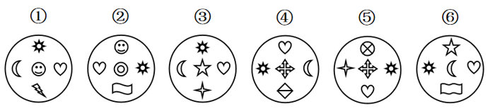
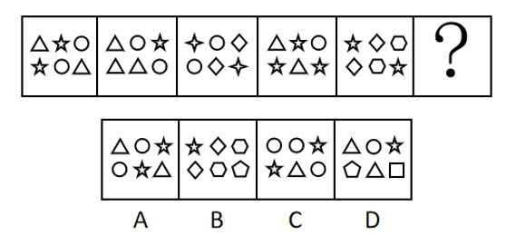
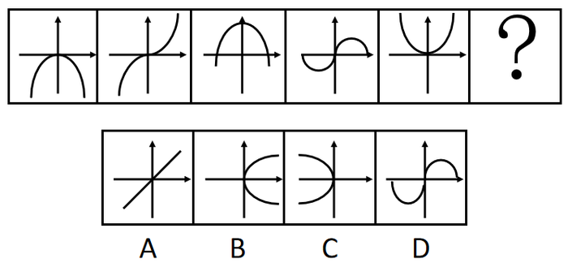
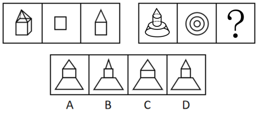

# 2018年山东省选调应届优秀高校毕业生到基层工作笔试行政职业能力测验

> 判断推理 · 15 题 · 选调 2018

## 第 1 题　qid 2659921 · 类比推理

兼顾：坚固 相对于 散步：散布
下面选项和题干逻辑结构相同的是：

- **A**. 情谊：情意 相对于 督查：督察
- **B**. 隔壁：戈壁 相对于 占有：战友
- **C**. 终生：钟声 相对于 报仇：报酬
- **D**. 著名：注明 相对于 公司：公私　✅

**答案**：D

**官方解析**

第一步：判断题干词语间逻辑关系。
“兼顾与坚固”、“散步与散布”之间均存在同音不同义的关系。
第二步：判断选项词语间逻辑关系。
A项：情谊是指人与人相互关心、相互敬爱的感情；情意是指对人的感情，二者为近义关系，并不是同音不同义词，与题干逻辑关系不一致，排除；
B项：隔壁的“隔”与戈壁的“戈”读音不同，与题干逻辑关系不一致，排除；
C项：“终生与钟声”、“报仇与报酬”均存在同音不同义的关系，与题干逻辑关系一致，保留；
D项：“著名与注明”、“公司与公私”均存在同音不同义的关系，与题干逻辑关系一致，保留。
对比C、D两项：题干后一组词中存在相同的汉字“散”，而散步的“散”是指随意、不专注，散布的“散”是指分散，二者含义不同，而C项中报仇的“报”与报酬的“报”均有回报的含义，D项中公司是一个外来译词，是指企业的组织形式，公私的“公”是指公方，二者含义不同，因此D项比C项与题干逻辑关系更一致。
故正确答案为D。

---

## 第 2 题　qid 2659927 · 逻辑判断

四人立于某人出门必经之途，见某人来，故作吃惊之状，谓之曰：“足下脸色如此难看，恐有疾病，须重视加以治疗！”众口一词。此人回家，果然疾作。
下列选项使用同一逻辑方法的是：

- **A**. 告狱中一死囚：汝明日须受死刑，但不用刀枪，只在腿上挖一洞，使血流出。血尽身死。次日，绑赴刑场，以布蒙其眼，以锥刺其骨，使稍出血，然后以水壶滴水于其伤口上，下方以桶盛之，淙淙有声。约半小时，其人死矣　✅
- **B**. 从前有一书商，欲刊一部“中华文化名人传”，通告一百名文人，请其自写传记，并购买预约书十册，每册十元。文人想凭此出名，皆乐从。书商收得一万元。此出版者无本营商，可谓精明之至
- **C**. 光线的照射有助于缓解冬季抑郁症。研究人员曾对九名患者进行研究，它们均因冬季白天变短而患上了抑郁症。研究人员让患者在清早和晚上各接受了三个小时伴有花香的强光照射。一周之内，七名患者完全摆脱了抑郁，另外两名也有了明显好转
- **D**. 硕鼠通常不患血癌，然而在一项实验中发现，给三百只硕鼠等量的辐射后，将他们平均分为两组，第一组可以不受限制的吃食物，第二组限量吃食物，结果第一组有七十五只患血癌，第二组只有五只患血癌。我们可以得出的结论是，通过限制硕鼠的进食量，能够控制由实验辐射导致的硕鼠血癌发生

**答案**：A

**官方解析**

第一步：分析题干。
有人告诉某人会生病，其信以为真，最后真的生病，即个人的心理作用造成了相应的结果。
第二步：逐一分析选项。
A项：有人告诉死囚在腿上挖洞会让其死亡，死囚被绑赴刑场后，仅为死囚营造出在腿上挖洞致其死亡的假象，死囚就真的死亡了，即个人心理作用造成了相应的结果，与题干逻辑方法一致，当选；
B项：指出精明书商如何利用手段达到自己的目的，并未涉及心理作用导致的结果，与题干逻辑方法不一致，排除；
C项：通过实验证明光线的照射有助于缓解冬季抑郁症，并未涉及心理作用导致的结果，与题干逻辑方法不一致，排除；
D项：通过做实验得出限制硕鼠的进食量，能够控制由实验辐射导致的硕鼠血癌发生，并未涉及心理作用导致的结果，与题干逻辑方法不一致，排除。
故正确答案为A。

---

## 第 3 题　qid 2659932 · 逻辑判断

某大学为了提高学生主动的学习积极性，开展了以宿舍为单位的“舍赛”活动，最近一次是男生甲宿舍和女生乙宿舍开展的四级英语通过率比赛，两舍同学都在积极备考并相互激励着对方。“如果你们宿舍的张强和王刚通过，那么我们宿舍的四名同学将全部通过！”女生强势的发出了挑战。
发生以下哪种情况，将使挑战者失败？

- **A**. 张强通过了，王刚没通过，四名女生全部通过了
- **B**. 王刚通过了，张强没通过，四名女生其中两名没通过
- **C**. 张强和王刚都没通过，四名女生无一人通过
- **D**. 张强和王刚都通过了，女生只有三人通过　✅

**答案**：D

**官方解析**

第一步：翻译题干。

如果你们宿舍的张强和王刚通过，那么我们宿舍的四名同学将全部通过。

翻译为:①张强通过 且 王刚通过四名女生全部通过。

若要使挑战者失败，找出题干的矛盾命题即可，即张通过且王通过但是四名女生有人没通过。

第二步：逐一分析选项。

A项：翻译为张强通过 且 王刚通过且四名女生全部通过，不是①的矛盾命题，不能证明挑战者失败，排除；

B项：翻译为王刚通过 且 张强通过且两名没通过，不是①的矛盾命题，不能证明挑战者失败，排除；

C项：翻译为王刚通过 且 张强通过且四名女生都没通过，不是①的矛盾命题，不能证明挑战者失败，排除；

D项：翻译为张强通过 且 王刚通过且四名女生有人没通过，是①的矛盾命题，可以证明挑战者失败，当选。

故正确答案为D。

---

## 第 4 题　qid 2659934 · 定义判断

所谓自制力，就是一个人控制自己的思想感情和举止行为的能力。
根据上述定义，下列选项不属于自制力的是：
①某人在一朋友家做客，看到主人家四岁的小孩子毫无征兆的爬到桌上，将满桌的美味佳肴破坏殆尽。
②一只红狐狸为了捕获野鸭子，连续几天潜伏在冰天雪地的沼泽中，毫无声息的贴在地上缓慢的接近野鸭子。当野鸭游开时，红狐狸就用舌头舔一下嘴，失望的退回原处继续守候着。它可以连续一个多月保持这种状态，直到野鸭子一时疏忽终于被它抓到吃掉为止。
③有人决心要在今年减肥成功。坚持每周至少锻炼三次，每次不低于一小时。可他说每天晚上记日记时，恨不能抽自己一记耳光，因为他只坚持了两天就失去了兴趣，之后的每一天他都在睡懒觉。
④张先生今年计划要读五十本书，现在到了四月份却只摸了一本书的书皮，连作者是谁都没有记清。

- **A**. ①②　✅
- **B**. ②③
- **C**. ①④
- **D**. ③④

**答案**：A

**官方解析**

第一步：找出定义关键词。
“一个人控制自己的思想感情和举止行为的能力”。
第二步：分析题干。
①中讲述的是四岁小孩将满桌的美味佳肴破坏殆尽，说明年龄过小只是随心情做事并不知道对错，不符合“控制自己的思想感情和举止行为的能力”，不属于自制力；
②中讲述的是红狐狸为了目的用尽手段，主体是红狐狸，而题干的自制力说的是人，主体不一致，不属于自制力；
③中讲述的是某人决心减肥，但是最后因没有自制力以失败告终，说明这个人“控制自己的思想感情和举止行为的能力”差，属于自制力；
④中讲述的是某人计划看书，但是最后因没有自制力以失败告终，说明这个人“控制自己的思想感情和举止行为的能力”差，属于自制力。
因此①②不涉及自制力，而③④属于自制力差的情况。
本题为选非题，故正确答案为A。

---

## 第 5 题　qid 2659936 · 逻辑判断

关于一个班参加会计资格证书测试的通过情况有如下断定：
①学习委员通过了。
②该班所有人都通过了。
③有些人通过了。
④有些人没通过。
经调查，发现上述断定只有两个是正确的，可见：

- **A**. 该班有人通过了，有人没通过　✅
- **B**. 学习委员通过了
- **C**. 所有人都通过了
- **D**. 所有人都没通过

**答案**：A

**官方解析**

第一步：找矛盾。
①学习委员通过；
②所有人通过；
③有些人通过；
④有些人没通过。
②和④是矛盾关系，二者必有一真，必有一假。
第二步：看其余。
已知两真两假，矛盾②和④必有一真，必有一假，那么①和③必有一真，必有一假。
假设①为真，即学习委员通过了，那么③也为真，与题干两真两假矛盾，故①一定为假，即学习委员没通过，可以推出有的人没有通过，那么④为真；
根据①为假，可以推出③一定为真，即有些人通过了为真，A项当选。
故正确答案为A。

---

## 第 6 题　qid 2659938 · 类比推理

下面是甲、乙、丙三位专家关于录取选调生的意见。
甲：“如果不录取李正，那么不录取王兴。”
乙：“如果不录取王兴，那么录取李正。”
丙：“如果录取李正，那么不录取王兴。”
应该选择哪种录取方案，使甲、乙、丙三位专家的要求同时得到满足？

- **A**. 只录取王兴
- **B**. 只录取李正　✅
- **C**. 都录取
- **D**. 都不录取

**答案**：B

**官方解析**

第一步：翻译题干。

①甲：李正王兴；

②乙：王兴李正；

③丙：李正王兴。

第二步：根据题干信息进行推导。

根据①③可知，无论李正是否录取，王兴一定不录取，再根据②可以推出李正录取，B项当选。

故正确答案为B。

---

## 第 7 题　qid 2659942 · 类比推理

写遗嘱的人有四个继承人：S、T、U、V。遗产是七套房子，编号为1～7号。七套房子按以下条件分配：
①谁继承了2号房子，就不能继承其他房子。
②没有一个继承者既可以继承3号房子，又可以继承4号房子。
③如果S继承了一套或数套房子，那么U就不能继承其他房子。
④如果S继承了2号房子，那么T必须继承4号房子。
现已知S继承了2号房子，那么谁必须继承3号房子？

- **A**. S
- **B**. T
- **C**. U
- **D**. V　✅

**答案**：D

**官方解析**

第一步：分析题干条件。

①继承2号房不能继承其它房子；

②非3号房或非4号房；

③S继承了一套或数套房子U就不能继承其他房子；

④S继承了2号房子T必须继承4号房子；

⑤S继承了2号房子。

第二步：根据题干条件进行推理。

条件⑤为题干确定信息，可由此开始进行推理。

根据①⑤可知S不能继承其它房子，排除A项；

根据③⑤可知U不能继承其他的房子，排除C项；

根据④⑤可知T必须继承4号房，再结合条件②可以推出T不能继承3号房，排除B项。

故正确答案为D。

---

## 第 8 题　qid 2659954 · 逻辑判断

小何和小钱是要好的朋友，小何是学气象的，每天要做天气预报，小钱是学哲学的，爱和人辩论。某周日中午，两人在一起吃饭，小何急着要走，说要去加班，准备明天的天气预报。小钱说：“何必着急？做天气预报还不容易，你只要说明天有的概率降水就行了。如果真的下了雨，你可以说‘我预报准确’，因为你说过有的降水率；如果明天没有下雨，你也没错，因为你预言有的概率不下雨。因此，你总是对的。”

如果以下论证为真，哪项最能削弱小钱的论断？

- **A**. 
如果明天下雨了，只有预报明天降水率才算预报准确

- **B**. 
如果明天不下雨，只有预报降水率为才算预报准确

- **C**. 
天气预报的准确率不是仅靠某一次是否符合天气实际情况来判断的

- **D**. 
用概率预报天气是不科学的
　✅

**答案**：D

**官方解析**

第一步：找到论点和论据。

论点：只要小何说明天有的概率降水，无论是否降水，小何总是对的。

论据：如果真的下了雨，你可以说‘我预报准确’，因为你说过有的降水率；如果明天没有下雨，你也没错，因为你预言有的概率不下雨。

本题论点和论据说的都是预报的概率降水是对的，二者话题一致，优先考虑削弱论点，即预报明天有的概率降水不是对的。

第二步：逐一分析选项

A项：指出下雨的情况下预报降水率才算预报准确，说明下雨的情况下预报的概率降水是不准确的，削弱论据，保留；

B项：指出不下雨的情况下预报降水率才算预报准确，说明不下雨的情况下预报的概率降水是不准确的，削弱论据，保留；

C项：说明准确率不能靠一次来判断，研究的是准确率与次数之间的关系，与概率降水是否准确无关，话题不一致，排除；

D项：说明用概率预报不科学，预报明天有的概率降水是不科学的，直接否定论点，保留。

比较A、B、D三项，D项削弱论点的作用大于A、B两项的削弱论据，且A、B两项极为相似，属于同构选项，均可排除。

故正确答案为D。

---

## 第 9 题　qid 2660457 · 逻辑判断

小何和小钱是要好的朋友，小何是学气象的，每天要做天气预报，小钱是学哲学的，爱和人辩论。某周日中午，两人在一起吃饭，小何急着要走，说要去加班，准备明天的天气预报。小钱说：“何必着急？做天气预报还不容易，你只要说明天有的概率降水就行了。如果真的下了雨，你可以说‘我预报准确’，因为你说过有的降水率；如果明天没有下雨，你也没错，因为你预言有的概率不下雨。因此，你总是对的。”

下列选项中，与小钱所用推理形式完全相同的是：

- **A**. 有人说，凡是伟大优秀的音乐作品都会让人民大众喜欢并长久流传；也有人说，“曲高和寡”，水准越高的作品，欣赏的人越少
- **B**. 拐卖妇女、儿童集团的首要分子或拐卖妇女、儿童3人以上的处10年以上有期徒刑或无期徒刑，并处罚金或没收财产。赵某不是拐卖妇女、儿童集团的首要分子，拐卖妇女、儿童7人，被判10年以上有期徒刑并没收财产
- **C**. 一盗贼入室劫财，出逃时发现屋内有人，用预先准备好的绳子将其勒死以杀人灭口。该贼必死无疑
- **D**. 老师向学生收取学成前未交付的另一半学费，学生不肯。双方发生争执，欲打官司。学生说：“如果我胜诉，我不会交付另一半学费；如果我败诉，我也不会交付另一半学费。总之，你将得不到你想要的那一半学费。”　✅

**答案**：D

**官方解析**

第一步:分析题干推理形式。

小钱的推理形式为：下雨有的降水率是对的，下雨有的降水率是对的，推出有的概率降水总是对的，即AB，AB，推出B恒成立。

第二步：逐一分析选项。

A项：伟大优秀的音乐作品会让人民大众喜欢且长久流传，水准越高的作品欣赏的人越少，即AB，CD，与题干推理形式不相同，排除；

B项：拐卖妇女、儿童集团的首要分子或拐卖妇女、儿童3人以上（处10年以上有期徒刑或无期徒刑）且（处罚金或没收财产），即A或B（C或D）且（E或F）；赵某不是拐卖妇女、儿童集团的首要分子，拐卖妇女、儿童7人，被判10年以上有期徒刑并没收财产，即A或BC且F，与题干推理形式不相同，排除；

C项：盗贼杀人灭口必死无疑，即AB，与题干推理形式不相同，排除；

D项：胜诉交付另一半学费，败诉（即胜诉）交付另一半学费，推出该学生不会交另一半学费，即AB，AB，推出B恒成立，与题干推理形式相同，当选。

故正确答案为D。

---

## 第 10 题　qid 2660465 · 逻辑判断

某卫生系统要在全市几家大医院联合开展一次意外伤病事故急救竞赛。竞赛报名事宜里有一条规定：工作不满三年或未曾评为先进工作者的不能参加本次比赛。李欣工作已满五年却不是先进工作者。
那么，关于李欣，以下哪项是根据上文能推出的结论？

- **A**. 她一定能够参加本次比赛并获得优异成绩
- **B**. 她的参赛成绩取决于她五年来丰富的工作经验
- **C**. 她可能具有参加本次比赛的资格
- **D**. 她没有先进工作者称号不能参加本次比赛　✅

**答案**：D

**官方解析**

第一步：分析题干条件。

（1）工作不满三年或未曾评为先进工作者不能参加本次比赛；

（2）李欣工作已满五年却不是先进工作者。

第二步：根据题干条件进行推理。

结合条件（1）工作不满三年或未曾评为先进工作者不能参加本次比赛，由确定信息（2）可知，李欣不是先进工作者，是对（1）的肯前，肯前必肯后，可推知李欣不能参加本次比赛，因此排除A项、B项和C项，D项符合。

故正确答案为D。

---

## 第 11 题　qid 2660488 · 图形推理

把下面的六个图形分为两类，使每一类图形都有各自的共同特征或规律，分类正确的一项是：

- **A**. ①②③，④⑤⑥
- **B**. ①③⑥，②④⑤　✅
- **C**. ①③⑤，②④⑥
- **D**. ①③④，②⑤⑥

**答案**：B

**官方解析**

题干元素组成不同，观察发现，每个图形中均出现生活化图形和封闭面明显的图形，优先考虑数面。①③⑥图形中的面数量均是5，面数量均为奇数，而②④⑤图形中的面数量分别为6、6、8，面数量均为偶数，因此①③⑥一组，②④⑤一组。
故正确答案为B。

---

## 第 12 题　qid 2660500 · 图形推理

从所给的四个选项中，选择最合适的一个填入问号处，使图形呈现一定的规律性：

- **A**. A
- **B**. B
- **C**. C　✅
- **D**. D

**答案**：C

**官方解析**

题干元素组成不相同，且无明显属性规律，优先考虑数量规律。每幅图均由多种元素组成，考虑元素的种类和个数。观察发现，题干中每幅图均由三种元素构成，排除B、D两项；继续观察可发现，题干每幅图中，每种元素的个数分别为2、2、2，3、2、1，2、2、2，3、2、1，2、2、2，为交替规律，因此“？”处三种元素的个数应分别为3、2、1。A项为2、2、2，排除；C项为3、2、1，当选。
故正确答案为C。

---

## 第 13 题　qid 2660510 · 图形推理

从所给的四个选项中，选择最合适的一个填入问号处，使图形呈现一定的规律性：

- **A**. A　✅
- **B**. B
- **C**. C
- **D**. D

**答案**：A

**官方解析**

元素组成相似，考虑样式规律。本题为九宫格题目，优先看横行。观察发现，题干每行图形外部轮廓相同，内部分割区域相同，空白和五角星个数不同，优先考虑黑白运算。第一行寻找规律：五角星五角星五角星，空白空白五角星，五角星空白空白，空白五角星空白；第二行验证规律成立。第三行前两个图形应用上述运算规律得到A项。

故正确答案为A。

---

## 第 14 题　qid 2660514 · 图形推理

从所给的四个选项中，选择最合适的一个填入问号处，使图形呈现一定的规律性：

- **A**. A
- **B**. B
- **C**. C
- **D**. D　✅

**答案**：D

**官方解析**

题干元素组成不同，优先考虑属性规律。观察可知每幅图都有横纵坐标，不同的地方在于坐标轴上曲线的对称性分别是轴对称、中心对称、轴对称、中心对称、轴对称，为交替规律，所以？处应为一条中心对称的曲线。B项和C项的曲线都是轴对称，排除。A项虽为中心对称，但是直线不是曲线，排除。
故正确答案为D。

---

## 第 15 题　qid 2660518 · 图形推理

从所给的四个选项中，选择最合适的一个填入问号处，使图形呈现一定的规律性：

- **A**. A
- **B**. B
- **C**. C
- **D**. D　✅

**答案**：D

**官方解析**

本题考查三视图，第一组图形中，第二个图形和第三个图形分别是第一个图的俯视图和左视图。第二组应用规律，？处应该是第一个图的左视图。根据图形大小可以排除A、C两项。再根据图形上方圆锥与圆柱的关系，可以排除B项。
故正确答案为D。

---
