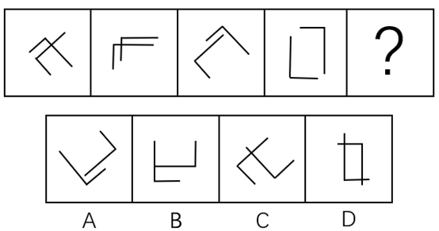
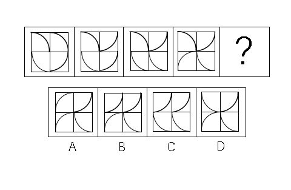
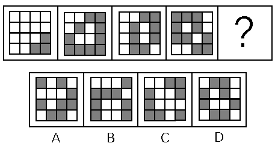
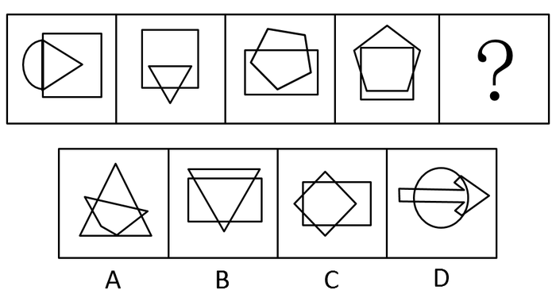
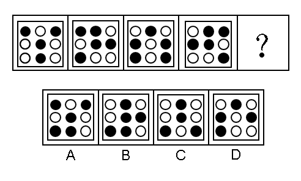
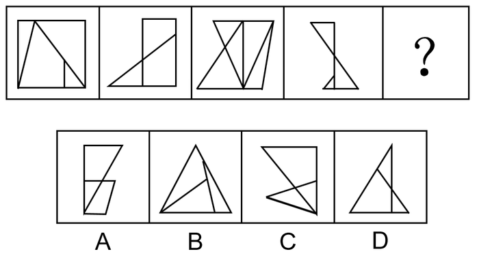
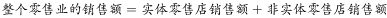

# 2018年广东省公务员录用考试《行测》题（县级、乡镇统一卷）（网友回忆版）

> 判断推理 · 30 题 · 广东 2018

## 第 1 题　qid 2185062 · 图形推理

从所给的四个选项中，选择最合适的一个填在问号处，使之呈现一定的规律性：

- **A**. A
- **B**. B
- **C**. C
- **D**. D　✅

**答案**：D

**官方解析**

元素组成不同，且属性无规律，优先考虑数量规律。观察发现，题干中的白圈和黑圈依次呈交错递增规律，黑圈数量依次为：1、2、3、4；白圈数量依次为：1、2、3，？前已有1个白圈，？后已有两个黑圈，因此？处白圈应为3个，黑圈应为3个，只有D项符合。
故正确答案为D。

---

## 第 2 题　qid 2185066 · 图形推理

从所给的四个选项中，选择最合适的一个填在问号处，使之呈现一定的规律性：

- **A**. A　✅
- **B**. B
- **C**. C
- **D**. D

**答案**：A

**官方解析**

元素组成相同，考虑位置规律。观察发现，题干均由两个相同的图形构成，且红色图形依次逆时针旋转，蓝色图形依次顺时针旋转，如下图所示，只有A项符合。

故正确答案为A。

---

## 第 3 题　qid 2185073 · 图形推理

从所给的四个选项中，选择最合适的一个填在问号处，使之呈现一定的规律性：

- **A**. A　✅
- **B**. B
- **C**. C
- **D**. D

**答案**：A

**官方解析**

元素组成不同，属性、数量无规律，考虑特殊规律。第一组图形，图1是两个箭头相交，图2是两个长方形相交，图3是两个三角形相交，即每一幅图形都是两个相同的小图形相交得到的；第二组图应用此种规律，图1是两条直线相交，图2是两条“L”型的线条相交，？处也应为两个相同的小图形相交。A项是两个Z字相交，B项是一个直角和两条直线相交，C项是一个锐角和两条直线相交，D项是一个锐角和一条直线相交，只有A项符合。
故正确答案为A。

---

## 第 4 题　qid 2185074 · 图形推理

从所给的四个选项中，选择最合适的一个填在问号处，使之呈现一定的规律性：

- **A**. A
- **B**. B
- **C**. C
- **D**. D　✅

**答案**：D

**官方解析**

观察图形，三组图各自内部元素组成相同，考虑位置规律。图1中冒号左边图形旋转得到冒号右边图形，图2中图形满足此规律，图3应用此规律，则“？”处图形应该是冒号左边图形旋转得到的，只有D项符合。

故正确答案为D。

---

## 第 5 题　qid 2185076 · 图形推理

从所给的四个选项中，选择最合适的一个填在问号处，使之呈现一定的规律性：

- **A**. A
- **B**. B　✅
- **C**. C
- **D**. D

**答案**：B

**官方解析**

元素组成相同，每个图形都由四个小方块和四条弧线构成，优先考虑位置规律。第一个图形到第二个图形，右上角弧线顺时针旋转，第二个图形到第三个图形，右下角弧线顺时针旋转，第三个图形到第四个图形，左下角弧线顺时针旋转，故第四个图形到?处图形，应是左上角弧线顺时针旋转，只有B项符合。

故正确答案为B。

---

## 第 6 题　qid 2185022 · 图形推理

从所给的四个选项中，选择最合适的一个填在问号处，使之呈现一定的规律性：

- **A**. A
- **B**. B
- **C**. C
- **D**. D　✅

**答案**：D

**官方解析**

观察图形，每个图形都由不同数量的黑块和白块组成，优先考虑数量规律，黑块数量分别是3，10，8，10，数量无规律。再整体观察图形，图形中白块被黑块分成了不同的部分，则可考虑白块被黑块分开的部分数。白块部分数分别是1，2，3，4，故？处白块应被黑块分成5部分。观察选项，A项4部分，B项3部分，C项1部分，D项5部分，D项符合。
故正确答案为D。

---

## 第 7 题　qid 2185081 · 图形推理

从所给的四个选项中，选择最合适的一个填在问号处，使之呈现一定的规律性：

- **A**. A
- **B**. B
- **C**. C　✅
- **D**. D

**答案**：C

**官方解析**

观察题干图形，都是由两个几何图形相交而成，则可考虑图形间关系，观察相交部分。观察可知题干图形相交部分的形状依次为三角形、四边形、五边形、六边形，故？处两个图形的相交部分应该为七边形，A选项相交部分为六边形，B选项相交部分为四边形，C选项相交部分为七边形，D选项相交部分不符合多边形特点。
故正确答案为C。

---

## 第 8 题　qid 2185083 · 图形推理

从所给的四个选项中，选择最合适的一个填在问号处，使之呈现一定的规律性：

- **A**. A
- **B**. B
- **C**. C　✅
- **D**. D

**答案**：C

**官方解析**

第一种方法：观察题干图形，第一个和第三个图形对称规律明显，都是轴对称图形，而第二个和第四个图形不是轴对称图形，故此题第一、第三、第五个图形都应该为轴对称图形，观察选项，只有C选项为轴对称图形。
第二种方法：观察题干图形，第二个图和第四个图形位置关系明显，第二个图沿着纵轴翻转可得到第四个图形。观察选项，发现C选项与题干第一个图形位置关系明显，题干第一个图沿横轴翻转可得到C选项，即以第三个图形为中心，第二个图形和第四个图形是有关纵轴对称的两个图形，第一个图形和第五个图形是有关横轴对称的两个图形。无论是上述哪种方法，本题都是C项符合。
第三种方法：观察题干图形，相邻比较发现题干相邻两幅图之间都有2个白球的位置相同，因此问号处的图形也应和图四之间有两个白球的位置相同，只有D项符合。
本题为争议题，选择哪个答案都是合理的。

---

## 第 9 题　qid 2185027 · 图形推理

从所给的四个选项中，选择最合适的一个填在问号处，使之呈现一定的规律性：

- **A**. A　✅
- **B**. B
- **C**. C
- **D**. D

**答案**：A

**官方解析**

元素组成不同，考虑数量规律。图形均有线条交叉，优先考虑数点。观察发现每个图形的交点个数均为7，所以？处交点个数也为7，只有选项A交点个数为7，其余交点个数均为6。
故正确答案为A。

---

## 第 10 题　qid 2185028 · 图形推理

从所给的四个选项中，选择最合适的一个填在问号处，使之呈现一定的规律性：

- **A**. A
- **B**. B
- **C**. C　✅
- **D**. D

**答案**：C

**官方解析**

元素组成相同，考虑位置规律。每个图形分为内圈和外圈两部分。先看内圈，有四个不同的元素，挑一个观察，内圈的黑色五角星沿内圆每次逆时针移动2格，由第四幅图到？处，黑色五角星也应逆时针移动2格，排除A项。B、C、D内部其他元素位置相同，考虑外圈位置变化。外圈的白色五角星每次顺时针移动1格，由第四幅图到？处，白色五角星也应顺时针移动1格，排除B、D两项。
故正确答案为C。

---

## 第 11 题　qid 2185105 · 类比推理

畅通：拥堵

- **A**. 结实：松散
- **B**. 详尽：简略　✅
- **C**. 踏实：忧虑
- **D**. 男性：女性

**答案**：B

**官方解析**

第一步：判断题干词语间的逻辑关系。
“畅通”是指道路畅行、可以顺利通过，“拥堵”是指道路狭窄造成拥挤，二者为反义关系。
第二步：判断选项词语间的逻辑关系。
A项：“结实”是指强健牢固，“松散”是指排列不紧密，二者不是反义关系，与题干逻辑关系不一致，排除；
B项：“详尽”是指内容全面、无遗漏，“简略”是指内容简单、不详细，二者为反义关系，与题干逻辑关系一致，当选；
C项：“踏实”是指切实、不浮躁，“忧虑”是指思虑、忧愁、担心，二者不是反义关系，与题干逻辑关系不一致，排除；
D项：“男性”和“女性”属于并列关系中的矛盾关系，与题干逻辑关系不一致，排除。
故正确答案为B。

---

## 第 12 题　qid 2185106 · 类比推理

法律：遵守

- **A**. 政策：推动
- **B**. 资源：利用　✅
- **C**. 经济：发达
- **D**. 环境：整洁

**答案**：B

**官方解析**

第一步：判断题干词语间的逻辑关系。
遵守法律，“法律”属于名词，“遵守”属于动词，构成动宾关系。
第二步：判断选项词语间的逻辑关系。
A项：推动政策（落实/执行），虽然“政策”属于名词，“推动”属于动词，但二者搭配意思表达不完整，不能构成动宾关系，与题干逻辑关系不一致，排除；
B项：利用资源，“资源”属于名词，“利用”属于动词，构成动宾关系，与题干逻辑关系一致，当选；
C项：“发达”是形容词，“经济”属于名词，二者不能构成动宾关系，与题干逻辑关系不一致，排除；
D项：“整洁”是形容词，“环境”属于名词，二者不能构成动宾关系，与题干逻辑关系不一致，排除。
故正确答案为B。

---

## 第 13 题　qid 2185110 · 类比推理

创新：发展

- **A**. 批评：进步
- **B**. 辞旧：迎新
- **C**. 竞赛：夺冠
- **D**. 学习：提高　✅

**答案**：D

**官方解析**

第一步：判断选项词语间逻辑关系。
创新可能带来发展，“创新”是“发展”的条件之一，二者属于对应关系。
第二步：判断选项词语间的逻辑关系。
A项：批评可能带来进步，“批评”是“进步”的条件之一，二者属于对应关系，与题干逻辑关系一致，保留；
B项：“辞旧”和“迎新”属于并列关系，与题干逻辑关系不一致，排除；
C项：竞赛是一个事件，“竞赛”不是“夺冠”的条件，与题干逻辑关系不一致，排除；
D项：学习可能带来提高，“学习”是“提高”的条件之一，二者属于对应关系，与题干逻辑关系一致，保留。
比较A、D项，题干“创新”和“发展”的主体是一致的，A项“批评”和“进步”的主体不一致，D项“学习”和“提高”主体是一致的，所以D项优于A项。
故正确答案为D。

---

## 第 14 题　qid 2185115 · 类比推理

钢笔：墨水

- **A**. 牙刷：牙膏　✅
- **B**. 手机：电脑
- **C**. 词典：报纸
- **D**. 壁画：台灯

**答案**：A

**官方解析**

第一步：判断题干词语间逻辑关系。
钢笔需要和墨水在一起配套使用，二者为配套使用的关系。
第二步：判断选项词语间逻辑关系。
A项：牙刷和牙膏在一起配套使用，二者为配套使用的关系，与题干逻辑关系一致，当选；
B项：手机和电脑均为电子产品，二者为并列关系，与题干逻辑关系不一致，排除；
C项：词典和报纸均为出版物，二者为并列关系，与题干逻辑关系不一致，排除；
D项：壁画和台灯没有必然的逻辑关系，与题干逻辑关系不一致，排除。
故正确答案为A。

---

## 第 15 题　qid 2185120 · 类比推理

降价：促销

- **A**. 编程：语言
- **B**. 复习：考试
- **C**. 实验：研究　✅
- **D**. 实践：真理

**答案**：C

**官方解析**

第一步：判断题干词语间逻辑关系。
降价是一种促销的方式，二者为方式对应关系。
第二步：判断选项词语间逻辑关系。
A项：编程是编写程序的中文简称，就是让计算机代为解决某个问题，对某个计算体系规定一定的运算方式，和语言没有必然的逻辑关系，与题干逻辑关系不一致，排除；
B项：复习不是考试的一种方式，而是为考试做准备，与题干逻辑关系不一致，排除；
C项：实验是一种研究的方式，二者为方式对应关系，与题干逻辑关系一致，当选；
D项：实践是检验真理的标准，二者不是方式对应关系，与题干逻辑关系不一致，排除。
故正确答案为C。

---

## 第 16 题　qid 2185023 · 类比推理

节能：环保

- **A**. 贪污：腐败　✅
- **B**. 文明：文化
- **C**. 秋天：节气
- **D**. 运动：休闲

**答案**：A

**官方解析**

第一步：判断题干词语间逻辑关系。
节能是一种环保，二者为包容关系中的种属关系。
第二步：判断选项词语间逻辑关系。
A项：贪污是一种腐败，二者为包容关系中的种属关系，与题干逻辑关系一致，当选；
B项：文明是文化的内在价值，文化是文明的外在表现形式，二者为对应关系，与题干逻辑关系不一致，排除；
C项：秋天是一种季节，而不是一种节气，二者为反向种属关系，与题干逻辑关系不一致，排除；
D项：运动是一种休闲的方式，二者为方式对应关系，与题干逻辑关系不一致，排除。
故正确答案为A。

---

## 第 17 题　qid 2185025 · 类比推理

摄影：绘画

- **A**. 复印：扫描
- **B**. 书法：刺绣　✅
- **C**. 雕刻：打磨
- **D**. 歌唱：弹奏

**答案**：B

**官方解析**

第一步：判断题干词语间逻辑关系。

摄影和绘画是两种不同的艺术表现形式，二者是并列关系，且绘画既可以作为名词，又可以作为动宾短语。
第二步：判断选项词语间逻辑关系。
A项：复印和扫描是两种处理文件的不同方式，二者是并列关系，但二者并非艺术表现形式，与题干逻辑关系不一致，排除；
B项：书法和刺绣是中国民间传统工艺，是两种不同的艺术表现形式，二者是并列关系，且刺绣既可以作为名词，又可以作为动宾短语，与题干逻辑关系一致，当选；
C项：雕刻和打磨是两道不同的工序，二者是并列关系，但打磨是动词，与题干逻辑关系不一致，排除；
D项：歌唱和弹奏是两种不同的艺术表现形式，二者是并列关系，但二者是动词，与题干逻辑关系不一致，排除。
故正确答案为B。

---

## 第 18 题　qid 2185029 · 类比推理

木头：家具

- **A**. 纤维：水管
- **B**. 纸张：报纸
- **C**. 棉花：衣服　✅
- **D**. 金属：电缆

**答案**：C

**官方解析**

第一步：判断题干词语间逻辑关系。
木头是家具的原材料，二者是对应关系。
第二步：判断选项词语间逻辑关系。
A项：纤维是水管的原材料，与题干逻辑关系一致，保留；
B项：纸张是报纸的原材料，但是报纸本身也是纸张，二者还是种属关系，与题干逻辑关系不一致，排除；
C项：棉花是衣服的原材料，与题干逻辑关系一致，保留；
D项：金属是电缆的原材料，与题干逻辑关系一致，保留。
比较题干和A、C、D三项，题干木头是天然材料，且木头并不是家具的必需材料，家具也有铝材或者石材的，A项制作水管的纤维是人工材料，排除；C项棉花是天然材料，棉花也不是衣服的必需材料，衣服可以是其他材质，例如蚕丝、化纤等等；D项金属是制作电缆必不可少的材料。C项更优。
故正确答案为C。

---

## 第 19 题　qid 2185030 · 类比推理

机器：出厂：检测

- **A**. 商品：出口：试用
- **B**. 技工：经验：实践
- **C**. 白炽灯：照明：通电　✅
- **D**. 大学生：毕业：实习

**答案**：C

**官方解析**

第一步：判断题干词语间逻辑关系。
机器需要先检测后出厂，且检测是出厂前的必要环节，二者是对应关系。
第二步：判断选项词语间逻辑关系。
A项：商品需要先试用后出口，但试用不是出口前的必要环节，与题干逻辑关系不一致，排除；
B项：技工通过实践积累经验，二者为方式对应关系，与题干逻辑关系不一致，排除；
C项：白炽灯需要先通电后照明，且通电是照明前的必要环节，与题干逻辑关系一致，当选；
D项：大学生需要先实习后毕业，但实习不是毕业前的必要环节，与题干逻辑关系不一致，排除。
故正确答案为C。

---

## 第 20 题　qid 2185031 · 类比推理

索然无味：味同嚼蜡

- **A**. 走投无路：山穷水尽　✅
- **B**. 抛砖引玉：抛头露面
- **C**. 目光如炬：鼠目寸光
- **D**. 一无所得：一箭双雕

**答案**：A

**官方解析**

第一步：判断题干词语间逻辑关系。
索然无味形容呆板枯燥，一点意味或者趣味都没有；味同嚼蜡指像吃蜡一样，没有一点儿味，形容语言或文章枯燥无味，二者是近义关系。
第二步：判断选项词语间逻辑关系。
A项：走投无路比喻陷入绝境，没有出路；山穷水尽是指山和水都到了尽头，比喻无路可走，二者是近义关系，与题干逻辑关系一致，当选；
B项：抛砖引玉比喻用自己不成熟的意见或作品引出别人更好的意见或好作品；抛头露面指公开露面，二者没有明显逻辑关系，与题干逻辑关系不一致，排除；
C项：目光如炬形容愤怒地注视着，也形容见识远大；鼠目寸光比喻目光短浅、缺乏远见，二者是反义关系，与题干逻辑关系不一致，排除；
D项：一无所得形容毫无收获；一箭双雕比喻做一件事达到两个目的，二者没有明显逻辑关系，与题干逻辑关系不一致，排除。
故正确答案为A。

---

## 第 21 题　qid 2185085 · 逻辑判断

某市举行春季音乐节系列活动，其中一项活动首次邀请了某知名交响乐团前来该市演出，该市交响乐爱好者对此十分期待。考虑到该乐团的影响力，主办方预计为期两天的交响乐团演出将“一票难求”。但开始售票后发现，实际情况并非如此。
以下哪项为真，最能解释这一情况？

- **A**. 音乐节的其他活动吸引了许多观众
- **B**. 交响乐未能被该市大部分群众所接受
- **C**. 音乐节活动期间该市一直为阴雨天气
- **D**. 此次交响乐团演出门票价格过高　✅

**答案**：D

**官方解析**

第一步：找出题干矛盾。
该市交响乐爱好者十分期待某知名交响乐团前来演出，预计交响乐团演出将“一票难求”，但开始售票后发现实际情况并非如此。
第二步：逐一分析选项。
A项：音乐节的其他活动吸引了许多观众，可能会影响交响乐团演出门票的销售，可以解释题干的矛盾，保留；
B项：交响乐未能被该市大部分群众所接受，说明该市喜欢交响乐的人少，但是题干已明确指出“交响乐爱好者”对此十分期待，与不接受交响乐的群众占比无关，排除；
C项：阴雨天气可能会对交响乐的售票有一定的影响，可以解释题干的矛盾，保留；
D项：演出门票价格过高在一定程度上会影响到门票的销售，可以解释题干的矛盾，保留。
比较A、C、D三项，D项从交响乐团演出自身的角度解释了原因；
A项中的音乐节其他活动吸引了许多观众，但是题干中说该市交响乐爱好者对交响乐团的演出十分期待，所以其他活动对于交响乐团演出门票的销售影响并不明确，排除；
C项中的阴雨天气只是可能对售票情况产生一定的影响，但是题干并没有明确的说明交响乐的爱好者会因为阴雨天气而放弃看演出，不明确项，排除；
D项是从交响乐团演出自身的角度出发，门票价格过高这一因素会影响到门票销量，一部分交响乐爱好者自然会因为门票价格过高而放弃观看演出，因此相比之下，D项解释力度更强，当选。
故正确答案为D。

---

## 第 22 题　qid 2185086 · 逻辑判断

对多个省份的调查研究发现，对于外向者而言，花大量时间用于网络社交并不会影响与他人面对面交流的意愿，而内向者即使不进行网络社交也不会变成社交达人。因此，有研究者认为，网络社交会妨碍传统社交的担忧是毫无必要的。
以下哪项为真，最有助于支持上述结论？

- **A**. 有许多花费大量时间在网络社交上的人不愿意与他人面对面交流
- **B**. 无论采用哪种方式，大多数人参与社会活动的总时间是相对固定的
- **C**. 在网络社交的帮助下，许多人在传统社交中的能力和自信得到了提升　✅
- **D**. 该研究由某大学开展，而在该校学生中，网络社交并不是主要的社交方式

**答案**：C

**官方解析**

第一步：找出论点和论据。
论点：网络社交会妨碍传统社交的担忧是毫无必要的。
论据：对于外向者而言，花大量时间用于网络社交并不会影响与他人面对面交流的意愿，而内向者即使不进行网络社交也不会变成社交达人。
第二步：逐一分析选项。
A项：花费大量时间进行网络社交的人不愿与他人面对面交流，说明网络社交妨碍了传统社交，削弱论点，排除；
B项：大多数人参与社交活动的总时间是相对固定的，即参与网络社交与传统社交的总时间相对固定，那么网络社交时间多了，传统社交时间就会变少，有一定削弱力度，排除；
C项：网络社交有助于许多人在传统社交中提升能力和自信，所以网络社交不仅没有妨碍传统社交，反而有利于传统社交，补充论据，当选； 
D项：该校学生中网络社交不是主要的社交方式，未提到网络社交与传统社交间的关系，无关选项，排除。
故正确答案为C。

---

## 第 23 题　qid 2185092 · 逻辑判断

近年来，某公司生产的汽车发生了几起严重的交通事故，有人认为这是因为该汽车在设计上存在缺陷导致的。对此，该公司坚决否认设计上存在缺陷，理由是根据这几起交通事故的分析报告，发生事故时，司机都存在酒后驾驶或疲劳驾驶的情况。
以下哪项为真，最不能支持该公司的观点？

- **A**. 该公司一直宣称自己的产品安全性能良好　✅
- **B**. 该公司所依据的交通事故分析报告真实可靠
- **C**. 喝酒和疲劳都会严重影响司机驾驶时的判断力
- **D**. 经过对事故车辆的检测，并没有发现存在设计缺陷

**答案**：A

**官方解析**

第一步：找出论点和论据。
论点：该公司汽车设计上不存在缺陷。
论据：根据这几起交通事故的分析报告，发生事故时，司机都存在酒后驾驶或疲劳驾驶的情况。
第二步：逐一分析选项。
A项：公司一直宣称自己产品安全性能良好，但是无法判断设计是否存在缺陷，属于无关选项，无法加强，当选；
B项：该报告真实可靠是得出论点的必要条件，补充论据，可以加强，排除；
C项：喝酒和疲劳驾驶会影响驾驶人的判断力，解释了造成交通事故的原因不是设计问题而是酒驾，补充论据，可以加强，排除； 
D项：对事故车辆检测之后发现没有设计缺陷，补充论据，可以加强，排除。
本题为选非题，故正确答案为A。

---

## 第 24 题　qid 2185097 · 类比推理

某围棋队有选手会在比赛时喝茶，他们或者喝红茶，或者喝绿茶。
如果以上描述为真，下列哪项一定是真的？
I．该围棋队一名在比赛时不喝红茶的选手，一定喝绿茶。
II．该围棋队没有选手比赛时喝黑茶。
III．该围棋队有的选手比赛时不喝茶。

- **A**. 只有II　✅
- **B**. 只有III
- **C**. I和II
- **D**. II和III

**答案**：A

**官方解析**

第一步：翻译题干。
①该围棋队有的选手在比赛时喝茶；
②喝红茶或者喝绿茶。
第二步：逐一分析选项。
Ⅰ：根据①可知，该围棋队有的选手在比赛时喝茶，但是无法确定该围棋队每一个人在比赛时都喝茶，所以该围棋队某一个人是否喝茶不明确，是否喝茶都不确定，因此无法确定真假。
Ⅱ：根据②可知，该队选手如果喝茶，即在红茶与绿茶之间，没有人喝黑茶，可以推出，该项一定为真。
Ⅲ：根据①可知，有的选手喝茶不能推出有的选手不喝茶，无法推出绝对化结论，因此无法确定真假。
故正确答案为A。

---

## 第 25 题　qid 2185087 · 逻辑判断

某市高新区离老城区较远，且公交车班次很少。高新区企业的员工大部分居住在老城区，他们经常会因为无法按时坐上公交车而迟到。为此，公交车公司大量增加了高新区与老城区之间的公交车班次，以满足这些员工的乘车需求。但是经过一段时间的观察，情况并没有得到改善，这些员工依然经常迟到。
以下哪项为真，最能解释上述现象？

- **A**. 高新区的许多企业都调整了上班时间
- **B**. 部分原来开车上班的高新区企业员工改为乘坐公交车
- **C**. 由于道路狭窄，公交车班次大量增加后经常出现长时间塞车　✅
- **D**. 许多原本乘坐公交车上班的高新区企业员工改为开车或乘坐出租车

**答案**：C

**官方解析**

第一步：找出题干矛盾。
高新区企业的员工经常因为无法坐上公交车而迟到，大量增加公交车班次后，这些员工依然经常迟到。
第二步：逐一分析选项。
A项：无论怎么调整时间，公交车班次增加应该可以缓解迟到现象，所以无法解释公交车班次增加后员工依然迟到的矛盾，排除；
B项：部分原本开车上班的高新区企业员工改为乘坐公交车，增加了一些乘坐公交车的人，但是只是乘坐公交车人数的增加无法解释公交车班次增加后员工依然迟到的矛盾，排除；
C项：由于道路狭窄，公交班次大量增加后经常出现长时间塞车，塞车会导致员工迟到，很好地解释了公交车班次增加后员工依然迟到的矛盾，当选；
D项：原本乘坐公交车上班的高新区企业员工改为开车或乘坐出租车，开车或出租车是否会对迟到产生影响并不清楚，无法解释公交车班次增加后员工依然迟到的矛盾，排除。
故正确答案为C。

---

## 第 26 题　qid 2185100 · 逻辑判断

有研究小组调查显示，在封闭环境中入睡的人更容易频繁醒来，而且自我感觉睡眠质量不佳。因此，有人认为，就寝时关闭门窗将会降低睡眠质量。
以下哪项为真，最能削弱上述结论？

- **A**. 研究小组调查的对象大多是年轻人
- **B**. 睡眠质量差的人更喜欢关闭门窗睡觉　✅
- **C**. 门窗紧闭会影响室内空气质量，从而影响睡眠
- **D**. 由于安全、保暖等原因，夜间开窗并不适合所有房间

**答案**：B

**官方解析**

第一步：找出论点和论据。
论点：就寝时关闭门窗将会降低睡眠质量。
论据：在封闭环境中入睡的人更容易频繁醒来，而且自我感觉睡眠质量不佳。
第二步：逐一分析选项。
A项：研究小组调查的对象大多是年轻人，论点讨论的是就寝时关闭门窗将会不会降低睡眠质量，与调查的人群年龄无关，无关选项，排除；
B项：睡眠质量差的人更喜欢关闭门窗睡觉，题干是关闭门窗睡觉会降低睡眠质量，选项和题干论点因果顺序相反，属于因果倒置，可以削弱，当选；
C项：门窗紧闭会影响室内空气质量，从而影响睡眠，证明门窗紧闭的确会降低睡眠质量，属于加强项，排除；
D项：没有提到睡眠质量，与题干论点讨论话题无关，排除。
故正确答案为B。

---

## 第 27 题　qid 2185103 · 逻辑判断

外界环境中的阳光辐射、空气污染等都会使人体产生更多活性氧自由基。体内活性氧自由基正是人类衰老的根源，而抗氧化剂可以有效清除体内多余的自由基。
如果以上描述为真，下列哪项一定是正确的？

- **A**. 清除体内多余的自由基，要么避免阳光辐射和空气污染，要么摄入抗氧化剂
- **B**. 人的衰老速度可能由环境决定，也可能受抗氧化剂的影响　✅
- **C**. 严重的空气污染会影响人的衰老速度和抗氧化剂的效果
- **D**. 抗氧化剂能够有效延长人的寿命

**答案**：B

**官方解析**

日常结论题，根据题干信息逐一分析选项。
A项：题干没有提到要清除多余自由基，要么避免阳光辐射和空气污染，要么摄入抗氧化剂，清除多余自由基可能有其他的方法，也可能同时采用两者，无法推出要么要么这种只能二选一的关系，排除； 
B项：题干说到阳光辐射、空气污染等环境因素会使人体产生更多活性氧自由基，抗氧化剂可以有效清除多余自由基，而活性氧自由基是人类衰老的根源，所以二者可以影响人的衰老速度，可以推出，当选； 
C项：题干只说空气污染会使人产生更多活性氧自由基，可能会影响衰老速度，但是并未涉及它会影响抗氧化剂效果，无法推出，排除； 
D项：题干只说抗氧化剂可以有效清除多余自由基，可能会延缓衰老速度，但不同于选项中的延长寿命，无法推出，排除。
故正确答案为B。

---

## 第 28 题　qid 2185107 · 逻辑判断

近期，某公司推出了一款空调，其耗电量比市面上所有其他同类产品都要低。因此，该公司管理层认为，这款空调的销量将会超过市面上所有其他同类产品。
以下哪项为真，最能质疑该公司管理层的判断？

- **A**. 该公司的品牌知名度低于其他同类企业
- **B**. 该款空调的售后服务质量比不上其他同类产品
- **C**. 该款空调的使用寿命低于同类产品的平均水平
- **D**. 耗电量并不是大部分消费者在选购空调时的主要关注点　✅

**答案**：D

**官方解析**

第一步：找出论点和论据。
论点：这款空调的销量将会超过市面上所有其他同类产品。
论据：某公司推出了一款空调，其耗电量比市面上所有其他同类产品都要低。
第二步：逐一分析选项。
A项：该公司品牌知名度低，无法判断其对空调销量的影响，与题干无关，无法削弱，排除；
B项：该空调售后服务质量不太好，无法判断其对空调销量的影响，与题干无关，无法削弱，排除；
C项：该空调使用寿命相对低，无法判断其对空调销量的影响，与题干无关，无法削弱，排除； 
D项：耗电量不是选购空调的主要关注点，说明无法由论据中的空调耗电量低得到论点所说的空调销量高，对论点论据进行拆桥，可以削弱，当选。
故正确答案为D。

---

## 第 29 题　qid 2185116 · 定义判断

单位接到一项工作任务，领导决定从张、王、李、林、沈、赵6人中选出3人组成工作小组。工作组应符合以下3个条件：
①张、林两人中至少需要一人入选。
②王、李两人中至多能有一人入选。
③如果沈、赵两人同时入选，则王不能入选。
以下工作人员组成不符合条件的是：

- **A**. 沈、李、赵　✅
- **B**. 李、张、林
- **C**. 赵、张、王
- **D**. 沈、王、林

**答案**：A

**官方解析**

①张或林 

②王或李

③沈且赵王

本题题干条件确定，考虑排除法，根据题干信息可知，A项不符合条件①。B、C、D项均符合题干条件。

本题为选非题，故正确答案为A。 

---

## 第 30 题　qid 2185118 · 逻辑判断

某市实体零售店的数量由2013年的3800家，增加到了2017年的4500家。但这几年来，该市实体零售店的销售额在整个零售业中所占的比例并没有增加，反而有所下降。
以下哪项为真，最不能解释上述现象？

- **A**. 这几年来该市实体零售店的整体销售额显著下降
- **B**. 这几年来该市非实体零售店的整体销售额迅速增加
- **C**. 这几年来该市零售业的整体销售额有了大幅度的提升
- **D**. 这几年来该市非实体零售店数量的增长速度快于实体零售店　✅

**答案**：D

**官方解析**

第一步：找出题干矛盾。

该市实体零售店的数量增加，但是销售额在整个零售业中所占的比例反而下降。

第二步：逐一分析选项。

A项：。该市实体零售店的整体销售额下降，可以解释实体零售销售额在整个零售业中所占的比例下降，可以解释，排除；

B项：。非实体零售店的整体销售额迅速增加，可能会使非实体零售的销售额占整体的比例增加，也就意味着实体零售店的销售额占整体销售额的比例可能会下降，可以解释，排除；

C项：。现在整体的销售额是增加的，那么可以说明实体店销售额所占的比例是下降的，可以解释，排除；

D项：该市非实体零售店的数量增加的比实体店快，店铺数量的增加并不能说明销售额是增加还是降低，更不能说明实体销售额占整体销售额的比例是否下降，不能解释，当选。

本题为选非题，故正确答案为D。

---
