# 2018年广州市公务员录用考试 《行测》题（3月24日网友回忆版）

> 判断推理 · 30 题 · 广州市考 2018

## 第 1 题　qid 2172078 · 逻辑判断

头发：理发剪 与（  ）在内在逻辑关系上最为相似。

- **A**. 指甲：指甲钳　✅
- **B**. 橡皮：橡皮擦
- **C**. 铅笔：铅笔盒
- **D**. 蜜糖：蜜糖罐

**答案**：A

**官方解析**

第一步：判断题干词语间逻辑关系。
理发剪是修剪头发的工具，两者为对应关系。
第二步：判断选项词语间逻辑关系。
A项：指甲钳是修剪指甲的工具，两者为对应关系。与题干逻辑关系一致，当选；
B项：橡皮与橡皮擦是全同关系，与题干逻辑关系不一致，排除；
C项：铅笔盒是用来装铅笔的盒子，不是修剪铅笔的工具，与题干逻辑关系不一致，排除；
D项：蜜糖罐是盛放蜜糖的罐子，不是修剪蜜糖的工具，与题干逻辑关系不一致，排除。
故正确答案为A。

---

## 第 2 题　qid 2172079 · 逻辑判断

招标：中标 与（  ）在内在逻辑关系上最为相似。

- **A**. 宣传：推广
- **B**. 请示：批复　✅
- **C**. 抽象：具体
- **D**. 支出：收入

**答案**：B

**官方解析**

第一步：判断题干词语间逻辑关系。
先招标后中标，二者有时间先后顺序，且招标与中标不是同一主体。
第二步：判断选项词语间逻辑关系。
A项：推广和宣传无明显先后顺序，与题干逻辑关系不一致，排除；
B项：先请示后批复，请示与批复不是同一主体，与题干逻辑关系一致，当选；
C项：具体和抽象是反义关系，无先后顺序，与题干逻辑关系不一致，排除；
D项：先收入后支出，时间顺序与题干相反，与题干逻辑关系不一致，排除。
故正确答案为B。

---

## 第 3 题　qid 2172080 · 逻辑判断

司机：乘客 与（  ）在内在逻辑关系上最为相似。

- **A**. 教师：家长
- **B**. 医生：病人　✅
- **C**. 编剧：演员
- **D**. 警察：小偷

**答案**：B

**官方解析**

第一步：判断题干词语间逻辑关系。
司机为乘客服务，提供服务人和被服务人的对应，两者为对应关系。
第二步：判断选项词语间逻辑关系。
A项：教师对学生服务，不是家长，与题干逻辑关系不一致，排除；
B项：医生对病人服务，提供服务人和被服务人的对应，与题干逻辑关系一致，当选；
C项：编剧编写剧本，演员根据剧本进行表演，与题干逻辑关系不一致，排除；
D项：警察不是对小偷服务，与题干逻辑关系不一致，排除。
故正确答案为B。

---

## 第 4 题　qid 2172082 · 逻辑判断

树叶：季节 与（  ）在内在逻辑关系上最为相似。

- **A**. 灰尘：历史
- **B**. 口才：道理
- **C**. 皮肤：年龄　✅
- **D**. 运气：成绩

**答案**：C

**官方解析**

第一步：判断题干词语间逻辑关系。
树叶随着季节的交替会发生相应的变化，两者为对应关系。
第二步：判断选项词语间逻辑关系。
A项：灰尘不会随着历史变化。与题干逻辑关系不一致，排除；
B项：口才不会随着道理变化。与题干逻辑关系不一致，排除；
C项：皮肤会随着年龄的增长产生相应的变化。与题干逻辑关系一致，当选；
D项：运气不会随着成绩变化。与题干逻辑关系不一致，排除。
故正确答案为C。

---

## 第 5 题　qid 2172084 · 逻辑判断

电热毯：（  ）与（  ）：信鸽 在内在逻辑关系上最为相似。

- **A**. 风扇，诗人
- **B**. 毛衣，织女
- **C**. 棉被，农民
- **D**. 暖炉，邮差　✅

**答案**：D

**官方解析**

逐一代入选项。
A项：电热毯与风扇都是电器，两者是并列关系，诗人与信鸽无明显关系。前后逻辑关系不一致，排除；
B项：电热毯与毛衣都具有取暖功能，织女与信鸽无明显关系。前后逻辑关系不一致，排除；
C项：电热毯和棉被都具有取暖功能，农民与信鸽无明显关系。前后逻辑关系不一致，排除；
D项：电热毯与暖炉都具有取暖功能，邮差与信鸽都具有通信功能。前后逻辑关系一致，当选。
故正确答案为D。

---

## 第 6 题　qid 2172086 · 逻辑判断

银行：（  ）与（  ）：拖拉机 在内在逻辑关系上最为相似。

- **A**. 叫号机，农民
- **B**. 点钞机，农场　✅
- **C**. 取款机，农业
- **D**. 电视机，农田

**答案**：B

**官方解析**

逐一代入选项。
A项：在银行里使用叫号机，是使用场所与使用工具的对应，农民使用拖拉机，是人与使用工具的对应，前后逻辑关系不一致，排除； 
B项：在银行使用点钞机，是使用场所与使用工具的对应，在农场使用拖拉机，是使用场所与使用工具的对应，前后逻辑关系一致，当选；
C项：在银行使用取款机，是使用场所与使用工具的对应，农业是一种产业，与拖拉机没有明显的逻辑关系，前后逻辑关系不一致，排除；
D项：银行与电视机二者无必然逻辑关系，在农田上使用拖拉机，前后逻辑关系不一致，排除。
故正确答案为B。

---

## 第 7 题　qid 2172091 · 逻辑判断

重量：公斤：天平 与（  ）在内在逻辑关系上最为相似。

- **A**. 容量：千克：杯子
- **B**. 长度：厘米：尺子　✅
- **C**. 温度：平方：被子
- **D**. 体积：大小：柜子

**答案**：B

**官方解析**

第一步：判断题干词语间的逻辑关系。 
天平可以称物品的重量，公斤是一种重量单位。
第二步：判断选项词语间的逻辑关系。
A项：杯子可以测量液体的容量，千克是质量单位，不是容量单位，与题干逻辑关系不一致，排除；
B项：尺子可以测量物品的长度，厘米是一种长度单位，与题干逻辑关系一致，当选； 
C项：被子可以用来保持温暖，不能测量温度，平方是一种运算，与温度没有明显的逻辑关系，与题干逻辑关系不一致，排除；
D项：可以用体积来表示柜子的大小，与题干逻辑关系不一致，排除。
故正确答案为B。

---

## 第 8 题　qid 2172094 · 逻辑判断

购票：乘车：到达 与（  ）在内在逻辑关系上最为相似。

- **A**. 报名：参赛：领奖　✅
- **B**. 下单：付款：送达
- **C**. 排队：用餐：点餐
- **D**. 毕业：就业：失业

**答案**：A

**官方解析**

第一步：判断题干词语间的逻辑关系。
先购票，再乘车，最后到达，三者存在时间的先后顺序，且三者可以是同一主体。
第二步：判断选项词语间的逻辑关系。
A项：先报名，再参赛，最后领奖，三者存在时间的先后顺序，且三者可以是同一主体，与题干逻辑关系一致，当选；
B项：先下单，再付款，最后送达，三者存在时间的先后顺序，但是付款与送达不是同一主体，与题干逻辑关系不一致，排除； 
C项：先排队，再点餐，最后用餐，点餐与用餐的先后顺序与题干相反，与题干逻辑关系不一致，排除；
D项：毕业与就业没有明显的先后顺序，与题干逻辑关系不一致，排除。
故正确答案为A。

---

## 第 9 题　qid 2172096 · 逻辑判断

设计：张贴：海报 与（  ）在内在逻辑关系上最为相似。

- **A**. 购置：发放：清单
- **B**. 粘贴：复制：段落
- **C**. 订阅：推广：报纸
- **D**. 制定：执行：方案　✅

**答案**：D

**官方解析**

第一步：判断题干词语间的逻辑关系。
先设计海报，再张贴海报，二者存在时间的先后顺序，且设计海报、张贴海报均为动宾关系。
第二步：判断选项词语间的逻辑关系。
A项：根据清单去购置，二者不构成动宾关系，与题干逻辑关系不一致，排除；
B项：先复制段落，再粘贴段落，二者的时间顺序与题干相反，与题干逻辑关系不一致，排除；
C项：先推广报纸，再订阅报纸，二者的时间顺序与题干相反，与题干逻辑关系不一致，排除；
D项：先制定方案，再执行方案，二者存在时间的先后顺序，且制定方案、执行方案均为动宾关系，与题干逻辑关系一致，当选。
故正确答案为D。

---

## 第 10 题　qid 2172099 · 逻辑判断

稻谷：粮食：种植 与（    ）在内在逻辑关系上最为相似。

- **A**. 钢笔：文具：绘画
- **B**. 水果：西瓜：切割
- **C**. 人才：资源：培养　✅
- **D**. 煤炭：石油：挖掘

**答案**：C

**官方解析**

第一步：判断题干词语间的逻辑关系。
稻谷是一种粮食，二者是种属关系，种植稻谷构成动宾关系。
第二步：判断选项词语间的逻辑关系。
A项：钢笔是一种文具，二者是种属关系，钢笔可以用来绘画，与题干逻辑关系不一致，排除； 
B项：西瓜是一种水果，二者是种属关系，但是前后顺序与题干相反，排除； 
C项：人才是一种资源，二者是种属关系，培养人才构成动宾短语，与题干逻辑关系一致，当选；
D项：煤炭和石油是并列关系，与题干逻辑关系不一致，排除。
故正确答案为C。

---

## 第 11 题　qid 2172104 · 逻辑判断

随着某市常住人口的增加，运动场地的人均面积正在逐渐减少。近期的一项研究指出，近几年来，该市居民的身体素质在逐步下降。据此，有专家认为，运动场地的缺乏，导致了居民运动量不足，因此居民身体素质逐年下降。
以下哪项如果为真，最能削弱上述结论？

- **A**. 该市大部分免费的运动场所常年冷清　✅
- **B**. 居民运动年消费总额持续上升
- **C**. 该市居民常规运动的种类正在增多
- **D**. 能坚持运动的居民数量逐年下降

**答案**：A

**官方解析**

第一步：找出论点和论据。
论点：运动场地的缺乏，导致了居民运动量不足，因此居民身体素质逐年下降。
论据：某市运动场地的人均面积正在逐渐减少，该市居民的身体素质在逐步下降。
第二步：逐一分析选项。
A项：指出该市大部分免费的运动场所常年冷清，直接否定了论点中的运动场地缺乏导致居民运动量不足，削弱论点，当选；
B项：居民的消费总额上升和运动场地面积与身体素质之间的关系无关，属于无关选项，排除；
C项：居民的常规运动种类和运动场地面积与身体素质之间的关系无关，属于无关选项，排除； 
D项：指出能坚持运动的居民数量下降，也会导致居民的运动量不足，在运动场地缺失的基础上，提出另外一个原因，也会导致运动量不足，属于他因削弱，比A项的削弱论点力度弱，排除。
故正确答案为A。

---

## 第 12 题　qid 2172106 · 逻辑判断

格陵兰岛的冰架以疯狂的速度退却，阿拉斯加和挪威的冰川融化明显，安第斯山脉冰川陆续消失，巴塔哥尼亚的冰川处于危险之中，阿尔卑斯山脉最高的山峰惨不忍睹，就连珠穆朗玛峰和南极洲的冰川都出现了衰退的迹象······以上现象说明：全球冰川在气候变暖的影响下纷纷凋零。但是近年来冰川学家研究发现一个不同寻常的现象，喀喇昆仑山脉的冰川并未融化，数据显示，这些冰川甚至在增厚，每年增加11厘米。
上述断定最能支持以下哪项结论？

- **A**. 全球气候事实上并未变暖
- **B**. 气候变暖不是影响冰川融化的唯一原因　✅
- **C**. 气候变暖不会影响冰川的增加或减少
- **D**. 气候变暖对冰川的影响小于对其他生态的影响

**答案**：B

**官方解析**

本题提问方式特殊，问文段支持以下哪个结论，即题干是论据，正确选项为论点。
第一步：题干分析。
文段前半部分的结论是“全球冰川在气候变暖的影响下纷纷凋零”，即气候变暖让冰川融化。后面一个转折，说也有冰川没有融化。
第二步：逐一分析选项。
A项：若文段要得出“全球气候事实上并未变暖”的结论，则题干中应该有气温变化的例子，但文段中并没有体现，排除；
B项：文段末尾用一个转折，举出反例来推翻了气候变暖会让冰川融化，说明气候变暖不是冰川消融的唯一原因，可以推出，当选；
C项：结论是“气候变暖不会影响冰川的增加或减少”，而题干中明显有例子说明冰川在减少，题干是C项的反例，肯定得不出C项的结论，排除；
D项：若文段要得出“气候变暖对冰川的影响小于对其他生态的影响”的结论，则题干中应该有气候变暖对其他生态影响的例子，才能作比较，但题干中并未提及，排除。
故正确答案为B。

---

## 第 13 题　qid 2172111 · 逻辑判断

下面是某冬日我国北方某些城市的天气情况：（1）有些城市有降雪；（2）有些城市没有降雪；（3）北京和邯郸没有降雪。
如果三个断定中只有一个为真，那么以下选项中哪个断定一定为真？

- **A**. 北京有降雪，但邯郸没有
- **B**. 所有这些城市都有降雪　✅
- **C**. 所有这些城市都没有降雪
- **D**. 以上各选项都不一定为真

**答案**：B

**官方解析**

第一步：找关系。
（1）有些城市有降雪；
（2）有些城市没有降雪；
（3）北京和邯郸没有降雪。
条件（1）和（2）为两个“有的”，必有一真，而根据三个断定中只有一个为真可知唯一的一真在条件（1）和（2）中，那么条件（3）一定为假。
第二步：看其余。
根据条件（3）为假，即真话为北京或邯郸有降雪，可推知有的城市有降雪，条件（1）为真，那么条件（2）有些城市没有降雪为假，真话为所有城市都有降雪。
故正确答案为B。

---

## 第 14 题　qid 2172113 · 逻辑判断

去年，某镇把甲、乙、丙三个大学生村官分别分配到和丰村、团结村、杨梅村工作。人们开始并不知道他们当中究竟谁分配到哪个村工作，只是作了如下三种猜测：
①甲分配到和丰村工作，乙分配到团结村工作；
②甲分配到团结村工作，丙分配到和丰村工作；
③甲分配到杨梅村工作，乙分配到和丰村工作。
后来证实，三种猜测都是只猜中了一半。由此可以推出（  ）。

- **A**. 甲分配到和丰村工作，乙分配到团结村工作，丙分配到杨梅村工作
- **B**. 甲分配到团结村工作，乙分配到和丰村工作，丙分配到杨梅村工作
- **C**. 甲分配到杨梅村工作，乙分配到和丰村工作，丙分配到团结村工作
- **D**. 甲分配到杨梅村工作，乙分配到团结村工作，丙分配到和丰村工作　✅

**答案**：D

**官方解析**

本题选项信息较多，采用代入法。
将A项代入，条件①全对，排除；
将B项代入，条件①全错，排除；
将C项代入，条件①全错，排除；
将D项代入，条件①②③均对一半，当选。
故正确答案为D。

---

## 第 15 题　qid 2172117 · 逻辑判断

国土资源部、住房和城乡建设部联合印发《利用集体建设用地建设租赁住房试点方案》，正式允许城中村、城郊村、城边村集体建设用地建设租赁住房，引起各方关注。有观点认为，集体建设用地建设租赁住房入市后，将使大量有购房意愿和购房能力的人去租房，进而平抑房价。
以下哪项如果为真，将最能质疑上述观点？

- **A**. 集体建设用地建设租赁住房试点会导致商品房建设用地供应量减少
- **B**. 允许集体建设用地建设租赁住房会使农民农业生产收入受损，试点方案的推进会受到阻碍
- **C**. 该试点方案的出台赋予了城中村、城郊村、城边村的出租房合法地位
- **D**. 该试点方案出台前就有大量集体建设用地偷偷入市，租房市场需求已经得到满足　✅

**答案**：D

**官方解析**

第一步：找出论点和论据。
论点：集体建设用地建设租赁住房入市后，将使大量有购房意愿和购房能力的人去租房，进而平抑房价。
论据：无明显论据。
第二步：逐一分析选项。
A项：商品房建设用地的供应量减少到底会带来什么结果是不确定的，不明确选项，无法削弱，排除；
B项：论点讨论的是租赁住房入市后对房价的影响，而选项论述的是方案推行时面临的困难，属于无关选项，排除；
C项：给予出租房合法地位会使更多的人愿意租房，可以支持论点，排除；
D项：指出租房市场的需求已经得到了满足，即不会有很多人选择租房，因此不会平抑房价，直接削弱了论点，当选。
故正确答案为D。

---

## 第 16 题　qid 2172089 · 逻辑判断

某大学教授认为，我国住房公积金制度自实行以来，只有一些有购房能力的缴存职工享受到了低息购房贷款，而对于那些收入较低且无购房能力的工薪阶层并没有起到住房保障作用。所以，住房公积金制度是一种“劫贫济富”的制度，国家应该取消住房公积金制度。
以下哪项如果为真，将最能削弱该教授的观点？

- **A**. 住房公积金制度是国家建立的一项强制性住房保障制度
- **B**. 企业缴存部分的公积金对个人来说是一项额外收入　✅
- **C**. 民营企业的缴存职工因收入不高而没有购房能力
- **D**. 外地务工人员一般不愿意在工作地买房

**答案**：B

**官方解析**

第一步：找出论点和论据。
论点：住房公积金制度是一种“劫贫济富”的制度，国家应该取消住房公积金制度。
论据：只有一些有购房能力的缴存职工享受到了低息购房贷款，而对于那些收入较低且无购房能力的工薪阶层并没有起到住房保障作用。
第二步：逐一分析选项。
A项：只是说公积金是国家建立的一项制度，而论点讨论的是国家是否应该取消公积金制度，二者讨论的话题不一致，属于无关项，无法削弱，排除；
B项：企业缴存部分的公积金对个人而言是额外收入，也就意味着无论贫富这部分钱都是个人收入，证明住房公积金制度没有“劫贫济富”，削弱论点，当选；
C项：指出民营企业缴存职工确实因为收入低而无购房能力，进而就无法使用公积金贷款，加强论据，排除；
D项：指出外地务工人员不愿意在工作地买房，而论点讨论的是国家是否应该取消公积金制度，二者讨论的话题不一致，属于无关项，无法削弱，排除。
故正确答案为B。

---

## 第 17 题　qid 2172100 · 逻辑判断

由于我国大城市的房价和物价过高，导致生活成本明显高于中小城市，尤其是对于小城镇来讲，大城市的生活成本是小城镇的数倍。这样一来，势必限制了农村人口向大城市流入。因此，我国仅仅依靠发展大城市来实现城市化，是一条难以为继的艰难之路。
以下哪项是上述论证所隐含的前提？

- **A**. 大城市吸纳农村人口的能力没有上限
- **B**. 所有城镇都得到充分发展才能被称为城市化
- **C**. 大城市对农村人口的吸引力远远大于中小城市
- **D**. 要实现城市化，需要让城市充分吸纳农村人口　✅

**答案**：D

**官方解析**

第一步：找出论点和论据。
论点：我国仅仅依靠发展大城市来实现城市化，是一条难以为继的艰难之路。
论据：由于我国大城市的房价和物价过高，导致生活成本明显高于中小城市，尤其是对于小城镇来讲，大城市的生活成本是小城镇的数倍。这样一来，势必限制了农村人口向大城市流入。
第二步：逐一分析选项。
A项：只是在说大城市吸纳农村人口的能力，而论点讨论的是能否依靠发展大城市来实现城市化，二者讨论的话题不一致，属于无关项，无法加强，排除；
B项：只是在说什么才是城市化，而论点讨论的是能否依靠发展大城市来实现城市化，二者讨论的话题不一致，属于无关项，无法加强，排除；
C项：指出大城市对农村人口吸引力大，那仅发展大城市是否能实现城市化不得而知，无法加强，排除；
D项：指出城市化离不开城市吸纳农村人口，即在论点与论据之间搭桥，意味着限制了农村人口进入大城市就会造成城市化的发展受阻，加强论证，当选。
故正确答案为D。

---

## 第 18 题　qid 2172109 · 逻辑判断

企业管理学认为，人力资源管理部门在现代企业管理过程中有着十分重要的作用，但调研发现，该部门并未全程参与公司发展规划的决策，而且公司聘请的高级经理都是由CEO决定。所以，人力资源管理部门更多的时候只是起到支持和辅助的作用。
以下哪项如果为真，将最能削弱上述论证？

- **A**. 人力资源管理部有权雇佣中层管理人员
- **B**. 个别大型公司，人力资源管理部经理有权参加公司最高决策会议
- **C**. 人才是公司发展的核心要素，而人力资源管理部门能为公司吸引并留住人才　✅
- **D**. 世界500强企业中，人力资源管理部门都是从有一线工作经验的员工中选调人员

**答案**：C

**官方解析**

第一步：找出论点和论据。
论点：人力资源管理部门更多的时候只是起到支持和辅助的作用。
论据：人力资源管理部门并未全程参与公司发展规划的决策，而且公司聘请的高级经理都是由CEO决定。
第二步：逐一分析选项。
A项：指出人力资源部门有权雇佣中层管理人员，但是否有资格雇佣管理高层，是否只起到了支持和辅助的作用，不得而知，属于不明确项，无法削弱，排除；
B项：通过列举个别大型公司说明人力资源部门有机会全程参与公司发展规划的决策，削弱论据，保留； 
C项：既然人才是公司的核心，人力资源部门可以吸引并留住人才，说明人力资源部门非常重要，不再是辅助作用，直接削弱论点，保留；
D项：只是说人力资源部门的员工都有一线工作经验，但是论点讨论的是该部门是否只是起到支持和辅助的作用，二者讨论的话题不一致，属于无关项，无法削弱，排除。
综上，B项和C项都有削弱力度，但是C项削弱论点的力度强于B项削弱论据，故择优选C项。
故正确答案为C。
注：此题和2013年国考第111题题干类似，但是选项有很大区别，因为那道题的B选项没有说到人才是核心，所以人力资源管理部门能留住人才，这是否是辅助作用，不明确，所以2013年国考第111题择优选的是C项的削弱论据。

---

## 第 19 题　qid 2172115 · 逻辑判断

据统计，美国大约有2000万人受螨虫过敏之扰。某大学的研究结果表明，相对于其他物种，美国东部和西海岸是螨虫的乐土，而西部内陆则是螨虫的地狱。因为螨虫只能生活在潮湿环境下。对此，专家建议，“如果你对螨虫过敏，住在美国和加拿大的干燥和高海拔地区，绝对是个不错的选择”。
以下哪项如果为真，最能有效支持上述专家建议？

- **A**. 住在美国西部内陆地区的对螨虫过敏人士数量要比居住在美国东部的多得多
- **B**. 从潮湿地区搬到干旱地区的床垫、毯子和家具也会滋生螨虫
- **C**. 很多对螨虫过敏的人士都表示他们在美国西部内陆出差期间过敏症状减轻了　✅
- **D**. 通过用防过敏罩子包裹床垫和毯子，每周更换床单，能有效抑制螨虫

**答案**：C

**官方解析**

第一步：找出论点和论据。
论点：如果你对螨虫过敏，住在美国和加拿大的干燥和高海拔地区，绝对是个不错的选择。
论据：某大学的研究结果表明，相对于其他物种，美国东部和西海岸是螨虫的乐土，而西部内陆则是螨虫的地狱。因为螨虫只能生活在潮湿环境下。
第二步：逐一分析选项。
A项：题干论点讨论的是螨虫过敏之后住哪儿更好，选项讨论的是住在哪儿的人对螨虫过敏多，讨论话题不一致，无关项，排除；
B项：指出潮湿地区搬到干旱地区的家具等用品会滋生螨虫，因此搬到干燥和高海拔地区可能也无法避免螨虫侵扰，无法支持，排除；
C项：通过列举螨虫过敏的人士在美国西部内陆出差期间过敏症状减轻的例子，来说明该地区确实可以抑制螨虫过敏，属于补充论据，可以加强，当选； 
D项：指出通过用防过敏罩子包裹床垫和毯子以及每周更换床单等方式能有效抑制螨虫，但是论点讨论的是干燥和高海拔地区能否避免螨虫过敏，二者讨论的话题不一致，属于无关项，无法加强，排除。
故正确答案为C。

---

## 第 20 题　qid 2172119 · 逻辑判断

在某次电子产品促销会中，某款电子产品特别受消费者欢迎。促销会负责人总结经验时说，看来只有投入了大量广告费用做宣传的电子产品才有好的市场接受度。
以下哪项如果为真，最能质疑负责人的论述？

- **A**. 某款电子产品的外观设计增加了更多科技元素，尽管没有做广告宣传，仍然受到市场欢迎　✅
- **B**. 最关注电子产品的广告群体是青年人，而参加此次促销会的消费者恰好青年人多
- **C**. 某款电子产品投入了大量广告费用做宣传，但由于其价格过高，并不受市场欢迎
- **D**. 某些电子产品投入了大量广告费用做宣传，但是实际上并不具备所宣传的部分功能

**答案**：A

**官方解析**

第一步：找出论点和论据。
论点：只有投入了大量广告费用做宣传的电子产品才有好的市场接受度。
论据：无。
第二步：逐一分析选项。
A项：指出某电子产品有好的市场接受度但是没有做广告宣传，直接削弱论点，当选；
B项：指出某次电子产品促销会中，恰巧最关注电子产品广告的青年人居多，才使得某款电子产品特别受欢迎，但是广告费用投入起到的效果是多少，不得而知，属于不明确项，排除；
C项：指出某电子产品不受市场欢迎的原因是因为价格高，但题干论点讨论的是电子产品受欢迎的原因是什么，无法削弱，排除； 
D项：只是说某些电子产品投入了大量广告费用做宣传，但是没有提及是否有良好的市场接受度，属于无关项，无法削弱，排除。
故正确答案为A。

---

## 第 21 题　qid 2172125 · 逻辑判断

请选择最适合的一项填入问号处，使右边图形的变化规律与左边图形一致。

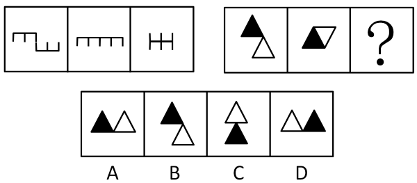

- **A**. A
- **B**. B
- **C**. C　✅
- **D**. D

**答案**：C

**官方解析**

图形元素组成相同，优先考虑位置规律。观察发现，第一组图中，图1左边的图形保持不变、右边的图形向上翻转得到图2，图2左边的图形保持不变、右边的图形继续向上翻转后向左平移，与左边的图形拼接为图3。第二组图形应用此规律，图1左边的黑色三角形保持不变、右边的白色三角形向上翻转得到图2，图2左边的黑色三角形保持不变、右边的白色三角形继续向上翻转后向左平移，得到的图形对应C项。
故正确答案为C。

---

## 第 22 题　qid 2172128 · 逻辑判断

请选择最适合的一项填入问号处，使右边图形的变化规律与左边图形一致。

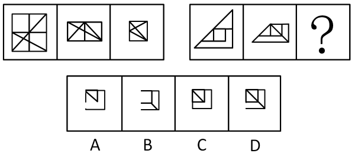

- **A**. A
- **B**. B
- **C**. C
- **D**. D　✅

**答案**：D

**官方解析**

图形元素组成相似，优先考虑样式规律。观察发现，第一组图中，图1上方的图形向下翻转后，与下方图形相加得到图2，图2左侧的图形向右翻转后，与右侧图形相加得到图3。第二组图形应用此规律，图1上方的图形向下翻转后，与下方图形相加得到图2，图2左侧的图形向右翻转后，与右侧图形相加，得到的图形左下角应有一段空白线段，对角线依然保留，对应D项。
故正确答案为D。

---

## 第 23 题　qid 2172131 · 逻辑判断

请选择最适合的一项填入问号处，使右边图形的变化规律与左边图形一致。

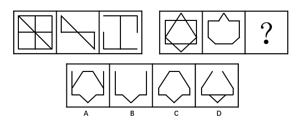

- **A**. A
- **B**. B
- **C**. C　✅
- **D**. D

**答案**：C

**官方解析**

图形元素组成相似，优先考虑样式规律。观察发现，第一组图中，图1-图2=图3。第二组图形应用此规律，图1-图2=？处图形，可得对应图形C项如下图：

故正确答案为C。

---

## 第 24 题　qid 2172133 · 逻辑判断

请选择最适合的一项填入问号处，使之符合之前四个图形的变化规律。

- **A**. A　✅
- **B**. B
- **C**. C
- **D**. D

**答案**：A

**官方解析**

图形元素组成不同，且无明显属性规律，考虑数量规律。观察发现，题干图形出现了若干元素，考虑数素。题干图形中元素的个数分别为：1、2、3、4，故？处应为5个元素，排除B、D两项。再次观察图形发现，题干每个图形中均包含1个三角形，只有A项符合。
故正确答案为A。

---

## 第 25 题　qid 2172137 · 逻辑判断

请选择最适合的一项填入问号处，使之符合之前四个图形的变化规律。

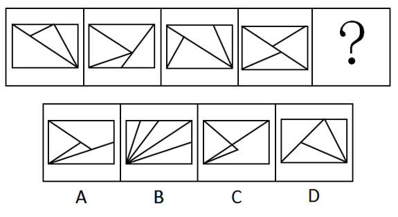

- **A**. A
- **B**. B
- **C**. C
- **D**. D　✅

**答案**：D

**官方解析**

图形元素组成不同，且无明显属性规律，考虑数量规律。观察发现，题干图形均为封闭区域被分割，优先考虑数面。观察发现，题干图形面的数量均为4，排除B项。再次观察发现，题干图形的面的形状均为三角形，故？处图形的面也应均为三角形，只有D项符合。
故正确答案为D。

---

## 第 26 题　qid 2172140 · 逻辑判断

请选择最适合的一项填入问号处，使之符合整个图形的变化规律。（  ）

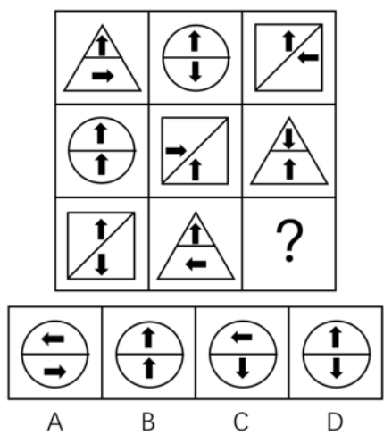

- **A**. A
- **B**. B　✅
- **C**. C
- **D**. D

**答案**：B

**官方解析**

题干每个图形中都出现了小箭头，且箭头指向不同，考虑箭头的位置规律。九宫格图形优先按横行来看，第一行中，上方箭头均保持不动，下方箭头每次顺时针旋转90度；第二行中，下方箭头均保持不动，上方箭头每次顺时针旋转90度；第三行中，图1到图2，上方箭头均保持不动，下方箭头顺时针旋转了90度，因此，？处也应延续此规律，对应得到图形B项。
故正确答案为B。

---

## 第 27 题　qid 2172145 · 逻辑判断

请选择最适合的一项填入问号处，使之符合整个图形的变化规律。（  ）

- **A**. A
- **B**. B　✅
- **C**. C
- **D**. D

**答案**：B

**官方解析**

图形元素组成相似，考虑样式规律。九宫格图形优先按横行来看，观察发现，每一行的三个图形轮廓相同、内部颜色不同，考虑黑白运算。第一行中，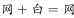，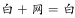，；第二行中，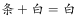，，；第三行也应该符合此规律，运算可得B项。

故正确答案为B。

---

## 第 28 题　qid 2172148 · 逻辑判断

把下面的六个图形分为两类，使每一类图形都有各自的共同特征或规律，分类正确的一项是（  ）。

- **A**. ①④⑥，②③⑤
- **B**. ①③④，②⑤⑥　✅
- **C**. ①②⑤，③④⑥
- **D**. ①②③，④⑤⑥

**答案**：B

**官方解析**

图形均由两个三角形构成，考虑三角形之间的关系。观察发现，图①③④中的两个三角形均有一条线重合，图②⑤⑥中的两个三角形均有一个顶点重合，故①③④为一组，②⑤⑥为一组。
故正确答案为B。

---

## 第 29 题　qid 2172151 · 逻辑判断

把下面的六个图形分为两类，使每一类图形都有各自的共同特征或规律，分类正确的一项是（  ）。

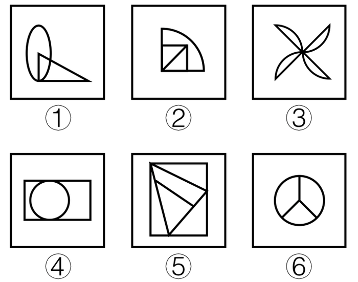

- **A**. ①④⑥，②③⑤
- **B**. ①②③，④⑤⑥
- **C**. ①③⑤，②④⑥　✅
- **D**. ①③④，②⑤⑥

**答案**：C

**官方解析**

图形元素组成不同，优先考虑属性规律。图①③⑤都不是轴对称图形，图②④⑥都是轴对称图形，故图①③⑤为一组，图②④⑥为一组。
故正确答案为C。

---

## 第 30 题　qid 2172154 · 逻辑判断

左边给定的是纸盒的外表面，右边哪一项能由它折叠而成？（  ）

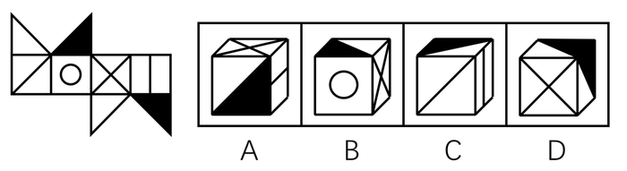

- **A**. A　✅
- **B**. B
- **C**. C
- **D**. D

**答案**：A

**官方解析**

先对题干展开图的各面进行编号，如下图所示。

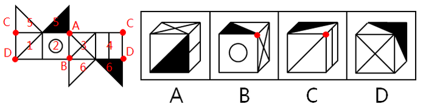

A项：由面3、面4和面6组成，与题干展开图一致，当选；

B项：由面2、面3和面5或面6组成，在题干展开图中，其三个面的公共点为A点或B点，其中A点面5中为黑色三角形直角点、B点为面6中白色三角形的直角点，而在选项中，三个面的公共点既不是黑色三角形的直角点，又不是白色三角形的直角点，选项与题干展开图不一致，排除；

C项：由面1、面4和面5或面6组成，在题干展开图中，其三个面的公共点为C点或D点，其中只有在选项三个面分别为面1、面4和面6的时候，D点会与面1中的对角线相交，但此时D点也应与面6中黑三角形的直角点重合，但选项中三个面的公共点并不与黑三角形的直角点重合，选项与题干展开图不一致，排除；

D项：由面3、面5和面6组成 ，其中面5与面6互为相对面，不能同时出现，选项与题干展开图不一致，排除。

故正确答案为A。

---
