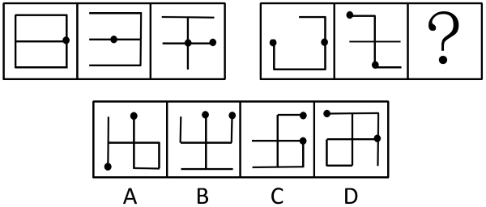
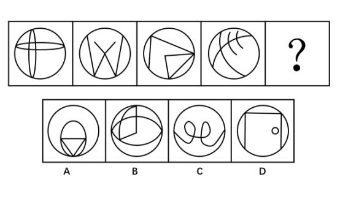
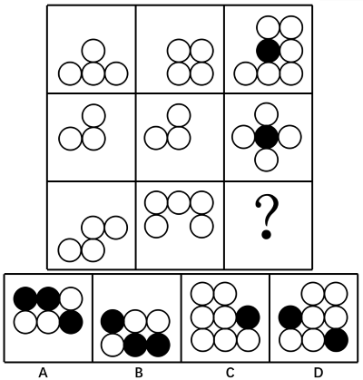
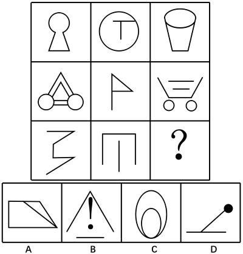

# 2018年广州市公务员录用考试 《行测》题（3月25日网友回忆版）

> 判断推理 · 30 题 · 广州市考 2018

## 第 1 题　qid 2172839 · 逻辑判断

治标：治本 与（  ）在内在逻辑关系上最为相似。

- **A**. 量变：质变　✅
- **B**. 道德：法律
- **C**. 承诺：合同
- **D**. 外貌：修养

**答案**：A

**官方解析**

第一步：判断题干词语间逻辑关系。
治标和治本是并列关系，治本比治标的程度重。
第二步：判断选项词语间逻辑关系。
A项：量变和质变是并列关系，质变比量变的程度重，与题干逻辑关系一致，当选；
B项：道德和法律是并列关系，但二者不存在程度上的轻重，与题干逻辑关系不一致，排除；
C项：合同必然会有相关的承诺，二者为必然对应关系，与题干逻辑关系不一致，排除；
D项：外貌和修养是并列关系，但二者不存在程度上的轻重，与题干逻辑关系不一致，排除。
故正确答案为A。

---

## 第 2 题　qid 2172840 · 逻辑判断

大步流星：寸步难行 与（  ）在内在逻辑关系上最为相似。

- **A**. 大公无私：公而忘私
- **B**. 大刀阔斧：雷厉风行
- **C**. 动荡不安：放荡不羁
- **D**. 江河日下：蒸蒸日上　✅

**答案**：D

**官方解析**

第一步：判断题干词语间逻辑关系。
大步流星，形容步子跨得大，走得快；寸步难行，形容走路困难，也比喻处境艰难。前者形容走的比较顺，后者形容走的不顺，二者为反义关系。
第二步：判断选项词语间逻辑关系。
A项：大公无私，指办事公正，没有私心，现多指从集体利益出发，毫无个人打算；公而忘私，指为了公事而不考虑私事，为了集体利益而不考虑个人得失，二者为近义关系，与题干逻辑关系不一致，排除。
B项：大刀阔斧，比喻办事果断而有魄力；雷厉风行，形容办事声势猛烈，行动迅速；二者都可以用来形容做事不拖泥带水，为近义关系，与题干逻辑关系不一致，排除。
C项：动荡不安，形容局势不稳定，不平静；放荡不羁，指放纵任性，不加检点，不受约束。前者形容局势不稳定，后者形容行为放纵任性，二者没有必然的关系，与题干逻辑关系不一致，排除。
D项：江河日下，比喻情况一天天地坏下去；蒸蒸日上，形容事业一天天向上发展，二者是反义关系，与题干逻辑关系一致，当选。
故正确答案为D。

---

## 第 3 题　qid 2172841 · 逻辑判断

记者：（  ）与（  ）：剪裁 在内在逻辑关系上最为相似。

- **A**. 采访，裁缝　✅
- **B**. 记录，园丁
- **C**. 新闻，衣服
- **D**. 摄像，模特

**答案**：A

**官方解析**

逐一代入选项。
A项：记者采访，裁缝剪裁，二者均为主谓关系，前后逻辑关系一致，当选；
B项：记者的主要工作是采访新闻和写通讯报道，可以说记者记录采访所了解的事实；园丁的主要工作是负责栽培护理园内植物，可以说园丁修剪植物，与剪裁没有必然的关系，前后逻辑关系不一致，排除；
C项：记者报道新闻，二者为主宾关系；剪裁衣服，二者为动宾关系，前后逻辑关系不一致，排除；
D项：记者的主要工作是采访报道，与摄像没有必然的关系；模特的主要工作是T台走秀，与剪裁没有必然的关系，前后逻辑关系不一致，排除。
故正确答案为A。

---

## 第 4 题　qid 2172842 · 逻辑判断

招商：（  ）与（  ）：自评 在内在逻辑关系上最为相似。

- **A**. 战略，得分
- **B**. 资金，对象
- **C**. 优势，问卷
- **D**. 创业，调查　✅

**答案**：D

**官方解析**

逐一代入选项。
A项：招商是企业发展的一种战略；自评指自我评价，与得分没有必然的关系，前后逻辑关系不一致，排除；
B项：招商是获取资金的一种方式；自评与对象没有必然的关系，前后逻辑关系不一致，排除；
C项：通过招商可以获得发展优势；通过问卷可以获得他人的评价，与自评没有必然的关系，前后逻辑关系不一致，排除；
D项：招商是通过广告、展览等方式吸引商家（投资、经营），是借助外部力量来获得发展，创业是通过自己的努力开创建立基业、事业，即招商对应的是外部，创业对应的是自身；调查是通过外部来了解，自评是通过自身来了解，前后逻辑关系一致，当选。
故正确答案为D。

---

## 第 5 题　qid 2172843 · 逻辑判断

拐弯抹角：（  ）与（  ）：富有 在内在逻辑关系上最为相似。

- **A**. 直接，家徒四壁　✅
- **B**. 委婉，穷困潦倒
- **C**. 直白，家财万贯
- **D**. 清楚，富可敌国

**答案**：A

**官方解析**

逐一代入选项。
A项：拐弯抹角，比喻说话绕弯，不直截了当，与直接是反义关系；家徒四壁，形容十分贫困，一无所有，与富有是反义关系，前后逻辑关系一致，当选；
B项：拐弯抹角与委婉是近义关系；穷困潦倒与富有是反义关系，前后逻辑关系不一致，排除； 
C项：拐弯抹角与直白是反义关系；家财万贯与富有是近义关系，前后逻辑关系不一致，排除；
D项：拐弯抹角和清楚没有必然的关系；富可敌国与富有是近义关系，前后逻辑关系不一致，排除。
故正确答案为A。

---

## 第 6 题　qid 2172844 · 逻辑判断

听证会：（  ）与（  ）：职工 在内在逻辑关系上最为相似。

- **A**. 证人，运动会
- **B**. 专家，职代会　✅
- **C**. 领导，展览会
- **D**. 居民，家长会

**答案**：B

**官方解析**

逐一代入选项。
A项：证人与听证会无必然联系，职工可能参加运动会，前后逻辑关系不一致，排除；
B项：专家参加听证会，职工参加职代会，前后逻辑关系一致，当选；
C项：领导与听证会无必然联系，展览会与职工无必然联系，前后逻辑关系不一致，排除；
D项：居民可能参与听证会，职工与家长会没有必然联系，前后逻辑关系不一致，排除。
故正确答案为B。

---

## 第 7 题　qid 2172845 · 逻辑判断

人民币：美元：兑换 与（  ）在内在逻辑关系上最为相似。

- **A**. 现金：支票：货币
- **B**. 写作：绘画：文字
- **C**. 诗词：音乐：旋律
- **D**. 中文：英文：翻译　✅

**答案**：D

**官方解析**

第一步：判断题干词语间逻辑关系。
人民币与美元是并列关系，两者之间可以进行兑换。
第二步：判断选项词语间逻辑关系。
A项：现金和支票是并列关系，都是货币的一种，与题干逻辑关系不一致，排除；
B项：写作与绘画是并列关系，文字是写作的载体，与题干逻辑关系不一致，排除；
C项：诗词与音乐没有必然的逻辑关系，旋律是音乐的组成部分，与题干逻辑关系不一致，排除；
D项：中文与英文是并列关系，两者之间可以进行翻译，与题干逻辑关系一致，当选。
故正确答案为D。

---

## 第 8 题　qid 2172846 · 逻辑判断

豆：黄豆：四季豆 与（  ）在内在逻辑关系上最为相似。

- **A**. 瓜：西瓜：佛手瓜　✅
- **B**. 果：糖果：罗汉果
- **C**. 茶：奶茶：乌龙茶
- **D**. 油：酱油：绵羊油

**答案**：A

**官方解析**

第一步：判断题干词语间逻辑关系。
黄豆和四季豆是并列关系，二者都是豆的一种，与豆是种属关系。
第二步：判断选项词语间逻辑关系。
A项：西瓜和佛手瓜是并列关系，二者都是瓜的一种，与瓜是种属关系，与题干逻辑关系一致，当选；
B项：糖果与罗汉果不是并列关系，与题干逻辑关系不一致，排除；
C项：乌龙茶是茶的一种，但茶是奶茶的原材料，二者不是种属关系，与题干逻辑关系不一致，排除；
D项：酱油并不是油类，“酱油”的主要原料为大豆，在晒制发酵酿制后成为酱汁；绵羊油是从天然羊毛中精炼出来的油脂（油和脂肪的统称），与油不是种属关系，与题干逻辑关系不一致，排除。
故正确答案为A。

---

## 第 9 题　qid 2172847 · 逻辑判断

医生：检查：诊断病情 与（  ）在内在逻辑关系上最为相似。

- **A**. 警察：警局：逮捕犯人
- **B**. 厨师：烹饪：品尝美食
- **C**. 演员：表演：吹拉弹唱
- **D**. 教师：讲课：传授知识　✅

**答案**：D

**官方解析**

第一步：判断题干词语间逻辑关系。
医生通过检查诊断病情，医生是动作的发出者，检查是方式，诊断病情是目的。
第二步：判断选项词语间逻辑关系。
A项：警察不能通过警局逮捕犯人，警局不是方式，警察是通过刑侦技术逮捕犯人，与题干逻辑关系不一致，排除；
B项：厨师不能通过烹饪品尝美食，而是让客人品尝美食，与题干逻辑关系不一致，排除；
C项：演员不能通过表演吹拉弹唱，吹拉弹唱不是目的，与题干逻辑关系不一致，排除；
D项：教师通过讲课传授知识，教师是动作的发出者，讲课是方式，传授知识是目的，与题干逻辑关系一致，当选。
故正确答案为D。

---

## 第 10 题　qid 2172848 · 逻辑判断

营业税：增值税：减免 与（  ）在内在逻辑关系上最为相似。

- **A**. 笔试：面试：选拔
- **B**. 燃油车：电动车：环保
- **C**. 土楼：木屋：搭建　✅
- **D**. 平信：快递：降价

**答案**：C

**官方解析**

第一步：判断题干词语间逻辑关系。
营业税和增值税是我国两大税种，二者是并列关系，减免营业税、减免增值税都是动宾结构。
第二步：判断选项词语间逻辑关系。
A项：笔试与面试是并列关系，但笔试、面试是选拔的方式，而不是动宾结构，与题干逻辑关系不一致，排除；
B项：燃油车与电动车是并列关系，但燃油车、电动车与环保不是动宾结构，与题干逻辑关系不一致，排除；
C项：土楼与木屋是并列关系，搭建土楼、搭建木屋都是动宾结构，与题干逻辑关系一致，当选；
D项：平信、快递都是邮寄的方式，二者是并列关系，但平信、快递是可能会降价，与降价是对应关系，与题干逻辑关系不一致，排除。
故正确答案为C。

---

## 第 11 题　qid 2172849 · 逻辑判断

某科研单位招聘研究人员，要求被录取人员必须具备生物学专业背景，并且得到两名同行专家的推荐。
以下哪项为真，说明录取没有遵守招聘要求？（  ）
（1）杜林被录取，但只有一名同行专家推荐；
（2）李力被录取，但他所学专业为文学；
（3）张娜生物学专业毕业，且有两名同行专家推荐，但是没有被录取。

- **A**. （1）和（2）　✅
- **B**. （2）和（3）
- **C**. （1）和（3）
- **D**. 以上都不是

**答案**：A

**官方解析**

第一步：翻译题干。
录取→生物学专业且两名专家推荐
第二步：逐一分析选项。
如果（1）为真，即被录取且只有一名专家推荐，与题干必须两名同行专家推荐矛盾，说明没有遵守招聘要求；如果（2）为真，即被录取且专业不是生物学专业，与题干必须生物学专业矛盾，说明没有遵守招聘要求；如果（3）为真，生物学专业且两名同行推荐属于肯定题干的后件，不能得到确定性的结论，即张娜可能被录取也可能不被录取，结果是张娜没有录取，遵守了招聘要求。
故正确答案为A。

---

## 第 12 题　qid 2172850 · 逻辑判断

世界级钢琴演奏家每天练习弹钢琴不少于八个小时，除非是元旦、星期天或者当天有重大的演出项目。
如果以上论述为真，以下哪个人不可能是世界级钢琴演奏家？（  ）

- **A**. 某钢琴演奏家在某个星期的星期一、星期四、星期五和星期天都没有练习弹钢琴
- **B**. 某钢琴演奏家连续三个月没有练习弹钢琴
- **C**. 某钢琴演奏家几乎每天练习跑马拉松四个小时
- **D**. 某钢琴演奏家连续三天每天练习弹钢琴七个小时，并且没有演出项目　✅

**答案**：D

**官方解析**

第一步：翻译题干。

根据题干可知“世界级钢琴家”的条件是：“除非元旦、星期天或当天有重大演出项目，否则每天练习弹钢琴不少于八小时。”

“除非······否则不”可翻译为：每天练习弹钢琴少于八小时元旦、星期天或当天有重大演出项目。

第二步：逐一分析选项。

A项：不确定星期一、星期四和星期五是否有大型演出项目，无法推出，排除；

B项：某钢琴演奏家连续三个月没有练习弹钢琴，无法确定这三个月内是否每天都有大型演出项目，无法推出，排除；

C项：练习马拉松与练习钢琴无关，无法推出，排除；

D项：这三天都没有演出，那么总有一天不是元旦、星期天，但是钢琴家这三天每天练习弹钢琴都少于八小时，因此不可能是世界级钢琴家，可以推出，当选。

本题为选非题，故正确答案为D。

---

## 第 13 题　qid 2172851 · 逻辑判断

某厅决定在厅机关选派援疆干部，并成立了由党委办、人事处、就业处组成的援疆干部推荐小组，还初定了赵某、李某、周某三个推荐人选。党委办、人事处、就业处三个部门分别提出了各自的推荐意见：
党委办：赵某、李某中只能去一个。
人事处：如果不选派赵某，就不选派周某。
就业处：只有不选派李某或赵某，才选派周某。
以下方案能同时满足三个部门意见的是（  ）

- **A**. 选派周某，不选派赵某和李某
- **B**. 选派李某和赵某，不选派周某
- **C**. 选派赵某，不选派李某和周某　✅
- **D**. 选派李某和周某，不选派赵某

**答案**：C

**官方解析**

第一步：翻译题干。
党委办：要么赵，要么李
人事处：-赵→-周
就业处：周→-李或-赵
第二步：逐一分析选项。
A项：选派周，不选派赵某，不满足人事处的意见，排除；
B项：选派李某和赵某，不满足党委办的意见，排除；
C项：可以同时满足三个部门的意见，当选；
D项：将人事处的意见进行逆否，可以推出：周→赵，因此选派周某不选派赵某，不满足人事处的意见，排除。
故正确答案为C。

---

## 第 14 题　qid 2172852 · 逻辑判断

所有优秀的物理学家都具有良好的数学运用能力，张杰没有良好的数学运用能力，所以张杰不是优秀的物理学家。
下述推理中与上述推理在结构形式上最为相似的是（  ）。

- **A**. H公司今年招聘的人才都具有良好的专业背景和综合素质，小刘具有良好的专业背景和综合素质，所以小刘是今年H公司招聘的人才
- **B**. 所有年满七十周岁的人都可以领到老年人生活补贴，王老师今年七十五周岁，他可以领到老年人生活补贴
- **C**. 所有条件适宜的环境都能使企鹅蛋孵化，但T岛上企鹅蛋没有孵化，所以T岛的环境不是适宜的　✅
- **D**. 所有被顶尖高校录取的学生都是聪明的学生，李可没有被顶尖高校录取，所以李可不是聪明的学生

**答案**：C

**官方解析**

第一步：翻译题干。
物理学家→具有良好数学运用能力；张杰没有良好的数学运用能力→不是优秀的物理学家，推理形式为否后推否前。
第二步：逐一分析选项。
A项：H招聘的人才→具有良好的专业背景和综合素质，小刘具有良好的专业背景和综合素质→H招聘的人才，推理形式为肯后推肯前，与题干不同，排除；
B项：年满七十周岁→领老年人生活补贴，王老师七十五周岁→领老年人生活补贴，推理形式为肯前推肯后，与题干不同，排除；
C项：条件适宜的环境→使企鹅蛋孵化，T岛企鹅蛋没有孵化→T岛条件不适宜，推理形式为否后推否前，与题干相同，当选；
D项：被顶尖学校录取→聪明的学生，李可没有被顶尖学校录取→不是聪明的学生，推理形式为否前推否后，与题干不同，排除。
故正确答案为C。

---

## 第 15 题　qid 2172853 · 逻辑判断

在全球化背景下，跨国公司的利润转移问题越来越成为各国政府关注的焦点。如果这一问题得不到解决，将加剧大资本与劳动之间收入分配的不平等。除非各国能够制定统一的公司所得税率，或者形成跨国界税收治理新规则，否则，这将是难解之题。
如果以上陈述为真，则以下哪项陈述必然为真？（  ）

- **A**. 各国制定统一的公司所得税率，或者形成跨国界税收治理新规则，就可以解决跨国公司的利润转移问题
- **B**. 如果跨国公司的利润转移问题得到解决，就能消除大资本与劳动之间收入分配的不平等
- **C**. 如果各国不制定统一的公司所得税率，或者不形成跨国界税收治理新规则，大资本与劳动之间收入分配的不平等将会进一步加剧　✅
- **D**. 如果各国不制定统一的公司所得税率，那么形成跨国界税收治理新规则也无法解决跨国公司的利润转移问题

**答案**：C

**官方解析**

第一步：翻译题干。
① —利润转移解决→—收入分配平等
② 利润转移解决→制定统一公司所得税率 或 跨国界税收治理新规则
将①逆否和②可以递推出：③收入分配平等→利润转移解决→制定统一公司所得税率 或 跨国界税收治理新规则
第二步：逐一分析选项。
A项：翻译为制定统一公司所得税率 或 跨国界税收治理新规则→利润转移解决，肯定②的后件，肯后得不到确定性的结论，无法推出，排除；
B项：翻译为利润转移解决→收入分配平等，否定①的前件，否前得不到确定性的结论，无法推出，排除；
C项：翻译为收入分配平等→制定统一公司所得税率 且 跨国界税收治理新规则，与③推出的结果不一致，无法推出，排除；
D项：翻译为，—制定统一公司所得税率 且 跨国界税收治理新规则→—利润转移解决，肯定②的后件，肯后得不到确定性结论，无法推出，排除。
注：本题经过粉笔教研，四个选项均无法推出，属于一道错题，没有正确答案。

---

## 第 16 题　qid 2172854 · 逻辑判断

只有具有良好的逻辑思维能力并且具有物理学专业背景的人，才能胜任这个岗位。
如果上述判断为真，以下哪项不可能为真？（  ）

- **A**. 物理学专业博士小赵胜任了这个岗位
- **B**. 从未学习过物理学知识的小李，胜任了这个岗位　✅
- **C**. 小刘具有物理学专业背景，但他不能胜任这个岗位
- **D**. 小孙不能胜任这个岗位，但他的逻辑思维能力是大家公认的

**答案**：B

**官方解析**

第一步：翻译题干。

胜任岗位  逻辑思维 且 物理学专业

第二步：逐一分析选项。

A项：已知小赵是物理学专业博士，但是没有给出小赵的逻辑思维能力情况，因此他能否胜任这个职位也不清楚，所以该项可能为真，排除；

B项：已知小李他从未学过物理学知识，无论此时他的逻辑思维能力情况如何，都是对题干后半部分的否定，依据规则否后必否前，故一定得出小李不能胜任这个岗位，但是B项说小李胜任了这个岗位，显然与题干信息相矛盾，不可能为真，当选；

C项：已知小刘具有物理学专业背景，但是没有给出小刘的逻辑思维能力情况，因此他能否胜任这个职位也不清楚，所以该项可能为真，排除；

D项：已知小孙不能胜任这个岗位，根据题干条件可知，否前得不到确定性的结论，那么他可能具有很强的逻辑思维能力，该项可能为真，排除。

故正确答案为B。

---

## 第 17 题　qid 2172855 · 逻辑判断

一项研究发现，二氧化硅是一种植物容易吸收的硅元素形态，通过使用二氧化硅改善土壤，植物可沉淀出称为“植结石”的小颗粒。颗粒中含有的硅元素可减缓昆虫的发育，颗粒的石头质地还能磨损昆虫口器，从而降低植物的虫害程度。由此，有关研究人员建议，可以在那些农作物经常受昆虫侵害的地区土壤中加入这类硅元素。
以下哪项如果为真，最能反驳上述建议？（  ）

- **A**. 各地区昆虫的耐药性及药物作用的敏感性都相同
- **B**. 受昆虫侵害严重的地区，土壤中普遍缺乏硅元素
- **C**. 农作物中的硅元素会对食用者的身体发育产生影响　✅
- **D**. 富含硅元素的农作物的口感比普通农作物更好

**答案**：C

**官方解析**

第一步：找出论点和论据。
论点：可以在那些农作物经常受昆虫侵害的地区土壤中加入这类硅元素。
论据：二氧化硅是一种植物容易吸收的硅元素形态，通过使用二氧化硅改善土壤，植物可沉淀出称为“植结石”的小颗粒。颗粒中含有的硅元素可减缓昆虫的发育，颗粒的石头质地还能磨损昆虫口器，从而降低植物的虫害程度。
第二步：逐一分析选项。
A项：说明各地区昆虫的情况都相同，也就是说在土壤中加入这类硅元素可以起到降低虫害的作用，这种做法可以大范围推广和普及，是论点成立的前提条件，为加强项，无法削弱，排除；
B项：指出缺乏硅元素的土壤中昆虫侵害严重，举例说明硅元素和降低虫害之间是有联系的，属于加强项，无法削弱，排除；
C项：指出该类硅元素会对食用者的身体发育产生影响，即在土壤中加入硅元素会造成危害，这种方式不可行，直接削弱论点，当选； 
D项：指出富含硅元素的农作物口感好，而论点讨论的是富含硅元素的农作物可以降低植物的虫害程度，二者讨论的话题不一致，属于无关选项，无法削弱，排除。
故正确答案为C。

---

## 第 18 题　qid 2172856 · 逻辑判断

每周饮酒2-10次是适量饮酒。有调查发现，每周饮酒2-10次的男士，比每周饮酒少于2次的男士患心脏病的概率要低。因此，适量饮酒可降低男士患心脏病的风险。
以下哪项为真，最不能削弱该论证？（  ）

- **A**. 适量饮酒的女士比每周饮酒少于2次的女士患肝炎的概率更高　✅
- **B**. 适量饮酒的男士更注意加强身体锻炼
- **C**. 适量饮酒的男士普遍比每周饮酒少于2次的男士要年轻
- **D**. 男士们都认为，身体良好的情况下可以适当增加饮酒量

**答案**：A

**官方解析**

第一步：找出论点和论据。
论点：适量饮酒可降低男士患心脏病的风险。
论据：调查发现，每周饮酒2-10次的男士，比每周饮酒少于2次的男士患心脏病的概率要低。
第二步：逐一分析选项。
A项：说的是适量饮酒和每周饮酒少于2次的女士患肝炎的概率问题，与题干所说的饮酒对于男士患心脏病的概率问题无关，不能削弱，当选；
B项：提出另外一个因素即适量饮酒的男士更注意加强身体锻炼，可能是这个因素导致降低了适量饮酒的男士患心脏病的风险，属于他因削弱，可以削弱，排除；
C项：提出另外一个因素即年龄因素，可能是年龄因素导致降低了适量饮酒的男士患心脏病的风险，属于他因削弱，可以削弱，排除； 
D项：说的是男士在身体好的情况下会适当增加喝酒量，而不是喝酒导致患病风险低，属于因果倒置，可以削弱，排除。
本题为选非题，故正确答案为A。

---

## 第 19 题　qid 2172857 · 逻辑判断

有教育专家提出，如果采取按照年龄、学历水平和职称等级将教师平均分配到所有学校的办法来配置教育资源，实现教育公平，就能较好解决目前因上重点学校竞争激烈而引起的社会问题。
以下哪项如果为真，将最能削弱该教育专家的观点？

- **A**. 很多重点学校老师表示支持
- **B**. 绝大多数学生和家长表示反对
- **C**. 一些重点学校老师要求到物价低的郊区学校工作
- **D**. 普通学校的硬件设施建设比起重点学校存在明显差距　✅

**答案**：D

**官方解析**

第一步：找出论点和论据。
论点：如果采取按照年龄、学历水平和职称等级将教师平均分配到所有学校的办法来配置教育资源，实现教育公平，就能较好解决目前因上重点学校竞争激烈而引起的社会问题。
论据：无。
本题只有论点，没有论据，削弱优先考虑削弱论点。
第二步：逐一分析选项。
A项：该项指出很多重点学校老师表示支持，仅为主观态度表达，但不确定最终是否能解决问题，不明确选项，不能削弱，排除；
B项：该项指出绝大多数学生和家长表示反对，仅为主观态度表达，不确定最终是否能解决问题，不明确选项，不能削弱，排除；
C项：该项指出有重点学校老师要求去物价低的郊区学校工作，与平均分配教师后是否能实现教育公平、解决问题无关，话题不一致，不能削弱，排除；
D项：该项指出普通学校的硬件设施与重点学校存在差距，说明即使将老师均等分配，硬件差距还是会导致重点学校依然具备竞争优势，故还是实现不了教育公平，也解决不了因重点学校竞争激烈而引起的社会问题，直接削弱论点，可以削弱，当选。
故正确答案为D。

---

## 第 20 题　qid 2172858 · 逻辑判断

某调查小组对Y地区吸烟青少年群体调查发现，吸烟青少年来自二手烟家庭，父母至少有一人为吸烟者。因此，该地区二手烟家庭如果能大幅减少，新的吸烟青少年数量将显著减少。

以下哪项如果为真，最能支持上述论证？

- **A**. 成年人的戒烟方法和青少年的戒烟方法是不同的
- **B**. 吸烟青少年可以通过积极的干预而戒烟
- **C**. 成年人和青少年学会吸烟的方式是相同的
- **D**. Y地区成长于二手烟家庭的青少年吸烟的比例比其他家庭高　✅

**答案**：D

**官方解析**

第一步：找出论点和论据。
论点：该地区二手烟家庭如果能大幅减少，新的吸烟青少年数量将显著减少。
论据：调查小组对Y地区吸烟青少年群体调查发现，75%吸烟青少年来自二手烟家庭，父母至少有一人为吸烟者。
第二步：逐一分析选项。
A项：说的是成年人和青少年的戒烟方法不同，讨论的是戒烟的问题，而题干所说的群体是新的吸烟青少年即开始抽烟的青少年，主体不一致，不能加强，排除；
B项：指出吸烟青少年可以通过积极的干预戒烟，和题干所说的话题不一致，不能加强，排除；
C项：指出成年人和青少年学会吸烟的方式相同，不能说明二手烟家庭如果减少能使新的吸烟青少年数量减少，不能加强，排除； 
D项：说明Y地区二手烟家庭的青少年吸烟的比例比其他家庭高，即二手烟家庭对青少年吸烟是有影响的，可以加强，当选。
故正确答案为D。

---

## 第 21 题　qid 2172859 · 逻辑判断

请选择最适合的一项填入问号处，使右边图形的变化规律与左边图形一致。

- **A**. A
- **B**. B
- **C**. C　✅
- **D**. D

**答案**：C

**官方解析**

元素组成相似，考虑样式规律，经观察，第一组图形中：第二个图形经过顺时针旋转后，与第一个图形进行去同存异运算可得第三个图形。根据此规律，第二组图形中，先将第二个图形顺时针旋转再与第一幅图形进行去同存异，可得C项。

故正确答案为C。

---

## 第 22 题　qid 2172860 · 逻辑判断

请选择最适合的一项填入问号处，使右边图形的变化规律与左边图形一致。

- **A**. A　✅
- **B**. B
- **C**. C
- **D**. D

**答案**：A

**官方解析**

元素组成不同，且每幅图均由三个圆组成，考虑图形间关系。观察发现，第一组图形中：第一个图形有两个圆是内切，有两个圆是外切，第二个图形中有两个圆是内切，第三个图形中有两个圆是外切。第二组图形也应遵循此规律，第一个图形有两个圆是内切，有两个圆是外切，第二个图形中有两个圆是内切，故？处应选择有两个圆是外切的图形，只有A项符合。
故正确答案为A。

---

## 第 23 题　qid 2172861 · 逻辑判断

请选择最适合的一项填入问号处，使右边图形的变化规律与左边图形一致。

- **A**. A　✅
- **B**. B
- **C**. C
- **D**. D

**答案**：A

**官方解析**

元素组成相同，优先考虑位置规律。第一组图形中，第二个图形是由第一个图形经过顺时针旋转以后，再左右翻转得来，第三个图形是由第一个图形左右翻转得来。第二组图形运用此规律，第二个图形是由第一个图形经过顺时针旋转以后，再左右翻转得来，第三个图形是由第一个图形左右翻转得来，故只有A项符合此规律。

故正确答案为A。

---

## 第 24 题　qid 2172862 · 逻辑判断

请选择最适合的一项填入问号处，使之符合之前四个图形的变化规律。

- **A**. A
- **B**. B
- **C**. C
- **D**. D　✅

**答案**：D

**官方解析**

元素组成不同，且无属性规律，考虑数量规律，每幅图形都是由一个圆与内部线条组成，观察发现每个图形内部线条与圆的交点的个数都是4，同理？处也应为4，A项内部线条与圆的交点为1个，B项内部线条与圆的交点为3个，C项内部线条与圆的交点为2个，D项内部线条与圆的交点为4个。
故正确答案为D。

---

## 第 25 题　qid 2172863 · 逻辑判断

请选择最适合的一项填入问号处，使之符合之前四个图形的变化规律。

- **A**. A
- **B**. B　✅
- **C**. C
- **D**. D

**答案**：B

**官方解析**

元素组成相同，优先考虑位置规律，每幅图形都有5行小圆且每行图形的颜色相同，观察发现，每幅图形均是将前一个图形中最顶端的一行圆平移到该图形的最底端，且颜色与原来相反，故？处是由第四幅图形最顶端的4个白圆，平移到？处的最底端，颜色变成黑色，排除A、C两项，观察B、D两项，不同之处在于顶端的颜色不同，观察发现，相同个数的圆所在行均与上一幅图形的颜色相反，故？处顶端有5个圆，应与第四个图形中5个圆的颜色不同，所以这5个圆应为白色。
故正确答案为B。

---

## 第 26 题　qid 2172864 · 逻辑判断

请选择最适合的一项填入问号处，使之符合整个图形的变化规律。

- **A**. A
- **B**. B　✅
- **C**. C
- **D**. D

**答案**：B

**官方解析**

解析一：图形元素组成相似，优先考虑样式规律。观察发现图形第二列旋转180度之后与第一列相加，相加后重叠部分变黑，得到的图形经过左右翻转即可得到第三列图形。经验证，第二行符合规律，故？处选择一个将第二列旋转180度后与第一列相加，相加后重叠部分变黑后再左右翻转的图形，只有B项符合。

故正确答案为B。

解析二：只出现黑圆和白圆两种元素，可以考虑元素的换算。如果将1个黑圆换算成2个白圆，则第一行和第二行均满足白圆数量：，第三行应用此规律，排除D项；观察发现第三列白圆数量均大于黑圆数量，排除A、B两项。 

故正确答案为C。

本题粉笔倾向于解析一，样式和位置的复合考法。如果命题人想考查元素数量的换算，圆的位置可以随便摆放，没必要所有图形中的圆的位置都摆放的特别有规律，而圆摆放有规律使每一行很多圆的位置是重合的，更符合元素组成相似的特征，所以从图形特征来看，考查样式和位置复合的概率更高。 

---

## 第 27 题　qid 2172865 · 逻辑判断

请选择最适合的一项填入问号处，使之符合整个图形的变化规律。

- **A**. A　✅
- **B**. B
- **C**. C
- **D**. D

**答案**：A

**官方解析**

图形元素组成不同，无明显属性规律，考虑数量规律。第一行中，图一有两个相同的锐角，图二有两个相同的直角，图三有两个相同的钝角；第二行经验证规律一致，所以第三行也应符合此规律，即图一有两个相同的锐角，图二有两个相同的直角，故？处应有两个相同的钝角，但发现此时无正确答案。观察发现，题干中每幅图都有两个相同的角，此时只有A项有两个相同的直角，B、C、D三项均无两个相同的角，因此选择A项。本题只需要考虑每幅图均有两个相同的角，不需要考虑角的大小。
故正确答案为A。

---

## 第 28 题　qid 2172866 · 逻辑判断

把下面的六个图形分为两类，使每一类图形都有各自的共同特征或规律，分类正确的一项是（    ）。

- **A**. ①③⑥，②④⑤
- **B**. ①③⑤，②④⑥
- **C**. ①②④，③⑤⑥　✅
- **D**. ①②③，④⑤⑥

**答案**：C

**官方解析**

本题考查功能元素，每幅图均有一个小黑圆和阴影三角形。考虑小黑圆与阴影三角形之间的关系，①②④中小黑圆所在的面与阴影三角形没有公共边/点，③⑤⑥中小黑圆所在的面与阴影三角形有公共边/点，所以①②④为一组，③⑤⑥为另一组。
故正确答案为C。

---

## 第 29 题　qid 2172867 · 逻辑判断

把下面的六个图形分为两类，使每一类图形都有各自的共同特征或规律，分类正确的一项是（  ）。

- **A**. ①②③，④⑤⑥
- **B**. ①②⑤，③④⑥
- **C**. ①③⑤，②④⑥
- **D**. ①④⑥，②③⑤　✅

**答案**：D

**官方解析**

图形元素组成不同，考虑属性规律。观察发现，题干图形均为轴对称图形，考虑对称性，图①④⑥既是轴对称图形又是中心对称图形，图②③⑤仅为轴对称图形，所以图①④⑥为一组，图②③⑤为一组。
故正确选项为D。

---

## 第 30 题　qid 2172868 · 逻辑判断

下图左边给定的是纸盒的外表面，右边哪一项能由它折叠而成？

- **A**. A　✅
- **B**. B
- **C**. C
- **D**. D

**答案**：A

**官方解析**

本题展开图只有五个面，空间重构后形成一个未封顶的立方体。如下图所示：将左边展开图各个面分别编号为，1、2、3、4、5。

A项：选项与展开图一致，当选；

B项：正面为面5，所以其顶面应当为面3（面5和面1为相对面，不可能同时出现），此时右面为面2或者面4。若右面为面2，则B项是由2、3、5这三个面组成。展开图中，这三个面的公共点没有经过面3中的小黑点，而选项中这三个面的公共点经过了面3中的小黑点，选项与展开图不一致；若右面为面4，则B项是由3、4、5这三个面组成。此时，展开图和选项中，面3和面4公共边两侧的小黑点的位置不一致，选项与展开图不一致，排除；

C项：正面为面5，顶面的黑点与面5比较近，所以顶面为面4，右面为面3（面5和面1为相对面，不可能同时出现）。此时，展开图和选项中，面3和面4公共边两侧的小黑点的位置不一致，选项与展开图不一致，排除；

D项：由面1、面3和另外一个面组成，展开图中，面1与面3不存在挨在一起的黑点，选项中面1黑点与面3黑点之间有一个是挨着的，选项与展开图不一致，排除。

故正确答案为A。

---
