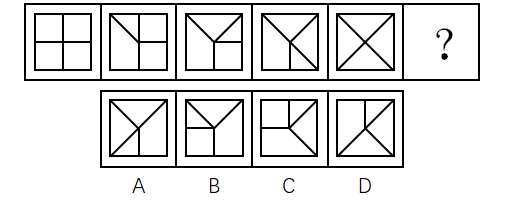
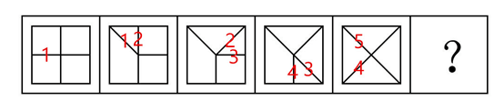
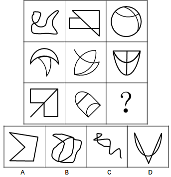
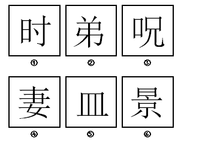

# 2018年广西公务员录用考试《行测》题（网友回忆版）

> 判断推理 · 35 题 · 广西 2018

## 第 1 题　qid 2184656 · 逻辑判断

从所给的四个选项中，选择最合适的一个填在问号处，使之呈现一定的规律性：

- **A**. A
- **B**. B
- **C**. C　✅
- **D**. D

**答案**：C

**官方解析**

观察图形，元素组成不同，且无明显属性规律，考虑数量规律。观察发现，每个图形中都有封闭区间，优先考虑数面，题干中面数量分别是1，2，3，4，5，依次递增。故？处应是面数量为6的图形。观察选项，A项1个面，B项3个面，C项6个面，D项3个面，只有C项符合。
故正确答案为C。

---

## 第 2 题　qid 2184666 · 逻辑判断

从所给的四个选项中，选择最合适的一个填在问号处，使之呈现一定的规律性：

- **A**. A
- **B**. B
- **C**. C
- **D**. D　✅

**答案**：D

**官方解析**

观察图形，元素组成相同，都由外框四边形和里面的四条短线构成，优先考虑位置规律。两两观察发现，后一个图形相较前一个图形有一条短线的位置发生变化，变化规律为顺时针旋转45度，并且发生位置变化的短线也是顺时针依次变化，如下图，？处应是标记5的短线顺时针旋转45度，故D项符合。

故正确答案为D。

---

## 第 3 题　qid 2184674 · 逻辑判断

从所给的四个选项中，选择最合适的一个填在问号处，使之呈现一定的规律性：

- **A**. A
- **B**. B　✅
- **C**. C
- **D**. D

**答案**：B

**官方解析**

观察图形，元素组成不同，且无明显属性规律，则考虑数量规律。题干图形面特征明显，可优先考虑数面。九宫格优先横行看，第一行面数量依次为：2，3，4；第二行面数量依次为：2，3，4；第三行面数量依次为：2，3，？，所以？处应填入有4个面的图形。A项1个面，B项4个面，C项3个面，D项3个面，只有B项符合。
故正确答案为B。

---

## 第 4 题　qid 2184682 · 逻辑判断

把下面的六个图形分为两类，使每一类图形都有各自的共同特征或规律，分类正确的一项是：

- **A**. ①③④，②⑤⑥　✅
- **B**. ①③⑤，②④⑥
- **C**. ①②⑥，③④⑤
- **D**. ①④⑥，②③⑤

**答案**：A

**官方解析**

观察图形，元素组成不同，且无明显属性规律，则考虑数量规律。因为①和③为直线和圆的相切图形和相交图形，②为日字变形图和田字变形图的组合图形，则可考虑数笔画数，图①有2个奇点，为一笔画图形；图②有4个奇点，为两笔画图形；图③没有奇点，为一笔画图形；图④有2个奇点，为一笔画图形；图⑤有4个奇点，为两笔画图形；图⑥有4个奇点，为两笔画图形。所以，图①③④为一组，均为一笔画图形；图②⑤⑥为一组，均为两笔画图形，对应A项。
故正确答案为A。

---

## 第 5 题　qid 2184685 · 逻辑判断

把下面的六个图形分为两类，使每一类图形都有各自的共同特征或规律，分类正确的一项是：

- **A**. ①④⑥，②③⑤
- **B**. ①③⑥，②④⑤
- **C**. ①②③，④⑤⑥　✅
- **D**. ①②④，③⑤⑥

**答案**：C

**官方解析**

观察图形，都是汉字，元素组成不同，且无属性规律，则考虑数量规律。题干中每个汉字都有封闭空间，优先考虑数面。图①有2个面，图②有2个面，图③有2个面，图④有3个面，图⑤有3个面，图⑥有3个面。所以，图①②③一组，均有2个面；图④⑤⑥一组，均有3个面。
故正确答案为C。

---

## 第 6 题　qid 2184690 · 逻辑判断

左边给定的是纸盒的外表面，下面哪一项能由它折叠而成？

- **A**. A
- **B**. B
- **C**. C　✅
- **D**. D

**答案**：C

**官方解析**

本题考查六面体的空间重构。将题干展开图中的面依次标注为123456，如下图：

A项：题干中白色扇形面中的两条直角边不在黑色扇形面的白色区域，而选项中白色扇形面中的一条直角边在黑色扇形面的白色区域，选项与题干展开图不一致，排除；

B项：题干中面1和面3的黑色阴影部分无公共点，而选项中，黑色阴影部分有公共点，选项与题干展开图不一致，排除；

C项：选项是面1，面4，面5，和题干一致，当选；

D项：题干中面4和面5的白色部分的直角点是同一点，而选项中，两个面中白色部分的直角点不是同一点，选项与题干展开图不一致，排除。

故正确答案为C。

---

## 第 7 题　qid 2184709 · 逻辑判断

间作是指在同一块田地上于同一生长期内，分行或分带相间种植两种或两种以上作物的种植方式。混作是指在同一块田地上，同期混杂种植两种或两种以上作物的种植方式。套作是指在前季作物生长后期的株行间播种或移栽后季作物的种植方式。
根据上述定义，下列属于混作的是：

- **A**. 在一块田地上种植多年大豆后，连续两年种植牧草
- **B**. 在小麦生长后期每隔3～4行种植1行玉米
- **C**. 在一块土地上每隔4～6公尺宽种植一行咖啡树形成田篱，在田篱之间种植迷迭香
- **D**. 在非洲，有时在同一块田地上随机同时种植玉米、高粱、豇豆、粟、木薯和马铃薯等作物　✅

**答案**：D

**官方解析**

第一步：找出定义关键词。
“同一块田地上，同期混杂种植两种或两种以上作物”。
第二步：逐一分析选项。
A项：在同一块田地上种植多年大豆后，连续两年种植牧草，说明牧草和大豆是单独种植的，并非同期混种两种或两种以上作物，不符合定义，排除；
B项：在小麦生长后期每隔3-4行种植1行玉米，说明小麦和玉米并非同期混种，而是小麦先种、玉米后种，且是按行种植，不符合定义，排除；
C项：在一块土地上每隔4-6公尺种植一行咖啡树，并在咖啡树中间种植迷迭香，说明咖啡树和迷迭香并非混杂种植，而是分行种植，不符合定义，排除；
D项：同一块田地上随机同时种植玉米、高粱等多种作物，符合“同期混杂种植两种或两种以上作物”，符合定义，当选。
故正确答案为D。

---

## 第 8 题　qid 2184713 · 逻辑判断

注意是心理活动对一定对象的指向和集中，是伴随着感知觉、记忆、思维、想象等心理过程的一种共同的心理特征。注意具有稳定性、分配性、转移性等特性，其中注意的转移性是指一个人能够主动地、有目的地及时将注意从一个对象或者活动调整到另一个对象或者活动。
以下情境中体现了注意的转移性的是：

- **A**. 李女士可以一边做饭一边听收音机中播报的新闻节目
- **B**. 刘先生在大会做完工作汇报，立刻开始写工作计划　✅
- **C**. 王先生无论在工作时还是在业余活动中都能做到全神贯注
- **D**. 张女士正在读报纸，忽然被窗外传来的争吵声所吸引

**答案**：B

**官方解析**

第一步：找出定义关键词。
“一个人能够主动地、有目的地及时将注意从一个对象或者活动调整到另一个对象或者活动”。
第二步：逐一分析选项。
A项：李女士可以一边做饭一边听收音机中播放的新闻节目，说明李女士是同时在做饭和收听广播，不符合定义“将注意从一个对象或者活动调整到另一个对象或者活动”，排除；
B项：刘先生在做完工作汇报后开始写工作计划，刘先生是主动地、有目的地将注意从一个活动调整到另一个活动上，符合定义，当选；
C项：王先生能做到全神贯注，并没有体现“将注意从一个对象或者活动调整到另一个对象或者活动”，不符合定义，排除；
D项：张女士正在读报纸，突然被窗外的争吵声吸引，说明张女士并非主动地、有目的地调整注意，而是被动地调整注意，不符合定义，排除。
故正确答案为B。

---

## 第 9 题　qid 2184717 · 逻辑判断

单方行政行为是指行政主体为实现行政目的单方面运用行政权所作的行为。双方行政行为是指行政主体与对方当事人平等、协商一致所作的行为。
根据上述定义，下列属于双方行政行为的是：

- **A**. 国务院颁布《突发性公共卫生事件应急条例》
- **B**. 税务机关对偷税漏税的纳税人作出罚款的处罚决定
- **C**. 市政府为修建机场与建筑企业签订公共工程承包合同　✅
- **D**. 国家旅游局发布夏季假日旅游指南和提示

**答案**：C

**官方解析**

第一步：找出定义关键词。
“行政主体与对方当事人平等、协商一致所作的行为”。
第二步：逐一分析选项。
A项：国务院颁布《突发性公共卫生事件应急条例》，是为了应对突发性公共卫生事件的行政目的而单方面运用权力所作的行为，不符合定义“行政主体与对方当事人平等、协商一致”，排除；
B项：税务机关对偷税漏税的纳税人作出罚款的决定，是为了处罚偷税漏税者的行政目的而单方面运用权力所作的行为，不符合定义“行政主体与对方当事人平等、协商一致”，排除；
C项：市政府为了修建机场与建筑企业签订公共工程承包合同，此时市政府作为一个建设单位与建筑企业属于平等地位，符合定义，当选；
D项：国家旅游局发布夏季假日旅游指南和提示，是为旅游者提供便利而单方面运用权力所作的行为，不符合定义“行政主体与对方当事人平等、协商一致”，排除。
故正确答案为C。

---

## 第 10 题　qid 2184684 · 逻辑判断

自我知识是关于某人自己的心智状态的知识，包括关于某人自己当下的经验、思想、信念或愿望的知识。
根据上述定义，下列不属于自我知识的是：

- **A**. 甲通过听电台的天气报道而得知某地正在下雨　✅
- **B**. 乙查看自己工资后决定换一个工作
- **C**. 丙意识到如果不加强锻炼，会影响自身健康
- **D**. 丁相信自己通过努力一定会成功

**答案**：A

**官方解析**

第一步：找出定义关键词。
“某人自己的心智状态的知识”、“自己当下的经验、思想、信念或愿望的知识”。
第二步：逐一分析选项。
A项：甲通过天气报道知道某地正在下雨，这个信息是由外界传送过来的，不符合“自己当下的经验、思想、信念或愿望的知识”这一关键词，不符合定义，当选； 
B项：乙查看自己的工资后决定换一个工作，是基于自己当下思想的指引而做出的辞职行为，符合“自己当下的思想的知识”这一关键词，符合定义，排除；
C项：丙意识到如果不加强锻炼，会影响自身健康，是基于自己当下思想的指引而做出的判断，符合“自己当下的思想的知识”这一关键词，符合定义，排除；
D项：丁相信自己通过努力一定会成功，是基于自己当下的信念而做出的判断，符合“自己当下的信念的知识”这一关键词，符合定义，排除。
本题为选非题，故正确答案为A。

---

## 第 11 题　qid 2184686 · 逻辑判断

挪用公款罪是指国家机关、国有公司、企业、事业单位、人民团体中从事公务的人，利用职务上主管、管理、经营、经手公共财物的权力及便利条件，挪用公款归个人使用、进行非法活动的，或者挪用公款五万元以上、进行营利活动，或者挪用公款五万元以上、超过三个月未还的。
根据上述定义，下列构成挪用公款罪的是：

- **A**. 某市环保局执法人员将被处罚单位上缴的4万元罚款隐匿不报，据为己有
- **B**. 某省扶贫办主任利用职务之便，将经手的6万元扶贫款以其子女名义投入股市，2个月后赚了钱将其归还　✅
- **C**. 某公立医院的会计利用做账的便利条件挪用医院设备购置费2万元用于家人治病，家人病好以后将钱款归还
- **D**. 某国有企业的仓库保管员将仓库中的价值10万元的货物私自出卖后用于个人高档消费，一个月后担心东窗事发借钱购买货物放回了仓库

**答案**：B

**官方解析**

第一步：找出定义关键词。
“国家机关、国有公司、企业、事业单位、人民团体中从事公务的人”、“利用职务上主管、管理、经营、经手公共财物的权力及便利条件”、“挪用公款归个人使用、进行非法活动的，或者挪用公款五万元以上、进行营利活动，或者挪用公款五万元以上、超过三个月未还的”。
第二步：逐一分析选项。
A项：环保局执法人员将被处罚单位上缴的4万元罚款隐匿不报，据为己有。执法人员只是将钱据为己有，没有明确是否“进行非法活动”，不符合定义，排除；
B项：某扶贫办主任挪用了6万元公款投入股市，是进行了营利活动，符合“挪用公款五万元以上、进行营利活动”的关键词，符合定义，当选；
C项：某公立医院的会计挪用2万元公款是为家人治病，不符合“进行非法活动”，不符合定义，排除；
D项：某国有企业的仓库保管员私自出卖10万元的货物，而不是钱，不符合“挪用公款”；用于个人高档消费，不符合“进行非法活动”的关键词，也不符合“进行营利活动”的关键词；并且一个月后借钱购买货物放回了仓库，不符合“超过三个月未还”，不符合定义，排除。
故正确答案为B。

---

## 第 12 题　qid 2184703 · 逻辑判断

信赖保护原则是行政法的一项基本原则，是指政府对自己作出的行为或承诺应守信用，不得随意变更、反复无常。
根据上述定义，下列属于违反信赖保护原则的是：

- **A**. 某市政府规定对于能够吸引外资企业投资的个人进行奖励，赵某引荐某国企业到该市进行投资，但事后市政府拒绝给付奖励　✅
- **B**. 某省工商局规定外地啤酒进入本地销售必须事先获得该局许可，同时应当缴纳特别经营费，后来该规定因涉嫌行政垄断被废除
- **C**. 某市公安局拟对钱某作出处以吊销许可证的处罚，后经调查证实钱某的行为并未违法，因此未进行处罚
- **D**. 某市环保局认为其下级部门对孙某作出的五万元处罚过重，改为罚款五千元

**答案**：A

**官方解析**

第一步：找出定义关键词。
“政府对自己作出的行为或承诺应守信用”、“不得随意变更、反复无常”。
第二步：逐一分析选项。
A项：赵某引荐某国企业符合该市规定，但是事后市政府拒绝给付奖励，违背了“政府对自己做出的行为或承诺应守信用”，当选；
B项：某省工商局的规定是涉嫌行政垄断被废除，不是政府自己更改，不符合“随意变更、反复无常”的关键词，未违背信赖保护原则，排除；
C项：某市公安局拟对钱某作出处罚，后经调查证实钱某的行为并未违法，因此未进行处罚，不符合“随意变更、反复无常”的关键词，未违背信赖保护原则，排除；
D项：某市环保局更改了下级部门的处罚，是因为处罚过重，后改为罚款五千元。此行为只是对处罚进行了修改，不符合“随意变更、反复无常”的关键词，未违背信赖保护原则，排除。
本题为选非题，故正确答案为A。

---

## 第 13 题　qid 2184710 · 逻辑判断

比附定位是指通过与竞争品牌的比较来确定自身市场地位的一种定位策略，其实质是一种借势定位。
根据上述定义，下列没有使用比附定位策略的是：

- **A**. 某国产手机厂商打出广告语“××手机——中国的苹果”后，品牌知名度迅速得到了提升
- **B**. 美国克莱斯勒汽车公司在其发展初期就在广告宣传中声称自己是美国三大汽车公司之一，收到良好宣传效果
- **C**. 某汽车公司将品牌定位在“小”上，并制作了一则广告：“想想还是小的好”，获得极大成功　✅
- **D**. 某公司在冰激凌包装上打出了“为民族品牌争气，向××（某知名企业）学习”的字样，提高了品牌知名度

**答案**：C

**官方解析**

第一步：找出定义关键词。
“通过与竞争品牌的比较来确定自身市场地位”。
第二步：逐一分析选项。
A项：某国产手机广告中用苹果手机作为比较，使得知名度迅速提升，符合“通过与竞争品牌的比较来确定自身市场地位”，符合定义，排除；
B项：美国克莱斯勒汽车公司在宣传中声称自己是美国三大汽车公司之一，是用其他两大品牌与自己作比较提高宣传效果，符合“通过与竞争品牌的比较来确定自身市场地位”，符合定义，排除；
C项：某汽车公司只是将品牌定位在“小”上来做广告，并没有与竞争品牌作比较，不符合“通过与竞争品牌的比较来确定自身市场地位”，不符合定义，当选；
D项：某公司宣传中用向某知名企业学习的字样来提高知名度，虽然不明确知名企业是否存在该公司的竞争品牌，但C项并没有与竞争品牌作比较，相比来说该项更符合定义，排除。
本题为选非题，故正确答案为C。

---

## 第 14 题　qid 2184715 · 逻辑判断

桂林：北海

- **A**. 墨汁：颜料
- **B**. 开水：自来水
- **C**. 氧气：空气
- **D**. 红茶：黑茶　✅

**答案**：D

**官方解析**

第一步：判断题干词语间的逻辑关系。
桂林和北海是广西壮族自治区地级市，两者是并列关系的反对关系。
第二步：判断选项词语间的逻辑关系。
A项：墨汁主要用于书法，颜料主要用于制造涂料、油墨、油画色膏、化妆油彩、彩色纸张等，两者所在的领域不同，与题干逻辑关系不一致，排除；
B项：自来水加热可以变成开水，与题干逻辑关系不一致，排除； 
C项：氧气是空气的组成部分，两者是组成关系，与题干逻辑关系不一致，排除；
D项：红茶和黑茶都是茶叶中的发酵茶，两者是并列关系中的反对关系，与题干逻辑关系一致，当选。
故正确答案为D。

---

## 第 15 题　qid 2184718 · 逻辑判断

嫁：娶

- **A**. 教：授
- **B**. 订：阅
- **C**. 买：卖　✅
- **D**. 进：出

**答案**：C

**官方解析**

第一步：判断题干词语间逻辑关系。
“嫁”和“娶”是结婚时当事双方同时发生的行为，一方“嫁”，另一方“娶”，二者是并列关系。
第二步：判断选项词语间逻辑关系。
A项：“教”和“授”都有传给别人知识或技能的意思，传道授业时当事双方一方是“教”，另一方是“学”。与题干逻辑关系不一致，排除。
B项：“订”和“阅”不是同一事件中当事双方同时发生的行为，与题干逻辑关系不一致，排除。
C项：“买”和“卖”是交易时当事双方同时发生的行为，一方“买”，另一方“卖”，二者是并列关系，与题干逻辑关系一致，当选。
D项：“进”和“出”不是同一事件中当事双方同时发生的行为，与题干逻辑关系不一致，排除。
故正确答案为C。

---

## 第 16 题　qid 2184721 · 逻辑判断

罪犯：作案

- **A**. 夫妻：结婚　✅
- **B**. 律师：辩论
- **C**. 总统：出访
- **D**. 员工：管理

**答案**：A

**官方解析**

第一步：判断题干词语间的逻辑关系。
作案是成为罪犯的必要条件，二者为必要条件的对应关系。
第二步：判断题干词语间的逻辑关系。
A项：结婚是成为夫妻的必要条件，二者为必要条件的对应关系，与题干逻辑关系一致，当选；
B项：辩论不是成为律师的必要条件，二者不是必要条件的对应关系，与题干逻辑关系不一致，排除；
C项：出访不是成为总统的必要条件，二者不是必要条件的对应关系，与题干逻辑关系不一致，排除；
D项：管理不是成为员工的必要条件，二者不是必要条件的对应关系，与题干逻辑关系不一致，排除。
故正确答案为A。

---

## 第 17 题　qid 2184723 · 逻辑判断

清洁：污垢

- **A**. 守时：信用
- **B**. 沟通：误解　✅
- **C**. 背诵：记忆
- **D**. 批评：改正

**答案**：B

**官方解析**

第一步：判断题干词语间的逻辑关系。
通过清洁可以消除污垢，清洁是消除方式，污垢是消除对象，二者为对应关系。
第二步：判断选项词语间的逻辑关系。
A项：通过守时可以建立信用，守时是信用的一种表现方式，与题干逻辑关系不一致，排除；
B项：通过沟通可以消除误解，沟通是消除方式，误解是消除对象，二者为对应关系，与题干逻辑关系一致，当选；
C项：通过背诵可以加强记忆，背诵是加强记忆的一种方式，与题干逻辑关系不一致，排除；
D项：通过批评可以帮助改正错误，改正属于动词，不能作为消除对象，与题干逻辑关系不一致，排除。
故正确答案为B。

---

## 第 18 题　qid 2184725 · 逻辑判断

土地：耕种

- **A**. 共享单车：租金
- **B**. 电子报纸：便利
- **C**. 矩阵二维码：支付　✅
- **D**. 剪纸艺术：传播

**答案**：C

**官方解析**

解法一：
第一步：判断题干词语间的逻辑关系。
耕种是土地的功能，二者为功能的对应。
第二步：判断选项词语间的逻辑关系。
A项：租金不是共享单车的功能，支付租金是共享单车的使用条件，共享单车的功能是骑行，与题干逻辑关系不一致，排除；
B项：电子报纸的功能是传播新闻，不是便利，与题干逻辑关系不一致，排除；
C项：矩阵二维码的功能是支付，二者为功能的对应，与题干逻辑关系一致，当选；
D项：剪纸艺术的功能是装饰，不是传播，与题干逻辑关系不一致，排除。
故正确答案为C。
解法二：
第一步：判断题干词语间的逻辑关系。
耕种土地，二者为动宾结构。
第二步：判断选项词语间的逻辑关系。
A项：租金与共享单车无法构成动宾结构，与题干逻辑关系不一致，排除；
B项：电子报纸与便利无法构成动宾结构，与题干逻辑关系不一致，排除；
C项：矩阵二维码与支付无法构成动宾结构，与题干逻辑关系不一致，排除；
D项：传播剪纸艺术，二者为动宾结构，与题干逻辑关系一致，当选。
故正确答案为D。
注：本题为争议题，二种解法均可。

---

## 第 19 题　qid 2184630 · 逻辑判断

蚊子：蚊帐：蚊香

- **A**. 院子：木门：铁门
- **B**. 暴雨：雨伞：雨衣　✅
- **C**. 窗户：窗纱：窗帘
- **D**. 疾病：疫苗：病菌

**答案**：B

**官方解析**

第一步：判断题干词语间逻辑关系。
蚊帐和蚊香都是用来防止蚊子叮咬的工具，且蚊帐和蚊香属于并列关系。
第二步：判断选项词语间的逻辑关系。
A项：木门、铁门属于并列关系，但是二者与院子属于组成关系，不是对应关系，与题干逻辑关系不一致，排除；
B项：雨伞和雨衣是用来防止暴雨侵袭的工具，且雨伞和雨衣属于并列关系，与题干逻辑关系一致，当选；
C项：窗纱、窗帘属于并列关系，二者与窗户属于对应关系，但不是工具对应，与题干逻辑关系不一致，排除；
D项：疫苗可以抑制一些病菌，预防疾病发生，疫苗与病菌不属于并列关系，与题干逻辑关系不一致，排除。
故正确答案为B。

---

## 第 20 题　qid 2184632 · 逻辑判断

灯：照明：装饰

- **A**. 房子：明亮：宽敞
- **B**. 水：浇灌：饮用　✅
- **C**. 中国：湖南：山西
- **D**. 门窗：玻璃：钢铁

**答案**：B

**官方解析**

第一步：判断题干词语间逻辑关系。
灯具有照明和装饰的功能，对应关系。
第二步：判断选项词语间逻辑关系。
A项：明亮、宽敞的房子，是偏正结构，与题干逻辑关系不一致，排除；
B项：水具有灌溉和饮用的功能，对应关系，与题干逻辑关系一致，当选；
C项：湖南和山西并列，都属于中国的一个省，组成关系，与题干逻辑关系不一致，排除；
D项：玻璃和钢铁是门窗的原材料，与题干逻辑关系不一致，排除。
故正确答案为B。

---

## 第 21 题　qid 2184634 · 逻辑判断

报纸：读者：发行量

- **A**. 论文：作者：引用率
- **B**. 港口：货物：吞吐量
- **C**. 影片：观众：票房　✅
- **D**. 比赛：主办方：赞助费

**答案**：C

**官方解析**

第一步：判断题干词语间逻辑关系。
“读者”是“报纸”的服务对象，“报纸”销售越多，“发行量”越大，“读者”越多。
第二步：判断选项词语间逻辑关系。
A项：“论文”的服务对象不是“作者”，而是读者，与题干逻辑关系不一致，排除。
B项：“港口”用于存放运输“货物”，经水运输出或输入并经过装卸作业的“货物”越多，“吞吐量”越大，与题干逻辑关系不一致，排除。
C项： “观众”是“影片”的服务对象，“影片”销售越多，“票房”越高，“观众”越多，与题干逻辑关系一致，当选。
D项：“主办方”是主办“比赛”的主体，不是“比赛”的服务对象，与题干逻辑关系不一致，排除。
故正确答案为C。

---

## 第 22 题　qid 2184636 · 逻辑判断

收集素材：编辑整理：出版发行

- **A**. 需求调研：软件开发：交付使用　✅
- **B**. 突发险情：山体滑坡：紧急救援
- **C**. 购买车票：行李安检：预付票款
- **D**. 网络搜索：实地考察：商家发货

**答案**：A

**官方解析**

第一步：判断题干词语间的逻辑关系。
先收集素材，再编辑整理，最后出版发行，题干三者之间为时间的先后顺序并且主体一致，都是出版社。
第二步：判断选项词语间的逻辑关系。
A项：先需求调研，再软件开发，最后交付使用，三者之间为时间的先后顺序并且主体一致，都是软件开发公司，与题干逻辑关系一致，当选； 
B项：山体滑坡是突发险情的一种，二者为种属关系，突发险情需要紧急救援，二者是对应关系，与题干逻辑关系不一致，排除；
C项：应先预付票款，再购买车票，最后行李安检，选项时间顺序错误，与题干逻辑关系不一致，排除；
D项：先进行网络搜索，再实地考察，然后商家发货，三者之间为时间的先后顺序但是主体不一致，网络搜索和实地考察的主体是买家，发货的主体是商家，与题干逻辑关系不一致，排除。
故正确答案为A。

---

## 第 23 题　qid 2184639 · 逻辑判断

（  ）对于 轮船 相当于 电报 对于（  ）

- **A**. 竹筏  电话　✅
- **B**. 货轮  微信
- **C**. 钢铁  通信方式
- **D**. 发动机  传送信息

**答案**：A

**官方解析**

逐一代入选项。
A项：竹筏和轮船均是交通工具的一种，二者为并列关系；电报和电话均是通讯工具的一种，二者为并列关系，前后逻辑关系一致，当选；
B项：货轮是轮船的一种，二者为种属关系；电报和微信均为通讯方式的一种，二者为并列关系，前后逻辑关系不一致，排除；
C项：钢铁是轮船的原材料，二者为原材料和成品的对应；电报是一种通信方式，二者为种属关系，前后逻辑关系不一致，排除；
D项：发动机是轮船的组成部分，二者为组成关系；电报的功能是传递信息，二者为功能的对应，前后逻辑关系不一致，排除。
故正确答案为A。

---

## 第 24 题　qid 2184657 · 逻辑判断

许多大城市的中小学校门口，在每天早晚交通高峰期，都能看到接送孩子的车队长龙。有人认为，开车接送孩子上学是导致交通严重拥堵的原因。
以下哪项如果为真，最能削弱上述观点？

- **A**. 
由于中小学校车的使用率很低，大量家长都选择驾车接送孩子上学

- **B**. 
寒暑假期间早高峰的交通拥堵程度降低，并且空气污染程度也降低

- **C**. 
大城市的中小学校多位于城市的核心区，车流量和人流量本身就很大
　✅
- **D**. 
国家出台了划分学区的政策后，许多孩子可以就近上学

**答案**：C

**官方解析**

第一步：找出论点和论据。
论点：开车接送孩子上学是导致交通严重拥堵的原因。
论据：许多大城市的中小学校门口，每天早晚交通高峰期，都能看到接送小孩的车队长龙。
第二步：逐一分析选项。
A项：校车的使用率低，导致大量家长选择驾车接送小孩上学，解释了开车接送孩子上学的原因，没有涉及到交通拥堵的原因，话题不一致，排除；
B项：寒暑假期间不用接送小孩上学，早高峰的交通拥堵降低，说明了开车接送小孩上学确实加强了交通拥堵，加强结论，排除；
C项：大城市的中小学校多位于城市的核心区，车流量和人流量本身就很大，可能是造成拥堵的其他原因，他因削弱，当选； 
D项：划分学区政策可以让小孩就近上学，与交通拥堵的原因无关，属于无关选项，排除。
故正确答案为C。

---

## 第 25 题　qid 2184665 · 逻辑判断

随着个体化医疗和临床癌症基因组研究的发展，基因检测服务需求越来越广泛。基因组学技术和靶向治疗能够为癌症患者带来巨大益处，在癌症研究领域使用基因组学技术治疗疾病对患者来说很有吸引力，所以网络上提供基因检测服务的公司越来越受追捧。但专家发现，大部分网站提供的个性化癌症诊断或治疗的基因检测项目中至少有一项没有临床应用价值。
由此可以推出：

- **A**. 网络基因检测公司的有些服务没有临床意义　✅
- **B**. 并非所有的基因检测项目都是科学、准确的
- **C**. 并非所有的基因检测项目都是跟癌症有关的
- **D**. 个性化医疗的推广促进了基因组研究的开展

**答案**：A

**官方解析**

日常结论题，根据题干信息逐一分析选项。
A项：题干中专家发现网站上提供的基因项目至少有一项没有临床应用价值，与选项网络基因检测公司的某些服务没有临床意义一致，当选；
B项：基因检测项目是否科学、准确，题干没有提到，无中生有，排除；
C项：题干提到的是癌症研究领域与诊断或治疗癌症有关的基因检测项目，并没有提到其他与癌症无关的基因检测项目，不明确项，排除；
D项：题干中描述的是个体化医疗和基因组研究的开展，使得基因检测服务需求越来越广泛，但并没有提到个体化医疗和基因组研究的开展之间的关系，属于无中生有，排除。
故正确答案为A。

---

## 第 26 题　qid 2184670 · 逻辑判断

研究人员研究了13只克隆绵羊，其中4只是世界上第一只体细胞克隆羊“多莉”的复制品。研究者检测了这些克隆羊的肌肉骨骼、新陈代谢和血压情况。结果发现，与对照组羊对比，这些克隆羊仅患轻度骨关节炎，只有一只为中度。它们没有新陈代谢疾病的症状，血压也正常，相对健康。因此，研究人员指出，克隆动物的衰老过程正常。
以下哪项如果为真，最能削弱上述论证？

- **A**. 研究中对照组羊的年龄比实验组羊的年龄小
- **B**. 世界上第一只克隆羊“多莉”仅仅存活了6年
- **C**. 目前的体细胞克隆技术还远远没达到完善地步
- **D**. 研究人员没有检测与衰老相关的主要分子标记　✅

**答案**：D

**官方解析**

第一步：找出论点和论据。
论点：因此，研究人员指出，克隆动物的衰老过程正常。
论据：研究人员研究了13只克隆绵羊，其中4只是世界上第一只体细胞克隆羊“多莉”的复制品。研究者检测了这些克隆羊的肌肉骨骼、新陈代谢和血压情况。结果发现，与对照组羊对比，这些克隆羊仅患轻度骨关节炎，只有一只为中度。它们没有新陈代谢疾病的症状，血压也正常，相对健康。
第二步：逐一分析选项。
A项：研究中对照组羊的年龄比实验组羊的年龄小，只能表明年龄大的实验组挺健康，但并没有明确说明和衰老的关系，不明确项，无法削弱，排除；
B项：第一只克隆羊“多莉”仅仅存活了6年，和题干论点讨论的“衰老过程是否正常”无关，无法削弱，排除；
C项：目前的体细胞克隆技术还没达到完善，不能说明克隆动物的衰老过程正常，无法削弱，排除； 
D项：研究人员没有检测与衰老相关的主要分子标记，说明实验推不出衰老是否正常这个结论，断开了论点和论据之间的联系，拆桥项，可以削弱，当选。
故正确答案为D。

---

## 第 27 题　qid 2184676 · 逻辑判断

土卫二是土星的一颗被包裹在厚厚冰层中、含有海洋的小型卫星。近日，“卡西尼”号无人探测器探测到从土卫二表面的裂缝中喷出的汽柱中存在氢分子。科学家据此推断，在土卫二的岩石核心与位于其冰壳之下的海洋之间，很可能正在发生热液化学反应，这意味着土卫二几乎具备了蕴育生命所必需的条件，未来人类可以对土卫二展开探索以寻找生命迹象。
以下哪项如果为真，最能质疑上述论证？

- **A**. “卡西尼”号探测器绕土星飞行了13年，未曾发现土卫二上存在生命
- **B**. 在土卫二尚未发现生命所需的硫和磷　✅
- **C**. 地球上，海底热泉中的氢可以充当微生物的食物以及复杂生态系统的基础
- **D**. 此前通过哈勃望远镜获得了木星卫星不存在生命迹象的证据

**答案**：B

**官方解析**

第一步：找出论点和论据。
论点：土卫二几乎具备了蕴育生命所必需的条件，未来人类可以对土卫二展开探索以寻找生命迹象。
论据：“卡西尼”号无人探测器探测到从土卫二表面的裂缝中喷出的汽柱中存在氢分子。
第二步：逐一分析选项。
A项：“卡西尼”号探测器13年内未曾发现土卫二上存在生命，不表示土卫二上没有生命的存在，不能削弱，排除；
B项：土卫二还没有发现生命所需的硫和磷，直接削弱了“土卫二几乎具备了蕴育生命所必需的条件”，削弱论点，当选；
C项：地球上的氢可以充当微生物的生态系统的基础，与土卫二无关，为无关项，排除；
D项：木星卫星不存在生命迹象与题干土卫二无关，为无关项，排除。
故正确答案为B。

---

## 第 28 题　qid 2184643 · 逻辑判断

甲：“吃鱼可以使人聪明。”
乙：“对，我从小就不爱吃鱼，所以我就笨。”
为了使乙的论证成立，必须补充以下哪项为前提？

- **A**. 不爱吃鱼的人一定都笨　✅
- **B**. 聪明的人一定都爱吃鱼
- **C**. 笨的人一定都不爱吃鱼
- **D**. 爱吃鱼的人一定都聪明

**答案**：A

**官方解析**

第一步：找出论点和论据。
论点：笨。
论据：不爱吃鱼。
第二步：逐一分析选项。
A项：在不爱吃鱼与笨之间搭桥，属于加强论证，当选；
B项：说的是聪明的人爱吃鱼，也就是不爱吃鱼的人就不聪明，但是不聪明并不代表一定是笨的，而论点说的是笨人，所以是无关选项，无法加强，排除；
C项：在笨人与不爱吃鱼之间搭桥，但是搭桥的方向反了，排除； 
D项：说的是爱吃鱼的人聪明，而论点说的是笨人，二者讨论的话题不一致，无法加强，排除。
故正确答案为A。

---

## 第 29 题　qid 2184651 · 逻辑判断

好朋友问冰冰：“你是不是不能接受你没有被录取的结果？”
这句话隐含的前提是：

- **A**. 冰冰没办法接受自己没被录取
- **B**. 冰冰应该接受她没被录取的结果
- **C**. 冰冰没有被录取　✅
- **D**. 冰冰是个心理承受能力较差的人

**答案**：C

**官方解析**

第一步：找出论点和论据。
论点：好友问冰冰是否能接受自己没有被录取的结果。
论据：无。
第二步：逐一分析选项。
A项：论点并不确定冰冰到底能不能接受，无关选项，排除；
B项：论点并不涉及冰冰是否应该接受她没被录取的结果，为无关选项，排除；
C项：论点针对的结果是没被录取，如果冰冰被录取了，该论点问题就不存在了，因此没有被录取是论点成立的必要条件，当选； 
D项：题干话题和心理素质无关，排除。
故正确答案为C。

---

## 第 30 题　qid 2184661 · 逻辑判断

数十年来，在恐龙研究中存在这样一个观点：某些恐龙可以根据其骨骼差异来分辨性别。比如，雄性安氏原角龙与雌性的区别在于，雄性具有更宽的头盾，鼻子上的突起也更大。
以下哪项如果为真，最能支持上述观点？

- **A**. 研究者重新分析恐龙化石原始数据，利用混合模型等统计方法进行检验，结果发现恐龙并不存在两性骨骼差异
- **B**. 鸟类和鳄鱼是最接近恐龙的现存动物，雄性鳄鱼比雌性大得多，而鸟类的两性骨骼差异更加明显，如雄孔雀长着巨大的艳丽尾羽，而雌孔雀则朴实无华
- **C**. 目前，有关恐龙的数据样本十分零散，某些恐龙物种的化石也没有获得足够的数量
- **D**. 髓质骨富含钙质，能为蛋壳的生成贮存原料，仅存在于产卵雌性恐龙的长骨中　✅

**答案**：D

**官方解析**

第一步：找出论点和论据。
论点：某些恐龙可以根据其骨骼差异来分辨性别。
论据：雄性安氏原角龙与雌性的区别在于，雄性具有更宽的头盾，鼻子上的突起也更大。
第二步：逐一分析选项。
A项：恐龙不存在两性骨骼差异，说明不能通过骨骼差异来分辨性别，是对论点的否定，不能加强，排除；
B项：指出鸟类和鳄鱼性别之间有骨骼差异，而鸟类和鳄鱼是最接近恐龙的现存动物，所以恐龙也可能性别之间有骨骼差异，属于类比加强，保留；
C项：指出样本数量不足，对论点的得出进行质疑，不能加强，排除；
D项：髓质骨仅存在于产卵雌性恐龙的长骨中，说明可以通过骨骼中是否有髓质骨来分辨是雌性还是雄性的恐龙，属于补充论据加强，保留。
在加强题中，类比属于最弱的加强方式，力度弱于补充论据，故择优选择D项。
故正确答案为D。

---

## 第 31 题　qid 2184669 · 逻辑判断

所有未来企业都是互联网企业，而任何互联网企业都面临竞争压力。因此，甲类工厂不是未来企业。
要使上述论证成立，需要补充以下哪项作为前提？

- **A**. 甲类工厂不面临竞争压力　✅
- **B**. 互联网企业不都是甲类工厂
- **C**. 甲类工厂是互联网企业
- **D**. 互联网企业都是未来企业

**答案**：A

**官方解析**

第一步：找出论点和论据。

论点：甲类工厂不是未来企业，即：甲-未来企业，逆否等价可变为：未来企业-甲

论据：所有未来企业都是互联网企业，而任何互联网企业都面临竞争压力。即：未来企业互联网企业面临竞争压力。

论点论据话题不一致，可考虑论据向论点搭桥，即：①互联网企业-甲 或②面临压力-甲

第二步：逐一分析选项。

A项：甲-面临压力，符合②的逆否等价命题，搭桥项，当选；

B项：不都是即有的是有的不是，无法解释为什么甲不是未来企业，无关选项，排除；

C项：并不符合命题①，搭桥错误，无关选项，排除；

D项：互联网企业是否是未来企业无法解释为什么甲不是未来企业，无关选项，排除。

故正确答案为A。

---

## 第 32 题　qid 2184673 · 逻辑判断

随着年龄的增长，人们对物质的需求逐渐减少，而对精神的需求逐渐增多。因此，为了满足日益增长的精神需求，老年人应当比年轻时更积极地参加文体活动。
以下哪项如果为真，最能支持上述结论？

- **A**. 随着社会的进步，老年人比年轻人有更多的精神需求
- **B**. 比年轻时更积极参加文体活动的老年人生活更充实　✅
- **C**. 一些老年人的物质生活并不富足
- **D**. 老年人的精神需求并不比年轻人多

**答案**：B

**官方解析**

第一步：找出论点和论据。
论点：为了满足日益增长的精神需求，老年人应当比年轻时更积极地参加文体活动。
论据：随着年龄的增长，人们对物质的需求逐渐减少，而对精神的需求逐渐增多。
第二步：逐一分析选项。
A项：老年人比年轻人有更多的精神需求，与论据中随着年龄增长，老年比他年轻时有更多精神需求不同。选项强调的是同一时期的老年人和年轻人两类人，而不是题干中一个人的年龄增长过程中年老和年轻两个状态，与题干无关，无法加强，排除；
B项：老年人参加文体活动比年轻时生活更充实，解释了老年人应当比年轻时更积极参加文体活动的原因，补充论据，可以加强，当选；
C项：老年人生活富足与参加文体活动无关，无法加强，排除； 
D项：老年人与年轻人精神需求作比较，而不是题干老年人与他本身年轻时作比较，无法加强，排除。
故正确答案为B。

---

## 第 33 题　qid 2184696 · 逻辑判断

根据统计结果，2006年至2016年，我国处于世界前的高被引论文为1.69万篇，占世界总数的，超过德国排在世界第3位；我国近两年间发表的论文得到大量引用，被引用次数进入本学科前的国际热点论文为5篇，占世界总数的，世界排名首次达到第3位。此外，我国8个学科领域的论文被引用次数排名世界第2位，包括农业科学、化学、计算机科学、工程技术、材料科学、数学、药学与毒物学、物理学。这表明，近年来我国科技论文的国际影响力持续提升。

由此可以推出:

- **A**. 
近两年国家创新驱动发展战略取得明显实效

- **B**. 
排名靠前的高被引论文占比和论文的国际影响力密切相关
　✅
- **C**. 
我国农业科学处于世界前的高被引论文占世界总数超过

- **D**. 
近两年间发表的被引用次数进入本学科前的国际热点论文总数超过2000篇

**答案**：B

**官方解析**

日常结论题，根据题干信息逐一分析选项。

A项：题干中没有涉及到国家创新驱动发展战略，无中生有，排除； 

B项：题干从多个方面论述我国排名靠前的高被引论文多，然后得出结论我国论文国际影响力高，说明两者密切相关，可以推出，当选； 

C项：题干只说到了前的高被引进论文占世界总数的，未涉及农业科学的高引进占比，无法推出，排除； 

D项：题干说近两年我国发表论文被引用次数进入前的为5篇，占世界总数的，可以算出进入本学科前的国际热点论文总数为，约为28篇，并不是2000篇，无法推出，排除。

故正确答案为B。

---

## 第 34 题　qid 2184701 · 逻辑判断

课间休息时，一位同学帮老师擦了黑板，老师回到教室后询问是谁擦的黑板。
他问了四位同学，得到以下回答：
（1）或者班长擦了，或者学习委员擦了
（2）如果纪律委员没擦，那么班长也没擦
（3）如果卫生委员没擦，那么班长擦了
（4）班长和学习委员都没擦
实际上，四位同学的回答中只有一句是假的。据此可以推出擦黑板的是：

- **A**. 纪律委员
- **B**. 学习委员
- **C**. 卫生委员　✅
- **D**. 班长

**答案**：C

**官方解析**

第一步：整理题干信息。

（1）班长 或 学习委员；

（2）纪律委员班长；

（3） 卫生委员班长；

（4）班长 且 学习委员。

第二步：分析题干。

由提问可知，本题为真假推理，先找矛盾关系，（1）和（4）为矛盾关系，必有一真一假，结合提问，只有一句为假，说明（2）（3）为真，对条件（2）进行逆否等价可知：班长纪律委员，假设班长擦了黑板，则纪律委员也擦了黑板，不符合题干中的只有一位同学擦了黑板，故班长没有擦黑板，对（3）进行逆否等价，可知：班长卫生委员，故班长没有擦黑板，可以推出卫生委员擦了黑板。

故正确答案为C。

---

## 第 35 题　qid 2184704 · 逻辑判断

为了保护斑点猫头鹰，某国政府规定禁止砍伐西北太平洋沿岸的古森林。这一规定施行后，当地的经济状况出现了衰退。由此可见，采取保护斑点猫头鹰的措施导致了经济衰退。
为了使上述结论成立，必须补充以下哪项作为前提？

- **A**. 采取保护斑点猫头鹰的措施是在经济衰退前发生的唯一与衰退关联的事情　✅
- **B**. 全世界在这一时期都出现了经济衰退的迹象
- **C**. 当地经济状况在采取保护斑点猫头鹰的措施之前一直很好
- **D**. 停止对西北太平洋沿岸古森林的砍伐是保护斑点猫头鹰的唯一方法

**答案**：A

**官方解析**

第一步：找出论点和论据。
论点：采取保护斑点猫头鹰的措施导致了经济衰退。
论据：为了保护斑点猫头鹰，某国政府规定禁止砍伐西北太平洋沿岸的古森林，这一规定施行后，当地的经济状况出现了衰退。
第二步：逐一分析选项。
A项：说明该措施是唯一与经济衰退有关的事情，没有其他事情会影响到经济，为论点提供了必要条件，可以支持，保留；
B项：全世界范围内都有经济衰退的现象是目前的一种状态，没有提到导致经济衰退的原因，为无关项，不能支持，排除；
C项：经济状况在采取措施之前是很好的，讨论的是采取措施之前的情况，补充了反面的例子，有一定的加强力度，保留；
D项：讨论的是保护猫头鹰的方法，而论点在讨论停止砍伐森林保护猫头鹰是否会导致经济衰退，二者话题不一致，不能支持，排除。
对比A、C两项，C项只是说保护措施前一直很好，更好的补充对比论据应该是说保护猫头鹰措施之前经济没有衰退，且“一直很好”不完全等同于“一直没有衰退”，故C项的加强力度较弱，对比择优，A项更好。
故正确答案为A。

---
