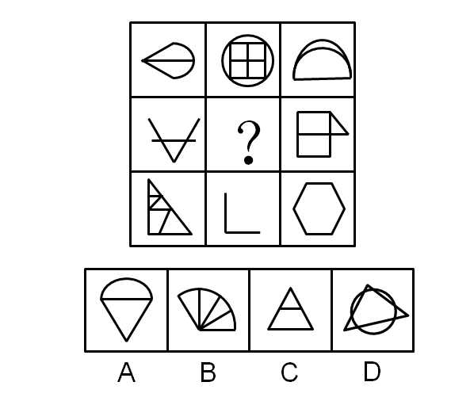
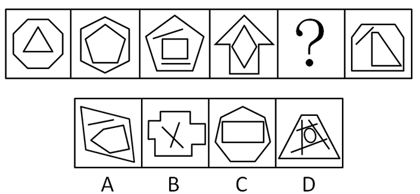
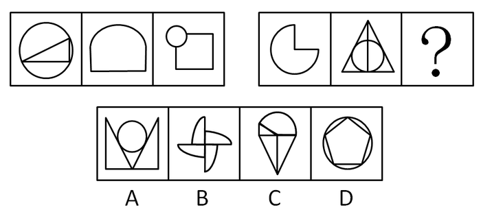
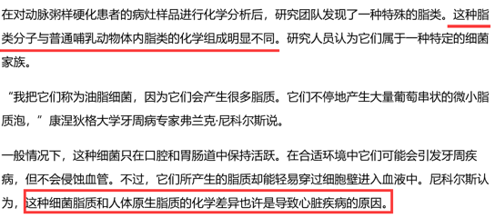
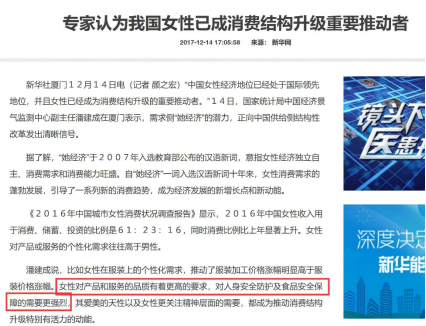

# 2018年新疆生产建设兵团面向社会招录公务员考试《行测》题（网友回忆版）

> 判断推理 · 30 题 · 新疆 2018

## 第 1 题　qid 2247186 · 图形推理

从所给四个选项中，选择最合适的一个填入问号处，使之呈现一定的规律性：

- **A**. A
- **B**. B
- **C**. C　✅
- **D**. D

**答案**：C

**官方解析**

解析一：元素组成不同，且无明显属性规律，考虑数量规律。题干图形出现了明显的线条相交叉，考虑数交点，九宫格优先横行观察，交点的数量第一行依次为4、9、2，第二行依次为3、？、7，第三行依次为8、1、6。横向上的交点和为15，因此问号处应选择一个交点数为5的图形，A选项3个交点，B选项6个交点，C选项5个交点，D选项9个交点。
故正确答案为C。
解析二：元素组成不同，且无明显属性规律，考虑数量规律。九宫格纵向上直线数量存在规律，第一列的直线数为3、3、7，第二列的直线数为6、？、2，第三列的直线数为1、6、6，竖列直线和为13，因此？处应选择一个直线数为5的图形，A选项3条直线，B选项5条直线，C选项4条直线，D选项3条直线。
故正确答案为B。
 
说明：由于点与线都是数量类规律，并且都比较严谨，但是九宫格的观察方式是优先横行，其次竖列，据此我们倾向于第一种解析。

---

## 第 2 题　qid 2247195 · 图形推理

从所给四个选项中，选择最合适的一个填入问号处，使之呈现一定的规律性：

- **A**. A　✅
- **B**. B
- **C**. C
- **D**. D

**答案**：A

**官方解析**

元素组成相似，优先考虑样式规律。图形中出现黑白块，考虑黑白运算。第一组图，白+黑=白，黑+白=白，白+白=黑，黑+黑=黑。第二行图依照此规律进行运算，左上角两块应均为黑色，排除B、C、D选项。
故正确答案为A。

---

## 第 3 题　qid 2247200 · 图形推理

从所给四个选项中，选择最合适的一个填入问号处，使之呈现一定的规律性：

- **A**. A
- **B**. B
- **C**. C　✅
- **D**. D

**答案**：C

**官方解析**

图形元素组成不同，且无明显属性规律，考虑数量规律。观察发现，题干出现单一直线和多边形，考虑数直线。题干图形均有11条直线，则“？”处图形也应该有11条直线。A项有10条直线，排除；B项有14条直线，排除；C项有11条直线，当选；D项有8条直线，排除。
故正确答案为C。

---

## 第 4 题　qid 2247203 · 图形推理

从所给四个选项中，选择最合适的一个填入问号处，使之呈现一定的规律性：

- **A**. A
- **B**. B
- **C**. C　✅
- **D**. D

**答案**：C

**官方解析**

元素组成不同，且无明显属性规律，优先考虑数量规律。第一组图中出现了大量的直角，所以考虑数直角。第一组图形直角的数量为1、2、3。第二组图形中直角的数量为1、2，？，故？处直角数量应为3。A项2个直角，排除；B项4个直角，排除；C项3个直角，当选；D项0个直角，排除。
故正确答案为C。

---

## 第 5 题　qid 2247206 · 图形推理

从所给四个选项中，选择最合适的一个填入问号处，使之呈现一定的规律性：

- **A**. A　✅
- **B**. B
- **C**. C
- **D**. D

**答案**：A

**官方解析**

解法1：元素组成不同，且无明显属性规律，优先考虑数量规律。题干出现多个封闭空间，考虑数面。题干图形的面数量依次为：2、3、4、5、6，？，故？处应为7个面的图形。A项7个面，当选；B项3个面，排除；C项6个面，排除；D项3个面，排除。

解法2：元素组成不同优先考虑属性规律。题干都是轴对称图形，并且对称轴数量均为1，由此排除C选项对称轴数量为2；再根据对称轴的方向依次顺时针旋转，需要选一个对称轴竖直的选项，排除D选项，保留A和B选项；再根据题干的曲直性均为有曲线，排除全直线的B选项，选到A选项。

故正确答案为A。

---

## 第 6 题　qid 2247209 · 定义判断

自恋型人格障碍是一种常被误解的复杂人格障碍，基本特征是对自我价值感的夸大和缺乏对他人的公感性。有这种人格障碍的人常有特权感，期望自己能够得到特殊的待遇，其友谊多是从利益出发的。
根据上述定义，下列不属于自恋型人格障碍表现的是：

- **A**. 小张总觉得自己是最优秀的人，理应获得所有荣誉
- **B**. 小赵对朋友精心挑选的礼物总随手一扔，懒得拆开
- **C**. 小刘在寝室的时候喜欢指使他人，就连毛巾都要别人帮忙拿
- **D**. 小林对自己认准的目标从来都坚持不懈，不在意别人的评价　✅

**答案**：D

**官方解析**

第一步：找出定义关键词。
“对自我价值感的夸大”、“缺乏对他人的公感性”、“特权感”、“期望自己得到特殊待遇”。
第二步：逐一分析选项。
A项：小张觉得自己是最优秀的人，符合“对自我价值感的夸大”，理应获得所有荣誉，符合“特权感”、“期望自己得到特殊待遇”，符合定义，排除；
B项：小赵对朋友的礼物态度，符合“缺乏对他人的公感性”，符合定义，排除；
C项：小刘指使他人拿毛巾，符合“特权感”、“期望自己得到特殊待遇”，符合定义，排除；
D项：小林对目标坚持不懈，不在意别人评价，是对目标的一种坚持，不符合“对自我价值感的夸大”，不符合定义，当选。
本题为选非题，故正确答案为D。

---

## 第 7 题　qid 2247212 · 定义判断

次生环境问题是由人类活动引起的，分为环境污染和生态破坏两大类。环境污染是人类直接或间接地向环境排放超过其自净能力的物质或能量，使环境质量恶化，破坏了生态系统和人们的生存环境；生态破坏是人类活动直接作用于自然环境引起的。
根据上述定义，下列属于环境污染的是：

- **A**. 水资源在地区分布不均，进一步加剧了水紧张状态
- **B**. 植被破坏引起的水土流失，污染水质影响生态平衡
- **C**. 大面积开垦草原引起的土地荒漠化，使土地面积和产出量降低
- **D**. 汽车排出的碳氧化合物在紫外线作用下生成的有害浅蓝色烟雾　✅

**答案**：D

**官方解析**

第一步：找出定义关键词。
 环境污染：“人类直接或间接地向环境排放超过其自净能力的物质或能量”、“使环境质量恶化”、“破坏了生态系统和人们的生存环境”；
 生态破坏：“人类活动直接作用于自然环境引起的”。
 第二步：逐一分析选项。
 A项：水资源在地区分布不均，这和人类活动无关，不符合任何一个定义，排除；
 B项：植被破坏导致水土流失，是“人类活动直接作用于自然环境引起的”，符合“生态破坏”定义，不符合“环境污染”定义，排除；
 C项：开垦草原引起的土地荒漠化，是“人类活动直接作用于自然环境引起的”，符合“生态破坏”定义，不符合“环境污染”定义，排除；
 D项：汽车排出的碳氧化合物，符合“人类直接或间接地向环境排放超过其自净能力的物质或能量”，生成有害浅蓝色烟雾，符合“使环境质量恶化”，符合“环境污染”定义，当选。
 故正确答案为D。

---

## 第 8 题　qid 2247215 · 定义判断

善意取得是指无处分权人将不动产或者动产转让给受让人，受让人是善意的且付出合理的价格，依法取得该不动产或者动产的所有权，同时，受让的动产依照法律规定应当登记的已经登记，不需要登记的已经交付给受让人。
根据上述定义，下列交易构成善意取得的是：

- **A**. 甲将自行车借给乙，乙转手将自行车卖给了丙，丙事前不知道乙无处置权，以合理的价格构成了交易　✅
- **B**. 甲擅自将夫妻共有的房产出卖给乙，并签订了协议，但后因纠纷未能办理房屋产权登记，乙要求甲协助办理产权过户手续并交付房屋
- **C**. 甲使用的轿车的行驶证上登记的所有权人是乙，甲未提供有权处分手续，以合理的价格与丙交易了这辆汽车
- **D**. 甲进城务工托付乙经营自己的土地，乙私下将土地转让给了丙，丙承诺以合理的价格购买且准备去登记

**答案**：A

**官方解析**

第一步：找出定义关键词。
 “无处分权人将不动产或者动产转让给受让人”、“受让人是善意的且付出合理价格”、“依法取得该不动产或者动产的所有权”、“动产依照法律规定应当登记的已经登记，不需要登记的已经交付给受让人”
 第二步：逐一分析选项。
 A项：乙将甲的自行车卖给丙，符合“无处分权人将不动产或者动产转让给受让人”，丙事前不知道乙无处置权，并且以合理的价格购买，符合“受让人是善意的且付出合理价格”，符合定义，当选；
 B项：甲擅自将夫妻共有的房产出卖给乙，符合“无处分权人将不动产或者动产转让给受让人”，但只是签订了协议，并未办理房屋产权登记，不符合“依法取得该不动产或者动产的所有权”，不符合定义，排除；
 C项：甲使用的轿车的行驶证上登记的所有权人是乙，并且将车卖给了丙，那么丙是知道甲不是该车的所有者，所以不符合“受让人是善意的”、“依法取得该不动产或者动产的所有权”，不符合定义，排除；
 D项：乙将甲托付给自己的土地卖给了丙，符合“无处分权人将不动产或者动产转让给受让人”，但是乙是私下里卖给丙的，那么丙是否是善意取得的并不明确，并且丙准备去登记说明还没来及登记，不符合“依照法律规定应当登记的已经登记”，不符合定义，排除。
 故正确答案为A。

---

## 第 9 题　qid 2247219 · 定义判断

化感作用是指植物通过释放化学物质到环境中而产生的对其他植物直接或间接的作用。
根据上述定义，下列不符合化感作用的是：

- **A**. 小麦和大豆间作时，小麦的氮吸收能力有所提高
- **B**. 灌木产生的萜类化合物使草本植物种子的萌发受到抑制
- **C**. 洋槐树会向空中挥发有毒物质，使得杂草在树周围的存活率很低
- **D**. 某除草剂中的化学物质会影响双子叶杂草的生长，从而达到灭除作用　✅

**答案**：D

**官方解析**

第一步：找出定义关键词。
“植物通过释放化学物质到环境中”、“产生的对其他植物直接或间接的作用”。
第二步：逐一分析选项。
A项：小麦与大豆间作，从而让小麦的氮吸收能力提高，说明大豆对小麦的生长产生影响，符合“产生的对其他植物直接或间接的作用”，符合定义，排除；
B项：灌木产生的萜类化合物，符合“植物通过释放化学物质到环境中”，使草本植物种子的萌发受到抑制，符合“产生的对其他植物直接或间接的作用”，符合定义，排除；
C项：洋槐树向空中挥发有毒物质，符合“植物通过释放化学物质到环境中”，使周围的杂草成活率低，符合“产生的对其他植物直接或间接的作用”，符合定义，排除；
D项：某除草剂中的化学物质不是植物释放出的，不符合“植物通过释放化学物质到环境中”，不符合定义，当选。
本题为选非题，故正确答案为D。

---

## 第 10 题　qid 2247222 · 定义判断

定制营销就是在对市场营销进行准确定位的基础上，以现代信息技术为主要手段，将顾客作为营销的主体，以顾客的需求为营销导向，企业准确把握顾客的消费心理和消费需求，建立起个性化的顾客交流、管理体系，并以此为基础充分挖掘顾客的消费价值，从而有针对性地开展企业发展活动，提高企业的竞争实力。
根据上述定义，下列不属于定制营销的是：

- **A**. 某家具品牌针对身高过高的消费者，可生产一套加长的家具满足需求
- **B**. 某健身房能根据具体客户健身需求，设计一款适用于个人的器材方案
- **C**. 某游戏针对大部分用户喜欢蛋黄月饼，设计一款集蛋黄，攒莲蓉的游戏　✅
- **D**. 某品牌网站能生产一种定制的皮肤护理或头发护理产品以满足顾客需要

**答案**：C

**官方解析**

第一步：找出定义关键词。
“在对市场营销进行准确定位的基础上”、“以顾客的需求为营销导向”、“准确把握顾客的消费心理和消费需求”、“建立起个性化的顾客交流、管理体系，并以此为基础充分挖掘顾客的消费价值“、“有针对性地开展企业发展活动，提高企业的竞争实力”。
第二步：逐一分析选项。
A项：某家具品牌通过为身高过高的消费者生产专门的加长家具来满足他们的需求，符合“以顾客的需求为营销导向”，“准确把握顾客的消费心理和消费需求”，符合定义，排除；
B项：某健身房根据具体客户的健身需求设计适合个人的器材方案，符合“以顾客的需求为营销导向”，“准确把握顾客的消费心理和消费需求”，符合定义，排除；
C项：某游戏公司针对大部分用户设计一款游戏，而非满足用户的个性化需求，不符合“建立起个性化的顾客交流、管理体系，并以此为基础充分挖掘顾客的消费价值”，不符合定义，当选；
D项：某网站生产定制的皮肤护理或头发护理产品以满足顾客需要，符合“以顾客的需求为营销导向”，“建立起个性化的顾客交流、管理体系，并以此为基础充分挖掘顾客的消费价值“，符合定义，排除。
本题为选非题，故正确答案为C。

---

## 第 11 题　qid 2247226 · 类比推理

磨洋工：懒散拖沓

- **A**. 半瓶醋：一知半解
- **B**. 传声筒：毫无主见
- **C**. 挤牙膏：一毛不拔
- **D**. 敲边鼓：从旁助攻　✅

**答案**：D

**官方解析**

第一步：判断题干词语间逻辑关系。
磨洋工比喻拖延时间，懒散拖沓。磨洋工与懒散拖沓二者为语义关系中的比喻象征关系。并且磨洋工是动宾短语。
第二步：判断选项词语间逻辑关系。
A项：半瓶醋比喻介于懂与不懂之间，且喜欢炫耀；比喻对某种知识或某种技术只略知一二的人。说自己表示谦虚，说别人表示看不起别人。一知半解是指知道得不全面，理解得也不透彻。二者是比喻象征关系，但半瓶醋不是动宾短语，与题干逻辑关系不一致，排除；
B项：传声筒比喻把一个人的话原样传达给另一个人，不添加个人主见。与毫无主见是比喻象征的关系，但传声筒不是动宾短语，与题干逻辑关系不一致，排除；
C项：挤牙膏比喻说话不爽快，经别人一步一步追问，才一点儿一点儿说；一毛不拔比喻为人非常吝啬自私。二者不是比喻象征关系，与题干逻辑关系不一致，排除；
D项：敲边鼓比喻从旁帮腔，从旁助势，帮讲话的人向听者传达思想。敲边鼓与从旁助攻二者为语义关系中的比喻象征关系，并且敲边鼓是动宾短语，与题干逻辑关系一致，当选。
故正确答案为D。

---

## 第 12 题　qid 2247228 · 类比推理

刻舟：求剑

- **A**. 翻江：倒海
- **B**. 草菅：人命
- **C**. 削足：适履　✅
- **D**. 扶危：济困

**答案**：C

**官方解析**

第一步：判断题干词语间逻辑关系。
刻舟求剑比喻人的眼光未与客观世界的发展变化同步，不懂得根据实际情况处理问题。也比喻办事刻板，拘泥而不知变通。“刻舟”是为了“求剑”，二者为目的对应关系。
第二步：判断选项词语间逻辑关系。
A项：翻江倒海意思是形容水势浩大，比喻力量或声势非常壮大。代指非常艰难的事情。“翻江”与“倒海”是并列关系，二者不是目的对应的关系，与题干逻辑关系不一致，排除；
B项：草菅人命意思是把人的性命看得像野草一样轻贱，随意加以摧残。“草菅”与“人命”，二者不是目的对应的关系，与题干逻辑关系不一致，排除；
C项：削足适履意思是因为鞋小脚大，就把脚削去一块来凑合鞋的大小。“削足”是为了“适履”，二者为目的对应关系，与题干逻辑关系一致，当选；
D项：扶危济困指扶助有危难，救济困苦的人。“扶危”与“济困”是并列关系，二者不是目的对应的关系，与题干逻辑关系不一致，排除。
故正确答案为C。

---

## 第 13 题　qid 2247231 · 类比推理

党员：学生

- **A**. 排球：篮球
- **B**. 轮船：货轮
- **C**. 演员：歌手　✅
- **D**. 照相：胶卷

**答案**：C

**官方解析**

第一步：判断题干词语间逻辑关系。
党员与学生二者为交叉关系，有的党员是学生，有的党员不是学生，有的学生是党员，有的学生不是党员。
第二步：判断选项词语间逻辑关系。
A项：排球与篮球二者为并列关系，与题干逻辑关系不一致，排除；
B项：轮船是指所有大的，机动推进的船只，而货轮是按船舶用途分类出来的一种船，二者是种属关系，不是交叉关系，与题干逻辑关系不一致，排除；
C项：演员与歌手二者为交叉关系，有的演员是歌手，有的演员不是歌手，有的歌手是演员，有的歌手不是演员，与题干逻辑关系一致，当选；
D项：照相时候可能会用到胶卷，二者是对应关系，不是交叉关系，与题干逻辑关系不一致，排除。
故正确答案为C。

---

## 第 14 题　qid 2247238 · 类比推理

忧国：忧民

- **A**. 若有：若无
- **B**. 诚惶：诚恐
- **C**. 戒骄：戒躁　✅
- **D**. 相亲：相爱

**答案**：C

**官方解析**

第一步：判断题干词语间逻辑关系。
忧国忧民意思是为国家的前途和人民的命运而担忧。“忧国”与“忧民”为并列关系，且二者皆为动宾短语。
第二步：判断选项词语间逻辑关系。
A项：若有若无意思是形容事物不清晰或关系不亲密。“若有”与“若无”为并列关系，但二者不是动宾短语，与题干逻辑关系不一致，排除；
B项：诚惶诚恐是指非常小心谨慎以至达到害怕不安的程度。“诚惶”与“诚恐”为并列关系，但二者是副词修饰动词的关系，不是动宾短语，与题干逻辑关系不一致，排除；
C项：戒骄戒躁意思是警惕产生骄傲和急躁的情绪。“戒骄”与“戒躁”为并列关系，且二者皆为动宾短语，与题干逻辑关系一致，当选；
D项：相亲相爱形容关系密切，感情深厚。“相亲”与“相爱”为并列关系，但二者不是动宾短语，与题干逻辑关系不一致，排除。
故正确答案为C。

---

## 第 15 题　qid 2247241 · 类比推理

厉：声色俱厉：厉风

- **A**. 苦：同甘共苦：痛苦
- **B**. 爽：英姿飒爽：舒爽　✅
- **C**. 朱：近朱者赤：朱笔
- **D**. 颜：厚颜无耻：颜面

**答案**：B

**官方解析**

第一步：判断题干词语间逻辑关系。
“厉”字有多种释义。“声色俱厉”意思是说话时声音和脸色都很严厉，成语中的“厉”意为严肃；“厉风”形容大风，烈风，词语中的“厉”意为凶猛，三者为语义上的对应关系，且后两个词语分别取了第一个词的不同释义。
第二步：判断选项词语间逻辑关系。
A项：“苦”字有多种释义。“同甘共苦”意思是一同尝甜的，也一同吃苦，比喻有福一起享，有困难一起承担；“痛苦”的“苦”指身体疼痛苦楚，也指精神上的折磨疼痛，希望的破灭而出现的一种心理不平衡状态。两个词语中的“苦”都意为感觉难受。与题干逻辑关系不一致，排除；
B项：“爽”字有多种释义。“英姿飒爽”形容英俊威武、精神焕发的样子。成语中的“爽”意为豪迈、干脆、利落；“舒爽”意为舒适爽快，词语中的“爽”意为舒服。三者为语义上的对应关系，且后两个词语分别取了第一个词的不同释义。与题干逻辑关系一致，当选；
C项：“朱”字有多种释义。“近朱者赤”意思是靠着朱砂的变红，比喻接近好人可以使人变好，接近坏人可以使人变坏。指客观环境对人有很大影响；“朱笔”的意思是蘸红色的毛笔,用以批公文、校古书、批改作业等。两个词语中的“朱”都表红色的意思。与题干逻辑关系不一致，排除；
D项：“颜”字有多种释义。“厚颜无耻”指人脸皮厚，不知羞耻；“颜面”的意思有三：一为容颜、面容；二为面子、脸面、名誉；三为人情、情面。两个词语中的“颜”都有面容、脸面的意思。与题干逻辑关系不一致，排除。
故正确答案为B。

---

## 第 16 题　qid 2247180 · 类比推理

碘酒：红色：消毒

- **A**. 啤酒：畅饮：狂欢
- **B**. 花生：饱满：油料
- **C**. 纸杯：白色：饮水
- **D**. 菠菜：绿色：润肠　✅

**答案**：D

**官方解析**

第一步：判断题干词语间逻辑关系。
红色是碘酒的必然属性（碘酒因储存方式、变质过期，会变颜色，正常碘酒确实是红色的），二者是对应关系中的必然属性对应，消毒是碘酒的功能，二者是对应关系中的功能对应。
第二步：判断选项词语间逻辑关系。
A项：畅饮啤酒，二者是动宾关系，狂欢的时候可以畅饮啤酒，与题干逻辑关系不一致，排除；
B项：饱满是花生可能具有的一种属性特征，二者是对应关系中的或然属性对应，花生是油料的一种，二者为种属关系，与题干逻辑关系不一致，排除；
C项：白色是纸杯可能具有的属性特征，二者是对应关系中的或然属性对应，纸杯的功能是盛水而不是饮水，与题干逻辑关系不一致，排除；
D项：绿色是菠菜的必然属性，二者是对应关系中的必然属性对应，润肠是菠菜的功能，二者是对应关系中的功能对应，与题干逻辑关系一致，当选。
故正确答案为D。

---

## 第 17 题　qid 2247187 · 类比推理

聊天：语言：英语

- **A**. 上课：教室：讲台
- **B**. 旅游：景点：三峡　✅
- **C**. 吃饭：厨师：烤鱼
- **D**. 唱歌：曲目：美声

**答案**：B

**官方解析**

第一步：判断题干词语间逻辑关系。
用语言聊天，二者是对应关系，英语是语言，二者是种属关系。
第二步：判断选项词语间逻辑关系。
A项：教室是上课的地点，二者是地点和行为的对应，讲台在教室里，二者是对应关系中的地点对应，与题干逻辑关系不一致，排除；
B项：去景点旅游，二者是对应关系，三峡是景点，二者是种属关系，与题干逻辑关系一致，当选；
C项：吃饭的时候需要厨师准备食物，烤鱼可能是厨师做的菜品，与题干逻辑关系不一致，排除；
D项：曲目是剧本或歌曲目录，唱歌的时候可能需要曲目，而曲目和美声不是种属关系，与题干逻辑关系不一致，排除。
故正确答案为B。

---

## 第 18 题　qid 2247188 · 类比推理

摘要：论文：文章

- **A**. 成语：谚语：惯用语
- **B**. 纽扣：衬衫：衣服　✅
- **C**. 少年：青年：中年
- **D**. 座椅：汽车：交通

**答案**：B

**官方解析**

第一步：判断题干词语间逻辑关系。
摘要是论文的一部分，二者是组成关系；论文是文章的一种，二者是种属关系。
第二步：判断选项词语间逻辑关系。
A项：惯用语是一种习用的固定词组。有的惯用语是谚语，有的谚语是惯用语，为交叉关系，与题干逻辑关系不一致，排除；
B项：纽扣是衬衫的一部分，二者是组成关系；衬衫是衣服的一种，二者是种属关系，与题干逻辑关系一致，当选；
C项：少年、青年、中年都是人生的不同阶段，三者是并列关系，与题干逻辑关系不一致，排除；
D项：座椅是汽车的一部分，二者是组成关系；但汽车是交通工具的一种，而不是交通的一种，交通是一个行业，与题干逻辑关系不一致，排除。
故正确答案为B。

---

## 第 19 题　qid 2247190 · 类比推理

台秤：称物：重量

- **A**. 轮船：漂浮：救生衣
- **B**. 流水线：打包：工人
- **C**. 订书机：装订：纸张　✅
- **D**. 商品：消费者：销量

**答案**：C

**官方解析**

第一步：判断题干词语间逻辑关系。
台秤可以称物的重量。称物是台秤的功能，二者是对应关系中的功能对应，重量是台秤的测量对象，二者是对应关系中对象的对应。
第二步：判断选项词语间逻辑关系。
A项：轮船和救生衣都可以漂浮在水面上，三者无功能以及测量对象的对应关系，与题干逻辑关系不一致，排除；
B项：工人在流水线上进行打包，打包是工人的动作，而不是功能的对应，与题干逻辑关系不一致，排除；
C项：订书机可以装订纸张。装订是订书机的功能，二者是对应关系中的功能对应，纸张是订书机的作用对象，二者是对应关系中对象的对应。与题干逻辑关系一致，当选；
D项：消费者可以购买商品，二者是对应关系，销量是商品卖出的数量，与题干逻辑关系不一致，排除。
故正确答案为C。

---

## 第 20 题　qid 2247192 · 类比推理

沙漏 对于（  ）相当于（  ）对于 火把

- **A**. 钟表  灯泡　✅
- **B**. 日晷  工具
- **C**. 玻璃  黑夜
- **D**. 葫芦  火灾

**答案**：A

**官方解析**

逐一代入选项。
A项：沙漏和钟表都是记录时间的工具，二者是并列关系；灯泡和火把都是照明的工具，二者是并列关系。前后逻辑关系一致，当选；
B项：沙漏和日晷都是记录时间的工具，二者是并列关系；火把是一种照明工具，二者是种属关系。前后逻辑关系不一致，排除；
C项：玻璃是制作沙漏的原材料，二者是原材料的对应关系；火把一般在黑夜使用，二者是时间的对应关系。前后逻辑关系不一致，排除；
D项：沙漏和葫芦无明显逻辑关系。火把可能造成火灾，二者是因果对应关系。前后逻辑关系不一致，排除。
故正确答案为A。

---

## 第 21 题　qid 2247194 · 逻辑判断

洗碗和叠衣服这些家务活让你心情不佳？有研究者做了一项调查，调查涉及6000多名63岁至99岁的女性志愿者。研究人员发现，与基本不动的老人相比，每天从事30分钟家务的女性志愿者死亡风险低12%。因此，研究人员认为做家务这类简单活动有助于延年益寿。
以下哪项如果为真，最能削弱上述研究者的观点？

- **A**. 这项研究关注的是老年女性，那些年轻时就喜欢运动的人步入老年后也能保持运动的习惯　✅
- **B**. 很多老年人可以培养自己的爱好，比如学习书法、摄影，旅游等，这有助于延年益寿
- **C**. 我国有55.4万个老年协会组织，老年志愿者达2000万人，覆盖了全国绝大多数的城镇社区和农村社区
- **D**. 老年健身操是兼中外之长，融体育、舞蹈、音乐为一体而形成的一套具有我国特点的健身方法

**答案**：A

**官方解析**

第一步：找出论点和论据。
论点：做家务这类简单活动有利于延年益寿。
论据：研究人员发现，与基本不动的老人相比。每天从事30分钟家务的女性志愿者死亡风险低 。
第二步：逐一分析选项。
A项：年轻时就喜欢运动的女性步入老年后也保持运动的习惯，因此有可能是年轻时喜欢运动导致其延年益寿，提出了新的可以延年益寿的原因，他因削弱，当选；
B项：很多老年人可以培养自己的爱好，但与论点中做家务是否能够延年益寿无关，属于无关项，排除；
C项：老年志愿者2000万人，覆盖范围广泛。与论点无关，排除； 
D项：老年健身操是我国的健身方法，题干没有提到老年健身操，无关选项，排除。
故正确答案为A。
注：本题题目不是特别严谨，A项也不是很明确，但是其他选项都是无关项，只有A项能够与题干建立联系，因此对比择优，只能选A。

---

## 第 22 题　qid 2247196 · 逻辑判断

英国伦敦大学的研究发现，过分依赖GPS导航，会阻断脑部海马回形成新的记忆；用惯电子产品会导致很多人只会用零散的语言交流；用游戏和电视节目取代传统阅读会造成人的阅读能力和思考能力下降。于是，研究者认为，高科技会使人变笨。
以下哪项如果为真，最能削弱上述研究者的观点？

- **A**. 人类借助高科技设备，可以更精确地认识自然界，从而提高人类对世界的认知水平
- **B**. 随着神经成像技术和信息处理手段的不断丰富，脑研究逐步转向更为深入的神经功能
- **C**. 有一项实验将一种阻止蛋白合成的药物注射于大鼠海马内，但大鼠的学习能力并未明显受损
- **D**. 有研究发现，人类的大脑可以随着由高科技带来的生活方式的改变而做出相应的调整和变化　✅

**答案**：D

**官方解析**

第一步：找出论点和论据。

论点：高科技会使人变笨。

论据：过分依赖GPS导航，会阻断脑部海马回形成新的记忆；用惯电子产品会导致很多人只会用零散的语言交流；用游戏和电视节目取代传统阅读会造成人的阅读能力和思考能力下降。

论据和论点都在讨论“高科技”和“智商”的关系，主体和话题一致，优先考虑削弱论点，即“高科技不会使人变笨”。

第二步：逐一分析选项。

A项：该项说的是借助高科技能提高人类对世界的认知水平，但认知水平只是体现智商的其中一个方面，并不能完全代表智商水平，只是可能性削弱，先保留；

B项：该项说的是对脑研究的方向会更深入，与论点提到的高科技是否会使人变笨无关，无法削弱，排除；

C项：该项说的是阻止蛋白合成的药物与大鼠学习能力的关系，而论点是针对人来说的，主体不一致，排除；

D项：该项说的是大脑会随着由高科技带来的生活方式的改变做出相应的调整和变化，即大脑是会动态变化的，是会自主调整的，而不是随意受高科技控制的，所以不一定会受到高科技的危害而变笨，可能性削弱，保留；

注：本题AD均是不明确选项，如下图所示，原文是直接用了D项来削弱论点“高科技会使人变笨”，一般不会违反原文来出题，没有意义，故出题人更倾向的答案可能是D项。

本题出得不是很好，在没有原文辅助的情况下，确实会非常纠结，只能靠常识或看过相关文献的积累来做题，但这种题在考试中并不会很多，极少出现，故了解即可，可不作为备考重点。

故正确答案为D。

---

## 第 23 题　qid 2247198 · 逻辑判断

心脏疾病与动脉血管中的脂肪栓塞有密切关系。但一项新研究显示，脂肪分子不仅来自食物，还可能来自口腔中的某种细菌。研究者据此认为口腔疾病经常与心脏疾病相关。
以下哪项如果为真，最能支持上述研究者的观点？

- **A**. 心脏病通常由动脉粥样硬化引发，在这个过程中，动脉血管会被一种名为“脂质”的物质堵塞
- **B**. 这种细菌产生的脂类分子与哺乳动物体内脂类的组成成分不同，属于一种特殊的细菌家族　✅
- **C**. 一般情况下，这种细菌只在口腔中保持活跃，在合适环境中它们可能会引发牙周疾病
- **D**. 口腔疾病引起的细胞因子会破坏胰岛腺，减少人体必要胰岛素的分泌量，容易引起糖尿病的发生

**答案**：B

**官方解析**

第一步：找出论点和论据。

论点：口腔疾病经常与心脏疾病相关。

论据：脂肪分子不仅来自食物，还可能来自口腔中的某种细菌。

第二步：逐一分析选项。

A项：心脏病通常由动脉粥样硬化引发，动脉血管会被一种名为“脂质”的物质堵塞，讨论的是心脏病与动脉血管中的脂肪栓塞的关系，与口腔疾病无关，排除；

B项：这种细菌产生了脂类分子说明口腔中的某种细菌确实可以产生脂肪，这解释了论据的“脂肪分子不仅来自食物，还可能来自口腔中的某种细菌”，可以加强，当选。

C项：这种细菌只在口腔中保持活跃，可能会引发牙周疾病，所以与心脏疾病无关。削弱论点，排除；

D项：口腔疾病容易引起糖尿病的发生。没有提到心脏疾病，无关选项，排除。

此题出题人在命制过程中并不严谨，只能通过排除的思维，ACD项是一定不能加强的，所以这道题答案为B。

本题不是很严谨，但我们通过查询原文发现（如下图所示），B项在原文中明确提到了，并且告诉我们这种细菌脂质和人体原生脂质的化学差异也许是导致心脏疾病的原因。出题人题目命制不严谨，同学们无需纠结，本题只要重点学习掌握ACD项为何不能加强即可。

故正确答案为B。

---

## 第 24 题　qid 2247199 · 逻辑判断

有科学家对澳大利亚约35亿年前的一块岩石中的微化石进行了分析，他们用二次离子质谱仪，从每个微化石中的碳-13中分离出碳-12，并测量出两者比例，他们发现这些化石包含一个原始生物群体。因此，他们推测生命早在35亿年前就已在地球上出现。
要得到上述结论，需要补充的前提是：

- **A**. 早在43亿年前，地球上就有液态水存在
- **B**. 微化石的碳-13和碳-12比例具有生物学和代谢功能的特征　✅
- **C**. 甲烷是氧气出现之前地球早期大气的重要成分，是简单有机物
- **D**. 在格陵兰和加拿大都发现了三十几亿年前的疑似生物遗迹的石头

**答案**：B

**官方解析**

第一步：找出论点和论据。
论点：生命早在35亿年前就已经在地球上出现。
论据：科学家从35亿年前微化石中的碳-13中分离出碳-12，并测量出两者比例，发现这些化石包含一个原始生物群体。
论点论据话题一致，都在说35亿年前存在生命/生物群体，要支持可以优先考虑找一个必要条件，即没他不行的条件。
第二步：逐一分析选项。
A项：该项说的是43亿年前出现了液态水的存在，题干讨论的是碳-13和碳-12的比例与生命是否存在之间的关系，话题不一致，无法加强，排除；
B项：假如微化石中的碳-13和碳-12比例不具有生物学和代谢功能的特征，就不能通过二者的比例得出微化石中有原始生物群体，因此是题干成立的必要条件，当选；
C项：该项说的是甲烷的出现时间和特性，题干讨论的是碳-13和碳-12的比例与生命是否存在之间的关系，话题不一致，无法加强，排除；
D项：该项说的是三十几亿年前出现疑似生物遗迹的石头，到底是不是35亿年以前不确定，且只是疑似，并不能够证明一定存在生命，无法加强，排除。
故正确答案为B。

---

## 第 25 题　qid 2247201 · 逻辑判断

我国北方地区沙漠相比2.6万年至1.6万年前的末次盛冰期有较大幅度的收缩，而相比9000年至5000年前的全新世大暖期又有明显扩大。因此，研究者认为，气候的变化，乃至北半球高纬地区冰量变化，是影响我国沙漠和沙地的地表环境变化的主要因素。
如果以下各项为真，最能加强上述论证的是：

- **A**. 利用生物措施和工程措施构筑防护体系的做法有助于控制沙漠化
- **B**. 西北某干旱地区，因为常年有风，所以形成了一个个新月形沙丘
- **C**. 撒哈拉沙漠位于北回归线两侧，受副热带高气压带控制，气候炎热干燥
- **D**. 某段时期，中国北部气温上升，降雨增加，流沙面积比之前收缩了一半　✅

**答案**：D

**官方解析**

第一步：找出论点和论据。
论点：气候的变化，乃至北半球高纬地区冰量变化，是影响我国沙漠和沙地的地表环境变化的主要因素。
论据：我国北方地区沙漠相比2.6万年至1.6万年前的末次盛冰期有较大幅度的收缩，而相比9000年至5000年前的全新世大暖期又有明显扩大。
第二步：逐一分析选项。
A项：该项说的是如何能控制沙漠化，题干讨论的是气候变化和冰量变化与我国沙漠、沙地地表环境变化之间的关系，话题不一致，无法加强，排除；
B项：该项说的是西北某干旱地区因常年有风形成沙丘，题干探讨的主题是气候变化和冰量变化，而非风的变化，偷换概念，话题不一致，无法加强，排除；
C项：该项说的是撒哈拉沙漠气候干燥炎热的原因，题干探讨的是气候变化对沙漠地表环境的影响，话题不一致，无法加强，排除； 
D项：气温上升降雨增加导致流沙面积比之前收缩了一半，说明气候变化对沙地的地表环境变化有影响，补充论据支持，可以加强，当选。
故正确答案为D。

---

## 第 26 题　qid 2247202 · 逻辑判断

冬至日，小明、小红、小丽、小强各吃了一种食物，分别是饺子、汤圆、面条、米饭。已知：①小明没吃饺子，也没吃米饭；②小红没吃饺子，也没吃面条；③如果小明没吃面条，那么小强也没吃饺子；④小丽既没吃饺子，也没吃米饭。
由此可以推出：

- **A**. 小明吃汤圆，小丽吃面条
- **B**. 小强吃面条，小丽吃汤圆
- **C**. 小丽吃汤圆，小明吃面条　✅
- **D**. 小红吃面条，小强吃米饭

**答案**：C

**官方解析**

第一步：翻译题干。

①小明没吃饺子 且 没吃米饭

②小红没吃饺子 且 没吃面条

③小明没吃面条小强没吃饺子

④小丽没吃饺子 且 没吃米饭

由题干条件小明、小红和小丽没吃饺子，可知小强吃了饺子；

由小强吃了饺子，逆否条件③可以推出：小强吃饺子小明吃面条。

第二步：逐一分析选项。

A项：小明吃汤圆，与题干已推结论小明吃面条不符，排除；

B项：小强吃面条，与题干已推结论小强吃饺子不符，排除；

C项：小丽吃汤圆，小明吃面条，正确；

D项：小强吃米饭，与题干已推结论小强吃饺子不符，排除。

故正确答案为C。

---

## 第 27 题　qid 2247204 · 逻辑判断

科研人员做了一项实验，将十多张穿着同样考究的小孩的肖像照展示给一个由医生和教师所组成的评判小组，小组成员需根据肖像照对孩子们的聪明程度做判断，这种主观判断的结果将与客观智力测验的结果相比对。最后，科研人员得出的结论为：人们可以根据相貌丑俊来判断个体的智商高低。
以下哪项如果为真，最能削弱上述结论？

- **A**. 好莱坞的知名影星中不乏名校毕业的高材生
- **B**. 如果一个人仪表堂堂，我们可能错误地认为他一定非常聪慧　✅
- **C**. 根据社会同型交配法则，聪慧基因和美丽基因会不断优化结合
- **D**. 漂亮的小孩能接受到更用心的教育，才智也可以得到更好的开发

**答案**：B

**官方解析**

第一步：找出论点和论据。
论点：人们可以根据相貌丑俊来判断个体的智商高低。
论据：科研人员将十多名穿着相同的小孩肖像照展示给评判组，以此来判断孩子们的聪明程度。
第二步：逐一分析选项。
A项：好莱坞影星中不乏名校毕业的高材生，但这些影星是丑是俊无法判断，无法与高材生建立必然的联系，为不明确选项，无法削弱，排除；
B项：认为一个人仪表堂堂非常聪慧，这种做法可能是错误的，直接削弱了论点，说明相貌和智商之间没有必然联系，当选；
C项：聪慧基因和美丽基因不断优化结合，在美丽和聪慧之间建立了联系，可能美丽的人就聪慧，支持了论点，无法削弱，排除；
D项：漂亮的小孩才智会得到更好的开发，所以一般漂亮的小孩的智力会更高，支持了论点，无法削弱，排除。
故正确答案为B。

---

## 第 28 题　qid 2247205 · 逻辑判断

有科学家研究了现存的几种鹦鹉螺化石，发现其贝壳上的波状螺纹具有树木年轮一样的功能，螺纹分许多隔，虽宽窄不同，但每隔上细小波状生长线在30条左右，与现代农历一个月的天数完全相同。观察发现，鹦鹉螺的波状生长线每天长一条，每月长一隔。并且，很多科学证据表明，月球正逐渐离地球远去，而农历正是月球绕地球一周的天数。
由此可以推出：

- **A**. 鹦鹉螺的波状生长线会越长越慢
- **B**. 鹦鹉螺的波状生长线隔会越长越宽
- **C**. 相同地质年代的螺壳生长线是固定不变的
- **D**. 古鹦鹉螺的每隔生长线数随着化石年代的上溯而逐渐减少　✅

**答案**：D

**官方解析**

日常结论题，根据题干信息逐一分析选项。
A项：鹦鹉螺的波状生长线每天长一条，每月长一隔，无法推出越长越慢，排除；
B项：螺纹分许多隔，宽窄不同，题干并未说明宽窄变化的原因，无法推出鹦鹉螺的波状生长线隔会越长越宽，排除；
C项：相同地质年代的月球与地球的距离一样，那么月球绕地球运行的轨道也一样，绕地球运行一周需要的时间也一样，所以每隔螺壳生长线的“条数”应该相同，但选项表述为螺壳生长线是固定不变，无法判断螺壳生长线除 “条数”外的其他方面是否相同，排除；
D项：题干说月球正逐渐离地球远去，也就意味着随着化石年代的上溯月球与地球的距离更近，那么月球绕地球运行的轨道随之变小，绕地球运行一周需要的时间更短，所以每隔螺壳生长线的“条数”应该减少，可以推出，当选。
故正确答案为D。

---

## 第 29 题　qid 2247207 · 逻辑判断

某次医药试验对无中风和心肌梗死病史的成人高血压患者进行了研究，参与试验的患者被随机分配为两组，一组每日服用一种固定复方制剂（10毫克依那普利和0.8毫克叶酸组成），另一组每日单纯口服10毫克的依那普利片，经过4年多的治疗，固定复方制剂组有2.7%发生中风，依那普利组有3.4%发生中风，也就是说，联合服用依那普利和叶酸后，发生中风的风险显著下降。
要得到上述结论，需要补充的前提是：

- **A**. 实验前，两组患者体内的叶酸水平无显著差异　✅
- **B**. 依那普利能对抗心肌缺血，减轻心肌梗死范围
- **C**. 依那普利和叶酸一起服用不会产生任何副作用
- **D**. 在实验前对两组受试者都进行了中风风险检测

**答案**：A

**官方解析**

第一步：找出论点和论据。
论点：联合服用依那普利和叶酸后，发生中风的风险显著下降。
论据：某次医药试验对无中风和心肌梗死病史的成人高血压患者进行了研究，参与试验的患者被随机分配为两组，一组每日服用一种固定复方制剂（10毫克依那普利和0.8毫克叶酸组成），另一组每日单纯口服10毫克的依那普利片，经过4年多的治疗，固定复方制剂组有2.7%发生中风，依那普利组有3.4%发生中风。
第二步：逐一分析选项。
A项：实验结论得出联合服用依那普利和叶酸后中风的风险下降，表明叶酸起到了降低中风的作用，但如果实验前患者体内的叶酸水平不一的话，就不能必然得出实验结论，为结论成立的必要条件，补充论据，当选；
B项：依那普利能对抗心肌缺血，减轻心肌梗死范围，与结论中风的风险降低无关，为无关项，不是前提条件，排除；
C项：依那普利和叶酸一起服用产生副作用与否，与结论中风的风险降低无关，为无关项，不是前提条件，排除；
D项：实验对象是无中风的患者，在实验前对受试者进行中风风险检测不是必要的前提条件，排除。
故正确答案为A。

---

## 第 30 题　qid 2247208 · 逻辑判断

某调查报告显示，2016年中国女性收入用于消费、储蓄、投资的比例是62:23:16，同时消费比例比上年显著上升，女性对产品或服务的个性化需求往往高于男性。因此，有专家认为，我国女性已成为消费结构升级的重要推动者。
以下哪项如果为真，最能支持上述专家的观点？

- **A**. 
女性非理性消费状况突出，容易受打折、朋友、销售等影响

- **B**. 
国内60左右的女性掌管家中财政，75的家庭消费由女性决策 

- **C**. 
女性对产品和服务的品质有更高的要求，对安全防护等需要强烈 
　✅
- **D**. 
我国15-60岁的女性消费群体约为4.8亿，已成为消费的重要群体

**答案**：C

**官方解析**

第一步：找出论点和论据。

论点：女性已成为消费结构升级的重要推动者。

论据：女性消费比例比上年显著上升，女性对产品或服务的个性化需求往往高于男性。

第二步：逐一分析选项。

A项：女性非理性消费状况突出，可能会导致消费增多，但与成为消费结构升级的重要推动者无关，为无关项，无法加强，排除；

B项：左右的女性掌管家中财政，的家庭消费由女性决策，只能说明绝大多数的消费由女性决定，但没有明确体现出女性是消费“结构升级”的重要推动者，不明确选项，排除；

C项：女性对产品和品质有更高的要求，说明女性消费更注重“质”，补充论据加强“女性已成为消费结构升级的重要推动者”，能加强，当选；

D项：15-60岁的女性已成为消费的重要群体，但不能明确得出是否比男性群体更重要，为不明确选项，无法加强，排除。

故正确答案为C。

注：以下为已查询到的原文，C项在原文中明确作为例证出现，供大家参考。

---
