# 2018年江苏省公务员录用考试《行测》题（A类）（网友回忆版）

> 判断推理 · 50 题 · 江苏 2018

## 材料 1

甲、乙、丙、丁、戊、己6项工作需要按照一定的先后顺序才能顺利完成。已知：

（1）丁必须在甲之前完成，并且中间只能隔着1项工作；

（2）丙必须在乙之前完成，并且中间只能隔着2项工作。

### 第 1 题　qid 2172309 · 类比推理

若戊第2个完成，则己第几个完成？

- **A**. 3
- **B**. 4
- **C**. 5
- **D**. 6　✅

**答案**：D

**官方解析**

若戊第2个完成，结合条件（2）可知，丙和乙有两种可能：

①如下图所示，如果丙是第一个完成，乙是第四个完成，

再结合条件（1）可知，丁是第三个完成，甲是第五个完成，如下图所示，故己是第六个完成。

②如下图所示，如果丙是第三个完成，乙是第六个完成，再结合条件（1）可知，丁与甲隔着1项工作，无法满足，故此种可能排除。

综上所述，己是第六个完成。

故正确答案为D。

---

### 第 2 题　qid 2172311 · 逻辑判断

若甲、乙不是紧挨着先后完成，则可以得出以下哪项？

- **A**. 甲在乙之前完成　✅
- **B**. 乙在甲之前完成
- **C**. 戊在己之前完成
- **D**. 己在戊之前完成

**答案**：A

**官方解析**

题干信息不确定，可用假设法。

由条件（2）可知，丙有三种可能：

①如下图所示，假设丙是第一个完成，乙是第四个完成，再结合条件（1）可知，丁是第三个完成，甲是第五个完成，此时甲、乙紧挨着，与题干条件矛盾，故此种可能排除；

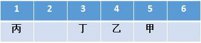

②如下图所示，假设丙是第二个完成，乙是第五个完成，再结合条件（1）可知，若丁是第一个完成，则甲是第三个完成，此时戊和己的顺序无法确定，只能确定甲在乙之前，满足题干假设；

如下图所示，假设丁是第四个完成，则甲是第六个完成，此时甲、乙紧挨着，与题干条件矛盾，故此种可能排除；

③如下图所示，假设丙是第三个完成，乙是第六个完成，再结合条件（1）可知，丁是第二个完成，甲是第四个完成，此时戊和己的顺序无法确定，只能确定甲在乙之前，满足题干假设。

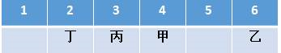

综上所述，甲一定在乙之前。

故正确答案为A。

---

### 第 3 题　qid 2172368 · 类比推理

地球：行星

- **A**. 英国：国家　✅
- **B**. 江苏：中国
- **C**. 公路：道路
- **D**. 岛屿：大陆

**答案**：A

**官方解析**

第一步：判断题干词语间逻辑关系。
地球是行星，两者之间是种属关系，并且地球是具体的一个行星。
第二步：判断选项词语间逻辑关系。
A项：英国是国家，两者之间是种属关系，并且英国是具体的一个国家，与题干逻辑关系一致，当选；
B项：江苏是中国的一个省，两者之间是组成关系，与题干逻辑关系不一致，排除；
C项：公路是道路的一种，两者之间是种属关系，但是公路没有特指出具体哪一条公路，与题干逻辑关系不一致，排除；
D项：岛屿和大陆两者之间是并列关系，与题干逻辑关系不一致，排除。
故正确答案为A。

---

### 第 4 题　qid 2172369 · 类比推理

茶水：咖啡：饮品

- **A**. 误解：曲解：理解
- **B**. 谎言：谗言：言论
- **C**. 考试：考核：考验
- **D**. 晋商：徽商：商人　✅

**答案**：D

**官方解析**

第一步：判断题干词语间逻辑关系。
茶水、咖啡都是饮品，因此，前两者之间是并列关系，前两者和第三者之间是种属关系。
第二步：判断选项词语间逻辑关系。
A项：误解和曲解都是做了错误的理解，两者之间是近义关系，和理解是反义关系，与题干逻辑关系不一致，排除；
B项：谎言是不真实的话，谗言是诽谤的话，言论是指发表的意见或议论，第三者和前两者之间不构成种属关系，与题干逻辑关系不一致，排除；
C项：考试和考核都是对参考者进行测试，两者是近义关系，与题干逻辑关系不一致，排除；
D项：晋商和徽商都是商人，前两者之间是并列关系，前两者和第三者之间是种属关系，与题干逻辑关系一致，当选。
故正确答案为D。

---

### 第 5 题　qid 2172370 · 类比推理

有理数：无理数：实数

- **A**. 洋房：楼房：房屋
- **B**. 阴刻：阳刻：雕刻　✅
- **C**. 西汉：东汉：汉朝
- **D**. 西欧：东欧：欧洲

**答案**：B

**官方解析**

第一步：判断题干词语间逻辑关系。
有理数为整数（正整数、0、负整数）和分数统称，无理数是无限不循环小数，实数分为有理数和无理数，因此前两者之间是矛盾关系，前两者和第三者之间是种属关系。
第二步：判断选项词语间逻辑关系。
A项：洋房是具有欧美样式的房屋，楼房是两层或两层以上的房屋，有的洋房是楼房，有的洋房不是楼房，因此前两者之间是交叉关系，与题干逻辑关系不一致，排除；
B项：阴刻和阳刻都是雕刻方式，两者之间是矛盾关系，且前两者和第三者之间是种属关系，与题干逻辑关系一致，当选；
C项：汉朝主要分为东汉和西汉时期，至公元221年，刘备在成都称帝，史称蜀汉，因此前两者之间是反对关系，且前两者和第三者之间是组成关系，与题干逻辑关系不一致，排除；
D项：欧洲除了西欧和东欧，还包括中欧、南欧、北欧，因此前两者之间是反对关系，与题干逻辑关系不一致，排除。
故正确答案为B。
注：汉朝这一朝代比较特殊，历史上对于汉朝的划分表述一般为“主要分为西汉和东汉”，除此之外，在王莽篡权期间，还曾短暂的出现过玄汉时期，在东汉结束后，刘备也在蜀地建立蜀汉政权。因此，对于西汉和东汉，我们更倾向于是反对关系。

---

### 第 6 题　qid 2172371 · 类比推理

春耕：秋收：冬藏

- **A**. 立功：表彰：晋级
- **B**. 偷盗：受罚：悔恨
- **C**. 勤奋：致富：捐款
- **D**. 报名：参赛：夺冠　✅

**答案**：D

**官方解析**

第一步：判断题干词语间逻辑关系。
农业生产的一般过程，指春天耕种，秋天收获，冬天储藏，三词间有时间的先后顺序。
第二步：判断选项词语间逻辑关系。
A项：表彰和晋级之间没有明显的时间先后顺序，与题干逻辑关系不一致，排除；
B项：受罚和悔恨之间没有明显的时间先后顺序，与题干逻辑关系不一致，排除；
C项：致富和捐款之间没有必然时间先后顺序，与题干逻辑关系不一致，排除；
D项：报名、参赛、夺冠是参加比赛的一般过程，三词间有明显的时间先后顺序，与题干逻辑关系一致，当选。
故正确答案为D。

---

### 第 7 题　qid 2172372 · 类比推理

树：柏树：松树：雪松

- **A**. 车：汽车：火车：动车　✅
- **B**. 法：刑法：民法：公民
- **C**. 花：梅花：梨花：香梨
- **D**. 牛：水牛：黄牛：牛黄

**答案**：A

**官方解析**

第一步：判断题干词语间的逻辑关系。
柏树和松树都是树的一种，柏树和松树是并列关系，雪松是松树的一个品种，雪松和松树之间是种属关系。
第二步：判断选项词语间的逻辑关系。
A项：汽车和火车都是车的一种，汽车和火车是并列关系，动车是火车中速度较快的一种，动车和火车之间是种属关系，与题干逻辑关系一致，当选；
B项：刑法和民法都是法的一种，刑法和民法是并列关系，但公民是民法的管理对象，二者非种属关系，与题干逻辑关系不一致，排除；
C项：梅花和梨花都是花的一种，梅花和梨花是并列关系，但香梨并不是梨花的一种，二者非种属关系，与题干逻辑关系不一致，排除；
D项：水牛和黄牛都是牛的一种，水牛和黄牛是并列关系，但牛黄是黄牛身体中的一部分，二者属于组成关系，与题干逻辑关系不一致，排除。
故正确答案为A。

---

### 第 8 题　qid 2172290 · 类比推理

旱田作物：粮食作物：高产作物

- **A**. 工业酒精：食用酒精：医用酒精
- **B**. 人民日报：光明日报：解放日报
- **C**. 领军人物：新闻人物：公众人物　✅
- **D**. 脊椎动物：哺乳动物：高等动物

**答案**：C

**官方解析**

第一步：判断题干词语间的逻辑关系。
题干三词分别是从作物的生长环境、用途及产量情况3个不同的角度对作物的分类，旱田作物、粮食作物、高产作物，三词间两两互为交叉关系。
第二步：判断选项词语间的逻辑关系。
A项：工业酒精、食用酒精及医用酒精，都是根据酒精的不同用途划分的，三者之间不存在交叉，是并列关系，不是交叉关系，与题干逻辑关系不一致，排除；
B项：人民日报、光明日报及解放日报，是根据报纸的不同出版社划分的，三者之间不存在交叉，是并列关系，不是交叉关系，与题干逻辑关系不一致，排除；
C项：三词分别是从人物所处领域的地位、媒体中出现的情况及受关注程度3个不同的角度对人物的分类，领军人物、新闻人物、公众人物，三词间两两互为交叉关系，与题干逻辑关系一致，当选；
D项：哺乳动物都是脊椎动物，二者是种属关系，与题干逻辑关系不一致，排除。
故正确答案为C。

---

### 第 9 题　qid 2172293 · 类比推理

（  ）之于 朋友 相当于（  ）之于 婚姻

- **A**. 奋斗——金钱
- **B**. 战友——同学
- **C**. 真诚——爱情　✅
- **D**. 友善——勤奋

**答案**：C

**官方解析**

逐一代入选项。
A项：奋斗中需要朋友，但不能说金钱中需要婚姻，前后逻辑关系不一致，排除；
B项：战友泛指在一起战斗或在一起战斗过的人，也包括一起参军的人，战友是朋友，二者是种属关系，同学和婚姻无明显逻辑关系，前后逻辑关系不一致，排除；
C项：真诚是朋友的基础，爱情是婚姻的基础，前后逻辑关系一致，当选；
D项：友善可以形容朋友间的关系，而勤奋和婚姻无明显逻辑关系，前后逻辑关系不一致，排除。
故正确答案为C。

---

### 第 10 题　qid 2172294 · 类比推理

清除 之于（  ）相当于 拔除 之于（  ）

- **A**. 垃圾——暗堡
- **B**. 腐败——毒瘤　✅
- **C**. 路障——青苗
- **D**. 积弊——垂柳

**答案**：B

**官方解析**

逐一代入选项。
A项：清除垃圾是动宾搭配，拔除暗堡是动宾搭配，前后逻辑关系一致，保留；
B项：清除腐败是动宾搭配，拔除毒瘤是动宾搭配，前后逻辑关系一致，保留；
C项：清除路障是动宾搭配，拔除青苗是动宾搭配，前后逻辑关系一致，保留；
D项：清除积弊是动宾搭配，拔除垂柳是动宾搭配，前后逻辑关系一致，保留。
比较A、B、C、D项，B选项“腐败”和“毒瘤”均为有害的事物，“清除腐败”和“拔除毒瘤”都是做好事，前后的逻辑关系比A、C、D三项更为接近。
故正确答案为B。

---

### 第 11 题　qid 2172328 · 逻辑判断

渡长江过长江长江江长

- **A**. 
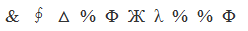

- **B**. 

　✅
- **C**. 

- **D**. 
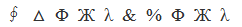

**答案**：B

**官方解析**

第一步：分析题干符号间关系。
从相同符号的位置入手：位置2、5、7、10的符号相同；位置3、6、8、9的符号相同；并且位置1、4上的符号与其他位置均不相同。
第二步：判断选项符号间关系。
A项：位置2、5、7、10的符号并不相同，与题干不一致，排除；
B项：位置2、5、7、10的符号相同；位置3、6、8、9的符号相同；并且1、4位置上的符号与其他位置均不相同，与题干一致，当选； 
C项：位置2、5、7、10的符号并不完全相同，与题干不一致，排除；
D项：位置2、5、7、10的符号并不完全相同，与题干不一致，排除。
故正确答案为B。

---

### 第 12 题　qid 2172355 · 逻辑判断

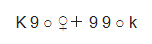

- **A**. 

- **B**. 
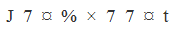

- **C**. 
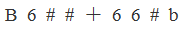

- **D**. 
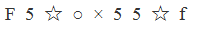
　✅

**答案**：D

**官方解析**

第一步：分析题干符号间关系。
题干一共出现9个符号，从相同符号的位置入手：位置1和9分别是同一字母的大小写形式；位置2、6、7的符号相同；位置3、8的符号相同；并且位置4、5上的符号与其他位置均不相同。

第二步：判断选项符号间关系。
A项：位置1和9分别是同一字母的大小写形式；位置2、6、7的符号相同；位置3、8的符号相同；但是位置4、5上的符号相同，与题干不一致，排除；
B项：位置1和9并非同一字母的大小写形式，与题干不一致，排除； 
C项：位置1和9分别是同一字母的大小写形式；位置2、6、7的符号相同；但位置3、4、8的符号均相同，与题干不一致，排除；
D项：位置1和9分别是同一字母的大小写形式；位置2、6、7的符号相同；位置3、8的符号相同；并且位置4、5上的符号与其他位置均不相同，与题干一致，当选。
故正确答案为D。

---

### 第 13 题　qid 2172358 · 图形推理

从四个图中选出唯一的一项，填入问号处，使其呈现一定的规律性。

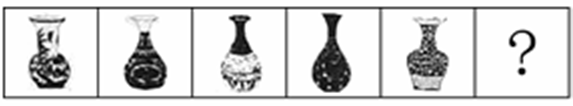

                       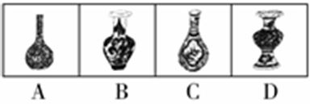

- **A**. A
- **B**. B　✅
- **C**. C
- **D**. D

**答案**：B

**官方解析**

本题考查图形的实际意义，寻找最大共同点。观察发现，题干所有图形都是瓶口直径大于瓶颈直径，且瓶身与瓶底之间没有凹陷处，A、C两项瓶口直径没有大于瓶颈直径，D项有凹陷处，只有B项满足题干图形特征。
故正确答案为B。

---

### 第 14 题　qid 2172360 · 图形推理

从四个图中选出唯一的一项，填入问号处，使其呈现一定的规律性。

- **A**. A　✅
- **B**. B
- **C**. C
- **D**. D

**答案**：A

**官方解析**

图形元素组成不同，无明显属性规律，考虑数量规律。观察发现，图2为“田”字变形，图5有多个端点，均为笔画数特征图，故考虑笔画数。题干均为两笔画图形，A项为两笔画图形，B项为三笔画图形，C项为四笔画图形，D项为一笔画图形，只有A项满足。
故正确答案为A。

---

### 第 15 题　qid 2172362 · 图形推理

从四个图中选出唯一的一项，填入问号处，使其呈现一定的规律性。

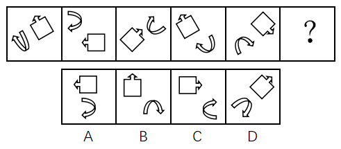

- **A**. A
- **B**. B
- **C**. C　✅
- **D**. D

**答案**：C

**官方解析**

图形元素组成相同，优先考虑位置规律，但位置无明显规律。观察发现，图一、图三和图五中的两个元素均在右上角和左下角，图二和图四中的两个元素均在左上角和右下角，故？号处图形中的两个元素应在左上角和右下角的位置，排除A项和D项。再次观察发现，题干图形中的两个元素箭头均指向同一方向，B项中两个元素箭头指向不同方向，C项中两个元素箭头指向同一方向。
故正确答案为C。

---

### 第 16 题　qid 2172364 · 图形推理

从四个图中选出唯一的一项，填入问号处，使其呈现一定的规律性。 

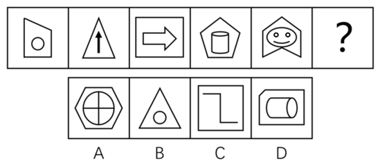

- **A**. A
- **B**. B
- **C**. C
- **D**. D　✅

**答案**：D

**官方解析**

元素组成不同，且无明显属性规律，优先考虑数量规律。题干图形封闭区域明显，优先考虑面数量，题干图形的面数量依次为2、1、2、3、4，单独数面无规律。再次观察发现，题干每幅图形都有一个外框，外框边数分别为4、3、4、5、6，题干图形的外框边数-面数量=2，故“？”处图形的外框边数-面数量=2，只有D项符合。
故正确答案为D。

---

### 第 17 题　qid 2172380 · 图形推理

下边四个图形中，只有一个是由上边的四个图形拼合（只能通过上、下、左、右平移）而成的，请把它找出来。

- **A**. A
- **B**. B　✅
- **C**. C
- **D**. D

**答案**：B

**官方解析**

本题考查平面拼合，可采用平行且等长相消的方式解题。消去平行且等长的线段后进行组合即可得到轮廓图，即为B选项。平行且等长相消的方式如下图所示：

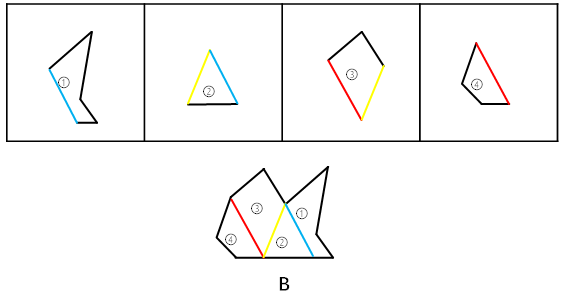 

故正确答案为B。

---

### 第 18 题　qid 2172305 · 图形推理

下边四个图形中，只有一个是由上边的四个图形拼合（只能通过上、下、左、右平移）而成的，请把它找出来。

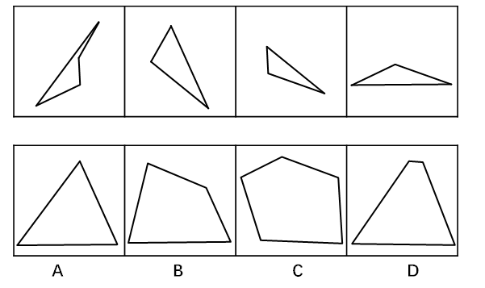

- **A**. A　✅
- **B**. B
- **C**. C
- **D**. D

**答案**：A

**官方解析**

本题考查平面拼合，可采用平行且等长相消的方式解题。消去平行且等长的线段后进行组合即可得到轮廓图，即为A选项。平行且等长相消的方式如下图所示：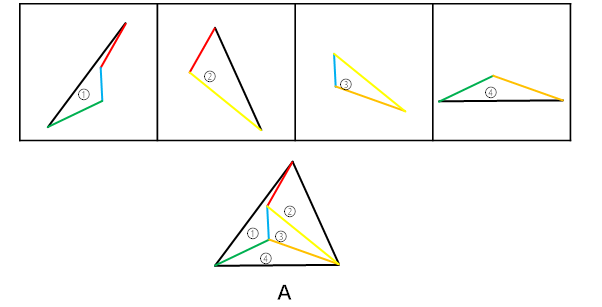

故正确答案为A。

---

### 第 19 题　qid 2172310 · 图形推理

下边四个图形中，只有一个是由上边的四个图形拼合（只能通过上、下、左、右平移）而成的，请把它找出来。

- **A**. A
- **B**. B　✅
- **C**. C
- **D**. D

**答案**：B

**官方解析**

本题考查平面拼合，可采用平行且等长相消的方式解题。消去平行且等长的线段后进行组合即可得到轮廓图，即为B选项。平行且等长相消的方式如下图所示：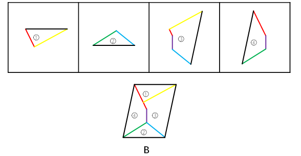

故正确答案为B。

---

### 第 20 题　qid 2172313 · 图形推理

下边四个图形中，只有一个是由上边的四个图形拼合（只能通过上、下、左、右平移）而成的，请把它找出来。

- **A**. A
- **B**. B
- **C**. C
- **D**. D　✅

**答案**：D

**官方解析**

本题考查平面拼合，可采用平行且等长相消的方式解题。本题由两种三角形拼合组成，需要消去平行且等长的线段后进行组合，即可得到轮廓图，即为D选项。平行且等长相消的方式如下图所示：

故正确答案为D。

---

### 第 21 题　qid 2172317 · 图形推理

下边四个图形中，只有一个是由上边的四个图形拼合（只能通过上、下、左、右平移）而成的，请把它找出来。

- **A**. A　✅
- **B**. B
- **C**. C
- **D**. D

**答案**：A

**官方解析**

本题考查平面拼合，将平行且等长的部分进行拼合。可优先考虑将题干中第二个图形进行放置，然后将平行且等长的其余部分进行组合，即可得到轮廓图，即为A选项。平行且等长的组合方式如下图所示：

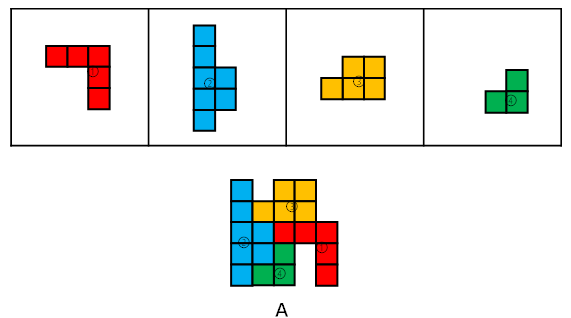

故正确答案为A。

---

### 第 22 题　qid 2172327 · 图形推理

左边给定的是纸盒外表面的展开图，右边哪一项能由它折叠而成？请把它找出来。

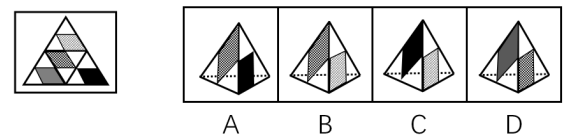

- **A**. A
- **B**. B　✅
- **C**. C
- **D**. D

**答案**：B

**官方解析**

将题干展开图中的面依次标注为面a、b、c、d，如下图：

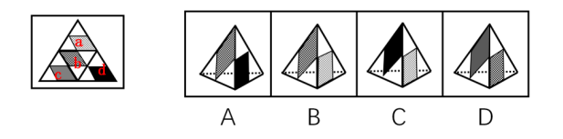

A项：由面b和面d构成，以面b中的蓝点为起点，顺时针画边，如下图：

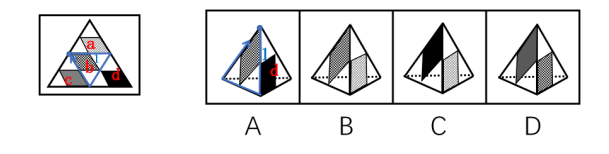

题干展开图中与边1相邻的面是面a，而选项中与边1相邻的面是面d，与题干不符，排除；

B项：由面a和面b构成，与题干展开图一致，当选；

C项：由面a和面d构成，以面d中的绿点为起点，顺时针画边，如下图：

题干展开图中与边1相邻的面是面c，而选项中与边1相邻的面是面a，与题干不符，排除；

D项：由面b和面c构成，以面c中的黄点为起点，顺时针画边，如下图：

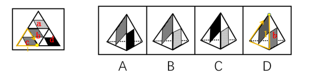

题干展开图中与边1相邻的面是面d，而选项中与边1相邻的面是面b，与题干不符，排除。

故正确答案为B。

---

### 第 23 题　qid 2172330 · 图形推理

左边给定的是纸盒外表面的展开图，右边哪一项能由它折叠而成？请把它找出来。

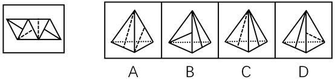

- **A**. A
- **B**. B
- **C**. C
- **D**. D　✅

**答案**：D

**官方解析**

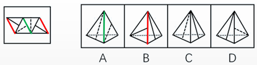

A项：展示给我们看到的是两个虚线所在的面，在选项和题干中将两个面的公共边标出，发现题干中有一条虚线垂直于公共边，但是A选项中两条虚线面都不垂直于公共边，与题干展开图不符，排除；

B项：展示给我们看到的是两个实线所在的面，在选项和题干中将两个面的公共边标出，发现选项中有一条实线垂直于公共边，但是题干中两条实线面都不垂直于公共边，与题干展开图不符，排除；

C项：展示给我们看到的是一条实线所在的面和一条虚线所在的面，在选项中找到同时发出一条虚线和一条实线的顶点，对应到题干中是标粗的点，如下图：

从这个点出发，在虚线面内进行顺时针画边，因为在选项中除虚线面本身只能看到一个实线面，因此我们只能看1所对应的面到底符不符合。在题干中1面中的实线是垂直于这个虚线面的，但是选项C中的实线并没有垂直于这个虚线面，与题干展开图不符，排除；

D项：与题干展开图一致，当选。

故正确答案为D。

---

### 第 24 题　qid 2172375 · 图形推理

左边给定的是纸盒外表面的展开图，右边哪一项能由它折叠而成？请把它找出来。

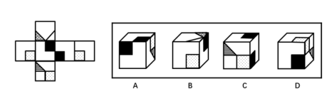

- **A**. A
- **B**. B
- **C**. C
- **D**. D　✅

**答案**：D

**官方解析**

本题考查六面体的空间重构。将题干展开图中的面依次标注为面a、b、c、d、e、f，如下图：

A项：右侧的面在展开图中没有出现，属于无中生有的面，选项与题干展开图不一致，排除；

B项：在题干展开图中，面e中的格子三角形两条直角边分别挨着白色区域，而选项中，面e中的格子三角形一条直角边挨着黑色正方形，选项与题干展开图不一致，排除；

C项：选项的三个面分别是面b、面c、面f，如下图：

题干展开图中，面b和面c中的黑色正方形存在一个公共点（如绿点），而选项中，面b和面c中的黑色正方形不存在公共点，选项与题干展开图不一致，排除；

D项：选项的三个面分别是面c、面d、面f，选项与题干展开图一致，当选。

故正确答案为D。

注：有同学会纠结D项右面里的线条方向不对，如果这么理解，这道题就没有答案了，所以从这个细节可以看出，江苏出题人对于面内线条的方向没有过多考虑，也没有在此设坑，如果没有更好的选项，可以选它。

---

### 第 25 题　qid 2172377 · 图形推理

左边给定的是纸盒外表面的展开图，右边哪一项能由它折叠而成？请把它找出来。

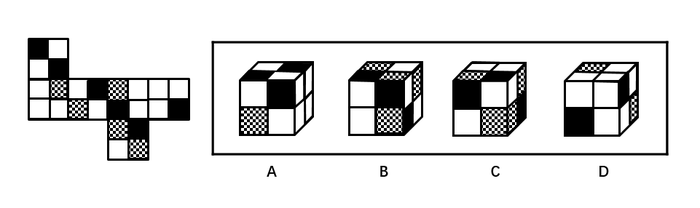

- **A**. A
- **B**. B　✅
- **C**. C
- **D**. D

**答案**：B

**官方解析**

本题考查六面体的空间重构。将题干展开图中的面依次标注为面a、b、c、d、e、f，如下图：

A项：右侧“十”字的面在展开图中没有出现，属于无中生有的面，选项与题干展开图不一致，排除；

B项：选项的三个面分别是面c、面d、面f，选项与题干展开图一致，当选；

C项：选项的三个面分别是面c、面d、面f，如下图：

在题干展开图中，d面的小黑方块挨着f面的小格子方块，而在选项中，d面的小黑方块挨着f面的小白方块，选项与题干展开图不一致，排除；

D项：选项的三个面分别是面b、面c、面e，如下图：

其中，面c和面e为相对面，不可能同时出现，选项与题干展开图不一致，排除。

故正确答案为B。

---

### 第 26 题　qid 2172389 · 图形推理

从所给的四个选项中，选择最恰当的一个填入问号处，使之呈现一定的规律性。

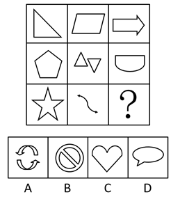

- **A**. A
- **B**. B
- **C**. C　✅
- **D**. D

**答案**：C

**官方解析**

图形元素组成不同，优先考虑属性规律。九宫格优先按横行来看，第一行中，三幅图依次为仅轴对称图形、仅中心对称图形、仅轴对称图形；代入第二行验证，第二行与第一行规律相同。因此，第三行也应该满足此规律，问号处应该填入一个仅轴对称的图形。A项为仅中心对称图形，B项为既轴对称又中心对称图形，D项为不对称图形，只有C项符合题干规律。
故正确答案为C。

---

### 第 27 题　qid 2172390 · 图形推理

从所给的四个选项中，选择最恰当的一个填入问号处，使之呈现一定的规律性。

- **A**. A
- **B**. B
- **C**. C
- **D**. D　✅

**答案**：D

**官方解析**

图形元素组成相同，优先考虑位置规律。九宫格优先按横行来看，第一行中，小球的位置相对于正方形依次内、外、内交替出现，并且沿着正方形上方的边从左向右平移。第二行中，小球的位置相对于正方形依次外、内、外交替出现，并且沿着正方形右侧的边从上向下平移。第三行中，前两幅图中的小球的位置相对于正方形依次内、外出现，因此，问号处小球位置应在正方形的内部出现，排除A项；前两幅图小球沿着正方形下方的边从右向左平移，因此，问号处小球应该在正方形下方的边的左边，排除B、C两项。
故正确答案为D。

---

### 第 28 题　qid 2172391 · 逻辑判断

通常，我们习惯认为运动是减重的关键因素，甚至是最重要的因素。但有专家指出，运动固然非常有益健康，但它实际上对减重并没有太大的帮助。在减重这件事上，迈开腿和管住嘴的地位并不平等，管住嘴实际上比迈开腿更重要。
以下哪项如果为真，最能支持上述专家的观点？

- **A**. 在个人消耗的总热量中，运动消耗的热量只占到极小的一部分　✅
- **B**. 一般来说，我们总是动得多吃得多，动得少吃得少
- **C**. 很多人都会在运动后因为疲劳而放慢节奏，减少热量消耗
- **D**. 只要吃一小块匹萨，就能产生相当于一小时运动所消耗的热量

**答案**：A

**官方解析**

第一步：找出论点和论据。
论点：运动对减重并没有太大帮助。在减重这件事上，管住嘴实际上比迈开腿更重要。
第二步：逐一分析选项。
A项：在个人消耗的总能量中，运动消耗占比极小，说明运动对减重影响极小，是在解释为什么运动对减重没有太大帮助，可以加强，保留；
B项：说的是平时动的多吃的多，动的少吃的少，没有说明运动与减重的关系，也没有与管住嘴之间消耗的能量进行比较，无法削弱，排除；
C项：阐述的是很多人运动后的状态，说明了运动后会减少热量的消耗，但是并不涉及管住嘴对热量的消耗是怎样的，没有比较，无法削弱，排除； 
D项：说明吃一小块匹萨产生的能量相当于运动一小时所消耗的热量，举例说明了管住嘴比迈开腿更重要，加强论据，保留。
比较A、D两项，解释说明力度大于举例加强，所以A项加强力度更强。
故正确答案为A。

---

### 第 29 题　qid 2172392 · 类比推理

大李认识张先生的朋友小王，而小王又认识大李的朋友林女士。凡认识小王的都具有公共管理专业硕士学位，凡认识林女士的都是江苏人。
根据上述信息，可以得出具有公共管理专业硕士学位的江苏人是：

- **A**. 大李　✅
- **B**. 小王
- **C**. 张先生
- **D**. 林女士

**答案**：A

**官方解析**

题干可翻译为：

①大李认识张先生的朋友小王；

②小王认识大李的朋友林女士；

③认识小王的人具有公共管理硕士学位；

④认识林女士的人江苏人。

根据①可知，大李和张先生均认识小王，结合③可知，大李和张先生均具有公共管理硕士学位，根据②可知，大李认识林女士，结合④可知，大李是江苏人，所以大李是具有公共管理硕士学位的江苏人。

故正确答案为A。

---

### 第 30 题　qid 2172393 · 逻辑判断

为了减少温室气体排放，有效应对全球气候变暖，有些专家建议，应把燃树发电作为削减二氧化碳排放的策略。他们认为，树木比煤、天然气更具有“碳中性”，砍树燃树所产生的二氧化碳将会被在原地再次生长的树木吸收。
以下哪项如果为真，最能质疑上述专家的观点？

- **A**. 砍树之后及时栽树，新生的树木就会再次吸收空气中的碳，形成稳定的碳循环
- **B**. 燃树发电的政策建议一旦实施，可能会导致乱砍乱伐，加剧全球环境生态危机
- **C**. 碳循环的计算比较复杂，砍树燃树释放的碳与栽树重新吸收的碳可能并不相等
- **D**. 砍树燃树排放的碳要等到新栽树苗长大后才能被完全吸收，时间上存在滞后性　✅

**答案**：D

**官方解析**

第一步：找出论点和论据。
论点：应把燃树发电作为削减二氧化碳排放的策略。
论据：树木比煤、天然气更具有“碳中性”，砍树燃树所产生的二氧化碳将会被在原地再次生长的树木吸收。
第二步：逐一分析选项。
A项：新生树木吸收碳形成稳定碳循环，重复了论据的内容，补充论据进行加强，无法削弱，排除； 
B项：燃树发电会加剧生态危机，说的是燃树发电的不良后果，而题干所讨论的是燃树发电是否能削减二氧化碳排放，二者话题不一致，属于无关选项，无法削弱，排除；
C项：释放的碳和吸收的碳可能并不相等，那到底是释放的碳多还是吸收的碳多，并不明确，排除；
D项：碳在树苗长大后才会被完全吸收，时间上存在滞后性，说明至少对于树苗还没有长大的那段期间来说，还是存在排放更多的二氧化碳，不能削减二氧化碳的排放，能削弱，当选。
故正确答案为D。
【文段出处】《燃木发电？烧“木柴”环保吗？》

---

### 第 31 题　qid 2172394 · 类比推理

狗不嫌家贫，子不嫌母丑。爱自己家乡的人不会说家乡的坏话，张三就从不说家乡的坏话。可见，他是一个多么爱自己家乡的人啊！
以下哪项的推理方式与上述最为相似？

- **A**. 灯不挑不亮，话不挑不明。如果没有听到张处长这番话，我还在纠结要不要报名参加行业大赛，现在一切都清楚了。看来，张处长的话太重要了！
- **B**. 不入虎穴，焉得虎子？巨大的成功往往伴随着巨大的风险，李四投资股票获得高额回报。可见，他承担了多大的风险啊！
- **C**. 玉不琢不成器，人不学要落后。追求进步的人不会不爱学习的，王教授退休后一直无所事事，不爱学习。可见，王教授已不是一个追求进步的人了！
- **D**. 人不可貌相，海水不可斗量。一个有才能的人不会将他的才能显示出来，李先生就从来没有显示过他的才能。可见，他是一个多么有才能的人啊！　✅

**答案**：D

**官方解析**

第一步：分析题干的推理形式。

爱家乡说坏话，用张三举例，说坏话爱家乡。属于肯定箭头后推肯定箭头前的形式。

第二步：逐一分析选项。

A项：听张处长的话纠结，后半句为，纠结（现在一切都清楚了）张处长的话重要。属于否后推否前，与题干推理形式不同，排除；

B项：巨大的成功巨大的风险，用李四举例，巨大的成功（获得高额回报）巨大的风险。属于肯前推肯后，与题干推理形式不同，排除；

C项：追求进步爱学习，用王教授举例，爱学习追求进步。属于否后推否前，与题干推理形式不同，排除；

D项：有才能显示才能，用李先生举例，显示才能有才能，属于肯后推肯前。与题干推理形式相同，当选。

故正确答案为D。

---

### 第 32 题　qid 2172395 · 逻辑判断

某人拟在1-5号5个地块上种植玉米、高粱、红薯、大豆和花生5种作物，每个地块仅种植一种作物，每种作物仅种植在一个地块。已知：
（1）如果3号地块种植大豆、高粱或花生，则1号地块种植玉米；
（2）如果4号地块种植高粱或花生，则2号或5号地块种植红薯；
（3）1号地块种植红薯。
根据以上信息，可以得出以下哪项？

- **A**. 2号地块种植高粱
- **B**. 3号地块种植花生
- **C**. 4号地块种植大豆　✅
- **D**. 5号地块种植玉米

**答案**：C

**官方解析**

题干可翻译为：

①3号种植大豆 或 3号种植高粱 或 3号种植花生1号种植玉米；

②4号种植高粱 或 4号种植花生2号种植红薯 或 5号种植红薯；

③1号种植红薯。

由③知：1号种植红薯，则1号不能种植玉米。根据①的逆否命题可知：1号种植玉米3号种植大豆 且 3号种植高粱 且 3号种植花生，则3号只能种植玉米。同时由1号种植红薯知：2号和5号不能种植红薯，根据②的逆否命题可知：2号种植红薯 且 5号种植红薯4号种植高粱 且 4号种植花生，以及1号种植红薯和3号种植玉米可以得出4号只能种植大豆，对应C项。

故正确答案为C。

---

### 第 33 题　qid 2172396 · 逻辑判断

明知要早睡，却忍不住熬夜追剧；明知吸烟、酗酒有害健康，却挡不住烟酒的诱惑；明知运动有益，却一步都懒得走……生活中，很多人并不缺少健康常识，他们更多的是缺乏一种自律精神。自律的人都会早睡，都会忌口，都坚持运动。如果一个人坚守自律精神，就不会放纵自己，就能够维护自己的生理节律，过上健康幸福的生活。
根据以上陈述，可以得出以下哪项？

- **A**. 所有坚持运动的人都很自律
- **B**. 有的缺乏自律精神的人不缺少健康常识　✅
- **C**. 一个人如果不坚守自律精神，就会放纵自己
- **D**. 维护自己生理节律的人都能过上健康幸福的生活

**答案**：B

**官方解析**

第一步：翻译题干。

①有些人不缺乏健康常识缺乏自律精神；

②自律的人早睡；

③自律的人忌口；

④自律的人坚持运动；

⑤坚守自律精神-放纵自己；

⑥坚守自律精神维护生理节律；

⑦坚守自律精神过上健康生活。

第二步：逐一分析选项。

A项：翻译为坚持运动自律，对④肯后得不到确定性结论，无法推出，排除；

B项：翻译为有些缺乏自律的人不缺乏健康常识，等价于命题①：有些人不缺乏健康常识缺乏自律精神，可以推出，当选；

C项：翻译为-坚持自律放纵自己，对⑤否前得不到确定性结论，无法推出，排除；

D项：翻译为维护自己生理节律的人健康幸福生活，二者之间没有必然的逻辑关系，无法推出，排除。

故正确答案为B。

---

### 第 34 题　qid 2172397 · 逻辑判断

随着“二孩政策”的实施，母乳喂养越来越多地成为广大年轻女性在生儿育女过程中不可回避的话题。医学专家建议，婴儿出生后最初6个月最好进行纯母乳喂养，而父母也都希望为孩子提供最好的营养。但统计显示，近年来我国0-6个月婴儿的纯母乳喂养率却明显偏低，婴儿6个月内的纯母乳喂养率在农村为30，在城市仅为16。

以下各项如果为真，则除了哪项均能解释上述统计结果？

- **A**. 职场女性往往因工作压力大、工作环境不允许等原因而陷入母乳喂养困窘
- **B**. 母乳喂养可降低儿童患病率，给孩子健康带来的益处可一直延续到成人期　✅
- **C**. 很多母亲并不了解母乳喂养的种种优势，反而把配方奶粉想象得过于美好
- **D**. 母亲因为夜晚哺乳而影响睡眠质量，她们的工作生活节奏被哺乳完全打乱

**答案**：B

**官方解析**

第一步：找出题干矛盾。
父母希望婴儿出生后最初6个月最好进行母乳喂养，但是近年来我国0-6个月婴儿的纯母乳喂养率却明显偏低。
第二步：逐一分析选项。
A项：职场女性因为各种原因而陷入母乳喂养困窘，说明尽管母亲希望进行母乳喂养，但是由于外界原因导致无法进行母乳喂养，可以解释为什么纯母乳喂养率低，排除；
B项：母乳喂养会给孩子带来的好处一直延续到成人期，只是在说明纯母乳给孩子带来的好处，没有解释为什么纯母乳喂养率低，不能解释，当选；
C项：母亲不了解母乳的好处，想象奶粉很好，说明母亲过于依赖奶粉而忽略母乳喂养，可以解释为什么纯母乳喂养率低，排除；
D项：母亲由于夜晚哺乳会影响睡眠，导致工作节奏被打乱，影响工作，母亲有可能因此减少纯母乳喂养孩子的次数，可以解释为什么纯母乳喂养率低，排除。
本题为选非题，故正确答案为B。

---

### 第 35 题　qid 2172291 · 图形推理

以下是一个44的图形，共有16个小方格。每个小方格中均可填入一个词。要求图形的每行、每列均填入“爱国”“敬业”“诚信”“友善”4个词，不能重复，也不能遗漏。

根据以上信息，依次填入图形中①②③④处的4个词应是：

- **A**. 爱国、敬业、诚信、友善　✅
- **B**. 爱国、诚信、敬业、友善
- **C**. 诚信、友善、爱国、敬业
- **D**. 友善、爱国、敬业、诚信

**答案**：A

**官方解析**

题干信息确定，可用排除法解题。
根据方格第一列出现友善、诚信可知，①不能是友善和诚信，排除C、D两项；
根据方格第三列出现敬业可知，③不能是敬业，排除B项。
故正确答案为A。

---

### 第 36 题　qid 2172333 · 定义判断

社区居家养老：指以家庭为核心、社区为依托，向居住在家中的老年人提供专业化、社会化服务，以解决日常生活中各种实际困难的养老方式。
下列属于社区居家养老的是：

- **A**. 自从去年住进街道办的托老所后，文大爷整整胖了5斤。那里不光生活很舒心，而且还有周边社区的20多位老人作伴，连过年他都有点舍不得回家
- **B**. 某社区联合一家养老企业推出适老化改造项目：针对老人的生理特点及生活习惯合理调整家里卧室、阳台、卫生间、厨房等处的生活设施。仅去年就完成了600多户家庭的改造工作
- **C**. 退休多年的周婆婆每天上午都去社区养老服务中心跟着专业老师学习民族舞，下午又到那里当义工，傍晚才回家。中心也会定期派专职人员上门为她进行体检及其他服务　✅
- **D**. 南方某养老社区通过“互联网+社区+服务”模式，为准备在该社区过冬的“候鸟老人”提供网上预定租住房源以及接送服务，全程安排旅居、娱乐、社交生活

**答案**：C

**官方解析**

第一步：找出定义关键词。
“以家庭为核心、社区为依托”、“向居住在家中的老年人提供专业化、社会化服务”、“解决日常生活中各种实际困难的养老方式”。
第二步：逐一分析选项。
A项：文大爷住进了街道办的托老所，不属于定义中居住在家中的老年人，不符合定义，排除； 
B项：“某社区联合一家养老企业推出适老化改造项目”更多是企业参与改造工作，不符合以“社区为依托”，且改造工作是一种短期工程，不是长期养老服务，无法帮助老年人“解决日常生活中各种实际困难”，不符合定义，排除；
C项：退休后的周婆婆在社区养老服务中心学习民族舞、当义工，中心也定期派专职人员上门提供体检和其他服务，体现出养老服务中心的专业化和社会化，且能够解决日常生活中各种实际困难，符合定义，当选；
D项：南方某养老社区能为来该社区过冬的老人提供网上预订房源及接送服务，针对的是来该社区过冬的“候鸟老人”，而非居住在家中的老年人，不符合定义，排除。
故正确答案为C。

---

### 第 37 题　qid 2172361 · 定义判断

院墙外正义：指对于不涉及自身利益的不良行为往往表现得义正辞严、充满正义；但是一旦涉及自身的利益，即使面对的是同样不良的行为，则往往采取完全不同的态度。
下列属于院墙外正义的是：

- **A**. 小赵正在家中看书，从院子外边传来激烈的争吵声。他冲出去一看，原来是隔壁夫妻在吵架。他赶紧回家打电话，请居委会派人来调解
- **B**. 张院长在学院会议上严厉批评个别老师上课迟到的现象，强调必须严肃处理。有人提起他上周迟到的事，他又补充了一句：凡事不能一概而论　✅
- **C**. 小陈担任部门经理以前，也像其他员工一样经常抱怨公司管理措施过于严苛。现在，他已经逐渐理解了管理部门的良苦用心
- **D**. 小李是某医学院大三学生，平时经常向周边的同学和朋友宣传义务献血的意义和好处，但自己却从来没有献过一次血

**答案**：B

**官方解析**

第一步：找出定义关键词。
“不涉及自身利益的不良行为往往表现得义正言辞、充满正义”、“一旦涉及自身利益，面对同样的不良行为，则往往采取完全不同的态度”。
第二步：逐一分析选项。
A项：小赵见隔壁夫妻吵架，打电话请居委会派人来调解，未涉及到自身利益的不良行为，表现充满正义，没有与涉及到自身利益时态度的对比，不符合定义，排除； 
B项：张院长对个别老师迟到的不良行为表现得义正言辞，而说到自己迟到时的态度截然不同，符合“一旦涉及自身利益，面对同样的不良行为，则往往采取完全不同的态度”，符合定义，当选；
C项：小陈担任部门经理前后对公司管理措施态度不一样，公司管理措施不属于不良行为，不符合定义，排除；
D项：义务献血不属于不良行为，不符合定义，排除。
故正确答案为B。

---

### 第 38 题　qid 2172363 · 定义判断

文化焦虑：指在全球化和现代化进程中，基于传统文化受到外来文化的挤压而产生的迷惘、焦躁、失望、不自信等心理状态。
下列不属于文化焦虑的是：

- **A**. 为应对西方文化的入侵，有些家长建议教育部门尽快制定相关政策，让包括四书五经在内的传统经典进入中小学课堂
- **B**. 全国各地大大小小的城市中，随处可见“罗马广场”“加州小镇”之类的包含外国地名的广场、小区和公园　✅
- **C**. 圣诞节、情人节、复活节现在越来越流行，不少传统节日却受到年轻人的冷落，部分学者呼吁尽快采取措施严格限制洋节日
- **D**. 许多历史文化遗产及人文景观随着如火如荼的旧城改造而不断消失，越来越多的有识之士对此深感忧虑

**答案**：B

**官方解析**

第一步：找出定义关键词。

“在全球化和现代化进程中”、“基于传统文化受到外来文化的挤压”、“产生的迷惘、焦躁、失望、不自信等心理状态” 。

第二步：逐一分析选项。

A项：西方文化入侵，部分家长认为教育部门应尽快制定相关政策，甚至需要将四书五经搬进课堂，体现了“基于传统文化受到外来文化的挤压”，家长着急体现了焦躁焦虑的心理，符合定义，排除； 

B项：全国各地随处可见包含外国地名的广场、小区和公园，体现了“基于传统文化受到外来文化的挤压”，符合原因，但没有焦虑心理，没有结果，不符合定义，当选；

C项：洋节越来越流行，传统节日却受到冷落，部分学者呼吁尽快采取措施严格限制洋节日，体现了“基于传统文化受到外来文化的挤压”，符合定义的原因，学者着急体现了焦躁焦虑的心理，符合定义，排除；

D项：历史文化遗产及人文景观不断消失，旧城改造，体现了“基于传统文化受到外来文化的挤压”，有识之士深感忧虑体现了焦躁焦虑的心理，符合定义，排除。

本题为选非题，故正确答案为B。

注意：此题外来文化的范围较广，不单是指外国文化。A、C、D三项都有原文对应参考。

---

### 第 39 题　qid 2172365 · 定义判断

副驾驶法则：指坐在驾驶员旁边的人往往喜欢按照自己的经验，对驾驶过程进行指点、评论。泛指旁观者根据个人实践经验指点他人完成操作过程的言行或心态。
下列属于副驾驶法则的是：

- **A**. 老李一上车，教练就打开了驾驶训练语音提示系统：“请系好安全带”“请松开手刹”……老李边操作边观察教练表情
- **B**. 小张乘出租车时总喜欢坐在前排，与驾驶员聊天南地北的段子，还时不时对路上其他司机的驾驶水平评头论足
- **C**. 夏天的市民广场，最热闹的就是下象棋了。每张棋桌旁都围站着一圈圈的棋迷，对弈双方的每步棋都被大家指指点点　✅
- **D**. 冯经理将人事调整初步方案呈报董事长审阅，董事长翻看后圈了几个人，并向他交待了几句，让他拿回去重新修改

**答案**：C

**官方解析**

第一步：找出定义关键词。
“根据个人实践经验”、“指点他人完成操作过程的言行或心态”。
第二步：逐一分析选项。
A项：教练打开语音提示系统，不符合“个人实践经验”，不符合定义，排除； 
B项：小张对其他司机的驾驶水平进行评论，并不是对所乘坐的出租车驾驶员的驾驶操作进行指点，不符合“指点他人完成操作过程的言行或心态”，不符合定义，排除；
C项：对弈过程符合“完成操作过程”，每步棋被指指点点符合“指点他人完成操作过程的言行或心态”，符合定义，当选；
D项：董事长在审阅后交待几句，对方案结果的评论，不符合“完成操作过程”，不符合定义，排除。
故正确答案为C。

---

### 第 40 题　qid 2172366 · 定义判断

主动补偿：指企业针对自己有瑕疵的产品或服务，主动向消费者做出经济补偿的行为。
下列属于主动补偿的是：

- **A**. 小王和几个同事在某火锅店消费时发现菜盘里有一只死苍蝇，就去找老板讨要说法，经过半个多小时的协商，老板终于同意免单并道歉
- **B**. 某高校食堂收到了学生关于饭菜质次量少、价格偏高的投诉，立即着手整改。三天后，食堂的饭菜质量有了明显提高，价格也有所下降
- **C**. 某公司发现，新近推出的一款手机在充电时发生爆炸，很快向社会公开承诺：用户可在30天内免费更换手机电池，邮寄费、路费等均由公司承担
- **D**. 老张上星期买了一辆摩托车，骑起来感觉很好。两天前，厂家突然通知他带着原始发票到指定修理厂更换电路控制器，还送给他200元加油卡　✅

**答案**：D

**官方解析**

第一步：找出定义关键词。
“企业”、“有瑕疵的产品或服务”、“主动向消费者做出经济补偿”。
第二步：逐一分析选项。
A项：消费者发现问题，找老板协商之后，老板同意免单，说明免单不是老板提出，不符合“主动向消费者做出经济补偿”，不符合定义，排除； 
B项：高校食堂不符合“企业”，降低价格不符合“主动向消费者做出经济补偿”，不符合定义，排除；
C项：手机充电发生爆炸符合“有瑕疵的产品或服务”，但是公司承诺免费更换电池以及承担邮寄费用和路费，不符合“经济补偿”，不符合定义，排除；
D项：厂家通知更换电路控制器，说明该控制器是有瑕疵的，符合 “有瑕疵的产品或服务”，送给老张200元的加油卡，符合“主动向消费者做出经济补偿”，符合定义，当选。
故正确答案为D。

---

### 第 41 题　qid 2172367 · 定义判断

人才逆流动：指原本在知名大城市工作的专业人士，主动选择到中小城市工作的人才流动现象。
下列属于人才逆流动的是：

- **A**. 小赵家乡的县城近年来经济发展迅猛，正在到处招聘有大城市工作背景的专业人才，反复考虑之后，小赵辞去北京某研究部门的工作回乡应聘成功　✅
- **B**. 高中毕业的小韩在深圳打拼多年，深感这里的工作机遇虽多，年收入也很可观，但竞争压力太大，有时力不从心，春节后他决定留在家乡创业
- **C**. 小黄在天津某大学桥梁设计专业取得硕士学位后，来到女友所在的小城市找了一份不错的工作，他和女友都很开心
- **D**. 80后白领小李在上海的一家金融机构总部任职，几天前决定跳槽到附近的一家保险公司，意外发现自己的这一决定与不少同事的选择不谋而合

**答案**：A

**官方解析**

第一步：找出定义关键词。
“由大城市到中小城市工作”、“专业人士”、“主动选择”。
第二步：逐一分析选项。
A项：北京到县城，符合“由大城市到中小城市工作”，辞去北京工作符合“主动选择”，符合定义，当选；
B项：高中毕业的小韩没有体现出“专业人士”，因竞争压力大、力不从心所以留在家乡创业，不符合“主动选择”，不符合定义，排除；
C项：在天津上学没有体现工作，不符合“由大城市到中小城市工作”，不符合定义，排除；
D项：从金融机构到附近的保险公司不符合“由大城市到中小城市工作”，不符合定义，排除。
故正确答案为A。

---

### 第 42 题　qid 2172373 · 定义判断

语言智能：指利用计算机程序实现人和机器之间的语言交流，或让机器自主完成与语言有关的工作。
下列属于语言智能的是

- **A**. 人工智能“阿尔法狗”在历时数月的人机大战中以绝对优势战胜多名世界级的围棋高手
- **B**. 为拓展国外市场，某公司新产品设置了语言切换按钮。借助这些按钮，用户可以实现多语种操作系统的切换
- **C**. 在某诗歌比赛中，根据评委说出的关键词，机器人“小薇”当场写出了几首辞藻华美、意境清新的作品　✅
- **D**. 高铁、动车、地铁上都配备了可以自动播报沿途站名、当前时速、实时气温的汉英双语语音系统

**答案**：C

**官方解析**

第一步：找出定义关键词。
“利用计算机程序”、“实现人和机器之间的语言交流”、“机器自主完成与语言有关的工作”
第二步：逐一分析选项。
A项：“阿尔法狗”在人机大战中是与人下围棋，并不涉及语言交流、工作，不符合定义，排除； 
B项：借助语言切换按钮，用户可以实现操作系统的切换，未体现语言交流、工作，不符合定义，排除；
C项：机器人“小薇”根据评委给出的关键词，写出了几首作品，诗歌作品与语言相关，属于“自主完成与语言有关的工作”，符合定义，当选；
D项：自动播报系统是人为设置的，未体现人机交流，也不符合“自主完成与语言有关的工作”，不符合定义，排除。
故正确答案为C。

---

### 第 43 题　qid 2172374 · 定义判断

危机下沉：指年轻人面对本应在下一年龄段才会出现的问题时所产生的过度担忧。
下列属于危机下沉的是：

- **A**. 每当想起两年后即将开始的退休生活，老张心头就涌起一种莫名的失落和焦虑
- **B**. 小李刚刚考进江城大学，看到周边房价飙涨，天天担心自己毕业后买不起房而无法安家　✅
- **C**. 小黄硕士毕业四五年了，至今还是单身，她担心自己再拖下去就很难找到合适的对象了
- **D**. 小梁夫妇最近为女儿明年上小学的事儿愁得睡不着觉：买不起心仪的那所名校的学区房

**答案**：B

**官方解析**

第一步：找出定义关键词。
“年轻人”、“面对本应下一年龄段才会出现的问题”、“过度担忧”。
第二步：逐一分析选项。
A项：老张焦虑退休生活，说明老张年纪大了，不属于“年轻人”，不符合定义，排除； 
B项：小李刚考上大学，却担心大学毕业后的问题，属于“对下一个年龄段出现问题的过度担忧”，符合定义，当选；
C项：小黄硕士毕业，至今单身，担心找不着对象，担心的是现在的问题，不属于“担心下一个年龄段的问题”，不符合定义，排除；
D项：小梁夫妇担心女儿上学买学区房的事情，小梁夫妇是否年轻不清楚，而且担心买房也是该年龄段出现的问题，不属于“下一个年龄段的问题”，不符合定义，排除。
故正确答案为B。

---

### 第 44 题　qid 2172376 · 定义判断

恶性抵制：指当事人在自身正当权利长时间受损，经过反复协商都无法解决的情况下采取的不文明、非理性、可能造成严重后果的抵制行为。
下列属于恶性抵制的是：

- **A**. 某小区业主无法忍受广场舞噪音，多次沟通未果后，集资26万元购买了俗称“高音炮”的扩音系统，天天对着广场循环播放汽车喇叭声　✅
- **B**. 老李承包的果园曾经多次被小偷光顾，为了避免更大的损失，他在几棵果树上缠上了铁丝并通上了电，从此果园再也没有被偷过
- **C**. 小区物业发现送快递的电瓶车车速过快，存在安全隐患，多次要求他们减速慢行，却收效甚微，于是禁止所有送快递的电瓶车进入小区
- **D**. 某小区长期受到“牛皮癣”广告的骚扰，于是购买了一款“呼死你”软件，挨个呼叫广告上的手机号码，很快就解决了这个老大难问题

**答案**：A

**官方解析**

第一步：找出定义关键词。
“当事人在自身正当权利长时间受损”、“反复协商都无法解决”、“采取的不文明、非理性、可能造成严重后果的抵制行为”。
第二步：逐一分析选项。
A项：无法忍受广场舞噪音体现了“自身正当权利长时间受损”，多次沟通体现了协商，集资购买“高音炮”扩音系统播放喇叭声符合“采取的不文明、非理性、可能造成严重后果的抵制行为”，符合定义，当选； 
B项：老李缠上铁丝并未跟小偷沟通，不符合“反复协商”，不符合定义，排除；
C项：电瓶车车速快存在安全隐患，只是隐患，未对他人权利造成损害，不符合“当事人在自身正当权利长时间受损”，不符合定义，排除；
D项：小区受到骚扰后直接购买“呼死你”软件解决问题，未体现“反复协商”，不符合定义，排除。
故正确答案为A。

---

### 第 45 题　qid 2172378 · 定义判断

中介后遗症：指用户接受中介机构的服务后，个人信息被泄露到其他机构而长时间遭到骚扰的现象。
下列属于中介后遗症的是：

- **A**. 小陈在商场购买了一台空调，销售商把小陈的信息通报给了厂家。小陈多次接到询问安装时间及地点的电话，后来又经常接到空调使用情况的回访电话
- **B**. 小蔡在某房地产开发公司买了一套住房，随后就经常接到装修公司询问是否需要家装的电话，小蔡暂时不打算装修，非常反感这些来电
- **C**. 小张通过一家猎头公司找到了满意的工作，但接下来的几个月里每天还会接到一些来路不明的电话，向他推荐“待遇优厚、时间灵活、任务轻松”的工作　✅
- **D**. 老王挂号就医时遇到了自称认识名医的丁某，在看过丁某推荐的名医后，病情未见好转，便不再理会丁某，也不再接丁某的骚扰电话

**答案**：C

**官方解析**

第一步：找出定义关键词。
“用户接受中介机构的服务后，个人信息被泄露到其他机构而长时间遭到骚扰”。
第二步：逐一分析选项。
A项：“小陈接到询问安装时间及地点的电话和空调使用情况回访电话”并非骚扰电话，而是正常的安装和使用回访电话，且并未体现“长时间骚扰”，不符合定义，排除； 
B项：小蔡在某房地产开发公司购买住房后，就经常收到装修公司询问是否装修的电话，但“房地产开发公司”并非中介机构，不符合定义，排除；
C项：小张在通过一家猎头公司找到工作后，接下来的几个月时间每天都会接到工作推荐电话，说明小张受到了长时间的骚扰，“来路不明的电话”说明小张的个人信息遭到了泄露，符合定义，当选；
D项：“老王在看过丁某推荐的名医后，病情未见好转，而老王也不接丁某的电话”，并未体现个人信息被泄露到其他机构，不符合定义，排除。
故正确答案为C。

---

### 第 46 题　qid 2172379 · 定义判断

非虚构写作：指以“亲历事实”为写作背景，秉承“诚实原则”，强调独特的现场感和真实感的写作行为，是文学创作的一种类型。
下列属于非虚构写作的是：

- **A**. 近年来，国内影视界对宫廷秘史情有独钟，很多影视作品都是根据史书上所载真实事件改编而成的。有案可稽的史料已经成为这类影视创作的重要来源
- **B**. 为了真实再现一桩离奇凶杀案的主要细节，作家阿克亲自来到案件发生的小镇，进行了两年多的实地调查，最终写出了他的成名作《小镇奇案始末》　✅
- **C**. 曹雪芹不但对社会生活有着严肃而深刻的哲学思考，也细心体察自己及身边普通人的不同命运。这些真实故事为他创作《红楼梦》提供了丰富素材
- **D**. 许多研究中国农村问题的学者长年驻守农村，并根据田野调查资料写就论文专著，这与喜欢运用国外流行理论方法的学院派写作在风格上显然不同

**答案**：B

**官方解析**

第一步：找出定义关键词。
“以亲历事实为写作背景”、“秉持诚实原则”、“强调独特的现场感和真实感的写作行为”。
第二步：逐一分析选项。
A项：很多影视作品都是根据史书上所载真实事件改编而成，但影视作品的创作者并非“以亲历事实为写作背景”，不符合定义，排除； 
B项：为了真实再现发生的离奇凶杀案，作家阿克亲自来到案发小镇进行实地调查，符合定义关键词，符合定义，当选；
C项：曹雪芹通过对社会生活的思考和对普通人不同命运的观察创作了《红楼梦》，但这些只是其创作的素材，且小说中的人和事都是作者虚构的，而非真实发生，不符合定义，排除；
D项：学者长期驻守农村，并根据田野调查写成论文专著，但论文专著并非文学创作，不符合定义，排除。
故正确答案为B。

---

### 第 47 题　qid 2172381 · 定义判断

定向销售：指商家出于特定目的，以低于市场同类商品的价格向特定客户出售商品的营销方式。
下列属于定向销售的是：

- **A**. 为打响知名度，吸引购车者，某汽车城决定开业当日给予医生、教师2万元的优惠，比许多4S店便宜了不少　✅
- **B**. 为庆祝公司成立十周年，某公司董事会决定给员工发放纪念品。经过与某皮具厂家协商，以优惠价格购买了一批时尚、高档的真皮包
- **C**. 为了避免浪费，某生鲜店规定：每天晚上8点后，所有非冰冻类的鲜鱼、鲜肉产品一律五折出售
- **D**. 某食品生产企业为了实现一季度销售业绩开门红，以行业底价线上线下同时开展促销活动，销售量大幅上升

**答案**：A

**官方解析**

第一步：找出定义关键词。
“低于市场同类商品的价格向特定客户出售商品”。
第二步：逐一分析选项。
A项：“比许多4S店便宜了不少”说明低于市场同类商品价格，“给予医生、教师2万元的优惠”说明是向特定客户出售商品，符合定义，当选；
B项：某皮具厂向某公司销售了一批真皮包，但“优惠价格”是否低于市场同类商品价格，表述不明确，不符合定义，排除；
C项：“每晚8点后，所有非冰冻类的鲜鱼、鲜肉产品一律五折出售”并非向特定客户出售商品，不符合定义，排除；
D项：“以行业底价线上线下同时开展促销”并不能说明其售价低于同类商品的价格，且未体现“向特定客户销售商品”，不符合定义，排除。
故正确答案为A。

---

### 第 48 题　qid 2172383 · 定义判断

头条模式：指互联网公司、媒体等向特定用户精准推送筛选出的、对用户具有重要参考价值信息的一种信息服务模式。
下列属于头条模式的是：

- **A**. 小李在某商场购买奶粉后，三年来陆续收到商场发来的澡盆、遥控玩具、儿童图书等商品的打折促销信息，还真省了不少钱
- **B**. 某网络文献检索平台可以根据用户要求提供所需的文献及其下载率、引用率等信息，但是用户必须提供准确的个人信息
- **C**. 某网络媒体公司将其平台专题栏目内容分为免费和付费两类，付费内容专业性很强，主要供有特定需求的人士选择使用
- **D**. 某新媒体公司通过分析客户数据，组织专门团队实时筛选不同种类的信息，保证特定用户第一时间就能看到自己关心的内容　✅

**答案**：D

**官方解析**

第一步：找出定义关键词。
“互联网公司、媒体”、“向特定用户精准推送”、“对用户具有重要参考价值信息”。
第二步：逐一分析选项。
A项：某商场，不属于“互联网公司、媒体”，不符合定义，排除；
B项：某网络文献检索平台，属于“互联网公司”，根据用户要求提供其所需的文献及其下载率、引用率等，用户提出要求然后平台再提供，不属于“向特定用户精准推送”，不符合定义，排除；
C项：某网络媒体公司，属于“互联网公司、媒体”，但是其付费内容主要供有特定需求的人士选择使用，不属于“向特定用户精准推送”，不符合定义，排除；
D项：某新媒体公司，属于“互联网公司、媒体”，通过分析客户数据而筛选推荐不同信息，属于“向特定用户精准推送”，用户第一时间就能看到自己关心的内容，属于“对用户具有重要参考价值信息”，符合定义，当选。
故正确答案为D。

---

### 第 49 题　qid 2172384 · 定义判断

数码技术后遗症：指由于过度使用、依赖数码产品而导致的记忆力衰退或认知能力降低现象。
下列属于数码技术后遗症的是：

- **A**. 小朱方位感很好，以前开车从不用导航仪，自从装上导航仪后，就一天也离不开它了。昨晚导航仪出了故障，本来15分钟的车程他整整开了两个小时　✅
- **B**. 六十多岁的丁先生记忆力越来越差，不少曾经滚瓜烂熟的文献材料现在已经记不清楚了，经常需要用手机检索核实相关内容
- **C**. 小李和几个朋友周末一起去网吧玩了个通宵。第二天早上刚走出网吧的时候，觉得路边的行人都是模模糊糊的
- **D**. 张女士多次听朋友说手机上也可以直接购买理财产品，就下载了一个理财APP，不料上了钓鱼网站，被骗了3万多元

**答案**：A

**官方解析**

第一步：找出定义关键词。
“由于过度使用、依赖数码产品”、“导致的记忆力衰退或认知能力降低”。
第二步：逐一分析选项。
A项：小朱开车离不开导航仪，属于“过度使用、依赖数码产品”，导航仪故障之后本来15分钟的车程开了两个小时，说明失去导航仪后不熟悉路况等，方位感减弱，属于“记忆力衰退或认知能力降低”，而二者之间正好存在因果联系，即由于依赖数码产品，才导致的方位感减弱，符合定义，当选； 
B项：丁先生记忆力越来越差是上了年纪的缘故，并非是由于“过度使用、依赖数码产品”导致的，不符合定义，排除；
C项：小李和朋友去网吧通宵属于“过度使用数码产品”，但是第二天早上觉得行人是模糊的，只是视觉上的模糊，仍然可以辨识出行人等，不属于“记忆力衰退或认知能力降低”，不符合定义，排除；
D项：张女士通过手机购买理财产品被骗，不属于“由于过度使用、依赖数码产品”，也不属于“导致的记忆力衰退或认知能力降低”，不符合定义，排除。
故正确答案为A。

---

### 第 50 题　qid 2172386 · 定义判断

语音融合：指在完全不自觉的情况下，频繁交流的两人口音逐渐趋同的现象。
下列属于语音融合的是：

- **A**. 楼先生旅居海外多年，很少使用中文，更不用说家乡话了。一次晚宴上遇到了一个老乡，一句“烂糊面”勾起了差不多早已忘光的乡音，两人用家乡话整整聊了一夜
- **B**. 老张夫妇结婚十多年了，家里的饮食习惯已经分不清南北，就连张先生的东北腔也几乎失去了原先的味道，妻子的广东话听起来也变得怪怪的，女儿经常取笑他们是真正的“夫唱妇随”　✅
- **C**. 朱女士的汉语口语课深受留学生喜爱，不仅发音标准、语调柔美，还时不时地在课堂上讲一些有趣的小段子。不到半年时间，大多数学员都能学着她的腔调进行日常会话
- **D**. 小黄来到南方某海滨小城工作后，每天坚持收看当地的方言电视节目，模仿播音员的发音。半年之后，她的语调、语气、用词，听起来就像一个土生土长的当地居民

**答案**：B

**官方解析**

第一步：找出定义关键词。
“在完全不自觉的情况下”、“频繁交流的两人口音逐渐趋同”。
第二步：逐一分析选项。
A项：楼先生旅居海外多年，很少使用中文，一句“烂糊面”勾起了乡音的记忆，说明有意识地参与，不属于“在完全不自觉的情况下”，同时与老乡用家乡话畅聊，说明二人口音相同，不属于“频繁交流的两人口音逐渐趋同”，不符合定义，排除；
B项：老张夫妇结婚十多年，二人的口音都发生了变化，夫妻之间的交流是频繁的，属于“频繁交流的两人口音逐渐趋同”，同时根据家里的饮食习惯已经分不清南北，可以判断出，习惯的养成是潜移默化的，属于“在完全不自觉的情况下”，符合定义，当选；
C项：学生上课跟着朱女士学习汉语口语，学习这一行为，不属于“在完全不自觉的情况下”，同时，学生只是学会了她的腔调，不属于“频繁交流的两人口音逐渐趋同”，不符合定义，排除；
D项：小黄坚持学习和模仿播音员的发音，不属于“在完全不自觉的情况下”，不符合定义，排除。
故正确答案为B。

---
