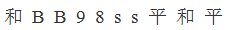
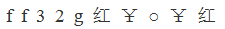
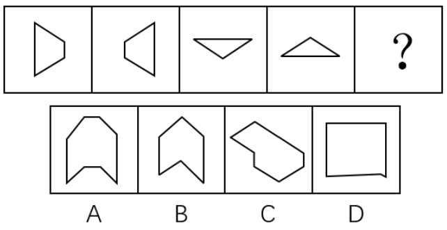
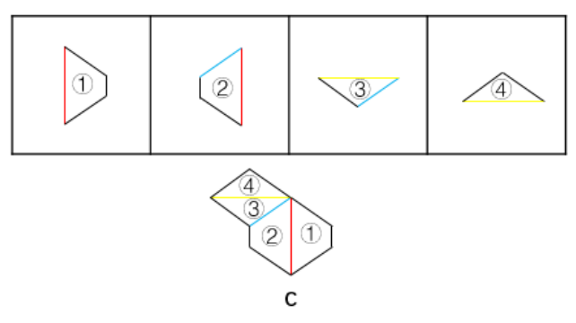
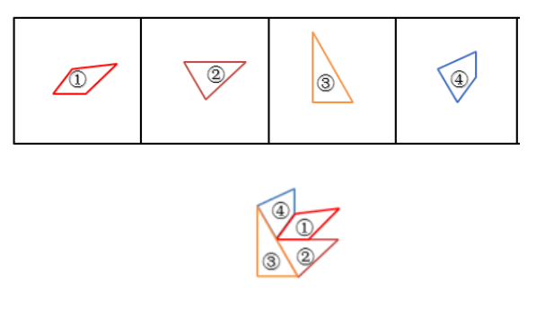
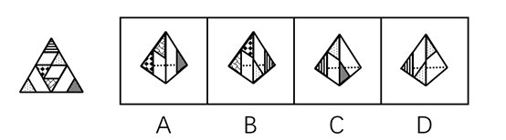
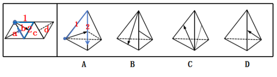
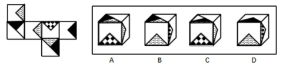

# 2018年江苏省公务员录用考试《行测》题（B类）（网友回忆版）

> 判断推理 · 50 题 · 江苏 2018

## 材料 1

甲、乙、丙、丁、戊、己6项工作需要按照一定的先后顺序才能顺利完成。已知：

（1）丁必须在甲之前完成，并且中间只能隔着1项工作；

（2）丙必须在乙之前完成，并且中间只能隔着2项工作。

### 第 1 题　qid 2172309 · 类比推理

若戊第2个完成，则己第几个完成？

- **A**. 3
- **B**. 4
- **C**. 5
- **D**. 6　✅

**答案**：D

**官方解析**

若戊第2个完成，结合条件（2）可知，丙和乙有两种可能：

①如下图所示，如果丙是第一个完成，乙是第四个完成，

再结合条件（1）可知，丁是第三个完成，甲是第五个完成，如下图所示，故己是第六个完成。

②如下图所示，如果丙是第三个完成，乙是第六个完成，再结合条件（1）可知，丁与甲隔着1项工作，无法满足，故此种可能排除。

综上所述，己是第六个完成。

故正确答案为D。

---

### 第 2 题　qid 2172311 · 逻辑判断

若甲、乙不是紧挨着先后完成，则可以得出以下哪项？

- **A**. 甲在乙之前完成　✅
- **B**. 乙在甲之前完成
- **C**. 戊在己之前完成
- **D**. 己在戊之前完成

**答案**：A

**官方解析**

题干信息不确定，可用假设法。

由条件（2）可知，丙有三种可能：

①如下图所示，假设丙是第一个完成，乙是第四个完成，再结合条件（1）可知，丁是第三个完成，甲是第五个完成，此时甲、乙紧挨着，与题干条件矛盾，故此种可能排除；

②如下图所示，假设丙是第二个完成，乙是第五个完成，再结合条件（1）可知，若丁是第一个完成，则甲是第三个完成，此时戊和己的顺序无法确定，只能确定甲在乙之前，满足题干假设；

如下图所示，假设丁是第四个完成，则甲是第六个完成，此时甲、乙紧挨着，与题干条件矛盾，故此种可能排除；

③如下图所示，假设丙是第三个完成，乙是第六个完成，再结合条件（1）可知，丁是第二个完成，甲是第四个完成，此时戊和己的顺序无法确定，只能确定甲在乙之前，满足题干假设。

综上所述，甲一定在乙之前。

故正确答案为A。

---

### 第 3 题　qid 2172369 · 类比推理

茶水：咖啡：饮品

- **A**. 误解：曲解：理解
- **B**. 谎言：谗言：言论
- **C**. 考试：考核：考验
- **D**. 晋商：徽商：商人　✅

**答案**：D

**官方解析**

第一步：判断题干词语间逻辑关系。
茶水、咖啡都是饮品，因此，前两者之间是并列关系，前两者和第三者之间是种属关系。
第二步：判断选项词语间逻辑关系。
A项：误解和曲解都是做了错误的理解，两者之间是近义关系，和理解是反义关系，与题干逻辑关系不一致，排除；
B项：谎言是不真实的话，谗言是诽谤的话，言论是指发表的意见或议论，第三者和前两者之间不构成种属关系，与题干逻辑关系不一致，排除；
C项：考试和考核都是对参考者进行测试，两者是近义关系，与题干逻辑关系不一致，排除；
D项：晋商和徽商都是商人，前两者之间是并列关系，前两者和第三者之间是种属关系，与题干逻辑关系一致，当选。
故正确答案为D。

---

### 第 4 题　qid 2172438 · 类比推理

吕布：辕门射戟

- **A**. 诸葛亮：三顾茅庐
- **B**. 刘备：白帝托孤　✅
- **C**. 曹操：草船借箭
- **D**. 关羽：刮骨疗伤

**答案**：B

**官方解析**

第一步：判断题干词语间逻辑关系。
辕门射戟，讲的是吕布为了阻止袁术击灭刘备而以他精湛的箭法平息了一场战争的故事，射箭的人是吕布，二者是历史人物与历史典故的对应关系。
第二步：判断选项词语间逻辑关系。
A项：三顾茅庐，讲的是刘备三顾茅庐拜访诸葛亮的故事，三顾茅庐的人是刘备，而非诸葛亮，与题干逻辑关系不一致，排除；
B项：白帝托孤，讲的是刘备病危之时，召丞相诸葛亮、尚书令李严托孤，命二人辅佐其子刘禅的故事，托孤的人是刘备，二者是历史人物与历史典故的对应关系，与题干逻辑关系一致，当选；
C项：草船借箭，讲的是诸葛亮利用曹操多疑的性格，利用几条草船诱敌，借足十万支箭的故事，借箭的人是诸葛亮，而非曹操，与题干逻辑关系不一致，排除；
D项：刮骨疗伤，讲的是华佗为关羽刮骨疗伤的故事，刮骨的人是华佗，而非关羽，关羽是被刮骨的人，与题干逻辑关系不一致，排除。
故正确答案为B。

---

### 第 5 题　qid 2172441 · 类比推理

交通摄像头：监控路况

- **A**. 指纹密码锁：采集指纹
- **B**. 电子血压仪：测量血压　✅
- **C**. 扫地机器人：净化空气
- **D**. 折叠防盗窗：晾晒衣服

**答案**：B

**官方解析**

第一步：判断题干词语间逻辑关系。
交通摄像头的主要功能是监控路况，二者之间是功能对应关系。
第二步：判断选项词语间逻辑关系。
A项：指纹密码锁的主要功能是防盗，并不是采集指纹，二者之间不是功能对应关系，与题干逻辑关系不一致，排除；
B项：电子血压仪的主要功能是测量血压，二者之间是功能对应关系，与题干逻辑关系一致，当选；
C项：扫地机器人的主要功能是清洁地面，并不是净化空气，二者之间不是功能对应关系，与题干逻辑关系不一致，排除；
D项：折叠防盗窗的主要功能是防盗，并不是晾晒衣服，二者之间不是功能对应关系，与题干逻辑关系不一致，排除。
故正确答案为B。

---

### 第 6 题　qid 2172444 · 类比推理

三角形：三棱锥

- **A**. 四边形：四面体
- **B**. 五边形：五角星
- **C**. 正方形：正方体　✅
- **D**. 抛物线：圆柱体

**答案**：C

**官方解析**

第一步：判断题干词语间逻辑关系。
三角形是平面图形，三棱锥是立体图形，并且三棱锥中所有的面都是三角形，二者为对应关系。
第二步：判断选项词语间逻辑关系。
A项：四边形是平面图形，四面体是立体图形，但是四面体中所有的面都是三角形，并不是四边形，与题干逻辑关系不一致，排除；
B项；五边形是平面图形，五角星也是平面图形，与题干逻辑关系不一致，排除；
C项：正方形是平面图形，正方体是立体图形，并且正方体中所有的面都是正方形，与题干逻辑关系一致，当选；
D项：抛物线是平面图形，圆柱体是立体图形，但是抛物线不是面，圆柱体中的面是矩形和圆形，与题干逻辑关系不一致，排除。
故正确答案为C。

---

### 第 7 题　qid 2172446 · 类比推理

事实：伪造的事实

- **A**. 秘密：公开的秘密　✅
- **B**. 陷阱：温柔的陷阱
- **C**. 谎言：善意的谎言
- **D**. 忧愁：甜蜜的忧愁

**答案**：A

**官方解析**

第一步：判断题干词语间逻辑关系。
事实，指事情的真实情况，伪造的事实，指虚假的情况，二者之间是反义关系。
第二步：判断选项词语间逻辑关系。
A项：秘密，指不为人知的事情，公开的秘密，指大家都知道的事情，二者之间是反义关系，与题干逻辑关系一致，当选；
B项：温柔的陷阱，形容陷阱很隐秘，不易发觉，与陷阱不构成反义关系，与题干逻辑关系不一致，排除；
C项：善意的谎言，形容虽有谎言但是为他人着想，并无恶意，与谎言不构成反义关系，与题干逻辑关系不一致，排除；
D项：甜蜜的忧愁，形容虽有忧伤但却是幸福的，与忧愁不构成反义关系，与题干逻辑关系不一致，排除。
故正确答案为A。

---

### 第 8 题　qid 2172371 · 类比推理

春耕：秋收：冬藏

- **A**. 立功：表彰：晋级
- **B**. 偷盗：受罚：悔恨
- **C**. 勤奋：致富：捐款
- **D**. 报名：参赛：夺冠　✅

**答案**：D

**官方解析**

第一步：判断题干词语间逻辑关系。
农业生产的一般过程，指春天耕种，秋天收获，冬天储藏，三词间有时间的先后顺序。
第二步：判断选项词语间逻辑关系。
A项：表彰和晋级之间没有明显的时间先后顺序，与题干逻辑关系不一致，排除；
B项：受罚和悔恨之间没有明显的时间先后顺序，与题干逻辑关系不一致，排除；
C项：致富和捐款之间没有必然时间先后顺序，与题干逻辑关系不一致，排除；
D项：报名、参赛、夺冠是参加比赛的一般过程，三词间有明显的时间先后顺序，与题干逻辑关系一致，当选。
故正确答案为D。

---

### 第 9 题　qid 2172447 · 类比推理

考试 之于（  ）相当于（  ）之于 运动

- **A**. 考场——操场
- **B**. 分数——成绩
- **C**. 学生——体操
- **D**. 评价——跑步　✅

**答案**：D

**官方解析**

逐一代入选项。
A项：在考场中考试，在操场上运动，但是顺序反了，排除；
B项：通过考试得到分数，通过运动取得成绩，但是顺序反了，排除；
C项：学生参加考试，二者是参与主体与活动的对应关系，体操属于一种运动方式，二者是种属关系，前后逻辑关系不一致，排除；
D项：考试是一种评价方式，二者属于种属关系，跑步是一种运动方式，二者属于种属关系，前后逻辑关系一致，当选。
故正确答案为D。

---

### 第 10 题　qid 2172448 · 类比推理

草原 之于（  ）相当于 海洋 之于（  ）

- **A**. 放牧——捕捞　✅
- **B**. 虫草——鱼群
- **C**. 羊群——水手
- **D**. 牧羊犬——指南针

**答案**：A

**官方解析**

逐一代入选项。
A项：在草原进行放牧，草原和放牧是场所和行为的对应关系；在海洋进行捕捞，海洋和捕捞也是场所和行为的对应关系，且放牧和捕捞都是人类生产活动的一种，前后逻辑关系一致，当选；
B项：虫草一般生长在高原地区，草原和虫草无明显逻辑关系；海洋和鱼群为场所与生物的对应关系，前后逻辑关系不一致，排除；
C项：草原和羊群是生存场所与生物的对应关系；海洋和水手是工作场所与职业的对应关系，前后逻辑关系不一致，排除；
D项：牧羊犬可以在草原上帮助人们放牧，二者是生物与其应用场所的对应关系；在海洋航行也可以用指南针来指引方向，二者是应用场所与工具的对应关系，前后逻辑关系不一致，排除。
故正确答案为A。

---

### 第 11 题　qid 2172450 · 逻辑判断

- **A**. 

- **B**. 

- **C**. 

　✅
- **D**. 

**答案**：C

**官方解析**

第一步：分析题干符号间关系。
从相同符号的位置入手：位置1、9的符号相同；位置2、3的符号相同；位置6、7的符号相同；位置8、10的符号相同；并且位置4、5上的符号与其他位置均不相同。
第二步：判断选项符号间关系。
A项：位置1、9的符号并不相同，与题干不一致，排除；
B项：位置1、9的符号相同；位置2、3的符号相同；但是位置4、5的符号相同，与题干不一致，排除； 
C项：位置1、9的符号相同；位置2、3的符号相同；位置6、7的符号相同；位置8、10的符号相同；并且位置4、5上的符号与其他位置均不相同，与题干一致，当选；
D项：位置1、9的符号并不相同，与题干不一致，排除。
故正确答案为C。

---

### 第 12 题　qid 2172451 · 逻辑判断

- **A**. 

- **B**. 

- **C**. 

　✅
- **D**. 

**答案**：C

**官方解析**

第一步：分析题干符号间关系。
从相同符号的位置入手：位置1、2的符号相同；位置6、10的符号相同；位置8、9的符号相同；位置3、4、5、7上的符号与其他位置均不相同，且位置1、2、5为字母，位置3、4为数字，剩余位置为字符。
第二步：判断选项符号间关系。
A项：位置1、2的符号相同；位置6、10的符号相同；位置8、9的符号相同；并且位置3、4、5、7上的符号与其他位置均不相同。但是位置4并不是数字，而是字母，与题干不一致，排除；
B项：位置1、2的符号相同；位置6、10的符号相同；但是位置8、9的符号不相同，与题干不一致，排除； 
C项：位置1、2的符号相同；位置6、10的符号相同；位置8、9的符号相同；位置3、4、5、7上的符号与其他位置均不相同，且位置1、2、5为字母，位置3、4为数字，剩余位置为字符，与题干一致，当选；
D项：位置1、2的符号不相同，与题干不一致，排除。
故正确答案为C。

---

### 第 13 题　qid 2172439 · 图形推理

请从所给的四个选项中，选择最合适的一项填在问号处，使之呈现一定的规律性。 

- **A**. A　✅
- **B**. B
- **C**. C
- **D**. D

**答案**：A

**官方解析**

本题考查图形的实际意义，寻找最大共同点。观察发现，题干所有图形都是小口径且无盖的瓶子，B、C两项中瓶子为大口径的瓶子，D项瓶身过宽且口径较大，不符合题干图形特征，均排除。只有A项满足题干图形特征，当选。
故正确答案为A。

---

### 第 14 题　qid 2172442 · 图形推理

请从所给的这几个选项中，选择最合适的一个填在问号处，使之呈现一定的规律性：

- **A**. A
- **B**. B
- **C**. C　✅
- **D**. D

**答案**：C

**官方解析**

题干图形均由小正方体叠加而成，考虑三视图。观察发现，题干图形的左视图均相同，只有C项的左视图与题干相同。
故正确答案为C。

---

### 第 15 题　qid 2172362 · 图形推理

从四个图中选出唯一的一项，填入问号处，使其呈现一定的规律性。

- **A**. A
- **B**. B
- **C**. C　✅
- **D**. D

**答案**：C

**官方解析**

图形元素组成相同，优先考虑位置规律，但位置无明显规律。观察发现，图一、图三和图五中的两个元素均在右上角和左下角，图二和图四中的两个元素均在左上角和右下角，故？号处图形中的两个元素应在左上角和右下角的位置，排除A项和D项。再次观察发现，题干图形中的两个元素箭头均指向同一方向，B项中两个元素箭头指向不同方向，C项中两个元素箭头指向同一方向。
故正确答案为C。

---

### 第 16 题　qid 2172364 · 图形推理

从四个图中选出唯一的一项，填入问号处，使其呈现一定的规律性。 

- **A**. A
- **B**. B
- **C**. C
- **D**. D　✅

**答案**：D

**官方解析**

元素组成不同，且无明显属性规律，优先考虑数量规律。题干图形封闭区域明显，优先考虑面数量，题干图形的面数量依次为2、1、2、3、4，单独数面无规律。再次观察发现，题干每幅图形都有一个外框，外框边数分别为4、3、4、5、6，题干图形的外框边数-面数量=2，故“？”处图形的外框边数-面数量=2，只有D项符合。
故正确答案为D。

---

### 第 17 题　qid 2172464 · 图形推理

选项四个图形中，只有一个是由题干的四个图形拼合（只能通过上、下、左、右平移）而成的，请把它找出来填入问号处。

- **A**. A
- **B**. B
- **C**. C　✅
- **D**. D

**答案**：C

**官方解析**

本题考查平面拼合，可采用平行且等长相消的方式解题。消去平行且等长的线段后进行组合即可得到轮廓图，即为C项。

平行且等长相消的方式如下图所示：

故正确答案为C。

---

### 第 18 题　qid 2172477 · 图形推理

选项四个图形中，只有一个是由题干的四个图形拼合（只能通过上、下、左、右平移）而成的，请把它找出来填入问号处。

- **A**. A
- **B**. B　✅
- **C**. C
- **D**. D

**答案**：B

**官方解析**

本题考查平面拼合，可采用平行且等长相消的方式解题。消去平行且等长的线段后进行组合即可得到轮廓图，即为B项。平行且等长相消的方式如下图所示：

故正确答案为B。

---

### 第 19 题　qid 2172468 · 图形推理

选项四个图形中，只有一个是由题干的四个图形拼合（只能通过上、下、左、右平移）而成的，请把它找出来。

- **A**. A
- **B**. B
- **C**. C　✅
- **D**. D

**答案**：C

**官方解析**

本题考查平面拼合，可采用平行且等长相消的方式解题。消去平行且等长的线段后进行组合即可得到轮廓图，即为C项。平行且等长相消的方式如下图所示：

故正确答案为C。

---

### 第 20 题　qid 2172305 · 图形推理

下边四个图形中，只有一个是由上边的四个图形拼合（只能通过上、下、左、右平移）而成的，请把它找出来。

- **A**. A　✅
- **B**. B
- **C**. C
- **D**. D

**答案**：A

**官方解析**

本题考查平面拼合，可采用平行且等长相消的方式解题。消去平行且等长的线段后进行组合即可得到轮廓图，即为A选项。平行且等长相消的方式如下图所示：

故正确答案为A。

---

### 第 21 题　qid 2172471 · 图形推理

选项四个图形中，只有一个是由题干的四个图形拼合（只能通过上、下、左、右平移）而成的，请把它找出来。

- **A**. A
- **B**. B
- **C**. C　✅
- **D**. D

**答案**：C

**官方解析**

本题考查俄罗斯方块平面拼合。从方块最多的图形入手，贴边代入选项。在题干的4个图形中，图②的方块最多，将它贴边代入各个选项中，只有C项能够把所有图形都代入进去，拼合方式如下图所示。

故正确答案为C。

---

### 第 22 题　qid 2172474 · 图形推理

选项四个图形中，哪个可由左边图形折叠而成？

- **A**. A
- **B**. B　✅
- **C**. C
- **D**. D

**答案**：B

**官方解析**

题干图形从上至下分别标上面a、b、c、d。 

A项：由面c和面d构成，题干沿面c蓝色的点顺时针画边，题干边1挨着面b，选项沿相同点顺时针画边，边1挨着面d，选项与题干不一致，排除；

B项：由面c和面a构成，与题干一致，当选； 

C项：由面a和面d构成，题干沿面a黄色的点顺时针画边，题干边2挨着面c,选项沿相同点顺时针画边，边2挨着面d，选项与题干不一致，排除；

 

D项：由面a和面b构成，题干沿面a黄色的点顺时针画边，题干边2挨着面c，选项沿相同点顺时针画边，边2挨着面b，选项与题干不一致，排除。 

故正确答案为B。

---

### 第 23 题　qid 2172440 · 图形推理

左边给出的是纸盒外表面的展开图，右边哪一项能由它折叠而成？请把它找出来。

- **A**. A
- **B**. B
- **C**. C
- **D**. D　✅

**答案**：D

**官方解析**

题干图形从左至右分别标上面a、b、c、d。

A项：由面b和面d构成，题干沿面b蓝色点顺时针画边，边2挨着c面，选项边2挨着d面，选项与题干不一致，排除；

B项：由面b和面a构成，题干沿面b蓝色点顺时针画边，边3挨着a面，选项边1挨着a面，选项与题干不一致，排除；

C项：由面b和面d构成，题干沿面b蓝色点顺时针画边，边1挨着d面，选项边3挨着d面，选项与题干不一致，排除；

D项：选项与展开图一致，当选。

故正确答案为D。

---

### 第 24 题　qid 2172449 · 图形推理

左边给定的是纸盒外表面的展开图，右边哪一项能由它折叠而成？请把它找出来。

- **A**. A　✅
- **B**. B
- **C**. C
- **D**. D

**答案**：A

**官方解析**

本题考查六面体的空间重构。将平面图中的各面进行标号，如图1所示：

A项：与题干展开图一致，当选；

B项：该项上边和右边的面分别为f面和d面，在展开图中，f面中的波浪线三角形和d面中的黑点三角形没有公共点，而在该项中有公共点，与题干不一致，排除；

C项：该项上边和前边的面分别为b面和d面，展开图中这两个面为相对面，在立体图中不能同时出现，与题干不一致，排除；

D项：该项上边和右边的面分别为e面和d面，在展开图中，e面中的黑三角和d面中的黑点三角形没有交点，而在该项中有交点，与题干不一致，排除。

故正确答案为A。

注：有同学会根据a、c面中S线条的方向排除B、D两项，但还是建议同时掌握通过公共边/公共点对选项进行排除的解题方法，因为江苏出题人对于面内线条的方向一般不做考查，例如2018年江苏A类第87题。

---

### 第 25 题　qid 2172375 · 图形推理

左边给定的是纸盒外表面的展开图，右边哪一项能由它折叠而成？请把它找出来。

- **A**. A
- **B**. B
- **C**. C
- **D**. D　✅

**答案**：D

**官方解析**

本题考查六面体的空间重构。将题干展开图中的面依次标注为面a、b、c、d、e、f，如下图：

A项：右侧的面在展开图中没有出现，属于无中生有的面，选项与题干展开图不一致，排除；

B项：在题干展开图中，面e中的格子三角形两条直角边分别挨着白色区域，而选项中，面e中的格子三角形一条直角边挨着黑色正方形，选项与题干展开图不一致，排除；

C项：选项的三个面分别是面b、面c、面f，如下图：

题干展开图中，面b和面c中的黑色正方形存在一个公共点（如绿点），而选项中，面b和面c中的黑色正方形不存在公共点，选项与题干展开图不一致，排除；

D项：选项的三个面分别是面c、面d、面f，选项与题干展开图一致，当选。

故正确答案为D。

注：有同学会纠结D项右面里的线条方向不对，如果这么理解，这道题就没有答案了，所以从这个细节可以看出，江苏出题人对于面内线条的方向没有过多考虑，也没有在此设坑，如果没有更好的选项，可以选它。

---

### 第 26 题　qid 2172452 · 图形推理

从所给的四个选项中，选择最恰当的一个填入问号处，使之呈现一定的规律性。

- **A**. A
- **B**. B
- **C**. C　✅
- **D**. D

**答案**：C

**官方解析**

图形元素组成不同，优先考虑属性规律。九宫格优先按行看，第一行中，三幅图都是轴对称图形，并且对称轴的方向依次顺时针旋转，第二行与第一行规律相同，第三行也应该满足此规律，只有C项符合。

故正确答案为C。

---

### 第 27 题　qid 2172390 · 图形推理

从所给的四个选项中，选择最恰当的一个填入问号处，使之呈现一定的规律性。

- **A**. A
- **B**. B
- **C**. C
- **D**. D　✅

**答案**：D

**官方解析**

图形元素组成相同，优先考虑位置规律。九宫格优先按横行来看，第一行中，小球的位置相对于正方形依次内、外、内交替出现，并且沿着正方形上方的边从左向右平移。第二行中，小球的位置相对于正方形依次外、内、外交替出现，并且沿着正方形右侧的边从上向下平移。第三行中，前两幅图中的小球的位置相对于正方形依次内、外出现，因此，问号处小球位置应在正方形的内部出现，排除A项；前两幅图小球沿着正方形下方的边从右向左平移，因此，问号处小球应该在正方形下方的边的左边，排除B、C两项。
故正确答案为D。

---

### 第 28 题　qid 2172453 · 逻辑判断

人们常说，读书可以增长知识、陶冶性情。有专家指出，读书还可以治病，特别是对于一些社会因素引起的心理疾病，如抑郁、压抑、恐慌、烦恼等，读书有很好的疗效。
以下哪项如果为真，最能支持上述专家的观点？

- **A**. 读书能够促使患者转变思维方式，提高认知能力，重新认识世界和认识自己
- **B**. 患者能够从阅读中有意无意获得情感上的认同和慰藉，释放内心的焦虑和不安　✅
- **C**. 汉代大学问家刘向十分重视读书的医疗作用，认为书犹药也，善读之可以医愚
- **D**. 阅读能使大脑中产生一种神经肽，可以增强细胞免疫力，有益于人的身体健康

**答案**：B

**官方解析**

第一步：找出论点和论据。
论点：读书可以治病，特别是对于一些社会因素引起的心理疾病，如抑郁、压抑、恐慌、烦恼等，读书有很好的疗效。
论据：无。
本题只有论点没有论据，加强优先考虑补充论据。
第二步：逐一分析选项。
A项：说的是读书能使患者转变思维，提高认知能力，重新认识世界和自己，与是否能治疗心理疾病无关，无关项，排除；
B项：说明患者能够从阅读中获得情感上的慰藉，释放内心的焦虑与不安，解释说明了阅读是如何治疗心理疾病的，补充论据加强，当选；
C项：指出汉代大学问家认为书犹药也，善读之可以医愚，是其个人观点，而且“医愚”无法说明读书能医治心理疾病，不能加强，排除； 
D项：说明阅读有益身体健康，增强人体免疫力，与是否能治疗心理疾病无关，无关项，排除。
故正确答案为B。

---

### 第 29 题　qid 2172457 · 逻辑判断

为丰富员工业余生活，某企业每年划出一笔固定经费用作员工的旅游福利。该企业的部分员工自发成立了一个驴友协会，驴友协会中的一些人是该企业的技术骨干。最近，该企业的部分领导准备把这笔经费挪作他用，这一想法得到了企业管理层所有成员的同意，但驴友协会的成员都不同意企业管理层的这一决定。
根据以上陈述，可以得出以下哪项？

- **A**. 有些技术骨干不是管理层成员　✅
- **B**. 管理层成员都不是技术骨干
- **C**. 驴友协会的成员都是技术骨干
- **D**. 有些管理层成员是技术骨干

**答案**：A

**官方解析**

第一步：翻译题干。
①有些驴友协会成员→企业技术骨干；
②企业管理层成员→同意部分领导挪用这笔经费；
③驴友协会成员→-同意部分领导挪用这笔经费。
第二步：逐一分析选项。
A项：翻译为有些技术骨干→-企业管理层成员，根据有些A是B=有些B是A可知，①等价于有些技术骨干→驴友协会成员，结合③②可知，有些技术骨干→驴友协会成员→-同意部分领导挪用这笔经费→-企业管理层成员，即有些技术骨干不是管理层成员，当选；
B项：翻译为企业管理层成员→-技术骨干，结合②③可知，企业管理层成员→同意部分领导挪用这笔经费→-驴友协会成员，-驴友协会成员根据①无法推出-企业技术骨干，排除；
C项：翻译为驴友协会成员→技术骨干，根据①已知有些驴友协会的成员是企业技术骨干，无法推出所有的驴友协会成员都是企业技术骨干，排除；
D项：翻译为有些管理层人员→技术骨干，结合②③可知，企业管理层成员→同意部分领导挪用这笔经费→-驴友协会成员，-驴友协会成员根据①无法推出企业技术骨干，所以无法推出管理层员工与技术骨干之间的关系，排除。
故正确答案为A。

---

### 第 30 题　qid 2172395 · 逻辑判断

某人拟在1-5号5个地块上种植玉米、高粱、红薯、大豆和花生5种作物，每个地块仅种植一种作物，每种作物仅种植在一个地块。已知：
（1）如果3号地块种植大豆、高粱或花生，则1号地块种植玉米；
（2）如果4号地块种植高粱或花生，则2号或5号地块种植红薯；
（3）1号地块种植红薯。
根据以上信息，可以得出以下哪项？

- **A**. 2号地块种植高粱
- **B**. 3号地块种植花生
- **C**. 4号地块种植大豆　✅
- **D**. 5号地块种植玉米

**答案**：C

**官方解析**

题干可翻译为：

①3号种植大豆 或 3号种植高粱 或 3号种植花生1号种植玉米；

②4号种植高粱 或 4号种植花生2号种植红薯 或 5号种植红薯；

③1号种植红薯。

由③知：1号种植红薯，则1号不能种植玉米。根据①的逆否命题可知：1号种植玉米3号种植大豆 且 3号种植高粱 且 3号种植花生，则3号只能种植玉米。同时由1号种植红薯知：2号和5号不能种植红薯，根据②的逆否命题可知：2号种植红薯 且 5号种植红薯4号种植高粱 且 4号种植花生，以及1号种植红薯和3号种植玉米可以得出4号只能种植大豆，对应C项。

故正确答案为C。

---

### 第 31 题　qid 2172460 · 逻辑判断

水熊虫不吃不喝能够存活30年，可以忍受高达150℃的高温，可生存在深海和冰冷的太空中。它们惊人的生存能力使之能够躲过灭绝地球上绝大多数生命的大灾难，能够伤害水熊虫的力量只有恒星爆炸或者伽马射线大爆发。有专家由此断言，水熊虫是一种可生存到太阳灭亡那一天的地球生物。
以下哪项如果为真，最能支持上述专家的观点？

- **A**. 有些地球生物可以生存到太阳灭亡的那一天
- **B**. 在太阳灭亡之前水熊虫不会遇到恒星爆炸或者伽马射线大爆发　✅
- **C**. 只有能够不吃不喝存活30年或忍受150℃的高温，才能生存到太阳灭亡的那一天
- **D**. 只有不吃不喝存活30年，才能躲过恒星爆炸或者伽马射线大爆发

**答案**：B

**官方解析**

第一步：找出论点和论据。
论点：水熊虫是一种可生存到太阳灭亡那一天的地球生物。
论据：水熊虫不吃不喝能够存活30年，可以忍受高达150℃的高温，可生存在深海和冰冷的太空中。它们惊人的生存能力使之能够躲过灭绝地球上绝大多数生命的大灾难，能够伤害水熊虫的力量只有恒星爆炸或者伽马射线大爆发。
第二步：逐一分析选项。
A项：有些地球生物可以生存到太阳灭亡那一天，但是有些生物是否包含水熊虫并不明确，无法得知水熊虫是否可以生存到地球灭亡那一天，无法支持，排除； 
B项：水熊虫能够被恒星爆炸或者伽马射线大爆发伤害，所以选项中在太阳灭亡之前不会遇到恒星爆炸或者伽马射线大爆发伤害，是水熊虫不被伤害，能够生存到地球灭亡那一天的必要条件，可以支持，当选；
C项：生存到太阳灭亡那一天，推出不吃不喝存活30年或忍受150℃的高温，是由题干中的论点推出论据，方向错误，无法支持，排除；
D项：论据讨论的是惊人的生存能力使之能够躲过灭绝地球上绝大多数生命的大灾难，而无法躲过恒星爆炸或者伽马射线大爆发的伤害，无法支持，排除。
故正确答案为B。

---

### 第 32 题　qid 2172461 · 类比推理

某单位要从甲、乙、丙、丁、戊、己6名工作人员中选派3名参加省职业技能大赛。有4位评委分别提出了自己的意见：
（1）甲、丙二人中至少选一人；
（2）乙、戊二人中至少选一人；
（3）乙、丙二人中至多选一人；
（4）甲、丁二人中至多选一人。
后来得知，戊因病不能参赛，并且上述4位评委的意见都得到了尊重。
根据上述信息，该单位选派的参赛选手是：

- **A**. 甲、乙、丙
- **B**. 甲、乙、丁
- **C**. 甲、乙、己　✅
- **D**. 丙、丁、己

**答案**：C

**官方解析**

翻译题干信息：
①甲 或 丙；
②乙 或 戊；
③-乙 或 -丙；
④-甲 或 -丁。
从题干确定信息入手，即戊因病不能参赛，以上四组条件均成立。
由戊不能参赛，结合条件②，否一推一，-戊→乙，可推出乙参赛；
由乙参赛结合条件③，否一推一，乙→-丙，可推出丙不参赛；
由丙不参赛结合条件①，否一推一，-丙→甲，可推出甲参赛；
由甲参赛结合条件④，否一推一，甲→-丁，可推出丁不参赛。
综上，参赛情况为，甲、乙参加，丙、丁不参加。而参赛选手为3名，故己也参赛，参赛选手为甲、乙、己。
故正确答案为C。

---

### 第 33 题　qid 2172393 · 逻辑判断

为了减少温室气体排放，有效应对全球气候变暖，有些专家建议，应把燃树发电作为削减二氧化碳排放的策略。他们认为，树木比煤、天然气更具有“碳中性”，砍树燃树所产生的二氧化碳将会被在原地再次生长的树木吸收。
以下哪项如果为真，最能质疑上述专家的观点？

- **A**. 砍树之后及时栽树，新生的树木就会再次吸收空气中的碳，形成稳定的碳循环
- **B**. 燃树发电的政策建议一旦实施，可能会导致乱砍乱伐，加剧全球环境生态危机
- **C**. 碳循环的计算比较复杂，砍树燃树释放的碳与栽树重新吸收的碳可能并不相等
- **D**. 砍树燃树排放的碳要等到新栽树苗长大后才能被完全吸收，时间上存在滞后性　✅

**答案**：D

**官方解析**

第一步：找出论点和论据。
论点：应把燃树发电作为削减二氧化碳排放的策略。
论据：树木比煤、天然气更具有“碳中性”，砍树燃树所产生的二氧化碳将会被在原地再次生长的树木吸收。
第二步：逐一分析选项。
A项：新生树木吸收碳形成稳定碳循环，重复了论据的内容，补充论据进行加强，无法削弱，排除； 
B项：燃树发电会加剧生态危机，说的是燃树发电的不良后果，而题干所讨论的是燃树发电是否能削减二氧化碳排放，二者话题不一致，属于无关选项，无法削弱，排除；
C项：释放的碳和吸收的碳可能并不相等，那到底是释放的碳多还是吸收的碳多，并不明确，排除；
D项：碳在树苗长大后才会被完全吸收，时间上存在滞后性，说明至少对于树苗还没有长大的那段期间来说，还是存在排放更多的二氧化碳，不能削减二氧化碳的排放，能削弱，当选。
故正确答案为D。
【文段出处】《燃木发电？烧“木柴”环保吗？》

---

### 第 34 题　qid 2172469 · 逻辑判断

绿茶的主要成分是茶多酚。近来大量动物实验发现，茶多酚具有抑制肿瘤细胞增殖、促进肿瘤细胞消亡的作用。但是，有些专家通过对大量人群的研究，并未发现饮茶越多癌症发病率就越低这一现象。据此，他们并不认为经常饮茶能够防癌。
以下哪项如果为真，则是上述专家作出结论最合理的假设？

- **A**. 如果茶叶在生产、加工、运输过程中受到重金属、农药等致癌物的污染，则饮茶越多就越增加患癌风险
- **B**. 如果人们长期饮茶但又奉行抽烟、喝酒、熬夜等不良生活习惯，则很难看出经常饮茶带来的防癌作用
- **C**. 只有假定品种不同但份量相同的茶叶中含有的茶多酚基本相同，才能得出经常饮茶能够防癌这一结论
- **D**. 只有在大量人群中发现饮茶越多癌症发病率就越低这一现象，才能得出经常饮茶能够防癌这一结论　✅

**答案**：D

**官方解析**

第一步：找出论点和论据。
论点：经常饮茶并不能够防癌。
论据：通过对大量人群的研究，并未发现饮茶越多癌症发病率就越低这一现象。
本题论点讨论的是饮茶和防癌，论据讨论的是研究中未发现饮茶越多癌症发病率就越低，讨论话题不完全一致，且提问中出现假设，加强可考虑搭桥。
第二步：逐一分析选项。
A项：如果茶叶受到致癌物的污染，则饮茶越多就越增加患癌风险，该项讨论的是受到致癌物污染的茶叶是否会增加患癌风险，而论点讨论的是茶叶本身是否能够防癌，无关项，排除；
B项：人们长期饮茶并且还奉行一些不良的习惯，就很难看出经常饮茶带来的防癌作用，肯定了饮茶能够防癌，削弱了题干论点，不能加强，排除；
C项：选项表述的是在什么情况之下能够得出茶叶能够防癌这一功效，而论点是在讨论茶叶是否能够防癌，二者话题不一致，不能加强，排除；
D项：只有在大量的人群中发现饮茶越多癌症发病率就越低这一现象，才能得出经常饮茶能够防癌这一结论，是在论点和论据之间建立联系，为搭桥项，可以加强，当选。
故正确答案为D。

---

### 第 35 题　qid 2172473 · 图形推理

以下是一个44的图形，共有16个小方格，每个小方格中均可填入一个词。要求图形的每行、每列均填入“爱国”“敬业”“诚信”“友善”4个词，不能重复，也不能遗漏。

根据以上信息，依次填入图形中①②③④处的4个词应是：

- **A**. 爱国、敬业、诚信、友善
- **B**. 诚信、爱国、敬业、友善
- **C**. 诚信、友善、爱国、敬业　✅
- **D**. 友善、爱国、敬业、诚信

**答案**：C

**官方解析**

题干信息确定，可用排除法解题。
根据方格第一列出现爱国可知，①不能是爱国，排除A项；
根据方格第四列出现诚信可知，④不能是诚信，排除D项；
根据每行每列填入的四个词不能重复可知，第三行的第三列处不能是爱国、敬业和友善，所以只能是诚信，那么第三行的第四列处只能是友善，由于第四列中出现友善，故④不能是友善，故排除B项。
故正确答案为C。

---

### 第 36 题　qid 2172333 · 定义判断

社区居家养老：指以家庭为核心、社区为依托，向居住在家中的老年人提供专业化、社会化服务，以解决日常生活中各种实际困难的养老方式。
下列属于社区居家养老的是：

- **A**. 自从去年住进街道办的托老所后，文大爷整整胖了5斤。那里不光生活很舒心，而且还有周边社区的20多位老人作伴，连过年他都有点舍不得回家
- **B**. 某社区联合一家养老企业推出适老化改造项目：针对老人的生理特点及生活习惯合理调整家里卧室、阳台、卫生间、厨房等处的生活设施。仅去年就完成了600多户家庭的改造工作
- **C**. 退休多年的周婆婆每天上午都去社区养老服务中心跟着专业老师学习民族舞，下午又到那里当义工，傍晚才回家。中心也会定期派专职人员上门为她进行体检及其他服务　✅
- **D**. 南方某养老社区通过“互联网+社区+服务”模式，为准备在该社区过冬的“候鸟老人”提供网上预定租住房源以及接送服务，全程安排旅居、娱乐、社交生活

**答案**：C

**官方解析**

第一步：找出定义关键词。
“以家庭为核心、社区为依托”、“向居住在家中的老年人提供专业化、社会化服务”、“解决日常生活中各种实际困难的养老方式”。
第二步：逐一分析选项。
A项：文大爷住进了街道办的托老所，不属于定义中居住在家中的老年人，不符合定义，排除； 
B项：“某社区联合一家养老企业推出适老化改造项目”更多是企业参与改造工作，不符合以“社区为依托”，且改造工作是一种短期工程，不是长期养老服务，无法帮助老年人“解决日常生活中各种实际困难”，不符合定义，排除；
C项：退休后的周婆婆在社区养老服务中心学习民族舞、当义工，中心也定期派专职人员上门提供体检和其他服务，体现出养老服务中心的专业化和社会化，且能够解决日常生活中各种实际困难，符合定义，当选；
D项：南方某养老社区能为来该社区过冬的老人提供网上预订房源及接送服务，针对的是来该社区过冬的“候鸟老人”，而非居住在家中的老年人，不符合定义，排除。
故正确答案为C。

---

### 第 37 题　qid 2172361 · 定义判断

院墙外正义：指对于不涉及自身利益的不良行为往往表现得义正辞严、充满正义；但是一旦涉及自身的利益，即使面对的是同样不良的行为，则往往采取完全不同的态度。
下列属于院墙外正义的是：

- **A**. 小赵正在家中看书，从院子外边传来激烈的争吵声。他冲出去一看，原来是隔壁夫妻在吵架。他赶紧回家打电话，请居委会派人来调解
- **B**. 张院长在学院会议上严厉批评个别老师上课迟到的现象，强调必须严肃处理。有人提起他上周迟到的事，他又补充了一句：凡事不能一概而论　✅
- **C**. 小陈担任部门经理以前，也像其他员工一样经常抱怨公司管理措施过于严苛。现在，他已经逐渐理解了管理部门的良苦用心
- **D**. 小李是某医学院大三学生，平时经常向周边的同学和朋友宣传义务献血的意义和好处，但自己却从来没有献过一次血

**答案**：B

**官方解析**

第一步：找出定义关键词。
“不涉及自身利益的不良行为往往表现得义正言辞、充满正义”、“一旦涉及自身利益，面对同样的不良行为，则往往采取完全不同的态度”。
第二步：逐一分析选项。
A项：小赵见隔壁夫妻吵架，打电话请居委会派人来调解，未涉及到自身利益的不良行为，表现充满正义，没有与涉及到自身利益时态度的对比，不符合定义，排除； 
B项：张院长对个别老师迟到的不良行为表现得义正言辞，而说到自己迟到时的态度截然不同，符合“一旦涉及自身利益，面对同样的不良行为，则往往采取完全不同的态度”，符合定义，当选；
C项：小陈担任部门经理前后对公司管理措施态度不一样，公司管理措施不属于不良行为，不符合定义，排除；
D项：义务献血不属于不良行为，不符合定义，排除。
故正确答案为B。

---

### 第 38 题　qid 2172476 · 定义判断

亲情经济：指商家利用人们对亲情关系的重视，在传统节日期间举行商业让利促销活动。
下列属于亲情经济的是：

- **A**. 某影楼在店庆3周年之际推出户外全家福拍摄优惠活动
- **B**. 某食品企业中秋节期间适当调高了礼盒装月饼的销售价格
- **C**. 某商场在儿童节前夕推出少儿服装、玩具对折优惠活动
- **D**. 重阳节期间许多商场的按摩椅、保健品都有不同程度的优惠　✅

**答案**：D

**官方解析**

第一步：找出定义关键词。
“商家”、“利用人们对亲情关系的重视”、“在传统节日期间”、“让利促销活动”。
第二步：逐一分析选项。
A项：店庆三周年，不属于传统节日，不符合定义，排除；
B项：提高月饼的销售价格，不属于让利促销活动，不符合定义，排除；
C项：儿童节，不属于传统节日，且是儿童节前夕推出优惠活动，也不符合在节日期间推出优惠活动，不符合定义，排除；
D项：重阳节，属于传统节日，按摩椅、保健品有不同程度的优惠，属于让利促销活动，且选择这些适合送给父母、长辈作为节日礼物的商品促销，属于利用人们对亲情关系的重视，符合定义，当选。
故正确答案为D。

---

### 第 39 题　qid 2172365 · 定义判断

副驾驶法则：指坐在驾驶员旁边的人往往喜欢按照自己的经验，对驾驶过程进行指点、评论。泛指旁观者根据个人实践经验指点他人完成操作过程的言行或心态。
下列属于副驾驶法则的是：

- **A**. 老李一上车，教练就打开了驾驶训练语音提示系统：“请系好安全带”“请松开手刹”……老李边操作边观察教练表情
- **B**. 小张乘出租车时总喜欢坐在前排，与驾驶员聊天南地北的段子，还时不时对路上其他司机的驾驶水平评头论足
- **C**. 夏天的市民广场，最热闹的就是下象棋了。每张棋桌旁都围站着一圈圈的棋迷，对弈双方的每步棋都被大家指指点点　✅
- **D**. 冯经理将人事调整初步方案呈报董事长审阅，董事长翻看后圈了几个人，并向他交待了几句，让他拿回去重新修改

**答案**：C

**官方解析**

第一步：找出定义关键词。
“根据个人实践经验”、“指点他人完成操作过程的言行或心态”。
第二步：逐一分析选项。
A项：教练打开语音提示系统，不符合“个人实践经验”，不符合定义，排除； 
B项：小张对其他司机的驾驶水平进行评论，并不是对所乘坐的出租车驾驶员的驾驶操作进行指点，不符合“指点他人完成操作过程的言行或心态”，不符合定义，排除；
C项：对弈过程符合“完成操作过程”，每步棋被指指点点符合“指点他人完成操作过程的言行或心态”，符合定义，当选；
D项：董事长在审阅后交待几句，对方案结果的评论，不符合“完成操作过程”，不符合定义，排除。
故正确答案为C。

---

### 第 40 题　qid 2172366 · 定义判断

主动补偿：指企业针对自己有瑕疵的产品或服务，主动向消费者做出经济补偿的行为。
下列属于主动补偿的是：

- **A**. 小王和几个同事在某火锅店消费时发现菜盘里有一只死苍蝇，就去找老板讨要说法，经过半个多小时的协商，老板终于同意免单并道歉
- **B**. 某高校食堂收到了学生关于饭菜质次量少、价格偏高的投诉，立即着手整改。三天后，食堂的饭菜质量有了明显提高，价格也有所下降
- **C**. 某公司发现，新近推出的一款手机在充电时发生爆炸，很快向社会公开承诺：用户可在30天内免费更换手机电池，邮寄费、路费等均由公司承担
- **D**. 老张上星期买了一辆摩托车，骑起来感觉很好。两天前，厂家突然通知他带着原始发票到指定修理厂更换电路控制器，还送给他200元加油卡　✅

**答案**：D

**官方解析**

第一步：找出定义关键词。
“企业”、“有瑕疵的产品或服务”、“主动向消费者做出经济补偿”。
第二步：逐一分析选项。
A项：消费者发现问题，找老板协商之后，老板同意免单，说明免单不是老板提出，不符合“主动向消费者做出经济补偿”，不符合定义，排除； 
B项：高校食堂不符合“企业”，降低价格不符合“主动向消费者做出经济补偿”，不符合定义，排除；
C项：手机充电发生爆炸符合“有瑕疵的产品或服务”，但是公司承诺免费更换电池以及承担邮寄费用和路费，不符合“经济补偿”，不符合定义，排除；
D项：厂家通知更换电路控制器，说明该控制器是有瑕疵的，符合 “有瑕疵的产品或服务”，送给老张200元的加油卡，符合“主动向消费者做出经济补偿”，符合定义，当选。
故正确答案为D。

---

### 第 41 题　qid 2172367 · 定义判断

人才逆流动：指原本在知名大城市工作的专业人士，主动选择到中小城市工作的人才流动现象。
下列属于人才逆流动的是：

- **A**. 小赵家乡的县城近年来经济发展迅猛，正在到处招聘有大城市工作背景的专业人才，反复考虑之后，小赵辞去北京某研究部门的工作回乡应聘成功　✅
- **B**. 高中毕业的小韩在深圳打拼多年，深感这里的工作机遇虽多，年收入也很可观，但竞争压力太大，有时力不从心，春节后他决定留在家乡创业
- **C**. 小黄在天津某大学桥梁设计专业取得硕士学位后，来到女友所在的小城市找了一份不错的工作，他和女友都很开心
- **D**. 80后白领小李在上海的一家金融机构总部任职，几天前决定跳槽到附近的一家保险公司，意外发现自己的这一决定与不少同事的选择不谋而合

**答案**：A

**官方解析**

第一步：找出定义关键词。
“由大城市到中小城市工作”、“专业人士”、“主动选择”。
第二步：逐一分析选项。
A项：北京到县城，符合“由大城市到中小城市工作”，辞去北京工作符合“主动选择”，符合定义，当选；
B项：高中毕业的小韩没有体现出“专业人士”，因竞争压力大、力不从心所以留在家乡创业，不符合“主动选择”，不符合定义，排除；
C项：在天津上学没有体现工作，不符合“由大城市到中小城市工作”，不符合定义，排除；
D项：从金融机构到附近的保险公司不符合“由大城市到中小城市工作”，不符合定义，排除。
故正确答案为A。

---

### 第 42 题　qid 2172432 · 定义判断

田园综合体：指一种新型的集特色优势产业、休闲旅游、乡村社区为一体的跨产业、多功能的农业生产经营体系。
下列属于田园综合体的是：

- **A**. 某县刚刚落成的高科技农业园区中，万亩良田都装配了电子控制设施。园区附近还建有一个多功能老年公寓、十多个大型养生会馆
- **B**. 作为首批省级乡村旅游示范区，向阳村“农家乐”已经成了某镇的骄傲。每年春天，那里的万亩油菜花田都吸引着成千上万的外地游客
- **C**. 某乡打算在三年内建设成为现代化的新型乡村社区，没有高楼大厦，到处是小桥流水，服务配套设施齐全
- **D**. 某乡村经过数年努力，形成了绿色食品生产经营、游客餐饮住宿、湿地公园观光的产业链，山更青水更绿了，村民生活也更富足了　✅

**答案**：D

**官方解析**

第一步：找出定义关键词。
“集特色优势产业、休闲旅游、乡村社区为一体”、“跨产业、多功能的农业生产经营体系”。
第二步：逐一分析选项。
A项：高科技农业园区附近建设的老年公寓和养生会馆，不属于集特色优势产业、跨产业、多功能的农业生产经营体系，不符合定义，排除；
B项：向阳村“农家乐”通过油菜花吸引游客，只体现发展旅游业，是单一产业，不属于跨产业、多功能的农业生产经营体系，不符合定义，排除；
C项：建设新型乡村社区、服务配套设施齐全，没有体现农业生产以及不同产业，不属于跨产业、多功能的农业生产经营体系，不符合定义，排除；
D项：形成了绿色食品生产经营、游客餐饮住宿、湿地公园观光的产业链，涉及到食品行业和旅游业，属于跨产业、多功能的农业生产经营体系，符合定义，当选。
故正确答案为D。

---

### 第 43 题　qid 2172374 · 定义判断

危机下沉：指年轻人面对本应在下一年龄段才会出现的问题时所产生的过度担忧。
下列属于危机下沉的是：

- **A**. 每当想起两年后即将开始的退休生活，老张心头就涌起一种莫名的失落和焦虑
- **B**. 小李刚刚考进江城大学，看到周边房价飙涨，天天担心自己毕业后买不起房而无法安家　✅
- **C**. 小黄硕士毕业四五年了，至今还是单身，她担心自己再拖下去就很难找到合适的对象了
- **D**. 小梁夫妇最近为女儿明年上小学的事儿愁得睡不着觉：买不起心仪的那所名校的学区房

**答案**：B

**官方解析**

第一步：找出定义关键词。
“年轻人”、“面对本应下一年龄段才会出现的问题”、“过度担忧”。
第二步：逐一分析选项。
A项：老张焦虑退休生活，说明老张年纪大了，不属于“年轻人”，不符合定义，排除； 
B项：小李刚考上大学，却担心大学毕业后的问题，属于“对下一个年龄段出现问题的过度担忧”，符合定义，当选；
C项：小黄硕士毕业，至今单身，担心找不着对象，担心的是现在的问题，不属于“担心下一个年龄段的问题”，不符合定义，排除；
D项：小梁夫妇担心女儿上学买学区房的事情，小梁夫妇是否年轻不清楚，而且担心买房也是该年龄段出现的问题，不属于“下一个年龄段的问题”，不符合定义，排除。
故正确答案为B。

---

### 第 44 题　qid 2172376 · 定义判断

恶性抵制：指当事人在自身正当权利长时间受损，经过反复协商都无法解决的情况下采取的不文明、非理性、可能造成严重后果的抵制行为。
下列属于恶性抵制的是：

- **A**. 某小区业主无法忍受广场舞噪音，多次沟通未果后，集资26万元购买了俗称“高音炮”的扩音系统，天天对着广场循环播放汽车喇叭声　✅
- **B**. 老李承包的果园曾经多次被小偷光顾，为了避免更大的损失，他在几棵果树上缠上了铁丝并通上了电，从此果园再也没有被偷过
- **C**. 小区物业发现送快递的电瓶车车速过快，存在安全隐患，多次要求他们减速慢行，却收效甚微，于是禁止所有送快递的电瓶车进入小区
- **D**. 某小区长期受到“牛皮癣”广告的骚扰，于是购买了一款“呼死你”软件，挨个呼叫广告上的手机号码，很快就解决了这个老大难问题

**答案**：A

**官方解析**

第一步：找出定义关键词。
“当事人在自身正当权利长时间受损”、“反复协商都无法解决”、“采取的不文明、非理性、可能造成严重后果的抵制行为”。
第二步：逐一分析选项。
A项：无法忍受广场舞噪音体现了“自身正当权利长时间受损”，多次沟通体现了协商，集资购买“高音炮”扩音系统播放喇叭声符合“采取的不文明、非理性、可能造成严重后果的抵制行为”，符合定义，当选； 
B项：老李缠上铁丝并未跟小偷沟通，不符合“反复协商”，不符合定义，排除；
C项：电瓶车车速快存在安全隐患，只是隐患，未对他人权利造成损害，不符合“当事人在自身正当权利长时间受损”，不符合定义，排除；
D项：小区受到骚扰后直接购买“呼死你”软件解决问题，未体现“反复协商”，不符合定义，排除。
故正确答案为A。

---

### 第 45 题　qid 2172378 · 定义判断

中介后遗症：指用户接受中介机构的服务后，个人信息被泄露到其他机构而长时间遭到骚扰的现象。
下列属于中介后遗症的是：

- **A**. 小陈在商场购买了一台空调，销售商把小陈的信息通报给了厂家。小陈多次接到询问安装时间及地点的电话，后来又经常接到空调使用情况的回访电话
- **B**. 小蔡在某房地产开发公司买了一套住房，随后就经常接到装修公司询问是否需要家装的电话，小蔡暂时不打算装修，非常反感这些来电
- **C**. 小张通过一家猎头公司找到了满意的工作，但接下来的几个月里每天还会接到一些来路不明的电话，向他推荐“待遇优厚、时间灵活、任务轻松”的工作　✅
- **D**. 老王挂号就医时遇到了自称认识名医的丁某，在看过丁某推荐的名医后，病情未见好转，便不再理会丁某，也不再接丁某的骚扰电话

**答案**：C

**官方解析**

第一步：找出定义关键词。
“用户接受中介机构的服务后，个人信息被泄露到其他机构而长时间遭到骚扰”。
第二步：逐一分析选项。
A项：“小陈接到询问安装时间及地点的电话和空调使用情况回访电话”并非骚扰电话，而是正常的安装和使用回访电话，且并未体现“长时间骚扰”，不符合定义，排除； 
B项：小蔡在某房地产开发公司购买住房后，就经常收到装修公司询问是否装修的电话，但“房地产开发公司”并非中介机构，不符合定义，排除；
C项：小张在通过一家猎头公司找到工作后，接下来的几个月时间每天都会接到工作推荐电话，说明小张受到了长时间的骚扰，“来路不明的电话”说明小张的个人信息遭到了泄露，符合定义，当选；
D项：“老王在看过丁某推荐的名医后，病情未见好转，而老王也不接丁某的电话”，并未体现个人信息被泄露到其他机构，不符合定义，排除。
故正确答案为C。

---

### 第 46 题　qid 2172379 · 定义判断

非虚构写作：指以“亲历事实”为写作背景，秉承“诚实原则”，强调独特的现场感和真实感的写作行为，是文学创作的一种类型。
下列属于非虚构写作的是：

- **A**. 近年来，国内影视界对宫廷秘史情有独钟，很多影视作品都是根据史书上所载真实事件改编而成的。有案可稽的史料已经成为这类影视创作的重要来源
- **B**. 为了真实再现一桩离奇凶杀案的主要细节，作家阿克亲自来到案件发生的小镇，进行了两年多的实地调查，最终写出了他的成名作《小镇奇案始末》　✅
- **C**. 曹雪芹不但对社会生活有着严肃而深刻的哲学思考，也细心体察自己及身边普通人的不同命运。这些真实故事为他创作《红楼梦》提供了丰富素材
- **D**. 许多研究中国农村问题的学者长年驻守农村，并根据田野调查资料写就论文专著，这与喜欢运用国外流行理论方法的学院派写作在风格上显然不同

**答案**：B

**官方解析**

第一步：找出定义关键词。
“以亲历事实为写作背景”、“秉持诚实原则”、“强调独特的现场感和真实感的写作行为”。
第二步：逐一分析选项。
A项：很多影视作品都是根据史书上所载真实事件改编而成，但影视作品的创作者并非“以亲历事实为写作背景”，不符合定义，排除； 
B项：为了真实再现发生的离奇凶杀案，作家阿克亲自来到案发小镇进行实地调查，符合定义关键词，符合定义，当选；
C项：曹雪芹通过对社会生活的思考和对普通人不同命运的观察创作了《红楼梦》，但这些只是其创作的素材，且小说中的人和事都是作者虚构的，而非真实发生，不符合定义，排除；
D项：学者长期驻守农村，并根据田野调查写成论文专著，但论文专著并非文学创作，不符合定义，排除。
故正确答案为B。

---

### 第 47 题　qid 2172363 · 定义判断

文化焦虑：指在全球化和现代化进程中，基于传统文化受到外来文化的挤压而产生的迷惘、焦躁、失望、不自信等心理状态。
下列不属于文化焦虑的是：

- **A**. 为应对西方文化的入侵，有些家长建议教育部门尽快制定相关政策，让包括四书五经在内的传统经典进入中小学课堂
- **B**. 全国各地大大小小的城市中，随处可见“罗马广场”“加州小镇”之类的包含外国地名的广场、小区和公园　✅
- **C**. 圣诞节、情人节、复活节现在越来越流行，不少传统节日却受到年轻人的冷落，部分学者呼吁尽快采取措施严格限制洋节日
- **D**. 许多历史文化遗产及人文景观随着如火如荼的旧城改造而不断消失，越来越多的有识之士对此深感忧虑

**答案**：B

**官方解析**

第一步：找出定义关键词。

“在全球化和现代化进程中”、“基于传统文化受到外来文化的挤压”、“产生的迷惘、焦躁、失望、不自信等心理状态” 。

第二步：逐一分析选项。

A项：西方文化入侵，部分家长认为教育部门应尽快制定相关政策，甚至需要将四书五经搬进课堂，体现了“基于传统文化受到外来文化的挤压”，家长着急体现了焦躁焦虑的心理，符合定义，排除； 

B项：全国各地随处可见包含外国地名的广场、小区和公园，体现了“基于传统文化受到外来文化的挤压”，符合原因，但没有焦虑心理，没有结果，不符合定义，当选；

C项：洋节越来越流行，传统节日却受到冷落，部分学者呼吁尽快采取措施严格限制洋节日，体现了“基于传统文化受到外来文化的挤压”，符合定义的原因，学者着急体现了焦躁焦虑的心理，符合定义，排除；

D项：历史文化遗产及人文景观不断消失，旧城改造，体现了“基于传统文化受到外来文化的挤压”，有识之士深感忧虑体现了焦躁焦虑的心理，符合定义，排除。

本题为选非题，故正确答案为B。

注意：此题外来文化的范围较广，不单是指外国文化。A、C、D三项都有原文对应参考。

---

### 第 48 题　qid 2172383 · 定义判断

头条模式：指互联网公司、媒体等向特定用户精准推送筛选出的、对用户具有重要参考价值信息的一种信息服务模式。
下列属于头条模式的是：

- **A**. 小李在某商场购买奶粉后，三年来陆续收到商场发来的澡盆、遥控玩具、儿童图书等商品的打折促销信息，还真省了不少钱
- **B**. 某网络文献检索平台可以根据用户要求提供所需的文献及其下载率、引用率等信息，但是用户必须提供准确的个人信息
- **C**. 某网络媒体公司将其平台专题栏目内容分为免费和付费两类，付费内容专业性很强，主要供有特定需求的人士选择使用
- **D**. 某新媒体公司通过分析客户数据，组织专门团队实时筛选不同种类的信息，保证特定用户第一时间就能看到自己关心的内容　✅

**答案**：D

**官方解析**

第一步：找出定义关键词。
“互联网公司、媒体”、“向特定用户精准推送”、“对用户具有重要参考价值信息”。
第二步：逐一分析选项。
A项：某商场，不属于“互联网公司、媒体”，不符合定义，排除；
B项：某网络文献检索平台，属于“互联网公司”，根据用户要求提供其所需的文献及其下载率、引用率等，用户提出要求然后平台再提供，不属于“向特定用户精准推送”，不符合定义，排除；
C项：某网络媒体公司，属于“互联网公司、媒体”，但是其付费内容主要供有特定需求的人士选择使用，不属于“向特定用户精准推送”，不符合定义，排除；
D项：某新媒体公司，属于“互联网公司、媒体”，通过分析客户数据而筛选推荐不同信息，属于“向特定用户精准推送”，用户第一时间就能看到自己关心的内容，属于“对用户具有重要参考价值信息”，符合定义，当选。
故正确答案为D。

---

### 第 49 题　qid 2172384 · 定义判断

数码技术后遗症：指由于过度使用、依赖数码产品而导致的记忆力衰退或认知能力降低现象。
下列属于数码技术后遗症的是：

- **A**. 小朱方位感很好，以前开车从不用导航仪，自从装上导航仪后，就一天也离不开它了。昨晚导航仪出了故障，本来15分钟的车程他整整开了两个小时　✅
- **B**. 六十多岁的丁先生记忆力越来越差，不少曾经滚瓜烂熟的文献材料现在已经记不清楚了，经常需要用手机检索核实相关内容
- **C**. 小李和几个朋友周末一起去网吧玩了个通宵。第二天早上刚走出网吧的时候，觉得路边的行人都是模模糊糊的
- **D**. 张女士多次听朋友说手机上也可以直接购买理财产品，就下载了一个理财APP，不料上了钓鱼网站，被骗了3万多元

**答案**：A

**官方解析**

第一步：找出定义关键词。
“由于过度使用、依赖数码产品”、“导致的记忆力衰退或认知能力降低”。
第二步：逐一分析选项。
A项：小朱开车离不开导航仪，属于“过度使用、依赖数码产品”，导航仪故障之后本来15分钟的车程开了两个小时，说明失去导航仪后不熟悉路况等，方位感减弱，属于“记忆力衰退或认知能力降低”，而二者之间正好存在因果联系，即由于依赖数码产品，才导致的方位感减弱，符合定义，当选； 
B项：丁先生记忆力越来越差是上了年纪的缘故，并非是由于“过度使用、依赖数码产品”导致的，不符合定义，排除；
C项：小李和朋友去网吧通宵属于“过度使用数码产品”，但是第二天早上觉得行人是模糊的，只是视觉上的模糊，仍然可以辨识出行人等，不属于“记忆力衰退或认知能力降低”，不符合定义，排除；
D项：张女士通过手机购买理财产品被骗，不属于“由于过度使用、依赖数码产品”，也不属于“导致的记忆力衰退或认知能力降低”，不符合定义，排除。
故正确答案为A。

---

### 第 50 题　qid 2172386 · 定义判断

语音融合：指在完全不自觉的情况下，频繁交流的两人口音逐渐趋同的现象。
下列属于语音融合的是：

- **A**. 楼先生旅居海外多年，很少使用中文，更不用说家乡话了。一次晚宴上遇到了一个老乡，一句“烂糊面”勾起了差不多早已忘光的乡音，两人用家乡话整整聊了一夜
- **B**. 老张夫妇结婚十多年了，家里的饮食习惯已经分不清南北，就连张先生的东北腔也几乎失去了原先的味道，妻子的广东话听起来也变得怪怪的，女儿经常取笑他们是真正的“夫唱妇随”　✅
- **C**. 朱女士的汉语口语课深受留学生喜爱，不仅发音标准、语调柔美，还时不时地在课堂上讲一些有趣的小段子。不到半年时间，大多数学员都能学着她的腔调进行日常会话
- **D**. 小黄来到南方某海滨小城工作后，每天坚持收看当地的方言电视节目，模仿播音员的发音。半年之后，她的语调、语气、用词，听起来就像一个土生土长的当地居民

**答案**：B

**官方解析**

第一步：找出定义关键词。
“在完全不自觉的情况下”、“频繁交流的两人口音逐渐趋同”。
第二步：逐一分析选项。
A项：楼先生旅居海外多年，很少使用中文，一句“烂糊面”勾起了乡音的记忆，说明有意识地参与，不属于“在完全不自觉的情况下”，同时与老乡用家乡话畅聊，说明二人口音相同，不属于“频繁交流的两人口音逐渐趋同”，不符合定义，排除；
B项：老张夫妇结婚十多年，二人的口音都发生了变化，夫妻之间的交流是频繁的，属于“频繁交流的两人口音逐渐趋同”，同时根据家里的饮食习惯已经分不清南北，可以判断出，习惯的养成是潜移默化的，属于“在完全不自觉的情况下”，符合定义，当选；
C项：学生上课跟着朱女士学习汉语口语，学习这一行为，不属于“在完全不自觉的情况下”，同时，学生只是学会了她的腔调，不属于“频繁交流的两人口音逐渐趋同”，不符合定义，排除；
D项：小黄坚持学习和模仿播音员的发音，不属于“在完全不自觉的情况下”，不符合定义，排除。
故正确答案为B。

---
