# 2018年江苏省公务员录用考试《行测》题（C类）（网友回忆版）

> 判断推理 · 45 题 · 江苏 2018

## 材料 1

甲、乙、丙、丁、戊、己6项工作需要按照一定的先后顺序才能顺利完成。已知：

（1）丁必须在甲之前完成，并且中间只能隔着1项工作；

（2）丙必须在乙之前完成，并且中间只能隔着2项工作。

### 第 1 题　qid 2172309 · 类比推理

若戊第2个完成，则己第几个完成？

- **A**. 3
- **B**. 4
- **C**. 5
- **D**. 6　✅

**答案**：D

**官方解析**

若戊第2个完成，结合条件（2）可知，丙和乙有两种可能：

①如下图所示，如果丙是第一个完成，乙是第四个完成，

再结合条件（1）可知，丁是第三个完成，甲是第五个完成，如下图所示，故己是第六个完成。

②如下图所示，如果丙是第三个完成，乙是第六个完成，再结合条件（1）可知，丁与甲隔着1项工作，无法满足，故此种可能排除。

综上所述，己是第六个完成。

故正确答案为D。

---

### 第 2 题　qid 2172311 · 逻辑判断

若甲、乙不是紧挨着先后完成，则可以得出以下哪项？

- **A**. 甲在乙之前完成　✅
- **B**. 乙在甲之前完成
- **C**. 戊在己之前完成
- **D**. 己在戊之前完成

**答案**：A

**官方解析**

题干信息不确定，可用假设法。

由条件（2）可知，丙有三种可能：

①如下图所示，假设丙是第一个完成，乙是第四个完成，再结合条件（1）可知，丁是第三个完成，甲是第五个完成，此时甲、乙紧挨着，与题干条件矛盾，故此种可能排除；

②如下图所示，假设丙是第二个完成，乙是第五个完成，再结合条件（1）可知，若丁是第一个完成，则甲是第三个完成，此时戊和己的顺序无法确定，只能确定甲在乙之前，满足题干假设；

如下图所示，假设丁是第四个完成，则甲是第六个完成，此时甲、乙紧挨着，与题干条件矛盾，故此种可能排除；

③如下图所示，假设丙是第三个完成，乙是第六个完成，再结合条件（1）可知，丁是第二个完成，甲是第四个完成，此时戊和己的顺序无法确定，只能确定甲在乙之前，满足题干假设。

综上所述，甲一定在乙之前。

故正确答案为A。

---

### 第 3 题　qid 2172441 · 类比推理

交通摄像头：监控路况

- **A**. 指纹密码锁：采集指纹
- **B**. 电子血压仪：测量血压　✅
- **C**. 扫地机器人：净化空气
- **D**. 折叠防盗窗：晾晒衣服

**答案**：B

**官方解析**

第一步：判断题干词语间逻辑关系。
交通摄像头的主要功能是监控路况，二者之间是功能对应关系。
第二步：判断选项词语间逻辑关系。
A项：指纹密码锁的主要功能是防盗，并不是采集指纹，二者之间不是功能对应关系，与题干逻辑关系不一致，排除；
B项：电子血压仪的主要功能是测量血压，二者之间是功能对应关系，与题干逻辑关系一致，当选；
C项：扫地机器人的主要功能是清洁地面，并不是净化空气，二者之间不是功能对应关系，与题干逻辑关系不一致，排除；
D项：折叠防盗窗的主要功能是防盗，并不是晾晒衣服，二者之间不是功能对应关系，与题干逻辑关系不一致，排除。
故正确答案为B。

---

### 第 4 题　qid 2172372 · 类比推理

树：柏树：松树：雪松

- **A**. 车：汽车：火车：动车　✅
- **B**. 法：刑法：民法：公民
- **C**. 花：梅花：梨花：香梨
- **D**. 牛：水牛：黄牛：牛黄

**答案**：A

**官方解析**

第一步：判断题干词语间的逻辑关系。
柏树和松树都是树的一种，柏树和松树是并列关系，雪松是松树的一个品种，雪松和松树之间是种属关系。
第二步：判断选项词语间的逻辑关系。
A项：汽车和火车都是车的一种，汽车和火车是并列关系，动车是火车中速度较快的一种，动车和火车之间是种属关系，与题干逻辑关系一致，当选；
B项：刑法和民法都是法的一种，刑法和民法是并列关系，但公民是民法的管理对象，二者非种属关系，与题干逻辑关系不一致，排除；
C项：梅花和梨花都是花的一种，梅花和梨花是并列关系，但香梨并不是梨花的一种，二者非种属关系，与题干逻辑关系不一致，排除；
D项：水牛和黄牛都是牛的一种，水牛和黄牛是并列关系，但牛黄是黄牛身体中的一部分，二者属于组成关系，与题干逻辑关系不一致，排除。
故正确答案为A。

---

### 第 5 题　qid 2172552 · 类比推理

送友人：折柳枝

- **A**. 观花灯：猜谜语
- **B**. 忆屈原：划龙舟　✅
- **C**. 闯关东：走西口
- **D**. 画竹梅：明心志

**答案**：B

**官方解析**

第一步：判断题干词语间逻辑关系。
古人折柳枝是为了送别友人，二者是方式目的的对应关系。
第二步：判断选项词语间逻辑关系。
A项：正月十五元宵节有观花灯、猜谜语的习俗，观花灯与猜谜语是并列关系，与题干逻辑关系不一致，排除；
B项：划龙舟是为了忆屈原，二者是方式目的的对应关系，与题干逻辑关系一致，当选；
C项：闯关东指中原地区百姓去关东谋生的历史；走西口是指无数山西人、陕西人、河北人背井离乡，打通了中原与蒙古的经济和文化通道，带动了北部地区的繁荣和发展。闯关东和走西口都是中国历史上著名的人口迁徙事件，二者是并列关系，与题干逻辑关系不一致，排除；
D项：画竹梅是为了明心志，但词语顺序与题干相反，与题干逻辑关系不一致，排除。
故正确答案为B。

---

### 第 6 题　qid 2172556 · 类比推理

木鱼：带鱼：黄鱼

- **A**. 虾米：小米：大米　✅
- **B**. 兵家：作家：画家
- **C**. 桃子：橘子：房子
- **D**. 荞麦：小麦：燕麦

**答案**：A

**官方解析**

第一步：判断题干词语间逻辑关系。
木鱼不是鱼，带鱼和黄鱼都是鱼的一种，第一个词与后两者没有明显逻辑关系，后两者是并列关系。
第二步：判断选项词语间逻辑关系。
A项：虾米不是米，小米和大米都是米的一种，第一个词与后两者没有明显逻辑关系，后两者是并列关系，与题干逻辑关系一致，当选；
B项：兵家是古代对军事家或用兵者的通称，也指研究军事的学派。兵家、作家和画家互为交叉关系，与题干逻辑关系不一致，排除；
C项：桃子和橘子都是水果，前两者是并列关系，与题干逻辑关系不一致，排除；
D项：荞麦、小麦和燕麦都是粮食作物，三者是并列关系，与题干逻辑关系不一致，排除。
故正确答案为A。

---

### 第 7 题　qid 2172444 · 类比推理

三角形：三棱锥

- **A**. 四边形：四面体
- **B**. 五边形：五角星
- **C**. 正方形：正方体　✅
- **D**. 抛物线：圆柱体

**答案**：C

**官方解析**

第一步：判断题干词语间逻辑关系。
三角形是平面图形，三棱锥是立体图形，并且三棱锥中所有的面都是三角形，二者为对应关系。
第二步：判断选项词语间逻辑关系。
A项：四边形是平面图形，四面体是立体图形，但是四面体中所有的面都是三角形，并不是四边形，与题干逻辑关系不一致，排除；
B项；五边形是平面图形，五角星也是平面图形，与题干逻辑关系不一致，排除；
C项：正方形是平面图形，正方体是立体图形，并且正方体中所有的面都是正方形，与题干逻辑关系一致，当选；
D项：抛物线是平面图形，圆柱体是立体图形，但是抛物线不是面，圆柱体中的面是矩形和圆形，与题干逻辑关系不一致，排除。
故正确答案为C。

---

### 第 8 题　qid 2172371 · 类比推理

春耕：秋收：冬藏

- **A**. 立功：表彰：晋级
- **B**. 偷盗：受罚：悔恨
- **C**. 勤奋：致富：捐款
- **D**. 报名：参赛：夺冠　✅

**答案**：D

**官方解析**

第一步：判断题干词语间逻辑关系。
农业生产的一般过程，指春天耕种，秋天收获，冬天储藏，三词间有时间的先后顺序。
第二步：判断选项词语间逻辑关系。
A项：表彰和晋级之间没有明显的时间先后顺序，与题干逻辑关系不一致，排除；
B项：受罚和悔恨之间没有明显的时间先后顺序，与题干逻辑关系不一致，排除；
C项：致富和捐款之间没有必然时间先后顺序，与题干逻辑关系不一致，排除；
D项：报名、参赛、夺冠是参加比赛的一般过程，三词间有明显的时间先后顺序，与题干逻辑关系一致，当选。
故正确答案为D。

---

### 第 9 题　qid 2172294 · 类比推理

清除 之于（  ）相当于 拔除 之于（  ）

- **A**. 垃圾——暗堡
- **B**. 腐败——毒瘤　✅
- **C**. 路障——青苗
- **D**. 积弊——垂柳

**答案**：B

**官方解析**

逐一代入选项。
A项：清除垃圾是动宾搭配，拔除暗堡是动宾搭配，前后逻辑关系一致，保留；
B项：清除腐败是动宾搭配，拔除毒瘤是动宾搭配，前后逻辑关系一致，保留；
C项：清除路障是动宾搭配，拔除青苗是动宾搭配，前后逻辑关系一致，保留；
D项：清除积弊是动宾搭配，拔除垂柳是动宾搭配，前后逻辑关系一致，保留。
比较A、B、C、D项，B选项“腐败”和“毒瘤”均为有害的事物，“清除腐败”和“拔除毒瘤”都是做好事，前后的逻辑关系比A、C、D三项更为接近。
故正确答案为B。

---

### 第 10 题　qid 2172448 · 类比推理

草原 之于（  ）相当于 海洋 之于（  ）

- **A**. 放牧——捕捞　✅
- **B**. 虫草——鱼群
- **C**. 羊群——水手
- **D**. 牧羊犬——指南针

**答案**：A

**官方解析**

逐一代入选项。
A项：在草原进行放牧，草原和放牧是场所和行为的对应关系；在海洋进行捕捞，海洋和捕捞也是场所和行为的对应关系，且放牧和捕捞都是人类生产活动的一种，前后逻辑关系一致，当选；
B项：虫草一般生长在高原地区，草原和虫草无明显逻辑关系；海洋和鱼群为场所与生物的对应关系，前后逻辑关系不一致，排除；
C项：草原和羊群是生存场所与生物的对应关系；海洋和水手是工作场所与职业的对应关系，前后逻辑关系不一致，排除；
D项：牧羊犬可以在草原上帮助人们放牧，二者是生物与其应用场所的对应关系；在海洋航行也可以用指南针来指引方向，二者是应用场所与工具的对应关系，前后逻辑关系不一致，排除。
故正确答案为A。

---

### 第 11 题　qid 2172570 · 类比推理

刃刀刃刅刄刅刀

- **A**. 刅刃刅刀刃刀刄
- **B**. 刀刃刀刄刅刄刃　✅
- **C**. 刄刃刄刀刀刅刃
- **D**. 刀刃刀刅刃刅刄

**答案**：B

**官方解析**

第一步：分析题干符号间关系。
从相同汉字的位置入手：位置1和3是相同汉字，位置2和7是相同汉字，位置4和6是相同汉字，位置5的汉字只出现过一次。
第二步：判断选项符号间关系。
A项：位置2和5是相同汉字，与题干不一致，排除；
B项：位置1和3是相同汉字，位置2和7是相同汉字，位置4和6是相同汉字，位置5的汉字只出现过一次，与题干一致，当选； 
C项：位置4和5是相同汉字，与题干不一致，排除；
D项：位置2和5是相同汉字，与题干不一致，排除。
故正确答案为B。

---

### 第 12 题　qid 2172580 · 逻辑判断

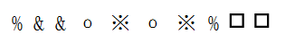

- **A**. 
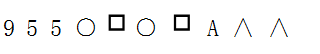

- **B**. 
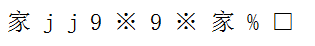

- **C**. 
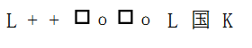

- **D**. 
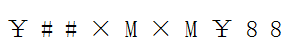
　✅

**答案**：D

**官方解析**

第一步：分析题干符号间关系。
从相同符号的位置入手：位置1、8的符号相同；位置2、3的符号相同；位置4、6的符号相同；位置5、7的符号相同；位置9、10的符号相同。
第二步：判断选项符号间关系。
A项：位置1、8的符号不相同，与题干不一致，排除；
B项：位置9、10的符号不相同，与题干不一致，排除；
C项：位置9、10的符号不相同，与题干不一致，排除；
D项：位置1、8的符号相同；位置2、3的符号相同；位置4、6的符号相同；位置5、7的符号相同；位置9、10的符号相同。与题干一致，当选。
故正确答案为D。

---

### 第 13 题　qid 2172581 · 图形推理

从四个图中选出唯一的一项，填入问号处，使其呈现出一定的规律性。

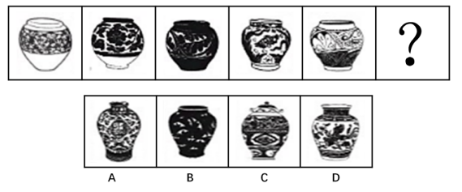

- **A**. A
- **B**. B　✅
- **C**. C
- **D**. D

**答案**：B

**官方解析**

本题考查图形的实际意义，寻找最大共同点。观察发现，题干所有图形都是瓶口颈宽大、较短且无盖，A项瓶口颈较细，C项瓶子有盖，D项瓶口颈较长，只有B项满足题干图形特征。
故正确答案为B。

---

### 第 14 题　qid 2172442 · 图形推理

请从所给的这几个选项中，选择最合适的一个填在问号处，使之呈现一定的规律性：

- **A**. A
- **B**. B
- **C**. C　✅
- **D**. D

**答案**：C

**官方解析**

题干图形均由小正方体叠加而成，考虑三视图。观察发现，题干图形的左视图均相同，只有C项的左视图与题干相同。
故正确答案为C。

---

### 第 15 题　qid 2172585 · 图形推理

从四个图中选出唯一的一项，填入问号处，使其呈现出一定的规律性。

- **A**. A　✅
- **B**. B
- **C**. C
- **D**. D

**答案**：A

**官方解析**

图形元素组成相同，优先考虑位置规律，但位置无明显规律。观察发现，每个图形中由两个元素组成，且这两个元素的箭头均指向相反方向且指向相背，故？号处图形中的两个元素的箭头也应该指向相反方向且指向相背。A项箭头指向相反方向，B项箭头指向相同方向，C项并非相反方向，D项箭头指向相反方向但指向相对，只有A项符合。
故正确答案为A。

---

### 第 16 题　qid 2172588 · 图形推理

从四个图中选出唯一的一项，填入问号处，使其呈现出一定的规律性。

- **A**. A　✅
- **B**. B
- **C**. C
- **D**. D

**答案**：A

**官方解析**

元素组成不相同且属性无明显规律，考虑数量规律。观察图形发现，题干展开图中出现多边形和单一直线，考虑数直线数。整体数直线无规律，考虑内外分开数。每幅图外部直线数分别为：6、5、4、4、5，内部直线数分别为：5、4、3、3、4，发现每幅图外部直线数-内部直线数=1，故？处也应该选择一个符合此规律的图形，只有A选项符合。
故正确答案为A。

---

### 第 17 题　qid 2172553 · 图形推理

下边四个图形中，只有一个是由上边的四个图形拼合（只能通过上、下、左、右平移）而成的，请把它找出来。

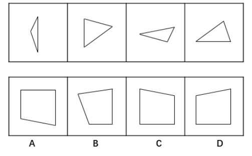

- **A**. A
- **B**. B
- **C**. C
- **D**. D　✅

**答案**：D

**官方解析**

本题考查平面拼合，可采用平行且等长相消的方式解题。消去平行且等长的线段后进行组合即可得到轮廓图，即为D项。

平行且等长相消的方式如下图所示：

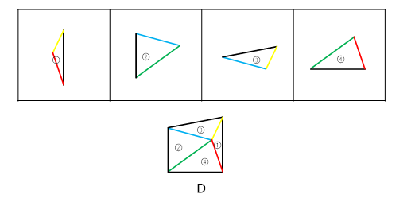

故正确答案为D。

---

### 第 18 题　qid 2172305 · 图形推理

下边四个图形中，只有一个是由上边的四个图形拼合（只能通过上、下、左、右平移）而成的，请把它找出来。

- **A**. A　✅
- **B**. B
- **C**. C
- **D**. D

**答案**：A

**官方解析**

本题考查平面拼合，可采用平行且等长相消的方式解题。消去平行且等长的线段后进行组合即可得到轮廓图，即为A选项。平行且等长相消的方式如下图所示：

故正确答案为A。

---

### 第 19 题　qid 2172380 · 图形推理

下边四个图形中，只有一个是由上边的四个图形拼合（只能通过上、下、左、右平移）而成的，请把它找出来。

- **A**. A
- **B**. B　✅
- **C**. C
- **D**. D

**答案**：B

**官方解析**

本题考查平面拼合，可采用平行且等长相消的方式解题。消去平行且等长的线段后进行组合即可得到轮廓图，即为B选项。平行且等长相消的方式如下图所示：

 

故正确答案为B。

---

### 第 20 题　qid 2172468 · 图形推理

选项四个图形中，只有一个是由题干的四个图形拼合（只能通过上、下、左、右平移）而成的，请把它找出来。

- **A**. A
- **B**. B
- **C**. C　✅
- **D**. D

**答案**：C

**官方解析**

本题考查平面拼合，可采用平行且等长相消的方式解题。消去平行且等长的线段后进行组合即可得到轮廓图，即为C项。平行且等长相消的方式如下图所示：

故正确答案为C。

---

### 第 21 题　qid 2172557 · 图形推理

下边四个图形中，只有一个是由上边的四个图形拼合（只能通过上、下、左、右平移）而成的，请把它找出来。

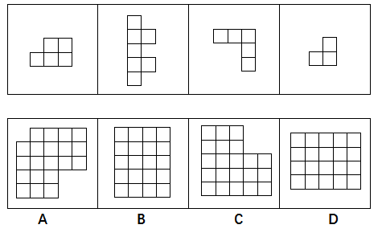

- **A**. A
- **B**. B　✅
- **C**. C
- **D**. D

**答案**：B

**官方解析**

本题考查平面拼合，可采用平行且等长相消的方式解题。优先考虑确定题干中第二个图形的位置，然后将平行且等长的其余部分进行组合，即可得到轮廓图，即为B项。

平行且等长的组合方式如下图所示：

故正确答案为B。

---

### 第 22 题　qid 2172562 · 图形推理

左边给定的是纸盒外表面的展开图，右边哪一项能由它折叠而成？请把它找出来。

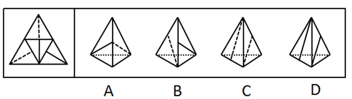

- **A**. A　✅
- **B**. B
- **C**. C
- **D**. D

**答案**：A

**官方解析**

本题考查四面体的空间重构。将平面图中的各面进行标号，如图1所示：

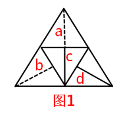

A项：由a面和c面组成，与题干展开图一致，当选；

B项：该项右侧的面为c面或d面，如果是c面，选项中实线和虚线没有交点，而题干展开图中有交点，与题干展开图不一致；如果是d面，选项中d面的实线垂直的公共边挨着的是虚线面，而题干展开图中挨着的是实线面（c面），与题干展开图不一致，该项错误，排除；

C项：该项由a面和b面组成，选项中两个面的虚线没有公共的顶点，而根据展开图中同一直线上的两条边是公共边，可知题干展开图中面a和面b虚线所在的顶点为同一个点，即两个面中的虚线是有公共的顶点，选项与题干展开图不一致，排除；

D项：该项由c面和d面组成，选项两个面中的直线均没有垂直于公共边，而题干展开图中d面中的直线垂直于公共边，与题干展开图不一致，排除。

故正确答案为A。

---

### 第 23 题　qid 2172567 · 图形推理

左边给定的是纸盒外表面的展开图，右边哪一项能由它折叠而成？请把它找出来。

- **A**. A
- **B**. B
- **C**. C　✅
- **D**. D

**答案**：C

**官方解析**

题干图形从左至右分别标上面a、b、c、d。

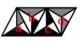

A项：选项左侧的面为无中生有的面（与题干的a面成镜面图形），选项与题干不一致，排除；

B项：选项右侧的面为无中生有的面（与题干d面成镜面图形），选项与题干不一致，排除；

C项：由面b和面a构成，与题干一致，当选；

D项：选项右侧的面为无中生有的面（与题干的b面成镜面图形），选项与题干不一致，排除。

故正确答案为C。

---

### 第 24 题　qid 2172569 · 图形推理

左边给定的是纸盒外表面的展开图，右边哪一项能由它折叠而成？请把它找出来。

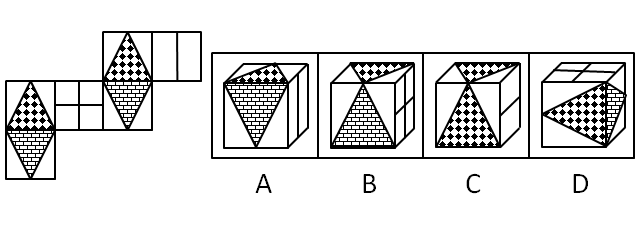

- **A**. A
- **B**. B
- **C**. C
- **D**. D　✅

**答案**：D

**官方解析**

本题为空间重构题目，用排除思维解题，题干图形标号如下图。

A项：选项侧面为面e，上面为面a或面d。若上面为面d，则选项中面e直线垂直于两面公共边，与题干不一致；若上面为面a，则如上图，以面a中三角形的底边开始顺时针画边，选项中边4挨着面e，而题干中边4挨着面b，与题干不一致，排除；

B项：选项中上面和前面可能是面a与面f，面d与面c，但题干中这两组相邻面的公共边都是两个三角形的底边，而选项中为两个三角形顶点相交，与题干不一致，排除；

C项：选项中侧面为面e，前面为面a或者面d。若前面为面d，则选项中面e直线垂直于两面公共边，与题干不一致；若前面为面a，则如上图，以面a中三角形的底边开始顺时针画边，选项中边4挨着面e，而展开图中边4挨着面b，与题干不一致，排除；

D项：与题干一致，当选。

故正确答案为D。

注：本题不太严谨，因为D项中右侧面里面的矩形方向与题干展开图并不一致，但是因为A、B、C三项相邻面都有明显的错误，所以本题择优选D项。

---

### 第 25 题　qid 2172377 · 图形推理

左边给定的是纸盒外表面的展开图，右边哪一项能由它折叠而成？请把它找出来。

- **A**. A
- **B**. B　✅
- **C**. C
- **D**. D

**答案**：B

**官方解析**

本题考查六面体的空间重构。将题干展开图中的面依次标注为面a、b、c、d、e、f，如下图：

A项：右侧“十”字的面在展开图中没有出现，属于无中生有的面，选项与题干展开图不一致，排除；

B项：选项的三个面分别是面c、面d、面f，选项与题干展开图一致，当选；

C项：选项的三个面分别是面c、面d、面f，如下图：

在题干展开图中，d面的小黑方块挨着f面的小格子方块，而在选项中，d面的小黑方块挨着f面的小白方块，选项与题干展开图不一致，排除；

D项：选项的三个面分别是面b、面c、面e，如下图：

其中，面c和面e为相对面，不可能同时出现，选项与题干展开图不一致，排除。

故正确答案为B。

---

### 第 26 题　qid 2172452 · 图形推理

从所给的四个选项中，选择最恰当的一个填入问号处，使之呈现一定的规律性。

- **A**. A
- **B**. B
- **C**. C　✅
- **D**. D

**答案**：C

**官方解析**

图形元素组成不同，优先考虑属性规律。九宫格优先按行看，第一行中，三幅图都是轴对称图形，并且对称轴的方向依次顺时针旋转，第二行与第一行规律相同，第三行也应该满足此规律，只有C项符合。

故正确答案为C。

---

### 第 27 题　qid 2172576 · 图形推理

从四个图中选出唯一的一项，填入问号处，使其呈现出一定的规律性。

- **A**. A
- **B**. B
- **C**. C
- **D**. D　✅

**答案**：D

**官方解析**

图形元素组成相似，优先考虑样式规律。九宫格优先按行看，第一行中，图一和图二先求异，然后逆时针旋转90°得到图三，第二行验证规律，与第一行规律相同，第三行也应该满足此规律，即“？”图形由图一和图二先求异，然后逆时针旋转90°得到，只有D选项符合。
故正确答案为D。

---

### 第 28 题　qid 2172453 · 逻辑判断

人们常说，读书可以增长知识、陶冶性情。有专家指出，读书还可以治病，特别是对于一些社会因素引起的心理疾病，如抑郁、压抑、恐慌、烦恼等，读书有很好的疗效。
以下哪项如果为真，最能支持上述专家的观点？

- **A**. 读书能够促使患者转变思维方式，提高认知能力，重新认识世界和认识自己
- **B**. 患者能够从阅读中有意无意获得情感上的认同和慰藉，释放内心的焦虑和不安　✅
- **C**. 汉代大学问家刘向十分重视读书的医疗作用，认为书犹药也，善读之可以医愚
- **D**. 阅读能使大脑中产生一种神经肽，可以增强细胞免疫力，有益于人的身体健康

**答案**：B

**官方解析**

第一步：找出论点和论据。
论点：读书可以治病，特别是对于一些社会因素引起的心理疾病，如抑郁、压抑、恐慌、烦恼等，读书有很好的疗效。
论据：无。
本题只有论点没有论据，加强优先考虑补充论据。
第二步：逐一分析选项。
A项：说的是读书能使患者转变思维，提高认知能力，重新认识世界和自己，与是否能治疗心理疾病无关，无关项，排除；
B项：说明患者能够从阅读中获得情感上的慰藉，释放内心的焦虑与不安，解释说明了阅读是如何治疗心理疾病的，补充论据加强，当选；
C项：指出汉代大学问家认为书犹药也，善读之可以医愚，是其个人观点，而且“医愚”无法说明读书能医治心理疾病，不能加强，排除； 
D项：说明阅读有益身体健康，增强人体免疫力，与是否能治疗心理疾病无关，无关项，排除。
故正确答案为B。

---

### 第 29 题　qid 2172579 · 逻辑判断

某机关甲、乙、丙、丁4个处室准备深入基层调研。他们准备调研的地方是红星乡、朝阳乡、永丰街道、幸福街道。每个处室恰好选择其中一个地方，各不重复。已知：
（1）要么甲选幸福街道，要么乙选幸福街道，两者必居其一；
（2）要么甲选红星乡，要么丙选永丰街道，两者必居其一；
（3）如果丙选永丰街道，则丁选幸福街道。
根据以上陈述，可以得出以下哪项？

- **A**. 甲选朝阳乡
- **B**. 乙选红星乡
- **C**. 丙选幸福街道
- **D**. 丁选永丰街道　✅

**答案**：D

**官方解析**

翻译题干条件：
（1）要么甲选幸福街道，要么乙选幸福街道
（2）要么甲选红星乡，要么丙选永丰街道
（3）丙选永丰街道→丁选幸福街道
优先从最大信息开始进行推理，题干条件里幸福街道出现最多，根据条件（1）可知，幸福街道只能是甲、乙其一选择。根据题干要求，每个处室选择一个地方而且各不重复，因此其他处室不能选择幸福街道，即丙、丁都没有选择幸福街道。
结合条件（3），丁不选幸福街道，是对于条件（3）的否后，否后必否前，可知，丙不选永丰街道；
由丙不选永丰街道，结合条件（2），可知，甲选红星乡，排除A项；
甲选红星乡，可得甲不选幸福街道，再结合条件（1），可知，乙选幸福街道，排除B项；
因各个科室选择地方各不重复，由乙选幸福街道可知丙不选幸福街道，排除C项；
甲选红星乡，乙选幸福街道，剩下朝阳和永丰由丙、丁选择，而由上述分析，丙不选永丰街道，故丙选朝阳乡，丁选永丰街道。 
故正确答案为D。

---

### 第 30 题　qid 2172394 · 类比推理

狗不嫌家贫，子不嫌母丑。爱自己家乡的人不会说家乡的坏话，张三就从不说家乡的坏话。可见，他是一个多么爱自己家乡的人啊！
以下哪项的推理方式与上述最为相似？

- **A**. 灯不挑不亮，话不挑不明。如果没有听到张处长这番话，我还在纠结要不要报名参加行业大赛，现在一切都清楚了。看来，张处长的话太重要了！
- **B**. 不入虎穴，焉得虎子？巨大的成功往往伴随着巨大的风险，李四投资股票获得高额回报。可见，他承担了多大的风险啊！
- **C**. 玉不琢不成器，人不学要落后。追求进步的人不会不爱学习的，王教授退休后一直无所事事，不爱学习。可见，王教授已不是一个追求进步的人了！
- **D**. 人不可貌相，海水不可斗量。一个有才能的人不会将他的才能显示出来，李先生就从来没有显示过他的才能。可见，他是一个多么有才能的人啊！　✅

**答案**：D

**官方解析**

第一步：分析题干的推理形式。

爱家乡说坏话，用张三举例，说坏话爱家乡。属于肯定箭头后推肯定箭头前的形式。

第二步：逐一分析选项。

A项：听张处长的话纠结，后半句为，纠结（现在一切都清楚了）张处长的话重要。属于否后推否前，与题干推理形式不同，排除；

B项：巨大的成功巨大的风险，用李四举例，巨大的成功（获得高额回报）巨大的风险。属于肯前推肯后，与题干推理形式不同，排除；

C项：追求进步爱学习，用王教授举例，爱学习追求进步。属于否后推否前，与题干推理形式不同，排除；

D项：有才能显示才能，用李先生举例，显示才能有才能，属于肯后推肯前。与题干推理形式相同，当选。

故正确答案为D。

---

### 第 31 题　qid 2172393 · 逻辑判断

为了减少温室气体排放，有效应对全球气候变暖，有些专家建议，应把燃树发电作为削减二氧化碳排放的策略。他们认为，树木比煤、天然气更具有“碳中性”，砍树燃树所产生的二氧化碳将会被在原地再次生长的树木吸收。
以下哪项如果为真，最能质疑上述专家的观点？

- **A**. 砍树之后及时栽树，新生的树木就会再次吸收空气中的碳，形成稳定的碳循环
- **B**. 燃树发电的政策建议一旦实施，可能会导致乱砍乱伐，加剧全球环境生态危机
- **C**. 碳循环的计算比较复杂，砍树燃树释放的碳与栽树重新吸收的碳可能并不相等
- **D**. 砍树燃树排放的碳要等到新栽树苗长大后才能被完全吸收，时间上存在滞后性　✅

**答案**：D

**官方解析**

第一步：找出论点和论据。
论点：应把燃树发电作为削减二氧化碳排放的策略。
论据：树木比煤、天然气更具有“碳中性”，砍树燃树所产生的二氧化碳将会被在原地再次生长的树木吸收。
第二步：逐一分析选项。
A项：新生树木吸收碳形成稳定碳循环，重复了论据的内容，补充论据进行加强，无法削弱，排除； 
B项：燃树发电会加剧生态危机，说的是燃树发电的不良后果，而题干所讨论的是燃树发电是否能削减二氧化碳排放，二者话题不一致，属于无关选项，无法削弱，排除；
C项：释放的碳和吸收的碳可能并不相等，那到底是释放的碳多还是吸收的碳多，并不明确，排除；
D项：碳在树苗长大后才会被完全吸收，时间上存在滞后性，说明至少对于树苗还没有长大的那段期间来说，还是存在排放更多的二氧化碳，不能削减二氧化碳的排放，能削弱，当选。
故正确答案为D。
【文段出处】《燃木发电？烧“木柴”环保吗？》

---

### 第 32 题　qid 2172396 · 逻辑判断

明知要早睡，却忍不住熬夜追剧；明知吸烟、酗酒有害健康，却挡不住烟酒的诱惑；明知运动有益，却一步都懒得走……生活中，很多人并不缺少健康常识，他们更多的是缺乏一种自律精神。自律的人都会早睡，都会忌口，都坚持运动。如果一个人坚守自律精神，就不会放纵自己，就能够维护自己的生理节律，过上健康幸福的生活。
根据以上陈述，可以得出以下哪项？

- **A**. 所有坚持运动的人都很自律
- **B**. 有的缺乏自律精神的人不缺少健康常识　✅
- **C**. 一个人如果不坚守自律精神，就会放纵自己
- **D**. 维护自己生理节律的人都能过上健康幸福的生活

**答案**：B

**官方解析**

第一步：翻译题干。

①有些人不缺乏健康常识缺乏自律精神；

②自律的人早睡；

③自律的人忌口；

④自律的人坚持运动；

⑤坚守自律精神-放纵自己；

⑥坚守自律精神维护生理节律；

⑦坚守自律精神过上健康生活。

第二步：逐一分析选项。

A项：翻译为坚持运动自律，对④肯后得不到确定性结论，无法推出，排除；

B项：翻译为有些缺乏自律的人不缺乏健康常识，等价于命题①：有些人不缺乏健康常识缺乏自律精神，可以推出，当选；

C项：翻译为-坚持自律放纵自己，对⑤否前得不到确定性结论，无法推出，排除；

D项：翻译为维护自己生理节律的人健康幸福生活，二者之间没有必然的逻辑关系，无法推出，排除。

故正确答案为B。

---

### 第 33 题　qid 2172760 · 逻辑判断

枫林湾是三文鱼产卵繁殖的理想河段。若下游有水电大坝，三文鱼就无法到这里繁殖了。只有枫林湾岸边的树都落光了叶子，三文鱼才会洄游到这里。如果看到许多海雕和棕熊在这片河湾聚集的景象，就会知道三文鱼洄游了。现在的枫林湾出现了很多洄游过来的三文鱼。
根据以上陈述，可以得出以下哪项？

- **A**. 枫林湾的下游建造了水电大坝
- **B**. 现在的枫林湾聚集了许多海雕和棕熊
- **C**. 枫林湾岸边的树叶掉光了　✅
- **D**. 海雕和棕熊以三文鱼为食

**答案**：C

**官方解析**

第一步：翻译题干。
①下游有水电大坝→三文鱼无法繁殖
②三文鱼洄游→枫林湾岸边的树落光了叶子
③海雕和棕熊→三文鱼洄游
④三文鱼洄游
第二步：逐一分析选项。
A项：④是对①的否后，否后必否前，可知没有水电大坝，该项无法推出，排除；
B项：④是对③的肯后，肯后得不到确定结论，所以不知道是否有许多海雕和棕熊，该项无法推出，排除；
C项：根据④可知，④是对②的肯前，肯前必肯后，可知枫林湾岸边的树叶掉光了，当选；
D项：题干未提及海雕和棕熊以三文鱼为食，无法推出。
故正确答案为C。

---

### 第 34 题　qid 2172770 · 逻辑判断

大多数人的饮食中都含有过量的脂肪。而食物中的脂肪主要以甘油三酯的形式存在在消化道中。脂肪酸被脂肪酶水解释放出来后，才能被吸收进入血液，重新合成甘油三酯。如果脂肪酶受到抑制，就能终止这一合成过程。对此，有研究者做了相关实验。他们将体重相当的雌性老鼠分成三组。第一组自由进食，第二组喂高脂饮食，第三组喂高脂饮食但在食物中添加了一种从茶叶中提取的“茶皂素”。结果发现，从第5周开始直至第10周实验结束时，第二组老鼠的体重就比第一组显著要高，但第三组和第一组相比却没有明显差异。由此，研究者们得出结论，茶皂素这种“天然产物”具有抑制脂肪酶的能力，人们喝茶的确能产生减肥效果。
以下哪项为真，最能对研究者们的上述结论提出质疑？

- **A**. 吃高脂饮食的老鼠，宫旁脂肪的重量大约是吃常规饮食的老鼠们的2倍
- **B**. 如果高脂饮食中加了茶皂素，则其宫旁脂肪就跟吃常规饮食的老鼠基本上一样
- **C**. 实验中使用的茶皂素量太大，按同样比例一般人一天至少需要饮用五公斤干茶叶　✅
- **D**. 老鼠和人的差异还是很大的，老鼠实验的结论对于人类只有一定的参考作用

**答案**：C

**官方解析**

第一步：找出论点和论据。
论点：茶皂素这种“天然产物”具有抑制脂肪酶的能力，人们喝茶的确能产生减肥效果。
论据：结果发现，从第5周开始直至第10周实验结束时，第二组老鼠的体重就比第一组显著要高，但第三组和第一组相比却没有明显差异。
第二步：逐一分析选项。
A项：在高脂饮食和常规饮食老鼠之间进行比较，前者宫旁脂肪的重量大约是后者的两倍，说明高脂饮食会增加宫旁脂肪的重量，此选项通过补充论据加强了题干论据，以佐证第二组老鼠的体重比第一组老鼠的体重要高，排除；
B项：高脂饮食中加了茶皂素与常规饮食的对比，宫旁脂肪基本一样，即第三组和第一组相比没有明显差异，此选项通过补充论据加强了题干论据，排除；
C项：此选项说明实验中的茶皂素的用量换算一般人后，至少一天需要饮用五公斤干茶叶，但是一般人不可能一天饮用五公斤干茶叶，说明题干中的实验是超剂量实验下得出的实验结果，由雌性老鼠的超剂量实验无法得出一般人的正常结论，即无法得出人们喝茶的确能产生减肥效果的结论，削弱了论证过程，当选；
D项：老鼠和人的差异很大以及老鼠实验的结论对于人类只有一定的参考作用，但是人喝茶是否有减肥效果并不明确，属于不明确选项，排除。
故正确答案为C。

---

### 第 35 题　qid 2172291 · 图形推理

以下是一个44的图形，共有16个小方格。每个小方格中均可填入一个词。要求图形的每行、每列均填入“爱国”“敬业”“诚信”“友善”4个词，不能重复，也不能遗漏。

根据以上信息，依次填入图形中①②③④处的4个词应是：

- **A**. 爱国、敬业、诚信、友善　✅
- **B**. 爱国、诚信、敬业、友善
- **C**. 诚信、友善、爱国、敬业
- **D**. 友善、爱国、敬业、诚信

**答案**：A

**官方解析**

题干信息确定，可用排除法解题。
根据方格第一列出现友善、诚信可知，①不能是友善和诚信，排除C、D两项；
根据方格第三列出现敬业可知，③不能是敬业，排除B项。
故正确答案为A。

---

### 第 36 题　qid 2172432 · 定义判断

田园综合体：指一种新型的集特色优势产业、休闲旅游、乡村社区为一体的跨产业、多功能的农业生产经营体系。
下列属于田园综合体的是：

- **A**. 某县刚刚落成的高科技农业园区中，万亩良田都装配了电子控制设施。园区附近还建有一个多功能老年公寓、十多个大型养生会馆
- **B**. 作为首批省级乡村旅游示范区，向阳村“农家乐”已经成了某镇的骄傲。每年春天，那里的万亩油菜花田都吸引着成千上万的外地游客
- **C**. 某乡打算在三年内建设成为现代化的新型乡村社区，没有高楼大厦，到处是小桥流水，服务配套设施齐全
- **D**. 某乡村经过数年努力，形成了绿色食品生产经营、游客餐饮住宿、湿地公园观光的产业链，山更青水更绿了，村民生活也更富足了　✅

**答案**：D

**官方解析**

第一步：找出定义关键词。
“集特色优势产业、休闲旅游、乡村社区为一体”、“跨产业、多功能的农业生产经营体系”。
第二步：逐一分析选项。
A项：高科技农业园区附近建设的老年公寓和养生会馆，不属于集特色优势产业、跨产业、多功能的农业生产经营体系，不符合定义，排除；
B项：向阳村“农家乐”通过油菜花吸引游客，只体现发展旅游业，是单一产业，不属于跨产业、多功能的农业生产经营体系，不符合定义，排除；
C项：建设新型乡村社区、服务配套设施齐全，没有体现农业生产以及不同产业，不属于跨产业、多功能的农业生产经营体系，不符合定义，排除；
D项：形成了绿色食品生产经营、游客餐饮住宿、湿地公园观光的产业链，涉及到食品行业和旅游业，属于跨产业、多功能的农业生产经营体系，符合定义，当选。
故正确答案为D。

---

### 第 37 题　qid 2172361 · 定义判断

院墙外正义：指对于不涉及自身利益的不良行为往往表现得义正辞严、充满正义；但是一旦涉及自身的利益，即使面对的是同样不良的行为，则往往采取完全不同的态度。
下列属于院墙外正义的是：

- **A**. 小赵正在家中看书，从院子外边传来激烈的争吵声。他冲出去一看，原来是隔壁夫妻在吵架。他赶紧回家打电话，请居委会派人来调解
- **B**. 张院长在学院会议上严厉批评个别老师上课迟到的现象，强调必须严肃处理。有人提起他上周迟到的事，他又补充了一句：凡事不能一概而论　✅
- **C**. 小陈担任部门经理以前，也像其他员工一样经常抱怨公司管理措施过于严苛。现在，他已经逐渐理解了管理部门的良苦用心
- **D**. 小李是某医学院大三学生，平时经常向周边的同学和朋友宣传义务献血的意义和好处，但自己却从来没有献过一次血

**答案**：B

**官方解析**

第一步：找出定义关键词。
“不涉及自身利益的不良行为往往表现得义正言辞、充满正义”、“一旦涉及自身利益，面对同样的不良行为，则往往采取完全不同的态度”。
第二步：逐一分析选项。
A项：小赵见隔壁夫妻吵架，打电话请居委会派人来调解，未涉及到自身利益的不良行为，表现充满正义，没有与涉及到自身利益时态度的对比，不符合定义，排除； 
B项：张院长对个别老师迟到的不良行为表现得义正言辞，而说到自己迟到时的态度截然不同，符合“一旦涉及自身利益，面对同样的不良行为，则往往采取完全不同的态度”，符合定义，当选；
C项：小陈担任部门经理前后对公司管理措施态度不一样，公司管理措施不属于不良行为，不符合定义，排除；
D项：义务献血不属于不良行为，不符合定义，排除。
故正确答案为B。

---

### 第 38 题　qid 2172476 · 定义判断

亲情经济：指商家利用人们对亲情关系的重视，在传统节日期间举行商业让利促销活动。
下列属于亲情经济的是：

- **A**. 某影楼在店庆3周年之际推出户外全家福拍摄优惠活动
- **B**. 某食品企业中秋节期间适当调高了礼盒装月饼的销售价格
- **C**. 某商场在儿童节前夕推出少儿服装、玩具对折优惠活动
- **D**. 重阳节期间许多商场的按摩椅、保健品都有不同程度的优惠　✅

**答案**：D

**官方解析**

第一步：找出定义关键词。
“商家”、“利用人们对亲情关系的重视”、“在传统节日期间”、“让利促销活动”。
第二步：逐一分析选项。
A项：店庆三周年，不属于传统节日，不符合定义，排除；
B项：提高月饼的销售价格，不属于让利促销活动，不符合定义，排除；
C项：儿童节，不属于传统节日，且是儿童节前夕推出优惠活动，也不符合在节日期间推出优惠活动，不符合定义，排除；
D项：重阳节，属于传统节日，按摩椅、保健品有不同程度的优惠，属于让利促销活动，且选择这些适合送给父母、长辈作为节日礼物的商品促销，属于利用人们对亲情关系的重视，符合定义，当选。
故正确答案为D。

---

### 第 39 题　qid 2172366 · 定义判断

主动补偿：指企业针对自己有瑕疵的产品或服务，主动向消费者做出经济补偿的行为。
下列属于主动补偿的是：

- **A**. 小王和几个同事在某火锅店消费时发现菜盘里有一只死苍蝇，就去找老板讨要说法，经过半个多小时的协商，老板终于同意免单并道歉
- **B**. 某高校食堂收到了学生关于饭菜质次量少、价格偏高的投诉，立即着手整改。三天后，食堂的饭菜质量有了明显提高，价格也有所下降
- **C**. 某公司发现，新近推出的一款手机在充电时发生爆炸，很快向社会公开承诺：用户可在30天内免费更换手机电池，邮寄费、路费等均由公司承担
- **D**. 老张上星期买了一辆摩托车，骑起来感觉很好。两天前，厂家突然通知他带着原始发票到指定修理厂更换电路控制器，还送给他200元加油卡　✅

**答案**：D

**官方解析**

第一步：找出定义关键词。
“企业”、“有瑕疵的产品或服务”、“主动向消费者做出经济补偿”。
第二步：逐一分析选项。
A项：消费者发现问题，找老板协商之后，老板同意免单，说明免单不是老板提出，不符合“主动向消费者做出经济补偿”，不符合定义，排除； 
B项：高校食堂不符合“企业”，降低价格不符合“主动向消费者做出经济补偿”，不符合定义，排除；
C项：手机充电发生爆炸符合“有瑕疵的产品或服务”，但是公司承诺免费更换电池以及承担邮寄费用和路费，不符合“经济补偿”，不符合定义，排除；
D项：厂家通知更换电路控制器，说明该控制器是有瑕疵的，符合 “有瑕疵的产品或服务”，送给老张200元的加油卡，符合“主动向消费者做出经济补偿”，符合定义，当选。
故正确答案为D。

---

### 第 40 题　qid 2172367 · 定义判断

人才逆流动：指原本在知名大城市工作的专业人士，主动选择到中小城市工作的人才流动现象。
下列属于人才逆流动的是：

- **A**. 小赵家乡的县城近年来经济发展迅猛，正在到处招聘有大城市工作背景的专业人才，反复考虑之后，小赵辞去北京某研究部门的工作回乡应聘成功　✅
- **B**. 高中毕业的小韩在深圳打拼多年，深感这里的工作机遇虽多，年收入也很可观，但竞争压力太大，有时力不从心，春节后他决定留在家乡创业
- **C**. 小黄在天津某大学桥梁设计专业取得硕士学位后，来到女友所在的小城市找了一份不错的工作，他和女友都很开心
- **D**. 80后白领小李在上海的一家金融机构总部任职，几天前决定跳槽到附近的一家保险公司，意外发现自己的这一决定与不少同事的选择不谋而合

**答案**：A

**官方解析**

第一步：找出定义关键词。
“由大城市到中小城市工作”、“专业人士”、“主动选择”。
第二步：逐一分析选项。
A项：北京到县城，符合“由大城市到中小城市工作”，辞去北京工作符合“主动选择”，符合定义，当选；
B项：高中毕业的小韩没有体现出“专业人士”，因竞争压力大、力不从心所以留在家乡创业，不符合“主动选择”，不符合定义，排除；
C项：在天津上学没有体现工作，不符合“由大城市到中小城市工作”，不符合定义，排除；
D项：从金融机构到附近的保险公司不符合“由大城市到中小城市工作”，不符合定义，排除。
故正确答案为A。

---

### 第 41 题　qid 2172376 · 定义判断

恶性抵制：指当事人在自身正当权利长时间受损，经过反复协商都无法解决的情况下采取的不文明、非理性、可能造成严重后果的抵制行为。
下列属于恶性抵制的是：

- **A**. 某小区业主无法忍受广场舞噪音，多次沟通未果后，集资26万元购买了俗称“高音炮”的扩音系统，天天对着广场循环播放汽车喇叭声　✅
- **B**. 老李承包的果园曾经多次被小偷光顾，为了避免更大的损失，他在几棵果树上缠上了铁丝并通上了电，从此果园再也没有被偷过
- **C**. 小区物业发现送快递的电瓶车车速过快，存在安全隐患，多次要求他们减速慢行，却收效甚微，于是禁止所有送快递的电瓶车进入小区
- **D**. 某小区长期受到“牛皮癣”广告的骚扰，于是购买了一款“呼死你”软件，挨个呼叫广告上的手机号码，很快就解决了这个老大难问题

**答案**：A

**官方解析**

第一步：找出定义关键词。
“当事人在自身正当权利长时间受损”、“反复协商都无法解决”、“采取的不文明、非理性、可能造成严重后果的抵制行为”。
第二步：逐一分析选项。
A项：无法忍受广场舞噪音体现了“自身正当权利长时间受损”，多次沟通体现了协商，集资购买“高音炮”扩音系统播放喇叭声符合“采取的不文明、非理性、可能造成严重后果的抵制行为”，符合定义，当选； 
B项：老李缠上铁丝并未跟小偷沟通，不符合“反复协商”，不符合定义，排除；
C项：电瓶车车速快存在安全隐患，只是隐患，未对他人权利造成损害，不符合“当事人在自身正当权利长时间受损”，不符合定义，排除；
D项：小区受到骚扰后直接购买“呼死你”软件解决问题，未体现“反复协商”，不符合定义，排除。
故正确答案为A。

---

### 第 42 题　qid 2172378 · 定义判断

中介后遗症：指用户接受中介机构的服务后，个人信息被泄露到其他机构而长时间遭到骚扰的现象。
下列属于中介后遗症的是：

- **A**. 小陈在商场购买了一台空调，销售商把小陈的信息通报给了厂家。小陈多次接到询问安装时间及地点的电话，后来又经常接到空调使用情况的回访电话
- **B**. 小蔡在某房地产开发公司买了一套住房，随后就经常接到装修公司询问是否需要家装的电话，小蔡暂时不打算装修，非常反感这些来电
- **C**. 小张通过一家猎头公司找到了满意的工作，但接下来的几个月里每天还会接到一些来路不明的电话，向他推荐“待遇优厚、时间灵活、任务轻松”的工作　✅
- **D**. 老王挂号就医时遇到了自称认识名医的丁某，在看过丁某推荐的名医后，病情未见好转，便不再理会丁某，也不再接丁某的骚扰电话

**答案**：C

**官方解析**

第一步：找出定义关键词。
“用户接受中介机构的服务后，个人信息被泄露到其他机构而长时间遭到骚扰”。
第二步：逐一分析选项。
A项：“小陈接到询问安装时间及地点的电话和空调使用情况回访电话”并非骚扰电话，而是正常的安装和使用回访电话，且并未体现“长时间骚扰”，不符合定义，排除； 
B项：小蔡在某房地产开发公司购买住房后，就经常收到装修公司询问是否装修的电话，但“房地产开发公司”并非中介机构，不符合定义，排除；
C项：小张在通过一家猎头公司找到工作后，接下来的几个月时间每天都会接到工作推荐电话，说明小张受到了长时间的骚扰，“来路不明的电话”说明小张的个人信息遭到了泄露，符合定义，当选；
D项：“老王在看过丁某推荐的名医后，病情未见好转，而老王也不接丁某的电话”，并未体现个人信息被泄露到其他机构，不符合定义，排除。
故正确答案为C。

---

### 第 43 题　qid 2172365 · 定义判断

副驾驶法则：指坐在驾驶员旁边的人往往喜欢按照自己的经验，对驾驶过程进行指点、评论。泛指旁观者根据个人实践经验指点他人完成操作过程的言行或心态。
下列属于副驾驶法则的是：

- **A**. 老李一上车，教练就打开了驾驶训练语音提示系统：“请系好安全带”“请松开手刹”……老李边操作边观察教练表情
- **B**. 小张乘出租车时总喜欢坐在前排，与驾驶员聊天南地北的段子，还时不时对路上其他司机的驾驶水平评头论足
- **C**. 夏天的市民广场，最热闹的就是下象棋了。每张棋桌旁都围站着一圈圈的棋迷，对弈双方的每步棋都被大家指指点点　✅
- **D**. 冯经理将人事调整初步方案呈报董事长审阅，董事长翻看后圈了几个人，并向他交待了几句，让他拿回去重新修改

**答案**：C

**官方解析**

第一步：找出定义关键词。
“根据个人实践经验”、“指点他人完成操作过程的言行或心态”。
第二步：逐一分析选项。
A项：教练打开语音提示系统，不符合“个人实践经验”，不符合定义，排除； 
B项：小张对其他司机的驾驶水平进行评论，并不是对所乘坐的出租车驾驶员的驾驶操作进行指点，不符合“指点他人完成操作过程的言行或心态”，不符合定义，排除；
C项：对弈过程符合“完成操作过程”，每步棋被指指点点符合“指点他人完成操作过程的言行或心态”，符合定义，当选；
D项：董事长在审阅后交待几句，对方案结果的评论，不符合“完成操作过程”，不符合定义，排除。
故正确答案为C。

---

### 第 44 题　qid 2172386 · 定义判断

语音融合：指在完全不自觉的情况下，频繁交流的两人口音逐渐趋同的现象。
下列属于语音融合的是：

- **A**. 楼先生旅居海外多年，很少使用中文，更不用说家乡话了。一次晚宴上遇到了一个老乡，一句“烂糊面”勾起了差不多早已忘光的乡音，两人用家乡话整整聊了一夜
- **B**. 老张夫妇结婚十多年了，家里的饮食习惯已经分不清南北，就连张先生的东北腔也几乎失去了原先的味道，妻子的广东话听起来也变得怪怪的，女儿经常取笑他们是真正的“夫唱妇随”　✅
- **C**. 朱女士的汉语口语课深受留学生喜爱，不仅发音标准、语调柔美，还时不时地在课堂上讲一些有趣的小段子。不到半年时间，大多数学员都能学着她的腔调进行日常会话
- **D**. 小黄来到南方某海滨小城工作后，每天坚持收看当地的方言电视节目，模仿播音员的发音。半年之后，她的语调、语气、用词，听起来就像一个土生土长的当地居民

**答案**：B

**官方解析**

第一步：找出定义关键词。
“在完全不自觉的情况下”、“频繁交流的两人口音逐渐趋同”。
第二步：逐一分析选项。
A项：楼先生旅居海外多年，很少使用中文，一句“烂糊面”勾起了乡音的记忆，说明有意识地参与，不属于“在完全不自觉的情况下”，同时与老乡用家乡话畅聊，说明二人口音相同，不属于“频繁交流的两人口音逐渐趋同”，不符合定义，排除；
B项：老张夫妇结婚十多年，二人的口音都发生了变化，夫妻之间的交流是频繁的，属于“频繁交流的两人口音逐渐趋同”，同时根据家里的饮食习惯已经分不清南北，可以判断出，习惯的养成是潜移默化的，属于“在完全不自觉的情况下”，符合定义，当选；
C项：学生上课跟着朱女士学习汉语口语，学习这一行为，不属于“在完全不自觉的情况下”，同时，学生只是学会了她的腔调，不属于“频繁交流的两人口音逐渐趋同”，不符合定义，排除；
D项：小黄坚持学习和模仿播音员的发音，不属于“在完全不自觉的情况下”，不符合定义，排除。
故正确答案为B。

---

### 第 45 题　qid 2172384 · 定义判断

数码技术后遗症：指由于过度使用、依赖数码产品而导致的记忆力衰退或认知能力降低现象。
下列属于数码技术后遗症的是：

- **A**. 小朱方位感很好，以前开车从不用导航仪，自从装上导航仪后，就一天也离不开它了。昨晚导航仪出了故障，本来15分钟的车程他整整开了两个小时　✅
- **B**. 六十多岁的丁先生记忆力越来越差，不少曾经滚瓜烂熟的文献材料现在已经记不清楚了，经常需要用手机检索核实相关内容
- **C**. 小李和几个朋友周末一起去网吧玩了个通宵。第二天早上刚走出网吧的时候，觉得路边的行人都是模模糊糊的
- **D**. 张女士多次听朋友说手机上也可以直接购买理财产品，就下载了一个理财APP，不料上了钓鱼网站，被骗了3万多元

**答案**：A

**官方解析**

第一步：找出定义关键词。
“由于过度使用、依赖数码产品”、“导致的记忆力衰退或认知能力降低”。
第二步：逐一分析选项。
A项：小朱开车离不开导航仪，属于“过度使用、依赖数码产品”，导航仪故障之后本来15分钟的车程开了两个小时，说明失去导航仪后不熟悉路况等，方位感减弱，属于“记忆力衰退或认知能力降低”，而二者之间正好存在因果联系，即由于依赖数码产品，才导致的方位感减弱，符合定义，当选； 
B项：丁先生记忆力越来越差是上了年纪的缘故，并非是由于“过度使用、依赖数码产品”导致的，不符合定义，排除；
C项：小李和朋友去网吧通宵属于“过度使用数码产品”，但是第二天早上觉得行人是模糊的，只是视觉上的模糊，仍然可以辨识出行人等，不属于“记忆力衰退或认知能力降低”，不符合定义，排除；
D项：张女士通过手机购买理财产品被骗，不属于“由于过度使用、依赖数码产品”，也不属于“导致的记忆力衰退或认知能力降低”，不符合定义，排除。
故正确答案为A。

---
